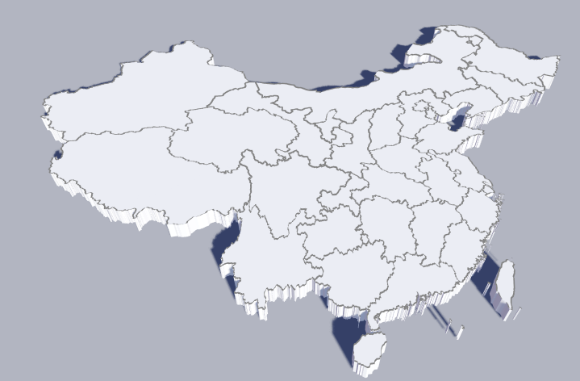
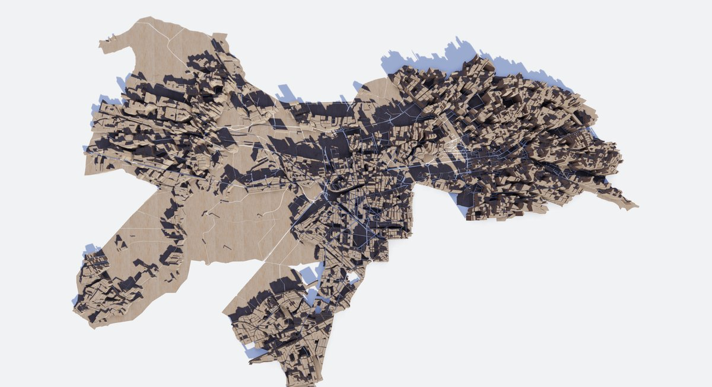
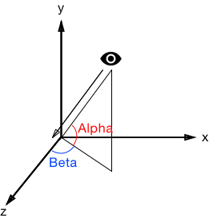

# option-gl.geo3D

## show
- **Type**: `boolean`
- **Default**: `true`

Whether to display 3D geographic coordinate system components.

## map
- **Type**: `string`

The map type. The map type used in ECharts-gl is the same as the [geo](https://echarts.apache.org/en/option.html#geo.map) component.

EChart provides map data in two formats. One is the JS file that can be imported directly through the script tag. After it is introduced, the map name and data will be automatically registered. Another is the JSON file that needs to be registered manually after loaded asynchronously by AJAX.

Here are two types of use examples:

**JavaScript Introduction Example**

```
<script src="echarts.js"></script>
<script src="map/js/china.js"></script>
<script>
var chart = echarts.init(document.getElementById('main'));
chart.setOption({
    series: [{
        type: 'map',
        map: 'china'
    }]
});
</script>
```

**JSON Introduction Example**

```
$.get('map/json/china.json', function (chinaJson) {
    echarts.registerMap('china', chinaJson);
    var chart = echarts.init(document.getElementById('main'));
    chart.setOption({
        series: [{
            type: 'map',
            map: 'china'
        }]
    });
});
```

ECharts uses the data in \[geoJSON\] ([http://geojson.org/](http://geojson.org/)) format as the outline of the map. In addition, you can also obtain data in \[geoJSON\] ([http://geojson.org/](http://geojson.org/)) format of the map by other means and register it in ECharts.

## boxWidth
- **Type**: `number`
- **Default**: `100`

A 3D geographic coordinate system component width in a 3D scene. With [viewControl.distance](option-gl.geo3D.md#viewControl.distance) you can get the most appropriate display size.

The following image is a schematic diagram of `boxWidth`, `boxHeight`, `boxDepth`, `regionHeight` in A 3D geographic coordinate system component.


## boxHeight
- **Type**: `number`
- **Default**: `10`

A 3D geographic coordinate system component height in a 3D scene.

Component height. This height contains the height of the bar and scatter on a 3D map.

## boxDepth
- **Type**: `number`
- **Default**: `auto`

A 3D geographic coordinate system component depth in a 3D scene.

The component depth defaults to automatic, ensuring that the scale of the 3D component is the same as the ratio of the input GeoJSON.

## regionHeight
- **Type**: `number`
- **Default**: `3`

The height of each area of the 3D map. This height is the height of the model, less than [boxHeight](option-gl.geo3D.md#boxHeight). `boxHeight - regionHeight` will be used for the display of 3D bar, 3D scatter, and etc.

## environment
- **Type**: `string`
- **Default**: `'auto'`

Environment map. Support for solid colors, gradual colors, URL of panoramic texture. The default is `'auto'`, which is used as the environment texture when [light.ambientCubemap.texture](option-gl.geo3D.md#light.ambientCubemap.texture) is configured. Otherwise, the environment texture is not displayed.

Example:

```
// Configure as a panoramic texture
environment: 'asset/starfield.jpg'
// Configured as a solid black background
environment: '#000'
// Configured as a background with a vertical gradient
environment: new echarts.graphic.LinearGradient(0, 0, 0, 1, [{
  offset: 0, color: '#00aaff' // Sky color
}, {
  offset: 0.7, color: '#998866' // Ground color
}, {
  offset: 1, color: '#998866' // Ground color
}], false)

```

## groundPlane
- **Type**: `Object`

The ground allows the entire assembly to be “placed” to make the entire scene look more realistic.

`groundPlane` supports setting up separate `realisticMaterial`, `colorMaterial`, `lambertMaterial` and other materials. If not set, the material parameters of the component are taken by default.

### groundPlane.show
- **Type**: `boolean`
- **Default**: `false`

Whether to display the ground.

### groundPlane.color
- **Type**: `string`
- **Default**: `'#aaa'`

The color of the ground.

## instancing
- **Type**: `boolean`
- **Default**: `false`

`instancing` will merge all the [geometry](http://geojson.org/geojson-spec.html#geometry-objects) in GeoJSON into one. When GeoJSON has a lot of (thousands) [geometry](http://geojson.org/geojson-spec.html#geometry-objects), it can effectively improve drawing efficiency.

## label
- **Type**: `Object`

The setting of the label.

### label.show
- **Type**: `boolean`
- **Default**: `false`

Whether to show the label.

### label.distance
- **Type**: `number`

Distance to the host graphic element.

The distance from the label to the graphic. In a 3D Scatter, this distance is the pixel value of the screen space. In other figures, this distance is the relative 3D distance.

### label.formatter
- **Type**: `Function|string`

The formatter of the label content, which supports the string template and the callback function. In either form, `\n` is supported to represent a new line.

**String template:**

The model variation includes:

*   `{a}`: series name.
*   `{b}`: the name of a data item.
*   `{c}`: the value of a data item.

**Example:**

```
formatter: '{b}: {c}'
```

**Callback function:** Callback function is in form of:

```
(params: Object|Array) => string
```

The `params` is the single data set needed by formatter, which is formed as:

```
{
    componentType: 'series',
    // Series type
    seriesType: string,
    // Series index in option.series
    seriesIndex: number,
    // Series name
    seriesName: string,
    // Data name, or category name
    name: string,
    // Data index in input data array
    dataIndex: number,
    // Original data as input
    data: Object,
    // Value of data. In most series it is the same as data.
    // But in some series it is some part of the data (e.g., in map, radar)
    value: number|Array|Object,
    // encoding info of coordinate system
    // Key: coord, like ('x' 'y' 'radius' 'angle')
    // value: Must be an array, not null/undefined. Contain dimension indices, like:
    // {
    //     x: [2] // values on dimension index 2 are mapped to x axis.
    //     y: [0] // values on dimension index 0 are mapped to y axis.
    // }
    encode: Object,
    // dimension names list
    dimensionNames: Array<String>,
    // data dimension index, for example 0 or 1 or 2 ...
    // Only work in `radar` series.
    dimensionIndex: number,
    // Color of data
    color: string,

}
```

Note: the usage of encode and dimensionNames can be:

If data is:

```
dataset: {
    source: [
        ['Matcha Latte', 43.3, 85.8, 93.7],
        ['Milk Tea', 83.1, 73.4, 55.1],
        ['Cheese Cocoa', 86.4, 65.2, 82.5],
        ['Walnut Brownie', 72.4, 53.9, 39.1]
    ]
}
```

We can get values that corresponding to y axis by:

```
params.value[params.encode.y[0]]
```

If data is:

```
dataset: {
    dimensions: ['product', '2015', '2016', '2017'],
    source: [
        {product: 'Matcha Latte', '2015': 43.3, '2016': 85.8, '2017': 93.7},
        {product: 'Milk Tea', '2015': 83.1, '2016': 73.4, '2017': 55.1},
        {product: 'Cheese Cocoa', '2015': 86.4, '2016': 65.2, '2017': 82.5},
        {product: 'Walnut Brownie', '2015': 72.4, '2016': 53.9, '2017': 39.1}
    ]
}
```

We can get values that corresponding to y axis by:

```
params.value[params.dimensionNames[params.encode.y[0]]]
```

### label.textStyle
- **Type**: `Object`

The font style of the label.

#### label.textStyle.color
- **Type**: `string`
- **Default**: `"#fff"`

The Color of the text.

#### label.textStyle.borderWidth
- **Type**: `number`
- **Default**: `0`

The border width of the text.

#### label.textStyle.borderColor
- **Type**: `string`
- **Default**: `#fff`

The border color of the text.

#### label.textStyle.fontFamily
- **Type**: `string`
- **Default**: `'sans-serif'`

The font family of the text.

#### label.textStyle.fontSize
- **Type**: `number`
- **Default**: `12`

The font size of the text.

#### label.textStyle.fontWeight
- **Type**: `string`
- **Default**: `normal`

The font thick weight of the text.

**Optional:**

*   `'normal'`
*   `'bold'`
*   `'bolder'`
*   `'lighter'`
*   100 | 200 | 300 | 400...

## itemStyle
- **Type**: `Object`

Visual properties of 3D graphics in A 3D geographic coordinate system component, including color, transparency, strokes, etc.

### itemStyle.color
- **Type**: `string|Function`
- **Default**: `adaptive`

The color of the graphic.

```
// pure white
[1, 1, 1, 1]
```

When using an array representation, each channel can set a value greater than 1 to represent the color value of HDR.

### itemStyle.opacity
- **Type**: `number`
- **Default**: `1`

The opacity of the graphic.

### itemStyle.borderWidth
- **Type**: `number`
- **Default**: `0`

The width of the border. With the border, you can distinguish each area more clearly. As shown below:



### itemStyle.borderColor
- **Type**: `string`
- **Default**: `#333`

The color of the border.

## emphasis
- **Type**: `Object`

Graphic and label styles when mouse hover is highlighted.

#### emphasis.label.show
- **Type**: `boolean`
- **Default**: `false`

Whether to show the label.

#### emphasis.label.distance
- **Type**: `number`
- **Default**: `2`

Distance to the host graphic element.

The distance from the label to the graphic. In a 3D Scatter, this distance is the pixel value of the screen space. In other figures, this distance is the relative 3D distance.

#### emphasis.label.formatter
- **Type**: `Function|string`

The formatter of the label content, which supports the string template and the callback function. In either form, `\n` is supported to represent a new line.

**String template:**

The model variation includes:

*   `{a}`: series name.
*   `{b}`: the name of a data item.
*   `{c}`: the value of a data item.

**Example:**

```
formatter: '{b}: {c}'
```

**Callback function:** Callback function is in form of:

```
(params: Object|Array) => string
```

The `params` is the single data set needed by formatter, which is formed as:

```
{
    componentType: 'series',
    // Series type
    seriesType: string,
    // Series index in option.series
    seriesIndex: number,
    // Series name
    seriesName: string,
    // Data name, or category name
    name: string,
    // Data index in input data array
    dataIndex: number,
    // Original data as input
    data: Object,
    // Value of data. In most series it is the same as data.
    // But in some series it is some part of the data (e.g., in map, radar)
    value: number|Array|Object,
    // encoding info of coordinate system
    // Key: coord, like ('x' 'y' 'radius' 'angle')
    // value: Must be an array, not null/undefined. Contain dimension indices, like:
    // {
    //     x: [2] // values on dimension index 2 are mapped to x axis.
    //     y: [0] // values on dimension index 0 are mapped to y axis.
    // }
    encode: Object,
    // dimension names list
    dimensionNames: Array<String>,
    // data dimension index, for example 0 or 1 or 2 ...
    // Only work in `radar` series.
    dimensionIndex: number,
    // Color of data
    color: string,

}
```

Note: the usage of encode and dimensionNames can be:

If data is:

```
dataset: {
    source: [
        ['Matcha Latte', 43.3, 85.8, 93.7],
        ['Milk Tea', 83.1, 73.4, 55.1],
        ['Cheese Cocoa', 86.4, 65.2, 82.5],
        ['Walnut Brownie', 72.4, 53.9, 39.1]
    ]
}
```

We can get values that corresponding to y axis by:

```
params.value[params.encode.y[0]]
```

If data is:

```
dataset: {
    dimensions: ['product', '2015', '2016', '2017'],
    source: [
        {product: 'Matcha Latte', '2015': 43.3, '2016': 85.8, '2017': 93.7},
        {product: 'Milk Tea', '2015': 83.1, '2016': 73.4, '2017': 55.1},
        {product: 'Cheese Cocoa', '2015': 86.4, '2016': 65.2, '2017': 82.5},
        {product: 'Walnut Brownie', '2015': 72.4, '2016': 53.9, '2017': 39.1}
    ]
}
```

We can get values that corresponding to y axis by:

```
params.value[params.dimensionNames[params.encode.y[0]]]
```

#### emphasis.label.textStyle
- **Type**: `Object`

The font style of the label.

##### emphasis.label.textStyle.color
- **Type**: `string`
- **Default**: `#000`

The Color of the text.

##### emphasis.label.textStyle.borderWidth
- **Type**: `number`
- **Default**: `1`

The border width of the text.

##### emphasis.label.textStyle.borderColor
- **Type**: `string`
- **Default**: `#fff`

The border color of the text.

##### emphasis.label.textStyle.fontFamily
- **Type**: `string`
- **Default**: `'sans-serif'`

The font family of the text.

##### emphasis.label.textStyle.fontSize
- **Type**: `number`
- **Default**: `20`

The font size of the text.

##### emphasis.label.textStyle.fontWeight
- **Type**: `string`
- **Default**: `normal`

The font thick weight of the text.

**Optional:**

*   `'normal'`
*   `'bold'`
*   `'bolder'`
*   `'lighter'`
*   100 | 200 | 300 | 400...

#### emphasis.itemStyle.color
- **Type**: `string`
- **Default**: `adaptive`

The color of the graphic.

```
// pure white
[1, 1, 1, 1]
```

When using an array representation, each channel can set a value greater than 1 to represent the color value of HDR.

#### emphasis.itemStyle.opacity
- **Type**: `number`
- **Default**: `1`

The opacity of the graphic.

## regions
- **Type**: `Array`

The setting of the map area.

### regions.name
- **Type**: `string`

The name of the corresponding map area, such as `'Guangdong'`, `'Zhejiang'`.

### regions.regionHeight
- **Type**: `number`

The height of the area. Different heights can be set to express the size of the data. When GeoJSON is the data of the building, this value can also be used to represent the approximate height. As shown below：



### regions.itemStyle
- **Type**: `Object`

Style settings for a single area.

#### regions.itemStyle.color
- **Type**: `string`
- **Default**: `adaptive`

The color of the graphic.

```
// pure white
[1, 1, 1, 1]
```

When using an array representation, each channel can set a value greater than 1 to represent the color value of HDR.

#### regions.itemStyle.opacity
- **Type**: `number`
- **Default**: `1`

The opacity of the graphic.

#### regions.itemStyle.borderWidth
- **Type**: `number`
- **Default**: `0`

The width of the border. With the border, you can distinguish each area more clearly. As shown below:


#### regions.itemStyle.borderColor
- **Type**: `string`
- **Default**: `#333`

The color of the border.

### regions.label
- **Type**: `Object`

Label settings for a single area.

#### regions.label.show
- **Type**: `boolean`
- **Default**: `false`

Whether to show the label.

#### regions.label.distance
- **Type**: `number`
- **Default**: `2`

Distance to the host graphic element.

The distance from the label to the graphic. In a 3D Scatter, this distance is the pixel value of the screen space. In other figures, this distance is the relative 3D distance.

#### regions.label.formatter
- **Type**: `Function|string`

The formatter of the label content, which supports the string template and the callback function. In either form, `\n` is supported to represent a new line.

**String template:**

The model variation includes:

*   `{a}`: series name.
*   `{b}`: the name of a data item.
*   `{c}`: the value of a data item.

**Example:**

```
formatter: '{b}: {c}'
```

**Callback function:** Callback function is in form of:

```
(params: Object|Array) => string
```

The `params` is the single data set needed by formatter, which is formed as:

```
{
    componentType: 'series',
    // Series type
    seriesType: string,
    // Series index in option.series
    seriesIndex: number,
    // Series name
    seriesName: string,
    // Data name, or category name
    name: string,
    // Data index in input data array
    dataIndex: number,
    // Original data as input
    data: Object,
    // Value of data. In most series it is the same as data.
    // But in some series it is some part of the data (e.g., in map, radar)
    value: number|Array|Object,
    // encoding info of coordinate system
    // Key: coord, like ('x' 'y' 'radius' 'angle')
    // value: Must be an array, not null/undefined. Contain dimension indices, like:
    // {
    //     x: [2] // values on dimension index 2 are mapped to x axis.
    //     y: [0] // values on dimension index 0 are mapped to y axis.
    // }
    encode: Object,
    // dimension names list
    dimensionNames: Array<String>,
    // data dimension index, for example 0 or 1 or 2 ...
    // Only work in `radar` series.
    dimensionIndex: number,
    // Color of data
    color: string,

}
```

Note: the usage of encode and dimensionNames can be:

If data is:

```
dataset: {
    source: [
        ['Matcha Latte', 43.3, 85.8, 93.7],
        ['Milk Tea', 83.1, 73.4, 55.1],
        ['Cheese Cocoa', 86.4, 65.2, 82.5],
        ['Walnut Brownie', 72.4, 53.9, 39.1]
    ]
}
```

We can get values that corresponding to y axis by:

```
params.value[params.encode.y[0]]
```

If data is:

```
dataset: {
    dimensions: ['product', '2015', '2016', '2017'],
    source: [
        {product: 'Matcha Latte', '2015': 43.3, '2016': 85.8, '2017': 93.7},
        {product: 'Milk Tea', '2015': 83.1, '2016': 73.4, '2017': 55.1},
        {product: 'Cheese Cocoa', '2015': 86.4, '2016': 65.2, '2017': 82.5},
        {product: 'Walnut Brownie', '2015': 72.4, '2016': 53.9, '2017': 39.1}
    ]
}
```

We can get values that corresponding to y axis by:

```
params.value[params.dimensionNames[params.encode.y[0]]]
```

#### regions.label.textStyle
- **Type**: `Object`

The font style of the label.

##### regions.label.textStyle.color
- **Type**: `string`
- **Default**: `#000`

The Color of the text.

##### regions.label.textStyle.borderWidth
- **Type**: `number`
- **Default**: `1`

The border width of the text.

##### regions.label.textStyle.borderColor
- **Type**: `string`
- **Default**: `#fff`

The border color of the text.

##### regions.label.textStyle.fontFamily
- **Type**: `string`
- **Default**: `'sans-serif'`

The font family of the text.

##### regions.label.textStyle.fontSize
- **Type**: `number`
- **Default**: `20`

The font size of the text.

##### regions.label.textStyle.fontWeight
- **Type**: `string`
- **Default**: `normal`

The font thick weight of the text.

**Optional:**

*   `'normal'`
*   `'bold'`
*   `'bolder'`
*   `'lighter'`
*   100 | 200 | 300 | 400...

### regions.emphasis
- **Type**: `Object`

Setting the highlight for labels and styles for a single area.

##### regions.emphasis.itemStyle.color
- **Type**: `string`
- **Default**: `adaptive`

The color of the graphic.

```
// pure white
[1, 1, 1, 1]
```

When using an array representation, each channel can set a value greater than 1 to represent the color value of HDR.

##### regions.emphasis.itemStyle.opacity
- **Type**: `number`
- **Default**: `1`

The opacity of the graphic.

##### regions.emphasis.itemStyle.borderWidth
- **Type**: `number`
- **Default**: `0`

The width of the border. With the border, you can distinguish each area more clearly. As shown below:


##### regions.emphasis.itemStyle.borderColor
- **Type**: `string`
- **Default**: `#333`

The color of the border.

##### regions.emphasis.label.show
- **Type**: `boolean`
- **Default**: `false`

Whether to show the label.

##### regions.emphasis.label.distance
- **Type**: `number`
- **Default**: `2`

Distance to the host graphic element.

The distance from the label to the graphic. In a 3D Scatter, this distance is the pixel value of the screen space. In other figures, this distance is the relative 3D distance.

##### regions.emphasis.label.formatter
- **Type**: `Function|string`

The formatter of the label content, which supports the string template and the callback function. In either form, `\n` is supported to represent a new line.

**String template:**

The model variation includes:

*   `{a}`: series name.
*   `{b}`: the name of a data item.
*   `{c}`: the value of a data item.

**Example:**

```
formatter: '{b}: {c}'
```

**Callback function:** Callback function is in form of:

```
(params: Object|Array) => string
```

The `params` is the single data set needed by formatter, which is formed as:

```
{
    componentType: 'series',
    // Series type
    seriesType: string,
    // Series index in option.series
    seriesIndex: number,
    // Series name
    seriesName: string,
    // Data name, or category name
    name: string,
    // Data index in input data array
    dataIndex: number,
    // Original data as input
    data: Object,
    // Value of data. In most series it is the same as data.
    // But in some series it is some part of the data (e.g., in map, radar)
    value: number|Array|Object,
    // encoding info of coordinate system
    // Key: coord, like ('x' 'y' 'radius' 'angle')
    // value: Must be an array, not null/undefined. Contain dimension indices, like:
    // {
    //     x: [2] // values on dimension index 2 are mapped to x axis.
    //     y: [0] // values on dimension index 0 are mapped to y axis.
    // }
    encode: Object,
    // dimension names list
    dimensionNames: Array<String>,
    // data dimension index, for example 0 or 1 or 2 ...
    // Only work in `radar` series.
    dimensionIndex: number,
    // Color of data
    color: string,

}
```

Note: the usage of encode and dimensionNames can be:

If data is:

```
dataset: {
    source: [
        ['Matcha Latte', 43.3, 85.8, 93.7],
        ['Milk Tea', 83.1, 73.4, 55.1],
        ['Cheese Cocoa', 86.4, 65.2, 82.5],
        ['Walnut Brownie', 72.4, 53.9, 39.1]
    ]
}
```

We can get values that corresponding to y axis by:

```
params.value[params.encode.y[0]]
```

If data is:

```
dataset: {
    dimensions: ['product', '2015', '2016', '2017'],
    source: [
        {product: 'Matcha Latte', '2015': 43.3, '2016': 85.8, '2017': 93.7},
        {product: 'Milk Tea', '2015': 83.1, '2016': 73.4, '2017': 55.1},
        {product: 'Cheese Cocoa', '2015': 86.4, '2016': 65.2, '2017': 82.5},
        {product: 'Walnut Brownie', '2015': 72.4, '2016': 53.9, '2017': 39.1}
    ]
}
```

We can get values that corresponding to y axis by:

```
params.value[params.dimensionNames[params.encode.y[0]]]
```

##### regions.emphasis.label.textStyle
- **Type**: `Object`

The font style of the label.

###### regions.emphasis.label.textStyle.color
- **Type**: `string`
- **Default**: `#000`

The Color of the text.

###### regions.emphasis.label.textStyle.borderWidth
- **Type**: `number`
- **Default**: `1`

The border width of the text.

###### regions.emphasis.label.textStyle.borderColor
- **Type**: `string`
- **Default**: `#fff`

The border color of the text.

###### regions.emphasis.label.textStyle.fontFamily
- **Type**: `string`
- **Default**: `'sans-serif'`

The font family of the text.

###### regions.emphasis.label.textStyle.fontSize
- **Type**: `number`
- **Default**: `20`

The font size of the text.

###### regions.emphasis.label.textStyle.fontWeight
- **Type**: `string`
- **Default**: `normal`

The font thick weight of the text.

**Optional:**

*   `'normal'`
*   `'bold'`
*   `'bolder'`
*   `'lighter'`
*   100 | 200 | 300 | 400...

## shading
- **Type**: `string`

The coloring effect of 3D graphics in A 3D geographic coordinate system component. The following three coloring methods are supported in echarts-gl:

*   `'color'` Only display colors, not affected by other factors such as lighting.
    
*   `'lambert'` Through the classic \[lambert\] coloring, can express the light and dark that the light shows.
    
*   `'realistic'` Realistic rendering, combined with [light.ambientCubemap](option-gl.globe.md#light.ambientCubemap) and [postEffect](option-gl.globe.md#postEffect), can improve the quality and texture of the display. \[Physical Based Rendering (PBR)\] ([https://www.marmoset.co/posts/physically-based-rendering-and-you-can-too/](https://www.marmoset.co/posts/physically-based-rendering-and-you-can-too/)) is used in ECharts GL to represent realistic materials.

## realisticMaterial
- **Type**: `Object`

The configuration item of the realistic material is valid when [shading](option-gl.geo3D.md#shading) is `'realistic'`.

### realisticMaterial.detailTexture
- **Type**: `string|HTMLImageElement|HTMLCanvasElement`

The texture map of the material detail.

### realisticMaterial.textureTiling
- **Type**: `number`
- **Default**: `1`

Tiles the texture map of the material detail. The default is `1`, which means that the stretch is filled. When greater than `1`, the number indicates how many times the texture is tiled.

**Note:** The use of tiling requires the `detail texture` height and width to be 2 to the power of n. For example, 512x512, if it is a 200x200 texture, you cannot use tiling.

### realisticMaterial.textureOffset
- **Type**: `number`
- **Default**: `0`

The displacement of the texture detail texture.

### realisticMaterial.roughness
- **Type**: `number|string|HTMLImageElement|HTMLCanvasElement`
- **Default**: `0.5`

The `roughness` attribute is used to indicate the roughness of the material, `0` is completely smooth, `1` is completely rough, and the middle value is between the two.

The following images show the effect of `roughness` in [`globe`](option-gl.globe.md) `0.2` (smooth) and `0.8` (rough).

 

When you want to express more complex materials. You can set `roughness` directly to the texture that stores the roughness with each pixel as follows.


The more white the color in the texture, the larger the value and the rougher it is. You can get texture resources of different materials from resource websites such as \[[http://freepbr.com/\]](http://freepbr.com/]) ([http://freepbr.com/)](http://freepbr.com/\)). You can also generate it yourself using other tools.

### realisticMaterial.metalness
- **Type**: `number|string|HTMLImageElement|HTMLCanvasElement`
- **Default**: `0`

The `metalness` attribute is used to indicate whether the material is metal or non-metal, `0` is non-metallic, `1` is metal, and the middle value is between the two. Usually set to `0` and `1` to meet most of the scenes.

The picture below show the difference between \`metal' and '0' in [globe](option-gl.globe.md).

 

As with [roughness](option-gl.geo3D.md#realisticMaterial.roughness) you can set `metalness` directly to the metal texture.

### realisticMaterial.roughnessAdjust
- **Type**: `number`
- **Default**: `0.5`

Roughness adjustment is useful when using roughness map. The overall roughness of the texture can be adjusted. The default is `0.5`, `0` is completely smooth, `1` is completely rough.

### realisticMaterial.metalnessAdjust
- **Type**: `number`
- **Default**: `0.5`

Metalness adjustment is useful when using metalness maps. The overall metallicity of the texture can be adjusted. The default is `0.5`, `0` is non-metal, `1` is metal.

### realisticMaterial.normalTexture
- **Type**: `string|HTMLImageElement|HTMLCanvasElement`

Normal map of material details.

Using normal maps, you can still display rich shades of detail on the surface of the object with fewer vertices.

## lambertMaterial
- **Type**: `Object`

The configuration item of the lambert material is valid when [shading](option-gl.geo3D.md#shading) is `'lambert'`.

### lambertMaterial.detailTexture
- **Type**: `string|HTMLImageElement|HTMLCanvasElement`

The texture map of the material detail.

### lambertMaterial.textureTiling
- **Type**: `number`
- **Default**: `1`

Tiles the texture map of the material detail. The default is `1`, which means that the stretch is filled. When greater than `1`, the number indicates how many times the texture is tiled.

**Note:** The use of tiling requires the `detail texture` height and width to be 2 to the power of n. For example, 512x512, if it is a 200x200 texture, you cannot use tiling.

### lambertMaterial.textureOffset
- **Type**: `number`
- **Default**: `0`

The displacement of the texture detail texture.

## colorMaterial
- **Type**: `Object`

The color material related configuration item is valid when [shading](option-gl.geo3D.md#shading) is `'color'`.

### colorMaterial.detailTexture
- **Type**: `string|HTMLImageElement|HTMLCanvasElement`

The texture map of the material detail.

### colorMaterial.textureTiling
- **Type**: `number`
- **Default**: `1`

Tiles the texture map of the material detail. The default is `1`, which means that the stretch is filled. When greater than `1`, the number indicates how many times the texture is tiled.

**Note:** The use of tiling requires the `detail texture` height and width to be 2 to the power of n. For example, 512x512, if it is a 200x200 texture, you cannot use tiling.

### colorMaterial.textureOffset
- **Type**: `number`
- **Default**: `0`

The displacement of the texture detail texture.

## light
- **Type**: `Object`

Light related settings. Invalid when [shading](option-gl.geo3D.md#shading) is 'color'.

The lighting settings affect the components and all the charts on the component's coordinate system.

A reasonable lighting setting can make the brightness and darkness of the whole scene richer and more layered.

### light.main
- **Type**: `Object`

The setting of the main light source of the scene. In the [globe](option-gl.globe.md) component is the sun.

#### light.main.color
- **Type**: `string`
- **Default**: `#fff`

The color of the main light source.

#### light.main.intensity
- **Type**: `number`
- **Default**: `1`

The intensity of the main light source.

#### light.main.shadow
- **Type**: `boolean`
- **Default**: `false`

Whether the main light source displays a shadow. The default is off.

Turning on the shadows can bring more realistic and layered lighting to the scene. But it also increases the operating overhead of the program.

The following two images show the difference between turning on the shadow and turning off the shadow.

 

#### light.main.shadowQuality
- **Type**: `string`
- **Default**: `'medium'`

The quality of the shadow. You can choose `'low'`, `'medium'`, `'high'`, `'ultra'`

The following two images shows the difference between low quality and high quality shadows.

 

#### light.main.alpha
- **Type**: `number`
- **Default**: `40`

The main light source is around the x-axis, which is the angle of up-down rotation. Control the direction of the light with [beta](option-gl.geo3D.md#light.main.beta).

As the following image show:


The [globe](option-gl.globe.md) component can control the time of sunlight by [time](option-gl.globe.md#light.main.time).

#### light.main.beta
- **Type**: `number`
- **Default**: `40`

The main light source is around the y-axis, which is the angle of the left-right rotation.

### light.ambient
- **Type**: `Object`

Global ambient light settings.

#### light.ambient.color
- **Type**: `string`
- **Default**: `#fff`

The color of ambient light.

#### light.ambient.intensity
- **Type**: `number`
- **Default**: `0.2`

The intensity of ambient light.

### light.ambientCubemap
- **Type**: `Object`

The ambientCubemap uses texture as the source of ambient light, which provides diffuse and specular for objects. The diffuse and specular can be set separately by [diffuseIntensity](option-gl.geo3D.md#light.ambientCubemap.diffuseIntensity) and [specularIntensity](option-gl.geo3D.md#light.ambientCubemap.specularIntensity).

#### light.ambientCubemap.texture
- **Type**: `string`

The URL of the ambient cubemap supports HDR images in the `.hdr` format. You can obtained the resources for `.hdr` from [http://www.hdrlabs.com/sibl/archive.html](http://www.hdrlabs.com/sibl/archive.html) and other websites.

Example：

```
ambientCubemap: {
    texture: 'pisa.hdr',
    // The exposure value used when analytic hdr
    exposure: 1.0
}
```

#### light.ambientCubemap.diffuseIntensity
- **Type**: `number`
- **Default**: `0.5`

The intensity of diffuse.

#### light.ambientCubemap.specularIntensity
- **Type**: `number`
- **Default**: `0.5`

The intensity of specular.

## postEffect
- **Type**: `Object`

Post-processing effects related configuration. It can add effects such as highlights, depth of field, screen space ambient occlusion (SSAO), toning to the picture. And it can make the whole picture more textured.

The following are the differences between closing `postEffect` and opening `postEffect`.

 

Note that when postEffect is enable, [temporalSuperSampling](option-gl.geo3D.md#temporalSuperSampling) is enable by default. After the picture is still, the picture will continue to be enhanced, including anti-aliasing, depth of field, SSAO, shadows, etc.

### postEffect.enable
- **Type**: `boolean`
- **Default**: `false`

Whether to enable post-processing effects. Not enabled by default.

### postEffect.bloom
- **Type**: `Object`

Bloom is used to reproducing the effects that occur in real cameras when taking pictures in a bright environment. Because traditional RGB can only represent colors in the range of '0 - 255', so we need to use the bloom effect simulates fringes of light extending from the borders of bright areas, creating the illusion of a bright light overwhelming the camera. As shown below：


#### postEffect.bloom.enable
- **Type**: `boolean`
- **Default**: `false`

Whether to enable the bloom effect.

#### postEffect.bloom.bloomIntensity
- **Type**: `number`
- **Default**: `0.1`

The intensity of the bloom. The default is 0.1.

### postEffect.depthOfField
- **Type**: `Object`

Depth of Field is a post-processing effect that simulates the focus properties of a camera. The area of focus is clear, and the area away from the focus is gradually blurred.

The depth of field effect allows the observer to focus on the area of focus and make the picture feel stronger. Large depth of field can also create a macro model effect.

The following are the differences between turning off and turning on the depth of field effect.

 

#### postEffect.depthOfField.enable
- **Type**: `boolean`
- **Default**: `false`

Whether to enable the depth of field.

#### postEffect.depthOfField.focalDistance
- **Type**: `boolean`
- **Default**: `50`

The initial focus distance. The user can click on the area to automatically focus.

#### postEffect.depthOfField.focalRange
- **Type**: `boolean`
- **Default**: `20`

The size of the in-focus area. The objects in this range are completely clear and there is no blurring.

#### postEffect.depthOfField.fstop
- **Type**: `number`
- **Default**: `2.8`

\[F value\] of the lens ([https://zh.wikipedia.org/wiki/%E7%84%A6%E6%AF%94)](https://zh.wikipedia.org/wiki/%E7%84%A6%E6%AF%94\)), the smaller the value, the shallower the depth of field.

#### postEffect.depthOfField.blurRadius
- **Type**: `number`
- **Default**: `10`

Blur radius outside the focus.

The difference blur effect between the different radius.

 

### postEffect.screenSpaceAmbientOcclusion
- **Type**: `Object`

The ambient occlusion post-processing effect darkens the corners, holes, crevices, and areas where most light can\`t reach. It is a supplement to the traditional shadow map, which makes the whole scene more natural and layered.

Below is a comparison of the effects of no SSAO and SSAO:

 

### postEffect.SSAO
- **Type**: `Object`

Same as [screenSpaceAmbientOcclusion](option-gl.geo3D.md#postEffect.screenSpaceAmbientOcclusion)

#### postEffect.SSAO.enable
- **Type**: `boolean`
- **Default**: `false`

Whether to enable SSAO (screen space ambient occlusion). Not enabled by default.

#### postEffect.SSAO.quality
- **Type**: `string`
- **Default**: `'medium'`

The quality of SSAO (screen space ambient occlusion). Supporting`'low'`, `'medium'`, `'high'`, `'ultra'`

#### postEffect.SSAO.radius
- **Type**: `number`
- **Default**: `2`

The radius of the SSAO (screen space ambient occlusion). The larger the radius, the more natural the effect, but you need to set a higher `'quality'`.

The following example is the difference between a smaller and larger radius:

 

#### postEffect.SSAO.intensity
- **Type**: `number`
- **Default**: `1`

The intensity of SSAO (screen space ambient occlusion). The larger the value, the darker the color.

### postEffect.colorCorrection
- **Type**: `Object`

Color correction and adjustment. Similar to Color Adjustments in Photoshop.

The same scene in the figure below is adjusted to the difference between the cool color system and the warm color system.

 

#### postEffect.colorCorrection.enable
- **Type**: `boolean`
- **Default**: `true`

Whether to enable the color correction.

#### postEffect.colorCorrection.lookupTexture
- **Type**: `string|HTMLImageElement|HTMLCanvasElement`

Color correction lookup texture, recommended.

The color correction lookup texture is a texture image like the one below.


This is the basic lookup texture image that you can use directly. To adjust the color of the scene to the effect you want, you can take a screenshot of the scene and adjust the color to the desired effect in image processing software such as Photoshop. Then apply the same adjustment to the image of the lookup texture above.

For example, after turning into a cool tone, the image of the lookup texture will look like this:


Then the texture image is used as the value of the configuration item, and you can get the same effect in Photoshop.

Of course, if you just want to get a screenshot, you don't have to do it anymore, but if you want to easily adjust to the ideal color in real-time interactive works, this is very useful.

#### postEffect.colorCorrection.exposure
- **Type**: `number`
- **Default**: `0`

The exposure of the image.

#### postEffect.colorCorrection.brightness
- **Type**: `number`
- **Default**: `0`

The brightness of the image.

#### postEffect.colorCorrection.contrast
- **Type**: `number`
- **Default**: `1`

The contrast of the image.

#### postEffect.colorCorrection.saturation
- **Type**: `number`
- **Default**: `1`

The saturation of the image.

### postEffect.FXAA
- **Type**: `Object`

After opening [postEffect](option-gl.geo3D.md#postEffect), WebGL's default MSAA (Multi Sampling Anti Aliasing) will not work. At this time, FXAA (Fast Approximate Anti-Aliasing) can solve the anti-aliasing problem quickly and easily. FXAA blurs the edge of the scene to solve the problem of aliasing. It works well on some scenes, but in echarts-gl, you need to ensure that the edges of many texts and lines are sharp and clear, so FXAA is not suitable. At this point we can use supersampling by setting a higher `devicePixelRatio` as follows:

```
var chart = echarts.init(dom, null, {
    devicePixelRatio: 2
})
```

However, setting a higher `devicePixelRatio` has high requirements for computer performance, so more often we recommend using [temporalSuperSampling](option-gl.geo3D.md#temporalSuperSampling) in echarts-gl. After the picture is still, it will continue to sample multiple times and taken at several instances inside the pixel and an average color value is calculated.,thus achieving anti-aliasing effect.

#### postEffect.FXAA.enable
- **Type**: `boolean`
- **Default**: `false`

Whether to enable FXAA. Not enabled by default.

## temporalSuperSampling
- **Type**: `Object`

Temporal supersampling. After opening [postEffect](option-gl.geo3D.md#postEffect), WebGL's default MSAA (MultiSampling Anti-Aliasing) will not work, so we need to solve the problem of sampling.

Temporal supersampling is an anti-aliasing method. After the picture is still, it will continue to sample multiple times and taken at several instances inside the pixel and an average color value is calculated, thus achieving anti-aliasing effect. And in this process, ECharts-gl also progressively enhances some of the effects in [postEffect](option-gl.geo3D.md#postEffect) that require sampled guarantees. For example [SSAO](option-gl.geo3D.md#postEffect.SSAO), [Depth of Field](option-gl.geo3D.md#postEffect.depthOfField), and shadow.

The following is the difference between not opening `temporalSuperSampling` and opening `temporalSuperSampling`.

 

### temporalSuperSampling.enable
- **Type**: `boolean`
- **Default**: `'auto'`

Whether to enable temporal supersampling. By default, temporal supersampling is also turned on synchronously when [postEffect](option-gl.geo3D.md#postEffect) is turned on.

## viewControl
- **Type**: `Object`

`viewControl` is used for mouse rotation, zooming, and other perspective control.

### viewControl.projection
- **Type**: `string`
- **Default**: `perspective`

The way of projection, the default is `'perspective'` projection, also supports setting to `'orthogonal'` projection.

### viewControl.autoRotate
- **Type**: `boolean`
- **Default**: `false`

Whether to enable the angle of view to automatically rotate around the object.

### viewControl.autoRotateDirection
- **Type**: `string`
- **Default**: `cw`

The direction in which the object auto rotates. The default is `'cw'` means clockwise from top to bottom, and can also use `'ccw'` means counterclockwise from top to bottom.

### viewControl.autoRotateSpeed
- **Type**: `number`
- **Default**: `10`

The speed at which the object auto rotates. The unit is `angle/second`, the default is `10`, which is a turn of `36` seconds.

### viewControl.autoRotateAfterStill
- **Type**: `number`
- **Default**: `3`

The time interval for automatic rotation to resume after the mouse is still. Valid after opening [autoRotate](option-gl.geo3D.md#viewControl.autoRotate).

### viewControl.damping
- **Type**: `number`
- **Default**: `0.8`

The damping when the mouse is rotated, zoomed, etc. When it is greater than 0, the angle of view will continue to move (rotate and zoom) due to certain inertia after the mouse is still.

### viewControl.rotateSensitivity
- **Type**: `number|Array`
- **Default**: `1`

The sensitivity of the rotation operation. The greater the value, the more sensitive. Supports the use of arrays to set the horizontal and vertical rotation sensitivity separately.

The default is `1`.

Cannot be rotated after setting to `0`.

```
// can't rotate
rotateSensitivity: 0
// can only be rotated horizontally
rotateSensitivity: [1, 0]
//  can only rotate vertically
rotateSensitivity: [0, 1]
```

### viewControl.zoomSensitivity
- **Type**: `number`
- **Default**: `1`

The sensitivity of the zoom operation, the larger the value, the more sensitive. The default is `1`.

Can`t be scaled after setting to`0\`.

### viewControl.panSensitivity
- **Type**: `number`
- **Default**: `1`

The sensitivity of the panning operation, the greater the value, the more sensitive. Supports the use of arrays to set the horizontal and vertical translation sensitivity.

The default is `1`.

Cannot pan after setting to `0`.

### viewControl.panMouseButton
- **Type**: `string`
- **Default**: `left`

The mouse button used for panning operation supports:

*   `'left'` left mouse button (default)
    
*   `'middle'` middle mouse button
    
*   `'right'` right mouse button
    

Note: If set to the right mouse button, the default context menu will be blocked.

### viewControl.rotateMouseButton
- **Type**: `string`
- **Default**: `middle`

The mouse button used for the rotation operation supports:

*   `'left'` left mouse button
    
*   `'middle'` middle mouse button (default)
    
*   `'right'` right mouse button
    

Note: If set to the right mouse button, the default context menu will be blocked.

### viewControl.distance
- **Type**: `number`
- **Default**: `100`

The distance of the default perspective from the subject. For [globe](option-gl.globe.md), the distance from the Earth's surface is the distance from the center origin for other components such as [grid3D](option-gl.grid3D.md) and [geo3D](option-gl.geo3D.md). Valid when [projection](option-gl.geo3D.md#viewControl.projection) is `'perspective'`.

### viewControl.minDistance
- **Type**: `number`
- **Default**: `40`

The angle of view is controlled by the mouse to bring the minimum distance to the subject. Valid when [projection](option-gl.geo3D.md#viewControl.projection) is `'perspective'`.

### viewControl.maxDistance
- **Type**: `number`
- **Default**: `400`

The angle of view can be extended to the maximum distance of the subject by mouse control. Valid when [projection](option-gl.geo3D.md#viewControl.projection) is `'perspective'`.

### viewControl.orthographicSize
- **Type**: `number`
- **Default**: `100`

The size of the orthogonal projection. Valid when [projection](option-gl.geo3D.md#viewControl.projection) is `'orthographic'`.

### viewControl.maxOrthographicSize
- **Type**: `number`
- **Default**: `20`

The maximum value of the orthogonal projection scaling. Valid when [projection](option-gl.geo3D.md#viewControl.projection) is `'orthographic'`.

### viewControl.minOrthographicSize
- **Type**: `number`
- **Default**: `400`

The minimum value of the orthogonal projection scaling. Valid when [projection](option-gl.geo3D.md#viewControl.projection) is `'orthographic'`

### viewControl.alpha
- **Type**: `number`
- **Default**: `40`

The angle of view is around the x-axis, which is the angle of rotation up and down. With [beta](option-gl.geo3D.md#light.main.beta) you can control the direction of the perspective.

As shown below：



### viewControl.beta
- **Type**: `number`
- **Default**: `0`

The angle of view is around the y-axis, which is the angle of rotation from left to right.

### viewControl.center
- **Type**: `Array`

At the center of the angle of view, the rotation will also rotate around this center point. The default is `[0,0,0]`.

### viewControl.minAlpha
- **Type**: `number`
- **Default**: `5`

The minimum alpha value to rotate up and down. That is, the angle of view can be rotated to reach the uppermost angle.

### viewControl.maxAlpha
- **Type**: `number`
- **Default**: `90`

The maximum alpha value to rotate up and down. That is, the angle of view can be rotated to the lowest angle.

### viewControl.minBeta
- **Type**: `number`
- **Default**: `-80`

The minimum beta value to rotate left and right. That is, the angle of view can be rotated to the leftmost angle.

### viewControl.maxBeta
- **Type**: `number`
- **Default**: `80`

The maximum beta value to rotate left and right rotation. That is, the angle of view can be rotated to the rightmost angle.

### viewControl.animation
- **Type**: `boolean`
- **Default**: `true`

Whether to enable animation.

### viewControl.animationDurationUpdate
- **Type**: `number`
- **Default**: `1000`

The duration time for update the transition animation.

### viewControl.animationEasingUpdate
- **Type**: `string`
- **Default**: `cubicInOut`

The easing effect for update transition animation.

## zlevel
- **Type**: `number`
- **Default**: `-10`

The layer in which the component is located.

`zlevel` is used to make layers with Canvas. Graphical elements with different `zlevel` values will be placed in different Canvases, which is a common optimization technique. We can put those frequently changed elements (like those with animations) to a separate `zlevel`. Notice that too many Canvases will increase memory cost, and should be used carefully on mobile phones to avoid the crash.

Canvases with bigger `zlevel` will be placed on Canvases with smaller `zlevel`.

**Note:** The layers of the components in echarts-gl need to be separated from the layers of the components in echarts. The same `zlevel` cannot be used for both WebGL and Canvas drawing at the same time.

## left
- **Type**: `string|number`
- **Default**: `auto`

Distance between component and the left side of the container.

`left` value can be instant pixel value like `20`; it can also be a percentage value relative to container width like `'20%'`; and it can also be `'left'`, `'center'`, or `'right'`.

If the `left` value is set to be `'left'`, `'center'`, or `'right'`, then the component will be aligned automatically based on position.

## top
- **Type**: `string|number`
- **Default**: `auto`

Distance between component and the top side of the container.

`top` value can be instant pixel value like `20`; it can also be a percentage value relative to container width like `'20%'`; and it can also be `'top'`, `'middle'`, or `'bottom'`.

If the `top` value is set to be `'top'`, `'middle'`, or `'bottom'`, then the component will be aligned automatically based on position.

## right
- **Type**: `string|number`
- **Default**: `auto`

Distance between component and the right side of the container.

`right` value can be instant pixel value like `20`; it can also be a percentage value relative to container width like `'20%'`.

Adaptive by default.

## bottom
- **Type**: `string|number`
- **Default**: `auto`

Distance between component and the bottom side of the container.

`bottom` value can be instant pixel value like `20`; it can also be a percentage value relative to container width like `'20%'`.

Adaptive by default.

## width
- **Type**: `string|number`
- **Default**: `auto`

The width of the view of the component.

## height
- **Type**: `string|number`
- **Default**: `auto`

The height of the view of the component.
