# option-gl.mapbox3D

## style
- **Type**: `string|Object`

Sets the style of the Mapbox map. Same as [https://www.mapbox.com/mapbox-gl-js/style-spec/](https://www.mapbox.com/mapbox-gl-js/style-spec/).

## center
- **Type**: `Array`

Sets the longitude and latitude of the center of the map. Longitude and latitude are represented by arrays, for example:

```
mapbox3D: {
    center: [104.114129, 37.550339],
    zoom: 3
}
```

## zoom
- **Type**: `number`

Sets the zoom level of the map. See [https://www.mapbox.com/mapbox-gl-js/style-spec/#root-zoom](https://www.mapbox.com/mapbox-gl-js/style-spec/#root-zoom)

## bearing
- **Type**: `number`
- **Default**: `0`

Sets the bearing angle of the map. See [https://www.mapbox.com/mapbox-gl-js/style-spec/#root-bearing](https://www.mapbox.com/mapbox-gl-js/style-spec/#root-bearing)

## pitch
- **Type**: `number`
- **Default**: `0`

Sets the pitch angle of the map. The default is `0` means perpendicular to the surface of the map. The greater value is `60`. See [https://www.mapbox.com/mapbox-gl-js/style-spec/#root-pitch](https://www.mapbox.com/mapbox-gl-js/style-spec/#root-pitch)

## altitudeScale
- **Type**: `number`
- **Default**: `1`

The zoom of the altitude Scale.

## shading
- **Type**: `string`

The coloring effect of 3D graphics in mapbox3D. The following three coloring methods are supported in echarts-gl:

*   `'color'` Only display colors, not affected by other factors such as lighting.
    
*   `'lambert'` Through the classic \[lambert\] coloring, can express the light and dark that the light shows.
    
*   `'realistic'` Realistic rendering, combined with [light.ambientCubemap](option-gl.globe.md#light.ambientCubemap) and [postEffect](option-gl.globe.md#postEffect), can improve the quality and texture of the display. \[Physical Based Rendering (PBR)\] ([https://www.marmoset.co/posts/physically-based-rendering-and-you-can-too/](https://www.marmoset.co/posts/physically-based-rendering-and-you-can-too/)) is used in ECharts GL to represent realistic materials.

## realisticMaterial
- **Type**: `Object`

The configuration item of the realistic material is valid when [shading](option-gl.mapbox3D.md#shading) is `'realistic'`.

### realisticMaterial.detailTexture
- **Type**: `string|HTMLImageElement|HTMLCanvasElement`

The texture map of the material detail.

### realisticMaterial.textureTiling
- **Type**: `number`
- **Default**: `1`

Tiles the texture map of the material detail. The default is `1`, which means that the stretch is filled. When greater than `1`, the number indicates how many times the texture is tiled.

**Note:** The use of tiling requires the `detail texture` height and width to be 2 to the power of n. For example, 512x512, if it is a 200x200 texture, you cannot use tiling.

### realisticMaterial.textureOffset
- **Type**: `number`
- **Default**: `0`

The displacement of the texture detail texture.

### realisticMaterial.roughness
- **Type**: `number|string|HTMLImageElement|HTMLCanvasElement`
- **Default**: `0.5`

The `roughness` attribute is used to indicate the roughness of the material, `0` is completely smooth, `1` is completely rough, and the middle value is between the two.

The following images show the effect of `roughness` in [`globe`](option-gl.globe.md) `0.2` (smooth) and `0.8` (rough).

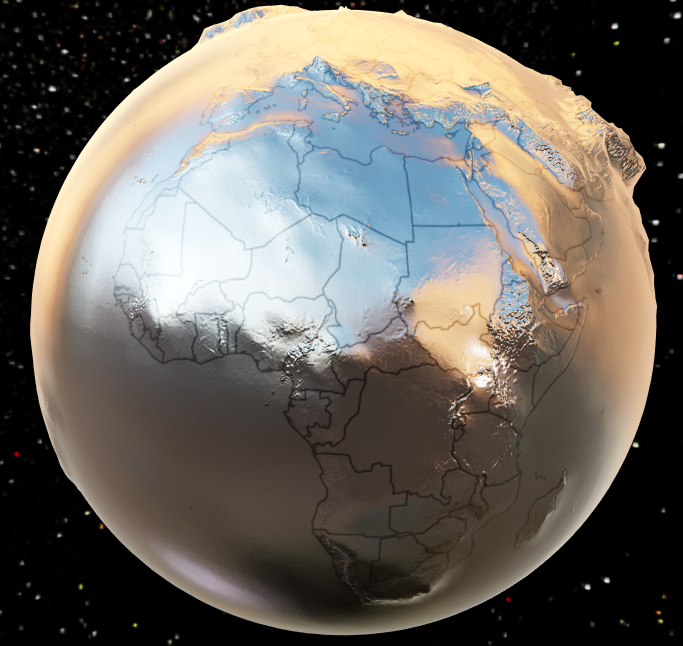 

When you want to express more complex materials. You can set `roughness` directly to the texture that stores the roughness with each pixel as follows.


The more white the color in the texture, the larger the value and the rougher it is. You can get texture resources of different materials from resource websites such as \[[http://freepbr.com/\]](http://freepbr.com/]) ([http://freepbr.com/)](http://freepbr.com/\)). You can also generate it yourself using other tools.

### realisticMaterial.metalness
- **Type**: `number|string|HTMLImageElement|HTMLCanvasElement`
- **Default**: `0`

The `metalness` attribute is used to indicate whether the material is metal or non-metal, `0` is non-metallic, `1` is metal, and the middle value is between the two. Usually set to `0` and `1` to meet most of the scenes.

The picture below show the difference between \`metal' and '0' in [globe](option-gl.globe.md).

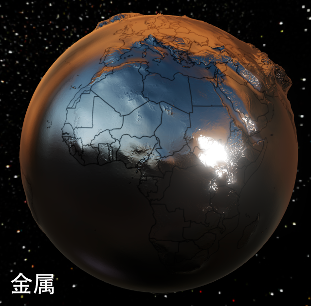 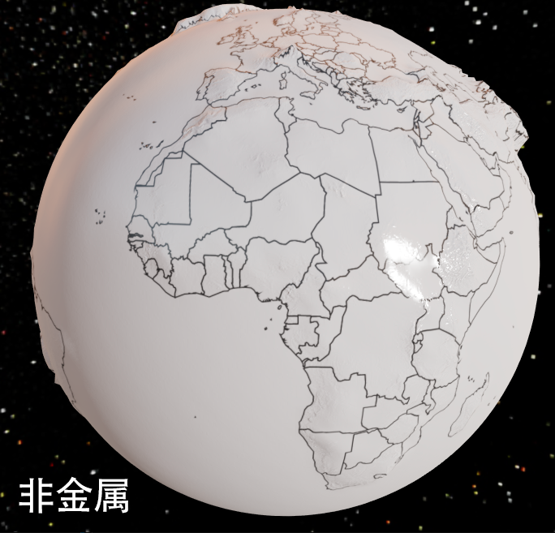

As with [roughness](option-gl.mapbox3D.md#realisticMaterial.roughness) you can set `metalness` directly to the metal texture.

### realisticMaterial.roughnessAdjust
- **Type**: `number`
- **Default**: `0.5`

Roughness adjustment is useful when using roughness map. The overall roughness of the texture can be adjusted. The default is `0.5`, `0` is completely smooth, `1` is completely rough.

### realisticMaterial.metalnessAdjust
- **Type**: `number`
- **Default**: `0.5`

Metalness adjustment is useful when using metalness maps. The overall metallicity of the texture can be adjusted. The default is `0.5`, `0` is non-metal, `1` is metal.

### realisticMaterial.normalTexture
- **Type**: `string|HTMLImageElement|HTMLCanvasElement`

Normal map of material details.

Using normal maps, you can still display rich shades of detail on the surface of the object with fewer vertices.

## lambertMaterial
- **Type**: `Object`

The configuration item of the lambert material is valid when [shading](option-gl.mapbox3D.md#shading) is `'lambert'`.

### lambertMaterial.detailTexture
- **Type**: `string|HTMLImageElement|HTMLCanvasElement`

The texture map of the material detail.

### lambertMaterial.textureTiling
- **Type**: `number`
- **Default**: `1`

Tiles the texture map of the material detail. The default is `1`, which means that the stretch is filled. When greater than `1`, the number indicates how many times the texture is tiled.

**Note:** The use of tiling requires the `detail texture` height and width to be 2 to the power of n. For example, 512x512, if it is a 200x200 texture, you cannot use tiling.

### lambertMaterial.textureOffset
- **Type**: `number`
- **Default**: `0`

The displacement of the texture detail texture.

## colorMaterial
- **Type**: `Object`

The color material related configuration item is valid when [shading](option-gl.mapbox3D.md#shading) is `'color'`.

### colorMaterial.detailTexture
- **Type**: `string|HTMLImageElement|HTMLCanvasElement`

The texture map of the material detail.

### colorMaterial.textureTiling
- **Type**: `number`
- **Default**: `1`

Tiles the texture map of the material detail. The default is `1`, which means that the stretch is filled. When greater than `1`, the number indicates how many times the texture is tiled.

**Note:** The use of tiling requires the `detail texture` height and width to be 2 to the power of n. For example, 512x512, if it is a 200x200 texture, you cannot use tiling.

### colorMaterial.textureOffset
- **Type**: `number`
- **Default**: `0`

The displacement of the texture detail texture.

## light
- **Type**: `Object`

Light related settings. Invalid when [shading](option-gl.mapbox3D.md#shading) is 'color'.

The lighting settings affect the components and all the charts on the component's coordinate system.

A reasonable lighting setting can make the brightness and darkness of the whole scene richer and more layered.

### light.main
- **Type**: `Object`

The setting of the main light source of the scene. In the [globe](option-gl.globe.md) component is the sun.

#### light.main.color
- **Type**: `string`
- **Default**: `#fff`

The color of the main light source.

#### light.main.intensity
- **Type**: `number`
- **Default**: `1`

The intensity of the main light source.

#### light.main.shadow
- **Type**: `boolean`
- **Default**: `false`

Whether the main light source displays a shadow. The default is off.

Turning on the shadows can bring more realistic and layered lighting to the scene. But it also increases the operating overhead of the program.

The following two images show the difference between turning on the shadow and turning off the shadow.

 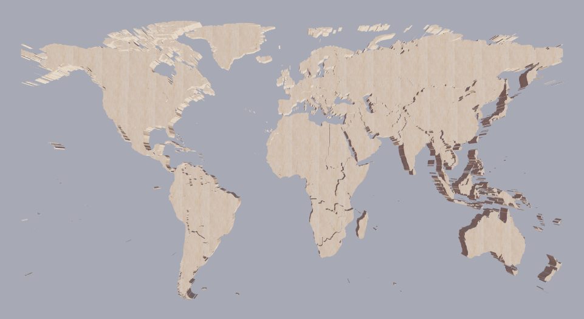

#### light.main.shadowQuality
- **Type**: `string`
- **Default**: `'medium'`

The quality of the shadow. You can choose `'low'`, `'medium'`, `'high'`, `'ultra'`

The following two images shows the difference between low quality and high quality shadows.

 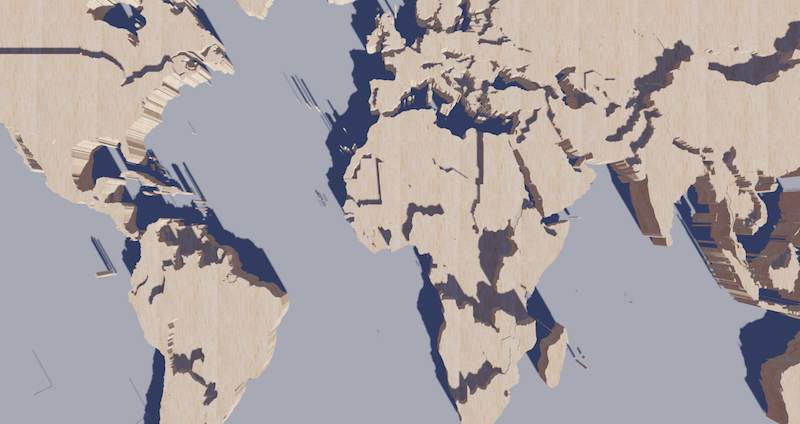

#### light.main.alpha
- **Type**: `number`
- **Default**: `40`

The main light source is around the x-axis, which is the angle of up-down rotation. Control the direction of the light with [beta](option-gl.mapbox3D.md#light.main.beta).

As the following image show:

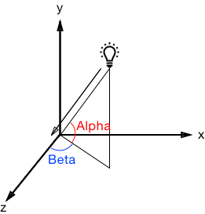

The [globe](option-gl.globe.md) component can control the time of sunlight by [time](option-gl.globe.md#light.main.time).

#### light.main.beta
- **Type**: `number`
- **Default**: `40`

The main light source is around the y-axis, which is the angle of the left-right rotation.

### light.ambient
- **Type**: `Object`

Global ambient light settings.

#### light.ambient.color
- **Type**: `string`
- **Default**: `#fff`

The color of ambient light.

#### light.ambient.intensity
- **Type**: `number`
- **Default**: `0.2`

The intensity of ambient light.

### light.ambientCubemap
- **Type**: `Object`

The ambientCubemap uses texture as the source of ambient light, which provides diffuse and specular for objects. The diffuse and specular can be set separately by [diffuseIntensity](option-gl.mapbox3D.md#light.ambientCubemap.diffuseIntensity) and [specularIntensity](option-gl.mapbox3D.md#light.ambientCubemap.specularIntensity).

#### light.ambientCubemap.texture
- **Type**: `string`

The URL of the ambient cubemap supports HDR images in the `.hdr` format. You can obtained the resources for `.hdr` from [http://www.hdrlabs.com/sibl/archive.html](http://www.hdrlabs.com/sibl/archive.html) and other websites.

Example：

```
ambientCubemap: {
    texture: 'pisa.hdr',
    // The exposure value used when analytic hdr
    exposure: 1.0
}
```

#### light.ambientCubemap.diffuseIntensity
- **Type**: `number`
- **Default**: `0.5`

The intensity of diffuse.

#### light.ambientCubemap.specularIntensity
- **Type**: `number`
- **Default**: `0.5`

The intensity of specular.

## postEffect
- **Type**: `Object`

Post-processing effects related configuration. It can add effects such as highlights, depth of field, screen space ambient occlusion (SSAO), toning to the picture. And it can make the whole picture more textured.

The following are the differences between closing `postEffect` and opening `postEffect`.

 

Note that when postEffect is enable, [temporalSuperSampling](option-gl.mapbox3D.md#temporalSuperSampling) is enable by default. After the picture is still, the picture will continue to be enhanced, including anti-aliasing, depth of field, SSAO, shadows, etc.

### postEffect.enable
- **Type**: `boolean`
- **Default**: `false`

Whether to enable post-processing effects. Not enabled by default.

### postEffect.bloom
- **Type**: `Object`

Bloom is used to reproducing the effects that occur in real cameras when taking pictures in a bright environment. Because traditional RGB can only represent colors in the range of '0 - 255', so we need to use the bloom effect simulates fringes of light extending from the borders of bright areas, creating the illusion of a bright light overwhelming the camera. As shown below：

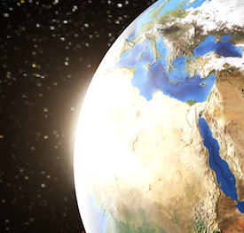

#### postEffect.bloom.enable
- **Type**: `boolean`
- **Default**: `false`

Whether to enable the bloom effect.

#### postEffect.bloom.bloomIntensity
- **Type**: `number`
- **Default**: `0.1`

The intensity of the bloom. The default is 0.1.

### postEffect.depthOfField
- **Type**: `Object`

Depth of Field is a post-processing effect that simulates the focus properties of a camera. The area of focus is clear, and the area away from the focus is gradually blurred.

The depth of field effect allows the observer to focus on the area of focus and make the picture feel stronger. Large depth of field can also create a macro model effect.

The following are the differences between turning off and turning on the depth of field effect.

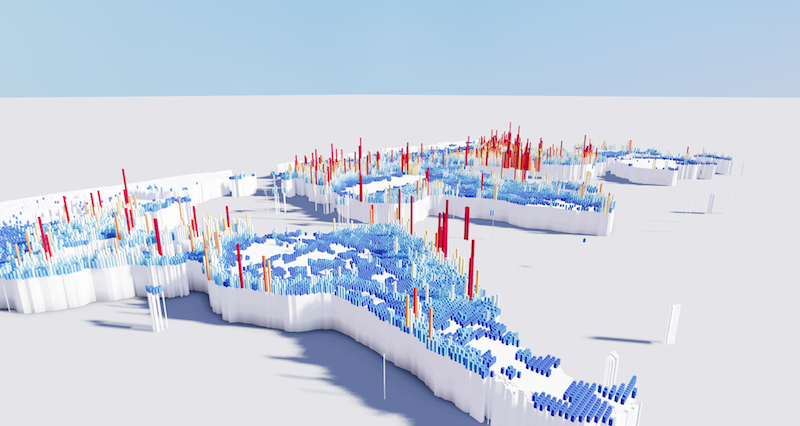 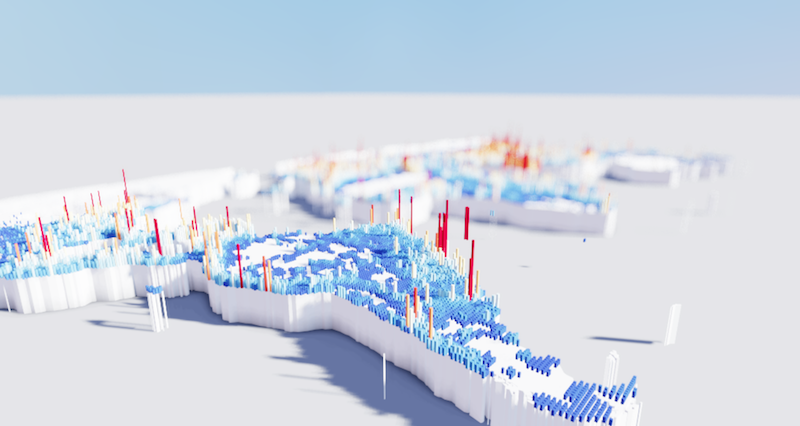

#### postEffect.depthOfField.enable
- **Type**: `boolean`
- **Default**: `false`

Whether to enable the depth of field.

#### postEffect.depthOfField.focalDistance
- **Type**: `boolean`
- **Default**: `50`

The initial focus distance. The user can click on the area to automatically focus.

#### postEffect.depthOfField.focalRange
- **Type**: `boolean`
- **Default**: `20`

The size of the in-focus area. The objects in this range are completely clear and there is no blurring.

#### postEffect.depthOfField.fstop
- **Type**: `number`
- **Default**: `2.8`

\[F value\] of the lens ([https://zh.wikipedia.org/wiki/%E7%84%A6%E6%AF%94)](https://zh.wikipedia.org/wiki/%E7%84%A6%E6%AF%94\)), the smaller the value, the shallower the depth of field.

#### postEffect.depthOfField.blurRadius
- **Type**: `number`
- **Default**: `10`

Blur radius outside the focus.

The difference blur effect between the different radius.

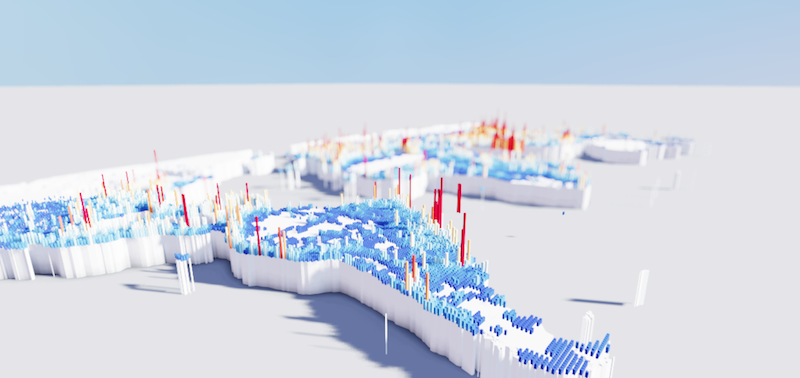 

### postEffect.screenSpaceAmbientOcclusion
- **Type**: `Object`

The ambient occlusion post-processing effect darkens the corners, holes, crevices, and areas where most light can\`t reach. It is a supplement to the traditional shadow map, which makes the whole scene more natural and layered.

Below is a comparison of the effects of no SSAO and SSAO:

 

### postEffect.SSAO
- **Type**: `Object`

Same as [screenSpaceAmbientOcclusion](option-gl.mapbox3D.md#postEffect.screenSpaceAmbientOcclusion)

#### postEffect.SSAO.enable
- **Type**: `boolean`
- **Default**: `false`

Whether to enable SSAO (screen space ambient occlusion). Not enabled by default.

#### postEffect.SSAO.quality
- **Type**: `string`
- **Default**: `'medium'`

The quality of SSAO (screen space ambient occlusion). Supporting`'low'`, `'medium'`, `'high'`, `'ultra'`

#### postEffect.SSAO.radius
- **Type**: `number`
- **Default**: `2`

The radius of the SSAO (screen space ambient occlusion). The larger the radius, the more natural the effect, but you need to set a higher `'quality'`.

The following example is the difference between a smaller and larger radius:

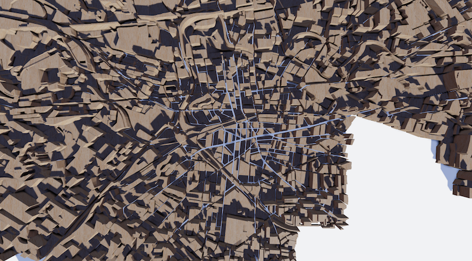 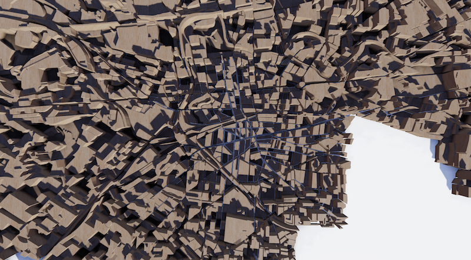

#### postEffect.SSAO.intensity
- **Type**: `number`
- **Default**: `1`

The intensity of SSAO (screen space ambient occlusion). The larger the value, the darker the color.

### postEffect.colorCorrection
- **Type**: `Object`

Color correction and adjustment. Similar to Color Adjustments in Photoshop.

The same scene in the figure below is adjusted to the difference between the cool color system and the warm color system.

 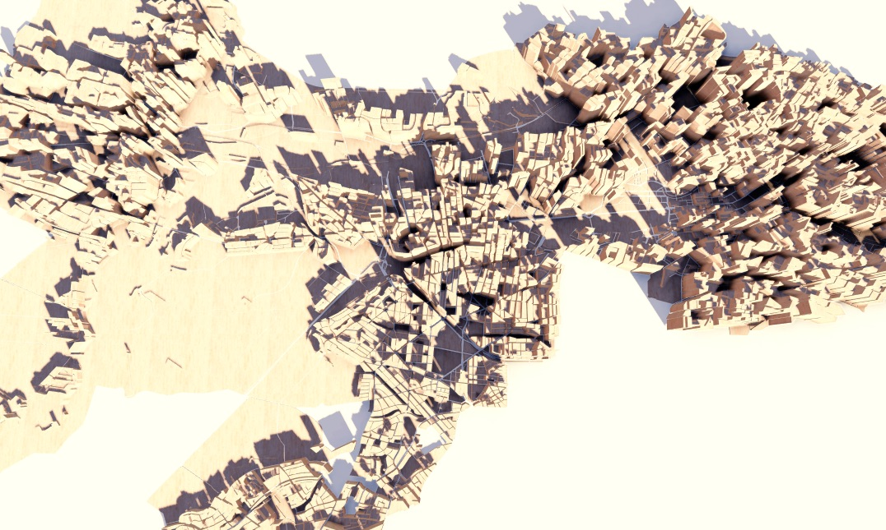

#### postEffect.colorCorrection.enable
- **Type**: `boolean`
- **Default**: `true`

Whether to enable the color correction.

#### postEffect.colorCorrection.lookupTexture
- **Type**: `string|HTMLImageElement|HTMLCanvasElement`

Color correction lookup texture, recommended.

The color correction lookup texture is a texture image like the one below.


This is the basic lookup texture image that you can use directly. To adjust the color of the scene to the effect you want, you can take a screenshot of the scene and adjust the color to the desired effect in image processing software such as Photoshop. Then apply the same adjustment to the image of the lookup texture above.

For example, after turning into a cool tone, the image of the lookup texture will look like this:

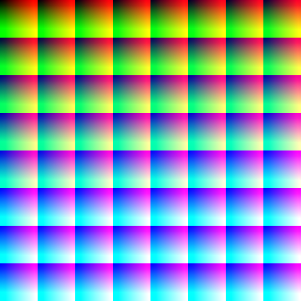

Then the texture image is used as the value of the configuration item, and you can get the same effect in Photoshop.

Of course, if you just want to get a screenshot, you don't have to do it anymore, but if you want to easily adjust to the ideal color in real-time interactive works, this is very useful.

#### postEffect.colorCorrection.exposure
- **Type**: `number`
- **Default**: `0`

The exposure of the image.

#### postEffect.colorCorrection.brightness
- **Type**: `number`
- **Default**: `0`

The brightness of the image.

#### postEffect.colorCorrection.contrast
- **Type**: `number`
- **Default**: `1`

The contrast of the image.

#### postEffect.colorCorrection.saturation
- **Type**: `number`
- **Default**: `1`

The saturation of the image.

### postEffect.FXAA
- **Type**: `Object`

After opening [postEffect](option-gl.mapbox3D.md#postEffect), WebGL's default MSAA (Multi Sampling Anti Aliasing) will not work. At this time, FXAA (Fast Approximate Anti-Aliasing) can solve the anti-aliasing problem quickly and easily. FXAA blurs the edge of the scene to solve the problem of aliasing. It works well on some scenes, but in echarts-gl, you need to ensure that the edges of many texts and lines are sharp and clear, so FXAA is not suitable. At this point we can use supersampling by setting a higher `devicePixelRatio` as follows:

```
var chart = echarts.init(dom, null, {
    devicePixelRatio: 2
})
```

However, setting a higher `devicePixelRatio` has high requirements for computer performance, so more often we recommend using [temporalSuperSampling](option-gl.mapbox3D.md#temporalSuperSampling) in echarts-gl. After the picture is still, it will continue to sample multiple times and taken at several instances inside the pixel and an average color value is calculated.,thus achieving anti-aliasing effect.

#### postEffect.FXAA.enable
- **Type**: `boolean`
- **Default**: `false`

Whether to enable FXAA. Not enabled by default.

## temporalSuperSampling
- **Type**: `Object`

Temporal supersampling. After opening [postEffect](option-gl.mapbox3D.md#postEffect), WebGL's default MSAA (MultiSampling Anti-Aliasing) will not work, so we need to solve the problem of sampling.

Temporal supersampling is an anti-aliasing method. After the picture is still, it will continue to sample multiple times and taken at several instances inside the pixel and an average color value is calculated, thus achieving anti-aliasing effect. And in this process, ECharts-gl also progressively enhances some of the effects in [postEffect](option-gl.mapbox3D.md#postEffect) that require sampled guarantees. For example [SSAO](option-gl.mapbox3D.md#postEffect.SSAO), [Depth of Field](option-gl.mapbox3D.md#postEffect.depthOfField), and shadow.

The following is the difference between not opening `temporalSuperSampling` and opening `temporalSuperSampling`.

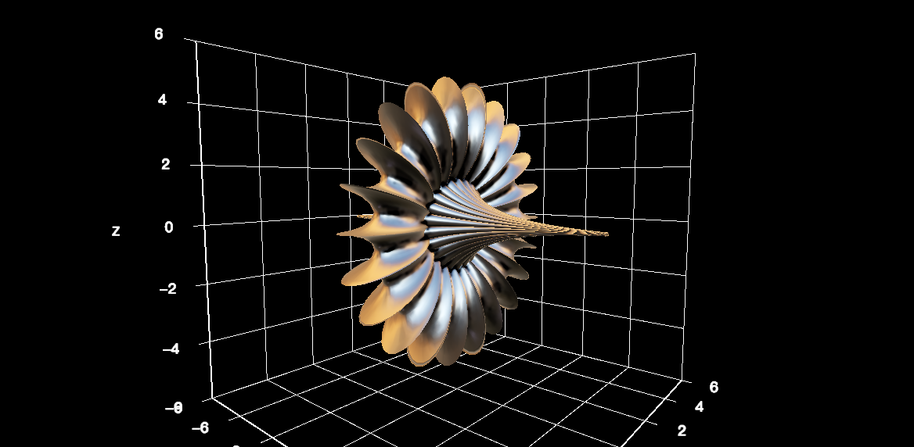 

### temporalSuperSampling.enable
- **Type**: `boolean`
- **Default**: `'auto'`

Whether to enable temporal supersampling. By default, temporal supersampling is also turned on synchronously when [postEffect](option-gl.mapbox3D.md#postEffect) is turned on.
