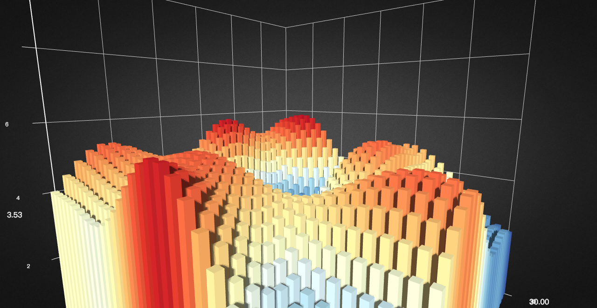
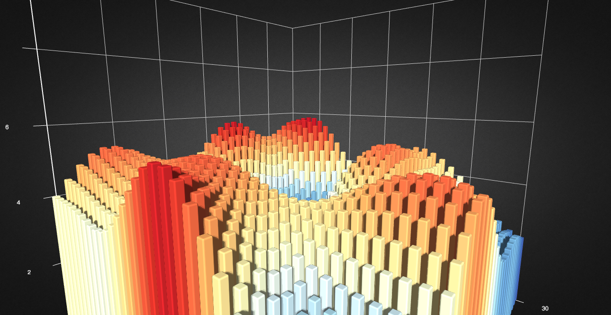

# option-gl.series-bar3D

## name
- **Type**: `string`

Series name used for displaying in [tooltip](https://echarts.apache.org/zh/option.html#tooltip) and filtering with [legend](https://echarts.apache.org/zh/option.html#legend), or updating data and configuration with `setOption`.

## coordinateSystem
- **Type**: `string`
- **Default**: `cartesian3D`

The coordinate used in the series, whose options are:

*   `'cartesian3D'`
    
    Use a 3D rectangular coordinate (also known as Cartesian coordinate), with [xAxisIndex](../option-gl.md#series-.xAxisIndex) and [yAxisIndex](../option-gl.md#series-.yAxisIndex) to assign the corresponding axis component.
    

*   `'geo3D'` Use 3D geographic coordinate, with [geoIndex](../option-gl.md#series-.geoIndex) to assign the corresponding 3D geographic coordinate components.

*   `'globe'`
    
    Use 3D globe coordinate, with [globeIndex](../option-gl.md#series-.globeIndex) to assign the corresponding 3D globe coordinate components.

## grid3DIndex
- **Type**: `number`
- **Default**: `0`

Use the index of the [grid3D](option-gl.grid3D.md) component. The first [grid3D](option-gl.grid3D.md) component is used by default.

## geo3DIndex
- **Type**: `number`
- **Default**: `0`

The index of the [geo3D](option-gl.geo3D.md) component used by the axis.The first [grid3D](option-gl.grid3D.md) component is used by default.

## globeIndex
- **Type**: `number`
- **Default**: `0`

The index of the [globe](option-gl.globe.md) component used by the axis.The first [globe](option-gl.globe.md) component is used by default.

## bevelSize
- **Type**: `number`
- **Default**: `0`

The size of the bevel. Support for setting values from 0 to 1. The default is 0, which means there is no bevel.

Below are the differences between beveling and no beveling.

 

## bevelSmoothness
- **Type**: `number`
- **Default**: `2`

The smoothness of the bevel, the larger the value, the smoother.

## stack
- **Type**: `string`

Name of the stack group. Series with the same `stack` name on the **same category axis** will be stacked on top of each other. See [stackStrategy](option-gl.series-bar3D.md#stackStrategy) for customizing how values are stacked.

**Notice:** Stacking **only supports the stacked axis being of type** `'value'` or `'log'`. Axes of type `'time'` and `'category'` are **not supported** as the stacked axis.

## stackStrategy
- **Type**: `string`
- **Default**: `'samesign'`

Since ECharts `v5.3.3`

Strategy for stacking values, only effective when [stack](option-gl.series-bar3D.md#stack) is set. Optional values:

*   `'samesign'` Only stack values if the value to be stacked has the **same sign** as the currently cumulated stacked value. **(Default)**
*   `'all'` Stack all values regardless of positive or negative.
*   `'positive'` Only stack positive values.
*   `'negative'` Only stack negative values.

## stackOrder
- **Type**: `string`
- **Default**: `'seriesAsc'`

Since ECharts `v6.0.0`

Stack order. Optional values:

*   `'seriesAsc'` Stack in series order. **(Default)**
*   `'seriesDesc'` Stack in reversed series order.

**Notice:**

*   `stackOrder` should be defined for all series with the same `stack` name. If `stackOrder` is defined for only some of the series, the stack order may change unexpectedly when certain series are hidden (e.g., through legend toggle).

## minHeight
- **Type**: `number`
- **Default**: `0`

The minimum width of the bar.

## itemStyle
- **Type**: `Object`

The style of the bar, including color and opacity.

### itemStyle.color
- **Type**: `string|Function`
- **Default**: `adaptive`

The color of the graphic.

```
// pure white
[1, 1, 1, 1]
```

When using an array representation, each channel can set a value greater than 1 to represent the color value of HDR.

### itemStyle.opacity
- **Type**: `number`
- **Default**: `1`

The opacity of the graphic.

## label
- **Type**: `Object`

Configure the label of the bar.

### label.show
- **Type**: `boolean`
- **Default**: `false`

Whether to show the label.

### label.distance
- **Type**: `number`
- **Default**: `2`

Distance to the host graphic element.

The distance from the label to the graphic. In a 3D Scatter, this distance is the pixel value of the screen space. In other figures, this distance is the relative 3D distance.

### label.formatter
- **Type**: `Function|string`

The formatter of the label content, which supports the string template and the callback function. In either form, `\n` is supported to represent a new line.

**String template:**

The model variation includes:

*   `{a}`: series name.
*   `{b}`: the name of a data item.
*   `{c}`: the value of a data item.

**Example:**

```
formatter: '{b}: {c}'
```

**Callback function:** Callback function is in form of:

```
(params: Object|Array) => string
```

The `params` is the single data set needed by formatter, which is formed as:

```
{
    componentType: 'series',
    // Series type
    seriesType: string,
    // Series index in option.series
    seriesIndex: number,
    // Series name
    seriesName: string,
    // Data name, or category name
    name: string,
    // Data index in input data array
    dataIndex: number,
    // Original data as input
    data: Object,
    // Value of data. In most series it is the same as data.
    // But in some series it is some part of the data (e.g., in map, radar)
    value: number|Array|Object,
    // encoding info of coordinate system
    // Key: coord, like ('x' 'y' 'radius' 'angle')
    // value: Must be an array, not null/undefined. Contain dimension indices, like:
    // {
    //     x: [2] // values on dimension index 2 are mapped to x axis.
    //     y: [0] // values on dimension index 0 are mapped to y axis.
    // }
    encode: Object,
    // dimension names list
    dimensionNames: Array<String>,
    // data dimension index, for example 0 or 1 or 2 ...
    // Only work in `radar` series.
    dimensionIndex: number,
    // Color of data
    color: string,

}
```

Note: the usage of encode and dimensionNames can be:

If data is:

```
dataset: {
    source: [
        ['Matcha Latte', 43.3, 85.8, 93.7],
        ['Milk Tea', 83.1, 73.4, 55.1],
        ['Cheese Cocoa', 86.4, 65.2, 82.5],
        ['Walnut Brownie', 72.4, 53.9, 39.1]
    ]
}
```

We can get values that corresponding to y axis by:

```
params.value[params.encode.y[0]]
```

If data is:

```
dataset: {
    dimensions: ['product', '2015', '2016', '2017'],
    source: [
        {product: 'Matcha Latte', '2015': 43.3, '2016': 85.8, '2017': 93.7},
        {product: 'Milk Tea', '2015': 83.1, '2016': 73.4, '2017': 55.1},
        {product: 'Cheese Cocoa', '2015': 86.4, '2016': 65.2, '2017': 82.5},
        {product: 'Walnut Brownie', '2015': 72.4, '2016': 53.9, '2017': 39.1}
    ]
}
```

We can get values that corresponding to y axis by:

```
params.value[params.dimensionNames[params.encode.y[0]]]
```

### label.textStyle
- **Type**: `Object`

The font style of the label.

#### label.textStyle.color
- **Type**: `string`
- **Default**: `"#fff"`

The Color of the text.

#### label.textStyle.borderWidth
- **Type**: `number`
- **Default**: `1`

The border width of the text.

#### label.textStyle.borderColor
- **Type**: `string`
- **Default**: `#fff`

The border color of the text.

#### label.textStyle.fontFamily
- **Type**: `string`
- **Default**: `'sans-serif'`

The font family of the text.

#### label.textStyle.fontSize
- **Type**: `number`
- **Default**: `20`

The font size of the text.

#### label.textStyle.fontWeight
- **Type**: `string`
- **Default**: `normal`

The font thick weight of the text.

**Optional:**

*   `'normal'`
*   `'bold'`
*   `'bolder'`
*   `'lighter'`
*   100 | 200 | 300 | 400...

## emphasis
- **Type**: `Object`

Configure labels and styles for bar highlighting.

#### emphasis.itemStyle.color
- **Type**: `string`
- **Default**: `adaptive`

The color of the graphic.

```
// pure white
[1, 1, 1, 1]
```

When using an array representation, each channel can set a value greater than 1 to represent the color value of HDR.

#### emphasis.itemStyle.opacity
- **Type**: `number`
- **Default**: `1`

The opacity of the graphic.

#### emphasis.label.show
- **Type**: `boolean`
- **Default**: `true`

Whether to show the label.

#### emphasis.label.distance
- **Type**: `number`
- **Default**: `2`

Distance to the host graphic element.

The distance from the label to the graphic. In a 3D Scatter, this distance is the pixel value of the screen space. In other figures, this distance is the relative 3D distance.

#### emphasis.label.formatter
- **Type**: `Function|string`

The formatter of the label content, which supports the string template and the callback function. In either form, `\n` is supported to represent a new line.

**String template:**

The model variation includes:

*   `{a}`: series name.
*   `{b}`: the name of a data item.
*   `{c}`: the value of a data item.

**Example:**

```
formatter: '{b}: {c}'
```

**Callback function:** Callback function is in form of:

```
(params: Object|Array) => string
```

The `params` is the single data set needed by formatter, which is formed as:

```
{
    componentType: 'series',
    // Series type
    seriesType: string,
    // Series index in option.series
    seriesIndex: number,
    // Series name
    seriesName: string,
    // Data name, or category name
    name: string,
    // Data index in input data array
    dataIndex: number,
    // Original data as input
    data: Object,
    // Value of data. In most series it is the same as data.
    // But in some series it is some part of the data (e.g., in map, radar)
    value: number|Array|Object,
    // encoding info of coordinate system
    // Key: coord, like ('x' 'y' 'radius' 'angle')
    // value: Must be an array, not null/undefined. Contain dimension indices, like:
    // {
    //     x: [2] // values on dimension index 2 are mapped to x axis.
    //     y: [0] // values on dimension index 0 are mapped to y axis.
    // }
    encode: Object,
    // dimension names list
    dimensionNames: Array<String>,
    // data dimension index, for example 0 or 1 or 2 ...
    // Only work in `radar` series.
    dimensionIndex: number,
    // Color of data
    color: string,

}
```

Note: the usage of encode and dimensionNames can be:

If data is:

```
dataset: {
    source: [
        ['Matcha Latte', 43.3, 85.8, 93.7],
        ['Milk Tea', 83.1, 73.4, 55.1],
        ['Cheese Cocoa', 86.4, 65.2, 82.5],
        ['Walnut Brownie', 72.4, 53.9, 39.1]
    ]
}
```

We can get values that corresponding to y axis by:

```
params.value[params.encode.y[0]]
```

If data is:

```
dataset: {
    dimensions: ['product', '2015', '2016', '2017'],
    source: [
        {product: 'Matcha Latte', '2015': 43.3, '2016': 85.8, '2017': 93.7},
        {product: 'Milk Tea', '2015': 83.1, '2016': 73.4, '2017': 55.1},
        {product: 'Cheese Cocoa', '2015': 86.4, '2016': 65.2, '2017': 82.5},
        {product: 'Walnut Brownie', '2015': 72.4, '2016': 53.9, '2017': 39.1}
    ]
}
```

We can get values that corresponding to y axis by:

```
params.value[params.dimensionNames[params.encode.y[0]]]
```

#### emphasis.label.textStyle
- **Type**: `Object`

The font style of the label.

##### emphasis.label.textStyle.color
- **Type**: `string`
- **Default**: `"#fff"`

The Color of the text.

##### emphasis.label.textStyle.borderWidth
- **Type**: `number`
- **Default**: `1`

The border width of the text.

##### emphasis.label.textStyle.borderColor
- **Type**: `string`
- **Default**: `#fff`

The border color of the text.

##### emphasis.label.textStyle.fontFamily
- **Type**: `string`
- **Default**: `'sans-serif'`

The font family of the text.

##### emphasis.label.textStyle.fontSize
- **Type**: `number`
- **Default**: `20`

The font size of the text.

##### emphasis.label.textStyle.fontWeight
- **Type**: `string`
- **Default**: `normal`

The font thick weight of the text.

**Optional:**

*   `'normal'`
*   `'bold'`
*   `'bolder'`
*   `'lighter'`
*   100 | 200 | 300 | 400...

## data
- **Type**: `Array`

A data array of 3D bar. Each item of the array is a piece of data. Usually this data is an array to store each attribute/dimension of the data. For example below:

```
data: [
    [[12, 14, 10], [34, 50, 15], [56, 30, 20], [10, 15, 12], [23, 10, 14]]
]
```

For each item in the array:

1.  In \[grid3D\] (~grid3D), the first three values of each item are `x`, `y`, `z`.
2.  In [geo3D](option-gl.geo3D.md) and [globe](option-gl.globe.md), the first two values of each item are longitude `lng`, latitude `lat`, and the third value indicates the size of the value, such as the number of people. This value will be mapped to the range of [minHeight](option-gl.series-bar3D.md#minHeight) ~ [maxHeight](option-gl.series-bar3D.md#maxHeight).

In addition to the three values used by default for the coordinate system, each item can be added with any number of values for mapping the [visualMap](../option-gl.md#visualMap) component to other graphical properties such as color.

More likely, we need to assign name to each data item, in which case each item should be an object:

```
[{
    // name of date item
    name: 'data1',
    // value of date item is 8
    value: [12, 14, 10]
}, {
    name: 'data2',
    value: 20
}]
```

Each data item can be further customized:

```
[{
    name: 'data1',
    value: [12, 14, 10]
}, {
    // name of data item
    name: 'data2',
    value : [34, 50, 15],
    // user-defined special itemStyle that only useful for this data item
    itemStyle:{}
}]
```

### data.name
- **Type**: `string`

The name of data item.

### data.value
- **Type**: `Array`

Data value.

### data.itemStyle
- **Type**: `Object`

The style setting of a single data item.

#### data.itemStyle.color
- **Type**: `string`
- **Default**: `adaptive`

The color of the graphic.

```
// pure white
[1, 1, 1, 1]
```

When using an array representation, each channel can set a value greater than 1 to represent the color value of HDR.

#### data.itemStyle.opacity
- **Type**: `number`
- **Default**: `1`

The opacity of the graphic.

### data.label
- **Type**: `Object`

The label setting of a single data item.

#### data.label.show
- **Type**: `boolean`
- **Default**: `false`

Whether to show the label.

#### data.label.distance
- **Type**: `number`
- **Default**: `2`

Distance to the host graphic element.

The distance from the label to the graphic. In a 3D Scatter, this distance is the pixel value of the screen space. In other figures, this distance is the relative 3D distance.

#### data.label.formatter
- **Type**: `Function|string`

The formatter of the label content, which supports the string template and the callback function. In either form, `\n` is supported to represent a new line.

**String template:**

The model variation includes:

*   `{a}`: series name.
*   `{b}`: the name of a data item.
*   `{c}`: the value of a data item.

**Example:**

```
formatter: '{b}: {c}'
```

**Callback function:** Callback function is in form of:

```
(params: Object|Array) => string
```

The `params` is the single data set needed by formatter, which is formed as:

```
{
    componentType: 'series',
    // Series type
    seriesType: string,
    // Series index in option.series
    seriesIndex: number,
    // Series name
    seriesName: string,
    // Data name, or category name
    name: string,
    // Data index in input data array
    dataIndex: number,
    // Original data as input
    data: Object,
    // Value of data. In most series it is the same as data.
    // But in some series it is some part of the data (e.g., in map, radar)
    value: number|Array|Object,
    // encoding info of coordinate system
    // Key: coord, like ('x' 'y' 'radius' 'angle')
    // value: Must be an array, not null/undefined. Contain dimension indices, like:
    // {
    //     x: [2] // values on dimension index 2 are mapped to x axis.
    //     y: [0] // values on dimension index 0 are mapped to y axis.
    // }
    encode: Object,
    // dimension names list
    dimensionNames: Array<String>,
    // data dimension index, for example 0 or 1 or 2 ...
    // Only work in `radar` series.
    dimensionIndex: number,
    // Color of data
    color: string,

}
```

Note: the usage of encode and dimensionNames can be:

If data is:

```
dataset: {
    source: [
        ['Matcha Latte', 43.3, 85.8, 93.7],
        ['Milk Tea', 83.1, 73.4, 55.1],
        ['Cheese Cocoa', 86.4, 65.2, 82.5],
        ['Walnut Brownie', 72.4, 53.9, 39.1]
    ]
}
```

We can get values that corresponding to y axis by:

```
params.value[params.encode.y[0]]
```

If data is:

```
dataset: {
    dimensions: ['product', '2015', '2016', '2017'],
    source: [
        {product: 'Matcha Latte', '2015': 43.3, '2016': 85.8, '2017': 93.7},
        {product: 'Milk Tea', '2015': 83.1, '2016': 73.4, '2017': 55.1},
        {product: 'Cheese Cocoa', '2015': 86.4, '2016': 65.2, '2017': 82.5},
        {product: 'Walnut Brownie', '2015': 72.4, '2016': 53.9, '2017': 39.1}
    ]
}
```

We can get values that corresponding to y axis by:

```
params.value[params.dimensionNames[params.encode.y[0]]]
```

#### data.label.textStyle
- **Type**: `Object`

The font style of the label.

##### data.label.textStyle.color
- **Type**: `string`
- **Default**: `"#fff"`

The Color of the text.

##### data.label.textStyle.borderWidth
- **Type**: `number`
- **Default**: `1`

The border width of the text.

##### data.label.textStyle.borderColor
- **Type**: `string`
- **Default**: `#fff`

The border color of the text.

##### data.label.textStyle.fontFamily
- **Type**: `string`
- **Default**: `'sans-serif'`

The font family of the text.

##### data.label.textStyle.fontSize
- **Type**: `number`
- **Default**: `20`

The font size of the text.

##### data.label.textStyle.fontWeight
- **Type**: `string`
- **Default**: `normal`

The font thick weight of the text.

**Optional:**

*   `'normal'`
*   `'bold'`
*   `'bolder'`
*   `'lighter'`
*   100 | 200 | 300 | 400...

### data.emphasis
- **Type**: `Object`

Configure labels and styles for a single data item highlighting.

##### data.emphasis.itemStyle.color
- **Type**: `string`
- **Default**: `adaptive`

The color of the graphic.

```
// pure white
[1, 1, 1, 1]
```

When using an array representation, each channel can set a value greater than 1 to represent the color value of HDR.

##### data.emphasis.itemStyle.opacity
- **Type**: `number`
- **Default**: `1`

The opacity of the graphic.

##### data.emphasis.label.show
- **Type**: `boolean`
- **Default**: `true`

Whether to show the label.

##### data.emphasis.label.distance
- **Type**: `number`
- **Default**: `2`

Distance to the host graphic element.

The distance from the label to the graphic. In a 3D Scatter, this distance is the pixel value of the screen space. In other figures, this distance is the relative 3D distance.

##### data.emphasis.label.formatter
- **Type**: `Function|string`

The formatter of the label content, which supports the string template and the callback function. In either form, `\n` is supported to represent a new line.

**String template:**

The model variation includes:

*   `{a}`: series name.
*   `{b}`: the name of a data item.
*   `{c}`: the value of a data item.

**Example:**

```
formatter: '{b}: {c}'
```

**Callback function:** Callback function is in form of:

```
(params: Object|Array) => string
```

The `params` is the single data set needed by formatter, which is formed as:

```
{
    componentType: 'series',
    // Series type
    seriesType: string,
    // Series index in option.series
    seriesIndex: number,
    // Series name
    seriesName: string,
    // Data name, or category name
    name: string,
    // Data index in input data array
    dataIndex: number,
    // Original data as input
    data: Object,
    // Value of data. In most series it is the same as data.
    // But in some series it is some part of the data (e.g., in map, radar)
    value: number|Array|Object,
    // encoding info of coordinate system
    // Key: coord, like ('x' 'y' 'radius' 'angle')
    // value: Must be an array, not null/undefined. Contain dimension indices, like:
    // {
    //     x: [2] // values on dimension index 2 are mapped to x axis.
    //     y: [0] // values on dimension index 0 are mapped to y axis.
    // }
    encode: Object,
    // dimension names list
    dimensionNames: Array<String>,
    // data dimension index, for example 0 or 1 or 2 ...
    // Only work in `radar` series.
    dimensionIndex: number,
    // Color of data
    color: string,

}
```

Note: the usage of encode and dimensionNames can be:

If data is:

```
dataset: {
    source: [
        ['Matcha Latte', 43.3, 85.8, 93.7],
        ['Milk Tea', 83.1, 73.4, 55.1],
        ['Cheese Cocoa', 86.4, 65.2, 82.5],
        ['Walnut Brownie', 72.4, 53.9, 39.1]
    ]
}
```

We can get values that corresponding to y axis by:

```
params.value[params.encode.y[0]]
```

If data is:

```
dataset: {
    dimensions: ['product', '2015', '2016', '2017'],
    source: [
        {product: 'Matcha Latte', '2015': 43.3, '2016': 85.8, '2017': 93.7},
        {product: 'Milk Tea', '2015': 83.1, '2016': 73.4, '2017': 55.1},
        {product: 'Cheese Cocoa', '2015': 86.4, '2016': 65.2, '2017': 82.5},
        {product: 'Walnut Brownie', '2015': 72.4, '2016': 53.9, '2017': 39.1}
    ]
}
```

We can get values that corresponding to y axis by:

```
params.value[params.dimensionNames[params.encode.y[0]]]
```

##### data.emphasis.label.textStyle
- **Type**: `Object`

The font style of the label.

###### data.emphasis.label.textStyle.color
- **Type**: `string`
- **Default**: `"#fff"`

The Color of the text.

###### data.emphasis.label.textStyle.borderWidth
- **Type**: `number`
- **Default**: `1`

The border width of the text.

###### data.emphasis.label.textStyle.borderColor
- **Type**: `string`
- **Default**: `#fff`

The border color of the text.

###### data.emphasis.label.textStyle.fontFamily
- **Type**: `string`
- **Default**: `'sans-serif'`

The font family of the text.

###### data.emphasis.label.textStyle.fontSize
- **Type**: `number`
- **Default**: `20`

The font size of the text.

###### data.emphasis.label.textStyle.fontWeight
- **Type**: `string`
- **Default**: `normal`

The font thick weight of the text.

**Optional:**

*   `'normal'`
*   `'bold'`
*   `'bolder'`
*   `'lighter'`
*   100 | 200 | 300 | 400...

## shading
- **Type**: `string`

The coloring effect of 3D graphics in 3D Bar. The following three coloring methods are supported in echarts-gl:

*   `'color'` Only display colors, not affected by other factors such as lighting.
    
*   `'lambert'` Through the classic \[lambert\] coloring, can express the light and dark that the light shows.
    
*   `'realistic'` Realistic rendering, combined with [light.ambientCubemap](option-gl.globe.md#light.ambientCubemap) and [postEffect](option-gl.globe.md#postEffect), can improve the quality and texture of the display. \[Physical Based Rendering (PBR)\] ([https://www.marmoset.co/posts/physically-based-rendering-and-you-can-too/](https://www.marmoset.co/posts/physically-based-rendering-and-you-can-too/)) is used in ECharts GL to represent realistic materials.

## realisticMaterial
- **Type**: `Object`

The configuration item of the realistic material is valid when [shading](option-gl.series-bar3D.md#shading) is `'realistic'`.

### realisticMaterial.detailTexture
- **Type**: `string|HTMLImageElement|HTMLCanvasElement`

The texture map of the material detail.

### realisticMaterial.textureTiling
- **Type**: `number`
- **Default**: `1`

Tiles the texture map of the material detail. The default is `1`, which means that the stretch is filled. When greater than `1`, the number indicates how many times the texture is tiled.

**Note:** The use of tiling requires the `detail texture` height and width to be 2 to the power of n. For example, 512x512, if it is a 200x200 texture, you cannot use tiling.

### realisticMaterial.textureOffset
- **Type**: `number`
- **Default**: `0`

The displacement of the texture detail texture.

### realisticMaterial.roughness
- **Type**: `number|string|HTMLImageElement|HTMLCanvasElement`
- **Default**: `0.5`

The `roughness` attribute is used to indicate the roughness of the material, `0` is completely smooth, `1` is completely rough, and the middle value is between the two.

The following images show the effect of `roughness` in [`globe`](option-gl.globe.md) `0.2` (smooth) and `0.8` (rough).

 

When you want to express more complex materials. You can set `roughness` directly to the texture that stores the roughness with each pixel as follows.


The more white the color in the texture, the larger the value and the rougher it is. You can get texture resources of different materials from resource websites such as \[[http://freepbr.com/\]](http://freepbr.com/]) ([http://freepbr.com/)](http://freepbr.com/\)). You can also generate it yourself using other tools.

### realisticMaterial.metalness
- **Type**: `number|string|HTMLImageElement|HTMLCanvasElement`
- **Default**: `0`

The `metalness` attribute is used to indicate whether the material is metal or non-metal, `0` is non-metallic, `1` is metal, and the middle value is between the two. Usually set to `0` and `1` to meet most of the scenes.

The picture below show the difference between \`metal' and '0' in [globe](option-gl.globe.md).

 

As with [roughness](option-gl.series-bar3D.md#realisticMaterial.roughness) you can set `metalness` directly to the metal texture.

### realisticMaterial.roughnessAdjust
- **Type**: `number`
- **Default**: `0.5`

Roughness adjustment is useful when using roughness map. The overall roughness of the texture can be adjusted. The default is `0.5`, `0` is completely smooth, `1` is completely rough.

### realisticMaterial.metalnessAdjust
- **Type**: `number`
- **Default**: `0.5`

Metalness adjustment is useful when using metalness maps. The overall metallicity of the texture can be adjusted. The default is `0.5`, `0` is non-metal, `1` is metal.

### realisticMaterial.normalTexture
- **Type**: `string|HTMLImageElement|HTMLCanvasElement`

Normal map of material details.

Using normal maps, you can still display rich shades of detail on the surface of the object with fewer vertices.

## lambertMaterial
- **Type**: `Object`

The configuration item of the lambert material is valid when [shading](option-gl.series-bar3D.md#shading) is `'lambert'`.

### lambertMaterial.detailTexture
- **Type**: `string|HTMLImageElement|HTMLCanvasElement`

The texture map of the material detail.

### lambertMaterial.textureTiling
- **Type**: `number`
- **Default**: `1`

Tiles the texture map of the material detail. The default is `1`, which means that the stretch is filled. When greater than `1`, the number indicates how many times the texture is tiled.

**Note:** The use of tiling requires the `detail texture` height and width to be 2 to the power of n. For example, 512x512, if it is a 200x200 texture, you cannot use tiling.

### lambertMaterial.textureOffset
- **Type**: `number`
- **Default**: `0`

The displacement of the texture detail texture.

## colorMaterial
- **Type**: `Object`

The color material related configuration item is valid when [shading](option-gl.series-bar3D.md#shading) is `'color'`.

### colorMaterial.detailTexture
- **Type**: `string|HTMLImageElement|HTMLCanvasElement`

The texture map of the material detail.

### colorMaterial.textureTiling
- **Type**: `number`
- **Default**: `1`

Tiles the texture map of the material detail. The default is `1`, which means that the stretch is filled. When greater than `1`, the number indicates how many times the texture is tiled.

**Note:** The use of tiling requires the `detail texture` height and width to be 2 to the power of n. For example, 512x512, if it is a 200x200 texture, you cannot use tiling.

### colorMaterial.textureOffset
- **Type**: `number`
- **Default**: `0`

The displacement of the texture detail texture.

## zlevel
- **Type**: `number`
- **Default**: `-10`

The layer in which the component is located.

`zlevel` is used to make layers with Canvas. Graphical elements with different `zlevel` values will be placed in different Canvases, which is a common optimization technique. We can put those frequently changed elements (like those with animations) to a separate `zlevel`. Notice that too many Canvases will increase memory cost, and should be used carefully on mobile phones to avoid the crash.

Canvases with bigger `zlevel` will be placed on Canvases with smaller `zlevel`.

**Note:** The layers of the components in echarts-gl need to be separated from the layers of the components in echarts. The same `zlevel` cannot be used for both WebGL and Canvas drawing at the same time.

## silent
- **Type**: `boolean`
- **Default**: `false`

Whether the graph doesn\`t respond and triggers a mouse event. The default is false, which is to respond to and trigger mouse events.

## animation
- **Type**: `boolean`
- **Default**: `true`

Whether to enable animation.

## animationDurationUpdate
- **Type**: `number`
- **Default**: `500`

The duration time for update the transition animation.

## animationEasingUpdate
- **Type**: `string`
- **Default**: `cubicOut`

The easing effect for update transition animation.
