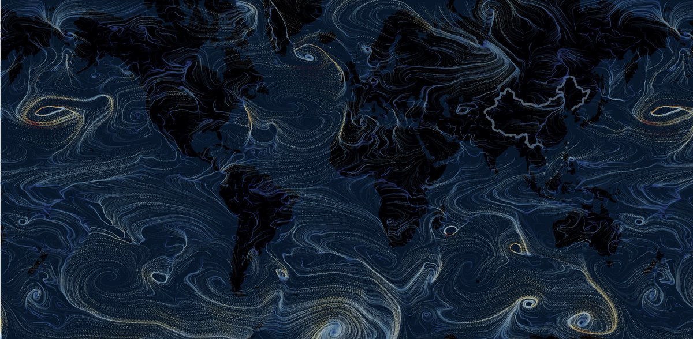

# option-gl.series-flowGL

## particleDensity
- **Type**: `number`
- **Default**: `128`

The density of the particles. The actual number of particles is the square of the set number. The higher the particle density, the better the trace effect, but the greater the performance overhead. In addition to this property, you can get a clearer and more consistent trace using [particleType](option-gl.series-flowGL.md#particleType).

## particleType
- **Type**: `string`
- **Default**: `'point'`

The type of particle. The default is `'point'`, which can be set to `'line'`. Line-type particles connect the position of the last motion to the position of the current motion with a line, which makes the trajectory more consistent.

The following are the differences between the types of point'`and`'line'\`.

 

## particleSize
- **Type**: `number`
- **Default**: `1`

The size of the particle. If [particleType](option-gl.series-flowGL.md#particleType) is `'line'`, will be expressed as a line width.

## particleSpeed
- **Type**: `number`
- **Default**: `1`

The speed of the particle, the default is 1. Note that when [particleType](option-gl.series-flowGL.md#particleType) is `'point'`, the excessive speed will make the entire track become intermittent.

## particleTrail
- **Type**: `number`
- **Default**: `2`

The length of the track of the particle. The larger the value, the longer the track.

## supersampling
- **Type**: `number`
- **Default**: `1`

The oversampling ratio of the picture, using the '4' supersampling can effectively improve the sharpness of the picture and reduce the picture sawtooth. However, because there is a need to process more pixels, there is a higher performance requirement.

The following are the differences between no oversampling and a supersampling value of 4.

 

## gridWidth
- **Type**: `number|string`
- **Default**: `'auto'`

The number of grid widths of the incoming grid data. `flowGL` will create a floating-point texture of the stored vector field based on this value and [gridHeight](option-gl.series-flowGL.md#gridHeight) for the particle's trajectory calculation.

## gridHeight
- **Type**: `number|string`
- **Default**: `'auto'`

The number of grid heights of incoming grid data.

## data
- **Type**: `Array`

The data of the vector field, including the position of the vector and the direction of the vector (including the size). `flowGL` has no mandatory requirements for the order in which data is stored. You can even pass in sparse vector data.

Example:

```
data: [
    // Each data item contains four values representing the lng, lat of the position and the speed sLng, sLat on the corresponding dimension.
    // If it is in a Cartesian coordinate system, it is the position x, y and the speed in the corresponding dimension sx, sy
    [0, 0, 1, 1], [1, 0, 1, 1],
    [0, 1, 1, 1], [1, 1, 1, 1]
];
```

The default `flowGL` will automatically calculate [gridWidth](option-gl.series-flowGL.md#gridWidth) and [gridHeight](option-gl.series-flowGL.md#gridHeight) based on the regular grid data. But because flowGL also supports relatively sparse data formats, you can also specify these two values manually.

## itemStyle
- **Type**: `Object`

The style of the vector field trace.

### itemStyle.color
- **Type**: `string`
- **Default**: `'#fff'`

The color of the vector field trace. More is to encode the size of the vector through the `visualMap` component as demonstrated in the figure above.

### itemStyle.opacity
- **Type**: `number`
- **Default**: `0.8`

Transparency of vector field traces.
