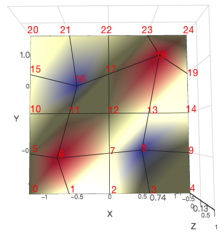

# option-gl.series-surface

## name
- **Type**: `string`

Series name used for displaying in [tooltip](https://echarts.apache.org/zh/option.html#tooltip) and filtering with [legend](https://echarts.apache.org/zh/option.html#legend), or updating data and configuration with `setOption`.

## coordinateSystem
- **Type**: `string`
- **Default**: `cartesian3D`

The coordinate used in the series, whose options are:

*   `'cartesian3D'`
    
    Use a 3D rectangular coordinate (also known as Cartesian coordinate), with [xAxisIndex](../option-gl.md#series-.xAxisIndex) and [yAxisIndex](../option-gl.md#series-.yAxisIndex) to assign the corresponding axis component.

## grid3DIndex
- **Type**: `number`
- **Default**: `0`

Use the index of the [grid3D](option-gl.grid3D.md) component. The first [grid3D](option-gl.grid3D.md) component is used by default.

## parametric
- **Type**: `boolean`
- **Default**: `false`

Whether it is a parametric surface.

## wireframe
- **Type**: `Object`

The wireframe of the surface.

### wireframe.show
- **Type**: `boolean`
- **Default**: `true`

Whether to display wireframe. Default is Display.

### wireframe.lineStyle
- **Type**: `Object`

The style of the wireframe.

#### wireframe.lineStyle.color
- **Type**: `string`
- **Default**: `#222`

The color of the line.

In addition to color strings, RGBA values represented by arrays are supported, for example:

```
// pure white
[1, 1, 1, 1]
```

When using an array representation, each channel can set a value greater than 1 to represent the color value of HDR.

#### wireframe.lineStyle.opacity
- **Type**: `number`
- **Default**: `1`

The opacity of the line.

#### wireframe.lineStyle.width
- **Type**: `number`
- **Default**: `1`

The width of the line.

## equation
- **Type**: `Object`

The function expression of the surface. If you need to display a function surface, you can set the function expression by [equation](option-gl.series-surface.md#equation) without setting [data](option-gl.series-surface.md#data). For example, the ripple effect can be simulated by the following function.

```
equation: {
    x: {
        step: 0.1,
        min: -3,
        max: 3,
    },
    y: {
        step: 0.1,
        min: -3,
        max: 3,
    },
    z: function (x, y) {
        return Math.sin(x * x + y * y) * x / 3.14
    }
}
```

### equation.x
- **Type**: `Object`

Independent variable x.

#### equation.x.step
- **Type**: `number`

The step size of x.

#### equation.x.min
- **Type**: `number`

The minimum value of x.

#### equation.x.max
- **Type**: `number`

The maximum value of x.

### equation.y
- **Type**: `Object`

The independent variable y.

#### equation.y.step
- **Type**: `number`

The step size of x.

#### equation.y.min
- **Type**: `number`

The minimum value of y.

#### equation.y.max
- **Type**: `number`

The maximum value of y.

### equation.z
- **Type**: `Function`

The dependent variable z.

z is a function for [x](option-gl.series-surface.md#equation.x), [y](option-gl.series-surface.md#equation.y).

```
(x: number, y: number) => number
```

## parametricEquation
- **Type**: `Object`

The \[parameter equation\] of the surface ([https://zh.wikipedia.org/wiki/%E5%8F%83%E6%95%B8%E6%96%B9%E7%A8%8B)](https://zh.wikipedia.org/wiki/%E5%8F%83%E6%95%B8%E6%96%B9%E7%A8%8B\)). When [data](option-gl.series-surface.md#data) is not set, the parameter parameter equation can be declared by [parametricEquation](option-gl.series-surface.md#equation). Valid when [parametric](option-gl.series-surface.md) is `true`.

The parametric equations is [x](option-gl.series-surface.md#parametricEquation.x), [y](option-gl.series-surface.md#parametricEquation.y), [z](option-gl.series-surface.md#parametricEquation.z) about the equations of the parameters [u](option-gl.series-surface.md#parametricEquation.u), [v](option-gl.series-surface.md#parametricEquation.v).

The following parametric equation is to plot the parametric surface of a similar metal part in the previous figure:

```
var aa = 0.4;
var r = 1 - aa * aa;
var w = sqrt(r);
...
parametricEquation: {
    u: {
        min: -13.2,
        max: 13.2,
        step: 0.5
    },
    v: {
        min: -37.4,
        max: 37.4,
        step: 0.5
    },
    x: function (u, v) {
        var denom = aa * (pow(w * cosh(aa * u), 2) + aa * pow(sin(w * v), 2))
        return -u + (2 * r * cosh(aa * u) * sinh(aa * u) / denom);
    },
    y: function (u, v) {
        var denom = aa * (pow(w * cosh(aa * u), 2) + aa * pow(sin(w * v), 2))
        return 2 * w * cosh(aa * u) * (-(w * cos(v) * cos(w * v)) - (sin(v) * sin(w * v))) / denom;
    },
    z: function (u, v) {
        var denom = aa * (pow(w * cosh(aa * u), 2) + aa * pow(sin(w * v), 2))
        return  2 * w * cosh(aa * u) * (-(w * sin(v) * cos(w * v)) + (cos(v) * sin(w * v))) / denom
    }
}
```

### parametricEquation.u
- **Type**: `Object`

The argument u.

#### parametricEquation.u.step
- **Type**: `number`

The step size of u.

#### parametricEquation.u.min
- **Type**: `number`

The minimum value of u.

#### parametricEquation.u.max
- **Type**: `number`

The maximum value of u.

### parametricEquation.v
- **Type**: `Object`

Independent variable v.

#### parametricEquation.v.step
- **Type**: `number`

The step size of v.

#### parametricEquation.v.min
- **Type**: `number`

The minimum value of v.

#### parametricEquation.v.max
- **Type**: `number`

The maximum value of v.

### parametricEquation.x
- **Type**: `Function`

x is a function for [u](option-gl.series-surface.md#equation.u), [v](option-gl.series-surface.md#equation.v).

```
(u: number, v: number) => number
```

### parametricEquation.y
- **Type**: `Function`

y is a function for [u](option-gl.series-surface.md#equation.u), [v](option-gl.series-surface.md#equation.v).

```
(u: number, v: number) => number
```

### parametricEquation.z
- **Type**: `Function`

z is a function for [u](option-gl.series-surface.md#equation.u), [v](option-gl.series-surface.md#equation.v).

```
(u: number, v: number) => number
```

## itemStyle
- **Type**: `Object`

The color, opacity, and other styles of the surface.

### itemStyle.color
- **Type**: `string`
- **Default**: `adaptive`

The color of the graphic.

```
// pure white
[1, 1, 1, 1]
```

When using an array representation, each channel can set a value greater than 1 to represent the color value of HDR.

### itemStyle.opacity
- **Type**: `number`
- **Default**: `1`

The opacity of the graphic.

## data
- **Type**: `Array`

The data array of the surface.

The data is an array of linear stores containing multiply `X vertices` by `Y vertices` data. A 5 x 5 surface has a total of 25 vertices, and the index of the data in the array is as follows



The data used in the above figure:

```
data: [
    [-1,-1,0],[-0.5,-1,0],[0,-1,0],[0.5,-1,0],[1,-1,0],
    [-1,-0.5,0],[-0.5,-0.5,1],[0,-0.5,0],[0.5,-0.5,-1],[1,-0.5,0],
    [-1,0,0],[-0.5,0,0],[0,0,0],[0.5,0,0],[1,0,0],
    [-1,0.5,0],[-0.5,0.5,-1],[0,0.5,0],[0.5,0.5,1],[1,0.5,0],
    [-1,1,0],[-0.5,1,0],[0,1,0],[0.5,1,0],[1,1,0]
]
```

Each item is `x`, `y`, `z`.

For the parametric equation, each item needs to store five data, namely `x`, `y`, `z` and the parameters `u`, `v`. The index of the data is in the order of `u`, `v`. For example the following data:

```
data: [
    // v is 0, u is from -3.14 to 3.13
    [0,0,1,-3.14,0],[0,0,1,-1.57,0],[0,0,1,0,0],[0,0,1,1.57,0],[0,0,1,3.14,0],
    // v is 1.57, u is from -3.14 to 3.13
    [0,-1,0,-3.14,1.57],[-1,0,0,-1.57,1.57],[0,1,0,0,1.57],[1,0,0,1.57,1.57],[0,-1,0,3.14,1.57],
    // v is 3.14, u is from -3.14 to 3.13
    [0,0,-1,-3.14,3.14],[0,0,-1,-1.57,3.14],[0,0,-1,0,3.14],[0,0,-1,1.57,3.14],[0,0,-1,3.14,3.14]]
]
```

More likely, we need to assign name to each data item, in which case each item should be an object:

```
[{
    // name of date item
    name: 'data1',
    // value of date item is 8
    value: [12, 14, 10]
}, {
    name: 'data2',
    value: 20
}]
```

Each data item can be further customized:

```
[{
    name: 'data1',
    value: [12, 14, 10]
}, {
    // name of data item
    name: 'data2',
    value : [34, 50, 15],
    // user-defined special itemStyle that only useful for this data item
    itemStyle:{}
}]
```

### data.name
- **Type**: `string`

The name of the data item.

### data.value
- **Type**: `Array`

Data item value.

### data.itemStyle
- **Type**: `Object`

The style setting for a single data item.

#### data.itemStyle.color
- **Type**: `string`
- **Default**: `adaptive`

The color of the graphic.

```
// pure white
[1, 1, 1, 1]
```

When using an array representation, each channel can set a value greater than 1 to represent the color value of HDR.

#### data.itemStyle.opacity
- **Type**: `number`
- **Default**: `1`

The opacity of the graphic.

## shading
- **Type**: `string`

The coloring effect of 3D graphics in surface. The following three coloring methods are supported in echarts-gl:

*   `'color'` Only display colors, not affected by other factors such as lighting.
    
*   `'lambert'` Through the classic \[lambert\] coloring, can express the light and dark that the light shows.
    
*   `'realistic'` Realistic rendering, combined with [light.ambientCubemap](option-gl.globe.md#light.ambientCubemap) and [postEffect](option-gl.globe.md#postEffect), can improve the quality and texture of the display. \[Physical Based Rendering (PBR)\] ([https://www.marmoset.co/posts/physically-based-rendering-and-you-can-too/](https://www.marmoset.co/posts/physically-based-rendering-and-you-can-too/)) is used in ECharts GL to represent realistic materials.

## realisticMaterial
- **Type**: `Object`

The configuration item of the realistic material is valid when [shading](option-gl.series-surface.md#shading) is `'realistic'`.

### realisticMaterial.detailTexture
- **Type**: `string|HTMLImageElement|HTMLCanvasElement`

The texture map of the material detail.

### realisticMaterial.textureTiling
- **Type**: `number`
- **Default**: `1`

Tiles the texture map of the material detail. The default is `1`, which means that the stretch is filled. When greater than `1`, the number indicates how many times the texture is tiled.

**Note:** The use of tiling requires the `detail texture` height and width to be 2 to the power of n. For example, 512x512, if it is a 200x200 texture, you cannot use tiling.

### realisticMaterial.textureOffset
- **Type**: `number`
- **Default**: `0`

The displacement of the texture detail texture.

### realisticMaterial.roughness
- **Type**: `number|string|HTMLImageElement|HTMLCanvasElement`
- **Default**: `0.5`

The `roughness` attribute is used to indicate the roughness of the material, `0` is completely smooth, `1` is completely rough, and the middle value is between the two.

The following images show the effect of `roughness` in [`globe`](option-gl.globe.md) `0.2` (smooth) and `0.8` (rough).

 

When you want to express more complex materials. You can set `roughness` directly to the texture that stores the roughness with each pixel as follows.


The more white the color in the texture, the larger the value and the rougher it is. You can get texture resources of different materials from resource websites such as \[[http://freepbr.com/\]](http://freepbr.com/]) ([http://freepbr.com/)](http://freepbr.com/\)). You can also generate it yourself using other tools.

### realisticMaterial.metalness
- **Type**: `number|string|HTMLImageElement|HTMLCanvasElement`
- **Default**: `0`

The `metalness` attribute is used to indicate whether the material is metal or non-metal, `0` is non-metallic, `1` is metal, and the middle value is between the two. Usually set to `0` and `1` to meet most of the scenes.

The picture below show the difference between \`metal' and '0' in [globe](option-gl.globe.md).

 

As with [roughness](option-gl.series-surface.md#realisticMaterial.roughness) you can set `metalness` directly to the metal texture.

### realisticMaterial.roughnessAdjust
- **Type**: `number`
- **Default**: `0.5`

Roughness adjustment is useful when using roughness map. The overall roughness of the texture can be adjusted. The default is `0.5`, `0` is completely smooth, `1` is completely rough.

### realisticMaterial.metalnessAdjust
- **Type**: `number`
- **Default**: `0.5`

Metalness adjustment is useful when using metalness maps. The overall metallicity of the texture can be adjusted. The default is `0.5`, `0` is non-metal, `1` is metal.

### realisticMaterial.normalTexture
- **Type**: `string|HTMLImageElement|HTMLCanvasElement`

Normal map of material details.

Using normal maps, you can still display rich shades of detail on the surface of the object with fewer vertices.

## lambertMaterial
- **Type**: `Object`

The configuration item of the lambert material is valid when [shading](option-gl.series-surface.md#shading) is `'lambert'`.

### lambertMaterial.detailTexture
- **Type**: `string|HTMLImageElement|HTMLCanvasElement`

The texture map of the material detail.

### lambertMaterial.textureTiling
- **Type**: `number`
- **Default**: `1`

Tiles the texture map of the material detail. The default is `1`, which means that the stretch is filled. When greater than `1`, the number indicates how many times the texture is tiled.

**Note:** The use of tiling requires the `detail texture` height and width to be 2 to the power of n. For example, 512x512, if it is a 200x200 texture, you cannot use tiling.

### lambertMaterial.textureOffset
- **Type**: `number`
- **Default**: `0`

The displacement of the texture detail texture.

## colorMaterial
- **Type**: `Object`

The color material related configuration item is valid when [shading](option-gl.series-surface.md#shading) is `'color'`.

### colorMaterial.detailTexture
- **Type**: `string|HTMLImageElement|HTMLCanvasElement`

The texture map of the material detail.

### colorMaterial.textureTiling
- **Type**: `number`
- **Default**: `1`

Tiles the texture map of the material detail. The default is `1`, which means that the stretch is filled. When greater than `1`, the number indicates how many times the texture is tiled.

**Note:** The use of tiling requires the `detail texture` height and width to be 2 to the power of n. For example, 512x512, if it is a 200x200 texture, you cannot use tiling.

### colorMaterial.textureOffset
- **Type**: `number`
- **Default**: `0`

The displacement of the texture detail texture.

## zlevel
- **Type**: `number`
- **Default**: `-10`

The layer in which the component is located.

`zlevel` is used to make layers with Canvas. Graphical elements with different `zlevel` values will be placed in different Canvases, which is a common optimization technique. We can put those frequently changed elements (like those with animations) to a separate `zlevel`. Notice that too many Canvases will increase memory cost, and should be used carefully on mobile phones to avoid the crash.

Canvases with bigger `zlevel` will be placed on Canvases with smaller `zlevel`.

**Note:** The layers of the components in echarts-gl need to be separated from the layers of the components in echarts. The same `zlevel` cannot be used for both WebGL and Canvas drawing at the same time.

## silent
- **Type**: `boolean`
- **Default**: `false`

Whether the graph doesn\`t respond and triggers a mouse event. The default is false, which is to respond to and trigger mouse events.

## animation
- **Type**: `boolean`
- **Default**: `true`

Whether to enable animation.

## animationDurationUpdate
- **Type**: `number`
- **Default**: `500`

The duration time for update the transition animation.

## animationEasingUpdate
- **Type**: `string`
- **Default**: `cubicOut`

The easing effect for update transition animation.
