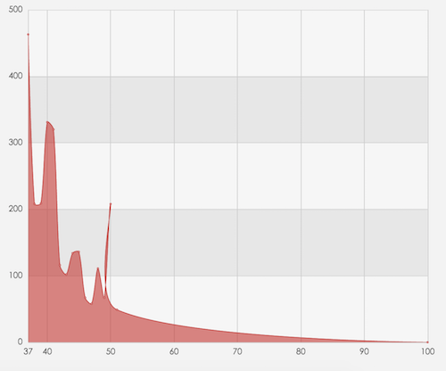
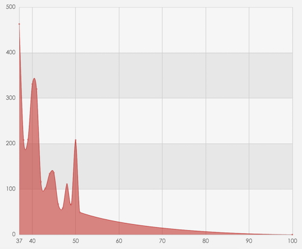

# option.series-line

## id
- **Type**: `string`

Component ID, not specified by default. If specified, it can be used to refer the component in option or API.

## name
- **Type**: `string`

Series name used for displaying in [tooltip](option.tooltip.md) and filtering with [legend](option.legend.md), or updating data and configuration with `setOption`.

## colorBy
- **Type**: `string`
- **Default**: `'series'`

Since `v5.2.0`

The policy to take color from [option.color](../option.md#color). Valid values:

*   `'series'`: assigns the colors in the palette by series, so that all data in the same series are in the same color;
*   `'data'`: assigns colors in the palette according to data items, with each data item using a different color.

## coordinateSystem
- **Type**: `string`
- **Default**: `'cartesian2d'`

Specifies another coordinate system component on which this `series-line` is laid out.

Options:

*   `'cartesian2d'`
    
    Lay out based on a two-dimensional [rectangular coordinate system (also known as Cartesian coordinate system)](option.grid.md). When multiple `xAxis` or multiple `yAxis` exist within an ECharts instance, the corresponding axes should be specified using [xAxisIndex](option.series-line.md#xAxisIndex) and [yAxisIndex](option.series-line.md#yAxisIndex) or [xAxisId](option.series-line.md#xAxisId) and [yAxisId](option.series-line.md#yAxisId).
    
    Note: some commonly used series, such as [series-line](option.series-line.md), [series-bar](option.series-bar.md), etc., can not be laid out directly based on [matrix coordinate system](option.matrix.md) or [calendar coordinate system](option.calendar.md), but they can be laid out on a [grid(Cartesian)](option.grid.md), and that [grid](option.grid.md) can be laid out on a [matrix](option.matrix.md) or [calendar](option.calendar.md).
    

*   `'polar'`
    
    Lay out based on a [polar coordinate system](option.polar.md). When multiple polar coordinate systems exist within an ECharts instance, the corresponding system should be specified using [polarIndex](option.series-line.md#polarIndex) or [polarId](option.series-line.md#polarId).
    

*   `'singleAxis'`
    
    Lay out based on a [singleAxis coordinate system](option.singleAxis.md). When multiple singleAxis coordinate systems exist within an ECharts instance, the corresponding system should be specified using [singleAxisIndex](option.series-line.md#polarIndex) or [singleAxisId](option.series-line.md#polarId).
    

**Support for series and component layout on coordinate systems:**

The leftmost column lists the series and components that will be laid out (coordinate systems themselves are also components), and the topmost row lists the coordinate systems that can be laid out on.

|  | no coord sys | [grid](option.grid.md) (cartesian2d) | [polar](option.polar.md) | [geo](option.geo.md) | [singleAxis](option.singleAxis.md) | [radar](option.radar.md) | [parallel](option.parallel.md) | [calendar](option.calendar.md) | [matrix](option.matrix.md) |
| --- | --- | --- | --- | --- | --- | --- | --- | --- | --- |
| [grid](option.grid.md) (cartesian2d) | ✅ | ❌ | ❌ | ❌ | ❌ | ❌ | ❌ | ✅ | ✅ |
| [polar](option.polar.md) | ✅ | ❌ | ❌ | ❌ | ❌ | ❌ | ❌ | ✅ | ✅ |
| [geo](option.geo.md) | ✅ | ❌ | ❌ | ❌ | ❌ | ❌ | ❌ | ✅ | ✅ |
| [singleAxis](option.singleAxis.md) | ✅ | ❌ | ❌ | ❌ | ❌ | ❌ | ❌ | ✅ | ✅ |
| [calendar](option.calendar.md) | ✅ | ❌ | ❌ | ❌ | ❌ | ❌ | ❌ | ❌ | ❌ |
| [matrix](option.matrix.md) | ✅ | ❌ | ❌ | ❌ | ❌ | ❌ | ❌ | ❌ | ❌ |
| [series-line](option.series-line.md) | ❌ | ✅ | ✅ | ❌ | ❌ | ❌ | ❌ | ❌ (✅ if via another coord sys like [grid](option.grid.md)) | ❌ (✅ if via another coord sys like [grid](option.grid.md)) |
| [series-bar](option.series-bar.md) | ❌ | ✅ | ✅ | ❌ | ❌ | ❌ | ❌ | ❌ (✅ if via another coord sys like [grid](option.grid.md)) | ❌ (✅ if via another coord sys like [grid](option.grid.md)) |
| [series-pie](option.series-pie.md) | ✅ | ✅ | ✅ | ✅ | ✅ | ❌ | ❌ | ✅ | ✅ |
| [series-scatter](option.series-scatter.md) | ❌ | ✅ | ✅ | ✅ | ✅ | ❌ | ❌ | ✅ | ✅ |
| [series-effectScatter](option.series-effectScatter.md) | ❌ | ✅ | ✅ | ✅ | ✅ | ❌ | ❌ | ✅ | ✅ |
| [series-radar](option.series-radar.md) | ❌ | ❌ | ❌ | ❌ | ❌ | ✅ | ❌ | ❌ (✅ if via [radar](option.radar.md) coord sys) | ❌ (✅ if via [radar](option.radar.md) coord sys) |
| [series-tree](option.series-tree.md) | ✅ | ❌ | ❌ | ❌ | ❌ | ❌ | ❌ | ✅ | ✅ |
| [series-treemap](option.series-treemap.md) | ✅ | ❌ | ❌ | ❌ | ❌ | ❌ | ❌ | ✅ | ✅ |
| [series-sunburst](option.series-sunburst.md) | ✅ | ❌ | ❌ | ❌ | ❌ | ❌ | ❌ | ✅ | ✅ |
| [series-boxplot](option.series-boxplot.md) | ❌ | ✅ | ❌ | ❌ | ❌ | ❌ | ❌ | ❌ (✅ if via another coord sys like [grid](option.grid.md)) | ❌ (✅ if via another coord sys like [grid](option.grid.md)) |
| [series-candlestick](option.series-candlestick.md) | ❌ | ✅ | ❌ | ❌ | ❌ | ❌ | ❌ | ❌ (✅ if via another coord sys like [grid](option.grid.md)) | ❌ (✅ if via another coord sys like [grid](option.grid.md)) |
| [series-heatmap](option.series-heatmap.md) | ❌ | ✅ | ❌ | ✅ | ❌ | ❌ | ❌ | ✅ | ✅ |
| [series-map](option.series-map.md) | ✅ (create a geo coord sys exclusively) | ❌ | ❌ | ✅ | ❌ | ❌ | ❌ | ✅ | ✅ |
| [series-parallel](option.series-parallel.md) | ❌ | ❌ | ❌ | ❌ | ❌ | ❌ | ✅ | ❌ (✅ if via [parallel](option.parallel.md) coord sys) | ❌ (✅ if via [parallel](option.parallel.md) coord sys) |
| [series-lines](option.series-lines.md) | ❌ | ✅ | ✅ | ✅ | ✅ | ❌ | ❌ | ❌ (✅ if via another coord sys like [geo](option.geo.md)) | ❌ (✅ if via another coord sys like [geo](option.geo.md)) |
| [series-graph](option.series-graph.md) | ✅ (create a "view" coord sys exclusively) | ✅ | ✅ | ✅ | ❌ | ❌ | ❌ | ✅ | ✅ |
| [series-sankey](option.series-sankey.md) | ✅ | ❌ | ❌ | ❌ | ❌ | ❌ | ❌ | ✅ | ✅ |
| [series-funnel](option.series-funnel.md) | ✅ | ❌ | ❌ | ❌ | ❌ | ❌ | ❌ | ✅ | ✅ |
| [series-gauge](option.series-gauge.md) | ✅ | ❌ | ❌ | ❌ | ❌ | ❌ | ❌ | ✅ | ✅ |
| [series-pictorialBar](option.series-pictorialBar.md) | ❌ | ✅ | ✅ | ❌ | ❌ | ❌ | ❌ | ❌ (✅ if via another coord sys like [grid](option.grid.md)) | ❌ (✅ if via another coord sys like [grid](option.grid.md)) |
| [series-themeRiver](option.series-themeRiver.md) | ❌ | ❌ | ❌ | ❌ | ✅ | ❌ | ❌ | ❌ (✅ if via another coord sys like [singleAxis](option.singleAxis.md)) | ❌ (✅ if via another coord sys like [singleAxis](option.singleAxis.md)) |
| [series-chord](option.series-chord.md) | ✅ | ✅ | ✅ | ✅ | ✅ | ❌ | ❌ | ✅ | ✅ |
| [title](option.title.md) | ✅ | ❌ | ❌ | ❌ | ❌ | ❌ | ❌ | ✅ | ✅ |
| [legend](option.legend.md) | ✅ | ❌ | ❌ | ❌ | ❌ | ❌ | ❌ | ✅ | ✅ |
| [dataZoom](../option.md#dataZoom) | ✅ | ❌ | ❌ | ❌ | ❌ | ❌ | ❌ | ✅ | ✅ |
| [visualMap](../option.md#visualMap) | ✅ | ❌ | ❌ | ❌ | ❌ | ❌ | ❌ | ✅ | ✅ |
| [toolbox](option.toolbox.md) | ✅ | ❌ | ❌ | ❌ | ❌ | ❌ | ❌ | ✅ | ✅ |
| [timeline](option.timeline.md) | ✅ | ❌ | ❌ | ❌ | ❌ | ❌ | ❌ | ✅ | ✅ |
| [thumbnail](option.thumbnail.md) | ✅ | ❌ | ❌ | ❌ | ❌ | ❌ | ❌ | ✅ | ✅ |

See also [series-line.coordinateSystemUsage](option.series-line.md#coordinateSystemUsage).

## coordinateSystemUsage
- **Type**: `string`
- **Default**: `'data'`

Since `v6.0.0`

Specify how to lay out this `series-line` based on the specified [coordinateSystem](option.series-line.md#coordinateSystem).

In most cases, there is no need to specify `coordinateSystemUsage`, unless the default behavior is unexpected.

Options:

*   `'data'`:
    
    Each data item of a series (e.g., each `series.data[i]`) is laid out separately based on the specified coordinate system. Currently no non-series component supports `coordinateSystemUsage: 'data'`.
    
*   `'box'`: **(Not applicable in [series-line](option.series-line.md))**
    
    The entire series or component is laid out as a whole based on the specified coordinate system - that is, the overall bounding rect or basic anchor point is calculated relative to the system.
    
    *   For example, a [grid component](option.grid.md) can be laid out in a [matrix coordinate system](option.matrix.md) or a [calendar coordinate system](option.calendar.md), where its layout rectangle is calculated by the specified [series-line.coords](option.series-line.md#coords) in that system. See example [sparkline in matrix](https://echarts.apache.org/examples/en/editor.html?c=matrix-sparkline&edit=1&reset=1).
    *   For example, a [pie series](option.series-pie.md) or a [chord series](option.series-chord.md) can be laid out in a [geo coordinate system](option.geo.md) or a [cartesian2d coordinate system](option.grid.md), where the center is calculated by the specified [series-pie.coords](option.series-pie.md#coords) or [series-pie.center](option.series-pie.md#center) in that system. See example [pie in geo](https://echarts.apache.org/examples/en/editor.html?c=map-iceland-pie&edit=1&reset=1).

Only a few series support both `coordinateSystemUsage: 'data'` and `coordinateSystemUsage: 'box'`, such as [series-graph](option.series-graph.md), [series-map](option.series-map.md). For examle, in [this example (coordinateSystemUsage: 'data')](https://echarts.apache.org/examples/en/editor.html?c=matrix-graph&edit=1&reset=1), each node of a graph series is laid out on a matrix coordinate system, while in [this example (coordinateSystemUsage: 'box')](https://echarts.apache.org/examples/en/editor.html?c=doc-example/matrix-graph-box&edit=1&reset=1), the entire graph series is laid out within a matrix cell.

Most series only support `coordinateSystemUsage: 'data'` - such as [series-line](option.series-line.md), [series-bar](option.series-bar.md), [series-scatter](option.series-scatter.md), etc. Meanwhile, some series only support `coordinateSystemUsage: 'box'` - such as [series-pie](option.series-pie.md) ([example: pie in geo](https://echarts.apache.org/examples/en/editor.html?c=map-iceland-pie&edit=1&reset=1)), [series-tree](option.series-pie.md), [series-treemap](option.series-treemap.md), [series-sankey](option.series-sankey.md), etc.

See also [series-line.coordinateSystem](option.series-line.md#coordinateSystem).

## coord
- **Type**: `Array|number|string`

Since `v6.0.0`

When [coordinateSystemUsage](option.series-line.md#coordinateSystemUsage) is `'box'`, `coord` is used as the input to the coordinate system and calculate the layout rectangle or anchor point.

Examples: [sparkline in matrix](https://echarts.apache.org/examples/en/editor.html?c=matrix-sparkline&edit=1&reset=1), [grpah in matrix](https://echarts.apache.org/examples/en/editor.html?c=doc-example/matrix-graph-box&edit=1&reset=1).

> Note: when [coordinateSystemUsage](option.series-line.md#coordinateSystemUsage) is `'data'`, the input of coordinate system is `series.data[i]` rather than this `coord`.

The format this `coord` is defined by each coordinate system, and it's the same as the second parameter of [chart.convertToPixel](../api-parts/api.echartsInstance.md#convertToPixel).

## xAxisIndex
- **Type**: `number`
- **Default**: `0`

The index of the [xAxis](option.xAxis.md) to base on. When mutiple `xAxis` components exist within an ECharts instance, use this to specify the corresponding `xAxis`.

## xAxisId
- **Type**: `number`
- **Default**: `undefined`

The id of the [xAxis](option.xAxis.md) to base on. When mutiple `xAxis` components exist within an ECharts instance, use this to specify the corresponding `xAxis`.

## yAxisIndex
- **Type**: `number`
- **Default**: `0`

The index of the [yAxis](option.yAxis.md) to base on. When mutiple `yAxis` components exist within an ECharts instance, use this to specify the corresponding `yAxis`.

## yAxisId
- **Type**: `number`
- **Default**: `undefined`

The index of the [yAxis](option.yAxis.md) to base on. When mutiple `yAxis` components exist within an ECharts instance, use this to specify the corresponding `yAxis`.

## polarIndex
- **Type**: `number`
- **Default**: `0`

The index of the [polar coordinate system](option.polar.md) to base on. When mutiple `polar` exist within an ECharts instance, use this to specify the corresponding `polar`.

## polarId
- **Type**: `number`
- **Default**: `undefined`

The id of the [polar coordinate system](option.polar.md) to base on. When mutiple `polar` exist within an ECharts instance, use this to specify the corresponding `polar`.

## singleAxisIndex
- **Type**: `number`
- **Default**: `0`

The index of the [singleAxis coordinate system](option.singleAxis.md) to base on. When mutiple `singleAxis` exist within an ECharts instance, use this to specify the corresponding `singleAxis`.

## singleAxisId
- **Type**: `number`
- **Default**: `undefined`

The id of the [singleAxis coordinate system](option.singleAxis.md) to base on. When mutiple `singleAxis` exist within an ECharts instance, use this to specify the corresponding `singleAxis`.

## symbol
- **Type**: `string|Function`
- **Default**: `'emptyCircle'`

Symbol of .

Icon types provided by ECharts includes

`'circle'`, `'rect'`, `'roundRect'`, `'triangle'`, `'diamond'`, `'pin'`, `'arrow'`, `'none'`

It can be set to an image with `'image://url'` , in which URL is the link to an image, or `dataURI` of an image.

An image URL example:

```
'image://http://example.website/a/b.png'
```

A `dataURI` example:

```
'image://data:image/gif;base64,R0lGODlhEAAQAMQAAORHHOVSKudfOulrSOp3WOyDZu6QdvCchPGolfO0o/XBs/fNwfjZ0frl3/zy7////wAAAAAAAAAAAAAAAAAAAAAAAAAAAAAAAAAAAAAAAAAAAAAAAAAAAAAAAAAAAAAAACH5BAkAABAALAAAAAAQABAAAAVVICSOZGlCQAosJ6mu7fiyZeKqNKToQGDsM8hBADgUXoGAiqhSvp5QAnQKGIgUhwFUYLCVDFCrKUE1lBavAViFIDlTImbKC5Gm2hB0SlBCBMQiB0UjIQA7'
```

Icons can be set to arbitrary vector path via `'path://'` in ECharts. As compared with a raster image, vector paths prevent jagging and blurring when scaled, and have better control over changing colors. The size of the vector icon will be adapted automatically. Refer to [SVG PathData](http://www.w3.org/TR/SVG/paths.html#PathData) for more information about the format of the path. You may export vector paths from tools like Adobe

For example:

```
'path://M30.9,53.2C16.8,53.2,5.3,41.7,5.3,27.6S16.8,2,30.9,2C45,2,56.4,13.5,56.4,27.6S45,53.2,30.9,53.2z M30.9,3.5C17.6,3.5,6.8,14.4,6.8,27.6c0,13.3,10.8,24.1,24.101,24.1C44.2,51.7,55,40.9,55,27.6C54.9,14.4,44.1,3.5,30.9,3.5z M36.9,35.8c0,0.601-0.4,1-0.9,1h-1.3c-0.5,0-0.9-0.399-0.9-1V19.5c0-0.6,0.4-1,0.9-1H36c0.5,0,0.9,0.4,0.9,1V35.8z M27.8,35.8 c0,0.601-0.4,1-0.9,1h-1.3c-0.5,0-0.9-0.399-0.9-1V19.5c0-0.6,0.4-1,0.9-1H27c0.5,0,0.9,0.4,0.9,1L27.8,35.8L27.8,35.8z'
```

If symbols needs to be different, you can set with callback function in the following format:

```
(value: Array|number, params: Object) => string
```

The first parameter `value` is the value in [data](option.series-line.md#data), and the second parameter `params` is the rest parameters of data item.

## symbolSize
- **Type**: `number|Array|Function`
- **Default**: `4`

symbol size. It can be set to single numbers like `10`, or use an array to represent width and height. For example, `[20, 10]` means symbol width is `20`, and height is`10`.

If size of symbols needs to be different, you can set with callback function in the following format:

```
(value: Array|number, params: Object) => number|Array
```

The first parameter `value` is the value in [data](option.series-line.md#data), and the second parameter `params` is the rest parameters of data item.

## symbolRotate
- **Type**: `number|Function`

Rotate degree of symbol. The negative value represents clockwise. Note that when `symbol` is set to be `'arrow'` in `markLine`, `symbolRotate` value will be ignored, and compulsively use tangent angle.

If rotation of symbols needs to be different, you can set with callback function in the following format:

```
(value: Array|number, params: Object) => number
```

The first parameter `value` is the value in [data](option.series-line.md#data), and the second parameter `params` is the rest parameters of data item.

> Callback is supported since 4.8.0 .

## symbolKeepAspect
- **Type**: `boolean`
- **Default**: `false`

Whether to keep aspect for symbols in the form of `path://`.

## symbolOffset
- **Type**: `Array`
- **Default**: `[0, 0]`

Offset of symbol relative to original position. By default, symbol will be put in the center position of data. But if symbol is from user-defined vector path or image, you may not expect symbol to be in center. In this case, you may use this attribute to set offset to default position. It can be in absolute pixel value, or in relative percentage value.

For example, `[0, '-50%']` means to move upside side position of symbol height. It can be used to make the arrow in the bottom to be at data position when symbol is pin.

## showSymbol
- **Type**: `boolean`
- **Default**: `true`

Whether to show symbol. It would be shown during tooltip hover.

## showAllSymbol
- **Type**: `boolean`
- **Default**: `'auto'`

Only work when main axis is `'category'` axis (`axis.type` is `'category'`). Optional values:

*   `'auto'`: Default value. Show all symbols if there is enough space. Otherwise follow the interval strategy with with [axisLabel.interval](option.xAxis.md#axisLabel.interval).
*   `true`: Show all symbols.
*   `false`: Follow the interval strategy with [axisLabel.interval](option.xAxis.md#axisLabel.interval).

## legendHoverLink
- **Type**: `boolean`
- **Default**: `true`

Whether to enable highlighting chart when [legend](option.legend.md) is being hovered.

## stack
- **Type**: `string`

Name of the stack group. Series with the same `stack` name on the **same category axis** will be stacked on top of each other. See [stackStrategy](option.series-line.md#stackStrategy) for customizing how values are stacked.

**Notice:** Stacking **only supports the stacked axis being of type** `'value'` or `'log'`. Axes of type `'time'` and `'category'` are **not supported** as the stacked axis.

You can view the effect of the example below by switching stacks in the [toolbox](option.toolbox.md) in the top-right corner.

## stackStrategy
- **Type**: `string`
- **Default**: `'samesign'`

Since `v5.3.3`

Strategy for stacking values, only effective when [stack](option.series-line.md#stack) is set. Optional values:

*   `'samesign'` Only stack values if the value to be stacked has the **same sign** as the currently cumulated stacked value. **(Default)**
*   `'all'` Stack all values regardless of positive or negative.
*   `'positive'` Only stack positive values.
*   `'negative'` Only stack negative values.

## stackOrder
- **Type**: `string`
- **Default**: `'seriesAsc'`

Since `v6.0.0`

Stack order. Optional values:

*   `'seriesAsc'` Stack in series order. **(Default)**
*   `'seriesDesc'` Stack in reversed series order.

**Notice:**

*   `stackOrder` should be defined for all series with the same `stack` name. If `stackOrder` is defined for only some of the series, the stack order may change unexpectedly when certain series are hidden (e.g., through legend toggle).
    
*   Not supported in `polar` coordinate system.

## cursor
- **Type**: `string`
- **Default**: `'pointer'`

The mouse style when mouse hovers on an element, the same as `cursor` property in `CSS`.

## connectNulls
- **Type**: `boolean`
- **Default**: `false`

Whether to connect the line across null points.

## clip
- **Type**: `boolean`
- **Default**: `true`

Since `v4.4.0`

If clip the overflow on the coordinate system. Clip results varies between series:

*   Scatter/EffectScatter：Ignore the symbols exceeds the coordinate system. Not clip the elements.
*   Bar：Clip all the overflowed. With bar width kept.
*   Line：Clip the overflowed line.
*   Lines: Clip all the overflowed.
*   Candlestick: Ignore the elements exceeds the coordinate system.
*   PictorialBar: Clip all the overflowed. (Supported since v5.5.0)
*   Custom: Clip all the olverflowed.

All these series have default value `true` except pictorialBar and custom series. Set it to `false` if you don't want to clip.

## triggerLineEvent
- **Type**: `boolean`
- **Default**: `false`

Since `v5.2.2`

Whether `line` and `area` can trigger the event.

## step
- **Type**: `string|boolean`
- **Default**: `false`

Whether to show as a step line. It can be `true`, `false`. Or `'start'`, `'middle'`, `'end'`. Which will configure the turn point of step line.

See the example using different `step` options:

## label
- **Type**: `Object`

Text label of , to explain some data information about graphic item like value, name and so on. `label` is placed under `itemStyle` in ECharts 2.x. In ECharts 3, to make the configuration structure flatter, `label`is taken to be at the same level with `itemStyle`, and has `emphasis` as `itemStyle` does.

### label.show
- **Type**: `boolean`
- **Default**: `false`

Whether to show label.

### label.position
- **Type**: `string|Array`
- **Default**: `'top'`

Label position.

**Followings are the options:**

*   \[x, y\]
    
    Use relative percentage, or absolute pixel values to represent position of label relative to top-left corner of bounding box. For example:
    
    ```
      // Absolute pixel values
      position: [10, 10],
      // Relative percentage
      position: ['50%', '50%']
    ```
    
*   'top'
    
*   'left'
*   'right'
*   'bottom'
*   'inside'
*   'insideLeft'
*   'insideRight'
*   'insideTop'
*   'insideBottom'
*   'insideTopLeft'
*   'insideBottomLeft'
*   'insideTopRight'
*   'insideBottomRight'

See: [label position](https://echarts.apache.org/examples/en/view.html?c=doc-example/label-position).

### label.distance
- **Type**: `number`
- **Default**: `5`

Distance to the host graphic element.

It is valid only when `position` is string value (like `'top'`、`'insideRight'`).

See: [label position](https://echarts.apache.org/examples/en/editor.html?c=doc-example/label-position).

### label.rotate
- **Type**: `number`

Rotate label, from -90 degree to 90, positive value represents rotate anti-clockwise.

See: [label rotation](https://echarts.apache.org/examples/en/editor.html?c=bar-label-rotation).

### label.offset
- **Type**: `Array`

Whether to move text slightly. For example: `[30, 40]` means move `30` horizontally and move `40` vertically.

### label.textMargin
- **Type**: `number|Array`

Since `v6.0.0`

The space around the label to escape from overlapping. The unit is px.

Notice: `textMargin` is applied on the label's local bounding rect, that is, if there is a `rotate` specified on the label, apply `textMargin` on the non-rotated label first, and then apply the rotation.

> The name is `textMargin` because historically the name `margin` has been used for a different purpose.

Examples:

```
// Set margin to be 5, means [5, 5, 5, 5]
textMargin: 5
// Set the top and bottom margin to be 5, and left and right margin to be 10
textMargin: [5, 10]
// Set each of the four margin separately
textMargin: [
    5,  // up
    10, // right
    5,  // down
    10, // left
]
```

### label.minMargin
- **Type**: `number`

Since `v5.0.0`

Minimal margin between labels. Used when label has [layout](../option.md#series.labelLayout).

`minMargin` conveys a similar meaning to `textMargin`, but with a different nuance. If unsure, just use `textMargin`; it basically covers `minMargin` and can provide a more compact layout for rotated labels in some scenarios.

> TL;DR: The difference:
> 
> *   The minimal gap (if applicable) between two labels is `label1.minMargin/2 + label2.minMargin/2`, or `label1.textMargin[number] + label2.textMargin[number]`.
> *   If `rotate` is specified on a label,
>     *   `minMargin`: first rotate the label, forming a new rect by the min/max of x/y from the four corner points (that is a expanded bounding rect), and finally `minMargin` is applied on the new rect.
>     *   `textMargin`: first applied on the label's local bounding rect, and then rotate.
> *   Data type: `minMargin` should be only `number`, `textMargin` can be `number | number[]` (follow CSS margin).

### label.formatter
- **Type**: `string|Function`

Data label formatter, which supports string template and callback function. In either form, `\n` is supported to represent a new line.

**String template**

Model variation includes:

*   `{a}`: series name.
*   `{b}`: the name of a data item.
*   `{c}`: the value of a data item.
*   `{@xxx}`: the value of a dimension named `'xxx'`, for example, `{@product}` refers the value of `'product'` dimension.
*   `{@[n]}`: the value of a dimension at the index of `n`, for example, `{@[3]}` refers the value at dimensions\[3\].

**example:**

```
formatter: '{b}: {@score}'
```

**Callback function**

Callback function is in form of:

```
(params: Object|Array) => string
```

where `params` is the single dataset needed by formatter, which is formed as:

```
{
    componentType: 'series',
    // Series type
    seriesType: string,
    // Series index in option.series
    seriesIndex: number,
    // Series name
    seriesName: string,
    // Data name, or category name
    name: string,
    // Data index in input data array
    dataIndex: number,
    // Original data as input
    data: Object,
    // Value of data. In most series it is the same as data.
    // But in some series it is some part of the data (e.g., in map, radar)
    value: number|Array|Object,
    // encoding info of coordinate system
    // Key: coord, like ('x' 'y' 'radius' 'angle')
    // value: Must be an array, not null/undefined. Contain dimension indices, like:
    // {
    //     x: [2] // values on dimension index 2 are mapped to x axis.
    //     y: [0] // values on dimension index 0 are mapped to y axis.
    // }
    encode: Object,
    // dimension names list
    dimensionNames: Array<String>,
    // data dimension index, for example 0 or 1 or 2 ...
    // Only work in `radar` series.
    dimensionIndex: number,
    // Color of data
    color: string
}
```

**How to use `encode` and `dimensionNames`?**

When the dataset is like

```
dataset: {
    source: [
        ['Matcha Latte', 43.3, 85.8, 93.7],
        ['Milk Tea', 83.1, 73.4, 55.1],
        ['Cheese Cocoa', 86.4, 65.2, 82.5],
        ['Walnut Brownie', 72.4, 53.9, 39.1]
    ]
}
```

We can get the value of the y-axis via

```
params.value[params.encode.y[0]]
```

When the dataset is like

```
dataset: {
    dimensions: ['product', '2015', '2016', '2017'],
    source: [
        {product: 'Matcha Latte', '2015': 43.3, '2016': 85.8, '2017': 93.7},
        {product: 'Milk Tea', '2015': 83.1, '2016': 73.4, '2017': 55.1},
        {product: 'Cheese Cocoa', '2015': 86.4, '2016': 65.2, '2017': 82.5},
        {product: 'Walnut Brownie', '2015': 72.4, '2016': 53.9, '2017': 39.1}
    ]
}
```

We can get the value of the y-axis via

```
params.value[params.dimensionNames[params.encode.y[0]]]
```

### label.color
- **Type**: `Color`
- **Default**: `'#fff'`

text color.

If set as `'inherit'`, the color will assigned as visual color, such as series color.

### label.fontStyle
- **Type**: `string`
- **Default**: `'normal'`

font style.

Options are:

*   `'normal'`
*   `'italic'`
*   `'oblique'`

### label.fontWeight
- **Type**: `string|number`
- **Default**: `'normal'`

font thick weight.

Options are:

*   `'normal'`
*   `'bold'`
*   `'bolder'`
*   `'lighter'`
*   100 | 200 | 300 | 400...

### label.fontFamily
- **Type**: `string`
- **Default**: `'sans-serif'`

font family.

Can also be 'serif' , 'monospace', ...

### label.fontSize
- **Type**: `number`
- **Default**: `12`

font size.

### label.align
- **Type**: `string`

Horizontal alignment of text, automatic by default.

Options are:

*   `'left'`
*   `'center'`
*   `'right'`

If `align` is not set in `rich`, `align` in parent level will be used. For example:

```
{
    align: right,
    rich: {
        a: {
            // `align` is not set, then it will be right
        }
    }
}
```

### label.verticalAlign
- **Type**: `string`

Vertical alignment of text, automatic by default.

Options are:

*   `'top'`
*   `'middle'`
*   `'bottom'`

If `verticalAlign` is not set in `rich`, `verticalAlign` in parent level will be used. For example:

```
{
    verticalAlign: bottom,
    rich: {
        a: {
            // `verticalAlign` is not set, then it will be bottom
        }
    }
}
```

### label.lineHeight
- **Type**: `number`

Line height of the text fragment.

If `lineHeight` is not set in `rich`, `lineHeight` in parent level will be used. For example:

```
{
    lineHeight: 56,
    rich: {
        a: {
            // `lineHeight` is not set, then it will be 56
        }
    }
}
```

### label.backgroundColor
- **Type**: `string|Object`
- **Default**: `'transparent'`

Background color of the text fragment.

Can be color string, like `'#123234'`, `'red'`, `'rgba(0,23,11,0.3)'`.

Or image can be used, for example:

```
backgroundColor: {
    image: 'xxx/xxx.png'
    // It can be URL of a image,
    // or dataURI,
    // or HTMLImageElement,
    // or HTMLCanvasElement.
}
```

`width` or `height` can be specified when using background image, or auto adapted by default.

If set as `'inherit'`, the color will assigned as visual color, such as series color.

### label.borderColor
- **Type**: `Color`

Border color of the text fragment.

If set as `'inherit'`, the color will assigned as visual color, such as series color.

### label.borderWidth
- **Type**: `number`
- **Default**: `0`

Border width of the text fragment.

### label.borderType
- **Type**: `string|number|Array`
- **Default**: `'solid'`

the text fragment border type.

Possible values are:

*   `'solid'`
*   `'dashed'`
*   `'dotted'`

Since `v5.0.0`, it can also be a number or a number array to specify the [dash array](https://developer.mozilla.org/en-US/docs/Web/SVG/Attribute/stroke-dasharray) of the line. With `borderDashOffset` , we can make the line style more flexible.

For example：

```
{

borderType: [5, 10],

borderDashOffset: 5
}
```

### label.borderDashOffset
- **Type**: `number`
- **Default**: `0`

Since `v5.0.0`

To set the line dash offset. With `borderType` , we can make the line style more flexible.

Refer to MDN [lineDashOffset](https://developer.mozilla.org/en-US/docs/Web/API/CanvasRenderingContext2D/lineDashOffset) for more details.

### label.borderRadius
- **Type**: `number`
- **Default**: `0`

Border radius of the text fragment.

### label.padding
- **Type**: `number|Array`
- **Default**: `0`

Padding of the text fragment, for example:

*   `padding: [3, 4, 5, 6]`: represents padding of `[top, right, bottom, left]`.
*   `padding: 4`: represents `padding: [4, 4, 4, 4]`.
*   `padding: [3, 4]`: represents `padding: [3, 4, 3, 4]`.

Notice, `width` and `height` specifies the width and height of the content, without `padding`.

### label.shadowColor
- **Type**: `Color`
- **Default**: `'transparent'`

Shadow color of the text block.

### label.shadowBlur
- **Type**: `number`
- **Default**: `0`

Show blur of the text block.

### label.shadowOffsetX
- **Type**: `number`
- **Default**: `0`

Shadow X offset of the text block.

### label.shadowOffsetY
- **Type**: `number`
- **Default**: `0`

Shadow Y offset of the text block.

### label.width
- **Type**: `number`

Width of text block.

### label.height
- **Type**: `number`

Height of text block.

### label.textBorderColor
- **Type**: `Color`

Stroke color of the text.

If set as `'inherit'`, the color will assigned as visual color, such as series color.

### label.textBorderWidth
- **Type**: `number`

Stroke line width of the text.

### label.textBorderType
- **Type**: `string|number|Array`
- **Default**: `'solid'`

Stroke line type of the text.

Possible values are:

*   `'solid'`
*   `'dashed'`
*   `'dotted'`

Since `v5.0.0`, it can also be a number or a number array to specify the [dash array](https://developer.mozilla.org/en-US/docs/Web/SVG/Attribute/stroke-dasharray) of the line. With `textBorderDashOffset` , we can make the line style more flexible.

For example：

```
{

textBorderType: [5, 10],

textBorderDashOffset: 5
}
```

### label.textBorderDashOffset
- **Type**: `number`
- **Default**: `0`

Since `v5.0.0`

To set the line dash offset. With `textBorderType` , we can make the line style more flexible.

Refer to MDN [lineDashOffset](https://developer.mozilla.org/en-US/docs/Web/API/CanvasRenderingContext2D/lineDashOffset) for more details.

### label.textShadowColor
- **Type**: `Color`
- **Default**: `'transparent'`

Shadow color of the text itself.

### label.textShadowBlur
- **Type**: `number`
- **Default**: `0`

Shadow blue of the text itself.

### label.textShadowOffsetX
- **Type**: `number`
- **Default**: `0`

Shadow X offset of the text itself.

### label.textShadowOffsetY
- **Type**: `number`
- **Default**: `0`

Shadow Y offset of the text itself.

### label.overflow
- **Type**: `string`
- **Default**: `'none'`

Determine how to display the text when it's overflow. Available when `width` is set.

*   `'truncate'` Truncate the text and trailing with `ellipsis`.
*   `'break'` Break by word
*   `'breakAll'` Break by character.

### label.ellipsis
- **Type**: `string`
- **Default**: `'...'`

Ellipsis to be displayed when `overflow` is set to `truncate`.

*   `'truncate'` Truncate the overflow lines.

### label.rich
- **Type**: `Object`

"Rich text styles" can be defined in this `rich` property. For example:

```
label: {
    // Styles defined in 'rich' can be applied to some fragments
    // of text by adding some markers to those fragment, like
    // `{styleName|text content text content}`.
    // `'\n'` is the newline character.
    formatter: [
        '{a|Style "a" is applied to this snippet}'
        '{b|Style "b" is applied to this snippet}This snippet use default style{x|use style "x"}'
    ].join('\n'),

    rich: {
        a: {
            color: 'red',
            lineHeight: 10
        },
        b: {
            backgroundColor: {
                image: 'xxx/xxx.jpg'
            },
            height: 40
        },
        x: {
            fontSize: 18,
            fontFamily: 'Microsoft YaHei',
            borderColor: '#449933',
            borderRadius: 4
        },
        ...
    }
}
```

For more details, see [Rich Text](../tutorial.md#Rich%20Text) please.

##### label.rich.<style_name>.color
- **Type**: `Color`
- **Default**: `'#fff'`

text color.

If set as `'inherit'`, the color will assigned as visual color, such as series color.

##### label.rich.<style_name>.fontStyle
- **Type**: `string`
- **Default**: `'normal'`

font style.

Options are:

*   `'normal'`
*   `'italic'`
*   `'oblique'`

##### label.rich.<style_name>.fontWeight
- **Type**: `string|number`
- **Default**: `'normal'`

font thick weight.

Options are:

*   `'normal'`
*   `'bold'`
*   `'bolder'`
*   `'lighter'`
*   100 | 200 | 300 | 400...

##### label.rich.<style_name>.fontFamily
- **Type**: `string`
- **Default**: `'sans-serif'`

font family.

Can also be 'serif' , 'monospace', ...

##### label.rich.<style_name>.fontSize
- **Type**: `number`
- **Default**: `12`

font size.

##### label.rich.<style_name>.align
- **Type**: `string`

Horizontal alignment of text, automatic by default.

Options are:

*   `'left'`
*   `'center'`
*   `'right'`

If `align` is not set in `rich`, `align` in parent level will be used. For example:

```
{
    align: right,
    rich: {
        a: {
            // `align` is not set, then it will be right
        }
    }
}
```

##### label.rich.<style_name>.verticalAlign
- **Type**: `string`

Vertical alignment of text, automatic by default.

Options are:

*   `'top'`
*   `'middle'`
*   `'bottom'`

If `verticalAlign` is not set in `rich`, `verticalAlign` in parent level will be used. For example:

```
{
    verticalAlign: bottom,
    rich: {
        a: {
            // `verticalAlign` is not set, then it will be bottom
        }
    }
}
```

##### label.rich.<style_name>.lineHeight
- **Type**: `number`

Line height of the text fragment.

If `lineHeight` is not set in `rich`, `lineHeight` in parent level will be used. For example:

```
{
    lineHeight: 56,
    rich: {
        a: {
            // `lineHeight` is not set, then it will be 56
        }
    }
}
```

##### label.rich.<style_name>.backgroundColor
- **Type**: `string|Object`
- **Default**: `'transparent'`

Background color of the text fragment.

Can be color string, like `'#123234'`, `'red'`, `'rgba(0,23,11,0.3)'`.

Or image can be used, for example:

```
backgroundColor: {
    image: 'xxx/xxx.png'
    // It can be URL of a image,
    // or dataURI,
    // or HTMLImageElement,
    // or HTMLCanvasElement.
}
```

`width` or `height` can be specified when using background image, or auto adapted by default.

If set as `'inherit'`, the color will assigned as visual color, such as series color.

##### label.rich.<style_name>.borderColor
- **Type**: `Color`

Border color of the text fragment.

If set as `'inherit'`, the color will assigned as visual color, such as series color.

##### label.rich.<style_name>.borderWidth
- **Type**: `number`
- **Default**: `0`

Border width of the text fragment.

##### label.rich.<style_name>.borderType
- **Type**: `string|number|Array`
- **Default**: `'solid'`

the text fragment border type.

Possible values are:

*   `'solid'`
*   `'dashed'`
*   `'dotted'`

Since `v5.0.0`, it can also be a number or a number array to specify the [dash array](https://developer.mozilla.org/en-US/docs/Web/SVG/Attribute/stroke-dasharray) of the line. With `borderDashOffset` , we can make the line style more flexible.

For example：

```
{

borderType: [5, 10],

borderDashOffset: 5
}
```

##### label.rich.<style_name>.borderDashOffset
- **Type**: `number`
- **Default**: `0`

Since `v5.0.0`

To set the line dash offset. With `borderType` , we can make the line style more flexible.

Refer to MDN [lineDashOffset](https://developer.mozilla.org/en-US/docs/Web/API/CanvasRenderingContext2D/lineDashOffset) for more details.

##### label.rich.<style_name>.borderRadius
- **Type**: `number`
- **Default**: `0`

Border radius of the text fragment.

##### label.rich.<style_name>.padding
- **Type**: `number|Array`
- **Default**: `0`

Padding of the text fragment, for example:

*   `padding: [3, 4, 5, 6]`: represents padding of `[top, right, bottom, left]`.
*   `padding: 4`: represents `padding: [4, 4, 4, 4]`.
*   `padding: [3, 4]`: represents `padding: [3, 4, 3, 4]`.

Notice, `width` and `height` specifies the width and height of the content, without `padding`.

##### label.rich.<style_name>.shadowColor
- **Type**: `Color`
- **Default**: `'transparent'`

Shadow color of the text block.

##### label.rich.<style_name>.shadowBlur
- **Type**: `number`
- **Default**: `0`

Show blur of the text block.

##### label.rich.<style_name>.shadowOffsetX
- **Type**: `number`
- **Default**: `0`

Shadow X offset of the text block.

##### label.rich.<style_name>.shadowOffsetY
- **Type**: `number`
- **Default**: `0`

Shadow Y offset of the text block.

##### label.rich.<style_name>.width
- **Type**: `number|string`

Width of the text block. It is the width of the text by default. In most cases, there is no need to specify it. You may want to use it in some cases like make simple table or using background image (see `backgroundColor`).

Notice, `width` and `height` specifies the width and height of the content, without `padding`.

`width` can also be percent string, like `'100%'`, which represents the percent of `contentWidth` (that is, the width without `padding`) of its container box. It is based on `contentWidth` because that each text fragment is layout based on the `content box`, where it makes no sense that calculating width based on `outerWith` in prectice.

Notice, `width` and `height` only work when `rich` specified.

##### label.rich.<style_name>.height
- **Type**: `number|string`

Height of the text block. It is the width of the text by default. You may want to use it in some cases like using background image (see `backgroundColor`).

Notice, `width` and `height` specifies the width and height of the content, without `padding`.

Notice, `width` and `height` only work when `rich` specified.

##### label.rich.<style_name>.textBorderColor
- **Type**: `Color`

Stroke color of the text.

If set as `'inherit'`, the color will assigned as visual color, such as series color.

##### label.rich.<style_name>.textBorderWidth
- **Type**: `number`

Stroke line width of the text.

##### label.rich.<style_name>.textBorderType
- **Type**: `string|number|Array`
- **Default**: `'solid'`

Stroke line type of the text.

Possible values are:

*   `'solid'`
*   `'dashed'`
*   `'dotted'`

Since `v5.0.0`, it can also be a number or a number array to specify the [dash array](https://developer.mozilla.org/en-US/docs/Web/SVG/Attribute/stroke-dasharray) of the line. With `textBorderDashOffset` , we can make the line style more flexible.

For example：

```
{

textBorderType: [5, 10],

textBorderDashOffset: 5
}
```

##### label.rich.<style_name>.textBorderDashOffset
- **Type**: `number`
- **Default**: `0`

Since `v5.0.0`

To set the line dash offset. With `textBorderType` , we can make the line style more flexible.

Refer to MDN [lineDashOffset](https://developer.mozilla.org/en-US/docs/Web/API/CanvasRenderingContext2D/lineDashOffset) for more details.

##### label.rich.<style_name>.textShadowColor
- **Type**: `Color`
- **Default**: `'transparent'`

Shadow color of the text itself.

##### label.rich.<style_name>.textShadowBlur
- **Type**: `number`
- **Default**: `0`

Shadow blue of the text itself.

##### label.rich.<style_name>.textShadowOffsetX
- **Type**: `number`
- **Default**: `0`

Shadow X offset of the text itself.

##### label.rich.<style_name>.textShadowOffsetY
- **Type**: `number`
- **Default**: `0`

Shadow Y offset of the text itself.

### label.richInheritPlainLabel
- **Type**: `boolean`
- **Default**: `true`

Since `v6.0.0`

Whether rich text inherits plain text style.

This option is just for backward compatibility.

> The [label.rich / textStyle.rich](option.series-scatter.md#label.rich) `fontStyle`, `fontWeight`, `fontSize`, `fontFamily`, `textShadowColor`, `textShadowBlur`, `textShadowOffsetX`, `textShadowOffsetY` are changed to inherit the corresponding [plain label styles](option.series-scatter.md#label) since echarts v6. You can use `richInheritPlainLabel: false` to restore it. For example,
> 
> ```
> option = {
>     richInheritPlainLabel: false, // In most cases, this is enough.
>     xxx1: {
>         // Can also set it here to only control this label.
>         label: {
>             richInheritPlainLabel: false,
>             rich: {/* ... */},
>         }
>     },
>     xxx2: {
>         textStyle: {
>             richInheritPlainLabel: false,
>             rich: {/* ... */},
>         }
>     }
> }
> ```

## endLabel
- **Type**: `Object`

Since `v5.0.0`

Label on the end of line.

### endLabel.show
- **Type**: `boolean`
- **Default**: `false`

Whether to show label.

### endLabel.distance
- **Type**: `number`
- **Default**: `5`

Distance to the host graphic element.

### endLabel.rotate
- **Type**: `number`

Rotate label, from -90 degree to 90, positive value represents rotate anti-clockwise.

See: [label rotation](https://echarts.apache.org/examples/en/editor.html?c=bar-label-rotation).

### endLabel.offset
- **Type**: `Array`

Whether to move text slightly. For example: `[30, 40]` means move `30` horizontally and move `40` vertically.

### endLabel.textMargin
- **Type**: `number|Array`

Since `v6.0.0`

The space around the label to escape from overlapping. The unit is px.

Notice: `textMargin` is applied on the label's local bounding rect, that is, if there is a `rotate` specified on the label, apply `textMargin` on the non-rotated label first, and then apply the rotation.

> The name is `textMargin` because historically the name `margin` has been used for a different purpose.

Examples:

```
// Set margin to be 5, means [5, 5, 5, 5]
textMargin: 5
// Set the top and bottom margin to be 5, and left and right margin to be 10
textMargin: [5, 10]
// Set each of the four margin separately
textMargin: [
    5,  // up
    10, // right
    5,  // down
    10, // left
]
```

### endLabel.minMargin
- **Type**: `number`

Since `v5.0.0`

Minimal margin between labels. Used when label has [layout](../option.md#series.labelLayout).

`minMargin` conveys a similar meaning to `textMargin`, but with a different nuance. If unsure, just use `textMargin`; it basically covers `minMargin` and can provide a more compact layout for rotated labels in some scenarios.

> TL;DR: The difference:
> 
> *   The minimal gap (if applicable) between two labels is `label1.minMargin/2 + label2.minMargin/2`, or `label1.textMargin[number] + label2.textMargin[number]`.
> *   If `rotate` is specified on a label,
>     *   `minMargin`: first rotate the label, forming a new rect by the min/max of x/y from the four corner points (that is a expanded bounding rect), and finally `minMargin` is applied on the new rect.
>     *   `textMargin`: first applied on the label's local bounding rect, and then rotate.
> *   Data type: `minMargin` should be only `number`, `textMargin` can be `number | number[]` (follow CSS margin).

### endLabel.formatter
- **Type**: `string|Function`

Data label formatter, which supports string template and callback function. In either form, `\n` is supported to represent a new line.

**String template**

Model variation includes:

*   `{a}`: series name.
*   `{b}`: the name of a data item.
*   `{c}`: the value of a data item.
*   `{@xxx}`: the value of a dimension named `'xxx'`, for example, `{@product}` refers the value of `'product'` dimension.
*   `{@[n]}`: the value of a dimension at the index of `n`, for example, `{@[3]}` refers the value at dimensions\[3\].

**example:**

```
formatter: '{b}: {@score}'
```

**Callback function**

Callback function is in form of:

```
(params: Object|Array) => string
```

where `params` is the single dataset needed by formatter, which is formed as:

```
{
    componentType: 'series',
    // Series type
    seriesType: string,
    // Series index in option.series
    seriesIndex: number,
    // Series name
    seriesName: string,
    // Data name, or category name
    name: string,
    // Data index in input data array
    dataIndex: number,
    // Original data as input
    data: Object,
    // Value of data. In most series it is the same as data.
    // But in some series it is some part of the data (e.g., in map, radar)
    value: number|Array|Object,
    // encoding info of coordinate system
    // Key: coord, like ('x' 'y' 'radius' 'angle')
    // value: Must be an array, not null/undefined. Contain dimension indices, like:
    // {
    //     x: [2] // values on dimension index 2 are mapped to x axis.
    //     y: [0] // values on dimension index 0 are mapped to y axis.
    // }
    encode: Object,
    // dimension names list
    dimensionNames: Array<String>,
    // data dimension index, for example 0 or 1 or 2 ...
    // Only work in `radar` series.
    dimensionIndex: number,
    // Color of data
    color: string
}
```

**How to use `encode` and `dimensionNames`?**

When the dataset is like

```
dataset: {
    source: [
        ['Matcha Latte', 43.3, 85.8, 93.7],
        ['Milk Tea', 83.1, 73.4, 55.1],
        ['Cheese Cocoa', 86.4, 65.2, 82.5],
        ['Walnut Brownie', 72.4, 53.9, 39.1]
    ]
}
```

We can get the value of the y-axis via

```
params.value[params.encode.y[0]]
```

When the dataset is like

```
dataset: {
    dimensions: ['product', '2015', '2016', '2017'],
    source: [
        {product: 'Matcha Latte', '2015': 43.3, '2016': 85.8, '2017': 93.7},
        {product: 'Milk Tea', '2015': 83.1, '2016': 73.4, '2017': 55.1},
        {product: 'Cheese Cocoa', '2015': 86.4, '2016': 65.2, '2017': 82.5},
        {product: 'Walnut Brownie', '2015': 72.4, '2016': 53.9, '2017': 39.1}
    ]
}
```

We can get the value of the y-axis via

```
params.value[params.dimensionNames[params.encode.y[0]]]
```

### endLabel.color
- **Type**: `Color`
- **Default**: `'#fff'`

text color.

If set as `'inherit'`, the color will assigned as visual color, such as series color.

### endLabel.fontStyle
- **Type**: `string`
- **Default**: `'normal'`

font style.

Options are:

*   `'normal'`
*   `'italic'`
*   `'oblique'`

### endLabel.fontWeight
- **Type**: `string|number`
- **Default**: `'normal'`

font thick weight.

Options are:

*   `'normal'`
*   `'bold'`
*   `'bolder'`
*   `'lighter'`
*   100 | 200 | 300 | 400...

### endLabel.fontFamily
- **Type**: `string`
- **Default**: `'sans-serif'`

font family.

Can also be 'serif' , 'monospace', ...

### endLabel.fontSize
- **Type**: `number`
- **Default**: `12`

font size.

### endLabel.align
- **Type**: `string`

Horizontal alignment of text, automatic by default.

Options are:

*   `'left'`
*   `'center'`
*   `'right'`

If `align` is not set in `rich`, `align` in parent level will be used. For example:

```
{
    align: right,
    rich: {
        a: {
            // `align` is not set, then it will be right
        }
    }
}
```

### endLabel.verticalAlign
- **Type**: `string`

Vertical alignment of text, automatic by default.

Options are:

*   `'top'`
*   `'middle'`
*   `'bottom'`

If `verticalAlign` is not set in `rich`, `verticalAlign` in parent level will be used. For example:

```
{
    verticalAlign: bottom,
    rich: {
        a: {
            // `verticalAlign` is not set, then it will be bottom
        }
    }
}
```

### endLabel.lineHeight
- **Type**: `number`

Line height of the text fragment.

If `lineHeight` is not set in `rich`, `lineHeight` in parent level will be used. For example:

```
{
    lineHeight: 56,
    rich: {
        a: {
            // `lineHeight` is not set, then it will be 56
        }
    }
}
```

### endLabel.backgroundColor
- **Type**: `string|Object`
- **Default**: `'transparent'`

Background color of the text fragment.

Can be color string, like `'#123234'`, `'red'`, `'rgba(0,23,11,0.3)'`.

Or image can be used, for example:

```
backgroundColor: {
    image: 'xxx/xxx.png'
    // It can be URL of a image,
    // or dataURI,
    // or HTMLImageElement,
    // or HTMLCanvasElement.
}
```

`width` or `height` can be specified when using background image, or auto adapted by default.

If set as `'inherit'`, the color will assigned as visual color, such as series color.

### endLabel.borderColor
- **Type**: `Color`

Border color of the text fragment.

If set as `'inherit'`, the color will assigned as visual color, such as series color.

### endLabel.borderWidth
- **Type**: `number`
- **Default**: `0`

Border width of the text fragment.

### endLabel.borderType
- **Type**: `string|number|Array`
- **Default**: `'solid'`

the text fragment border type.

Possible values are:

*   `'solid'`
*   `'dashed'`
*   `'dotted'`

Since `v5.0.0`, it can also be a number or a number array to specify the [dash array](https://developer.mozilla.org/en-US/docs/Web/SVG/Attribute/stroke-dasharray) of the line. With `borderDashOffset` , we can make the line style more flexible.

For example：

```
{

borderType: [5, 10],

borderDashOffset: 5
}
```

### endLabel.borderDashOffset
- **Type**: `number`
- **Default**: `0`

Since `v5.0.0`

To set the line dash offset. With `borderType` , we can make the line style more flexible.

Refer to MDN [lineDashOffset](https://developer.mozilla.org/en-US/docs/Web/API/CanvasRenderingContext2D/lineDashOffset) for more details.

### endLabel.borderRadius
- **Type**: `number`
- **Default**: `0`

Border radius of the text fragment.

### endLabel.padding
- **Type**: `number|Array`
- **Default**: `0`

Padding of the text fragment, for example:

*   `padding: [3, 4, 5, 6]`: represents padding of `[top, right, bottom, left]`.
*   `padding: 4`: represents `padding: [4, 4, 4, 4]`.
*   `padding: [3, 4]`: represents `padding: [3, 4, 3, 4]`.

Notice, `width` and `height` specifies the width and height of the content, without `padding`.

### endLabel.shadowColor
- **Type**: `Color`
- **Default**: `'transparent'`

Shadow color of the text block.

### endLabel.shadowBlur
- **Type**: `number`
- **Default**: `0`

Show blur of the text block.

### endLabel.shadowOffsetX
- **Type**: `number`
- **Default**: `0`

Shadow X offset of the text block.

### endLabel.shadowOffsetY
- **Type**: `number`
- **Default**: `0`

Shadow Y offset of the text block.

### endLabel.width
- **Type**: `number`

Width of text block.

### endLabel.height
- **Type**: `number`

Height of text block.

### endLabel.textBorderColor
- **Type**: `Color`

Stroke color of the text.

If set as `'inherit'`, the color will assigned as visual color, such as series color.

### endLabel.textBorderWidth
- **Type**: `number`

Stroke line width of the text.

### endLabel.textBorderType
- **Type**: `string|number|Array`
- **Default**: `'solid'`

Stroke line type of the text.

Possible values are:

*   `'solid'`
*   `'dashed'`
*   `'dotted'`

Since `v5.0.0`, it can also be a number or a number array to specify the [dash array](https://developer.mozilla.org/en-US/docs/Web/SVG/Attribute/stroke-dasharray) of the line. With `textBorderDashOffset` , we can make the line style more flexible.

For example：

```
{

textBorderType: [5, 10],

textBorderDashOffset: 5
}
```

### endLabel.textBorderDashOffset
- **Type**: `number`
- **Default**: `0`

Since `v5.0.0`

To set the line dash offset. With `textBorderType` , we can make the line style more flexible.

Refer to MDN [lineDashOffset](https://developer.mozilla.org/en-US/docs/Web/API/CanvasRenderingContext2D/lineDashOffset) for more details.

### endLabel.textShadowColor
- **Type**: `Color`
- **Default**: `'transparent'`

Shadow color of the text itself.

### endLabel.textShadowBlur
- **Type**: `number`
- **Default**: `0`

Shadow blue of the text itself.

### endLabel.textShadowOffsetX
- **Type**: `number`
- **Default**: `0`

Shadow X offset of the text itself.

### endLabel.textShadowOffsetY
- **Type**: `number`
- **Default**: `0`

Shadow Y offset of the text itself.

### endLabel.overflow
- **Type**: `string`
- **Default**: `'none'`

Determine how to display the text when it's overflow. Available when `width` is set.

*   `'truncate'` Truncate the text and trailing with `ellipsis`.
*   `'break'` Break by word
*   `'breakAll'` Break by character.

### endLabel.ellipsis
- **Type**: `string`
- **Default**: `'...'`

Ellipsis to be displayed when `overflow` is set to `truncate`.

*   `'truncate'` Truncate the overflow lines.

### endLabel.rich
- **Type**: `Object`

"Rich text styles" can be defined in this `rich` property. For example:

```
label: {
    // Styles defined in 'rich' can be applied to some fragments
    // of text by adding some markers to those fragment, like
    // `{styleName|text content text content}`.
    // `'\n'` is the newline character.
    formatter: [
        '{a|Style "a" is applied to this snippet}'
        '{b|Style "b" is applied to this snippet}This snippet use default style{x|use style "x"}'
    ].join('\n'),

    rich: {
        a: {
            color: 'red',
            lineHeight: 10
        },
        b: {
            backgroundColor: {
                image: 'xxx/xxx.jpg'
            },
            height: 40
        },
        x: {
            fontSize: 18,
            fontFamily: 'Microsoft YaHei',
            borderColor: '#449933',
            borderRadius: 4
        },
        ...
    }
}
```

For more details, see [Rich Text](../tutorial.md#Rich%20Text) please.

##### endLabel.rich.<style_name>.color
- **Type**: `Color`
- **Default**: `'#fff'`

text color.

If set as `'inherit'`, the color will assigned as visual color, such as series color.

##### endLabel.rich.<style_name>.fontStyle
- **Type**: `string`
- **Default**: `'normal'`

font style.

Options are:

*   `'normal'`
*   `'italic'`
*   `'oblique'`

##### endLabel.rich.<style_name>.fontWeight
- **Type**: `string|number`
- **Default**: `'normal'`

font thick weight.

Options are:

*   `'normal'`
*   `'bold'`
*   `'bolder'`
*   `'lighter'`
*   100 | 200 | 300 | 400...

##### endLabel.rich.<style_name>.fontFamily
- **Type**: `string`
- **Default**: `'sans-serif'`

font family.

Can also be 'serif' , 'monospace', ...

##### endLabel.rich.<style_name>.fontSize
- **Type**: `number`
- **Default**: `12`

font size.

##### endLabel.rich.<style_name>.align
- **Type**: `string`

Horizontal alignment of text, automatic by default.

Options are:

*   `'left'`
*   `'center'`
*   `'right'`

If `align` is not set in `rich`, `align` in parent level will be used. For example:

```
{
    align: right,
    rich: {
        a: {
            // `align` is not set, then it will be right
        }
    }
}
```

##### endLabel.rich.<style_name>.verticalAlign
- **Type**: `string`

Vertical alignment of text, automatic by default.

Options are:

*   `'top'`
*   `'middle'`
*   `'bottom'`

If `verticalAlign` is not set in `rich`, `verticalAlign` in parent level will be used. For example:

```
{
    verticalAlign: bottom,
    rich: {
        a: {
            // `verticalAlign` is not set, then it will be bottom
        }
    }
}
```

##### endLabel.rich.<style_name>.lineHeight
- **Type**: `number`

Line height of the text fragment.

If `lineHeight` is not set in `rich`, `lineHeight` in parent level will be used. For example:

```
{
    lineHeight: 56,
    rich: {
        a: {
            // `lineHeight` is not set, then it will be 56
        }
    }
}
```

##### endLabel.rich.<style_name>.backgroundColor
- **Type**: `string|Object`
- **Default**: `'transparent'`

Background color of the text fragment.

Can be color string, like `'#123234'`, `'red'`, `'rgba(0,23,11,0.3)'`.

Or image can be used, for example:

```
backgroundColor: {
    image: 'xxx/xxx.png'
    // It can be URL of a image,
    // or dataURI,
    // or HTMLImageElement,
    // or HTMLCanvasElement.
}
```

`width` or `height` can be specified when using background image, or auto adapted by default.

If set as `'inherit'`, the color will assigned as visual color, such as series color.

##### endLabel.rich.<style_name>.borderColor
- **Type**: `Color`

Border color of the text fragment.

If set as `'inherit'`, the color will assigned as visual color, such as series color.

##### endLabel.rich.<style_name>.borderWidth
- **Type**: `number`
- **Default**: `0`

Border width of the text fragment.

##### endLabel.rich.<style_name>.borderType
- **Type**: `string|number|Array`
- **Default**: `'solid'`

the text fragment border type.

Possible values are:

*   `'solid'`
*   `'dashed'`
*   `'dotted'`

Since `v5.0.0`, it can also be a number or a number array to specify the [dash array](https://developer.mozilla.org/en-US/docs/Web/SVG/Attribute/stroke-dasharray) of the line. With `borderDashOffset` , we can make the line style more flexible.

For example：

```
{

borderType: [5, 10],

borderDashOffset: 5
}
```

##### endLabel.rich.<style_name>.borderDashOffset
- **Type**: `number`
- **Default**: `0`

Since `v5.0.0`

To set the line dash offset. With `borderType` , we can make the line style more flexible.

Refer to MDN [lineDashOffset](https://developer.mozilla.org/en-US/docs/Web/API/CanvasRenderingContext2D/lineDashOffset) for more details.

##### endLabel.rich.<style_name>.borderRadius
- **Type**: `number`
- **Default**: `0`

Border radius of the text fragment.

##### endLabel.rich.<style_name>.padding
- **Type**: `number|Array`
- **Default**: `0`

Padding of the text fragment, for example:

*   `padding: [3, 4, 5, 6]`: represents padding of `[top, right, bottom, left]`.
*   `padding: 4`: represents `padding: [4, 4, 4, 4]`.
*   `padding: [3, 4]`: represents `padding: [3, 4, 3, 4]`.

Notice, `width` and `height` specifies the width and height of the content, without `padding`.

##### endLabel.rich.<style_name>.shadowColor
- **Type**: `Color`
- **Default**: `'transparent'`

Shadow color of the text block.

##### endLabel.rich.<style_name>.shadowBlur
- **Type**: `number`
- **Default**: `0`

Show blur of the text block.

##### endLabel.rich.<style_name>.shadowOffsetX
- **Type**: `number`
- **Default**: `0`

Shadow X offset of the text block.

##### endLabel.rich.<style_name>.shadowOffsetY
- **Type**: `number`
- **Default**: `0`

Shadow Y offset of the text block.

##### endLabel.rich.<style_name>.width
- **Type**: `number|string`

Width of the text block. It is the width of the text by default. In most cases, there is no need to specify it. You may want to use it in some cases like make simple table or using background image (see `backgroundColor`).

Notice, `width` and `height` specifies the width and height of the content, without `padding`.

`width` can also be percent string, like `'100%'`, which represents the percent of `contentWidth` (that is, the width without `padding`) of its container box. It is based on `contentWidth` because that each text fragment is layout based on the `content box`, where it makes no sense that calculating width based on `outerWith` in prectice.

Notice, `width` and `height` only work when `rich` specified.

##### endLabel.rich.<style_name>.height
- **Type**: `number|string`

Height of the text block. It is the width of the text by default. You may want to use it in some cases like using background image (see `backgroundColor`).

Notice, `width` and `height` specifies the width and height of the content, without `padding`.

Notice, `width` and `height` only work when `rich` specified.

##### endLabel.rich.<style_name>.textBorderColor
- **Type**: `Color`

Stroke color of the text.

If set as `'inherit'`, the color will assigned as visual color, such as series color.

##### endLabel.rich.<style_name>.textBorderWidth
- **Type**: `number`

Stroke line width of the text.

##### endLabel.rich.<style_name>.textBorderType
- **Type**: `string|number|Array`
- **Default**: `'solid'`

Stroke line type of the text.

Possible values are:

*   `'solid'`
*   `'dashed'`
*   `'dotted'`

Since `v5.0.0`, it can also be a number or a number array to specify the [dash array](https://developer.mozilla.org/en-US/docs/Web/SVG/Attribute/stroke-dasharray) of the line. With `textBorderDashOffset` , we can make the line style more flexible.

For example：

```
{

textBorderType: [5, 10],

textBorderDashOffset: 5
}
```

##### endLabel.rich.<style_name>.textBorderDashOffset
- **Type**: `number`
- **Default**: `0`

Since `v5.0.0`

To set the line dash offset. With `textBorderType` , we can make the line style more flexible.

Refer to MDN [lineDashOffset](https://developer.mozilla.org/en-US/docs/Web/API/CanvasRenderingContext2D/lineDashOffset) for more details.

##### endLabel.rich.<style_name>.textShadowColor
- **Type**: `Color`
- **Default**: `'transparent'`

Shadow color of the text itself.

##### endLabel.rich.<style_name>.textShadowBlur
- **Type**: `number`
- **Default**: `0`

Shadow blue of the text itself.

##### endLabel.rich.<style_name>.textShadowOffsetX
- **Type**: `number`
- **Default**: `0`

Shadow X offset of the text itself.

##### endLabel.rich.<style_name>.textShadowOffsetY
- **Type**: `number`
- **Default**: `0`

Shadow Y offset of the text itself.

### endLabel.richInheritPlainLabel
- **Type**: `boolean`
- **Default**: `true`

Since `v6.0.0`

Whether rich text inherits plain text style.

This option is just for backward compatibility.

> The [label.rich / textStyle.rich](option.series-scatter.md#label.rich) `fontStyle`, `fontWeight`, `fontSize`, `fontFamily`, `textShadowColor`, `textShadowBlur`, `textShadowOffsetX`, `textShadowOffsetY` are changed to inherit the corresponding [plain label styles](option.series-scatter.md#label) since echarts v6. You can use `richInheritPlainLabel: false` to restore it. For example,
> 
> ```
> option = {
>     richInheritPlainLabel: false, // In most cases, this is enough.
>     xxx1: {
>         // Can also set it here to only control this label.
>         label: {
>             richInheritPlainLabel: false,
>             rich: {/* ... */},
>         }
>     },
>     xxx2: {
>         textStyle: {
>             richInheritPlainLabel: false,
>             rich: {/* ... */},
>         }
>     }
> }
> ```

### endLabel.valueAnimation
- **Type**: `boolean`

Whether to enable text animation of value change.

## labelLine
- **Type**: `Object`

Since `v5.0.0`

Configuration of label guide line.

### labelLine.show
- **Type**: `boolean`

Whether to show the label guide line.

### labelLine.showAbove
- **Type**: `boolean`

Since `v5.0.0`

Whether to show the label guide line above the corresponding element.

### labelLine.length2
- **Type**: `number`

The length of the second segment of guide line.

### labelLine.smooth
- **Type**: `boolean|number`
- **Default**: `false`

Whether to smooth the guide line. It defaults to be `false` and can be set as `true` or the values from 0 to 1 which indicating the smoothness.

### labelLine.minTurnAngle
- **Type**: `number`

Since `v5.0.0`

Minimum turn angle between two segments of guide line to prevent unaesthetic display when angle is too small.

Can be 0 - 180 degree.

#### labelLine.lineStyle.color
- **Type**: `Color`
- **Default**: `"#000"`

Line color.

> Supports setting as solid color using `rgb(255,255,255)`, `rgba(255,255,255,1)`, `#fff`, etc. Also supports setting as gradient color and pattern fill, see [option.color](../option.md#color) for details

#### labelLine.lineStyle.width
- **Type**: `number`
- **Default**: `0`

line width.

#### labelLine.lineStyle.type
- **Type**: `string|number|Array`
- **Default**: `'solid'`

line type.

Possible values are:

*   `'solid'`
*   `'dashed'`
*   `'dotted'`

Since `v5.0.0`, it can also be a number or a number array to specify the [dash array](https://developer.mozilla.org/en-US/docs/Web/SVG/Attribute/stroke-dasharray) of the line. With `dashOffset` , we can make the line style more flexible.

For example：

```
{

type: [5, 10],

dashOffset: 5
}
```

#### labelLine.lineStyle.dashOffset
- **Type**: `number`
- **Default**: `0`

Since `v5.0.0`

To set the line dash offset. With `type` , we can make the line style more flexible.

Refer to MDN [lineDashOffset](https://developer.mozilla.org/en-US/docs/Web/API/CanvasRenderingContext2D/lineDashOffset) for more details.

#### labelLine.lineStyle.cap
- **Type**: `string`
- **Default**: `'butt'`

Since `v5.0.0`

To specify how to draw the end points of the line. Possible values are:

*   `'butt'`: The ends of lines are squared off at the endpoints.
*   `'round'`: The ends of lines are rounded.
*   `'square'`: The ends of lines are squared off by adding a box with an equal width and half the height of the line's thickness.

Default value is `'butt'`. Refer to MDN [lineCap](https://developer.mozilla.org/en-US/docs/Web/API/CanvasRenderingContext2D/lineCap) for more details.

#### labelLine.lineStyle.join
- **Type**: `string`
- **Default**: `'bevel'`

Since `v5.0.0`

To determine the shape used to join two line segments where they meet.

Possible values are:

*   `'bevel'`: Fills an additional triangular area between the common endpoint of connected segments, and the separate outside rectangular corners of each segment.
*   `'round'`: Rounds off the corners of a shape by filling an additional sector of disc centered at the common endpoint of connected segments. The radius for these rounded corners is equal to the line width.
*   `'miter'`: Connected segments are joined by extending their outside edges to connect at a single point, with the effect of filling an additional lozenge-shaped area. This setting is affected by the `miterLimit` property.

Default value is `'bevel'`. Refer to MDN [lineJoin](https://developer.mozilla.org/en-US/docs/Web/API/CanvasRenderingContext2D/lineJoin) for more details.

#### labelLine.lineStyle.miterLimit
- **Type**: `number`
- **Default**: `10`

Since `v5.0.0`

To set the miter limit ratio. Only works when `join` is set as `miter`.

Default value is `10`. Negative、`0`、`Infinity` and `NaN` values are ignored.

Refer to MDN [miterLimit](https://developer.mozilla.org/en-US/docs/Web/API/CanvasRenderingContext2D/miterLimit) for more details.

#### labelLine.lineStyle.shadowBlur
- **Type**: `number`

Size of shadow blur. This attribute should be used along with `shadowColor`,`shadowOffsetX`, `shadowOffsetY` to set shadow to component.

For example:

```
{
    shadowColor: 'rgba(0, 0, 0, 0.5)',
    shadowBlur: 10
}
```

#### labelLine.lineStyle.shadowColor
- **Type**: `Color`

Shadow color. Support same format as `color`.

#### labelLine.lineStyle.shadowOffsetX
- **Type**: `number`
- **Default**: `0`

Offset distance on the horizontal direction of shadow.

#### labelLine.lineStyle.shadowOffsetY
- **Type**: `number`
- **Default**: `0`

Offset distance on the vertical direction of shadow.

#### labelLine.lineStyle.opacity
- **Type**: `number`

Opacity of the component. Supports value from 0 to 1, and the component will not be drawn when set to 0.

## labelLayout
- **Type**: `Object|Function`

Since `v5.0.0`

Unified layout configuration of labels.

It provide a chance to adjust the labels' `(x, y)` position, alignment based on the original layout each series provides.

This option can be a callback with following parameters.

```
// corresponding index of data
dataIndex: number
// corresponding type of data. Only available in graph, in which it can be 'node' or 'edge'
dataType?: string
// corresponding index of series
seriesIndex: number
// Displayed text of label.
text: string
// Bounding rectangle of label.
labelRect: {x: number, y: number, width: number, height: number}
// Horizontal alignment of label.
align: 'left' | 'center' | 'right'
// Vertical alignment of label.
verticalAlign: 'top' | 'middle' | 'bottom'
// Bounding rectangle of the element corresponding to.
rect: {x: number, y: number, width: number, height: number}
// Default points array of labelLine. Currently only provided in pie and funnel series.
// It's null in other series.
labelLinePoints?: number[][]
```

**Example:**

Align the labels on the right. Left 10px margin to the edge.

```
labelLayout(params) {
    return {
        x: params.rect.x + 10,
        y: params.rect.y + params.rect.height / 2,
        verticalAlign: 'middle',
        align: 'left'
    }
}
```

Set the text size based on the size of element bounding rectangle.

```

labelLayout(params) {
    return {
        fontSize: Math.max(params.rect.width / 10, 5)
    };
}
```

### labelLayout.hideOverlap
- **Type**: `boolean`

If hide the overlapped labels.

The following example shows how to hide the overlapped labels in graph automatically when zooming.

### labelLayout.moveOverlap
- **Type**: `string`

If move the overlapped labels to avoid overlapping.

Currently supported configurations:

*   `'shiftX'` Place the labels on horizontal direction sequencely, used when aligned horizontally.
*   `'shiftY'` Place the labels on vertical direction sequencely, used when aligned vertically.

The following example shows how to use `moverOverlap: 'shiftY'` to place the labels aligned vertically.

### labelLayout.x
- **Type**: `number|string`

The x position of the label. Support absolute pixel values ​​or relative values ​​such as `'20%'`.

### labelLayout.y
- **Type**: `number|string`

The y position of the label. Support absolute pixel values ​​or relative values ​​such as `'20%'`.

### labelLayout.dx
- **Type**: `number`

The pixel offset of the label in the x direction. Can be used with `x`.

### labelLayout.dy
- **Type**: `number`

The pixel offset of the label in the y direction. Can be used with `y`

### labelLayout.rotate
- **Type**: `number`

Label rotation angle.

### labelLayout.width
- **Type**: `number`

The width of displayed label. It can be used with `overflow` to constraint the label in a fixed width.

### labelLayout.height
- **Type**: `number`

The height of displayed label.

### labelLayout.align
- **Type**: `string`

The horizontal alignment of the label. Can be `'left'`, `'center'`, `'right'`.

### labelLayout.verticalAlign
- **Type**: `string`

The vertical alignment of the label. Can be `'top'`, `'middle'`, `'bottom'`.

### labelLayout.fontSize
- **Type**: `number`

The text size of the label.

### labelLayout.draggable
- **Type**: `boolean`

Whether to allow the user to adjust the position by dragging.

### labelLayout.labelLinePoints
- **Type**: `Array`

The array of the three points of the label guide line. The format is:

```
[[x, y], [x, y], [x, y]]
```

It is often used in pie charts to fine-tune the guide line that has been calculated. Usually not recommended to set it in other situations.

## itemStyle
- **Type**: `Object`

The style of the symbol point of broken line.

### itemStyle.color
- **Type**: `Color|Function`

color. Color is taken from [option.color Palette](../option.md#color) by default.

> Supports setting as solid color using `rgb(255,255,255)`, `rgba(255,255,255,1)`, `#fff`, etc. Also supports setting as gradient color and pattern fill, see [option.color](../option.md#color) for details

Supports callback functions, in the form of:

```
(params: Object) => Color
```

Input parameters are `seriesIndex`, `dataIndex`, `data`, `value`, and etc. of data item.

### itemStyle.borderColor
- **Type**: `Color`
- **Default**: `'#000'`

border color, whose format is similar to that of `color`.

### itemStyle.borderWidth
- **Type**: `number`
- **Default**: `0`

border width. No border when it is set to be 0.

border width. No border when it is set to be 0.

### itemStyle.borderType
- **Type**: `string|number|Array`
- **Default**: `'solid'`

border type.

Possible values are:

*   `'solid'`
*   `'dashed'`
*   `'dotted'`

Since `v5.0.0`, it can also be a number or a number array to specify the [dash array](https://developer.mozilla.org/en-US/docs/Web/SVG/Attribute/stroke-dasharray) of the line. With `borderDashOffset` , we can make the line style more flexible.

For example：

```
{

borderType: [5, 10],

borderDashOffset: 5
}
```

### itemStyle.borderDashOffset
- **Type**: `number`
- **Default**: `0`

Since `v5.0.0`

To set the line dash offset. With `borderType` , we can make the line style more flexible.

Refer to MDN [lineDashOffset](https://developer.mozilla.org/en-US/docs/Web/API/CanvasRenderingContext2D/lineDashOffset) for more details.

### itemStyle.borderCap
- **Type**: `string`
- **Default**: `'butt'`

Since `v5.0.0`

To specify how to draw the end points of the line. Possible values are:

*   `'butt'`: The ends of lines are squared off at the endpoints.
*   `'round'`: The ends of lines are rounded.
*   `'square'`: The ends of lines are squared off by adding a box with an equal width and half the height of the line's thickness.

Default value is `'butt'`. Refer to MDN [lineCap](https://developer.mozilla.org/en-US/docs/Web/API/CanvasRenderingContext2D/lineCap) for more details.

### itemStyle.borderJoin
- **Type**: `string`
- **Default**: `'bevel'`

Since `v5.0.0`

To determine the shape used to join two line segments where they meet.

Possible values are:

*   `'bevel'`: Fills an additional triangular area between the common endpoint of connected segments, and the separate outside rectangular corners of each segment.
*   `'round'`: Rounds off the corners of a shape by filling an additional sector of disc centered at the common endpoint of connected segments. The radius for these rounded corners is equal to the line width.
*   `'miter'`: Connected segments are joined by extending their outside edges to connect at a single point, with the effect of filling an additional lozenge-shaped area. This setting is affected by the `borderMiterLimit` property.

Default value is `'bevel'`. Refer to MDN [lineJoin](https://developer.mozilla.org/en-US/docs/Web/API/CanvasRenderingContext2D/lineJoin) for more details.

### itemStyle.borderMiterLimit
- **Type**: `number`
- **Default**: `10`

Since `v5.0.0`

To set the miter limit ratio. Only works when `borderJoin` is set as `miter`.

Default value is `10`. Negative、`0`、`Infinity` and `NaN` values are ignored.

Refer to MDN [miterLimit](https://developer.mozilla.org/en-US/docs/Web/API/CanvasRenderingContext2D/miterLimit) for more details.

### itemStyle.shadowBlur
- **Type**: `number`

Size of shadow blur. This attribute should be used along with `shadowColor`,`shadowOffsetX`, `shadowOffsetY` to set shadow to component.

For example:

```
{
    shadowColor: 'rgba(0, 0, 0, 0.5)',
    shadowBlur: 10
}
```

### itemStyle.shadowColor
- **Type**: `Color`

Shadow color. Support same format as `color`.

### itemStyle.shadowOffsetX
- **Type**: `number`
- **Default**: `0`

Offset distance on the horizontal direction of shadow.

### itemStyle.shadowOffsetY
- **Type**: `number`
- **Default**: `0`

Offset distance on the vertical direction of shadow.

### itemStyle.opacity
- **Type**: `number`

Opacity of the component. Supports value from 0 to 1, and the component will not be drawn when set to 0.

### itemStyle.decal
- **Type**: `Object`

The style of the decal pattern. It works only if [aria.enabled](option.aria.md#enabled) and [aria.decal.show](option.aria.md#decal.show) are both set to be `true`.

If it is set to be `'none'`, no decal will be used.

It works only if `areaStyle` is set.

#### itemStyle.decal.symbol
- **Type**: `string|Array`
- **Default**: `'rect'`

The symbol type of the decal. If it is in the type of `string[]`, it means the symbols are used one by one.

Icon types provided by ECharts includes

`'circle'`, `'rect'`, `'roundRect'`, `'triangle'`, `'diamond'`, `'pin'`, `'arrow'`, `'none'`

It can be set to an image with `'image://url'` , in which URL is the link to an image, or `dataURI` of an image.

An image URL example:

```
'image://http://example.website/a/b.png'
```

A `dataURI` example:

```
'image://data:image/gif;base64,R0lGODlhEAAQAMQAAORHHOVSKudfOulrSOp3WOyDZu6QdvCchPGolfO0o/XBs/fNwfjZ0frl3/zy7////wAAAAAAAAAAAAAAAAAAAAAAAAAAAAAAAAAAAAAAAAAAAAAAAAAAAAAAAAAAAAAAACH5BAkAABAALAAAAAAQABAAAAVVICSOZGlCQAosJ6mu7fiyZeKqNKToQGDsM8hBADgUXoGAiqhSvp5QAnQKGIgUhwFUYLCVDFCrKUE1lBavAViFIDlTImbKC5Gm2hB0SlBCBMQiB0UjIQA7'
```

Icons can be set to arbitrary vector path via `'path://'` in ECharts. As compared with a raster image, vector paths prevent jagging and blurring when scaled, and have better control over changing colors. The size of the vector icon will be adapted automatically. Refer to [SVG PathData](http://www.w3.org/TR/SVG/paths.html#PathData) for more information about the format of the path. You may export vector paths from tools like Adobe

For example:

```
'path://M30.9,53.2C16.8,53.2,5.3,41.7,5.3,27.6S16.8,2,30.9,2C45,2,56.4,13.5,56.4,27.6S45,53.2,30.9,53.2z M30.9,3.5C17.6,3.5,6.8,14.4,6.8,27.6c0,13.3,10.8,24.1,24.101,24.1C44.2,51.7,55,40.9,55,27.6C54.9,14.4,44.1,3.5,30.9,3.5z M36.9,35.8c0,0.601-0.4,1-0.9,1h-1.3c-0.5,0-0.9-0.399-0.9-1V19.5c0-0.6,0.4-1,0.9-1H36c0.5,0,0.9,0.4,0.9,1V35.8z M27.8,35.8 c0,0.601-0.4,1-0.9,1h-1.3c-0.5,0-0.9-0.399-0.9-1V19.5c0-0.6,0.4-1,0.9-1H27c0.5,0,0.9,0.4,0.9,1L27.8,35.8L27.8,35.8z'
```

#### itemStyle.decal.symbolSize
- **Type**: `number`
- **Default**: `1`

Range of values: `0` to `1`, representing the size of symbol relative to decal.

#### itemStyle.decal.symbolKeepAspect
- **Type**: `boolean`
- **Default**: `true`

Whether or not to keep the aspect ratio of the pattern.

#### itemStyle.decal.color
- **Type**: `string`
- **Default**: `'rgba(0, 0, 0, 0.2)'`

For the color of the decal pattern, it is recommended to use a translucent color, which can be superimposed on the color of the series itself.

#### itemStyle.decal.backgroundColor
- **Type**: `string`

The background color of the decal will be over the color of the series itself, under the decal pattern.

#### itemStyle.decal.dashArrayX
- **Type**: `number|Array`
- **Default**: `5`

The basic pattern of the decal pattern is an infinite loop in the form of `Pattern - Blank - Pattern - Blank - Pattern - Blank` both horizontally and vertically, respectively. By setting the length of each pattern and blank, complex pattern effects can be achieved.

`dashArrayX` controls the horizontal pattern pattern. When its value is of type `number` or `number[]`, it is similar to [SVG stroke-dasharray](https://developer.mozilla.org/en-US/docs/Web/SVG/Attribute/stroke-dasharray).

*   If it is of type `number`, it means that the pattern and the blank space are of this value respectively. For example, `5` means the pattern with width 5 is displayed first, then 5 pixels empty, then the pattern with width 5 is displayed...
    
*   In the case of `number[]` type, it means that the pattern and empty space are loops of an array of values. For example: `[5, 10, 2, 6]` means the pattern is 5 pixels wide, then 10 pixels empty, then the pattern is 2 pixels wide, then 6 pixels empty, then the pattern is 5 pixels wide...
    
*   If of type `(number | number[])[]`, it means that each row is a loop with an array of values for the pattern and blank space. For example: `[10, [2, 5]]` means that the first line will be 10 pixels by 10 pixels and empty space, the second line will be 2 pixels by 2 pixels and empty space, and the third line will be 10 pixels by 10 pixels and empty space...
    

This interface can be better understood with the following examples.

#### itemStyle.decal.dashArrayY
- **Type**: `number|Array`
- **Default**: `5`

The basic pattern of the decal pattern is an infinite loop in the form of `Pattern - Blank - Pattern - Blank - Pattern - Blank` both horizontally and vertically, respectively. By setting the length of each pattern and blank, complex pattern effects can be achieved.

`dashArrayY` controls the horizontal pattern pattern. Similar to [SVG stroke-dasharray](https://developer.mozilla.org/en-US/docs/Web/SVG/Attribute/stroke-dasharray).

*   If it is a `number` type, it means the pattern and the blank are each of this value. For example, `5` means that the pattern with a height of 5 is displayed first, then 5 pixels empty, then the pattern with a height of 5 is displayed...
    
*   In the case of `number[]` type, it means that the pattern and empty space are loops of sequential array values. For example: `[5, 10, 2, 6]` means the pattern is 5 pixels high, then 10 pixels empty, then the pattern is 2 pixels high, then 6 pixels empty, then the pattern is 5 pixels high...
    

This interface can be better understood with the following examples.

#### itemStyle.decal.rotation
- **Type**: `number`
- **Default**: `0`

The overall rotation angle (in radians) of the pattern, in the range from \`-Math.

#### itemStyle.decal.maxTileWidth
- **Type**: `number`
- **Default**: `512`

The upper limit of the width of the generated pattern before it is duplicated. Usually this value is not necessary, but you can try to increase it if you notice discontinuous seams in the pattern when it repeats.

#### itemStyle.decal.maxTileHeight
- **Type**: `number`
- **Default**: `512`

The upper limit of the height of the generated pattern before it repeats. This value is usually not necessary to set, but you can try to increase it if you find that the pattern has discontinuous seams when it is repeated.

## lineStyle
- **Type**: `Object`

Line style.

### lineStyle.color
- **Type**: `Color`
- **Default**: `"#000"`

Line color.

> Supports setting as solid color using `rgb(255,255,255)`, `rgba(255,255,255,1)`, `#fff`, etc. Also supports setting as gradient color and pattern fill, see [option.color](../option.md#color) for details

### lineStyle.width
- **Type**: `number`
- **Default**: `2`

line width.

### lineStyle.type
- **Type**: `string|number|Array`
- **Default**: `'solid'`

line type.

Possible values are:

*   `'solid'`
*   `'dashed'`
*   `'dotted'`

Since `v5.0.0`, it can also be a number or a number array to specify the [dash array](https://developer.mozilla.org/en-US/docs/Web/SVG/Attribute/stroke-dasharray) of the line. With `dashOffset` , we can make the line style more flexible.

For example：

```
{

type: [5, 10],

dashOffset: 5
}
```

### lineStyle.dashOffset
- **Type**: `number`
- **Default**: `0`

Since `v5.0.0`

To set the line dash offset. With `type` , we can make the line style more flexible.

Refer to MDN [lineDashOffset](https://developer.mozilla.org/en-US/docs/Web/API/CanvasRenderingContext2D/lineDashOffset) for more details.

### lineStyle.cap
- **Type**: `string`
- **Default**: `'butt'`

Since `v5.0.0`

To specify how to draw the end points of the line. Possible values are:

*   `'butt'`: The ends of lines are squared off at the endpoints.
*   `'round'`: The ends of lines are rounded.
*   `'square'`: The ends of lines are squared off by adding a box with an equal width and half the height of the line's thickness.

Default value is `'butt'`. Refer to MDN [lineCap](https://developer.mozilla.org/en-US/docs/Web/API/CanvasRenderingContext2D/lineCap) for more details.

### lineStyle.join
- **Type**: `string`
- **Default**: `'bevel'`

Since `v5.0.0`

To determine the shape used to join two line segments where they meet.

Possible values are:

*   `'bevel'`: Fills an additional triangular area between the common endpoint of connected segments, and the separate outside rectangular corners of each segment.
*   `'round'`: Rounds off the corners of a shape by filling an additional sector of disc centered at the common endpoint of connected segments. The radius for these rounded corners is equal to the line width.
*   `'miter'`: Connected segments are joined by extending their outside edges to connect at a single point, with the effect of filling an additional lozenge-shaped area. This setting is affected by the `miterLimit` property.

Default value is `'bevel'`. Refer to MDN [lineJoin](https://developer.mozilla.org/en-US/docs/Web/API/CanvasRenderingContext2D/lineJoin) for more details.

### lineStyle.miterLimit
- **Type**: `number`
- **Default**: `10`

Since `v5.0.0`

To set the miter limit ratio. Only works when `join` is set as `miter`.

Default value is `10`. Negative、`0`、`Infinity` and `NaN` values are ignored.

Refer to MDN [miterLimit](https://developer.mozilla.org/en-US/docs/Web/API/CanvasRenderingContext2D/miterLimit) for more details.

### lineStyle.shadowBlur
- **Type**: `number`

Size of shadow blur. This attribute should be used along with `shadowColor`,`shadowOffsetX`, `shadowOffsetY` to set shadow to component.

For example:

```
{
    shadowColor: 'rgba(0, 0, 0, 0.5)',
    shadowBlur: 10
}
```

### lineStyle.shadowColor
- **Type**: `Color`

Shadow color. Support same format as `color`.

### lineStyle.shadowOffsetX
- **Type**: `number`
- **Default**: `0`

Offset distance on the horizontal direction of shadow.

### lineStyle.shadowOffsetY
- **Type**: `number`
- **Default**: `0`

Offset distance on the vertical direction of shadow.

### lineStyle.opacity
- **Type**: `number`

Opacity of the component. Supports value from 0 to 1, and the component will not be drawn when set to 0.

## areaStyle
- **Type**: `Object`

The style of area.

### areaStyle.color
- **Type**: `Color`
- **Default**: `"#000"`

Fill color.

> Supports setting as solid color using `rgb(255,255,255)`, `rgba(255,255,255,1)`, `#fff`, etc. Also supports setting as gradient color and pattern fill, see [option.color](../option.md#color) for details

### areaStyle.origin
- **Type**: `string|number`
- **Default**: `'auto'`

Origin position of area.

By default, the area between axis line and data will be filled. This config enables you to fill the area from data to the max or min of the axis data or a specified value.

Valid values:

*   `'auto'` to fill between axis line and data (**Default**)
*   `'start'` to fill between min axis value (when not [`inverse`](option.yAxis.md#inverse)) and data
*   `'end'` to fill between max axis value (when not [`inverse`](option.yAxis.md#inverse)) and data
*   `number` to fill between specified value and data (Since `v5.3.2`)

### areaStyle.shadowBlur
- **Type**: `number`

Size of shadow blur. This attribute should be used along with `shadowColor`,`shadowOffsetX`, `shadowOffsetY` to set shadow to component.

For example:

```
{
    shadowColor: 'rgba(0, 0, 0, 0.5)',
    shadowBlur: 10
}
```

### areaStyle.shadowColor
- **Type**: `Color`

Shadow color. Support same format as `color`.

### areaStyle.shadowOffsetX
- **Type**: `number`
- **Default**: `0`

Offset distance on the horizontal direction of shadow.

### areaStyle.shadowOffsetY
- **Type**: `number`
- **Default**: `0`

Offset distance on the vertical direction of shadow.

### areaStyle.opacity
- **Type**: `number`
- **Default**: `0.7`

Opacity of the component. Supports value from 0 to 1, and the component will not be drawn when set to 0.

## emphasis
- **Type**: `Object`

Highlight style of the graphic.

### emphasis.disabled
- **Type**: `boolean`
- **Default**: `false`

Since `v5.3.0`

Whether to disable the emphasis state.

When emphasis state is disabled. There will be no highlight effect when the mouse hovered the element, tooltip is triggered, or the legend is hovered. It can be used to improve interaction fluency when there are massive graphic elements.

### emphasis.scale
- **Type**: `boolean|number`
- **Default**: `true`

Since `v5.0.0`

Whether to scale to highlight the data in emphasis state. `number` has been supported since `v5.3.2`, the default scale value is 1.1.

### emphasis.focus
- **Type**: `string`
- **Default**: `'none'`

Since `v5.0.0`

When the data is highlighted, whether to fade out of other data to focus the highlighted. The following configurations are supported:

*   `'none'` Do not fade out other data, it's by default.
*   `'self'` Only focus (not fade out) the element of the currently highlighted data.

*   `'series'` Focus on all elements of the series which the currently highlighted data belongs to.

**Example:**

```
emphasis: {
    focus: 'series',
    blurScope: 'coordinateSystem'
}
```

### emphasis.blurScope
- **Type**: `string`
- **Default**: `'coordinateSystem'`

Since `v5.0.0`

The range of fade out when `focus` is enabled. Support the following configurations

*   `'coordinateSystem'`
*   `'series'`
*   `'global'`

#### emphasis.label.show
- **Type**: `boolean`
- **Default**: `false`

Whether to show label.

#### emphasis.label.position
- **Type**: `string|Array`

Label position.

**Followings are the options:**

*   \[x, y\]
    
    Use relative percentage, or absolute pixel values to represent position of label relative to top-left corner of bounding box. For example:
    
    ```
      // Absolute pixel values
      position: [10, 10],
      // Relative percentage
      position: ['50%', '50%']
    ```
    
*   'top'
    
*   'left'
*   'right'
*   'bottom'
*   'inside'
*   'insideLeft'
*   'insideRight'
*   'insideTop'
*   'insideBottom'
*   'insideTopLeft'
*   'insideBottomLeft'
*   'insideTopRight'
*   'insideBottomRight'

See: [label position](https://echarts.apache.org/examples/en/view.html?c=doc-example/label-position).

#### emphasis.label.distance
- **Type**: `number`
- **Default**: `5`

Distance to the host graphic element.

It is valid only when `position` is string value (like `'top'`、`'insideRight'`).

See: [label position](https://echarts.apache.org/examples/en/editor.html?c=doc-example/label-position).

#### emphasis.label.rotate
- **Type**: `number`

Rotate label, from -90 degree to 90, positive value represents rotate anti-clockwise.

See: [label rotation](https://echarts.apache.org/examples/en/editor.html?c=bar-label-rotation).

#### emphasis.label.offset
- **Type**: `Array`

Whether to move text slightly. For example: `[30, 40]` means move `30` horizontally and move `40` vertically.

#### emphasis.label.formatter
- **Type**: `string|Function`

Data label formatter, which supports string template and callback function. In either form, `\n` is supported to represent a new line.

**String template**

Model variation includes:

*   `{a}`: series name.
*   `{b}`: the name of a data item.
*   `{c}`: the value of a data item.
*   `{@xxx}`: the value of a dimension named `'xxx'`, for example, `{@product}` refers the value of `'product'` dimension.
*   `{@[n]}`: the value of a dimension at the index of `n`, for example, `{@[3]}` refers the value at dimensions\[3\].

**example:**

```
formatter: '{b}: {@score}'
```

**Callback function**

Callback function is in form of:

```
(params: Object|Array) => string
```

where `params` is the single dataset needed by formatter, which is formed as:

```
{
    componentType: 'series',
    // Series type
    seriesType: string,
    // Series index in option.series
    seriesIndex: number,
    // Series name
    seriesName: string,
    // Data name, or category name
    name: string,
    // Data index in input data array
    dataIndex: number,
    // Original data as input
    data: Object,
    // Value of data. In most series it is the same as data.
    // But in some series it is some part of the data (e.g., in map, radar)
    value: number|Array|Object,
    // encoding info of coordinate system
    // Key: coord, like ('x' 'y' 'radius' 'angle')
    // value: Must be an array, not null/undefined. Contain dimension indices, like:
    // {
    //     x: [2] // values on dimension index 2 are mapped to x axis.
    //     y: [0] // values on dimension index 0 are mapped to y axis.
    // }
    encode: Object,
    // dimension names list
    dimensionNames: Array<String>,
    // data dimension index, for example 0 or 1 or 2 ...
    // Only work in `radar` series.
    dimensionIndex: number,
    // Color of data
    color: string
}
```

**How to use `encode` and `dimensionNames`?**

When the dataset is like

```
dataset: {
    source: [
        ['Matcha Latte', 43.3, 85.8, 93.7],
        ['Milk Tea', 83.1, 73.4, 55.1],
        ['Cheese Cocoa', 86.4, 65.2, 82.5],
        ['Walnut Brownie', 72.4, 53.9, 39.1]
    ]
}
```

We can get the value of the y-axis via

```
params.value[params.encode.y[0]]
```

When the dataset is like

```
dataset: {
    dimensions: ['product', '2015', '2016', '2017'],
    source: [
        {product: 'Matcha Latte', '2015': 43.3, '2016': 85.8, '2017': 93.7},
        {product: 'Milk Tea', '2015': 83.1, '2016': 73.4, '2017': 55.1},
        {product: 'Cheese Cocoa', '2015': 86.4, '2016': 65.2, '2017': 82.5},
        {product: 'Walnut Brownie', '2015': 72.4, '2016': 53.9, '2017': 39.1}
    ]
}
```

We can get the value of the y-axis via

```
params.value[params.dimensionNames[params.encode.y[0]]]
```

#### emphasis.label.color
- **Type**: `Color`
- **Default**: `'#fff'`

text color.

If set as `'inherit'`, the color will assigned as visual color, such as series color.

#### emphasis.label.fontStyle
- **Type**: `string`
- **Default**: `'normal'`

font style.

Options are:

*   `'normal'`
*   `'italic'`
*   `'oblique'`

#### emphasis.label.fontWeight
- **Type**: `string|number`
- **Default**: `'normal'`

font thick weight.

Options are:

*   `'normal'`
*   `'bold'`
*   `'bolder'`
*   `'lighter'`
*   100 | 200 | 300 | 400...

#### emphasis.label.fontFamily
- **Type**: `string`
- **Default**: `'sans-serif'`

font family.

Can also be 'serif' , 'monospace', ...

#### emphasis.label.fontSize
- **Type**: `number`
- **Default**: `12`

font size.

#### emphasis.label.align
- **Type**: `string`

Horizontal alignment of text, automatic by default.

Options are:

*   `'left'`
*   `'center'`
*   `'right'`

If `align` is not set in `rich`, `align` in parent level will be used. For example:

```
{
    align: right,
    rich: {
        a: {
            // `align` is not set, then it will be right
        }
    }
}
```

#### emphasis.label.verticalAlign
- **Type**: `string`

Vertical alignment of text, automatic by default.

Options are:

*   `'top'`
*   `'middle'`
*   `'bottom'`

If `verticalAlign` is not set in `rich`, `verticalAlign` in parent level will be used. For example:

```
{
    verticalAlign: bottom,
    rich: {
        a: {
            // `verticalAlign` is not set, then it will be bottom
        }
    }
}
```

#### emphasis.label.lineHeight
- **Type**: `number`

Line height of the text fragment.

If `lineHeight` is not set in `rich`, `lineHeight` in parent level will be used. For example:

```
{
    lineHeight: 56,
    rich: {
        a: {
            // `lineHeight` is not set, then it will be 56
        }
    }
}
```

#### emphasis.label.backgroundColor
- **Type**: `string|Object`
- **Default**: `'transparent'`

Background color of the text fragment.

Can be color string, like `'#123234'`, `'red'`, `'rgba(0,23,11,0.3)'`.

Or image can be used, for example:

```
backgroundColor: {
    image: 'xxx/xxx.png'
    // It can be URL of a image,
    // or dataURI,
    // or HTMLImageElement,
    // or HTMLCanvasElement.
}
```

`width` or `height` can be specified when using background image, or auto adapted by default.

If set as `'inherit'`, the color will assigned as visual color, such as series color.

#### emphasis.label.borderColor
- **Type**: `Color`

Border color of the text fragment.

If set as `'inherit'`, the color will assigned as visual color, such as series color.

#### emphasis.label.borderWidth
- **Type**: `number`
- **Default**: `0`

Border width of the text fragment.

#### emphasis.label.borderType
- **Type**: `string|number|Array`
- **Default**: `'solid'`

the text fragment border type.

Possible values are:

*   `'solid'`
*   `'dashed'`
*   `'dotted'`

Since `v5.0.0`, it can also be a number or a number array to specify the [dash array](https://developer.mozilla.org/en-US/docs/Web/SVG/Attribute/stroke-dasharray) of the line. With `borderDashOffset` , we can make the line style more flexible.

For example：

```
{

borderType: [5, 10],

borderDashOffset: 5
}
```

#### emphasis.label.borderDashOffset
- **Type**: `number`
- **Default**: `0`

Since `v5.0.0`

To set the line dash offset. With `borderType` , we can make the line style more flexible.

Refer to MDN [lineDashOffset](https://developer.mozilla.org/en-US/docs/Web/API/CanvasRenderingContext2D/lineDashOffset) for more details.

#### emphasis.label.borderRadius
- **Type**: `number`
- **Default**: `0`

Border radius of the text fragment.

#### emphasis.label.padding
- **Type**: `number|Array`
- **Default**: `0`

Padding of the text fragment, for example:

*   `padding: [3, 4, 5, 6]`: represents padding of `[top, right, bottom, left]`.
*   `padding: 4`: represents `padding: [4, 4, 4, 4]`.
*   `padding: [3, 4]`: represents `padding: [3, 4, 3, 4]`.

Notice, `width` and `height` specifies the width and height of the content, without `padding`.

#### emphasis.label.shadowColor
- **Type**: `Color`
- **Default**: `'transparent'`

Shadow color of the text block.

#### emphasis.label.shadowBlur
- **Type**: `number`
- **Default**: `0`

Show blur of the text block.

#### emphasis.label.shadowOffsetX
- **Type**: `number`
- **Default**: `0`

Shadow X offset of the text block.

#### emphasis.label.shadowOffsetY
- **Type**: `number`
- **Default**: `0`

Shadow Y offset of the text block.

#### emphasis.label.width
- **Type**: `number`

Width of text block.

#### emphasis.label.height
- **Type**: `number`

Height of text block.

#### emphasis.label.textBorderColor
- **Type**: `Color`

Stroke color of the text.

If set as `'inherit'`, the color will assigned as visual color, such as series color.

#### emphasis.label.textBorderWidth
- **Type**: `number`

Stroke line width of the text.

#### emphasis.label.textBorderType
- **Type**: `string|number|Array`
- **Default**: `'solid'`

Stroke line type of the text.

Possible values are:

*   `'solid'`
*   `'dashed'`
*   `'dotted'`

Since `v5.0.0`, it can also be a number or a number array to specify the [dash array](https://developer.mozilla.org/en-US/docs/Web/SVG/Attribute/stroke-dasharray) of the line. With `textBorderDashOffset` , we can make the line style more flexible.

For example：

```
{

textBorderType: [5, 10],

textBorderDashOffset: 5
}
```

#### emphasis.label.textBorderDashOffset
- **Type**: `number`
- **Default**: `0`

Since `v5.0.0`

To set the line dash offset. With `textBorderType` , we can make the line style more flexible.

Refer to MDN [lineDashOffset](https://developer.mozilla.org/en-US/docs/Web/API/CanvasRenderingContext2D/lineDashOffset) for more details.

#### emphasis.label.textShadowColor
- **Type**: `Color`
- **Default**: `'transparent'`

Shadow color of the text itself.

#### emphasis.label.textShadowBlur
- **Type**: `number`
- **Default**: `0`

Shadow blue of the text itself.

#### emphasis.label.textShadowOffsetX
- **Type**: `number`
- **Default**: `0`

Shadow X offset of the text itself.

#### emphasis.label.textShadowOffsetY
- **Type**: `number`
- **Default**: `0`

Shadow Y offset of the text itself.

#### emphasis.label.overflow
- **Type**: `string`
- **Default**: `'none'`

Determine how to display the text when it's overflow. Available when `width` is set.

*   `'truncate'` Truncate the text and trailing with `ellipsis`.
*   `'break'` Break by word
*   `'breakAll'` Break by character.

#### emphasis.label.ellipsis
- **Type**: `string`
- **Default**: `'...'`

Ellipsis to be displayed when `overflow` is set to `truncate`.

*   `'truncate'` Truncate the overflow lines.

#### emphasis.label.rich
- **Type**: `Object`

"Rich text styles" can be defined in this `rich` property. For example:

```
label: {
    // Styles defined in 'rich' can be applied to some fragments
    // of text by adding some markers to those fragment, like
    // `{styleName|text content text content}`.
    // `'\n'` is the newline character.
    formatter: [
        '{a|Style "a" is applied to this snippet}'
        '{b|Style "b" is applied to this snippet}This snippet use default style{x|use style "x"}'
    ].join('\n'),

    rich: {
        a: {
            color: 'red',
            lineHeight: 10
        },
        b: {
            backgroundColor: {
                image: 'xxx/xxx.jpg'
            },
            height: 40
        },
        x: {
            fontSize: 18,
            fontFamily: 'Microsoft YaHei',
            borderColor: '#449933',
            borderRadius: 4
        },
        ...
    }
}
```

For more details, see [Rich Text](../tutorial.md#Rich%20Text) please.

###### emphasis.label.rich.<style_name>.color
- **Type**: `Color`
- **Default**: `'#fff'`

text color.

If set as `'inherit'`, the color will assigned as visual color, such as series color.

###### emphasis.label.rich.<style_name>.fontStyle
- **Type**: `string`
- **Default**: `'normal'`

font style.

Options are:

*   `'normal'`
*   `'italic'`
*   `'oblique'`

###### emphasis.label.rich.<style_name>.fontWeight
- **Type**: `string|number`
- **Default**: `'normal'`

font thick weight.

Options are:

*   `'normal'`
*   `'bold'`
*   `'bolder'`
*   `'lighter'`
*   100 | 200 | 300 | 400...

###### emphasis.label.rich.<style_name>.fontFamily
- **Type**: `string`
- **Default**: `'sans-serif'`

font family.

Can also be 'serif' , 'monospace', ...

###### emphasis.label.rich.<style_name>.fontSize
- **Type**: `number`
- **Default**: `12`

font size.

###### emphasis.label.rich.<style_name>.align
- **Type**: `string`

Horizontal alignment of text, automatic by default.

Options are:

*   `'left'`
*   `'center'`
*   `'right'`

If `align` is not set in `rich`, `align` in parent level will be used. For example:

```
{
    align: right,
    rich: {
        a: {
            // `align` is not set, then it will be right
        }
    }
}
```

###### emphasis.label.rich.<style_name>.verticalAlign
- **Type**: `string`

Vertical alignment of text, automatic by default.

Options are:

*   `'top'`
*   `'middle'`
*   `'bottom'`

If `verticalAlign` is not set in `rich`, `verticalAlign` in parent level will be used. For example:

```
{
    verticalAlign: bottom,
    rich: {
        a: {
            // `verticalAlign` is not set, then it will be bottom
        }
    }
}
```

###### emphasis.label.rich.<style_name>.lineHeight
- **Type**: `number`

Line height of the text fragment.

If `lineHeight` is not set in `rich`, `lineHeight` in parent level will be used. For example:

```
{
    lineHeight: 56,
    rich: {
        a: {
            // `lineHeight` is not set, then it will be 56
        }
    }
}
```

###### emphasis.label.rich.<style_name>.backgroundColor
- **Type**: `string|Object`
- **Default**: `'transparent'`

Background color of the text fragment.

Can be color string, like `'#123234'`, `'red'`, `'rgba(0,23,11,0.3)'`.

Or image can be used, for example:

```
backgroundColor: {
    image: 'xxx/xxx.png'
    // It can be URL of a image,
    // or dataURI,
    // or HTMLImageElement,
    // or HTMLCanvasElement.
}
```

`width` or `height` can be specified when using background image, or auto adapted by default.

If set as `'inherit'`, the color will assigned as visual color, such as series color.

###### emphasis.label.rich.<style_name>.borderColor
- **Type**: `Color`

Border color of the text fragment.

If set as `'inherit'`, the color will assigned as visual color, such as series color.

###### emphasis.label.rich.<style_name>.borderWidth
- **Type**: `number`
- **Default**: `0`

Border width of the text fragment.

###### emphasis.label.rich.<style_name>.borderType
- **Type**: `string|number|Array`
- **Default**: `'solid'`

the text fragment border type.

Possible values are:

*   `'solid'`
*   `'dashed'`
*   `'dotted'`

Since `v5.0.0`, it can also be a number or a number array to specify the [dash array](https://developer.mozilla.org/en-US/docs/Web/SVG/Attribute/stroke-dasharray) of the line. With `borderDashOffset` , we can make the line style more flexible.

For example：

```
{

borderType: [5, 10],

borderDashOffset: 5
}
```

###### emphasis.label.rich.<style_name>.borderDashOffset
- **Type**: `number`
- **Default**: `0`

Since `v5.0.0`

To set the line dash offset. With `borderType` , we can make the line style more flexible.

Refer to MDN [lineDashOffset](https://developer.mozilla.org/en-US/docs/Web/API/CanvasRenderingContext2D/lineDashOffset) for more details.

###### emphasis.label.rich.<style_name>.borderRadius
- **Type**: `number`
- **Default**: `0`

Border radius of the text fragment.

###### emphasis.label.rich.<style_name>.padding
- **Type**: `number|Array`
- **Default**: `0`

Padding of the text fragment, for example:

*   `padding: [3, 4, 5, 6]`: represents padding of `[top, right, bottom, left]`.
*   `padding: 4`: represents `padding: [4, 4, 4, 4]`.
*   `padding: [3, 4]`: represents `padding: [3, 4, 3, 4]`.

Notice, `width` and `height` specifies the width and height of the content, without `padding`.

###### emphasis.label.rich.<style_name>.shadowColor
- **Type**: `Color`
- **Default**: `'transparent'`

Shadow color of the text block.

###### emphasis.label.rich.<style_name>.shadowBlur
- **Type**: `number`
- **Default**: `0`

Show blur of the text block.

###### emphasis.label.rich.<style_name>.shadowOffsetX
- **Type**: `number`
- **Default**: `0`

Shadow X offset of the text block.

###### emphasis.label.rich.<style_name>.shadowOffsetY
- **Type**: `number`
- **Default**: `0`

Shadow Y offset of the text block.

###### emphasis.label.rich.<style_name>.width
- **Type**: `number|string`

Width of the text block. It is the width of the text by default. In most cases, there is no need to specify it. You may want to use it in some cases like make simple table or using background image (see `backgroundColor`).

Notice, `width` and `height` specifies the width and height of the content, without `padding`.

`width` can also be percent string, like `'100%'`, which represents the percent of `contentWidth` (that is, the width without `padding`) of its container box. It is based on `contentWidth` because that each text fragment is layout based on the `content box`, where it makes no sense that calculating width based on `outerWith` in prectice.

Notice, `width` and `height` only work when `rich` specified.

###### emphasis.label.rich.<style_name>.height
- **Type**: `number|string`

Height of the text block. It is the width of the text by default. You may want to use it in some cases like using background image (see `backgroundColor`).

Notice, `width` and `height` specifies the width and height of the content, without `padding`.

Notice, `width` and `height` only work when `rich` specified.

###### emphasis.label.rich.<style_name>.textBorderColor
- **Type**: `Color`

Stroke color of the text.

If set as `'inherit'`, the color will assigned as visual color, such as series color.

###### emphasis.label.rich.<style_name>.textBorderWidth
- **Type**: `number`

Stroke line width of the text.

###### emphasis.label.rich.<style_name>.textBorderType
- **Type**: `string|number|Array`
- **Default**: `'solid'`

Stroke line type of the text.

Possible values are:

*   `'solid'`
*   `'dashed'`
*   `'dotted'`

Since `v5.0.0`, it can also be a number or a number array to specify the [dash array](https://developer.mozilla.org/en-US/docs/Web/SVG/Attribute/stroke-dasharray) of the line. With `textBorderDashOffset` , we can make the line style more flexible.

For example：

```
{

textBorderType: [5, 10],

textBorderDashOffset: 5
}
```

###### emphasis.label.rich.<style_name>.textBorderDashOffset
- **Type**: `number`
- **Default**: `0`

Since `v5.0.0`

To set the line dash offset. With `textBorderType` , we can make the line style more flexible.

Refer to MDN [lineDashOffset](https://developer.mozilla.org/en-US/docs/Web/API/CanvasRenderingContext2D/lineDashOffset) for more details.

###### emphasis.label.rich.<style_name>.textShadowColor
- **Type**: `Color`
- **Default**: `'transparent'`

Shadow color of the text itself.

###### emphasis.label.rich.<style_name>.textShadowBlur
- **Type**: `number`
- **Default**: `0`

Shadow blue of the text itself.

###### emphasis.label.rich.<style_name>.textShadowOffsetX
- **Type**: `number`
- **Default**: `0`

Shadow X offset of the text itself.

###### emphasis.label.rich.<style_name>.textShadowOffsetY
- **Type**: `number`
- **Default**: `0`

Shadow Y offset of the text itself.

#### emphasis.label.richInheritPlainLabel
- **Type**: `boolean`
- **Default**: `true`

Since `v6.0.0`

Whether rich text inherits plain text style.

This option is just for backward compatibility.

> The [label.rich / textStyle.rich](option.series-scatter.md#label.rich) `fontStyle`, `fontWeight`, `fontSize`, `fontFamily`, `textShadowColor`, `textShadowBlur`, `textShadowOffsetX`, `textShadowOffsetY` are changed to inherit the corresponding [plain label styles](option.series-scatter.md#label) since echarts v6. You can use `richInheritPlainLabel: false` to restore it. For example,
> 
> ```
> option = {
>     richInheritPlainLabel: false, // In most cases, this is enough.
>     xxx1: {
>         // Can also set it here to only control this label.
>         label: {
>             richInheritPlainLabel: false,
>             rich: {/* ... */},
>         }
>     },
>     xxx2: {
>         textStyle: {
>             richInheritPlainLabel: false,
>             rich: {/* ... */},
>         }
>     }
> }
> ```

### emphasis.labelLine
- **Type**: `Object`

Since `v5.0.0`

Configuration of label guide line.

#### emphasis.labelLine.show
- **Type**: `boolean`

Whether to show the label guide line.

##### emphasis.labelLine.lineStyle.color
- **Type**: `Color`
- **Default**: `"#000"`

Line color.

> Supports setting as solid color using `rgb(255,255,255)`, `rgba(255,255,255,1)`, `#fff`, etc. Also supports setting as gradient color and pattern fill, see [option.color](../option.md#color) for details

##### emphasis.labelLine.lineStyle.width
- **Type**: `number`
- **Default**: `0`

line width.

##### emphasis.labelLine.lineStyle.type
- **Type**: `string|number|Array`
- **Default**: `'solid'`

line type.

Possible values are:

*   `'solid'`
*   `'dashed'`
*   `'dotted'`

Since `v5.0.0`, it can also be a number or a number array to specify the [dash array](https://developer.mozilla.org/en-US/docs/Web/SVG/Attribute/stroke-dasharray) of the line. With `dashOffset` , we can make the line style more flexible.

For example：

```
{

type: [5, 10],

dashOffset: 5
}
```

##### emphasis.labelLine.lineStyle.dashOffset
- **Type**: `number`
- **Default**: `0`

Since `v5.0.0`

To set the line dash offset. With `type` , we can make the line style more flexible.

Refer to MDN [lineDashOffset](https://developer.mozilla.org/en-US/docs/Web/API/CanvasRenderingContext2D/lineDashOffset) for more details.

##### emphasis.labelLine.lineStyle.cap
- **Type**: `string`
- **Default**: `'butt'`

Since `v5.0.0`

To specify how to draw the end points of the line. Possible values are:

*   `'butt'`: The ends of lines are squared off at the endpoints.
*   `'round'`: The ends of lines are rounded.
*   `'square'`: The ends of lines are squared off by adding a box with an equal width and half the height of the line's thickness.

Default value is `'butt'`. Refer to MDN [lineCap](https://developer.mozilla.org/en-US/docs/Web/API/CanvasRenderingContext2D/lineCap) for more details.

##### emphasis.labelLine.lineStyle.join
- **Type**: `string`
- **Default**: `'bevel'`

Since `v5.0.0`

To determine the shape used to join two line segments where they meet.

Possible values are:

*   `'bevel'`: Fills an additional triangular area between the common endpoint of connected segments, and the separate outside rectangular corners of each segment.
*   `'round'`: Rounds off the corners of a shape by filling an additional sector of disc centered at the common endpoint of connected segments. The radius for these rounded corners is equal to the line width.
*   `'miter'`: Connected segments are joined by extending their outside edges to connect at a single point, with the effect of filling an additional lozenge-shaped area. This setting is affected by the `miterLimit` property.

Default value is `'bevel'`. Refer to MDN [lineJoin](https://developer.mozilla.org/en-US/docs/Web/API/CanvasRenderingContext2D/lineJoin) for more details.

##### emphasis.labelLine.lineStyle.miterLimit
- **Type**: `number`
- **Default**: `10`

Since `v5.0.0`

To set the miter limit ratio. Only works when `join` is set as `miter`.

Default value is `10`. Negative、`0`、`Infinity` and `NaN` values are ignored.

Refer to MDN [miterLimit](https://developer.mozilla.org/en-US/docs/Web/API/CanvasRenderingContext2D/miterLimit) for more details.

##### emphasis.labelLine.lineStyle.shadowBlur
- **Type**: `number`

Size of shadow blur. This attribute should be used along with `shadowColor`,`shadowOffsetX`, `shadowOffsetY` to set shadow to component.

For example:

```
{
    shadowColor: 'rgba(0, 0, 0, 0.5)',
    shadowBlur: 10
}
```

##### emphasis.labelLine.lineStyle.shadowColor
- **Type**: `Color`

Shadow color. Support same format as `color`.

##### emphasis.labelLine.lineStyle.shadowOffsetX
- **Type**: `number`
- **Default**: `0`

Offset distance on the horizontal direction of shadow.

##### emphasis.labelLine.lineStyle.shadowOffsetY
- **Type**: `number`
- **Default**: `0`

Offset distance on the vertical direction of shadow.

##### emphasis.labelLine.lineStyle.opacity
- **Type**: `number`

Opacity of the component. Supports value from 0 to 1, and the component will not be drawn when set to 0.

#### emphasis.itemStyle.color
- **Type**: `Color`

color. Since v5.2.0, it can be set to `'inherit'` in the `emphasis` state to disable color highlight.

> Supports setting as solid color using `rgb(255,255,255)`, `rgba(255,255,255,1)`, `#fff`, etc. Also supports setting as gradient color and pattern fill, see [option.color](../option.md#color) for details

#### emphasis.itemStyle.borderColor
- **Type**: `Color`
- **Default**: `'#000'`

border color, whose format is similar to that of `color`.

#### emphasis.itemStyle.borderWidth
- **Type**: `number`
- **Default**: `0`

border width. No border when it is set to be 0.

border width. No border when it is set to be 0.

#### emphasis.itemStyle.borderType
- **Type**: `string|number|Array`
- **Default**: `'solid'`

border type.

Possible values are:

*   `'solid'`
*   `'dashed'`
*   `'dotted'`

Since `v5.0.0`, it can also be a number or a number array to specify the [dash array](https://developer.mozilla.org/en-US/docs/Web/SVG/Attribute/stroke-dasharray) of the line. With `borderDashOffset` , we can make the line style more flexible.

For example：

```
{

borderType: [5, 10],

borderDashOffset: 5
}
```

#### emphasis.itemStyle.borderDashOffset
- **Type**: `number`
- **Default**: `0`

Since `v5.0.0`

To set the line dash offset. With `borderType` , we can make the line style more flexible.

Refer to MDN [lineDashOffset](https://developer.mozilla.org/en-US/docs/Web/API/CanvasRenderingContext2D/lineDashOffset) for more details.

#### emphasis.itemStyle.borderCap
- **Type**: `string`
- **Default**: `'butt'`

Since `v5.0.0`

To specify how to draw the end points of the line. Possible values are:

*   `'butt'`: The ends of lines are squared off at the endpoints.
*   `'round'`: The ends of lines are rounded.
*   `'square'`: The ends of lines are squared off by adding a box with an equal width and half the height of the line's thickness.

Default value is `'butt'`. Refer to MDN [lineCap](https://developer.mozilla.org/en-US/docs/Web/API/CanvasRenderingContext2D/lineCap) for more details.

#### emphasis.itemStyle.borderJoin
- **Type**: `string`
- **Default**: `'bevel'`

Since `v5.0.0`

To determine the shape used to join two line segments where they meet.

Possible values are:

*   `'bevel'`: Fills an additional triangular area between the common endpoint of connected segments, and the separate outside rectangular corners of each segment.
*   `'round'`: Rounds off the corners of a shape by filling an additional sector of disc centered at the common endpoint of connected segments. The radius for these rounded corners is equal to the line width.
*   `'miter'`: Connected segments are joined by extending their outside edges to connect at a single point, with the effect of filling an additional lozenge-shaped area. This setting is affected by the `borderMiterLimit` property.

Default value is `'bevel'`. Refer to MDN [lineJoin](https://developer.mozilla.org/en-US/docs/Web/API/CanvasRenderingContext2D/lineJoin) for more details.

#### emphasis.itemStyle.borderMiterLimit
- **Type**: `number`
- **Default**: `10`

Since `v5.0.0`

To set the miter limit ratio. Only works when `borderJoin` is set as `miter`.

Default value is `10`. Negative、`0`、`Infinity` and `NaN` values are ignored.

Refer to MDN [miterLimit](https://developer.mozilla.org/en-US/docs/Web/API/CanvasRenderingContext2D/miterLimit) for more details.

#### emphasis.itemStyle.shadowBlur
- **Type**: `number`

Size of shadow blur. This attribute should be used along with `shadowColor`,`shadowOffsetX`, `shadowOffsetY` to set shadow to component.

For example:

```
{
    shadowColor: 'rgba(0, 0, 0, 0.5)',
    shadowBlur: 10
}
```

#### emphasis.itemStyle.shadowColor
- **Type**: `Color`

Shadow color. Support same format as `color`.

#### emphasis.itemStyle.shadowOffsetX
- **Type**: `number`
- **Default**: `0`

Offset distance on the horizontal direction of shadow.

#### emphasis.itemStyle.shadowOffsetY
- **Type**: `number`
- **Default**: `0`

Offset distance on the vertical direction of shadow.

#### emphasis.itemStyle.opacity
- **Type**: `number`

Opacity of the component. Supports value from 0 to 1, and the component will not be drawn when set to 0.

#### emphasis.lineStyle.color
- **Type**: `Color`
- **Default**: `"#000"`

Line color. Can set to `'inherit'` in the `emphasis` state to disable color highlight.

> Supports setting as solid color using `rgb(255,255,255)`, `rgba(255,255,255,1)`, `#fff`, etc. Also supports setting as gradient color and pattern fill, see [option.color](../option.md#color) for details

#### emphasis.lineStyle.width
- **Type**: `number`
- **Default**: `2`

line width.

#### emphasis.lineStyle.type
- **Type**: `string|number|Array`
- **Default**: `'solid'`

line type.

Possible values are:

*   `'solid'`
*   `'dashed'`
*   `'dotted'`

Since `v5.0.0`, it can also be a number or a number array to specify the [dash array](https://developer.mozilla.org/en-US/docs/Web/SVG/Attribute/stroke-dasharray) of the line. With `dashOffset` , we can make the line style more flexible.

For example：

```
{

type: [5, 10],

dashOffset: 5
}
```

#### emphasis.lineStyle.dashOffset
- **Type**: `number`
- **Default**: `0`

Since `v5.0.0`

To set the line dash offset. With `type` , we can make the line style more flexible.

Refer to MDN [lineDashOffset](https://developer.mozilla.org/en-US/docs/Web/API/CanvasRenderingContext2D/lineDashOffset) for more details.

#### emphasis.lineStyle.cap
- **Type**: `string`
- **Default**: `'butt'`

Since `v5.0.0`

To specify how to draw the end points of the line. Possible values are:

*   `'butt'`: The ends of lines are squared off at the endpoints.
*   `'round'`: The ends of lines are rounded.
*   `'square'`: The ends of lines are squared off by adding a box with an equal width and half the height of the line's thickness.

Default value is `'butt'`. Refer to MDN [lineCap](https://developer.mozilla.org/en-US/docs/Web/API/CanvasRenderingContext2D/lineCap) for more details.

#### emphasis.lineStyle.join
- **Type**: `string`
- **Default**: `'bevel'`

Since `v5.0.0`

To determine the shape used to join two line segments where they meet.

Possible values are:

*   `'bevel'`: Fills an additional triangular area between the common endpoint of connected segments, and the separate outside rectangular corners of each segment.
*   `'round'`: Rounds off the corners of a shape by filling an additional sector of disc centered at the common endpoint of connected segments. The radius for these rounded corners is equal to the line width.
*   `'miter'`: Connected segments are joined by extending their outside edges to connect at a single point, with the effect of filling an additional lozenge-shaped area. This setting is affected by the `miterLimit` property.

Default value is `'bevel'`. Refer to MDN [lineJoin](https://developer.mozilla.org/en-US/docs/Web/API/CanvasRenderingContext2D/lineJoin) for more details.

#### emphasis.lineStyle.miterLimit
- **Type**: `number`
- **Default**: `10`

Since `v5.0.0`

To set the miter limit ratio. Only works when `join` is set as `miter`.

Default value is `10`. Negative、`0`、`Infinity` and `NaN` values are ignored.

Refer to MDN [miterLimit](https://developer.mozilla.org/en-US/docs/Web/API/CanvasRenderingContext2D/miterLimit) for more details.

#### emphasis.lineStyle.shadowBlur
- **Type**: `number`

Size of shadow blur. This attribute should be used along with `shadowColor`,`shadowOffsetX`, `shadowOffsetY` to set shadow to component.

For example:

```
{
    shadowColor: 'rgba(0, 0, 0, 0.5)',
    shadowBlur: 10
}
```

#### emphasis.lineStyle.shadowColor
- **Type**: `Color`

Shadow color. Support same format as `color`.

#### emphasis.lineStyle.shadowOffsetX
- **Type**: `number`
- **Default**: `0`

Offset distance on the horizontal direction of shadow.

#### emphasis.lineStyle.shadowOffsetY
- **Type**: `number`
- **Default**: `0`

Offset distance on the vertical direction of shadow.

#### emphasis.lineStyle.opacity
- **Type**: `number`

Opacity of the component. Supports value from 0 to 1, and the component will not be drawn when set to 0.

#### emphasis.areaStyle.color
- **Type**: `Color`
- **Default**: `"#000"`

Fill color.

> Supports setting as solid color using `rgb(255,255,255)`, `rgba(255,255,255,1)`, `#fff`, etc. Also supports setting as gradient color and pattern fill, see [option.color](../option.md#color) for details

#### emphasis.areaStyle.shadowBlur
- **Type**: `number`

Size of shadow blur. This attribute should be used along with `shadowColor`,`shadowOffsetX`, `shadowOffsetY` to set shadow to component.

For example:

```
{
    shadowColor: 'rgba(0, 0, 0, 0.5)',
    shadowBlur: 10
}
```

#### emphasis.areaStyle.shadowColor
- **Type**: `Color`

Shadow color. Support same format as `color`.

#### emphasis.areaStyle.shadowOffsetX
- **Type**: `number`
- **Default**: `0`

Offset distance on the horizontal direction of shadow.

#### emphasis.areaStyle.shadowOffsetY
- **Type**: `number`
- **Default**: `0`

Offset distance on the vertical direction of shadow.

#### emphasis.areaStyle.opacity
- **Type**: `number`

Opacity of the component. Supports value from 0 to 1, and the component will not be drawn when set to 0.

### emphasis.endLabel
- **Type**: `Object`

Since `v5.0.0`

#### emphasis.endLabel.show
- **Type**: `boolean`
- **Default**: `false`

Whether to show label.

#### emphasis.endLabel.rotate
- **Type**: `number`

Rotate label, from -90 degree to 90, positive value represents rotate anti-clockwise.

See: [label rotation](https://echarts.apache.org/examples/en/editor.html?c=bar-label-rotation).

#### emphasis.endLabel.offset
- **Type**: `Array`

Whether to move text slightly. For example: `[30, 40]` means move `30` horizontally and move `40` vertically.

#### emphasis.endLabel.formatter
- **Type**: `string|Function`

Data label formatter, which supports string template and callback function. In either form, `\n` is supported to represent a new line.

**String template**

Model variation includes:

*   `{a}`: series name.
*   `{b}`: the name of a data item.
*   `{c}`: the value of a data item.
*   `{@xxx}`: the value of a dimension named `'xxx'`, for example, `{@product}` refers the value of `'product'` dimension.
*   `{@[n]}`: the value of a dimension at the index of `n`, for example, `{@[3]}` refers the value at dimensions\[3\].

**example:**

```
formatter: '{b}: {@score}'
```

**Callback function**

Callback function is in form of:

```
(params: Object|Array) => string
```

where `params` is the single dataset needed by formatter, which is formed as:

```
{
    componentType: 'series',
    // Series type
    seriesType: string,
    // Series index in option.series
    seriesIndex: number,
    // Series name
    seriesName: string,
    // Data name, or category name
    name: string,
    // Data index in input data array
    dataIndex: number,
    // Original data as input
    data: Object,
    // Value of data. In most series it is the same as data.
    // But in some series it is some part of the data (e.g., in map, radar)
    value: number|Array|Object,
    // encoding info of coordinate system
    // Key: coord, like ('x' 'y' 'radius' 'angle')
    // value: Must be an array, not null/undefined. Contain dimension indices, like:
    // {
    //     x: [2] // values on dimension index 2 are mapped to x axis.
    //     y: [0] // values on dimension index 0 are mapped to y axis.
    // }
    encode: Object,
    // dimension names list
    dimensionNames: Array<String>,
    // data dimension index, for example 0 or 1 or 2 ...
    // Only work in `radar` series.
    dimensionIndex: number,
    // Color of data
    color: string
}
```

**How to use `encode` and `dimensionNames`?**

When the dataset is like

```
dataset: {
    source: [
        ['Matcha Latte', 43.3, 85.8, 93.7],
        ['Milk Tea', 83.1, 73.4, 55.1],
        ['Cheese Cocoa', 86.4, 65.2, 82.5],
        ['Walnut Brownie', 72.4, 53.9, 39.1]
    ]
}
```

We can get the value of the y-axis via

```
params.value[params.encode.y[0]]
```

When the dataset is like

```
dataset: {
    dimensions: ['product', '2015', '2016', '2017'],
    source: [
        {product: 'Matcha Latte', '2015': 43.3, '2016': 85.8, '2017': 93.7},
        {product: 'Milk Tea', '2015': 83.1, '2016': 73.4, '2017': 55.1},
        {product: 'Cheese Cocoa', '2015': 86.4, '2016': 65.2, '2017': 82.5},
        {product: 'Walnut Brownie', '2015': 72.4, '2016': 53.9, '2017': 39.1}
    ]
}
```

We can get the value of the y-axis via

```
params.value[params.dimensionNames[params.encode.y[0]]]
```

#### emphasis.endLabel.color
- **Type**: `Color`
- **Default**: `'#fff'`

text color.

If set as `'inherit'`, the color will assigned as visual color, such as series color.

#### emphasis.endLabel.fontStyle
- **Type**: `string`
- **Default**: `'normal'`

font style.

Options are:

*   `'normal'`
*   `'italic'`
*   `'oblique'`

#### emphasis.endLabel.fontWeight
- **Type**: `string|number`
- **Default**: `'normal'`

font thick weight.

Options are:

*   `'normal'`
*   `'bold'`
*   `'bolder'`
*   `'lighter'`
*   100 | 200 | 300 | 400...

#### emphasis.endLabel.fontFamily
- **Type**: `string`
- **Default**: `'sans-serif'`

font family.

Can also be 'serif' , 'monospace', ...

#### emphasis.endLabel.fontSize
- **Type**: `number`
- **Default**: `12`

font size.

#### emphasis.endLabel.align
- **Type**: `string`

Horizontal alignment of text, automatic by default.

Options are:

*   `'left'`
*   `'center'`
*   `'right'`

If `align` is not set in `rich`, `align` in parent level will be used. For example:

```
{
    align: right,
    rich: {
        a: {
            // `align` is not set, then it will be right
        }
    }
}
```

#### emphasis.endLabel.verticalAlign
- **Type**: `string`

Vertical alignment of text, automatic by default.

Options are:

*   `'top'`
*   `'middle'`
*   `'bottom'`

If `verticalAlign` is not set in `rich`, `verticalAlign` in parent level will be used. For example:

```
{
    verticalAlign: bottom,
    rich: {
        a: {
            // `verticalAlign` is not set, then it will be bottom
        }
    }
}
```

#### emphasis.endLabel.lineHeight
- **Type**: `number`

Line height of the text fragment.

If `lineHeight` is not set in `rich`, `lineHeight` in parent level will be used. For example:

```
{
    lineHeight: 56,
    rich: {
        a: {
            // `lineHeight` is not set, then it will be 56
        }
    }
}
```

#### emphasis.endLabel.backgroundColor
- **Type**: `string|Object`
- **Default**: `'transparent'`

Background color of the text fragment.

Can be color string, like `'#123234'`, `'red'`, `'rgba(0,23,11,0.3)'`.

Or image can be used, for example:

```
backgroundColor: {
    image: 'xxx/xxx.png'
    // It can be URL of a image,
    // or dataURI,
    // or HTMLImageElement,
    // or HTMLCanvasElement.
}
```

`width` or `height` can be specified when using background image, or auto adapted by default.

If set as `'inherit'`, the color will assigned as visual color, such as series color.

#### emphasis.endLabel.borderColor
- **Type**: `Color`

Border color of the text fragment.

If set as `'inherit'`, the color will assigned as visual color, such as series color.

#### emphasis.endLabel.borderWidth
- **Type**: `number`
- **Default**: `0`

Border width of the text fragment.

#### emphasis.endLabel.borderType
- **Type**: `string|number|Array`
- **Default**: `'solid'`

the text fragment border type.

Possible values are:

*   `'solid'`
*   `'dashed'`
*   `'dotted'`

Since `v5.0.0`, it can also be a number or a number array to specify the [dash array](https://developer.mozilla.org/en-US/docs/Web/SVG/Attribute/stroke-dasharray) of the line. With `borderDashOffset` , we can make the line style more flexible.

For example：

```
{

borderType: [5, 10],

borderDashOffset: 5
}
```

#### emphasis.endLabel.borderDashOffset
- **Type**: `number`
- **Default**: `0`

Since `v5.0.0`

To set the line dash offset. With `borderType` , we can make the line style more flexible.

Refer to MDN [lineDashOffset](https://developer.mozilla.org/en-US/docs/Web/API/CanvasRenderingContext2D/lineDashOffset) for more details.

#### emphasis.endLabel.borderRadius
- **Type**: `number`
- **Default**: `0`

Border radius of the text fragment.

#### emphasis.endLabel.padding
- **Type**: `number|Array`
- **Default**: `0`

Padding of the text fragment, for example:

*   `padding: [3, 4, 5, 6]`: represents padding of `[top, right, bottom, left]`.
*   `padding: 4`: represents `padding: [4, 4, 4, 4]`.
*   `padding: [3, 4]`: represents `padding: [3, 4, 3, 4]`.

Notice, `width` and `height` specifies the width and height of the content, without `padding`.

#### emphasis.endLabel.shadowColor
- **Type**: `Color`
- **Default**: `'transparent'`

Shadow color of the text block.

#### emphasis.endLabel.shadowBlur
- **Type**: `number`
- **Default**: `0`

Show blur of the text block.

#### emphasis.endLabel.shadowOffsetX
- **Type**: `number`
- **Default**: `0`

Shadow X offset of the text block.

#### emphasis.endLabel.shadowOffsetY
- **Type**: `number`
- **Default**: `0`

Shadow Y offset of the text block.

#### emphasis.endLabel.width
- **Type**: `number`

Width of text block.

#### emphasis.endLabel.height
- **Type**: `number`

Height of text block.

#### emphasis.endLabel.textBorderColor
- **Type**: `Color`

Stroke color of the text.

If set as `'inherit'`, the color will assigned as visual color, such as series color.

#### emphasis.endLabel.textBorderWidth
- **Type**: `number`

Stroke line width of the text.

#### emphasis.endLabel.textBorderType
- **Type**: `string|number|Array`
- **Default**: `'solid'`

Stroke line type of the text.

Possible values are:

*   `'solid'`
*   `'dashed'`
*   `'dotted'`

Since `v5.0.0`, it can also be a number or a number array to specify the [dash array](https://developer.mozilla.org/en-US/docs/Web/SVG/Attribute/stroke-dasharray) of the line. With `textBorderDashOffset` , we can make the line style more flexible.

For example：

```
{

textBorderType: [5, 10],

textBorderDashOffset: 5
}
```

#### emphasis.endLabel.textBorderDashOffset
- **Type**: `number`
- **Default**: `0`

Since `v5.0.0`

To set the line dash offset. With `textBorderType` , we can make the line style more flexible.

Refer to MDN [lineDashOffset](https://developer.mozilla.org/en-US/docs/Web/API/CanvasRenderingContext2D/lineDashOffset) for more details.

#### emphasis.endLabel.textShadowColor
- **Type**: `Color`
- **Default**: `'transparent'`

Shadow color of the text itself.

#### emphasis.endLabel.textShadowBlur
- **Type**: `number`
- **Default**: `0`

Shadow blue of the text itself.

#### emphasis.endLabel.textShadowOffsetX
- **Type**: `number`
- **Default**: `0`

Shadow X offset of the text itself.

#### emphasis.endLabel.textShadowOffsetY
- **Type**: `number`
- **Default**: `0`

Shadow Y offset of the text itself.

#### emphasis.endLabel.overflow
- **Type**: `string`
- **Default**: `'none'`

Determine how to display the text when it's overflow. Available when `width` is set.

*   `'truncate'` Truncate the text and trailing with `ellipsis`.
*   `'break'` Break by word
*   `'breakAll'` Break by character.

#### emphasis.endLabel.ellipsis
- **Type**: `string`
- **Default**: `'...'`

Ellipsis to be displayed when `overflow` is set to `truncate`.

*   `'truncate'` Truncate the overflow lines.

#### emphasis.endLabel.rich
- **Type**: `Object`

"Rich text styles" can be defined in this `rich` property. For example:

```
label: {
    // Styles defined in 'rich' can be applied to some fragments
    // of text by adding some markers to those fragment, like
    // `{styleName|text content text content}`.
    // `'\n'` is the newline character.
    formatter: [
        '{a|Style "a" is applied to this snippet}'
        '{b|Style "b" is applied to this snippet}This snippet use default style{x|use style "x"}'
    ].join('\n'),

    rich: {
        a: {
            color: 'red',
            lineHeight: 10
        },
        b: {
            backgroundColor: {
                image: 'xxx/xxx.jpg'
            },
            height: 40
        },
        x: {
            fontSize: 18,
            fontFamily: 'Microsoft YaHei',
            borderColor: '#449933',
            borderRadius: 4
        },
        ...
    }
}
```

For more details, see [Rich Text](../tutorial.md#Rich%20Text) please.

###### emphasis.endLabel.rich.<style_name>.color
- **Type**: `Color`
- **Default**: `'#fff'`

text color.

If set as `'inherit'`, the color will assigned as visual color, such as series color.

###### emphasis.endLabel.rich.<style_name>.fontStyle
- **Type**: `string`
- **Default**: `'normal'`

font style.

Options are:

*   `'normal'`
*   `'italic'`
*   `'oblique'`

###### emphasis.endLabel.rich.<style_name>.fontWeight
- **Type**: `string|number`
- **Default**: `'normal'`

font thick weight.

Options are:

*   `'normal'`
*   `'bold'`
*   `'bolder'`
*   `'lighter'`
*   100 | 200 | 300 | 400...

###### emphasis.endLabel.rich.<style_name>.fontFamily
- **Type**: `string`
- **Default**: `'sans-serif'`

font family.

Can also be 'serif' , 'monospace', ...

###### emphasis.endLabel.rich.<style_name>.fontSize
- **Type**: `number`
- **Default**: `12`

font size.

###### emphasis.endLabel.rich.<style_name>.align
- **Type**: `string`

Horizontal alignment of text, automatic by default.

Options are:

*   `'left'`
*   `'center'`
*   `'right'`

If `align` is not set in `rich`, `align` in parent level will be used. For example:

```
{
    align: right,
    rich: {
        a: {
            // `align` is not set, then it will be right
        }
    }
}
```

###### emphasis.endLabel.rich.<style_name>.verticalAlign
- **Type**: `string`

Vertical alignment of text, automatic by default.

Options are:

*   `'top'`
*   `'middle'`
*   `'bottom'`

If `verticalAlign` is not set in `rich`, `verticalAlign` in parent level will be used. For example:

```
{
    verticalAlign: bottom,
    rich: {
        a: {
            // `verticalAlign` is not set, then it will be bottom
        }
    }
}
```

###### emphasis.endLabel.rich.<style_name>.lineHeight
- **Type**: `number`

Line height of the text fragment.

If `lineHeight` is not set in `rich`, `lineHeight` in parent level will be used. For example:

```
{
    lineHeight: 56,
    rich: {
        a: {
            // `lineHeight` is not set, then it will be 56
        }
    }
}
```

###### emphasis.endLabel.rich.<style_name>.backgroundColor
- **Type**: `string|Object`
- **Default**: `'transparent'`

Background color of the text fragment.

Can be color string, like `'#123234'`, `'red'`, `'rgba(0,23,11,0.3)'`.

Or image can be used, for example:

```
backgroundColor: {
    image: 'xxx/xxx.png'
    // It can be URL of a image,
    // or dataURI,
    // or HTMLImageElement,
    // or HTMLCanvasElement.
}
```

`width` or `height` can be specified when using background image, or auto adapted by default.

If set as `'inherit'`, the color will assigned as visual color, such as series color.

###### emphasis.endLabel.rich.<style_name>.borderColor
- **Type**: `Color`

Border color of the text fragment.

If set as `'inherit'`, the color will assigned as visual color, such as series color.

###### emphasis.endLabel.rich.<style_name>.borderWidth
- **Type**: `number`
- **Default**: `0`

Border width of the text fragment.

###### emphasis.endLabel.rich.<style_name>.borderType
- **Type**: `string|number|Array`
- **Default**: `'solid'`

the text fragment border type.

Possible values are:

*   `'solid'`
*   `'dashed'`
*   `'dotted'`

Since `v5.0.0`, it can also be a number or a number array to specify the [dash array](https://developer.mozilla.org/en-US/docs/Web/SVG/Attribute/stroke-dasharray) of the line. With `borderDashOffset` , we can make the line style more flexible.

For example：

```
{

borderType: [5, 10],

borderDashOffset: 5
}
```

###### emphasis.endLabel.rich.<style_name>.borderDashOffset
- **Type**: `number`
- **Default**: `0`

Since `v5.0.0`

To set the line dash offset. With `borderType` , we can make the line style more flexible.

Refer to MDN [lineDashOffset](https://developer.mozilla.org/en-US/docs/Web/API/CanvasRenderingContext2D/lineDashOffset) for more details.

###### emphasis.endLabel.rich.<style_name>.borderRadius
- **Type**: `number`
- **Default**: `0`

Border radius of the text fragment.

###### emphasis.endLabel.rich.<style_name>.padding
- **Type**: `number|Array`
- **Default**: `0`

Padding of the text fragment, for example:

*   `padding: [3, 4, 5, 6]`: represents padding of `[top, right, bottom, left]`.
*   `padding: 4`: represents `padding: [4, 4, 4, 4]`.
*   `padding: [3, 4]`: represents `padding: [3, 4, 3, 4]`.

Notice, `width` and `height` specifies the width and height of the content, without `padding`.

###### emphasis.endLabel.rich.<style_name>.shadowColor
- **Type**: `Color`
- **Default**: `'transparent'`

Shadow color of the text block.

###### emphasis.endLabel.rich.<style_name>.shadowBlur
- **Type**: `number`
- **Default**: `0`

Show blur of the text block.

###### emphasis.endLabel.rich.<style_name>.shadowOffsetX
- **Type**: `number`
- **Default**: `0`

Shadow X offset of the text block.

###### emphasis.endLabel.rich.<style_name>.shadowOffsetY
- **Type**: `number`
- **Default**: `0`

Shadow Y offset of the text block.

###### emphasis.endLabel.rich.<style_name>.width
- **Type**: `number|string`

Width of the text block. It is the width of the text by default. In most cases, there is no need to specify it. You may want to use it in some cases like make simple table or using background image (see `backgroundColor`).

Notice, `width` and `height` specifies the width and height of the content, without `padding`.

`width` can also be percent string, like `'100%'`, which represents the percent of `contentWidth` (that is, the width without `padding`) of its container box. It is based on `contentWidth` because that each text fragment is layout based on the `content box`, where it makes no sense that calculating width based on `outerWith` in prectice.

Notice, `width` and `height` only work when `rich` specified.

###### emphasis.endLabel.rich.<style_name>.height
- **Type**: `number|string`

Height of the text block. It is the width of the text by default. You may want to use it in some cases like using background image (see `backgroundColor`).

Notice, `width` and `height` specifies the width and height of the content, without `padding`.

Notice, `width` and `height` only work when `rich` specified.

###### emphasis.endLabel.rich.<style_name>.textBorderColor
- **Type**: `Color`

Stroke color of the text.

If set as `'inherit'`, the color will assigned as visual color, such as series color.

###### emphasis.endLabel.rich.<style_name>.textBorderWidth
- **Type**: `number`

Stroke line width of the text.

###### emphasis.endLabel.rich.<style_name>.textBorderType
- **Type**: `string|number|Array`
- **Default**: `'solid'`

Stroke line type of the text.

Possible values are:

*   `'solid'`
*   `'dashed'`
*   `'dotted'`

Since `v5.0.0`, it can also be a number or a number array to specify the [dash array](https://developer.mozilla.org/en-US/docs/Web/SVG/Attribute/stroke-dasharray) of the line. With `textBorderDashOffset` , we can make the line style more flexible.

For example：

```
{

textBorderType: [5, 10],

textBorderDashOffset: 5
}
```

###### emphasis.endLabel.rich.<style_name>.textBorderDashOffset
- **Type**: `number`
- **Default**: `0`

Since `v5.0.0`

To set the line dash offset. With `textBorderType` , we can make the line style more flexible.

Refer to MDN [lineDashOffset](https://developer.mozilla.org/en-US/docs/Web/API/CanvasRenderingContext2D/lineDashOffset) for more details.

###### emphasis.endLabel.rich.<style_name>.textShadowColor
- **Type**: `Color`
- **Default**: `'transparent'`

Shadow color of the text itself.

###### emphasis.endLabel.rich.<style_name>.textShadowBlur
- **Type**: `number`
- **Default**: `0`

Shadow blue of the text itself.

###### emphasis.endLabel.rich.<style_name>.textShadowOffsetX
- **Type**: `number`
- **Default**: `0`

Shadow X offset of the text itself.

###### emphasis.endLabel.rich.<style_name>.textShadowOffsetY
- **Type**: `number`
- **Default**: `0`

Shadow Y offset of the text itself.

#### emphasis.endLabel.richInheritPlainLabel
- **Type**: `boolean`
- **Default**: `true`

Since `v6.0.0`

Whether rich text inherits plain text style.

This option is just for backward compatibility.

> The [label.rich / textStyle.rich](option.series-scatter.md#label.rich) `fontStyle`, `fontWeight`, `fontSize`, `fontFamily`, `textShadowColor`, `textShadowBlur`, `textShadowOffsetX`, `textShadowOffsetY` are changed to inherit the corresponding [plain label styles](option.series-scatter.md#label) since echarts v6. You can use `richInheritPlainLabel: false` to restore it. For example,
> 
> ```
> option = {
>     richInheritPlainLabel: false, // In most cases, this is enough.
>     xxx1: {
>         // Can also set it here to only control this label.
>         label: {
>             richInheritPlainLabel: false,
>             rich: {/* ... */},
>         }
>     },
>     xxx2: {
>         textStyle: {
>             richInheritPlainLabel: false,
>             rich: {/* ... */},
>         }
>     }
> }
> ```

## blur
- **Type**: `Object`

Since `v5.0.0`

Configurations of blur state. Available when [emphasis.focus](option.series-line.md#emphasis.focus) is set.

#### blur.label.show
- **Type**: `boolean`
- **Default**: `false`

Whether to show label.

#### blur.label.position
- **Type**: `string|Array`

Label position.

**Followings are the options:**

*   \[x, y\]
    
    Use relative percentage, or absolute pixel values to represent position of label relative to top-left corner of bounding box. For example:
    
    ```
      // Absolute pixel values
      position: [10, 10],
      // Relative percentage
      position: ['50%', '50%']
    ```
    
*   'top'
    
*   'left'
*   'right'
*   'bottom'
*   'inside'
*   'insideLeft'
*   'insideRight'
*   'insideTop'
*   'insideBottom'
*   'insideTopLeft'
*   'insideBottomLeft'
*   'insideTopRight'
*   'insideBottomRight'

See: [label position](https://echarts.apache.org/examples/en/view.html?c=doc-example/label-position).

#### blur.label.distance
- **Type**: `number`
- **Default**: `5`

Distance to the host graphic element.

It is valid only when `position` is string value (like `'top'`、`'insideRight'`).

See: [label position](https://echarts.apache.org/examples/en/editor.html?c=doc-example/label-position).

#### blur.label.rotate
- **Type**: `number`

Rotate label, from -90 degree to 90, positive value represents rotate anti-clockwise.

See: [label rotation](https://echarts.apache.org/examples/en/editor.html?c=bar-label-rotation).

#### blur.label.offset
- **Type**: `Array`

Whether to move text slightly. For example: `[30, 40]` means move `30` horizontally and move `40` vertically.

#### blur.label.formatter
- **Type**: `string|Function`

Data label formatter, which supports string template and callback function. In either form, `\n` is supported to represent a new line.

**String template**

Model variation includes:

*   `{a}`: series name.
*   `{b}`: the name of a data item.
*   `{c}`: the value of a data item.
*   `{@xxx}`: the value of a dimension named `'xxx'`, for example, `{@product}` refers the value of `'product'` dimension.
*   `{@[n]}`: the value of a dimension at the index of `n`, for example, `{@[3]}` refers the value at dimensions\[3\].

**example:**

```
formatter: '{b}: {@score}'
```

**Callback function**

Callback function is in form of:

```
(params: Object|Array) => string
```

where `params` is the single dataset needed by formatter, which is formed as:

```
{
    componentType: 'series',
    // Series type
    seriesType: string,
    // Series index in option.series
    seriesIndex: number,
    // Series name
    seriesName: string,
    // Data name, or category name
    name: string,
    // Data index in input data array
    dataIndex: number,
    // Original data as input
    data: Object,
    // Value of data. In most series it is the same as data.
    // But in some series it is some part of the data (e.g., in map, radar)
    value: number|Array|Object,
    // encoding info of coordinate system
    // Key: coord, like ('x' 'y' 'radius' 'angle')
    // value: Must be an array, not null/undefined. Contain dimension indices, like:
    // {
    //     x: [2] // values on dimension index 2 are mapped to x axis.
    //     y: [0] // values on dimension index 0 are mapped to y axis.
    // }
    encode: Object,
    // dimension names list
    dimensionNames: Array<String>,
    // data dimension index, for example 0 or 1 or 2 ...
    // Only work in `radar` series.
    dimensionIndex: number,
    // Color of data
    color: string
}
```

**How to use `encode` and `dimensionNames`?**

When the dataset is like

```
dataset: {
    source: [
        ['Matcha Latte', 43.3, 85.8, 93.7],
        ['Milk Tea', 83.1, 73.4, 55.1],
        ['Cheese Cocoa', 86.4, 65.2, 82.5],
        ['Walnut Brownie', 72.4, 53.9, 39.1]
    ]
}
```

We can get the value of the y-axis via

```
params.value[params.encode.y[0]]
```

When the dataset is like

```
dataset: {
    dimensions: ['product', '2015', '2016', '2017'],
    source: [
        {product: 'Matcha Latte', '2015': 43.3, '2016': 85.8, '2017': 93.7},
        {product: 'Milk Tea', '2015': 83.1, '2016': 73.4, '2017': 55.1},
        {product: 'Cheese Cocoa', '2015': 86.4, '2016': 65.2, '2017': 82.5},
        {product: 'Walnut Brownie', '2015': 72.4, '2016': 53.9, '2017': 39.1}
    ]
}
```

We can get the value of the y-axis via

```
params.value[params.dimensionNames[params.encode.y[0]]]
```

#### blur.label.color
- **Type**: `Color`
- **Default**: `'#fff'`

text color.

If set as `'inherit'`, the color will assigned as visual color, such as series color.

#### blur.label.fontStyle
- **Type**: `string`
- **Default**: `'normal'`

font style.

Options are:

*   `'normal'`
*   `'italic'`
*   `'oblique'`

#### blur.label.fontWeight
- **Type**: `string|number`
- **Default**: `'normal'`

font thick weight.

Options are:

*   `'normal'`
*   `'bold'`
*   `'bolder'`
*   `'lighter'`
*   100 | 200 | 300 | 400...

#### blur.label.fontFamily
- **Type**: `string`
- **Default**: `'sans-serif'`

font family.

Can also be 'serif' , 'monospace', ...

#### blur.label.fontSize
- **Type**: `number`
- **Default**: `12`

font size.

#### blur.label.align
- **Type**: `string`

Horizontal alignment of text, automatic by default.

Options are:

*   `'left'`
*   `'center'`
*   `'right'`

If `align` is not set in `rich`, `align` in parent level will be used. For example:

```
{
    align: right,
    rich: {
        a: {
            // `align` is not set, then it will be right
        }
    }
}
```

#### blur.label.verticalAlign
- **Type**: `string`

Vertical alignment of text, automatic by default.

Options are:

*   `'top'`
*   `'middle'`
*   `'bottom'`

If `verticalAlign` is not set in `rich`, `verticalAlign` in parent level will be used. For example:

```
{
    verticalAlign: bottom,
    rich: {
        a: {
            // `verticalAlign` is not set, then it will be bottom
        }
    }
}
```

#### blur.label.lineHeight
- **Type**: `number`

Line height of the text fragment.

If `lineHeight` is not set in `rich`, `lineHeight` in parent level will be used. For example:

```
{
    lineHeight: 56,
    rich: {
        a: {
            // `lineHeight` is not set, then it will be 56
        }
    }
}
```

#### blur.label.backgroundColor
- **Type**: `string|Object`
- **Default**: `'transparent'`

Background color of the text fragment.

Can be color string, like `'#123234'`, `'red'`, `'rgba(0,23,11,0.3)'`.

Or image can be used, for example:

```
backgroundColor: {
    image: 'xxx/xxx.png'
    // It can be URL of a image,
    // or dataURI,
    // or HTMLImageElement,
    // or HTMLCanvasElement.
}
```

`width` or `height` can be specified when using background image, or auto adapted by default.

If set as `'inherit'`, the color will assigned as visual color, such as series color.

#### blur.label.borderColor
- **Type**: `Color`

Border color of the text fragment.

If set as `'inherit'`, the color will assigned as visual color, such as series color.

#### blur.label.borderWidth
- **Type**: `number`
- **Default**: `0`

Border width of the text fragment.

#### blur.label.borderType
- **Type**: `string|number|Array`
- **Default**: `'solid'`

the text fragment border type.

Possible values are:

*   `'solid'`
*   `'dashed'`
*   `'dotted'`

Since `v5.0.0`, it can also be a number or a number array to specify the [dash array](https://developer.mozilla.org/en-US/docs/Web/SVG/Attribute/stroke-dasharray) of the line. With `borderDashOffset` , we can make the line style more flexible.

For example：

```
{

borderType: [5, 10],

borderDashOffset: 5
}
```

#### blur.label.borderDashOffset
- **Type**: `number`
- **Default**: `0`

Since `v5.0.0`

To set the line dash offset. With `borderType` , we can make the line style more flexible.

Refer to MDN [lineDashOffset](https://developer.mozilla.org/en-US/docs/Web/API/CanvasRenderingContext2D/lineDashOffset) for more details.

#### blur.label.borderRadius
- **Type**: `number`
- **Default**: `0`

Border radius of the text fragment.

#### blur.label.padding
- **Type**: `number|Array`
- **Default**: `0`

Padding of the text fragment, for example:

*   `padding: [3, 4, 5, 6]`: represents padding of `[top, right, bottom, left]`.
*   `padding: 4`: represents `padding: [4, 4, 4, 4]`.
*   `padding: [3, 4]`: represents `padding: [3, 4, 3, 4]`.

Notice, `width` and `height` specifies the width and height of the content, without `padding`.

#### blur.label.shadowColor
- **Type**: `Color`
- **Default**: `'transparent'`

Shadow color of the text block.

#### blur.label.shadowBlur
- **Type**: `number`
- **Default**: `0`

Show blur of the text block.

#### blur.label.shadowOffsetX
- **Type**: `number`
- **Default**: `0`

Shadow X offset of the text block.

#### blur.label.shadowOffsetY
- **Type**: `number`
- **Default**: `0`

Shadow Y offset of the text block.

#### blur.label.width
- **Type**: `number`

Width of text block.

#### blur.label.height
- **Type**: `number`

Height of text block.

#### blur.label.textBorderColor
- **Type**: `Color`

Stroke color of the text.

If set as `'inherit'`, the color will assigned as visual color, such as series color.

#### blur.label.textBorderWidth
- **Type**: `number`

Stroke line width of the text.

#### blur.label.textBorderType
- **Type**: `string|number|Array`
- **Default**: `'solid'`

Stroke line type of the text.

Possible values are:

*   `'solid'`
*   `'dashed'`
*   `'dotted'`

Since `v5.0.0`, it can also be a number or a number array to specify the [dash array](https://developer.mozilla.org/en-US/docs/Web/SVG/Attribute/stroke-dasharray) of the line. With `textBorderDashOffset` , we can make the line style more flexible.

For example：

```
{

textBorderType: [5, 10],

textBorderDashOffset: 5
}
```

#### blur.label.textBorderDashOffset
- **Type**: `number`
- **Default**: `0`

Since `v5.0.0`

To set the line dash offset. With `textBorderType` , we can make the line style more flexible.

Refer to MDN [lineDashOffset](https://developer.mozilla.org/en-US/docs/Web/API/CanvasRenderingContext2D/lineDashOffset) for more details.

#### blur.label.textShadowColor
- **Type**: `Color`
- **Default**: `'transparent'`

Shadow color of the text itself.

#### blur.label.textShadowBlur
- **Type**: `number`
- **Default**: `0`

Shadow blue of the text itself.

#### blur.label.textShadowOffsetX
- **Type**: `number`
- **Default**: `0`

Shadow X offset of the text itself.

#### blur.label.textShadowOffsetY
- **Type**: `number`
- **Default**: `0`

Shadow Y offset of the text itself.

#### blur.label.overflow
- **Type**: `string`
- **Default**: `'none'`

Determine how to display the text when it's overflow. Available when `width` is set.

*   `'truncate'` Truncate the text and trailing with `ellipsis`.
*   `'break'` Break by word
*   `'breakAll'` Break by character.

#### blur.label.ellipsis
- **Type**: `string`
- **Default**: `'...'`

Ellipsis to be displayed when `overflow` is set to `truncate`.

*   `'truncate'` Truncate the overflow lines.

#### blur.label.rich
- **Type**: `Object`

"Rich text styles" can be defined in this `rich` property. For example:

```
label: {
    // Styles defined in 'rich' can be applied to some fragments
    // of text by adding some markers to those fragment, like
    // `{styleName|text content text content}`.
    // `'\n'` is the newline character.
    formatter: [
        '{a|Style "a" is applied to this snippet}'
        '{b|Style "b" is applied to this snippet}This snippet use default style{x|use style "x"}'
    ].join('\n'),

    rich: {
        a: {
            color: 'red',
            lineHeight: 10
        },
        b: {
            backgroundColor: {
                image: 'xxx/xxx.jpg'
            },
            height: 40
        },
        x: {
            fontSize: 18,
            fontFamily: 'Microsoft YaHei',
            borderColor: '#449933',
            borderRadius: 4
        },
        ...
    }
}
```

For more details, see [Rich Text](../tutorial.md#Rich%20Text) please.

###### blur.label.rich.<style_name>.color
- **Type**: `Color`
- **Default**: `'#fff'`

text color.

If set as `'inherit'`, the color will assigned as visual color, such as series color.

###### blur.label.rich.<style_name>.fontStyle
- **Type**: `string`
- **Default**: `'normal'`

font style.

Options are:

*   `'normal'`
*   `'italic'`
*   `'oblique'`

###### blur.label.rich.<style_name>.fontWeight
- **Type**: `string|number`
- **Default**: `'normal'`

font thick weight.

Options are:

*   `'normal'`
*   `'bold'`
*   `'bolder'`
*   `'lighter'`
*   100 | 200 | 300 | 400...

###### blur.label.rich.<style_name>.fontFamily
- **Type**: `string`
- **Default**: `'sans-serif'`

font family.

Can also be 'serif' , 'monospace', ...

###### blur.label.rich.<style_name>.fontSize
- **Type**: `number`
- **Default**: `12`

font size.

###### blur.label.rich.<style_name>.align
- **Type**: `string`

Horizontal alignment of text, automatic by default.

Options are:

*   `'left'`
*   `'center'`
*   `'right'`

If `align` is not set in `rich`, `align` in parent level will be used. For example:

```
{
    align: right,
    rich: {
        a: {
            // `align` is not set, then it will be right
        }
    }
}
```

###### blur.label.rich.<style_name>.verticalAlign
- **Type**: `string`

Vertical alignment of text, automatic by default.

Options are:

*   `'top'`
*   `'middle'`
*   `'bottom'`

If `verticalAlign` is not set in `rich`, `verticalAlign` in parent level will be used. For example:

```
{
    verticalAlign: bottom,
    rich: {
        a: {
            // `verticalAlign` is not set, then it will be bottom
        }
    }
}
```

###### blur.label.rich.<style_name>.lineHeight
- **Type**: `number`

Line height of the text fragment.

If `lineHeight` is not set in `rich`, `lineHeight` in parent level will be used. For example:

```
{
    lineHeight: 56,
    rich: {
        a: {
            // `lineHeight` is not set, then it will be 56
        }
    }
}
```

###### blur.label.rich.<style_name>.backgroundColor
- **Type**: `string|Object`
- **Default**: `'transparent'`

Background color of the text fragment.

Can be color string, like `'#123234'`, `'red'`, `'rgba(0,23,11,0.3)'`.

Or image can be used, for example:

```
backgroundColor: {
    image: 'xxx/xxx.png'
    // It can be URL of a image,
    // or dataURI,
    // or HTMLImageElement,
    // or HTMLCanvasElement.
}
```

`width` or `height` can be specified when using background image, or auto adapted by default.

If set as `'inherit'`, the color will assigned as visual color, such as series color.

###### blur.label.rich.<style_name>.borderColor
- **Type**: `Color`

Border color of the text fragment.

If set as `'inherit'`, the color will assigned as visual color, such as series color.

###### blur.label.rich.<style_name>.borderWidth
- **Type**: `number`
- **Default**: `0`

Border width of the text fragment.

###### blur.label.rich.<style_name>.borderType
- **Type**: `string|number|Array`
- **Default**: `'solid'`

the text fragment border type.

Possible values are:

*   `'solid'`
*   `'dashed'`
*   `'dotted'`

Since `v5.0.0`, it can also be a number or a number array to specify the [dash array](https://developer.mozilla.org/en-US/docs/Web/SVG/Attribute/stroke-dasharray) of the line. With `borderDashOffset` , we can make the line style more flexible.

For example：

```
{

borderType: [5, 10],

borderDashOffset: 5
}
```

###### blur.label.rich.<style_name>.borderDashOffset
- **Type**: `number`
- **Default**: `0`

Since `v5.0.0`

To set the line dash offset. With `borderType` , we can make the line style more flexible.

Refer to MDN [lineDashOffset](https://developer.mozilla.org/en-US/docs/Web/API/CanvasRenderingContext2D/lineDashOffset) for more details.

###### blur.label.rich.<style_name>.borderRadius
- **Type**: `number`
- **Default**: `0`

Border radius of the text fragment.

###### blur.label.rich.<style_name>.padding
- **Type**: `number|Array`
- **Default**: `0`

Padding of the text fragment, for example:

*   `padding: [3, 4, 5, 6]`: represents padding of `[top, right, bottom, left]`.
*   `padding: 4`: represents `padding: [4, 4, 4, 4]`.
*   `padding: [3, 4]`: represents `padding: [3, 4, 3, 4]`.

Notice, `width` and `height` specifies the width and height of the content, without `padding`.

###### blur.label.rich.<style_name>.shadowColor
- **Type**: `Color`
- **Default**: `'transparent'`

Shadow color of the text block.

###### blur.label.rich.<style_name>.shadowBlur
- **Type**: `number`
- **Default**: `0`

Show blur of the text block.

###### blur.label.rich.<style_name>.shadowOffsetX
- **Type**: `number`
- **Default**: `0`

Shadow X offset of the text block.

###### blur.label.rich.<style_name>.shadowOffsetY
- **Type**: `number`
- **Default**: `0`

Shadow Y offset of the text block.

###### blur.label.rich.<style_name>.width
- **Type**: `number|string`

Width of the text block. It is the width of the text by default. In most cases, there is no need to specify it. You may want to use it in some cases like make simple table or using background image (see `backgroundColor`).

Notice, `width` and `height` specifies the width and height of the content, without `padding`.

`width` can also be percent string, like `'100%'`, which represents the percent of `contentWidth` (that is, the width without `padding`) of its container box. It is based on `contentWidth` because that each text fragment is layout based on the `content box`, where it makes no sense that calculating width based on `outerWith` in prectice.

Notice, `width` and `height` only work when `rich` specified.

###### blur.label.rich.<style_name>.height
- **Type**: `number|string`

Height of the text block. It is the width of the text by default. You may want to use it in some cases like using background image (see `backgroundColor`).

Notice, `width` and `height` specifies the width and height of the content, without `padding`.

Notice, `width` and `height` only work when `rich` specified.

###### blur.label.rich.<style_name>.textBorderColor
- **Type**: `Color`

Stroke color of the text.

If set as `'inherit'`, the color will assigned as visual color, such as series color.

###### blur.label.rich.<style_name>.textBorderWidth
- **Type**: `number`

Stroke line width of the text.

###### blur.label.rich.<style_name>.textBorderType
- **Type**: `string|number|Array`
- **Default**: `'solid'`

Stroke line type of the text.

Possible values are:

*   `'solid'`
*   `'dashed'`
*   `'dotted'`

Since `v5.0.0`, it can also be a number or a number array to specify the [dash array](https://developer.mozilla.org/en-US/docs/Web/SVG/Attribute/stroke-dasharray) of the line. With `textBorderDashOffset` , we can make the line style more flexible.

For example：

```
{

textBorderType: [5, 10],

textBorderDashOffset: 5
}
```

###### blur.label.rich.<style_name>.textBorderDashOffset
- **Type**: `number`
- **Default**: `0`

Since `v5.0.0`

To set the line dash offset. With `textBorderType` , we can make the line style more flexible.

Refer to MDN [lineDashOffset](https://developer.mozilla.org/en-US/docs/Web/API/CanvasRenderingContext2D/lineDashOffset) for more details.

###### blur.label.rich.<style_name>.textShadowColor
- **Type**: `Color`
- **Default**: `'transparent'`

Shadow color of the text itself.

###### blur.label.rich.<style_name>.textShadowBlur
- **Type**: `number`
- **Default**: `0`

Shadow blue of the text itself.

###### blur.label.rich.<style_name>.textShadowOffsetX
- **Type**: `number`
- **Default**: `0`

Shadow X offset of the text itself.

###### blur.label.rich.<style_name>.textShadowOffsetY
- **Type**: `number`
- **Default**: `0`

Shadow Y offset of the text itself.

#### blur.label.richInheritPlainLabel
- **Type**: `boolean`
- **Default**: `true`

Since `v6.0.0`

Whether rich text inherits plain text style.

This option is just for backward compatibility.

> The [label.rich / textStyle.rich](option.series-scatter.md#label.rich) `fontStyle`, `fontWeight`, `fontSize`, `fontFamily`, `textShadowColor`, `textShadowBlur`, `textShadowOffsetX`, `textShadowOffsetY` are changed to inherit the corresponding [plain label styles](option.series-scatter.md#label) since echarts v6. You can use `richInheritPlainLabel: false` to restore it. For example,
> 
> ```
> option = {
>     richInheritPlainLabel: false, // In most cases, this is enough.
>     xxx1: {
>         // Can also set it here to only control this label.
>         label: {
>             richInheritPlainLabel: false,
>             rich: {/* ... */},
>         }
>     },
>     xxx2: {
>         textStyle: {
>             richInheritPlainLabel: false,
>             rich: {/* ... */},
>         }
>     }
> }
> ```

### blur.labelLine
- **Type**: `Object`

Since `v5.0.0`

Configuration of label guide line.

#### blur.labelLine.show
- **Type**: `boolean`

Whether to show the label guide line.

##### blur.labelLine.lineStyle.color
- **Type**: `Color`
- **Default**: `"#000"`

Line color.

> Supports setting as solid color using `rgb(255,255,255)`, `rgba(255,255,255,1)`, `#fff`, etc. Also supports setting as gradient color and pattern fill, see [option.color](../option.md#color) for details

##### blur.labelLine.lineStyle.width
- **Type**: `number`
- **Default**: `0`

line width.

##### blur.labelLine.lineStyle.type
- **Type**: `string|number|Array`
- **Default**: `'solid'`

line type.

Possible values are:

*   `'solid'`
*   `'dashed'`
*   `'dotted'`

Since `v5.0.0`, it can also be a number or a number array to specify the [dash array](https://developer.mozilla.org/en-US/docs/Web/SVG/Attribute/stroke-dasharray) of the line. With `dashOffset` , we can make the line style more flexible.

For example：

```
{

type: [5, 10],

dashOffset: 5
}
```

##### blur.labelLine.lineStyle.dashOffset
- **Type**: `number`
- **Default**: `0`

Since `v5.0.0`

To set the line dash offset. With `type` , we can make the line style more flexible.

Refer to MDN [lineDashOffset](https://developer.mozilla.org/en-US/docs/Web/API/CanvasRenderingContext2D/lineDashOffset) for more details.

##### blur.labelLine.lineStyle.cap
- **Type**: `string`
- **Default**: `'butt'`

Since `v5.0.0`

To specify how to draw the end points of the line. Possible values are:

*   `'butt'`: The ends of lines are squared off at the endpoints.
*   `'round'`: The ends of lines are rounded.
*   `'square'`: The ends of lines are squared off by adding a box with an equal width and half the height of the line's thickness.

Default value is `'butt'`. Refer to MDN [lineCap](https://developer.mozilla.org/en-US/docs/Web/API/CanvasRenderingContext2D/lineCap) for more details.

##### blur.labelLine.lineStyle.join
- **Type**: `string`
- **Default**: `'bevel'`

Since `v5.0.0`

To determine the shape used to join two line segments where they meet.

Possible values are:

*   `'bevel'`: Fills an additional triangular area between the common endpoint of connected segments, and the separate outside rectangular corners of each segment.
*   `'round'`: Rounds off the corners of a shape by filling an additional sector of disc centered at the common endpoint of connected segments. The radius for these rounded corners is equal to the line width.
*   `'miter'`: Connected segments are joined by extending their outside edges to connect at a single point, with the effect of filling an additional lozenge-shaped area. This setting is affected by the `miterLimit` property.

Default value is `'bevel'`. Refer to MDN [lineJoin](https://developer.mozilla.org/en-US/docs/Web/API/CanvasRenderingContext2D/lineJoin) for more details.

##### blur.labelLine.lineStyle.miterLimit
- **Type**: `number`
- **Default**: `10`

Since `v5.0.0`

To set the miter limit ratio. Only works when `join` is set as `miter`.

Default value is `10`. Negative、`0`、`Infinity` and `NaN` values are ignored.

Refer to MDN [miterLimit](https://developer.mozilla.org/en-US/docs/Web/API/CanvasRenderingContext2D/miterLimit) for more details.

##### blur.labelLine.lineStyle.shadowBlur
- **Type**: `number`

Size of shadow blur. This attribute should be used along with `shadowColor`,`shadowOffsetX`, `shadowOffsetY` to set shadow to component.

For example:

```
{
    shadowColor: 'rgba(0, 0, 0, 0.5)',
    shadowBlur: 10
}
```

##### blur.labelLine.lineStyle.shadowColor
- **Type**: `Color`

Shadow color. Support same format as `color`.

##### blur.labelLine.lineStyle.shadowOffsetX
- **Type**: `number`
- **Default**: `0`

Offset distance on the horizontal direction of shadow.

##### blur.labelLine.lineStyle.shadowOffsetY
- **Type**: `number`
- **Default**: `0`

Offset distance on the vertical direction of shadow.

##### blur.labelLine.lineStyle.opacity
- **Type**: `number`

Opacity of the component. Supports value from 0 to 1, and the component will not be drawn when set to 0.

#### blur.itemStyle.color
- **Type**: `Color`

color.

> Supports setting as solid color using `rgb(255,255,255)`, `rgba(255,255,255,1)`, `#fff`, etc. Also supports setting as gradient color and pattern fill, see [option.color](../option.md#color) for details

#### blur.itemStyle.borderColor
- **Type**: `Color`
- **Default**: `'#000'`

border color, whose format is similar to that of `color`.

#### blur.itemStyle.borderWidth
- **Type**: `number`
- **Default**: `0`

border width. No border when it is set to be 0.

border width. No border when it is set to be 0.

#### blur.itemStyle.borderType
- **Type**: `string|number|Array`
- **Default**: `'solid'`

border type.

Possible values are:

*   `'solid'`
*   `'dashed'`
*   `'dotted'`

Since `v5.0.0`, it can also be a number or a number array to specify the [dash array](https://developer.mozilla.org/en-US/docs/Web/SVG/Attribute/stroke-dasharray) of the line. With `borderDashOffset` , we can make the line style more flexible.

For example：

```
{

borderType: [5, 10],

borderDashOffset: 5
}
```

#### blur.itemStyle.borderDashOffset
- **Type**: `number`
- **Default**: `0`

Since `v5.0.0`

To set the line dash offset. With `borderType` , we can make the line style more flexible.

Refer to MDN [lineDashOffset](https://developer.mozilla.org/en-US/docs/Web/API/CanvasRenderingContext2D/lineDashOffset) for more details.

#### blur.itemStyle.borderCap
- **Type**: `string`
- **Default**: `'butt'`

Since `v5.0.0`

To specify how to draw the end points of the line. Possible values are:

*   `'butt'`: The ends of lines are squared off at the endpoints.
*   `'round'`: The ends of lines are rounded.
*   `'square'`: The ends of lines are squared off by adding a box with an equal width and half the height of the line's thickness.

Default value is `'butt'`. Refer to MDN [lineCap](https://developer.mozilla.org/en-US/docs/Web/API/CanvasRenderingContext2D/lineCap) for more details.

#### blur.itemStyle.borderJoin
- **Type**: `string`
- **Default**: `'bevel'`

Since `v5.0.0`

To determine the shape used to join two line segments where they meet.

Possible values are:

*   `'bevel'`: Fills an additional triangular area between the common endpoint of connected segments, and the separate outside rectangular corners of each segment.
*   `'round'`: Rounds off the corners of a shape by filling an additional sector of disc centered at the common endpoint of connected segments. The radius for these rounded corners is equal to the line width.
*   `'miter'`: Connected segments are joined by extending their outside edges to connect at a single point, with the effect of filling an additional lozenge-shaped area. This setting is affected by the `borderMiterLimit` property.

Default value is `'bevel'`. Refer to MDN [lineJoin](https://developer.mozilla.org/en-US/docs/Web/API/CanvasRenderingContext2D/lineJoin) for more details.

#### blur.itemStyle.borderMiterLimit
- **Type**: `number`
- **Default**: `10`

Since `v5.0.0`

To set the miter limit ratio. Only works when `borderJoin` is set as `miter`.

Default value is `10`. Negative、`0`、`Infinity` and `NaN` values are ignored.

Refer to MDN [miterLimit](https://developer.mozilla.org/en-US/docs/Web/API/CanvasRenderingContext2D/miterLimit) for more details.

#### blur.itemStyle.shadowBlur
- **Type**: `number`

Size of shadow blur. This attribute should be used along with `shadowColor`,`shadowOffsetX`, `shadowOffsetY` to set shadow to component.

For example:

```
{
    shadowColor: 'rgba(0, 0, 0, 0.5)',
    shadowBlur: 10
}
```

#### blur.itemStyle.shadowColor
- **Type**: `Color`

Shadow color. Support same format as `color`.

#### blur.itemStyle.shadowOffsetX
- **Type**: `number`
- **Default**: `0`

Offset distance on the horizontal direction of shadow.

#### blur.itemStyle.shadowOffsetY
- **Type**: `number`
- **Default**: `0`

Offset distance on the vertical direction of shadow.

#### blur.itemStyle.opacity
- **Type**: `number`

Opacity of the component. Supports value from 0 to 1, and the component will not be drawn when set to 0.

#### blur.lineStyle.color
- **Type**: `Color`
- **Default**: `"#000"`

Line color.

> Supports setting as solid color using `rgb(255,255,255)`, `rgba(255,255,255,1)`, `#fff`, etc. Also supports setting as gradient color and pattern fill, see [option.color](../option.md#color) for details

#### blur.lineStyle.width
- **Type**: `number`
- **Default**: `2`

line width.

#### blur.lineStyle.type
- **Type**: `string|number|Array`
- **Default**: `'solid'`

line type.

Possible values are:

*   `'solid'`
*   `'dashed'`
*   `'dotted'`

Since `v5.0.0`, it can also be a number or a number array to specify the [dash array](https://developer.mozilla.org/en-US/docs/Web/SVG/Attribute/stroke-dasharray) of the line. With `dashOffset` , we can make the line style more flexible.

For example：

```
{

type: [5, 10],

dashOffset: 5
}
```

#### blur.lineStyle.dashOffset
- **Type**: `number`
- **Default**: `0`

Since `v5.0.0`

To set the line dash offset. With `type` , we can make the line style more flexible.

Refer to MDN [lineDashOffset](https://developer.mozilla.org/en-US/docs/Web/API/CanvasRenderingContext2D/lineDashOffset) for more details.

#### blur.lineStyle.cap
- **Type**: `string`
- **Default**: `'butt'`

Since `v5.0.0`

To specify how to draw the end points of the line. Possible values are:

*   `'butt'`: The ends of lines are squared off at the endpoints.
*   `'round'`: The ends of lines are rounded.
*   `'square'`: The ends of lines are squared off by adding a box with an equal width and half the height of the line's thickness.

Default value is `'butt'`. Refer to MDN [lineCap](https://developer.mozilla.org/en-US/docs/Web/API/CanvasRenderingContext2D/lineCap) for more details.

#### blur.lineStyle.join
- **Type**: `string`
- **Default**: `'bevel'`

Since `v5.0.0`

To determine the shape used to join two line segments where they meet.

Possible values are:

*   `'bevel'`: Fills an additional triangular area between the common endpoint of connected segments, and the separate outside rectangular corners of each segment.
*   `'round'`: Rounds off the corners of a shape by filling an additional sector of disc centered at the common endpoint of connected segments. The radius for these rounded corners is equal to the line width.
*   `'miter'`: Connected segments are joined by extending their outside edges to connect at a single point, with the effect of filling an additional lozenge-shaped area. This setting is affected by the `miterLimit` property.

Default value is `'bevel'`. Refer to MDN [lineJoin](https://developer.mozilla.org/en-US/docs/Web/API/CanvasRenderingContext2D/lineJoin) for more details.

#### blur.lineStyle.miterLimit
- **Type**: `number`
- **Default**: `10`

Since `v5.0.0`

To set the miter limit ratio. Only works when `join` is set as `miter`.

Default value is `10`. Negative、`0`、`Infinity` and `NaN` values are ignored.

Refer to MDN [miterLimit](https://developer.mozilla.org/en-US/docs/Web/API/CanvasRenderingContext2D/miterLimit) for more details.

#### blur.lineStyle.shadowBlur
- **Type**: `number`

Size of shadow blur. This attribute should be used along with `shadowColor`,`shadowOffsetX`, `shadowOffsetY` to set shadow to component.

For example:

```
{
    shadowColor: 'rgba(0, 0, 0, 0.5)',
    shadowBlur: 10
}
```

#### blur.lineStyle.shadowColor
- **Type**: `Color`

Shadow color. Support same format as `color`.

#### blur.lineStyle.shadowOffsetX
- **Type**: `number`
- **Default**: `0`

Offset distance on the horizontal direction of shadow.

#### blur.lineStyle.shadowOffsetY
- **Type**: `number`
- **Default**: `0`

Offset distance on the vertical direction of shadow.

#### blur.lineStyle.opacity
- **Type**: `number`

Opacity of the component. Supports value from 0 to 1, and the component will not be drawn when set to 0.

#### blur.areaStyle.color
- **Type**: `Color`
- **Default**: `"#000"`

Fill color.

> Supports setting as solid color using `rgb(255,255,255)`, `rgba(255,255,255,1)`, `#fff`, etc. Also supports setting as gradient color and pattern fill, see [option.color](../option.md#color) for details

#### blur.areaStyle.shadowBlur
- **Type**: `number`

Size of shadow blur. This attribute should be used along with `shadowColor`,`shadowOffsetX`, `shadowOffsetY` to set shadow to component.

For example:

```
{
    shadowColor: 'rgba(0, 0, 0, 0.5)',
    shadowBlur: 10
}
```

#### blur.areaStyle.shadowColor
- **Type**: `Color`

Shadow color. Support same format as `color`.

#### blur.areaStyle.shadowOffsetX
- **Type**: `number`
- **Default**: `0`

Offset distance on the horizontal direction of shadow.

#### blur.areaStyle.shadowOffsetY
- **Type**: `number`
- **Default**: `0`

Offset distance on the vertical direction of shadow.

#### blur.areaStyle.opacity
- **Type**: `number`

Opacity of the component. Supports value from 0 to 1, and the component will not be drawn when set to 0.

#### blur.endLabel.show
- **Type**: `boolean`
- **Default**: `false`

Whether to show label.

#### blur.endLabel.rotate
- **Type**: `number`

Rotate label, from -90 degree to 90, positive value represents rotate anti-clockwise.

See: [label rotation](https://echarts.apache.org/examples/en/editor.html?c=bar-label-rotation).

#### blur.endLabel.offset
- **Type**: `Array`

Whether to move text slightly. For example: `[30, 40]` means move `30` horizontally and move `40` vertically.

#### blur.endLabel.formatter
- **Type**: `string|Function`

Data label formatter, which supports string template and callback function. In either form, `\n` is supported to represent a new line.

**String template**

Model variation includes:

*   `{a}`: series name.
*   `{b}`: the name of a data item.
*   `{c}`: the value of a data item.
*   `{@xxx}`: the value of a dimension named `'xxx'`, for example, `{@product}` refers the value of `'product'` dimension.
*   `{@[n]}`: the value of a dimension at the index of `n`, for example, `{@[3]}` refers the value at dimensions\[3\].

**example:**

```
formatter: '{b}: {@score}'
```

**Callback function**

Callback function is in form of:

```
(params: Object|Array) => string
```

where `params` is the single dataset needed by formatter, which is formed as:

```
{
    componentType: 'series',
    // Series type
    seriesType: string,
    // Series index in option.series
    seriesIndex: number,
    // Series name
    seriesName: string,
    // Data name, or category name
    name: string,
    // Data index in input data array
    dataIndex: number,
    // Original data as input
    data: Object,
    // Value of data. In most series it is the same as data.
    // But in some series it is some part of the data (e.g., in map, radar)
    value: number|Array|Object,
    // encoding info of coordinate system
    // Key: coord, like ('x' 'y' 'radius' 'angle')
    // value: Must be an array, not null/undefined. Contain dimension indices, like:
    // {
    //     x: [2] // values on dimension index 2 are mapped to x axis.
    //     y: [0] // values on dimension index 0 are mapped to y axis.
    // }
    encode: Object,
    // dimension names list
    dimensionNames: Array<String>,
    // data dimension index, for example 0 or 1 or 2 ...
    // Only work in `radar` series.
    dimensionIndex: number,
    // Color of data
    color: string
}
```

**How to use `encode` and `dimensionNames`?**

When the dataset is like

```
dataset: {
    source: [
        ['Matcha Latte', 43.3, 85.8, 93.7],
        ['Milk Tea', 83.1, 73.4, 55.1],
        ['Cheese Cocoa', 86.4, 65.2, 82.5],
        ['Walnut Brownie', 72.4, 53.9, 39.1]
    ]
}
```

We can get the value of the y-axis via

```
params.value[params.encode.y[0]]
```

When the dataset is like

```
dataset: {
    dimensions: ['product', '2015', '2016', '2017'],
    source: [
        {product: 'Matcha Latte', '2015': 43.3, '2016': 85.8, '2017': 93.7},
        {product: 'Milk Tea', '2015': 83.1, '2016': 73.4, '2017': 55.1},
        {product: 'Cheese Cocoa', '2015': 86.4, '2016': 65.2, '2017': 82.5},
        {product: 'Walnut Brownie', '2015': 72.4, '2016': 53.9, '2017': 39.1}
    ]
}
```

We can get the value of the y-axis via

```
params.value[params.dimensionNames[params.encode.y[0]]]
```

#### blur.endLabel.color
- **Type**: `Color`
- **Default**: `'#fff'`

text color.

If set as `'inherit'`, the color will assigned as visual color, such as series color.

#### blur.endLabel.fontStyle
- **Type**: `string`
- **Default**: `'normal'`

font style.

Options are:

*   `'normal'`
*   `'italic'`
*   `'oblique'`

#### blur.endLabel.fontWeight
- **Type**: `string|number`
- **Default**: `'normal'`

font thick weight.

Options are:

*   `'normal'`
*   `'bold'`
*   `'bolder'`
*   `'lighter'`
*   100 | 200 | 300 | 400...

#### blur.endLabel.fontFamily
- **Type**: `string`
- **Default**: `'sans-serif'`

font family.

Can also be 'serif' , 'monospace', ...

#### blur.endLabel.fontSize
- **Type**: `number`
- **Default**: `12`

font size.

#### blur.endLabel.align
- **Type**: `string`

Horizontal alignment of text, automatic by default.

Options are:

*   `'left'`
*   `'center'`
*   `'right'`

If `align` is not set in `rich`, `align` in parent level will be used. For example:

```
{
    align: right,
    rich: {
        a: {
            // `align` is not set, then it will be right
        }
    }
}
```

#### blur.endLabel.verticalAlign
- **Type**: `string`

Vertical alignment of text, automatic by default.

Options are:

*   `'top'`
*   `'middle'`
*   `'bottom'`

If `verticalAlign` is not set in `rich`, `verticalAlign` in parent level will be used. For example:

```
{
    verticalAlign: bottom,
    rich: {
        a: {
            // `verticalAlign` is not set, then it will be bottom
        }
    }
}
```

#### blur.endLabel.lineHeight
- **Type**: `number`

Line height of the text fragment.

If `lineHeight` is not set in `rich`, `lineHeight` in parent level will be used. For example:

```
{
    lineHeight: 56,
    rich: {
        a: {
            // `lineHeight` is not set, then it will be 56
        }
    }
}
```

#### blur.endLabel.backgroundColor
- **Type**: `string|Object`
- **Default**: `'transparent'`

Background color of the text fragment.

Can be color string, like `'#123234'`, `'red'`, `'rgba(0,23,11,0.3)'`.

Or image can be used, for example:

```
backgroundColor: {
    image: 'xxx/xxx.png'
    // It can be URL of a image,
    // or dataURI,
    // or HTMLImageElement,
    // or HTMLCanvasElement.
}
```

`width` or `height` can be specified when using background image, or auto adapted by default.

If set as `'inherit'`, the color will assigned as visual color, such as series color.

#### blur.endLabel.borderColor
- **Type**: `Color`

Border color of the text fragment.

If set as `'inherit'`, the color will assigned as visual color, such as series color.

#### blur.endLabel.borderWidth
- **Type**: `number`
- **Default**: `0`

Border width of the text fragment.

#### blur.endLabel.borderType
- **Type**: `string|number|Array`
- **Default**: `'solid'`

the text fragment border type.

Possible values are:

*   `'solid'`
*   `'dashed'`
*   `'dotted'`

Since `v5.0.0`, it can also be a number or a number array to specify the [dash array](https://developer.mozilla.org/en-US/docs/Web/SVG/Attribute/stroke-dasharray) of the line. With `borderDashOffset` , we can make the line style more flexible.

For example：

```
{

borderType: [5, 10],

borderDashOffset: 5
}
```

#### blur.endLabel.borderDashOffset
- **Type**: `number`
- **Default**: `0`

Since `v5.0.0`

To set the line dash offset. With `borderType` , we can make the line style more flexible.

Refer to MDN [lineDashOffset](https://developer.mozilla.org/en-US/docs/Web/API/CanvasRenderingContext2D/lineDashOffset) for more details.

#### blur.endLabel.borderRadius
- **Type**: `number`
- **Default**: `0`

Border radius of the text fragment.

#### blur.endLabel.padding
- **Type**: `number|Array`
- **Default**: `0`

Padding of the text fragment, for example:

*   `padding: [3, 4, 5, 6]`: represents padding of `[top, right, bottom, left]`.
*   `padding: 4`: represents `padding: [4, 4, 4, 4]`.
*   `padding: [3, 4]`: represents `padding: [3, 4, 3, 4]`.

Notice, `width` and `height` specifies the width and height of the content, without `padding`.

#### blur.endLabel.shadowColor
- **Type**: `Color`
- **Default**: `'transparent'`

Shadow color of the text block.

#### blur.endLabel.shadowBlur
- **Type**: `number`
- **Default**: `0`

Show blur of the text block.

#### blur.endLabel.shadowOffsetX
- **Type**: `number`
- **Default**: `0`

Shadow X offset of the text block.

#### blur.endLabel.shadowOffsetY
- **Type**: `number`
- **Default**: `0`

Shadow Y offset of the text block.

#### blur.endLabel.width
- **Type**: `number`

Width of text block.

#### blur.endLabel.height
- **Type**: `number`

Height of text block.

#### blur.endLabel.textBorderColor
- **Type**: `Color`

Stroke color of the text.

If set as `'inherit'`, the color will assigned as visual color, such as series color.

#### blur.endLabel.textBorderWidth
- **Type**: `number`

Stroke line width of the text.

#### blur.endLabel.textBorderType
- **Type**: `string|number|Array`
- **Default**: `'solid'`

Stroke line type of the text.

Possible values are:

*   `'solid'`
*   `'dashed'`
*   `'dotted'`

Since `v5.0.0`, it can also be a number or a number array to specify the [dash array](https://developer.mozilla.org/en-US/docs/Web/SVG/Attribute/stroke-dasharray) of the line. With `textBorderDashOffset` , we can make the line style more flexible.

For example：

```
{

textBorderType: [5, 10],

textBorderDashOffset: 5
}
```

#### blur.endLabel.textBorderDashOffset
- **Type**: `number`
- **Default**: `0`

Since `v5.0.0`

To set the line dash offset. With `textBorderType` , we can make the line style more flexible.

Refer to MDN [lineDashOffset](https://developer.mozilla.org/en-US/docs/Web/API/CanvasRenderingContext2D/lineDashOffset) for more details.

#### blur.endLabel.textShadowColor
- **Type**: `Color`
- **Default**: `'transparent'`

Shadow color of the text itself.

#### blur.endLabel.textShadowBlur
- **Type**: `number`
- **Default**: `0`

Shadow blue of the text itself.

#### blur.endLabel.textShadowOffsetX
- **Type**: `number`
- **Default**: `0`

Shadow X offset of the text itself.

#### blur.endLabel.textShadowOffsetY
- **Type**: `number`
- **Default**: `0`

Shadow Y offset of the text itself.

#### blur.endLabel.overflow
- **Type**: `string`
- **Default**: `'none'`

Determine how to display the text when it's overflow. Available when `width` is set.

*   `'truncate'` Truncate the text and trailing with `ellipsis`.
*   `'break'` Break by word
*   `'breakAll'` Break by character.

#### blur.endLabel.ellipsis
- **Type**: `string`
- **Default**: `'...'`

Ellipsis to be displayed when `overflow` is set to `truncate`.

*   `'truncate'` Truncate the overflow lines.

#### blur.endLabel.rich
- **Type**: `Object`

"Rich text styles" can be defined in this `rich` property. For example:

```
label: {
    // Styles defined in 'rich' can be applied to some fragments
    // of text by adding some markers to those fragment, like
    // `{styleName|text content text content}`.
    // `'\n'` is the newline character.
    formatter: [
        '{a|Style "a" is applied to this snippet}'
        '{b|Style "b" is applied to this snippet}This snippet use default style{x|use style "x"}'
    ].join('\n'),

    rich: {
        a: {
            color: 'red',
            lineHeight: 10
        },
        b: {
            backgroundColor: {
                image: 'xxx/xxx.jpg'
            },
            height: 40
        },
        x: {
            fontSize: 18,
            fontFamily: 'Microsoft YaHei',
            borderColor: '#449933',
            borderRadius: 4
        },
        ...
    }
}
```

For more details, see [Rich Text](../tutorial.md#Rich%20Text) please.

###### blur.endLabel.rich.<style_name>.color
- **Type**: `Color`
- **Default**: `'#fff'`

text color.

If set as `'inherit'`, the color will assigned as visual color, such as series color.

###### blur.endLabel.rich.<style_name>.fontStyle
- **Type**: `string`
- **Default**: `'normal'`

font style.

Options are:

*   `'normal'`
*   `'italic'`
*   `'oblique'`

###### blur.endLabel.rich.<style_name>.fontWeight
- **Type**: `string|number`
- **Default**: `'normal'`

font thick weight.

Options are:

*   `'normal'`
*   `'bold'`
*   `'bolder'`
*   `'lighter'`
*   100 | 200 | 300 | 400...

###### blur.endLabel.rich.<style_name>.fontFamily
- **Type**: `string`
- **Default**: `'sans-serif'`

font family.

Can also be 'serif' , 'monospace', ...

###### blur.endLabel.rich.<style_name>.fontSize
- **Type**: `number`
- **Default**: `12`

font size.

###### blur.endLabel.rich.<style_name>.align
- **Type**: `string`

Horizontal alignment of text, automatic by default.

Options are:

*   `'left'`
*   `'center'`
*   `'right'`

If `align` is not set in `rich`, `align` in parent level will be used. For example:

```
{
    align: right,
    rich: {
        a: {
            // `align` is not set, then it will be right
        }
    }
}
```

###### blur.endLabel.rich.<style_name>.verticalAlign
- **Type**: `string`

Vertical alignment of text, automatic by default.

Options are:

*   `'top'`
*   `'middle'`
*   `'bottom'`

If `verticalAlign` is not set in `rich`, `verticalAlign` in parent level will be used. For example:

```
{
    verticalAlign: bottom,
    rich: {
        a: {
            // `verticalAlign` is not set, then it will be bottom
        }
    }
}
```

###### blur.endLabel.rich.<style_name>.lineHeight
- **Type**: `number`

Line height of the text fragment.

If `lineHeight` is not set in `rich`, `lineHeight` in parent level will be used. For example:

```
{
    lineHeight: 56,
    rich: {
        a: {
            // `lineHeight` is not set, then it will be 56
        }
    }
}
```

###### blur.endLabel.rich.<style_name>.backgroundColor
- **Type**: `string|Object`
- **Default**: `'transparent'`

Background color of the text fragment.

Can be color string, like `'#123234'`, `'red'`, `'rgba(0,23,11,0.3)'`.

Or image can be used, for example:

```
backgroundColor: {
    image: 'xxx/xxx.png'
    // It can be URL of a image,
    // or dataURI,
    // or HTMLImageElement,
    // or HTMLCanvasElement.
}
```

`width` or `height` can be specified when using background image, or auto adapted by default.

If set as `'inherit'`, the color will assigned as visual color, such as series color.

###### blur.endLabel.rich.<style_name>.borderColor
- **Type**: `Color`

Border color of the text fragment.

If set as `'inherit'`, the color will assigned as visual color, such as series color.

###### blur.endLabel.rich.<style_name>.borderWidth
- **Type**: `number`
- **Default**: `0`

Border width of the text fragment.

###### blur.endLabel.rich.<style_name>.borderType
- **Type**: `string|number|Array`
- **Default**: `'solid'`

the text fragment border type.

Possible values are:

*   `'solid'`
*   `'dashed'`
*   `'dotted'`

Since `v5.0.0`, it can also be a number or a number array to specify the [dash array](https://developer.mozilla.org/en-US/docs/Web/SVG/Attribute/stroke-dasharray) of the line. With `borderDashOffset` , we can make the line style more flexible.

For example：

```
{

borderType: [5, 10],

borderDashOffset: 5
}
```

###### blur.endLabel.rich.<style_name>.borderDashOffset
- **Type**: `number`
- **Default**: `0`

Since `v5.0.0`

To set the line dash offset. With `borderType` , we can make the line style more flexible.

Refer to MDN [lineDashOffset](https://developer.mozilla.org/en-US/docs/Web/API/CanvasRenderingContext2D/lineDashOffset) for more details.

###### blur.endLabel.rich.<style_name>.borderRadius
- **Type**: `number`
- **Default**: `0`

Border radius of the text fragment.

###### blur.endLabel.rich.<style_name>.padding
- **Type**: `number|Array`
- **Default**: `0`

Padding of the text fragment, for example:

*   `padding: [3, 4, 5, 6]`: represents padding of `[top, right, bottom, left]`.
*   `padding: 4`: represents `padding: [4, 4, 4, 4]`.
*   `padding: [3, 4]`: represents `padding: [3, 4, 3, 4]`.

Notice, `width` and `height` specifies the width and height of the content, without `padding`.

###### blur.endLabel.rich.<style_name>.shadowColor
- **Type**: `Color`
- **Default**: `'transparent'`

Shadow color of the text block.

###### blur.endLabel.rich.<style_name>.shadowBlur
- **Type**: `number`
- **Default**: `0`

Show blur of the text block.

###### blur.endLabel.rich.<style_name>.shadowOffsetX
- **Type**: `number`
- **Default**: `0`

Shadow X offset of the text block.

###### blur.endLabel.rich.<style_name>.shadowOffsetY
- **Type**: `number`
- **Default**: `0`

Shadow Y offset of the text block.

###### blur.endLabel.rich.<style_name>.width
- **Type**: `number|string`

Width of the text block. It is the width of the text by default. In most cases, there is no need to specify it. You may want to use it in some cases like make simple table or using background image (see `backgroundColor`).

Notice, `width` and `height` specifies the width and height of the content, without `padding`.

`width` can also be percent string, like `'100%'`, which represents the percent of `contentWidth` (that is, the width without `padding`) of its container box. It is based on `contentWidth` because that each text fragment is layout based on the `content box`, where it makes no sense that calculating width based on `outerWith` in prectice.

Notice, `width` and `height` only work when `rich` specified.

###### blur.endLabel.rich.<style_name>.height
- **Type**: `number|string`

Height of the text block. It is the width of the text by default. You may want to use it in some cases like using background image (see `backgroundColor`).

Notice, `width` and `height` specifies the width and height of the content, without `padding`.

Notice, `width` and `height` only work when `rich` specified.

###### blur.endLabel.rich.<style_name>.textBorderColor
- **Type**: `Color`

Stroke color of the text.

If set as `'inherit'`, the color will assigned as visual color, such as series color.

###### blur.endLabel.rich.<style_name>.textBorderWidth
- **Type**: `number`

Stroke line width of the text.

###### blur.endLabel.rich.<style_name>.textBorderType
- **Type**: `string|number|Array`
- **Default**: `'solid'`

Stroke line type of the text.

Possible values are:

*   `'solid'`
*   `'dashed'`
*   `'dotted'`

Since `v5.0.0`, it can also be a number or a number array to specify the [dash array](https://developer.mozilla.org/en-US/docs/Web/SVG/Attribute/stroke-dasharray) of the line. With `textBorderDashOffset` , we can make the line style more flexible.

For example：

```
{

textBorderType: [5, 10],

textBorderDashOffset: 5
}
```

###### blur.endLabel.rich.<style_name>.textBorderDashOffset
- **Type**: `number`
- **Default**: `0`

Since `v5.0.0`

To set the line dash offset. With `textBorderType` , we can make the line style more flexible.

Refer to MDN [lineDashOffset](https://developer.mozilla.org/en-US/docs/Web/API/CanvasRenderingContext2D/lineDashOffset) for more details.

###### blur.endLabel.rich.<style_name>.textShadowColor
- **Type**: `Color`
- **Default**: `'transparent'`

Shadow color of the text itself.

###### blur.endLabel.rich.<style_name>.textShadowBlur
- **Type**: `number`
- **Default**: `0`

Shadow blue of the text itself.

###### blur.endLabel.rich.<style_name>.textShadowOffsetX
- **Type**: `number`
- **Default**: `0`

Shadow X offset of the text itself.

###### blur.endLabel.rich.<style_name>.textShadowOffsetY
- **Type**: `number`
- **Default**: `0`

Shadow Y offset of the text itself.

#### blur.endLabel.richInheritPlainLabel
- **Type**: `boolean`
- **Default**: `true`

Since `v6.0.0`

Whether rich text inherits plain text style.

This option is just for backward compatibility.

> The [label.rich / textStyle.rich](option.series-scatter.md#label.rich) `fontStyle`, `fontWeight`, `fontSize`, `fontFamily`, `textShadowColor`, `textShadowBlur`, `textShadowOffsetX`, `textShadowOffsetY` are changed to inherit the corresponding [plain label styles](option.series-scatter.md#label) since echarts v6. You can use `richInheritPlainLabel: false` to restore it. For example,
> 
> ```
> option = {
>     richInheritPlainLabel: false, // In most cases, this is enough.
>     xxx1: {
>         // Can also set it here to only control this label.
>         label: {
>             richInheritPlainLabel: false,
>             rich: {/* ... */},
>         }
>     },
>     xxx2: {
>         textStyle: {
>             richInheritPlainLabel: false,
>             rich: {/* ... */},
>         }
>     }
> }
> ```

## select
- **Type**: `Object`

Since `v5.0.0`

Configurations of select state. Available when [selectedMode](option.series-line.md#selectedMode) is set.

### select.disabled
- **Type**: `boolean`
- **Default**: `false`

Since `v5.3.0`

If data can be selected. Available when `selectedMode` is used. Can be used to disable selection for part of the data.

#### select.label.show
- **Type**: `boolean`
- **Default**: `false`

Whether to show label.

#### select.label.position
- **Type**: `string|Array`

Label position.

**Followings are the options:**

*   \[x, y\]
    
    Use relative percentage, or absolute pixel values to represent position of label relative to top-left corner of bounding box. For example:
    
    ```
      // Absolute pixel values
      position: [10, 10],
      // Relative percentage
      position: ['50%', '50%']
    ```
    
*   'top'
    
*   'left'
*   'right'
*   'bottom'
*   'inside'
*   'insideLeft'
*   'insideRight'
*   'insideTop'
*   'insideBottom'
*   'insideTopLeft'
*   'insideBottomLeft'
*   'insideTopRight'
*   'insideBottomRight'

See: [label position](https://echarts.apache.org/examples/en/view.html?c=doc-example/label-position).

#### select.label.distance
- **Type**: `number`
- **Default**: `5`

Distance to the host graphic element.

It is valid only when `position` is string value (like `'top'`、`'insideRight'`).

See: [label position](https://echarts.apache.org/examples/en/editor.html?c=doc-example/label-position).

#### select.label.rotate
- **Type**: `number`

Rotate label, from -90 degree to 90, positive value represents rotate anti-clockwise.

See: [label rotation](https://echarts.apache.org/examples/en/editor.html?c=bar-label-rotation).

#### select.label.offset
- **Type**: `Array`

Whether to move text slightly. For example: `[30, 40]` means move `30` horizontally and move `40` vertically.

#### select.label.formatter
- **Type**: `string|Function`

Data label formatter, which supports string template and callback function. In either form, `\n` is supported to represent a new line.

**String template**

Model variation includes:

*   `{a}`: series name.
*   `{b}`: the name of a data item.
*   `{c}`: the value of a data item.
*   `{@xxx}`: the value of a dimension named `'xxx'`, for example, `{@product}` refers the value of `'product'` dimension.
*   `{@[n]}`: the value of a dimension at the index of `n`, for example, `{@[3]}` refers the value at dimensions\[3\].

**example:**

```
formatter: '{b}: {@score}'
```

**Callback function**

Callback function is in form of:

```
(params: Object|Array) => string
```

where `params` is the single dataset needed by formatter, which is formed as:

```
{
    componentType: 'series',
    // Series type
    seriesType: string,
    // Series index in option.series
    seriesIndex: number,
    // Series name
    seriesName: string,
    // Data name, or category name
    name: string,
    // Data index in input data array
    dataIndex: number,
    // Original data as input
    data: Object,
    // Value of data. In most series it is the same as data.
    // But in some series it is some part of the data (e.g., in map, radar)
    value: number|Array|Object,
    // encoding info of coordinate system
    // Key: coord, like ('x' 'y' 'radius' 'angle')
    // value: Must be an array, not null/undefined. Contain dimension indices, like:
    // {
    //     x: [2] // values on dimension index 2 are mapped to x axis.
    //     y: [0] // values on dimension index 0 are mapped to y axis.
    // }
    encode: Object,
    // dimension names list
    dimensionNames: Array<String>,
    // data dimension index, for example 0 or 1 or 2 ...
    // Only work in `radar` series.
    dimensionIndex: number,
    // Color of data
    color: string
}
```

**How to use `encode` and `dimensionNames`?**

When the dataset is like

```
dataset: {
    source: [
        ['Matcha Latte', 43.3, 85.8, 93.7],
        ['Milk Tea', 83.1, 73.4, 55.1],
        ['Cheese Cocoa', 86.4, 65.2, 82.5],
        ['Walnut Brownie', 72.4, 53.9, 39.1]
    ]
}
```

We can get the value of the y-axis via

```
params.value[params.encode.y[0]]
```

When the dataset is like

```
dataset: {
    dimensions: ['product', '2015', '2016', '2017'],
    source: [
        {product: 'Matcha Latte', '2015': 43.3, '2016': 85.8, '2017': 93.7},
        {product: 'Milk Tea', '2015': 83.1, '2016': 73.4, '2017': 55.1},
        {product: 'Cheese Cocoa', '2015': 86.4, '2016': 65.2, '2017': 82.5},
        {product: 'Walnut Brownie', '2015': 72.4, '2016': 53.9, '2017': 39.1}
    ]
}
```

We can get the value of the y-axis via

```
params.value[params.dimensionNames[params.encode.y[0]]]
```

#### select.label.color
- **Type**: `Color`
- **Default**: `'#fff'`

text color.

If set as `'inherit'`, the color will assigned as visual color, such as series color.

#### select.label.fontStyle
- **Type**: `string`
- **Default**: `'normal'`

font style.

Options are:

*   `'normal'`
*   `'italic'`
*   `'oblique'`

#### select.label.fontWeight
- **Type**: `string|number`
- **Default**: `'normal'`

font thick weight.

Options are:

*   `'normal'`
*   `'bold'`
*   `'bolder'`
*   `'lighter'`
*   100 | 200 | 300 | 400...

#### select.label.fontFamily
- **Type**: `string`
- **Default**: `'sans-serif'`

font family.

Can also be 'serif' , 'monospace', ...

#### select.label.fontSize
- **Type**: `number`
- **Default**: `12`

font size.

#### select.label.align
- **Type**: `string`

Horizontal alignment of text, automatic by default.

Options are:

*   `'left'`
*   `'center'`
*   `'right'`

If `align` is not set in `rich`, `align` in parent level will be used. For example:

```
{
    align: right,
    rich: {
        a: {
            // `align` is not set, then it will be right
        }
    }
}
```

#### select.label.verticalAlign
- **Type**: `string`

Vertical alignment of text, automatic by default.

Options are:

*   `'top'`
*   `'middle'`
*   `'bottom'`

If `verticalAlign` is not set in `rich`, `verticalAlign` in parent level will be used. For example:

```
{
    verticalAlign: bottom,
    rich: {
        a: {
            // `verticalAlign` is not set, then it will be bottom
        }
    }
}
```

#### select.label.lineHeight
- **Type**: `number`

Line height of the text fragment.

If `lineHeight` is not set in `rich`, `lineHeight` in parent level will be used. For example:

```
{
    lineHeight: 56,
    rich: {
        a: {
            // `lineHeight` is not set, then it will be 56
        }
    }
}
```

#### select.label.backgroundColor
- **Type**: `string|Object`
- **Default**: `'transparent'`

Background color of the text fragment.

Can be color string, like `'#123234'`, `'red'`, `'rgba(0,23,11,0.3)'`.

Or image can be used, for example:

```
backgroundColor: {
    image: 'xxx/xxx.png'
    // It can be URL of a image,
    // or dataURI,
    // or HTMLImageElement,
    // or HTMLCanvasElement.
}
```

`width` or `height` can be specified when using background image, or auto adapted by default.

If set as `'inherit'`, the color will assigned as visual color, such as series color.

#### select.label.borderColor
- **Type**: `Color`

Border color of the text fragment.

If set as `'inherit'`, the color will assigned as visual color, such as series color.

#### select.label.borderWidth
- **Type**: `number`
- **Default**: `0`

Border width of the text fragment.

#### select.label.borderType
- **Type**: `string|number|Array`
- **Default**: `'solid'`

the text fragment border type.

Possible values are:

*   `'solid'`
*   `'dashed'`
*   `'dotted'`

Since `v5.0.0`, it can also be a number or a number array to specify the [dash array](https://developer.mozilla.org/en-US/docs/Web/SVG/Attribute/stroke-dasharray) of the line. With `borderDashOffset` , we can make the line style more flexible.

For example：

```
{

borderType: [5, 10],

borderDashOffset: 5
}
```

#### select.label.borderDashOffset
- **Type**: `number`
- **Default**: `0`

Since `v5.0.0`

To set the line dash offset. With `borderType` , we can make the line style more flexible.

Refer to MDN [lineDashOffset](https://developer.mozilla.org/en-US/docs/Web/API/CanvasRenderingContext2D/lineDashOffset) for more details.

#### select.label.borderRadius
- **Type**: `number`
- **Default**: `0`

Border radius of the text fragment.

#### select.label.padding
- **Type**: `number|Array`
- **Default**: `0`

Padding of the text fragment, for example:

*   `padding: [3, 4, 5, 6]`: represents padding of `[top, right, bottom, left]`.
*   `padding: 4`: represents `padding: [4, 4, 4, 4]`.
*   `padding: [3, 4]`: represents `padding: [3, 4, 3, 4]`.

Notice, `width` and `height` specifies the width and height of the content, without `padding`.

#### select.label.shadowColor
- **Type**: `Color`
- **Default**: `'transparent'`

Shadow color of the text block.

#### select.label.shadowBlur
- **Type**: `number`
- **Default**: `0`

Show blur of the text block.

#### select.label.shadowOffsetX
- **Type**: `number`
- **Default**: `0`

Shadow X offset of the text block.

#### select.label.shadowOffsetY
- **Type**: `number`
- **Default**: `0`

Shadow Y offset of the text block.

#### select.label.width
- **Type**: `number`

Width of text block.

#### select.label.height
- **Type**: `number`

Height of text block.

#### select.label.textBorderColor
- **Type**: `Color`

Stroke color of the text.

If set as `'inherit'`, the color will assigned as visual color, such as series color.

#### select.label.textBorderWidth
- **Type**: `number`

Stroke line width of the text.

#### select.label.textBorderType
- **Type**: `string|number|Array`
- **Default**: `'solid'`

Stroke line type of the text.

Possible values are:

*   `'solid'`
*   `'dashed'`
*   `'dotted'`

Since `v5.0.0`, it can also be a number or a number array to specify the [dash array](https://developer.mozilla.org/en-US/docs/Web/SVG/Attribute/stroke-dasharray) of the line. With `textBorderDashOffset` , we can make the line style more flexible.

For example：

```
{

textBorderType: [5, 10],

textBorderDashOffset: 5
}
```

#### select.label.textBorderDashOffset
- **Type**: `number`
- **Default**: `0`

Since `v5.0.0`

To set the line dash offset. With `textBorderType` , we can make the line style more flexible.

Refer to MDN [lineDashOffset](https://developer.mozilla.org/en-US/docs/Web/API/CanvasRenderingContext2D/lineDashOffset) for more details.

#### select.label.textShadowColor
- **Type**: `Color`
- **Default**: `'transparent'`

Shadow color of the text itself.

#### select.label.textShadowBlur
- **Type**: `number`
- **Default**: `0`

Shadow blue of the text itself.

#### select.label.textShadowOffsetX
- **Type**: `number`
- **Default**: `0`

Shadow X offset of the text itself.

#### select.label.textShadowOffsetY
- **Type**: `number`
- **Default**: `0`

Shadow Y offset of the text itself.

#### select.label.overflow
- **Type**: `string`
- **Default**: `'none'`

Determine how to display the text when it's overflow. Available when `width` is set.

*   `'truncate'` Truncate the text and trailing with `ellipsis`.
*   `'break'` Break by word
*   `'breakAll'` Break by character.

#### select.label.ellipsis
- **Type**: `string`
- **Default**: `'...'`

Ellipsis to be displayed when `overflow` is set to `truncate`.

*   `'truncate'` Truncate the overflow lines.

#### select.label.rich
- **Type**: `Object`

"Rich text styles" can be defined in this `rich` property. For example:

```
label: {
    // Styles defined in 'rich' can be applied to some fragments
    // of text by adding some markers to those fragment, like
    // `{styleName|text content text content}`.
    // `'\n'` is the newline character.
    formatter: [
        '{a|Style "a" is applied to this snippet}'
        '{b|Style "b" is applied to this snippet}This snippet use default style{x|use style "x"}'
    ].join('\n'),

    rich: {
        a: {
            color: 'red',
            lineHeight: 10
        },
        b: {
            backgroundColor: {
                image: 'xxx/xxx.jpg'
            },
            height: 40
        },
        x: {
            fontSize: 18,
            fontFamily: 'Microsoft YaHei',
            borderColor: '#449933',
            borderRadius: 4
        },
        ...
    }
}
```

For more details, see [Rich Text](../tutorial.md#Rich%20Text) please.

###### select.label.rich.<style_name>.color
- **Type**: `Color`
- **Default**: `'#fff'`

text color.

If set as `'inherit'`, the color will assigned as visual color, such as series color.

###### select.label.rich.<style_name>.fontStyle
- **Type**: `string`
- **Default**: `'normal'`

font style.

Options are:

*   `'normal'`
*   `'italic'`
*   `'oblique'`

###### select.label.rich.<style_name>.fontWeight
- **Type**: `string|number`
- **Default**: `'normal'`

font thick weight.

Options are:

*   `'normal'`
*   `'bold'`
*   `'bolder'`
*   `'lighter'`
*   100 | 200 | 300 | 400...

###### select.label.rich.<style_name>.fontFamily
- **Type**: `string`
- **Default**: `'sans-serif'`

font family.

Can also be 'serif' , 'monospace', ...

###### select.label.rich.<style_name>.fontSize
- **Type**: `number`
- **Default**: `12`

font size.

###### select.label.rich.<style_name>.align
- **Type**: `string`

Horizontal alignment of text, automatic by default.

Options are:

*   `'left'`
*   `'center'`
*   `'right'`

If `align` is not set in `rich`, `align` in parent level will be used. For example:

```
{
    align: right,
    rich: {
        a: {
            // `align` is not set, then it will be right
        }
    }
}
```

###### select.label.rich.<style_name>.verticalAlign
- **Type**: `string`

Vertical alignment of text, automatic by default.

Options are:

*   `'top'`
*   `'middle'`
*   `'bottom'`

If `verticalAlign` is not set in `rich`, `verticalAlign` in parent level will be used. For example:

```
{
    verticalAlign: bottom,
    rich: {
        a: {
            // `verticalAlign` is not set, then it will be bottom
        }
    }
}
```

###### select.label.rich.<style_name>.lineHeight
- **Type**: `number`

Line height of the text fragment.

If `lineHeight` is not set in `rich`, `lineHeight` in parent level will be used. For example:

```
{
    lineHeight: 56,
    rich: {
        a: {
            // `lineHeight` is not set, then it will be 56
        }
    }
}
```

###### select.label.rich.<style_name>.backgroundColor
- **Type**: `string|Object`
- **Default**: `'transparent'`

Background color of the text fragment.

Can be color string, like `'#123234'`, `'red'`, `'rgba(0,23,11,0.3)'`.

Or image can be used, for example:

```
backgroundColor: {
    image: 'xxx/xxx.png'
    // It can be URL of a image,
    // or dataURI,
    // or HTMLImageElement,
    // or HTMLCanvasElement.
}
```

`width` or `height` can be specified when using background image, or auto adapted by default.

If set as `'inherit'`, the color will assigned as visual color, such as series color.

###### select.label.rich.<style_name>.borderColor
- **Type**: `Color`

Border color of the text fragment.

If set as `'inherit'`, the color will assigned as visual color, such as series color.

###### select.label.rich.<style_name>.borderWidth
- **Type**: `number`
- **Default**: `0`

Border width of the text fragment.

###### select.label.rich.<style_name>.borderType
- **Type**: `string|number|Array`
- **Default**: `'solid'`

the text fragment border type.

Possible values are:

*   `'solid'`
*   `'dashed'`
*   `'dotted'`

Since `v5.0.0`, it can also be a number or a number array to specify the [dash array](https://developer.mozilla.org/en-US/docs/Web/SVG/Attribute/stroke-dasharray) of the line. With `borderDashOffset` , we can make the line style more flexible.

For example：

```
{

borderType: [5, 10],

borderDashOffset: 5
}
```

###### select.label.rich.<style_name>.borderDashOffset
- **Type**: `number`
- **Default**: `0`

Since `v5.0.0`

To set the line dash offset. With `borderType` , we can make the line style more flexible.

Refer to MDN [lineDashOffset](https://developer.mozilla.org/en-US/docs/Web/API/CanvasRenderingContext2D/lineDashOffset) for more details.

###### select.label.rich.<style_name>.borderRadius
- **Type**: `number`
- **Default**: `0`

Border radius of the text fragment.

###### select.label.rich.<style_name>.padding
- **Type**: `number|Array`
- **Default**: `0`

Padding of the text fragment, for example:

*   `padding: [3, 4, 5, 6]`: represents padding of `[top, right, bottom, left]`.
*   `padding: 4`: represents `padding: [4, 4, 4, 4]`.
*   `padding: [3, 4]`: represents `padding: [3, 4, 3, 4]`.

Notice, `width` and `height` specifies the width and height of the content, without `padding`.

###### select.label.rich.<style_name>.shadowColor
- **Type**: `Color`
- **Default**: `'transparent'`

Shadow color of the text block.

###### select.label.rich.<style_name>.shadowBlur
- **Type**: `number`
- **Default**: `0`

Show blur of the text block.

###### select.label.rich.<style_name>.shadowOffsetX
- **Type**: `number`
- **Default**: `0`

Shadow X offset of the text block.

###### select.label.rich.<style_name>.shadowOffsetY
- **Type**: `number`
- **Default**: `0`

Shadow Y offset of the text block.

###### select.label.rich.<style_name>.width
- **Type**: `number|string`

Width of the text block. It is the width of the text by default. In most cases, there is no need to specify it. You may want to use it in some cases like make simple table or using background image (see `backgroundColor`).

Notice, `width` and `height` specifies the width and height of the content, without `padding`.

`width` can also be percent string, like `'100%'`, which represents the percent of `contentWidth` (that is, the width without `padding`) of its container box. It is based on `contentWidth` because that each text fragment is layout based on the `content box`, where it makes no sense that calculating width based on `outerWith` in prectice.

Notice, `width` and `height` only work when `rich` specified.

###### select.label.rich.<style_name>.height
- **Type**: `number|string`

Height of the text block. It is the width of the text by default. You may want to use it in some cases like using background image (see `backgroundColor`).

Notice, `width` and `height` specifies the width and height of the content, without `padding`.

Notice, `width` and `height` only work when `rich` specified.

###### select.label.rich.<style_name>.textBorderColor
- **Type**: `Color`

Stroke color of the text.

If set as `'inherit'`, the color will assigned as visual color, such as series color.

###### select.label.rich.<style_name>.textBorderWidth
- **Type**: `number`

Stroke line width of the text.

###### select.label.rich.<style_name>.textBorderType
- **Type**: `string|number|Array`
- **Default**: `'solid'`

Stroke line type of the text.

Possible values are:

*   `'solid'`
*   `'dashed'`
*   `'dotted'`

Since `v5.0.0`, it can also be a number or a number array to specify the [dash array](https://developer.mozilla.org/en-US/docs/Web/SVG/Attribute/stroke-dasharray) of the line. With `textBorderDashOffset` , we can make the line style more flexible.

For example：

```
{

textBorderType: [5, 10],

textBorderDashOffset: 5
}
```

###### select.label.rich.<style_name>.textBorderDashOffset
- **Type**: `number`
- **Default**: `0`

Since `v5.0.0`

To set the line dash offset. With `textBorderType` , we can make the line style more flexible.

Refer to MDN [lineDashOffset](https://developer.mozilla.org/en-US/docs/Web/API/CanvasRenderingContext2D/lineDashOffset) for more details.

###### select.label.rich.<style_name>.textShadowColor
- **Type**: `Color`
- **Default**: `'transparent'`

Shadow color of the text itself.

###### select.label.rich.<style_name>.textShadowBlur
- **Type**: `number`
- **Default**: `0`

Shadow blue of the text itself.

###### select.label.rich.<style_name>.textShadowOffsetX
- **Type**: `number`
- **Default**: `0`

Shadow X offset of the text itself.

###### select.label.rich.<style_name>.textShadowOffsetY
- **Type**: `number`
- **Default**: `0`

Shadow Y offset of the text itself.

#### select.label.richInheritPlainLabel
- **Type**: `boolean`
- **Default**: `true`

Since `v6.0.0`

Whether rich text inherits plain text style.

This option is just for backward compatibility.

> The [label.rich / textStyle.rich](option.series-scatter.md#label.rich) `fontStyle`, `fontWeight`, `fontSize`, `fontFamily`, `textShadowColor`, `textShadowBlur`, `textShadowOffsetX`, `textShadowOffsetY` are changed to inherit the corresponding [plain label styles](option.series-scatter.md#label) since echarts v6. You can use `richInheritPlainLabel: false` to restore it. For example,
> 
> ```
> option = {
>     richInheritPlainLabel: false, // In most cases, this is enough.
>     xxx1: {
>         // Can also set it here to only control this label.
>         label: {
>             richInheritPlainLabel: false,
>             rich: {/* ... */},
>         }
>     },
>     xxx2: {
>         textStyle: {
>             richInheritPlainLabel: false,
>             rich: {/* ... */},
>         }
>     }
> }
> ```

### select.labelLine
- **Type**: `Object`

Since `v5.0.0`

Configuration of label guide line.

#### select.labelLine.show
- **Type**: `boolean`

Whether to show the label guide line.

##### select.labelLine.lineStyle.color
- **Type**: `Color`
- **Default**: `"#000"`

Line color.

> Supports setting as solid color using `rgb(255,255,255)`, `rgba(255,255,255,1)`, `#fff`, etc. Also supports setting as gradient color and pattern fill, see [option.color](../option.md#color) for details

##### select.labelLine.lineStyle.width
- **Type**: `number`
- **Default**: `0`

line width.

##### select.labelLine.lineStyle.type
- **Type**: `string|number|Array`
- **Default**: `'solid'`

line type.

Possible values are:

*   `'solid'`
*   `'dashed'`
*   `'dotted'`

Since `v5.0.0`, it can also be a number or a number array to specify the [dash array](https://developer.mozilla.org/en-US/docs/Web/SVG/Attribute/stroke-dasharray) of the line. With `dashOffset` , we can make the line style more flexible.

For example：

```
{

type: [5, 10],

dashOffset: 5
}
```

##### select.labelLine.lineStyle.dashOffset
- **Type**: `number`
- **Default**: `0`

Since `v5.0.0`

To set the line dash offset. With `type` , we can make the line style more flexible.

Refer to MDN [lineDashOffset](https://developer.mozilla.org/en-US/docs/Web/API/CanvasRenderingContext2D/lineDashOffset) for more details.

##### select.labelLine.lineStyle.cap
- **Type**: `string`
- **Default**: `'butt'`

Since `v5.0.0`

To specify how to draw the end points of the line. Possible values are:

*   `'butt'`: The ends of lines are squared off at the endpoints.
*   `'round'`: The ends of lines are rounded.
*   `'square'`: The ends of lines are squared off by adding a box with an equal width and half the height of the line's thickness.

Default value is `'butt'`. Refer to MDN [lineCap](https://developer.mozilla.org/en-US/docs/Web/API/CanvasRenderingContext2D/lineCap) for more details.

##### select.labelLine.lineStyle.join
- **Type**: `string`
- **Default**: `'bevel'`

Since `v5.0.0`

To determine the shape used to join two line segments where they meet.

Possible values are:

*   `'bevel'`: Fills an additional triangular area between the common endpoint of connected segments, and the separate outside rectangular corners of each segment.
*   `'round'`: Rounds off the corners of a shape by filling an additional sector of disc centered at the common endpoint of connected segments. The radius for these rounded corners is equal to the line width.
*   `'miter'`: Connected segments are joined by extending their outside edges to connect at a single point, with the effect of filling an additional lozenge-shaped area. This setting is affected by the `miterLimit` property.

Default value is `'bevel'`. Refer to MDN [lineJoin](https://developer.mozilla.org/en-US/docs/Web/API/CanvasRenderingContext2D/lineJoin) for more details.

##### select.labelLine.lineStyle.miterLimit
- **Type**: `number`
- **Default**: `10`

Since `v5.0.0`

To set the miter limit ratio. Only works when `join` is set as `miter`.

Default value is `10`. Negative、`0`、`Infinity` and `NaN` values are ignored.

Refer to MDN [miterLimit](https://developer.mozilla.org/en-US/docs/Web/API/CanvasRenderingContext2D/miterLimit) for more details.

##### select.labelLine.lineStyle.shadowBlur
- **Type**: `number`

Size of shadow blur. This attribute should be used along with `shadowColor`,`shadowOffsetX`, `shadowOffsetY` to set shadow to component.

For example:

```
{
    shadowColor: 'rgba(0, 0, 0, 0.5)',
    shadowBlur: 10
}
```

##### select.labelLine.lineStyle.shadowColor
- **Type**: `Color`

Shadow color. Support same format as `color`.

##### select.labelLine.lineStyle.shadowOffsetX
- **Type**: `number`
- **Default**: `0`

Offset distance on the horizontal direction of shadow.

##### select.labelLine.lineStyle.shadowOffsetY
- **Type**: `number`
- **Default**: `0`

Offset distance on the vertical direction of shadow.

##### select.labelLine.lineStyle.opacity
- **Type**: `number`

Opacity of the component. Supports value from 0 to 1, and the component will not be drawn when set to 0.

#### select.itemStyle.color
- **Type**: `Color`

color.

> Supports setting as solid color using `rgb(255,255,255)`, `rgba(255,255,255,1)`, `#fff`, etc. Also supports setting as gradient color and pattern fill, see [option.color](../option.md#color) for details

#### select.itemStyle.borderColor
- **Type**: `Color`
- **Default**: `'#000'`

border color, whose format is similar to that of `color`.

#### select.itemStyle.borderWidth
- **Type**: `number`
- **Default**: `0`

border width. No border when it is set to be 0.

border width. No border when it is set to be 0.

#### select.itemStyle.borderType
- **Type**: `string|number|Array`
- **Default**: `'solid'`

border type.

Possible values are:

*   `'solid'`
*   `'dashed'`
*   `'dotted'`

Since `v5.0.0`, it can also be a number or a number array to specify the [dash array](https://developer.mozilla.org/en-US/docs/Web/SVG/Attribute/stroke-dasharray) of the line. With `borderDashOffset` , we can make the line style more flexible.

For example：

```
{

borderType: [5, 10],

borderDashOffset: 5
}
```

#### select.itemStyle.borderDashOffset
- **Type**: `number`
- **Default**: `0`

Since `v5.0.0`

To set the line dash offset. With `borderType` , we can make the line style more flexible.

Refer to MDN [lineDashOffset](https://developer.mozilla.org/en-US/docs/Web/API/CanvasRenderingContext2D/lineDashOffset) for more details.

#### select.itemStyle.borderCap
- **Type**: `string`
- **Default**: `'butt'`

Since `v5.0.0`

To specify how to draw the end points of the line. Possible values are:

*   `'butt'`: The ends of lines are squared off at the endpoints.
*   `'round'`: The ends of lines are rounded.
*   `'square'`: The ends of lines are squared off by adding a box with an equal width and half the height of the line's thickness.

Default value is `'butt'`. Refer to MDN [lineCap](https://developer.mozilla.org/en-US/docs/Web/API/CanvasRenderingContext2D/lineCap) for more details.

#### select.itemStyle.borderJoin
- **Type**: `string`
- **Default**: `'bevel'`

Since `v5.0.0`

To determine the shape used to join two line segments where they meet.

Possible values are:

*   `'bevel'`: Fills an additional triangular area between the common endpoint of connected segments, and the separate outside rectangular corners of each segment.
*   `'round'`: Rounds off the corners of a shape by filling an additional sector of disc centered at the common endpoint of connected segments. The radius for these rounded corners is equal to the line width.
*   `'miter'`: Connected segments are joined by extending their outside edges to connect at a single point, with the effect of filling an additional lozenge-shaped area. This setting is affected by the `borderMiterLimit` property.

Default value is `'bevel'`. Refer to MDN [lineJoin](https://developer.mozilla.org/en-US/docs/Web/API/CanvasRenderingContext2D/lineJoin) for more details.

#### select.itemStyle.borderMiterLimit
- **Type**: `number`
- **Default**: `10`

Since `v5.0.0`

To set the miter limit ratio. Only works when `borderJoin` is set as `miter`.

Default value is `10`. Negative、`0`、`Infinity` and `NaN` values are ignored.

Refer to MDN [miterLimit](https://developer.mozilla.org/en-US/docs/Web/API/CanvasRenderingContext2D/miterLimit) for more details.

#### select.itemStyle.shadowBlur
- **Type**: `number`

Size of shadow blur. This attribute should be used along with `shadowColor`,`shadowOffsetX`, `shadowOffsetY` to set shadow to component.

For example:

```
{
    shadowColor: 'rgba(0, 0, 0, 0.5)',
    shadowBlur: 10
}
```

#### select.itemStyle.shadowColor
- **Type**: `Color`

Shadow color. Support same format as `color`.

#### select.itemStyle.shadowOffsetX
- **Type**: `number`
- **Default**: `0`

Offset distance on the horizontal direction of shadow.

#### select.itemStyle.shadowOffsetY
- **Type**: `number`
- **Default**: `0`

Offset distance on the vertical direction of shadow.

#### select.itemStyle.opacity
- **Type**: `number`

Opacity of the component. Supports value from 0 to 1, and the component will not be drawn when set to 0.

#### select.lineStyle.color
- **Type**: `Color`
- **Default**: `"#000"`

Line color.

> Supports setting as solid color using `rgb(255,255,255)`, `rgba(255,255,255,1)`, `#fff`, etc. Also supports setting as gradient color and pattern fill, see [option.color](../option.md#color) for details

#### select.lineStyle.width
- **Type**: `number`
- **Default**: `2`

line width.

#### select.lineStyle.type
- **Type**: `string|number|Array`
- **Default**: `'solid'`

line type.

Possible values are:

*   `'solid'`
*   `'dashed'`
*   `'dotted'`

Since `v5.0.0`, it can also be a number or a number array to specify the [dash array](https://developer.mozilla.org/en-US/docs/Web/SVG/Attribute/stroke-dasharray) of the line. With `dashOffset` , we can make the line style more flexible.

For example：

```
{

type: [5, 10],

dashOffset: 5
}
```

#### select.lineStyle.dashOffset
- **Type**: `number`
- **Default**: `0`

Since `v5.0.0`

To set the line dash offset. With `type` , we can make the line style more flexible.

Refer to MDN [lineDashOffset](https://developer.mozilla.org/en-US/docs/Web/API/CanvasRenderingContext2D/lineDashOffset) for more details.

#### select.lineStyle.cap
- **Type**: `string`
- **Default**: `'butt'`

Since `v5.0.0`

To specify how to draw the end points of the line. Possible values are:

*   `'butt'`: The ends of lines are squared off at the endpoints.
*   `'round'`: The ends of lines are rounded.
*   `'square'`: The ends of lines are squared off by adding a box with an equal width and half the height of the line's thickness.

Default value is `'butt'`. Refer to MDN [lineCap](https://developer.mozilla.org/en-US/docs/Web/API/CanvasRenderingContext2D/lineCap) for more details.

#### select.lineStyle.join
- **Type**: `string`
- **Default**: `'bevel'`

Since `v5.0.0`

To determine the shape used to join two line segments where they meet.

Possible values are:

*   `'bevel'`: Fills an additional triangular area between the common endpoint of connected segments, and the separate outside rectangular corners of each segment.
*   `'round'`: Rounds off the corners of a shape by filling an additional sector of disc centered at the common endpoint of connected segments. The radius for these rounded corners is equal to the line width.
*   `'miter'`: Connected segments are joined by extending their outside edges to connect at a single point, with the effect of filling an additional lozenge-shaped area. This setting is affected by the `miterLimit` property.

Default value is `'bevel'`. Refer to MDN [lineJoin](https://developer.mozilla.org/en-US/docs/Web/API/CanvasRenderingContext2D/lineJoin) for more details.

#### select.lineStyle.miterLimit
- **Type**: `number`
- **Default**: `10`

Since `v5.0.0`

To set the miter limit ratio. Only works when `join` is set as `miter`.

Default value is `10`. Negative、`0`、`Infinity` and `NaN` values are ignored.

Refer to MDN [miterLimit](https://developer.mozilla.org/en-US/docs/Web/API/CanvasRenderingContext2D/miterLimit) for more details.

#### select.lineStyle.shadowBlur
- **Type**: `number`

Size of shadow blur. This attribute should be used along with `shadowColor`,`shadowOffsetX`, `shadowOffsetY` to set shadow to component.

For example:

```
{
    shadowColor: 'rgba(0, 0, 0, 0.5)',
    shadowBlur: 10
}
```

#### select.lineStyle.shadowColor
- **Type**: `Color`

Shadow color. Support same format as `color`.

#### select.lineStyle.shadowOffsetX
- **Type**: `number`
- **Default**: `0`

Offset distance on the horizontal direction of shadow.

#### select.lineStyle.shadowOffsetY
- **Type**: `number`
- **Default**: `0`

Offset distance on the vertical direction of shadow.

#### select.lineStyle.opacity
- **Type**: `number`

Opacity of the component. Supports value from 0 to 1, and the component will not be drawn when set to 0.

#### select.areaStyle.color
- **Type**: `Color`
- **Default**: `"#000"`

Fill color.

> Supports setting as solid color using `rgb(255,255,255)`, `rgba(255,255,255,1)`, `#fff`, etc. Also supports setting as gradient color and pattern fill, see [option.color](../option.md#color) for details

#### select.areaStyle.shadowBlur
- **Type**: `number`

Size of shadow blur. This attribute should be used along with `shadowColor`,`shadowOffsetX`, `shadowOffsetY` to set shadow to component.

For example:

```
{
    shadowColor: 'rgba(0, 0, 0, 0.5)',
    shadowBlur: 10
}
```

#### select.areaStyle.shadowColor
- **Type**: `Color`

Shadow color. Support same format as `color`.

#### select.areaStyle.shadowOffsetX
- **Type**: `number`
- **Default**: `0`

Offset distance on the horizontal direction of shadow.

#### select.areaStyle.shadowOffsetY
- **Type**: `number`
- **Default**: `0`

Offset distance on the vertical direction of shadow.

#### select.areaStyle.opacity
- **Type**: `number`

Opacity of the component. Supports value from 0 to 1, and the component will not be drawn when set to 0.

#### select.endLabel.show
- **Type**: `boolean`
- **Default**: `false`

Whether to show label.

#### select.endLabel.rotate
- **Type**: `number`

Rotate label, from -90 degree to 90, positive value represents rotate anti-clockwise.

See: [label rotation](https://echarts.apache.org/examples/en/editor.html?c=bar-label-rotation).

#### select.endLabel.offset
- **Type**: `Array`

Whether to move text slightly. For example: `[30, 40]` means move `30` horizontally and move `40` vertically.

#### select.endLabel.formatter
- **Type**: `string|Function`

Data label formatter, which supports string template and callback function. In either form, `\n` is supported to represent a new line.

**String template**

Model variation includes:

*   `{a}`: series name.
*   `{b}`: the name of a data item.
*   `{c}`: the value of a data item.
*   `{@xxx}`: the value of a dimension named `'xxx'`, for example, `{@product}` refers the value of `'product'` dimension.
*   `{@[n]}`: the value of a dimension at the index of `n`, for example, `{@[3]}` refers the value at dimensions\[3\].

**example:**

```
formatter: '{b}: {@score}'
```

**Callback function**

Callback function is in form of:

```
(params: Object|Array) => string
```

where `params` is the single dataset needed by formatter, which is formed as:

```
{
    componentType: 'series',
    // Series type
    seriesType: string,
    // Series index in option.series
    seriesIndex: number,
    // Series name
    seriesName: string,
    // Data name, or category name
    name: string,
    // Data index in input data array
    dataIndex: number,
    // Original data as input
    data: Object,
    // Value of data. In most series it is the same as data.
    // But in some series it is some part of the data (e.g., in map, radar)
    value: number|Array|Object,
    // encoding info of coordinate system
    // Key: coord, like ('x' 'y' 'radius' 'angle')
    // value: Must be an array, not null/undefined. Contain dimension indices, like:
    // {
    //     x: [2] // values on dimension index 2 are mapped to x axis.
    //     y: [0] // values on dimension index 0 are mapped to y axis.
    // }
    encode: Object,
    // dimension names list
    dimensionNames: Array<String>,
    // data dimension index, for example 0 or 1 or 2 ...
    // Only work in `radar` series.
    dimensionIndex: number,
    // Color of data
    color: string
}
```

**How to use `encode` and `dimensionNames`?**

When the dataset is like

```
dataset: {
    source: [
        ['Matcha Latte', 43.3, 85.8, 93.7],
        ['Milk Tea', 83.1, 73.4, 55.1],
        ['Cheese Cocoa', 86.4, 65.2, 82.5],
        ['Walnut Brownie', 72.4, 53.9, 39.1]
    ]
}
```

We can get the value of the y-axis via

```
params.value[params.encode.y[0]]
```

When the dataset is like

```
dataset: {
    dimensions: ['product', '2015', '2016', '2017'],
    source: [
        {product: 'Matcha Latte', '2015': 43.3, '2016': 85.8, '2017': 93.7},
        {product: 'Milk Tea', '2015': 83.1, '2016': 73.4, '2017': 55.1},
        {product: 'Cheese Cocoa', '2015': 86.4, '2016': 65.2, '2017': 82.5},
        {product: 'Walnut Brownie', '2015': 72.4, '2016': 53.9, '2017': 39.1}
    ]
}
```

We can get the value of the y-axis via

```
params.value[params.dimensionNames[params.encode.y[0]]]
```

#### select.endLabel.color
- **Type**: `Color`
- **Default**: `'#fff'`

text color.

If set as `'inherit'`, the color will assigned as visual color, such as series color.

#### select.endLabel.fontStyle
- **Type**: `string`
- **Default**: `'normal'`

font style.

Options are:

*   `'normal'`
*   `'italic'`
*   `'oblique'`

#### select.endLabel.fontWeight
- **Type**: `string|number`
- **Default**: `'normal'`

font thick weight.

Options are:

*   `'normal'`
*   `'bold'`
*   `'bolder'`
*   `'lighter'`
*   100 | 200 | 300 | 400...

#### select.endLabel.fontFamily
- **Type**: `string`
- **Default**: `'sans-serif'`

font family.

Can also be 'serif' , 'monospace', ...

#### select.endLabel.fontSize
- **Type**: `number`
- **Default**: `12`

font size.

#### select.endLabel.align
- **Type**: `string`

Horizontal alignment of text, automatic by default.

Options are:

*   `'left'`
*   `'center'`
*   `'right'`

If `align` is not set in `rich`, `align` in parent level will be used. For example:

```
{
    align: right,
    rich: {
        a: {
            // `align` is not set, then it will be right
        }
    }
}
```

#### select.endLabel.verticalAlign
- **Type**: `string`

Vertical alignment of text, automatic by default.

Options are:

*   `'top'`
*   `'middle'`
*   `'bottom'`

If `verticalAlign` is not set in `rich`, `verticalAlign` in parent level will be used. For example:

```
{
    verticalAlign: bottom,
    rich: {
        a: {
            // `verticalAlign` is not set, then it will be bottom
        }
    }
}
```

#### select.endLabel.lineHeight
- **Type**: `number`

Line height of the text fragment.

If `lineHeight` is not set in `rich`, `lineHeight` in parent level will be used. For example:

```
{
    lineHeight: 56,
    rich: {
        a: {
            // `lineHeight` is not set, then it will be 56
        }
    }
}
```

#### select.endLabel.backgroundColor
- **Type**: `string|Object`
- **Default**: `'transparent'`

Background color of the text fragment.

Can be color string, like `'#123234'`, `'red'`, `'rgba(0,23,11,0.3)'`.

Or image can be used, for example:

```
backgroundColor: {
    image: 'xxx/xxx.png'
    // It can be URL of a image,
    // or dataURI,
    // or HTMLImageElement,
    // or HTMLCanvasElement.
}
```

`width` or `height` can be specified when using background image, or auto adapted by default.

If set as `'inherit'`, the color will assigned as visual color, such as series color.

#### select.endLabel.borderColor
- **Type**: `Color`

Border color of the text fragment.

If set as `'inherit'`, the color will assigned as visual color, such as series color.

#### select.endLabel.borderWidth
- **Type**: `number`
- **Default**: `0`

Border width of the text fragment.

#### select.endLabel.borderType
- **Type**: `string|number|Array`
- **Default**: `'solid'`

the text fragment border type.

Possible values are:

*   `'solid'`
*   `'dashed'`
*   `'dotted'`

Since `v5.0.0`, it can also be a number or a number array to specify the [dash array](https://developer.mozilla.org/en-US/docs/Web/SVG/Attribute/stroke-dasharray) of the line. With `borderDashOffset` , we can make the line style more flexible.

For example：

```
{

borderType: [5, 10],

borderDashOffset: 5
}
```

#### select.endLabel.borderDashOffset
- **Type**: `number`
- **Default**: `0`

Since `v5.0.0`

To set the line dash offset. With `borderType` , we can make the line style more flexible.

Refer to MDN [lineDashOffset](https://developer.mozilla.org/en-US/docs/Web/API/CanvasRenderingContext2D/lineDashOffset) for more details.

#### select.endLabel.borderRadius
- **Type**: `number`
- **Default**: `0`

Border radius of the text fragment.

#### select.endLabel.padding
- **Type**: `number|Array`
- **Default**: `0`

Padding of the text fragment, for example:

*   `padding: [3, 4, 5, 6]`: represents padding of `[top, right, bottom, left]`.
*   `padding: 4`: represents `padding: [4, 4, 4, 4]`.
*   `padding: [3, 4]`: represents `padding: [3, 4, 3, 4]`.

Notice, `width` and `height` specifies the width and height of the content, without `padding`.

#### select.endLabel.shadowColor
- **Type**: `Color`
- **Default**: `'transparent'`

Shadow color of the text block.

#### select.endLabel.shadowBlur
- **Type**: `number`
- **Default**: `0`

Show blur of the text block.

#### select.endLabel.shadowOffsetX
- **Type**: `number`
- **Default**: `0`

Shadow X offset of the text block.

#### select.endLabel.shadowOffsetY
- **Type**: `number`
- **Default**: `0`

Shadow Y offset of the text block.

#### select.endLabel.width
- **Type**: `number`

Width of text block.

#### select.endLabel.height
- **Type**: `number`

Height of text block.

#### select.endLabel.textBorderColor
- **Type**: `Color`

Stroke color of the text.

If set as `'inherit'`, the color will assigned as visual color, such as series color.

#### select.endLabel.textBorderWidth
- **Type**: `number`

Stroke line width of the text.

#### select.endLabel.textBorderType
- **Type**: `string|number|Array`
- **Default**: `'solid'`

Stroke line type of the text.

Possible values are:

*   `'solid'`
*   `'dashed'`
*   `'dotted'`

Since `v5.0.0`, it can also be a number or a number array to specify the [dash array](https://developer.mozilla.org/en-US/docs/Web/SVG/Attribute/stroke-dasharray) of the line. With `textBorderDashOffset` , we can make the line style more flexible.

For example：

```
{

textBorderType: [5, 10],

textBorderDashOffset: 5
}
```

#### select.endLabel.textBorderDashOffset
- **Type**: `number`
- **Default**: `0`

Since `v5.0.0`

To set the line dash offset. With `textBorderType` , we can make the line style more flexible.

Refer to MDN [lineDashOffset](https://developer.mozilla.org/en-US/docs/Web/API/CanvasRenderingContext2D/lineDashOffset) for more details.

#### select.endLabel.textShadowColor
- **Type**: `Color`
- **Default**: `'transparent'`

Shadow color of the text itself.

#### select.endLabel.textShadowBlur
- **Type**: `number`
- **Default**: `0`

Shadow blue of the text itself.

#### select.endLabel.textShadowOffsetX
- **Type**: `number`
- **Default**: `0`

Shadow X offset of the text itself.

#### select.endLabel.textShadowOffsetY
- **Type**: `number`
- **Default**: `0`

Shadow Y offset of the text itself.

#### select.endLabel.overflow
- **Type**: `string`
- **Default**: `'none'`

Determine how to display the text when it's overflow. Available when `width` is set.

*   `'truncate'` Truncate the text and trailing with `ellipsis`.
*   `'break'` Break by word
*   `'breakAll'` Break by character.

#### select.endLabel.ellipsis
- **Type**: `string`
- **Default**: `'...'`

Ellipsis to be displayed when `overflow` is set to `truncate`.

*   `'truncate'` Truncate the overflow lines.

#### select.endLabel.rich
- **Type**: `Object`

"Rich text styles" can be defined in this `rich` property. For example:

```
label: {
    // Styles defined in 'rich' can be applied to some fragments
    // of text by adding some markers to those fragment, like
    // `{styleName|text content text content}`.
    // `'\n'` is the newline character.
    formatter: [
        '{a|Style "a" is applied to this snippet}'
        '{b|Style "b" is applied to this snippet}This snippet use default style{x|use style "x"}'
    ].join('\n'),

    rich: {
        a: {
            color: 'red',
            lineHeight: 10
        },
        b: {
            backgroundColor: {
                image: 'xxx/xxx.jpg'
            },
            height: 40
        },
        x: {
            fontSize: 18,
            fontFamily: 'Microsoft YaHei',
            borderColor: '#449933',
            borderRadius: 4
        },
        ...
    }
}
```

For more details, see [Rich Text](../tutorial.md#Rich%20Text) please.

###### select.endLabel.rich.<style_name>.color
- **Type**: `Color`
- **Default**: `'#fff'`

text color.

If set as `'inherit'`, the color will assigned as visual color, such as series color.

###### select.endLabel.rich.<style_name>.fontStyle
- **Type**: `string`
- **Default**: `'normal'`

font style.

Options are:

*   `'normal'`
*   `'italic'`
*   `'oblique'`

###### select.endLabel.rich.<style_name>.fontWeight
- **Type**: `string|number`
- **Default**: `'normal'`

font thick weight.

Options are:

*   `'normal'`
*   `'bold'`
*   `'bolder'`
*   `'lighter'`
*   100 | 200 | 300 | 400...

###### select.endLabel.rich.<style_name>.fontFamily
- **Type**: `string`
- **Default**: `'sans-serif'`

font family.

Can also be 'serif' , 'monospace', ...

###### select.endLabel.rich.<style_name>.fontSize
- **Type**: `number`
- **Default**: `12`

font size.

###### select.endLabel.rich.<style_name>.align
- **Type**: `string`

Horizontal alignment of text, automatic by default.

Options are:

*   `'left'`
*   `'center'`
*   `'right'`

If `align` is not set in `rich`, `align` in parent level will be used. For example:

```
{
    align: right,
    rich: {
        a: {
            // `align` is not set, then it will be right
        }
    }
}
```

###### select.endLabel.rich.<style_name>.verticalAlign
- **Type**: `string`

Vertical alignment of text, automatic by default.

Options are:

*   `'top'`
*   `'middle'`
*   `'bottom'`

If `verticalAlign` is not set in `rich`, `verticalAlign` in parent level will be used. For example:

```
{
    verticalAlign: bottom,
    rich: {
        a: {
            // `verticalAlign` is not set, then it will be bottom
        }
    }
}
```

###### select.endLabel.rich.<style_name>.lineHeight
- **Type**: `number`

Line height of the text fragment.

If `lineHeight` is not set in `rich`, `lineHeight` in parent level will be used. For example:

```
{
    lineHeight: 56,
    rich: {
        a: {
            // `lineHeight` is not set, then it will be 56
        }
    }
}
```

###### select.endLabel.rich.<style_name>.backgroundColor
- **Type**: `string|Object`
- **Default**: `'transparent'`

Background color of the text fragment.

Can be color string, like `'#123234'`, `'red'`, `'rgba(0,23,11,0.3)'`.

Or image can be used, for example:

```
backgroundColor: {
    image: 'xxx/xxx.png'
    // It can be URL of a image,
    // or dataURI,
    // or HTMLImageElement,
    // or HTMLCanvasElement.
}
```

`width` or `height` can be specified when using background image, or auto adapted by default.

If set as `'inherit'`, the color will assigned as visual color, such as series color.

###### select.endLabel.rich.<style_name>.borderColor
- **Type**: `Color`

Border color of the text fragment.

If set as `'inherit'`, the color will assigned as visual color, such as series color.

###### select.endLabel.rich.<style_name>.borderWidth
- **Type**: `number`
- **Default**: `0`

Border width of the text fragment.

###### select.endLabel.rich.<style_name>.borderType
- **Type**: `string|number|Array`
- **Default**: `'solid'`

the text fragment border type.

Possible values are:

*   `'solid'`
*   `'dashed'`
*   `'dotted'`

Since `v5.0.0`, it can also be a number or a number array to specify the [dash array](https://developer.mozilla.org/en-US/docs/Web/SVG/Attribute/stroke-dasharray) of the line. With `borderDashOffset` , we can make the line style more flexible.

For example：

```
{

borderType: [5, 10],

borderDashOffset: 5
}
```

###### select.endLabel.rich.<style_name>.borderDashOffset
- **Type**: `number`
- **Default**: `0`

Since `v5.0.0`

To set the line dash offset. With `borderType` , we can make the line style more flexible.

Refer to MDN [lineDashOffset](https://developer.mozilla.org/en-US/docs/Web/API/CanvasRenderingContext2D/lineDashOffset) for more details.

###### select.endLabel.rich.<style_name>.borderRadius
- **Type**: `number`
- **Default**: `0`

Border radius of the text fragment.

###### select.endLabel.rich.<style_name>.padding
- **Type**: `number|Array`
- **Default**: `0`

Padding of the text fragment, for example:

*   `padding: [3, 4, 5, 6]`: represents padding of `[top, right, bottom, left]`.
*   `padding: 4`: represents `padding: [4, 4, 4, 4]`.
*   `padding: [3, 4]`: represents `padding: [3, 4, 3, 4]`.

Notice, `width` and `height` specifies the width and height of the content, without `padding`.

###### select.endLabel.rich.<style_name>.shadowColor
- **Type**: `Color`
- **Default**: `'transparent'`

Shadow color of the text block.

###### select.endLabel.rich.<style_name>.shadowBlur
- **Type**: `number`
- **Default**: `0`

Show blur of the text block.

###### select.endLabel.rich.<style_name>.shadowOffsetX
- **Type**: `number`
- **Default**: `0`

Shadow X offset of the text block.

###### select.endLabel.rich.<style_name>.shadowOffsetY
- **Type**: `number`
- **Default**: `0`

Shadow Y offset of the text block.

###### select.endLabel.rich.<style_name>.width
- **Type**: `number|string`

Width of the text block. It is the width of the text by default. In most cases, there is no need to specify it. You may want to use it in some cases like make simple table or using background image (see `backgroundColor`).

Notice, `width` and `height` specifies the width and height of the content, without `padding`.

`width` can also be percent string, like `'100%'`, which represents the percent of `contentWidth` (that is, the width without `padding`) of its container box. It is based on `contentWidth` because that each text fragment is layout based on the `content box`, where it makes no sense that calculating width based on `outerWith` in prectice.

Notice, `width` and `height` only work when `rich` specified.

###### select.endLabel.rich.<style_name>.height
- **Type**: `number|string`

Height of the text block. It is the width of the text by default. You may want to use it in some cases like using background image (see `backgroundColor`).

Notice, `width` and `height` specifies the width and height of the content, without `padding`.

Notice, `width` and `height` only work when `rich` specified.

###### select.endLabel.rich.<style_name>.textBorderColor
- **Type**: `Color`

Stroke color of the text.

If set as `'inherit'`, the color will assigned as visual color, such as series color.

###### select.endLabel.rich.<style_name>.textBorderWidth
- **Type**: `number`

Stroke line width of the text.

###### select.endLabel.rich.<style_name>.textBorderType
- **Type**: `string|number|Array`
- **Default**: `'solid'`

Stroke line type of the text.

Possible values are:

*   `'solid'`
*   `'dashed'`
*   `'dotted'`

Since `v5.0.0`, it can also be a number or a number array to specify the [dash array](https://developer.mozilla.org/en-US/docs/Web/SVG/Attribute/stroke-dasharray) of the line. With `textBorderDashOffset` , we can make the line style more flexible.

For example：

```
{

textBorderType: [5, 10],

textBorderDashOffset: 5
}
```

###### select.endLabel.rich.<style_name>.textBorderDashOffset
- **Type**: `number`
- **Default**: `0`

Since `v5.0.0`

To set the line dash offset. With `textBorderType` , we can make the line style more flexible.

Refer to MDN [lineDashOffset](https://developer.mozilla.org/en-US/docs/Web/API/CanvasRenderingContext2D/lineDashOffset) for more details.

###### select.endLabel.rich.<style_name>.textShadowColor
- **Type**: `Color`
- **Default**: `'transparent'`

Shadow color of the text itself.

###### select.endLabel.rich.<style_name>.textShadowBlur
- **Type**: `number`
- **Default**: `0`

Shadow blue of the text itself.

###### select.endLabel.rich.<style_name>.textShadowOffsetX
- **Type**: `number`
- **Default**: `0`

Shadow X offset of the text itself.

###### select.endLabel.rich.<style_name>.textShadowOffsetY
- **Type**: `number`
- **Default**: `0`

Shadow Y offset of the text itself.

#### select.endLabel.richInheritPlainLabel
- **Type**: `boolean`
- **Default**: `true`

Since `v6.0.0`

Whether rich text inherits plain text style.

This option is just for backward compatibility.

> The [label.rich / textStyle.rich](option.series-scatter.md#label.rich) `fontStyle`, `fontWeight`, `fontSize`, `fontFamily`, `textShadowColor`, `textShadowBlur`, `textShadowOffsetX`, `textShadowOffsetY` are changed to inherit the corresponding [plain label styles](option.series-scatter.md#label) since echarts v6. You can use `richInheritPlainLabel: false` to restore it. For example,
> 
> ```
> option = {
>     richInheritPlainLabel: false, // In most cases, this is enough.
>     xxx1: {
>         // Can also set it here to only control this label.
>         label: {
>             richInheritPlainLabel: false,
>             rich: {/* ... */},
>         }
>     },
>     xxx2: {
>         textStyle: {
>             richInheritPlainLabel: false,
>             rich: {/* ... */},
>         }
>     }
> }
> ```

## selectedMode
- **Type**: `boolean|string`
- **Default**: `false`

Since `v5.0.0`

Selected mode. It is disabled by default, and you may set it to be `true` to enable it.

Besides, it can be set to `'single'`, `'multiple'` or `'series'`, for single selection, multiple selections and whole series selection.

> `'series'` is supported since v5.3.0

## smooth
- **Type**: `boolean|number`
- **Default**: `false`

Whether to show as smooth curve.

If is typed in `boolean`, then it means whether to enable smoothing. If is typed in `number`, valued from 0 to 1, then it means smoothness. A smaller value makes it less smooth.

Please refer to [smoothMonotone](option.series-line.md#smoothMonotone) to change smoothing algorithm.

## smoothMonotone
- **Type**: `string`

Whether the broken line keep the monotonicity when it is smoothed. It can be set as `'x'`, `'y'` to keep the monotonicity on x axis or y axis.

It is usually used on dual value axis.

Here are 2 examples of broken line chart with dual value axis, showing the differences when `smoothMonotone` is without any setting, and `smoothMonotone` is set as `'x'`.

*   No setting about `smoothMonotone`:



*   It is set as `'x'`:



## sampling
- **Type**: `string`

The downsampling strategy used when the data size is much larger than pixel size. It will improve the performance when turned on. Defaults to be turned off, indicating that all the data points will be drawn.

Options:

*   `'lttb'` Use Largest-Triangle-Three-Bucket algorithm to filter points. It will keep the trends and extremas.
*   `'average'` Use average value of filter points
*   `'min'` Use minimum value of filter points
*   `'max'` Use maximum value of filter points
*   `'minmax'` Use maximum extremum absolute value of filter points (Since `v5.5.0`)
*   `'sum'` Use sum of filter points

## dimensions
- **Type**: `Array`

`dimensions` can be used to define dimension info for `series.data` or `dataset.source`.

Notice: if [dataset](option.dataset.md) is used, we can definite dimensions in [dataset.dimensions](option.dataset.md#dimensions), or provide dimension names in the first column/row of [dataset.source](option.dataset.md#source), and not need to specify `dimensions` here. But if `dimensions` is specified here, it will be used despite the dimension definitions in dataset.

For example:

```
option = {
    dataset: {
        source: [
            // 'date', 'open', 'close', 'highest', 'lowest'
            [12, 44, 55, 66, 2],
            [23, 6, 16, 23, 1],
            ...
        ]
    },
    series: {
        type: 'xxx',
        // Specify name for each dimensions, which will be displayed in tooltip.
        dimensions: ['date', 'open', 'close', 'highest', 'lowest']
    }
}
```

```
series: {
    type: 'xxx',
    dimensions: [
        null,                // If you do not intent to defined this dimension, use null is fine.
        {type: 'ordinal'},   // Specify type of this dimension.
                             // 'ordinal' is always used in string.
                             // If type is not specified, echarts will guess type by data.
        {name: 'good', type: 'number'},
        'bad'                // Equals to {name: 'bad'}.
    ]
}
```

Each data item of `dimensions` can be:

*   `string`, for example, `'someName'`, which equals to `{name: 'someName'}`.
*   `Object`, where the attributes can be:
    *   name: `string`.
    *   type: `string`, supports:
        *   `number`
        *   `float`, that is, [Float64Array](https://developer.mozilla.org/en-US/docs/Web/JavaScript/Reference/Global_Objects/Float64Array)
        *   `int`, that is, [Int32Array](https://developer.mozilla.org/en-US/docs/Web/JavaScript/Reference/Global_Objects/Int32Array)
        *   `ordinal`, discrete value, which represents string generally.
        *   `time`, time value, see [data](../option.md#series.data) to check the format of time value.
    *   displayName: `string`, generally used in tooltip for dimension display. If not specified, use `name` by default.

When `dimensions` is specified, the default `tooltip` will be displayed vertically, which is better to show dimension names. Otherwise, `tooltip` will displayed only value horizontally.

## encode
- **Type**: `Object`

Define what is encoded to for each dimension of `data`. For example:

```
option = {
    dataset: {
        source: [
            // Each column is called a dimension.
            // There are five dimensions: 0, 1, 2, 3, 4.
            [12, 44, 55, 66, 2],
            [23, 6, 16, 23, 1],
            ...
        ]
    },
    series: {
        type: 'xxx',
        encode: {
            x: [3, 1, 5],      // Dimension 3, 1, 5 is mapped to x axis.
            y: 2,              // Dimension 2 is mapped to y axis.
            tooltip: [3, 2, 4] // Dimension 3, 2, 4 will be displayed in tooltip.
        }
    }
}
```

When [dimensions](../option.md#series.dimensions) is used to defined name for a certain dimension, `encode` can refer the name directly. For example:

```
series: {
    type: 'xxx',
    dimensions: ['date', 'open', 'close', 'highest', 'lowest'],
    encode: {
        x: 'date',
        y: ['open', 'close', 'highest', 'lowest']
    }
}
```

The basic structure of [encode](../option.md#series.encode) is illustrated as follows, where the left part of colon is the name of axis like `'x'`, `'y'`, `'radius'`, `'angle'` or some special reserved names like "tooltip", "itemName" etc., and the right part of the colon is the dimension names or dimension indices (based on 0). One or more dimensions can be specified. Usually not all of mappings need to be specified, only specify needed ones.

The properties available in `encode` listed as follows:

```
// In any of the series and coordinate systems,
// these properties are available:
encode: {
    // Display dimension "product" and "score" in the tooltip.
    tooltip: ['product', 'score']
    // Set the series name as the concat of the names of dimensions[1] and dimensions[3].
    // (sometimes the dimension names are too long to type in series.name manually).
    seriesName: [1, 3],
    // Using dimensions[2] as the id of each data item. This is useful when dynamically
    // update data by `chart.setOption()`, where the new and old data item can be
    // corresponded by id, by which the appropriate animation can be performed when updating.
    itemId: 2,
    // Using dimensions[3] as the name of each data item. This is useful in charts like
    // 'pie', 'funnel', where data item name can be displayed in legend.
    itemName: 3,
    // Using dimensions[4] as the group ID for each data item. With universalTransition enabled,
    // the data items from the old option and those from the new one, if sharing a same group ID,
    // will then be matched and applied to a proper animation after `setOption` is called.
    itemGroupId: 4,
    // Using dimension[5] as the child group ID for each data item. This option is introduced to
    // make multiple levels drilldown and aggregation animation come true. See childGroupId for more.
    // Since v5.5.0
    itemChildGroupId: 5
}

// These properties only work in cartesian(grid) coordinate system:
encode: {
    // Map dimensions[1], dimensions[5] and dimension "score" to the X axis.
    x: [1, 5, 'score'],
    // Map dimensions[0] to the Y axis.
    y: 0
}

// These properties only work in polar coordinate system:
encode: {
    radius: 3,
    angle: 2,
    ...
}

// These properties only work in geo coordinate system:
encode: {
    lng: 3,
    lat: 2
}

// For some type of series that are not in any coordinate system,
// like 'pie', 'funnel' etc.:
encode: {
    value: 3
}
```

This is an [example](https://echarts.apache.org/examples/en/view.html?c=dataset-encode1&edit=1&reset=1) for `encode`.

Specially, in \[custom series(~series-custom), some property in `encode`, corresponding to axis, can be set as null to make the series not controlled by the axis, that is, the series data will not be count in the extent of the axis, and the [dataZoom](../option.md#dataZoom) on the axis will not filter the series.

```
var option = {
    xAxis: {},
    yAxis: {},
    dataZoom: [{
        xAxisIndex: 0
    }, {
        yAxisIndex: 0
    }],
    series: {
        type: 'custom',
        renderItem: function (params, api) {
            return {
                type: 'circle',
                shape: {
                    cx: 100, // x position is always 100
                    cy: api.coord([0, api.value(0)])[1],
                    r: 30
                },
                style: {
                    fill: 'blue'
                }
            };
        },
        encode: {
            // Then the series will not be controlled
            // by x axis and corresponding dataZoom.
            x: -1,
            y: 1
        },
        data: [ ... ]
    }
};
```

## seriesLayoutBy
- **Type**: `string`
- **Default**: `'column'`

When [dataset](option.dataset.md) is used, `seriesLayoutBy` specifies whether the column or the row of `dataset` is mapped to the series, namely, the series is "layout" on columns or rows. Optional values:

*   'column': by default, the columns of `dataset` are mapped the series. In this case, each column represents a dimension.
*   'row'：the rows of `dataset` are mapped to the series. In this case, each row represents a dimension.

Check this [example](https://echarts.apache.org/examples/en/editor.html?c=dataset-series-layout-by).

## datasetIndex
- **Type**: `number`
- **Default**: `0`

If [series.data](../option.md#series.data) is not specified, and [dataset](option.dataset.md) exists, the series will use `dataset`. `datasetIndex` specifies which dataset will be used.

## dataGroupId
- **Type**: `string`

A group ID assigned to all data items in the series.

This option has a lower priority than `groupId`, which means when `groupId` is specified for a certain data item the `dataGroupId` will be simply ignored for that data item. For more information, please see `series.data.groupId`.

## data
- **Type**: `Array`

Data array of series, which can be in the following forms:

Notice, if no `data` specified in series, and there is [dataset](option.dataset.md) in option, series will use the first [dataset](option.dataset.md) as its datasource. If `data` has been specified, [dataset](option.dataset.md) will not used.

`series.datasetIndex` can be used to specify other [dataset](option.dataset.md).

Basically, data is represented by a two-dimension array, like the example below, where each column is named as a "dimension".

```
series: [{
    data: [
        // dimX   dimY   other dimensions ...
        [  3.4,    4.5,   15,   43],
        [  4.2,    2.3,   20,   91],
        [  10.8,   9.5,   30,   18],
        [  7.2,    8.8,   18,   57]
    ]
}]
```

*   In [cartesian (grid)](option.grid.md), "dimX" and "dimY" correspond to [xAxis](option.xAxis.md) and [yAxis](option.yAxis.md) respectively.
*   In [polar](option.polar.md) "dimX" and "dimY" correspond to [radiusAxis](option.radiusAxis.md) and [angleAxis](option.angleAxis.md) respectively.
*   Other dimensions are optional, which can be used in other places. For example:
    *   [visualMap](../option.md#visualMap) can map one or more dimensions to visual (color, symbol size ...).
    *   [series.symbolSize](../option.md#series.symbolSize) can be set as a callback function, where symbol size can be calculated by values of a certain dimension.
    *   Values in other dimensions can be shown by [tooltip.formatter](option.tooltip.md#formatter) or [series.label.formatter](../option.md#series.label.formatter).

Especially, when there is one and only one category axis (axis.type is `'category'`), data can be simply be represented by a one-dimension array, like:

```
xAxis: {
    data: ['a', 'b', 'm', 'n']
},
series: [{
    // Each item corresponds to each item in xAxis.data.
    data: [23,  44,  55,  19]
    // In fact, it is the simplification of the format below:
    // data: [[0, 23], [1, 44], [2, 55], [3, 19]]
}]
```

  
**Relationship between "value" and [axis.type](option.xAxis.md#type)**

*   When a dimension corresponds to a value axis (axis.type is `'value'` or `'log'`):
    
    The value can be a `number` (like `12`) (can also be a number in a `string` format, like `'12'`).
    
*   When a dimension corresponds to a category axis (axis.type is `'category'`):
    
    The value should be the ordinal of the axis.data (based on `0`), the string value of the axis.data. For example:
    
    ```
      xAxis: {
          type: 'category',
          data: ['Monday', 'Tuesday', 'Wednesday', 'Thursday']
      },
      yAxis: {
          type: 'category',
          data: ['a', 'b', 'm', 'n', 'p', 'q']
      },
      series: [{
          data: [
              // xAxis      yAxis
              [  0,           0,    2  ], // This point is located at xAxis: 'Monday', yAxis: 'a'.
              [  'Thursday',  2,    1  ], // This point is located at xAxis: 'Thursday', yAxis: 'm'.
              [  2,          'p',   2  ], // This point is located at xAxis: 'Wednesday', yAxis: 'p'.
              [  3,           3,    5  ]
          ]
      }]
    ```
    
    There is an example of double category axes: [Github Punchcard](https://echarts.apache.org/examples/en/editor.html?c=scatter-punchCard).
    
*   When a dimension corresponds to a time axis (type is `'time'`), the value can be:
    
    *   a timestamp, like `1484141700832`, which represents a UTC time.
    *   a date string, in one of the formats below:
        *   a subset of [ISO 8601](https://www.ecma-international.org/ecma-262/5.1/#sec-15.9.1.15), only including (all of these are treated as local time unless timezone is specified, which is consistent with [moment](https://momentjs.com/)):
            *   only part of year/month/date/time are specified: `'2012-03'`, `'2012-03-01'`, `'2012-03-01 05'`, `'2012-03-01 05:06'`.
            *   separated by `"T"` or a space: `'2012-03-01T12:22:33.123'`, `'2012-03-01 12:22:33.123'`.
            *   timezone specified: `'2012-03-01T12:22:33Z'`, `'2012-03-01T12:22:33+8000'`, `'2012-03-01T12:22:33-05:00'`.
        *   other date string format (all of these are treated as local time): `'2012'`, `'2012-3-1'`, `'2012/3/1'`, `'2012/03/01'`, `'2009/6/12 2:00'`, `'2009/6/12 2:05:08'`, `'2009/6/12 2:05:08.123'`.
    *   a JavaScript Date instance created by user:
        *   Caution, when using a data string to create a Date instance, [browser differences and inconsistencies](https://dygraphs.com/date-formats.html) should be considered.
        *   For example: In chrome, `new Date('2012-01-01')` is treated as a Jan 1st 2012 in UTC, while `new Date('2012-1-1')` and `new Date('2012/01/01')` are treated as Jan 1st 2012 in local timezone. In safari `new Date('2012-1-1')` is not supported.
        *   So if you intent to perform `new Date(dateString)`, it is strongly recommended to use a time parse library (e.g., [moment](https://momentjs.com/)), or use `echarts.time.parse`, or check [this](https://dygraphs.com/date-formats.html).

  
**Customize a data item:**

When needing to customize a data item, it can be set as an object, where property `value` represent real value. For example:

```
[
    12,
    24,
    {
        value: [24, 32],
        // label style, only works in this data item.
        label: {},
        // item style, only works in this data item.
        itemStyle:{}
    },
    33
]
// Or
[
    [12, 332],
    [24, 32],
    {
        value: [24, 32],
        // label style, only works in this data item.
        label: {},
        // item style, only works in this data item.
        itemStyle:{}
    },
    [33, 31]
]
```

  
**Empty value:**

`'-'` or `null` or `undefined` or `NaN` can be used to describe that a data item does not exist (ps：_not exist_ does not means its value is `0`).

For example, line chart can break when encounter an empty value, and scatter chart do not display graphic elements for empty values.

### data.name
- **Type**: `string`

The name of data item.

### data.value
- **Type**: `number`

The value of a single data item.

### data.groupId
- **Type**: `string`

The group ID of a data item. When `universalTransition` is enabled, the data items from the old option and those from the new one, if sharing a same group ID, will then be matched and applied to a proper animation after `setOption` is called.

If a data item is not specified with a `groupId`, Apache ECharts will try to use `series.dataGroupId` as the group ID for the data item. If `series.dataGroupId` is not specified either, Apache ECharts will fall back to using the data item's ID as its group ID.

If you are using the [dataset](option.dataset.md) component to represent data, you are recommended to use `encode.itemGroupId` to specify the dimension that is to be encoded as the group ID.

### data.childGroupId
- **Type**: `string`

Since `v5.5.0`

The group ID of the child data of a data item. This option is introduced to make multiple levels drilldown and aggregation animation possilbe.

Before `childGroupId` is introduced, developers actually can use `groupId` to make drilldown and aggregation animation already, but with the limit on the times that a continious drilldown or aggregation can happen, which is only one time.

`childGroupId`, together with `groupId`, help to form "parent-child" relationships between data items of different options, such as:

```
data: [                        data: [                        data: [
  {                              {                              {
    name: 'Animals',               name: 'Dogs',                  name: 'Corgi',
    value: 3,                      value: 3,                      value: 5,
    groupId: 'things',             groupId: 'animals',            groupId: 'dogs'
    childGroupId: 'animals'        childGroupId: 'dogs'         },
  },                             },                             {
  {                              {                                name: 'Bulldog',
    name: 'Fruits',                name: 'Cats',                  value: 6,
    value: 3,                      value: 4,                      groupId: 'dogs'
    groupId: 'things',             groupId: 'animals',          },
    childGroupId: 'fruits'         childGroupId: 'cats',        {
  },                             },                               name: 'Shiba Inu',
  {                              {                                value: 7,
    name: 'Cars',                  name: 'Birds',                 groupId: 'dogs'
    value: 2,                      value: 3,                    }
    groupId: 'things',             groupId: 'animals',        ]
    childGroupId: 'cars'           childGroupId: 'birds'
  }                              }
]                              ]
```

The 3 groups of data above come from 3 options, and by specifying `groupId` and `childGroupId` for the data items a relationship of "parent-child-grandChild" is formed in the 3 options. In this way, after `setOption` is called, Apache ECharts will try to find the "parent-child" or "child-parent" relationship of the old option and the new one. If the relationship exists, the matching data items will be applied to a drilldown animation or an aggregation one.

If a data item has no child data then there is no need to specify a `childGroupId` at all.

If you are using the [dataset](option.dataset.md) component to represent data, you are recommended to use `encode.itemChildGroupId` to specify the dimension that is to be encoded as the child group ID.

### data.symbol
- **Type**: `string`
- **Default**: `'circle'`

Symbol of single data.

Icon types provided by ECharts includes

`'circle'`, `'rect'`, `'roundRect'`, `'triangle'`, `'diamond'`, `'pin'`, `'arrow'`, `'none'`

It can be set to an image with `'image://url'` , in which URL is the link to an image, or `dataURI` of an image.

An image URL example:

```
'image://http://example.website/a/b.png'
```

A `dataURI` example:

```
'image://data:image/gif;base64,R0lGODlhEAAQAMQAAORHHOVSKudfOulrSOp3WOyDZu6QdvCchPGolfO0o/XBs/fNwfjZ0frl3/zy7////wAAAAAAAAAAAAAAAAAAAAAAAAAAAAAAAAAAAAAAAAAAAAAAAAAAAAAAAAAAAAAAACH5BAkAABAALAAAAAAQABAAAAVVICSOZGlCQAosJ6mu7fiyZeKqNKToQGDsM8hBADgUXoGAiqhSvp5QAnQKGIgUhwFUYLCVDFCrKUE1lBavAViFIDlTImbKC5Gm2hB0SlBCBMQiB0UjIQA7'
```

Icons can be set to arbitrary vector path via `'path://'` in ECharts. As compared with a raster image, vector paths prevent jagging and blurring when scaled, and have better control over changing colors. The size of the vector icon will be adapted automatically. Refer to [SVG PathData](http://www.w3.org/TR/SVG/paths.html#PathData) for more information about the format of the path. You may export vector paths from tools like Adobe

For example:

```
'path://M30.9,53.2C16.8,53.2,5.3,41.7,5.3,27.6S16.8,2,30.9,2C45,2,56.4,13.5,56.4,27.6S45,53.2,30.9,53.2z M30.9,3.5C17.6,3.5,6.8,14.4,6.8,27.6c0,13.3,10.8,24.1,24.101,24.1C44.2,51.7,55,40.9,55,27.6C54.9,14.4,44.1,3.5,30.9,3.5z M36.9,35.8c0,0.601-0.4,1-0.9,1h-1.3c-0.5,0-0.9-0.399-0.9-1V19.5c0-0.6,0.4-1,0.9-1H36c0.5,0,0.9,0.4,0.9,1V35.8z M27.8,35.8 c0,0.601-0.4,1-0.9,1h-1.3c-0.5,0-0.9-0.399-0.9-1V19.5c0-0.6,0.4-1,0.9-1H27c0.5,0,0.9,0.4,0.9,1L27.8,35.8L27.8,35.8z'
```

### data.symbolSize
- **Type**: `number|Array`
- **Default**: `4`

single data symbol size. It can be set to single numbers like `10`, or use an array to represent width and height. For example, `[20, 10]` means symbol width is `20`, and height is`10`.

### data.symbolRotate
- **Type**: `number`

Rotate degree of single data symbol. The negative value represents clockwise. Note that when `symbol` is set to be `'arrow'` in `markLine`, `symbolRotate` value will be ignored, and compulsively use tangent angle.

### data.symbolKeepAspect
- **Type**: `boolean`
- **Default**: `false`

Whether to keep aspect for symbols in the form of `path://`.

### data.symbolOffset
- **Type**: `Array`
- **Default**: `[0, 0]`

Offset of single data symbol relative to original position. By default, symbol will be put in the center position of data. But if symbol is from user-defined vector path or image, you may not expect symbol to be in center. In this case, you may use this attribute to set offset to default position. It can be in absolute pixel value, or in relative percentage value.

For example, `[0, '-50%']` means to move upside side position of symbol height. It can be used to make the arrow in the bottom to be at data position when symbol is pin.

### data.label
- **Type**: `Object`

The style of the text of single data point.

#### data.label.show
- **Type**: `boolean`
- **Default**: `false`

Whether to show label.

#### data.label.position
- **Type**: `string|Array`
- **Default**: `top`

Label position.

**Followings are the options:**

*   \[x, y\]
    
    Use relative percentage, or absolute pixel values to represent position of label relative to top-left corner of bounding box. For example:
    
    ```
      // Absolute pixel values
      position: [10, 10],
      // Relative percentage
      position: ['50%', '50%']
    ```
    
*   'top'
    
*   'left'
*   'right'
*   'bottom'
*   'inside'
*   'insideLeft'
*   'insideRight'
*   'insideTop'
*   'insideBottom'
*   'insideTopLeft'
*   'insideBottomLeft'
*   'insideTopRight'
*   'insideBottomRight'

See: [label position](https://echarts.apache.org/examples/en/view.html?c=doc-example/label-position).

#### data.label.distance
- **Type**: `number`
- **Default**: `5`

Distance to the host graphic element.

It is valid only when `position` is string value (like `'top'`、`'insideRight'`).

See: [label position](https://echarts.apache.org/examples/en/editor.html?c=doc-example/label-position).

#### data.label.rotate
- **Type**: `number`

Rotate label, from -90 degree to 90, positive value represents rotate anti-clockwise.

See: [label rotation](https://echarts.apache.org/examples/en/editor.html?c=bar-label-rotation).

#### data.label.offset
- **Type**: `Array`

Whether to move text slightly. For example: `[30, 40]` means move `30` horizontally and move `40` vertically.

#### data.label.textMargin
- **Type**: `number|Array`

Since `v6.0.0`

The space around the label to escape from overlapping. The unit is px.

Notice: `textMargin` is applied on the label's local bounding rect, that is, if there is a `rotate` specified on the label, apply `textMargin` on the non-rotated label first, and then apply the rotation.

> The name is `textMargin` because historically the name `margin` has been used for a different purpose.

Examples:

```
// Set margin to be 5, means [5, 5, 5, 5]
textMargin: 5
// Set the top and bottom margin to be 5, and left and right margin to be 10
textMargin: [5, 10]
// Set each of the four margin separately
textMargin: [
    5,  // up
    10, // right
    5,  // down
    10, // left
]
```

#### data.label.minMargin
- **Type**: `number`

Since `v5.0.0`

Minimal margin between labels. Used when label has [layout](../option.md#series.labelLayout).

`minMargin` conveys a similar meaning to `textMargin`, but with a different nuance. If unsure, just use `textMargin`; it basically covers `minMargin` and can provide a more compact layout for rotated labels in some scenarios.

> TL;DR: The difference:
> 
> *   The minimal gap (if applicable) between two labels is `label1.minMargin/2 + label2.minMargin/2`, or `label1.textMargin[number] + label2.textMargin[number]`.
> *   If `rotate` is specified on a label,
>     *   `minMargin`: first rotate the label, forming a new rect by the min/max of x/y from the four corner points (that is a expanded bounding rect), and finally `minMargin` is applied on the new rect.
>     *   `textMargin`: first applied on the label's local bounding rect, and then rotate.
> *   Data type: `minMargin` should be only `number`, `textMargin` can be `number | number[]` (follow CSS margin).

#### data.label.color
- **Type**: `Color`
- **Default**: `'#fff'`

text color.

If set as `'inherit'`, the color will assigned as visual color, such as series color.

#### data.label.fontStyle
- **Type**: `string`
- **Default**: `'normal'`

font style.

Options are:

*   `'normal'`
*   `'italic'`
*   `'oblique'`

#### data.label.fontWeight
- **Type**: `string|number`
- **Default**: `'normal'`

font thick weight.

Options are:

*   `'normal'`
*   `'bold'`
*   `'bolder'`
*   `'lighter'`
*   100 | 200 | 300 | 400...

#### data.label.fontFamily
- **Type**: `string`
- **Default**: `'sans-serif'`

font family.

Can also be 'serif' , 'monospace', ...

#### data.label.fontSize
- **Type**: `number`
- **Default**: `12`

font size.

#### data.label.align
- **Type**: `string`

Horizontal alignment of text, automatic by default.

Options are:

*   `'left'`
*   `'center'`
*   `'right'`

If `align` is not set in `rich`, `align` in parent level will be used. For example:

```
{
    align: right,
    rich: {
        a: {
            // `align` is not set, then it will be right
        }
    }
}
```

#### data.label.verticalAlign
- **Type**: `string`

Vertical alignment of text, automatic by default.

Options are:

*   `'top'`
*   `'middle'`
*   `'bottom'`

If `verticalAlign` is not set in `rich`, `verticalAlign` in parent level will be used. For example:

```
{
    verticalAlign: bottom,
    rich: {
        a: {
            // `verticalAlign` is not set, then it will be bottom
        }
    }
}
```

#### data.label.lineHeight
- **Type**: `number`

Line height of the text fragment.

If `lineHeight` is not set in `rich`, `lineHeight` in parent level will be used. For example:

```
{
    lineHeight: 56,
    rich: {
        a: {
            // `lineHeight` is not set, then it will be 56
        }
    }
}
```

#### data.label.backgroundColor
- **Type**: `string|Object`
- **Default**: `'transparent'`

Background color of the text fragment.

Can be color string, like `'#123234'`, `'red'`, `'rgba(0,23,11,0.3)'`.

Or image can be used, for example:

```
backgroundColor: {
    image: 'xxx/xxx.png'
    // It can be URL of a image,
    // or dataURI,
    // or HTMLImageElement,
    // or HTMLCanvasElement.
}
```

`width` or `height` can be specified when using background image, or auto adapted by default.

If set as `'inherit'`, the color will assigned as visual color, such as series color.

#### data.label.borderColor
- **Type**: `Color`

Border color of the text fragment.

If set as `'inherit'`, the color will assigned as visual color, such as series color.

#### data.label.borderWidth
- **Type**: `number`
- **Default**: `0`

Border width of the text fragment.

#### data.label.borderType
- **Type**: `string|number|Array`
- **Default**: `'solid'`

the text fragment border type.

Possible values are:

*   `'solid'`
*   `'dashed'`
*   `'dotted'`

Since `v5.0.0`, it can also be a number or a number array to specify the [dash array](https://developer.mozilla.org/en-US/docs/Web/SVG/Attribute/stroke-dasharray) of the line. With `borderDashOffset` , we can make the line style more flexible.

For example：

```
{

borderType: [5, 10],

borderDashOffset: 5
}
```

#### data.label.borderDashOffset
- **Type**: `number`
- **Default**: `0`

Since `v5.0.0`

To set the line dash offset. With `borderType` , we can make the line style more flexible.

Refer to MDN [lineDashOffset](https://developer.mozilla.org/en-US/docs/Web/API/CanvasRenderingContext2D/lineDashOffset) for more details.

#### data.label.borderRadius
- **Type**: `number`
- **Default**: `0`

Border radius of the text fragment.

#### data.label.padding
- **Type**: `number|Array`
- **Default**: `0`

Padding of the text fragment, for example:

*   `padding: [3, 4, 5, 6]`: represents padding of `[top, right, bottom, left]`.
*   `padding: 4`: represents `padding: [4, 4, 4, 4]`.
*   `padding: [3, 4]`: represents `padding: [3, 4, 3, 4]`.

Notice, `width` and `height` specifies the width and height of the content, without `padding`.

#### data.label.shadowColor
- **Type**: `Color`
- **Default**: `'transparent'`

Shadow color of the text block.

#### data.label.shadowBlur
- **Type**: `number`
- **Default**: `0`

Show blur of the text block.

#### data.label.shadowOffsetX
- **Type**: `number`
- **Default**: `0`

Shadow X offset of the text block.

#### data.label.shadowOffsetY
- **Type**: `number`
- **Default**: `0`

Shadow Y offset of the text block.

#### data.label.width
- **Type**: `number`

Width of text block.

#### data.label.height
- **Type**: `number`

Height of text block.

#### data.label.textBorderColor
- **Type**: `Color`

Stroke color of the text.

If set as `'inherit'`, the color will assigned as visual color, such as series color.

#### data.label.textBorderWidth
- **Type**: `number`

Stroke line width of the text.

#### data.label.textBorderType
- **Type**: `string|number|Array`
- **Default**: `'solid'`

Stroke line type of the text.

Possible values are:

*   `'solid'`
*   `'dashed'`
*   `'dotted'`

Since `v5.0.0`, it can also be a number or a number array to specify the [dash array](https://developer.mozilla.org/en-US/docs/Web/SVG/Attribute/stroke-dasharray) of the line. With `textBorderDashOffset` , we can make the line style more flexible.

For example：

```
{

textBorderType: [5, 10],

textBorderDashOffset: 5
}
```

#### data.label.textBorderDashOffset
- **Type**: `number`
- **Default**: `0`

Since `v5.0.0`

To set the line dash offset. With `textBorderType` , we can make the line style more flexible.

Refer to MDN [lineDashOffset](https://developer.mozilla.org/en-US/docs/Web/API/CanvasRenderingContext2D/lineDashOffset) for more details.

#### data.label.textShadowColor
- **Type**: `Color`
- **Default**: `'transparent'`

Shadow color of the text itself.

#### data.label.textShadowBlur
- **Type**: `number`
- **Default**: `0`

Shadow blue of the text itself.

#### data.label.textShadowOffsetX
- **Type**: `number`
- **Default**: `0`

Shadow X offset of the text itself.

#### data.label.textShadowOffsetY
- **Type**: `number`
- **Default**: `0`

Shadow Y offset of the text itself.

#### data.label.overflow
- **Type**: `string`
- **Default**: `'none'`

Determine how to display the text when it's overflow. Available when `width` is set.

*   `'truncate'` Truncate the text and trailing with `ellipsis`.
*   `'break'` Break by word
*   `'breakAll'` Break by character.

#### data.label.ellipsis
- **Type**: `string`
- **Default**: `'...'`

Ellipsis to be displayed when `overflow` is set to `truncate`.

*   `'truncate'` Truncate the overflow lines.

#### data.label.rich
- **Type**: `Object`

"Rich text styles" can be defined in this `rich` property. For example:

```
label: {
    // Styles defined in 'rich' can be applied to some fragments
    // of text by adding some markers to those fragment, like
    // `{styleName|text content text content}`.
    // `'\n'` is the newline character.
    formatter: [
        '{a|Style "a" is applied to this snippet}'
        '{b|Style "b" is applied to this snippet}This snippet use default style{x|use style "x"}'
    ].join('\n'),

    rich: {
        a: {
            color: 'red',
            lineHeight: 10
        },
        b: {
            backgroundColor: {
                image: 'xxx/xxx.jpg'
            },
            height: 40
        },
        x: {
            fontSize: 18,
            fontFamily: 'Microsoft YaHei',
            borderColor: '#449933',
            borderRadius: 4
        },
        ...
    }
}
```

For more details, see [Rich Text](../tutorial.md#Rich%20Text) please.

###### data.label.rich.<style_name>.color
- **Type**: `Color`
- **Default**: `'#fff'`

text color.

If set as `'inherit'`, the color will assigned as visual color, such as series color.

###### data.label.rich.<style_name>.fontStyle
- **Type**: `string`
- **Default**: `'normal'`

font style.

Options are:

*   `'normal'`
*   `'italic'`
*   `'oblique'`

###### data.label.rich.<style_name>.fontWeight
- **Type**: `string|number`
- **Default**: `'normal'`

font thick weight.

Options are:

*   `'normal'`
*   `'bold'`
*   `'bolder'`
*   `'lighter'`
*   100 | 200 | 300 | 400...

###### data.label.rich.<style_name>.fontFamily
- **Type**: `string`
- **Default**: `'sans-serif'`

font family.

Can also be 'serif' , 'monospace', ...

###### data.label.rich.<style_name>.fontSize
- **Type**: `number`
- **Default**: `12`

font size.

###### data.label.rich.<style_name>.align
- **Type**: `string`

Horizontal alignment of text, automatic by default.

Options are:

*   `'left'`
*   `'center'`
*   `'right'`

If `align` is not set in `rich`, `align` in parent level will be used. For example:

```
{
    align: right,
    rich: {
        a: {
            // `align` is not set, then it will be right
        }
    }
}
```

###### data.label.rich.<style_name>.verticalAlign
- **Type**: `string`

Vertical alignment of text, automatic by default.

Options are:

*   `'top'`
*   `'middle'`
*   `'bottom'`

If `verticalAlign` is not set in `rich`, `verticalAlign` in parent level will be used. For example:

```
{
    verticalAlign: bottom,
    rich: {
        a: {
            // `verticalAlign` is not set, then it will be bottom
        }
    }
}
```

###### data.label.rich.<style_name>.lineHeight
- **Type**: `number`

Line height of the text fragment.

If `lineHeight` is not set in `rich`, `lineHeight` in parent level will be used. For example:

```
{
    lineHeight: 56,
    rich: {
        a: {
            // `lineHeight` is not set, then it will be 56
        }
    }
}
```

###### data.label.rich.<style_name>.backgroundColor
- **Type**: `string|Object`
- **Default**: `'transparent'`

Background color of the text fragment.

Can be color string, like `'#123234'`, `'red'`, `'rgba(0,23,11,0.3)'`.

Or image can be used, for example:

```
backgroundColor: {
    image: 'xxx/xxx.png'
    // It can be URL of a image,
    // or dataURI,
    // or HTMLImageElement,
    // or HTMLCanvasElement.
}
```

`width` or `height` can be specified when using background image, or auto adapted by default.

If set as `'inherit'`, the color will assigned as visual color, such as series color.

###### data.label.rich.<style_name>.borderColor
- **Type**: `Color`

Border color of the text fragment.

If set as `'inherit'`, the color will assigned as visual color, such as series color.

###### data.label.rich.<style_name>.borderWidth
- **Type**: `number`
- **Default**: `0`

Border width of the text fragment.

###### data.label.rich.<style_name>.borderType
- **Type**: `string|number|Array`
- **Default**: `'solid'`

the text fragment border type.

Possible values are:

*   `'solid'`
*   `'dashed'`
*   `'dotted'`

Since `v5.0.0`, it can also be a number or a number array to specify the [dash array](https://developer.mozilla.org/en-US/docs/Web/SVG/Attribute/stroke-dasharray) of the line. With `borderDashOffset` , we can make the line style more flexible.

For example：

```
{

borderType: [5, 10],

borderDashOffset: 5
}
```

###### data.label.rich.<style_name>.borderDashOffset
- **Type**: `number`
- **Default**: `0`

Since `v5.0.0`

To set the line dash offset. With `borderType` , we can make the line style more flexible.

Refer to MDN [lineDashOffset](https://developer.mozilla.org/en-US/docs/Web/API/CanvasRenderingContext2D/lineDashOffset) for more details.

###### data.label.rich.<style_name>.borderRadius
- **Type**: `number`
- **Default**: `0`

Border radius of the text fragment.

###### data.label.rich.<style_name>.padding
- **Type**: `number|Array`
- **Default**: `0`

Padding of the text fragment, for example:

*   `padding: [3, 4, 5, 6]`: represents padding of `[top, right, bottom, left]`.
*   `padding: 4`: represents `padding: [4, 4, 4, 4]`.
*   `padding: [3, 4]`: represents `padding: [3, 4, 3, 4]`.

Notice, `width` and `height` specifies the width and height of the content, without `padding`.

###### data.label.rich.<style_name>.shadowColor
- **Type**: `Color`
- **Default**: `'transparent'`

Shadow color of the text block.

###### data.label.rich.<style_name>.shadowBlur
- **Type**: `number`
- **Default**: `0`

Show blur of the text block.

###### data.label.rich.<style_name>.shadowOffsetX
- **Type**: `number`
- **Default**: `0`

Shadow X offset of the text block.

###### data.label.rich.<style_name>.shadowOffsetY
- **Type**: `number`
- **Default**: `0`

Shadow Y offset of the text block.

###### data.label.rich.<style_name>.width
- **Type**: `number|string`

Width of the text block. It is the width of the text by default. In most cases, there is no need to specify it. You may want to use it in some cases like make simple table or using background image (see `backgroundColor`).

Notice, `width` and `height` specifies the width and height of the content, without `padding`.

`width` can also be percent string, like `'100%'`, which represents the percent of `contentWidth` (that is, the width without `padding`) of its container box. It is based on `contentWidth` because that each text fragment is layout based on the `content box`, where it makes no sense that calculating width based on `outerWith` in prectice.

Notice, `width` and `height` only work when `rich` specified.

###### data.label.rich.<style_name>.height
- **Type**: `number|string`

Height of the text block. It is the width of the text by default. You may want to use it in some cases like using background image (see `backgroundColor`).

Notice, `width` and `height` specifies the width and height of the content, without `padding`.

Notice, `width` and `height` only work when `rich` specified.

###### data.label.rich.<style_name>.textBorderColor
- **Type**: `Color`

Stroke color of the text.

If set as `'inherit'`, the color will assigned as visual color, such as series color.

###### data.label.rich.<style_name>.textBorderWidth
- **Type**: `number`

Stroke line width of the text.

###### data.label.rich.<style_name>.textBorderType
- **Type**: `string|number|Array`
- **Default**: `'solid'`

Stroke line type of the text.

Possible values are:

*   `'solid'`
*   `'dashed'`
*   `'dotted'`

Since `v5.0.0`, it can also be a number or a number array to specify the [dash array](https://developer.mozilla.org/en-US/docs/Web/SVG/Attribute/stroke-dasharray) of the line. With `textBorderDashOffset` , we can make the line style more flexible.

For example：

```
{

textBorderType: [5, 10],

textBorderDashOffset: 5
}
```

###### data.label.rich.<style_name>.textBorderDashOffset
- **Type**: `number`
- **Default**: `0`

Since `v5.0.0`

To set the line dash offset. With `textBorderType` , we can make the line style more flexible.

Refer to MDN [lineDashOffset](https://developer.mozilla.org/en-US/docs/Web/API/CanvasRenderingContext2D/lineDashOffset) for more details.

###### data.label.rich.<style_name>.textShadowColor
- **Type**: `Color`
- **Default**: `'transparent'`

Shadow color of the text itself.

###### data.label.rich.<style_name>.textShadowBlur
- **Type**: `number`
- **Default**: `0`

Shadow blue of the text itself.

###### data.label.rich.<style_name>.textShadowOffsetX
- **Type**: `number`
- **Default**: `0`

Shadow X offset of the text itself.

###### data.label.rich.<style_name>.textShadowOffsetY
- **Type**: `number`
- **Default**: `0`

Shadow Y offset of the text itself.

#### data.label.richInheritPlainLabel
- **Type**: `boolean`
- **Default**: `true`

Since `v6.0.0`

Whether rich text inherits plain text style.

This option is just for backward compatibility.

> The [label.rich / textStyle.rich](option.series-scatter.md#label.rich) `fontStyle`, `fontWeight`, `fontSize`, `fontFamily`, `textShadowColor`, `textShadowBlur`, `textShadowOffsetX`, `textShadowOffsetY` are changed to inherit the corresponding [plain label styles](option.series-scatter.md#label) since echarts v6. You can use `richInheritPlainLabel: false` to restore it. For example,
> 
> ```
> option = {
>     richInheritPlainLabel: false, // In most cases, this is enough.
>     xxx1: {
>         // Can also set it here to only control this label.
>         label: {
>             richInheritPlainLabel: false,
>             rich: {/* ... */},
>         }
>     },
>     xxx2: {
>         textStyle: {
>             richInheritPlainLabel: false,
>             rich: {/* ... */},
>         }
>     }
> }
> ```

### data.labelLine
- **Type**: `Object`

Since `v5.0.0`

Configuration of label guide line.

#### data.labelLine.show
- **Type**: `boolean`

Whether to show the label guide line.

#### data.labelLine.showAbove
- **Type**: `boolean`

Since `v5.0.0`

Whether to show the label guide line above the corresponding element.

#### data.labelLine.length2
- **Type**: `number`

The length of the second segment of guide line.

#### data.labelLine.smooth
- **Type**: `boolean|number`
- **Default**: `false`

Whether to smooth the guide line. It defaults to be `false` and can be set as `true` or the values from 0 to 1 which indicating the smoothness.

#### data.labelLine.minTurnAngle
- **Type**: `number`

Since `v5.0.0`

Minimum turn angle between two segments of guide line to prevent unaesthetic display when angle is too small.

Can be 0 - 180 degree.

##### data.labelLine.lineStyle.color
- **Type**: `Color`
- **Default**: `"#000"`

Line color.

> Supports setting as solid color using `rgb(255,255,255)`, `rgba(255,255,255,1)`, `#fff`, etc. Also supports setting as gradient color and pattern fill, see [option.color](../option.md#color) for details

##### data.labelLine.lineStyle.width
- **Type**: `number`
- **Default**: `0`

line width.

##### data.labelLine.lineStyle.type
- **Type**: `string|number|Array`
- **Default**: `'solid'`

line type.

Possible values are:

*   `'solid'`
*   `'dashed'`
*   `'dotted'`

Since `v5.0.0`, it can also be a number or a number array to specify the [dash array](https://developer.mozilla.org/en-US/docs/Web/SVG/Attribute/stroke-dasharray) of the line. With `dashOffset` , we can make the line style more flexible.

For example：

```
{

type: [5, 10],

dashOffset: 5
}
```

##### data.labelLine.lineStyle.dashOffset
- **Type**: `number`
- **Default**: `0`

Since `v5.0.0`

To set the line dash offset. With `type` , we can make the line style more flexible.

Refer to MDN [lineDashOffset](https://developer.mozilla.org/en-US/docs/Web/API/CanvasRenderingContext2D/lineDashOffset) for more details.

##### data.labelLine.lineStyle.cap
- **Type**: `string`
- **Default**: `'butt'`

Since `v5.0.0`

To specify how to draw the end points of the line. Possible values are:

*   `'butt'`: The ends of lines are squared off at the endpoints.
*   `'round'`: The ends of lines are rounded.
*   `'square'`: The ends of lines are squared off by adding a box with an equal width and half the height of the line's thickness.

Default value is `'butt'`. Refer to MDN [lineCap](https://developer.mozilla.org/en-US/docs/Web/API/CanvasRenderingContext2D/lineCap) for more details.

##### data.labelLine.lineStyle.join
- **Type**: `string`
- **Default**: `'bevel'`

Since `v5.0.0`

To determine the shape used to join two line segments where they meet.

Possible values are:

*   `'bevel'`: Fills an additional triangular area between the common endpoint of connected segments, and the separate outside rectangular corners of each segment.
*   `'round'`: Rounds off the corners of a shape by filling an additional sector of disc centered at the common endpoint of connected segments. The radius for these rounded corners is equal to the line width.
*   `'miter'`: Connected segments are joined by extending their outside edges to connect at a single point, with the effect of filling an additional lozenge-shaped area. This setting is affected by the `miterLimit` property.

Default value is `'bevel'`. Refer to MDN [lineJoin](https://developer.mozilla.org/en-US/docs/Web/API/CanvasRenderingContext2D/lineJoin) for more details.

##### data.labelLine.lineStyle.miterLimit
- **Type**: `number`
- **Default**: `10`

Since `v5.0.0`

To set the miter limit ratio. Only works when `join` is set as `miter`.

Default value is `10`. Negative、`0`、`Infinity` and `NaN` values are ignored.

Refer to MDN [miterLimit](https://developer.mozilla.org/en-US/docs/Web/API/CanvasRenderingContext2D/miterLimit) for more details.

##### data.labelLine.lineStyle.shadowBlur
- **Type**: `number`

Size of shadow blur. This attribute should be used along with `shadowColor`,`shadowOffsetX`, `shadowOffsetY` to set shadow to component.

For example:

```
{
    shadowColor: 'rgba(0, 0, 0, 0.5)',
    shadowBlur: 10
}
```

##### data.labelLine.lineStyle.shadowColor
- **Type**: `Color`

Shadow color. Support same format as `color`.

##### data.labelLine.lineStyle.shadowOffsetX
- **Type**: `number`
- **Default**: `0`

Offset distance on the horizontal direction of shadow.

##### data.labelLine.lineStyle.shadowOffsetY
- **Type**: `number`
- **Default**: `0`

Offset distance on the vertical direction of shadow.

##### data.labelLine.lineStyle.opacity
- **Type**: `number`

Opacity of the component. Supports value from 0 to 1, and the component will not be drawn when set to 0.

### data.itemStyle
- **Type**: `Object`

The style of the symbol of single data point.

#### data.itemStyle.color
- **Type**: `Color`

color.

> Supports setting as solid color using `rgb(255,255,255)`, `rgba(255,255,255,1)`, `#fff`, etc. Also supports setting as gradient color and pattern fill, see [option.color](../option.md#color) for details

#### data.itemStyle.borderColor
- **Type**: `Color`
- **Default**: `'#000'`

border color, whose format is similar to that of `color`.

#### data.itemStyle.borderWidth
- **Type**: `number`
- **Default**: `0`

border width. No border when it is set to be 0.

border width. No border when it is set to be 0.

#### data.itemStyle.borderType
- **Type**: `string|number|Array`
- **Default**: `'solid'`

border type.

Possible values are:

*   `'solid'`
*   `'dashed'`
*   `'dotted'`

Since `v5.0.0`, it can also be a number or a number array to specify the [dash array](https://developer.mozilla.org/en-US/docs/Web/SVG/Attribute/stroke-dasharray) of the line. With `borderDashOffset` , we can make the line style more flexible.

For example：

```
{

borderType: [5, 10],

borderDashOffset: 5
}
```

#### data.itemStyle.borderDashOffset
- **Type**: `number`
- **Default**: `0`

Since `v5.0.0`

To set the line dash offset. With `borderType` , we can make the line style more flexible.

Refer to MDN [lineDashOffset](https://developer.mozilla.org/en-US/docs/Web/API/CanvasRenderingContext2D/lineDashOffset) for more details.

#### data.itemStyle.borderCap
- **Type**: `string`
- **Default**: `'butt'`

Since `v5.0.0`

To specify how to draw the end points of the line. Possible values are:

*   `'butt'`: The ends of lines are squared off at the endpoints.
*   `'round'`: The ends of lines are rounded.
*   `'square'`: The ends of lines are squared off by adding a box with an equal width and half the height of the line's thickness.

Default value is `'butt'`. Refer to MDN [lineCap](https://developer.mozilla.org/en-US/docs/Web/API/CanvasRenderingContext2D/lineCap) for more details.

#### data.itemStyle.borderJoin
- **Type**: `string`
- **Default**: `'bevel'`

Since `v5.0.0`

To determine the shape used to join two line segments where they meet.

Possible values are:

*   `'bevel'`: Fills an additional triangular area between the common endpoint of connected segments, and the separate outside rectangular corners of each segment.
*   `'round'`: Rounds off the corners of a shape by filling an additional sector of disc centered at the common endpoint of connected segments. The radius for these rounded corners is equal to the line width.
*   `'miter'`: Connected segments are joined by extending their outside edges to connect at a single point, with the effect of filling an additional lozenge-shaped area. This setting is affected by the `borderMiterLimit` property.

Default value is `'bevel'`. Refer to MDN [lineJoin](https://developer.mozilla.org/en-US/docs/Web/API/CanvasRenderingContext2D/lineJoin) for more details.

#### data.itemStyle.borderMiterLimit
- **Type**: `number`
- **Default**: `10`

Since `v5.0.0`

To set the miter limit ratio. Only works when `borderJoin` is set as `miter`.

Default value is `10`. Negative、`0`、`Infinity` and `NaN` values are ignored.

Refer to MDN [miterLimit](https://developer.mozilla.org/en-US/docs/Web/API/CanvasRenderingContext2D/miterLimit) for more details.

#### data.itemStyle.shadowBlur
- **Type**: `number`

Size of shadow blur. This attribute should be used along with `shadowColor`,`shadowOffsetX`, `shadowOffsetY` to set shadow to component.

For example:

```
{
    shadowColor: 'rgba(0, 0, 0, 0.5)',
    shadowBlur: 10
}
```

#### data.itemStyle.shadowColor
- **Type**: `Color`

Shadow color. Support same format as `color`.

#### data.itemStyle.shadowOffsetX
- **Type**: `number`
- **Default**: `0`

Offset distance on the horizontal direction of shadow.

#### data.itemStyle.shadowOffsetY
- **Type**: `number`
- **Default**: `0`

Offset distance on the vertical direction of shadow.

#### data.itemStyle.opacity
- **Type**: `number`

Opacity of the component. Supports value from 0 to 1, and the component will not be drawn when set to 0.

### data.emphasis
- **Type**: `Object`

Emphasis state of specified single data.

#### data.emphasis.disabled
- **Type**: `boolean`
- **Default**: `false`

Since `v5.3.0`

Whether to disable the emphasis state.

When emphasis state is disabled. There will be no highlight effect when the mouse hovered the element, tooltip is triggered, or the legend is hovered. It can be used to improve interaction fluency when there are massive graphic elements.

##### data.emphasis.label.show
- **Type**: `boolean`
- **Default**: `false`

Whether to show label.

##### data.emphasis.label.position
- **Type**: `string|Array`

Label position.

**Followings are the options:**

*   \[x, y\]
    
    Use relative percentage, or absolute pixel values to represent position of label relative to top-left corner of bounding box. For example:
    
    ```
      // Absolute pixel values
      position: [10, 10],
      // Relative percentage
      position: ['50%', '50%']
    ```
    
*   'top'
    
*   'left'
*   'right'
*   'bottom'
*   'inside'
*   'insideLeft'
*   'insideRight'
*   'insideTop'
*   'insideBottom'
*   'insideTopLeft'
*   'insideBottomLeft'
*   'insideTopRight'
*   'insideBottomRight'

See: [label position](https://echarts.apache.org/examples/en/view.html?c=doc-example/label-position).

##### data.emphasis.label.distance
- **Type**: `number`
- **Default**: `5`

Distance to the host graphic element.

It is valid only when `position` is string value (like `'top'`、`'insideRight'`).

See: [label position](https://echarts.apache.org/examples/en/editor.html?c=doc-example/label-position).

##### data.emphasis.label.rotate
- **Type**: `number`

Rotate label, from -90 degree to 90, positive value represents rotate anti-clockwise.

See: [label rotation](https://echarts.apache.org/examples/en/editor.html?c=bar-label-rotation).

##### data.emphasis.label.offset
- **Type**: `Array`

Whether to move text slightly. For example: `[30, 40]` means move `30` horizontally and move `40` vertically.

##### data.emphasis.label.color
- **Type**: `Color`
- **Default**: `'#fff'`

text color.

If set as `'inherit'`, the color will assigned as visual color, such as series color.

##### data.emphasis.label.fontStyle
- **Type**: `string`
- **Default**: `'normal'`

font style.

Options are:

*   `'normal'`
*   `'italic'`
*   `'oblique'`

##### data.emphasis.label.fontWeight
- **Type**: `string|number`
- **Default**: `'normal'`

font thick weight.

Options are:

*   `'normal'`
*   `'bold'`
*   `'bolder'`
*   `'lighter'`
*   100 | 200 | 300 | 400...

##### data.emphasis.label.fontFamily
- **Type**: `string`
- **Default**: `'sans-serif'`

font family.

Can also be 'serif' , 'monospace', ...

##### data.emphasis.label.fontSize
- **Type**: `number`
- **Default**: `12`

font size.

##### data.emphasis.label.align
- **Type**: `string`

Horizontal alignment of text, automatic by default.

Options are:

*   `'left'`
*   `'center'`
*   `'right'`

If `align` is not set in `rich`, `align` in parent level will be used. For example:

```
{
    align: right,
    rich: {
        a: {
            // `align` is not set, then it will be right
        }
    }
}
```

##### data.emphasis.label.verticalAlign
- **Type**: `string`

Vertical alignment of text, automatic by default.

Options are:

*   `'top'`
*   `'middle'`
*   `'bottom'`

If `verticalAlign` is not set in `rich`, `verticalAlign` in parent level will be used. For example:

```
{
    verticalAlign: bottom,
    rich: {
        a: {
            // `verticalAlign` is not set, then it will be bottom
        }
    }
}
```

##### data.emphasis.label.lineHeight
- **Type**: `number`

Line height of the text fragment.

If `lineHeight` is not set in `rich`, `lineHeight` in parent level will be used. For example:

```
{
    lineHeight: 56,
    rich: {
        a: {
            // `lineHeight` is not set, then it will be 56
        }
    }
}
```

##### data.emphasis.label.backgroundColor
- **Type**: `string|Object`
- **Default**: `'transparent'`

Background color of the text fragment.

Can be color string, like `'#123234'`, `'red'`, `'rgba(0,23,11,0.3)'`.

Or image can be used, for example:

```
backgroundColor: {
    image: 'xxx/xxx.png'
    // It can be URL of a image,
    // or dataURI,
    // or HTMLImageElement,
    // or HTMLCanvasElement.
}
```

`width` or `height` can be specified when using background image, or auto adapted by default.

If set as `'inherit'`, the color will assigned as visual color, such as series color.

##### data.emphasis.label.borderColor
- **Type**: `Color`

Border color of the text fragment.

If set as `'inherit'`, the color will assigned as visual color, such as series color.

##### data.emphasis.label.borderWidth
- **Type**: `number`
- **Default**: `0`

Border width of the text fragment.

##### data.emphasis.label.borderType
- **Type**: `string|number|Array`
- **Default**: `'solid'`

the text fragment border type.

Possible values are:

*   `'solid'`
*   `'dashed'`
*   `'dotted'`

Since `v5.0.0`, it can also be a number or a number array to specify the [dash array](https://developer.mozilla.org/en-US/docs/Web/SVG/Attribute/stroke-dasharray) of the line. With `borderDashOffset` , we can make the line style more flexible.

For example：

```
{

borderType: [5, 10],

borderDashOffset: 5
}
```

##### data.emphasis.label.borderDashOffset
- **Type**: `number`
- **Default**: `0`

Since `v5.0.0`

To set the line dash offset. With `borderType` , we can make the line style more flexible.

Refer to MDN [lineDashOffset](https://developer.mozilla.org/en-US/docs/Web/API/CanvasRenderingContext2D/lineDashOffset) for more details.

##### data.emphasis.label.borderRadius
- **Type**: `number`
- **Default**: `0`

Border radius of the text fragment.

##### data.emphasis.label.padding
- **Type**: `number|Array`
- **Default**: `0`

Padding of the text fragment, for example:

*   `padding: [3, 4, 5, 6]`: represents padding of `[top, right, bottom, left]`.
*   `padding: 4`: represents `padding: [4, 4, 4, 4]`.
*   `padding: [3, 4]`: represents `padding: [3, 4, 3, 4]`.

Notice, `width` and `height` specifies the width and height of the content, without `padding`.

##### data.emphasis.label.shadowColor
- **Type**: `Color`
- **Default**: `'transparent'`

Shadow color of the text block.

##### data.emphasis.label.shadowBlur
- **Type**: `number`
- **Default**: `0`

Show blur of the text block.

##### data.emphasis.label.shadowOffsetX
- **Type**: `number`
- **Default**: `0`

Shadow X offset of the text block.

##### data.emphasis.label.shadowOffsetY
- **Type**: `number`
- **Default**: `0`

Shadow Y offset of the text block.

##### data.emphasis.label.width
- **Type**: `number`

Width of text block.

##### data.emphasis.label.height
- **Type**: `number`

Height of text block.

##### data.emphasis.label.textBorderColor
- **Type**: `Color`

Stroke color of the text.

If set as `'inherit'`, the color will assigned as visual color, such as series color.

##### data.emphasis.label.textBorderWidth
- **Type**: `number`

Stroke line width of the text.

##### data.emphasis.label.textBorderType
- **Type**: `string|number|Array`
- **Default**: `'solid'`

Stroke line type of the text.

Possible values are:

*   `'solid'`
*   `'dashed'`
*   `'dotted'`

Since `v5.0.0`, it can also be a number or a number array to specify the [dash array](https://developer.mozilla.org/en-US/docs/Web/SVG/Attribute/stroke-dasharray) of the line. With `textBorderDashOffset` , we can make the line style more flexible.

For example：

```
{

textBorderType: [5, 10],

textBorderDashOffset: 5
}
```

##### data.emphasis.label.textBorderDashOffset
- **Type**: `number`
- **Default**: `0`

Since `v5.0.0`

To set the line dash offset. With `textBorderType` , we can make the line style more flexible.

Refer to MDN [lineDashOffset](https://developer.mozilla.org/en-US/docs/Web/API/CanvasRenderingContext2D/lineDashOffset) for more details.

##### data.emphasis.label.textShadowColor
- **Type**: `Color`
- **Default**: `'transparent'`

Shadow color of the text itself.

##### data.emphasis.label.textShadowBlur
- **Type**: `number`
- **Default**: `0`

Shadow blue of the text itself.

##### data.emphasis.label.textShadowOffsetX
- **Type**: `number`
- **Default**: `0`

Shadow X offset of the text itself.

##### data.emphasis.label.textShadowOffsetY
- **Type**: `number`
- **Default**: `0`

Shadow Y offset of the text itself.

##### data.emphasis.label.overflow
- **Type**: `string`
- **Default**: `'none'`

Determine how to display the text when it's overflow. Available when `width` is set.

*   `'truncate'` Truncate the text and trailing with `ellipsis`.
*   `'break'` Break by word
*   `'breakAll'` Break by character.

##### data.emphasis.label.ellipsis
- **Type**: `string`
- **Default**: `'...'`

Ellipsis to be displayed when `overflow` is set to `truncate`.

*   `'truncate'` Truncate the overflow lines.

##### data.emphasis.label.rich
- **Type**: `Object`

"Rich text styles" can be defined in this `rich` property. For example:

```
label: {
    // Styles defined in 'rich' can be applied to some fragments
    // of text by adding some markers to those fragment, like
    // `{styleName|text content text content}`.
    // `'\n'` is the newline character.
    formatter: [
        '{a|Style "a" is applied to this snippet}'
        '{b|Style "b" is applied to this snippet}This snippet use default style{x|use style "x"}'
    ].join('\n'),

    rich: {
        a: {
            color: 'red',
            lineHeight: 10
        },
        b: {
            backgroundColor: {
                image: 'xxx/xxx.jpg'
            },
            height: 40
        },
        x: {
            fontSize: 18,
            fontFamily: 'Microsoft YaHei',
            borderColor: '#449933',
            borderRadius: 4
        },
        ...
    }
}
```

For more details, see [Rich Text](../tutorial.md#Rich%20Text) please.

###### data.emphasis.label.rich.<style_name>.color
- **Type**: `Color`
- **Default**: `'#fff'`

text color.

If set as `'inherit'`, the color will assigned as visual color, such as series color.

###### data.emphasis.label.rich.<style_name>.fontStyle
- **Type**: `string`
- **Default**: `'normal'`

font style.

Options are:

*   `'normal'`
*   `'italic'`
*   `'oblique'`

###### data.emphasis.label.rich.<style_name>.fontWeight
- **Type**: `string|number`
- **Default**: `'normal'`

font thick weight.

Options are:

*   `'normal'`
*   `'bold'`
*   `'bolder'`
*   `'lighter'`
*   100 | 200 | 300 | 400...

###### data.emphasis.label.rich.<style_name>.fontFamily
- **Type**: `string`
- **Default**: `'sans-serif'`

font family.

Can also be 'serif' , 'monospace', ...

###### data.emphasis.label.rich.<style_name>.fontSize
- **Type**: `number`
- **Default**: `12`

font size.

###### data.emphasis.label.rich.<style_name>.align
- **Type**: `string`

Horizontal alignment of text, automatic by default.

Options are:

*   `'left'`
*   `'center'`
*   `'right'`

If `align` is not set in `rich`, `align` in parent level will be used. For example:

```
{
    align: right,
    rich: {
        a: {
            // `align` is not set, then it will be right
        }
    }
}
```

###### data.emphasis.label.rich.<style_name>.verticalAlign
- **Type**: `string`

Vertical alignment of text, automatic by default.

Options are:

*   `'top'`
*   `'middle'`
*   `'bottom'`

If `verticalAlign` is not set in `rich`, `verticalAlign` in parent level will be used. For example:

```
{
    verticalAlign: bottom,
    rich: {
        a: {
            // `verticalAlign` is not set, then it will be bottom
        }
    }
}
```

###### data.emphasis.label.rich.<style_name>.lineHeight
- **Type**: `number`

Line height of the text fragment.

If `lineHeight` is not set in `rich`, `lineHeight` in parent level will be used. For example:

```
{
    lineHeight: 56,
    rich: {
        a: {
            // `lineHeight` is not set, then it will be 56
        }
    }
}
```

###### data.emphasis.label.rich.<style_name>.backgroundColor
- **Type**: `string|Object`
- **Default**: `'transparent'`

Background color of the text fragment.

Can be color string, like `'#123234'`, `'red'`, `'rgba(0,23,11,0.3)'`.

Or image can be used, for example:

```
backgroundColor: {
    image: 'xxx/xxx.png'
    // It can be URL of a image,
    // or dataURI,
    // or HTMLImageElement,
    // or HTMLCanvasElement.
}
```

`width` or `height` can be specified when using background image, or auto adapted by default.

If set as `'inherit'`, the color will assigned as visual color, such as series color.

###### data.emphasis.label.rich.<style_name>.borderColor
- **Type**: `Color`

Border color of the text fragment.

If set as `'inherit'`, the color will assigned as visual color, such as series color.

###### data.emphasis.label.rich.<style_name>.borderWidth
- **Type**: `number`
- **Default**: `0`

Border width of the text fragment.

###### data.emphasis.label.rich.<style_name>.borderType
- **Type**: `string|number|Array`
- **Default**: `'solid'`

the text fragment border type.

Possible values are:

*   `'solid'`
*   `'dashed'`
*   `'dotted'`

Since `v5.0.0`, it can also be a number or a number array to specify the [dash array](https://developer.mozilla.org/en-US/docs/Web/SVG/Attribute/stroke-dasharray) of the line. With `borderDashOffset` , we can make the line style more flexible.

For example：

```
{

borderType: [5, 10],

borderDashOffset: 5
}
```

###### data.emphasis.label.rich.<style_name>.borderDashOffset
- **Type**: `number`
- **Default**: `0`

Since `v5.0.0`

To set the line dash offset. With `borderType` , we can make the line style more flexible.

Refer to MDN [lineDashOffset](https://developer.mozilla.org/en-US/docs/Web/API/CanvasRenderingContext2D/lineDashOffset) for more details.

###### data.emphasis.label.rich.<style_name>.borderRadius
- **Type**: `number`
- **Default**: `0`

Border radius of the text fragment.

###### data.emphasis.label.rich.<style_name>.padding
- **Type**: `number|Array`
- **Default**: `0`

Padding of the text fragment, for example:

*   `padding: [3, 4, 5, 6]`: represents padding of `[top, right, bottom, left]`.
*   `padding: 4`: represents `padding: [4, 4, 4, 4]`.
*   `padding: [3, 4]`: represents `padding: [3, 4, 3, 4]`.

Notice, `width` and `height` specifies the width and height of the content, without `padding`.

###### data.emphasis.label.rich.<style_name>.shadowColor
- **Type**: `Color`
- **Default**: `'transparent'`

Shadow color of the text block.

###### data.emphasis.label.rich.<style_name>.shadowBlur
- **Type**: `number`
- **Default**: `0`

Show blur of the text block.

###### data.emphasis.label.rich.<style_name>.shadowOffsetX
- **Type**: `number`
- **Default**: `0`

Shadow X offset of the text block.

###### data.emphasis.label.rich.<style_name>.shadowOffsetY
- **Type**: `number`
- **Default**: `0`

Shadow Y offset of the text block.

###### data.emphasis.label.rich.<style_name>.width
- **Type**: `number|string`

Width of the text block. It is the width of the text by default. In most cases, there is no need to specify it. You may want to use it in some cases like make simple table or using background image (see `backgroundColor`).

Notice, `width` and `height` specifies the width and height of the content, without `padding`.

`width` can also be percent string, like `'100%'`, which represents the percent of `contentWidth` (that is, the width without `padding`) of its container box. It is based on `contentWidth` because that each text fragment is layout based on the `content box`, where it makes no sense that calculating width based on `outerWith` in prectice.

Notice, `width` and `height` only work when `rich` specified.

###### data.emphasis.label.rich.<style_name>.height
- **Type**: `number|string`

Height of the text block. It is the width of the text by default. You may want to use it in some cases like using background image (see `backgroundColor`).

Notice, `width` and `height` specifies the width and height of the content, without `padding`.

Notice, `width` and `height` only work when `rich` specified.

###### data.emphasis.label.rich.<style_name>.textBorderColor
- **Type**: `Color`

Stroke color of the text.

If set as `'inherit'`, the color will assigned as visual color, such as series color.

###### data.emphasis.label.rich.<style_name>.textBorderWidth
- **Type**: `number`

Stroke line width of the text.

###### data.emphasis.label.rich.<style_name>.textBorderType
- **Type**: `string|number|Array`
- **Default**: `'solid'`

Stroke line type of the text.

Possible values are:

*   `'solid'`
*   `'dashed'`
*   `'dotted'`

Since `v5.0.0`, it can also be a number or a number array to specify the [dash array](https://developer.mozilla.org/en-US/docs/Web/SVG/Attribute/stroke-dasharray) of the line. With `textBorderDashOffset` , we can make the line style more flexible.

For example：

```
{

textBorderType: [5, 10],

textBorderDashOffset: 5
}
```

###### data.emphasis.label.rich.<style_name>.textBorderDashOffset
- **Type**: `number`
- **Default**: `0`

Since `v5.0.0`

To set the line dash offset. With `textBorderType` , we can make the line style more flexible.

Refer to MDN [lineDashOffset](https://developer.mozilla.org/en-US/docs/Web/API/CanvasRenderingContext2D/lineDashOffset) for more details.

###### data.emphasis.label.rich.<style_name>.textShadowColor
- **Type**: `Color`
- **Default**: `'transparent'`

Shadow color of the text itself.

###### data.emphasis.label.rich.<style_name>.textShadowBlur
- **Type**: `number`
- **Default**: `0`

Shadow blue of the text itself.

###### data.emphasis.label.rich.<style_name>.textShadowOffsetX
- **Type**: `number`
- **Default**: `0`

Shadow X offset of the text itself.

###### data.emphasis.label.rich.<style_name>.textShadowOffsetY
- **Type**: `number`
- **Default**: `0`

Shadow Y offset of the text itself.

##### data.emphasis.label.richInheritPlainLabel
- **Type**: `boolean`
- **Default**: `true`

Since `v6.0.0`

Whether rich text inherits plain text style.

This option is just for backward compatibility.

> The [label.rich / textStyle.rich](option.series-scatter.md#label.rich) `fontStyle`, `fontWeight`, `fontSize`, `fontFamily`, `textShadowColor`, `textShadowBlur`, `textShadowOffsetX`, `textShadowOffsetY` are changed to inherit the corresponding [plain label styles](option.series-scatter.md#label) since echarts v6. You can use `richInheritPlainLabel: false` to restore it. For example,
> 
> ```
> option = {
>     richInheritPlainLabel: false, // In most cases, this is enough.
>     xxx1: {
>         // Can also set it here to only control this label.
>         label: {
>             richInheritPlainLabel: false,
>             rich: {/* ... */},
>         }
>     },
>     xxx2: {
>         textStyle: {
>             richInheritPlainLabel: false,
>             rich: {/* ... */},
>         }
>     }
> }
> ```

##### data.emphasis.itemStyle.color
- **Type**: `Color`

color. Since v5.2.0, it can be set to `'inherit'` in the `emphasis` state to disable color highlight.

> Supports setting as solid color using `rgb(255,255,255)`, `rgba(255,255,255,1)`, `#fff`, etc. Also supports setting as gradient color and pattern fill, see [option.color](../option.md#color) for details

##### data.emphasis.itemStyle.borderColor
- **Type**: `Color`
- **Default**: `'#000'`

border color, whose format is similar to that of `color`.

##### data.emphasis.itemStyle.borderWidth
- **Type**: `number`
- **Default**: `0`

border width. No border when it is set to be 0.

border width. No border when it is set to be 0.

##### data.emphasis.itemStyle.borderType
- **Type**: `string|number|Array`
- **Default**: `'solid'`

border type.

Possible values are:

*   `'solid'`
*   `'dashed'`
*   `'dotted'`

Since `v5.0.0`, it can also be a number or a number array to specify the [dash array](https://developer.mozilla.org/en-US/docs/Web/SVG/Attribute/stroke-dasharray) of the line. With `borderDashOffset` , we can make the line style more flexible.

For example：

```
{

borderType: [5, 10],

borderDashOffset: 5
}
```

##### data.emphasis.itemStyle.borderDashOffset
- **Type**: `number`
- **Default**: `0`

Since `v5.0.0`

To set the line dash offset. With `borderType` , we can make the line style more flexible.

Refer to MDN [lineDashOffset](https://developer.mozilla.org/en-US/docs/Web/API/CanvasRenderingContext2D/lineDashOffset) for more details.

##### data.emphasis.itemStyle.borderCap
- **Type**: `string`
- **Default**: `'butt'`

Since `v5.0.0`

To specify how to draw the end points of the line. Possible values are:

*   `'butt'`: The ends of lines are squared off at the endpoints.
*   `'round'`: The ends of lines are rounded.
*   `'square'`: The ends of lines are squared off by adding a box with an equal width and half the height of the line's thickness.

Default value is `'butt'`. Refer to MDN [lineCap](https://developer.mozilla.org/en-US/docs/Web/API/CanvasRenderingContext2D/lineCap) for more details.

##### data.emphasis.itemStyle.borderJoin
- **Type**: `string`
- **Default**: `'bevel'`

Since `v5.0.0`

To determine the shape used to join two line segments where they meet.

Possible values are:

*   `'bevel'`: Fills an additional triangular area between the common endpoint of connected segments, and the separate outside rectangular corners of each segment.
*   `'round'`: Rounds off the corners of a shape by filling an additional sector of disc centered at the common endpoint of connected segments. The radius for these rounded corners is equal to the line width.
*   `'miter'`: Connected segments are joined by extending their outside edges to connect at a single point, with the effect of filling an additional lozenge-shaped area. This setting is affected by the `borderMiterLimit` property.

Default value is `'bevel'`. Refer to MDN [lineJoin](https://developer.mozilla.org/en-US/docs/Web/API/CanvasRenderingContext2D/lineJoin) for more details.

##### data.emphasis.itemStyle.borderMiterLimit
- **Type**: `number`
- **Default**: `10`

Since `v5.0.0`

To set the miter limit ratio. Only works when `borderJoin` is set as `miter`.

Default value is `10`. Negative、`0`、`Infinity` and `NaN` values are ignored.

Refer to MDN [miterLimit](https://developer.mozilla.org/en-US/docs/Web/API/CanvasRenderingContext2D/miterLimit) for more details.

##### data.emphasis.itemStyle.shadowBlur
- **Type**: `number`

Size of shadow blur. This attribute should be used along with `shadowColor`,`shadowOffsetX`, `shadowOffsetY` to set shadow to component.

For example:

```
{
    shadowColor: 'rgba(0, 0, 0, 0.5)',
    shadowBlur: 10
}
```

##### data.emphasis.itemStyle.shadowColor
- **Type**: `Color`

Shadow color. Support same format as `color`.

##### data.emphasis.itemStyle.shadowOffsetX
- **Type**: `number`
- **Default**: `0`

Offset distance on the horizontal direction of shadow.

##### data.emphasis.itemStyle.shadowOffsetY
- **Type**: `number`
- **Default**: `0`

Offset distance on the vertical direction of shadow.

##### data.emphasis.itemStyle.opacity
- **Type**: `number`

Opacity of the component. Supports value from 0 to 1, and the component will not be drawn when set to 0.

### data.blur
- **Type**: `Object`

Blur state of specified single data.

##### data.blur.label.show
- **Type**: `boolean`
- **Default**: `false`

Whether to show label.

##### data.blur.label.position
- **Type**: `string|Array`

Label position.

**Followings are the options:**

*   \[x, y\]
    
    Use relative percentage, or absolute pixel values to represent position of label relative to top-left corner of bounding box. For example:
    
    ```
      // Absolute pixel values
      position: [10, 10],
      // Relative percentage
      position: ['50%', '50%']
    ```
    
*   'top'
    
*   'left'
*   'right'
*   'bottom'
*   'inside'
*   'insideLeft'
*   'insideRight'
*   'insideTop'
*   'insideBottom'
*   'insideTopLeft'
*   'insideBottomLeft'
*   'insideTopRight'
*   'insideBottomRight'

See: [label position](https://echarts.apache.org/examples/en/view.html?c=doc-example/label-position).

##### data.blur.label.distance
- **Type**: `number`
- **Default**: `5`

Distance to the host graphic element.

It is valid only when `position` is string value (like `'top'`、`'insideRight'`).

See: [label position](https://echarts.apache.org/examples/en/editor.html?c=doc-example/label-position).

##### data.blur.label.rotate
- **Type**: `number`

Rotate label, from -90 degree to 90, positive value represents rotate anti-clockwise.

See: [label rotation](https://echarts.apache.org/examples/en/editor.html?c=bar-label-rotation).

##### data.blur.label.offset
- **Type**: `Array`

Whether to move text slightly. For example: `[30, 40]` means move `30` horizontally and move `40` vertically.

##### data.blur.label.color
- **Type**: `Color`
- **Default**: `'#fff'`

text color.

If set as `'inherit'`, the color will assigned as visual color, such as series color.

##### data.blur.label.fontStyle
- **Type**: `string`
- **Default**: `'normal'`

font style.

Options are:

*   `'normal'`
*   `'italic'`
*   `'oblique'`

##### data.blur.label.fontWeight
- **Type**: `string|number`
- **Default**: `'normal'`

font thick weight.

Options are:

*   `'normal'`
*   `'bold'`
*   `'bolder'`
*   `'lighter'`
*   100 | 200 | 300 | 400...

##### data.blur.label.fontFamily
- **Type**: `string`
- **Default**: `'sans-serif'`

font family.

Can also be 'serif' , 'monospace', ...

##### data.blur.label.fontSize
- **Type**: `number`
- **Default**: `12`

font size.

##### data.blur.label.align
- **Type**: `string`

Horizontal alignment of text, automatic by default.

Options are:

*   `'left'`
*   `'center'`
*   `'right'`

If `align` is not set in `rich`, `align` in parent level will be used. For example:

```
{
    align: right,
    rich: {
        a: {
            // `align` is not set, then it will be right
        }
    }
}
```

##### data.blur.label.verticalAlign
- **Type**: `string`

Vertical alignment of text, automatic by default.

Options are:

*   `'top'`
*   `'middle'`
*   `'bottom'`

If `verticalAlign` is not set in `rich`, `verticalAlign` in parent level will be used. For example:

```
{
    verticalAlign: bottom,
    rich: {
        a: {
            // `verticalAlign` is not set, then it will be bottom
        }
    }
}
```

##### data.blur.label.lineHeight
- **Type**: `number`

Line height of the text fragment.

If `lineHeight` is not set in `rich`, `lineHeight` in parent level will be used. For example:

```
{
    lineHeight: 56,
    rich: {
        a: {
            // `lineHeight` is not set, then it will be 56
        }
    }
}
```

##### data.blur.label.backgroundColor
- **Type**: `string|Object`
- **Default**: `'transparent'`

Background color of the text fragment.

Can be color string, like `'#123234'`, `'red'`, `'rgba(0,23,11,0.3)'`.

Or image can be used, for example:

```
backgroundColor: {
    image: 'xxx/xxx.png'
    // It can be URL of a image,
    // or dataURI,
    // or HTMLImageElement,
    // or HTMLCanvasElement.
}
```

`width` or `height` can be specified when using background image, or auto adapted by default.

If set as `'inherit'`, the color will assigned as visual color, such as series color.

##### data.blur.label.borderColor
- **Type**: `Color`

Border color of the text fragment.

If set as `'inherit'`, the color will assigned as visual color, such as series color.

##### data.blur.label.borderWidth
- **Type**: `number`
- **Default**: `0`

Border width of the text fragment.

##### data.blur.label.borderType
- **Type**: `string|number|Array`
- **Default**: `'solid'`

the text fragment border type.

Possible values are:

*   `'solid'`
*   `'dashed'`
*   `'dotted'`

Since `v5.0.0`, it can also be a number or a number array to specify the [dash array](https://developer.mozilla.org/en-US/docs/Web/SVG/Attribute/stroke-dasharray) of the line. With `borderDashOffset` , we can make the line style more flexible.

For example：

```
{

borderType: [5, 10],

borderDashOffset: 5
}
```

##### data.blur.label.borderDashOffset
- **Type**: `number`
- **Default**: `0`

Since `v5.0.0`

To set the line dash offset. With `borderType` , we can make the line style more flexible.

Refer to MDN [lineDashOffset](https://developer.mozilla.org/en-US/docs/Web/API/CanvasRenderingContext2D/lineDashOffset) for more details.

##### data.blur.label.borderRadius
- **Type**: `number`
- **Default**: `0`

Border radius of the text fragment.

##### data.blur.label.padding
- **Type**: `number|Array`
- **Default**: `0`

Padding of the text fragment, for example:

*   `padding: [3, 4, 5, 6]`: represents padding of `[top, right, bottom, left]`.
*   `padding: 4`: represents `padding: [4, 4, 4, 4]`.
*   `padding: [3, 4]`: represents `padding: [3, 4, 3, 4]`.

Notice, `width` and `height` specifies the width and height of the content, without `padding`.

##### data.blur.label.shadowColor
- **Type**: `Color`
- **Default**: `'transparent'`

Shadow color of the text block.

##### data.blur.label.shadowBlur
- **Type**: `number`
- **Default**: `0`

Show blur of the text block.

##### data.blur.label.shadowOffsetX
- **Type**: `number`
- **Default**: `0`

Shadow X offset of the text block.

##### data.blur.label.shadowOffsetY
- **Type**: `number`
- **Default**: `0`

Shadow Y offset of the text block.

##### data.blur.label.width
- **Type**: `number`

Width of text block.

##### data.blur.label.height
- **Type**: `number`

Height of text block.

##### data.blur.label.textBorderColor
- **Type**: `Color`

Stroke color of the text.

If set as `'inherit'`, the color will assigned as visual color, such as series color.

##### data.blur.label.textBorderWidth
- **Type**: `number`

Stroke line width of the text.

##### data.blur.label.textBorderType
- **Type**: `string|number|Array`
- **Default**: `'solid'`

Stroke line type of the text.

Possible values are:

*   `'solid'`
*   `'dashed'`
*   `'dotted'`

Since `v5.0.0`, it can also be a number or a number array to specify the [dash array](https://developer.mozilla.org/en-US/docs/Web/SVG/Attribute/stroke-dasharray) of the line. With `textBorderDashOffset` , we can make the line style more flexible.

For example：

```
{

textBorderType: [5, 10],

textBorderDashOffset: 5
}
```

##### data.blur.label.textBorderDashOffset
- **Type**: `number`
- **Default**: `0`

Since `v5.0.0`

To set the line dash offset. With `textBorderType` , we can make the line style more flexible.

Refer to MDN [lineDashOffset](https://developer.mozilla.org/en-US/docs/Web/API/CanvasRenderingContext2D/lineDashOffset) for more details.

##### data.blur.label.textShadowColor
- **Type**: `Color`
- **Default**: `'transparent'`

Shadow color of the text itself.

##### data.blur.label.textShadowBlur
- **Type**: `number`
- **Default**: `0`

Shadow blue of the text itself.

##### data.blur.label.textShadowOffsetX
- **Type**: `number`
- **Default**: `0`

Shadow X offset of the text itself.

##### data.blur.label.textShadowOffsetY
- **Type**: `number`
- **Default**: `0`

Shadow Y offset of the text itself.

##### data.blur.label.overflow
- **Type**: `string`
- **Default**: `'none'`

Determine how to display the text when it's overflow. Available when `width` is set.

*   `'truncate'` Truncate the text and trailing with `ellipsis`.
*   `'break'` Break by word
*   `'breakAll'` Break by character.

##### data.blur.label.ellipsis
- **Type**: `string`
- **Default**: `'...'`

Ellipsis to be displayed when `overflow` is set to `truncate`.

*   `'truncate'` Truncate the overflow lines.

##### data.blur.label.rich
- **Type**: `Object`

"Rich text styles" can be defined in this `rich` property. For example:

```
label: {
    // Styles defined in 'rich' can be applied to some fragments
    // of text by adding some markers to those fragment, like
    // `{styleName|text content text content}`.
    // `'\n'` is the newline character.
    formatter: [
        '{a|Style "a" is applied to this snippet}'
        '{b|Style "b" is applied to this snippet}This snippet use default style{x|use style "x"}'
    ].join('\n'),

    rich: {
        a: {
            color: 'red',
            lineHeight: 10
        },
        b: {
            backgroundColor: {
                image: 'xxx/xxx.jpg'
            },
            height: 40
        },
        x: {
            fontSize: 18,
            fontFamily: 'Microsoft YaHei',
            borderColor: '#449933',
            borderRadius: 4
        },
        ...
    }
}
```

For more details, see [Rich Text](../tutorial.md#Rich%20Text) please.

###### data.blur.label.rich.<style_name>.color
- **Type**: `Color`
- **Default**: `'#fff'`

text color.

If set as `'inherit'`, the color will assigned as visual color, such as series color.

###### data.blur.label.rich.<style_name>.fontStyle
- **Type**: `string`
- **Default**: `'normal'`

font style.

Options are:

*   `'normal'`
*   `'italic'`
*   `'oblique'`

###### data.blur.label.rich.<style_name>.fontWeight
- **Type**: `string|number`
- **Default**: `'normal'`

font thick weight.

Options are:

*   `'normal'`
*   `'bold'`
*   `'bolder'`
*   `'lighter'`
*   100 | 200 | 300 | 400...

###### data.blur.label.rich.<style_name>.fontFamily
- **Type**: `string`
- **Default**: `'sans-serif'`

font family.

Can also be 'serif' , 'monospace', ...

###### data.blur.label.rich.<style_name>.fontSize
- **Type**: `number`
- **Default**: `12`

font size.

###### data.blur.label.rich.<style_name>.align
- **Type**: `string`

Horizontal alignment of text, automatic by default.

Options are:

*   `'left'`
*   `'center'`
*   `'right'`

If `align` is not set in `rich`, `align` in parent level will be used. For example:

```
{
    align: right,
    rich: {
        a: {
            // `align` is not set, then it will be right
        }
    }
}
```

###### data.blur.label.rich.<style_name>.verticalAlign
- **Type**: `string`

Vertical alignment of text, automatic by default.

Options are:

*   `'top'`
*   `'middle'`
*   `'bottom'`

If `verticalAlign` is not set in `rich`, `verticalAlign` in parent level will be used. For example:

```
{
    verticalAlign: bottom,
    rich: {
        a: {
            // `verticalAlign` is not set, then it will be bottom
        }
    }
}
```

###### data.blur.label.rich.<style_name>.lineHeight
- **Type**: `number`

Line height of the text fragment.

If `lineHeight` is not set in `rich`, `lineHeight` in parent level will be used. For example:

```
{
    lineHeight: 56,
    rich: {
        a: {
            // `lineHeight` is not set, then it will be 56
        }
    }
}
```

###### data.blur.label.rich.<style_name>.backgroundColor
- **Type**: `string|Object`
- **Default**: `'transparent'`

Background color of the text fragment.

Can be color string, like `'#123234'`, `'red'`, `'rgba(0,23,11,0.3)'`.

Or image can be used, for example:

```
backgroundColor: {
    image: 'xxx/xxx.png'
    // It can be URL of a image,
    // or dataURI,
    // or HTMLImageElement,
    // or HTMLCanvasElement.
}
```

`width` or `height` can be specified when using background image, or auto adapted by default.

If set as `'inherit'`, the color will assigned as visual color, such as series color.

###### data.blur.label.rich.<style_name>.borderColor
- **Type**: `Color`

Border color of the text fragment.

If set as `'inherit'`, the color will assigned as visual color, such as series color.

###### data.blur.label.rich.<style_name>.borderWidth
- **Type**: `number`
- **Default**: `0`

Border width of the text fragment.

###### data.blur.label.rich.<style_name>.borderType
- **Type**: `string|number|Array`
- **Default**: `'solid'`

the text fragment border type.

Possible values are:

*   `'solid'`
*   `'dashed'`
*   `'dotted'`

Since `v5.0.0`, it can also be a number or a number array to specify the [dash array](https://developer.mozilla.org/en-US/docs/Web/SVG/Attribute/stroke-dasharray) of the line. With `borderDashOffset` , we can make the line style more flexible.

For example：

```
{

borderType: [5, 10],

borderDashOffset: 5
}
```

###### data.blur.label.rich.<style_name>.borderDashOffset
- **Type**: `number`
- **Default**: `0`

Since `v5.0.0`

To set the line dash offset. With `borderType` , we can make the line style more flexible.

Refer to MDN [lineDashOffset](https://developer.mozilla.org/en-US/docs/Web/API/CanvasRenderingContext2D/lineDashOffset) for more details.

###### data.blur.label.rich.<style_name>.borderRadius
- **Type**: `number`
- **Default**: `0`

Border radius of the text fragment.

###### data.blur.label.rich.<style_name>.padding
- **Type**: `number|Array`
- **Default**: `0`

Padding of the text fragment, for example:

*   `padding: [3, 4, 5, 6]`: represents padding of `[top, right, bottom, left]`.
*   `padding: 4`: represents `padding: [4, 4, 4, 4]`.
*   `padding: [3, 4]`: represents `padding: [3, 4, 3, 4]`.

Notice, `width` and `height` specifies the width and height of the content, without `padding`.

###### data.blur.label.rich.<style_name>.shadowColor
- **Type**: `Color`
- **Default**: `'transparent'`

Shadow color of the text block.

###### data.blur.label.rich.<style_name>.shadowBlur
- **Type**: `number`
- **Default**: `0`

Show blur of the text block.

###### data.blur.label.rich.<style_name>.shadowOffsetX
- **Type**: `number`
- **Default**: `0`

Shadow X offset of the text block.

###### data.blur.label.rich.<style_name>.shadowOffsetY
- **Type**: `number`
- **Default**: `0`

Shadow Y offset of the text block.

###### data.blur.label.rich.<style_name>.width
- **Type**: `number|string`

Width of the text block. It is the width of the text by default. In most cases, there is no need to specify it. You may want to use it in some cases like make simple table or using background image (see `backgroundColor`).

Notice, `width` and `height` specifies the width and height of the content, without `padding`.

`width` can also be percent string, like `'100%'`, which represents the percent of `contentWidth` (that is, the width without `padding`) of its container box. It is based on `contentWidth` because that each text fragment is layout based on the `content box`, where it makes no sense that calculating width based on `outerWith` in prectice.

Notice, `width` and `height` only work when `rich` specified.

###### data.blur.label.rich.<style_name>.height
- **Type**: `number|string`

Height of the text block. It is the width of the text by default. You may want to use it in some cases like using background image (see `backgroundColor`).

Notice, `width` and `height` specifies the width and height of the content, without `padding`.

Notice, `width` and `height` only work when `rich` specified.

###### data.blur.label.rich.<style_name>.textBorderColor
- **Type**: `Color`

Stroke color of the text.

If set as `'inherit'`, the color will assigned as visual color, such as series color.

###### data.blur.label.rich.<style_name>.textBorderWidth
- **Type**: `number`

Stroke line width of the text.

###### data.blur.label.rich.<style_name>.textBorderType
- **Type**: `string|number|Array`
- **Default**: `'solid'`

Stroke line type of the text.

Possible values are:

*   `'solid'`
*   `'dashed'`
*   `'dotted'`

Since `v5.0.0`, it can also be a number or a number array to specify the [dash array](https://developer.mozilla.org/en-US/docs/Web/SVG/Attribute/stroke-dasharray) of the line. With `textBorderDashOffset` , we can make the line style more flexible.

For example：

```
{

textBorderType: [5, 10],

textBorderDashOffset: 5
}
```

###### data.blur.label.rich.<style_name>.textBorderDashOffset
- **Type**: `number`
- **Default**: `0`

Since `v5.0.0`

To set the line dash offset. With `textBorderType` , we can make the line style more flexible.

Refer to MDN [lineDashOffset](https://developer.mozilla.org/en-US/docs/Web/API/CanvasRenderingContext2D/lineDashOffset) for more details.

###### data.blur.label.rich.<style_name>.textShadowColor
- **Type**: `Color`
- **Default**: `'transparent'`

Shadow color of the text itself.

###### data.blur.label.rich.<style_name>.textShadowBlur
- **Type**: `number`
- **Default**: `0`

Shadow blue of the text itself.

###### data.blur.label.rich.<style_name>.textShadowOffsetX
- **Type**: `number`
- **Default**: `0`

Shadow X offset of the text itself.

###### data.blur.label.rich.<style_name>.textShadowOffsetY
- **Type**: `number`
- **Default**: `0`

Shadow Y offset of the text itself.

##### data.blur.label.richInheritPlainLabel
- **Type**: `boolean`
- **Default**: `true`

Since `v6.0.0`

Whether rich text inherits plain text style.

This option is just for backward compatibility.

> The [label.rich / textStyle.rich](option.series-scatter.md#label.rich) `fontStyle`, `fontWeight`, `fontSize`, `fontFamily`, `textShadowColor`, `textShadowBlur`, `textShadowOffsetX`, `textShadowOffsetY` are changed to inherit the corresponding [plain label styles](option.series-scatter.md#label) since echarts v6. You can use `richInheritPlainLabel: false` to restore it. For example,
> 
> ```
> option = {
>     richInheritPlainLabel: false, // In most cases, this is enough.
>     xxx1: {
>         // Can also set it here to only control this label.
>         label: {
>             richInheritPlainLabel: false,
>             rich: {/* ... */},
>         }
>     },
>     xxx2: {
>         textStyle: {
>             richInheritPlainLabel: false,
>             rich: {/* ... */},
>         }
>     }
> }
> ```

##### data.blur.itemStyle.color
- **Type**: `Color`

color.

> Supports setting as solid color using `rgb(255,255,255)`, `rgba(255,255,255,1)`, `#fff`, etc. Also supports setting as gradient color and pattern fill, see [option.color](../option.md#color) for details

##### data.blur.itemStyle.borderColor
- **Type**: `Color`
- **Default**: `'#000'`

border color, whose format is similar to that of `color`.

##### data.blur.itemStyle.borderWidth
- **Type**: `number`
- **Default**: `0`

border width. No border when it is set to be 0.

border width. No border when it is set to be 0.

##### data.blur.itemStyle.borderType
- **Type**: `string|number|Array`
- **Default**: `'solid'`

border type.

Possible values are:

*   `'solid'`
*   `'dashed'`
*   `'dotted'`

Since `v5.0.0`, it can also be a number or a number array to specify the [dash array](https://developer.mozilla.org/en-US/docs/Web/SVG/Attribute/stroke-dasharray) of the line. With `borderDashOffset` , we can make the line style more flexible.

For example：

```
{

borderType: [5, 10],

borderDashOffset: 5
}
```

##### data.blur.itemStyle.borderDashOffset
- **Type**: `number`
- **Default**: `0`

Since `v5.0.0`

To set the line dash offset. With `borderType` , we can make the line style more flexible.

Refer to MDN [lineDashOffset](https://developer.mozilla.org/en-US/docs/Web/API/CanvasRenderingContext2D/lineDashOffset) for more details.

##### data.blur.itemStyle.borderCap
- **Type**: `string`
- **Default**: `'butt'`

Since `v5.0.0`

To specify how to draw the end points of the line. Possible values are:

*   `'butt'`: The ends of lines are squared off at the endpoints.
*   `'round'`: The ends of lines are rounded.
*   `'square'`: The ends of lines are squared off by adding a box with an equal width and half the height of the line's thickness.

Default value is `'butt'`. Refer to MDN [lineCap](https://developer.mozilla.org/en-US/docs/Web/API/CanvasRenderingContext2D/lineCap) for more details.

##### data.blur.itemStyle.borderJoin
- **Type**: `string`
- **Default**: `'bevel'`

Since `v5.0.0`

To determine the shape used to join two line segments where they meet.

Possible values are:

*   `'bevel'`: Fills an additional triangular area between the common endpoint of connected segments, and the separate outside rectangular corners of each segment.
*   `'round'`: Rounds off the corners of a shape by filling an additional sector of disc centered at the common endpoint of connected segments. The radius for these rounded corners is equal to the line width.
*   `'miter'`: Connected segments are joined by extending their outside edges to connect at a single point, with the effect of filling an additional lozenge-shaped area. This setting is affected by the `borderMiterLimit` property.

Default value is `'bevel'`. Refer to MDN [lineJoin](https://developer.mozilla.org/en-US/docs/Web/API/CanvasRenderingContext2D/lineJoin) for more details.

##### data.blur.itemStyle.borderMiterLimit
- **Type**: `number`
- **Default**: `10`

Since `v5.0.0`

To set the miter limit ratio. Only works when `borderJoin` is set as `miter`.

Default value is `10`. Negative、`0`、`Infinity` and `NaN` values are ignored.

Refer to MDN [miterLimit](https://developer.mozilla.org/en-US/docs/Web/API/CanvasRenderingContext2D/miterLimit) for more details.

##### data.blur.itemStyle.shadowBlur
- **Type**: `number`

Size of shadow blur. This attribute should be used along with `shadowColor`,`shadowOffsetX`, `shadowOffsetY` to set shadow to component.

For example:

```
{
    shadowColor: 'rgba(0, 0, 0, 0.5)',
    shadowBlur: 10
}
```

##### data.blur.itemStyle.shadowColor
- **Type**: `Color`

Shadow color. Support same format as `color`.

##### data.blur.itemStyle.shadowOffsetX
- **Type**: `number`
- **Default**: `0`

Offset distance on the horizontal direction of shadow.

##### data.blur.itemStyle.shadowOffsetY
- **Type**: `number`
- **Default**: `0`

Offset distance on the vertical direction of shadow.

##### data.blur.itemStyle.opacity
- **Type**: `number`

Opacity of the component. Supports value from 0 to 1, and the component will not be drawn when set to 0.

### data.select
- **Type**: `Object`

Select state of specified single data.

#### data.select.disabled
- **Type**: `boolean`
- **Default**: `false`

Since `v5.3.0`

If data can be selected. Available when `selectedMode` is used. Can be used to disable selection for part of the data.

##### data.select.label.show
- **Type**: `boolean`
- **Default**: `false`

Whether to show label.

##### data.select.label.position
- **Type**: `string|Array`

Label position.

**Followings are the options:**

*   \[x, y\]
    
    Use relative percentage, or absolute pixel values to represent position of label relative to top-left corner of bounding box. For example:
    
    ```
      // Absolute pixel values
      position: [10, 10],
      // Relative percentage
      position: ['50%', '50%']
    ```
    
*   'top'
    
*   'left'
*   'right'
*   'bottom'
*   'inside'
*   'insideLeft'
*   'insideRight'
*   'insideTop'
*   'insideBottom'
*   'insideTopLeft'
*   'insideBottomLeft'
*   'insideTopRight'
*   'insideBottomRight'

See: [label position](https://echarts.apache.org/examples/en/view.html?c=doc-example/label-position).

##### data.select.label.distance
- **Type**: `number`
- **Default**: `5`

Distance to the host graphic element.

It is valid only when `position` is string value (like `'top'`、`'insideRight'`).

See: [label position](https://echarts.apache.org/examples/en/editor.html?c=doc-example/label-position).

##### data.select.label.rotate
- **Type**: `number`

Rotate label, from -90 degree to 90, positive value represents rotate anti-clockwise.

See: [label rotation](https://echarts.apache.org/examples/en/editor.html?c=bar-label-rotation).

##### data.select.label.offset
- **Type**: `Array`

Whether to move text slightly. For example: `[30, 40]` means move `30` horizontally and move `40` vertically.

##### data.select.label.color
- **Type**: `Color`
- **Default**: `'#fff'`

text color.

If set as `'inherit'`, the color will assigned as visual color, such as series color.

##### data.select.label.fontStyle
- **Type**: `string`
- **Default**: `'normal'`

font style.

Options are:

*   `'normal'`
*   `'italic'`
*   `'oblique'`

##### data.select.label.fontWeight
- **Type**: `string|number`
- **Default**: `'normal'`

font thick weight.

Options are:

*   `'normal'`
*   `'bold'`
*   `'bolder'`
*   `'lighter'`
*   100 | 200 | 300 | 400...

##### data.select.label.fontFamily
- **Type**: `string`
- **Default**: `'sans-serif'`

font family.

Can also be 'serif' , 'monospace', ...

##### data.select.label.fontSize
- **Type**: `number`
- **Default**: `12`

font size.

##### data.select.label.align
- **Type**: `string`

Horizontal alignment of text, automatic by default.

Options are:

*   `'left'`
*   `'center'`
*   `'right'`

If `align` is not set in `rich`, `align` in parent level will be used. For example:

```
{
    align: right,
    rich: {
        a: {
            // `align` is not set, then it will be right
        }
    }
}
```

##### data.select.label.verticalAlign
- **Type**: `string`

Vertical alignment of text, automatic by default.

Options are:

*   `'top'`
*   `'middle'`
*   `'bottom'`

If `verticalAlign` is not set in `rich`, `verticalAlign` in parent level will be used. For example:

```
{
    verticalAlign: bottom,
    rich: {
        a: {
            // `verticalAlign` is not set, then it will be bottom
        }
    }
}
```

##### data.select.label.lineHeight
- **Type**: `number`

Line height of the text fragment.

If `lineHeight` is not set in `rich`, `lineHeight` in parent level will be used. For example:

```
{
    lineHeight: 56,
    rich: {
        a: {
            // `lineHeight` is not set, then it will be 56
        }
    }
}
```

##### data.select.label.backgroundColor
- **Type**: `string|Object`
- **Default**: `'transparent'`

Background color of the text fragment.

Can be color string, like `'#123234'`, `'red'`, `'rgba(0,23,11,0.3)'`.

Or image can be used, for example:

```
backgroundColor: {
    image: 'xxx/xxx.png'
    // It can be URL of a image,
    // or dataURI,
    // or HTMLImageElement,
    // or HTMLCanvasElement.
}
```

`width` or `height` can be specified when using background image, or auto adapted by default.

If set as `'inherit'`, the color will assigned as visual color, such as series color.

##### data.select.label.borderColor
- **Type**: `Color`

Border color of the text fragment.

If set as `'inherit'`, the color will assigned as visual color, such as series color.

##### data.select.label.borderWidth
- **Type**: `number`
- **Default**: `0`

Border width of the text fragment.

##### data.select.label.borderType
- **Type**: `string|number|Array`
- **Default**: `'solid'`

the text fragment border type.

Possible values are:

*   `'solid'`
*   `'dashed'`
*   `'dotted'`

Since `v5.0.0`, it can also be a number or a number array to specify the [dash array](https://developer.mozilla.org/en-US/docs/Web/SVG/Attribute/stroke-dasharray) of the line. With `borderDashOffset` , we can make the line style more flexible.

For example：

```
{

borderType: [5, 10],

borderDashOffset: 5
}
```

##### data.select.label.borderDashOffset
- **Type**: `number`
- **Default**: `0`

Since `v5.0.0`

To set the line dash offset. With `borderType` , we can make the line style more flexible.

Refer to MDN [lineDashOffset](https://developer.mozilla.org/en-US/docs/Web/API/CanvasRenderingContext2D/lineDashOffset) for more details.

##### data.select.label.borderRadius
- **Type**: `number`
- **Default**: `0`

Border radius of the text fragment.

##### data.select.label.padding
- **Type**: `number|Array`
- **Default**: `0`

Padding of the text fragment, for example:

*   `padding: [3, 4, 5, 6]`: represents padding of `[top, right, bottom, left]`.
*   `padding: 4`: represents `padding: [4, 4, 4, 4]`.
*   `padding: [3, 4]`: represents `padding: [3, 4, 3, 4]`.

Notice, `width` and `height` specifies the width and height of the content, without `padding`.

##### data.select.label.shadowColor
- **Type**: `Color`
- **Default**: `'transparent'`

Shadow color of the text block.

##### data.select.label.shadowBlur
- **Type**: `number`
- **Default**: `0`

Show blur of the text block.

##### data.select.label.shadowOffsetX
- **Type**: `number`
- **Default**: `0`

Shadow X offset of the text block.

##### data.select.label.shadowOffsetY
- **Type**: `number`
- **Default**: `0`

Shadow Y offset of the text block.

##### data.select.label.width
- **Type**: `number`

Width of text block.

##### data.select.label.height
- **Type**: `number`

Height of text block.

##### data.select.label.textBorderColor
- **Type**: `Color`

Stroke color of the text.

If set as `'inherit'`, the color will assigned as visual color, such as series color.

##### data.select.label.textBorderWidth
- **Type**: `number`

Stroke line width of the text.

##### data.select.label.textBorderType
- **Type**: `string|number|Array`
- **Default**: `'solid'`

Stroke line type of the text.

Possible values are:

*   `'solid'`
*   `'dashed'`
*   `'dotted'`

Since `v5.0.0`, it can also be a number or a number array to specify the [dash array](https://developer.mozilla.org/en-US/docs/Web/SVG/Attribute/stroke-dasharray) of the line. With `textBorderDashOffset` , we can make the line style more flexible.

For example：

```
{

textBorderType: [5, 10],

textBorderDashOffset: 5
}
```

##### data.select.label.textBorderDashOffset
- **Type**: `number`
- **Default**: `0`

Since `v5.0.0`

To set the line dash offset. With `textBorderType` , we can make the line style more flexible.

Refer to MDN [lineDashOffset](https://developer.mozilla.org/en-US/docs/Web/API/CanvasRenderingContext2D/lineDashOffset) for more details.

##### data.select.label.textShadowColor
- **Type**: `Color`
- **Default**: `'transparent'`

Shadow color of the text itself.

##### data.select.label.textShadowBlur
- **Type**: `number`
- **Default**: `0`

Shadow blue of the text itself.

##### data.select.label.textShadowOffsetX
- **Type**: `number`
- **Default**: `0`

Shadow X offset of the text itself.

##### data.select.label.textShadowOffsetY
- **Type**: `number`
- **Default**: `0`

Shadow Y offset of the text itself.

##### data.select.label.overflow
- **Type**: `string`
- **Default**: `'none'`

Determine how to display the text when it's overflow. Available when `width` is set.

*   `'truncate'` Truncate the text and trailing with `ellipsis`.
*   `'break'` Break by word
*   `'breakAll'` Break by character.

##### data.select.label.ellipsis
- **Type**: `string`
- **Default**: `'...'`

Ellipsis to be displayed when `overflow` is set to `truncate`.

*   `'truncate'` Truncate the overflow lines.

##### data.select.label.rich
- **Type**: `Object`

"Rich text styles" can be defined in this `rich` property. For example:

```
label: {
    // Styles defined in 'rich' can be applied to some fragments
    // of text by adding some markers to those fragment, like
    // `{styleName|text content text content}`.
    // `'\n'` is the newline character.
    formatter: [
        '{a|Style "a" is applied to this snippet}'
        '{b|Style "b" is applied to this snippet}This snippet use default style{x|use style "x"}'
    ].join('\n'),

    rich: {
        a: {
            color: 'red',
            lineHeight: 10
        },
        b: {
            backgroundColor: {
                image: 'xxx/xxx.jpg'
            },
            height: 40
        },
        x: {
            fontSize: 18,
            fontFamily: 'Microsoft YaHei',
            borderColor: '#449933',
            borderRadius: 4
        },
        ...
    }
}
```

For more details, see [Rich Text](../tutorial.md#Rich%20Text) please.

###### data.select.label.rich.<style_name>.color
- **Type**: `Color`
- **Default**: `'#fff'`

text color.

If set as `'inherit'`, the color will assigned as visual color, such as series color.

###### data.select.label.rich.<style_name>.fontStyle
- **Type**: `string`
- **Default**: `'normal'`

font style.

Options are:

*   `'normal'`
*   `'italic'`
*   `'oblique'`

###### data.select.label.rich.<style_name>.fontWeight
- **Type**: `string|number`
- **Default**: `'normal'`

font thick weight.

Options are:

*   `'normal'`
*   `'bold'`
*   `'bolder'`
*   `'lighter'`
*   100 | 200 | 300 | 400...

###### data.select.label.rich.<style_name>.fontFamily
- **Type**: `string`
- **Default**: `'sans-serif'`

font family.

Can also be 'serif' , 'monospace', ...

###### data.select.label.rich.<style_name>.fontSize
- **Type**: `number`
- **Default**: `12`

font size.

###### data.select.label.rich.<style_name>.align
- **Type**: `string`

Horizontal alignment of text, automatic by default.

Options are:

*   `'left'`
*   `'center'`
*   `'right'`

If `align` is not set in `rich`, `align` in parent level will be used. For example:

```
{
    align: right,
    rich: {
        a: {
            // `align` is not set, then it will be right
        }
    }
}
```

###### data.select.label.rich.<style_name>.verticalAlign
- **Type**: `string`

Vertical alignment of text, automatic by default.

Options are:

*   `'top'`
*   `'middle'`
*   `'bottom'`

If `verticalAlign` is not set in `rich`, `verticalAlign` in parent level will be used. For example:

```
{
    verticalAlign: bottom,
    rich: {
        a: {
            // `verticalAlign` is not set, then it will be bottom
        }
    }
}
```

###### data.select.label.rich.<style_name>.lineHeight
- **Type**: `number`

Line height of the text fragment.

If `lineHeight` is not set in `rich`, `lineHeight` in parent level will be used. For example:

```
{
    lineHeight: 56,
    rich: {
        a: {
            // `lineHeight` is not set, then it will be 56
        }
    }
}
```

###### data.select.label.rich.<style_name>.backgroundColor
- **Type**: `string|Object`
- **Default**: `'transparent'`

Background color of the text fragment.

Can be color string, like `'#123234'`, `'red'`, `'rgba(0,23,11,0.3)'`.

Or image can be used, for example:

```
backgroundColor: {
    image: 'xxx/xxx.png'
    // It can be URL of a image,
    // or dataURI,
    // or HTMLImageElement,
    // or HTMLCanvasElement.
}
```

`width` or `height` can be specified when using background image, or auto adapted by default.

If set as `'inherit'`, the color will assigned as visual color, such as series color.

###### data.select.label.rich.<style_name>.borderColor
- **Type**: `Color`

Border color of the text fragment.

If set as `'inherit'`, the color will assigned as visual color, such as series color.

###### data.select.label.rich.<style_name>.borderWidth
- **Type**: `number`
- **Default**: `0`

Border width of the text fragment.

###### data.select.label.rich.<style_name>.borderType
- **Type**: `string|number|Array`
- **Default**: `'solid'`

the text fragment border type.

Possible values are:

*   `'solid'`
*   `'dashed'`
*   `'dotted'`

Since `v5.0.0`, it can also be a number or a number array to specify the [dash array](https://developer.mozilla.org/en-US/docs/Web/SVG/Attribute/stroke-dasharray) of the line. With `borderDashOffset` , we can make the line style more flexible.

For example：

```
{

borderType: [5, 10],

borderDashOffset: 5
}
```

###### data.select.label.rich.<style_name>.borderDashOffset
- **Type**: `number`
- **Default**: `0`

Since `v5.0.0`

To set the line dash offset. With `borderType` , we can make the line style more flexible.

Refer to MDN [lineDashOffset](https://developer.mozilla.org/en-US/docs/Web/API/CanvasRenderingContext2D/lineDashOffset) for more details.

###### data.select.label.rich.<style_name>.borderRadius
- **Type**: `number`
- **Default**: `0`

Border radius of the text fragment.

###### data.select.label.rich.<style_name>.padding
- **Type**: `number|Array`
- **Default**: `0`

Padding of the text fragment, for example:

*   `padding: [3, 4, 5, 6]`: represents padding of `[top, right, bottom, left]`.
*   `padding: 4`: represents `padding: [4, 4, 4, 4]`.
*   `padding: [3, 4]`: represents `padding: [3, 4, 3, 4]`.

Notice, `width` and `height` specifies the width and height of the content, without `padding`.

###### data.select.label.rich.<style_name>.shadowColor
- **Type**: `Color`
- **Default**: `'transparent'`

Shadow color of the text block.

###### data.select.label.rich.<style_name>.shadowBlur
- **Type**: `number`
- **Default**: `0`

Show blur of the text block.

###### data.select.label.rich.<style_name>.shadowOffsetX
- **Type**: `number`
- **Default**: `0`

Shadow X offset of the text block.

###### data.select.label.rich.<style_name>.shadowOffsetY
- **Type**: `number`
- **Default**: `0`

Shadow Y offset of the text block.

###### data.select.label.rich.<style_name>.width
- **Type**: `number|string`

Width of the text block. It is the width of the text by default. In most cases, there is no need to specify it. You may want to use it in some cases like make simple table or using background image (see `backgroundColor`).

Notice, `width` and `height` specifies the width and height of the content, without `padding`.

`width` can also be percent string, like `'100%'`, which represents the percent of `contentWidth` (that is, the width without `padding`) of its container box. It is based on `contentWidth` because that each text fragment is layout based on the `content box`, where it makes no sense that calculating width based on `outerWith` in prectice.

Notice, `width` and `height` only work when `rich` specified.

###### data.select.label.rich.<style_name>.height
- **Type**: `number|string`

Height of the text block. It is the width of the text by default. You may want to use it in some cases like using background image (see `backgroundColor`).

Notice, `width` and `height` specifies the width and height of the content, without `padding`.

Notice, `width` and `height` only work when `rich` specified.

###### data.select.label.rich.<style_name>.textBorderColor
- **Type**: `Color`

Stroke color of the text.

If set as `'inherit'`, the color will assigned as visual color, such as series color.

###### data.select.label.rich.<style_name>.textBorderWidth
- **Type**: `number`

Stroke line width of the text.

###### data.select.label.rich.<style_name>.textBorderType
- **Type**: `string|number|Array`
- **Default**: `'solid'`

Stroke line type of the text.

Possible values are:

*   `'solid'`
*   `'dashed'`
*   `'dotted'`

Since `v5.0.0`, it can also be a number or a number array to specify the [dash array](https://developer.mozilla.org/en-US/docs/Web/SVG/Attribute/stroke-dasharray) of the line. With `textBorderDashOffset` , we can make the line style more flexible.

For example：

```
{

textBorderType: [5, 10],

textBorderDashOffset: 5
}
```

###### data.select.label.rich.<style_name>.textBorderDashOffset
- **Type**: `number`
- **Default**: `0`

Since `v5.0.0`

To set the line dash offset. With `textBorderType` , we can make the line style more flexible.

Refer to MDN [lineDashOffset](https://developer.mozilla.org/en-US/docs/Web/API/CanvasRenderingContext2D/lineDashOffset) for more details.

###### data.select.label.rich.<style_name>.textShadowColor
- **Type**: `Color`
- **Default**: `'transparent'`

Shadow color of the text itself.

###### data.select.label.rich.<style_name>.textShadowBlur
- **Type**: `number`
- **Default**: `0`

Shadow blue of the text itself.

###### data.select.label.rich.<style_name>.textShadowOffsetX
- **Type**: `number`
- **Default**: `0`

Shadow X offset of the text itself.

###### data.select.label.rich.<style_name>.textShadowOffsetY
- **Type**: `number`
- **Default**: `0`

Shadow Y offset of the text itself.

##### data.select.label.richInheritPlainLabel
- **Type**: `boolean`
- **Default**: `true`

Since `v6.0.0`

Whether rich text inherits plain text style.

This option is just for backward compatibility.

> The [label.rich / textStyle.rich](option.series-scatter.md#label.rich) `fontStyle`, `fontWeight`, `fontSize`, `fontFamily`, `textShadowColor`, `textShadowBlur`, `textShadowOffsetX`, `textShadowOffsetY` are changed to inherit the corresponding [plain label styles](option.series-scatter.md#label) since echarts v6. You can use `richInheritPlainLabel: false` to restore it. For example,
> 
> ```
> option = {
>     richInheritPlainLabel: false, // In most cases, this is enough.
>     xxx1: {
>         // Can also set it here to only control this label.
>         label: {
>             richInheritPlainLabel: false,
>             rich: {/* ... */},
>         }
>     },
>     xxx2: {
>         textStyle: {
>             richInheritPlainLabel: false,
>             rich: {/* ... */},
>         }
>     }
> }
> ```

##### data.select.itemStyle.color
- **Type**: `Color`

color.

> Supports setting as solid color using `rgb(255,255,255)`, `rgba(255,255,255,1)`, `#fff`, etc. Also supports setting as gradient color and pattern fill, see [option.color](../option.md#color) for details

##### data.select.itemStyle.borderColor
- **Type**: `Color`
- **Default**: `'#000'`

border color, whose format is similar to that of `color`.

##### data.select.itemStyle.borderWidth
- **Type**: `number`
- **Default**: `0`

border width. No border when it is set to be 0.

border width. No border when it is set to be 0.

##### data.select.itemStyle.borderType
- **Type**: `string|number|Array`
- **Default**: `'solid'`

border type.

Possible values are:

*   `'solid'`
*   `'dashed'`
*   `'dotted'`

Since `v5.0.0`, it can also be a number or a number array to specify the [dash array](https://developer.mozilla.org/en-US/docs/Web/SVG/Attribute/stroke-dasharray) of the line. With `borderDashOffset` , we can make the line style more flexible.

For example：

```
{

borderType: [5, 10],

borderDashOffset: 5
}
```

##### data.select.itemStyle.borderDashOffset
- **Type**: `number`
- **Default**: `0`

Since `v5.0.0`

To set the line dash offset. With `borderType` , we can make the line style more flexible.

Refer to MDN [lineDashOffset](https://developer.mozilla.org/en-US/docs/Web/API/CanvasRenderingContext2D/lineDashOffset) for more details.

##### data.select.itemStyle.borderCap
- **Type**: `string`
- **Default**: `'butt'`

Since `v5.0.0`

To specify how to draw the end points of the line. Possible values are:

*   `'butt'`: The ends of lines are squared off at the endpoints.
*   `'round'`: The ends of lines are rounded.
*   `'square'`: The ends of lines are squared off by adding a box with an equal width and half the height of the line's thickness.

Default value is `'butt'`. Refer to MDN [lineCap](https://developer.mozilla.org/en-US/docs/Web/API/CanvasRenderingContext2D/lineCap) for more details.

##### data.select.itemStyle.borderJoin
- **Type**: `string`
- **Default**: `'bevel'`

Since `v5.0.0`

To determine the shape used to join two line segments where they meet.

Possible values are:

*   `'bevel'`: Fills an additional triangular area between the common endpoint of connected segments, and the separate outside rectangular corners of each segment.
*   `'round'`: Rounds off the corners of a shape by filling an additional sector of disc centered at the common endpoint of connected segments. The radius for these rounded corners is equal to the line width.
*   `'miter'`: Connected segments are joined by extending their outside edges to connect at a single point, with the effect of filling an additional lozenge-shaped area. This setting is affected by the `borderMiterLimit` property.

Default value is `'bevel'`. Refer to MDN [lineJoin](https://developer.mozilla.org/en-US/docs/Web/API/CanvasRenderingContext2D/lineJoin) for more details.

##### data.select.itemStyle.borderMiterLimit
- **Type**: `number`
- **Default**: `10`

Since `v5.0.0`

To set the miter limit ratio. Only works when `borderJoin` is set as `miter`.

Default value is `10`. Negative、`0`、`Infinity` and `NaN` values are ignored.

Refer to MDN [miterLimit](https://developer.mozilla.org/en-US/docs/Web/API/CanvasRenderingContext2D/miterLimit) for more details.

##### data.select.itemStyle.shadowBlur
- **Type**: `number`

Size of shadow blur. This attribute should be used along with `shadowColor`,`shadowOffsetX`, `shadowOffsetY` to set shadow to component.

For example:

```
{
    shadowColor: 'rgba(0, 0, 0, 0.5)',
    shadowBlur: 10
}
```

##### data.select.itemStyle.shadowColor
- **Type**: `Color`

Shadow color. Support same format as `color`.

##### data.select.itemStyle.shadowOffsetX
- **Type**: `number`
- **Default**: `0`

Offset distance on the horizontal direction of shadow.

##### data.select.itemStyle.shadowOffsetY
- **Type**: `number`
- **Default**: `0`

Offset distance on the vertical direction of shadow.

##### data.select.itemStyle.opacity
- **Type**: `number`

Opacity of the component. Supports value from 0 to 1, and the component will not be drawn when set to 0.

### data.tooltip
- **Type**: `Object`

tooltip settings in this series data.

#### data.tooltip.position
- **Type**: `string|Array`

> **Notice：**series.data.tooltip only works when [tooltip.trigger](option.tooltip.md#trigger) is `'item'`.  

The position of the tooltip's floating layer, which would follow the position of mouse by default.

Options:

*   `Array`
    
    Display the position of tooltip's floating layer through array, which supports absolute position and relative percentage.
    
    Example:
    
    ```
      // absolute position, which is 10px to the left side and 10px to the top side of the container
      position: [10, 10]
      // relative position, in the exact center of the container
      position: ['50%', '50%']
    ```
    
*   `Function`
    
    Callback function in the following form:
    
    ```
      (point: Array, params: Object|Array.<Object>, dom: HTMLDomElement, rect: Object, size: Object) => Array
    ```
    
    **Parameters:**  
    point: Mouse position.  
    param: The same as formatter.  
    dom: The DOM object of tooltip.  
    rect: It is valid only when mouse is on graphic elements, which stands for a bounding box with `x`, `y`, `width`, and `height`.  
    size: The size of dom echarts container. For example: `{contentSize: [width, height], viewSize: [width, height]}`.  
    
    **Return:**  
    Return value is an array standing for tooltip position, which can be absolute pixels, or relative percentage.  
    Or can be an object, like `{left: 10, top: 30}`, or `{right: '20%', bottom: 40}`.  
    
    For example:
    
    ```
      position: function (point, params, dom, rect, size) {
          // fixed at top
          return [point[0], '10%'];
      }
    ```
    
    Or:
    
    ```
      position: function (pos, params, dom, rect, size) {
          // tooltip will be fixed on the right if mouse hovering on the left,
          // and on the left if hovering on the right.
          var obj = {top: 60};
          obj[['left', 'right'][+(pos[0] < size.viewSize[0] / 2)]] = 5;
          return obj;
      }
    ```
    
*   `'inside'`
    
    Center position of the graphic element where the mouse is in, which is only valid when [trigger](option.tooltip.md#trigger) is `'item'`.
    
*   `'top'`
    
    Top position of the graphic element where the mouse is in, which is only valid when [trigger](option.tooltip.md#trigger) is `'item'`.
    
*   `'left'`
    
    Left position of the graphic element where the mouse is in, which is only valid when [trigger](option.tooltip.md#trigger) is `'item'`.
    
*   `'right'`
    
    Right position of the graphic element where the mouse is in, which is only valid when [trigger](option.tooltip.md#trigger) is `'item'`.
    
*   `'bottom'`
    
    Bottom position of the graphic element where the mouse is in, which is only valid when [trigger](option.tooltip.md#trigger) is `'item'`.

#### data.tooltip.formatter
- **Type**: `string|Function`

> **Notice：**series.data.tooltip only works when [tooltip.trigger](option.tooltip.md#trigger) is `'item'`.  

The content formatter of tooltip's floating layer which supports string template and callback function.

**1\. String template**

The template variables are `{a}`, `{b}`, `{c}`, `{d}` and `{e}`, which stands for series name, data name and data value and ect. When [trigger](option.tooltip.md#trigger) is set to be `'axis'`, there may be data from multiple series. In this time, series index can be referred as `{a0}`, `{a1}`, or `{a2}`.

`{a}`, `{b}`, `{c}`, `{d}` have different meanings for different series types:

*   Line (area) charts, bar (column) charts, K charts: `{a}` for series name, `{b}` for category name, `{c}` for data value, `{d}` for none;
    
*   Scatter (bubble) charts: `{a}` for series name, `{b}` for data name, `{c}` for data value, `{d}` for none;
    
*   Map: `{a}` for series name, `{b}` for area name, `{c}` for merging data, `{d}` for none;
    
*   Pie charts, gauge charts, funnel charts: `{a}` for series name, `{b}` for data item name, `{c}` for data value, `{d}` for percentage.
    

**Example:**

```
formatter: '{b0}: {c0}<br />{b1}: {c1}'
```

**2\. Callback function**

The format of callback function:

```
(params: Object|Array, ticket: string, callback: (ticket: string, html: string | HTMLElement | HTMLElement[])) => string | HTMLElement | HTMLElement[]
```

\[WARNING\]: `tooltip` is implemented in HTML (unless [tooltip.renderMode](option.tooltip.md#renderMode) is set as `richText`), allowing users to customize the HTML in this way. The content in the HTML must be properly escaped before being passed in. **Security risks** must be considered when using it. See document ["Security Guidelines"](https://echarts.apache.org/handbook/en/best-practices/security) for recommendations on safe usage.

**HTML-escaping must be enforced** before passing the HTML to ECharts. For example,

```
{
    tooltip: {
        formatter: params => {
            const { name, value } = params;
            // HTML-escaping must be performed.
            // Otherwise, the rendering may be incorrect if `name` or
            // `value` contain special charactors like '<', '>', etc.
            // Additionally, unescaped strings may introduces XSS risks
            // if `name` or `value` come from untrusted sources, where
            // malicious code may be injected into that strings.
            return echarts.format.encodeHTML(name)
                + '<b>' + echarts.format.encodeHTML(value) + '</b>';
            // NOTE: `echarts.format.encodeHTML` is an utility that converts special
            //  characters ('&', '<', '>', '"', "'") to their corresponding HTML entities.
            //  This is just an example -- any HTML-escaping utility can be used.
        }
    }
}
```

The first parameter `params` is the data that the formatter needs. Its format is shown as follows:

```
{
    componentType: 'series',
    // Series type
    seriesType: string,
    // Series index in option.series
    seriesIndex: number,
    // Series name
    seriesName: string,
    // Data name, or category name
    name: string,
    // Data index in input data array
    dataIndex: number,
    // Original data as input
    data: Object,
    // Value of data. In most series it is the same as data.
    // But in some series it is some part of the data (e.g., in map, radar)
    value: number|Array|Object,
    // encoding info of coordinate system
    // Key: coord, like ('x' 'y' 'radius' 'angle')
    // value: Must be an array, not null/undefined. Contain dimension indices, like:
    // {
    //     x: [2] // values on dimension index 2 are mapped to x axis.
    //     y: [0] // values on dimension index 0 are mapped to y axis.
    // }
    encode: Object,
    // dimension names list
    dimensionNames: Array<String>,
    // data dimension index, for example 0 or 1 or 2 ...
    // Only work in `radar` series.
    dimensionIndex: number,
    // Color of data
    color: string,
    // The percentage of current data item in the pie/funnel series
    percent: number,
    // The ancestors of current node in the sunburst series (including self)
    treePathInfo: Array,
    // The ancestors of current node in the tree/treemap series (including self)
    treeAncestors: Array,
    // A function that returns a boolean value to flag if the axis label is truncated
    isTruncated: Function,
    // Current index of the axis label tick
    tickIndex: number
}
```

**How to use `encode` and `dimensionNames`?**

When the dataset is like

```
dataset: {
    source: [
        ['Matcha Latte', 43.3, 85.8, 93.7],
        ['Milk Tea', 83.1, 73.4, 55.1],
        ['Cheese Cocoa', 86.4, 65.2, 82.5],
        ['Walnut Brownie', 72.4, 53.9, 39.1]
    ]
}
```

We can get the value of the y-axis via

```
params.value[params.encode.y[0]]
```

When the dataset is like

```
dataset: {
    dimensions: ['product', '2015', '2016', '2017'],
    source: [
        {product: 'Matcha Latte', '2015': 43.3, '2016': 85.8, '2017': 93.7},
        {product: 'Milk Tea', '2015': 83.1, '2016': 73.4, '2017': 55.1},
        {product: 'Cheese Cocoa', '2015': 86.4, '2016': 65.2, '2017': 82.5},
        {product: 'Walnut Brownie', '2015': 72.4, '2016': 53.9, '2017': 39.1}
    ]
}
```

We can get the value of the y-axis via

```
params.value[params.dimensionNames[params.encode.y[0]]]
```

When [trigger](option.tooltip.md#trigger) is `'axis'`, or when tooltip is triggered by [axisPointer](option.xAxis.md#axisPointer), `params` is the data array of multiple series. The content of each item of the array is the same as above. Besides,

```
{
    componentType: 'series',
    // Series type
    seriesType: string,
    // Series index in option.series
    seriesIndex: number,
    // Series name
    seriesName: string,
    // Data name, or category name
    name: string,
    // Data index in input data array
    dataIndex: number,
    // Original data as input
    data: Object,
    // Value of data. In most series it is the same as data.
    // But in some series it is some part of the data (e.g., in map, radar)
    value: number|Array|Object,
    // encoding info of coordinate system
    // Key: coord, like ('x' 'y' 'radius' 'angle')
    // value: Must be an array, not null/undefined. Contain dimension indices, like:
    // {
    //     x: [2] // values on dimension index 2 are mapped to x axis.
    //     y: [0] // values on dimension index 0 are mapped to y axis.
    // }
    encode: Object,
    // dimension names list
    dimensionNames: Array<String>,
    // data dimension index, for example 0 or 1 or 2 ...
    // Only work in `radar` series.
    dimensionIndex: number,
    // Color of data
    color: string
}
```

**How to use `encode` and `dimensionNames`?**

When the dataset is like

```
dataset: {
    source: [
        ['Matcha Latte', 43.3, 85.8, 93.7],
        ['Milk Tea', 83.1, 73.4, 55.1],
        ['Cheese Cocoa', 86.4, 65.2, 82.5],
        ['Walnut Brownie', 72.4, 53.9, 39.1]
    ]
}
```

We can get the value of the y-axis via

```
params.value[params.encode.y[0]]
```

When the dataset is like

```
dataset: {
    dimensions: ['product', '2015', '2016', '2017'],
    source: [
        {product: 'Matcha Latte', '2015': 43.3, '2016': 85.8, '2017': 93.7},
        {product: 'Milk Tea', '2015': 83.1, '2016': 73.4, '2017': 55.1},
        {product: 'Cheese Cocoa', '2015': 86.4, '2016': 65.2, '2017': 82.5},
        {product: 'Walnut Brownie', '2015': 72.4, '2016': 53.9, '2017': 39.1}
    ]
}
```

We can get the value of the y-axis via

```
params.value[params.dimensionNames[params.encode.y[0]]]
```

**Note:** Using array to present all the parameters in ECharts 2.x is not supported anymore.

The second parameter `ticket` is the asynchronous callback flag which should be used along with the third parameter `callback` when it is used.

The third parameter `callback` is asynchronous callback. When the content of tooltip is acquired asynchronously, `ticket` and `htm` as introduced above can be used to update tooltip with callback.

Example:

```
formatter: function (params, ticket, callback) {
    $.get('detail?name=' + params.name, function (content) {
        callback(ticket, toHTML(content));
    });
    return 'Loading';
}
```

#### data.tooltip.valueFormatter
- **Type**: `string`

Since `v5.3.0`

Callback function for formatting the value section in tooltip.

Interface:

```
(value: number | string, dataIndex: number) => string
```

`dataIndex` is provided since `v5.5.0`

Example:

```
// Add $ prefix
valueFormatter: (value) => '$' + value.toFixed(2)
```

> **\[NOTE\]:** Different from [tooltip.formater](option.tooltip.md#formatter), raw HTML is NOT accepted in this approach -- the returned content will be escaped internally before rendering.

#### data.tooltip.backgroundColor
- **Type**: `Color`
- **Default**: `'rgba(50,50,50,0.7)'`

> **Notice：**series.data.tooltip only works when [tooltip.trigger](option.tooltip.md#trigger) is `'item'`.  

The background color of tooltip's floating layer.

#### data.tooltip.borderColor
- **Type**: `Color`
- **Default**: `'#333'`

> **Notice：**series.data.tooltip only works when [tooltip.trigger](option.tooltip.md#trigger) is `'item'`.  

The border color of tooltip's floating layer.

#### data.tooltip.borderWidth
- **Type**: `number`
- **Default**: `0`

> **Notice：**series.data.tooltip only works when [tooltip.trigger](option.tooltip.md#trigger) is `'item'`.  

The border width of tooltip's floating layer.

#### data.tooltip.padding
- **Type**: `number`
- **Default**: `5`

> **Notice：**series.data.tooltip only works when [tooltip.trigger](option.tooltip.md#trigger) is `'item'`.  

The floating layer of tooltip space around content. The unit is px. Default values for each position are 5. And they can be set to different values with left, right, top, and bottom.

Examples:

```
// Set padding to be 5
padding: 5
// Set the top and bottom paddings to be 5, and left and right paddings to be 10
padding: [5, 10]
// Set each of the four paddings separately
padding: [
    5,  // up
    10, // right
    5,  // down
    10, // left
]
```

#### data.tooltip.textStyle
- **Type**: `Object`

> **Notice：**series.data.tooltip only works when [tooltip.trigger](option.tooltip.md#trigger) is `'item'`.  

The text style of tooltip's floating layer.

##### data.tooltip.textStyle.color
- **Type**: `Color`
- **Default**: `'#fff'`

text color.

##### data.tooltip.textStyle.fontStyle
- **Type**: `string`
- **Default**: `'normal'`

font style.

Options are:

*   `'normal'`
*   `'italic'`
*   `'oblique'`

##### data.tooltip.textStyle.fontWeight
- **Type**: `string|number`
- **Default**: `'normal'`

font thick weight.

Options are:

*   `'normal'`
*   `'bold'`
*   `'bolder'`
*   `'lighter'`
*   100 | 200 | 300 | 400...

##### data.tooltip.textStyle.fontFamily
- **Type**: `string`
- **Default**: `'sans-serif'`

font family.

Can also be 'serif' , 'monospace', ...

##### data.tooltip.textStyle.fontSize
- **Type**: `number`
- **Default**: `14`

font size.

##### data.tooltip.textStyle.lineHeight
- **Type**: `number`

Line height of the text fragment.

If `lineHeight` is not set in `rich`, `lineHeight` in parent level will be used. For example:

```
{
    lineHeight: 56,
    rich: {
        a: {
            // `lineHeight` is not set, then it will be 56
        }
    }
}
```

##### data.tooltip.textStyle.width
- **Type**: `number`

Width of text block.

##### data.tooltip.textStyle.height
- **Type**: `number`

Height of text block.

##### data.tooltip.textStyle.textBorderColor
- **Type**: `Color`

Stroke color of the text.

##### data.tooltip.textStyle.textBorderWidth
- **Type**: `number`

Stroke line width of the text.

##### data.tooltip.textStyle.textBorderType
- **Type**: `string|number|Array`
- **Default**: `'solid'`

Stroke line type of the text.

Possible values are:

*   `'solid'`
*   `'dashed'`
*   `'dotted'`

Since `v5.0.0`, it can also be a number or a number array to specify the [dash array](https://developer.mozilla.org/en-US/docs/Web/SVG/Attribute/stroke-dasharray) of the line. With `textBorderDashOffset` , we can make the line style more flexible.

For example：

```
{

textBorderType: [5, 10],

textBorderDashOffset: 5
}
```

##### data.tooltip.textStyle.textBorderDashOffset
- **Type**: `number`
- **Default**: `0`

Since `v5.0.0`

To set the line dash offset. With `textBorderType` , we can make the line style more flexible.

Refer to MDN [lineDashOffset](https://developer.mozilla.org/en-US/docs/Web/API/CanvasRenderingContext2D/lineDashOffset) for more details.

##### data.tooltip.textStyle.textShadowColor
- **Type**: `Color`
- **Default**: `'transparent'`

Shadow color of the text itself.

##### data.tooltip.textStyle.textShadowBlur
- **Type**: `number`
- **Default**: `0`

Shadow blue of the text itself.

##### data.tooltip.textStyle.textShadowOffsetX
- **Type**: `number`
- **Default**: `0`

Shadow X offset of the text itself.

##### data.tooltip.textStyle.textShadowOffsetY
- **Type**: `number`
- **Default**: `0`

Shadow Y offset of the text itself.

##### data.tooltip.textStyle.overflow
- **Type**: `string`
- **Default**: `'none'`

Determine how to display the text when it's overflow. Available when `width` is set.

*   `'truncate'` Truncate the text and trailing with `ellipsis`.
*   `'break'` Break by word
*   `'breakAll'` Break by character.

##### data.tooltip.textStyle.ellipsis
- **Type**: `string`
- **Default**: `'...'`

Ellipsis to be displayed when `overflow` is set to `truncate`.

*   `'truncate'` Truncate the overflow lines.

#### data.tooltip.extraCssText
- **Type**: `string`

> **Notice：**series.data.tooltip only works when [tooltip.trigger](option.tooltip.md#trigger) is `'item'`.  

Extra CSS style for floating layer. The following is an example for adding shadow.

```
extraCssText: 'box-shadow: 0 0 3px rgba(0, 0, 0, 0.3);'
```

\[WARNING\]: `tooltip` is implemented in HTML (unless [tooltip.renderMode](option.tooltip.md#renderMode) is set as `richText`), allowing users to customize the CSS text of the box in this way. **Security risks** must be considered if the CSS text comes from untrusted sources. See document ["Security Guidelines"](https://echarts.apache.org/handbook/en/best-practices/security) for recommendations on safe usage.

## markPoint
- **Type**: `Object`

Mark point in a chart.

### markPoint.symbol
- **Type**: `string|Function`
- **Default**: `'pin'`

Symbol of .

Icon types provided by ECharts includes

`'circle'`, `'rect'`, `'roundRect'`, `'triangle'`, `'diamond'`, `'pin'`, `'arrow'`, `'none'`

It can be set to an image with `'image://url'` , in which URL is the link to an image, or `dataURI` of an image.

An image URL example:

```
'image://http://example.website/a/b.png'
```

A `dataURI` example:

```
'image://data:image/gif;base64,R0lGODlhEAAQAMQAAORHHOVSKudfOulrSOp3WOyDZu6QdvCchPGolfO0o/XBs/fNwfjZ0frl3/zy7////wAAAAAAAAAAAAAAAAAAAAAAAAAAAAAAAAAAAAAAAAAAAAAAAAAAAAAAAAAAAAAAACH5BAkAABAALAAAAAAQABAAAAVVICSOZGlCQAosJ6mu7fiyZeKqNKToQGDsM8hBADgUXoGAiqhSvp5QAnQKGIgUhwFUYLCVDFCrKUE1lBavAViFIDlTImbKC5Gm2hB0SlBCBMQiB0UjIQA7'
```

Icons can be set to arbitrary vector path via `'path://'` in ECharts. As compared with a raster image, vector paths prevent jagging and blurring when scaled, and have better control over changing colors. The size of the vector icon will be adapted automatically. Refer to [SVG PathData](http://www.w3.org/TR/SVG/paths.html#PathData) for more information about the format of the path. You may export vector paths from tools like Adobe

For example:

```
'path://M30.9,53.2C16.8,53.2,5.3,41.7,5.3,27.6S16.8,2,30.9,2C45,2,56.4,13.5,56.4,27.6S45,53.2,30.9,53.2z M30.9,3.5C17.6,3.5,6.8,14.4,6.8,27.6c0,13.3,10.8,24.1,24.101,24.1C44.2,51.7,55,40.9,55,27.6C54.9,14.4,44.1,3.5,30.9,3.5z M36.9,35.8c0,0.601-0.4,1-0.9,1h-1.3c-0.5,0-0.9-0.399-0.9-1V19.5c0-0.6,0.4-1,0.9-1H36c0.5,0,0.9,0.4,0.9,1V35.8z M27.8,35.8 c0,0.601-0.4,1-0.9,1h-1.3c-0.5,0-0.9-0.399-0.9-1V19.5c0-0.6,0.4-1,0.9-1H27c0.5,0,0.9,0.4,0.9,1L27.8,35.8L27.8,35.8z'
```

If symbols needs to be different, you can set with callback function in the following format:

```
(value: Array|number, params: Object) => string
```

The first parameter `value` is the value in [data](option.series-line.md#data), and the second parameter `params` is the rest parameters of data item.

### markPoint.symbolSize
- **Type**: `number|Array|Function`
- **Default**: `50`

symbol size. It can be set to single numbers like `10`, or use an array to represent width and height. For example, `[20, 10]` means symbol width is `20`, and height is`10`.

If size of symbols needs to be different, you can set with callback function in the following format:

```
(value: Array|number, params: Object) => number|Array
```

The first parameter `value` is the value in [data](option.series-line.md#data), and the second parameter `params` is the rest parameters of data item.

### markPoint.symbolRotate
- **Type**: `number|Function`

Rotate degree of symbol. The negative value represents clockwise. Note that when `symbol` is set to be `'arrow'` in `markLine`, `symbolRotate` value will be ignored, and compulsively use tangent angle.

If rotation of symbols needs to be different, you can set with callback function in the following format:

```
(value: Array|number, params: Object) => number
```

The first parameter `value` is the value in [data](option.series-line.md#data), and the second parameter `params` is the rest parameters of data item.

> Callback is supported since 4.8.0 .

### markPoint.symbolKeepAspect
- **Type**: `boolean`
- **Default**: `false`

Whether to keep aspect for symbols in the form of `path://`.

### markPoint.symbolOffset
- **Type**: `Array`
- **Default**: `[0, 0]`

Offset of symbol relative to original position. By default, symbol will be put in the center position of data. But if symbol is from user-defined vector path or image, you may not expect symbol to be in center. In this case, you may use this attribute to set offset to default position. It can be in absolute pixel value, or in relative percentage value.

For example, `[0, '-50%']` means to move upside side position of symbol height. It can be used to make the arrow in the bottom to be at data position when symbol is pin.

### markPoint.silent
- **Type**: `boolean`
- **Default**: `false`

Whether to ignore mouse events. Default value is false, for triggering and responding to mouse events.

### markPoint.label
- **Type**: `Object`

Label of mark point.

#### markPoint.label.show
- **Type**: `boolean`
- **Default**: `true`

Whether to show label.

#### markPoint.label.position
- **Type**: `string|Array`
- **Default**: `'inside'`

Label position.

**Followings are the options:**

*   \[x, y\]
    
    Use relative percentage, or absolute pixel values to represent position of label relative to top-left corner of bounding box. For example:
    
    ```
      // Absolute pixel values
      position: [10, 10],
      // Relative percentage
      position: ['50%', '50%']
    ```
    
*   'top'
    
*   'left'
*   'right'
*   'bottom'
*   'inside'
*   'insideLeft'
*   'insideRight'
*   'insideTop'
*   'insideBottom'
*   'insideTopLeft'
*   'insideBottomLeft'
*   'insideTopRight'
*   'insideBottomRight'

See: [label position](https://echarts.apache.org/examples/en/view.html?c=doc-example/label-position).

#### markPoint.label.distance
- **Type**: `number`
- **Default**: `5`

Distance to the host graphic element.

It is valid only when `position` is string value (like `'top'`、`'insideRight'`).

See: [label position](https://echarts.apache.org/examples/en/editor.html?c=doc-example/label-position).

#### markPoint.label.rotate
- **Type**: `number`

Rotate label, from -90 degree to 90, positive value represents rotate anti-clockwise.

See: [label rotation](https://echarts.apache.org/examples/en/editor.html?c=bar-label-rotation).

#### markPoint.label.offset
- **Type**: `Array`

Whether to move text slightly. For example: `[30, 40]` means move `30` horizontally and move `40` vertically.

#### markPoint.label.formatter
- **Type**: `string|Function`

Data label formatter, which supports string template and callback function. In either form, `\n` is supported to represent a new line.

**String template**

Model variation includes:

*   `{a}`: series name.
*   `{b}`: the name of a data item.
*   `{c}`: the value of a data item.
*   `{@xxx}`: the value of a dimension named `'xxx'`, for example, `{@product}` refers the value of `'product'` dimension.
*   `{@[n]}`: the value of a dimension at the index of `n`, for example, `{@[3]}` refers the value at dimensions\[3\].

**example:**

```
formatter: '{b}: {@score}'
```

**Callback function**

Callback function is in form of:

```
(params: Object|Array) => string
```

where `params` is the single dataset needed by formatter, which is formed as:

```
{
    componentType: 'series',
    // Series type
    seriesType: string,
    // Series index in option.series
    seriesIndex: number,
    // Series name
    seriesName: string,
    // Data name, or category name
    name: string,
    // Data index in input data array
    dataIndex: number,
    // Original data as input
    data: Object,
    // Value of data. In most series it is the same as data.
    // But in some series it is some part of the data (e.g., in map, radar)
    value: number|Array|Object,
    // encoding info of coordinate system
    // Key: coord, like ('x' 'y' 'radius' 'angle')
    // value: Must be an array, not null/undefined. Contain dimension indices, like:
    // {
    //     x: [2] // values on dimension index 2 are mapped to x axis.
    //     y: [0] // values on dimension index 0 are mapped to y axis.
    // }
    encode: Object,
    // dimension names list
    dimensionNames: Array<String>,
    // data dimension index, for example 0 or 1 or 2 ...
    // Only work in `radar` series.
    dimensionIndex: number,
    // Color of data
    color: string
}
```

**How to use `encode` and `dimensionNames`?**

When the dataset is like

```
dataset: {
    source: [
        ['Matcha Latte', 43.3, 85.8, 93.7],
        ['Milk Tea', 83.1, 73.4, 55.1],
        ['Cheese Cocoa', 86.4, 65.2, 82.5],
        ['Walnut Brownie', 72.4, 53.9, 39.1]
    ]
}
```

We can get the value of the y-axis via

```
params.value[params.encode.y[0]]
```

When the dataset is like

```
dataset: {
    dimensions: ['product', '2015', '2016', '2017'],
    source: [
        {product: 'Matcha Latte', '2015': 43.3, '2016': 85.8, '2017': 93.7},
        {product: 'Milk Tea', '2015': 83.1, '2016': 73.4, '2017': 55.1},
        {product: 'Cheese Cocoa', '2015': 86.4, '2016': 65.2, '2017': 82.5},
        {product: 'Walnut Brownie', '2015': 72.4, '2016': 53.9, '2017': 39.1}
    ]
}
```

We can get the value of the y-axis via

```
params.value[params.dimensionNames[params.encode.y[0]]]
```

#### markPoint.label.color
- **Type**: `Color`
- **Default**: `'#fff'`

text color.

If set as `'inherit'`, the color will assigned as visual color, such as series color.

#### markPoint.label.fontStyle
- **Type**: `string`
- **Default**: `'normal'`

font style.

Options are:

*   `'normal'`
*   `'italic'`
*   `'oblique'`

#### markPoint.label.fontWeight
- **Type**: `string|number`
- **Default**: `'normal'`

font thick weight.

Options are:

*   `'normal'`
*   `'bold'`
*   `'bolder'`
*   `'lighter'`
*   100 | 200 | 300 | 400...

#### markPoint.label.fontFamily
- **Type**: `string`
- **Default**: `'sans-serif'`

font family.

Can also be 'serif' , 'monospace', ...

#### markPoint.label.fontSize
- **Type**: `number`
- **Default**: `12`

font size.

#### markPoint.label.align
- **Type**: `string`

Horizontal alignment of text, automatic by default.

Options are:

*   `'left'`
*   `'center'`
*   `'right'`

If `align` is not set in `rich`, `align` in parent level will be used. For example:

```
{
    align: right,
    rich: {
        a: {
            // `align` is not set, then it will be right
        }
    }
}
```

#### markPoint.label.verticalAlign
- **Type**: `string`

Vertical alignment of text, automatic by default.

Options are:

*   `'top'`
*   `'middle'`
*   `'bottom'`

If `verticalAlign` is not set in `rich`, `verticalAlign` in parent level will be used. For example:

```
{
    verticalAlign: bottom,
    rich: {
        a: {
            // `verticalAlign` is not set, then it will be bottom
        }
    }
}
```

#### markPoint.label.lineHeight
- **Type**: `number`

Line height of the text fragment.

If `lineHeight` is not set in `rich`, `lineHeight` in parent level will be used. For example:

```
{
    lineHeight: 56,
    rich: {
        a: {
            // `lineHeight` is not set, then it will be 56
        }
    }
}
```

#### markPoint.label.backgroundColor
- **Type**: `string|Object`
- **Default**: `'transparent'`

Background color of the text fragment.

Can be color string, like `'#123234'`, `'red'`, `'rgba(0,23,11,0.3)'`.

Or image can be used, for example:

```
backgroundColor: {
    image: 'xxx/xxx.png'
    // It can be URL of a image,
    // or dataURI,
    // or HTMLImageElement,
    // or HTMLCanvasElement.
}
```

`width` or `height` can be specified when using background image, or auto adapted by default.

If set as `'inherit'`, the color will assigned as visual color, such as series color.

#### markPoint.label.borderColor
- **Type**: `Color`

Border color of the text fragment.

If set as `'inherit'`, the color will assigned as visual color, such as series color.

#### markPoint.label.borderWidth
- **Type**: `number`
- **Default**: `0`

Border width of the text fragment.

#### markPoint.label.borderType
- **Type**: `string|number|Array`
- **Default**: `'solid'`

the text fragment border type.

Possible values are:

*   `'solid'`
*   `'dashed'`
*   `'dotted'`

Since `v5.0.0`, it can also be a number or a number array to specify the [dash array](https://developer.mozilla.org/en-US/docs/Web/SVG/Attribute/stroke-dasharray) of the line. With `borderDashOffset` , we can make the line style more flexible.

For example：

```
{

borderType: [5, 10],

borderDashOffset: 5
}
```

#### markPoint.label.borderDashOffset
- **Type**: `number`
- **Default**: `0`

Since `v5.0.0`

To set the line dash offset. With `borderType` , we can make the line style more flexible.

Refer to MDN [lineDashOffset](https://developer.mozilla.org/en-US/docs/Web/API/CanvasRenderingContext2D/lineDashOffset) for more details.

#### markPoint.label.borderRadius
- **Type**: `number`
- **Default**: `0`

Border radius of the text fragment.

#### markPoint.label.padding
- **Type**: `number|Array`
- **Default**: `0`

Padding of the text fragment, for example:

*   `padding: [3, 4, 5, 6]`: represents padding of `[top, right, bottom, left]`.
*   `padding: 4`: represents `padding: [4, 4, 4, 4]`.
*   `padding: [3, 4]`: represents `padding: [3, 4, 3, 4]`.

Notice, `width` and `height` specifies the width and height of the content, without `padding`.

#### markPoint.label.shadowColor
- **Type**: `Color`
- **Default**: `'transparent'`

Shadow color of the text block.

#### markPoint.label.shadowBlur
- **Type**: `number`
- **Default**: `0`

Show blur of the text block.

#### markPoint.label.shadowOffsetX
- **Type**: `number`
- **Default**: `0`

Shadow X offset of the text block.

#### markPoint.label.shadowOffsetY
- **Type**: `number`
- **Default**: `0`

Shadow Y offset of the text block.

#### markPoint.label.width
- **Type**: `number`

Width of text block.

#### markPoint.label.height
- **Type**: `number`

Height of text block.

#### markPoint.label.textBorderColor
- **Type**: `Color`

Stroke color of the text.

If set as `'inherit'`, the color will assigned as visual color, such as series color.

#### markPoint.label.textBorderWidth
- **Type**: `number`

Stroke line width of the text.

#### markPoint.label.textBorderType
- **Type**: `string|number|Array`
- **Default**: `'solid'`

Stroke line type of the text.

Possible values are:

*   `'solid'`
*   `'dashed'`
*   `'dotted'`

Since `v5.0.0`, it can also be a number or a number array to specify the [dash array](https://developer.mozilla.org/en-US/docs/Web/SVG/Attribute/stroke-dasharray) of the line. With `textBorderDashOffset` , we can make the line style more flexible.

For example：

```
{

textBorderType: [5, 10],

textBorderDashOffset: 5
}
```

#### markPoint.label.textBorderDashOffset
- **Type**: `number`
- **Default**: `0`

Since `v5.0.0`

To set the line dash offset. With `textBorderType` , we can make the line style more flexible.

Refer to MDN [lineDashOffset](https://developer.mozilla.org/en-US/docs/Web/API/CanvasRenderingContext2D/lineDashOffset) for more details.

#### markPoint.label.textShadowColor
- **Type**: `Color`
- **Default**: `'transparent'`

Shadow color of the text itself.

#### markPoint.label.textShadowBlur
- **Type**: `number`
- **Default**: `0`

Shadow blue of the text itself.

#### markPoint.label.textShadowOffsetX
- **Type**: `number`
- **Default**: `0`

Shadow X offset of the text itself.

#### markPoint.label.textShadowOffsetY
- **Type**: `number`
- **Default**: `0`

Shadow Y offset of the text itself.

#### markPoint.label.overflow
- **Type**: `string`
- **Default**: `'none'`

Determine how to display the text when it's overflow. Available when `width` is set.

*   `'truncate'` Truncate the text and trailing with `ellipsis`.
*   `'break'` Break by word
*   `'breakAll'` Break by character.

#### markPoint.label.ellipsis
- **Type**: `string`
- **Default**: `'...'`

Ellipsis to be displayed when `overflow` is set to `truncate`.

*   `'truncate'` Truncate the overflow lines.

#### markPoint.label.rich
- **Type**: `Object`

"Rich text styles" can be defined in this `rich` property. For example:

```
label: {
    // Styles defined in 'rich' can be applied to some fragments
    // of text by adding some markers to those fragment, like
    // `{styleName|text content text content}`.
    // `'\n'` is the newline character.
    formatter: [
        '{a|Style "a" is applied to this snippet}'
        '{b|Style "b" is applied to this snippet}This snippet use default style{x|use style "x"}'
    ].join('\n'),

    rich: {
        a: {
            color: 'red',
            lineHeight: 10
        },
        b: {
            backgroundColor: {
                image: 'xxx/xxx.jpg'
            },
            height: 40
        },
        x: {
            fontSize: 18,
            fontFamily: 'Microsoft YaHei',
            borderColor: '#449933',
            borderRadius: 4
        },
        ...
    }
}
```

For more details, see [Rich Text](../tutorial.md#Rich%20Text) please.

###### markPoint.label.rich.<style_name>.color
- **Type**: `Color`
- **Default**: `'#fff'`

text color.

If set as `'inherit'`, the color will assigned as visual color, such as series color.

###### markPoint.label.rich.<style_name>.fontStyle
- **Type**: `string`
- **Default**: `'normal'`

font style.

Options are:

*   `'normal'`
*   `'italic'`
*   `'oblique'`

###### markPoint.label.rich.<style_name>.fontWeight
- **Type**: `string|number`
- **Default**: `'normal'`

font thick weight.

Options are:

*   `'normal'`
*   `'bold'`
*   `'bolder'`
*   `'lighter'`
*   100 | 200 | 300 | 400...

###### markPoint.label.rich.<style_name>.fontFamily
- **Type**: `string`
- **Default**: `'sans-serif'`

font family.

Can also be 'serif' , 'monospace', ...

###### markPoint.label.rich.<style_name>.fontSize
- **Type**: `number`
- **Default**: `12`

font size.

###### markPoint.label.rich.<style_name>.align
- **Type**: `string`

Horizontal alignment of text, automatic by default.

Options are:

*   `'left'`
*   `'center'`
*   `'right'`

If `align` is not set in `rich`, `align` in parent level will be used. For example:

```
{
    align: right,
    rich: {
        a: {
            // `align` is not set, then it will be right
        }
    }
}
```

###### markPoint.label.rich.<style_name>.verticalAlign
- **Type**: `string`

Vertical alignment of text, automatic by default.

Options are:

*   `'top'`
*   `'middle'`
*   `'bottom'`

If `verticalAlign` is not set in `rich`, `verticalAlign` in parent level will be used. For example:

```
{
    verticalAlign: bottom,
    rich: {
        a: {
            // `verticalAlign` is not set, then it will be bottom
        }
    }
}
```

###### markPoint.label.rich.<style_name>.lineHeight
- **Type**: `number`

Line height of the text fragment.

If `lineHeight` is not set in `rich`, `lineHeight` in parent level will be used. For example:

```
{
    lineHeight: 56,
    rich: {
        a: {
            // `lineHeight` is not set, then it will be 56
        }
    }
}
```

###### markPoint.label.rich.<style_name>.backgroundColor
- **Type**: `string|Object`
- **Default**: `'transparent'`

Background color of the text fragment.

Can be color string, like `'#123234'`, `'red'`, `'rgba(0,23,11,0.3)'`.

Or image can be used, for example:

```
backgroundColor: {
    image: 'xxx/xxx.png'
    // It can be URL of a image,
    // or dataURI,
    // or HTMLImageElement,
    // or HTMLCanvasElement.
}
```

`width` or `height` can be specified when using background image, or auto adapted by default.

If set as `'inherit'`, the color will assigned as visual color, such as series color.

###### markPoint.label.rich.<style_name>.borderColor
- **Type**: `Color`

Border color of the text fragment.

If set as `'inherit'`, the color will assigned as visual color, such as series color.

###### markPoint.label.rich.<style_name>.borderWidth
- **Type**: `number`
- **Default**: `0`

Border width of the text fragment.

###### markPoint.label.rich.<style_name>.borderType
- **Type**: `string|number|Array`
- **Default**: `'solid'`

the text fragment border type.

Possible values are:

*   `'solid'`
*   `'dashed'`
*   `'dotted'`

Since `v5.0.0`, it can also be a number or a number array to specify the [dash array](https://developer.mozilla.org/en-US/docs/Web/SVG/Attribute/stroke-dasharray) of the line. With `borderDashOffset` , we can make the line style more flexible.

For example：

```
{

borderType: [5, 10],

borderDashOffset: 5
}
```

###### markPoint.label.rich.<style_name>.borderDashOffset
- **Type**: `number`
- **Default**: `0`

Since `v5.0.0`

To set the line dash offset. With `borderType` , we can make the line style more flexible.

Refer to MDN [lineDashOffset](https://developer.mozilla.org/en-US/docs/Web/API/CanvasRenderingContext2D/lineDashOffset) for more details.

###### markPoint.label.rich.<style_name>.borderRadius
- **Type**: `number`
- **Default**: `0`

Border radius of the text fragment.

###### markPoint.label.rich.<style_name>.padding
- **Type**: `number|Array`
- **Default**: `0`

Padding of the text fragment, for example:

*   `padding: [3, 4, 5, 6]`: represents padding of `[top, right, bottom, left]`.
*   `padding: 4`: represents `padding: [4, 4, 4, 4]`.
*   `padding: [3, 4]`: represents `padding: [3, 4, 3, 4]`.

Notice, `width` and `height` specifies the width and height of the content, without `padding`.

###### markPoint.label.rich.<style_name>.shadowColor
- **Type**: `Color`
- **Default**: `'transparent'`

Shadow color of the text block.

###### markPoint.label.rich.<style_name>.shadowBlur
- **Type**: `number`
- **Default**: `0`

Show blur of the text block.

###### markPoint.label.rich.<style_name>.shadowOffsetX
- **Type**: `number`
- **Default**: `0`

Shadow X offset of the text block.

###### markPoint.label.rich.<style_name>.shadowOffsetY
- **Type**: `number`
- **Default**: `0`

Shadow Y offset of the text block.

###### markPoint.label.rich.<style_name>.width
- **Type**: `number|string`

Width of the text block. It is the width of the text by default. In most cases, there is no need to specify it. You may want to use it in some cases like make simple table or using background image (see `backgroundColor`).

Notice, `width` and `height` specifies the width and height of the content, without `padding`.

`width` can also be percent string, like `'100%'`, which represents the percent of `contentWidth` (that is, the width without `padding`) of its container box. It is based on `contentWidth` because that each text fragment is layout based on the `content box`, where it makes no sense that calculating width based on `outerWith` in prectice.

Notice, `width` and `height` only work when `rich` specified.

###### markPoint.label.rich.<style_name>.height
- **Type**: `number|string`

Height of the text block. It is the width of the text by default. You may want to use it in some cases like using background image (see `backgroundColor`).

Notice, `width` and `height` specifies the width and height of the content, without `padding`.

Notice, `width` and `height` only work when `rich` specified.

###### markPoint.label.rich.<style_name>.textBorderColor
- **Type**: `Color`

Stroke color of the text.

If set as `'inherit'`, the color will assigned as visual color, such as series color.

###### markPoint.label.rich.<style_name>.textBorderWidth
- **Type**: `number`

Stroke line width of the text.

###### markPoint.label.rich.<style_name>.textBorderType
- **Type**: `string|number|Array`
- **Default**: `'solid'`

Stroke line type of the text.

Possible values are:

*   `'solid'`
*   `'dashed'`
*   `'dotted'`

Since `v5.0.0`, it can also be a number or a number array to specify the [dash array](https://developer.mozilla.org/en-US/docs/Web/SVG/Attribute/stroke-dasharray) of the line. With `textBorderDashOffset` , we can make the line style more flexible.

For example：

```
{

textBorderType: [5, 10],

textBorderDashOffset: 5
}
```

###### markPoint.label.rich.<style_name>.textBorderDashOffset
- **Type**: `number`
- **Default**: `0`

Since `v5.0.0`

To set the line dash offset. With `textBorderType` , we can make the line style more flexible.

Refer to MDN [lineDashOffset](https://developer.mozilla.org/en-US/docs/Web/API/CanvasRenderingContext2D/lineDashOffset) for more details.

###### markPoint.label.rich.<style_name>.textShadowColor
- **Type**: `Color`
- **Default**: `'transparent'`

Shadow color of the text itself.

###### markPoint.label.rich.<style_name>.textShadowBlur
- **Type**: `number`
- **Default**: `0`

Shadow blue of the text itself.

###### markPoint.label.rich.<style_name>.textShadowOffsetX
- **Type**: `number`
- **Default**: `0`

Shadow X offset of the text itself.

###### markPoint.label.rich.<style_name>.textShadowOffsetY
- **Type**: `number`
- **Default**: `0`

Shadow Y offset of the text itself.

#### markPoint.label.richInheritPlainLabel
- **Type**: `boolean`
- **Default**: `true`

Since `v6.0.0`

Whether rich text inherits plain text style.

This option is just for backward compatibility.

> The [label.rich / textStyle.rich](option.series-scatter.md#label.rich) `fontStyle`, `fontWeight`, `fontSize`, `fontFamily`, `textShadowColor`, `textShadowBlur`, `textShadowOffsetX`, `textShadowOffsetY` are changed to inherit the corresponding [plain label styles](option.series-scatter.md#label) since echarts v6. You can use `richInheritPlainLabel: false` to restore it. For example,
> 
> ```
> option = {
>     richInheritPlainLabel: false, // In most cases, this is enough.
>     xxx1: {
>         // Can also set it here to only control this label.
>         label: {
>             richInheritPlainLabel: false,
>             rich: {/* ... */},
>         }
>     },
>     xxx2: {
>         textStyle: {
>             richInheritPlainLabel: false,
>             rich: {/* ... */},
>         }
>     }
> }
> ```

### markPoint.itemStyle
- **Type**: `Object`

Mark point style.

#### markPoint.itemStyle.color
- **Type**: `Color`

color.

> Supports setting as solid color using `rgb(255,255,255)`, `rgba(255,255,255,1)`, `#fff`, etc. Also supports setting as gradient color and pattern fill, see [option.color](../option.md#color) for details

#### markPoint.itemStyle.borderColor
- **Type**: `Color`
- **Default**: `'#000'`

border color, whose format is similar to that of `color`.

#### markPoint.itemStyle.borderWidth
- **Type**: `number`
- **Default**: `0`

border width. No border when it is set to be 0.

border width. No border when it is set to be 0.

#### markPoint.itemStyle.borderType
- **Type**: `string|number|Array`
- **Default**: `'solid'`

border type.

Possible values are:

*   `'solid'`
*   `'dashed'`
*   `'dotted'`

Since `v5.0.0`, it can also be a number or a number array to specify the [dash array](https://developer.mozilla.org/en-US/docs/Web/SVG/Attribute/stroke-dasharray) of the line. With `borderDashOffset` , we can make the line style more flexible.

For example：

```
{

borderType: [5, 10],

borderDashOffset: 5
}
```

#### markPoint.itemStyle.borderDashOffset
- **Type**: `number`
- **Default**: `0`

Since `v5.0.0`

To set the line dash offset. With `borderType` , we can make the line style more flexible.

Refer to MDN [lineDashOffset](https://developer.mozilla.org/en-US/docs/Web/API/CanvasRenderingContext2D/lineDashOffset) for more details.

#### markPoint.itemStyle.borderCap
- **Type**: `string`
- **Default**: `'butt'`

Since `v5.0.0`

To specify how to draw the end points of the line. Possible values are:

*   `'butt'`: The ends of lines are squared off at the endpoints.
*   `'round'`: The ends of lines are rounded.
*   `'square'`: The ends of lines are squared off by adding a box with an equal width and half the height of the line's thickness.

Default value is `'butt'`. Refer to MDN [lineCap](https://developer.mozilla.org/en-US/docs/Web/API/CanvasRenderingContext2D/lineCap) for more details.

#### markPoint.itemStyle.borderJoin
- **Type**: `string`
- **Default**: `'bevel'`

Since `v5.0.0`

To determine the shape used to join two line segments where they meet.

Possible values are:

*   `'bevel'`: Fills an additional triangular area between the common endpoint of connected segments, and the separate outside rectangular corners of each segment.
*   `'round'`: Rounds off the corners of a shape by filling an additional sector of disc centered at the common endpoint of connected segments. The radius for these rounded corners is equal to the line width.
*   `'miter'`: Connected segments are joined by extending their outside edges to connect at a single point, with the effect of filling an additional lozenge-shaped area. This setting is affected by the `borderMiterLimit` property.

Default value is `'bevel'`. Refer to MDN [lineJoin](https://developer.mozilla.org/en-US/docs/Web/API/CanvasRenderingContext2D/lineJoin) for more details.

#### markPoint.itemStyle.borderMiterLimit
- **Type**: `number`
- **Default**: `10`

Since `v5.0.0`

To set the miter limit ratio. Only works when `borderJoin` is set as `miter`.

Default value is `10`. Negative、`0`、`Infinity` and `NaN` values are ignored.

Refer to MDN [miterLimit](https://developer.mozilla.org/en-US/docs/Web/API/CanvasRenderingContext2D/miterLimit) for more details.

#### markPoint.itemStyle.shadowBlur
- **Type**: `number`

Size of shadow blur. This attribute should be used along with `shadowColor`,`shadowOffsetX`, `shadowOffsetY` to set shadow to component.

For example:

```
{
    shadowColor: 'rgba(0, 0, 0, 0.5)',
    shadowBlur: 10
}
```

#### markPoint.itemStyle.shadowColor
- **Type**: `Color`

Shadow color. Support same format as `color`.

#### markPoint.itemStyle.shadowOffsetX
- **Type**: `number`
- **Default**: `0`

Offset distance on the horizontal direction of shadow.

#### markPoint.itemStyle.shadowOffsetY
- **Type**: `number`
- **Default**: `0`

Offset distance on the vertical direction of shadow.

#### markPoint.itemStyle.opacity
- **Type**: `number`

Opacity of the component. Supports value from 0 to 1, and the component will not be drawn when set to 0.

### markPoint.emphasis
- **Type**: `Object`

Emphasis status of mark point.

#### markPoint.emphasis.disabled
- **Type**: `boolean`
- **Default**: `false`

Since `v5.3.0`

Whether to disable the emphasis state.

When emphasis state is disabled. There will be no highlight effect when the mouse hovered the element, tooltip is triggered, or the legend is hovered. It can be used to improve interaction fluency when there are massive graphic elements.

##### markPoint.emphasis.label.show
- **Type**: `boolean`
- **Default**: `true`

Whether to show label.

##### markPoint.emphasis.label.position
- **Type**: `string|Array`
- **Default**: `'inside'`

Label position.

**Followings are the options:**

*   \[x, y\]
    
    Use relative percentage, or absolute pixel values to represent position of label relative to top-left corner of bounding box. For example:
    
    ```
      // Absolute pixel values
      position: [10, 10],
      // Relative percentage
      position: ['50%', '50%']
    ```
    
*   'top'
    
*   'left'
*   'right'
*   'bottom'
*   'inside'
*   'insideLeft'
*   'insideRight'
*   'insideTop'
*   'insideBottom'
*   'insideTopLeft'
*   'insideBottomLeft'
*   'insideTopRight'
*   'insideBottomRight'

See: [label position](https://echarts.apache.org/examples/en/view.html?c=doc-example/label-position).

##### markPoint.emphasis.label.distance
- **Type**: `number`
- **Default**: `5`

Distance to the host graphic element.

It is valid only when `position` is string value (like `'top'`、`'insideRight'`).

See: [label position](https://echarts.apache.org/examples/en/editor.html?c=doc-example/label-position).

##### markPoint.emphasis.label.rotate
- **Type**: `number`

Rotate label, from -90 degree to 90, positive value represents rotate anti-clockwise.

See: [label rotation](https://echarts.apache.org/examples/en/editor.html?c=bar-label-rotation).

##### markPoint.emphasis.label.offset
- **Type**: `Array`

Whether to move text slightly. For example: `[30, 40]` means move `30` horizontally and move `40` vertically.

##### markPoint.emphasis.label.formatter
- **Type**: `string|Function`

Data label formatter, which supports string template and callback function. In either form, `\n` is supported to represent a new line.

**String template**

Model variation includes:

*   `{a}`: series name.
*   `{b}`: the name of a data item.
*   `{c}`: the value of a data item.
*   `{@xxx}`: the value of a dimension named `'xxx'`, for example, `{@product}` refers the value of `'product'` dimension.
*   `{@[n]}`: the value of a dimension at the index of `n`, for example, `{@[3]}` refers the value at dimensions\[3\].

**example:**

```
formatter: '{b}: {@score}'
```

**Callback function**

Callback function is in form of:

```
(params: Object|Array) => string
```

where `params` is the single dataset needed by formatter, which is formed as:

```
{
    componentType: 'series',
    // Series type
    seriesType: string,
    // Series index in option.series
    seriesIndex: number,
    // Series name
    seriesName: string,
    // Data name, or category name
    name: string,
    // Data index in input data array
    dataIndex: number,
    // Original data as input
    data: Object,
    // Value of data. In most series it is the same as data.
    // But in some series it is some part of the data (e.g., in map, radar)
    value: number|Array|Object,
    // encoding info of coordinate system
    // Key: coord, like ('x' 'y' 'radius' 'angle')
    // value: Must be an array, not null/undefined. Contain dimension indices, like:
    // {
    //     x: [2] // values on dimension index 2 are mapped to x axis.
    //     y: [0] // values on dimension index 0 are mapped to y axis.
    // }
    encode: Object,
    // dimension names list
    dimensionNames: Array<String>,
    // data dimension index, for example 0 or 1 or 2 ...
    // Only work in `radar` series.
    dimensionIndex: number,
    // Color of data
    color: string
}
```

**How to use `encode` and `dimensionNames`?**

When the dataset is like

```
dataset: {
    source: [
        ['Matcha Latte', 43.3, 85.8, 93.7],
        ['Milk Tea', 83.1, 73.4, 55.1],
        ['Cheese Cocoa', 86.4, 65.2, 82.5],
        ['Walnut Brownie', 72.4, 53.9, 39.1]
    ]
}
```

We can get the value of the y-axis via

```
params.value[params.encode.y[0]]
```

When the dataset is like

```
dataset: {
    dimensions: ['product', '2015', '2016', '2017'],
    source: [
        {product: 'Matcha Latte', '2015': 43.3, '2016': 85.8, '2017': 93.7},
        {product: 'Milk Tea', '2015': 83.1, '2016': 73.4, '2017': 55.1},
        {product: 'Cheese Cocoa', '2015': 86.4, '2016': 65.2, '2017': 82.5},
        {product: 'Walnut Brownie', '2015': 72.4, '2016': 53.9, '2017': 39.1}
    ]
}
```

We can get the value of the y-axis via

```
params.value[params.dimensionNames[params.encode.y[0]]]
```

##### markPoint.emphasis.label.color
- **Type**: `Color`
- **Default**: `'#fff'`

text color.

If set as `'inherit'`, the color will assigned as visual color, such as series color.

##### markPoint.emphasis.label.fontStyle
- **Type**: `string`
- **Default**: `'normal'`

font style.

Options are:

*   `'normal'`
*   `'italic'`
*   `'oblique'`

##### markPoint.emphasis.label.fontWeight
- **Type**: `string|number`
- **Default**: `'normal'`

font thick weight.

Options are:

*   `'normal'`
*   `'bold'`
*   `'bolder'`
*   `'lighter'`
*   100 | 200 | 300 | 400...

##### markPoint.emphasis.label.fontFamily
- **Type**: `string`
- **Default**: `'sans-serif'`

font family.

Can also be 'serif' , 'monospace', ...

##### markPoint.emphasis.label.fontSize
- **Type**: `number`
- **Default**: `12`

font size.

##### markPoint.emphasis.label.align
- **Type**: `string`

Horizontal alignment of text, automatic by default.

Options are:

*   `'left'`
*   `'center'`
*   `'right'`

If `align` is not set in `rich`, `align` in parent level will be used. For example:

```
{
    align: right,
    rich: {
        a: {
            // `align` is not set, then it will be right
        }
    }
}
```

##### markPoint.emphasis.label.verticalAlign
- **Type**: `string`

Vertical alignment of text, automatic by default.

Options are:

*   `'top'`
*   `'middle'`
*   `'bottom'`

If `verticalAlign` is not set in `rich`, `verticalAlign` in parent level will be used. For example:

```
{
    verticalAlign: bottom,
    rich: {
        a: {
            // `verticalAlign` is not set, then it will be bottom
        }
    }
}
```

##### markPoint.emphasis.label.lineHeight
- **Type**: `number`

Line height of the text fragment.

If `lineHeight` is not set in `rich`, `lineHeight` in parent level will be used. For example:

```
{
    lineHeight: 56,
    rich: {
        a: {
            // `lineHeight` is not set, then it will be 56
        }
    }
}
```

##### markPoint.emphasis.label.backgroundColor
- **Type**: `string|Object`
- **Default**: `'transparent'`

Background color of the text fragment.

Can be color string, like `'#123234'`, `'red'`, `'rgba(0,23,11,0.3)'`.

Or image can be used, for example:

```
backgroundColor: {
    image: 'xxx/xxx.png'
    // It can be URL of a image,
    // or dataURI,
    // or HTMLImageElement,
    // or HTMLCanvasElement.
}
```

`width` or `height` can be specified when using background image, or auto adapted by default.

If set as `'inherit'`, the color will assigned as visual color, such as series color.

##### markPoint.emphasis.label.borderColor
- **Type**: `Color`

Border color of the text fragment.

If set as `'inherit'`, the color will assigned as visual color, such as series color.

##### markPoint.emphasis.label.borderWidth
- **Type**: `number`
- **Default**: `0`

Border width of the text fragment.

##### markPoint.emphasis.label.borderType
- **Type**: `string|number|Array`
- **Default**: `'solid'`

the text fragment border type.

Possible values are:

*   `'solid'`
*   `'dashed'`
*   `'dotted'`

Since `v5.0.0`, it can also be a number or a number array to specify the [dash array](https://developer.mozilla.org/en-US/docs/Web/SVG/Attribute/stroke-dasharray) of the line. With `borderDashOffset` , we can make the line style more flexible.

For example：

```
{

borderType: [5, 10],

borderDashOffset: 5
}
```

##### markPoint.emphasis.label.borderDashOffset
- **Type**: `number`
- **Default**: `0`

Since `v5.0.0`

To set the line dash offset. With `borderType` , we can make the line style more flexible.

Refer to MDN [lineDashOffset](https://developer.mozilla.org/en-US/docs/Web/API/CanvasRenderingContext2D/lineDashOffset) for more details.

##### markPoint.emphasis.label.borderRadius
- **Type**: `number`
- **Default**: `0`

Border radius of the text fragment.

##### markPoint.emphasis.label.padding
- **Type**: `number|Array`
- **Default**: `0`

Padding of the text fragment, for example:

*   `padding: [3, 4, 5, 6]`: represents padding of `[top, right, bottom, left]`.
*   `padding: 4`: represents `padding: [4, 4, 4, 4]`.
*   `padding: [3, 4]`: represents `padding: [3, 4, 3, 4]`.

Notice, `width` and `height` specifies the width and height of the content, without `padding`.

##### markPoint.emphasis.label.shadowColor
- **Type**: `Color`
- **Default**: `'transparent'`

Shadow color of the text block.

##### markPoint.emphasis.label.shadowBlur
- **Type**: `number`
- **Default**: `0`

Show blur of the text block.

##### markPoint.emphasis.label.shadowOffsetX
- **Type**: `number`
- **Default**: `0`

Shadow X offset of the text block.

##### markPoint.emphasis.label.shadowOffsetY
- **Type**: `number`
- **Default**: `0`

Shadow Y offset of the text block.

##### markPoint.emphasis.label.width
- **Type**: `number`

Width of text block.

##### markPoint.emphasis.label.height
- **Type**: `number`

Height of text block.

##### markPoint.emphasis.label.textBorderColor
- **Type**: `Color`

Stroke color of the text.

If set as `'inherit'`, the color will assigned as visual color, such as series color.

##### markPoint.emphasis.label.textBorderWidth
- **Type**: `number`

Stroke line width of the text.

##### markPoint.emphasis.label.textBorderType
- **Type**: `string|number|Array`
- **Default**: `'solid'`

Stroke line type of the text.

Possible values are:

*   `'solid'`
*   `'dashed'`
*   `'dotted'`

Since `v5.0.0`, it can also be a number or a number array to specify the [dash array](https://developer.mozilla.org/en-US/docs/Web/SVG/Attribute/stroke-dasharray) of the line. With `textBorderDashOffset` , we can make the line style more flexible.

For example：

```
{

textBorderType: [5, 10],

textBorderDashOffset: 5
}
```

##### markPoint.emphasis.label.textBorderDashOffset
- **Type**: `number`
- **Default**: `0`

Since `v5.0.0`

To set the line dash offset. With `textBorderType` , we can make the line style more flexible.

Refer to MDN [lineDashOffset](https://developer.mozilla.org/en-US/docs/Web/API/CanvasRenderingContext2D/lineDashOffset) for more details.

##### markPoint.emphasis.label.textShadowColor
- **Type**: `Color`
- **Default**: `'transparent'`

Shadow color of the text itself.

##### markPoint.emphasis.label.textShadowBlur
- **Type**: `number`
- **Default**: `0`

Shadow blue of the text itself.

##### markPoint.emphasis.label.textShadowOffsetX
- **Type**: `number`
- **Default**: `0`

Shadow X offset of the text itself.

##### markPoint.emphasis.label.textShadowOffsetY
- **Type**: `number`
- **Default**: `0`

Shadow Y offset of the text itself.

##### markPoint.emphasis.label.overflow
- **Type**: `string`
- **Default**: `'none'`

Determine how to display the text when it's overflow. Available when `width` is set.

*   `'truncate'` Truncate the text and trailing with `ellipsis`.
*   `'break'` Break by word
*   `'breakAll'` Break by character.

##### markPoint.emphasis.label.ellipsis
- **Type**: `string`
- **Default**: `'...'`

Ellipsis to be displayed when `overflow` is set to `truncate`.

*   `'truncate'` Truncate the overflow lines.

##### markPoint.emphasis.label.rich
- **Type**: `Object`

"Rich text styles" can be defined in this `rich` property. For example:

```
label: {
    // Styles defined in 'rich' can be applied to some fragments
    // of text by adding some markers to those fragment, like
    // `{styleName|text content text content}`.
    // `'\n'` is the newline character.
    formatter: [
        '{a|Style "a" is applied to this snippet}'
        '{b|Style "b" is applied to this snippet}This snippet use default style{x|use style "x"}'
    ].join('\n'),

    rich: {
        a: {
            color: 'red',
            lineHeight: 10
        },
        b: {
            backgroundColor: {
                image: 'xxx/xxx.jpg'
            },
            height: 40
        },
        x: {
            fontSize: 18,
            fontFamily: 'Microsoft YaHei',
            borderColor: '#449933',
            borderRadius: 4
        },
        ...
    }
}
```

For more details, see [Rich Text](../tutorial.md#Rich%20Text) please.

###### markPoint.emphasis.label.rich.<style_name>.color
- **Type**: `Color`
- **Default**: `'#fff'`

text color.

If set as `'inherit'`, the color will assigned as visual color, such as series color.

###### markPoint.emphasis.label.rich.<style_name>.fontStyle
- **Type**: `string`
- **Default**: `'normal'`

font style.

Options are:

*   `'normal'`
*   `'italic'`
*   `'oblique'`

###### markPoint.emphasis.label.rich.<style_name>.fontWeight
- **Type**: `string|number`
- **Default**: `'normal'`

font thick weight.

Options are:

*   `'normal'`
*   `'bold'`
*   `'bolder'`
*   `'lighter'`
*   100 | 200 | 300 | 400...

###### markPoint.emphasis.label.rich.<style_name>.fontFamily
- **Type**: `string`
- **Default**: `'sans-serif'`

font family.

Can also be 'serif' , 'monospace', ...

###### markPoint.emphasis.label.rich.<style_name>.fontSize
- **Type**: `number`
- **Default**: `12`

font size.

###### markPoint.emphasis.label.rich.<style_name>.align
- **Type**: `string`

Horizontal alignment of text, automatic by default.

Options are:

*   `'left'`
*   `'center'`
*   `'right'`

If `align` is not set in `rich`, `align` in parent level will be used. For example:

```
{
    align: right,
    rich: {
        a: {
            // `align` is not set, then it will be right
        }
    }
}
```

###### markPoint.emphasis.label.rich.<style_name>.verticalAlign
- **Type**: `string`

Vertical alignment of text, automatic by default.

Options are:

*   `'top'`
*   `'middle'`
*   `'bottom'`

If `verticalAlign` is not set in `rich`, `verticalAlign` in parent level will be used. For example:

```
{
    verticalAlign: bottom,
    rich: {
        a: {
            // `verticalAlign` is not set, then it will be bottom
        }
    }
}
```

###### markPoint.emphasis.label.rich.<style_name>.lineHeight
- **Type**: `number`

Line height of the text fragment.

If `lineHeight` is not set in `rich`, `lineHeight` in parent level will be used. For example:

```
{
    lineHeight: 56,
    rich: {
        a: {
            // `lineHeight` is not set, then it will be 56
        }
    }
}
```

###### markPoint.emphasis.label.rich.<style_name>.backgroundColor
- **Type**: `string|Object`
- **Default**: `'transparent'`

Background color of the text fragment.

Can be color string, like `'#123234'`, `'red'`, `'rgba(0,23,11,0.3)'`.

Or image can be used, for example:

```
backgroundColor: {
    image: 'xxx/xxx.png'
    // It can be URL of a image,
    // or dataURI,
    // or HTMLImageElement,
    // or HTMLCanvasElement.
}
```

`width` or `height` can be specified when using background image, or auto adapted by default.

If set as `'inherit'`, the color will assigned as visual color, such as series color.

###### markPoint.emphasis.label.rich.<style_name>.borderColor
- **Type**: `Color`

Border color of the text fragment.

If set as `'inherit'`, the color will assigned as visual color, such as series color.

###### markPoint.emphasis.label.rich.<style_name>.borderWidth
- **Type**: `number`
- **Default**: `0`

Border width of the text fragment.

###### markPoint.emphasis.label.rich.<style_name>.borderType
- **Type**: `string|number|Array`
- **Default**: `'solid'`

the text fragment border type.

Possible values are:

*   `'solid'`
*   `'dashed'`
*   `'dotted'`

Since `v5.0.0`, it can also be a number or a number array to specify the [dash array](https://developer.mozilla.org/en-US/docs/Web/SVG/Attribute/stroke-dasharray) of the line. With `borderDashOffset` , we can make the line style more flexible.

For example：

```
{

borderType: [5, 10],

borderDashOffset: 5
}
```

###### markPoint.emphasis.label.rich.<style_name>.borderDashOffset
- **Type**: `number`
- **Default**: `0`

Since `v5.0.0`

To set the line dash offset. With `borderType` , we can make the line style more flexible.

Refer to MDN [lineDashOffset](https://developer.mozilla.org/en-US/docs/Web/API/CanvasRenderingContext2D/lineDashOffset) for more details.

###### markPoint.emphasis.label.rich.<style_name>.borderRadius
- **Type**: `number`
- **Default**: `0`

Border radius of the text fragment.

###### markPoint.emphasis.label.rich.<style_name>.padding
- **Type**: `number|Array`
- **Default**: `0`

Padding of the text fragment, for example:

*   `padding: [3, 4, 5, 6]`: represents padding of `[top, right, bottom, left]`.
*   `padding: 4`: represents `padding: [4, 4, 4, 4]`.
*   `padding: [3, 4]`: represents `padding: [3, 4, 3, 4]`.

Notice, `width` and `height` specifies the width and height of the content, without `padding`.

###### markPoint.emphasis.label.rich.<style_name>.shadowColor
- **Type**: `Color`
- **Default**: `'transparent'`

Shadow color of the text block.

###### markPoint.emphasis.label.rich.<style_name>.shadowBlur
- **Type**: `number`
- **Default**: `0`

Show blur of the text block.

###### markPoint.emphasis.label.rich.<style_name>.shadowOffsetX
- **Type**: `number`
- **Default**: `0`

Shadow X offset of the text block.

###### markPoint.emphasis.label.rich.<style_name>.shadowOffsetY
- **Type**: `number`
- **Default**: `0`

Shadow Y offset of the text block.

###### markPoint.emphasis.label.rich.<style_name>.width
- **Type**: `number|string`

Width of the text block. It is the width of the text by default. In most cases, there is no need to specify it. You may want to use it in some cases like make simple table or using background image (see `backgroundColor`).

Notice, `width` and `height` specifies the width and height of the content, without `padding`.

`width` can also be percent string, like `'100%'`, which represents the percent of `contentWidth` (that is, the width without `padding`) of its container box. It is based on `contentWidth` because that each text fragment is layout based on the `content box`, where it makes no sense that calculating width based on `outerWith` in prectice.

Notice, `width` and `height` only work when `rich` specified.

###### markPoint.emphasis.label.rich.<style_name>.height
- **Type**: `number|string`

Height of the text block. It is the width of the text by default. You may want to use it in some cases like using background image (see `backgroundColor`).

Notice, `width` and `height` specifies the width and height of the content, without `padding`.

Notice, `width` and `height` only work when `rich` specified.

###### markPoint.emphasis.label.rich.<style_name>.textBorderColor
- **Type**: `Color`

Stroke color of the text.

If set as `'inherit'`, the color will assigned as visual color, such as series color.

###### markPoint.emphasis.label.rich.<style_name>.textBorderWidth
- **Type**: `number`

Stroke line width of the text.

###### markPoint.emphasis.label.rich.<style_name>.textBorderType
- **Type**: `string|number|Array`
- **Default**: `'solid'`

Stroke line type of the text.

Possible values are:

*   `'solid'`
*   `'dashed'`
*   `'dotted'`

Since `v5.0.0`, it can also be a number or a number array to specify the [dash array](https://developer.mozilla.org/en-US/docs/Web/SVG/Attribute/stroke-dasharray) of the line. With `textBorderDashOffset` , we can make the line style more flexible.

For example：

```
{

textBorderType: [5, 10],

textBorderDashOffset: 5
}
```

###### markPoint.emphasis.label.rich.<style_name>.textBorderDashOffset
- **Type**: `number`
- **Default**: `0`

Since `v5.0.0`

To set the line dash offset. With `textBorderType` , we can make the line style more flexible.

Refer to MDN [lineDashOffset](https://developer.mozilla.org/en-US/docs/Web/API/CanvasRenderingContext2D/lineDashOffset) for more details.

###### markPoint.emphasis.label.rich.<style_name>.textShadowColor
- **Type**: `Color`
- **Default**: `'transparent'`

Shadow color of the text itself.

###### markPoint.emphasis.label.rich.<style_name>.textShadowBlur
- **Type**: `number`
- **Default**: `0`

Shadow blue of the text itself.

###### markPoint.emphasis.label.rich.<style_name>.textShadowOffsetX
- **Type**: `number`
- **Default**: `0`

Shadow X offset of the text itself.

###### markPoint.emphasis.label.rich.<style_name>.textShadowOffsetY
- **Type**: `number`
- **Default**: `0`

Shadow Y offset of the text itself.

##### markPoint.emphasis.label.richInheritPlainLabel
- **Type**: `boolean`
- **Default**: `true`

Since `v6.0.0`

Whether rich text inherits plain text style.

This option is just for backward compatibility.

> The [label.rich / textStyle.rich](option.series-scatter.md#label.rich) `fontStyle`, `fontWeight`, `fontSize`, `fontFamily`, `textShadowColor`, `textShadowBlur`, `textShadowOffsetX`, `textShadowOffsetY` are changed to inherit the corresponding [plain label styles](option.series-scatter.md#label) since echarts v6. You can use `richInheritPlainLabel: false` to restore it. For example,
> 
> ```
> option = {
>     richInheritPlainLabel: false, // In most cases, this is enough.
>     xxx1: {
>         // Can also set it here to only control this label.
>         label: {
>             richInheritPlainLabel: false,
>             rich: {/* ... */},
>         }
>     },
>     xxx2: {
>         textStyle: {
>             richInheritPlainLabel: false,
>             rich: {/* ... */},
>         }
>     }
> }
> ```

##### markPoint.emphasis.itemStyle.color
- **Type**: `Color`

color.

> Supports setting as solid color using `rgb(255,255,255)`, `rgba(255,255,255,1)`, `#fff`, etc. Also supports setting as gradient color and pattern fill, see [option.color](../option.md#color) for details

##### markPoint.emphasis.itemStyle.borderColor
- **Type**: `Color`
- **Default**: `'#000'`

border color, whose format is similar to that of `color`.

##### markPoint.emphasis.itemStyle.borderWidth
- **Type**: `number`
- **Default**: `0`

border width. No border when it is set to be 0.

border width. No border when it is set to be 0.

##### markPoint.emphasis.itemStyle.borderType
- **Type**: `string|number|Array`
- **Default**: `'solid'`

border type.

Possible values are:

*   `'solid'`
*   `'dashed'`
*   `'dotted'`

Since `v5.0.0`, it can also be a number or a number array to specify the [dash array](https://developer.mozilla.org/en-US/docs/Web/SVG/Attribute/stroke-dasharray) of the line. With `borderDashOffset` , we can make the line style more flexible.

For example：

```
{

borderType: [5, 10],

borderDashOffset: 5
}
```

##### markPoint.emphasis.itemStyle.borderDashOffset
- **Type**: `number`
- **Default**: `0`

Since `v5.0.0`

To set the line dash offset. With `borderType` , we can make the line style more flexible.

Refer to MDN [lineDashOffset](https://developer.mozilla.org/en-US/docs/Web/API/CanvasRenderingContext2D/lineDashOffset) for more details.

##### markPoint.emphasis.itemStyle.borderCap
- **Type**: `string`
- **Default**: `'butt'`

Since `v5.0.0`

To specify how to draw the end points of the line. Possible values are:

*   `'butt'`: The ends of lines are squared off at the endpoints.
*   `'round'`: The ends of lines are rounded.
*   `'square'`: The ends of lines are squared off by adding a box with an equal width and half the height of the line's thickness.

Default value is `'butt'`. Refer to MDN [lineCap](https://developer.mozilla.org/en-US/docs/Web/API/CanvasRenderingContext2D/lineCap) for more details.

##### markPoint.emphasis.itemStyle.borderJoin
- **Type**: `string`
- **Default**: `'bevel'`

Since `v5.0.0`

To determine the shape used to join two line segments where they meet.

Possible values are:

*   `'bevel'`: Fills an additional triangular area between the common endpoint of connected segments, and the separate outside rectangular corners of each segment.
*   `'round'`: Rounds off the corners of a shape by filling an additional sector of disc centered at the common endpoint of connected segments. The radius for these rounded corners is equal to the line width.
*   `'miter'`: Connected segments are joined by extending their outside edges to connect at a single point, with the effect of filling an additional lozenge-shaped area. This setting is affected by the `borderMiterLimit` property.

Default value is `'bevel'`. Refer to MDN [lineJoin](https://developer.mozilla.org/en-US/docs/Web/API/CanvasRenderingContext2D/lineJoin) for more details.

##### markPoint.emphasis.itemStyle.borderMiterLimit
- **Type**: `number`
- **Default**: `10`

Since `v5.0.0`

To set the miter limit ratio. Only works when `borderJoin` is set as `miter`.

Default value is `10`. Negative、`0`、`Infinity` and `NaN` values are ignored.

Refer to MDN [miterLimit](https://developer.mozilla.org/en-US/docs/Web/API/CanvasRenderingContext2D/miterLimit) for more details.

##### markPoint.emphasis.itemStyle.shadowBlur
- **Type**: `number`

Size of shadow blur. This attribute should be used along with `shadowColor`,`shadowOffsetX`, `shadowOffsetY` to set shadow to component.

For example:

```
{
    shadowColor: 'rgba(0, 0, 0, 0.5)',
    shadowBlur: 10
}
```

##### markPoint.emphasis.itemStyle.shadowColor
- **Type**: `Color`

Shadow color. Support same format as `color`.

##### markPoint.emphasis.itemStyle.shadowOffsetX
- **Type**: `number`
- **Default**: `0`

Offset distance on the horizontal direction of shadow.

##### markPoint.emphasis.itemStyle.shadowOffsetY
- **Type**: `number`
- **Default**: `0`

Offset distance on the vertical direction of shadow.

##### markPoint.emphasis.itemStyle.opacity
- **Type**: `number`

Opacity of the component. Supports value from 0 to 1, and the component will not be drawn when set to 0.

### markPoint.blur
- **Type**: `Object`

Since `v5.0.0`

Configurations of blur state. Whether to blur follows the series.

##### markPoint.blur.label.show
- **Type**: `boolean`
- **Default**: `true`

Whether to show label.

##### markPoint.blur.label.position
- **Type**: `string|Array`
- **Default**: `'inside'`

Label position.

**Followings are the options:**

*   \[x, y\]
    
    Use relative percentage, or absolute pixel values to represent position of label relative to top-left corner of bounding box. For example:
    
    ```
      // Absolute pixel values
      position: [10, 10],
      // Relative percentage
      position: ['50%', '50%']
    ```
    
*   'top'
    
*   'left'
*   'right'
*   'bottom'
*   'inside'
*   'insideLeft'
*   'insideRight'
*   'insideTop'
*   'insideBottom'
*   'insideTopLeft'
*   'insideBottomLeft'
*   'insideTopRight'
*   'insideBottomRight'

See: [label position](https://echarts.apache.org/examples/en/view.html?c=doc-example/label-position).

##### markPoint.blur.label.distance
- **Type**: `number`
- **Default**: `5`

Distance to the host graphic element.

It is valid only when `position` is string value (like `'top'`、`'insideRight'`).

See: [label position](https://echarts.apache.org/examples/en/editor.html?c=doc-example/label-position).

##### markPoint.blur.label.rotate
- **Type**: `number`

Rotate label, from -90 degree to 90, positive value represents rotate anti-clockwise.

See: [label rotation](https://echarts.apache.org/examples/en/editor.html?c=bar-label-rotation).

##### markPoint.blur.label.offset
- **Type**: `Array`

Whether to move text slightly. For example: `[30, 40]` means move `30` horizontally and move `40` vertically.

##### markPoint.blur.label.formatter
- **Type**: `string|Function`

Data label formatter, which supports string template and callback function. In either form, `\n` is supported to represent a new line.

**String template**

Model variation includes:

*   `{a}`: series name.
*   `{b}`: the name of a data item.
*   `{c}`: the value of a data item.
*   `{@xxx}`: the value of a dimension named `'xxx'`, for example, `{@product}` refers the value of `'product'` dimension.
*   `{@[n]}`: the value of a dimension at the index of `n`, for example, `{@[3]}` refers the value at dimensions\[3\].

**example:**

```
formatter: '{b}: {@score}'
```

**Callback function**

Callback function is in form of:

```
(params: Object|Array) => string
```

where `params` is the single dataset needed by formatter, which is formed as:

```
{
    componentType: 'series',
    // Series type
    seriesType: string,
    // Series index in option.series
    seriesIndex: number,
    // Series name
    seriesName: string,
    // Data name, or category name
    name: string,
    // Data index in input data array
    dataIndex: number,
    // Original data as input
    data: Object,
    // Value of data. In most series it is the same as data.
    // But in some series it is some part of the data (e.g., in map, radar)
    value: number|Array|Object,
    // encoding info of coordinate system
    // Key: coord, like ('x' 'y' 'radius' 'angle')
    // value: Must be an array, not null/undefined. Contain dimension indices, like:
    // {
    //     x: [2] // values on dimension index 2 are mapped to x axis.
    //     y: [0] // values on dimension index 0 are mapped to y axis.
    // }
    encode: Object,
    // dimension names list
    dimensionNames: Array<String>,
    // data dimension index, for example 0 or 1 or 2 ...
    // Only work in `radar` series.
    dimensionIndex: number,
    // Color of data
    color: string
}
```

**How to use `encode` and `dimensionNames`?**

When the dataset is like

```
dataset: {
    source: [
        ['Matcha Latte', 43.3, 85.8, 93.7],
        ['Milk Tea', 83.1, 73.4, 55.1],
        ['Cheese Cocoa', 86.4, 65.2, 82.5],
        ['Walnut Brownie', 72.4, 53.9, 39.1]
    ]
}
```

We can get the value of the y-axis via

```
params.value[params.encode.y[0]]
```

When the dataset is like

```
dataset: {
    dimensions: ['product', '2015', '2016', '2017'],
    source: [
        {product: 'Matcha Latte', '2015': 43.3, '2016': 85.8, '2017': 93.7},
        {product: 'Milk Tea', '2015': 83.1, '2016': 73.4, '2017': 55.1},
        {product: 'Cheese Cocoa', '2015': 86.4, '2016': 65.2, '2017': 82.5},
        {product: 'Walnut Brownie', '2015': 72.4, '2016': 53.9, '2017': 39.1}
    ]
}
```

We can get the value of the y-axis via

```
params.value[params.dimensionNames[params.encode.y[0]]]
```

##### markPoint.blur.label.color
- **Type**: `Color`
- **Default**: `'#fff'`

text color.

If set as `'inherit'`, the color will assigned as visual color, such as series color.

##### markPoint.blur.label.fontStyle
- **Type**: `string`
- **Default**: `'normal'`

font style.

Options are:

*   `'normal'`
*   `'italic'`
*   `'oblique'`

##### markPoint.blur.label.fontWeight
- **Type**: `string|number`
- **Default**: `'normal'`

font thick weight.

Options are:

*   `'normal'`
*   `'bold'`
*   `'bolder'`
*   `'lighter'`
*   100 | 200 | 300 | 400...

##### markPoint.blur.label.fontFamily
- **Type**: `string`
- **Default**: `'sans-serif'`

font family.

Can also be 'serif' , 'monospace', ...

##### markPoint.blur.label.fontSize
- **Type**: `number`
- **Default**: `12`

font size.

##### markPoint.blur.label.align
- **Type**: `string`

Horizontal alignment of text, automatic by default.

Options are:

*   `'left'`
*   `'center'`
*   `'right'`

If `align` is not set in `rich`, `align` in parent level will be used. For example:

```
{
    align: right,
    rich: {
        a: {
            // `align` is not set, then it will be right
        }
    }
}
```

##### markPoint.blur.label.verticalAlign
- **Type**: `string`

Vertical alignment of text, automatic by default.

Options are:

*   `'top'`
*   `'middle'`
*   `'bottom'`

If `verticalAlign` is not set in `rich`, `verticalAlign` in parent level will be used. For example:

```
{
    verticalAlign: bottom,
    rich: {
        a: {
            // `verticalAlign` is not set, then it will be bottom
        }
    }
}
```

##### markPoint.blur.label.lineHeight
- **Type**: `number`

Line height of the text fragment.

If `lineHeight` is not set in `rich`, `lineHeight` in parent level will be used. For example:

```
{
    lineHeight: 56,
    rich: {
        a: {
            // `lineHeight` is not set, then it will be 56
        }
    }
}
```

##### markPoint.blur.label.backgroundColor
- **Type**: `string|Object`
- **Default**: `'transparent'`

Background color of the text fragment.

Can be color string, like `'#123234'`, `'red'`, `'rgba(0,23,11,0.3)'`.

Or image can be used, for example:

```
backgroundColor: {
    image: 'xxx/xxx.png'
    // It can be URL of a image,
    // or dataURI,
    // or HTMLImageElement,
    // or HTMLCanvasElement.
}
```

`width` or `height` can be specified when using background image, or auto adapted by default.

If set as `'inherit'`, the color will assigned as visual color, such as series color.

##### markPoint.blur.label.borderColor
- **Type**: `Color`

Border color of the text fragment.

If set as `'inherit'`, the color will assigned as visual color, such as series color.

##### markPoint.blur.label.borderWidth
- **Type**: `number`
- **Default**: `0`

Border width of the text fragment.

##### markPoint.blur.label.borderType
- **Type**: `string|number|Array`
- **Default**: `'solid'`

the text fragment border type.

Possible values are:

*   `'solid'`
*   `'dashed'`
*   `'dotted'`

Since `v5.0.0`, it can also be a number or a number array to specify the [dash array](https://developer.mozilla.org/en-US/docs/Web/SVG/Attribute/stroke-dasharray) of the line. With `borderDashOffset` , we can make the line style more flexible.

For example：

```
{

borderType: [5, 10],

borderDashOffset: 5
}
```

##### markPoint.blur.label.borderDashOffset
- **Type**: `number`
- **Default**: `0`

Since `v5.0.0`

To set the line dash offset. With `borderType` , we can make the line style more flexible.

Refer to MDN [lineDashOffset](https://developer.mozilla.org/en-US/docs/Web/API/CanvasRenderingContext2D/lineDashOffset) for more details.

##### markPoint.blur.label.borderRadius
- **Type**: `number`
- **Default**: `0`

Border radius of the text fragment.

##### markPoint.blur.label.padding
- **Type**: `number|Array`
- **Default**: `0`

Padding of the text fragment, for example:

*   `padding: [3, 4, 5, 6]`: represents padding of `[top, right, bottom, left]`.
*   `padding: 4`: represents `padding: [4, 4, 4, 4]`.
*   `padding: [3, 4]`: represents `padding: [3, 4, 3, 4]`.

Notice, `width` and `height` specifies the width and height of the content, without `padding`.

##### markPoint.blur.label.shadowColor
- **Type**: `Color`
- **Default**: `'transparent'`

Shadow color of the text block.

##### markPoint.blur.label.shadowBlur
- **Type**: `number`
- **Default**: `0`

Show blur of the text block.

##### markPoint.blur.label.shadowOffsetX
- **Type**: `number`
- **Default**: `0`

Shadow X offset of the text block.

##### markPoint.blur.label.shadowOffsetY
- **Type**: `number`
- **Default**: `0`

Shadow Y offset of the text block.

##### markPoint.blur.label.width
- **Type**: `number`

Width of text block.

##### markPoint.blur.label.height
- **Type**: `number`

Height of text block.

##### markPoint.blur.label.textBorderColor
- **Type**: `Color`

Stroke color of the text.

If set as `'inherit'`, the color will assigned as visual color, such as series color.

##### markPoint.blur.label.textBorderWidth
- **Type**: `number`

Stroke line width of the text.

##### markPoint.blur.label.textBorderType
- **Type**: `string|number|Array`
- **Default**: `'solid'`

Stroke line type of the text.

Possible values are:

*   `'solid'`
*   `'dashed'`
*   `'dotted'`

Since `v5.0.0`, it can also be a number or a number array to specify the [dash array](https://developer.mozilla.org/en-US/docs/Web/SVG/Attribute/stroke-dasharray) of the line. With `textBorderDashOffset` , we can make the line style more flexible.

For example：

```
{

textBorderType: [5, 10],

textBorderDashOffset: 5
}
```

##### markPoint.blur.label.textBorderDashOffset
- **Type**: `number`
- **Default**: `0`

Since `v5.0.0`

To set the line dash offset. With `textBorderType` , we can make the line style more flexible.

Refer to MDN [lineDashOffset](https://developer.mozilla.org/en-US/docs/Web/API/CanvasRenderingContext2D/lineDashOffset) for more details.

##### markPoint.blur.label.textShadowColor
- **Type**: `Color`
- **Default**: `'transparent'`

Shadow color of the text itself.

##### markPoint.blur.label.textShadowBlur
- **Type**: `number`
- **Default**: `0`

Shadow blue of the text itself.

##### markPoint.blur.label.textShadowOffsetX
- **Type**: `number`
- **Default**: `0`

Shadow X offset of the text itself.

##### markPoint.blur.label.textShadowOffsetY
- **Type**: `number`
- **Default**: `0`

Shadow Y offset of the text itself.

##### markPoint.blur.label.overflow
- **Type**: `string`
- **Default**: `'none'`

Determine how to display the text when it's overflow. Available when `width` is set.

*   `'truncate'` Truncate the text and trailing with `ellipsis`.
*   `'break'` Break by word
*   `'breakAll'` Break by character.

##### markPoint.blur.label.ellipsis
- **Type**: `string`
- **Default**: `'...'`

Ellipsis to be displayed when `overflow` is set to `truncate`.

*   `'truncate'` Truncate the overflow lines.

##### markPoint.blur.label.rich
- **Type**: `Object`

"Rich text styles" can be defined in this `rich` property. For example:

```
label: {
    // Styles defined in 'rich' can be applied to some fragments
    // of text by adding some markers to those fragment, like
    // `{styleName|text content text content}`.
    // `'\n'` is the newline character.
    formatter: [
        '{a|Style "a" is applied to this snippet}'
        '{b|Style "b" is applied to this snippet}This snippet use default style{x|use style "x"}'
    ].join('\n'),

    rich: {
        a: {
            color: 'red',
            lineHeight: 10
        },
        b: {
            backgroundColor: {
                image: 'xxx/xxx.jpg'
            },
            height: 40
        },
        x: {
            fontSize: 18,
            fontFamily: 'Microsoft YaHei',
            borderColor: '#449933',
            borderRadius: 4
        },
        ...
    }
}
```

For more details, see [Rich Text](../tutorial.md#Rich%20Text) please.

###### markPoint.blur.label.rich.<style_name>.color
- **Type**: `Color`
- **Default**: `'#fff'`

text color.

If set as `'inherit'`, the color will assigned as visual color, such as series color.

###### markPoint.blur.label.rich.<style_name>.fontStyle
- **Type**: `string`
- **Default**: `'normal'`

font style.

Options are:

*   `'normal'`
*   `'italic'`
*   `'oblique'`

###### markPoint.blur.label.rich.<style_name>.fontWeight
- **Type**: `string|number`
- **Default**: `'normal'`

font thick weight.

Options are:

*   `'normal'`
*   `'bold'`
*   `'bolder'`
*   `'lighter'`
*   100 | 200 | 300 | 400...

###### markPoint.blur.label.rich.<style_name>.fontFamily
- **Type**: `string`
- **Default**: `'sans-serif'`

font family.

Can also be 'serif' , 'monospace', ...

###### markPoint.blur.label.rich.<style_name>.fontSize
- **Type**: `number`
- **Default**: `12`

font size.

###### markPoint.blur.label.rich.<style_name>.align
- **Type**: `string`

Horizontal alignment of text, automatic by default.

Options are:

*   `'left'`
*   `'center'`
*   `'right'`

If `align` is not set in `rich`, `align` in parent level will be used. For example:

```
{
    align: right,
    rich: {
        a: {
            // `align` is not set, then it will be right
        }
    }
}
```

###### markPoint.blur.label.rich.<style_name>.verticalAlign
- **Type**: `string`

Vertical alignment of text, automatic by default.

Options are:

*   `'top'`
*   `'middle'`
*   `'bottom'`

If `verticalAlign` is not set in `rich`, `verticalAlign` in parent level will be used. For example:

```
{
    verticalAlign: bottom,
    rich: {
        a: {
            // `verticalAlign` is not set, then it will be bottom
        }
    }
}
```

###### markPoint.blur.label.rich.<style_name>.lineHeight
- **Type**: `number`

Line height of the text fragment.

If `lineHeight` is not set in `rich`, `lineHeight` in parent level will be used. For example:

```
{
    lineHeight: 56,
    rich: {
        a: {
            // `lineHeight` is not set, then it will be 56
        }
    }
}
```

###### markPoint.blur.label.rich.<style_name>.backgroundColor
- **Type**: `string|Object`
- **Default**: `'transparent'`

Background color of the text fragment.

Can be color string, like `'#123234'`, `'red'`, `'rgba(0,23,11,0.3)'`.

Or image can be used, for example:

```
backgroundColor: {
    image: 'xxx/xxx.png'
    // It can be URL of a image,
    // or dataURI,
    // or HTMLImageElement,
    // or HTMLCanvasElement.
}
```

`width` or `height` can be specified when using background image, or auto adapted by default.

If set as `'inherit'`, the color will assigned as visual color, such as series color.

###### markPoint.blur.label.rich.<style_name>.borderColor
- **Type**: `Color`

Border color of the text fragment.

If set as `'inherit'`, the color will assigned as visual color, such as series color.

###### markPoint.blur.label.rich.<style_name>.borderWidth
- **Type**: `number`
- **Default**: `0`

Border width of the text fragment.

###### markPoint.blur.label.rich.<style_name>.borderType
- **Type**: `string|number|Array`
- **Default**: `'solid'`

the text fragment border type.

Possible values are:

*   `'solid'`
*   `'dashed'`
*   `'dotted'`

Since `v5.0.0`, it can also be a number or a number array to specify the [dash array](https://developer.mozilla.org/en-US/docs/Web/SVG/Attribute/stroke-dasharray) of the line. With `borderDashOffset` , we can make the line style more flexible.

For example：

```
{

borderType: [5, 10],

borderDashOffset: 5
}
```

###### markPoint.blur.label.rich.<style_name>.borderDashOffset
- **Type**: `number`
- **Default**: `0`

Since `v5.0.0`

To set the line dash offset. With `borderType` , we can make the line style more flexible.

Refer to MDN [lineDashOffset](https://developer.mozilla.org/en-US/docs/Web/API/CanvasRenderingContext2D/lineDashOffset) for more details.

###### markPoint.blur.label.rich.<style_name>.borderRadius
- **Type**: `number`
- **Default**: `0`

Border radius of the text fragment.

###### markPoint.blur.label.rich.<style_name>.padding
- **Type**: `number|Array`
- **Default**: `0`

Padding of the text fragment, for example:

*   `padding: [3, 4, 5, 6]`: represents padding of `[top, right, bottom, left]`.
*   `padding: 4`: represents `padding: [4, 4, 4, 4]`.
*   `padding: [3, 4]`: represents `padding: [3, 4, 3, 4]`.

Notice, `width` and `height` specifies the width and height of the content, without `padding`.

###### markPoint.blur.label.rich.<style_name>.shadowColor
- **Type**: `Color`
- **Default**: `'transparent'`

Shadow color of the text block.

###### markPoint.blur.label.rich.<style_name>.shadowBlur
- **Type**: `number`
- **Default**: `0`

Show blur of the text block.

###### markPoint.blur.label.rich.<style_name>.shadowOffsetX
- **Type**: `number`
- **Default**: `0`

Shadow X offset of the text block.

###### markPoint.blur.label.rich.<style_name>.shadowOffsetY
- **Type**: `number`
- **Default**: `0`

Shadow Y offset of the text block.

###### markPoint.blur.label.rich.<style_name>.width
- **Type**: `number|string`

Width of the text block. It is the width of the text by default. In most cases, there is no need to specify it. You may want to use it in some cases like make simple table or using background image (see `backgroundColor`).

Notice, `width` and `height` specifies the width and height of the content, without `padding`.

`width` can also be percent string, like `'100%'`, which represents the percent of `contentWidth` (that is, the width without `padding`) of its container box. It is based on `contentWidth` because that each text fragment is layout based on the `content box`, where it makes no sense that calculating width based on `outerWith` in prectice.

Notice, `width` and `height` only work when `rich` specified.

###### markPoint.blur.label.rich.<style_name>.height
- **Type**: `number|string`

Height of the text block. It is the width of the text by default. You may want to use it in some cases like using background image (see `backgroundColor`).

Notice, `width` and `height` specifies the width and height of the content, without `padding`.

Notice, `width` and `height` only work when `rich` specified.

###### markPoint.blur.label.rich.<style_name>.textBorderColor
- **Type**: `Color`

Stroke color of the text.

If set as `'inherit'`, the color will assigned as visual color, such as series color.

###### markPoint.blur.label.rich.<style_name>.textBorderWidth
- **Type**: `number`

Stroke line width of the text.

###### markPoint.blur.label.rich.<style_name>.textBorderType
- **Type**: `string|number|Array`
- **Default**: `'solid'`

Stroke line type of the text.

Possible values are:

*   `'solid'`
*   `'dashed'`
*   `'dotted'`

Since `v5.0.0`, it can also be a number or a number array to specify the [dash array](https://developer.mozilla.org/en-US/docs/Web/SVG/Attribute/stroke-dasharray) of the line. With `textBorderDashOffset` , we can make the line style more flexible.

For example：

```
{

textBorderType: [5, 10],

textBorderDashOffset: 5
}
```

###### markPoint.blur.label.rich.<style_name>.textBorderDashOffset
- **Type**: `number`
- **Default**: `0`

Since `v5.0.0`

To set the line dash offset. With `textBorderType` , we can make the line style more flexible.

Refer to MDN [lineDashOffset](https://developer.mozilla.org/en-US/docs/Web/API/CanvasRenderingContext2D/lineDashOffset) for more details.

###### markPoint.blur.label.rich.<style_name>.textShadowColor
- **Type**: `Color`
- **Default**: `'transparent'`

Shadow color of the text itself.

###### markPoint.blur.label.rich.<style_name>.textShadowBlur
- **Type**: `number`
- **Default**: `0`

Shadow blue of the text itself.

###### markPoint.blur.label.rich.<style_name>.textShadowOffsetX
- **Type**: `number`
- **Default**: `0`

Shadow X offset of the text itself.

###### markPoint.blur.label.rich.<style_name>.textShadowOffsetY
- **Type**: `number`
- **Default**: `0`

Shadow Y offset of the text itself.

##### markPoint.blur.label.richInheritPlainLabel
- **Type**: `boolean`
- **Default**: `true`

Since `v6.0.0`

Whether rich text inherits plain text style.

This option is just for backward compatibility.

> The [label.rich / textStyle.rich](option.series-scatter.md#label.rich) `fontStyle`, `fontWeight`, `fontSize`, `fontFamily`, `textShadowColor`, `textShadowBlur`, `textShadowOffsetX`, `textShadowOffsetY` are changed to inherit the corresponding [plain label styles](option.series-scatter.md#label) since echarts v6. You can use `richInheritPlainLabel: false` to restore it. For example,
> 
> ```
> option = {
>     richInheritPlainLabel: false, // In most cases, this is enough.
>     xxx1: {
>         // Can also set it here to only control this label.
>         label: {
>             richInheritPlainLabel: false,
>             rich: {/* ... */},
>         }
>     },
>     xxx2: {
>         textStyle: {
>             richInheritPlainLabel: false,
>             rich: {/* ... */},
>         }
>     }
> }
> ```

##### markPoint.blur.itemStyle.color
- **Type**: `Color`

color.

> Supports setting as solid color using `rgb(255,255,255)`, `rgba(255,255,255,1)`, `#fff`, etc. Also supports setting as gradient color and pattern fill, see [option.color](../option.md#color) for details

##### markPoint.blur.itemStyle.borderColor
- **Type**: `Color`
- **Default**: `'#000'`

border color, whose format is similar to that of `color`.

##### markPoint.blur.itemStyle.borderWidth
- **Type**: `number`
- **Default**: `0`

border width. No border when it is set to be 0.

border width. No border when it is set to be 0.

##### markPoint.blur.itemStyle.borderType
- **Type**: `string|number|Array`
- **Default**: `'solid'`

border type.

Possible values are:

*   `'solid'`
*   `'dashed'`
*   `'dotted'`

Since `v5.0.0`, it can also be a number or a number array to specify the [dash array](https://developer.mozilla.org/en-US/docs/Web/SVG/Attribute/stroke-dasharray) of the line. With `borderDashOffset` , we can make the line style more flexible.

For example：

```
{

borderType: [5, 10],

borderDashOffset: 5
}
```

##### markPoint.blur.itemStyle.borderDashOffset
- **Type**: `number`
- **Default**: `0`

Since `v5.0.0`

To set the line dash offset. With `borderType` , we can make the line style more flexible.

Refer to MDN [lineDashOffset](https://developer.mozilla.org/en-US/docs/Web/API/CanvasRenderingContext2D/lineDashOffset) for more details.

##### markPoint.blur.itemStyle.borderCap
- **Type**: `string`
- **Default**: `'butt'`

Since `v5.0.0`

To specify how to draw the end points of the line. Possible values are:

*   `'butt'`: The ends of lines are squared off at the endpoints.
*   `'round'`: The ends of lines are rounded.
*   `'square'`: The ends of lines are squared off by adding a box with an equal width and half the height of the line's thickness.

Default value is `'butt'`. Refer to MDN [lineCap](https://developer.mozilla.org/en-US/docs/Web/API/CanvasRenderingContext2D/lineCap) for more details.

##### markPoint.blur.itemStyle.borderJoin
- **Type**: `string`
- **Default**: `'bevel'`

Since `v5.0.0`

To determine the shape used to join two line segments where they meet.

Possible values are:

*   `'bevel'`: Fills an additional triangular area between the common endpoint of connected segments, and the separate outside rectangular corners of each segment.
*   `'round'`: Rounds off the corners of a shape by filling an additional sector of disc centered at the common endpoint of connected segments. The radius for these rounded corners is equal to the line width.
*   `'miter'`: Connected segments are joined by extending their outside edges to connect at a single point, with the effect of filling an additional lozenge-shaped area. This setting is affected by the `borderMiterLimit` property.

Default value is `'bevel'`. Refer to MDN [lineJoin](https://developer.mozilla.org/en-US/docs/Web/API/CanvasRenderingContext2D/lineJoin) for more details.

##### markPoint.blur.itemStyle.borderMiterLimit
- **Type**: `number`
- **Default**: `10`

Since `v5.0.0`

To set the miter limit ratio. Only works when `borderJoin` is set as `miter`.

Default value is `10`. Negative、`0`、`Infinity` and `NaN` values are ignored.

Refer to MDN [miterLimit](https://developer.mozilla.org/en-US/docs/Web/API/CanvasRenderingContext2D/miterLimit) for more details.

##### markPoint.blur.itemStyle.shadowBlur
- **Type**: `number`

Size of shadow blur. This attribute should be used along with `shadowColor`,`shadowOffsetX`, `shadowOffsetY` to set shadow to component.

For example:

```
{
    shadowColor: 'rgba(0, 0, 0, 0.5)',
    shadowBlur: 10
}
```

##### markPoint.blur.itemStyle.shadowColor
- **Type**: `Color`

Shadow color. Support same format as `color`.

##### markPoint.blur.itemStyle.shadowOffsetX
- **Type**: `number`
- **Default**: `0`

Offset distance on the horizontal direction of shadow.

##### markPoint.blur.itemStyle.shadowOffsetY
- **Type**: `number`
- **Default**: `0`

Offset distance on the vertical direction of shadow.

##### markPoint.blur.itemStyle.opacity
- **Type**: `number`

Opacity of the component. Supports value from 0 to 1, and the component will not be drawn when set to 0.

### markPoint.data
- **Type**: `Array`

Data array for mark points, each of which is an object. Here are some ways to assign mark point position.

1.  Assign coordinate according to container with [x](option.series-line.md#markPoint.data.x), [y](option.series-line.md#markPoint.data.y) attribute, in which pixel values and percentage are supported.

2.  Assign coordinate position with [coord](option.series-line.md#markPoint.data.coord) attribute, in which `'min'`, `'max'`, `'average'` are supported for each dimension.
    
3.  Use [type](option.series-line.md#markPoint.data.type) attribute to mark the maximum and minimum values in the series, in which [valueIndex](option.series-line.md#markPoint.data.valueIndex) or [valueDim](option.series-line.md#markPoint.data.valueDim) can be used to assign the dimension.
    

When multiple attributes exist, priority is as the above order.

**For example:**

```
data: [
    {
        name: 'maximum',
        type: 'max'
    }, 
    {
        name: 'coordinate',
        coord: [10, 20]
    }, {
        name: 'fixed x position',
        yAxis: 10,
        x: '90%'
    }, 

    {
        name: 'screen coordinate',
        x: 100,
        y: 100
    }
]
```

#### markPoint.data.name
- **Type**: `string`

Mark point name. Can be used as a template variable **data name** `{b}` in [label formatter](option.series-line.md#markPoint.data.label.formatter).

#### markPoint.data.type
- **Type**: `string`

Special label types, are used to label maximum value, minimum value and so on.

**Options are:**

*   `'min'` maximum value.
*   `'max'` minimum value.
*   `'average'` average value.

#### markPoint.data.valueIndex
- **Type**: `number`

Available when using [type](option.series-line.md#markPoint.data.type) it is used to assign maximum value and minimum value in dimensions, it could be `0` (xAxis, radiusAxis), `1` (yAxis, angleAxis), and use the first value axis dimension by default.

#### markPoint.data.valueDim
- **Type**: `string`

Works only when [type](option.series-line.md#markPoint.data.type) is assigned. It is used to state the dimension used to calculate maximum value or minimum value. It may be the direct name of a dimension, like `x`, or `angle` for line charts, or `open`, or `close` for candlestick charts.

#### markPoint.data.coord
- **Type**: `Array`

Coordinates of the starting point or ending point, whose format depends on the coordinate of the series. It can be `x`, and `y` for [rectangular coordinates](option.grid.md), or `radius`, and `angle` for [polar coordinates](option.polar.md).

**Notice:** For axis with [axis.type](../option.md#xAixs.type) `'category'`:

*   If coord value is `number`, it represents index of [axis.data](option.xAxis.md#data).
*   If coord value is `string`, it represents concrete value in [axis.data](option.xAxis.md#data). Please notice that in this case `xAxis.data` must not be written as \[number, number, ...\], but can only be written \[string, string, ...\]. Otherwise it is not able to be located by markPoint / markLine.

For example:

```
{
    xAxis: {
        type: 'category',
        data: ['5', '6', '9', '13', '19', '33']
        // As mentioned above, data should not be [5, 6, 9, 13, 19, 33] here.
    },
    series: {
        type: 'line',
        data: [11, 22, 33, 44, 55, 66],
        markPoint: { // markLine is in the same way.
            data: [{
                coord: [5, 33.4], // The number 5 represents xAxis.data[5], that is, '33'.
                // coord: ['5', 33.4] // The string '5' represents the '5' in xAxis.data.
            }]
        }
    }
}
```

#### markPoint.data.x
- **Type**: `number`

X position according to container, in pixel.

#### markPoint.data.y
- **Type**: `number`

Y position according to container, in pixel.

#### markPoint.data.z2
- **Type**: `number`

Since `v6.0.0`

Specify the relationship of overlap between graphic elements. A bigger value means higher.

#### markPoint.data.relativeTo
- **Type**: `string`

Since `v6.0.0`

Options: `'container'` or `'coordinate'`. Specify whether the positions of [x](option.series-line.md#markPoint.data.x) and [y](option.series-line.md#markPoint.data.y) are relative to the entire chart container (`'container'`, default) or the grid coordinate system (`'coordinate'`).

#### markPoint.data.value
- **Type**: `number`

Label value, which can be ignored.

#### markPoint.data.symbol
- **Type**: `string`

Symbol of .

Icon types provided by ECharts includes

`'circle'`, `'rect'`, `'roundRect'`, `'triangle'`, `'diamond'`, `'pin'`, `'arrow'`, `'none'`

It can be set to an image with `'image://url'` , in which URL is the link to an image, or `dataURI` of an image.

An image URL example:

```
'image://http://example.website/a/b.png'
```

A `dataURI` example:

```
'image://data:image/gif;base64,R0lGODlhEAAQAMQAAORHHOVSKudfOulrSOp3WOyDZu6QdvCchPGolfO0o/XBs/fNwfjZ0frl3/zy7////wAAAAAAAAAAAAAAAAAAAAAAAAAAAAAAAAAAAAAAAAAAAAAAAAAAAAAAAAAAAAAAACH5BAkAABAALAAAAAAQABAAAAVVICSOZGlCQAosJ6mu7fiyZeKqNKToQGDsM8hBADgUXoGAiqhSvp5QAnQKGIgUhwFUYLCVDFCrKUE1lBavAViFIDlTImbKC5Gm2hB0SlBCBMQiB0UjIQA7'
```

Icons can be set to arbitrary vector path via `'path://'` in ECharts. As compared with a raster image, vector paths prevent jagging and blurring when scaled, and have better control over changing colors. The size of the vector icon will be adapted automatically. Refer to [SVG PathData](http://www.w3.org/TR/SVG/paths.html#PathData) for more information about the format of the path. You may export vector paths from tools like Adobe

For example:

```
'path://M30.9,53.2C16.8,53.2,5.3,41.7,5.3,27.6S16.8,2,30.9,2C45,2,56.4,13.5,56.4,27.6S45,53.2,30.9,53.2z M30.9,3.5C17.6,3.5,6.8,14.4,6.8,27.6c0,13.3,10.8,24.1,24.101,24.1C44.2,51.7,55,40.9,55,27.6C54.9,14.4,44.1,3.5,30.9,3.5z M36.9,35.8c0,0.601-0.4,1-0.9,1h-1.3c-0.5,0-0.9-0.399-0.9-1V19.5c0-0.6,0.4-1,0.9-1H36c0.5,0,0.9,0.4,0.9,1V35.8z M27.8,35.8 c0,0.601-0.4,1-0.9,1h-1.3c-0.5,0-0.9-0.399-0.9-1V19.5c0-0.6,0.4-1,0.9-1H27c0.5,0,0.9,0.4,0.9,1L27.8,35.8L27.8,35.8z'
```

#### markPoint.data.symbolSize
- **Type**: `number|Array`

symbol size. It can be set to single numbers like `10`, or use an array to represent width and height. For example, `[20, 10]` means symbol width is `20`, and height is`10`.

#### markPoint.data.symbolRotate
- **Type**: `number`

Rotate degree of symbol. The negative value represents clockwise. Note that when `symbol` is set to be `'arrow'` in `markLine`, `symbolRotate` value will be ignored, and compulsively use tangent angle.

#### markPoint.data.symbolKeepAspect
- **Type**: `boolean`
- **Default**: `false`

Whether to keep aspect for symbols in the form of `path://`.

#### markPoint.data.symbolOffset
- **Type**: `Array`
- **Default**: `[0, 0]`

Offset of symbol relative to original position. By default, symbol will be put in the center position of data. But if symbol is from user-defined vector path or image, you may not expect symbol to be in center. In this case, you may use this attribute to set offset to default position. It can be in absolute pixel value, or in relative percentage value.

For example, `[0, '-50%']` means to move upside side position of symbol height. It can be used to make the arrow in the bottom to be at data position when symbol is pin.

#### markPoint.data.itemStyle
- **Type**: `Object`

Mark point style.

##### markPoint.data.itemStyle.color
- **Type**: `Color`

color.

> Supports setting as solid color using `rgb(255,255,255)`, `rgba(255,255,255,1)`, `#fff`, etc. Also supports setting as gradient color and pattern fill, see [option.color](../option.md#color) for details

##### markPoint.data.itemStyle.borderColor
- **Type**: `Color`
- **Default**: `'#000'`

border color, whose format is similar to that of `color`.

##### markPoint.data.itemStyle.borderWidth
- **Type**: `number`
- **Default**: `0`

border width. No border when it is set to be 0.

border width. No border when it is set to be 0.

##### markPoint.data.itemStyle.borderType
- **Type**: `string|number|Array`
- **Default**: `'solid'`

border type.

Possible values are:

*   `'solid'`
*   `'dashed'`
*   `'dotted'`

Since `v5.0.0`, it can also be a number or a number array to specify the [dash array](https://developer.mozilla.org/en-US/docs/Web/SVG/Attribute/stroke-dasharray) of the line. With `borderDashOffset` , we can make the line style more flexible.

For example：

```
{

borderType: [5, 10],

borderDashOffset: 5
}
```

##### markPoint.data.itemStyle.borderDashOffset
- **Type**: `number`
- **Default**: `0`

Since `v5.0.0`

To set the line dash offset. With `borderType` , we can make the line style more flexible.

Refer to MDN [lineDashOffset](https://developer.mozilla.org/en-US/docs/Web/API/CanvasRenderingContext2D/lineDashOffset) for more details.

##### markPoint.data.itemStyle.borderCap
- **Type**: `string`
- **Default**: `'butt'`

Since `v5.0.0`

To specify how to draw the end points of the line. Possible values are:

*   `'butt'`: The ends of lines are squared off at the endpoints.
*   `'round'`: The ends of lines are rounded.
*   `'square'`: The ends of lines are squared off by adding a box with an equal width and half the height of the line's thickness.

Default value is `'butt'`. Refer to MDN [lineCap](https://developer.mozilla.org/en-US/docs/Web/API/CanvasRenderingContext2D/lineCap) for more details.

##### markPoint.data.itemStyle.borderJoin
- **Type**: `string`
- **Default**: `'bevel'`

Since `v5.0.0`

To determine the shape used to join two line segments where they meet.

Possible values are:

*   `'bevel'`: Fills an additional triangular area between the common endpoint of connected segments, and the separate outside rectangular corners of each segment.
*   `'round'`: Rounds off the corners of a shape by filling an additional sector of disc centered at the common endpoint of connected segments. The radius for these rounded corners is equal to the line width.
*   `'miter'`: Connected segments are joined by extending their outside edges to connect at a single point, with the effect of filling an additional lozenge-shaped area. This setting is affected by the `borderMiterLimit` property.

Default value is `'bevel'`. Refer to MDN [lineJoin](https://developer.mozilla.org/en-US/docs/Web/API/CanvasRenderingContext2D/lineJoin) for more details.

##### markPoint.data.itemStyle.borderMiterLimit
- **Type**: `number`
- **Default**: `10`

Since `v5.0.0`

To set the miter limit ratio. Only works when `borderJoin` is set as `miter`.

Default value is `10`. Negative、`0`、`Infinity` and `NaN` values are ignored.

Refer to MDN [miterLimit](https://developer.mozilla.org/en-US/docs/Web/API/CanvasRenderingContext2D/miterLimit) for more details.

##### markPoint.data.itemStyle.shadowBlur
- **Type**: `number`

Size of shadow blur. This attribute should be used along with `shadowColor`,`shadowOffsetX`, `shadowOffsetY` to set shadow to component.

For example:

```
{
    shadowColor: 'rgba(0, 0, 0, 0.5)',
    shadowBlur: 10
}
```

##### markPoint.data.itemStyle.shadowColor
- **Type**: `Color`

Shadow color. Support same format as `color`.

##### markPoint.data.itemStyle.shadowOffsetX
- **Type**: `number`
- **Default**: `0`

Offset distance on the horizontal direction of shadow.

##### markPoint.data.itemStyle.shadowOffsetY
- **Type**: `number`
- **Default**: `0`

Offset distance on the vertical direction of shadow.

##### markPoint.data.itemStyle.opacity
- **Type**: `number`

Opacity of the component. Supports value from 0 to 1, and the component will not be drawn when set to 0.

##### markPoint.data.label.show
- **Type**: `boolean`
- **Default**: `true`

Whether to show label.

##### markPoint.data.label.position
- **Type**: `string|Array`
- **Default**: `'inside'`

Label position.

**Followings are the options:**

*   \[x, y\]
    
    Use relative percentage, or absolute pixel values to represent position of label relative to top-left corner of bounding box. For example:
    
    ```
      // Absolute pixel values
      position: [10, 10],
      // Relative percentage
      position: ['50%', '50%']
    ```
    
*   'top'
    
*   'left'
*   'right'
*   'bottom'
*   'inside'
*   'insideLeft'
*   'insideRight'
*   'insideTop'
*   'insideBottom'
*   'insideTopLeft'
*   'insideBottomLeft'
*   'insideTopRight'
*   'insideBottomRight'

See: [label position](https://echarts.apache.org/examples/en/view.html?c=doc-example/label-position).

##### markPoint.data.label.distance
- **Type**: `number`
- **Default**: `5`

Distance to the host graphic element.

It is valid only when `position` is string value (like `'top'`、`'insideRight'`).

See: [label position](https://echarts.apache.org/examples/en/editor.html?c=doc-example/label-position).

##### markPoint.data.label.rotate
- **Type**: `number`

Rotate label, from -90 degree to 90, positive value represents rotate anti-clockwise.

See: [label rotation](https://echarts.apache.org/examples/en/editor.html?c=bar-label-rotation).

##### markPoint.data.label.offset
- **Type**: `Array`

Whether to move text slightly. For example: `[30, 40]` means move `30` horizontally and move `40` vertically.

##### markPoint.data.label.formatter
- **Type**: `string|Function`

Data label formatter, which supports string template and callback function. In either form, `\n` is supported to represent a new line.

**String template**

Model variation includes:

*   `{a}`: series name.
*   `{b}`: the name of a data item.
*   `{c}`: the value of a data item.
*   `{@xxx}`: the value of a dimension named `'xxx'`, for example, `{@product}` refers the value of `'product'` dimension.
*   `{@[n]}`: the value of a dimension at the index of `n`, for example, `{@[3]}` refers the value at dimensions\[3\].

**example:**

```
formatter: '{b}: {@score}'
```

**Callback function**

Callback function is in form of:

```
(params: Object|Array) => string
```

where `params` is the single dataset needed by formatter, which is formed as:

```
{
    componentType: 'series',
    // Series type
    seriesType: string,
    // Series index in option.series
    seriesIndex: number,
    // Series name
    seriesName: string,
    // Data name, or category name
    name: string,
    // Data index in input data array
    dataIndex: number,
    // Original data as input
    data: Object,
    // Value of data. In most series it is the same as data.
    // But in some series it is some part of the data (e.g., in map, radar)
    value: number|Array|Object,
    // encoding info of coordinate system
    // Key: coord, like ('x' 'y' 'radius' 'angle')
    // value: Must be an array, not null/undefined. Contain dimension indices, like:
    // {
    //     x: [2] // values on dimension index 2 are mapped to x axis.
    //     y: [0] // values on dimension index 0 are mapped to y axis.
    // }
    encode: Object,
    // dimension names list
    dimensionNames: Array<String>,
    // data dimension index, for example 0 or 1 or 2 ...
    // Only work in `radar` series.
    dimensionIndex: number,
    // Color of data
    color: string
}
```

**How to use `encode` and `dimensionNames`?**

When the dataset is like

```
dataset: {
    source: [
        ['Matcha Latte', 43.3, 85.8, 93.7],
        ['Milk Tea', 83.1, 73.4, 55.1],
        ['Cheese Cocoa', 86.4, 65.2, 82.5],
        ['Walnut Brownie', 72.4, 53.9, 39.1]
    ]
}
```

We can get the value of the y-axis via

```
params.value[params.encode.y[0]]
```

When the dataset is like

```
dataset: {
    dimensions: ['product', '2015', '2016', '2017'],
    source: [
        {product: 'Matcha Latte', '2015': 43.3, '2016': 85.8, '2017': 93.7},
        {product: 'Milk Tea', '2015': 83.1, '2016': 73.4, '2017': 55.1},
        {product: 'Cheese Cocoa', '2015': 86.4, '2016': 65.2, '2017': 82.5},
        {product: 'Walnut Brownie', '2015': 72.4, '2016': 53.9, '2017': 39.1}
    ]
}
```

We can get the value of the y-axis via

```
params.value[params.dimensionNames[params.encode.y[0]]]
```

##### markPoint.data.label.color
- **Type**: `Color`
- **Default**: `'#fff'`

text color.

If set as `'inherit'`, the color will assigned as visual color, such as series color.

##### markPoint.data.label.fontStyle
- **Type**: `string`
- **Default**: `'normal'`

font style.

Options are:

*   `'normal'`
*   `'italic'`
*   `'oblique'`

##### markPoint.data.label.fontWeight
- **Type**: `string|number`
- **Default**: `'normal'`

font thick weight.

Options are:

*   `'normal'`
*   `'bold'`
*   `'bolder'`
*   `'lighter'`
*   100 | 200 | 300 | 400...

##### markPoint.data.label.fontFamily
- **Type**: `string`
- **Default**: `'sans-serif'`

font family.

Can also be 'serif' , 'monospace', ...

##### markPoint.data.label.fontSize
- **Type**: `number`
- **Default**: `12`

font size.

##### markPoint.data.label.align
- **Type**: `string`

Horizontal alignment of text, automatic by default.

Options are:

*   `'left'`
*   `'center'`
*   `'right'`

If `align` is not set in `rich`, `align` in parent level will be used. For example:

```
{
    align: right,
    rich: {
        a: {
            // `align` is not set, then it will be right
        }
    }
}
```

##### markPoint.data.label.verticalAlign
- **Type**: `string`

Vertical alignment of text, automatic by default.

Options are:

*   `'top'`
*   `'middle'`
*   `'bottom'`

If `verticalAlign` is not set in `rich`, `verticalAlign` in parent level will be used. For example:

```
{
    verticalAlign: bottom,
    rich: {
        a: {
            // `verticalAlign` is not set, then it will be bottom
        }
    }
}
```

##### markPoint.data.label.lineHeight
- **Type**: `number`

Line height of the text fragment.

If `lineHeight` is not set in `rich`, `lineHeight` in parent level will be used. For example:

```
{
    lineHeight: 56,
    rich: {
        a: {
            // `lineHeight` is not set, then it will be 56
        }
    }
}
```

##### markPoint.data.label.backgroundColor
- **Type**: `string|Object`
- **Default**: `'transparent'`

Background color of the text fragment.

Can be color string, like `'#123234'`, `'red'`, `'rgba(0,23,11,0.3)'`.

Or image can be used, for example:

```
backgroundColor: {
    image: 'xxx/xxx.png'
    // It can be URL of a image,
    // or dataURI,
    // or HTMLImageElement,
    // or HTMLCanvasElement.
}
```

`width` or `height` can be specified when using background image, or auto adapted by default.

If set as `'inherit'`, the color will assigned as visual color, such as series color.

##### markPoint.data.label.borderColor
- **Type**: `Color`

Border color of the text fragment.

If set as `'inherit'`, the color will assigned as visual color, such as series color.

##### markPoint.data.label.borderWidth
- **Type**: `number`
- **Default**: `0`

Border width of the text fragment.

##### markPoint.data.label.borderType
- **Type**: `string|number|Array`
- **Default**: `'solid'`

the text fragment border type.

Possible values are:

*   `'solid'`
*   `'dashed'`
*   `'dotted'`

Since `v5.0.0`, it can also be a number or a number array to specify the [dash array](https://developer.mozilla.org/en-US/docs/Web/SVG/Attribute/stroke-dasharray) of the line. With `borderDashOffset` , we can make the line style more flexible.

For example：

```
{

borderType: [5, 10],

borderDashOffset: 5
}
```

##### markPoint.data.label.borderDashOffset
- **Type**: `number`
- **Default**: `0`

Since `v5.0.0`

To set the line dash offset. With `borderType` , we can make the line style more flexible.

Refer to MDN [lineDashOffset](https://developer.mozilla.org/en-US/docs/Web/API/CanvasRenderingContext2D/lineDashOffset) for more details.

##### markPoint.data.label.borderRadius
- **Type**: `number`
- **Default**: `0`

Border radius of the text fragment.

##### markPoint.data.label.padding
- **Type**: `number|Array`
- **Default**: `0`

Padding of the text fragment, for example:

*   `padding: [3, 4, 5, 6]`: represents padding of `[top, right, bottom, left]`.
*   `padding: 4`: represents `padding: [4, 4, 4, 4]`.
*   `padding: [3, 4]`: represents `padding: [3, 4, 3, 4]`.

Notice, `width` and `height` specifies the width and height of the content, without `padding`.

##### markPoint.data.label.shadowColor
- **Type**: `Color`
- **Default**: `'transparent'`

Shadow color of the text block.

##### markPoint.data.label.shadowBlur
- **Type**: `number`
- **Default**: `0`

Show blur of the text block.

##### markPoint.data.label.shadowOffsetX
- **Type**: `number`
- **Default**: `0`

Shadow X offset of the text block.

##### markPoint.data.label.shadowOffsetY
- **Type**: `number`
- **Default**: `0`

Shadow Y offset of the text block.

##### markPoint.data.label.width
- **Type**: `number`

Width of text block.

##### markPoint.data.label.height
- **Type**: `number`

Height of text block.

##### markPoint.data.label.textBorderColor
- **Type**: `Color`

Stroke color of the text.

If set as `'inherit'`, the color will assigned as visual color, such as series color.

##### markPoint.data.label.textBorderWidth
- **Type**: `number`

Stroke line width of the text.

##### markPoint.data.label.textBorderType
- **Type**: `string|number|Array`
- **Default**: `'solid'`

Stroke line type of the text.

Possible values are:

*   `'solid'`
*   `'dashed'`
*   `'dotted'`

Since `v5.0.0`, it can also be a number or a number array to specify the [dash array](https://developer.mozilla.org/en-US/docs/Web/SVG/Attribute/stroke-dasharray) of the line. With `textBorderDashOffset` , we can make the line style more flexible.

For example：

```
{

textBorderType: [5, 10],

textBorderDashOffset: 5
}
```

##### markPoint.data.label.textBorderDashOffset
- **Type**: `number`
- **Default**: `0`

Since `v5.0.0`

To set the line dash offset. With `textBorderType` , we can make the line style more flexible.

Refer to MDN [lineDashOffset](https://developer.mozilla.org/en-US/docs/Web/API/CanvasRenderingContext2D/lineDashOffset) for more details.

##### markPoint.data.label.textShadowColor
- **Type**: `Color`
- **Default**: `'transparent'`

Shadow color of the text itself.

##### markPoint.data.label.textShadowBlur
- **Type**: `number`
- **Default**: `0`

Shadow blue of the text itself.

##### markPoint.data.label.textShadowOffsetX
- **Type**: `number`
- **Default**: `0`

Shadow X offset of the text itself.

##### markPoint.data.label.textShadowOffsetY
- **Type**: `number`
- **Default**: `0`

Shadow Y offset of the text itself.

##### markPoint.data.label.overflow
- **Type**: `string`
- **Default**: `'none'`

Determine how to display the text when it's overflow. Available when `width` is set.

*   `'truncate'` Truncate the text and trailing with `ellipsis`.
*   `'break'` Break by word
*   `'breakAll'` Break by character.

##### markPoint.data.label.ellipsis
- **Type**: `string`
- **Default**: `'...'`

Ellipsis to be displayed when `overflow` is set to `truncate`.

*   `'truncate'` Truncate the overflow lines.

##### markPoint.data.label.rich
- **Type**: `Object`

"Rich text styles" can be defined in this `rich` property. For example:

```
label: {
    // Styles defined in 'rich' can be applied to some fragments
    // of text by adding some markers to those fragment, like
    // `{styleName|text content text content}`.
    // `'\n'` is the newline character.
    formatter: [
        '{a|Style "a" is applied to this snippet}'
        '{b|Style "b" is applied to this snippet}This snippet use default style{x|use style "x"}'
    ].join('\n'),

    rich: {
        a: {
            color: 'red',
            lineHeight: 10
        },
        b: {
            backgroundColor: {
                image: 'xxx/xxx.jpg'
            },
            height: 40
        },
        x: {
            fontSize: 18,
            fontFamily: 'Microsoft YaHei',
            borderColor: '#449933',
            borderRadius: 4
        },
        ...
    }
}
```

For more details, see [Rich Text](../tutorial.md#Rich%20Text) please.

###### markPoint.data.label.rich.<style_name>.color
- **Type**: `Color`
- **Default**: `'#fff'`

text color.

If set as `'inherit'`, the color will assigned as visual color, such as series color.

###### markPoint.data.label.rich.<style_name>.fontStyle
- **Type**: `string`
- **Default**: `'normal'`

font style.

Options are:

*   `'normal'`
*   `'italic'`
*   `'oblique'`

###### markPoint.data.label.rich.<style_name>.fontWeight
- **Type**: `string|number`
- **Default**: `'normal'`

font thick weight.

Options are:

*   `'normal'`
*   `'bold'`
*   `'bolder'`
*   `'lighter'`
*   100 | 200 | 300 | 400...

###### markPoint.data.label.rich.<style_name>.fontFamily
- **Type**: `string`
- **Default**: `'sans-serif'`

font family.

Can also be 'serif' , 'monospace', ...

###### markPoint.data.label.rich.<style_name>.fontSize
- **Type**: `number`
- **Default**: `12`

font size.

###### markPoint.data.label.rich.<style_name>.align
- **Type**: `string`

Horizontal alignment of text, automatic by default.

Options are:

*   `'left'`
*   `'center'`
*   `'right'`

If `align` is not set in `rich`, `align` in parent level will be used. For example:

```
{
    align: right,
    rich: {
        a: {
            // `align` is not set, then it will be right
        }
    }
}
```

###### markPoint.data.label.rich.<style_name>.verticalAlign
- **Type**: `string`

Vertical alignment of text, automatic by default.

Options are:

*   `'top'`
*   `'middle'`
*   `'bottom'`

If `verticalAlign` is not set in `rich`, `verticalAlign` in parent level will be used. For example:

```
{
    verticalAlign: bottom,
    rich: {
        a: {
            // `verticalAlign` is not set, then it will be bottom
        }
    }
}
```

###### markPoint.data.label.rich.<style_name>.lineHeight
- **Type**: `number`

Line height of the text fragment.

If `lineHeight` is not set in `rich`, `lineHeight` in parent level will be used. For example:

```
{
    lineHeight: 56,
    rich: {
        a: {
            // `lineHeight` is not set, then it will be 56
        }
    }
}
```

###### markPoint.data.label.rich.<style_name>.backgroundColor
- **Type**: `string|Object`
- **Default**: `'transparent'`

Background color of the text fragment.

Can be color string, like `'#123234'`, `'red'`, `'rgba(0,23,11,0.3)'`.

Or image can be used, for example:

```
backgroundColor: {
    image: 'xxx/xxx.png'
    // It can be URL of a image,
    // or dataURI,
    // or HTMLImageElement,
    // or HTMLCanvasElement.
}
```

`width` or `height` can be specified when using background image, or auto adapted by default.

If set as `'inherit'`, the color will assigned as visual color, such as series color.

###### markPoint.data.label.rich.<style_name>.borderColor
- **Type**: `Color`

Border color of the text fragment.

If set as `'inherit'`, the color will assigned as visual color, such as series color.

###### markPoint.data.label.rich.<style_name>.borderWidth
- **Type**: `number`
- **Default**: `0`

Border width of the text fragment.

###### markPoint.data.label.rich.<style_name>.borderType
- **Type**: `string|number|Array`
- **Default**: `'solid'`

the text fragment border type.

Possible values are:

*   `'solid'`
*   `'dashed'`
*   `'dotted'`

Since `v5.0.0`, it can also be a number or a number array to specify the [dash array](https://developer.mozilla.org/en-US/docs/Web/SVG/Attribute/stroke-dasharray) of the line. With `borderDashOffset` , we can make the line style more flexible.

For example：

```
{

borderType: [5, 10],

borderDashOffset: 5
}
```

###### markPoint.data.label.rich.<style_name>.borderDashOffset
- **Type**: `number`
- **Default**: `0`

Since `v5.0.0`

To set the line dash offset. With `borderType` , we can make the line style more flexible.

Refer to MDN [lineDashOffset](https://developer.mozilla.org/en-US/docs/Web/API/CanvasRenderingContext2D/lineDashOffset) for more details.

###### markPoint.data.label.rich.<style_name>.borderRadius
- **Type**: `number`
- **Default**: `0`

Border radius of the text fragment.

###### markPoint.data.label.rich.<style_name>.padding
- **Type**: `number|Array`
- **Default**: `0`

Padding of the text fragment, for example:

*   `padding: [3, 4, 5, 6]`: represents padding of `[top, right, bottom, left]`.
*   `padding: 4`: represents `padding: [4, 4, 4, 4]`.
*   `padding: [3, 4]`: represents `padding: [3, 4, 3, 4]`.

Notice, `width` and `height` specifies the width and height of the content, without `padding`.

###### markPoint.data.label.rich.<style_name>.shadowColor
- **Type**: `Color`
- **Default**: `'transparent'`

Shadow color of the text block.

###### markPoint.data.label.rich.<style_name>.shadowBlur
- **Type**: `number`
- **Default**: `0`

Show blur of the text block.

###### markPoint.data.label.rich.<style_name>.shadowOffsetX
- **Type**: `number`
- **Default**: `0`

Shadow X offset of the text block.

###### markPoint.data.label.rich.<style_name>.shadowOffsetY
- **Type**: `number`
- **Default**: `0`

Shadow Y offset of the text block.

###### markPoint.data.label.rich.<style_name>.width
- **Type**: `number|string`

Width of the text block. It is the width of the text by default. In most cases, there is no need to specify it. You may want to use it in some cases like make simple table or using background image (see `backgroundColor`).

Notice, `width` and `height` specifies the width and height of the content, without `padding`.

`width` can also be percent string, like `'100%'`, which represents the percent of `contentWidth` (that is, the width without `padding`) of its container box. It is based on `contentWidth` because that each text fragment is layout based on the `content box`, where it makes no sense that calculating width based on `outerWith` in prectice.

Notice, `width` and `height` only work when `rich` specified.

###### markPoint.data.label.rich.<style_name>.height
- **Type**: `number|string`

Height of the text block. It is the width of the text by default. You may want to use it in some cases like using background image (see `backgroundColor`).

Notice, `width` and `height` specifies the width and height of the content, without `padding`.

Notice, `width` and `height` only work when `rich` specified.

###### markPoint.data.label.rich.<style_name>.textBorderColor
- **Type**: `Color`

Stroke color of the text.

If set as `'inherit'`, the color will assigned as visual color, such as series color.

###### markPoint.data.label.rich.<style_name>.textBorderWidth
- **Type**: `number`

Stroke line width of the text.

###### markPoint.data.label.rich.<style_name>.textBorderType
- **Type**: `string|number|Array`
- **Default**: `'solid'`

Stroke line type of the text.

Possible values are:

*   `'solid'`
*   `'dashed'`
*   `'dotted'`

Since `v5.0.0`, it can also be a number or a number array to specify the [dash array](https://developer.mozilla.org/en-US/docs/Web/SVG/Attribute/stroke-dasharray) of the line. With `textBorderDashOffset` , we can make the line style more flexible.

For example：

```
{

textBorderType: [5, 10],

textBorderDashOffset: 5
}
```

###### markPoint.data.label.rich.<style_name>.textBorderDashOffset
- **Type**: `number`
- **Default**: `0`

Since `v5.0.0`

To set the line dash offset. With `textBorderType` , we can make the line style more flexible.

Refer to MDN [lineDashOffset](https://developer.mozilla.org/en-US/docs/Web/API/CanvasRenderingContext2D/lineDashOffset) for more details.

###### markPoint.data.label.rich.<style_name>.textShadowColor
- **Type**: `Color`
- **Default**: `'transparent'`

Shadow color of the text itself.

###### markPoint.data.label.rich.<style_name>.textShadowBlur
- **Type**: `number`
- **Default**: `0`

Shadow blue of the text itself.

###### markPoint.data.label.rich.<style_name>.textShadowOffsetX
- **Type**: `number`
- **Default**: `0`

Shadow X offset of the text itself.

###### markPoint.data.label.rich.<style_name>.textShadowOffsetY
- **Type**: `number`
- **Default**: `0`

Shadow Y offset of the text itself.

##### markPoint.data.label.richInheritPlainLabel
- **Type**: `boolean`
- **Default**: `true`

Since `v6.0.0`

Whether rich text inherits plain text style.

This option is just for backward compatibility.

> The [label.rich / textStyle.rich](option.series-scatter.md#label.rich) `fontStyle`, `fontWeight`, `fontSize`, `fontFamily`, `textShadowColor`, `textShadowBlur`, `textShadowOffsetX`, `textShadowOffsetY` are changed to inherit the corresponding [plain label styles](option.series-scatter.md#label) since echarts v6. You can use `richInheritPlainLabel: false` to restore it. For example,
> 
> ```
> option = {
>     richInheritPlainLabel: false, // In most cases, this is enough.
>     xxx1: {
>         // Can also set it here to only control this label.
>         label: {
>             richInheritPlainLabel: false,
>             rich: {/* ... */},
>         }
>     },
>     xxx2: {
>         textStyle: {
>             richInheritPlainLabel: false,
>             rich: {/* ... */},
>         }
>     }
> }
> ```

##### markPoint.data.emphasis.disabled
- **Type**: `boolean`
- **Default**: `false`

Since `v5.3.0`

Whether to disable the emphasis state.

When emphasis state is disabled. There will be no highlight effect when the mouse hovered the element, tooltip is triggered, or the legend is hovered. It can be used to improve interaction fluency when there are massive graphic elements.

###### markPoint.data.emphasis.label.show
- **Type**: `boolean`
- **Default**: `true`

Whether to show label.

###### markPoint.data.emphasis.label.position
- **Type**: `string|Array`
- **Default**: `'inside'`

Label position.

**Followings are the options:**

*   \[x, y\]
    
    Use relative percentage, or absolute pixel values to represent position of label relative to top-left corner of bounding box. For example:
    
    ```
      // Absolute pixel values
      position: [10, 10],
      // Relative percentage
      position: ['50%', '50%']
    ```
    
*   'top'
    
*   'left'
*   'right'
*   'bottom'
*   'inside'
*   'insideLeft'
*   'insideRight'
*   'insideTop'
*   'insideBottom'
*   'insideTopLeft'
*   'insideBottomLeft'
*   'insideTopRight'
*   'insideBottomRight'

See: [label position](https://echarts.apache.org/examples/en/view.html?c=doc-example/label-position).

###### markPoint.data.emphasis.label.distance
- **Type**: `number`
- **Default**: `5`

Distance to the host graphic element.

It is valid only when `position` is string value (like `'top'`、`'insideRight'`).

See: [label position](https://echarts.apache.org/examples/en/editor.html?c=doc-example/label-position).

###### markPoint.data.emphasis.label.rotate
- **Type**: `number`

Rotate label, from -90 degree to 90, positive value represents rotate anti-clockwise.

See: [label rotation](https://echarts.apache.org/examples/en/editor.html?c=bar-label-rotation).

###### markPoint.data.emphasis.label.offset
- **Type**: `Array`

Whether to move text slightly. For example: `[30, 40]` means move `30` horizontally and move `40` vertically.

###### markPoint.data.emphasis.label.formatter
- **Type**: `string|Function`

Data label formatter, which supports string template and callback function. In either form, `\n` is supported to represent a new line.

**String template**

Model variation includes:

*   `{a}`: series name.
*   `{b}`: the name of a data item.
*   `{c}`: the value of a data item.
*   `{@xxx}`: the value of a dimension named `'xxx'`, for example, `{@product}` refers the value of `'product'` dimension.
*   `{@[n]}`: the value of a dimension at the index of `n`, for example, `{@[3]}` refers the value at dimensions\[3\].

**example:**

```
formatter: '{b}: {@score}'
```

**Callback function**

Callback function is in form of:

```
(params: Object|Array) => string
```

where `params` is the single dataset needed by formatter, which is formed as:

```
{
    componentType: 'series',
    // Series type
    seriesType: string,
    // Series index in option.series
    seriesIndex: number,
    // Series name
    seriesName: string,
    // Data name, or category name
    name: string,
    // Data index in input data array
    dataIndex: number,
    // Original data as input
    data: Object,
    // Value of data. In most series it is the same as data.
    // But in some series it is some part of the data (e.g., in map, radar)
    value: number|Array|Object,
    // encoding info of coordinate system
    // Key: coord, like ('x' 'y' 'radius' 'angle')
    // value: Must be an array, not null/undefined. Contain dimension indices, like:
    // {
    //     x: [2] // values on dimension index 2 are mapped to x axis.
    //     y: [0] // values on dimension index 0 are mapped to y axis.
    // }
    encode: Object,
    // dimension names list
    dimensionNames: Array<String>,
    // data dimension index, for example 0 or 1 or 2 ...
    // Only work in `radar` series.
    dimensionIndex: number,
    // Color of data
    color: string
}
```

**How to use `encode` and `dimensionNames`?**

When the dataset is like

```
dataset: {
    source: [
        ['Matcha Latte', 43.3, 85.8, 93.7],
        ['Milk Tea', 83.1, 73.4, 55.1],
        ['Cheese Cocoa', 86.4, 65.2, 82.5],
        ['Walnut Brownie', 72.4, 53.9, 39.1]
    ]
}
```

We can get the value of the y-axis via

```
params.value[params.encode.y[0]]
```

When the dataset is like

```
dataset: {
    dimensions: ['product', '2015', '2016', '2017'],
    source: [
        {product: 'Matcha Latte', '2015': 43.3, '2016': 85.8, '2017': 93.7},
        {product: 'Milk Tea', '2015': 83.1, '2016': 73.4, '2017': 55.1},
        {product: 'Cheese Cocoa', '2015': 86.4, '2016': 65.2, '2017': 82.5},
        {product: 'Walnut Brownie', '2015': 72.4, '2016': 53.9, '2017': 39.1}
    ]
}
```

We can get the value of the y-axis via

```
params.value[params.dimensionNames[params.encode.y[0]]]
```

###### markPoint.data.emphasis.label.color
- **Type**: `Color`
- **Default**: `'#fff'`

text color.

If set as `'inherit'`, the color will assigned as visual color, such as series color.

###### markPoint.data.emphasis.label.fontStyle
- **Type**: `string`
- **Default**: `'normal'`

font style.

Options are:

*   `'normal'`
*   `'italic'`
*   `'oblique'`

###### markPoint.data.emphasis.label.fontWeight
- **Type**: `string|number`
- **Default**: `'normal'`

font thick weight.

Options are:

*   `'normal'`
*   `'bold'`
*   `'bolder'`
*   `'lighter'`
*   100 | 200 | 300 | 400...

###### markPoint.data.emphasis.label.fontFamily
- **Type**: `string`
- **Default**: `'sans-serif'`

font family.

Can also be 'serif' , 'monospace', ...

###### markPoint.data.emphasis.label.fontSize
- **Type**: `number`
- **Default**: `12`

font size.

###### markPoint.data.emphasis.label.align
- **Type**: `string`

Horizontal alignment of text, automatic by default.

Options are:

*   `'left'`
*   `'center'`
*   `'right'`

If `align` is not set in `rich`, `align` in parent level will be used. For example:

```
{
    align: right,
    rich: {
        a: {
            // `align` is not set, then it will be right
        }
    }
}
```

###### markPoint.data.emphasis.label.verticalAlign
- **Type**: `string`

Vertical alignment of text, automatic by default.

Options are:

*   `'top'`
*   `'middle'`
*   `'bottom'`

If `verticalAlign` is not set in `rich`, `verticalAlign` in parent level will be used. For example:

```
{
    verticalAlign: bottom,
    rich: {
        a: {
            // `verticalAlign` is not set, then it will be bottom
        }
    }
}
```

###### markPoint.data.emphasis.label.lineHeight
- **Type**: `number`

Line height of the text fragment.

If `lineHeight` is not set in `rich`, `lineHeight` in parent level will be used. For example:

```
{
    lineHeight: 56,
    rich: {
        a: {
            // `lineHeight` is not set, then it will be 56
        }
    }
}
```

###### markPoint.data.emphasis.label.backgroundColor
- **Type**: `string|Object`
- **Default**: `'transparent'`

Background color of the text fragment.

Can be color string, like `'#123234'`, `'red'`, `'rgba(0,23,11,0.3)'`.

Or image can be used, for example:

```
backgroundColor: {
    image: 'xxx/xxx.png'
    // It can be URL of a image,
    // or dataURI,
    // or HTMLImageElement,
    // or HTMLCanvasElement.
}
```

`width` or `height` can be specified when using background image, or auto adapted by default.

If set as `'inherit'`, the color will assigned as visual color, such as series color.

###### markPoint.data.emphasis.label.borderColor
- **Type**: `Color`

Border color of the text fragment.

If set as `'inherit'`, the color will assigned as visual color, such as series color.

###### markPoint.data.emphasis.label.borderWidth
- **Type**: `number`
- **Default**: `0`

Border width of the text fragment.

###### markPoint.data.emphasis.label.borderType
- **Type**: `string|number|Array`
- **Default**: `'solid'`

the text fragment border type.

Possible values are:

*   `'solid'`
*   `'dashed'`
*   `'dotted'`

Since `v5.0.0`, it can also be a number or a number array to specify the [dash array](https://developer.mozilla.org/en-US/docs/Web/SVG/Attribute/stroke-dasharray) of the line. With `borderDashOffset` , we can make the line style more flexible.

For example：

```
{

borderType: [5, 10],

borderDashOffset: 5
}
```

###### markPoint.data.emphasis.label.borderDashOffset
- **Type**: `number`
- **Default**: `0`

Since `v5.0.0`

To set the line dash offset. With `borderType` , we can make the line style more flexible.

Refer to MDN [lineDashOffset](https://developer.mozilla.org/en-US/docs/Web/API/CanvasRenderingContext2D/lineDashOffset) for more details.

###### markPoint.data.emphasis.label.borderRadius
- **Type**: `number`
- **Default**: `0`

Border radius of the text fragment.

###### markPoint.data.emphasis.label.padding
- **Type**: `number|Array`
- **Default**: `0`

Padding of the text fragment, for example:

*   `padding: [3, 4, 5, 6]`: represents padding of `[top, right, bottom, left]`.
*   `padding: 4`: represents `padding: [4, 4, 4, 4]`.
*   `padding: [3, 4]`: represents `padding: [3, 4, 3, 4]`.

Notice, `width` and `height` specifies the width and height of the content, without `padding`.

###### markPoint.data.emphasis.label.shadowColor
- **Type**: `Color`
- **Default**: `'transparent'`

Shadow color of the text block.

###### markPoint.data.emphasis.label.shadowBlur
- **Type**: `number`
- **Default**: `0`

Show blur of the text block.

###### markPoint.data.emphasis.label.shadowOffsetX
- **Type**: `number`
- **Default**: `0`

Shadow X offset of the text block.

###### markPoint.data.emphasis.label.shadowOffsetY
- **Type**: `number`
- **Default**: `0`

Shadow Y offset of the text block.

###### markPoint.data.emphasis.label.width
- **Type**: `number`

Width of text block.

###### markPoint.data.emphasis.label.height
- **Type**: `number`

Height of text block.

###### markPoint.data.emphasis.label.textBorderColor
- **Type**: `Color`

Stroke color of the text.

If set as `'inherit'`, the color will assigned as visual color, such as series color.

###### markPoint.data.emphasis.label.textBorderWidth
- **Type**: `number`

Stroke line width of the text.

###### markPoint.data.emphasis.label.textBorderType
- **Type**: `string|number|Array`
- **Default**: `'solid'`

Stroke line type of the text.

Possible values are:

*   `'solid'`
*   `'dashed'`
*   `'dotted'`

Since `v5.0.0`, it can also be a number or a number array to specify the [dash array](https://developer.mozilla.org/en-US/docs/Web/SVG/Attribute/stroke-dasharray) of the line. With `textBorderDashOffset` , we can make the line style more flexible.

For example：

```
{

textBorderType: [5, 10],

textBorderDashOffset: 5
}
```

###### markPoint.data.emphasis.label.textBorderDashOffset
- **Type**: `number`
- **Default**: `0`

Since `v5.0.0`

To set the line dash offset. With `textBorderType` , we can make the line style more flexible.

Refer to MDN [lineDashOffset](https://developer.mozilla.org/en-US/docs/Web/API/CanvasRenderingContext2D/lineDashOffset) for more details.

###### markPoint.data.emphasis.label.textShadowColor
- **Type**: `Color`
- **Default**: `'transparent'`

Shadow color of the text itself.

###### markPoint.data.emphasis.label.textShadowBlur
- **Type**: `number`
- **Default**: `0`

Shadow blue of the text itself.

###### markPoint.data.emphasis.label.textShadowOffsetX
- **Type**: `number`
- **Default**: `0`

Shadow X offset of the text itself.

###### markPoint.data.emphasis.label.textShadowOffsetY
- **Type**: `number`
- **Default**: `0`

Shadow Y offset of the text itself.

###### markPoint.data.emphasis.label.overflow
- **Type**: `string`
- **Default**: `'none'`

Determine how to display the text when it's overflow. Available when `width` is set.

*   `'truncate'` Truncate the text and trailing with `ellipsis`.
*   `'break'` Break by word
*   `'breakAll'` Break by character.

###### markPoint.data.emphasis.label.ellipsis
- **Type**: `string`
- **Default**: `'...'`

Ellipsis to be displayed when `overflow` is set to `truncate`.

*   `'truncate'` Truncate the overflow lines.

###### markPoint.data.emphasis.label.rich
- **Type**: `Object`

"Rich text styles" can be defined in this `rich` property. For example:

```
label: {
    // Styles defined in 'rich' can be applied to some fragments
    // of text by adding some markers to those fragment, like
    // `{styleName|text content text content}`.
    // `'\n'` is the newline character.
    formatter: [
        '{a|Style "a" is applied to this snippet}'
        '{b|Style "b" is applied to this snippet}This snippet use default style{x|use style "x"}'
    ].join('\n'),

    rich: {
        a: {
            color: 'red',
            lineHeight: 10
        },
        b: {
            backgroundColor: {
                image: 'xxx/xxx.jpg'
            },
            height: 40
        },
        x: {
            fontSize: 18,
            fontFamily: 'Microsoft YaHei',
            borderColor: '#449933',
            borderRadius: 4
        },
        ...
    }
}
```

For more details, see [Rich Text](../tutorial.md#Rich%20Text) please.

###### markPoint.data.emphasis.label.rich.<style_name>.color
- **Type**: `Color`
- **Default**: `'#fff'`

text color.

If set as `'inherit'`, the color will assigned as visual color, such as series color.

###### markPoint.data.emphasis.label.rich.<style_name>.fontStyle
- **Type**: `string`
- **Default**: `'normal'`

font style.

Options are:

*   `'normal'`
*   `'italic'`
*   `'oblique'`

###### markPoint.data.emphasis.label.rich.<style_name>.fontWeight
- **Type**: `string|number`
- **Default**: `'normal'`

font thick weight.

Options are:

*   `'normal'`
*   `'bold'`
*   `'bolder'`
*   `'lighter'`
*   100 | 200 | 300 | 400...

###### markPoint.data.emphasis.label.rich.<style_name>.fontFamily
- **Type**: `string`
- **Default**: `'sans-serif'`

font family.

Can also be 'serif' , 'monospace', ...

###### markPoint.data.emphasis.label.rich.<style_name>.fontSize
- **Type**: `number`
- **Default**: `12`

font size.

###### markPoint.data.emphasis.label.rich.<style_name>.align
- **Type**: `string`

Horizontal alignment of text, automatic by default.

Options are:

*   `'left'`
*   `'center'`
*   `'right'`

If `align` is not set in `rich`, `align` in parent level will be used. For example:

```
{
    align: right,
    rich: {
        a: {
            // `align` is not set, then it will be right
        }
    }
}
```

###### markPoint.data.emphasis.label.rich.<style_name>.verticalAlign
- **Type**: `string`

Vertical alignment of text, automatic by default.

Options are:

*   `'top'`
*   `'middle'`
*   `'bottom'`

If `verticalAlign` is not set in `rich`, `verticalAlign` in parent level will be used. For example:

```
{
    verticalAlign: bottom,
    rich: {
        a: {
            // `verticalAlign` is not set, then it will be bottom
        }
    }
}
```

###### markPoint.data.emphasis.label.rich.<style_name>.lineHeight
- **Type**: `number`

Line height of the text fragment.

If `lineHeight` is not set in `rich`, `lineHeight` in parent level will be used. For example:

```
{
    lineHeight: 56,
    rich: {
        a: {
            // `lineHeight` is not set, then it will be 56
        }
    }
}
```

###### markPoint.data.emphasis.label.rich.<style_name>.backgroundColor
- **Type**: `string|Object`
- **Default**: `'transparent'`

Background color of the text fragment.

Can be color string, like `'#123234'`, `'red'`, `'rgba(0,23,11,0.3)'`.

Or image can be used, for example:

```
backgroundColor: {
    image: 'xxx/xxx.png'
    // It can be URL of a image,
    // or dataURI,
    // or HTMLImageElement,
    // or HTMLCanvasElement.
}
```

`width` or `height` can be specified when using background image, or auto adapted by default.

If set as `'inherit'`, the color will assigned as visual color, such as series color.

###### markPoint.data.emphasis.label.rich.<style_name>.borderColor
- **Type**: `Color`

Border color of the text fragment.

If set as `'inherit'`, the color will assigned as visual color, such as series color.

###### markPoint.data.emphasis.label.rich.<style_name>.borderWidth
- **Type**: `number`
- **Default**: `0`

Border width of the text fragment.

###### markPoint.data.emphasis.label.rich.<style_name>.borderType
- **Type**: `string|number|Array`
- **Default**: `'solid'`

the text fragment border type.

Possible values are:

*   `'solid'`
*   `'dashed'`
*   `'dotted'`

Since `v5.0.0`, it can also be a number or a number array to specify the [dash array](https://developer.mozilla.org/en-US/docs/Web/SVG/Attribute/stroke-dasharray) of the line. With `borderDashOffset` , we can make the line style more flexible.

For example：

```
{

borderType: [5, 10],

borderDashOffset: 5
}
```

###### markPoint.data.emphasis.label.rich.<style_name>.borderDashOffset
- **Type**: `number`
- **Default**: `0`

Since `v5.0.0`

To set the line dash offset. With `borderType` , we can make the line style more flexible.

Refer to MDN [lineDashOffset](https://developer.mozilla.org/en-US/docs/Web/API/CanvasRenderingContext2D/lineDashOffset) for more details.

###### markPoint.data.emphasis.label.rich.<style_name>.borderRadius
- **Type**: `number`
- **Default**: `0`

Border radius of the text fragment.

###### markPoint.data.emphasis.label.rich.<style_name>.padding
- **Type**: `number|Array`
- **Default**: `0`

Padding of the text fragment, for example:

*   `padding: [3, 4, 5, 6]`: represents padding of `[top, right, bottom, left]`.
*   `padding: 4`: represents `padding: [4, 4, 4, 4]`.
*   `padding: [3, 4]`: represents `padding: [3, 4, 3, 4]`.

Notice, `width` and `height` specifies the width and height of the content, without `padding`.

###### markPoint.data.emphasis.label.rich.<style_name>.shadowColor
- **Type**: `Color`
- **Default**: `'transparent'`

Shadow color of the text block.

###### markPoint.data.emphasis.label.rich.<style_name>.shadowBlur
- **Type**: `number`
- **Default**: `0`

Show blur of the text block.

###### markPoint.data.emphasis.label.rich.<style_name>.shadowOffsetX
- **Type**: `number`
- **Default**: `0`

Shadow X offset of the text block.

###### markPoint.data.emphasis.label.rich.<style_name>.shadowOffsetY
- **Type**: `number`
- **Default**: `0`

Shadow Y offset of the text block.

###### markPoint.data.emphasis.label.rich.<style_name>.width
- **Type**: `number|string`

Width of the text block. It is the width of the text by default. In most cases, there is no need to specify it. You may want to use it in some cases like make simple table or using background image (see `backgroundColor`).

Notice, `width` and `height` specifies the width and height of the content, without `padding`.

`width` can also be percent string, like `'100%'`, which represents the percent of `contentWidth` (that is, the width without `padding`) of its container box. It is based on `contentWidth` because that each text fragment is layout based on the `content box`, where it makes no sense that calculating width based on `outerWith` in prectice.

Notice, `width` and `height` only work when `rich` specified.

###### markPoint.data.emphasis.label.rich.<style_name>.height
- **Type**: `number|string`

Height of the text block. It is the width of the text by default. You may want to use it in some cases like using background image (see `backgroundColor`).

Notice, `width` and `height` specifies the width and height of the content, without `padding`.

Notice, `width` and `height` only work when `rich` specified.

###### markPoint.data.emphasis.label.rich.<style_name>.textBorderColor
- **Type**: `Color`

Stroke color of the text.

If set as `'inherit'`, the color will assigned as visual color, such as series color.

###### markPoint.data.emphasis.label.rich.<style_name>.textBorderWidth
- **Type**: `number`

Stroke line width of the text.

###### markPoint.data.emphasis.label.rich.<style_name>.textBorderType
- **Type**: `string|number|Array`
- **Default**: `'solid'`

Stroke line type of the text.

Possible values are:

*   `'solid'`
*   `'dashed'`
*   `'dotted'`

Since `v5.0.0`, it can also be a number or a number array to specify the [dash array](https://developer.mozilla.org/en-US/docs/Web/SVG/Attribute/stroke-dasharray) of the line. With `textBorderDashOffset` , we can make the line style more flexible.

For example：

```
{

textBorderType: [5, 10],

textBorderDashOffset: 5
}
```

###### markPoint.data.emphasis.label.rich.<style_name>.textBorderDashOffset
- **Type**: `number`
- **Default**: `0`

Since `v5.0.0`

To set the line dash offset. With `textBorderType` , we can make the line style more flexible.

Refer to MDN [lineDashOffset](https://developer.mozilla.org/en-US/docs/Web/API/CanvasRenderingContext2D/lineDashOffset) for more details.

###### markPoint.data.emphasis.label.rich.<style_name>.textShadowColor
- **Type**: `Color`
- **Default**: `'transparent'`

Shadow color of the text itself.

###### markPoint.data.emphasis.label.rich.<style_name>.textShadowBlur
- **Type**: `number`
- **Default**: `0`

Shadow blue of the text itself.

###### markPoint.data.emphasis.label.rich.<style_name>.textShadowOffsetX
- **Type**: `number`
- **Default**: `0`

Shadow X offset of the text itself.

###### markPoint.data.emphasis.label.rich.<style_name>.textShadowOffsetY
- **Type**: `number`
- **Default**: `0`

Shadow Y offset of the text itself.

###### markPoint.data.emphasis.label.richInheritPlainLabel
- **Type**: `boolean`
- **Default**: `true`

Since `v6.0.0`

Whether rich text inherits plain text style.

This option is just for backward compatibility.

> The [label.rich / textStyle.rich](option.series-scatter.md#label.rich) `fontStyle`, `fontWeight`, `fontSize`, `fontFamily`, `textShadowColor`, `textShadowBlur`, `textShadowOffsetX`, `textShadowOffsetY` are changed to inherit the corresponding [plain label styles](option.series-scatter.md#label) since echarts v6. You can use `richInheritPlainLabel: false` to restore it. For example,
> 
> ```
> option = {
>     richInheritPlainLabel: false, // In most cases, this is enough.
>     xxx1: {
>         // Can also set it here to only control this label.
>         label: {
>             richInheritPlainLabel: false,
>             rich: {/* ... */},
>         }
>     },
>     xxx2: {
>         textStyle: {
>             richInheritPlainLabel: false,
>             rich: {/* ... */},
>         }
>     }
> }
> ```

###### markPoint.data.emphasis.itemStyle.color
- **Type**: `Color`

color.

> Supports setting as solid color using `rgb(255,255,255)`, `rgba(255,255,255,1)`, `#fff`, etc. Also supports setting as gradient color and pattern fill, see [option.color](../option.md#color) for details

###### markPoint.data.emphasis.itemStyle.borderColor
- **Type**: `Color`
- **Default**: `'#000'`

border color, whose format is similar to that of `color`.

###### markPoint.data.emphasis.itemStyle.borderWidth
- **Type**: `number`
- **Default**: `0`

border width. No border when it is set to be 0.

border width. No border when it is set to be 0.

###### markPoint.data.emphasis.itemStyle.borderType
- **Type**: `string|number|Array`
- **Default**: `'solid'`

border type.

Possible values are:

*   `'solid'`
*   `'dashed'`
*   `'dotted'`

Since `v5.0.0`, it can also be a number or a number array to specify the [dash array](https://developer.mozilla.org/en-US/docs/Web/SVG/Attribute/stroke-dasharray) of the line. With `borderDashOffset` , we can make the line style more flexible.

For example：

```
{

borderType: [5, 10],

borderDashOffset: 5
}
```

###### markPoint.data.emphasis.itemStyle.borderDashOffset
- **Type**: `number`
- **Default**: `0`

Since `v5.0.0`

To set the line dash offset. With `borderType` , we can make the line style more flexible.

Refer to MDN [lineDashOffset](https://developer.mozilla.org/en-US/docs/Web/API/CanvasRenderingContext2D/lineDashOffset) for more details.

###### markPoint.data.emphasis.itemStyle.borderCap
- **Type**: `string`
- **Default**: `'butt'`

Since `v5.0.0`

To specify how to draw the end points of the line. Possible values are:

*   `'butt'`: The ends of lines are squared off at the endpoints.
*   `'round'`: The ends of lines are rounded.
*   `'square'`: The ends of lines are squared off by adding a box with an equal width and half the height of the line's thickness.

Default value is `'butt'`. Refer to MDN [lineCap](https://developer.mozilla.org/en-US/docs/Web/API/CanvasRenderingContext2D/lineCap) for more details.

###### markPoint.data.emphasis.itemStyle.borderJoin
- **Type**: `string`
- **Default**: `'bevel'`

Since `v5.0.0`

To determine the shape used to join two line segments where they meet.

Possible values are:

*   `'bevel'`: Fills an additional triangular area between the common endpoint of connected segments, and the separate outside rectangular corners of each segment.
*   `'round'`: Rounds off the corners of a shape by filling an additional sector of disc centered at the common endpoint of connected segments. The radius for these rounded corners is equal to the line width.
*   `'miter'`: Connected segments are joined by extending their outside edges to connect at a single point, with the effect of filling an additional lozenge-shaped area. This setting is affected by the `borderMiterLimit` property.

Default value is `'bevel'`. Refer to MDN [lineJoin](https://developer.mozilla.org/en-US/docs/Web/API/CanvasRenderingContext2D/lineJoin) for more details.

###### markPoint.data.emphasis.itemStyle.borderMiterLimit
- **Type**: `number`
- **Default**: `10`

Since `v5.0.0`

To set the miter limit ratio. Only works when `borderJoin` is set as `miter`.

Default value is `10`. Negative、`0`、`Infinity` and `NaN` values are ignored.

Refer to MDN [miterLimit](https://developer.mozilla.org/en-US/docs/Web/API/CanvasRenderingContext2D/miterLimit) for more details.

###### markPoint.data.emphasis.itemStyle.shadowBlur
- **Type**: `number`

Size of shadow blur. This attribute should be used along with `shadowColor`,`shadowOffsetX`, `shadowOffsetY` to set shadow to component.

For example:

```
{
    shadowColor: 'rgba(0, 0, 0, 0.5)',
    shadowBlur: 10
}
```

###### markPoint.data.emphasis.itemStyle.shadowColor
- **Type**: `Color`

Shadow color. Support same format as `color`.

###### markPoint.data.emphasis.itemStyle.shadowOffsetX
- **Type**: `number`
- **Default**: `0`

Offset distance on the horizontal direction of shadow.

###### markPoint.data.emphasis.itemStyle.shadowOffsetY
- **Type**: `number`
- **Default**: `0`

Offset distance on the vertical direction of shadow.

###### markPoint.data.emphasis.itemStyle.opacity
- **Type**: `number`

Opacity of the component. Supports value from 0 to 1, and the component will not be drawn when set to 0.

### markPoint.z
- **Type**: `number`
- **Default**: `5`

Since `v6.0.0`

Components with smaller `z` values may be overwritten by those with larger `z` values.

`z` has a lower priority to `zlevel`, and will not create new Canvas.

### markPoint.animation
- **Type**: `boolean`
- **Default**: `true`

Whether to enable animation.

### markPoint.animationThreshold
- **Type**: `number`
- **Default**: `2000`

Whether to set graphic number threshold to animation. Animation will be disabled when graphic number is larger than threshold.

### markPoint.animationDuration
- **Type**: `number|Function`
- **Default**: `1000`

Duration of the first animation, which supports callback function for different data to have different animation effect:

```
animationDuration: function (idx) {
    // delay for later data is larger
    return idx * 100;
}
```

### markPoint.animationEasing
- **Type**: `string`
- **Default**: `'cubicOut'`

Easing method used for the first animation. Varied easing effects can be found at [easing effect example](https://echarts.apache.org/examples/en/editor.html?c=line-easing).

### markPoint.animationDelay
- **Type**: `number|Function`
- **Default**: `0`

Delay before updating the first animation, which supports callback function for different data to have different animation effect.

For example:

```
animationDelay: function (idx) {
    // delay for later data is larger
    return idx * 100;
}
```

See [this example](https://echarts.apache.org/examples/en/editor.html?c=bar-animation-delay) for more information.

### markPoint.animationDurationUpdate
- **Type**: `number|Function`
- **Default**: `300`

Time for animation to complete, which supports callback function for different data to have different animation effect:

```
animationDurationUpdate: function (idx) {
    // delay for later data is larger
    return idx * 100;
}
```

### markPoint.animationEasingUpdate
- **Type**: `string`
- **Default**: `'cubicOut'`

Easing method used for animation.

### markPoint.animationDelayUpdate
- **Type**: `number|Function`
- **Default**: `0`

Delay before updating animation, which supports callback function for different data to have different animation effects.

For example:

```
animationDelayUpdate: function (idx) {
    // delay for later data is larger
    return idx * 100;
}
```

See [this example](https://echarts.apache.org/examples/en/editor.html?c=bar-animation-delay) for more information.

## markLine
- **Type**: `Object`

Use a line in the chart to illustrate.

### markLine.silent
- **Type**: `boolean`
- **Default**: `false`

Whether to ignore mouse events. Default value is false, for triggering and responding to mouse events.

### markLine.symbol
- **Type**: `string|Array`

Symbol type at the two ends of the mark line. It can be an array for two ends, or assigned separately. See [data.symbol](option.series-line.md#markLine.data.0.symbol) for more format information.

### markLine.symbolSize
- **Type**: `number|Array`

Symbol size at the two ends of the mark line. It can be an array for two ends, or assigned separately.

**Attention:** You cannot assign width and height separately as normal `symbolSize`.

### markLine.symbolOffset
- **Type**: `number|string|Array`

Offset of symbol relative to original position. It can be an array for two ends, or assigned separately. If you want to set specific horizontal/vertical offset for single end, you can set it as a 2d array. For example,

```
symbolOffset: [
    [-10, 20],    // offset of starting symbol
    ['50%', 100]  // offset of ending symbol
]
```

Since `v5.1.0`

### markLine.precision
- **Type**: `number`
- **Default**: `2`

Precision of marking line value, which is useful when displaying average value mark line.

### markLine.label
- **Type**: `Object`

Mark line text.

#### markLine.label.show
- **Type**: `boolean`
- **Default**: `true`

Whether show label or not.

#### markLine.label.position
- **Type**: `string`
- **Default**: `'end'`

Positions of labels can be:

*   `'start'` starting point of the line.
*   `'middle'` middle point of the line.
*   `'end'` ending point of the line.

Since v4.7.0, more label positions are supported: `'start'`, `'middle'`, `'end'`, `'insideStartTop'`, `'insideStartBottom'`, `'insideMiddleTop'`, `'insideMiddleBottom'`, `'insideEndTop'`, `'insideEndBottom'`.

`'insideMiddleBottom'` is the same as `'middle'`. Position is as the following chart.

The distance between labels and mark lines can be set with [label.distance](../option.md#series-.markLine.label.distance).

#### markLine.label.distance
- **Type**: `number|Array`

The distance between labels and mark lines. If it's an array, then the first element is the horizontal distance, and the second element is the vertical distance. If it's a number, then the horizontal and vertical distances are the same.

#### markLine.label.formatter
- **Type**: `string|Function`

Data label formatter, which supports string template and callback function. In either form, `\n` is supported to represent a new line.

**String template**

Model variation includes:

*   `{a}`: series name.
*   `{b}`: the name of a data item.
*   `{c}`: the value of a data item.
*   `{d}`: the percent.
*   `{@xxx}`: the value of a dimension named `'xxx'`, for example, `{@product}` refers the value of `'product'` dimension.
*   `{@[n]}`: the value of a dimension at the index of `n`, for example, `{@[3]}` refers the value at dimensions\[3\].

**example:**

```
formatter: '{b}: {d}'
```

**Callback function**

Callback function is in form of:

```
(params: Object|Array) => string
```

where `params` is the single dataset needed by formatter, which is formed as:

```
{
    componentType: 'series',
    // Series type
    seriesType: string,
    // Series index in option.series
    seriesIndex: number,
    // Series name
    seriesName: string,
    // Data name, or category name
    name: string,
    // Data index in input data array
    dataIndex: number,
    // Original data as input
    data: Object,
    // Value of data. In most series it is the same as data.
    // But in some series it is some part of the data (e.g., in map, radar)
    value: number|Array|Object,
    // encoding info of coordinate system
    // Key: coord, like ('x' 'y' 'radius' 'angle')
    // value: Must be an array, not null/undefined. Contain dimension indices, like:
    // {
    //     x: [2] // values on dimension index 2 are mapped to x axis.
    //     y: [0] // values on dimension index 0 are mapped to y axis.
    // }
    encode: Object,
    // dimension names list
    dimensionNames: Array<String>,
    // data dimension index, for example 0 or 1 or 2 ...
    // Only work in `radar` series.
    dimensionIndex: number,
    // Color of data
    color: string
}
```

**How to use `encode` and `dimensionNames`?**

When the dataset is like

```
dataset: {
    source: [
        ['Matcha Latte', 43.3, 85.8, 93.7],
        ['Milk Tea', 83.1, 73.4, 55.1],
        ['Cheese Cocoa', 86.4, 65.2, 82.5],
        ['Walnut Brownie', 72.4, 53.9, 39.1]
    ]
}
```

We can get the value of the y-axis via

```
params.value[params.encode.y[0]]
```

When the dataset is like

```
dataset: {
    dimensions: ['product', '2015', '2016', '2017'],
    source: [
        {product: 'Matcha Latte', '2015': 43.3, '2016': 85.8, '2017': 93.7},
        {product: 'Milk Tea', '2015': 83.1, '2016': 73.4, '2017': 55.1},
        {product: 'Cheese Cocoa', '2015': 86.4, '2016': 65.2, '2017': 82.5},
        {product: 'Walnut Brownie', '2015': 72.4, '2016': 53.9, '2017': 39.1}
    ]
}
```

We can get the value of the y-axis via

```
params.value[params.dimensionNames[params.encode.y[0]]]
```

#### markLine.label.color
- **Type**: `Color`
- **Default**: `'#fff'`

text color.

If set as `'inherit'`, the color will assigned as visual color, such as series color.

#### markLine.label.fontStyle
- **Type**: `string`
- **Default**: `'normal'`

font style.

Options are:

*   `'normal'`
*   `'italic'`
*   `'oblique'`

#### markLine.label.fontWeight
- **Type**: `string|number`
- **Default**: `'normal'`

font thick weight.

Options are:

*   `'normal'`
*   `'bold'`
*   `'bolder'`
*   `'lighter'`
*   100 | 200 | 300 | 400...

#### markLine.label.fontFamily
- **Type**: `string`
- **Default**: `'sans-serif'`

font family.

Can also be 'serif' , 'monospace', ...

#### markLine.label.fontSize
- **Type**: `number`
- **Default**: `12`

font size.

#### markLine.label.lineHeight
- **Type**: `number`

Line height of the text fragment.

If `lineHeight` is not set in `rich`, `lineHeight` in parent level will be used. For example:

```
{
    lineHeight: 56,
    rich: {
        a: {
            // `lineHeight` is not set, then it will be 56
        }
    }
}
```

#### markLine.label.backgroundColor
- **Type**: `string|Object`
- **Default**: `'transparent'`

Background color of the text fragment.

Can be color string, like `'#123234'`, `'red'`, `'rgba(0,23,11,0.3)'`.

Or image can be used, for example:

```
backgroundColor: {
    image: 'xxx/xxx.png'
    // It can be URL of a image,
    // or dataURI,
    // or HTMLImageElement,
    // or HTMLCanvasElement.
}
```

`width` or `height` can be specified when using background image, or auto adapted by default.

If set as `'inherit'`, the color will assigned as visual color, such as series color.

#### markLine.label.borderColor
- **Type**: `Color`

Border color of the text fragment.

If set as `'inherit'`, the color will assigned as visual color, such as series color.

#### markLine.label.borderWidth
- **Type**: `number`
- **Default**: `0`

Border width of the text fragment.

#### markLine.label.borderType
- **Type**: `string|number|Array`
- **Default**: `'solid'`

the text fragment border type.

Possible values are:

*   `'solid'`
*   `'dashed'`
*   `'dotted'`

Since `v5.0.0`, it can also be a number or a number array to specify the [dash array](https://developer.mozilla.org/en-US/docs/Web/SVG/Attribute/stroke-dasharray) of the line. With `borderDashOffset` , we can make the line style more flexible.

For example：

```
{

borderType: [5, 10],

borderDashOffset: 5
}
```

#### markLine.label.borderDashOffset
- **Type**: `number`
- **Default**: `0`

Since `v5.0.0`

To set the line dash offset. With `borderType` , we can make the line style more flexible.

Refer to MDN [lineDashOffset](https://developer.mozilla.org/en-US/docs/Web/API/CanvasRenderingContext2D/lineDashOffset) for more details.

#### markLine.label.borderRadius
- **Type**: `number`
- **Default**: `0`

Border radius of the text fragment.

#### markLine.label.padding
- **Type**: `number|Array`
- **Default**: `0`

Padding of the text fragment, for example:

*   `padding: [3, 4, 5, 6]`: represents padding of `[top, right, bottom, left]`.
*   `padding: 4`: represents `padding: [4, 4, 4, 4]`.
*   `padding: [3, 4]`: represents `padding: [3, 4, 3, 4]`.

Notice, `width` and `height` specifies the width and height of the content, without `padding`.

#### markLine.label.shadowColor
- **Type**: `Color`
- **Default**: `'transparent'`

Shadow color of the text block.

#### markLine.label.shadowBlur
- **Type**: `number`
- **Default**: `0`

Show blur of the text block.

#### markLine.label.shadowOffsetX
- **Type**: `number`
- **Default**: `0`

Shadow X offset of the text block.

#### markLine.label.shadowOffsetY
- **Type**: `number`
- **Default**: `0`

Shadow Y offset of the text block.

#### markLine.label.width
- **Type**: `number`

Width of text block.

#### markLine.label.height
- **Type**: `number`

Height of text block.

#### markLine.label.textBorderColor
- **Type**: `Color`

Stroke color of the text.

If set as `'inherit'`, the color will assigned as visual color, such as series color.

#### markLine.label.textBorderWidth
- **Type**: `number`

Stroke line width of the text.

#### markLine.label.textBorderType
- **Type**: `string|number|Array`
- **Default**: `'solid'`

Stroke line type of the text.

Possible values are:

*   `'solid'`
*   `'dashed'`
*   `'dotted'`

Since `v5.0.0`, it can also be a number or a number array to specify the [dash array](https://developer.mozilla.org/en-US/docs/Web/SVG/Attribute/stroke-dasharray) of the line. With `textBorderDashOffset` , we can make the line style more flexible.

For example：

```
{

textBorderType: [5, 10],

textBorderDashOffset: 5
}
```

#### markLine.label.textBorderDashOffset
- **Type**: `number`
- **Default**: `0`

Since `v5.0.0`

To set the line dash offset. With `textBorderType` , we can make the line style more flexible.

Refer to MDN [lineDashOffset](https://developer.mozilla.org/en-US/docs/Web/API/CanvasRenderingContext2D/lineDashOffset) for more details.

#### markLine.label.textShadowColor
- **Type**: `Color`
- **Default**: `'transparent'`

Shadow color of the text itself.

#### markLine.label.textShadowBlur
- **Type**: `number`
- **Default**: `0`

Shadow blue of the text itself.

#### markLine.label.textShadowOffsetX
- **Type**: `number`
- **Default**: `0`

Shadow X offset of the text itself.

#### markLine.label.textShadowOffsetY
- **Type**: `number`
- **Default**: `0`

Shadow Y offset of the text itself.

#### markLine.label.overflow
- **Type**: `string`
- **Default**: `'none'`

Determine how to display the text when it's overflow. Available when `width` is set.

*   `'truncate'` Truncate the text and trailing with `ellipsis`.
*   `'break'` Break by word
*   `'breakAll'` Break by character.

#### markLine.label.ellipsis
- **Type**: `string`
- **Default**: `'...'`

Ellipsis to be displayed when `overflow` is set to `truncate`.

*   `'truncate'` Truncate the overflow lines.

#### markLine.label.rich
- **Type**: `Object`

"Rich text styles" can be defined in this `rich` property. For example:

```
label: {
    // Styles defined in 'rich' can be applied to some fragments
    // of text by adding some markers to those fragment, like
    // `{styleName|text content text content}`.
    // `'\n'` is the newline character.
    formatter: [
        '{a|Style "a" is applied to this snippet}'
        '{b|Style "b" is applied to this snippet}This snippet use default style{x|use style "x"}'
    ].join('\n'),

    rich: {
        a: {
            color: 'red',
            lineHeight: 10
        },
        b: {
            backgroundColor: {
                image: 'xxx/xxx.jpg'
            },
            height: 40
        },
        x: {
            fontSize: 18,
            fontFamily: 'Microsoft YaHei',
            borderColor: '#449933',
            borderRadius: 4
        },
        ...
    }
}
```

For more details, see [Rich Text](../tutorial.md#Rich%20Text) please.

###### markLine.label.rich.<style_name>.color
- **Type**: `Color`
- **Default**: `'#fff'`

text color.

If set as `'inherit'`, the color will assigned as visual color, such as series color.

###### markLine.label.rich.<style_name>.fontStyle
- **Type**: `string`
- **Default**: `'normal'`

font style.

Options are:

*   `'normal'`
*   `'italic'`
*   `'oblique'`

###### markLine.label.rich.<style_name>.fontWeight
- **Type**: `string|number`
- **Default**: `'normal'`

font thick weight.

Options are:

*   `'normal'`
*   `'bold'`
*   `'bolder'`
*   `'lighter'`
*   100 | 200 | 300 | 400...

###### markLine.label.rich.<style_name>.fontFamily
- **Type**: `string`
- **Default**: `'sans-serif'`

font family.

Can also be 'serif' , 'monospace', ...

###### markLine.label.rich.<style_name>.fontSize
- **Type**: `number`
- **Default**: `12`

font size.

###### markLine.label.rich.<style_name>.align
- **Type**: `string`

Horizontal alignment of text, automatic by default.

Options are:

*   `'left'`
*   `'center'`
*   `'right'`

If `align` is not set in `rich`, `align` in parent level will be used. For example:

```
{
    align: right,
    rich: {
        a: {
            // `align` is not set, then it will be right
        }
    }
}
```

###### markLine.label.rich.<style_name>.verticalAlign
- **Type**: `string`

Vertical alignment of text, automatic by default.

Options are:

*   `'top'`
*   `'middle'`
*   `'bottom'`

If `verticalAlign` is not set in `rich`, `verticalAlign` in parent level will be used. For example:

```
{
    verticalAlign: bottom,
    rich: {
        a: {
            // `verticalAlign` is not set, then it will be bottom
        }
    }
}
```

###### markLine.label.rich.<style_name>.lineHeight
- **Type**: `number`

Line height of the text fragment.

If `lineHeight` is not set in `rich`, `lineHeight` in parent level will be used. For example:

```
{
    lineHeight: 56,
    rich: {
        a: {
            // `lineHeight` is not set, then it will be 56
        }
    }
}
```

###### markLine.label.rich.<style_name>.backgroundColor
- **Type**: `string|Object`
- **Default**: `'transparent'`

Background color of the text fragment.

Can be color string, like `'#123234'`, `'red'`, `'rgba(0,23,11,0.3)'`.

Or image can be used, for example:

```
backgroundColor: {
    image: 'xxx/xxx.png'
    // It can be URL of a image,
    // or dataURI,
    // or HTMLImageElement,
    // or HTMLCanvasElement.
}
```

`width` or `height` can be specified when using background image, or auto adapted by default.

If set as `'inherit'`, the color will assigned as visual color, such as series color.

###### markLine.label.rich.<style_name>.borderColor
- **Type**: `Color`

Border color of the text fragment.

If set as `'inherit'`, the color will assigned as visual color, such as series color.

###### markLine.label.rich.<style_name>.borderWidth
- **Type**: `number`
- **Default**: `0`

Border width of the text fragment.

###### markLine.label.rich.<style_name>.borderType
- **Type**: `string|number|Array`
- **Default**: `'solid'`

the text fragment border type.

Possible values are:

*   `'solid'`
*   `'dashed'`
*   `'dotted'`

Since `v5.0.0`, it can also be a number or a number array to specify the [dash array](https://developer.mozilla.org/en-US/docs/Web/SVG/Attribute/stroke-dasharray) of the line. With `borderDashOffset` , we can make the line style more flexible.

For example：

```
{

borderType: [5, 10],

borderDashOffset: 5
}
```

###### markLine.label.rich.<style_name>.borderDashOffset
- **Type**: `number`
- **Default**: `0`

Since `v5.0.0`

To set the line dash offset. With `borderType` , we can make the line style more flexible.

Refer to MDN [lineDashOffset](https://developer.mozilla.org/en-US/docs/Web/API/CanvasRenderingContext2D/lineDashOffset) for more details.

###### markLine.label.rich.<style_name>.borderRadius
- **Type**: `number`
- **Default**: `0`

Border radius of the text fragment.

###### markLine.label.rich.<style_name>.padding
- **Type**: `number|Array`
- **Default**: `0`

Padding of the text fragment, for example:

*   `padding: [3, 4, 5, 6]`: represents padding of `[top, right, bottom, left]`.
*   `padding: 4`: represents `padding: [4, 4, 4, 4]`.
*   `padding: [3, 4]`: represents `padding: [3, 4, 3, 4]`.

Notice, `width` and `height` specifies the width and height of the content, without `padding`.

###### markLine.label.rich.<style_name>.shadowColor
- **Type**: `Color`
- **Default**: `'transparent'`

Shadow color of the text block.

###### markLine.label.rich.<style_name>.shadowBlur
- **Type**: `number`
- **Default**: `0`

Show blur of the text block.

###### markLine.label.rich.<style_name>.shadowOffsetX
- **Type**: `number`
- **Default**: `0`

Shadow X offset of the text block.

###### markLine.label.rich.<style_name>.shadowOffsetY
- **Type**: `number`
- **Default**: `0`

Shadow Y offset of the text block.

###### markLine.label.rich.<style_name>.width
- **Type**: `number|string`

Width of the text block. It is the width of the text by default. In most cases, there is no need to specify it. You may want to use it in some cases like make simple table or using background image (see `backgroundColor`).

Notice, `width` and `height` specifies the width and height of the content, without `padding`.

`width` can also be percent string, like `'100%'`, which represents the percent of `contentWidth` (that is, the width without `padding`) of its container box. It is based on `contentWidth` because that each text fragment is layout based on the `content box`, where it makes no sense that calculating width based on `outerWith` in prectice.

Notice, `width` and `height` only work when `rich` specified.

###### markLine.label.rich.<style_name>.height
- **Type**: `number|string`

Height of the text block. It is the width of the text by default. You may want to use it in some cases like using background image (see `backgroundColor`).

Notice, `width` and `height` specifies the width and height of the content, without `padding`.

Notice, `width` and `height` only work when `rich` specified.

###### markLine.label.rich.<style_name>.textBorderColor
- **Type**: `Color`

Stroke color of the text.

If set as `'inherit'`, the color will assigned as visual color, such as series color.

###### markLine.label.rich.<style_name>.textBorderWidth
- **Type**: `number`

Stroke line width of the text.

###### markLine.label.rich.<style_name>.textBorderType
- **Type**: `string|number|Array`
- **Default**: `'solid'`

Stroke line type of the text.

Possible values are:

*   `'solid'`
*   `'dashed'`
*   `'dotted'`

Since `v5.0.0`, it can also be a number or a number array to specify the [dash array](https://developer.mozilla.org/en-US/docs/Web/SVG/Attribute/stroke-dasharray) of the line. With `textBorderDashOffset` , we can make the line style more flexible.

For example：

```
{

textBorderType: [5, 10],

textBorderDashOffset: 5
}
```

###### markLine.label.rich.<style_name>.textBorderDashOffset
- **Type**: `number`
- **Default**: `0`

Since `v5.0.0`

To set the line dash offset. With `textBorderType` , we can make the line style more flexible.

Refer to MDN [lineDashOffset](https://developer.mozilla.org/en-US/docs/Web/API/CanvasRenderingContext2D/lineDashOffset) for more details.

###### markLine.label.rich.<style_name>.textShadowColor
- **Type**: `Color`
- **Default**: `'transparent'`

Shadow color of the text itself.

###### markLine.label.rich.<style_name>.textShadowBlur
- **Type**: `number`
- **Default**: `0`

Shadow blue of the text itself.

###### markLine.label.rich.<style_name>.textShadowOffsetX
- **Type**: `number`
- **Default**: `0`

Shadow X offset of the text itself.

###### markLine.label.rich.<style_name>.textShadowOffsetY
- **Type**: `number`
- **Default**: `0`

Shadow Y offset of the text itself.

#### markLine.label.richInheritPlainLabel
- **Type**: `boolean`
- **Default**: `true`

Since `v6.0.0`

Whether rich text inherits plain text style.

This option is just for backward compatibility.

> The [label.rich / textStyle.rich](option.series-scatter.md#label.rich) `fontStyle`, `fontWeight`, `fontSize`, `fontFamily`, `textShadowColor`, `textShadowBlur`, `textShadowOffsetX`, `textShadowOffsetY` are changed to inherit the corresponding [plain label styles](option.series-scatter.md#label) since echarts v6. You can use `richInheritPlainLabel: false` to restore it. For example,
> 
> ```
> option = {
>     richInheritPlainLabel: false, // In most cases, this is enough.
>     xxx1: {
>         // Can also set it here to only control this label.
>         label: {
>             richInheritPlainLabel: false,
>             rich: {/* ... */},
>         }
>     },
>     xxx2: {
>         textStyle: {
>             richInheritPlainLabel: false,
>             rich: {/* ... */},
>         }
>     }
> }
> ```

### markLine.lineStyle
- **Type**: `Object`

Mark line style.

#### markLine.lineStyle.color
- **Type**: `Color`
- **Default**: `"#000"`

Line color.

> Supports setting as solid color using `rgb(255,255,255)`, `rgba(255,255,255,1)`, `#fff`, etc. Also supports setting as gradient color and pattern fill, see [option.color](../option.md#color) for details

#### markLine.lineStyle.width
- **Type**: `number`
- **Default**: `0`

line width.

#### markLine.lineStyle.type
- **Type**: `string|number|Array`
- **Default**: `'solid'`

line type.

Possible values are:

*   `'solid'`
*   `'dashed'`
*   `'dotted'`

Since `v5.0.0`, it can also be a number or a number array to specify the [dash array](https://developer.mozilla.org/en-US/docs/Web/SVG/Attribute/stroke-dasharray) of the line. With `dashOffset` , we can make the line style more flexible.

For example：

```
{

type: [5, 10],

dashOffset: 5
}
```

#### markLine.lineStyle.dashOffset
- **Type**: `number`
- **Default**: `0`

Since `v5.0.0`

To set the line dash offset. With `type` , we can make the line style more flexible.

Refer to MDN [lineDashOffset](https://developer.mozilla.org/en-US/docs/Web/API/CanvasRenderingContext2D/lineDashOffset) for more details.

#### markLine.lineStyle.cap
- **Type**: `string`
- **Default**: `'butt'`

Since `v5.0.0`

To specify how to draw the end points of the line. Possible values are:

*   `'butt'`: The ends of lines are squared off at the endpoints.
*   `'round'`: The ends of lines are rounded.
*   `'square'`: The ends of lines are squared off by adding a box with an equal width and half the height of the line's thickness.

Default value is `'butt'`. Refer to MDN [lineCap](https://developer.mozilla.org/en-US/docs/Web/API/CanvasRenderingContext2D/lineCap) for more details.

#### markLine.lineStyle.join
- **Type**: `string`
- **Default**: `'bevel'`

Since `v5.0.0`

To determine the shape used to join two line segments where they meet.

Possible values are:

*   `'bevel'`: Fills an additional triangular area between the common endpoint of connected segments, and the separate outside rectangular corners of each segment.
*   `'round'`: Rounds off the corners of a shape by filling an additional sector of disc centered at the common endpoint of connected segments. The radius for these rounded corners is equal to the line width.
*   `'miter'`: Connected segments are joined by extending their outside edges to connect at a single point, with the effect of filling an additional lozenge-shaped area. This setting is affected by the `miterLimit` property.

Default value is `'bevel'`. Refer to MDN [lineJoin](https://developer.mozilla.org/en-US/docs/Web/API/CanvasRenderingContext2D/lineJoin) for more details.

#### markLine.lineStyle.miterLimit
- **Type**: `number`
- **Default**: `10`

Since `v5.0.0`

To set the miter limit ratio. Only works when `join` is set as `miter`.

Default value is `10`. Negative、`0`、`Infinity` and `NaN` values are ignored.

Refer to MDN [miterLimit](https://developer.mozilla.org/en-US/docs/Web/API/CanvasRenderingContext2D/miterLimit) for more details.

#### markLine.lineStyle.shadowBlur
- **Type**: `number`

Size of shadow blur. This attribute should be used along with `shadowColor`,`shadowOffsetX`, `shadowOffsetY` to set shadow to component.

For example:

```
{
    shadowColor: 'rgba(0, 0, 0, 0.5)',
    shadowBlur: 10
}
```

#### markLine.lineStyle.shadowColor
- **Type**: `Color`

Shadow color. Support same format as `color`.

#### markLine.lineStyle.shadowOffsetX
- **Type**: `number`
- **Default**: `0`

Offset distance on the horizontal direction of shadow.

#### markLine.lineStyle.shadowOffsetY
- **Type**: `number`
- **Default**: `0`

Offset distance on the vertical direction of shadow.

#### markLine.lineStyle.opacity
- **Type**: `number`

Opacity of the component. Supports value from 0 to 1, and the component will not be drawn when set to 0.

#### markLine.lineStyle.curveness
- **Type**: `number`
- **Default**: `0`

Edge curvature, which supports value from 0 to 1. The larger the value, the greater the curvature.

### markLine.emphasis
- **Type**: `Object`

Emphasis status of mark line.

#### markLine.emphasis.disabled
- **Type**: `boolean`
- **Default**: `false`

Since `v5.3.0`

Whether to disable the emphasis state.

When emphasis state is disabled. There will be no highlight effect when the mouse hovered the element, tooltip is triggered, or the legend is hovered. It can be used to improve interaction fluency when there are massive graphic elements.

##### markLine.emphasis.label.show
- **Type**: `boolean`
- **Default**: `true`

Whether show label or not.

##### markLine.emphasis.label.position
- **Type**: `string`
- **Default**: `'end'`

Positions of labels can be:

*   `'start'` starting point of the line.
*   `'middle'` middle point of the line.
*   `'end'` ending point of the line.

Since v4.7.0, more label positions are supported: `'start'`, `'middle'`, `'end'`, `'insideStartTop'`, `'insideStartBottom'`, `'insideMiddleTop'`, `'insideMiddleBottom'`, `'insideEndTop'`, `'insideEndBottom'`.

`'insideMiddleBottom'` is the same as `'middle'`. Position is as the following chart.

The distance between labels and mark lines can be set with [label.distance](../option.md#series-.markLine.label.distance).

##### markLine.emphasis.label.distance
- **Type**: `number|Array`

The distance between labels and mark lines. If it's an array, then the first element is the horizontal distance, and the second element is the vertical distance. If it's a number, then the horizontal and vertical distances are the same.

##### markLine.emphasis.label.formatter
- **Type**: `string|Function`

Data label formatter, which supports string template and callback function. In either form, `\n` is supported to represent a new line.

**String template**

Model variation includes:

*   `{a}`: series name.
*   `{b}`: the name of a data item.
*   `{c}`: the value of a data item.
*   `{d}`: the percent.
*   `{@xxx}`: the value of a dimension named `'xxx'`, for example, `{@product}` refers the value of `'product'` dimension.
*   `{@[n]}`: the value of a dimension at the index of `n`, for example, `{@[3]}` refers the value at dimensions\[3\].

**example:**

```
formatter: '{b}: {d}'
```

**Callback function**

Callback function is in form of:

```
(params: Object|Array) => string
```

where `params` is the single dataset needed by formatter, which is formed as:

```
{
    componentType: 'series',
    // Series type
    seriesType: string,
    // Series index in option.series
    seriesIndex: number,
    // Series name
    seriesName: string,
    // Data name, or category name
    name: string,
    // Data index in input data array
    dataIndex: number,
    // Original data as input
    data: Object,
    // Value of data. In most series it is the same as data.
    // But in some series it is some part of the data (e.g., in map, radar)
    value: number|Array|Object,
    // encoding info of coordinate system
    // Key: coord, like ('x' 'y' 'radius' 'angle')
    // value: Must be an array, not null/undefined. Contain dimension indices, like:
    // {
    //     x: [2] // values on dimension index 2 are mapped to x axis.
    //     y: [0] // values on dimension index 0 are mapped to y axis.
    // }
    encode: Object,
    // dimension names list
    dimensionNames: Array<String>,
    // data dimension index, for example 0 or 1 or 2 ...
    // Only work in `radar` series.
    dimensionIndex: number,
    // Color of data
    color: string
}
```

**How to use `encode` and `dimensionNames`?**

When the dataset is like

```
dataset: {
    source: [
        ['Matcha Latte', 43.3, 85.8, 93.7],
        ['Milk Tea', 83.1, 73.4, 55.1],
        ['Cheese Cocoa', 86.4, 65.2, 82.5],
        ['Walnut Brownie', 72.4, 53.9, 39.1]
    ]
}
```

We can get the value of the y-axis via

```
params.value[params.encode.y[0]]
```

When the dataset is like

```
dataset: {
    dimensions: ['product', '2015', '2016', '2017'],
    source: [
        {product: 'Matcha Latte', '2015': 43.3, '2016': 85.8, '2017': 93.7},
        {product: 'Milk Tea', '2015': 83.1, '2016': 73.4, '2017': 55.1},
        {product: 'Cheese Cocoa', '2015': 86.4, '2016': 65.2, '2017': 82.5},
        {product: 'Walnut Brownie', '2015': 72.4, '2016': 53.9, '2017': 39.1}
    ]
}
```

We can get the value of the y-axis via

```
params.value[params.dimensionNames[params.encode.y[0]]]
```

##### markLine.emphasis.label.color
- **Type**: `Color`
- **Default**: `'#fff'`

text color.

If set as `'inherit'`, the color will assigned as visual color, such as series color.

##### markLine.emphasis.label.fontStyle
- **Type**: `string`
- **Default**: `'normal'`

font style.

Options are:

*   `'normal'`
*   `'italic'`
*   `'oblique'`

##### markLine.emphasis.label.fontWeight
- **Type**: `string|number`
- **Default**: `'normal'`

font thick weight.

Options are:

*   `'normal'`
*   `'bold'`
*   `'bolder'`
*   `'lighter'`
*   100 | 200 | 300 | 400...

##### markLine.emphasis.label.fontFamily
- **Type**: `string`
- **Default**: `'sans-serif'`

font family.

Can also be 'serif' , 'monospace', ...

##### markLine.emphasis.label.fontSize
- **Type**: `number`
- **Default**: `12`

font size.

##### markLine.emphasis.label.lineHeight
- **Type**: `number`

Line height of the text fragment.

If `lineHeight` is not set in `rich`, `lineHeight` in parent level will be used. For example:

```
{
    lineHeight: 56,
    rich: {
        a: {
            // `lineHeight` is not set, then it will be 56
        }
    }
}
```

##### markLine.emphasis.label.backgroundColor
- **Type**: `string|Object`
- **Default**: `'transparent'`

Background color of the text fragment.

Can be color string, like `'#123234'`, `'red'`, `'rgba(0,23,11,0.3)'`.

Or image can be used, for example:

```
backgroundColor: {
    image: 'xxx/xxx.png'
    // It can be URL of a image,
    // or dataURI,
    // or HTMLImageElement,
    // or HTMLCanvasElement.
}
```

`width` or `height` can be specified when using background image, or auto adapted by default.

If set as `'inherit'`, the color will assigned as visual color, such as series color.

##### markLine.emphasis.label.borderColor
- **Type**: `Color`

Border color of the text fragment.

If set as `'inherit'`, the color will assigned as visual color, such as series color.

##### markLine.emphasis.label.borderWidth
- **Type**: `number`
- **Default**: `0`

Border width of the text fragment.

##### markLine.emphasis.label.borderType
- **Type**: `string|number|Array`
- **Default**: `'solid'`

the text fragment border type.

Possible values are:

*   `'solid'`
*   `'dashed'`
*   `'dotted'`

Since `v5.0.0`, it can also be a number or a number array to specify the [dash array](https://developer.mozilla.org/en-US/docs/Web/SVG/Attribute/stroke-dasharray) of the line. With `borderDashOffset` , we can make the line style more flexible.

For example：

```
{

borderType: [5, 10],

borderDashOffset: 5
}
```

##### markLine.emphasis.label.borderDashOffset
- **Type**: `number`
- **Default**: `0`

Since `v5.0.0`

To set the line dash offset. With `borderType` , we can make the line style more flexible.

Refer to MDN [lineDashOffset](https://developer.mozilla.org/en-US/docs/Web/API/CanvasRenderingContext2D/lineDashOffset) for more details.

##### markLine.emphasis.label.borderRadius
- **Type**: `number`
- **Default**: `0`

Border radius of the text fragment.

##### markLine.emphasis.label.padding
- **Type**: `number|Array`
- **Default**: `0`

Padding of the text fragment, for example:

*   `padding: [3, 4, 5, 6]`: represents padding of `[top, right, bottom, left]`.
*   `padding: 4`: represents `padding: [4, 4, 4, 4]`.
*   `padding: [3, 4]`: represents `padding: [3, 4, 3, 4]`.

Notice, `width` and `height` specifies the width and height of the content, without `padding`.

##### markLine.emphasis.label.shadowColor
- **Type**: `Color`
- **Default**: `'transparent'`

Shadow color of the text block.

##### markLine.emphasis.label.shadowBlur
- **Type**: `number`
- **Default**: `0`

Show blur of the text block.

##### markLine.emphasis.label.shadowOffsetX
- **Type**: `number`
- **Default**: `0`

Shadow X offset of the text block.

##### markLine.emphasis.label.shadowOffsetY
- **Type**: `number`
- **Default**: `0`

Shadow Y offset of the text block.

##### markLine.emphasis.label.width
- **Type**: `number`

Width of text block.

##### markLine.emphasis.label.height
- **Type**: `number`

Height of text block.

##### markLine.emphasis.label.textBorderColor
- **Type**: `Color`

Stroke color of the text.

If set as `'inherit'`, the color will assigned as visual color, such as series color.

##### markLine.emphasis.label.textBorderWidth
- **Type**: `number`

Stroke line width of the text.

##### markLine.emphasis.label.textBorderType
- **Type**: `string|number|Array`
- **Default**: `'solid'`

Stroke line type of the text.

Possible values are:

*   `'solid'`
*   `'dashed'`
*   `'dotted'`

Since `v5.0.0`, it can also be a number or a number array to specify the [dash array](https://developer.mozilla.org/en-US/docs/Web/SVG/Attribute/stroke-dasharray) of the line. With `textBorderDashOffset` , we can make the line style more flexible.

For example：

```
{

textBorderType: [5, 10],

textBorderDashOffset: 5
}
```

##### markLine.emphasis.label.textBorderDashOffset
- **Type**: `number`
- **Default**: `0`

Since `v5.0.0`

To set the line dash offset. With `textBorderType` , we can make the line style more flexible.

Refer to MDN [lineDashOffset](https://developer.mozilla.org/en-US/docs/Web/API/CanvasRenderingContext2D/lineDashOffset) for more details.

##### markLine.emphasis.label.textShadowColor
- **Type**: `Color`
- **Default**: `'transparent'`

Shadow color of the text itself.

##### markLine.emphasis.label.textShadowBlur
- **Type**: `number`
- **Default**: `0`

Shadow blue of the text itself.

##### markLine.emphasis.label.textShadowOffsetX
- **Type**: `number`
- **Default**: `0`

Shadow X offset of the text itself.

##### markLine.emphasis.label.textShadowOffsetY
- **Type**: `number`
- **Default**: `0`

Shadow Y offset of the text itself.

##### markLine.emphasis.label.overflow
- **Type**: `string`
- **Default**: `'none'`

Determine how to display the text when it's overflow. Available when `width` is set.

*   `'truncate'` Truncate the text and trailing with `ellipsis`.
*   `'break'` Break by word
*   `'breakAll'` Break by character.

##### markLine.emphasis.label.ellipsis
- **Type**: `string`
- **Default**: `'...'`

Ellipsis to be displayed when `overflow` is set to `truncate`.

*   `'truncate'` Truncate the overflow lines.

##### markLine.emphasis.label.rich
- **Type**: `Object`

"Rich text styles" can be defined in this `rich` property. For example:

```
label: {
    // Styles defined in 'rich' can be applied to some fragments
    // of text by adding some markers to those fragment, like
    // `{styleName|text content text content}`.
    // `'\n'` is the newline character.
    formatter: [
        '{a|Style "a" is applied to this snippet}'
        '{b|Style "b" is applied to this snippet}This snippet use default style{x|use style "x"}'
    ].join('\n'),

    rich: {
        a: {
            color: 'red',
            lineHeight: 10
        },
        b: {
            backgroundColor: {
                image: 'xxx/xxx.jpg'
            },
            height: 40
        },
        x: {
            fontSize: 18,
            fontFamily: 'Microsoft YaHei',
            borderColor: '#449933',
            borderRadius: 4
        },
        ...
    }
}
```

For more details, see [Rich Text](../tutorial.md#Rich%20Text) please.

###### markLine.emphasis.label.rich.<style_name>.color
- **Type**: `Color`
- **Default**: `'#fff'`

text color.

If set as `'inherit'`, the color will assigned as visual color, such as series color.

###### markLine.emphasis.label.rich.<style_name>.fontStyle
- **Type**: `string`
- **Default**: `'normal'`

font style.

Options are:

*   `'normal'`
*   `'italic'`
*   `'oblique'`

###### markLine.emphasis.label.rich.<style_name>.fontWeight
- **Type**: `string|number`
- **Default**: `'normal'`

font thick weight.

Options are:

*   `'normal'`
*   `'bold'`
*   `'bolder'`
*   `'lighter'`
*   100 | 200 | 300 | 400...

###### markLine.emphasis.label.rich.<style_name>.fontFamily
- **Type**: `string`
- **Default**: `'sans-serif'`

font family.

Can also be 'serif' , 'monospace', ...

###### markLine.emphasis.label.rich.<style_name>.fontSize
- **Type**: `number`
- **Default**: `12`

font size.

###### markLine.emphasis.label.rich.<style_name>.align
- **Type**: `string`

Horizontal alignment of text, automatic by default.

Options are:

*   `'left'`
*   `'center'`
*   `'right'`

If `align` is not set in `rich`, `align` in parent level will be used. For example:

```
{
    align: right,
    rich: {
        a: {
            // `align` is not set, then it will be right
        }
    }
}
```

###### markLine.emphasis.label.rich.<style_name>.verticalAlign
- **Type**: `string`

Vertical alignment of text, automatic by default.

Options are:

*   `'top'`
*   `'middle'`
*   `'bottom'`

If `verticalAlign` is not set in `rich`, `verticalAlign` in parent level will be used. For example:

```
{
    verticalAlign: bottom,
    rich: {
        a: {
            // `verticalAlign` is not set, then it will be bottom
        }
    }
}
```

###### markLine.emphasis.label.rich.<style_name>.lineHeight
- **Type**: `number`

Line height of the text fragment.

If `lineHeight` is not set in `rich`, `lineHeight` in parent level will be used. For example:

```
{
    lineHeight: 56,
    rich: {
        a: {
            // `lineHeight` is not set, then it will be 56
        }
    }
}
```

###### markLine.emphasis.label.rich.<style_name>.backgroundColor
- **Type**: `string|Object`
- **Default**: `'transparent'`

Background color of the text fragment.

Can be color string, like `'#123234'`, `'red'`, `'rgba(0,23,11,0.3)'`.

Or image can be used, for example:

```
backgroundColor: {
    image: 'xxx/xxx.png'
    // It can be URL of a image,
    // or dataURI,
    // or HTMLImageElement,
    // or HTMLCanvasElement.
}
```

`width` or `height` can be specified when using background image, or auto adapted by default.

If set as `'inherit'`, the color will assigned as visual color, such as series color.

###### markLine.emphasis.label.rich.<style_name>.borderColor
- **Type**: `Color`

Border color of the text fragment.

If set as `'inherit'`, the color will assigned as visual color, such as series color.

###### markLine.emphasis.label.rich.<style_name>.borderWidth
- **Type**: `number`
- **Default**: `0`

Border width of the text fragment.

###### markLine.emphasis.label.rich.<style_name>.borderType
- **Type**: `string|number|Array`
- **Default**: `'solid'`

the text fragment border type.

Possible values are:

*   `'solid'`
*   `'dashed'`
*   `'dotted'`

Since `v5.0.0`, it can also be a number or a number array to specify the [dash array](https://developer.mozilla.org/en-US/docs/Web/SVG/Attribute/stroke-dasharray) of the line. With `borderDashOffset` , we can make the line style more flexible.

For example：

```
{

borderType: [5, 10],

borderDashOffset: 5
}
```

###### markLine.emphasis.label.rich.<style_name>.borderDashOffset
- **Type**: `number`
- **Default**: `0`

Since `v5.0.0`

To set the line dash offset. With `borderType` , we can make the line style more flexible.

Refer to MDN [lineDashOffset](https://developer.mozilla.org/en-US/docs/Web/API/CanvasRenderingContext2D/lineDashOffset) for more details.

###### markLine.emphasis.label.rich.<style_name>.borderRadius
- **Type**: `number`
- **Default**: `0`

Border radius of the text fragment.

###### markLine.emphasis.label.rich.<style_name>.padding
- **Type**: `number|Array`
- **Default**: `0`

Padding of the text fragment, for example:

*   `padding: [3, 4, 5, 6]`: represents padding of `[top, right, bottom, left]`.
*   `padding: 4`: represents `padding: [4, 4, 4, 4]`.
*   `padding: [3, 4]`: represents `padding: [3, 4, 3, 4]`.

Notice, `width` and `height` specifies the width and height of the content, without `padding`.

###### markLine.emphasis.label.rich.<style_name>.shadowColor
- **Type**: `Color`
- **Default**: `'transparent'`

Shadow color of the text block.

###### markLine.emphasis.label.rich.<style_name>.shadowBlur
- **Type**: `number`
- **Default**: `0`

Show blur of the text block.

###### markLine.emphasis.label.rich.<style_name>.shadowOffsetX
- **Type**: `number`
- **Default**: `0`

Shadow X offset of the text block.

###### markLine.emphasis.label.rich.<style_name>.shadowOffsetY
- **Type**: `number`
- **Default**: `0`

Shadow Y offset of the text block.

###### markLine.emphasis.label.rich.<style_name>.width
- **Type**: `number|string`

Width of the text block. It is the width of the text by default. In most cases, there is no need to specify it. You may want to use it in some cases like make simple table or using background image (see `backgroundColor`).

Notice, `width` and `height` specifies the width and height of the content, without `padding`.

`width` can also be percent string, like `'100%'`, which represents the percent of `contentWidth` (that is, the width without `padding`) of its container box. It is based on `contentWidth` because that each text fragment is layout based on the `content box`, where it makes no sense that calculating width based on `outerWith` in prectice.

Notice, `width` and `height` only work when `rich` specified.

###### markLine.emphasis.label.rich.<style_name>.height
- **Type**: `number|string`

Height of the text block. It is the width of the text by default. You may want to use it in some cases like using background image (see `backgroundColor`).

Notice, `width` and `height` specifies the width and height of the content, without `padding`.

Notice, `width` and `height` only work when `rich` specified.

###### markLine.emphasis.label.rich.<style_name>.textBorderColor
- **Type**: `Color`

Stroke color of the text.

If set as `'inherit'`, the color will assigned as visual color, such as series color.

###### markLine.emphasis.label.rich.<style_name>.textBorderWidth
- **Type**: `number`

Stroke line width of the text.

###### markLine.emphasis.label.rich.<style_name>.textBorderType
- **Type**: `string|number|Array`
- **Default**: `'solid'`

Stroke line type of the text.

Possible values are:

*   `'solid'`
*   `'dashed'`
*   `'dotted'`

Since `v5.0.0`, it can also be a number or a number array to specify the [dash array](https://developer.mozilla.org/en-US/docs/Web/SVG/Attribute/stroke-dasharray) of the line. With `textBorderDashOffset` , we can make the line style more flexible.

For example：

```
{

textBorderType: [5, 10],

textBorderDashOffset: 5
}
```

###### markLine.emphasis.label.rich.<style_name>.textBorderDashOffset
- **Type**: `number`
- **Default**: `0`

Since `v5.0.0`

To set the line dash offset. With `textBorderType` , we can make the line style more flexible.

Refer to MDN [lineDashOffset](https://developer.mozilla.org/en-US/docs/Web/API/CanvasRenderingContext2D/lineDashOffset) for more details.

###### markLine.emphasis.label.rich.<style_name>.textShadowColor
- **Type**: `Color`
- **Default**: `'transparent'`

Shadow color of the text itself.

###### markLine.emphasis.label.rich.<style_name>.textShadowBlur
- **Type**: `number`
- **Default**: `0`

Shadow blue of the text itself.

###### markLine.emphasis.label.rich.<style_name>.textShadowOffsetX
- **Type**: `number`
- **Default**: `0`

Shadow X offset of the text itself.

###### markLine.emphasis.label.rich.<style_name>.textShadowOffsetY
- **Type**: `number`
- **Default**: `0`

Shadow Y offset of the text itself.

##### markLine.emphasis.label.richInheritPlainLabel
- **Type**: `boolean`
- **Default**: `true`

Since `v6.0.0`

Whether rich text inherits plain text style.

This option is just for backward compatibility.

> The [label.rich / textStyle.rich](option.series-scatter.md#label.rich) `fontStyle`, `fontWeight`, `fontSize`, `fontFamily`, `textShadowColor`, `textShadowBlur`, `textShadowOffsetX`, `textShadowOffsetY` are changed to inherit the corresponding [plain label styles](option.series-scatter.md#label) since echarts v6. You can use `richInheritPlainLabel: false` to restore it. For example,
> 
> ```
> option = {
>     richInheritPlainLabel: false, // In most cases, this is enough.
>     xxx1: {
>         // Can also set it here to only control this label.
>         label: {
>             richInheritPlainLabel: false,
>             rich: {/* ... */},
>         }
>     },
>     xxx2: {
>         textStyle: {
>             richInheritPlainLabel: false,
>             rich: {/* ... */},
>         }
>     }
> }
> ```

##### markLine.emphasis.lineStyle.color
- **Type**: `Color`
- **Default**: `"#000"`

Line color.

> Supports setting as solid color using `rgb(255,255,255)`, `rgba(255,255,255,1)`, `#fff`, etc. Also supports setting as gradient color and pattern fill, see [option.color](../option.md#color) for details

##### markLine.emphasis.lineStyle.width
- **Type**: `number`
- **Default**: `0`

line width.

##### markLine.emphasis.lineStyle.type
- **Type**: `string|number|Array`
- **Default**: `'solid'`

line type.

Possible values are:

*   `'solid'`
*   `'dashed'`
*   `'dotted'`

Since `v5.0.0`, it can also be a number or a number array to specify the [dash array](https://developer.mozilla.org/en-US/docs/Web/SVG/Attribute/stroke-dasharray) of the line. With `dashOffset` , we can make the line style more flexible.

For example：

```
{

type: [5, 10],

dashOffset: 5
}
```

##### markLine.emphasis.lineStyle.dashOffset
- **Type**: `number`
- **Default**: `0`

Since `v5.0.0`

To set the line dash offset. With `type` , we can make the line style more flexible.

Refer to MDN [lineDashOffset](https://developer.mozilla.org/en-US/docs/Web/API/CanvasRenderingContext2D/lineDashOffset) for more details.

##### markLine.emphasis.lineStyle.cap
- **Type**: `string`
- **Default**: `'butt'`

Since `v5.0.0`

To specify how to draw the end points of the line. Possible values are:

*   `'butt'`: The ends of lines are squared off at the endpoints.
*   `'round'`: The ends of lines are rounded.
*   `'square'`: The ends of lines are squared off by adding a box with an equal width and half the height of the line's thickness.

Default value is `'butt'`. Refer to MDN [lineCap](https://developer.mozilla.org/en-US/docs/Web/API/CanvasRenderingContext2D/lineCap) for more details.

##### markLine.emphasis.lineStyle.join
- **Type**: `string`
- **Default**: `'bevel'`

Since `v5.0.0`

To determine the shape used to join two line segments where they meet.

Possible values are:

*   `'bevel'`: Fills an additional triangular area between the common endpoint of connected segments, and the separate outside rectangular corners of each segment.
*   `'round'`: Rounds off the corners of a shape by filling an additional sector of disc centered at the common endpoint of connected segments. The radius for these rounded corners is equal to the line width.
*   `'miter'`: Connected segments are joined by extending their outside edges to connect at a single point, with the effect of filling an additional lozenge-shaped area. This setting is affected by the `miterLimit` property.

Default value is `'bevel'`. Refer to MDN [lineJoin](https://developer.mozilla.org/en-US/docs/Web/API/CanvasRenderingContext2D/lineJoin) for more details.

##### markLine.emphasis.lineStyle.miterLimit
- **Type**: `number`
- **Default**: `10`

Since `v5.0.0`

To set the miter limit ratio. Only works when `join` is set as `miter`.

Default value is `10`. Negative、`0`、`Infinity` and `NaN` values are ignored.

Refer to MDN [miterLimit](https://developer.mozilla.org/en-US/docs/Web/API/CanvasRenderingContext2D/miterLimit) for more details.

##### markLine.emphasis.lineStyle.shadowBlur
- **Type**: `number`

Size of shadow blur. This attribute should be used along with `shadowColor`,`shadowOffsetX`, `shadowOffsetY` to set shadow to component.

For example:

```
{
    shadowColor: 'rgba(0, 0, 0, 0.5)',
    shadowBlur: 10
}
```

##### markLine.emphasis.lineStyle.shadowColor
- **Type**: `Color`

Shadow color. Support same format as `color`.

##### markLine.emphasis.lineStyle.shadowOffsetX
- **Type**: `number`
- **Default**: `0`

Offset distance on the horizontal direction of shadow.

##### markLine.emphasis.lineStyle.shadowOffsetY
- **Type**: `number`
- **Default**: `0`

Offset distance on the vertical direction of shadow.

##### markLine.emphasis.lineStyle.opacity
- **Type**: `number`

Opacity of the component. Supports value from 0 to 1, and the component will not be drawn when set to 0.

### markLine.blur
- **Type**: `Object`

Since `v5.0.0`

Configurations of blur state. Whether to blur follows the series.

##### markLine.blur.label.show
- **Type**: `boolean`
- **Default**: `true`

Whether show label or not.

##### markLine.blur.label.position
- **Type**: `string`
- **Default**: `'end'`

Positions of labels can be:

*   `'start'` starting point of the line.
*   `'middle'` middle point of the line.
*   `'end'` ending point of the line.

Since v4.7.0, more label positions are supported: `'start'`, `'middle'`, `'end'`, `'insideStartTop'`, `'insideStartBottom'`, `'insideMiddleTop'`, `'insideMiddleBottom'`, `'insideEndTop'`, `'insideEndBottom'`.

`'insideMiddleBottom'` is the same as `'middle'`. Position is as the following chart.

The distance between labels and mark lines can be set with [label.distance](../option.md#series-.markLine.label.distance).

##### markLine.blur.label.distance
- **Type**: `number|Array`

The distance between labels and mark lines. If it's an array, then the first element is the horizontal distance, and the second element is the vertical distance. If it's a number, then the horizontal and vertical distances are the same.

##### markLine.blur.label.formatter
- **Type**: `string|Function`

Data label formatter, which supports string template and callback function. In either form, `\n` is supported to represent a new line.

**String template**

Model variation includes:

*   `{a}`: series name.
*   `{b}`: the name of a data item.
*   `{c}`: the value of a data item.
*   `{d}`: the percent.
*   `{@xxx}`: the value of a dimension named `'xxx'`, for example, `{@product}` refers the value of `'product'` dimension.
*   `{@[n]}`: the value of a dimension at the index of `n`, for example, `{@[3]}` refers the value at dimensions\[3\].

**example:**

```
formatter: '{b}: {d}'
```

**Callback function**

Callback function is in form of:

```
(params: Object|Array) => string
```

where `params` is the single dataset needed by formatter, which is formed as:

```
{
    componentType: 'series',
    // Series type
    seriesType: string,
    // Series index in option.series
    seriesIndex: number,
    // Series name
    seriesName: string,
    // Data name, or category name
    name: string,
    // Data index in input data array
    dataIndex: number,
    // Original data as input
    data: Object,
    // Value of data. In most series it is the same as data.
    // But in some series it is some part of the data (e.g., in map, radar)
    value: number|Array|Object,
    // encoding info of coordinate system
    // Key: coord, like ('x' 'y' 'radius' 'angle')
    // value: Must be an array, not null/undefined. Contain dimension indices, like:
    // {
    //     x: [2] // values on dimension index 2 are mapped to x axis.
    //     y: [0] // values on dimension index 0 are mapped to y axis.
    // }
    encode: Object,
    // dimension names list
    dimensionNames: Array<String>,
    // data dimension index, for example 0 or 1 or 2 ...
    // Only work in `radar` series.
    dimensionIndex: number,
    // Color of data
    color: string
}
```

**How to use `encode` and `dimensionNames`?**

When the dataset is like

```
dataset: {
    source: [
        ['Matcha Latte', 43.3, 85.8, 93.7],
        ['Milk Tea', 83.1, 73.4, 55.1],
        ['Cheese Cocoa', 86.4, 65.2, 82.5],
        ['Walnut Brownie', 72.4, 53.9, 39.1]
    ]
}
```

We can get the value of the y-axis via

```
params.value[params.encode.y[0]]
```

When the dataset is like

```
dataset: {
    dimensions: ['product', '2015', '2016', '2017'],
    source: [
        {product: 'Matcha Latte', '2015': 43.3, '2016': 85.8, '2017': 93.7},
        {product: 'Milk Tea', '2015': 83.1, '2016': 73.4, '2017': 55.1},
        {product: 'Cheese Cocoa', '2015': 86.4, '2016': 65.2, '2017': 82.5},
        {product: 'Walnut Brownie', '2015': 72.4, '2016': 53.9, '2017': 39.1}
    ]
}
```

We can get the value of the y-axis via

```
params.value[params.dimensionNames[params.encode.y[0]]]
```

##### markLine.blur.label.color
- **Type**: `Color`
- **Default**: `'#fff'`

text color.

If set as `'inherit'`, the color will assigned as visual color, such as series color.

##### markLine.blur.label.fontStyle
- **Type**: `string`
- **Default**: `'normal'`

font style.

Options are:

*   `'normal'`
*   `'italic'`
*   `'oblique'`

##### markLine.blur.label.fontWeight
- **Type**: `string|number`
- **Default**: `'normal'`

font thick weight.

Options are:

*   `'normal'`
*   `'bold'`
*   `'bolder'`
*   `'lighter'`
*   100 | 200 | 300 | 400...

##### markLine.blur.label.fontFamily
- **Type**: `string`
- **Default**: `'sans-serif'`

font family.

Can also be 'serif' , 'monospace', ...

##### markLine.blur.label.fontSize
- **Type**: `number`
- **Default**: `12`

font size.

##### markLine.blur.label.lineHeight
- **Type**: `number`

Line height of the text fragment.

If `lineHeight` is not set in `rich`, `lineHeight` in parent level will be used. For example:

```
{
    lineHeight: 56,
    rich: {
        a: {
            // `lineHeight` is not set, then it will be 56
        }
    }
}
```

##### markLine.blur.label.backgroundColor
- **Type**: `string|Object`
- **Default**: `'transparent'`

Background color of the text fragment.

Can be color string, like `'#123234'`, `'red'`, `'rgba(0,23,11,0.3)'`.

Or image can be used, for example:

```
backgroundColor: {
    image: 'xxx/xxx.png'
    // It can be URL of a image,
    // or dataURI,
    // or HTMLImageElement,
    // or HTMLCanvasElement.
}
```

`width` or `height` can be specified when using background image, or auto adapted by default.

If set as `'inherit'`, the color will assigned as visual color, such as series color.

##### markLine.blur.label.borderColor
- **Type**: `Color`

Border color of the text fragment.

If set as `'inherit'`, the color will assigned as visual color, such as series color.

##### markLine.blur.label.borderWidth
- **Type**: `number`
- **Default**: `0`

Border width of the text fragment.

##### markLine.blur.label.borderType
- **Type**: `string|number|Array`
- **Default**: `'solid'`

the text fragment border type.

Possible values are:

*   `'solid'`
*   `'dashed'`
*   `'dotted'`

Since `v5.0.0`, it can also be a number or a number array to specify the [dash array](https://developer.mozilla.org/en-US/docs/Web/SVG/Attribute/stroke-dasharray) of the line. With `borderDashOffset` , we can make the line style more flexible.

For example：

```
{

borderType: [5, 10],

borderDashOffset: 5
}
```

##### markLine.blur.label.borderDashOffset
- **Type**: `number`
- **Default**: `0`

Since `v5.0.0`

To set the line dash offset. With `borderType` , we can make the line style more flexible.

Refer to MDN [lineDashOffset](https://developer.mozilla.org/en-US/docs/Web/API/CanvasRenderingContext2D/lineDashOffset) for more details.

##### markLine.blur.label.borderRadius
- **Type**: `number`
- **Default**: `0`

Border radius of the text fragment.

##### markLine.blur.label.padding
- **Type**: `number|Array`
- **Default**: `0`

Padding of the text fragment, for example:

*   `padding: [3, 4, 5, 6]`: represents padding of `[top, right, bottom, left]`.
*   `padding: 4`: represents `padding: [4, 4, 4, 4]`.
*   `padding: [3, 4]`: represents `padding: [3, 4, 3, 4]`.

Notice, `width` and `height` specifies the width and height of the content, without `padding`.

##### markLine.blur.label.shadowColor
- **Type**: `Color`
- **Default**: `'transparent'`

Shadow color of the text block.

##### markLine.blur.label.shadowBlur
- **Type**: `number`
- **Default**: `0`

Show blur of the text block.

##### markLine.blur.label.shadowOffsetX
- **Type**: `number`
- **Default**: `0`

Shadow X offset of the text block.

##### markLine.blur.label.shadowOffsetY
- **Type**: `number`
- **Default**: `0`

Shadow Y offset of the text block.

##### markLine.blur.label.width
- **Type**: `number`

Width of text block.

##### markLine.blur.label.height
- **Type**: `number`

Height of text block.

##### markLine.blur.label.textBorderColor
- **Type**: `Color`

Stroke color of the text.

If set as `'inherit'`, the color will assigned as visual color, such as series color.

##### markLine.blur.label.textBorderWidth
- **Type**: `number`

Stroke line width of the text.

##### markLine.blur.label.textBorderType
- **Type**: `string|number|Array`
- **Default**: `'solid'`

Stroke line type of the text.

Possible values are:

*   `'solid'`
*   `'dashed'`
*   `'dotted'`

Since `v5.0.0`, it can also be a number or a number array to specify the [dash array](https://developer.mozilla.org/en-US/docs/Web/SVG/Attribute/stroke-dasharray) of the line. With `textBorderDashOffset` , we can make the line style more flexible.

For example：

```
{

textBorderType: [5, 10],

textBorderDashOffset: 5
}
```

##### markLine.blur.label.textBorderDashOffset
- **Type**: `number`
- **Default**: `0`

Since `v5.0.0`

To set the line dash offset. With `textBorderType` , we can make the line style more flexible.

Refer to MDN [lineDashOffset](https://developer.mozilla.org/en-US/docs/Web/API/CanvasRenderingContext2D/lineDashOffset) for more details.

##### markLine.blur.label.textShadowColor
- **Type**: `Color`
- **Default**: `'transparent'`

Shadow color of the text itself.

##### markLine.blur.label.textShadowBlur
- **Type**: `number`
- **Default**: `0`

Shadow blue of the text itself.

##### markLine.blur.label.textShadowOffsetX
- **Type**: `number`
- **Default**: `0`

Shadow X offset of the text itself.

##### markLine.blur.label.textShadowOffsetY
- **Type**: `number`
- **Default**: `0`

Shadow Y offset of the text itself.

##### markLine.blur.label.overflow
- **Type**: `string`
- **Default**: `'none'`

Determine how to display the text when it's overflow. Available when `width` is set.

*   `'truncate'` Truncate the text and trailing with `ellipsis`.
*   `'break'` Break by word
*   `'breakAll'` Break by character.

##### markLine.blur.label.ellipsis
- **Type**: `string`
- **Default**: `'...'`

Ellipsis to be displayed when `overflow` is set to `truncate`.

*   `'truncate'` Truncate the overflow lines.

##### markLine.blur.label.rich
- **Type**: `Object`

"Rich text styles" can be defined in this `rich` property. For example:

```
label: {
    // Styles defined in 'rich' can be applied to some fragments
    // of text by adding some markers to those fragment, like
    // `{styleName|text content text content}`.
    // `'\n'` is the newline character.
    formatter: [
        '{a|Style "a" is applied to this snippet}'
        '{b|Style "b" is applied to this snippet}This snippet use default style{x|use style "x"}'
    ].join('\n'),

    rich: {
        a: {
            color: 'red',
            lineHeight: 10
        },
        b: {
            backgroundColor: {
                image: 'xxx/xxx.jpg'
            },
            height: 40
        },
        x: {
            fontSize: 18,
            fontFamily: 'Microsoft YaHei',
            borderColor: '#449933',
            borderRadius: 4
        },
        ...
    }
}
```

For more details, see [Rich Text](../tutorial.md#Rich%20Text) please.

###### markLine.blur.label.rich.<style_name>.color
- **Type**: `Color`
- **Default**: `'#fff'`

text color.

If set as `'inherit'`, the color will assigned as visual color, such as series color.

###### markLine.blur.label.rich.<style_name>.fontStyle
- **Type**: `string`
- **Default**: `'normal'`

font style.

Options are:

*   `'normal'`
*   `'italic'`
*   `'oblique'`

###### markLine.blur.label.rich.<style_name>.fontWeight
- **Type**: `string|number`
- **Default**: `'normal'`

font thick weight.

Options are:

*   `'normal'`
*   `'bold'`
*   `'bolder'`
*   `'lighter'`
*   100 | 200 | 300 | 400...

###### markLine.blur.label.rich.<style_name>.fontFamily
- **Type**: `string`
- **Default**: `'sans-serif'`

font family.

Can also be 'serif' , 'monospace', ...

###### markLine.blur.label.rich.<style_name>.fontSize
- **Type**: `number`
- **Default**: `12`

font size.

###### markLine.blur.label.rich.<style_name>.align
- **Type**: `string`

Horizontal alignment of text, automatic by default.

Options are:

*   `'left'`
*   `'center'`
*   `'right'`

If `align` is not set in `rich`, `align` in parent level will be used. For example:

```
{
    align: right,
    rich: {
        a: {
            // `align` is not set, then it will be right
        }
    }
}
```

###### markLine.blur.label.rich.<style_name>.verticalAlign
- **Type**: `string`

Vertical alignment of text, automatic by default.

Options are:

*   `'top'`
*   `'middle'`
*   `'bottom'`

If `verticalAlign` is not set in `rich`, `verticalAlign` in parent level will be used. For example:

```
{
    verticalAlign: bottom,
    rich: {
        a: {
            // `verticalAlign` is not set, then it will be bottom
        }
    }
}
```

###### markLine.blur.label.rich.<style_name>.lineHeight
- **Type**: `number`

Line height of the text fragment.

If `lineHeight` is not set in `rich`, `lineHeight` in parent level will be used. For example:

```
{
    lineHeight: 56,
    rich: {
        a: {
            // `lineHeight` is not set, then it will be 56
        }
    }
}
```

###### markLine.blur.label.rich.<style_name>.backgroundColor
- **Type**: `string|Object`
- **Default**: `'transparent'`

Background color of the text fragment.

Can be color string, like `'#123234'`, `'red'`, `'rgba(0,23,11,0.3)'`.

Or image can be used, for example:

```
backgroundColor: {
    image: 'xxx/xxx.png'
    // It can be URL of a image,
    // or dataURI,
    // or HTMLImageElement,
    // or HTMLCanvasElement.
}
```

`width` or `height` can be specified when using background image, or auto adapted by default.

If set as `'inherit'`, the color will assigned as visual color, such as series color.

###### markLine.blur.label.rich.<style_name>.borderColor
- **Type**: `Color`

Border color of the text fragment.

If set as `'inherit'`, the color will assigned as visual color, such as series color.

###### markLine.blur.label.rich.<style_name>.borderWidth
- **Type**: `number`
- **Default**: `0`

Border width of the text fragment.

###### markLine.blur.label.rich.<style_name>.borderType
- **Type**: `string|number|Array`
- **Default**: `'solid'`

the text fragment border type.

Possible values are:

*   `'solid'`
*   `'dashed'`
*   `'dotted'`

Since `v5.0.0`, it can also be a number or a number array to specify the [dash array](https://developer.mozilla.org/en-US/docs/Web/SVG/Attribute/stroke-dasharray) of the line. With `borderDashOffset` , we can make the line style more flexible.

For example：

```
{

borderType: [5, 10],

borderDashOffset: 5
}
```

###### markLine.blur.label.rich.<style_name>.borderDashOffset
- **Type**: `number`
- **Default**: `0`

Since `v5.0.0`

To set the line dash offset. With `borderType` , we can make the line style more flexible.

Refer to MDN [lineDashOffset](https://developer.mozilla.org/en-US/docs/Web/API/CanvasRenderingContext2D/lineDashOffset) for more details.

###### markLine.blur.label.rich.<style_name>.borderRadius
- **Type**: `number`
- **Default**: `0`

Border radius of the text fragment.

###### markLine.blur.label.rich.<style_name>.padding
- **Type**: `number|Array`
- **Default**: `0`

Padding of the text fragment, for example:

*   `padding: [3, 4, 5, 6]`: represents padding of `[top, right, bottom, left]`.
*   `padding: 4`: represents `padding: [4, 4, 4, 4]`.
*   `padding: [3, 4]`: represents `padding: [3, 4, 3, 4]`.

Notice, `width` and `height` specifies the width and height of the content, without `padding`.

###### markLine.blur.label.rich.<style_name>.shadowColor
- **Type**: `Color`
- **Default**: `'transparent'`

Shadow color of the text block.

###### markLine.blur.label.rich.<style_name>.shadowBlur
- **Type**: `number`
- **Default**: `0`

Show blur of the text block.

###### markLine.blur.label.rich.<style_name>.shadowOffsetX
- **Type**: `number`
- **Default**: `0`

Shadow X offset of the text block.

###### markLine.blur.label.rich.<style_name>.shadowOffsetY
- **Type**: `number`
- **Default**: `0`

Shadow Y offset of the text block.

###### markLine.blur.label.rich.<style_name>.width
- **Type**: `number|string`

Width of the text block. It is the width of the text by default. In most cases, there is no need to specify it. You may want to use it in some cases like make simple table or using background image (see `backgroundColor`).

Notice, `width` and `height` specifies the width and height of the content, without `padding`.

`width` can also be percent string, like `'100%'`, which represents the percent of `contentWidth` (that is, the width without `padding`) of its container box. It is based on `contentWidth` because that each text fragment is layout based on the `content box`, where it makes no sense that calculating width based on `outerWith` in prectice.

Notice, `width` and `height` only work when `rich` specified.

###### markLine.blur.label.rich.<style_name>.height
- **Type**: `number|string`

Height of the text block. It is the width of the text by default. You may want to use it in some cases like using background image (see `backgroundColor`).

Notice, `width` and `height` specifies the width and height of the content, without `padding`.

Notice, `width` and `height` only work when `rich` specified.

###### markLine.blur.label.rich.<style_name>.textBorderColor
- **Type**: `Color`

Stroke color of the text.

If set as `'inherit'`, the color will assigned as visual color, such as series color.

###### markLine.blur.label.rich.<style_name>.textBorderWidth
- **Type**: `number`

Stroke line width of the text.

###### markLine.blur.label.rich.<style_name>.textBorderType
- **Type**: `string|number|Array`
- **Default**: `'solid'`

Stroke line type of the text.

Possible values are:

*   `'solid'`
*   `'dashed'`
*   `'dotted'`

Since `v5.0.0`, it can also be a number or a number array to specify the [dash array](https://developer.mozilla.org/en-US/docs/Web/SVG/Attribute/stroke-dasharray) of the line. With `textBorderDashOffset` , we can make the line style more flexible.

For example：

```
{

textBorderType: [5, 10],

textBorderDashOffset: 5
}
```

###### markLine.blur.label.rich.<style_name>.textBorderDashOffset
- **Type**: `number`
- **Default**: `0`

Since `v5.0.0`

To set the line dash offset. With `textBorderType` , we can make the line style more flexible.

Refer to MDN [lineDashOffset](https://developer.mozilla.org/en-US/docs/Web/API/CanvasRenderingContext2D/lineDashOffset) for more details.

###### markLine.blur.label.rich.<style_name>.textShadowColor
- **Type**: `Color`
- **Default**: `'transparent'`

Shadow color of the text itself.

###### markLine.blur.label.rich.<style_name>.textShadowBlur
- **Type**: `number`
- **Default**: `0`

Shadow blue of the text itself.

###### markLine.blur.label.rich.<style_name>.textShadowOffsetX
- **Type**: `number`
- **Default**: `0`

Shadow X offset of the text itself.

###### markLine.blur.label.rich.<style_name>.textShadowOffsetY
- **Type**: `number`
- **Default**: `0`

Shadow Y offset of the text itself.

##### markLine.blur.label.richInheritPlainLabel
- **Type**: `boolean`
- **Default**: `true`

Since `v6.0.0`

Whether rich text inherits plain text style.

This option is just for backward compatibility.

> The [label.rich / textStyle.rich](option.series-scatter.md#label.rich) `fontStyle`, `fontWeight`, `fontSize`, `fontFamily`, `textShadowColor`, `textShadowBlur`, `textShadowOffsetX`, `textShadowOffsetY` are changed to inherit the corresponding [plain label styles](option.series-scatter.md#label) since echarts v6. You can use `richInheritPlainLabel: false` to restore it. For example,
> 
> ```
> option = {
>     richInheritPlainLabel: false, // In most cases, this is enough.
>     xxx1: {
>         // Can also set it here to only control this label.
>         label: {
>             richInheritPlainLabel: false,
>             rich: {/* ... */},
>         }
>     },
>     xxx2: {
>         textStyle: {
>             richInheritPlainLabel: false,
>             rich: {/* ... */},
>         }
>     }
> }
> ```

##### markLine.blur.lineStyle.color
- **Type**: `Color`
- **Default**: `"#000"`

Line color.

> Supports setting as solid color using `rgb(255,255,255)`, `rgba(255,255,255,1)`, `#fff`, etc. Also supports setting as gradient color and pattern fill, see [option.color](../option.md#color) for details

##### markLine.blur.lineStyle.width
- **Type**: `number`
- **Default**: `0`

line width.

##### markLine.blur.lineStyle.type
- **Type**: `string|number|Array`
- **Default**: `'solid'`

line type.

Possible values are:

*   `'solid'`
*   `'dashed'`
*   `'dotted'`

Since `v5.0.0`, it can also be a number or a number array to specify the [dash array](https://developer.mozilla.org/en-US/docs/Web/SVG/Attribute/stroke-dasharray) of the line. With `dashOffset` , we can make the line style more flexible.

For example：

```
{

type: [5, 10],

dashOffset: 5
}
```

##### markLine.blur.lineStyle.dashOffset
- **Type**: `number`
- **Default**: `0`

Since `v5.0.0`

To set the line dash offset. With `type` , we can make the line style more flexible.

Refer to MDN [lineDashOffset](https://developer.mozilla.org/en-US/docs/Web/API/CanvasRenderingContext2D/lineDashOffset) for more details.

##### markLine.blur.lineStyle.cap
- **Type**: `string`
- **Default**: `'butt'`

Since `v5.0.0`

To specify how to draw the end points of the line. Possible values are:

*   `'butt'`: The ends of lines are squared off at the endpoints.
*   `'round'`: The ends of lines are rounded.
*   `'square'`: The ends of lines are squared off by adding a box with an equal width and half the height of the line's thickness.

Default value is `'butt'`. Refer to MDN [lineCap](https://developer.mozilla.org/en-US/docs/Web/API/CanvasRenderingContext2D/lineCap) for more details.

##### markLine.blur.lineStyle.join
- **Type**: `string`
- **Default**: `'bevel'`

Since `v5.0.0`

To determine the shape used to join two line segments where they meet.

Possible values are:

*   `'bevel'`: Fills an additional triangular area between the common endpoint of connected segments, and the separate outside rectangular corners of each segment.
*   `'round'`: Rounds off the corners of a shape by filling an additional sector of disc centered at the common endpoint of connected segments. The radius for these rounded corners is equal to the line width.
*   `'miter'`: Connected segments are joined by extending their outside edges to connect at a single point, with the effect of filling an additional lozenge-shaped area. This setting is affected by the `miterLimit` property.

Default value is `'bevel'`. Refer to MDN [lineJoin](https://developer.mozilla.org/en-US/docs/Web/API/CanvasRenderingContext2D/lineJoin) for more details.

##### markLine.blur.lineStyle.miterLimit
- **Type**: `number`
- **Default**: `10`

Since `v5.0.0`

To set the miter limit ratio. Only works when `join` is set as `miter`.

Default value is `10`. Negative、`0`、`Infinity` and `NaN` values are ignored.

Refer to MDN [miterLimit](https://developer.mozilla.org/en-US/docs/Web/API/CanvasRenderingContext2D/miterLimit) for more details.

##### markLine.blur.lineStyle.shadowBlur
- **Type**: `number`

Size of shadow blur. This attribute should be used along with `shadowColor`,`shadowOffsetX`, `shadowOffsetY` to set shadow to component.

For example:

```
{
    shadowColor: 'rgba(0, 0, 0, 0.5)',
    shadowBlur: 10
}
```

##### markLine.blur.lineStyle.shadowColor
- **Type**: `Color`

Shadow color. Support same format as `color`.

##### markLine.blur.lineStyle.shadowOffsetX
- **Type**: `number`
- **Default**: `0`

Offset distance on the horizontal direction of shadow.

##### markLine.blur.lineStyle.shadowOffsetY
- **Type**: `number`
- **Default**: `0`

Offset distance on the vertical direction of shadow.

##### markLine.blur.lineStyle.opacity
- **Type**: `number`

Opacity of the component. Supports value from 0 to 1, and the component will not be drawn when set to 0.

### markLine.data
- **Type**: `*`

Data array of marking line. Every array item can be an array of one or two values, representing starting and ending point of the line, and every item is an object. Here are several ways to assign the positions of starting and ending point.

1.  Assign coordinate according to container with [x](option.series-line.md#markLine.data.0.x), [y](option.series-line.md#markLine.data.0.y) attribute, in which pixel values and percentage are supported.

2.  Assign coordinate position with [coord](option.series-line.md#markLine.data.0.coord) attribute, in which `'min'`, `'max'`, `'average'` are supported for each dimension.
    
3.  Use [type](option.series-line.md#markLine.data.0.type) attribute to mark the maximum and minimum values in the series, in which [valueIndex](option.series-line.md#markLine.data.0.valueIndex) or [valueDim](option.series-line.md#markLine.data.0.valueDim) can be used to assign the dimension.
    
4.  You may also create a mark line in Cartesian coordinate at a specific position in X or Y axis by assigning `xAxis` or `yAxis`. See [scatter-weight](https://echarts.apache.org/examples/en/editor.html?c=scatter-weight) for example.
    

When multiple attributes exist, priority is as the above order.

You may also set the type of mark line through `type`, stating whether it is for the maximum value or average value. Likewise, dimensions can be assigned through `valueIndex`.

```
data: [

{
        name: 'average line',
        // 'average', 'min', and 'max' are supported
        type: 'average'
    },
    {
        name: 'Horizontal line with Y value at 100',
        yAxis: 100
    },
    [
        {
            // Use the same name with starting and ending point
            name: 'Minimum to Maximum',
            type: 'min'
        },
        {
            type: 'max'
        }
    ],
[
        {
            name: 'Markline between two points',
            coord: [10, 20]
        },
        {
            coord: [20, 30]
        }
    ], [{
        // Mark line with a fixed X position in starting point. This is used to generate an arrow pointing to maximum line.
        yAxis: 'max',
        x: '90%'
    }, {
        type: 'max'
    }],
[
        {
            name: 'Mark line between two points',
            x: 100,
            y: 100
        },
        {
            x: 500,
            y: 200
        }
    ]
]
```

#### markLine.data.0
- **Type**: `Object`

Data of the starting point.

##### markLine.data.0.type
- **Type**: `string`

Special label types, are used to label maximum value, minimum value and so on.

**Options are:**

*   `'min'` minimum value.
*   `'max'` maximum value.
*   `'average'` average value.
*   `'median'` median value.

##### markLine.data.0.valueIndex
- **Type**: `number`

Works only when [type](option.series-line.md#markLine.data.type) is assigned. It is used to state the dimension used to calculate maximum value or minimum value. It may be `0` (for xAxis, or radiusAxis), or `1` (for yAxis, or angleAxis). Dimension of the first numeric axis is used by default.

##### markLine.data.0.valueDim
- **Type**: `string`

Works only when [type](option.series-line.md#markLine.data.type) is assigned. It is used to state the dimension used to calculate maximum value or minimum value. It may be the direct name of a dimension, like `x`, or `angle` for line charts, or `open`, or `close` for candlestick charts.

##### markLine.data.0.coord
- **Type**: `Array`

Coordinates of the starting point or ending point, whose format depends on the coordinate of the series. It can be `x`, and `y` for [rectangular coordinates](option.grid.md), or `radius`, and `angle` for [polar coordinates](option.polar.md).

**Notice:** For axis with [axis.type](../option.md#xAixs.type) `'category'`:

*   If coord value is `number`, it represents index of [axis.data](option.xAxis.md#data).
*   If coord value is `string`, it represents concrete value in [axis.data](option.xAxis.md#data). Please notice that in this case `xAxis.data` must not be written as \[number, number, ...\], but can only be written \[string, string, ...\]. Otherwise it is not able to be located by markPoint / markLine.

For example:

```
{
    xAxis: {
        type: 'category',
        data: ['5', '6', '9', '13', '19', '33']
        // As mentioned above, data should not be [5, 6, 9, 13, 19, 33] here.
    },
    series: {
        type: 'line',
        data: [11, 22, 33, 44, 55, 66],
        markPoint: { // markLine is in the same way.
            data: [{
                coord: [5, 33.4], // The number 5 represents xAxis.data[5], that is, '33'.
                // coord: ['5', 33.4] // The string '5' represents the '5' in xAxis.data.
            }]
        }
    }
}
```

##### markLine.data.0.name
- **Type**: `string`
- **Default**: `''`

Name of the marker. Can be used as a template variable **data name** `{b}` in [label formatter](option.series-line.md#markLine.data.label.formatter).

##### markLine.data.0.x
- **Type**: `number`

X position according to container, in pixel.

##### markLine.data.0.y
- **Type**: `number`

Y position according to container, in pixel.

##### markLine.data.0.z2
- **Type**: `number`

Since `v6.0.0`

Specify the relationship of overlap between graphic elements. A bigger value means higher.

##### markLine.data.0.xAxis
- **Type**: `number|string`

Markline at x at given value, which only works for single data item. Example:

```
data: [{
    name: 'A vertical line with X valued 100',
    xAxis: 100
}]
```

or if xAxis is in `'time'` type, it can be set as:

```
{
    name: 'A vertical line with X valued "2020-01-01"',
    xAxis: '2020-01-01'
}]
```

##### markLine.data.0.yAxis
- **Type**: `number|string`

Markline at y at given value, which only works for single data item. Example:

```
data: [{
    name: 'A horizontal line with X valued 100',
    yAxis: 100
}]
```

or if yAxis is in `'time'` type, it can be set as:

```
{
    name: 'A horizontal line with Y valued "2020-01-01"',
    yAxis: '2020-01-01'
}]
```

##### markLine.data.0.value
- **Type**: `number`

Label value, which can be ignored.

##### markLine.data.0.symbol
- **Type**: `string`

Symbol of starting point.

Icon types provided by ECharts includes

`'circle'`, `'rect'`, `'roundRect'`, `'triangle'`, `'diamond'`, `'pin'`, `'arrow'`, `'none'`

It can be set to an image with `'image://url'` , in which URL is the link to an image, or `dataURI` of an image.

An image URL example:

```
'image://http://example.website/a/b.png'
```

A `dataURI` example:

```
'image://data:image/gif;base64,R0lGODlhEAAQAMQAAORHHOVSKudfOulrSOp3WOyDZu6QdvCchPGolfO0o/XBs/fNwfjZ0frl3/zy7////wAAAAAAAAAAAAAAAAAAAAAAAAAAAAAAAAAAAAAAAAAAAAAAAAAAAAAAAAAAAAAAACH5BAkAABAALAAAAAAQABAAAAVVICSOZGlCQAosJ6mu7fiyZeKqNKToQGDsM8hBADgUXoGAiqhSvp5QAnQKGIgUhwFUYLCVDFCrKUE1lBavAViFIDlTImbKC5Gm2hB0SlBCBMQiB0UjIQA7'
```

Icons can be set to arbitrary vector path via `'path://'` in ECharts. As compared with a raster image, vector paths prevent jagging and blurring when scaled, and have better control over changing colors. The size of the vector icon will be adapted automatically. Refer to [SVG PathData](http://www.w3.org/TR/SVG/paths.html#PathData) for more information about the format of the path. You may export vector paths from tools like Adobe

For example:

```
'path://M30.9,53.2C16.8,53.2,5.3,41.7,5.3,27.6S16.8,2,30.9,2C45,2,56.4,13.5,56.4,27.6S45,53.2,30.9,53.2z M30.9,3.5C17.6,3.5,6.8,14.4,6.8,27.6c0,13.3,10.8,24.1,24.101,24.1C44.2,51.7,55,40.9,55,27.6C54.9,14.4,44.1,3.5,30.9,3.5z M36.9,35.8c0,0.601-0.4,1-0.9,1h-1.3c-0.5,0-0.9-0.399-0.9-1V19.5c0-0.6,0.4-1,0.9-1H36c0.5,0,0.9,0.4,0.9,1V35.8z M27.8,35.8 c0,0.601-0.4,1-0.9,1h-1.3c-0.5,0-0.9-0.399-0.9-1V19.5c0-0.6,0.4-1,0.9-1H27c0.5,0,0.9,0.4,0.9,1L27.8,35.8L27.8,35.8z'
```

##### markLine.data.0.symbolSize
- **Type**: `number|Array`

starting point symbol size. It can be set to single numbers like `10`, or use an array to represent width and height. For example, `[20, 10]` means symbol width is `20`, and height is`10`.

##### markLine.data.0.symbolRotate
- **Type**: `number`

Rotate degree of starting point symbol. The negative value represents clockwise. Note that when `symbol` is set to be `'arrow'` in `markLine`, `symbolRotate` value will be ignored, and compulsively use tangent angle.

##### markLine.data.0.symbolKeepAspect
- **Type**: `boolean`
- **Default**: `false`

Whether to keep aspect for symbols in the form of `path://`.

##### markLine.data.0.symbolOffset
- **Type**: `Array`
- **Default**: `[0, 0]`

Offset of starting point symbol relative to original position. By default, symbol will be put in the center position of data. But if symbol is from user-defined vector path or image, you may not expect symbol to be in center. In this case, you may use this attribute to set offset to default position. It can be in absolute pixel value, or in relative percentage value.

For example, `[0, '-50%']` means to move upside side position of symbol height. It can be used to make the arrow in the bottom to be at data position when symbol is pin.

##### markLine.data.0.lineStyle
- **Type**: `Object`

Line style of this data item, which will be merged with `lineStyle` of starting point and ending point.

###### markLine.data.0.lineStyle.color
- **Type**: `Color`
- **Default**: `"#000"`

Line color.

> Supports setting as solid color using `rgb(255,255,255)`, `rgba(255,255,255,1)`, `#fff`, etc. Also supports setting as gradient color and pattern fill, see [option.color](../option.md#color) for details

###### markLine.data.0.lineStyle.width
- **Type**: `number`
- **Default**: `0`

line width.

###### markLine.data.0.lineStyle.type
- **Type**: `string|number|Array`
- **Default**: `'solid'`

line type.

Possible values are:

*   `'solid'`
*   `'dashed'`
*   `'dotted'`

Since `v5.0.0`, it can also be a number or a number array to specify the [dash array](https://developer.mozilla.org/en-US/docs/Web/SVG/Attribute/stroke-dasharray) of the line. With `dashOffset` , we can make the line style more flexible.

For example：

```
{

type: [5, 10],

dashOffset: 5
}
```

###### markLine.data.0.lineStyle.dashOffset
- **Type**: `number`
- **Default**: `0`

Since `v5.0.0`

To set the line dash offset. With `type` , we can make the line style more flexible.

Refer to MDN [lineDashOffset](https://developer.mozilla.org/en-US/docs/Web/API/CanvasRenderingContext2D/lineDashOffset) for more details.

###### markLine.data.0.lineStyle.cap
- **Type**: `string`
- **Default**: `'butt'`

Since `v5.0.0`

To specify how to draw the end points of the line. Possible values are:

*   `'butt'`: The ends of lines are squared off at the endpoints.
*   `'round'`: The ends of lines are rounded.
*   `'square'`: The ends of lines are squared off by adding a box with an equal width and half the height of the line's thickness.

Default value is `'butt'`. Refer to MDN [lineCap](https://developer.mozilla.org/en-US/docs/Web/API/CanvasRenderingContext2D/lineCap) for more details.

###### markLine.data.0.lineStyle.join
- **Type**: `string`
- **Default**: `'bevel'`

Since `v5.0.0`

To determine the shape used to join two line segments where they meet.

Possible values are:

*   `'bevel'`: Fills an additional triangular area between the common endpoint of connected segments, and the separate outside rectangular corners of each segment.
*   `'round'`: Rounds off the corners of a shape by filling an additional sector of disc centered at the common endpoint of connected segments. The radius for these rounded corners is equal to the line width.
*   `'miter'`: Connected segments are joined by extending their outside edges to connect at a single point, with the effect of filling an additional lozenge-shaped area. This setting is affected by the `miterLimit` property.

Default value is `'bevel'`. Refer to MDN [lineJoin](https://developer.mozilla.org/en-US/docs/Web/API/CanvasRenderingContext2D/lineJoin) for more details.

###### markLine.data.0.lineStyle.miterLimit
- **Type**: `number`
- **Default**: `10`

Since `v5.0.0`

To set the miter limit ratio. Only works when `join` is set as `miter`.

Default value is `10`. Negative、`0`、`Infinity` and `NaN` values are ignored.

Refer to MDN [miterLimit](https://developer.mozilla.org/en-US/docs/Web/API/CanvasRenderingContext2D/miterLimit) for more details.

###### markLine.data.0.lineStyle.shadowBlur
- **Type**: `number`

Size of shadow blur. This attribute should be used along with `shadowColor`,`shadowOffsetX`, `shadowOffsetY` to set shadow to component.

For example:

```
{
    shadowColor: 'rgba(0, 0, 0, 0.5)',
    shadowBlur: 10
}
```

###### markLine.data.0.lineStyle.shadowColor
- **Type**: `Color`

Shadow color. Support same format as `color`.

###### markLine.data.0.lineStyle.shadowOffsetX
- **Type**: `number`
- **Default**: `0`

Offset distance on the horizontal direction of shadow.

###### markLine.data.0.lineStyle.shadowOffsetY
- **Type**: `number`
- **Default**: `0`

Offset distance on the vertical direction of shadow.

###### markLine.data.0.lineStyle.opacity
- **Type**: `number`

Opacity of the component. Supports value from 0 to 1, and the component will not be drawn when set to 0.

###### markLine.data.0.lineStyle.curveness
- **Type**: `number`
- **Default**: `0`

Edge curvature, which supports value from 0 to 1. The larger the value, the greater the curvature.

##### markLine.data.0.label
- **Type**: `Object`

Label of this data item, which will be merged with `label` of starting point and ending point.

###### markLine.data.0.label.show
- **Type**: `boolean`
- **Default**: `true`

Whether show label or not.

###### markLine.data.0.label.position
- **Type**: `string`
- **Default**: `'end'`

Positions of labels can be:

*   `'start'` starting point of the line.
*   `'middle'` middle point of the line.
*   `'end'` ending point of the line.

Since v4.7.0, more label positions are supported: `'start'`, `'middle'`, `'end'`, `'insideStartTop'`, `'insideStartBottom'`, `'insideMiddleTop'`, `'insideMiddleBottom'`, `'insideEndTop'`, `'insideEndBottom'`.

`'insideMiddleBottom'` is the same as `'middle'`. Position is as the following chart.

The distance between labels and mark lines can be set with [label.distance](../option.md#series-.markLine.label.distance).

###### markLine.data.0.label.distance
- **Type**: `number|Array`

The distance between labels and mark lines. If it's an array, then the first element is the horizontal distance, and the second element is the vertical distance. If it's a number, then the horizontal and vertical distances are the same.

###### markLine.data.0.label.formatter
- **Type**: `string|Function`

Data label formatter, which supports string template and callback function. In either form, `\n` is supported to represent a new line.

**String template**

Model variation includes:

*   `{a}`: series name.
*   `{b}`: the name of a data item.
*   `{c}`: the value of a data item.
*   `{d}`: the percent.
*   `{@xxx}`: the value of a dimension named `'xxx'`, for example, `{@product}` refers the value of `'product'` dimension.
*   `{@[n]}`: the value of a dimension at the index of `n`, for example, `{@[3]}` refers the value at dimensions\[3\].

**example:**

```
formatter: '{b}: {d}'
```

**Callback function**

Callback function is in form of:

```
(params: Object|Array) => string
```

where `params` is the single dataset needed by formatter, which is formed as:

```
{
    componentType: 'series',
    // Series type
    seriesType: string,
    // Series index in option.series
    seriesIndex: number,
    // Series name
    seriesName: string,
    // Data name, or category name
    name: string,
    // Data index in input data array
    dataIndex: number,
    // Original data as input
    data: Object,
    // Value of data. In most series it is the same as data.
    // But in some series it is some part of the data (e.g., in map, radar)
    value: number|Array|Object,
    // encoding info of coordinate system
    // Key: coord, like ('x' 'y' 'radius' 'angle')
    // value: Must be an array, not null/undefined. Contain dimension indices, like:
    // {
    //     x: [2] // values on dimension index 2 are mapped to x axis.
    //     y: [0] // values on dimension index 0 are mapped to y axis.
    // }
    encode: Object,
    // dimension names list
    dimensionNames: Array<String>,
    // data dimension index, for example 0 or 1 or 2 ...
    // Only work in `radar` series.
    dimensionIndex: number,
    // Color of data
    color: string
}
```

**How to use `encode` and `dimensionNames`?**

When the dataset is like

```
dataset: {
    source: [
        ['Matcha Latte', 43.3, 85.8, 93.7],
        ['Milk Tea', 83.1, 73.4, 55.1],
        ['Cheese Cocoa', 86.4, 65.2, 82.5],
        ['Walnut Brownie', 72.4, 53.9, 39.1]
    ]
}
```

We can get the value of the y-axis via

```
params.value[params.encode.y[0]]
```

When the dataset is like

```
dataset: {
    dimensions: ['product', '2015', '2016', '2017'],
    source: [
        {product: 'Matcha Latte', '2015': 43.3, '2016': 85.8, '2017': 93.7},
        {product: 'Milk Tea', '2015': 83.1, '2016': 73.4, '2017': 55.1},
        {product: 'Cheese Cocoa', '2015': 86.4, '2016': 65.2, '2017': 82.5},
        {product: 'Walnut Brownie', '2015': 72.4, '2016': 53.9, '2017': 39.1}
    ]
}
```

We can get the value of the y-axis via

```
params.value[params.dimensionNames[params.encode.y[0]]]
```

###### markLine.data.0.label.color
- **Type**: `Color`
- **Default**: `'#fff'`

text color.

If set as `'inherit'`, the color will assigned as visual color, such as series color.

###### markLine.data.0.label.fontStyle
- **Type**: `string`
- **Default**: `'normal'`

font style.

Options are:

*   `'normal'`
*   `'italic'`
*   `'oblique'`

###### markLine.data.0.label.fontWeight
- **Type**: `string|number`
- **Default**: `'normal'`

font thick weight.

Options are:

*   `'normal'`
*   `'bold'`
*   `'bolder'`
*   `'lighter'`
*   100 | 200 | 300 | 400...

###### markLine.data.0.label.fontFamily
- **Type**: `string`
- **Default**: `'sans-serif'`

font family.

Can also be 'serif' , 'monospace', ...

###### markLine.data.0.label.fontSize
- **Type**: `number`
- **Default**: `12`

font size.

###### markLine.data.0.label.lineHeight
- **Type**: `number`

Line height of the text fragment.

If `lineHeight` is not set in `rich`, `lineHeight` in parent level will be used. For example:

```
{
    lineHeight: 56,
    rich: {
        a: {
            // `lineHeight` is not set, then it will be 56
        }
    }
}
```

###### markLine.data.0.label.backgroundColor
- **Type**: `string|Object`
- **Default**: `'transparent'`

Background color of the text fragment.

Can be color string, like `'#123234'`, `'red'`, `'rgba(0,23,11,0.3)'`.

Or image can be used, for example:

```
backgroundColor: {
    image: 'xxx/xxx.png'
    // It can be URL of a image,
    // or dataURI,
    // or HTMLImageElement,
    // or HTMLCanvasElement.
}
```

`width` or `height` can be specified when using background image, or auto adapted by default.

If set as `'inherit'`, the color will assigned as visual color, such as series color.

###### markLine.data.0.label.borderColor
- **Type**: `Color`

Border color of the text fragment.

If set as `'inherit'`, the color will assigned as visual color, such as series color.

###### markLine.data.0.label.borderWidth
- **Type**: `number`
- **Default**: `0`

Border width of the text fragment.

###### markLine.data.0.label.borderType
- **Type**: `string|number|Array`
- **Default**: `'solid'`

the text fragment border type.

Possible values are:

*   `'solid'`
*   `'dashed'`
*   `'dotted'`

Since `v5.0.0`, it can also be a number or a number array to specify the [dash array](https://developer.mozilla.org/en-US/docs/Web/SVG/Attribute/stroke-dasharray) of the line. With `borderDashOffset` , we can make the line style more flexible.

For example：

```
{

borderType: [5, 10],

borderDashOffset: 5
}
```

###### markLine.data.0.label.borderDashOffset
- **Type**: `number`
- **Default**: `0`

Since `v5.0.0`

To set the line dash offset. With `borderType` , we can make the line style more flexible.

Refer to MDN [lineDashOffset](https://developer.mozilla.org/en-US/docs/Web/API/CanvasRenderingContext2D/lineDashOffset) for more details.

###### markLine.data.0.label.borderRadius
- **Type**: `number`
- **Default**: `0`

Border radius of the text fragment.

###### markLine.data.0.label.padding
- **Type**: `number|Array`
- **Default**: `0`

Padding of the text fragment, for example:

*   `padding: [3, 4, 5, 6]`: represents padding of `[top, right, bottom, left]`.
*   `padding: 4`: represents `padding: [4, 4, 4, 4]`.
*   `padding: [3, 4]`: represents `padding: [3, 4, 3, 4]`.

Notice, `width` and `height` specifies the width and height of the content, without `padding`.

###### markLine.data.0.label.shadowColor
- **Type**: `Color`
- **Default**: `'transparent'`

Shadow color of the text block.

###### markLine.data.0.label.shadowBlur
- **Type**: `number`
- **Default**: `0`

Show blur of the text block.

###### markLine.data.0.label.shadowOffsetX
- **Type**: `number`
- **Default**: `0`

Shadow X offset of the text block.

###### markLine.data.0.label.shadowOffsetY
- **Type**: `number`
- **Default**: `0`

Shadow Y offset of the text block.

###### markLine.data.0.label.width
- **Type**: `number`

Width of text block.

###### markLine.data.0.label.height
- **Type**: `number`

Height of text block.

###### markLine.data.0.label.textBorderColor
- **Type**: `Color`

Stroke color of the text.

If set as `'inherit'`, the color will assigned as visual color, such as series color.

###### markLine.data.0.label.textBorderWidth
- **Type**: `number`

Stroke line width of the text.

###### markLine.data.0.label.textBorderType
- **Type**: `string|number|Array`
- **Default**: `'solid'`

Stroke line type of the text.

Possible values are:

*   `'solid'`
*   `'dashed'`
*   `'dotted'`

Since `v5.0.0`, it can also be a number or a number array to specify the [dash array](https://developer.mozilla.org/en-US/docs/Web/SVG/Attribute/stroke-dasharray) of the line. With `textBorderDashOffset` , we can make the line style more flexible.

For example：

```
{

textBorderType: [5, 10],

textBorderDashOffset: 5
}
```

###### markLine.data.0.label.textBorderDashOffset
- **Type**: `number`
- **Default**: `0`

Since `v5.0.0`

To set the line dash offset. With `textBorderType` , we can make the line style more flexible.

Refer to MDN [lineDashOffset](https://developer.mozilla.org/en-US/docs/Web/API/CanvasRenderingContext2D/lineDashOffset) for more details.

###### markLine.data.0.label.textShadowColor
- **Type**: `Color`
- **Default**: `'transparent'`

Shadow color of the text itself.

###### markLine.data.0.label.textShadowBlur
- **Type**: `number`
- **Default**: `0`

Shadow blue of the text itself.

###### markLine.data.0.label.textShadowOffsetX
- **Type**: `number`
- **Default**: `0`

Shadow X offset of the text itself.

###### markLine.data.0.label.textShadowOffsetY
- **Type**: `number`
- **Default**: `0`

Shadow Y offset of the text itself.

###### markLine.data.0.label.overflow
- **Type**: `string`
- **Default**: `'none'`

Determine how to display the text when it's overflow. Available when `width` is set.

*   `'truncate'` Truncate the text and trailing with `ellipsis`.
*   `'break'` Break by word
*   `'breakAll'` Break by character.

###### markLine.data.0.label.ellipsis
- **Type**: `string`
- **Default**: `'...'`

Ellipsis to be displayed when `overflow` is set to `truncate`.

*   `'truncate'` Truncate the overflow lines.

###### markLine.data.0.label.rich
- **Type**: `Object`

"Rich text styles" can be defined in this `rich` property. For example:

```
label: {
    // Styles defined in 'rich' can be applied to some fragments
    // of text by adding some markers to those fragment, like
    // `{styleName|text content text content}`.
    // `'\n'` is the newline character.
    formatter: [
        '{a|Style "a" is applied to this snippet}'
        '{b|Style "b" is applied to this snippet}This snippet use default style{x|use style "x"}'
    ].join('\n'),

    rich: {
        a: {
            color: 'red',
            lineHeight: 10
        },
        b: {
            backgroundColor: {
                image: 'xxx/xxx.jpg'
            },
            height: 40
        },
        x: {
            fontSize: 18,
            fontFamily: 'Microsoft YaHei',
            borderColor: '#449933',
            borderRadius: 4
        },
        ...
    }
}
```

For more details, see [Rich Text](../tutorial.md#Rich%20Text) please.

###### markLine.data.0.label.rich.<style_name>.color
- **Type**: `Color`
- **Default**: `'#fff'`

text color.

If set as `'inherit'`, the color will assigned as visual color, such as series color.

###### markLine.data.0.label.rich.<style_name>.fontStyle
- **Type**: `string`
- **Default**: `'normal'`

font style.

Options are:

*   `'normal'`
*   `'italic'`
*   `'oblique'`

###### markLine.data.0.label.rich.<style_name>.fontWeight
- **Type**: `string|number`
- **Default**: `'normal'`

font thick weight.

Options are:

*   `'normal'`
*   `'bold'`
*   `'bolder'`
*   `'lighter'`
*   100 | 200 | 300 | 400...

###### markLine.data.0.label.rich.<style_name>.fontFamily
- **Type**: `string`
- **Default**: `'sans-serif'`

font family.

Can also be 'serif' , 'monospace', ...

###### markLine.data.0.label.rich.<style_name>.fontSize
- **Type**: `number`
- **Default**: `12`

font size.

###### markLine.data.0.label.rich.<style_name>.align
- **Type**: `string`

Horizontal alignment of text, automatic by default.

Options are:

*   `'left'`
*   `'center'`
*   `'right'`

If `align` is not set in `rich`, `align` in parent level will be used. For example:

```
{
    align: right,
    rich: {
        a: {
            // `align` is not set, then it will be right
        }
    }
}
```

###### markLine.data.0.label.rich.<style_name>.verticalAlign
- **Type**: `string`

Vertical alignment of text, automatic by default.

Options are:

*   `'top'`
*   `'middle'`
*   `'bottom'`

If `verticalAlign` is not set in `rich`, `verticalAlign` in parent level will be used. For example:

```
{
    verticalAlign: bottom,
    rich: {
        a: {
            // `verticalAlign` is not set, then it will be bottom
        }
    }
}
```

###### markLine.data.0.label.rich.<style_name>.lineHeight
- **Type**: `number`

Line height of the text fragment.

If `lineHeight` is not set in `rich`, `lineHeight` in parent level will be used. For example:

```
{
    lineHeight: 56,
    rich: {
        a: {
            // `lineHeight` is not set, then it will be 56
        }
    }
}
```

###### markLine.data.0.label.rich.<style_name>.backgroundColor
- **Type**: `string|Object`
- **Default**: `'transparent'`

Background color of the text fragment.

Can be color string, like `'#123234'`, `'red'`, `'rgba(0,23,11,0.3)'`.

Or image can be used, for example:

```
backgroundColor: {
    image: 'xxx/xxx.png'
    // It can be URL of a image,
    // or dataURI,
    // or HTMLImageElement,
    // or HTMLCanvasElement.
}
```

`width` or `height` can be specified when using background image, or auto adapted by default.

If set as `'inherit'`, the color will assigned as visual color, such as series color.

###### markLine.data.0.label.rich.<style_name>.borderColor
- **Type**: `Color`

Border color of the text fragment.

If set as `'inherit'`, the color will assigned as visual color, such as series color.

###### markLine.data.0.label.rich.<style_name>.borderWidth
- **Type**: `number`
- **Default**: `0`

Border width of the text fragment.

###### markLine.data.0.label.rich.<style_name>.borderType
- **Type**: `string|number|Array`
- **Default**: `'solid'`

the text fragment border type.

Possible values are:

*   `'solid'`
*   `'dashed'`
*   `'dotted'`

Since `v5.0.0`, it can also be a number or a number array to specify the [dash array](https://developer.mozilla.org/en-US/docs/Web/SVG/Attribute/stroke-dasharray) of the line. With `borderDashOffset` , we can make the line style more flexible.

For example：

```
{

borderType: [5, 10],

borderDashOffset: 5
}
```

###### markLine.data.0.label.rich.<style_name>.borderDashOffset
- **Type**: `number`
- **Default**: `0`

Since `v5.0.0`

To set the line dash offset. With `borderType` , we can make the line style more flexible.

Refer to MDN [lineDashOffset](https://developer.mozilla.org/en-US/docs/Web/API/CanvasRenderingContext2D/lineDashOffset) for more details.

###### markLine.data.0.label.rich.<style_name>.borderRadius
- **Type**: `number`
- **Default**: `0`

Border radius of the text fragment.

###### markLine.data.0.label.rich.<style_name>.padding
- **Type**: `number|Array`
- **Default**: `0`

Padding of the text fragment, for example:

*   `padding: [3, 4, 5, 6]`: represents padding of `[top, right, bottom, left]`.
*   `padding: 4`: represents `padding: [4, 4, 4, 4]`.
*   `padding: [3, 4]`: represents `padding: [3, 4, 3, 4]`.

Notice, `width` and `height` specifies the width and height of the content, without `padding`.

###### markLine.data.0.label.rich.<style_name>.shadowColor
- **Type**: `Color`
- **Default**: `'transparent'`

Shadow color of the text block.

###### markLine.data.0.label.rich.<style_name>.shadowBlur
- **Type**: `number`
- **Default**: `0`

Show blur of the text block.

###### markLine.data.0.label.rich.<style_name>.shadowOffsetX
- **Type**: `number`
- **Default**: `0`

Shadow X offset of the text block.

###### markLine.data.0.label.rich.<style_name>.shadowOffsetY
- **Type**: `number`
- **Default**: `0`

Shadow Y offset of the text block.

###### markLine.data.0.label.rich.<style_name>.width
- **Type**: `number|string`

Width of the text block. It is the width of the text by default. In most cases, there is no need to specify it. You may want to use it in some cases like make simple table or using background image (see `backgroundColor`).

Notice, `width` and `height` specifies the width and height of the content, without `padding`.

`width` can also be percent string, like `'100%'`, which represents the percent of `contentWidth` (that is, the width without `padding`) of its container box. It is based on `contentWidth` because that each text fragment is layout based on the `content box`, where it makes no sense that calculating width based on `outerWith` in prectice.

Notice, `width` and `height` only work when `rich` specified.

###### markLine.data.0.label.rich.<style_name>.height
- **Type**: `number|string`

Height of the text block. It is the width of the text by default. You may want to use it in some cases like using background image (see `backgroundColor`).

Notice, `width` and `height` specifies the width and height of the content, without `padding`.

Notice, `width` and `height` only work when `rich` specified.

###### markLine.data.0.label.rich.<style_name>.textBorderColor
- **Type**: `Color`

Stroke color of the text.

If set as `'inherit'`, the color will assigned as visual color, such as series color.

###### markLine.data.0.label.rich.<style_name>.textBorderWidth
- **Type**: `number`

Stroke line width of the text.

###### markLine.data.0.label.rich.<style_name>.textBorderType
- **Type**: `string|number|Array`
- **Default**: `'solid'`

Stroke line type of the text.

Possible values are:

*   `'solid'`
*   `'dashed'`
*   `'dotted'`

Since `v5.0.0`, it can also be a number or a number array to specify the [dash array](https://developer.mozilla.org/en-US/docs/Web/SVG/Attribute/stroke-dasharray) of the line. With `textBorderDashOffset` , we can make the line style more flexible.

For example：

```
{

textBorderType: [5, 10],

textBorderDashOffset: 5
}
```

###### markLine.data.0.label.rich.<style_name>.textBorderDashOffset
- **Type**: `number`
- **Default**: `0`

Since `v5.0.0`

To set the line dash offset. With `textBorderType` , we can make the line style more flexible.

Refer to MDN [lineDashOffset](https://developer.mozilla.org/en-US/docs/Web/API/CanvasRenderingContext2D/lineDashOffset) for more details.

###### markLine.data.0.label.rich.<style_name>.textShadowColor
- **Type**: `Color`
- **Default**: `'transparent'`

Shadow color of the text itself.

###### markLine.data.0.label.rich.<style_name>.textShadowBlur
- **Type**: `number`
- **Default**: `0`

Shadow blue of the text itself.

###### markLine.data.0.label.rich.<style_name>.textShadowOffsetX
- **Type**: `number`
- **Default**: `0`

Shadow X offset of the text itself.

###### markLine.data.0.label.rich.<style_name>.textShadowOffsetY
- **Type**: `number`
- **Default**: `0`

Shadow Y offset of the text itself.

###### markLine.data.0.label.richInheritPlainLabel
- **Type**: `boolean`
- **Default**: `true`

Since `v6.0.0`

Whether rich text inherits plain text style.

This option is just for backward compatibility.

> The [label.rich / textStyle.rich](option.series-scatter.md#label.rich) `fontStyle`, `fontWeight`, `fontSize`, `fontFamily`, `textShadowColor`, `textShadowBlur`, `textShadowOffsetX`, `textShadowOffsetY` are changed to inherit the corresponding [plain label styles](option.series-scatter.md#label) since echarts v6. You can use `richInheritPlainLabel: false` to restore it. For example,
> 
> ```
> option = {
>     richInheritPlainLabel: false, // In most cases, this is enough.
>     xxx1: {
>         // Can also set it here to only control this label.
>         label: {
>             richInheritPlainLabel: false,
>             rich: {/* ... */},
>         }
>     },
>     xxx2: {
>         textStyle: {
>             richInheritPlainLabel: false,
>             rich: {/* ... */},
>         }
>     }
> }
> ```

###### markLine.data.0.emphasis.disabled
- **Type**: `boolean`
- **Default**: `false`

Since `v5.3.0`

Whether to disable the emphasis state.

When emphasis state is disabled. There will be no highlight effect when the mouse hovered the element, tooltip is triggered, or the legend is hovered. It can be used to improve interaction fluency when there are massive graphic elements.

###### markLine.data.0.emphasis.lineStyle.color
- **Type**: `Color`
- **Default**: `"#000"`

Line color.

> Supports setting as solid color using `rgb(255,255,255)`, `rgba(255,255,255,1)`, `#fff`, etc. Also supports setting as gradient color and pattern fill, see [option.color](../option.md#color) for details

###### markLine.data.0.emphasis.lineStyle.width
- **Type**: `number`
- **Default**: `0`

line width.

###### markLine.data.0.emphasis.lineStyle.type
- **Type**: `string|number|Array`
- **Default**: `'solid'`

line type.

Possible values are:

*   `'solid'`
*   `'dashed'`
*   `'dotted'`

Since `v5.0.0`, it can also be a number or a number array to specify the [dash array](https://developer.mozilla.org/en-US/docs/Web/SVG/Attribute/stroke-dasharray) of the line. With `dashOffset` , we can make the line style more flexible.

For example：

```
{

type: [5, 10],

dashOffset: 5
}
```

###### markLine.data.0.emphasis.lineStyle.dashOffset
- **Type**: `number`
- **Default**: `0`

Since `v5.0.0`

To set the line dash offset. With `type` , we can make the line style more flexible.

Refer to MDN [lineDashOffset](https://developer.mozilla.org/en-US/docs/Web/API/CanvasRenderingContext2D/lineDashOffset) for more details.

###### markLine.data.0.emphasis.lineStyle.cap
- **Type**: `string`
- **Default**: `'butt'`

Since `v5.0.0`

To specify how to draw the end points of the line. Possible values are:

*   `'butt'`: The ends of lines are squared off at the endpoints.
*   `'round'`: The ends of lines are rounded.
*   `'square'`: The ends of lines are squared off by adding a box with an equal width and half the height of the line's thickness.

Default value is `'butt'`. Refer to MDN [lineCap](https://developer.mozilla.org/en-US/docs/Web/API/CanvasRenderingContext2D/lineCap) for more details.

###### markLine.data.0.emphasis.lineStyle.join
- **Type**: `string`
- **Default**: `'bevel'`

Since `v5.0.0`

To determine the shape used to join two line segments where they meet.

Possible values are:

*   `'bevel'`: Fills an additional triangular area between the common endpoint of connected segments, and the separate outside rectangular corners of each segment.
*   `'round'`: Rounds off the corners of a shape by filling an additional sector of disc centered at the common endpoint of connected segments. The radius for these rounded corners is equal to the line width.
*   `'miter'`: Connected segments are joined by extending their outside edges to connect at a single point, with the effect of filling an additional lozenge-shaped area. This setting is affected by the `miterLimit` property.

Default value is `'bevel'`. Refer to MDN [lineJoin](https://developer.mozilla.org/en-US/docs/Web/API/CanvasRenderingContext2D/lineJoin) for more details.

###### markLine.data.0.emphasis.lineStyle.miterLimit
- **Type**: `number`
- **Default**: `10`

Since `v5.0.0`

To set the miter limit ratio. Only works when `join` is set as `miter`.

Default value is `10`. Negative、`0`、`Infinity` and `NaN` values are ignored.

Refer to MDN [miterLimit](https://developer.mozilla.org/en-US/docs/Web/API/CanvasRenderingContext2D/miterLimit) for more details.

###### markLine.data.0.emphasis.lineStyle.shadowBlur
- **Type**: `number`

Size of shadow blur. This attribute should be used along with `shadowColor`,`shadowOffsetX`, `shadowOffsetY` to set shadow to component.

For example:

```
{
    shadowColor: 'rgba(0, 0, 0, 0.5)',
    shadowBlur: 10
}
```

###### markLine.data.0.emphasis.lineStyle.shadowColor
- **Type**: `Color`

Shadow color. Support same format as `color`.

###### markLine.data.0.emphasis.lineStyle.shadowOffsetX
- **Type**: `number`
- **Default**: `0`

Offset distance on the horizontal direction of shadow.

###### markLine.data.0.emphasis.lineStyle.shadowOffsetY
- **Type**: `number`
- **Default**: `0`

Offset distance on the vertical direction of shadow.

###### markLine.data.0.emphasis.lineStyle.opacity
- **Type**: `number`

Opacity of the component. Supports value from 0 to 1, and the component will not be drawn when set to 0.

###### markLine.data.0.emphasis.lineStyle.curveness
- **Type**: `number`
- **Default**: `0`

Edge curvature, which supports value from 0 to 1. The larger the value, the greater the curvature.

###### markLine.data.0.emphasis.label.show
- **Type**: `boolean`
- **Default**: `true`

Whether show label or not.

###### markLine.data.0.emphasis.label.position
- **Type**: `string`
- **Default**: `'end'`

Positions of labels can be:

*   `'start'` starting point of the line.
*   `'middle'` middle point of the line.
*   `'end'` ending point of the line.

Since v4.7.0, more label positions are supported: `'start'`, `'middle'`, `'end'`, `'insideStartTop'`, `'insideStartBottom'`, `'insideMiddleTop'`, `'insideMiddleBottom'`, `'insideEndTop'`, `'insideEndBottom'`.

`'insideMiddleBottom'` is the same as `'middle'`. Position is as the following chart.

The distance between labels and mark lines can be set with [label.distance](../option.md#series-.markLine.label.distance).

###### markLine.data.0.emphasis.label.distance
- **Type**: `number|Array`

The distance between labels and mark lines. If it's an array, then the first element is the horizontal distance, and the second element is the vertical distance. If it's a number, then the horizontal and vertical distances are the same.

###### markLine.data.0.emphasis.label.formatter
- **Type**: `string|Function`

Data label formatter, which supports string template and callback function. In either form, `\n` is supported to represent a new line.

**String template**

Model variation includes:

*   `{a}`: series name.
*   `{b}`: the name of a data item.
*   `{c}`: the value of a data item.
*   `{d}`: the percent.
*   `{@xxx}`: the value of a dimension named `'xxx'`, for example, `{@product}` refers the value of `'product'` dimension.
*   `{@[n]}`: the value of a dimension at the index of `n`, for example, `{@[3]}` refers the value at dimensions\[3\].

**example:**

```
formatter: '{b}: {d}'
```

**Callback function**

Callback function is in form of:

```
(params: Object|Array) => string
```

where `params` is the single dataset needed by formatter, which is formed as:

```
{
    componentType: 'series',
    // Series type
    seriesType: string,
    // Series index in option.series
    seriesIndex: number,
    // Series name
    seriesName: string,
    // Data name, or category name
    name: string,
    // Data index in input data array
    dataIndex: number,
    // Original data as input
    data: Object,
    // Value of data. In most series it is the same as data.
    // But in some series it is some part of the data (e.g., in map, radar)
    value: number|Array|Object,
    // encoding info of coordinate system
    // Key: coord, like ('x' 'y' 'radius' 'angle')
    // value: Must be an array, not null/undefined. Contain dimension indices, like:
    // {
    //     x: [2] // values on dimension index 2 are mapped to x axis.
    //     y: [0] // values on dimension index 0 are mapped to y axis.
    // }
    encode: Object,
    // dimension names list
    dimensionNames: Array<String>,
    // data dimension index, for example 0 or 1 or 2 ...
    // Only work in `radar` series.
    dimensionIndex: number,
    // Color of data
    color: string
}
```

**How to use `encode` and `dimensionNames`?**

When the dataset is like

```
dataset: {
    source: [
        ['Matcha Latte', 43.3, 85.8, 93.7],
        ['Milk Tea', 83.1, 73.4, 55.1],
        ['Cheese Cocoa', 86.4, 65.2, 82.5],
        ['Walnut Brownie', 72.4, 53.9, 39.1]
    ]
}
```

We can get the value of the y-axis via

```
params.value[params.encode.y[0]]
```

When the dataset is like

```
dataset: {
    dimensions: ['product', '2015', '2016', '2017'],
    source: [
        {product: 'Matcha Latte', '2015': 43.3, '2016': 85.8, '2017': 93.7},
        {product: 'Milk Tea', '2015': 83.1, '2016': 73.4, '2017': 55.1},
        {product: 'Cheese Cocoa', '2015': 86.4, '2016': 65.2, '2017': 82.5},
        {product: 'Walnut Brownie', '2015': 72.4, '2016': 53.9, '2017': 39.1}
    ]
}
```

We can get the value of the y-axis via

```
params.value[params.dimensionNames[params.encode.y[0]]]
```

###### markLine.data.0.emphasis.label.color
- **Type**: `Color`
- **Default**: `'#fff'`

text color.

If set as `'inherit'`, the color will assigned as visual color, such as series color.

###### markLine.data.0.emphasis.label.fontStyle
- **Type**: `string`
- **Default**: `'normal'`

font style.

Options are:

*   `'normal'`
*   `'italic'`
*   `'oblique'`

###### markLine.data.0.emphasis.label.fontWeight
- **Type**: `string|number`
- **Default**: `'normal'`

font thick weight.

Options are:

*   `'normal'`
*   `'bold'`
*   `'bolder'`
*   `'lighter'`
*   100 | 200 | 300 | 400...

###### markLine.data.0.emphasis.label.fontFamily
- **Type**: `string`
- **Default**: `'sans-serif'`

font family.

Can also be 'serif' , 'monospace', ...

###### markLine.data.0.emphasis.label.fontSize
- **Type**: `number`
- **Default**: `12`

font size.

###### markLine.data.0.emphasis.label.lineHeight
- **Type**: `number`

Line height of the text fragment.

If `lineHeight` is not set in `rich`, `lineHeight` in parent level will be used. For example:

```
{
    lineHeight: 56,
    rich: {
        a: {
            // `lineHeight` is not set, then it will be 56
        }
    }
}
```

###### markLine.data.0.emphasis.label.backgroundColor
- **Type**: `string|Object`
- **Default**: `'transparent'`

Background color of the text fragment.

Can be color string, like `'#123234'`, `'red'`, `'rgba(0,23,11,0.3)'`.

Or image can be used, for example:

```
backgroundColor: {
    image: 'xxx/xxx.png'
    // It can be URL of a image,
    // or dataURI,
    // or HTMLImageElement,
    // or HTMLCanvasElement.
}
```

`width` or `height` can be specified when using background image, or auto adapted by default.

If set as `'inherit'`, the color will assigned as visual color, such as series color.

###### markLine.data.0.emphasis.label.borderColor
- **Type**: `Color`

Border color of the text fragment.

If set as `'inherit'`, the color will assigned as visual color, such as series color.

###### markLine.data.0.emphasis.label.borderWidth
- **Type**: `number`
- **Default**: `0`

Border width of the text fragment.

###### markLine.data.0.emphasis.label.borderType
- **Type**: `string|number|Array`
- **Default**: `'solid'`

the text fragment border type.

Possible values are:

*   `'solid'`
*   `'dashed'`
*   `'dotted'`

Since `v5.0.0`, it can also be a number or a number array to specify the [dash array](https://developer.mozilla.org/en-US/docs/Web/SVG/Attribute/stroke-dasharray) of the line. With `borderDashOffset` , we can make the line style more flexible.

For example：

```
{

borderType: [5, 10],

borderDashOffset: 5
}
```

###### markLine.data.0.emphasis.label.borderDashOffset
- **Type**: `number`
- **Default**: `0`

Since `v5.0.0`

To set the line dash offset. With `borderType` , we can make the line style more flexible.

Refer to MDN [lineDashOffset](https://developer.mozilla.org/en-US/docs/Web/API/CanvasRenderingContext2D/lineDashOffset) for more details.

###### markLine.data.0.emphasis.label.borderRadius
- **Type**: `number`
- **Default**: `0`

Border radius of the text fragment.

###### markLine.data.0.emphasis.label.padding
- **Type**: `number|Array`
- **Default**: `0`

Padding of the text fragment, for example:

*   `padding: [3, 4, 5, 6]`: represents padding of `[top, right, bottom, left]`.
*   `padding: 4`: represents `padding: [4, 4, 4, 4]`.
*   `padding: [3, 4]`: represents `padding: [3, 4, 3, 4]`.

Notice, `width` and `height` specifies the width and height of the content, without `padding`.

###### markLine.data.0.emphasis.label.shadowColor
- **Type**: `Color`
- **Default**: `'transparent'`

Shadow color of the text block.

###### markLine.data.0.emphasis.label.shadowBlur
- **Type**: `number`
- **Default**: `0`

Show blur of the text block.

###### markLine.data.0.emphasis.label.shadowOffsetX
- **Type**: `number`
- **Default**: `0`

Shadow X offset of the text block.

###### markLine.data.0.emphasis.label.shadowOffsetY
- **Type**: `number`
- **Default**: `0`

Shadow Y offset of the text block.

###### markLine.data.0.emphasis.label.width
- **Type**: `number`

Width of text block.

###### markLine.data.0.emphasis.label.height
- **Type**: `number`

Height of text block.

###### markLine.data.0.emphasis.label.textBorderColor
- **Type**: `Color`

Stroke color of the text.

If set as `'inherit'`, the color will assigned as visual color, such as series color.

###### markLine.data.0.emphasis.label.textBorderWidth
- **Type**: `number`

Stroke line width of the text.

###### markLine.data.0.emphasis.label.textBorderType
- **Type**: `string|number|Array`
- **Default**: `'solid'`

Stroke line type of the text.

Possible values are:

*   `'solid'`
*   `'dashed'`
*   `'dotted'`

Since `v5.0.0`, it can also be a number or a number array to specify the [dash array](https://developer.mozilla.org/en-US/docs/Web/SVG/Attribute/stroke-dasharray) of the line. With `textBorderDashOffset` , we can make the line style more flexible.

For example：

```
{

textBorderType: [5, 10],

textBorderDashOffset: 5
}
```

###### markLine.data.0.emphasis.label.textBorderDashOffset
- **Type**: `number`
- **Default**: `0`

Since `v5.0.0`

To set the line dash offset. With `textBorderType` , we can make the line style more flexible.

Refer to MDN [lineDashOffset](https://developer.mozilla.org/en-US/docs/Web/API/CanvasRenderingContext2D/lineDashOffset) for more details.

###### markLine.data.0.emphasis.label.textShadowColor
- **Type**: `Color`
- **Default**: `'transparent'`

Shadow color of the text itself.

###### markLine.data.0.emphasis.label.textShadowBlur
- **Type**: `number`
- **Default**: `0`

Shadow blue of the text itself.

###### markLine.data.0.emphasis.label.textShadowOffsetX
- **Type**: `number`
- **Default**: `0`

Shadow X offset of the text itself.

###### markLine.data.0.emphasis.label.textShadowOffsetY
- **Type**: `number`
- **Default**: `0`

Shadow Y offset of the text itself.

###### markLine.data.0.emphasis.label.overflow
- **Type**: `string`
- **Default**: `'none'`

Determine how to display the text when it's overflow. Available when `width` is set.

*   `'truncate'` Truncate the text and trailing with `ellipsis`.
*   `'break'` Break by word
*   `'breakAll'` Break by character.

###### markLine.data.0.emphasis.label.ellipsis
- **Type**: `string`
- **Default**: `'...'`

Ellipsis to be displayed when `overflow` is set to `truncate`.

*   `'truncate'` Truncate the overflow lines.

###### markLine.data.0.emphasis.label.rich
- **Type**: `Object`

"Rich text styles" can be defined in this `rich` property. For example:

```
label: {
    // Styles defined in 'rich' can be applied to some fragments
    // of text by adding some markers to those fragment, like
    // `{styleName|text content text content}`.
    // `'\n'` is the newline character.
    formatter: [
        '{a|Style "a" is applied to this snippet}'
        '{b|Style "b" is applied to this snippet}This snippet use default style{x|use style "x"}'
    ].join('\n'),

    rich: {
        a: {
            color: 'red',
            lineHeight: 10
        },
        b: {
            backgroundColor: {
                image: 'xxx/xxx.jpg'
            },
            height: 40
        },
        x: {
            fontSize: 18,
            fontFamily: 'Microsoft YaHei',
            borderColor: '#449933',
            borderRadius: 4
        },
        ...
    }
}
```

For more details, see [Rich Text](../tutorial.md#Rich%20Text) please.

###### markLine.data.0.emphasis.label.rich.<style_name>.color
- **Type**: `Color`
- **Default**: `'#fff'`

text color.

If set as `'inherit'`, the color will assigned as visual color, such as series color.

###### markLine.data.0.emphasis.label.rich.<style_name>.fontStyle
- **Type**: `string`
- **Default**: `'normal'`

font style.

Options are:

*   `'normal'`
*   `'italic'`
*   `'oblique'`

###### markLine.data.0.emphasis.label.rich.<style_name>.fontWeight
- **Type**: `string|number`
- **Default**: `'normal'`

font thick weight.

Options are:

*   `'normal'`
*   `'bold'`
*   `'bolder'`
*   `'lighter'`
*   100 | 200 | 300 | 400...

###### markLine.data.0.emphasis.label.rich.<style_name>.fontFamily
- **Type**: `string`
- **Default**: `'sans-serif'`

font family.

Can also be 'serif' , 'monospace', ...

###### markLine.data.0.emphasis.label.rich.<style_name>.fontSize
- **Type**: `number`
- **Default**: `12`

font size.

###### markLine.data.0.emphasis.label.rich.<style_name>.align
- **Type**: `string`

Horizontal alignment of text, automatic by default.

Options are:

*   `'left'`
*   `'center'`
*   `'right'`

If `align` is not set in `rich`, `align` in parent level will be used. For example:

```
{
    align: right,
    rich: {
        a: {
            // `align` is not set, then it will be right
        }
    }
}
```

###### markLine.data.0.emphasis.label.rich.<style_name>.verticalAlign
- **Type**: `string`

Vertical alignment of text, automatic by default.

Options are:

*   `'top'`
*   `'middle'`
*   `'bottom'`

If `verticalAlign` is not set in `rich`, `verticalAlign` in parent level will be used. For example:

```
{
    verticalAlign: bottom,
    rich: {
        a: {
            // `verticalAlign` is not set, then it will be bottom
        }
    }
}
```

###### markLine.data.0.emphasis.label.rich.<style_name>.lineHeight
- **Type**: `number`

Line height of the text fragment.

If `lineHeight` is not set in `rich`, `lineHeight` in parent level will be used. For example:

```
{
    lineHeight: 56,
    rich: {
        a: {
            // `lineHeight` is not set, then it will be 56
        }
    }
}
```

###### markLine.data.0.emphasis.label.rich.<style_name>.backgroundColor
- **Type**: `string|Object`
- **Default**: `'transparent'`

Background color of the text fragment.

Can be color string, like `'#123234'`, `'red'`, `'rgba(0,23,11,0.3)'`.

Or image can be used, for example:

```
backgroundColor: {
    image: 'xxx/xxx.png'
    // It can be URL of a image,
    // or dataURI,
    // or HTMLImageElement,
    // or HTMLCanvasElement.
}
```

`width` or `height` can be specified when using background image, or auto adapted by default.

If set as `'inherit'`, the color will assigned as visual color, such as series color.

###### markLine.data.0.emphasis.label.rich.<style_name>.borderColor
- **Type**: `Color`

Border color of the text fragment.

If set as `'inherit'`, the color will assigned as visual color, such as series color.

###### markLine.data.0.emphasis.label.rich.<style_name>.borderWidth
- **Type**: `number`
- **Default**: `0`

Border width of the text fragment.

###### markLine.data.0.emphasis.label.rich.<style_name>.borderType
- **Type**: `string|number|Array`
- **Default**: `'solid'`

the text fragment border type.

Possible values are:

*   `'solid'`
*   `'dashed'`
*   `'dotted'`

Since `v5.0.0`, it can also be a number or a number array to specify the [dash array](https://developer.mozilla.org/en-US/docs/Web/SVG/Attribute/stroke-dasharray) of the line. With `borderDashOffset` , we can make the line style more flexible.

For example：

```
{

borderType: [5, 10],

borderDashOffset: 5
}
```

###### markLine.data.0.emphasis.label.rich.<style_name>.borderDashOffset
- **Type**: `number`
- **Default**: `0`

Since `v5.0.0`

To set the line dash offset. With `borderType` , we can make the line style more flexible.

Refer to MDN [lineDashOffset](https://developer.mozilla.org/en-US/docs/Web/API/CanvasRenderingContext2D/lineDashOffset) for more details.

###### markLine.data.0.emphasis.label.rich.<style_name>.borderRadius
- **Type**: `number`
- **Default**: `0`

Border radius of the text fragment.

###### markLine.data.0.emphasis.label.rich.<style_name>.padding
- **Type**: `number|Array`
- **Default**: `0`

Padding of the text fragment, for example:

*   `padding: [3, 4, 5, 6]`: represents padding of `[top, right, bottom, left]`.
*   `padding: 4`: represents `padding: [4, 4, 4, 4]`.
*   `padding: [3, 4]`: represents `padding: [3, 4, 3, 4]`.

Notice, `width` and `height` specifies the width and height of the content, without `padding`.

###### markLine.data.0.emphasis.label.rich.<style_name>.shadowColor
- **Type**: `Color`
- **Default**: `'transparent'`

Shadow color of the text block.

###### markLine.data.0.emphasis.label.rich.<style_name>.shadowBlur
- **Type**: `number`
- **Default**: `0`

Show blur of the text block.

###### markLine.data.0.emphasis.label.rich.<style_name>.shadowOffsetX
- **Type**: `number`
- **Default**: `0`

Shadow X offset of the text block.

###### markLine.data.0.emphasis.label.rich.<style_name>.shadowOffsetY
- **Type**: `number`
- **Default**: `0`

Shadow Y offset of the text block.

###### markLine.data.0.emphasis.label.rich.<style_name>.width
- **Type**: `number|string`

Width of the text block. It is the width of the text by default. In most cases, there is no need to specify it. You may want to use it in some cases like make simple table or using background image (see `backgroundColor`).

Notice, `width` and `height` specifies the width and height of the content, without `padding`.

`width` can also be percent string, like `'100%'`, which represents the percent of `contentWidth` (that is, the width without `padding`) of its container box. It is based on `contentWidth` because that each text fragment is layout based on the `content box`, where it makes no sense that calculating width based on `outerWith` in prectice.

Notice, `width` and `height` only work when `rich` specified.

###### markLine.data.0.emphasis.label.rich.<style_name>.height
- **Type**: `number|string`

Height of the text block. It is the width of the text by default. You may want to use it in some cases like using background image (see `backgroundColor`).

Notice, `width` and `height` specifies the width and height of the content, without `padding`.

Notice, `width` and `height` only work when `rich` specified.

###### markLine.data.0.emphasis.label.rich.<style_name>.textBorderColor
- **Type**: `Color`

Stroke color of the text.

If set as `'inherit'`, the color will assigned as visual color, such as series color.

###### markLine.data.0.emphasis.label.rich.<style_name>.textBorderWidth
- **Type**: `number`

Stroke line width of the text.

###### markLine.data.0.emphasis.label.rich.<style_name>.textBorderType
- **Type**: `string|number|Array`
- **Default**: `'solid'`

Stroke line type of the text.

Possible values are:

*   `'solid'`
*   `'dashed'`
*   `'dotted'`

Since `v5.0.0`, it can also be a number or a number array to specify the [dash array](https://developer.mozilla.org/en-US/docs/Web/SVG/Attribute/stroke-dasharray) of the line. With `textBorderDashOffset` , we can make the line style more flexible.

For example：

```
{

textBorderType: [5, 10],

textBorderDashOffset: 5
}
```

###### markLine.data.0.emphasis.label.rich.<style_name>.textBorderDashOffset
- **Type**: `number`
- **Default**: `0`

Since `v5.0.0`

To set the line dash offset. With `textBorderType` , we can make the line style more flexible.

Refer to MDN [lineDashOffset](https://developer.mozilla.org/en-US/docs/Web/API/CanvasRenderingContext2D/lineDashOffset) for more details.

###### markLine.data.0.emphasis.label.rich.<style_name>.textShadowColor
- **Type**: `Color`
- **Default**: `'transparent'`

Shadow color of the text itself.

###### markLine.data.0.emphasis.label.rich.<style_name>.textShadowBlur
- **Type**: `number`
- **Default**: `0`

Shadow blue of the text itself.

###### markLine.data.0.emphasis.label.rich.<style_name>.textShadowOffsetX
- **Type**: `number`
- **Default**: `0`

Shadow X offset of the text itself.

###### markLine.data.0.emphasis.label.rich.<style_name>.textShadowOffsetY
- **Type**: `number`
- **Default**: `0`

Shadow Y offset of the text itself.

###### markLine.data.0.emphasis.label.richInheritPlainLabel
- **Type**: `boolean`
- **Default**: `true`

Since `v6.0.0`

Whether rich text inherits plain text style.

This option is just for backward compatibility.

> The [label.rich / textStyle.rich](option.series-scatter.md#label.rich) `fontStyle`, `fontWeight`, `fontSize`, `fontFamily`, `textShadowColor`, `textShadowBlur`, `textShadowOffsetX`, `textShadowOffsetY` are changed to inherit the corresponding [plain label styles](option.series-scatter.md#label) since echarts v6. You can use `richInheritPlainLabel: false` to restore it. For example,
> 
> ```
> option = {
>     richInheritPlainLabel: false, // In most cases, this is enough.
>     xxx1: {
>         // Can also set it here to only control this label.
>         label: {
>             richInheritPlainLabel: false,
>             rich: {/* ... */},
>         }
>     },
>     xxx2: {
>         textStyle: {
>             richInheritPlainLabel: false,
>             rich: {/* ... */},
>         }
>     }
> }
> ```

##### markLine.data.0.blur
- **Type**: `Object`

Since `v5.0.0`

###### markLine.data.0.blur.lineStyle.color
- **Type**: `Color`
- **Default**: `"#000"`

Line color.

> Supports setting as solid color using `rgb(255,255,255)`, `rgba(255,255,255,1)`, `#fff`, etc. Also supports setting as gradient color and pattern fill, see [option.color](../option.md#color) for details

###### markLine.data.0.blur.lineStyle.width
- **Type**: `number`
- **Default**: `0`

line width.

###### markLine.data.0.blur.lineStyle.type
- **Type**: `string|number|Array`
- **Default**: `'solid'`

line type.

Possible values are:

*   `'solid'`
*   `'dashed'`
*   `'dotted'`

Since `v5.0.0`, it can also be a number or a number array to specify the [dash array](https://developer.mozilla.org/en-US/docs/Web/SVG/Attribute/stroke-dasharray) of the line. With `dashOffset` , we can make the line style more flexible.

For example：

```
{

type: [5, 10],

dashOffset: 5
}
```

###### markLine.data.0.blur.lineStyle.dashOffset
- **Type**: `number`
- **Default**: `0`

Since `v5.0.0`

To set the line dash offset. With `type` , we can make the line style more flexible.

Refer to MDN [lineDashOffset](https://developer.mozilla.org/en-US/docs/Web/API/CanvasRenderingContext2D/lineDashOffset) for more details.

###### markLine.data.0.blur.lineStyle.cap
- **Type**: `string`
- **Default**: `'butt'`

Since `v5.0.0`

To specify how to draw the end points of the line. Possible values are:

*   `'butt'`: The ends of lines are squared off at the endpoints.
*   `'round'`: The ends of lines are rounded.
*   `'square'`: The ends of lines are squared off by adding a box with an equal width and half the height of the line's thickness.

Default value is `'butt'`. Refer to MDN [lineCap](https://developer.mozilla.org/en-US/docs/Web/API/CanvasRenderingContext2D/lineCap) for more details.

###### markLine.data.0.blur.lineStyle.join
- **Type**: `string`
- **Default**: `'bevel'`

Since `v5.0.0`

To determine the shape used to join two line segments where they meet.

Possible values are:

*   `'bevel'`: Fills an additional triangular area between the common endpoint of connected segments, and the separate outside rectangular corners of each segment.
*   `'round'`: Rounds off the corners of a shape by filling an additional sector of disc centered at the common endpoint of connected segments. The radius for these rounded corners is equal to the line width.
*   `'miter'`: Connected segments are joined by extending their outside edges to connect at a single point, with the effect of filling an additional lozenge-shaped area. This setting is affected by the `miterLimit` property.

Default value is `'bevel'`. Refer to MDN [lineJoin](https://developer.mozilla.org/en-US/docs/Web/API/CanvasRenderingContext2D/lineJoin) for more details.

###### markLine.data.0.blur.lineStyle.miterLimit
- **Type**: `number`
- **Default**: `10`

Since `v5.0.0`

To set the miter limit ratio. Only works when `join` is set as `miter`.

Default value is `10`. Negative、`0`、`Infinity` and `NaN` values are ignored.

Refer to MDN [miterLimit](https://developer.mozilla.org/en-US/docs/Web/API/CanvasRenderingContext2D/miterLimit) for more details.

###### markLine.data.0.blur.lineStyle.shadowBlur
- **Type**: `number`

Size of shadow blur. This attribute should be used along with `shadowColor`,`shadowOffsetX`, `shadowOffsetY` to set shadow to component.

For example:

```
{
    shadowColor: 'rgba(0, 0, 0, 0.5)',
    shadowBlur: 10
}
```

###### markLine.data.0.blur.lineStyle.shadowColor
- **Type**: `Color`

Shadow color. Support same format as `color`.

###### markLine.data.0.blur.lineStyle.shadowOffsetX
- **Type**: `number`
- **Default**: `0`

Offset distance on the horizontal direction of shadow.

###### markLine.data.0.blur.lineStyle.shadowOffsetY
- **Type**: `number`
- **Default**: `0`

Offset distance on the vertical direction of shadow.

###### markLine.data.0.blur.lineStyle.opacity
- **Type**: `number`

Opacity of the component. Supports value from 0 to 1, and the component will not be drawn when set to 0.

###### markLine.data.0.blur.lineStyle.curveness
- **Type**: `number`
- **Default**: `0`

Edge curvature, which supports value from 0 to 1. The larger the value, the greater the curvature.

###### markLine.data.0.blur.label.show
- **Type**: `boolean`
- **Default**: `true`

Whether show label or not.

###### markLine.data.0.blur.label.position
- **Type**: `string`
- **Default**: `'end'`

Positions of labels can be:

*   `'start'` starting point of the line.
*   `'middle'` middle point of the line.
*   `'end'` ending point of the line.

Since v4.7.0, more label positions are supported: `'start'`, `'middle'`, `'end'`, `'insideStartTop'`, `'insideStartBottom'`, `'insideMiddleTop'`, `'insideMiddleBottom'`, `'insideEndTop'`, `'insideEndBottom'`.

`'insideMiddleBottom'` is the same as `'middle'`. Position is as the following chart.

The distance between labels and mark lines can be set with [label.distance](../option.md#series-.markLine.label.distance).

###### markLine.data.0.blur.label.distance
- **Type**: `number|Array`

The distance between labels and mark lines. If it's an array, then the first element is the horizontal distance, and the second element is the vertical distance. If it's a number, then the horizontal and vertical distances are the same.

###### markLine.data.0.blur.label.formatter
- **Type**: `string|Function`

Data label formatter, which supports string template and callback function. In either form, `\n` is supported to represent a new line.

**String template**

Model variation includes:

*   `{a}`: series name.
*   `{b}`: the name of a data item.
*   `{c}`: the value of a data item.
*   `{d}`: the percent.
*   `{@xxx}`: the value of a dimension named `'xxx'`, for example, `{@product}` refers the value of `'product'` dimension.
*   `{@[n]}`: the value of a dimension at the index of `n`, for example, `{@[3]}` refers the value at dimensions\[3\].

**example:**

```
formatter: '{b}: {d}'
```

**Callback function**

Callback function is in form of:

```
(params: Object|Array) => string
```

where `params` is the single dataset needed by formatter, which is formed as:

```
{
    componentType: 'series',
    // Series type
    seriesType: string,
    // Series index in option.series
    seriesIndex: number,
    // Series name
    seriesName: string,
    // Data name, or category name
    name: string,
    // Data index in input data array
    dataIndex: number,
    // Original data as input
    data: Object,
    // Value of data. In most series it is the same as data.
    // But in some series it is some part of the data (e.g., in map, radar)
    value: number|Array|Object,
    // encoding info of coordinate system
    // Key: coord, like ('x' 'y' 'radius' 'angle')
    // value: Must be an array, not null/undefined. Contain dimension indices, like:
    // {
    //     x: [2] // values on dimension index 2 are mapped to x axis.
    //     y: [0] // values on dimension index 0 are mapped to y axis.
    // }
    encode: Object,
    // dimension names list
    dimensionNames: Array<String>,
    // data dimension index, for example 0 or 1 or 2 ...
    // Only work in `radar` series.
    dimensionIndex: number,
    // Color of data
    color: string
}
```

**How to use `encode` and `dimensionNames`?**

When the dataset is like

```
dataset: {
    source: [
        ['Matcha Latte', 43.3, 85.8, 93.7],
        ['Milk Tea', 83.1, 73.4, 55.1],
        ['Cheese Cocoa', 86.4, 65.2, 82.5],
        ['Walnut Brownie', 72.4, 53.9, 39.1]
    ]
}
```

We can get the value of the y-axis via

```
params.value[params.encode.y[0]]
```

When the dataset is like

```
dataset: {
    dimensions: ['product', '2015', '2016', '2017'],
    source: [
        {product: 'Matcha Latte', '2015': 43.3, '2016': 85.8, '2017': 93.7},
        {product: 'Milk Tea', '2015': 83.1, '2016': 73.4, '2017': 55.1},
        {product: 'Cheese Cocoa', '2015': 86.4, '2016': 65.2, '2017': 82.5},
        {product: 'Walnut Brownie', '2015': 72.4, '2016': 53.9, '2017': 39.1}
    ]
}
```

We can get the value of the y-axis via

```
params.value[params.dimensionNames[params.encode.y[0]]]
```

###### markLine.data.0.blur.label.color
- **Type**: `Color`
- **Default**: `'#fff'`

text color.

If set as `'inherit'`, the color will assigned as visual color, such as series color.

###### markLine.data.0.blur.label.fontStyle
- **Type**: `string`
- **Default**: `'normal'`

font style.

Options are:

*   `'normal'`
*   `'italic'`
*   `'oblique'`

###### markLine.data.0.blur.label.fontWeight
- **Type**: `string|number`
- **Default**: `'normal'`

font thick weight.

Options are:

*   `'normal'`
*   `'bold'`
*   `'bolder'`
*   `'lighter'`
*   100 | 200 | 300 | 400...

###### markLine.data.0.blur.label.fontFamily
- **Type**: `string`
- **Default**: `'sans-serif'`

font family.

Can also be 'serif' , 'monospace', ...

###### markLine.data.0.blur.label.fontSize
- **Type**: `number`
- **Default**: `12`

font size.

###### markLine.data.0.blur.label.lineHeight
- **Type**: `number`

Line height of the text fragment.

If `lineHeight` is not set in `rich`, `lineHeight` in parent level will be used. For example:

```
{
    lineHeight: 56,
    rich: {
        a: {
            // `lineHeight` is not set, then it will be 56
        }
    }
}
```

###### markLine.data.0.blur.label.backgroundColor
- **Type**: `string|Object`
- **Default**: `'transparent'`

Background color of the text fragment.

Can be color string, like `'#123234'`, `'red'`, `'rgba(0,23,11,0.3)'`.

Or image can be used, for example:

```
backgroundColor: {
    image: 'xxx/xxx.png'
    // It can be URL of a image,
    // or dataURI,
    // or HTMLImageElement,
    // or HTMLCanvasElement.
}
```

`width` or `height` can be specified when using background image, or auto adapted by default.

If set as `'inherit'`, the color will assigned as visual color, such as series color.

###### markLine.data.0.blur.label.borderColor
- **Type**: `Color`

Border color of the text fragment.

If set as `'inherit'`, the color will assigned as visual color, such as series color.

###### markLine.data.0.blur.label.borderWidth
- **Type**: `number`
- **Default**: `0`

Border width of the text fragment.

###### markLine.data.0.blur.label.borderType
- **Type**: `string|number|Array`
- **Default**: `'solid'`

the text fragment border type.

Possible values are:

*   `'solid'`
*   `'dashed'`
*   `'dotted'`

Since `v5.0.0`, it can also be a number or a number array to specify the [dash array](https://developer.mozilla.org/en-US/docs/Web/SVG/Attribute/stroke-dasharray) of the line. With `borderDashOffset` , we can make the line style more flexible.

For example：

```
{

borderType: [5, 10],

borderDashOffset: 5
}
```

###### markLine.data.0.blur.label.borderDashOffset
- **Type**: `number`
- **Default**: `0`

Since `v5.0.0`

To set the line dash offset. With `borderType` , we can make the line style more flexible.

Refer to MDN [lineDashOffset](https://developer.mozilla.org/en-US/docs/Web/API/CanvasRenderingContext2D/lineDashOffset) for more details.

###### markLine.data.0.blur.label.borderRadius
- **Type**: `number`
- **Default**: `0`

Border radius of the text fragment.

###### markLine.data.0.blur.label.padding
- **Type**: `number|Array`
- **Default**: `0`

Padding of the text fragment, for example:

*   `padding: [3, 4, 5, 6]`: represents padding of `[top, right, bottom, left]`.
*   `padding: 4`: represents `padding: [4, 4, 4, 4]`.
*   `padding: [3, 4]`: represents `padding: [3, 4, 3, 4]`.

Notice, `width` and `height` specifies the width and height of the content, without `padding`.

###### markLine.data.0.blur.label.shadowColor
- **Type**: `Color`
- **Default**: `'transparent'`

Shadow color of the text block.

###### markLine.data.0.blur.label.shadowBlur
- **Type**: `number`
- **Default**: `0`

Show blur of the text block.

###### markLine.data.0.blur.label.shadowOffsetX
- **Type**: `number`
- **Default**: `0`

Shadow X offset of the text block.

###### markLine.data.0.blur.label.shadowOffsetY
- **Type**: `number`
- **Default**: `0`

Shadow Y offset of the text block.

###### markLine.data.0.blur.label.width
- **Type**: `number`

Width of text block.

###### markLine.data.0.blur.label.height
- **Type**: `number`

Height of text block.

###### markLine.data.0.blur.label.textBorderColor
- **Type**: `Color`

Stroke color of the text.

If set as `'inherit'`, the color will assigned as visual color, such as series color.

###### markLine.data.0.blur.label.textBorderWidth
- **Type**: `number`

Stroke line width of the text.

###### markLine.data.0.blur.label.textBorderType
- **Type**: `string|number|Array`
- **Default**: `'solid'`

Stroke line type of the text.

Possible values are:

*   `'solid'`
*   `'dashed'`
*   `'dotted'`

Since `v5.0.0`, it can also be a number or a number array to specify the [dash array](https://developer.mozilla.org/en-US/docs/Web/SVG/Attribute/stroke-dasharray) of the line. With `textBorderDashOffset` , we can make the line style more flexible.

For example：

```
{

textBorderType: [5, 10],

textBorderDashOffset: 5
}
```

###### markLine.data.0.blur.label.textBorderDashOffset
- **Type**: `number`
- **Default**: `0`

Since `v5.0.0`

To set the line dash offset. With `textBorderType` , we can make the line style more flexible.

Refer to MDN [lineDashOffset](https://developer.mozilla.org/en-US/docs/Web/API/CanvasRenderingContext2D/lineDashOffset) for more details.

###### markLine.data.0.blur.label.textShadowColor
- **Type**: `Color`
- **Default**: `'transparent'`

Shadow color of the text itself.

###### markLine.data.0.blur.label.textShadowBlur
- **Type**: `number`
- **Default**: `0`

Shadow blue of the text itself.

###### markLine.data.0.blur.label.textShadowOffsetX
- **Type**: `number`
- **Default**: `0`

Shadow X offset of the text itself.

###### markLine.data.0.blur.label.textShadowOffsetY
- **Type**: `number`
- **Default**: `0`

Shadow Y offset of the text itself.

###### markLine.data.0.blur.label.overflow
- **Type**: `string`
- **Default**: `'none'`

Determine how to display the text when it's overflow. Available when `width` is set.

*   `'truncate'` Truncate the text and trailing with `ellipsis`.
*   `'break'` Break by word
*   `'breakAll'` Break by character.

###### markLine.data.0.blur.label.ellipsis
- **Type**: `string`
- **Default**: `'...'`

Ellipsis to be displayed when `overflow` is set to `truncate`.

*   `'truncate'` Truncate the overflow lines.

###### markLine.data.0.blur.label.rich
- **Type**: `Object`

"Rich text styles" can be defined in this `rich` property. For example:

```
label: {
    // Styles defined in 'rich' can be applied to some fragments
    // of text by adding some markers to those fragment, like
    // `{styleName|text content text content}`.
    // `'\n'` is the newline character.
    formatter: [
        '{a|Style "a" is applied to this snippet}'
        '{b|Style "b" is applied to this snippet}This snippet use default style{x|use style "x"}'
    ].join('\n'),

    rich: {
        a: {
            color: 'red',
            lineHeight: 10
        },
        b: {
            backgroundColor: {
                image: 'xxx/xxx.jpg'
            },
            height: 40
        },
        x: {
            fontSize: 18,
            fontFamily: 'Microsoft YaHei',
            borderColor: '#449933',
            borderRadius: 4
        },
        ...
    }
}
```

For more details, see [Rich Text](../tutorial.md#Rich%20Text) please.

###### markLine.data.0.blur.label.rich.<style_name>.color
- **Type**: `Color`
- **Default**: `'#fff'`

text color.

If set as `'inherit'`, the color will assigned as visual color, such as series color.

###### markLine.data.0.blur.label.rich.<style_name>.fontStyle
- **Type**: `string`
- **Default**: `'normal'`

font style.

Options are:

*   `'normal'`
*   `'italic'`
*   `'oblique'`

###### markLine.data.0.blur.label.rich.<style_name>.fontWeight
- **Type**: `string|number`
- **Default**: `'normal'`

font thick weight.

Options are:

*   `'normal'`
*   `'bold'`
*   `'bolder'`
*   `'lighter'`
*   100 | 200 | 300 | 400...

###### markLine.data.0.blur.label.rich.<style_name>.fontFamily
- **Type**: `string`
- **Default**: `'sans-serif'`

font family.

Can also be 'serif' , 'monospace', ...

###### markLine.data.0.blur.label.rich.<style_name>.fontSize
- **Type**: `number`
- **Default**: `12`

font size.

###### markLine.data.0.blur.label.rich.<style_name>.align
- **Type**: `string`

Horizontal alignment of text, automatic by default.

Options are:

*   `'left'`
*   `'center'`
*   `'right'`

If `align` is not set in `rich`, `align` in parent level will be used. For example:

```
{
    align: right,
    rich: {
        a: {
            // `align` is not set, then it will be right
        }
    }
}
```

###### markLine.data.0.blur.label.rich.<style_name>.verticalAlign
- **Type**: `string`

Vertical alignment of text, automatic by default.

Options are:

*   `'top'`
*   `'middle'`
*   `'bottom'`

If `verticalAlign` is not set in `rich`, `verticalAlign` in parent level will be used. For example:

```
{
    verticalAlign: bottom,
    rich: {
        a: {
            // `verticalAlign` is not set, then it will be bottom
        }
    }
}
```

###### markLine.data.0.blur.label.rich.<style_name>.lineHeight
- **Type**: `number`

Line height of the text fragment.

If `lineHeight` is not set in `rich`, `lineHeight` in parent level will be used. For example:

```
{
    lineHeight: 56,
    rich: {
        a: {
            // `lineHeight` is not set, then it will be 56
        }
    }
}
```

###### markLine.data.0.blur.label.rich.<style_name>.backgroundColor
- **Type**: `string|Object`
- **Default**: `'transparent'`

Background color of the text fragment.

Can be color string, like `'#123234'`, `'red'`, `'rgba(0,23,11,0.3)'`.

Or image can be used, for example:

```
backgroundColor: {
    image: 'xxx/xxx.png'
    // It can be URL of a image,
    // or dataURI,
    // or HTMLImageElement,
    // or HTMLCanvasElement.
}
```

`width` or `height` can be specified when using background image, or auto adapted by default.

If set as `'inherit'`, the color will assigned as visual color, such as series color.

###### markLine.data.0.blur.label.rich.<style_name>.borderColor
- **Type**: `Color`

Border color of the text fragment.

If set as `'inherit'`, the color will assigned as visual color, such as series color.

###### markLine.data.0.blur.label.rich.<style_name>.borderWidth
- **Type**: `number`
- **Default**: `0`

Border width of the text fragment.

###### markLine.data.0.blur.label.rich.<style_name>.borderType
- **Type**: `string|number|Array`
- **Default**: `'solid'`

the text fragment border type.

Possible values are:

*   `'solid'`
*   `'dashed'`
*   `'dotted'`

Since `v5.0.0`, it can also be a number or a number array to specify the [dash array](https://developer.mozilla.org/en-US/docs/Web/SVG/Attribute/stroke-dasharray) of the line. With `borderDashOffset` , we can make the line style more flexible.

For example：

```
{

borderType: [5, 10],

borderDashOffset: 5
}
```

###### markLine.data.0.blur.label.rich.<style_name>.borderDashOffset
- **Type**: `number`
- **Default**: `0`

Since `v5.0.0`

To set the line dash offset. With `borderType` , we can make the line style more flexible.

Refer to MDN [lineDashOffset](https://developer.mozilla.org/en-US/docs/Web/API/CanvasRenderingContext2D/lineDashOffset) for more details.

###### markLine.data.0.blur.label.rich.<style_name>.borderRadius
- **Type**: `number`
- **Default**: `0`

Border radius of the text fragment.

###### markLine.data.0.blur.label.rich.<style_name>.padding
- **Type**: `number|Array`
- **Default**: `0`

Padding of the text fragment, for example:

*   `padding: [3, 4, 5, 6]`: represents padding of `[top, right, bottom, left]`.
*   `padding: 4`: represents `padding: [4, 4, 4, 4]`.
*   `padding: [3, 4]`: represents `padding: [3, 4, 3, 4]`.

Notice, `width` and `height` specifies the width and height of the content, without `padding`.

###### markLine.data.0.blur.label.rich.<style_name>.shadowColor
- **Type**: `Color`
- **Default**: `'transparent'`

Shadow color of the text block.

###### markLine.data.0.blur.label.rich.<style_name>.shadowBlur
- **Type**: `number`
- **Default**: `0`

Show blur of the text block.

###### markLine.data.0.blur.label.rich.<style_name>.shadowOffsetX
- **Type**: `number`
- **Default**: `0`

Shadow X offset of the text block.

###### markLine.data.0.blur.label.rich.<style_name>.shadowOffsetY
- **Type**: `number`
- **Default**: `0`

Shadow Y offset of the text block.

###### markLine.data.0.blur.label.rich.<style_name>.width
- **Type**: `number|string`

Width of the text block. It is the width of the text by default. In most cases, there is no need to specify it. You may want to use it in some cases like make simple table or using background image (see `backgroundColor`).

Notice, `width` and `height` specifies the width and height of the content, without `padding`.

`width` can also be percent string, like `'100%'`, which represents the percent of `contentWidth` (that is, the width without `padding`) of its container box. It is based on `contentWidth` because that each text fragment is layout based on the `content box`, where it makes no sense that calculating width based on `outerWith` in prectice.

Notice, `width` and `height` only work when `rich` specified.

###### markLine.data.0.blur.label.rich.<style_name>.height
- **Type**: `number|string`

Height of the text block. It is the width of the text by default. You may want to use it in some cases like using background image (see `backgroundColor`).

Notice, `width` and `height` specifies the width and height of the content, without `padding`.

Notice, `width` and `height` only work when `rich` specified.

###### markLine.data.0.blur.label.rich.<style_name>.textBorderColor
- **Type**: `Color`

Stroke color of the text.

If set as `'inherit'`, the color will assigned as visual color, such as series color.

###### markLine.data.0.blur.label.rich.<style_name>.textBorderWidth
- **Type**: `number`

Stroke line width of the text.

###### markLine.data.0.blur.label.rich.<style_name>.textBorderType
- **Type**: `string|number|Array`
- **Default**: `'solid'`

Stroke line type of the text.

Possible values are:

*   `'solid'`
*   `'dashed'`
*   `'dotted'`

Since `v5.0.0`, it can also be a number or a number array to specify the [dash array](https://developer.mozilla.org/en-US/docs/Web/SVG/Attribute/stroke-dasharray) of the line. With `textBorderDashOffset` , we can make the line style more flexible.

For example：

```
{

textBorderType: [5, 10],

textBorderDashOffset: 5
}
```

###### markLine.data.0.blur.label.rich.<style_name>.textBorderDashOffset
- **Type**: `number`
- **Default**: `0`

Since `v5.0.0`

To set the line dash offset. With `textBorderType` , we can make the line style more flexible.

Refer to MDN [lineDashOffset](https://developer.mozilla.org/en-US/docs/Web/API/CanvasRenderingContext2D/lineDashOffset) for more details.

###### markLine.data.0.blur.label.rich.<style_name>.textShadowColor
- **Type**: `Color`
- **Default**: `'transparent'`

Shadow color of the text itself.

###### markLine.data.0.blur.label.rich.<style_name>.textShadowBlur
- **Type**: `number`
- **Default**: `0`

Shadow blue of the text itself.

###### markLine.data.0.blur.label.rich.<style_name>.textShadowOffsetX
- **Type**: `number`
- **Default**: `0`

Shadow X offset of the text itself.

###### markLine.data.0.blur.label.rich.<style_name>.textShadowOffsetY
- **Type**: `number`
- **Default**: `0`

Shadow Y offset of the text itself.

###### markLine.data.0.blur.label.richInheritPlainLabel
- **Type**: `boolean`
- **Default**: `true`

Since `v6.0.0`

Whether rich text inherits plain text style.

This option is just for backward compatibility.

> The [label.rich / textStyle.rich](option.series-scatter.md#label.rich) `fontStyle`, `fontWeight`, `fontSize`, `fontFamily`, `textShadowColor`, `textShadowBlur`, `textShadowOffsetX`, `textShadowOffsetY` are changed to inherit the corresponding [plain label styles](option.series-scatter.md#label) since echarts v6. You can use `richInheritPlainLabel: false` to restore it. For example,
> 
> ```
> option = {
>     richInheritPlainLabel: false, // In most cases, this is enough.
>     xxx1: {
>         // Can also set it here to only control this label.
>         label: {
>             richInheritPlainLabel: false,
>             rich: {/* ... */},
>         }
>     },
>     xxx2: {
>         textStyle: {
>             richInheritPlainLabel: false,
>             rich: {/* ... */},
>         }
>     }
> }
> ```

#### markLine.data.1
- **Type**: `Object`

Data of the ending point.

##### markLine.data.1.type
- **Type**: `string`

Special label types, are used to label maximum value, minimum value and so on.

**Options are:**

*   `'min'` minimum value.
*   `'max'` maximum value.
*   `'average'` average value.
*   `'median'` median value.

##### markLine.data.1.valueIndex
- **Type**: `number`

Works only when [type](option.series-line.md#markLine.data.type) is assigned. It is used to state the dimension used to calculate maximum value or minimum value. It may be `0` (for xAxis, or radiusAxis), or `1` (for yAxis, or angleAxis). Dimension of the first numeric axis is used by default.

##### markLine.data.1.valueDim
- **Type**: `string`

Works only when [type](option.series-line.md#markLine.data.type) is assigned. It is used to state the dimension used to calculate maximum value or minimum value. It may be the direct name of a dimension, like `x`, or `angle` for line charts, or `open`, or `close` for candlestick charts.

##### markLine.data.1.coord
- **Type**: `Array`

Coordinates of the starting point or ending point, whose format depends on the coordinate of the series. It can be `x`, and `y` for [rectangular coordinates](option.grid.md), or `radius`, and `angle` for [polar coordinates](option.polar.md).

**Notice:** For axis with [axis.type](../option.md#xAixs.type) `'category'`:

*   If coord value is `number`, it represents index of [axis.data](option.xAxis.md#data).
*   If coord value is `string`, it represents concrete value in [axis.data](option.xAxis.md#data). Please notice that in this case `xAxis.data` must not be written as \[number, number, ...\], but can only be written \[string, string, ...\]. Otherwise it is not able to be located by markPoint / markLine.

For example:

```
{
    xAxis: {
        type: 'category',
        data: ['5', '6', '9', '13', '19', '33']
        // As mentioned above, data should not be [5, 6, 9, 13, 19, 33] here.
    },
    series: {
        type: 'line',
        data: [11, 22, 33, 44, 55, 66],
        markPoint: { // markLine is in the same way.
            data: [{
                coord: [5, 33.4], // The number 5 represents xAxis.data[5], that is, '33'.
                // coord: ['5', 33.4] // The string '5' represents the '5' in xAxis.data.
            }]
        }
    }
}
```

##### markLine.data.1.name
- **Type**: `string`
- **Default**: `''`

Name of the marker. Can be used as a template variable **data name** `{b}` in [label formatter](option.series-line.md#markLine.data.label.formatter).

##### markLine.data.1.x
- **Type**: `number`

X position according to container, in pixel.

##### markLine.data.1.y
- **Type**: `number`

Y position according to container, in pixel.

##### markLine.data.1.z2
- **Type**: `number`

Since `v6.0.0`

Specify the relationship of overlap between graphic elements. A bigger value means higher.

##### markLine.data.1.xAxis
- **Type**: `number|string`

Markline at x at given value, which only works for single data item. Example:

```
data: [{
    name: 'A vertical line with X valued 100',
    xAxis: 100
}]
```

or if xAxis is in `'time'` type, it can be set as:

```
{
    name: 'A vertical line with X valued "2020-01-01"',
    xAxis: '2020-01-01'
}]
```

##### markLine.data.1.yAxis
- **Type**: `number|string`

Markline at y at given value, which only works for single data item. Example:

```
data: [{
    name: 'A horizontal line with X valued 100',
    yAxis: 100
}]
```

or if yAxis is in `'time'` type, it can be set as:

```
{
    name: 'A horizontal line with Y valued "2020-01-01"',
    yAxis: '2020-01-01'
}]
```

##### markLine.data.1.value
- **Type**: `number`

Label value, which can be ignored.

##### markLine.data.1.symbol
- **Type**: `string`

Symbol of ending point.

Icon types provided by ECharts includes

`'circle'`, `'rect'`, `'roundRect'`, `'triangle'`, `'diamond'`, `'pin'`, `'arrow'`, `'none'`

It can be set to an image with `'image://url'` , in which URL is the link to an image, or `dataURI` of an image.

An image URL example:

```
'image://http://example.website/a/b.png'
```

A `dataURI` example:

```
'image://data:image/gif;base64,R0lGODlhEAAQAMQAAORHHOVSKudfOulrSOp3WOyDZu6QdvCchPGolfO0o/XBs/fNwfjZ0frl3/zy7////wAAAAAAAAAAAAAAAAAAAAAAAAAAAAAAAAAAAAAAAAAAAAAAAAAAAAAAAAAAAAAAACH5BAkAABAALAAAAAAQABAAAAVVICSOZGlCQAosJ6mu7fiyZeKqNKToQGDsM8hBADgUXoGAiqhSvp5QAnQKGIgUhwFUYLCVDFCrKUE1lBavAViFIDlTImbKC5Gm2hB0SlBCBMQiB0UjIQA7'
```

Icons can be set to arbitrary vector path via `'path://'` in ECharts. As compared with a raster image, vector paths prevent jagging and blurring when scaled, and have better control over changing colors. The size of the vector icon will be adapted automatically. Refer to [SVG PathData](http://www.w3.org/TR/SVG/paths.html#PathData) for more information about the format of the path. You may export vector paths from tools like Adobe

For example:

```
'path://M30.9,53.2C16.8,53.2,5.3,41.7,5.3,27.6S16.8,2,30.9,2C45,2,56.4,13.5,56.4,27.6S45,53.2,30.9,53.2z M30.9,3.5C17.6,3.5,6.8,14.4,6.8,27.6c0,13.3,10.8,24.1,24.101,24.1C44.2,51.7,55,40.9,55,27.6C54.9,14.4,44.1,3.5,30.9,3.5z M36.9,35.8c0,0.601-0.4,1-0.9,1h-1.3c-0.5,0-0.9-0.399-0.9-1V19.5c0-0.6,0.4-1,0.9-1H36c0.5,0,0.9,0.4,0.9,1V35.8z M27.8,35.8 c0,0.601-0.4,1-0.9,1h-1.3c-0.5,0-0.9-0.399-0.9-1V19.5c0-0.6,0.4-1,0.9-1H27c0.5,0,0.9,0.4,0.9,1L27.8,35.8L27.8,35.8z'
```

##### markLine.data.1.symbolSize
- **Type**: `number|Array`

ending point symbol size. It can be set to single numbers like `10`, or use an array to represent width and height. For example, `[20, 10]` means symbol width is `20`, and height is`10`.

##### markLine.data.1.symbolRotate
- **Type**: `number`

Rotate degree of ending point symbol. The negative value represents clockwise. Note that when `symbol` is set to be `'arrow'` in `markLine`, `symbolRotate` value will be ignored, and compulsively use tangent angle.

##### markLine.data.1.symbolKeepAspect
- **Type**: `boolean`
- **Default**: `false`

Whether to keep aspect for symbols in the form of `path://`.

##### markLine.data.1.symbolOffset
- **Type**: `Array`
- **Default**: `[0, 0]`

Offset of ending point symbol relative to original position. By default, symbol will be put in the center position of data. But if symbol is from user-defined vector path or image, you may not expect symbol to be in center. In this case, you may use this attribute to set offset to default position. It can be in absolute pixel value, or in relative percentage value.

For example, `[0, '-50%']` means to move upside side position of symbol height. It can be used to make the arrow in the bottom to be at data position when symbol is pin.

##### markLine.data.1.lineStyle
- **Type**: `Object`

Line style of this data item, which will be merged with `lineStyle` of starting point and ending point.

###### markLine.data.1.lineStyle.color
- **Type**: `Color`
- **Default**: `"#000"`

Line color.

> Supports setting as solid color using `rgb(255,255,255)`, `rgba(255,255,255,1)`, `#fff`, etc. Also supports setting as gradient color and pattern fill, see [option.color](../option.md#color) for details

###### markLine.data.1.lineStyle.width
- **Type**: `number`
- **Default**: `0`

line width.

###### markLine.data.1.lineStyle.type
- **Type**: `string|number|Array`
- **Default**: `'solid'`

line type.

Possible values are:

*   `'solid'`
*   `'dashed'`
*   `'dotted'`

Since `v5.0.0`, it can also be a number or a number array to specify the [dash array](https://developer.mozilla.org/en-US/docs/Web/SVG/Attribute/stroke-dasharray) of the line. With `dashOffset` , we can make the line style more flexible.

For example：

```
{

type: [5, 10],

dashOffset: 5
}
```

###### markLine.data.1.lineStyle.dashOffset
- **Type**: `number`
- **Default**: `0`

Since `v5.0.0`

To set the line dash offset. With `type` , we can make the line style more flexible.

Refer to MDN [lineDashOffset](https://developer.mozilla.org/en-US/docs/Web/API/CanvasRenderingContext2D/lineDashOffset) for more details.

###### markLine.data.1.lineStyle.cap
- **Type**: `string`
- **Default**: `'butt'`

Since `v5.0.0`

To specify how to draw the end points of the line. Possible values are:

*   `'butt'`: The ends of lines are squared off at the endpoints.
*   `'round'`: The ends of lines are rounded.
*   `'square'`: The ends of lines are squared off by adding a box with an equal width and half the height of the line's thickness.

Default value is `'butt'`. Refer to MDN [lineCap](https://developer.mozilla.org/en-US/docs/Web/API/CanvasRenderingContext2D/lineCap) for more details.

###### markLine.data.1.lineStyle.join
- **Type**: `string`
- **Default**: `'bevel'`

Since `v5.0.0`

To determine the shape used to join two line segments where they meet.

Possible values are:

*   `'bevel'`: Fills an additional triangular area between the common endpoint of connected segments, and the separate outside rectangular corners of each segment.
*   `'round'`: Rounds off the corners of a shape by filling an additional sector of disc centered at the common endpoint of connected segments. The radius for these rounded corners is equal to the line width.
*   `'miter'`: Connected segments are joined by extending their outside edges to connect at a single point, with the effect of filling an additional lozenge-shaped area. This setting is affected by the `miterLimit` property.

Default value is `'bevel'`. Refer to MDN [lineJoin](https://developer.mozilla.org/en-US/docs/Web/API/CanvasRenderingContext2D/lineJoin) for more details.

###### markLine.data.1.lineStyle.miterLimit
- **Type**: `number`
- **Default**: `10`

Since `v5.0.0`

To set the miter limit ratio. Only works when `join` is set as `miter`.

Default value is `10`. Negative、`0`、`Infinity` and `NaN` values are ignored.

Refer to MDN [miterLimit](https://developer.mozilla.org/en-US/docs/Web/API/CanvasRenderingContext2D/miterLimit) for more details.

###### markLine.data.1.lineStyle.shadowBlur
- **Type**: `number`

Size of shadow blur. This attribute should be used along with `shadowColor`,`shadowOffsetX`, `shadowOffsetY` to set shadow to component.

For example:

```
{
    shadowColor: 'rgba(0, 0, 0, 0.5)',
    shadowBlur: 10
}
```

###### markLine.data.1.lineStyle.shadowColor
- **Type**: `Color`

Shadow color. Support same format as `color`.

###### markLine.data.1.lineStyle.shadowOffsetX
- **Type**: `number`
- **Default**: `0`

Offset distance on the horizontal direction of shadow.

###### markLine.data.1.lineStyle.shadowOffsetY
- **Type**: `number`
- **Default**: `0`

Offset distance on the vertical direction of shadow.

###### markLine.data.1.lineStyle.opacity
- **Type**: `number`

Opacity of the component. Supports value from 0 to 1, and the component will not be drawn when set to 0.

###### markLine.data.1.lineStyle.curveness
- **Type**: `number`
- **Default**: `0`

Edge curvature, which supports value from 0 to 1. The larger the value, the greater the curvature.

##### markLine.data.1.label
- **Type**: `Object`

Label of this data item, which will be merged with `label` of starting point and ending point.

###### markLine.data.1.label.show
- **Type**: `boolean`
- **Default**: `true`

Whether show label or not.

###### markLine.data.1.label.position
- **Type**: `string`
- **Default**: `'end'`

Positions of labels can be:

*   `'start'` starting point of the line.
*   `'middle'` middle point of the line.
*   `'end'` ending point of the line.

Since v4.7.0, more label positions are supported: `'start'`, `'middle'`, `'end'`, `'insideStartTop'`, `'insideStartBottom'`, `'insideMiddleTop'`, `'insideMiddleBottom'`, `'insideEndTop'`, `'insideEndBottom'`.

`'insideMiddleBottom'` is the same as `'middle'`. Position is as the following chart.

The distance between labels and mark lines can be set with [label.distance](../option.md#series-.markLine.label.distance).

###### markLine.data.1.label.distance
- **Type**: `number|Array`

The distance between labels and mark lines. If it's an array, then the first element is the horizontal distance, and the second element is the vertical distance. If it's a number, then the horizontal and vertical distances are the same.

###### markLine.data.1.label.formatter
- **Type**: `string|Function`

Data label formatter, which supports string template and callback function. In either form, `\n` is supported to represent a new line.

**String template**

Model variation includes:

*   `{a}`: series name.
*   `{b}`: the name of a data item.
*   `{c}`: the value of a data item.
*   `{d}`: the percent.
*   `{@xxx}`: the value of a dimension named `'xxx'`, for example, `{@product}` refers the value of `'product'` dimension.
*   `{@[n]}`: the value of a dimension at the index of `n`, for example, `{@[3]}` refers the value at dimensions\[3\].

**example:**

```
formatter: '{b}: {d}'
```

**Callback function**

Callback function is in form of:

```
(params: Object|Array) => string
```

where `params` is the single dataset needed by formatter, which is formed as:

```
{
    componentType: 'series',
    // Series type
    seriesType: string,
    // Series index in option.series
    seriesIndex: number,
    // Series name
    seriesName: string,
    // Data name, or category name
    name: string,
    // Data index in input data array
    dataIndex: number,
    // Original data as input
    data: Object,
    // Value of data. In most series it is the same as data.
    // But in some series it is some part of the data (e.g., in map, radar)
    value: number|Array|Object,
    // encoding info of coordinate system
    // Key: coord, like ('x' 'y' 'radius' 'angle')
    // value: Must be an array, not null/undefined. Contain dimension indices, like:
    // {
    //     x: [2] // values on dimension index 2 are mapped to x axis.
    //     y: [0] // values on dimension index 0 are mapped to y axis.
    // }
    encode: Object,
    // dimension names list
    dimensionNames: Array<String>,
    // data dimension index, for example 0 or 1 or 2 ...
    // Only work in `radar` series.
    dimensionIndex: number,
    // Color of data
    color: string
}
```

**How to use `encode` and `dimensionNames`?**

When the dataset is like

```
dataset: {
    source: [
        ['Matcha Latte', 43.3, 85.8, 93.7],
        ['Milk Tea', 83.1, 73.4, 55.1],
        ['Cheese Cocoa', 86.4, 65.2, 82.5],
        ['Walnut Brownie', 72.4, 53.9, 39.1]
    ]
}
```

We can get the value of the y-axis via

```
params.value[params.encode.y[0]]
```

When the dataset is like

```
dataset: {
    dimensions: ['product', '2015', '2016', '2017'],
    source: [
        {product: 'Matcha Latte', '2015': 43.3, '2016': 85.8, '2017': 93.7},
        {product: 'Milk Tea', '2015': 83.1, '2016': 73.4, '2017': 55.1},
        {product: 'Cheese Cocoa', '2015': 86.4, '2016': 65.2, '2017': 82.5},
        {product: 'Walnut Brownie', '2015': 72.4, '2016': 53.9, '2017': 39.1}
    ]
}
```

We can get the value of the y-axis via

```
params.value[params.dimensionNames[params.encode.y[0]]]
```

###### markLine.data.1.label.color
- **Type**: `Color`
- **Default**: `'#fff'`

text color.

If set as `'inherit'`, the color will assigned as visual color, such as series color.

###### markLine.data.1.label.fontStyle
- **Type**: `string`
- **Default**: `'normal'`

font style.

Options are:

*   `'normal'`
*   `'italic'`
*   `'oblique'`

###### markLine.data.1.label.fontWeight
- **Type**: `string|number`
- **Default**: `'normal'`

font thick weight.

Options are:

*   `'normal'`
*   `'bold'`
*   `'bolder'`
*   `'lighter'`
*   100 | 200 | 300 | 400...

###### markLine.data.1.label.fontFamily
- **Type**: `string`
- **Default**: `'sans-serif'`

font family.

Can also be 'serif' , 'monospace', ...

###### markLine.data.1.label.fontSize
- **Type**: `number`
- **Default**: `12`

font size.

###### markLine.data.1.label.lineHeight
- **Type**: `number`

Line height of the text fragment.

If `lineHeight` is not set in `rich`, `lineHeight` in parent level will be used. For example:

```
{
    lineHeight: 56,
    rich: {
        a: {
            // `lineHeight` is not set, then it will be 56
        }
    }
}
```

###### markLine.data.1.label.backgroundColor
- **Type**: `string|Object`
- **Default**: `'transparent'`

Background color of the text fragment.

Can be color string, like `'#123234'`, `'red'`, `'rgba(0,23,11,0.3)'`.

Or image can be used, for example:

```
backgroundColor: {
    image: 'xxx/xxx.png'
    // It can be URL of a image,
    // or dataURI,
    // or HTMLImageElement,
    // or HTMLCanvasElement.
}
```

`width` or `height` can be specified when using background image, or auto adapted by default.

If set as `'inherit'`, the color will assigned as visual color, such as series color.

###### markLine.data.1.label.borderColor
- **Type**: `Color`

Border color of the text fragment.

If set as `'inherit'`, the color will assigned as visual color, such as series color.

###### markLine.data.1.label.borderWidth
- **Type**: `number`
- **Default**: `0`

Border width of the text fragment.

###### markLine.data.1.label.borderType
- **Type**: `string|number|Array`
- **Default**: `'solid'`

the text fragment border type.

Possible values are:

*   `'solid'`
*   `'dashed'`
*   `'dotted'`

Since `v5.0.0`, it can also be a number or a number array to specify the [dash array](https://developer.mozilla.org/en-US/docs/Web/SVG/Attribute/stroke-dasharray) of the line. With `borderDashOffset` , we can make the line style more flexible.

For example：

```
{

borderType: [5, 10],

borderDashOffset: 5
}
```

###### markLine.data.1.label.borderDashOffset
- **Type**: `number`
- **Default**: `0`

Since `v5.0.0`

To set the line dash offset. With `borderType` , we can make the line style more flexible.

Refer to MDN [lineDashOffset](https://developer.mozilla.org/en-US/docs/Web/API/CanvasRenderingContext2D/lineDashOffset) for more details.

###### markLine.data.1.label.borderRadius
- **Type**: `number`
- **Default**: `0`

Border radius of the text fragment.

###### markLine.data.1.label.padding
- **Type**: `number|Array`
- **Default**: `0`

Padding of the text fragment, for example:

*   `padding: [3, 4, 5, 6]`: represents padding of `[top, right, bottom, left]`.
*   `padding: 4`: represents `padding: [4, 4, 4, 4]`.
*   `padding: [3, 4]`: represents `padding: [3, 4, 3, 4]`.

Notice, `width` and `height` specifies the width and height of the content, without `padding`.

###### markLine.data.1.label.shadowColor
- **Type**: `Color`
- **Default**: `'transparent'`

Shadow color of the text block.

###### markLine.data.1.label.shadowBlur
- **Type**: `number`
- **Default**: `0`

Show blur of the text block.

###### markLine.data.1.label.shadowOffsetX
- **Type**: `number`
- **Default**: `0`

Shadow X offset of the text block.

###### markLine.data.1.label.shadowOffsetY
- **Type**: `number`
- **Default**: `0`

Shadow Y offset of the text block.

###### markLine.data.1.label.width
- **Type**: `number`

Width of text block.

###### markLine.data.1.label.height
- **Type**: `number`

Height of text block.

###### markLine.data.1.label.textBorderColor
- **Type**: `Color`

Stroke color of the text.

If set as `'inherit'`, the color will assigned as visual color, such as series color.

###### markLine.data.1.label.textBorderWidth
- **Type**: `number`

Stroke line width of the text.

###### markLine.data.1.label.textBorderType
- **Type**: `string|number|Array`
- **Default**: `'solid'`

Stroke line type of the text.

Possible values are:

*   `'solid'`
*   `'dashed'`
*   `'dotted'`

Since `v5.0.0`, it can also be a number or a number array to specify the [dash array](https://developer.mozilla.org/en-US/docs/Web/SVG/Attribute/stroke-dasharray) of the line. With `textBorderDashOffset` , we can make the line style more flexible.

For example：

```
{

textBorderType: [5, 10],

textBorderDashOffset: 5
}
```

###### markLine.data.1.label.textBorderDashOffset
- **Type**: `number`
- **Default**: `0`

Since `v5.0.0`

To set the line dash offset. With `textBorderType` , we can make the line style more flexible.

Refer to MDN [lineDashOffset](https://developer.mozilla.org/en-US/docs/Web/API/CanvasRenderingContext2D/lineDashOffset) for more details.

###### markLine.data.1.label.textShadowColor
- **Type**: `Color`
- **Default**: `'transparent'`

Shadow color of the text itself.

###### markLine.data.1.label.textShadowBlur
- **Type**: `number`
- **Default**: `0`

Shadow blue of the text itself.

###### markLine.data.1.label.textShadowOffsetX
- **Type**: `number`
- **Default**: `0`

Shadow X offset of the text itself.

###### markLine.data.1.label.textShadowOffsetY
- **Type**: `number`
- **Default**: `0`

Shadow Y offset of the text itself.

###### markLine.data.1.label.overflow
- **Type**: `string`
- **Default**: `'none'`

Determine how to display the text when it's overflow. Available when `width` is set.

*   `'truncate'` Truncate the text and trailing with `ellipsis`.
*   `'break'` Break by word
*   `'breakAll'` Break by character.

###### markLine.data.1.label.ellipsis
- **Type**: `string`
- **Default**: `'...'`

Ellipsis to be displayed when `overflow` is set to `truncate`.

*   `'truncate'` Truncate the overflow lines.

###### markLine.data.1.label.rich
- **Type**: `Object`

"Rich text styles" can be defined in this `rich` property. For example:

```
label: {
    // Styles defined in 'rich' can be applied to some fragments
    // of text by adding some markers to those fragment, like
    // `{styleName|text content text content}`.
    // `'\n'` is the newline character.
    formatter: [
        '{a|Style "a" is applied to this snippet}'
        '{b|Style "b" is applied to this snippet}This snippet use default style{x|use style "x"}'
    ].join('\n'),

    rich: {
        a: {
            color: 'red',
            lineHeight: 10
        },
        b: {
            backgroundColor: {
                image: 'xxx/xxx.jpg'
            },
            height: 40
        },
        x: {
            fontSize: 18,
            fontFamily: 'Microsoft YaHei',
            borderColor: '#449933',
            borderRadius: 4
        },
        ...
    }
}
```

For more details, see [Rich Text](../tutorial.md#Rich%20Text) please.

###### markLine.data.1.label.rich.<style_name>.color
- **Type**: `Color`
- **Default**: `'#fff'`

text color.

If set as `'inherit'`, the color will assigned as visual color, such as series color.

###### markLine.data.1.label.rich.<style_name>.fontStyle
- **Type**: `string`
- **Default**: `'normal'`

font style.

Options are:

*   `'normal'`
*   `'italic'`
*   `'oblique'`

###### markLine.data.1.label.rich.<style_name>.fontWeight
- **Type**: `string|number`
- **Default**: `'normal'`

font thick weight.

Options are:

*   `'normal'`
*   `'bold'`
*   `'bolder'`
*   `'lighter'`
*   100 | 200 | 300 | 400...

###### markLine.data.1.label.rich.<style_name>.fontFamily
- **Type**: `string`
- **Default**: `'sans-serif'`

font family.

Can also be 'serif' , 'monospace', ...

###### markLine.data.1.label.rich.<style_name>.fontSize
- **Type**: `number`
- **Default**: `12`

font size.

###### markLine.data.1.label.rich.<style_name>.align
- **Type**: `string`

Horizontal alignment of text, automatic by default.

Options are:

*   `'left'`
*   `'center'`
*   `'right'`

If `align` is not set in `rich`, `align` in parent level will be used. For example:

```
{
    align: right,
    rich: {
        a: {
            // `align` is not set, then it will be right
        }
    }
}
```

###### markLine.data.1.label.rich.<style_name>.verticalAlign
- **Type**: `string`

Vertical alignment of text, automatic by default.

Options are:

*   `'top'`
*   `'middle'`
*   `'bottom'`

If `verticalAlign` is not set in `rich`, `verticalAlign` in parent level will be used. For example:

```
{
    verticalAlign: bottom,
    rich: {
        a: {
            // `verticalAlign` is not set, then it will be bottom
        }
    }
}
```

###### markLine.data.1.label.rich.<style_name>.lineHeight
- **Type**: `number`

Line height of the text fragment.

If `lineHeight` is not set in `rich`, `lineHeight` in parent level will be used. For example:

```
{
    lineHeight: 56,
    rich: {
        a: {
            // `lineHeight` is not set, then it will be 56
        }
    }
}
```

###### markLine.data.1.label.rich.<style_name>.backgroundColor
- **Type**: `string|Object`
- **Default**: `'transparent'`

Background color of the text fragment.

Can be color string, like `'#123234'`, `'red'`, `'rgba(0,23,11,0.3)'`.

Or image can be used, for example:

```
backgroundColor: {
    image: 'xxx/xxx.png'
    // It can be URL of a image,
    // or dataURI,
    // or HTMLImageElement,
    // or HTMLCanvasElement.
}
```

`width` or `height` can be specified when using background image, or auto adapted by default.

If set as `'inherit'`, the color will assigned as visual color, such as series color.

###### markLine.data.1.label.rich.<style_name>.borderColor
- **Type**: `Color`

Border color of the text fragment.

If set as `'inherit'`, the color will assigned as visual color, such as series color.

###### markLine.data.1.label.rich.<style_name>.borderWidth
- **Type**: `number`
- **Default**: `0`

Border width of the text fragment.

###### markLine.data.1.label.rich.<style_name>.borderType
- **Type**: `string|number|Array`
- **Default**: `'solid'`

the text fragment border type.

Possible values are:

*   `'solid'`
*   `'dashed'`
*   `'dotted'`

Since `v5.0.0`, it can also be a number or a number array to specify the [dash array](https://developer.mozilla.org/en-US/docs/Web/SVG/Attribute/stroke-dasharray) of the line. With `borderDashOffset` , we can make the line style more flexible.

For example：

```
{

borderType: [5, 10],

borderDashOffset: 5
}
```

###### markLine.data.1.label.rich.<style_name>.borderDashOffset
- **Type**: `number`
- **Default**: `0`

Since `v5.0.0`

To set the line dash offset. With `borderType` , we can make the line style more flexible.

Refer to MDN [lineDashOffset](https://developer.mozilla.org/en-US/docs/Web/API/CanvasRenderingContext2D/lineDashOffset) for more details.

###### markLine.data.1.label.rich.<style_name>.borderRadius
- **Type**: `number`
- **Default**: `0`

Border radius of the text fragment.

###### markLine.data.1.label.rich.<style_name>.padding
- **Type**: `number|Array`
- **Default**: `0`

Padding of the text fragment, for example:

*   `padding: [3, 4, 5, 6]`: represents padding of `[top, right, bottom, left]`.
*   `padding: 4`: represents `padding: [4, 4, 4, 4]`.
*   `padding: [3, 4]`: represents `padding: [3, 4, 3, 4]`.

Notice, `width` and `height` specifies the width and height of the content, without `padding`.

###### markLine.data.1.label.rich.<style_name>.shadowColor
- **Type**: `Color`
- **Default**: `'transparent'`

Shadow color of the text block.

###### markLine.data.1.label.rich.<style_name>.shadowBlur
- **Type**: `number`
- **Default**: `0`

Show blur of the text block.

###### markLine.data.1.label.rich.<style_name>.shadowOffsetX
- **Type**: `number`
- **Default**: `0`

Shadow X offset of the text block.

###### markLine.data.1.label.rich.<style_name>.shadowOffsetY
- **Type**: `number`
- **Default**: `0`

Shadow Y offset of the text block.

###### markLine.data.1.label.rich.<style_name>.width
- **Type**: `number|string`

Width of the text block. It is the width of the text by default. In most cases, there is no need to specify it. You may want to use it in some cases like make simple table or using background image (see `backgroundColor`).

Notice, `width` and `height` specifies the width and height of the content, without `padding`.

`width` can also be percent string, like `'100%'`, which represents the percent of `contentWidth` (that is, the width without `padding`) of its container box. It is based on `contentWidth` because that each text fragment is layout based on the `content box`, where it makes no sense that calculating width based on `outerWith` in prectice.

Notice, `width` and `height` only work when `rich` specified.

###### markLine.data.1.label.rich.<style_name>.height
- **Type**: `number|string`

Height of the text block. It is the width of the text by default. You may want to use it in some cases like using background image (see `backgroundColor`).

Notice, `width` and `height` specifies the width and height of the content, without `padding`.

Notice, `width` and `height` only work when `rich` specified.

###### markLine.data.1.label.rich.<style_name>.textBorderColor
- **Type**: `Color`

Stroke color of the text.

If set as `'inherit'`, the color will assigned as visual color, such as series color.

###### markLine.data.1.label.rich.<style_name>.textBorderWidth
- **Type**: `number`

Stroke line width of the text.

###### markLine.data.1.label.rich.<style_name>.textBorderType
- **Type**: `string|number|Array`
- **Default**: `'solid'`

Stroke line type of the text.

Possible values are:

*   `'solid'`
*   `'dashed'`
*   `'dotted'`

Since `v5.0.0`, it can also be a number or a number array to specify the [dash array](https://developer.mozilla.org/en-US/docs/Web/SVG/Attribute/stroke-dasharray) of the line. With `textBorderDashOffset` , we can make the line style more flexible.

For example：

```
{

textBorderType: [5, 10],

textBorderDashOffset: 5
}
```

###### markLine.data.1.label.rich.<style_name>.textBorderDashOffset
- **Type**: `number`
- **Default**: `0`

Since `v5.0.0`

To set the line dash offset. With `textBorderType` , we can make the line style more flexible.

Refer to MDN [lineDashOffset](https://developer.mozilla.org/en-US/docs/Web/API/CanvasRenderingContext2D/lineDashOffset) for more details.

###### markLine.data.1.label.rich.<style_name>.textShadowColor
- **Type**: `Color`
- **Default**: `'transparent'`

Shadow color of the text itself.

###### markLine.data.1.label.rich.<style_name>.textShadowBlur
- **Type**: `number`
- **Default**: `0`

Shadow blue of the text itself.

###### markLine.data.1.label.rich.<style_name>.textShadowOffsetX
- **Type**: `number`
- **Default**: `0`

Shadow X offset of the text itself.

###### markLine.data.1.label.rich.<style_name>.textShadowOffsetY
- **Type**: `number`
- **Default**: `0`

Shadow Y offset of the text itself.

###### markLine.data.1.label.richInheritPlainLabel
- **Type**: `boolean`
- **Default**: `true`

Since `v6.0.0`

Whether rich text inherits plain text style.

This option is just for backward compatibility.

> The [label.rich / textStyle.rich](option.series-scatter.md#label.rich) `fontStyle`, `fontWeight`, `fontSize`, `fontFamily`, `textShadowColor`, `textShadowBlur`, `textShadowOffsetX`, `textShadowOffsetY` are changed to inherit the corresponding [plain label styles](option.series-scatter.md#label) since echarts v6. You can use `richInheritPlainLabel: false` to restore it. For example,
> 
> ```
> option = {
>     richInheritPlainLabel: false, // In most cases, this is enough.
>     xxx1: {
>         // Can also set it here to only control this label.
>         label: {
>             richInheritPlainLabel: false,
>             rich: {/* ... */},
>         }
>     },
>     xxx2: {
>         textStyle: {
>             richInheritPlainLabel: false,
>             rich: {/* ... */},
>         }
>     }
> }
> ```

###### markLine.data.1.emphasis.disabled
- **Type**: `boolean`
- **Default**: `false`

Since `v5.3.0`

Whether to disable the emphasis state.

When emphasis state is disabled. There will be no highlight effect when the mouse hovered the element, tooltip is triggered, or the legend is hovered. It can be used to improve interaction fluency when there are massive graphic elements.

###### markLine.data.1.emphasis.lineStyle.color
- **Type**: `Color`
- **Default**: `"#000"`

Line color.

> Supports setting as solid color using `rgb(255,255,255)`, `rgba(255,255,255,1)`, `#fff`, etc. Also supports setting as gradient color and pattern fill, see [option.color](../option.md#color) for details

###### markLine.data.1.emphasis.lineStyle.width
- **Type**: `number`
- **Default**: `0`

line width.

###### markLine.data.1.emphasis.lineStyle.type
- **Type**: `string|number|Array`
- **Default**: `'solid'`

line type.

Possible values are:

*   `'solid'`
*   `'dashed'`
*   `'dotted'`

Since `v5.0.0`, it can also be a number or a number array to specify the [dash array](https://developer.mozilla.org/en-US/docs/Web/SVG/Attribute/stroke-dasharray) of the line. With `dashOffset` , we can make the line style more flexible.

For example：

```
{

type: [5, 10],

dashOffset: 5
}
```

###### markLine.data.1.emphasis.lineStyle.dashOffset
- **Type**: `number`
- **Default**: `0`

Since `v5.0.0`

To set the line dash offset. With `type` , we can make the line style more flexible.

Refer to MDN [lineDashOffset](https://developer.mozilla.org/en-US/docs/Web/API/CanvasRenderingContext2D/lineDashOffset) for more details.

###### markLine.data.1.emphasis.lineStyle.cap
- **Type**: `string`
- **Default**: `'butt'`

Since `v5.0.0`

To specify how to draw the end points of the line. Possible values are:

*   `'butt'`: The ends of lines are squared off at the endpoints.
*   `'round'`: The ends of lines are rounded.
*   `'square'`: The ends of lines are squared off by adding a box with an equal width and half the height of the line's thickness.

Default value is `'butt'`. Refer to MDN [lineCap](https://developer.mozilla.org/en-US/docs/Web/API/CanvasRenderingContext2D/lineCap) for more details.

###### markLine.data.1.emphasis.lineStyle.join
- **Type**: `string`
- **Default**: `'bevel'`

Since `v5.0.0`

To determine the shape used to join two line segments where they meet.

Possible values are:

*   `'bevel'`: Fills an additional triangular area between the common endpoint of connected segments, and the separate outside rectangular corners of each segment.
*   `'round'`: Rounds off the corners of a shape by filling an additional sector of disc centered at the common endpoint of connected segments. The radius for these rounded corners is equal to the line width.
*   `'miter'`: Connected segments are joined by extending their outside edges to connect at a single point, with the effect of filling an additional lozenge-shaped area. This setting is affected by the `miterLimit` property.

Default value is `'bevel'`. Refer to MDN [lineJoin](https://developer.mozilla.org/en-US/docs/Web/API/CanvasRenderingContext2D/lineJoin) for more details.

###### markLine.data.1.emphasis.lineStyle.miterLimit
- **Type**: `number`
- **Default**: `10`

Since `v5.0.0`

To set the miter limit ratio. Only works when `join` is set as `miter`.

Default value is `10`. Negative、`0`、`Infinity` and `NaN` values are ignored.

Refer to MDN [miterLimit](https://developer.mozilla.org/en-US/docs/Web/API/CanvasRenderingContext2D/miterLimit) for more details.

###### markLine.data.1.emphasis.lineStyle.shadowBlur
- **Type**: `number`

Size of shadow blur. This attribute should be used along with `shadowColor`,`shadowOffsetX`, `shadowOffsetY` to set shadow to component.

For example:

```
{
    shadowColor: 'rgba(0, 0, 0, 0.5)',
    shadowBlur: 10
}
```

###### markLine.data.1.emphasis.lineStyle.shadowColor
- **Type**: `Color`

Shadow color. Support same format as `color`.

###### markLine.data.1.emphasis.lineStyle.shadowOffsetX
- **Type**: `number`
- **Default**: `0`

Offset distance on the horizontal direction of shadow.

###### markLine.data.1.emphasis.lineStyle.shadowOffsetY
- **Type**: `number`
- **Default**: `0`

Offset distance on the vertical direction of shadow.

###### markLine.data.1.emphasis.lineStyle.opacity
- **Type**: `number`

Opacity of the component. Supports value from 0 to 1, and the component will not be drawn when set to 0.

###### markLine.data.1.emphasis.lineStyle.curveness
- **Type**: `number`
- **Default**: `0`

Edge curvature, which supports value from 0 to 1. The larger the value, the greater the curvature.

###### markLine.data.1.emphasis.label.show
- **Type**: `boolean`
- **Default**: `true`

Whether show label or not.

###### markLine.data.1.emphasis.label.position
- **Type**: `string`
- **Default**: `'end'`

Positions of labels can be:

*   `'start'` starting point of the line.
*   `'middle'` middle point of the line.
*   `'end'` ending point of the line.

Since v4.7.0, more label positions are supported: `'start'`, `'middle'`, `'end'`, `'insideStartTop'`, `'insideStartBottom'`, `'insideMiddleTop'`, `'insideMiddleBottom'`, `'insideEndTop'`, `'insideEndBottom'`.

`'insideMiddleBottom'` is the same as `'middle'`. Position is as the following chart.

The distance between labels and mark lines can be set with [label.distance](../option.md#series-.markLine.label.distance).

###### markLine.data.1.emphasis.label.distance
- **Type**: `number|Array`

The distance between labels and mark lines. If it's an array, then the first element is the horizontal distance, and the second element is the vertical distance. If it's a number, then the horizontal and vertical distances are the same.

###### markLine.data.1.emphasis.label.formatter
- **Type**: `string|Function`

Data label formatter, which supports string template and callback function. In either form, `\n` is supported to represent a new line.

**String template**

Model variation includes:

*   `{a}`: series name.
*   `{b}`: the name of a data item.
*   `{c}`: the value of a data item.
*   `{d}`: the percent.
*   `{@xxx}`: the value of a dimension named `'xxx'`, for example, `{@product}` refers the value of `'product'` dimension.
*   `{@[n]}`: the value of a dimension at the index of `n`, for example, `{@[3]}` refers the value at dimensions\[3\].

**example:**

```
formatter: '{b}: {d}'
```

**Callback function**

Callback function is in form of:

```
(params: Object|Array) => string
```

where `params` is the single dataset needed by formatter, which is formed as:

```
{
    componentType: 'series',
    // Series type
    seriesType: string,
    // Series index in option.series
    seriesIndex: number,
    // Series name
    seriesName: string,
    // Data name, or category name
    name: string,
    // Data index in input data array
    dataIndex: number,
    // Original data as input
    data: Object,
    // Value of data. In most series it is the same as data.
    // But in some series it is some part of the data (e.g., in map, radar)
    value: number|Array|Object,
    // encoding info of coordinate system
    // Key: coord, like ('x' 'y' 'radius' 'angle')
    // value: Must be an array, not null/undefined. Contain dimension indices, like:
    // {
    //     x: [2] // values on dimension index 2 are mapped to x axis.
    //     y: [0] // values on dimension index 0 are mapped to y axis.
    // }
    encode: Object,
    // dimension names list
    dimensionNames: Array<String>,
    // data dimension index, for example 0 or 1 or 2 ...
    // Only work in `radar` series.
    dimensionIndex: number,
    // Color of data
    color: string
}
```

**How to use `encode` and `dimensionNames`?**

When the dataset is like

```
dataset: {
    source: [
        ['Matcha Latte', 43.3, 85.8, 93.7],
        ['Milk Tea', 83.1, 73.4, 55.1],
        ['Cheese Cocoa', 86.4, 65.2, 82.5],
        ['Walnut Brownie', 72.4, 53.9, 39.1]
    ]
}
```

We can get the value of the y-axis via

```
params.value[params.encode.y[0]]
```

When the dataset is like

```
dataset: {
    dimensions: ['product', '2015', '2016', '2017'],
    source: [
        {product: 'Matcha Latte', '2015': 43.3, '2016': 85.8, '2017': 93.7},
        {product: 'Milk Tea', '2015': 83.1, '2016': 73.4, '2017': 55.1},
        {product: 'Cheese Cocoa', '2015': 86.4, '2016': 65.2, '2017': 82.5},
        {product: 'Walnut Brownie', '2015': 72.4, '2016': 53.9, '2017': 39.1}
    ]
}
```

We can get the value of the y-axis via

```
params.value[params.dimensionNames[params.encode.y[0]]]
```

###### markLine.data.1.emphasis.label.color
- **Type**: `Color`
- **Default**: `'#fff'`

text color.

If set as `'inherit'`, the color will assigned as visual color, such as series color.

###### markLine.data.1.emphasis.label.fontStyle
- **Type**: `string`
- **Default**: `'normal'`

font style.

Options are:

*   `'normal'`
*   `'italic'`
*   `'oblique'`

###### markLine.data.1.emphasis.label.fontWeight
- **Type**: `string|number`
- **Default**: `'normal'`

font thick weight.

Options are:

*   `'normal'`
*   `'bold'`
*   `'bolder'`
*   `'lighter'`
*   100 | 200 | 300 | 400...

###### markLine.data.1.emphasis.label.fontFamily
- **Type**: `string`
- **Default**: `'sans-serif'`

font family.

Can also be 'serif' , 'monospace', ...

###### markLine.data.1.emphasis.label.fontSize
- **Type**: `number`
- **Default**: `12`

font size.

###### markLine.data.1.emphasis.label.lineHeight
- **Type**: `number`

Line height of the text fragment.

If `lineHeight` is not set in `rich`, `lineHeight` in parent level will be used. For example:

```
{
    lineHeight: 56,
    rich: {
        a: {
            // `lineHeight` is not set, then it will be 56
        }
    }
}
```

###### markLine.data.1.emphasis.label.backgroundColor
- **Type**: `string|Object`
- **Default**: `'transparent'`

Background color of the text fragment.

Can be color string, like `'#123234'`, `'red'`, `'rgba(0,23,11,0.3)'`.

Or image can be used, for example:

```
backgroundColor: {
    image: 'xxx/xxx.png'
    // It can be URL of a image,
    // or dataURI,
    // or HTMLImageElement,
    // or HTMLCanvasElement.
}
```

`width` or `height` can be specified when using background image, or auto adapted by default.

If set as `'inherit'`, the color will assigned as visual color, such as series color.

###### markLine.data.1.emphasis.label.borderColor
- **Type**: `Color`

Border color of the text fragment.

If set as `'inherit'`, the color will assigned as visual color, such as series color.

###### markLine.data.1.emphasis.label.borderWidth
- **Type**: `number`
- **Default**: `0`

Border width of the text fragment.

###### markLine.data.1.emphasis.label.borderType
- **Type**: `string|number|Array`
- **Default**: `'solid'`

the text fragment border type.

Possible values are:

*   `'solid'`
*   `'dashed'`
*   `'dotted'`

Since `v5.0.0`, it can also be a number or a number array to specify the [dash array](https://developer.mozilla.org/en-US/docs/Web/SVG/Attribute/stroke-dasharray) of the line. With `borderDashOffset` , we can make the line style more flexible.

For example：

```
{

borderType: [5, 10],

borderDashOffset: 5
}
```

###### markLine.data.1.emphasis.label.borderDashOffset
- **Type**: `number`
- **Default**: `0`

Since `v5.0.0`

To set the line dash offset. With `borderType` , we can make the line style more flexible.

Refer to MDN [lineDashOffset](https://developer.mozilla.org/en-US/docs/Web/API/CanvasRenderingContext2D/lineDashOffset) for more details.

###### markLine.data.1.emphasis.label.borderRadius
- **Type**: `number`
- **Default**: `0`

Border radius of the text fragment.

###### markLine.data.1.emphasis.label.padding
- **Type**: `number|Array`
- **Default**: `0`

Padding of the text fragment, for example:

*   `padding: [3, 4, 5, 6]`: represents padding of `[top, right, bottom, left]`.
*   `padding: 4`: represents `padding: [4, 4, 4, 4]`.
*   `padding: [3, 4]`: represents `padding: [3, 4, 3, 4]`.

Notice, `width` and `height` specifies the width and height of the content, without `padding`.

###### markLine.data.1.emphasis.label.shadowColor
- **Type**: `Color`
- **Default**: `'transparent'`

Shadow color of the text block.

###### markLine.data.1.emphasis.label.shadowBlur
- **Type**: `number`
- **Default**: `0`

Show blur of the text block.

###### markLine.data.1.emphasis.label.shadowOffsetX
- **Type**: `number`
- **Default**: `0`

Shadow X offset of the text block.

###### markLine.data.1.emphasis.label.shadowOffsetY
- **Type**: `number`
- **Default**: `0`

Shadow Y offset of the text block.

###### markLine.data.1.emphasis.label.width
- **Type**: `number`

Width of text block.

###### markLine.data.1.emphasis.label.height
- **Type**: `number`

Height of text block.

###### markLine.data.1.emphasis.label.textBorderColor
- **Type**: `Color`

Stroke color of the text.

If set as `'inherit'`, the color will assigned as visual color, such as series color.

###### markLine.data.1.emphasis.label.textBorderWidth
- **Type**: `number`

Stroke line width of the text.

###### markLine.data.1.emphasis.label.textBorderType
- **Type**: `string|number|Array`
- **Default**: `'solid'`

Stroke line type of the text.

Possible values are:

*   `'solid'`
*   `'dashed'`
*   `'dotted'`

Since `v5.0.0`, it can also be a number or a number array to specify the [dash array](https://developer.mozilla.org/en-US/docs/Web/SVG/Attribute/stroke-dasharray) of the line. With `textBorderDashOffset` , we can make the line style more flexible.

For example：

```
{

textBorderType: [5, 10],

textBorderDashOffset: 5
}
```

###### markLine.data.1.emphasis.label.textBorderDashOffset
- **Type**: `number`
- **Default**: `0`

Since `v5.0.0`

To set the line dash offset. With `textBorderType` , we can make the line style more flexible.

Refer to MDN [lineDashOffset](https://developer.mozilla.org/en-US/docs/Web/API/CanvasRenderingContext2D/lineDashOffset) for more details.

###### markLine.data.1.emphasis.label.textShadowColor
- **Type**: `Color`
- **Default**: `'transparent'`

Shadow color of the text itself.

###### markLine.data.1.emphasis.label.textShadowBlur
- **Type**: `number`
- **Default**: `0`

Shadow blue of the text itself.

###### markLine.data.1.emphasis.label.textShadowOffsetX
- **Type**: `number`
- **Default**: `0`

Shadow X offset of the text itself.

###### markLine.data.1.emphasis.label.textShadowOffsetY
- **Type**: `number`
- **Default**: `0`

Shadow Y offset of the text itself.

###### markLine.data.1.emphasis.label.overflow
- **Type**: `string`
- **Default**: `'none'`

Determine how to display the text when it's overflow. Available when `width` is set.

*   `'truncate'` Truncate the text and trailing with `ellipsis`.
*   `'break'` Break by word
*   `'breakAll'` Break by character.

###### markLine.data.1.emphasis.label.ellipsis
- **Type**: `string`
- **Default**: `'...'`

Ellipsis to be displayed when `overflow` is set to `truncate`.

*   `'truncate'` Truncate the overflow lines.

###### markLine.data.1.emphasis.label.rich
- **Type**: `Object`

"Rich text styles" can be defined in this `rich` property. For example:

```
label: {
    // Styles defined in 'rich' can be applied to some fragments
    // of text by adding some markers to those fragment, like
    // `{styleName|text content text content}`.
    // `'\n'` is the newline character.
    formatter: [
        '{a|Style "a" is applied to this snippet}'
        '{b|Style "b" is applied to this snippet}This snippet use default style{x|use style "x"}'
    ].join('\n'),

    rich: {
        a: {
            color: 'red',
            lineHeight: 10
        },
        b: {
            backgroundColor: {
                image: 'xxx/xxx.jpg'
            },
            height: 40
        },
        x: {
            fontSize: 18,
            fontFamily: 'Microsoft YaHei',
            borderColor: '#449933',
            borderRadius: 4
        },
        ...
    }
}
```

For more details, see [Rich Text](../tutorial.md#Rich%20Text) please.

###### markLine.data.1.emphasis.label.rich.<style_name>.color
- **Type**: `Color`
- **Default**: `'#fff'`

text color.

If set as `'inherit'`, the color will assigned as visual color, such as series color.

###### markLine.data.1.emphasis.label.rich.<style_name>.fontStyle
- **Type**: `string`
- **Default**: `'normal'`

font style.

Options are:

*   `'normal'`
*   `'italic'`
*   `'oblique'`

###### markLine.data.1.emphasis.label.rich.<style_name>.fontWeight
- **Type**: `string|number`
- **Default**: `'normal'`

font thick weight.

Options are:

*   `'normal'`
*   `'bold'`
*   `'bolder'`
*   `'lighter'`
*   100 | 200 | 300 | 400...

###### markLine.data.1.emphasis.label.rich.<style_name>.fontFamily
- **Type**: `string`
- **Default**: `'sans-serif'`

font family.

Can also be 'serif' , 'monospace', ...

###### markLine.data.1.emphasis.label.rich.<style_name>.fontSize
- **Type**: `number`
- **Default**: `12`

font size.

###### markLine.data.1.emphasis.label.rich.<style_name>.align
- **Type**: `string`

Horizontal alignment of text, automatic by default.

Options are:

*   `'left'`
*   `'center'`
*   `'right'`

If `align` is not set in `rich`, `align` in parent level will be used. For example:

```
{
    align: right,
    rich: {
        a: {
            // `align` is not set, then it will be right
        }
    }
}
```

###### markLine.data.1.emphasis.label.rich.<style_name>.verticalAlign
- **Type**: `string`

Vertical alignment of text, automatic by default.

Options are:

*   `'top'`
*   `'middle'`
*   `'bottom'`

If `verticalAlign` is not set in `rich`, `verticalAlign` in parent level will be used. For example:

```
{
    verticalAlign: bottom,
    rich: {
        a: {
            // `verticalAlign` is not set, then it will be bottom
        }
    }
}
```

###### markLine.data.1.emphasis.label.rich.<style_name>.lineHeight
- **Type**: `number`

Line height of the text fragment.

If `lineHeight` is not set in `rich`, `lineHeight` in parent level will be used. For example:

```
{
    lineHeight: 56,
    rich: {
        a: {
            // `lineHeight` is not set, then it will be 56
        }
    }
}
```

###### markLine.data.1.emphasis.label.rich.<style_name>.backgroundColor
- **Type**: `string|Object`
- **Default**: `'transparent'`

Background color of the text fragment.

Can be color string, like `'#123234'`, `'red'`, `'rgba(0,23,11,0.3)'`.

Or image can be used, for example:

```
backgroundColor: {
    image: 'xxx/xxx.png'
    // It can be URL of a image,
    // or dataURI,
    // or HTMLImageElement,
    // or HTMLCanvasElement.
}
```

`width` or `height` can be specified when using background image, or auto adapted by default.

If set as `'inherit'`, the color will assigned as visual color, such as series color.

###### markLine.data.1.emphasis.label.rich.<style_name>.borderColor
- **Type**: `Color`

Border color of the text fragment.

If set as `'inherit'`, the color will assigned as visual color, such as series color.

###### markLine.data.1.emphasis.label.rich.<style_name>.borderWidth
- **Type**: `number`
- **Default**: `0`

Border width of the text fragment.

###### markLine.data.1.emphasis.label.rich.<style_name>.borderType
- **Type**: `string|number|Array`
- **Default**: `'solid'`

the text fragment border type.

Possible values are:

*   `'solid'`
*   `'dashed'`
*   `'dotted'`

Since `v5.0.0`, it can also be a number or a number array to specify the [dash array](https://developer.mozilla.org/en-US/docs/Web/SVG/Attribute/stroke-dasharray) of the line. With `borderDashOffset` , we can make the line style more flexible.

For example：

```
{

borderType: [5, 10],

borderDashOffset: 5
}
```

###### markLine.data.1.emphasis.label.rich.<style_name>.borderDashOffset
- **Type**: `number`
- **Default**: `0`

Since `v5.0.0`

To set the line dash offset. With `borderType` , we can make the line style more flexible.

Refer to MDN [lineDashOffset](https://developer.mozilla.org/en-US/docs/Web/API/CanvasRenderingContext2D/lineDashOffset) for more details.

###### markLine.data.1.emphasis.label.rich.<style_name>.borderRadius
- **Type**: `number`
- **Default**: `0`

Border radius of the text fragment.

###### markLine.data.1.emphasis.label.rich.<style_name>.padding
- **Type**: `number|Array`
- **Default**: `0`

Padding of the text fragment, for example:

*   `padding: [3, 4, 5, 6]`: represents padding of `[top, right, bottom, left]`.
*   `padding: 4`: represents `padding: [4, 4, 4, 4]`.
*   `padding: [3, 4]`: represents `padding: [3, 4, 3, 4]`.

Notice, `width` and `height` specifies the width and height of the content, without `padding`.

###### markLine.data.1.emphasis.label.rich.<style_name>.shadowColor
- **Type**: `Color`
- **Default**: `'transparent'`

Shadow color of the text block.

###### markLine.data.1.emphasis.label.rich.<style_name>.shadowBlur
- **Type**: `number`
- **Default**: `0`

Show blur of the text block.

###### markLine.data.1.emphasis.label.rich.<style_name>.shadowOffsetX
- **Type**: `number`
- **Default**: `0`

Shadow X offset of the text block.

###### markLine.data.1.emphasis.label.rich.<style_name>.shadowOffsetY
- **Type**: `number`
- **Default**: `0`

Shadow Y offset of the text block.

###### markLine.data.1.emphasis.label.rich.<style_name>.width
- **Type**: `number|string`

Width of the text block. It is the width of the text by default. In most cases, there is no need to specify it. You may want to use it in some cases like make simple table or using background image (see `backgroundColor`).

Notice, `width` and `height` specifies the width and height of the content, without `padding`.

`width` can also be percent string, like `'100%'`, which represents the percent of `contentWidth` (that is, the width without `padding`) of its container box. It is based on `contentWidth` because that each text fragment is layout based on the `content box`, where it makes no sense that calculating width based on `outerWith` in prectice.

Notice, `width` and `height` only work when `rich` specified.

###### markLine.data.1.emphasis.label.rich.<style_name>.height
- **Type**: `number|string`

Height of the text block. It is the width of the text by default. You may want to use it in some cases like using background image (see `backgroundColor`).

Notice, `width` and `height` specifies the width and height of the content, without `padding`.

Notice, `width` and `height` only work when `rich` specified.

###### markLine.data.1.emphasis.label.rich.<style_name>.textBorderColor
- **Type**: `Color`

Stroke color of the text.

If set as `'inherit'`, the color will assigned as visual color, such as series color.

###### markLine.data.1.emphasis.label.rich.<style_name>.textBorderWidth
- **Type**: `number`

Stroke line width of the text.

###### markLine.data.1.emphasis.label.rich.<style_name>.textBorderType
- **Type**: `string|number|Array`
- **Default**: `'solid'`

Stroke line type of the text.

Possible values are:

*   `'solid'`
*   `'dashed'`
*   `'dotted'`

Since `v5.0.0`, it can also be a number or a number array to specify the [dash array](https://developer.mozilla.org/en-US/docs/Web/SVG/Attribute/stroke-dasharray) of the line. With `textBorderDashOffset` , we can make the line style more flexible.

For example：

```
{

textBorderType: [5, 10],

textBorderDashOffset: 5
}
```

###### markLine.data.1.emphasis.label.rich.<style_name>.textBorderDashOffset
- **Type**: `number`
- **Default**: `0`

Since `v5.0.0`

To set the line dash offset. With `textBorderType` , we can make the line style more flexible.

Refer to MDN [lineDashOffset](https://developer.mozilla.org/en-US/docs/Web/API/CanvasRenderingContext2D/lineDashOffset) for more details.

###### markLine.data.1.emphasis.label.rich.<style_name>.textShadowColor
- **Type**: `Color`
- **Default**: `'transparent'`

Shadow color of the text itself.

###### markLine.data.1.emphasis.label.rich.<style_name>.textShadowBlur
- **Type**: `number`
- **Default**: `0`

Shadow blue of the text itself.

###### markLine.data.1.emphasis.label.rich.<style_name>.textShadowOffsetX
- **Type**: `number`
- **Default**: `0`

Shadow X offset of the text itself.

###### markLine.data.1.emphasis.label.rich.<style_name>.textShadowOffsetY
- **Type**: `number`
- **Default**: `0`

Shadow Y offset of the text itself.

###### markLine.data.1.emphasis.label.richInheritPlainLabel
- **Type**: `boolean`
- **Default**: `true`

Since `v6.0.0`

Whether rich text inherits plain text style.

This option is just for backward compatibility.

> The [label.rich / textStyle.rich](option.series-scatter.md#label.rich) `fontStyle`, `fontWeight`, `fontSize`, `fontFamily`, `textShadowColor`, `textShadowBlur`, `textShadowOffsetX`, `textShadowOffsetY` are changed to inherit the corresponding [plain label styles](option.series-scatter.md#label) since echarts v6. You can use `richInheritPlainLabel: false` to restore it. For example,
> 
> ```
> option = {
>     richInheritPlainLabel: false, // In most cases, this is enough.
>     xxx1: {
>         // Can also set it here to only control this label.
>         label: {
>             richInheritPlainLabel: false,
>             rich: {/* ... */},
>         }
>     },
>     xxx2: {
>         textStyle: {
>             richInheritPlainLabel: false,
>             rich: {/* ... */},
>         }
>     }
> }
> ```

##### markLine.data.1.blur
- **Type**: `Object`

Since `v5.0.0`

###### markLine.data.1.blur.lineStyle.color
- **Type**: `Color`
- **Default**: `"#000"`

Line color.

> Supports setting as solid color using `rgb(255,255,255)`, `rgba(255,255,255,1)`, `#fff`, etc. Also supports setting as gradient color and pattern fill, see [option.color](../option.md#color) for details

###### markLine.data.1.blur.lineStyle.width
- **Type**: `number`
- **Default**: `0`

line width.

###### markLine.data.1.blur.lineStyle.type
- **Type**: `string|number|Array`
- **Default**: `'solid'`

line type.

Possible values are:

*   `'solid'`
*   `'dashed'`
*   `'dotted'`

Since `v5.0.0`, it can also be a number or a number array to specify the [dash array](https://developer.mozilla.org/en-US/docs/Web/SVG/Attribute/stroke-dasharray) of the line. With `dashOffset` , we can make the line style more flexible.

For example：

```
{

type: [5, 10],

dashOffset: 5
}
```

###### markLine.data.1.blur.lineStyle.dashOffset
- **Type**: `number`
- **Default**: `0`

Since `v5.0.0`

To set the line dash offset. With `type` , we can make the line style more flexible.

Refer to MDN [lineDashOffset](https://developer.mozilla.org/en-US/docs/Web/API/CanvasRenderingContext2D/lineDashOffset) for more details.

###### markLine.data.1.blur.lineStyle.cap
- **Type**: `string`
- **Default**: `'butt'`

Since `v5.0.0`

To specify how to draw the end points of the line. Possible values are:

*   `'butt'`: The ends of lines are squared off at the endpoints.
*   `'round'`: The ends of lines are rounded.
*   `'square'`: The ends of lines are squared off by adding a box with an equal width and half the height of the line's thickness.

Default value is `'butt'`. Refer to MDN [lineCap](https://developer.mozilla.org/en-US/docs/Web/API/CanvasRenderingContext2D/lineCap) for more details.

###### markLine.data.1.blur.lineStyle.join
- **Type**: `string`
- **Default**: `'bevel'`

Since `v5.0.0`

To determine the shape used to join two line segments where they meet.

Possible values are:

*   `'bevel'`: Fills an additional triangular area between the common endpoint of connected segments, and the separate outside rectangular corners of each segment.
*   `'round'`: Rounds off the corners of a shape by filling an additional sector of disc centered at the common endpoint of connected segments. The radius for these rounded corners is equal to the line width.
*   `'miter'`: Connected segments are joined by extending their outside edges to connect at a single point, with the effect of filling an additional lozenge-shaped area. This setting is affected by the `miterLimit` property.

Default value is `'bevel'`. Refer to MDN [lineJoin](https://developer.mozilla.org/en-US/docs/Web/API/CanvasRenderingContext2D/lineJoin) for more details.

###### markLine.data.1.blur.lineStyle.miterLimit
- **Type**: `number`
- **Default**: `10`

Since `v5.0.0`

To set the miter limit ratio. Only works when `join` is set as `miter`.

Default value is `10`. Negative、`0`、`Infinity` and `NaN` values are ignored.

Refer to MDN [miterLimit](https://developer.mozilla.org/en-US/docs/Web/API/CanvasRenderingContext2D/miterLimit) for more details.

###### markLine.data.1.blur.lineStyle.shadowBlur
- **Type**: `number`

Size of shadow blur. This attribute should be used along with `shadowColor`,`shadowOffsetX`, `shadowOffsetY` to set shadow to component.

For example:

```
{
    shadowColor: 'rgba(0, 0, 0, 0.5)',
    shadowBlur: 10
}
```

###### markLine.data.1.blur.lineStyle.shadowColor
- **Type**: `Color`

Shadow color. Support same format as `color`.

###### markLine.data.1.blur.lineStyle.shadowOffsetX
- **Type**: `number`
- **Default**: `0`

Offset distance on the horizontal direction of shadow.

###### markLine.data.1.blur.lineStyle.shadowOffsetY
- **Type**: `number`
- **Default**: `0`

Offset distance on the vertical direction of shadow.

###### markLine.data.1.blur.lineStyle.opacity
- **Type**: `number`

Opacity of the component. Supports value from 0 to 1, and the component will not be drawn when set to 0.

###### markLine.data.1.blur.lineStyle.curveness
- **Type**: `number`
- **Default**: `0`

Edge curvature, which supports value from 0 to 1. The larger the value, the greater the curvature.

###### markLine.data.1.blur.label.show
- **Type**: `boolean`
- **Default**: `true`

Whether show label or not.

###### markLine.data.1.blur.label.position
- **Type**: `string`
- **Default**: `'end'`

Positions of labels can be:

*   `'start'` starting point of the line.
*   `'middle'` middle point of the line.
*   `'end'` ending point of the line.

Since v4.7.0, more label positions are supported: `'start'`, `'middle'`, `'end'`, `'insideStartTop'`, `'insideStartBottom'`, `'insideMiddleTop'`, `'insideMiddleBottom'`, `'insideEndTop'`, `'insideEndBottom'`.

`'insideMiddleBottom'` is the same as `'middle'`. Position is as the following chart.

The distance between labels and mark lines can be set with [label.distance](../option.md#series-.markLine.label.distance).

###### markLine.data.1.blur.label.distance
- **Type**: `number|Array`

The distance between labels and mark lines. If it's an array, then the first element is the horizontal distance, and the second element is the vertical distance. If it's a number, then the horizontal and vertical distances are the same.

###### markLine.data.1.blur.label.formatter
- **Type**: `string|Function`

Data label formatter, which supports string template and callback function. In either form, `\n` is supported to represent a new line.

**String template**

Model variation includes:

*   `{a}`: series name.
*   `{b}`: the name of a data item.
*   `{c}`: the value of a data item.
*   `{d}`: the percent.
*   `{@xxx}`: the value of a dimension named `'xxx'`, for example, `{@product}` refers the value of `'product'` dimension.
*   `{@[n]}`: the value of a dimension at the index of `n`, for example, `{@[3]}` refers the value at dimensions\[3\].

**example:**

```
formatter: '{b}: {d}'
```

**Callback function**

Callback function is in form of:

```
(params: Object|Array) => string
```

where `params` is the single dataset needed by formatter, which is formed as:

```
{
    componentType: 'series',
    // Series type
    seriesType: string,
    // Series index in option.series
    seriesIndex: number,
    // Series name
    seriesName: string,
    // Data name, or category name
    name: string,
    // Data index in input data array
    dataIndex: number,
    // Original data as input
    data: Object,
    // Value of data. In most series it is the same as data.
    // But in some series it is some part of the data (e.g., in map, radar)
    value: number|Array|Object,
    // encoding info of coordinate system
    // Key: coord, like ('x' 'y' 'radius' 'angle')
    // value: Must be an array, not null/undefined. Contain dimension indices, like:
    // {
    //     x: [2] // values on dimension index 2 are mapped to x axis.
    //     y: [0] // values on dimension index 0 are mapped to y axis.
    // }
    encode: Object,
    // dimension names list
    dimensionNames: Array<String>,
    // data dimension index, for example 0 or 1 or 2 ...
    // Only work in `radar` series.
    dimensionIndex: number,
    // Color of data
    color: string
}
```

**How to use `encode` and `dimensionNames`?**

When the dataset is like

```
dataset: {
    source: [
        ['Matcha Latte', 43.3, 85.8, 93.7],
        ['Milk Tea', 83.1, 73.4, 55.1],
        ['Cheese Cocoa', 86.4, 65.2, 82.5],
        ['Walnut Brownie', 72.4, 53.9, 39.1]
    ]
}
```

We can get the value of the y-axis via

```
params.value[params.encode.y[0]]
```

When the dataset is like

```
dataset: {
    dimensions: ['product', '2015', '2016', '2017'],
    source: [
        {product: 'Matcha Latte', '2015': 43.3, '2016': 85.8, '2017': 93.7},
        {product: 'Milk Tea', '2015': 83.1, '2016': 73.4, '2017': 55.1},
        {product: 'Cheese Cocoa', '2015': 86.4, '2016': 65.2, '2017': 82.5},
        {product: 'Walnut Brownie', '2015': 72.4, '2016': 53.9, '2017': 39.1}
    ]
}
```

We can get the value of the y-axis via

```
params.value[params.dimensionNames[params.encode.y[0]]]
```

###### markLine.data.1.blur.label.color
- **Type**: `Color`
- **Default**: `'#fff'`

text color.

If set as `'inherit'`, the color will assigned as visual color, such as series color.

###### markLine.data.1.blur.label.fontStyle
- **Type**: `string`
- **Default**: `'normal'`

font style.

Options are:

*   `'normal'`
*   `'italic'`
*   `'oblique'`

###### markLine.data.1.blur.label.fontWeight
- **Type**: `string|number`
- **Default**: `'normal'`

font thick weight.

Options are:

*   `'normal'`
*   `'bold'`
*   `'bolder'`
*   `'lighter'`
*   100 | 200 | 300 | 400...

###### markLine.data.1.blur.label.fontFamily
- **Type**: `string`
- **Default**: `'sans-serif'`

font family.

Can also be 'serif' , 'monospace', ...

###### markLine.data.1.blur.label.fontSize
- **Type**: `number`
- **Default**: `12`

font size.

###### markLine.data.1.blur.label.lineHeight
- **Type**: `number`

Line height of the text fragment.

If `lineHeight` is not set in `rich`, `lineHeight` in parent level will be used. For example:

```
{
    lineHeight: 56,
    rich: {
        a: {
            // `lineHeight` is not set, then it will be 56
        }
    }
}
```

###### markLine.data.1.blur.label.backgroundColor
- **Type**: `string|Object`
- **Default**: `'transparent'`

Background color of the text fragment.

Can be color string, like `'#123234'`, `'red'`, `'rgba(0,23,11,0.3)'`.

Or image can be used, for example:

```
backgroundColor: {
    image: 'xxx/xxx.png'
    // It can be URL of a image,
    // or dataURI,
    // or HTMLImageElement,
    // or HTMLCanvasElement.
}
```

`width` or `height` can be specified when using background image, or auto adapted by default.

If set as `'inherit'`, the color will assigned as visual color, such as series color.

###### markLine.data.1.blur.label.borderColor
- **Type**: `Color`

Border color of the text fragment.

If set as `'inherit'`, the color will assigned as visual color, such as series color.

###### markLine.data.1.blur.label.borderWidth
- **Type**: `number`
- **Default**: `0`

Border width of the text fragment.

###### markLine.data.1.blur.label.borderType
- **Type**: `string|number|Array`
- **Default**: `'solid'`

the text fragment border type.

Possible values are:

*   `'solid'`
*   `'dashed'`
*   `'dotted'`

Since `v5.0.0`, it can also be a number or a number array to specify the [dash array](https://developer.mozilla.org/en-US/docs/Web/SVG/Attribute/stroke-dasharray) of the line. With `borderDashOffset` , we can make the line style more flexible.

For example：

```
{

borderType: [5, 10],

borderDashOffset: 5
}
```

###### markLine.data.1.blur.label.borderDashOffset
- **Type**: `number`
- **Default**: `0`

Since `v5.0.0`

To set the line dash offset. With `borderType` , we can make the line style more flexible.

Refer to MDN [lineDashOffset](https://developer.mozilla.org/en-US/docs/Web/API/CanvasRenderingContext2D/lineDashOffset) for more details.

###### markLine.data.1.blur.label.borderRadius
- **Type**: `number`
- **Default**: `0`

Border radius of the text fragment.

###### markLine.data.1.blur.label.padding
- **Type**: `number|Array`
- **Default**: `0`

Padding of the text fragment, for example:

*   `padding: [3, 4, 5, 6]`: represents padding of `[top, right, bottom, left]`.
*   `padding: 4`: represents `padding: [4, 4, 4, 4]`.
*   `padding: [3, 4]`: represents `padding: [3, 4, 3, 4]`.

Notice, `width` and `height` specifies the width and height of the content, without `padding`.

###### markLine.data.1.blur.label.shadowColor
- **Type**: `Color`
- **Default**: `'transparent'`

Shadow color of the text block.

###### markLine.data.1.blur.label.shadowBlur
- **Type**: `number`
- **Default**: `0`

Show blur of the text block.

###### markLine.data.1.blur.label.shadowOffsetX
- **Type**: `number`
- **Default**: `0`

Shadow X offset of the text block.

###### markLine.data.1.blur.label.shadowOffsetY
- **Type**: `number`
- **Default**: `0`

Shadow Y offset of the text block.

###### markLine.data.1.blur.label.width
- **Type**: `number`

Width of text block.

###### markLine.data.1.blur.label.height
- **Type**: `number`

Height of text block.

###### markLine.data.1.blur.label.textBorderColor
- **Type**: `Color`

Stroke color of the text.

If set as `'inherit'`, the color will assigned as visual color, such as series color.

###### markLine.data.1.blur.label.textBorderWidth
- **Type**: `number`

Stroke line width of the text.

###### markLine.data.1.blur.label.textBorderType
- **Type**: `string|number|Array`
- **Default**: `'solid'`

Stroke line type of the text.

Possible values are:

*   `'solid'`
*   `'dashed'`
*   `'dotted'`

Since `v5.0.0`, it can also be a number or a number array to specify the [dash array](https://developer.mozilla.org/en-US/docs/Web/SVG/Attribute/stroke-dasharray) of the line. With `textBorderDashOffset` , we can make the line style more flexible.

For example：

```
{

textBorderType: [5, 10],

textBorderDashOffset: 5
}
```

###### markLine.data.1.blur.label.textBorderDashOffset
- **Type**: `number`
- **Default**: `0`

Since `v5.0.0`

To set the line dash offset. With `textBorderType` , we can make the line style more flexible.

Refer to MDN [lineDashOffset](https://developer.mozilla.org/en-US/docs/Web/API/CanvasRenderingContext2D/lineDashOffset) for more details.

###### markLine.data.1.blur.label.textShadowColor
- **Type**: `Color`
- **Default**: `'transparent'`

Shadow color of the text itself.

###### markLine.data.1.blur.label.textShadowBlur
- **Type**: `number`
- **Default**: `0`

Shadow blue of the text itself.

###### markLine.data.1.blur.label.textShadowOffsetX
- **Type**: `number`
- **Default**: `0`

Shadow X offset of the text itself.

###### markLine.data.1.blur.label.textShadowOffsetY
- **Type**: `number`
- **Default**: `0`

Shadow Y offset of the text itself.

###### markLine.data.1.blur.label.overflow
- **Type**: `string`
- **Default**: `'none'`

Determine how to display the text when it's overflow. Available when `width` is set.

*   `'truncate'` Truncate the text and trailing with `ellipsis`.
*   `'break'` Break by word
*   `'breakAll'` Break by character.

###### markLine.data.1.blur.label.ellipsis
- **Type**: `string`
- **Default**: `'...'`

Ellipsis to be displayed when `overflow` is set to `truncate`.

*   `'truncate'` Truncate the overflow lines.

###### markLine.data.1.blur.label.rich
- **Type**: `Object`

"Rich text styles" can be defined in this `rich` property. For example:

```
label: {
    // Styles defined in 'rich' can be applied to some fragments
    // of text by adding some markers to those fragment, like
    // `{styleName|text content text content}`.
    // `'\n'` is the newline character.
    formatter: [
        '{a|Style "a" is applied to this snippet}'
        '{b|Style "b" is applied to this snippet}This snippet use default style{x|use style "x"}'
    ].join('\n'),

    rich: {
        a: {
            color: 'red',
            lineHeight: 10
        },
        b: {
            backgroundColor: {
                image: 'xxx/xxx.jpg'
            },
            height: 40
        },
        x: {
            fontSize: 18,
            fontFamily: 'Microsoft YaHei',
            borderColor: '#449933',
            borderRadius: 4
        },
        ...
    }
}
```

For more details, see [Rich Text](../tutorial.md#Rich%20Text) please.

###### markLine.data.1.blur.label.rich.<style_name>.color
- **Type**: `Color`
- **Default**: `'#fff'`

text color.

If set as `'inherit'`, the color will assigned as visual color, such as series color.

###### markLine.data.1.blur.label.rich.<style_name>.fontStyle
- **Type**: `string`
- **Default**: `'normal'`

font style.

Options are:

*   `'normal'`
*   `'italic'`
*   `'oblique'`

###### markLine.data.1.blur.label.rich.<style_name>.fontWeight
- **Type**: `string|number`
- **Default**: `'normal'`

font thick weight.

Options are:

*   `'normal'`
*   `'bold'`
*   `'bolder'`
*   `'lighter'`
*   100 | 200 | 300 | 400...

###### markLine.data.1.blur.label.rich.<style_name>.fontFamily
- **Type**: `string`
- **Default**: `'sans-serif'`

font family.

Can also be 'serif' , 'monospace', ...

###### markLine.data.1.blur.label.rich.<style_name>.fontSize
- **Type**: `number`
- **Default**: `12`

font size.

###### markLine.data.1.blur.label.rich.<style_name>.align
- **Type**: `string`

Horizontal alignment of text, automatic by default.

Options are:

*   `'left'`
*   `'center'`
*   `'right'`

If `align` is not set in `rich`, `align` in parent level will be used. For example:

```
{
    align: right,
    rich: {
        a: {
            // `align` is not set, then it will be right
        }
    }
}
```

###### markLine.data.1.blur.label.rich.<style_name>.verticalAlign
- **Type**: `string`

Vertical alignment of text, automatic by default.

Options are:

*   `'top'`
*   `'middle'`
*   `'bottom'`

If `verticalAlign` is not set in `rich`, `verticalAlign` in parent level will be used. For example:

```
{
    verticalAlign: bottom,
    rich: {
        a: {
            // `verticalAlign` is not set, then it will be bottom
        }
    }
}
```

###### markLine.data.1.blur.label.rich.<style_name>.lineHeight
- **Type**: `number`

Line height of the text fragment.

If `lineHeight` is not set in `rich`, `lineHeight` in parent level will be used. For example:

```
{
    lineHeight: 56,
    rich: {
        a: {
            // `lineHeight` is not set, then it will be 56
        }
    }
}
```

###### markLine.data.1.blur.label.rich.<style_name>.backgroundColor
- **Type**: `string|Object`
- **Default**: `'transparent'`

Background color of the text fragment.

Can be color string, like `'#123234'`, `'red'`, `'rgba(0,23,11,0.3)'`.

Or image can be used, for example:

```
backgroundColor: {
    image: 'xxx/xxx.png'
    // It can be URL of a image,
    // or dataURI,
    // or HTMLImageElement,
    // or HTMLCanvasElement.
}
```

`width` or `height` can be specified when using background image, or auto adapted by default.

If set as `'inherit'`, the color will assigned as visual color, such as series color.

###### markLine.data.1.blur.label.rich.<style_name>.borderColor
- **Type**: `Color`

Border color of the text fragment.

If set as `'inherit'`, the color will assigned as visual color, such as series color.

###### markLine.data.1.blur.label.rich.<style_name>.borderWidth
- **Type**: `number`
- **Default**: `0`

Border width of the text fragment.

###### markLine.data.1.blur.label.rich.<style_name>.borderType
- **Type**: `string|number|Array`
- **Default**: `'solid'`

the text fragment border type.

Possible values are:

*   `'solid'`
*   `'dashed'`
*   `'dotted'`

Since `v5.0.0`, it can also be a number or a number array to specify the [dash array](https://developer.mozilla.org/en-US/docs/Web/SVG/Attribute/stroke-dasharray) of the line. With `borderDashOffset` , we can make the line style more flexible.

For example：

```
{

borderType: [5, 10],

borderDashOffset: 5
}
```

###### markLine.data.1.blur.label.rich.<style_name>.borderDashOffset
- **Type**: `number`
- **Default**: `0`

Since `v5.0.0`

To set the line dash offset. With `borderType` , we can make the line style more flexible.

Refer to MDN [lineDashOffset](https://developer.mozilla.org/en-US/docs/Web/API/CanvasRenderingContext2D/lineDashOffset) for more details.

###### markLine.data.1.blur.label.rich.<style_name>.borderRadius
- **Type**: `number`
- **Default**: `0`

Border radius of the text fragment.

###### markLine.data.1.blur.label.rich.<style_name>.padding
- **Type**: `number|Array`
- **Default**: `0`

Padding of the text fragment, for example:

*   `padding: [3, 4, 5, 6]`: represents padding of `[top, right, bottom, left]`.
*   `padding: 4`: represents `padding: [4, 4, 4, 4]`.
*   `padding: [3, 4]`: represents `padding: [3, 4, 3, 4]`.

Notice, `width` and `height` specifies the width and height of the content, without `padding`.

###### markLine.data.1.blur.label.rich.<style_name>.shadowColor
- **Type**: `Color`
- **Default**: `'transparent'`

Shadow color of the text block.

###### markLine.data.1.blur.label.rich.<style_name>.shadowBlur
- **Type**: `number`
- **Default**: `0`

Show blur of the text block.

###### markLine.data.1.blur.label.rich.<style_name>.shadowOffsetX
- **Type**: `number`
- **Default**: `0`

Shadow X offset of the text block.

###### markLine.data.1.blur.label.rich.<style_name>.shadowOffsetY
- **Type**: `number`
- **Default**: `0`

Shadow Y offset of the text block.

###### markLine.data.1.blur.label.rich.<style_name>.width
- **Type**: `number|string`

Width of the text block. It is the width of the text by default. In most cases, there is no need to specify it. You may want to use it in some cases like make simple table or using background image (see `backgroundColor`).

Notice, `width` and `height` specifies the width and height of the content, without `padding`.

`width` can also be percent string, like `'100%'`, which represents the percent of `contentWidth` (that is, the width without `padding`) of its container box. It is based on `contentWidth` because that each text fragment is layout based on the `content box`, where it makes no sense that calculating width based on `outerWith` in prectice.

Notice, `width` and `height` only work when `rich` specified.

###### markLine.data.1.blur.label.rich.<style_name>.height
- **Type**: `number|string`

Height of the text block. It is the width of the text by default. You may want to use it in some cases like using background image (see `backgroundColor`).

Notice, `width` and `height` specifies the width and height of the content, without `padding`.

Notice, `width` and `height` only work when `rich` specified.

###### markLine.data.1.blur.label.rich.<style_name>.textBorderColor
- **Type**: `Color`

Stroke color of the text.

If set as `'inherit'`, the color will assigned as visual color, such as series color.

###### markLine.data.1.blur.label.rich.<style_name>.textBorderWidth
- **Type**: `number`

Stroke line width of the text.

###### markLine.data.1.blur.label.rich.<style_name>.textBorderType
- **Type**: `string|number|Array`
- **Default**: `'solid'`

Stroke line type of the text.

Possible values are:

*   `'solid'`
*   `'dashed'`
*   `'dotted'`

Since `v5.0.0`, it can also be a number or a number array to specify the [dash array](https://developer.mozilla.org/en-US/docs/Web/SVG/Attribute/stroke-dasharray) of the line. With `textBorderDashOffset` , we can make the line style more flexible.

For example：

```
{

textBorderType: [5, 10],

textBorderDashOffset: 5
}
```

###### markLine.data.1.blur.label.rich.<style_name>.textBorderDashOffset
- **Type**: `number`
- **Default**: `0`

Since `v5.0.0`

To set the line dash offset. With `textBorderType` , we can make the line style more flexible.

Refer to MDN [lineDashOffset](https://developer.mozilla.org/en-US/docs/Web/API/CanvasRenderingContext2D/lineDashOffset) for more details.

###### markLine.data.1.blur.label.rich.<style_name>.textShadowColor
- **Type**: `Color`
- **Default**: `'transparent'`

Shadow color of the text itself.

###### markLine.data.1.blur.label.rich.<style_name>.textShadowBlur
- **Type**: `number`
- **Default**: `0`

Shadow blue of the text itself.

###### markLine.data.1.blur.label.rich.<style_name>.textShadowOffsetX
- **Type**: `number`
- **Default**: `0`

Shadow X offset of the text itself.

###### markLine.data.1.blur.label.rich.<style_name>.textShadowOffsetY
- **Type**: `number`
- **Default**: `0`

Shadow Y offset of the text itself.

###### markLine.data.1.blur.label.richInheritPlainLabel
- **Type**: `boolean`
- **Default**: `true`

Since `v6.0.0`

Whether rich text inherits plain text style.

This option is just for backward compatibility.

> The [label.rich / textStyle.rich](option.series-scatter.md#label.rich) `fontStyle`, `fontWeight`, `fontSize`, `fontFamily`, `textShadowColor`, `textShadowBlur`, `textShadowOffsetX`, `textShadowOffsetY` are changed to inherit the corresponding [plain label styles](option.series-scatter.md#label) since echarts v6. You can use `richInheritPlainLabel: false` to restore it. For example,
> 
> ```
> option = {
>     richInheritPlainLabel: false, // In most cases, this is enough.
>     xxx1: {
>         // Can also set it here to only control this label.
>         label: {
>             richInheritPlainLabel: false,
>             rich: {/* ... */},
>         }
>     },
>     xxx2: {
>         textStyle: {
>             richInheritPlainLabel: false,
>             rich: {/* ... */},
>         }
>     }
> }
> ```

### markLine.z
- **Type**: `number`
- **Default**: `5`

Since `v6.0.0`

Components with smaller `z` values may be overwritten by those with larger `z` values.

`z` has a lower priority to `zlevel`, and will not create new Canvas.

### markLine.animation
- **Type**: `boolean`
- **Default**: `true`

Whether to enable animation.

### markLine.animationThreshold
- **Type**: `number`
- **Default**: `2000`

Whether to set graphic number threshold to animation. Animation will be disabled when graphic number is larger than threshold.

### markLine.animationDuration
- **Type**: `number|Function`
- **Default**: `1000`

Duration of the first animation, which supports callback function for different data to have different animation effect:

```
animationDuration: function (idx) {
    // delay for later data is larger
    return idx * 100;
}
```

### markLine.animationEasing
- **Type**: `string`
- **Default**: `'cubicOut'`

Easing method used for the first animation. Varied easing effects can be found at [easing effect example](https://echarts.apache.org/examples/en/editor.html?c=line-easing).

### markLine.animationDelay
- **Type**: `number|Function`
- **Default**: `0`

Delay before updating the first animation, which supports callback function for different data to have different animation effect.

For example:

```
animationDelay: function (idx) {
    // delay for later data is larger
    return idx * 100;
}
```

See [this example](https://echarts.apache.org/examples/en/editor.html?c=bar-animation-delay) for more information.

### markLine.animationDurationUpdate
- **Type**: `number|Function`
- **Default**: `300`

Time for animation to complete, which supports callback function for different data to have different animation effect:

```
animationDurationUpdate: function (idx) {
    // delay for later data is larger
    return idx * 100;
}
```

### markLine.animationEasingUpdate
- **Type**: `string`
- **Default**: `'cubicOut'`

Easing method used for animation.

### markLine.animationDelayUpdate
- **Type**: `number|Function`
- **Default**: `0`

Delay before updating animation, which supports callback function for different data to have different animation effects.

For example:

```
animationDelayUpdate: function (idx) {
    // delay for later data is larger
    return idx * 100;
}
```

See [this example](https://echarts.apache.org/examples/en/editor.html?c=bar-animation-delay) for more information.

## markArea
- **Type**: `Object`

Used to mark an area in chart. For example, mark a time interval.

### markArea.silent
- **Type**: `boolean`
- **Default**: `false`

Whether to ignore mouse events. Default value is false, for triggering and responding to mouse events.

### markArea.label
- **Type**: `Object`

Label in mark area.

#### markArea.label.show
- **Type**: `boolean`
- **Default**: `true`

Whether to show label.

#### markArea.label.position
- **Type**: `string|Array`
- **Default**: `'top'`

Label position.

**Followings are the options:**

*   \[x, y\]
    
    Use relative percentage, or absolute pixel values to represent position of label relative to top-left corner of bounding box. For example:
    
    ```
      // Absolute pixel values
      position: [10, 10],
      // Relative percentage
      position: ['50%', '50%']
    ```
    
*   'top'
    
*   'left'
*   'right'
*   'bottom'
*   'inside'
*   'insideLeft'
*   'insideRight'
*   'insideTop'
*   'insideBottom'
*   'insideTopLeft'
*   'insideBottomLeft'
*   'insideTopRight'
*   'insideBottomRight'

See: [label position](https://echarts.apache.org/examples/en/view.html?c=doc-example/label-position).

#### markArea.label.distance
- **Type**: `number`
- **Default**: `5`

Distance to the host graphic element.

It is valid only when `position` is string value (like `'top'`、`'insideRight'`).

See: [label position](https://echarts.apache.org/examples/en/editor.html?c=doc-example/label-position).

#### markArea.label.rotate
- **Type**: `number`

Rotate label, from -90 degree to 90, positive value represents rotate anti-clockwise.

See: [label rotation](https://echarts.apache.org/examples/en/editor.html?c=bar-label-rotation).

#### markArea.label.offset
- **Type**: `Array`

Whether to move text slightly. For example: `[30, 40]` means move `30` horizontally and move `40` vertically.

#### markArea.label.formatter
- **Type**: `string|Function`

Data label formatter, which supports string template and callback function. In either form, `\n` is supported to represent a new line.

**String template**

Model variation includes:

*   `{a}`: series name.
*   `{b}`: the name of a data item.
*   `{c}`: the value of a data item.
*   `{@xxx}`: the value of a dimension named `'xxx'`, for example, `{@product}` refers the value of `'product'` dimension.
*   `{@[n]}`: the value of a dimension at the index of `n`, for example, `{@[3]}` refers the value at dimensions\[3\].

**example:**

```
formatter: '{b}: {@score}'
```

**Callback function**

Callback function is in form of:

```
(params: Object|Array) => string
```

where `params` is the single dataset needed by formatter, which is formed as:

```
{
    componentType: 'series',
    // Series type
    seriesType: string,
    // Series index in option.series
    seriesIndex: number,
    // Series name
    seriesName: string,
    // Data name, or category name
    name: string,
    // Data index in input data array
    dataIndex: number,
    // Original data as input
    data: Object,
    // Value of data. In most series it is the same as data.
    // But in some series it is some part of the data (e.g., in map, radar)
    value: number|Array|Object,
    // encoding info of coordinate system
    // Key: coord, like ('x' 'y' 'radius' 'angle')
    // value: Must be an array, not null/undefined. Contain dimension indices, like:
    // {
    //     x: [2] // values on dimension index 2 are mapped to x axis.
    //     y: [0] // values on dimension index 0 are mapped to y axis.
    // }
    encode: Object,
    // dimension names list
    dimensionNames: Array<String>,
    // data dimension index, for example 0 or 1 or 2 ...
    // Only work in `radar` series.
    dimensionIndex: number,
    // Color of data
    color: string
}
```

**How to use `encode` and `dimensionNames`?**

When the dataset is like

```
dataset: {
    source: [
        ['Matcha Latte', 43.3, 85.8, 93.7],
        ['Milk Tea', 83.1, 73.4, 55.1],
        ['Cheese Cocoa', 86.4, 65.2, 82.5],
        ['Walnut Brownie', 72.4, 53.9, 39.1]
    ]
}
```

We can get the value of the y-axis via

```
params.value[params.encode.y[0]]
```

When the dataset is like

```
dataset: {
    dimensions: ['product', '2015', '2016', '2017'],
    source: [
        {product: 'Matcha Latte', '2015': 43.3, '2016': 85.8, '2017': 93.7},
        {product: 'Milk Tea', '2015': 83.1, '2016': 73.4, '2017': 55.1},
        {product: 'Cheese Cocoa', '2015': 86.4, '2016': 65.2, '2017': 82.5},
        {product: 'Walnut Brownie', '2015': 72.4, '2016': 53.9, '2017': 39.1}
    ]
}
```

We can get the value of the y-axis via

```
params.value[params.dimensionNames[params.encode.y[0]]]
```

#### markArea.label.color
- **Type**: `Color`
- **Default**: `'#fff'`

text color.

If set as `'inherit'`, the color will assigned as visual color, such as series color.

#### markArea.label.fontStyle
- **Type**: `string`
- **Default**: `'normal'`

font style.

Options are:

*   `'normal'`
*   `'italic'`
*   `'oblique'`

#### markArea.label.fontWeight
- **Type**: `string|number`
- **Default**: `'normal'`

font thick weight.

Options are:

*   `'normal'`
*   `'bold'`
*   `'bolder'`
*   `'lighter'`
*   100 | 200 | 300 | 400...

#### markArea.label.fontFamily
- **Type**: `string`
- **Default**: `'sans-serif'`

font family.

Can also be 'serif' , 'monospace', ...

#### markArea.label.fontSize
- **Type**: `number`
- **Default**: `12`

font size.

#### markArea.label.align
- **Type**: `string`

Horizontal alignment of text, automatic by default.

Options are:

*   `'left'`
*   `'center'`
*   `'right'`

If `align` is not set in `rich`, `align` in parent level will be used. For example:

```
{
    align: right,
    rich: {
        a: {
            // `align` is not set, then it will be right
        }
    }
}
```

#### markArea.label.verticalAlign
- **Type**: `string`

Vertical alignment of text, automatic by default.

Options are:

*   `'top'`
*   `'middle'`
*   `'bottom'`

If `verticalAlign` is not set in `rich`, `verticalAlign` in parent level will be used. For example:

```
{
    verticalAlign: bottom,
    rich: {
        a: {
            // `verticalAlign` is not set, then it will be bottom
        }
    }
}
```

#### markArea.label.lineHeight
- **Type**: `number`

Line height of the text fragment.

If `lineHeight` is not set in `rich`, `lineHeight` in parent level will be used. For example:

```
{
    lineHeight: 56,
    rich: {
        a: {
            // `lineHeight` is not set, then it will be 56
        }
    }
}
```

#### markArea.label.backgroundColor
- **Type**: `string|Object`
- **Default**: `'transparent'`

Background color of the text fragment.

Can be color string, like `'#123234'`, `'red'`, `'rgba(0,23,11,0.3)'`.

Or image can be used, for example:

```
backgroundColor: {
    image: 'xxx/xxx.png'
    // It can be URL of a image,
    // or dataURI,
    // or HTMLImageElement,
    // or HTMLCanvasElement.
}
```

`width` or `height` can be specified when using background image, or auto adapted by default.

If set as `'inherit'`, the color will assigned as visual color, such as series color.

#### markArea.label.borderColor
- **Type**: `Color`

Border color of the text fragment.

If set as `'inherit'`, the color will assigned as visual color, such as series color.

#### markArea.label.borderWidth
- **Type**: `number`
- **Default**: `0`

Border width of the text fragment.

#### markArea.label.borderType
- **Type**: `string|number|Array`
- **Default**: `'solid'`

the text fragment border type.

Possible values are:

*   `'solid'`
*   `'dashed'`
*   `'dotted'`

Since `v5.0.0`, it can also be a number or a number array to specify the [dash array](https://developer.mozilla.org/en-US/docs/Web/SVG/Attribute/stroke-dasharray) of the line. With `borderDashOffset` , we can make the line style more flexible.

For example：

```
{

borderType: [5, 10],

borderDashOffset: 5
}
```

#### markArea.label.borderDashOffset
- **Type**: `number`
- **Default**: `0`

Since `v5.0.0`

To set the line dash offset. With `borderType` , we can make the line style more flexible.

Refer to MDN [lineDashOffset](https://developer.mozilla.org/en-US/docs/Web/API/CanvasRenderingContext2D/lineDashOffset) for more details.

#### markArea.label.borderRadius
- **Type**: `number`
- **Default**: `0`

Border radius of the text fragment.

#### markArea.label.padding
- **Type**: `number|Array`
- **Default**: `0`

Padding of the text fragment, for example:

*   `padding: [3, 4, 5, 6]`: represents padding of `[top, right, bottom, left]`.
*   `padding: 4`: represents `padding: [4, 4, 4, 4]`.
*   `padding: [3, 4]`: represents `padding: [3, 4, 3, 4]`.

Notice, `width` and `height` specifies the width and height of the content, without `padding`.

#### markArea.label.shadowColor
- **Type**: `Color`
- **Default**: `'transparent'`

Shadow color of the text block.

#### markArea.label.shadowBlur
- **Type**: `number`
- **Default**: `0`

Show blur of the text block.

#### markArea.label.shadowOffsetX
- **Type**: `number`
- **Default**: `0`

Shadow X offset of the text block.

#### markArea.label.shadowOffsetY
- **Type**: `number`
- **Default**: `0`

Shadow Y offset of the text block.

#### markArea.label.width
- **Type**: `number`

Width of text block.

#### markArea.label.height
- **Type**: `number`

Height of text block.

#### markArea.label.textBorderColor
- **Type**: `Color`

Stroke color of the text.

If set as `'inherit'`, the color will assigned as visual color, such as series color.

#### markArea.label.textBorderWidth
- **Type**: `number`

Stroke line width of the text.

#### markArea.label.textBorderType
- **Type**: `string|number|Array`
- **Default**: `'solid'`

Stroke line type of the text.

Possible values are:

*   `'solid'`
*   `'dashed'`
*   `'dotted'`

Since `v5.0.0`, it can also be a number or a number array to specify the [dash array](https://developer.mozilla.org/en-US/docs/Web/SVG/Attribute/stroke-dasharray) of the line. With `textBorderDashOffset` , we can make the line style more flexible.

For example：

```
{

textBorderType: [5, 10],

textBorderDashOffset: 5
}
```

#### markArea.label.textBorderDashOffset
- **Type**: `number`
- **Default**: `0`

Since `v5.0.0`

To set the line dash offset. With `textBorderType` , we can make the line style more flexible.

Refer to MDN [lineDashOffset](https://developer.mozilla.org/en-US/docs/Web/API/CanvasRenderingContext2D/lineDashOffset) for more details.

#### markArea.label.textShadowColor
- **Type**: `Color`
- **Default**: `'transparent'`

Shadow color of the text itself.

#### markArea.label.textShadowBlur
- **Type**: `number`
- **Default**: `0`

Shadow blue of the text itself.

#### markArea.label.textShadowOffsetX
- **Type**: `number`
- **Default**: `0`

Shadow X offset of the text itself.

#### markArea.label.textShadowOffsetY
- **Type**: `number`
- **Default**: `0`

Shadow Y offset of the text itself.

#### markArea.label.overflow
- **Type**: `string`
- **Default**: `'none'`

Determine how to display the text when it's overflow. Available when `width` is set.

*   `'truncate'` Truncate the text and trailing with `ellipsis`.
*   `'break'` Break by word
*   `'breakAll'` Break by character.

#### markArea.label.ellipsis
- **Type**: `string`
- **Default**: `'...'`

Ellipsis to be displayed when `overflow` is set to `truncate`.

*   `'truncate'` Truncate the overflow lines.

#### markArea.label.rich
- **Type**: `Object`

"Rich text styles" can be defined in this `rich` property. For example:

```
label: {
    // Styles defined in 'rich' can be applied to some fragments
    // of text by adding some markers to those fragment, like
    // `{styleName|text content text content}`.
    // `'\n'` is the newline character.
    formatter: [
        '{a|Style "a" is applied to this snippet}'
        '{b|Style "b" is applied to this snippet}This snippet use default style{x|use style "x"}'
    ].join('\n'),

    rich: {
        a: {
            color: 'red',
            lineHeight: 10
        },
        b: {
            backgroundColor: {
                image: 'xxx/xxx.jpg'
            },
            height: 40
        },
        x: {
            fontSize: 18,
            fontFamily: 'Microsoft YaHei',
            borderColor: '#449933',
            borderRadius: 4
        },
        ...
    }
}
```

For more details, see [Rich Text](../tutorial.md#Rich%20Text) please.

###### markArea.label.rich.<style_name>.color
- **Type**: `Color`
- **Default**: `'#fff'`

text color.

If set as `'inherit'`, the color will assigned as visual color, such as series color.

###### markArea.label.rich.<style_name>.fontStyle
- **Type**: `string`
- **Default**: `'normal'`

font style.

Options are:

*   `'normal'`
*   `'italic'`
*   `'oblique'`

###### markArea.label.rich.<style_name>.fontWeight
- **Type**: `string|number`
- **Default**: `'normal'`

font thick weight.

Options are:

*   `'normal'`
*   `'bold'`
*   `'bolder'`
*   `'lighter'`
*   100 | 200 | 300 | 400...

###### markArea.label.rich.<style_name>.fontFamily
- **Type**: `string`
- **Default**: `'sans-serif'`

font family.

Can also be 'serif' , 'monospace', ...

###### markArea.label.rich.<style_name>.fontSize
- **Type**: `number`
- **Default**: `12`

font size.

###### markArea.label.rich.<style_name>.align
- **Type**: `string`

Horizontal alignment of text, automatic by default.

Options are:

*   `'left'`
*   `'center'`
*   `'right'`

If `align` is not set in `rich`, `align` in parent level will be used. For example:

```
{
    align: right,
    rich: {
        a: {
            // `align` is not set, then it will be right
        }
    }
}
```

###### markArea.label.rich.<style_name>.verticalAlign
- **Type**: `string`

Vertical alignment of text, automatic by default.

Options are:

*   `'top'`
*   `'middle'`
*   `'bottom'`

If `verticalAlign` is not set in `rich`, `verticalAlign` in parent level will be used. For example:

```
{
    verticalAlign: bottom,
    rich: {
        a: {
            // `verticalAlign` is not set, then it will be bottom
        }
    }
}
```

###### markArea.label.rich.<style_name>.lineHeight
- **Type**: `number`

Line height of the text fragment.

If `lineHeight` is not set in `rich`, `lineHeight` in parent level will be used. For example:

```
{
    lineHeight: 56,
    rich: {
        a: {
            // `lineHeight` is not set, then it will be 56
        }
    }
}
```

###### markArea.label.rich.<style_name>.backgroundColor
- **Type**: `string|Object`
- **Default**: `'transparent'`

Background color of the text fragment.

Can be color string, like `'#123234'`, `'red'`, `'rgba(0,23,11,0.3)'`.

Or image can be used, for example:

```
backgroundColor: {
    image: 'xxx/xxx.png'
    // It can be URL of a image,
    // or dataURI,
    // or HTMLImageElement,
    // or HTMLCanvasElement.
}
```

`width` or `height` can be specified when using background image, or auto adapted by default.

If set as `'inherit'`, the color will assigned as visual color, such as series color.

###### markArea.label.rich.<style_name>.borderColor
- **Type**: `Color`

Border color of the text fragment.

If set as `'inherit'`, the color will assigned as visual color, such as series color.

###### markArea.label.rich.<style_name>.borderWidth
- **Type**: `number`
- **Default**: `0`

Border width of the text fragment.

###### markArea.label.rich.<style_name>.borderType
- **Type**: `string|number|Array`
- **Default**: `'solid'`

the text fragment border type.

Possible values are:

*   `'solid'`
*   `'dashed'`
*   `'dotted'`

Since `v5.0.0`, it can also be a number or a number array to specify the [dash array](https://developer.mozilla.org/en-US/docs/Web/SVG/Attribute/stroke-dasharray) of the line. With `borderDashOffset` , we can make the line style more flexible.

For example：

```
{

borderType: [5, 10],

borderDashOffset: 5
}
```

###### markArea.label.rich.<style_name>.borderDashOffset
- **Type**: `number`
- **Default**: `0`

Since `v5.0.0`

To set the line dash offset. With `borderType` , we can make the line style more flexible.

Refer to MDN [lineDashOffset](https://developer.mozilla.org/en-US/docs/Web/API/CanvasRenderingContext2D/lineDashOffset) for more details.

###### markArea.label.rich.<style_name>.borderRadius
- **Type**: `number`
- **Default**: `0`

Border radius of the text fragment.

###### markArea.label.rich.<style_name>.padding
- **Type**: `number|Array`
- **Default**: `0`

Padding of the text fragment, for example:

*   `padding: [3, 4, 5, 6]`: represents padding of `[top, right, bottom, left]`.
*   `padding: 4`: represents `padding: [4, 4, 4, 4]`.
*   `padding: [3, 4]`: represents `padding: [3, 4, 3, 4]`.

Notice, `width` and `height` specifies the width and height of the content, without `padding`.

###### markArea.label.rich.<style_name>.shadowColor
- **Type**: `Color`
- **Default**: `'transparent'`

Shadow color of the text block.

###### markArea.label.rich.<style_name>.shadowBlur
- **Type**: `number`
- **Default**: `0`

Show blur of the text block.

###### markArea.label.rich.<style_name>.shadowOffsetX
- **Type**: `number`
- **Default**: `0`

Shadow X offset of the text block.

###### markArea.label.rich.<style_name>.shadowOffsetY
- **Type**: `number`
- **Default**: `0`

Shadow Y offset of the text block.

###### markArea.label.rich.<style_name>.width
- **Type**: `number|string`

Width of the text block. It is the width of the text by default. In most cases, there is no need to specify it. You may want to use it in some cases like make simple table or using background image (see `backgroundColor`).

Notice, `width` and `height` specifies the width and height of the content, without `padding`.

`width` can also be percent string, like `'100%'`, which represents the percent of `contentWidth` (that is, the width without `padding`) of its container box. It is based on `contentWidth` because that each text fragment is layout based on the `content box`, where it makes no sense that calculating width based on `outerWith` in prectice.

Notice, `width` and `height` only work when `rich` specified.

###### markArea.label.rich.<style_name>.height
- **Type**: `number|string`

Height of the text block. It is the width of the text by default. You may want to use it in some cases like using background image (see `backgroundColor`).

Notice, `width` and `height` specifies the width and height of the content, without `padding`.

Notice, `width` and `height` only work when `rich` specified.

###### markArea.label.rich.<style_name>.textBorderColor
- **Type**: `Color`

Stroke color of the text.

If set as `'inherit'`, the color will assigned as visual color, such as series color.

###### markArea.label.rich.<style_name>.textBorderWidth
- **Type**: `number`

Stroke line width of the text.

###### markArea.label.rich.<style_name>.textBorderType
- **Type**: `string|number|Array`
- **Default**: `'solid'`

Stroke line type of the text.

Possible values are:

*   `'solid'`
*   `'dashed'`
*   `'dotted'`

Since `v5.0.0`, it can also be a number or a number array to specify the [dash array](https://developer.mozilla.org/en-US/docs/Web/SVG/Attribute/stroke-dasharray) of the line. With `textBorderDashOffset` , we can make the line style more flexible.

For example：

```
{

textBorderType: [5, 10],

textBorderDashOffset: 5
}
```

###### markArea.label.rich.<style_name>.textBorderDashOffset
- **Type**: `number`
- **Default**: `0`

Since `v5.0.0`

To set the line dash offset. With `textBorderType` , we can make the line style more flexible.

Refer to MDN [lineDashOffset](https://developer.mozilla.org/en-US/docs/Web/API/CanvasRenderingContext2D/lineDashOffset) for more details.

###### markArea.label.rich.<style_name>.textShadowColor
- **Type**: `Color`
- **Default**: `'transparent'`

Shadow color of the text itself.

###### markArea.label.rich.<style_name>.textShadowBlur
- **Type**: `number`
- **Default**: `0`

Shadow blue of the text itself.

###### markArea.label.rich.<style_name>.textShadowOffsetX
- **Type**: `number`
- **Default**: `0`

Shadow X offset of the text itself.

###### markArea.label.rich.<style_name>.textShadowOffsetY
- **Type**: `number`
- **Default**: `0`

Shadow Y offset of the text itself.

#### markArea.label.richInheritPlainLabel
- **Type**: `boolean`
- **Default**: `true`

Since `v6.0.0`

Whether rich text inherits plain text style.

This option is just for backward compatibility.

> The [label.rich / textStyle.rich](option.series-scatter.md#label.rich) `fontStyle`, `fontWeight`, `fontSize`, `fontFamily`, `textShadowColor`, `textShadowBlur`, `textShadowOffsetX`, `textShadowOffsetY` are changed to inherit the corresponding [plain label styles](option.series-scatter.md#label) since echarts v6. You can use `richInheritPlainLabel: false` to restore it. For example,
> 
> ```
> option = {
>     richInheritPlainLabel: false, // In most cases, this is enough.
>     xxx1: {
>         // Can also set it here to only control this label.
>         label: {
>             richInheritPlainLabel: false,
>             rich: {/* ... */},
>         }
>     },
>     xxx2: {
>         textStyle: {
>             richInheritPlainLabel: false,
>             rich: {/* ... */},
>         }
>     }
> }
> ```

### markArea.itemStyle
- **Type**: `Object`

Style of the mark area.

#### markArea.itemStyle.color
- **Type**: `Color`

color.

> Supports setting as solid color using `rgb(255,255,255)`, `rgba(255,255,255,1)`, `#fff`, etc. Also supports setting as gradient color and pattern fill, see [option.color](../option.md#color) for details

#### markArea.itemStyle.borderColor
- **Type**: `Color`
- **Default**: `'#000'`

border color, whose format is similar to that of `color`.

#### markArea.itemStyle.borderWidth
- **Type**: `number`
- **Default**: `0`

border width. No border when it is set to be 0.

border width. No border when it is set to be 0.

#### markArea.itemStyle.borderType
- **Type**: `string|number|Array`
- **Default**: `'solid'`

border type.

Possible values are:

*   `'solid'`
*   `'dashed'`
*   `'dotted'`

Since `v5.0.0`, it can also be a number or a number array to specify the [dash array](https://developer.mozilla.org/en-US/docs/Web/SVG/Attribute/stroke-dasharray) of the line. With `borderDashOffset` , we can make the line style more flexible.

For example：

```
{

borderType: [5, 10],

borderDashOffset: 5
}
```

#### markArea.itemStyle.borderDashOffset
- **Type**: `number`
- **Default**: `0`

Since `v5.0.0`

To set the line dash offset. With `borderType` , we can make the line style more flexible.

Refer to MDN [lineDashOffset](https://developer.mozilla.org/en-US/docs/Web/API/CanvasRenderingContext2D/lineDashOffset) for more details.

#### markArea.itemStyle.borderCap
- **Type**: `string`
- **Default**: `'butt'`

Since `v5.0.0`

To specify how to draw the end points of the line. Possible values are:

*   `'butt'`: The ends of lines are squared off at the endpoints.
*   `'round'`: The ends of lines are rounded.
*   `'square'`: The ends of lines are squared off by adding a box with an equal width and half the height of the line's thickness.

Default value is `'butt'`. Refer to MDN [lineCap](https://developer.mozilla.org/en-US/docs/Web/API/CanvasRenderingContext2D/lineCap) for more details.

#### markArea.itemStyle.borderJoin
- **Type**: `string`
- **Default**: `'bevel'`

Since `v5.0.0`

To determine the shape used to join two line segments where they meet.

Possible values are:

*   `'bevel'`: Fills an additional triangular area between the common endpoint of connected segments, and the separate outside rectangular corners of each segment.
*   `'round'`: Rounds off the corners of a shape by filling an additional sector of disc centered at the common endpoint of connected segments. The radius for these rounded corners is equal to the line width.
*   `'miter'`: Connected segments are joined by extending their outside edges to connect at a single point, with the effect of filling an additional lozenge-shaped area. This setting is affected by the `borderMiterLimit` property.

Default value is `'bevel'`. Refer to MDN [lineJoin](https://developer.mozilla.org/en-US/docs/Web/API/CanvasRenderingContext2D/lineJoin) for more details.

#### markArea.itemStyle.borderMiterLimit
- **Type**: `number`
- **Default**: `10`

Since `v5.0.0`

To set the miter limit ratio. Only works when `borderJoin` is set as `miter`.

Default value is `10`. Negative、`0`、`Infinity` and `NaN` values are ignored.

Refer to MDN [miterLimit](https://developer.mozilla.org/en-US/docs/Web/API/CanvasRenderingContext2D/miterLimit) for more details.

#### markArea.itemStyle.shadowBlur
- **Type**: `number`

Size of shadow blur. This attribute should be used along with `shadowColor`,`shadowOffsetX`, `shadowOffsetY` to set shadow to component.

For example:

```
{
    shadowColor: 'rgba(0, 0, 0, 0.5)',
    shadowBlur: 10
}
```

#### markArea.itemStyle.shadowColor
- **Type**: `Color`

Shadow color. Support same format as `color`.

#### markArea.itemStyle.shadowOffsetX
- **Type**: `number`
- **Default**: `0`

Offset distance on the horizontal direction of shadow.

#### markArea.itemStyle.shadowOffsetY
- **Type**: `number`
- **Default**: `0`

Offset distance on the vertical direction of shadow.

#### markArea.itemStyle.opacity
- **Type**: `number`

Opacity of the component. Supports value from 0 to 1, and the component will not be drawn when set to 0.

### markArea.emphasis
- **Type**: `Object`

Emphasis status of mark area.

#### markArea.emphasis.disabled
- **Type**: `boolean`
- **Default**: `false`

Since `v5.3.0`

Whether to disable the emphasis state.

When emphasis state is disabled. There will be no highlight effect when the mouse hovered the element, tooltip is triggered, or the legend is hovered. It can be used to improve interaction fluency when there are massive graphic elements.

##### markArea.emphasis.label.show
- **Type**: `boolean`
- **Default**: `true`

Whether to show label.

##### markArea.emphasis.label.position
- **Type**: `string|Array`
- **Default**: `'top'`

Label position.

**Followings are the options:**

*   \[x, y\]
    
    Use relative percentage, or absolute pixel values to represent position of label relative to top-left corner of bounding box. For example:
    
    ```
      // Absolute pixel values
      position: [10, 10],
      // Relative percentage
      position: ['50%', '50%']
    ```
    
*   'top'
    
*   'left'
*   'right'
*   'bottom'
*   'inside'
*   'insideLeft'
*   'insideRight'
*   'insideTop'
*   'insideBottom'
*   'insideTopLeft'
*   'insideBottomLeft'
*   'insideTopRight'
*   'insideBottomRight'

See: [label position](https://echarts.apache.org/examples/en/view.html?c=doc-example/label-position).

##### markArea.emphasis.label.distance
- **Type**: `number`
- **Default**: `5`

Distance to the host graphic element.

It is valid only when `position` is string value (like `'top'`、`'insideRight'`).

See: [label position](https://echarts.apache.org/examples/en/editor.html?c=doc-example/label-position).

##### markArea.emphasis.label.rotate
- **Type**: `number`

Rotate label, from -90 degree to 90, positive value represents rotate anti-clockwise.

See: [label rotation](https://echarts.apache.org/examples/en/editor.html?c=bar-label-rotation).

##### markArea.emphasis.label.offset
- **Type**: `Array`

Whether to move text slightly. For example: `[30, 40]` means move `30` horizontally and move `40` vertically.

##### markArea.emphasis.label.formatter
- **Type**: `string|Function`

Data label formatter, which supports string template and callback function. In either form, `\n` is supported to represent a new line.

**String template**

Model variation includes:

*   `{a}`: series name.
*   `{b}`: the name of a data item.
*   `{c}`: the value of a data item.
*   `{@xxx}`: the value of a dimension named `'xxx'`, for example, `{@product}` refers the value of `'product'` dimension.
*   `{@[n]}`: the value of a dimension at the index of `n`, for example, `{@[3]}` refers the value at dimensions\[3\].

**example:**

```
formatter: '{b}: {@score}'
```

**Callback function**

Callback function is in form of:

```
(params: Object|Array) => string
```

where `params` is the single dataset needed by formatter, which is formed as:

```
{
    componentType: 'series',
    // Series type
    seriesType: string,
    // Series index in option.series
    seriesIndex: number,
    // Series name
    seriesName: string,
    // Data name, or category name
    name: string,
    // Data index in input data array
    dataIndex: number,
    // Original data as input
    data: Object,
    // Value of data. In most series it is the same as data.
    // But in some series it is some part of the data (e.g., in map, radar)
    value: number|Array|Object,
    // encoding info of coordinate system
    // Key: coord, like ('x' 'y' 'radius' 'angle')
    // value: Must be an array, not null/undefined. Contain dimension indices, like:
    // {
    //     x: [2] // values on dimension index 2 are mapped to x axis.
    //     y: [0] // values on dimension index 0 are mapped to y axis.
    // }
    encode: Object,
    // dimension names list
    dimensionNames: Array<String>,
    // data dimension index, for example 0 or 1 or 2 ...
    // Only work in `radar` series.
    dimensionIndex: number,
    // Color of data
    color: string
}
```

**How to use `encode` and `dimensionNames`?**

When the dataset is like

```
dataset: {
    source: [
        ['Matcha Latte', 43.3, 85.8, 93.7],
        ['Milk Tea', 83.1, 73.4, 55.1],
        ['Cheese Cocoa', 86.4, 65.2, 82.5],
        ['Walnut Brownie', 72.4, 53.9, 39.1]
    ]
}
```

We can get the value of the y-axis via

```
params.value[params.encode.y[0]]
```

When the dataset is like

```
dataset: {
    dimensions: ['product', '2015', '2016', '2017'],
    source: [
        {product: 'Matcha Latte', '2015': 43.3, '2016': 85.8, '2017': 93.7},
        {product: 'Milk Tea', '2015': 83.1, '2016': 73.4, '2017': 55.1},
        {product: 'Cheese Cocoa', '2015': 86.4, '2016': 65.2, '2017': 82.5},
        {product: 'Walnut Brownie', '2015': 72.4, '2016': 53.9, '2017': 39.1}
    ]
}
```

We can get the value of the y-axis via

```
params.value[params.dimensionNames[params.encode.y[0]]]
```

##### markArea.emphasis.label.color
- **Type**: `Color`
- **Default**: `'#fff'`

text color.

If set as `'inherit'`, the color will assigned as visual color, such as series color.

##### markArea.emphasis.label.fontStyle
- **Type**: `string`
- **Default**: `'normal'`

font style.

Options are:

*   `'normal'`
*   `'italic'`
*   `'oblique'`

##### markArea.emphasis.label.fontWeight
- **Type**: `string|number`
- **Default**: `'normal'`

font thick weight.

Options are:

*   `'normal'`
*   `'bold'`
*   `'bolder'`
*   `'lighter'`
*   100 | 200 | 300 | 400...

##### markArea.emphasis.label.fontFamily
- **Type**: `string`
- **Default**: `'sans-serif'`

font family.

Can also be 'serif' , 'monospace', ...

##### markArea.emphasis.label.fontSize
- **Type**: `number`
- **Default**: `12`

font size.

##### markArea.emphasis.label.align
- **Type**: `string`

Horizontal alignment of text, automatic by default.

Options are:

*   `'left'`
*   `'center'`
*   `'right'`

If `align` is not set in `rich`, `align` in parent level will be used. For example:

```
{
    align: right,
    rich: {
        a: {
            // `align` is not set, then it will be right
        }
    }
}
```

##### markArea.emphasis.label.verticalAlign
- **Type**: `string`

Vertical alignment of text, automatic by default.

Options are:

*   `'top'`
*   `'middle'`
*   `'bottom'`

If `verticalAlign` is not set in `rich`, `verticalAlign` in parent level will be used. For example:

```
{
    verticalAlign: bottom,
    rich: {
        a: {
            // `verticalAlign` is not set, then it will be bottom
        }
    }
}
```

##### markArea.emphasis.label.lineHeight
- **Type**: `number`

Line height of the text fragment.

If `lineHeight` is not set in `rich`, `lineHeight` in parent level will be used. For example:

```
{
    lineHeight: 56,
    rich: {
        a: {
            // `lineHeight` is not set, then it will be 56
        }
    }
}
```

##### markArea.emphasis.label.backgroundColor
- **Type**: `string|Object`
- **Default**: `'transparent'`

Background color of the text fragment.

Can be color string, like `'#123234'`, `'red'`, `'rgba(0,23,11,0.3)'`.

Or image can be used, for example:

```
backgroundColor: {
    image: 'xxx/xxx.png'
    // It can be URL of a image,
    // or dataURI,
    // or HTMLImageElement,
    // or HTMLCanvasElement.
}
```

`width` or `height` can be specified when using background image, or auto adapted by default.

If set as `'inherit'`, the color will assigned as visual color, such as series color.

##### markArea.emphasis.label.borderColor
- **Type**: `Color`

Border color of the text fragment.

If set as `'inherit'`, the color will assigned as visual color, such as series color.

##### markArea.emphasis.label.borderWidth
- **Type**: `number`
- **Default**: `0`

Border width of the text fragment.

##### markArea.emphasis.label.borderType
- **Type**: `string|number|Array`
- **Default**: `'solid'`

the text fragment border type.

Possible values are:

*   `'solid'`
*   `'dashed'`
*   `'dotted'`

Since `v5.0.0`, it can also be a number or a number array to specify the [dash array](https://developer.mozilla.org/en-US/docs/Web/SVG/Attribute/stroke-dasharray) of the line. With `borderDashOffset` , we can make the line style more flexible.

For example：

```
{

borderType: [5, 10],

borderDashOffset: 5
}
```

##### markArea.emphasis.label.borderDashOffset
- **Type**: `number`
- **Default**: `0`

Since `v5.0.0`

To set the line dash offset. With `borderType` , we can make the line style more flexible.

Refer to MDN [lineDashOffset](https://developer.mozilla.org/en-US/docs/Web/API/CanvasRenderingContext2D/lineDashOffset) for more details.

##### markArea.emphasis.label.borderRadius
- **Type**: `number`
- **Default**: `0`

Border radius of the text fragment.

##### markArea.emphasis.label.padding
- **Type**: `number|Array`
- **Default**: `0`

Padding of the text fragment, for example:

*   `padding: [3, 4, 5, 6]`: represents padding of `[top, right, bottom, left]`.
*   `padding: 4`: represents `padding: [4, 4, 4, 4]`.
*   `padding: [3, 4]`: represents `padding: [3, 4, 3, 4]`.

Notice, `width` and `height` specifies the width and height of the content, without `padding`.

##### markArea.emphasis.label.shadowColor
- **Type**: `Color`
- **Default**: `'transparent'`

Shadow color of the text block.

##### markArea.emphasis.label.shadowBlur
- **Type**: `number`
- **Default**: `0`

Show blur of the text block.

##### markArea.emphasis.label.shadowOffsetX
- **Type**: `number`
- **Default**: `0`

Shadow X offset of the text block.

##### markArea.emphasis.label.shadowOffsetY
- **Type**: `number`
- **Default**: `0`

Shadow Y offset of the text block.

##### markArea.emphasis.label.width
- **Type**: `number`

Width of text block.

##### markArea.emphasis.label.height
- **Type**: `number`

Height of text block.

##### markArea.emphasis.label.textBorderColor
- **Type**: `Color`

Stroke color of the text.

If set as `'inherit'`, the color will assigned as visual color, such as series color.

##### markArea.emphasis.label.textBorderWidth
- **Type**: `number`

Stroke line width of the text.

##### markArea.emphasis.label.textBorderType
- **Type**: `string|number|Array`
- **Default**: `'solid'`

Stroke line type of the text.

Possible values are:

*   `'solid'`
*   `'dashed'`
*   `'dotted'`

Since `v5.0.0`, it can also be a number or a number array to specify the [dash array](https://developer.mozilla.org/en-US/docs/Web/SVG/Attribute/stroke-dasharray) of the line. With `textBorderDashOffset` , we can make the line style more flexible.

For example：

```
{

textBorderType: [5, 10],

textBorderDashOffset: 5
}
```

##### markArea.emphasis.label.textBorderDashOffset
- **Type**: `number`
- **Default**: `0`

Since `v5.0.0`

To set the line dash offset. With `textBorderType` , we can make the line style more flexible.

Refer to MDN [lineDashOffset](https://developer.mozilla.org/en-US/docs/Web/API/CanvasRenderingContext2D/lineDashOffset) for more details.

##### markArea.emphasis.label.textShadowColor
- **Type**: `Color`
- **Default**: `'transparent'`

Shadow color of the text itself.

##### markArea.emphasis.label.textShadowBlur
- **Type**: `number`
- **Default**: `0`

Shadow blue of the text itself.

##### markArea.emphasis.label.textShadowOffsetX
- **Type**: `number`
- **Default**: `0`

Shadow X offset of the text itself.

##### markArea.emphasis.label.textShadowOffsetY
- **Type**: `number`
- **Default**: `0`

Shadow Y offset of the text itself.

##### markArea.emphasis.label.overflow
- **Type**: `string`
- **Default**: `'none'`

Determine how to display the text when it's overflow. Available when `width` is set.

*   `'truncate'` Truncate the text and trailing with `ellipsis`.
*   `'break'` Break by word
*   `'breakAll'` Break by character.

##### markArea.emphasis.label.ellipsis
- **Type**: `string`
- **Default**: `'...'`

Ellipsis to be displayed when `overflow` is set to `truncate`.

*   `'truncate'` Truncate the overflow lines.

##### markArea.emphasis.label.rich
- **Type**: `Object`

"Rich text styles" can be defined in this `rich` property. For example:

```
label: {
    // Styles defined in 'rich' can be applied to some fragments
    // of text by adding some markers to those fragment, like
    // `{styleName|text content text content}`.
    // `'\n'` is the newline character.
    formatter: [
        '{a|Style "a" is applied to this snippet}'
        '{b|Style "b" is applied to this snippet}This snippet use default style{x|use style "x"}'
    ].join('\n'),

    rich: {
        a: {
            color: 'red',
            lineHeight: 10
        },
        b: {
            backgroundColor: {
                image: 'xxx/xxx.jpg'
            },
            height: 40
        },
        x: {
            fontSize: 18,
            fontFamily: 'Microsoft YaHei',
            borderColor: '#449933',
            borderRadius: 4
        },
        ...
    }
}
```

For more details, see [Rich Text](../tutorial.md#Rich%20Text) please.

###### markArea.emphasis.label.rich.<style_name>.color
- **Type**: `Color`
- **Default**: `'#fff'`

text color.

If set as `'inherit'`, the color will assigned as visual color, such as series color.

###### markArea.emphasis.label.rich.<style_name>.fontStyle
- **Type**: `string`
- **Default**: `'normal'`

font style.

Options are:

*   `'normal'`
*   `'italic'`
*   `'oblique'`

###### markArea.emphasis.label.rich.<style_name>.fontWeight
- **Type**: `string|number`
- **Default**: `'normal'`

font thick weight.

Options are:

*   `'normal'`
*   `'bold'`
*   `'bolder'`
*   `'lighter'`
*   100 | 200 | 300 | 400...

###### markArea.emphasis.label.rich.<style_name>.fontFamily
- **Type**: `string`
- **Default**: `'sans-serif'`

font family.

Can also be 'serif' , 'monospace', ...

###### markArea.emphasis.label.rich.<style_name>.fontSize
- **Type**: `number`
- **Default**: `12`

font size.

###### markArea.emphasis.label.rich.<style_name>.align
- **Type**: `string`

Horizontal alignment of text, automatic by default.

Options are:

*   `'left'`
*   `'center'`
*   `'right'`

If `align` is not set in `rich`, `align` in parent level will be used. For example:

```
{
    align: right,
    rich: {
        a: {
            // `align` is not set, then it will be right
        }
    }
}
```

###### markArea.emphasis.label.rich.<style_name>.verticalAlign
- **Type**: `string`

Vertical alignment of text, automatic by default.

Options are:

*   `'top'`
*   `'middle'`
*   `'bottom'`

If `verticalAlign` is not set in `rich`, `verticalAlign` in parent level will be used. For example:

```
{
    verticalAlign: bottom,
    rich: {
        a: {
            // `verticalAlign` is not set, then it will be bottom
        }
    }
}
```

###### markArea.emphasis.label.rich.<style_name>.lineHeight
- **Type**: `number`

Line height of the text fragment.

If `lineHeight` is not set in `rich`, `lineHeight` in parent level will be used. For example:

```
{
    lineHeight: 56,
    rich: {
        a: {
            // `lineHeight` is not set, then it will be 56
        }
    }
}
```

###### markArea.emphasis.label.rich.<style_name>.backgroundColor
- **Type**: `string|Object`
- **Default**: `'transparent'`

Background color of the text fragment.

Can be color string, like `'#123234'`, `'red'`, `'rgba(0,23,11,0.3)'`.

Or image can be used, for example:

```
backgroundColor: {
    image: 'xxx/xxx.png'
    // It can be URL of a image,
    // or dataURI,
    // or HTMLImageElement,
    // or HTMLCanvasElement.
}
```

`width` or `height` can be specified when using background image, or auto adapted by default.

If set as `'inherit'`, the color will assigned as visual color, such as series color.

###### markArea.emphasis.label.rich.<style_name>.borderColor
- **Type**: `Color`

Border color of the text fragment.

If set as `'inherit'`, the color will assigned as visual color, such as series color.

###### markArea.emphasis.label.rich.<style_name>.borderWidth
- **Type**: `number`
- **Default**: `0`

Border width of the text fragment.

###### markArea.emphasis.label.rich.<style_name>.borderType
- **Type**: `string|number|Array`
- **Default**: `'solid'`

the text fragment border type.

Possible values are:

*   `'solid'`
*   `'dashed'`
*   `'dotted'`

Since `v5.0.0`, it can also be a number or a number array to specify the [dash array](https://developer.mozilla.org/en-US/docs/Web/SVG/Attribute/stroke-dasharray) of the line. With `borderDashOffset` , we can make the line style more flexible.

For example：

```
{

borderType: [5, 10],

borderDashOffset: 5
}
```

###### markArea.emphasis.label.rich.<style_name>.borderDashOffset
- **Type**: `number`
- **Default**: `0`

Since `v5.0.0`

To set the line dash offset. With `borderType` , we can make the line style more flexible.

Refer to MDN [lineDashOffset](https://developer.mozilla.org/en-US/docs/Web/API/CanvasRenderingContext2D/lineDashOffset) for more details.

###### markArea.emphasis.label.rich.<style_name>.borderRadius
- **Type**: `number`
- **Default**: `0`

Border radius of the text fragment.

###### markArea.emphasis.label.rich.<style_name>.padding
- **Type**: `number|Array`
- **Default**: `0`

Padding of the text fragment, for example:

*   `padding: [3, 4, 5, 6]`: represents padding of `[top, right, bottom, left]`.
*   `padding: 4`: represents `padding: [4, 4, 4, 4]`.
*   `padding: [3, 4]`: represents `padding: [3, 4, 3, 4]`.

Notice, `width` and `height` specifies the width and height of the content, without `padding`.

###### markArea.emphasis.label.rich.<style_name>.shadowColor
- **Type**: `Color`
- **Default**: `'transparent'`

Shadow color of the text block.

###### markArea.emphasis.label.rich.<style_name>.shadowBlur
- **Type**: `number`
- **Default**: `0`

Show blur of the text block.

###### markArea.emphasis.label.rich.<style_name>.shadowOffsetX
- **Type**: `number`
- **Default**: `0`

Shadow X offset of the text block.

###### markArea.emphasis.label.rich.<style_name>.shadowOffsetY
- **Type**: `number`
- **Default**: `0`

Shadow Y offset of the text block.

###### markArea.emphasis.label.rich.<style_name>.width
- **Type**: `number|string`

Width of the text block. It is the width of the text by default. In most cases, there is no need to specify it. You may want to use it in some cases like make simple table or using background image (see `backgroundColor`).

Notice, `width` and `height` specifies the width and height of the content, without `padding`.

`width` can also be percent string, like `'100%'`, which represents the percent of `contentWidth` (that is, the width without `padding`) of its container box. It is based on `contentWidth` because that each text fragment is layout based on the `content box`, where it makes no sense that calculating width based on `outerWith` in prectice.

Notice, `width` and `height` only work when `rich` specified.

###### markArea.emphasis.label.rich.<style_name>.height
- **Type**: `number|string`

Height of the text block. It is the width of the text by default. You may want to use it in some cases like using background image (see `backgroundColor`).

Notice, `width` and `height` specifies the width and height of the content, without `padding`.

Notice, `width` and `height` only work when `rich` specified.

###### markArea.emphasis.label.rich.<style_name>.textBorderColor
- **Type**: `Color`

Stroke color of the text.

If set as `'inherit'`, the color will assigned as visual color, such as series color.

###### markArea.emphasis.label.rich.<style_name>.textBorderWidth
- **Type**: `number`

Stroke line width of the text.

###### markArea.emphasis.label.rich.<style_name>.textBorderType
- **Type**: `string|number|Array`
- **Default**: `'solid'`

Stroke line type of the text.

Possible values are:

*   `'solid'`
*   `'dashed'`
*   `'dotted'`

Since `v5.0.0`, it can also be a number or a number array to specify the [dash array](https://developer.mozilla.org/en-US/docs/Web/SVG/Attribute/stroke-dasharray) of the line. With `textBorderDashOffset` , we can make the line style more flexible.

For example：

```
{

textBorderType: [5, 10],

textBorderDashOffset: 5
}
```

###### markArea.emphasis.label.rich.<style_name>.textBorderDashOffset
- **Type**: `number`
- **Default**: `0`

Since `v5.0.0`

To set the line dash offset. With `textBorderType` , we can make the line style more flexible.

Refer to MDN [lineDashOffset](https://developer.mozilla.org/en-US/docs/Web/API/CanvasRenderingContext2D/lineDashOffset) for more details.

###### markArea.emphasis.label.rich.<style_name>.textShadowColor
- **Type**: `Color`
- **Default**: `'transparent'`

Shadow color of the text itself.

###### markArea.emphasis.label.rich.<style_name>.textShadowBlur
- **Type**: `number`
- **Default**: `0`

Shadow blue of the text itself.

###### markArea.emphasis.label.rich.<style_name>.textShadowOffsetX
- **Type**: `number`
- **Default**: `0`

Shadow X offset of the text itself.

###### markArea.emphasis.label.rich.<style_name>.textShadowOffsetY
- **Type**: `number`
- **Default**: `0`

Shadow Y offset of the text itself.

##### markArea.emphasis.label.richInheritPlainLabel
- **Type**: `boolean`
- **Default**: `true`

Since `v6.0.0`

Whether rich text inherits plain text style.

This option is just for backward compatibility.

> The [label.rich / textStyle.rich](option.series-scatter.md#label.rich) `fontStyle`, `fontWeight`, `fontSize`, `fontFamily`, `textShadowColor`, `textShadowBlur`, `textShadowOffsetX`, `textShadowOffsetY` are changed to inherit the corresponding [plain label styles](option.series-scatter.md#label) since echarts v6. You can use `richInheritPlainLabel: false` to restore it. For example,
> 
> ```
> option = {
>     richInheritPlainLabel: false, // In most cases, this is enough.
>     xxx1: {
>         // Can also set it here to only control this label.
>         label: {
>             richInheritPlainLabel: false,
>             rich: {/* ... */},
>         }
>     },
>     xxx2: {
>         textStyle: {
>             richInheritPlainLabel: false,
>             rich: {/* ... */},
>         }
>     }
> }
> ```

##### markArea.emphasis.itemStyle.color
- **Type**: `Color`

color.

> Supports setting as solid color using `rgb(255,255,255)`, `rgba(255,255,255,1)`, `#fff`, etc. Also supports setting as gradient color and pattern fill, see [option.color](../option.md#color) for details

##### markArea.emphasis.itemStyle.borderColor
- **Type**: `Color`
- **Default**: `'#000'`

border color, whose format is similar to that of `color`.

##### markArea.emphasis.itemStyle.borderWidth
- **Type**: `number`
- **Default**: `0`

border width. No border when it is set to be 0.

border width. No border when it is set to be 0.

##### markArea.emphasis.itemStyle.borderType
- **Type**: `string|number|Array`
- **Default**: `'solid'`

border type.

Possible values are:

*   `'solid'`
*   `'dashed'`
*   `'dotted'`

Since `v5.0.0`, it can also be a number or a number array to specify the [dash array](https://developer.mozilla.org/en-US/docs/Web/SVG/Attribute/stroke-dasharray) of the line. With `borderDashOffset` , we can make the line style more flexible.

For example：

```
{

borderType: [5, 10],

borderDashOffset: 5
}
```

##### markArea.emphasis.itemStyle.borderDashOffset
- **Type**: `number`
- **Default**: `0`

Since `v5.0.0`

To set the line dash offset. With `borderType` , we can make the line style more flexible.

Refer to MDN [lineDashOffset](https://developer.mozilla.org/en-US/docs/Web/API/CanvasRenderingContext2D/lineDashOffset) for more details.

##### markArea.emphasis.itemStyle.borderCap
- **Type**: `string`
- **Default**: `'butt'`

Since `v5.0.0`

To specify how to draw the end points of the line. Possible values are:

*   `'butt'`: The ends of lines are squared off at the endpoints.
*   `'round'`: The ends of lines are rounded.
*   `'square'`: The ends of lines are squared off by adding a box with an equal width and half the height of the line's thickness.

Default value is `'butt'`. Refer to MDN [lineCap](https://developer.mozilla.org/en-US/docs/Web/API/CanvasRenderingContext2D/lineCap) for more details.

##### markArea.emphasis.itemStyle.borderJoin
- **Type**: `string`
- **Default**: `'bevel'`

Since `v5.0.0`

To determine the shape used to join two line segments where they meet.

Possible values are:

*   `'bevel'`: Fills an additional triangular area between the common endpoint of connected segments, and the separate outside rectangular corners of each segment.
*   `'round'`: Rounds off the corners of a shape by filling an additional sector of disc centered at the common endpoint of connected segments. The radius for these rounded corners is equal to the line width.
*   `'miter'`: Connected segments are joined by extending their outside edges to connect at a single point, with the effect of filling an additional lozenge-shaped area. This setting is affected by the `borderMiterLimit` property.

Default value is `'bevel'`. Refer to MDN [lineJoin](https://developer.mozilla.org/en-US/docs/Web/API/CanvasRenderingContext2D/lineJoin) for more details.

##### markArea.emphasis.itemStyle.borderMiterLimit
- **Type**: `number`
- **Default**: `10`

Since `v5.0.0`

To set the miter limit ratio. Only works when `borderJoin` is set as `miter`.

Default value is `10`. Negative、`0`、`Infinity` and `NaN` values are ignored.

Refer to MDN [miterLimit](https://developer.mozilla.org/en-US/docs/Web/API/CanvasRenderingContext2D/miterLimit) for more details.

##### markArea.emphasis.itemStyle.shadowBlur
- **Type**: `number`

Size of shadow blur. This attribute should be used along with `shadowColor`,`shadowOffsetX`, `shadowOffsetY` to set shadow to component.

For example:

```
{
    shadowColor: 'rgba(0, 0, 0, 0.5)',
    shadowBlur: 10
}
```

##### markArea.emphasis.itemStyle.shadowColor
- **Type**: `Color`

Shadow color. Support same format as `color`.

##### markArea.emphasis.itemStyle.shadowOffsetX
- **Type**: `number`
- **Default**: `0`

Offset distance on the horizontal direction of shadow.

##### markArea.emphasis.itemStyle.shadowOffsetY
- **Type**: `number`
- **Default**: `0`

Offset distance on the vertical direction of shadow.

##### markArea.emphasis.itemStyle.opacity
- **Type**: `number`

Opacity of the component. Supports value from 0 to 1, and the component will not be drawn when set to 0.

### markArea.blur
- **Type**: `Object`

Since `v5.0.0`

Configurations of blur state. Whether to blur follows the series.

##### markArea.blur.label.show
- **Type**: `boolean`
- **Default**: `true`

Whether to show label.

##### markArea.blur.label.position
- **Type**: `string|Array`
- **Default**: `'top'`

Label position.

**Followings are the options:**

*   \[x, y\]
    
    Use relative percentage, or absolute pixel values to represent position of label relative to top-left corner of bounding box. For example:
    
    ```
      // Absolute pixel values
      position: [10, 10],
      // Relative percentage
      position: ['50%', '50%']
    ```
    
*   'top'
    
*   'left'
*   'right'
*   'bottom'
*   'inside'
*   'insideLeft'
*   'insideRight'
*   'insideTop'
*   'insideBottom'
*   'insideTopLeft'
*   'insideBottomLeft'
*   'insideTopRight'
*   'insideBottomRight'

See: [label position](https://echarts.apache.org/examples/en/view.html?c=doc-example/label-position).

##### markArea.blur.label.distance
- **Type**: `number`
- **Default**: `5`

Distance to the host graphic element.

It is valid only when `position` is string value (like `'top'`、`'insideRight'`).

See: [label position](https://echarts.apache.org/examples/en/editor.html?c=doc-example/label-position).

##### markArea.blur.label.rotate
- **Type**: `number`

Rotate label, from -90 degree to 90, positive value represents rotate anti-clockwise.

See: [label rotation](https://echarts.apache.org/examples/en/editor.html?c=bar-label-rotation).

##### markArea.blur.label.offset
- **Type**: `Array`

Whether to move text slightly. For example: `[30, 40]` means move `30` horizontally and move `40` vertically.

##### markArea.blur.label.formatter
- **Type**: `string|Function`

Data label formatter, which supports string template and callback function. In either form, `\n` is supported to represent a new line.

**String template**

Model variation includes:

*   `{a}`: series name.
*   `{b}`: the name of a data item.
*   `{c}`: the value of a data item.
*   `{@xxx}`: the value of a dimension named `'xxx'`, for example, `{@product}` refers the value of `'product'` dimension.
*   `{@[n]}`: the value of a dimension at the index of `n`, for example, `{@[3]}` refers the value at dimensions\[3\].

**example:**

```
formatter: '{b}: {@score}'
```

**Callback function**

Callback function is in form of:

```
(params: Object|Array) => string
```

where `params` is the single dataset needed by formatter, which is formed as:

```
{
    componentType: 'series',
    // Series type
    seriesType: string,
    // Series index in option.series
    seriesIndex: number,
    // Series name
    seriesName: string,
    // Data name, or category name
    name: string,
    // Data index in input data array
    dataIndex: number,
    // Original data as input
    data: Object,
    // Value of data. In most series it is the same as data.
    // But in some series it is some part of the data (e.g., in map, radar)
    value: number|Array|Object,
    // encoding info of coordinate system
    // Key: coord, like ('x' 'y' 'radius' 'angle')
    // value: Must be an array, not null/undefined. Contain dimension indices, like:
    // {
    //     x: [2] // values on dimension index 2 are mapped to x axis.
    //     y: [0] // values on dimension index 0 are mapped to y axis.
    // }
    encode: Object,
    // dimension names list
    dimensionNames: Array<String>,
    // data dimension index, for example 0 or 1 or 2 ...
    // Only work in `radar` series.
    dimensionIndex: number,
    // Color of data
    color: string
}
```

**How to use `encode` and `dimensionNames`?**

When the dataset is like

```
dataset: {
    source: [
        ['Matcha Latte', 43.3, 85.8, 93.7],
        ['Milk Tea', 83.1, 73.4, 55.1],
        ['Cheese Cocoa', 86.4, 65.2, 82.5],
        ['Walnut Brownie', 72.4, 53.9, 39.1]
    ]
}
```

We can get the value of the y-axis via

```
params.value[params.encode.y[0]]
```

When the dataset is like

```
dataset: {
    dimensions: ['product', '2015', '2016', '2017'],
    source: [
        {product: 'Matcha Latte', '2015': 43.3, '2016': 85.8, '2017': 93.7},
        {product: 'Milk Tea', '2015': 83.1, '2016': 73.4, '2017': 55.1},
        {product: 'Cheese Cocoa', '2015': 86.4, '2016': 65.2, '2017': 82.5},
        {product: 'Walnut Brownie', '2015': 72.4, '2016': 53.9, '2017': 39.1}
    ]
}
```

We can get the value of the y-axis via

```
params.value[params.dimensionNames[params.encode.y[0]]]
```

##### markArea.blur.label.color
- **Type**: `Color`
- **Default**: `'#fff'`

text color.

If set as `'inherit'`, the color will assigned as visual color, such as series color.

##### markArea.blur.label.fontStyle
- **Type**: `string`
- **Default**: `'normal'`

font style.

Options are:

*   `'normal'`
*   `'italic'`
*   `'oblique'`

##### markArea.blur.label.fontWeight
- **Type**: `string|number`
- **Default**: `'normal'`

font thick weight.

Options are:

*   `'normal'`
*   `'bold'`
*   `'bolder'`
*   `'lighter'`
*   100 | 200 | 300 | 400...

##### markArea.blur.label.fontFamily
- **Type**: `string`
- **Default**: `'sans-serif'`

font family.

Can also be 'serif' , 'monospace', ...

##### markArea.blur.label.fontSize
- **Type**: `number`
- **Default**: `12`

font size.

##### markArea.blur.label.align
- **Type**: `string`

Horizontal alignment of text, automatic by default.

Options are:

*   `'left'`
*   `'center'`
*   `'right'`

If `align` is not set in `rich`, `align` in parent level will be used. For example:

```
{
    align: right,
    rich: {
        a: {
            // `align` is not set, then it will be right
        }
    }
}
```

##### markArea.blur.label.verticalAlign
- **Type**: `string`

Vertical alignment of text, automatic by default.

Options are:

*   `'top'`
*   `'middle'`
*   `'bottom'`

If `verticalAlign` is not set in `rich`, `verticalAlign` in parent level will be used. For example:

```
{
    verticalAlign: bottom,
    rich: {
        a: {
            // `verticalAlign` is not set, then it will be bottom
        }
    }
}
```

##### markArea.blur.label.lineHeight
- **Type**: `number`

Line height of the text fragment.

If `lineHeight` is not set in `rich`, `lineHeight` in parent level will be used. For example:

```
{
    lineHeight: 56,
    rich: {
        a: {
            // `lineHeight` is not set, then it will be 56
        }
    }
}
```

##### markArea.blur.label.backgroundColor
- **Type**: `string|Object`
- **Default**: `'transparent'`

Background color of the text fragment.

Can be color string, like `'#123234'`, `'red'`, `'rgba(0,23,11,0.3)'`.

Or image can be used, for example:

```
backgroundColor: {
    image: 'xxx/xxx.png'
    // It can be URL of a image,
    // or dataURI,
    // or HTMLImageElement,
    // or HTMLCanvasElement.
}
```

`width` or `height` can be specified when using background image, or auto adapted by default.

If set as `'inherit'`, the color will assigned as visual color, such as series color.

##### markArea.blur.label.borderColor
- **Type**: `Color`

Border color of the text fragment.

If set as `'inherit'`, the color will assigned as visual color, such as series color.

##### markArea.blur.label.borderWidth
- **Type**: `number`
- **Default**: `0`

Border width of the text fragment.

##### markArea.blur.label.borderType
- **Type**: `string|number|Array`
- **Default**: `'solid'`

the text fragment border type.

Possible values are:

*   `'solid'`
*   `'dashed'`
*   `'dotted'`

Since `v5.0.0`, it can also be a number or a number array to specify the [dash array](https://developer.mozilla.org/en-US/docs/Web/SVG/Attribute/stroke-dasharray) of the line. With `borderDashOffset` , we can make the line style more flexible.

For example：

```
{

borderType: [5, 10],

borderDashOffset: 5
}
```

##### markArea.blur.label.borderDashOffset
- **Type**: `number`
- **Default**: `0`

Since `v5.0.0`

To set the line dash offset. With `borderType` , we can make the line style more flexible.

Refer to MDN [lineDashOffset](https://developer.mozilla.org/en-US/docs/Web/API/CanvasRenderingContext2D/lineDashOffset) for more details.

##### markArea.blur.label.borderRadius
- **Type**: `number`
- **Default**: `0`

Border radius of the text fragment.

##### markArea.blur.label.padding
- **Type**: `number|Array`
- **Default**: `0`

Padding of the text fragment, for example:

*   `padding: [3, 4, 5, 6]`: represents padding of `[top, right, bottom, left]`.
*   `padding: 4`: represents `padding: [4, 4, 4, 4]`.
*   `padding: [3, 4]`: represents `padding: [3, 4, 3, 4]`.

Notice, `width` and `height` specifies the width and height of the content, without `padding`.

##### markArea.blur.label.shadowColor
- **Type**: `Color`
- **Default**: `'transparent'`

Shadow color of the text block.

##### markArea.blur.label.shadowBlur
- **Type**: `number`
- **Default**: `0`

Show blur of the text block.

##### markArea.blur.label.shadowOffsetX
- **Type**: `number`
- **Default**: `0`

Shadow X offset of the text block.

##### markArea.blur.label.shadowOffsetY
- **Type**: `number`
- **Default**: `0`

Shadow Y offset of the text block.

##### markArea.blur.label.width
- **Type**: `number`

Width of text block.

##### markArea.blur.label.height
- **Type**: `number`

Height of text block.

##### markArea.blur.label.textBorderColor
- **Type**: `Color`

Stroke color of the text.

If set as `'inherit'`, the color will assigned as visual color, such as series color.

##### markArea.blur.label.textBorderWidth
- **Type**: `number`

Stroke line width of the text.

##### markArea.blur.label.textBorderType
- **Type**: `string|number|Array`
- **Default**: `'solid'`

Stroke line type of the text.

Possible values are:

*   `'solid'`
*   `'dashed'`
*   `'dotted'`

Since `v5.0.0`, it can also be a number or a number array to specify the [dash array](https://developer.mozilla.org/en-US/docs/Web/SVG/Attribute/stroke-dasharray) of the line. With `textBorderDashOffset` , we can make the line style more flexible.

For example：

```
{

textBorderType: [5, 10],

textBorderDashOffset: 5
}
```

##### markArea.blur.label.textBorderDashOffset
- **Type**: `number`
- **Default**: `0`

Since `v5.0.0`

To set the line dash offset. With `textBorderType` , we can make the line style more flexible.

Refer to MDN [lineDashOffset](https://developer.mozilla.org/en-US/docs/Web/API/CanvasRenderingContext2D/lineDashOffset) for more details.

##### markArea.blur.label.textShadowColor
- **Type**: `Color`
- **Default**: `'transparent'`

Shadow color of the text itself.

##### markArea.blur.label.textShadowBlur
- **Type**: `number`
- **Default**: `0`

Shadow blue of the text itself.

##### markArea.blur.label.textShadowOffsetX
- **Type**: `number`
- **Default**: `0`

Shadow X offset of the text itself.

##### markArea.blur.label.textShadowOffsetY
- **Type**: `number`
- **Default**: `0`

Shadow Y offset of the text itself.

##### markArea.blur.label.overflow
- **Type**: `string`
- **Default**: `'none'`

Determine how to display the text when it's overflow. Available when `width` is set.

*   `'truncate'` Truncate the text and trailing with `ellipsis`.
*   `'break'` Break by word
*   `'breakAll'` Break by character.

##### markArea.blur.label.ellipsis
- **Type**: `string`
- **Default**: `'...'`

Ellipsis to be displayed when `overflow` is set to `truncate`.

*   `'truncate'` Truncate the overflow lines.

##### markArea.blur.label.rich
- **Type**: `Object`

"Rich text styles" can be defined in this `rich` property. For example:

```
label: {
    // Styles defined in 'rich' can be applied to some fragments
    // of text by adding some markers to those fragment, like
    // `{styleName|text content text content}`.
    // `'\n'` is the newline character.
    formatter: [
        '{a|Style "a" is applied to this snippet}'
        '{b|Style "b" is applied to this snippet}This snippet use default style{x|use style "x"}'
    ].join('\n'),

    rich: {
        a: {
            color: 'red',
            lineHeight: 10
        },
        b: {
            backgroundColor: {
                image: 'xxx/xxx.jpg'
            },
            height: 40
        },
        x: {
            fontSize: 18,
            fontFamily: 'Microsoft YaHei',
            borderColor: '#449933',
            borderRadius: 4
        },
        ...
    }
}
```

For more details, see [Rich Text](../tutorial.md#Rich%20Text) please.

###### markArea.blur.label.rich.<style_name>.color
- **Type**: `Color`
- **Default**: `'#fff'`

text color.

If set as `'inherit'`, the color will assigned as visual color, such as series color.

###### markArea.blur.label.rich.<style_name>.fontStyle
- **Type**: `string`
- **Default**: `'normal'`

font style.

Options are:

*   `'normal'`
*   `'italic'`
*   `'oblique'`

###### markArea.blur.label.rich.<style_name>.fontWeight
- **Type**: `string|number`
- **Default**: `'normal'`

font thick weight.

Options are:

*   `'normal'`
*   `'bold'`
*   `'bolder'`
*   `'lighter'`
*   100 | 200 | 300 | 400...

###### markArea.blur.label.rich.<style_name>.fontFamily
- **Type**: `string`
- **Default**: `'sans-serif'`

font family.

Can also be 'serif' , 'monospace', ...

###### markArea.blur.label.rich.<style_name>.fontSize
- **Type**: `number`
- **Default**: `12`

font size.

###### markArea.blur.label.rich.<style_name>.align
- **Type**: `string`

Horizontal alignment of text, automatic by default.

Options are:

*   `'left'`
*   `'center'`
*   `'right'`

If `align` is not set in `rich`, `align` in parent level will be used. For example:

```
{
    align: right,
    rich: {
        a: {
            // `align` is not set, then it will be right
        }
    }
}
```

###### markArea.blur.label.rich.<style_name>.verticalAlign
- **Type**: `string`

Vertical alignment of text, automatic by default.

Options are:

*   `'top'`
*   `'middle'`
*   `'bottom'`

If `verticalAlign` is not set in `rich`, `verticalAlign` in parent level will be used. For example:

```
{
    verticalAlign: bottom,
    rich: {
        a: {
            // `verticalAlign` is not set, then it will be bottom
        }
    }
}
```

###### markArea.blur.label.rich.<style_name>.lineHeight
- **Type**: `number`

Line height of the text fragment.

If `lineHeight` is not set in `rich`, `lineHeight` in parent level will be used. For example:

```
{
    lineHeight: 56,
    rich: {
        a: {
            // `lineHeight` is not set, then it will be 56
        }
    }
}
```

###### markArea.blur.label.rich.<style_name>.backgroundColor
- **Type**: `string|Object`
- **Default**: `'transparent'`

Background color of the text fragment.

Can be color string, like `'#123234'`, `'red'`, `'rgba(0,23,11,0.3)'`.

Or image can be used, for example:

```
backgroundColor: {
    image: 'xxx/xxx.png'
    // It can be URL of a image,
    // or dataURI,
    // or HTMLImageElement,
    // or HTMLCanvasElement.
}
```

`width` or `height` can be specified when using background image, or auto adapted by default.

If set as `'inherit'`, the color will assigned as visual color, such as series color.

###### markArea.blur.label.rich.<style_name>.borderColor
- **Type**: `Color`

Border color of the text fragment.

If set as `'inherit'`, the color will assigned as visual color, such as series color.

###### markArea.blur.label.rich.<style_name>.borderWidth
- **Type**: `number`
- **Default**: `0`

Border width of the text fragment.

###### markArea.blur.label.rich.<style_name>.borderType
- **Type**: `string|number|Array`
- **Default**: `'solid'`

the text fragment border type.

Possible values are:

*   `'solid'`
*   `'dashed'`
*   `'dotted'`

Since `v5.0.0`, it can also be a number or a number array to specify the [dash array](https://developer.mozilla.org/en-US/docs/Web/SVG/Attribute/stroke-dasharray) of the line. With `borderDashOffset` , we can make the line style more flexible.

For example：

```
{

borderType: [5, 10],

borderDashOffset: 5
}
```

###### markArea.blur.label.rich.<style_name>.borderDashOffset
- **Type**: `number`
- **Default**: `0`

Since `v5.0.0`

To set the line dash offset. With `borderType` , we can make the line style more flexible.

Refer to MDN [lineDashOffset](https://developer.mozilla.org/en-US/docs/Web/API/CanvasRenderingContext2D/lineDashOffset) for more details.

###### markArea.blur.label.rich.<style_name>.borderRadius
- **Type**: `number`
- **Default**: `0`

Border radius of the text fragment.

###### markArea.blur.label.rich.<style_name>.padding
- **Type**: `number|Array`
- **Default**: `0`

Padding of the text fragment, for example:

*   `padding: [3, 4, 5, 6]`: represents padding of `[top, right, bottom, left]`.
*   `padding: 4`: represents `padding: [4, 4, 4, 4]`.
*   `padding: [3, 4]`: represents `padding: [3, 4, 3, 4]`.

Notice, `width` and `height` specifies the width and height of the content, without `padding`.

###### markArea.blur.label.rich.<style_name>.shadowColor
- **Type**: `Color`
- **Default**: `'transparent'`

Shadow color of the text block.

###### markArea.blur.label.rich.<style_name>.shadowBlur
- **Type**: `number`
- **Default**: `0`

Show blur of the text block.

###### markArea.blur.label.rich.<style_name>.shadowOffsetX
- **Type**: `number`
- **Default**: `0`

Shadow X offset of the text block.

###### markArea.blur.label.rich.<style_name>.shadowOffsetY
- **Type**: `number`
- **Default**: `0`

Shadow Y offset of the text block.

###### markArea.blur.label.rich.<style_name>.width
- **Type**: `number|string`

Width of the text block. It is the width of the text by default. In most cases, there is no need to specify it. You may want to use it in some cases like make simple table or using background image (see `backgroundColor`).

Notice, `width` and `height` specifies the width and height of the content, without `padding`.

`width` can also be percent string, like `'100%'`, which represents the percent of `contentWidth` (that is, the width without `padding`) of its container box. It is based on `contentWidth` because that each text fragment is layout based on the `content box`, where it makes no sense that calculating width based on `outerWith` in prectice.

Notice, `width` and `height` only work when `rich` specified.

###### markArea.blur.label.rich.<style_name>.height
- **Type**: `number|string`

Height of the text block. It is the width of the text by default. You may want to use it in some cases like using background image (see `backgroundColor`).

Notice, `width` and `height` specifies the width and height of the content, without `padding`.

Notice, `width` and `height` only work when `rich` specified.

###### markArea.blur.label.rich.<style_name>.textBorderColor
- **Type**: `Color`

Stroke color of the text.

If set as `'inherit'`, the color will assigned as visual color, such as series color.

###### markArea.blur.label.rich.<style_name>.textBorderWidth
- **Type**: `number`

Stroke line width of the text.

###### markArea.blur.label.rich.<style_name>.textBorderType
- **Type**: `string|number|Array`
- **Default**: `'solid'`

Stroke line type of the text.

Possible values are:

*   `'solid'`
*   `'dashed'`
*   `'dotted'`

Since `v5.0.0`, it can also be a number or a number array to specify the [dash array](https://developer.mozilla.org/en-US/docs/Web/SVG/Attribute/stroke-dasharray) of the line. With `textBorderDashOffset` , we can make the line style more flexible.

For example：

```
{

textBorderType: [5, 10],

textBorderDashOffset: 5
}
```

###### markArea.blur.label.rich.<style_name>.textBorderDashOffset
- **Type**: `number`
- **Default**: `0`

Since `v5.0.0`

To set the line dash offset. With `textBorderType` , we can make the line style more flexible.

Refer to MDN [lineDashOffset](https://developer.mozilla.org/en-US/docs/Web/API/CanvasRenderingContext2D/lineDashOffset) for more details.

###### markArea.blur.label.rich.<style_name>.textShadowColor
- **Type**: `Color`
- **Default**: `'transparent'`

Shadow color of the text itself.

###### markArea.blur.label.rich.<style_name>.textShadowBlur
- **Type**: `number`
- **Default**: `0`

Shadow blue of the text itself.

###### markArea.blur.label.rich.<style_name>.textShadowOffsetX
- **Type**: `number`
- **Default**: `0`

Shadow X offset of the text itself.

###### markArea.blur.label.rich.<style_name>.textShadowOffsetY
- **Type**: `number`
- **Default**: `0`

Shadow Y offset of the text itself.

##### markArea.blur.label.richInheritPlainLabel
- **Type**: `boolean`
- **Default**: `true`

Since `v6.0.0`

Whether rich text inherits plain text style.

This option is just for backward compatibility.

> The [label.rich / textStyle.rich](option.series-scatter.md#label.rich) `fontStyle`, `fontWeight`, `fontSize`, `fontFamily`, `textShadowColor`, `textShadowBlur`, `textShadowOffsetX`, `textShadowOffsetY` are changed to inherit the corresponding [plain label styles](option.series-scatter.md#label) since echarts v6. You can use `richInheritPlainLabel: false` to restore it. For example,
> 
> ```
> option = {
>     richInheritPlainLabel: false, // In most cases, this is enough.
>     xxx1: {
>         // Can also set it here to only control this label.
>         label: {
>             richInheritPlainLabel: false,
>             rich: {/* ... */},
>         }
>     },
>     xxx2: {
>         textStyle: {
>             richInheritPlainLabel: false,
>             rich: {/* ... */},
>         }
>     }
> }
> ```

##### markArea.blur.itemStyle.color
- **Type**: `Color`

color.

> Supports setting as solid color using `rgb(255,255,255)`, `rgba(255,255,255,1)`, `#fff`, etc. Also supports setting as gradient color and pattern fill, see [option.color](../option.md#color) for details

##### markArea.blur.itemStyle.borderColor
- **Type**: `Color`
- **Default**: `'#000'`

border color, whose format is similar to that of `color`.

##### markArea.blur.itemStyle.borderWidth
- **Type**: `number`
- **Default**: `0`

border width. No border when it is set to be 0.

border width. No border when it is set to be 0.

##### markArea.blur.itemStyle.borderType
- **Type**: `string|number|Array`
- **Default**: `'solid'`

border type.

Possible values are:

*   `'solid'`
*   `'dashed'`
*   `'dotted'`

Since `v5.0.0`, it can also be a number or a number array to specify the [dash array](https://developer.mozilla.org/en-US/docs/Web/SVG/Attribute/stroke-dasharray) of the line. With `borderDashOffset` , we can make the line style more flexible.

For example：

```
{

borderType: [5, 10],

borderDashOffset: 5
}
```

##### markArea.blur.itemStyle.borderDashOffset
- **Type**: `number`
- **Default**: `0`

Since `v5.0.0`

To set the line dash offset. With `borderType` , we can make the line style more flexible.

Refer to MDN [lineDashOffset](https://developer.mozilla.org/en-US/docs/Web/API/CanvasRenderingContext2D/lineDashOffset) for more details.

##### markArea.blur.itemStyle.borderCap
- **Type**: `string`
- **Default**: `'butt'`

Since `v5.0.0`

To specify how to draw the end points of the line. Possible values are:

*   `'butt'`: The ends of lines are squared off at the endpoints.
*   `'round'`: The ends of lines are rounded.
*   `'square'`: The ends of lines are squared off by adding a box with an equal width and half the height of the line's thickness.

Default value is `'butt'`. Refer to MDN [lineCap](https://developer.mozilla.org/en-US/docs/Web/API/CanvasRenderingContext2D/lineCap) for more details.

##### markArea.blur.itemStyle.borderJoin
- **Type**: `string`
- **Default**: `'bevel'`

Since `v5.0.0`

To determine the shape used to join two line segments where they meet.

Possible values are:

*   `'bevel'`: Fills an additional triangular area between the common endpoint of connected segments, and the separate outside rectangular corners of each segment.
*   `'round'`: Rounds off the corners of a shape by filling an additional sector of disc centered at the common endpoint of connected segments. The radius for these rounded corners is equal to the line width.
*   `'miter'`: Connected segments are joined by extending their outside edges to connect at a single point, with the effect of filling an additional lozenge-shaped area. This setting is affected by the `borderMiterLimit` property.

Default value is `'bevel'`. Refer to MDN [lineJoin](https://developer.mozilla.org/en-US/docs/Web/API/CanvasRenderingContext2D/lineJoin) for more details.

##### markArea.blur.itemStyle.borderMiterLimit
- **Type**: `number`
- **Default**: `10`

Since `v5.0.0`

To set the miter limit ratio. Only works when `borderJoin` is set as `miter`.

Default value is `10`. Negative、`0`、`Infinity` and `NaN` values are ignored.

Refer to MDN [miterLimit](https://developer.mozilla.org/en-US/docs/Web/API/CanvasRenderingContext2D/miterLimit) for more details.

##### markArea.blur.itemStyle.shadowBlur
- **Type**: `number`

Size of shadow blur. This attribute should be used along with `shadowColor`,`shadowOffsetX`, `shadowOffsetY` to set shadow to component.

For example:

```
{
    shadowColor: 'rgba(0, 0, 0, 0.5)',
    shadowBlur: 10
}
```

##### markArea.blur.itemStyle.shadowColor
- **Type**: `Color`

Shadow color. Support same format as `color`.

##### markArea.blur.itemStyle.shadowOffsetX
- **Type**: `number`
- **Default**: `0`

Offset distance on the horizontal direction of shadow.

##### markArea.blur.itemStyle.shadowOffsetY
- **Type**: `number`
- **Default**: `0`

Offset distance on the vertical direction of shadow.

##### markArea.blur.itemStyle.opacity
- **Type**: `number`

Opacity of the component. Supports value from 0 to 1, and the component will not be drawn when set to 0.

### markArea.data
- **Type**: `*`

The scope of the area is defined by `data`, which is an array with two item, representing the left-top point and the right-bottom point of rectangle area. Each item can be defined as follows:

1.  Specify the coordinate in screen coordinate system using [x](option.series-line.md#markArea.data.0.x), [y](option.series-line.md#markArea.data.0.y), where the unit is pixel (e.g., the value is `5`), or percent (e.g., the value is `'35%'`).

2.  Specify the coordinate in data coordinate system (i.e., cartesian) using [coord](option.series-line.md#markArea.data.0.coord), which can be also set as `'min'`, `'max'`, `'average'` (e.g, `coord: [23, 'min']`, or `coord: ['average', 'max']`).
    
3.  Locate the point on the min value or max value of `series.data` using [type](option.series-line.md#markArea.data.0.type), where [valueIndex](option.series-line.md#markArea.data.0.valueIndex) or [valueDim](option.series-line.md#markPoint.data.0.valueDim) can be used to specify the dimension on which the min, max or average are calculated.
    
4.  If in cartesian, you can only specify `xAxis` or `yAxis` to define a mark area based on only X or Y axis, see sample [scatter-weight](https://echarts.apache.org/examples/en/editor.html?c=scatter-weight)

The priority follows as above if more than one above definition used.

```
data: [

    [
        {
            name: 'From average to max',
            type: 'average'
        },
        {
            type: 'max'
        }
    ],

    [
        {
            name: 'Mark area between two points in data coordiantes',
            coord: [10, 20]
        },
        {
            coord: [20, 30]
        }
    ], [
        {
            name: 'From 60 to 80',
            yAxis: 60
        },
        {
            yAxis: 80
        }
    ], [
        {
            name: 'Mark area covers all data'
            coord: ['min', 'min']
        },
        {
            coord: ['max', 'max']
        }
    ],
[
        {
            name: 'Mark area in two screen points',
            x: 100,
            y: 100
        }, {
            x: '90%',
            y: '10%'
        }
    ]
]
```

#### markArea.data.0
- **Type**: `Object`

Specify the left-top point.

##### markArea.data.0.type
- **Type**: `string`

Specify this item is on min or max or average value.

**Options:**

*   `'min'` max value.
*   `'max'` min value.
*   `'average'` average value.

##### markArea.data.0.valueIndex
- **Type**: `number`

Specify the dimension on which min, max, average are calculated, available when [type](option.series-line.md#markArea.data.type) used. The value can be `0` (means xAxis, radiusAxis) or `1` (means yAxis, angleAxis), using the dimension of the first axis by default.

##### markArea.data.0.valueDim
- **Type**: `string`

Specify the dimension on which min, max, average are calculated, available when [type](option.series-line.md#markArea.data.type) used. The value can be the name of the dimension (for example, the value can be `x`, `angle` in line chart, and `open`, `close` in candlestick).

##### markArea.data.0.coord
- **Type**: `Array`

The format is \[start coordinate, end coordinate\], where the coordinate system can be `x`, `y` on [cartesian](option.grid.md), or `radius`, `angle` on [polar](option.polar.md).

##### markArea.data.0.name
- **Type**: `string`
- **Default**: `''`

Name of the marker, which will display as a label. Can be used as a template variable **data name** `{b}` in [label formatter](option.series-line.md#markArea.data.label.formatter).

##### markArea.data.0.x
- **Type**: `number`

x value on screen coordinate system, can be pixel number (like `5`), or percent value (like `'20%'`).

##### markArea.data.0.y
- **Type**: `number`

y value on screen coordinate system, can be pixel number (like `5`), or percent value (like `'20%'`).

##### markArea.data.0.z2
- **Type**: `number`

Since `v6.0.0`

Specify the relationship of overlap between graphic elements. A bigger value means higher.

##### markArea.data.0.value
- **Type**: `number`

value of the item, not necessary.

##### markArea.data.0.itemStyle
- **Type**: `Object`

Style of the item. `itemStyle` of start point and end point will be merged together.

###### markArea.data.0.itemStyle.color
- **Type**: `Color`

color.

> Supports setting as solid color using `rgb(255,255,255)`, `rgba(255,255,255,1)`, `#fff`, etc. Also supports setting as gradient color and pattern fill, see [option.color](../option.md#color) for details

###### markArea.data.0.itemStyle.borderColor
- **Type**: `Color`
- **Default**: `'#000'`

border color, whose format is similar to that of `color`.

###### markArea.data.0.itemStyle.borderWidth
- **Type**: `number`
- **Default**: `0`

border width. No border when it is set to be 0.

border width. No border when it is set to be 0.

###### markArea.data.0.itemStyle.borderType
- **Type**: `string|number|Array`
- **Default**: `'solid'`

border type.

Possible values are:

*   `'solid'`
*   `'dashed'`
*   `'dotted'`

Since `v5.0.0`, it can also be a number or a number array to specify the [dash array](https://developer.mozilla.org/en-US/docs/Web/SVG/Attribute/stroke-dasharray) of the line. With `borderDashOffset` , we can make the line style more flexible.

For example：

```
{

borderType: [5, 10],

borderDashOffset: 5
}
```

###### markArea.data.0.itemStyle.borderDashOffset
- **Type**: `number`
- **Default**: `0`

Since `v5.0.0`

To set the line dash offset. With `borderType` , we can make the line style more flexible.

Refer to MDN [lineDashOffset](https://developer.mozilla.org/en-US/docs/Web/API/CanvasRenderingContext2D/lineDashOffset) for more details.

###### markArea.data.0.itemStyle.borderCap
- **Type**: `string`
- **Default**: `'butt'`

Since `v5.0.0`

To specify how to draw the end points of the line. Possible values are:

*   `'butt'`: The ends of lines are squared off at the endpoints.
*   `'round'`: The ends of lines are rounded.
*   `'square'`: The ends of lines are squared off by adding a box with an equal width and half the height of the line's thickness.

Default value is `'butt'`. Refer to MDN [lineCap](https://developer.mozilla.org/en-US/docs/Web/API/CanvasRenderingContext2D/lineCap) for more details.

###### markArea.data.0.itemStyle.borderJoin
- **Type**: `string`
- **Default**: `'bevel'`

Since `v5.0.0`

To determine the shape used to join two line segments where they meet.

Possible values are:

*   `'bevel'`: Fills an additional triangular area between the common endpoint of connected segments, and the separate outside rectangular corners of each segment.
*   `'round'`: Rounds off the corners of a shape by filling an additional sector of disc centered at the common endpoint of connected segments. The radius for these rounded corners is equal to the line width.
*   `'miter'`: Connected segments are joined by extending their outside edges to connect at a single point, with the effect of filling an additional lozenge-shaped area. This setting is affected by the `borderMiterLimit` property.

Default value is `'bevel'`. Refer to MDN [lineJoin](https://developer.mozilla.org/en-US/docs/Web/API/CanvasRenderingContext2D/lineJoin) for more details.

###### markArea.data.0.itemStyle.borderMiterLimit
- **Type**: `number`
- **Default**: `10`

Since `v5.0.0`

To set the miter limit ratio. Only works when `borderJoin` is set as `miter`.

Default value is `10`. Negative、`0`、`Infinity` and `NaN` values are ignored.

Refer to MDN [miterLimit](https://developer.mozilla.org/en-US/docs/Web/API/CanvasRenderingContext2D/miterLimit) for more details.

###### markArea.data.0.itemStyle.shadowBlur
- **Type**: `number`

Size of shadow blur. This attribute should be used along with `shadowColor`,`shadowOffsetX`, `shadowOffsetY` to set shadow to component.

For example:

```
{
    shadowColor: 'rgba(0, 0, 0, 0.5)',
    shadowBlur: 10
}
```

###### markArea.data.0.itemStyle.shadowColor
- **Type**: `Color`

Shadow color. Support same format as `color`.

###### markArea.data.0.itemStyle.shadowOffsetX
- **Type**: `number`
- **Default**: `0`

Offset distance on the horizontal direction of shadow.

###### markArea.data.0.itemStyle.shadowOffsetY
- **Type**: `number`
- **Default**: `0`

Offset distance on the vertical direction of shadow.

###### markArea.data.0.itemStyle.opacity
- **Type**: `number`

Opacity of the component. Supports value from 0 to 1, and the component will not be drawn when set to 0.

##### markArea.data.0.label
- **Type**: `Object`

Label style of the item. Label style of start point and end point will be merged together.

###### markArea.data.0.label.show
- **Type**: `boolean`
- **Default**: `true`

Whether to show label.

###### markArea.data.0.label.position
- **Type**: `string|Array`
- **Default**: `'top'`

Label position.

**Followings are the options:**

*   \[x, y\]
    
    Use relative percentage, or absolute pixel values to represent position of label relative to top-left corner of bounding box. For example:
    
    ```
      // Absolute pixel values
      position: [10, 10],
      // Relative percentage
      position: ['50%', '50%']
    ```
    
*   'top'
    
*   'left'
*   'right'
*   'bottom'
*   'inside'
*   'insideLeft'
*   'insideRight'
*   'insideTop'
*   'insideBottom'
*   'insideTopLeft'
*   'insideBottomLeft'
*   'insideTopRight'
*   'insideBottomRight'

See: [label position](https://echarts.apache.org/examples/en/view.html?c=doc-example/label-position).

###### markArea.data.0.label.distance
- **Type**: `number`
- **Default**: `5`

Distance to the host graphic element.

It is valid only when `position` is string value (like `'top'`、`'insideRight'`).

See: [label position](https://echarts.apache.org/examples/en/editor.html?c=doc-example/label-position).

###### markArea.data.0.label.rotate
- **Type**: `number`

Rotate label, from -90 degree to 90, positive value represents rotate anti-clockwise.

See: [label rotation](https://echarts.apache.org/examples/en/editor.html?c=bar-label-rotation).

###### markArea.data.0.label.offset
- **Type**: `Array`

Whether to move text slightly. For example: `[30, 40]` means move `30` horizontally and move `40` vertically.

###### markArea.data.0.label.formatter
- **Type**: `string|Function`

Data label formatter, which supports string template and callback function. In either form, `\n` is supported to represent a new line.

**String template**

Model variation includes:

*   `{a}`: series name.
*   `{b}`: the name of a data item.
*   `{c}`: the value of a data item.
*   `{@xxx}`: the value of a dimension named `'xxx'`, for example, `{@product}` refers the value of `'product'` dimension.
*   `{@[n]}`: the value of a dimension at the index of `n`, for example, `{@[3]}` refers the value at dimensions\[3\].

**example:**

```
formatter: '{b}: {@score}'
```

**Callback function**

Callback function is in form of:

```
(params: Object|Array) => string
```

where `params` is the single dataset needed by formatter, which is formed as:

```
{
    componentType: 'series',
    // Series type
    seriesType: string,
    // Series index in option.series
    seriesIndex: number,
    // Series name
    seriesName: string,
    // Data name, or category name
    name: string,
    // Data index in input data array
    dataIndex: number,
    // Original data as input
    data: Object,
    // Value of data. In most series it is the same as data.
    // But in some series it is some part of the data (e.g., in map, radar)
    value: number|Array|Object,
    // encoding info of coordinate system
    // Key: coord, like ('x' 'y' 'radius' 'angle')
    // value: Must be an array, not null/undefined. Contain dimension indices, like:
    // {
    //     x: [2] // values on dimension index 2 are mapped to x axis.
    //     y: [0] // values on dimension index 0 are mapped to y axis.
    // }
    encode: Object,
    // dimension names list
    dimensionNames: Array<String>,
    // data dimension index, for example 0 or 1 or 2 ...
    // Only work in `radar` series.
    dimensionIndex: number,
    // Color of data
    color: string
}
```

**How to use `encode` and `dimensionNames`?**

When the dataset is like

```
dataset: {
    source: [
        ['Matcha Latte', 43.3, 85.8, 93.7],
        ['Milk Tea', 83.1, 73.4, 55.1],
        ['Cheese Cocoa', 86.4, 65.2, 82.5],
        ['Walnut Brownie', 72.4, 53.9, 39.1]
    ]
}
```

We can get the value of the y-axis via

```
params.value[params.encode.y[0]]
```

When the dataset is like

```
dataset: {
    dimensions: ['product', '2015', '2016', '2017'],
    source: [
        {product: 'Matcha Latte', '2015': 43.3, '2016': 85.8, '2017': 93.7},
        {product: 'Milk Tea', '2015': 83.1, '2016': 73.4, '2017': 55.1},
        {product: 'Cheese Cocoa', '2015': 86.4, '2016': 65.2, '2017': 82.5},
        {product: 'Walnut Brownie', '2015': 72.4, '2016': 53.9, '2017': 39.1}
    ]
}
```

We can get the value of the y-axis via

```
params.value[params.dimensionNames[params.encode.y[0]]]
```

###### markArea.data.0.label.color
- **Type**: `Color`
- **Default**: `'#fff'`

text color.

If set as `'inherit'`, the color will assigned as visual color, such as series color.

###### markArea.data.0.label.fontStyle
- **Type**: `string`
- **Default**: `'normal'`

font style.

Options are:

*   `'normal'`
*   `'italic'`
*   `'oblique'`

###### markArea.data.0.label.fontWeight
- **Type**: `string|number`
- **Default**: `'normal'`

font thick weight.

Options are:

*   `'normal'`
*   `'bold'`
*   `'bolder'`
*   `'lighter'`
*   100 | 200 | 300 | 400...

###### markArea.data.0.label.fontFamily
- **Type**: `string`
- **Default**: `'sans-serif'`

font family.

Can also be 'serif' , 'monospace', ...

###### markArea.data.0.label.fontSize
- **Type**: `number`
- **Default**: `12`

font size.

###### markArea.data.0.label.align
- **Type**: `string`

Horizontal alignment of text, automatic by default.

Options are:

*   `'left'`
*   `'center'`
*   `'right'`

If `align` is not set in `rich`, `align` in parent level will be used. For example:

```
{
    align: right,
    rich: {
        a: {
            // `align` is not set, then it will be right
        }
    }
}
```

###### markArea.data.0.label.verticalAlign
- **Type**: `string`

Vertical alignment of text, automatic by default.

Options are:

*   `'top'`
*   `'middle'`
*   `'bottom'`

If `verticalAlign` is not set in `rich`, `verticalAlign` in parent level will be used. For example:

```
{
    verticalAlign: bottom,
    rich: {
        a: {
            // `verticalAlign` is not set, then it will be bottom
        }
    }
}
```

###### markArea.data.0.label.lineHeight
- **Type**: `number`

Line height of the text fragment.

If `lineHeight` is not set in `rich`, `lineHeight` in parent level will be used. For example:

```
{
    lineHeight: 56,
    rich: {
        a: {
            // `lineHeight` is not set, then it will be 56
        }
    }
}
```

###### markArea.data.0.label.backgroundColor
- **Type**: `string|Object`
- **Default**: `'transparent'`

Background color of the text fragment.

Can be color string, like `'#123234'`, `'red'`, `'rgba(0,23,11,0.3)'`.

Or image can be used, for example:

```
backgroundColor: {
    image: 'xxx/xxx.png'
    // It can be URL of a image,
    // or dataURI,
    // or HTMLImageElement,
    // or HTMLCanvasElement.
}
```

`width` or `height` can be specified when using background image, or auto adapted by default.

If set as `'inherit'`, the color will assigned as visual color, such as series color.

###### markArea.data.0.label.borderColor
- **Type**: `Color`

Border color of the text fragment.

If set as `'inherit'`, the color will assigned as visual color, such as series color.

###### markArea.data.0.label.borderWidth
- **Type**: `number`
- **Default**: `0`

Border width of the text fragment.

###### markArea.data.0.label.borderType
- **Type**: `string|number|Array`
- **Default**: `'solid'`

the text fragment border type.

Possible values are:

*   `'solid'`
*   `'dashed'`
*   `'dotted'`

Since `v5.0.0`, it can also be a number or a number array to specify the [dash array](https://developer.mozilla.org/en-US/docs/Web/SVG/Attribute/stroke-dasharray) of the line. With `borderDashOffset` , we can make the line style more flexible.

For example：

```
{

borderType: [5, 10],

borderDashOffset: 5
}
```

###### markArea.data.0.label.borderDashOffset
- **Type**: `number`
- **Default**: `0`

Since `v5.0.0`

To set the line dash offset. With `borderType` , we can make the line style more flexible.

Refer to MDN [lineDashOffset](https://developer.mozilla.org/en-US/docs/Web/API/CanvasRenderingContext2D/lineDashOffset) for more details.

###### markArea.data.0.label.borderRadius
- **Type**: `number`
- **Default**: `0`

Border radius of the text fragment.

###### markArea.data.0.label.padding
- **Type**: `number|Array`
- **Default**: `0`

Padding of the text fragment, for example:

*   `padding: [3, 4, 5, 6]`: represents padding of `[top, right, bottom, left]`.
*   `padding: 4`: represents `padding: [4, 4, 4, 4]`.
*   `padding: [3, 4]`: represents `padding: [3, 4, 3, 4]`.

Notice, `width` and `height` specifies the width and height of the content, without `padding`.

###### markArea.data.0.label.shadowColor
- **Type**: `Color`
- **Default**: `'transparent'`

Shadow color of the text block.

###### markArea.data.0.label.shadowBlur
- **Type**: `number`
- **Default**: `0`

Show blur of the text block.

###### markArea.data.0.label.shadowOffsetX
- **Type**: `number`
- **Default**: `0`

Shadow X offset of the text block.

###### markArea.data.0.label.shadowOffsetY
- **Type**: `number`
- **Default**: `0`

Shadow Y offset of the text block.

###### markArea.data.0.label.width
- **Type**: `number`

Width of text block.

###### markArea.data.0.label.height
- **Type**: `number`

Height of text block.

###### markArea.data.0.label.textBorderColor
- **Type**: `Color`

Stroke color of the text.

If set as `'inherit'`, the color will assigned as visual color, such as series color.

###### markArea.data.0.label.textBorderWidth
- **Type**: `number`

Stroke line width of the text.

###### markArea.data.0.label.textBorderType
- **Type**: `string|number|Array`
- **Default**: `'solid'`

Stroke line type of the text.

Possible values are:

*   `'solid'`
*   `'dashed'`
*   `'dotted'`

Since `v5.0.0`, it can also be a number or a number array to specify the [dash array](https://developer.mozilla.org/en-US/docs/Web/SVG/Attribute/stroke-dasharray) of the line. With `textBorderDashOffset` , we can make the line style more flexible.

For example：

```
{

textBorderType: [5, 10],

textBorderDashOffset: 5
}
```

###### markArea.data.0.label.textBorderDashOffset
- **Type**: `number`
- **Default**: `0`

Since `v5.0.0`

To set the line dash offset. With `textBorderType` , we can make the line style more flexible.

Refer to MDN [lineDashOffset](https://developer.mozilla.org/en-US/docs/Web/API/CanvasRenderingContext2D/lineDashOffset) for more details.

###### markArea.data.0.label.textShadowColor
- **Type**: `Color`
- **Default**: `'transparent'`

Shadow color of the text itself.

###### markArea.data.0.label.textShadowBlur
- **Type**: `number`
- **Default**: `0`

Shadow blue of the text itself.

###### markArea.data.0.label.textShadowOffsetX
- **Type**: `number`
- **Default**: `0`

Shadow X offset of the text itself.

###### markArea.data.0.label.textShadowOffsetY
- **Type**: `number`
- **Default**: `0`

Shadow Y offset of the text itself.

###### markArea.data.0.label.overflow
- **Type**: `string`
- **Default**: `'none'`

Determine how to display the text when it's overflow. Available when `width` is set.

*   `'truncate'` Truncate the text and trailing with `ellipsis`.
*   `'break'` Break by word
*   `'breakAll'` Break by character.

###### markArea.data.0.label.ellipsis
- **Type**: `string`
- **Default**: `'...'`

Ellipsis to be displayed when `overflow` is set to `truncate`.

*   `'truncate'` Truncate the overflow lines.

###### markArea.data.0.label.rich
- **Type**: `Object`

"Rich text styles" can be defined in this `rich` property. For example:

```
label: {
    // Styles defined in 'rich' can be applied to some fragments
    // of text by adding some markers to those fragment, like
    // `{styleName|text content text content}`.
    // `'\n'` is the newline character.
    formatter: [
        '{a|Style "a" is applied to this snippet}'
        '{b|Style "b" is applied to this snippet}This snippet use default style{x|use style "x"}'
    ].join('\n'),

    rich: {
        a: {
            color: 'red',
            lineHeight: 10
        },
        b: {
            backgroundColor: {
                image: 'xxx/xxx.jpg'
            },
            height: 40
        },
        x: {
            fontSize: 18,
            fontFamily: 'Microsoft YaHei',
            borderColor: '#449933',
            borderRadius: 4
        },
        ...
    }
}
```

For more details, see [Rich Text](../tutorial.md#Rich%20Text) please.

###### markArea.data.0.label.rich.<style_name>.color
- **Type**: `Color`
- **Default**: `'#fff'`

text color.

If set as `'inherit'`, the color will assigned as visual color, such as series color.

###### markArea.data.0.label.rich.<style_name>.fontStyle
- **Type**: `string`
- **Default**: `'normal'`

font style.

Options are:

*   `'normal'`
*   `'italic'`
*   `'oblique'`

###### markArea.data.0.label.rich.<style_name>.fontWeight
- **Type**: `string|number`
- **Default**: `'normal'`

font thick weight.

Options are:

*   `'normal'`
*   `'bold'`
*   `'bolder'`
*   `'lighter'`
*   100 | 200 | 300 | 400...

###### markArea.data.0.label.rich.<style_name>.fontFamily
- **Type**: `string`
- **Default**: `'sans-serif'`

font family.

Can also be 'serif' , 'monospace', ...

###### markArea.data.0.label.rich.<style_name>.fontSize
- **Type**: `number`
- **Default**: `12`

font size.

###### markArea.data.0.label.rich.<style_name>.align
- **Type**: `string`

Horizontal alignment of text, automatic by default.

Options are:

*   `'left'`
*   `'center'`
*   `'right'`

If `align` is not set in `rich`, `align` in parent level will be used. For example:

```
{
    align: right,
    rich: {
        a: {
            // `align` is not set, then it will be right
        }
    }
}
```

###### markArea.data.0.label.rich.<style_name>.verticalAlign
- **Type**: `string`

Vertical alignment of text, automatic by default.

Options are:

*   `'top'`
*   `'middle'`
*   `'bottom'`

If `verticalAlign` is not set in `rich`, `verticalAlign` in parent level will be used. For example:

```
{
    verticalAlign: bottom,
    rich: {
        a: {
            // `verticalAlign` is not set, then it will be bottom
        }
    }
}
```

###### markArea.data.0.label.rich.<style_name>.lineHeight
- **Type**: `number`

Line height of the text fragment.

If `lineHeight` is not set in `rich`, `lineHeight` in parent level will be used. For example:

```
{
    lineHeight: 56,
    rich: {
        a: {
            // `lineHeight` is not set, then it will be 56
        }
    }
}
```

###### markArea.data.0.label.rich.<style_name>.backgroundColor
- **Type**: `string|Object`
- **Default**: `'transparent'`

Background color of the text fragment.

Can be color string, like `'#123234'`, `'red'`, `'rgba(0,23,11,0.3)'`.

Or image can be used, for example:

```
backgroundColor: {
    image: 'xxx/xxx.png'
    // It can be URL of a image,
    // or dataURI,
    // or HTMLImageElement,
    // or HTMLCanvasElement.
}
```

`width` or `height` can be specified when using background image, or auto adapted by default.

If set as `'inherit'`, the color will assigned as visual color, such as series color.

###### markArea.data.0.label.rich.<style_name>.borderColor
- **Type**: `Color`

Border color of the text fragment.

If set as `'inherit'`, the color will assigned as visual color, such as series color.

###### markArea.data.0.label.rich.<style_name>.borderWidth
- **Type**: `number`
- **Default**: `0`

Border width of the text fragment.

###### markArea.data.0.label.rich.<style_name>.borderType
- **Type**: `string|number|Array`
- **Default**: `'solid'`

the text fragment border type.

Possible values are:

*   `'solid'`
*   `'dashed'`
*   `'dotted'`

Since `v5.0.0`, it can also be a number or a number array to specify the [dash array](https://developer.mozilla.org/en-US/docs/Web/SVG/Attribute/stroke-dasharray) of the line. With `borderDashOffset` , we can make the line style more flexible.

For example：

```
{

borderType: [5, 10],

borderDashOffset: 5
}
```

###### markArea.data.0.label.rich.<style_name>.borderDashOffset
- **Type**: `number`
- **Default**: `0`

Since `v5.0.0`

To set the line dash offset. With `borderType` , we can make the line style more flexible.

Refer to MDN [lineDashOffset](https://developer.mozilla.org/en-US/docs/Web/API/CanvasRenderingContext2D/lineDashOffset) for more details.

###### markArea.data.0.label.rich.<style_name>.borderRadius
- **Type**: `number`
- **Default**: `0`

Border radius of the text fragment.

###### markArea.data.0.label.rich.<style_name>.padding
- **Type**: `number|Array`
- **Default**: `0`

Padding of the text fragment, for example:

*   `padding: [3, 4, 5, 6]`: represents padding of `[top, right, bottom, left]`.
*   `padding: 4`: represents `padding: [4, 4, 4, 4]`.
*   `padding: [3, 4]`: represents `padding: [3, 4, 3, 4]`.

Notice, `width` and `height` specifies the width and height of the content, without `padding`.

###### markArea.data.0.label.rich.<style_name>.shadowColor
- **Type**: `Color`
- **Default**: `'transparent'`

Shadow color of the text block.

###### markArea.data.0.label.rich.<style_name>.shadowBlur
- **Type**: `number`
- **Default**: `0`

Show blur of the text block.

###### markArea.data.0.label.rich.<style_name>.shadowOffsetX
- **Type**: `number`
- **Default**: `0`

Shadow X offset of the text block.

###### markArea.data.0.label.rich.<style_name>.shadowOffsetY
- **Type**: `number`
- **Default**: `0`

Shadow Y offset of the text block.

###### markArea.data.0.label.rich.<style_name>.width
- **Type**: `number|string`

Width of the text block. It is the width of the text by default. In most cases, there is no need to specify it. You may want to use it in some cases like make simple table or using background image (see `backgroundColor`).

Notice, `width` and `height` specifies the width and height of the content, without `padding`.

`width` can also be percent string, like `'100%'`, which represents the percent of `contentWidth` (that is, the width without `padding`) of its container box. It is based on `contentWidth` because that each text fragment is layout based on the `content box`, where it makes no sense that calculating width based on `outerWith` in prectice.

Notice, `width` and `height` only work when `rich` specified.

###### markArea.data.0.label.rich.<style_name>.height
- **Type**: `number|string`

Height of the text block. It is the width of the text by default. You may want to use it in some cases like using background image (see `backgroundColor`).

Notice, `width` and `height` specifies the width and height of the content, without `padding`.

Notice, `width` and `height` only work when `rich` specified.

###### markArea.data.0.label.rich.<style_name>.textBorderColor
- **Type**: `Color`

Stroke color of the text.

If set as `'inherit'`, the color will assigned as visual color, such as series color.

###### markArea.data.0.label.rich.<style_name>.textBorderWidth
- **Type**: `number`

Stroke line width of the text.

###### markArea.data.0.label.rich.<style_name>.textBorderType
- **Type**: `string|number|Array`
- **Default**: `'solid'`

Stroke line type of the text.

Possible values are:

*   `'solid'`
*   `'dashed'`
*   `'dotted'`

Since `v5.0.0`, it can also be a number or a number array to specify the [dash array](https://developer.mozilla.org/en-US/docs/Web/SVG/Attribute/stroke-dasharray) of the line. With `textBorderDashOffset` , we can make the line style more flexible.

For example：

```
{

textBorderType: [5, 10],

textBorderDashOffset: 5
}
```

###### markArea.data.0.label.rich.<style_name>.textBorderDashOffset
- **Type**: `number`
- **Default**: `0`

Since `v5.0.0`

To set the line dash offset. With `textBorderType` , we can make the line style more flexible.

Refer to MDN [lineDashOffset](https://developer.mozilla.org/en-US/docs/Web/API/CanvasRenderingContext2D/lineDashOffset) for more details.

###### markArea.data.0.label.rich.<style_name>.textShadowColor
- **Type**: `Color`
- **Default**: `'transparent'`

Shadow color of the text itself.

###### markArea.data.0.label.rich.<style_name>.textShadowBlur
- **Type**: `number`
- **Default**: `0`

Shadow blue of the text itself.

###### markArea.data.0.label.rich.<style_name>.textShadowOffsetX
- **Type**: `number`
- **Default**: `0`

Shadow X offset of the text itself.

###### markArea.data.0.label.rich.<style_name>.textShadowOffsetY
- **Type**: `number`
- **Default**: `0`

Shadow Y offset of the text itself.

###### markArea.data.0.label.richInheritPlainLabel
- **Type**: `boolean`
- **Default**: `true`

Since `v6.0.0`

Whether rich text inherits plain text style.

This option is just for backward compatibility.

> The [label.rich / textStyle.rich](option.series-scatter.md#label.rich) `fontStyle`, `fontWeight`, `fontSize`, `fontFamily`, `textShadowColor`, `textShadowBlur`, `textShadowOffsetX`, `textShadowOffsetY` are changed to inherit the corresponding [plain label styles](option.series-scatter.md#label) since echarts v6. You can use `richInheritPlainLabel: false` to restore it. For example,
> 
> ```
> option = {
>     richInheritPlainLabel: false, // In most cases, this is enough.
>     xxx1: {
>         // Can also set it here to only control this label.
>         label: {
>             richInheritPlainLabel: false,
>             rich: {/* ... */},
>         }
>     },
>     xxx2: {
>         textStyle: {
>             richInheritPlainLabel: false,
>             rich: {/* ... */},
>         }
>     }
> }
> ```

###### markArea.data.0.emphasis.disabled
- **Type**: `boolean`
- **Default**: `false`

Since `v5.3.0`

Whether to disable the emphasis state.

When emphasis state is disabled. There will be no highlight effect when the mouse hovered the element, tooltip is triggered, or the legend is hovered. It can be used to improve interaction fluency when there are massive graphic elements.

###### markArea.data.0.emphasis.itemStyle.color
- **Type**: `Color`

color.

> Supports setting as solid color using `rgb(255,255,255)`, `rgba(255,255,255,1)`, `#fff`, etc. Also supports setting as gradient color and pattern fill, see [option.color](../option.md#color) for details

###### markArea.data.0.emphasis.itemStyle.borderColor
- **Type**: `Color`
- **Default**: `'#000'`

border color, whose format is similar to that of `color`.

###### markArea.data.0.emphasis.itemStyle.borderWidth
- **Type**: `number`
- **Default**: `0`

border width. No border when it is set to be 0.

border width. No border when it is set to be 0.

###### markArea.data.0.emphasis.itemStyle.borderType
- **Type**: `string|number|Array`
- **Default**: `'solid'`

border type.

Possible values are:

*   `'solid'`
*   `'dashed'`
*   `'dotted'`

Since `v5.0.0`, it can also be a number or a number array to specify the [dash array](https://developer.mozilla.org/en-US/docs/Web/SVG/Attribute/stroke-dasharray) of the line. With `borderDashOffset` , we can make the line style more flexible.

For example：

```
{

borderType: [5, 10],

borderDashOffset: 5
}
```

###### markArea.data.0.emphasis.itemStyle.borderDashOffset
- **Type**: `number`
- **Default**: `0`

Since `v5.0.0`

To set the line dash offset. With `borderType` , we can make the line style more flexible.

Refer to MDN [lineDashOffset](https://developer.mozilla.org/en-US/docs/Web/API/CanvasRenderingContext2D/lineDashOffset) for more details.

###### markArea.data.0.emphasis.itemStyle.borderCap
- **Type**: `string`
- **Default**: `'butt'`

Since `v5.0.0`

To specify how to draw the end points of the line. Possible values are:

*   `'butt'`: The ends of lines are squared off at the endpoints.
*   `'round'`: The ends of lines are rounded.
*   `'square'`: The ends of lines are squared off by adding a box with an equal width and half the height of the line's thickness.

Default value is `'butt'`. Refer to MDN [lineCap](https://developer.mozilla.org/en-US/docs/Web/API/CanvasRenderingContext2D/lineCap) for more details.

###### markArea.data.0.emphasis.itemStyle.borderJoin
- **Type**: `string`
- **Default**: `'bevel'`

Since `v5.0.0`

To determine the shape used to join two line segments where they meet.

Possible values are:

*   `'bevel'`: Fills an additional triangular area between the common endpoint of connected segments, and the separate outside rectangular corners of each segment.
*   `'round'`: Rounds off the corners of a shape by filling an additional sector of disc centered at the common endpoint of connected segments. The radius for these rounded corners is equal to the line width.
*   `'miter'`: Connected segments are joined by extending their outside edges to connect at a single point, with the effect of filling an additional lozenge-shaped area. This setting is affected by the `borderMiterLimit` property.

Default value is `'bevel'`. Refer to MDN [lineJoin](https://developer.mozilla.org/en-US/docs/Web/API/CanvasRenderingContext2D/lineJoin) for more details.

###### markArea.data.0.emphasis.itemStyle.borderMiterLimit
- **Type**: `number`
- **Default**: `10`

Since `v5.0.0`

To set the miter limit ratio. Only works when `borderJoin` is set as `miter`.

Default value is `10`. Negative、`0`、`Infinity` and `NaN` values are ignored.

Refer to MDN [miterLimit](https://developer.mozilla.org/en-US/docs/Web/API/CanvasRenderingContext2D/miterLimit) for more details.

###### markArea.data.0.emphasis.itemStyle.shadowBlur
- **Type**: `number`

Size of shadow blur. This attribute should be used along with `shadowColor`,`shadowOffsetX`, `shadowOffsetY` to set shadow to component.

For example:

```
{
    shadowColor: 'rgba(0, 0, 0, 0.5)',
    shadowBlur: 10
}
```

###### markArea.data.0.emphasis.itemStyle.shadowColor
- **Type**: `Color`

Shadow color. Support same format as `color`.

###### markArea.data.0.emphasis.itemStyle.shadowOffsetX
- **Type**: `number`
- **Default**: `0`

Offset distance on the horizontal direction of shadow.

###### markArea.data.0.emphasis.itemStyle.shadowOffsetY
- **Type**: `number`
- **Default**: `0`

Offset distance on the vertical direction of shadow.

###### markArea.data.0.emphasis.itemStyle.opacity
- **Type**: `number`

Opacity of the component. Supports value from 0 to 1, and the component will not be drawn when set to 0.

###### markArea.data.0.emphasis.label.show
- **Type**: `boolean`
- **Default**: `true`

Whether to show label.

###### markArea.data.0.emphasis.label.position
- **Type**: `string|Array`
- **Default**: `'top'`

Label position.

**Followings are the options:**

*   \[x, y\]
    
    Use relative percentage, or absolute pixel values to represent position of label relative to top-left corner of bounding box. For example:
    
    ```
      // Absolute pixel values
      position: [10, 10],
      // Relative percentage
      position: ['50%', '50%']
    ```
    
*   'top'
    
*   'left'
*   'right'
*   'bottom'
*   'inside'
*   'insideLeft'
*   'insideRight'
*   'insideTop'
*   'insideBottom'
*   'insideTopLeft'
*   'insideBottomLeft'
*   'insideTopRight'
*   'insideBottomRight'

See: [label position](https://echarts.apache.org/examples/en/view.html?c=doc-example/label-position).

###### markArea.data.0.emphasis.label.distance
- **Type**: `number`
- **Default**: `5`

Distance to the host graphic element.

It is valid only when `position` is string value (like `'top'`、`'insideRight'`).

See: [label position](https://echarts.apache.org/examples/en/editor.html?c=doc-example/label-position).

###### markArea.data.0.emphasis.label.rotate
- **Type**: `number`

Rotate label, from -90 degree to 90, positive value represents rotate anti-clockwise.

See: [label rotation](https://echarts.apache.org/examples/en/editor.html?c=bar-label-rotation).

###### markArea.data.0.emphasis.label.offset
- **Type**: `Array`

Whether to move text slightly. For example: `[30, 40]` means move `30` horizontally and move `40` vertically.

###### markArea.data.0.emphasis.label.formatter
- **Type**: `string|Function`

Data label formatter, which supports string template and callback function. In either form, `\n` is supported to represent a new line.

**String template**

Model variation includes:

*   `{a}`: series name.
*   `{b}`: the name of a data item.
*   `{c}`: the value of a data item.
*   `{@xxx}`: the value of a dimension named `'xxx'`, for example, `{@product}` refers the value of `'product'` dimension.
*   `{@[n]}`: the value of a dimension at the index of `n`, for example, `{@[3]}` refers the value at dimensions\[3\].

**example:**

```
formatter: '{b}: {@score}'
```

**Callback function**

Callback function is in form of:

```
(params: Object|Array) => string
```

where `params` is the single dataset needed by formatter, which is formed as:

```
{
    componentType: 'series',
    // Series type
    seriesType: string,
    // Series index in option.series
    seriesIndex: number,
    // Series name
    seriesName: string,
    // Data name, or category name
    name: string,
    // Data index in input data array
    dataIndex: number,
    // Original data as input
    data: Object,
    // Value of data. In most series it is the same as data.
    // But in some series it is some part of the data (e.g., in map, radar)
    value: number|Array|Object,
    // encoding info of coordinate system
    // Key: coord, like ('x' 'y' 'radius' 'angle')
    // value: Must be an array, not null/undefined. Contain dimension indices, like:
    // {
    //     x: [2] // values on dimension index 2 are mapped to x axis.
    //     y: [0] // values on dimension index 0 are mapped to y axis.
    // }
    encode: Object,
    // dimension names list
    dimensionNames: Array<String>,
    // data dimension index, for example 0 or 1 or 2 ...
    // Only work in `radar` series.
    dimensionIndex: number,
    // Color of data
    color: string
}
```

**How to use `encode` and `dimensionNames`?**

When the dataset is like

```
dataset: {
    source: [
        ['Matcha Latte', 43.3, 85.8, 93.7],
        ['Milk Tea', 83.1, 73.4, 55.1],
        ['Cheese Cocoa', 86.4, 65.2, 82.5],
        ['Walnut Brownie', 72.4, 53.9, 39.1]
    ]
}
```

We can get the value of the y-axis via

```
params.value[params.encode.y[0]]
```

When the dataset is like

```
dataset: {
    dimensions: ['product', '2015', '2016', '2017'],
    source: [
        {product: 'Matcha Latte', '2015': 43.3, '2016': 85.8, '2017': 93.7},
        {product: 'Milk Tea', '2015': 83.1, '2016': 73.4, '2017': 55.1},
        {product: 'Cheese Cocoa', '2015': 86.4, '2016': 65.2, '2017': 82.5},
        {product: 'Walnut Brownie', '2015': 72.4, '2016': 53.9, '2017': 39.1}
    ]
}
```

We can get the value of the y-axis via

```
params.value[params.dimensionNames[params.encode.y[0]]]
```

###### markArea.data.0.emphasis.label.color
- **Type**: `Color`
- **Default**: `'#fff'`

text color.

If set as `'inherit'`, the color will assigned as visual color, such as series color.

###### markArea.data.0.emphasis.label.fontStyle
- **Type**: `string`
- **Default**: `'normal'`

font style.

Options are:

*   `'normal'`
*   `'italic'`
*   `'oblique'`

###### markArea.data.0.emphasis.label.fontWeight
- **Type**: `string|number`
- **Default**: `'normal'`

font thick weight.

Options are:

*   `'normal'`
*   `'bold'`
*   `'bolder'`
*   `'lighter'`
*   100 | 200 | 300 | 400...

###### markArea.data.0.emphasis.label.fontFamily
- **Type**: `string`
- **Default**: `'sans-serif'`

font family.

Can also be 'serif' , 'monospace', ...

###### markArea.data.0.emphasis.label.fontSize
- **Type**: `number`
- **Default**: `12`

font size.

###### markArea.data.0.emphasis.label.align
- **Type**: `string`

Horizontal alignment of text, automatic by default.

Options are:

*   `'left'`
*   `'center'`
*   `'right'`

If `align` is not set in `rich`, `align` in parent level will be used. For example:

```
{
    align: right,
    rich: {
        a: {
            // `align` is not set, then it will be right
        }
    }
}
```

###### markArea.data.0.emphasis.label.verticalAlign
- **Type**: `string`

Vertical alignment of text, automatic by default.

Options are:

*   `'top'`
*   `'middle'`
*   `'bottom'`

If `verticalAlign` is not set in `rich`, `verticalAlign` in parent level will be used. For example:

```
{
    verticalAlign: bottom,
    rich: {
        a: {
            // `verticalAlign` is not set, then it will be bottom
        }
    }
}
```

###### markArea.data.0.emphasis.label.lineHeight
- **Type**: `number`

Line height of the text fragment.

If `lineHeight` is not set in `rich`, `lineHeight` in parent level will be used. For example:

```
{
    lineHeight: 56,
    rich: {
        a: {
            // `lineHeight` is not set, then it will be 56
        }
    }
}
```

###### markArea.data.0.emphasis.label.backgroundColor
- **Type**: `string|Object`
- **Default**: `'transparent'`

Background color of the text fragment.

Can be color string, like `'#123234'`, `'red'`, `'rgba(0,23,11,0.3)'`.

Or image can be used, for example:

```
backgroundColor: {
    image: 'xxx/xxx.png'
    // It can be URL of a image,
    // or dataURI,
    // or HTMLImageElement,
    // or HTMLCanvasElement.
}
```

`width` or `height` can be specified when using background image, or auto adapted by default.

If set as `'inherit'`, the color will assigned as visual color, such as series color.

###### markArea.data.0.emphasis.label.borderColor
- **Type**: `Color`

Border color of the text fragment.

If set as `'inherit'`, the color will assigned as visual color, such as series color.

###### markArea.data.0.emphasis.label.borderWidth
- **Type**: `number`
- **Default**: `0`

Border width of the text fragment.

###### markArea.data.0.emphasis.label.borderType
- **Type**: `string|number|Array`
- **Default**: `'solid'`

the text fragment border type.

Possible values are:

*   `'solid'`
*   `'dashed'`
*   `'dotted'`

Since `v5.0.0`, it can also be a number or a number array to specify the [dash array](https://developer.mozilla.org/en-US/docs/Web/SVG/Attribute/stroke-dasharray) of the line. With `borderDashOffset` , we can make the line style more flexible.

For example：

```
{

borderType: [5, 10],

borderDashOffset: 5
}
```

###### markArea.data.0.emphasis.label.borderDashOffset
- **Type**: `number`
- **Default**: `0`

Since `v5.0.0`

To set the line dash offset. With `borderType` , we can make the line style more flexible.

Refer to MDN [lineDashOffset](https://developer.mozilla.org/en-US/docs/Web/API/CanvasRenderingContext2D/lineDashOffset) for more details.

###### markArea.data.0.emphasis.label.borderRadius
- **Type**: `number`
- **Default**: `0`

Border radius of the text fragment.

###### markArea.data.0.emphasis.label.padding
- **Type**: `number|Array`
- **Default**: `0`

Padding of the text fragment, for example:

*   `padding: [3, 4, 5, 6]`: represents padding of `[top, right, bottom, left]`.
*   `padding: 4`: represents `padding: [4, 4, 4, 4]`.
*   `padding: [3, 4]`: represents `padding: [3, 4, 3, 4]`.

Notice, `width` and `height` specifies the width and height of the content, without `padding`.

###### markArea.data.0.emphasis.label.shadowColor
- **Type**: `Color`
- **Default**: `'transparent'`

Shadow color of the text block.

###### markArea.data.0.emphasis.label.shadowBlur
- **Type**: `number`
- **Default**: `0`

Show blur of the text block.

###### markArea.data.0.emphasis.label.shadowOffsetX
- **Type**: `number`
- **Default**: `0`

Shadow X offset of the text block.

###### markArea.data.0.emphasis.label.shadowOffsetY
- **Type**: `number`
- **Default**: `0`

Shadow Y offset of the text block.

###### markArea.data.0.emphasis.label.width
- **Type**: `number`

Width of text block.

###### markArea.data.0.emphasis.label.height
- **Type**: `number`

Height of text block.

###### markArea.data.0.emphasis.label.textBorderColor
- **Type**: `Color`

Stroke color of the text.

If set as `'inherit'`, the color will assigned as visual color, such as series color.

###### markArea.data.0.emphasis.label.textBorderWidth
- **Type**: `number`

Stroke line width of the text.

###### markArea.data.0.emphasis.label.textBorderType
- **Type**: `string|number|Array`
- **Default**: `'solid'`

Stroke line type of the text.

Possible values are:

*   `'solid'`
*   `'dashed'`
*   `'dotted'`

Since `v5.0.0`, it can also be a number or a number array to specify the [dash array](https://developer.mozilla.org/en-US/docs/Web/SVG/Attribute/stroke-dasharray) of the line. With `textBorderDashOffset` , we can make the line style more flexible.

For example：

```
{

textBorderType: [5, 10],

textBorderDashOffset: 5
}
```

###### markArea.data.0.emphasis.label.textBorderDashOffset
- **Type**: `number`
- **Default**: `0`

Since `v5.0.0`

To set the line dash offset. With `textBorderType` , we can make the line style more flexible.

Refer to MDN [lineDashOffset](https://developer.mozilla.org/en-US/docs/Web/API/CanvasRenderingContext2D/lineDashOffset) for more details.

###### markArea.data.0.emphasis.label.textShadowColor
- **Type**: `Color`
- **Default**: `'transparent'`

Shadow color of the text itself.

###### markArea.data.0.emphasis.label.textShadowBlur
- **Type**: `number`
- **Default**: `0`

Shadow blue of the text itself.

###### markArea.data.0.emphasis.label.textShadowOffsetX
- **Type**: `number`
- **Default**: `0`

Shadow X offset of the text itself.

###### markArea.data.0.emphasis.label.textShadowOffsetY
- **Type**: `number`
- **Default**: `0`

Shadow Y offset of the text itself.

###### markArea.data.0.emphasis.label.overflow
- **Type**: `string`
- **Default**: `'none'`

Determine how to display the text when it's overflow. Available when `width` is set.

*   `'truncate'` Truncate the text and trailing with `ellipsis`.
*   `'break'` Break by word
*   `'breakAll'` Break by character.

###### markArea.data.0.emphasis.label.ellipsis
- **Type**: `string`
- **Default**: `'...'`

Ellipsis to be displayed when `overflow` is set to `truncate`.

*   `'truncate'` Truncate the overflow lines.

###### markArea.data.0.emphasis.label.rich
- **Type**: `Object`

"Rich text styles" can be defined in this `rich` property. For example:

```
label: {
    // Styles defined in 'rich' can be applied to some fragments
    // of text by adding some markers to those fragment, like
    // `{styleName|text content text content}`.
    // `'\n'` is the newline character.
    formatter: [
        '{a|Style "a" is applied to this snippet}'
        '{b|Style "b" is applied to this snippet}This snippet use default style{x|use style "x"}'
    ].join('\n'),

    rich: {
        a: {
            color: 'red',
            lineHeight: 10
        },
        b: {
            backgroundColor: {
                image: 'xxx/xxx.jpg'
            },
            height: 40
        },
        x: {
            fontSize: 18,
            fontFamily: 'Microsoft YaHei',
            borderColor: '#449933',
            borderRadius: 4
        },
        ...
    }
}
```

For more details, see [Rich Text](../tutorial.md#Rich%20Text) please.

###### markArea.data.0.emphasis.label.rich.<style_name>.color
- **Type**: `Color`
- **Default**: `'#fff'`

text color.

If set as `'inherit'`, the color will assigned as visual color, such as series color.

###### markArea.data.0.emphasis.label.rich.<style_name>.fontStyle
- **Type**: `string`
- **Default**: `'normal'`

font style.

Options are:

*   `'normal'`
*   `'italic'`
*   `'oblique'`

###### markArea.data.0.emphasis.label.rich.<style_name>.fontWeight
- **Type**: `string|number`
- **Default**: `'normal'`

font thick weight.

Options are:

*   `'normal'`
*   `'bold'`
*   `'bolder'`
*   `'lighter'`
*   100 | 200 | 300 | 400...

###### markArea.data.0.emphasis.label.rich.<style_name>.fontFamily
- **Type**: `string`
- **Default**: `'sans-serif'`

font family.

Can also be 'serif' , 'monospace', ...

###### markArea.data.0.emphasis.label.rich.<style_name>.fontSize
- **Type**: `number`
- **Default**: `12`

font size.

###### markArea.data.0.emphasis.label.rich.<style_name>.align
- **Type**: `string`

Horizontal alignment of text, automatic by default.

Options are:

*   `'left'`
*   `'center'`
*   `'right'`

If `align` is not set in `rich`, `align` in parent level will be used. For example:

```
{
    align: right,
    rich: {
        a: {
            // `align` is not set, then it will be right
        }
    }
}
```

###### markArea.data.0.emphasis.label.rich.<style_name>.verticalAlign
- **Type**: `string`

Vertical alignment of text, automatic by default.

Options are:

*   `'top'`
*   `'middle'`
*   `'bottom'`

If `verticalAlign` is not set in `rich`, `verticalAlign` in parent level will be used. For example:

```
{
    verticalAlign: bottom,
    rich: {
        a: {
            // `verticalAlign` is not set, then it will be bottom
        }
    }
}
```

###### markArea.data.0.emphasis.label.rich.<style_name>.lineHeight
- **Type**: `number`

Line height of the text fragment.

If `lineHeight` is not set in `rich`, `lineHeight` in parent level will be used. For example:

```
{
    lineHeight: 56,
    rich: {
        a: {
            // `lineHeight` is not set, then it will be 56
        }
    }
}
```

###### markArea.data.0.emphasis.label.rich.<style_name>.backgroundColor
- **Type**: `string|Object`
- **Default**: `'transparent'`

Background color of the text fragment.

Can be color string, like `'#123234'`, `'red'`, `'rgba(0,23,11,0.3)'`.

Or image can be used, for example:

```
backgroundColor: {
    image: 'xxx/xxx.png'
    // It can be URL of a image,
    // or dataURI,
    // or HTMLImageElement,
    // or HTMLCanvasElement.
}
```

`width` or `height` can be specified when using background image, or auto adapted by default.

If set as `'inherit'`, the color will assigned as visual color, such as series color.

###### markArea.data.0.emphasis.label.rich.<style_name>.borderColor
- **Type**: `Color`

Border color of the text fragment.

If set as `'inherit'`, the color will assigned as visual color, such as series color.

###### markArea.data.0.emphasis.label.rich.<style_name>.borderWidth
- **Type**: `number`
- **Default**: `0`

Border width of the text fragment.

###### markArea.data.0.emphasis.label.rich.<style_name>.borderType
- **Type**: `string|number|Array`
- **Default**: `'solid'`

the text fragment border type.

Possible values are:

*   `'solid'`
*   `'dashed'`
*   `'dotted'`

Since `v5.0.0`, it can also be a number or a number array to specify the [dash array](https://developer.mozilla.org/en-US/docs/Web/SVG/Attribute/stroke-dasharray) of the line. With `borderDashOffset` , we can make the line style more flexible.

For example：

```
{

borderType: [5, 10],

borderDashOffset: 5
}
```

###### markArea.data.0.emphasis.label.rich.<style_name>.borderDashOffset
- **Type**: `number`
- **Default**: `0`

Since `v5.0.0`

To set the line dash offset. With `borderType` , we can make the line style more flexible.

Refer to MDN [lineDashOffset](https://developer.mozilla.org/en-US/docs/Web/API/CanvasRenderingContext2D/lineDashOffset) for more details.

###### markArea.data.0.emphasis.label.rich.<style_name>.borderRadius
- **Type**: `number`
- **Default**: `0`

Border radius of the text fragment.

###### markArea.data.0.emphasis.label.rich.<style_name>.padding
- **Type**: `number|Array`
- **Default**: `0`

Padding of the text fragment, for example:

*   `padding: [3, 4, 5, 6]`: represents padding of `[top, right, bottom, left]`.
*   `padding: 4`: represents `padding: [4, 4, 4, 4]`.
*   `padding: [3, 4]`: represents `padding: [3, 4, 3, 4]`.

Notice, `width` and `height` specifies the width and height of the content, without `padding`.

###### markArea.data.0.emphasis.label.rich.<style_name>.shadowColor
- **Type**: `Color`
- **Default**: `'transparent'`

Shadow color of the text block.

###### markArea.data.0.emphasis.label.rich.<style_name>.shadowBlur
- **Type**: `number`
- **Default**: `0`

Show blur of the text block.

###### markArea.data.0.emphasis.label.rich.<style_name>.shadowOffsetX
- **Type**: `number`
- **Default**: `0`

Shadow X offset of the text block.

###### markArea.data.0.emphasis.label.rich.<style_name>.shadowOffsetY
- **Type**: `number`
- **Default**: `0`

Shadow Y offset of the text block.

###### markArea.data.0.emphasis.label.rich.<style_name>.width
- **Type**: `number|string`

Width of the text block. It is the width of the text by default. In most cases, there is no need to specify it. You may want to use it in some cases like make simple table or using background image (see `backgroundColor`).

Notice, `width` and `height` specifies the width and height of the content, without `padding`.

`width` can also be percent string, like `'100%'`, which represents the percent of `contentWidth` (that is, the width without `padding`) of its container box. It is based on `contentWidth` because that each text fragment is layout based on the `content box`, where it makes no sense that calculating width based on `outerWith` in prectice.

Notice, `width` and `height` only work when `rich` specified.

###### markArea.data.0.emphasis.label.rich.<style_name>.height
- **Type**: `number|string`

Height of the text block. It is the width of the text by default. You may want to use it in some cases like using background image (see `backgroundColor`).

Notice, `width` and `height` specifies the width and height of the content, without `padding`.

Notice, `width` and `height` only work when `rich` specified.

###### markArea.data.0.emphasis.label.rich.<style_name>.textBorderColor
- **Type**: `Color`

Stroke color of the text.

If set as `'inherit'`, the color will assigned as visual color, such as series color.

###### markArea.data.0.emphasis.label.rich.<style_name>.textBorderWidth
- **Type**: `number`

Stroke line width of the text.

###### markArea.data.0.emphasis.label.rich.<style_name>.textBorderType
- **Type**: `string|number|Array`
- **Default**: `'solid'`

Stroke line type of the text.

Possible values are:

*   `'solid'`
*   `'dashed'`
*   `'dotted'`

Since `v5.0.0`, it can also be a number or a number array to specify the [dash array](https://developer.mozilla.org/en-US/docs/Web/SVG/Attribute/stroke-dasharray) of the line. With `textBorderDashOffset` , we can make the line style more flexible.

For example：

```
{

textBorderType: [5, 10],

textBorderDashOffset: 5
}
```

###### markArea.data.0.emphasis.label.rich.<style_name>.textBorderDashOffset
- **Type**: `number`
- **Default**: `0`

Since `v5.0.0`

To set the line dash offset. With `textBorderType` , we can make the line style more flexible.

Refer to MDN [lineDashOffset](https://developer.mozilla.org/en-US/docs/Web/API/CanvasRenderingContext2D/lineDashOffset) for more details.

###### markArea.data.0.emphasis.label.rich.<style_name>.textShadowColor
- **Type**: `Color`
- **Default**: `'transparent'`

Shadow color of the text itself.

###### markArea.data.0.emphasis.label.rich.<style_name>.textShadowBlur
- **Type**: `number`
- **Default**: `0`

Shadow blue of the text itself.

###### markArea.data.0.emphasis.label.rich.<style_name>.textShadowOffsetX
- **Type**: `number`
- **Default**: `0`

Shadow X offset of the text itself.

###### markArea.data.0.emphasis.label.rich.<style_name>.textShadowOffsetY
- **Type**: `number`
- **Default**: `0`

Shadow Y offset of the text itself.

###### markArea.data.0.emphasis.label.richInheritPlainLabel
- **Type**: `boolean`
- **Default**: `true`

Since `v6.0.0`

Whether rich text inherits plain text style.

This option is just for backward compatibility.

> The [label.rich / textStyle.rich](option.series-scatter.md#label.rich) `fontStyle`, `fontWeight`, `fontSize`, `fontFamily`, `textShadowColor`, `textShadowBlur`, `textShadowOffsetX`, `textShadowOffsetY` are changed to inherit the corresponding [plain label styles](option.series-scatter.md#label) since echarts v6. You can use `richInheritPlainLabel: false` to restore it. For example,
> 
> ```
> option = {
>     richInheritPlainLabel: false, // In most cases, this is enough.
>     xxx1: {
>         // Can also set it here to only control this label.
>         label: {
>             richInheritPlainLabel: false,
>             rich: {/* ... */},
>         }
>     },
>     xxx2: {
>         textStyle: {
>             richInheritPlainLabel: false,
>             rich: {/* ... */},
>         }
>     }
> }
> ```

##### markArea.data.0.blur
- **Type**: `Object`

Since `v5.0.0`

###### markArea.data.0.blur.itemStyle.color
- **Type**: `Color`

color.

> Supports setting as solid color using `rgb(255,255,255)`, `rgba(255,255,255,1)`, `#fff`, etc. Also supports setting as gradient color and pattern fill, see [option.color](../option.md#color) for details

###### markArea.data.0.blur.itemStyle.borderColor
- **Type**: `Color`
- **Default**: `'#000'`

border color, whose format is similar to that of `color`.

###### markArea.data.0.blur.itemStyle.borderWidth
- **Type**: `number`
- **Default**: `0`

border width. No border when it is set to be 0.

border width. No border when it is set to be 0.

###### markArea.data.0.blur.itemStyle.borderType
- **Type**: `string|number|Array`
- **Default**: `'solid'`

border type.

Possible values are:

*   `'solid'`
*   `'dashed'`
*   `'dotted'`

Since `v5.0.0`, it can also be a number or a number array to specify the [dash array](https://developer.mozilla.org/en-US/docs/Web/SVG/Attribute/stroke-dasharray) of the line. With `borderDashOffset` , we can make the line style more flexible.

For example：

```
{

borderType: [5, 10],

borderDashOffset: 5
}
```

###### markArea.data.0.blur.itemStyle.borderDashOffset
- **Type**: `number`
- **Default**: `0`

Since `v5.0.0`

To set the line dash offset. With `borderType` , we can make the line style more flexible.

Refer to MDN [lineDashOffset](https://developer.mozilla.org/en-US/docs/Web/API/CanvasRenderingContext2D/lineDashOffset) for more details.

###### markArea.data.0.blur.itemStyle.borderCap
- **Type**: `string`
- **Default**: `'butt'`

Since `v5.0.0`

To specify how to draw the end points of the line. Possible values are:

*   `'butt'`: The ends of lines are squared off at the endpoints.
*   `'round'`: The ends of lines are rounded.
*   `'square'`: The ends of lines are squared off by adding a box with an equal width and half the height of the line's thickness.

Default value is `'butt'`. Refer to MDN [lineCap](https://developer.mozilla.org/en-US/docs/Web/API/CanvasRenderingContext2D/lineCap) for more details.

###### markArea.data.0.blur.itemStyle.borderJoin
- **Type**: `string`
- **Default**: `'bevel'`

Since `v5.0.0`

To determine the shape used to join two line segments where they meet.

Possible values are:

*   `'bevel'`: Fills an additional triangular area between the common endpoint of connected segments, and the separate outside rectangular corners of each segment.
*   `'round'`: Rounds off the corners of a shape by filling an additional sector of disc centered at the common endpoint of connected segments. The radius for these rounded corners is equal to the line width.
*   `'miter'`: Connected segments are joined by extending their outside edges to connect at a single point, with the effect of filling an additional lozenge-shaped area. This setting is affected by the `borderMiterLimit` property.

Default value is `'bevel'`. Refer to MDN [lineJoin](https://developer.mozilla.org/en-US/docs/Web/API/CanvasRenderingContext2D/lineJoin) for more details.

###### markArea.data.0.blur.itemStyle.borderMiterLimit
- **Type**: `number`
- **Default**: `10`

Since `v5.0.0`

To set the miter limit ratio. Only works when `borderJoin` is set as `miter`.

Default value is `10`. Negative、`0`、`Infinity` and `NaN` values are ignored.

Refer to MDN [miterLimit](https://developer.mozilla.org/en-US/docs/Web/API/CanvasRenderingContext2D/miterLimit) for more details.

###### markArea.data.0.blur.itemStyle.shadowBlur
- **Type**: `number`

Size of shadow blur. This attribute should be used along with `shadowColor`,`shadowOffsetX`, `shadowOffsetY` to set shadow to component.

For example:

```
{
    shadowColor: 'rgba(0, 0, 0, 0.5)',
    shadowBlur: 10
}
```

###### markArea.data.0.blur.itemStyle.shadowColor
- **Type**: `Color`

Shadow color. Support same format as `color`.

###### markArea.data.0.blur.itemStyle.shadowOffsetX
- **Type**: `number`
- **Default**: `0`

Offset distance on the horizontal direction of shadow.

###### markArea.data.0.blur.itemStyle.shadowOffsetY
- **Type**: `number`
- **Default**: `0`

Offset distance on the vertical direction of shadow.

###### markArea.data.0.blur.itemStyle.opacity
- **Type**: `number`

Opacity of the component. Supports value from 0 to 1, and the component will not be drawn when set to 0.

###### markArea.data.0.blur.label.show
- **Type**: `boolean`
- **Default**: `true`

Whether to show label.

###### markArea.data.0.blur.label.position
- **Type**: `string|Array`
- **Default**: `'top'`

Label position.

**Followings are the options:**

*   \[x, y\]
    
    Use relative percentage, or absolute pixel values to represent position of label relative to top-left corner of bounding box. For example:
    
    ```
      // Absolute pixel values
      position: [10, 10],
      // Relative percentage
      position: ['50%', '50%']
    ```
    
*   'top'
    
*   'left'
*   'right'
*   'bottom'
*   'inside'
*   'insideLeft'
*   'insideRight'
*   'insideTop'
*   'insideBottom'
*   'insideTopLeft'
*   'insideBottomLeft'
*   'insideTopRight'
*   'insideBottomRight'

See: [label position](https://echarts.apache.org/examples/en/view.html?c=doc-example/label-position).

###### markArea.data.0.blur.label.distance
- **Type**: `number`
- **Default**: `5`

Distance to the host graphic element.

It is valid only when `position` is string value (like `'top'`、`'insideRight'`).

See: [label position](https://echarts.apache.org/examples/en/editor.html?c=doc-example/label-position).

###### markArea.data.0.blur.label.rotate
- **Type**: `number`

Rotate label, from -90 degree to 90, positive value represents rotate anti-clockwise.

See: [label rotation](https://echarts.apache.org/examples/en/editor.html?c=bar-label-rotation).

###### markArea.data.0.blur.label.offset
- **Type**: `Array`

Whether to move text slightly. For example: `[30, 40]` means move `30` horizontally and move `40` vertically.

###### markArea.data.0.blur.label.formatter
- **Type**: `string|Function`

Data label formatter, which supports string template and callback function. In either form, `\n` is supported to represent a new line.

**String template**

Model variation includes:

*   `{a}`: series name.
*   `{b}`: the name of a data item.
*   `{c}`: the value of a data item.
*   `{@xxx}`: the value of a dimension named `'xxx'`, for example, `{@product}` refers the value of `'product'` dimension.
*   `{@[n]}`: the value of a dimension at the index of `n`, for example, `{@[3]}` refers the value at dimensions\[3\].

**example:**

```
formatter: '{b}: {@score}'
```

**Callback function**

Callback function is in form of:

```
(params: Object|Array) => string
```

where `params` is the single dataset needed by formatter, which is formed as:

```
{
    componentType: 'series',
    // Series type
    seriesType: string,
    // Series index in option.series
    seriesIndex: number,
    // Series name
    seriesName: string,
    // Data name, or category name
    name: string,
    // Data index in input data array
    dataIndex: number,
    // Original data as input
    data: Object,
    // Value of data. In most series it is the same as data.
    // But in some series it is some part of the data (e.g., in map, radar)
    value: number|Array|Object,
    // encoding info of coordinate system
    // Key: coord, like ('x' 'y' 'radius' 'angle')
    // value: Must be an array, not null/undefined. Contain dimension indices, like:
    // {
    //     x: [2] // values on dimension index 2 are mapped to x axis.
    //     y: [0] // values on dimension index 0 are mapped to y axis.
    // }
    encode: Object,
    // dimension names list
    dimensionNames: Array<String>,
    // data dimension index, for example 0 or 1 or 2 ...
    // Only work in `radar` series.
    dimensionIndex: number,
    // Color of data
    color: string
}
```

**How to use `encode` and `dimensionNames`?**

When the dataset is like

```
dataset: {
    source: [
        ['Matcha Latte', 43.3, 85.8, 93.7],
        ['Milk Tea', 83.1, 73.4, 55.1],
        ['Cheese Cocoa', 86.4, 65.2, 82.5],
        ['Walnut Brownie', 72.4, 53.9, 39.1]
    ]
}
```

We can get the value of the y-axis via

```
params.value[params.encode.y[0]]
```

When the dataset is like

```
dataset: {
    dimensions: ['product', '2015', '2016', '2017'],
    source: [
        {product: 'Matcha Latte', '2015': 43.3, '2016': 85.8, '2017': 93.7},
        {product: 'Milk Tea', '2015': 83.1, '2016': 73.4, '2017': 55.1},
        {product: 'Cheese Cocoa', '2015': 86.4, '2016': 65.2, '2017': 82.5},
        {product: 'Walnut Brownie', '2015': 72.4, '2016': 53.9, '2017': 39.1}
    ]
}
```

We can get the value of the y-axis via

```
params.value[params.dimensionNames[params.encode.y[0]]]
```

###### markArea.data.0.blur.label.color
- **Type**: `Color`
- **Default**: `'#fff'`

text color.

If set as `'inherit'`, the color will assigned as visual color, such as series color.

###### markArea.data.0.blur.label.fontStyle
- **Type**: `string`
- **Default**: `'normal'`

font style.

Options are:

*   `'normal'`
*   `'italic'`
*   `'oblique'`

###### markArea.data.0.blur.label.fontWeight
- **Type**: `string|number`
- **Default**: `'normal'`

font thick weight.

Options are:

*   `'normal'`
*   `'bold'`
*   `'bolder'`
*   `'lighter'`
*   100 | 200 | 300 | 400...

###### markArea.data.0.blur.label.fontFamily
- **Type**: `string`
- **Default**: `'sans-serif'`

font family.

Can also be 'serif' , 'monospace', ...

###### markArea.data.0.blur.label.fontSize
- **Type**: `number`
- **Default**: `12`

font size.

###### markArea.data.0.blur.label.align
- **Type**: `string`

Horizontal alignment of text, automatic by default.

Options are:

*   `'left'`
*   `'center'`
*   `'right'`

If `align` is not set in `rich`, `align` in parent level will be used. For example:

```
{
    align: right,
    rich: {
        a: {
            // `align` is not set, then it will be right
        }
    }
}
```

###### markArea.data.0.blur.label.verticalAlign
- **Type**: `string`

Vertical alignment of text, automatic by default.

Options are:

*   `'top'`
*   `'middle'`
*   `'bottom'`

If `verticalAlign` is not set in `rich`, `verticalAlign` in parent level will be used. For example:

```
{
    verticalAlign: bottom,
    rich: {
        a: {
            // `verticalAlign` is not set, then it will be bottom
        }
    }
}
```

###### markArea.data.0.blur.label.lineHeight
- **Type**: `number`

Line height of the text fragment.

If `lineHeight` is not set in `rich`, `lineHeight` in parent level will be used. For example:

```
{
    lineHeight: 56,
    rich: {
        a: {
            // `lineHeight` is not set, then it will be 56
        }
    }
}
```

###### markArea.data.0.blur.label.backgroundColor
- **Type**: `string|Object`
- **Default**: `'transparent'`

Background color of the text fragment.

Can be color string, like `'#123234'`, `'red'`, `'rgba(0,23,11,0.3)'`.

Or image can be used, for example:

```
backgroundColor: {
    image: 'xxx/xxx.png'
    // It can be URL of a image,
    // or dataURI,
    // or HTMLImageElement,
    // or HTMLCanvasElement.
}
```

`width` or `height` can be specified when using background image, or auto adapted by default.

If set as `'inherit'`, the color will assigned as visual color, such as series color.

###### markArea.data.0.blur.label.borderColor
- **Type**: `Color`

Border color of the text fragment.

If set as `'inherit'`, the color will assigned as visual color, such as series color.

###### markArea.data.0.blur.label.borderWidth
- **Type**: `number`
- **Default**: `0`

Border width of the text fragment.

###### markArea.data.0.blur.label.borderType
- **Type**: `string|number|Array`
- **Default**: `'solid'`

the text fragment border type.

Possible values are:

*   `'solid'`
*   `'dashed'`
*   `'dotted'`

Since `v5.0.0`, it can also be a number or a number array to specify the [dash array](https://developer.mozilla.org/en-US/docs/Web/SVG/Attribute/stroke-dasharray) of the line. With `borderDashOffset` , we can make the line style more flexible.

For example：

```
{

borderType: [5, 10],

borderDashOffset: 5
}
```

###### markArea.data.0.blur.label.borderDashOffset
- **Type**: `number`
- **Default**: `0`

Since `v5.0.0`

To set the line dash offset. With `borderType` , we can make the line style more flexible.

Refer to MDN [lineDashOffset](https://developer.mozilla.org/en-US/docs/Web/API/CanvasRenderingContext2D/lineDashOffset) for more details.

###### markArea.data.0.blur.label.borderRadius
- **Type**: `number`
- **Default**: `0`

Border radius of the text fragment.

###### markArea.data.0.blur.label.padding
- **Type**: `number|Array`
- **Default**: `0`

Padding of the text fragment, for example:

*   `padding: [3, 4, 5, 6]`: represents padding of `[top, right, bottom, left]`.
*   `padding: 4`: represents `padding: [4, 4, 4, 4]`.
*   `padding: [3, 4]`: represents `padding: [3, 4, 3, 4]`.

Notice, `width` and `height` specifies the width and height of the content, without `padding`.

###### markArea.data.0.blur.label.shadowColor
- **Type**: `Color`
- **Default**: `'transparent'`

Shadow color of the text block.

###### markArea.data.0.blur.label.shadowBlur
- **Type**: `number`
- **Default**: `0`

Show blur of the text block.

###### markArea.data.0.blur.label.shadowOffsetX
- **Type**: `number`
- **Default**: `0`

Shadow X offset of the text block.

###### markArea.data.0.blur.label.shadowOffsetY
- **Type**: `number`
- **Default**: `0`

Shadow Y offset of the text block.

###### markArea.data.0.blur.label.width
- **Type**: `number`

Width of text block.

###### markArea.data.0.blur.label.height
- **Type**: `number`

Height of text block.

###### markArea.data.0.blur.label.textBorderColor
- **Type**: `Color`

Stroke color of the text.

If set as `'inherit'`, the color will assigned as visual color, such as series color.

###### markArea.data.0.blur.label.textBorderWidth
- **Type**: `number`

Stroke line width of the text.

###### markArea.data.0.blur.label.textBorderType
- **Type**: `string|number|Array`
- **Default**: `'solid'`

Stroke line type of the text.

Possible values are:

*   `'solid'`
*   `'dashed'`
*   `'dotted'`

Since `v5.0.0`, it can also be a number or a number array to specify the [dash array](https://developer.mozilla.org/en-US/docs/Web/SVG/Attribute/stroke-dasharray) of the line. With `textBorderDashOffset` , we can make the line style more flexible.

For example：

```
{

textBorderType: [5, 10],

textBorderDashOffset: 5
}
```

###### markArea.data.0.blur.label.textBorderDashOffset
- **Type**: `number`
- **Default**: `0`

Since `v5.0.0`

To set the line dash offset. With `textBorderType` , we can make the line style more flexible.

Refer to MDN [lineDashOffset](https://developer.mozilla.org/en-US/docs/Web/API/CanvasRenderingContext2D/lineDashOffset) for more details.

###### markArea.data.0.blur.label.textShadowColor
- **Type**: `Color`
- **Default**: `'transparent'`

Shadow color of the text itself.

###### markArea.data.0.blur.label.textShadowBlur
- **Type**: `number`
- **Default**: `0`

Shadow blue of the text itself.

###### markArea.data.0.blur.label.textShadowOffsetX
- **Type**: `number`
- **Default**: `0`

Shadow X offset of the text itself.

###### markArea.data.0.blur.label.textShadowOffsetY
- **Type**: `number`
- **Default**: `0`

Shadow Y offset of the text itself.

###### markArea.data.0.blur.label.overflow
- **Type**: `string`
- **Default**: `'none'`

Determine how to display the text when it's overflow. Available when `width` is set.

*   `'truncate'` Truncate the text and trailing with `ellipsis`.
*   `'break'` Break by word
*   `'breakAll'` Break by character.

###### markArea.data.0.blur.label.ellipsis
- **Type**: `string`
- **Default**: `'...'`

Ellipsis to be displayed when `overflow` is set to `truncate`.

*   `'truncate'` Truncate the overflow lines.

###### markArea.data.0.blur.label.rich
- **Type**: `Object`

"Rich text styles" can be defined in this `rich` property. For example:

```
label: {
    // Styles defined in 'rich' can be applied to some fragments
    // of text by adding some markers to those fragment, like
    // `{styleName|text content text content}`.
    // `'\n'` is the newline character.
    formatter: [
        '{a|Style "a" is applied to this snippet}'
        '{b|Style "b" is applied to this snippet}This snippet use default style{x|use style "x"}'
    ].join('\n'),

    rich: {
        a: {
            color: 'red',
            lineHeight: 10
        },
        b: {
            backgroundColor: {
                image: 'xxx/xxx.jpg'
            },
            height: 40
        },
        x: {
            fontSize: 18,
            fontFamily: 'Microsoft YaHei',
            borderColor: '#449933',
            borderRadius: 4
        },
        ...
    }
}
```

For more details, see [Rich Text](../tutorial.md#Rich%20Text) please.

###### markArea.data.0.blur.label.rich.<style_name>.color
- **Type**: `Color`
- **Default**: `'#fff'`

text color.

If set as `'inherit'`, the color will assigned as visual color, such as series color.

###### markArea.data.0.blur.label.rich.<style_name>.fontStyle
- **Type**: `string`
- **Default**: `'normal'`

font style.

Options are:

*   `'normal'`
*   `'italic'`
*   `'oblique'`

###### markArea.data.0.blur.label.rich.<style_name>.fontWeight
- **Type**: `string|number`
- **Default**: `'normal'`

font thick weight.

Options are:

*   `'normal'`
*   `'bold'`
*   `'bolder'`
*   `'lighter'`
*   100 | 200 | 300 | 400...

###### markArea.data.0.blur.label.rich.<style_name>.fontFamily
- **Type**: `string`
- **Default**: `'sans-serif'`

font family.

Can also be 'serif' , 'monospace', ...

###### markArea.data.0.blur.label.rich.<style_name>.fontSize
- **Type**: `number`
- **Default**: `12`

font size.

###### markArea.data.0.blur.label.rich.<style_name>.align
- **Type**: `string`

Horizontal alignment of text, automatic by default.

Options are:

*   `'left'`
*   `'center'`
*   `'right'`

If `align` is not set in `rich`, `align` in parent level will be used. For example:

```
{
    align: right,
    rich: {
        a: {
            // `align` is not set, then it will be right
        }
    }
}
```

###### markArea.data.0.blur.label.rich.<style_name>.verticalAlign
- **Type**: `string`

Vertical alignment of text, automatic by default.

Options are:

*   `'top'`
*   `'middle'`
*   `'bottom'`

If `verticalAlign` is not set in `rich`, `verticalAlign` in parent level will be used. For example:

```
{
    verticalAlign: bottom,
    rich: {
        a: {
            // `verticalAlign` is not set, then it will be bottom
        }
    }
}
```

###### markArea.data.0.blur.label.rich.<style_name>.lineHeight
- **Type**: `number`

Line height of the text fragment.

If `lineHeight` is not set in `rich`, `lineHeight` in parent level will be used. For example:

```
{
    lineHeight: 56,
    rich: {
        a: {
            // `lineHeight` is not set, then it will be 56
        }
    }
}
```

###### markArea.data.0.blur.label.rich.<style_name>.backgroundColor
- **Type**: `string|Object`
- **Default**: `'transparent'`

Background color of the text fragment.

Can be color string, like `'#123234'`, `'red'`, `'rgba(0,23,11,0.3)'`.

Or image can be used, for example:

```
backgroundColor: {
    image: 'xxx/xxx.png'
    // It can be URL of a image,
    // or dataURI,
    // or HTMLImageElement,
    // or HTMLCanvasElement.
}
```

`width` or `height` can be specified when using background image, or auto adapted by default.

If set as `'inherit'`, the color will assigned as visual color, such as series color.

###### markArea.data.0.blur.label.rich.<style_name>.borderColor
- **Type**: `Color`

Border color of the text fragment.

If set as `'inherit'`, the color will assigned as visual color, such as series color.

###### markArea.data.0.blur.label.rich.<style_name>.borderWidth
- **Type**: `number`
- **Default**: `0`

Border width of the text fragment.

###### markArea.data.0.blur.label.rich.<style_name>.borderType
- **Type**: `string|number|Array`
- **Default**: `'solid'`

the text fragment border type.

Possible values are:

*   `'solid'`
*   `'dashed'`
*   `'dotted'`

Since `v5.0.0`, it can also be a number or a number array to specify the [dash array](https://developer.mozilla.org/en-US/docs/Web/SVG/Attribute/stroke-dasharray) of the line. With `borderDashOffset` , we can make the line style more flexible.

For example：

```
{

borderType: [5, 10],

borderDashOffset: 5
}
```

###### markArea.data.0.blur.label.rich.<style_name>.borderDashOffset
- **Type**: `number`
- **Default**: `0`

Since `v5.0.0`

To set the line dash offset. With `borderType` , we can make the line style more flexible.

Refer to MDN [lineDashOffset](https://developer.mozilla.org/en-US/docs/Web/API/CanvasRenderingContext2D/lineDashOffset) for more details.

###### markArea.data.0.blur.label.rich.<style_name>.borderRadius
- **Type**: `number`
- **Default**: `0`

Border radius of the text fragment.

###### markArea.data.0.blur.label.rich.<style_name>.padding
- **Type**: `number|Array`
- **Default**: `0`

Padding of the text fragment, for example:

*   `padding: [3, 4, 5, 6]`: represents padding of `[top, right, bottom, left]`.
*   `padding: 4`: represents `padding: [4, 4, 4, 4]`.
*   `padding: [3, 4]`: represents `padding: [3, 4, 3, 4]`.

Notice, `width` and `height` specifies the width and height of the content, without `padding`.

###### markArea.data.0.blur.label.rich.<style_name>.shadowColor
- **Type**: `Color`
- **Default**: `'transparent'`

Shadow color of the text block.

###### markArea.data.0.blur.label.rich.<style_name>.shadowBlur
- **Type**: `number`
- **Default**: `0`

Show blur of the text block.

###### markArea.data.0.blur.label.rich.<style_name>.shadowOffsetX
- **Type**: `number`
- **Default**: `0`

Shadow X offset of the text block.

###### markArea.data.0.blur.label.rich.<style_name>.shadowOffsetY
- **Type**: `number`
- **Default**: `0`

Shadow Y offset of the text block.

###### markArea.data.0.blur.label.rich.<style_name>.width
- **Type**: `number|string`

Width of the text block. It is the width of the text by default. In most cases, there is no need to specify it. You may want to use it in some cases like make simple table or using background image (see `backgroundColor`).

Notice, `width` and `height` specifies the width and height of the content, without `padding`.

`width` can also be percent string, like `'100%'`, which represents the percent of `contentWidth` (that is, the width without `padding`) of its container box. It is based on `contentWidth` because that each text fragment is layout based on the `content box`, where it makes no sense that calculating width based on `outerWith` in prectice.

Notice, `width` and `height` only work when `rich` specified.

###### markArea.data.0.blur.label.rich.<style_name>.height
- **Type**: `number|string`

Height of the text block. It is the width of the text by default. You may want to use it in some cases like using background image (see `backgroundColor`).

Notice, `width` and `height` specifies the width and height of the content, without `padding`.

Notice, `width` and `height` only work when `rich` specified.

###### markArea.data.0.blur.label.rich.<style_name>.textBorderColor
- **Type**: `Color`

Stroke color of the text.

If set as `'inherit'`, the color will assigned as visual color, such as series color.

###### markArea.data.0.blur.label.rich.<style_name>.textBorderWidth
- **Type**: `number`

Stroke line width of the text.

###### markArea.data.0.blur.label.rich.<style_name>.textBorderType
- **Type**: `string|number|Array`
- **Default**: `'solid'`

Stroke line type of the text.

Possible values are:

*   `'solid'`
*   `'dashed'`
*   `'dotted'`

Since `v5.0.0`, it can also be a number or a number array to specify the [dash array](https://developer.mozilla.org/en-US/docs/Web/SVG/Attribute/stroke-dasharray) of the line. With `textBorderDashOffset` , we can make the line style more flexible.

For example：

```
{

textBorderType: [5, 10],

textBorderDashOffset: 5
}
```

###### markArea.data.0.blur.label.rich.<style_name>.textBorderDashOffset
- **Type**: `number`
- **Default**: `0`

Since `v5.0.0`

To set the line dash offset. With `textBorderType` , we can make the line style more flexible.

Refer to MDN [lineDashOffset](https://developer.mozilla.org/en-US/docs/Web/API/CanvasRenderingContext2D/lineDashOffset) for more details.

###### markArea.data.0.blur.label.rich.<style_name>.textShadowColor
- **Type**: `Color`
- **Default**: `'transparent'`

Shadow color of the text itself.

###### markArea.data.0.blur.label.rich.<style_name>.textShadowBlur
- **Type**: `number`
- **Default**: `0`

Shadow blue of the text itself.

###### markArea.data.0.blur.label.rich.<style_name>.textShadowOffsetX
- **Type**: `number`
- **Default**: `0`

Shadow X offset of the text itself.

###### markArea.data.0.blur.label.rich.<style_name>.textShadowOffsetY
- **Type**: `number`
- **Default**: `0`

Shadow Y offset of the text itself.

###### markArea.data.0.blur.label.richInheritPlainLabel
- **Type**: `boolean`
- **Default**: `true`

Since `v6.0.0`

Whether rich text inherits plain text style.

This option is just for backward compatibility.

> The [label.rich / textStyle.rich](option.series-scatter.md#label.rich) `fontStyle`, `fontWeight`, `fontSize`, `fontFamily`, `textShadowColor`, `textShadowBlur`, `textShadowOffsetX`, `textShadowOffsetY` are changed to inherit the corresponding [plain label styles](option.series-scatter.md#label) since echarts v6. You can use `richInheritPlainLabel: false` to restore it. For example,
> 
> ```
> option = {
>     richInheritPlainLabel: false, // In most cases, this is enough.
>     xxx1: {
>         // Can also set it here to only control this label.
>         label: {
>             richInheritPlainLabel: false,
>             rich: {/* ... */},
>         }
>     },
>     xxx2: {
>         textStyle: {
>             richInheritPlainLabel: false,
>             rich: {/* ... */},
>         }
>     }
> }
> ```

#### markArea.data.1
- **Type**: `Object`

Specify the right-bottom point.

##### markArea.data.1.type
- **Type**: `string`

Specify this item is on min or max or average value.

**Options:**

*   `'min'` max value.
*   `'max'` min value.
*   `'average'` average value.

##### markArea.data.1.valueIndex
- **Type**: `number`

Specify the dimension on which min, max, average are calculated, available when [type](option.series-line.md#markArea.data.type) used. The value can be `0` (means xAxis, radiusAxis) or `1` (means yAxis, angleAxis), using the dimension of the first axis by default.

##### markArea.data.1.valueDim
- **Type**: `string`

Specify the dimension on which min, max, average are calculated, available when [type](option.series-line.md#markArea.data.type) used. The value can be the name of the dimension (for example, the value can be `x`, `angle` in line chart, and `open`, `close` in candlestick).

##### markArea.data.1.coord
- **Type**: `Array`

The format is \[start coordinate, end coordinate\], where the coordinate system can be `x`, `y` on [cartesian](option.grid.md), or `radius`, `angle` on [polar](option.polar.md).

##### markArea.data.1.name
- **Type**: `string`
- **Default**: `''`

Name of the marker, which will display as a label. Can be used as a template variable **data name** `{b}` in [label formatter](option.series-line.md#markArea.data.label.formatter).

##### markArea.data.1.x
- **Type**: `number`

x value on screen coordinate system, can be pixel number (like `5`), or percent value (like `'20%'`).

##### markArea.data.1.y
- **Type**: `number`

y value on screen coordinate system, can be pixel number (like `5`), or percent value (like `'20%'`).

##### markArea.data.1.z2
- **Type**: `number`

Since `v6.0.0`

Specify the relationship of overlap between graphic elements. A bigger value means higher.

##### markArea.data.1.value
- **Type**: `number`

value of the item, not necessary.

##### markArea.data.1.itemStyle
- **Type**: `Object`

Style of the item. `itemStyle` of start point and end point will be merged together.

###### markArea.data.1.itemStyle.color
- **Type**: `Color`

color.

> Supports setting as solid color using `rgb(255,255,255)`, `rgba(255,255,255,1)`, `#fff`, etc. Also supports setting as gradient color and pattern fill, see [option.color](../option.md#color) for details

###### markArea.data.1.itemStyle.borderColor
- **Type**: `Color`
- **Default**: `'#000'`

border color, whose format is similar to that of `color`.

###### markArea.data.1.itemStyle.borderWidth
- **Type**: `number`
- **Default**: `0`

border width. No border when it is set to be 0.

border width. No border when it is set to be 0.

###### markArea.data.1.itemStyle.borderType
- **Type**: `string|number|Array`
- **Default**: `'solid'`

border type.

Possible values are:

*   `'solid'`
*   `'dashed'`
*   `'dotted'`

Since `v5.0.0`, it can also be a number or a number array to specify the [dash array](https://developer.mozilla.org/en-US/docs/Web/SVG/Attribute/stroke-dasharray) of the line. With `borderDashOffset` , we can make the line style more flexible.

For example：

```
{

borderType: [5, 10],

borderDashOffset: 5
}
```

###### markArea.data.1.itemStyle.borderDashOffset
- **Type**: `number`
- **Default**: `0`

Since `v5.0.0`

To set the line dash offset. With `borderType` , we can make the line style more flexible.

Refer to MDN [lineDashOffset](https://developer.mozilla.org/en-US/docs/Web/API/CanvasRenderingContext2D/lineDashOffset) for more details.

###### markArea.data.1.itemStyle.borderCap
- **Type**: `string`
- **Default**: `'butt'`

Since `v5.0.0`

To specify how to draw the end points of the line. Possible values are:

*   `'butt'`: The ends of lines are squared off at the endpoints.
*   `'round'`: The ends of lines are rounded.
*   `'square'`: The ends of lines are squared off by adding a box with an equal width and half the height of the line's thickness.

Default value is `'butt'`. Refer to MDN [lineCap](https://developer.mozilla.org/en-US/docs/Web/API/CanvasRenderingContext2D/lineCap) for more details.

###### markArea.data.1.itemStyle.borderJoin
- **Type**: `string`
- **Default**: `'bevel'`

Since `v5.0.0`

To determine the shape used to join two line segments where they meet.

Possible values are:

*   `'bevel'`: Fills an additional triangular area between the common endpoint of connected segments, and the separate outside rectangular corners of each segment.
*   `'round'`: Rounds off the corners of a shape by filling an additional sector of disc centered at the common endpoint of connected segments. The radius for these rounded corners is equal to the line width.
*   `'miter'`: Connected segments are joined by extending their outside edges to connect at a single point, with the effect of filling an additional lozenge-shaped area. This setting is affected by the `borderMiterLimit` property.

Default value is `'bevel'`. Refer to MDN [lineJoin](https://developer.mozilla.org/en-US/docs/Web/API/CanvasRenderingContext2D/lineJoin) for more details.

###### markArea.data.1.itemStyle.borderMiterLimit
- **Type**: `number`
- **Default**: `10`

Since `v5.0.0`

To set the miter limit ratio. Only works when `borderJoin` is set as `miter`.

Default value is `10`. Negative、`0`、`Infinity` and `NaN` values are ignored.

Refer to MDN [miterLimit](https://developer.mozilla.org/en-US/docs/Web/API/CanvasRenderingContext2D/miterLimit) for more details.

###### markArea.data.1.itemStyle.shadowBlur
- **Type**: `number`

Size of shadow blur. This attribute should be used along with `shadowColor`,`shadowOffsetX`, `shadowOffsetY` to set shadow to component.

For example:

```
{
    shadowColor: 'rgba(0, 0, 0, 0.5)',
    shadowBlur: 10
}
```

###### markArea.data.1.itemStyle.shadowColor
- **Type**: `Color`

Shadow color. Support same format as `color`.

###### markArea.data.1.itemStyle.shadowOffsetX
- **Type**: `number`
- **Default**: `0`

Offset distance on the horizontal direction of shadow.

###### markArea.data.1.itemStyle.shadowOffsetY
- **Type**: `number`
- **Default**: `0`

Offset distance on the vertical direction of shadow.

###### markArea.data.1.itemStyle.opacity
- **Type**: `number`

Opacity of the component. Supports value from 0 to 1, and the component will not be drawn when set to 0.

##### markArea.data.1.label
- **Type**: `Object`

Label style of the item. Label style of start point and end point will be merged together.

###### markArea.data.1.label.show
- **Type**: `boolean`
- **Default**: `true`

Whether to show label.

###### markArea.data.1.label.position
- **Type**: `string|Array`
- **Default**: `'top'`

Label position.

**Followings are the options:**

*   \[x, y\]
    
    Use relative percentage, or absolute pixel values to represent position of label relative to top-left corner of bounding box. For example:
    
    ```
      // Absolute pixel values
      position: [10, 10],
      // Relative percentage
      position: ['50%', '50%']
    ```
    
*   'top'
    
*   'left'
*   'right'
*   'bottom'
*   'inside'
*   'insideLeft'
*   'insideRight'
*   'insideTop'
*   'insideBottom'
*   'insideTopLeft'
*   'insideBottomLeft'
*   'insideTopRight'
*   'insideBottomRight'

See: [label position](https://echarts.apache.org/examples/en/view.html?c=doc-example/label-position).

###### markArea.data.1.label.distance
- **Type**: `number`
- **Default**: `5`

Distance to the host graphic element.

It is valid only when `position` is string value (like `'top'`、`'insideRight'`).

See: [label position](https://echarts.apache.org/examples/en/editor.html?c=doc-example/label-position).

###### markArea.data.1.label.rotate
- **Type**: `number`

Rotate label, from -90 degree to 90, positive value represents rotate anti-clockwise.

See: [label rotation](https://echarts.apache.org/examples/en/editor.html?c=bar-label-rotation).

###### markArea.data.1.label.offset
- **Type**: `Array`

Whether to move text slightly. For example: `[30, 40]` means move `30` horizontally and move `40` vertically.

###### markArea.data.1.label.formatter
- **Type**: `string|Function`

Data label formatter, which supports string template and callback function. In either form, `\n` is supported to represent a new line.

**String template**

Model variation includes:

*   `{a}`: series name.
*   `{b}`: the name of a data item.
*   `{c}`: the value of a data item.
*   `{@xxx}`: the value of a dimension named `'xxx'`, for example, `{@product}` refers the value of `'product'` dimension.
*   `{@[n]}`: the value of a dimension at the index of `n`, for example, `{@[3]}` refers the value at dimensions\[3\].

**example:**

```
formatter: '{b}: {@score}'
```

**Callback function**

Callback function is in form of:

```
(params: Object|Array) => string
```

where `params` is the single dataset needed by formatter, which is formed as:

```
{
    componentType: 'series',
    // Series type
    seriesType: string,
    // Series index in option.series
    seriesIndex: number,
    // Series name
    seriesName: string,
    // Data name, or category name
    name: string,
    // Data index in input data array
    dataIndex: number,
    // Original data as input
    data: Object,
    // Value of data. In most series it is the same as data.
    // But in some series it is some part of the data (e.g., in map, radar)
    value: number|Array|Object,
    // encoding info of coordinate system
    // Key: coord, like ('x' 'y' 'radius' 'angle')
    // value: Must be an array, not null/undefined. Contain dimension indices, like:
    // {
    //     x: [2] // values on dimension index 2 are mapped to x axis.
    //     y: [0] // values on dimension index 0 are mapped to y axis.
    // }
    encode: Object,
    // dimension names list
    dimensionNames: Array<String>,
    // data dimension index, for example 0 or 1 or 2 ...
    // Only work in `radar` series.
    dimensionIndex: number,
    // Color of data
    color: string
}
```

**How to use `encode` and `dimensionNames`?**

When the dataset is like

```
dataset: {
    source: [
        ['Matcha Latte', 43.3, 85.8, 93.7],
        ['Milk Tea', 83.1, 73.4, 55.1],
        ['Cheese Cocoa', 86.4, 65.2, 82.5],
        ['Walnut Brownie', 72.4, 53.9, 39.1]
    ]
}
```

We can get the value of the y-axis via

```
params.value[params.encode.y[0]]
```

When the dataset is like

```
dataset: {
    dimensions: ['product', '2015', '2016', '2017'],
    source: [
        {product: 'Matcha Latte', '2015': 43.3, '2016': 85.8, '2017': 93.7},
        {product: 'Milk Tea', '2015': 83.1, '2016': 73.4, '2017': 55.1},
        {product: 'Cheese Cocoa', '2015': 86.4, '2016': 65.2, '2017': 82.5},
        {product: 'Walnut Brownie', '2015': 72.4, '2016': 53.9, '2017': 39.1}
    ]
}
```

We can get the value of the y-axis via

```
params.value[params.dimensionNames[params.encode.y[0]]]
```

###### markArea.data.1.label.color
- **Type**: `Color`
- **Default**: `'#fff'`

text color.

If set as `'inherit'`, the color will assigned as visual color, such as series color.

###### markArea.data.1.label.fontStyle
- **Type**: `string`
- **Default**: `'normal'`

font style.

Options are:

*   `'normal'`
*   `'italic'`
*   `'oblique'`

###### markArea.data.1.label.fontWeight
- **Type**: `string|number`
- **Default**: `'normal'`

font thick weight.

Options are:

*   `'normal'`
*   `'bold'`
*   `'bolder'`
*   `'lighter'`
*   100 | 200 | 300 | 400...

###### markArea.data.1.label.fontFamily
- **Type**: `string`
- **Default**: `'sans-serif'`

font family.

Can also be 'serif' , 'monospace', ...

###### markArea.data.1.label.fontSize
- **Type**: `number`
- **Default**: `12`

font size.

###### markArea.data.1.label.align
- **Type**: `string`

Horizontal alignment of text, automatic by default.

Options are:

*   `'left'`
*   `'center'`
*   `'right'`

If `align` is not set in `rich`, `align` in parent level will be used. For example:

```
{
    align: right,
    rich: {
        a: {
            // `align` is not set, then it will be right
        }
    }
}
```

###### markArea.data.1.label.verticalAlign
- **Type**: `string`

Vertical alignment of text, automatic by default.

Options are:

*   `'top'`
*   `'middle'`
*   `'bottom'`

If `verticalAlign` is not set in `rich`, `verticalAlign` in parent level will be used. For example:

```
{
    verticalAlign: bottom,
    rich: {
        a: {
            // `verticalAlign` is not set, then it will be bottom
        }
    }
}
```

###### markArea.data.1.label.lineHeight
- **Type**: `number`

Line height of the text fragment.

If `lineHeight` is not set in `rich`, `lineHeight` in parent level will be used. For example:

```
{
    lineHeight: 56,
    rich: {
        a: {
            // `lineHeight` is not set, then it will be 56
        }
    }
}
```

###### markArea.data.1.label.backgroundColor
- **Type**: `string|Object`
- **Default**: `'transparent'`

Background color of the text fragment.

Can be color string, like `'#123234'`, `'red'`, `'rgba(0,23,11,0.3)'`.

Or image can be used, for example:

```
backgroundColor: {
    image: 'xxx/xxx.png'
    // It can be URL of a image,
    // or dataURI,
    // or HTMLImageElement,
    // or HTMLCanvasElement.
}
```

`width` or `height` can be specified when using background image, or auto adapted by default.

If set as `'inherit'`, the color will assigned as visual color, such as series color.

###### markArea.data.1.label.borderColor
- **Type**: `Color`

Border color of the text fragment.

If set as `'inherit'`, the color will assigned as visual color, such as series color.

###### markArea.data.1.label.borderWidth
- **Type**: `number`
- **Default**: `0`

Border width of the text fragment.

###### markArea.data.1.label.borderType
- **Type**: `string|number|Array`
- **Default**: `'solid'`

the text fragment border type.

Possible values are:

*   `'solid'`
*   `'dashed'`
*   `'dotted'`

Since `v5.0.0`, it can also be a number or a number array to specify the [dash array](https://developer.mozilla.org/en-US/docs/Web/SVG/Attribute/stroke-dasharray) of the line. With `borderDashOffset` , we can make the line style more flexible.

For example：

```
{

borderType: [5, 10],

borderDashOffset: 5
}
```

###### markArea.data.1.label.borderDashOffset
- **Type**: `number`
- **Default**: `0`

Since `v5.0.0`

To set the line dash offset. With `borderType` , we can make the line style more flexible.

Refer to MDN [lineDashOffset](https://developer.mozilla.org/en-US/docs/Web/API/CanvasRenderingContext2D/lineDashOffset) for more details.

###### markArea.data.1.label.borderRadius
- **Type**: `number`
- **Default**: `0`

Border radius of the text fragment.

###### markArea.data.1.label.padding
- **Type**: `number|Array`
- **Default**: `0`

Padding of the text fragment, for example:

*   `padding: [3, 4, 5, 6]`: represents padding of `[top, right, bottom, left]`.
*   `padding: 4`: represents `padding: [4, 4, 4, 4]`.
*   `padding: [3, 4]`: represents `padding: [3, 4, 3, 4]`.

Notice, `width` and `height` specifies the width and height of the content, without `padding`.

###### markArea.data.1.label.shadowColor
- **Type**: `Color`
- **Default**: `'transparent'`

Shadow color of the text block.

###### markArea.data.1.label.shadowBlur
- **Type**: `number`
- **Default**: `0`

Show blur of the text block.

###### markArea.data.1.label.shadowOffsetX
- **Type**: `number`
- **Default**: `0`

Shadow X offset of the text block.

###### markArea.data.1.label.shadowOffsetY
- **Type**: `number`
- **Default**: `0`

Shadow Y offset of the text block.

###### markArea.data.1.label.width
- **Type**: `number`

Width of text block.

###### markArea.data.1.label.height
- **Type**: `number`

Height of text block.

###### markArea.data.1.label.textBorderColor
- **Type**: `Color`

Stroke color of the text.

If set as `'inherit'`, the color will assigned as visual color, such as series color.

###### markArea.data.1.label.textBorderWidth
- **Type**: `number`

Stroke line width of the text.

###### markArea.data.1.label.textBorderType
- **Type**: `string|number|Array`
- **Default**: `'solid'`

Stroke line type of the text.

Possible values are:

*   `'solid'`
*   `'dashed'`
*   `'dotted'`

Since `v5.0.0`, it can also be a number or a number array to specify the [dash array](https://developer.mozilla.org/en-US/docs/Web/SVG/Attribute/stroke-dasharray) of the line. With `textBorderDashOffset` , we can make the line style more flexible.

For example：

```
{

textBorderType: [5, 10],

textBorderDashOffset: 5
}
```

###### markArea.data.1.label.textBorderDashOffset
- **Type**: `number`
- **Default**: `0`

Since `v5.0.0`

To set the line dash offset. With `textBorderType` , we can make the line style more flexible.

Refer to MDN [lineDashOffset](https://developer.mozilla.org/en-US/docs/Web/API/CanvasRenderingContext2D/lineDashOffset) for more details.

###### markArea.data.1.label.textShadowColor
- **Type**: `Color`
- **Default**: `'transparent'`

Shadow color of the text itself.

###### markArea.data.1.label.textShadowBlur
- **Type**: `number`
- **Default**: `0`

Shadow blue of the text itself.

###### markArea.data.1.label.textShadowOffsetX
- **Type**: `number`
- **Default**: `0`

Shadow X offset of the text itself.

###### markArea.data.1.label.textShadowOffsetY
- **Type**: `number`
- **Default**: `0`

Shadow Y offset of the text itself.

###### markArea.data.1.label.overflow
- **Type**: `string`
- **Default**: `'none'`

Determine how to display the text when it's overflow. Available when `width` is set.

*   `'truncate'` Truncate the text and trailing with `ellipsis`.
*   `'break'` Break by word
*   `'breakAll'` Break by character.

###### markArea.data.1.label.ellipsis
- **Type**: `string`
- **Default**: `'...'`

Ellipsis to be displayed when `overflow` is set to `truncate`.

*   `'truncate'` Truncate the overflow lines.

###### markArea.data.1.label.rich
- **Type**: `Object`

"Rich text styles" can be defined in this `rich` property. For example:

```
label: {
    // Styles defined in 'rich' can be applied to some fragments
    // of text by adding some markers to those fragment, like
    // `{styleName|text content text content}`.
    // `'\n'` is the newline character.
    formatter: [
        '{a|Style "a" is applied to this snippet}'
        '{b|Style "b" is applied to this snippet}This snippet use default style{x|use style "x"}'
    ].join('\n'),

    rich: {
        a: {
            color: 'red',
            lineHeight: 10
        },
        b: {
            backgroundColor: {
                image: 'xxx/xxx.jpg'
            },
            height: 40
        },
        x: {
            fontSize: 18,
            fontFamily: 'Microsoft YaHei',
            borderColor: '#449933',
            borderRadius: 4
        },
        ...
    }
}
```

For more details, see [Rich Text](../tutorial.md#Rich%20Text) please.

###### markArea.data.1.label.rich.<style_name>.color
- **Type**: `Color`
- **Default**: `'#fff'`

text color.

If set as `'inherit'`, the color will assigned as visual color, such as series color.

###### markArea.data.1.label.rich.<style_name>.fontStyle
- **Type**: `string`
- **Default**: `'normal'`

font style.

Options are:

*   `'normal'`
*   `'italic'`
*   `'oblique'`

###### markArea.data.1.label.rich.<style_name>.fontWeight
- **Type**: `string|number`
- **Default**: `'normal'`

font thick weight.

Options are:

*   `'normal'`
*   `'bold'`
*   `'bolder'`
*   `'lighter'`
*   100 | 200 | 300 | 400...

###### markArea.data.1.label.rich.<style_name>.fontFamily
- **Type**: `string`
- **Default**: `'sans-serif'`

font family.

Can also be 'serif' , 'monospace', ...

###### markArea.data.1.label.rich.<style_name>.fontSize
- **Type**: `number`
- **Default**: `12`

font size.

###### markArea.data.1.label.rich.<style_name>.align
- **Type**: `string`

Horizontal alignment of text, automatic by default.

Options are:

*   `'left'`
*   `'center'`
*   `'right'`

If `align` is not set in `rich`, `align` in parent level will be used. For example:

```
{
    align: right,
    rich: {
        a: {
            // `align` is not set, then it will be right
        }
    }
}
```

###### markArea.data.1.label.rich.<style_name>.verticalAlign
- **Type**: `string`

Vertical alignment of text, automatic by default.

Options are:

*   `'top'`
*   `'middle'`
*   `'bottom'`

If `verticalAlign` is not set in `rich`, `verticalAlign` in parent level will be used. For example:

```
{
    verticalAlign: bottom,
    rich: {
        a: {
            // `verticalAlign` is not set, then it will be bottom
        }
    }
}
```

###### markArea.data.1.label.rich.<style_name>.lineHeight
- **Type**: `number`

Line height of the text fragment.

If `lineHeight` is not set in `rich`, `lineHeight` in parent level will be used. For example:

```
{
    lineHeight: 56,
    rich: {
        a: {
            // `lineHeight` is not set, then it will be 56
        }
    }
}
```

###### markArea.data.1.label.rich.<style_name>.backgroundColor
- **Type**: `string|Object`
- **Default**: `'transparent'`

Background color of the text fragment.

Can be color string, like `'#123234'`, `'red'`, `'rgba(0,23,11,0.3)'`.

Or image can be used, for example:

```
backgroundColor: {
    image: 'xxx/xxx.png'
    // It can be URL of a image,
    // or dataURI,
    // or HTMLImageElement,
    // or HTMLCanvasElement.
}
```

`width` or `height` can be specified when using background image, or auto adapted by default.

If set as `'inherit'`, the color will assigned as visual color, such as series color.

###### markArea.data.1.label.rich.<style_name>.borderColor
- **Type**: `Color`

Border color of the text fragment.

If set as `'inherit'`, the color will assigned as visual color, such as series color.

###### markArea.data.1.label.rich.<style_name>.borderWidth
- **Type**: `number`
- **Default**: `0`

Border width of the text fragment.

###### markArea.data.1.label.rich.<style_name>.borderType
- **Type**: `string|number|Array`
- **Default**: `'solid'`

the text fragment border type.

Possible values are:

*   `'solid'`
*   `'dashed'`
*   `'dotted'`

Since `v5.0.0`, it can also be a number or a number array to specify the [dash array](https://developer.mozilla.org/en-US/docs/Web/SVG/Attribute/stroke-dasharray) of the line. With `borderDashOffset` , we can make the line style more flexible.

For example：

```
{

borderType: [5, 10],

borderDashOffset: 5
}
```

###### markArea.data.1.label.rich.<style_name>.borderDashOffset
- **Type**: `number`
- **Default**: `0`

Since `v5.0.0`

To set the line dash offset. With `borderType` , we can make the line style more flexible.

Refer to MDN [lineDashOffset](https://developer.mozilla.org/en-US/docs/Web/API/CanvasRenderingContext2D/lineDashOffset) for more details.

###### markArea.data.1.label.rich.<style_name>.borderRadius
- **Type**: `number`
- **Default**: `0`

Border radius of the text fragment.

###### markArea.data.1.label.rich.<style_name>.padding
- **Type**: `number|Array`
- **Default**: `0`

Padding of the text fragment, for example:

*   `padding: [3, 4, 5, 6]`: represents padding of `[top, right, bottom, left]`.
*   `padding: 4`: represents `padding: [4, 4, 4, 4]`.
*   `padding: [3, 4]`: represents `padding: [3, 4, 3, 4]`.

Notice, `width` and `height` specifies the width and height of the content, without `padding`.

###### markArea.data.1.label.rich.<style_name>.shadowColor
- **Type**: `Color`
- **Default**: `'transparent'`

Shadow color of the text block.

###### markArea.data.1.label.rich.<style_name>.shadowBlur
- **Type**: `number`
- **Default**: `0`

Show blur of the text block.

###### markArea.data.1.label.rich.<style_name>.shadowOffsetX
- **Type**: `number`
- **Default**: `0`

Shadow X offset of the text block.

###### markArea.data.1.label.rich.<style_name>.shadowOffsetY
- **Type**: `number`
- **Default**: `0`

Shadow Y offset of the text block.

###### markArea.data.1.label.rich.<style_name>.width
- **Type**: `number|string`

Width of the text block. It is the width of the text by default. In most cases, there is no need to specify it. You may want to use it in some cases like make simple table or using background image (see `backgroundColor`).

Notice, `width` and `height` specifies the width and height of the content, without `padding`.

`width` can also be percent string, like `'100%'`, which represents the percent of `contentWidth` (that is, the width without `padding`) of its container box. It is based on `contentWidth` because that each text fragment is layout based on the `content box`, where it makes no sense that calculating width based on `outerWith` in prectice.

Notice, `width` and `height` only work when `rich` specified.

###### markArea.data.1.label.rich.<style_name>.height
- **Type**: `number|string`

Height of the text block. It is the width of the text by default. You may want to use it in some cases like using background image (see `backgroundColor`).

Notice, `width` and `height` specifies the width and height of the content, without `padding`.

Notice, `width` and `height` only work when `rich` specified.

###### markArea.data.1.label.rich.<style_name>.textBorderColor
- **Type**: `Color`

Stroke color of the text.

If set as `'inherit'`, the color will assigned as visual color, such as series color.

###### markArea.data.1.label.rich.<style_name>.textBorderWidth
- **Type**: `number`

Stroke line width of the text.

###### markArea.data.1.label.rich.<style_name>.textBorderType
- **Type**: `string|number|Array`
- **Default**: `'solid'`

Stroke line type of the text.

Possible values are:

*   `'solid'`
*   `'dashed'`
*   `'dotted'`

Since `v5.0.0`, it can also be a number or a number array to specify the [dash array](https://developer.mozilla.org/en-US/docs/Web/SVG/Attribute/stroke-dasharray) of the line. With `textBorderDashOffset` , we can make the line style more flexible.

For example：

```
{

textBorderType: [5, 10],

textBorderDashOffset: 5
}
```

###### markArea.data.1.label.rich.<style_name>.textBorderDashOffset
- **Type**: `number`
- **Default**: `0`

Since `v5.0.0`

To set the line dash offset. With `textBorderType` , we can make the line style more flexible.

Refer to MDN [lineDashOffset](https://developer.mozilla.org/en-US/docs/Web/API/CanvasRenderingContext2D/lineDashOffset) for more details.

###### markArea.data.1.label.rich.<style_name>.textShadowColor
- **Type**: `Color`
- **Default**: `'transparent'`

Shadow color of the text itself.

###### markArea.data.1.label.rich.<style_name>.textShadowBlur
- **Type**: `number`
- **Default**: `0`

Shadow blue of the text itself.

###### markArea.data.1.label.rich.<style_name>.textShadowOffsetX
- **Type**: `number`
- **Default**: `0`

Shadow X offset of the text itself.

###### markArea.data.1.label.rich.<style_name>.textShadowOffsetY
- **Type**: `number`
- **Default**: `0`

Shadow Y offset of the text itself.

###### markArea.data.1.label.richInheritPlainLabel
- **Type**: `boolean`
- **Default**: `true`

Since `v6.0.0`

Whether rich text inherits plain text style.

This option is just for backward compatibility.

> The [label.rich / textStyle.rich](option.series-scatter.md#label.rich) `fontStyle`, `fontWeight`, `fontSize`, `fontFamily`, `textShadowColor`, `textShadowBlur`, `textShadowOffsetX`, `textShadowOffsetY` are changed to inherit the corresponding [plain label styles](option.series-scatter.md#label) since echarts v6. You can use `richInheritPlainLabel: false` to restore it. For example,
> 
> ```
> option = {
>     richInheritPlainLabel: false, // In most cases, this is enough.
>     xxx1: {
>         // Can also set it here to only control this label.
>         label: {
>             richInheritPlainLabel: false,
>             rich: {/* ... */},
>         }
>     },
>     xxx2: {
>         textStyle: {
>             richInheritPlainLabel: false,
>             rich: {/* ... */},
>         }
>     }
> }
> ```

###### markArea.data.1.emphasis.disabled
- **Type**: `boolean`
- **Default**: `false`

Since `v5.3.0`

Whether to disable the emphasis state.

When emphasis state is disabled. There will be no highlight effect when the mouse hovered the element, tooltip is triggered, or the legend is hovered. It can be used to improve interaction fluency when there are massive graphic elements.

###### markArea.data.1.emphasis.itemStyle.color
- **Type**: `Color`

color.

> Supports setting as solid color using `rgb(255,255,255)`, `rgba(255,255,255,1)`, `#fff`, etc. Also supports setting as gradient color and pattern fill, see [option.color](../option.md#color) for details

###### markArea.data.1.emphasis.itemStyle.borderColor
- **Type**: `Color`
- **Default**: `'#000'`

border color, whose format is similar to that of `color`.

###### markArea.data.1.emphasis.itemStyle.borderWidth
- **Type**: `number`
- **Default**: `0`

border width. No border when it is set to be 0.

border width. No border when it is set to be 0.

###### markArea.data.1.emphasis.itemStyle.borderType
- **Type**: `string|number|Array`
- **Default**: `'solid'`

border type.

Possible values are:

*   `'solid'`
*   `'dashed'`
*   `'dotted'`

Since `v5.0.0`, it can also be a number or a number array to specify the [dash array](https://developer.mozilla.org/en-US/docs/Web/SVG/Attribute/stroke-dasharray) of the line. With `borderDashOffset` , we can make the line style more flexible.

For example：

```
{

borderType: [5, 10],

borderDashOffset: 5
}
```

###### markArea.data.1.emphasis.itemStyle.borderDashOffset
- **Type**: `number`
- **Default**: `0`

Since `v5.0.0`

To set the line dash offset. With `borderType` , we can make the line style more flexible.

Refer to MDN [lineDashOffset](https://developer.mozilla.org/en-US/docs/Web/API/CanvasRenderingContext2D/lineDashOffset) for more details.

###### markArea.data.1.emphasis.itemStyle.borderCap
- **Type**: `string`
- **Default**: `'butt'`

Since `v5.0.0`

To specify how to draw the end points of the line. Possible values are:

*   `'butt'`: The ends of lines are squared off at the endpoints.
*   `'round'`: The ends of lines are rounded.
*   `'square'`: The ends of lines are squared off by adding a box with an equal width and half the height of the line's thickness.

Default value is `'butt'`. Refer to MDN [lineCap](https://developer.mozilla.org/en-US/docs/Web/API/CanvasRenderingContext2D/lineCap) for more details.

###### markArea.data.1.emphasis.itemStyle.borderJoin
- **Type**: `string`
- **Default**: `'bevel'`

Since `v5.0.0`

To determine the shape used to join two line segments where they meet.

Possible values are:

*   `'bevel'`: Fills an additional triangular area between the common endpoint of connected segments, and the separate outside rectangular corners of each segment.
*   `'round'`: Rounds off the corners of a shape by filling an additional sector of disc centered at the common endpoint of connected segments. The radius for these rounded corners is equal to the line width.
*   `'miter'`: Connected segments are joined by extending their outside edges to connect at a single point, with the effect of filling an additional lozenge-shaped area. This setting is affected by the `borderMiterLimit` property.

Default value is `'bevel'`. Refer to MDN [lineJoin](https://developer.mozilla.org/en-US/docs/Web/API/CanvasRenderingContext2D/lineJoin) for more details.

###### markArea.data.1.emphasis.itemStyle.borderMiterLimit
- **Type**: `number`
- **Default**: `10`

Since `v5.0.0`

To set the miter limit ratio. Only works when `borderJoin` is set as `miter`.

Default value is `10`. Negative、`0`、`Infinity` and `NaN` values are ignored.

Refer to MDN [miterLimit](https://developer.mozilla.org/en-US/docs/Web/API/CanvasRenderingContext2D/miterLimit) for more details.

###### markArea.data.1.emphasis.itemStyle.shadowBlur
- **Type**: `number`

Size of shadow blur. This attribute should be used along with `shadowColor`,`shadowOffsetX`, `shadowOffsetY` to set shadow to component.

For example:

```
{
    shadowColor: 'rgba(0, 0, 0, 0.5)',
    shadowBlur: 10
}
```

###### markArea.data.1.emphasis.itemStyle.shadowColor
- **Type**: `Color`

Shadow color. Support same format as `color`.

###### markArea.data.1.emphasis.itemStyle.shadowOffsetX
- **Type**: `number`
- **Default**: `0`

Offset distance on the horizontal direction of shadow.

###### markArea.data.1.emphasis.itemStyle.shadowOffsetY
- **Type**: `number`
- **Default**: `0`

Offset distance on the vertical direction of shadow.

###### markArea.data.1.emphasis.itemStyle.opacity
- **Type**: `number`

Opacity of the component. Supports value from 0 to 1, and the component will not be drawn when set to 0.

###### markArea.data.1.emphasis.label.show
- **Type**: `boolean`
- **Default**: `true`

Whether to show label.

###### markArea.data.1.emphasis.label.position
- **Type**: `string|Array`
- **Default**: `'top'`

Label position.

**Followings are the options:**

*   \[x, y\]
    
    Use relative percentage, or absolute pixel values to represent position of label relative to top-left corner of bounding box. For example:
    
    ```
      // Absolute pixel values
      position: [10, 10],
      // Relative percentage
      position: ['50%', '50%']
    ```
    
*   'top'
    
*   'left'
*   'right'
*   'bottom'
*   'inside'
*   'insideLeft'
*   'insideRight'
*   'insideTop'
*   'insideBottom'
*   'insideTopLeft'
*   'insideBottomLeft'
*   'insideTopRight'
*   'insideBottomRight'

See: [label position](https://echarts.apache.org/examples/en/view.html?c=doc-example/label-position).

###### markArea.data.1.emphasis.label.distance
- **Type**: `number`
- **Default**: `5`

Distance to the host graphic element.

It is valid only when `position` is string value (like `'top'`、`'insideRight'`).

See: [label position](https://echarts.apache.org/examples/en/editor.html?c=doc-example/label-position).

###### markArea.data.1.emphasis.label.rotate
- **Type**: `number`

Rotate label, from -90 degree to 90, positive value represents rotate anti-clockwise.

See: [label rotation](https://echarts.apache.org/examples/en/editor.html?c=bar-label-rotation).

###### markArea.data.1.emphasis.label.offset
- **Type**: `Array`

Whether to move text slightly. For example: `[30, 40]` means move `30` horizontally and move `40` vertically.

###### markArea.data.1.emphasis.label.formatter
- **Type**: `string|Function`

Data label formatter, which supports string template and callback function. In either form, `\n` is supported to represent a new line.

**String template**

Model variation includes:

*   `{a}`: series name.
*   `{b}`: the name of a data item.
*   `{c}`: the value of a data item.
*   `{@xxx}`: the value of a dimension named `'xxx'`, for example, `{@product}` refers the value of `'product'` dimension.
*   `{@[n]}`: the value of a dimension at the index of `n`, for example, `{@[3]}` refers the value at dimensions\[3\].

**example:**

```
formatter: '{b}: {@score}'
```

**Callback function**

Callback function is in form of:

```
(params: Object|Array) => string
```

where `params` is the single dataset needed by formatter, which is formed as:

```
{
    componentType: 'series',
    // Series type
    seriesType: string,
    // Series index in option.series
    seriesIndex: number,
    // Series name
    seriesName: string,
    // Data name, or category name
    name: string,
    // Data index in input data array
    dataIndex: number,
    // Original data as input
    data: Object,
    // Value of data. In most series it is the same as data.
    // But in some series it is some part of the data (e.g., in map, radar)
    value: number|Array|Object,
    // encoding info of coordinate system
    // Key: coord, like ('x' 'y' 'radius' 'angle')
    // value: Must be an array, not null/undefined. Contain dimension indices, like:
    // {
    //     x: [2] // values on dimension index 2 are mapped to x axis.
    //     y: [0] // values on dimension index 0 are mapped to y axis.
    // }
    encode: Object,
    // dimension names list
    dimensionNames: Array<String>,
    // data dimension index, for example 0 or 1 or 2 ...
    // Only work in `radar` series.
    dimensionIndex: number,
    // Color of data
    color: string
}
```

**How to use `encode` and `dimensionNames`?**

When the dataset is like

```
dataset: {
    source: [
        ['Matcha Latte', 43.3, 85.8, 93.7],
        ['Milk Tea', 83.1, 73.4, 55.1],
        ['Cheese Cocoa', 86.4, 65.2, 82.5],
        ['Walnut Brownie', 72.4, 53.9, 39.1]
    ]
}
```

We can get the value of the y-axis via

```
params.value[params.encode.y[0]]
```

When the dataset is like

```
dataset: {
    dimensions: ['product', '2015', '2016', '2017'],
    source: [
        {product: 'Matcha Latte', '2015': 43.3, '2016': 85.8, '2017': 93.7},
        {product: 'Milk Tea', '2015': 83.1, '2016': 73.4, '2017': 55.1},
        {product: 'Cheese Cocoa', '2015': 86.4, '2016': 65.2, '2017': 82.5},
        {product: 'Walnut Brownie', '2015': 72.4, '2016': 53.9, '2017': 39.1}
    ]
}
```

We can get the value of the y-axis via

```
params.value[params.dimensionNames[params.encode.y[0]]]
```

###### markArea.data.1.emphasis.label.color
- **Type**: `Color`
- **Default**: `'#fff'`

text color.

If set as `'inherit'`, the color will assigned as visual color, such as series color.

###### markArea.data.1.emphasis.label.fontStyle
- **Type**: `string`
- **Default**: `'normal'`

font style.

Options are:

*   `'normal'`
*   `'italic'`
*   `'oblique'`

###### markArea.data.1.emphasis.label.fontWeight
- **Type**: `string|number`
- **Default**: `'normal'`

font thick weight.

Options are:

*   `'normal'`
*   `'bold'`
*   `'bolder'`
*   `'lighter'`
*   100 | 200 | 300 | 400...

###### markArea.data.1.emphasis.label.fontFamily
- **Type**: `string`
- **Default**: `'sans-serif'`

font family.

Can also be 'serif' , 'monospace', ...

###### markArea.data.1.emphasis.label.fontSize
- **Type**: `number`
- **Default**: `12`

font size.

###### markArea.data.1.emphasis.label.align
- **Type**: `string`

Horizontal alignment of text, automatic by default.

Options are:

*   `'left'`
*   `'center'`
*   `'right'`

If `align` is not set in `rich`, `align` in parent level will be used. For example:

```
{
    align: right,
    rich: {
        a: {
            // `align` is not set, then it will be right
        }
    }
}
```

###### markArea.data.1.emphasis.label.verticalAlign
- **Type**: `string`

Vertical alignment of text, automatic by default.

Options are:

*   `'top'`
*   `'middle'`
*   `'bottom'`

If `verticalAlign` is not set in `rich`, `verticalAlign` in parent level will be used. For example:

```
{
    verticalAlign: bottom,
    rich: {
        a: {
            // `verticalAlign` is not set, then it will be bottom
        }
    }
}
```

###### markArea.data.1.emphasis.label.lineHeight
- **Type**: `number`

Line height of the text fragment.

If `lineHeight` is not set in `rich`, `lineHeight` in parent level will be used. For example:

```
{
    lineHeight: 56,
    rich: {
        a: {
            // `lineHeight` is not set, then it will be 56
        }
    }
}
```

###### markArea.data.1.emphasis.label.backgroundColor
- **Type**: `string|Object`
- **Default**: `'transparent'`

Background color of the text fragment.

Can be color string, like `'#123234'`, `'red'`, `'rgba(0,23,11,0.3)'`.

Or image can be used, for example:

```
backgroundColor: {
    image: 'xxx/xxx.png'
    // It can be URL of a image,
    // or dataURI,
    // or HTMLImageElement,
    // or HTMLCanvasElement.
}
```

`width` or `height` can be specified when using background image, or auto adapted by default.

If set as `'inherit'`, the color will assigned as visual color, such as series color.

###### markArea.data.1.emphasis.label.borderColor
- **Type**: `Color`

Border color of the text fragment.

If set as `'inherit'`, the color will assigned as visual color, such as series color.

###### markArea.data.1.emphasis.label.borderWidth
- **Type**: `number`
- **Default**: `0`

Border width of the text fragment.

###### markArea.data.1.emphasis.label.borderType
- **Type**: `string|number|Array`
- **Default**: `'solid'`

the text fragment border type.

Possible values are:

*   `'solid'`
*   `'dashed'`
*   `'dotted'`

Since `v5.0.0`, it can also be a number or a number array to specify the [dash array](https://developer.mozilla.org/en-US/docs/Web/SVG/Attribute/stroke-dasharray) of the line. With `borderDashOffset` , we can make the line style more flexible.

For example：

```
{

borderType: [5, 10],

borderDashOffset: 5
}
```

###### markArea.data.1.emphasis.label.borderDashOffset
- **Type**: `number`
- **Default**: `0`

Since `v5.0.0`

To set the line dash offset. With `borderType` , we can make the line style more flexible.

Refer to MDN [lineDashOffset](https://developer.mozilla.org/en-US/docs/Web/API/CanvasRenderingContext2D/lineDashOffset) for more details.

###### markArea.data.1.emphasis.label.borderRadius
- **Type**: `number`
- **Default**: `0`

Border radius of the text fragment.

###### markArea.data.1.emphasis.label.padding
- **Type**: `number|Array`
- **Default**: `0`

Padding of the text fragment, for example:

*   `padding: [3, 4, 5, 6]`: represents padding of `[top, right, bottom, left]`.
*   `padding: 4`: represents `padding: [4, 4, 4, 4]`.
*   `padding: [3, 4]`: represents `padding: [3, 4, 3, 4]`.

Notice, `width` and `height` specifies the width and height of the content, without `padding`.

###### markArea.data.1.emphasis.label.shadowColor
- **Type**: `Color`
- **Default**: `'transparent'`

Shadow color of the text block.

###### markArea.data.1.emphasis.label.shadowBlur
- **Type**: `number`
- **Default**: `0`

Show blur of the text block.

###### markArea.data.1.emphasis.label.shadowOffsetX
- **Type**: `number`
- **Default**: `0`

Shadow X offset of the text block.

###### markArea.data.1.emphasis.label.shadowOffsetY
- **Type**: `number`
- **Default**: `0`

Shadow Y offset of the text block.

###### markArea.data.1.emphasis.label.width
- **Type**: `number`

Width of text block.

###### markArea.data.1.emphasis.label.height
- **Type**: `number`

Height of text block.

###### markArea.data.1.emphasis.label.textBorderColor
- **Type**: `Color`

Stroke color of the text.

If set as `'inherit'`, the color will assigned as visual color, such as series color.

###### markArea.data.1.emphasis.label.textBorderWidth
- **Type**: `number`

Stroke line width of the text.

###### markArea.data.1.emphasis.label.textBorderType
- **Type**: `string|number|Array`
- **Default**: `'solid'`

Stroke line type of the text.

Possible values are:

*   `'solid'`
*   `'dashed'`
*   `'dotted'`

Since `v5.0.0`, it can also be a number or a number array to specify the [dash array](https://developer.mozilla.org/en-US/docs/Web/SVG/Attribute/stroke-dasharray) of the line. With `textBorderDashOffset` , we can make the line style more flexible.

For example：

```
{

textBorderType: [5, 10],

textBorderDashOffset: 5
}
```

###### markArea.data.1.emphasis.label.textBorderDashOffset
- **Type**: `number`
- **Default**: `0`

Since `v5.0.0`

To set the line dash offset. With `textBorderType` , we can make the line style more flexible.

Refer to MDN [lineDashOffset](https://developer.mozilla.org/en-US/docs/Web/API/CanvasRenderingContext2D/lineDashOffset) for more details.

###### markArea.data.1.emphasis.label.textShadowColor
- **Type**: `Color`
- **Default**: `'transparent'`

Shadow color of the text itself.

###### markArea.data.1.emphasis.label.textShadowBlur
- **Type**: `number`
- **Default**: `0`

Shadow blue of the text itself.

###### markArea.data.1.emphasis.label.textShadowOffsetX
- **Type**: `number`
- **Default**: `0`

Shadow X offset of the text itself.

###### markArea.data.1.emphasis.label.textShadowOffsetY
- **Type**: `number`
- **Default**: `0`

Shadow Y offset of the text itself.

###### markArea.data.1.emphasis.label.overflow
- **Type**: `string`
- **Default**: `'none'`

Determine how to display the text when it's overflow. Available when `width` is set.

*   `'truncate'` Truncate the text and trailing with `ellipsis`.
*   `'break'` Break by word
*   `'breakAll'` Break by character.

###### markArea.data.1.emphasis.label.ellipsis
- **Type**: `string`
- **Default**: `'...'`

Ellipsis to be displayed when `overflow` is set to `truncate`.

*   `'truncate'` Truncate the overflow lines.

###### markArea.data.1.emphasis.label.rich
- **Type**: `Object`

"Rich text styles" can be defined in this `rich` property. For example:

```
label: {
    // Styles defined in 'rich' can be applied to some fragments
    // of text by adding some markers to those fragment, like
    // `{styleName|text content text content}`.
    // `'\n'` is the newline character.
    formatter: [
        '{a|Style "a" is applied to this snippet}'
        '{b|Style "b" is applied to this snippet}This snippet use default style{x|use style "x"}'
    ].join('\n'),

    rich: {
        a: {
            color: 'red',
            lineHeight: 10
        },
        b: {
            backgroundColor: {
                image: 'xxx/xxx.jpg'
            },
            height: 40
        },
        x: {
            fontSize: 18,
            fontFamily: 'Microsoft YaHei',
            borderColor: '#449933',
            borderRadius: 4
        },
        ...
    }
}
```

For more details, see [Rich Text](../tutorial.md#Rich%20Text) please.

###### markArea.data.1.emphasis.label.rich.<style_name>.color
- **Type**: `Color`
- **Default**: `'#fff'`

text color.

If set as `'inherit'`, the color will assigned as visual color, such as series color.

###### markArea.data.1.emphasis.label.rich.<style_name>.fontStyle
- **Type**: `string`
- **Default**: `'normal'`

font style.

Options are:

*   `'normal'`
*   `'italic'`
*   `'oblique'`

###### markArea.data.1.emphasis.label.rich.<style_name>.fontWeight
- **Type**: `string|number`
- **Default**: `'normal'`

font thick weight.

Options are:

*   `'normal'`
*   `'bold'`
*   `'bolder'`
*   `'lighter'`
*   100 | 200 | 300 | 400...

###### markArea.data.1.emphasis.label.rich.<style_name>.fontFamily
- **Type**: `string`
- **Default**: `'sans-serif'`

font family.

Can also be 'serif' , 'monospace', ...

###### markArea.data.1.emphasis.label.rich.<style_name>.fontSize
- **Type**: `number`
- **Default**: `12`

font size.

###### markArea.data.1.emphasis.label.rich.<style_name>.align
- **Type**: `string`

Horizontal alignment of text, automatic by default.

Options are:

*   `'left'`
*   `'center'`
*   `'right'`

If `align` is not set in `rich`, `align` in parent level will be used. For example:

```
{
    align: right,
    rich: {
        a: {
            // `align` is not set, then it will be right
        }
    }
}
```

###### markArea.data.1.emphasis.label.rich.<style_name>.verticalAlign
- **Type**: `string`

Vertical alignment of text, automatic by default.

Options are:

*   `'top'`
*   `'middle'`
*   `'bottom'`

If `verticalAlign` is not set in `rich`, `verticalAlign` in parent level will be used. For example:

```
{
    verticalAlign: bottom,
    rich: {
        a: {
            // `verticalAlign` is not set, then it will be bottom
        }
    }
}
```

###### markArea.data.1.emphasis.label.rich.<style_name>.lineHeight
- **Type**: `number`

Line height of the text fragment.

If `lineHeight` is not set in `rich`, `lineHeight` in parent level will be used. For example:

```
{
    lineHeight: 56,
    rich: {
        a: {
            // `lineHeight` is not set, then it will be 56
        }
    }
}
```

###### markArea.data.1.emphasis.label.rich.<style_name>.backgroundColor
- **Type**: `string|Object`
- **Default**: `'transparent'`

Background color of the text fragment.

Can be color string, like `'#123234'`, `'red'`, `'rgba(0,23,11,0.3)'`.

Or image can be used, for example:

```
backgroundColor: {
    image: 'xxx/xxx.png'
    // It can be URL of a image,
    // or dataURI,
    // or HTMLImageElement,
    // or HTMLCanvasElement.
}
```

`width` or `height` can be specified when using background image, or auto adapted by default.

If set as `'inherit'`, the color will assigned as visual color, such as series color.

###### markArea.data.1.emphasis.label.rich.<style_name>.borderColor
- **Type**: `Color`

Border color of the text fragment.

If set as `'inherit'`, the color will assigned as visual color, such as series color.

###### markArea.data.1.emphasis.label.rich.<style_name>.borderWidth
- **Type**: `number`
- **Default**: `0`

Border width of the text fragment.

###### markArea.data.1.emphasis.label.rich.<style_name>.borderType
- **Type**: `string|number|Array`
- **Default**: `'solid'`

the text fragment border type.

Possible values are:

*   `'solid'`
*   `'dashed'`
*   `'dotted'`

Since `v5.0.0`, it can also be a number or a number array to specify the [dash array](https://developer.mozilla.org/en-US/docs/Web/SVG/Attribute/stroke-dasharray) of the line. With `borderDashOffset` , we can make the line style more flexible.

For example：

```
{

borderType: [5, 10],

borderDashOffset: 5
}
```

###### markArea.data.1.emphasis.label.rich.<style_name>.borderDashOffset
- **Type**: `number`
- **Default**: `0`

Since `v5.0.0`

To set the line dash offset. With `borderType` , we can make the line style more flexible.

Refer to MDN [lineDashOffset](https://developer.mozilla.org/en-US/docs/Web/API/CanvasRenderingContext2D/lineDashOffset) for more details.

###### markArea.data.1.emphasis.label.rich.<style_name>.borderRadius
- **Type**: `number`
- **Default**: `0`

Border radius of the text fragment.

###### markArea.data.1.emphasis.label.rich.<style_name>.padding
- **Type**: `number|Array`
- **Default**: `0`

Padding of the text fragment, for example:

*   `padding: [3, 4, 5, 6]`: represents padding of `[top, right, bottom, left]`.
*   `padding: 4`: represents `padding: [4, 4, 4, 4]`.
*   `padding: [3, 4]`: represents `padding: [3, 4, 3, 4]`.

Notice, `width` and `height` specifies the width and height of the content, without `padding`.

###### markArea.data.1.emphasis.label.rich.<style_name>.shadowColor
- **Type**: `Color`
- **Default**: `'transparent'`

Shadow color of the text block.

###### markArea.data.1.emphasis.label.rich.<style_name>.shadowBlur
- **Type**: `number`
- **Default**: `0`

Show blur of the text block.

###### markArea.data.1.emphasis.label.rich.<style_name>.shadowOffsetX
- **Type**: `number`
- **Default**: `0`

Shadow X offset of the text block.

###### markArea.data.1.emphasis.label.rich.<style_name>.shadowOffsetY
- **Type**: `number`
- **Default**: `0`

Shadow Y offset of the text block.

###### markArea.data.1.emphasis.label.rich.<style_name>.width
- **Type**: `number|string`

Width of the text block. It is the width of the text by default. In most cases, there is no need to specify it. You may want to use it in some cases like make simple table or using background image (see `backgroundColor`).

Notice, `width` and `height` specifies the width and height of the content, without `padding`.

`width` can also be percent string, like `'100%'`, which represents the percent of `contentWidth` (that is, the width without `padding`) of its container box. It is based on `contentWidth` because that each text fragment is layout based on the `content box`, where it makes no sense that calculating width based on `outerWith` in prectice.

Notice, `width` and `height` only work when `rich` specified.

###### markArea.data.1.emphasis.label.rich.<style_name>.height
- **Type**: `number|string`

Height of the text block. It is the width of the text by default. You may want to use it in some cases like using background image (see `backgroundColor`).

Notice, `width` and `height` specifies the width and height of the content, without `padding`.

Notice, `width` and `height` only work when `rich` specified.

###### markArea.data.1.emphasis.label.rich.<style_name>.textBorderColor
- **Type**: `Color`

Stroke color of the text.

If set as `'inherit'`, the color will assigned as visual color, such as series color.

###### markArea.data.1.emphasis.label.rich.<style_name>.textBorderWidth
- **Type**: `number`

Stroke line width of the text.

###### markArea.data.1.emphasis.label.rich.<style_name>.textBorderType
- **Type**: `string|number|Array`
- **Default**: `'solid'`

Stroke line type of the text.

Possible values are:

*   `'solid'`
*   `'dashed'`
*   `'dotted'`

Since `v5.0.0`, it can also be a number or a number array to specify the [dash array](https://developer.mozilla.org/en-US/docs/Web/SVG/Attribute/stroke-dasharray) of the line. With `textBorderDashOffset` , we can make the line style more flexible.

For example：

```
{

textBorderType: [5, 10],

textBorderDashOffset: 5
}
```

###### markArea.data.1.emphasis.label.rich.<style_name>.textBorderDashOffset
- **Type**: `number`
- **Default**: `0`

Since `v5.0.0`

To set the line dash offset. With `textBorderType` , we can make the line style more flexible.

Refer to MDN [lineDashOffset](https://developer.mozilla.org/en-US/docs/Web/API/CanvasRenderingContext2D/lineDashOffset) for more details.

###### markArea.data.1.emphasis.label.rich.<style_name>.textShadowColor
- **Type**: `Color`
- **Default**: `'transparent'`

Shadow color of the text itself.

###### markArea.data.1.emphasis.label.rich.<style_name>.textShadowBlur
- **Type**: `number`
- **Default**: `0`

Shadow blue of the text itself.

###### markArea.data.1.emphasis.label.rich.<style_name>.textShadowOffsetX
- **Type**: `number`
- **Default**: `0`

Shadow X offset of the text itself.

###### markArea.data.1.emphasis.label.rich.<style_name>.textShadowOffsetY
- **Type**: `number`
- **Default**: `0`

Shadow Y offset of the text itself.

###### markArea.data.1.emphasis.label.richInheritPlainLabel
- **Type**: `boolean`
- **Default**: `true`

Since `v6.0.0`

Whether rich text inherits plain text style.

This option is just for backward compatibility.

> The [label.rich / textStyle.rich](option.series-scatter.md#label.rich) `fontStyle`, `fontWeight`, `fontSize`, `fontFamily`, `textShadowColor`, `textShadowBlur`, `textShadowOffsetX`, `textShadowOffsetY` are changed to inherit the corresponding [plain label styles](option.series-scatter.md#label) since echarts v6. You can use `richInheritPlainLabel: false` to restore it. For example,
> 
> ```
> option = {
>     richInheritPlainLabel: false, // In most cases, this is enough.
>     xxx1: {
>         // Can also set it here to only control this label.
>         label: {
>             richInheritPlainLabel: false,
>             rich: {/* ... */},
>         }
>     },
>     xxx2: {
>         textStyle: {
>             richInheritPlainLabel: false,
>             rich: {/* ... */},
>         }
>     }
> }
> ```

##### markArea.data.1.blur
- **Type**: `Object`

Since `v5.0.0`

###### markArea.data.1.blur.itemStyle.color
- **Type**: `Color`

color.

> Supports setting as solid color using `rgb(255,255,255)`, `rgba(255,255,255,1)`, `#fff`, etc. Also supports setting as gradient color and pattern fill, see [option.color](../option.md#color) for details

###### markArea.data.1.blur.itemStyle.borderColor
- **Type**: `Color`
- **Default**: `'#000'`

border color, whose format is similar to that of `color`.

###### markArea.data.1.blur.itemStyle.borderWidth
- **Type**: `number`
- **Default**: `0`

border width. No border when it is set to be 0.

border width. No border when it is set to be 0.

###### markArea.data.1.blur.itemStyle.borderType
- **Type**: `string|number|Array`
- **Default**: `'solid'`

border type.

Possible values are:

*   `'solid'`
*   `'dashed'`
*   `'dotted'`

Since `v5.0.0`, it can also be a number or a number array to specify the [dash array](https://developer.mozilla.org/en-US/docs/Web/SVG/Attribute/stroke-dasharray) of the line. With `borderDashOffset` , we can make the line style more flexible.

For example：

```
{

borderType: [5, 10],

borderDashOffset: 5
}
```

###### markArea.data.1.blur.itemStyle.borderDashOffset
- **Type**: `number`
- **Default**: `0`

Since `v5.0.0`

To set the line dash offset. With `borderType` , we can make the line style more flexible.

Refer to MDN [lineDashOffset](https://developer.mozilla.org/en-US/docs/Web/API/CanvasRenderingContext2D/lineDashOffset) for more details.

###### markArea.data.1.blur.itemStyle.borderCap
- **Type**: `string`
- **Default**: `'butt'`

Since `v5.0.0`

To specify how to draw the end points of the line. Possible values are:

*   `'butt'`: The ends of lines are squared off at the endpoints.
*   `'round'`: The ends of lines are rounded.
*   `'square'`: The ends of lines are squared off by adding a box with an equal width and half the height of the line's thickness.

Default value is `'butt'`. Refer to MDN [lineCap](https://developer.mozilla.org/en-US/docs/Web/API/CanvasRenderingContext2D/lineCap) for more details.

###### markArea.data.1.blur.itemStyle.borderJoin
- **Type**: `string`
- **Default**: `'bevel'`

Since `v5.0.0`

To determine the shape used to join two line segments where they meet.

Possible values are:

*   `'bevel'`: Fills an additional triangular area between the common endpoint of connected segments, and the separate outside rectangular corners of each segment.
*   `'round'`: Rounds off the corners of a shape by filling an additional sector of disc centered at the common endpoint of connected segments. The radius for these rounded corners is equal to the line width.
*   `'miter'`: Connected segments are joined by extending their outside edges to connect at a single point, with the effect of filling an additional lozenge-shaped area. This setting is affected by the `borderMiterLimit` property.

Default value is `'bevel'`. Refer to MDN [lineJoin](https://developer.mozilla.org/en-US/docs/Web/API/CanvasRenderingContext2D/lineJoin) for more details.

###### markArea.data.1.blur.itemStyle.borderMiterLimit
- **Type**: `number`
- **Default**: `10`

Since `v5.0.0`

To set the miter limit ratio. Only works when `borderJoin` is set as `miter`.

Default value is `10`. Negative、`0`、`Infinity` and `NaN` values are ignored.

Refer to MDN [miterLimit](https://developer.mozilla.org/en-US/docs/Web/API/CanvasRenderingContext2D/miterLimit) for more details.

###### markArea.data.1.blur.itemStyle.shadowBlur
- **Type**: `number`

Size of shadow blur. This attribute should be used along with `shadowColor`,`shadowOffsetX`, `shadowOffsetY` to set shadow to component.

For example:

```
{
    shadowColor: 'rgba(0, 0, 0, 0.5)',
    shadowBlur: 10
}
```

###### markArea.data.1.blur.itemStyle.shadowColor
- **Type**: `Color`

Shadow color. Support same format as `color`.

###### markArea.data.1.blur.itemStyle.shadowOffsetX
- **Type**: `number`
- **Default**: `0`

Offset distance on the horizontal direction of shadow.

###### markArea.data.1.blur.itemStyle.shadowOffsetY
- **Type**: `number`
- **Default**: `0`

Offset distance on the vertical direction of shadow.

###### markArea.data.1.blur.itemStyle.opacity
- **Type**: `number`

Opacity of the component. Supports value from 0 to 1, and the component will not be drawn when set to 0.

###### markArea.data.1.blur.label.show
- **Type**: `boolean`
- **Default**: `true`

Whether to show label.

###### markArea.data.1.blur.label.position
- **Type**: `string|Array`
- **Default**: `'top'`

Label position.

**Followings are the options:**

*   \[x, y\]
    
    Use relative percentage, or absolute pixel values to represent position of label relative to top-left corner of bounding box. For example:
    
    ```
      // Absolute pixel values
      position: [10, 10],
      // Relative percentage
      position: ['50%', '50%']
    ```
    
*   'top'
    
*   'left'
*   'right'
*   'bottom'
*   'inside'
*   'insideLeft'
*   'insideRight'
*   'insideTop'
*   'insideBottom'
*   'insideTopLeft'
*   'insideBottomLeft'
*   'insideTopRight'
*   'insideBottomRight'

See: [label position](https://echarts.apache.org/examples/en/view.html?c=doc-example/label-position).

###### markArea.data.1.blur.label.distance
- **Type**: `number`
- **Default**: `5`

Distance to the host graphic element.

It is valid only when `position` is string value (like `'top'`、`'insideRight'`).

See: [label position](https://echarts.apache.org/examples/en/editor.html?c=doc-example/label-position).

###### markArea.data.1.blur.label.rotate
- **Type**: `number`

Rotate label, from -90 degree to 90, positive value represents rotate anti-clockwise.

See: [label rotation](https://echarts.apache.org/examples/en/editor.html?c=bar-label-rotation).

###### markArea.data.1.blur.label.offset
- **Type**: `Array`

Whether to move text slightly. For example: `[30, 40]` means move `30` horizontally and move `40` vertically.

###### markArea.data.1.blur.label.formatter
- **Type**: `string|Function`

Data label formatter, which supports string template and callback function. In either form, `\n` is supported to represent a new line.

**String template**

Model variation includes:

*   `{a}`: series name.
*   `{b}`: the name of a data item.
*   `{c}`: the value of a data item.
*   `{@xxx}`: the value of a dimension named `'xxx'`, for example, `{@product}` refers the value of `'product'` dimension.
*   `{@[n]}`: the value of a dimension at the index of `n`, for example, `{@[3]}` refers the value at dimensions\[3\].

**example:**

```
formatter: '{b}: {@score}'
```

**Callback function**

Callback function is in form of:

```
(params: Object|Array) => string
```

where `params` is the single dataset needed by formatter, which is formed as:

```
{
    componentType: 'series',
    // Series type
    seriesType: string,
    // Series index in option.series
    seriesIndex: number,
    // Series name
    seriesName: string,
    // Data name, or category name
    name: string,
    // Data index in input data array
    dataIndex: number,
    // Original data as input
    data: Object,
    // Value of data. In most series it is the same as data.
    // But in some series it is some part of the data (e.g., in map, radar)
    value: number|Array|Object,
    // encoding info of coordinate system
    // Key: coord, like ('x' 'y' 'radius' 'angle')
    // value: Must be an array, not null/undefined. Contain dimension indices, like:
    // {
    //     x: [2] // values on dimension index 2 are mapped to x axis.
    //     y: [0] // values on dimension index 0 are mapped to y axis.
    // }
    encode: Object,
    // dimension names list
    dimensionNames: Array<String>,
    // data dimension index, for example 0 or 1 or 2 ...
    // Only work in `radar` series.
    dimensionIndex: number,
    // Color of data
    color: string
}
```

**How to use `encode` and `dimensionNames`?**

When the dataset is like

```
dataset: {
    source: [
        ['Matcha Latte', 43.3, 85.8, 93.7],
        ['Milk Tea', 83.1, 73.4, 55.1],
        ['Cheese Cocoa', 86.4, 65.2, 82.5],
        ['Walnut Brownie', 72.4, 53.9, 39.1]
    ]
}
```

We can get the value of the y-axis via

```
params.value[params.encode.y[0]]
```

When the dataset is like

```
dataset: {
    dimensions: ['product', '2015', '2016', '2017'],
    source: [
        {product: 'Matcha Latte', '2015': 43.3, '2016': 85.8, '2017': 93.7},
        {product: 'Milk Tea', '2015': 83.1, '2016': 73.4, '2017': 55.1},
        {product: 'Cheese Cocoa', '2015': 86.4, '2016': 65.2, '2017': 82.5},
        {product: 'Walnut Brownie', '2015': 72.4, '2016': 53.9, '2017': 39.1}
    ]
}
```

We can get the value of the y-axis via

```
params.value[params.dimensionNames[params.encode.y[0]]]
```

###### markArea.data.1.blur.label.color
- **Type**: `Color`
- **Default**: `'#fff'`

text color.

If set as `'inherit'`, the color will assigned as visual color, such as series color.

###### markArea.data.1.blur.label.fontStyle
- **Type**: `string`
- **Default**: `'normal'`

font style.

Options are:

*   `'normal'`
*   `'italic'`
*   `'oblique'`

###### markArea.data.1.blur.label.fontWeight
- **Type**: `string|number`
- **Default**: `'normal'`

font thick weight.

Options are:

*   `'normal'`
*   `'bold'`
*   `'bolder'`
*   `'lighter'`
*   100 | 200 | 300 | 400...

###### markArea.data.1.blur.label.fontFamily
- **Type**: `string`
- **Default**: `'sans-serif'`

font family.

Can also be 'serif' , 'monospace', ...

###### markArea.data.1.blur.label.fontSize
- **Type**: `number`
- **Default**: `12`

font size.

###### markArea.data.1.blur.label.align
- **Type**: `string`

Horizontal alignment of text, automatic by default.

Options are:

*   `'left'`
*   `'center'`
*   `'right'`

If `align` is not set in `rich`, `align` in parent level will be used. For example:

```
{
    align: right,
    rich: {
        a: {
            // `align` is not set, then it will be right
        }
    }
}
```

###### markArea.data.1.blur.label.verticalAlign
- **Type**: `string`

Vertical alignment of text, automatic by default.

Options are:

*   `'top'`
*   `'middle'`
*   `'bottom'`

If `verticalAlign` is not set in `rich`, `verticalAlign` in parent level will be used. For example:

```
{
    verticalAlign: bottom,
    rich: {
        a: {
            // `verticalAlign` is not set, then it will be bottom
        }
    }
}
```

###### markArea.data.1.blur.label.lineHeight
- **Type**: `number`

Line height of the text fragment.

If `lineHeight` is not set in `rich`, `lineHeight` in parent level will be used. For example:

```
{
    lineHeight: 56,
    rich: {
        a: {
            // `lineHeight` is not set, then it will be 56
        }
    }
}
```

###### markArea.data.1.blur.label.backgroundColor
- **Type**: `string|Object`
- **Default**: `'transparent'`

Background color of the text fragment.

Can be color string, like `'#123234'`, `'red'`, `'rgba(0,23,11,0.3)'`.

Or image can be used, for example:

```
backgroundColor: {
    image: 'xxx/xxx.png'
    // It can be URL of a image,
    // or dataURI,
    // or HTMLImageElement,
    // or HTMLCanvasElement.
}
```

`width` or `height` can be specified when using background image, or auto adapted by default.

If set as `'inherit'`, the color will assigned as visual color, such as series color.

###### markArea.data.1.blur.label.borderColor
- **Type**: `Color`

Border color of the text fragment.

If set as `'inherit'`, the color will assigned as visual color, such as series color.

###### markArea.data.1.blur.label.borderWidth
- **Type**: `number`
- **Default**: `0`

Border width of the text fragment.

###### markArea.data.1.blur.label.borderType
- **Type**: `string|number|Array`
- **Default**: `'solid'`

the text fragment border type.

Possible values are:

*   `'solid'`
*   `'dashed'`
*   `'dotted'`

Since `v5.0.0`, it can also be a number or a number array to specify the [dash array](https://developer.mozilla.org/en-US/docs/Web/SVG/Attribute/stroke-dasharray) of the line. With `borderDashOffset` , we can make the line style more flexible.

For example：

```
{

borderType: [5, 10],

borderDashOffset: 5
}
```

###### markArea.data.1.blur.label.borderDashOffset
- **Type**: `number`
- **Default**: `0`

Since `v5.0.0`

To set the line dash offset. With `borderType` , we can make the line style more flexible.

Refer to MDN [lineDashOffset](https://developer.mozilla.org/en-US/docs/Web/API/CanvasRenderingContext2D/lineDashOffset) for more details.

###### markArea.data.1.blur.label.borderRadius
- **Type**: `number`
- **Default**: `0`

Border radius of the text fragment.

###### markArea.data.1.blur.label.padding
- **Type**: `number|Array`
- **Default**: `0`

Padding of the text fragment, for example:

*   `padding: [3, 4, 5, 6]`: represents padding of `[top, right, bottom, left]`.
*   `padding: 4`: represents `padding: [4, 4, 4, 4]`.
*   `padding: [3, 4]`: represents `padding: [3, 4, 3, 4]`.

Notice, `width` and `height` specifies the width and height of the content, without `padding`.

###### markArea.data.1.blur.label.shadowColor
- **Type**: `Color`
- **Default**: `'transparent'`

Shadow color of the text block.

###### markArea.data.1.blur.label.shadowBlur
- **Type**: `number`
- **Default**: `0`

Show blur of the text block.

###### markArea.data.1.blur.label.shadowOffsetX
- **Type**: `number`
- **Default**: `0`

Shadow X offset of the text block.

###### markArea.data.1.blur.label.shadowOffsetY
- **Type**: `number`
- **Default**: `0`

Shadow Y offset of the text block.

###### markArea.data.1.blur.label.width
- **Type**: `number`

Width of text block.

###### markArea.data.1.blur.label.height
- **Type**: `number`

Height of text block.

###### markArea.data.1.blur.label.textBorderColor
- **Type**: `Color`

Stroke color of the text.

If set as `'inherit'`, the color will assigned as visual color, such as series color.

###### markArea.data.1.blur.label.textBorderWidth
- **Type**: `number`

Stroke line width of the text.

###### markArea.data.1.blur.label.textBorderType
- **Type**: `string|number|Array`
- **Default**: `'solid'`

Stroke line type of the text.

Possible values are:

*   `'solid'`
*   `'dashed'`
*   `'dotted'`

Since `v5.0.0`, it can also be a number or a number array to specify the [dash array](https://developer.mozilla.org/en-US/docs/Web/SVG/Attribute/stroke-dasharray) of the line. With `textBorderDashOffset` , we can make the line style more flexible.

For example：

```
{

textBorderType: [5, 10],

textBorderDashOffset: 5
}
```

###### markArea.data.1.blur.label.textBorderDashOffset
- **Type**: `number`
- **Default**: `0`

Since `v5.0.0`

To set the line dash offset. With `textBorderType` , we can make the line style more flexible.

Refer to MDN [lineDashOffset](https://developer.mozilla.org/en-US/docs/Web/API/CanvasRenderingContext2D/lineDashOffset) for more details.

###### markArea.data.1.blur.label.textShadowColor
- **Type**: `Color`
- **Default**: `'transparent'`

Shadow color of the text itself.

###### markArea.data.1.blur.label.textShadowBlur
- **Type**: `number`
- **Default**: `0`

Shadow blue of the text itself.

###### markArea.data.1.blur.label.textShadowOffsetX
- **Type**: `number`
- **Default**: `0`

Shadow X offset of the text itself.

###### markArea.data.1.blur.label.textShadowOffsetY
- **Type**: `number`
- **Default**: `0`

Shadow Y offset of the text itself.

###### markArea.data.1.blur.label.overflow
- **Type**: `string`
- **Default**: `'none'`

Determine how to display the text when it's overflow. Available when `width` is set.

*   `'truncate'` Truncate the text and trailing with `ellipsis`.
*   `'break'` Break by word
*   `'breakAll'` Break by character.

###### markArea.data.1.blur.label.ellipsis
- **Type**: `string`
- **Default**: `'...'`

Ellipsis to be displayed when `overflow` is set to `truncate`.

*   `'truncate'` Truncate the overflow lines.

###### markArea.data.1.blur.label.rich
- **Type**: `Object`

"Rich text styles" can be defined in this `rich` property. For example:

```
label: {
    // Styles defined in 'rich' can be applied to some fragments
    // of text by adding some markers to those fragment, like
    // `{styleName|text content text content}`.
    // `'\n'` is the newline character.
    formatter: [
        '{a|Style "a" is applied to this snippet}'
        '{b|Style "b" is applied to this snippet}This snippet use default style{x|use style "x"}'
    ].join('\n'),

    rich: {
        a: {
            color: 'red',
            lineHeight: 10
        },
        b: {
            backgroundColor: {
                image: 'xxx/xxx.jpg'
            },
            height: 40
        },
        x: {
            fontSize: 18,
            fontFamily: 'Microsoft YaHei',
            borderColor: '#449933',
            borderRadius: 4
        },
        ...
    }
}
```

For more details, see [Rich Text](../tutorial.md#Rich%20Text) please.

###### markArea.data.1.blur.label.rich.<style_name>.color
- **Type**: `Color`
- **Default**: `'#fff'`

text color.

If set as `'inherit'`, the color will assigned as visual color, such as series color.

###### markArea.data.1.blur.label.rich.<style_name>.fontStyle
- **Type**: `string`
- **Default**: `'normal'`

font style.

Options are:

*   `'normal'`
*   `'italic'`
*   `'oblique'`

###### markArea.data.1.blur.label.rich.<style_name>.fontWeight
- **Type**: `string|number`
- **Default**: `'normal'`

font thick weight.

Options are:

*   `'normal'`
*   `'bold'`
*   `'bolder'`
*   `'lighter'`
*   100 | 200 | 300 | 400...

###### markArea.data.1.blur.label.rich.<style_name>.fontFamily
- **Type**: `string`
- **Default**: `'sans-serif'`

font family.

Can also be 'serif' , 'monospace', ...

###### markArea.data.1.blur.label.rich.<style_name>.fontSize
- **Type**: `number`
- **Default**: `12`

font size.

###### markArea.data.1.blur.label.rich.<style_name>.align
- **Type**: `string`

Horizontal alignment of text, automatic by default.

Options are:

*   `'left'`
*   `'center'`
*   `'right'`

If `align` is not set in `rich`, `align` in parent level will be used. For example:

```
{
    align: right,
    rich: {
        a: {
            // `align` is not set, then it will be right
        }
    }
}
```

###### markArea.data.1.blur.label.rich.<style_name>.verticalAlign
- **Type**: `string`

Vertical alignment of text, automatic by default.

Options are:

*   `'top'`
*   `'middle'`
*   `'bottom'`

If `verticalAlign` is not set in `rich`, `verticalAlign` in parent level will be used. For example:

```
{
    verticalAlign: bottom,
    rich: {
        a: {
            // `verticalAlign` is not set, then it will be bottom
        }
    }
}
```

###### markArea.data.1.blur.label.rich.<style_name>.lineHeight
- **Type**: `number`

Line height of the text fragment.

If `lineHeight` is not set in `rich`, `lineHeight` in parent level will be used. For example:

```
{
    lineHeight: 56,
    rich: {
        a: {
            // `lineHeight` is not set, then it will be 56
        }
    }
}
```

###### markArea.data.1.blur.label.rich.<style_name>.backgroundColor
- **Type**: `string|Object`
- **Default**: `'transparent'`

Background color of the text fragment.

Can be color string, like `'#123234'`, `'red'`, `'rgba(0,23,11,0.3)'`.

Or image can be used, for example:

```
backgroundColor: {
    image: 'xxx/xxx.png'
    // It can be URL of a image,
    // or dataURI,
    // or HTMLImageElement,
    // or HTMLCanvasElement.
}
```

`width` or `height` can be specified when using background image, or auto adapted by default.

If set as `'inherit'`, the color will assigned as visual color, such as series color.

###### markArea.data.1.blur.label.rich.<style_name>.borderColor
- **Type**: `Color`

Border color of the text fragment.

If set as `'inherit'`, the color will assigned as visual color, such as series color.

###### markArea.data.1.blur.label.rich.<style_name>.borderWidth
- **Type**: `number`
- **Default**: `0`

Border width of the text fragment.

###### markArea.data.1.blur.label.rich.<style_name>.borderType
- **Type**: `string|number|Array`
- **Default**: `'solid'`

the text fragment border type.

Possible values are:

*   `'solid'`
*   `'dashed'`
*   `'dotted'`

Since `v5.0.0`, it can also be a number or a number array to specify the [dash array](https://developer.mozilla.org/en-US/docs/Web/SVG/Attribute/stroke-dasharray) of the line. With `borderDashOffset` , we can make the line style more flexible.

For example：

```
{

borderType: [5, 10],

borderDashOffset: 5
}
```

###### markArea.data.1.blur.label.rich.<style_name>.borderDashOffset
- **Type**: `number`
- **Default**: `0`

Since `v5.0.0`

To set the line dash offset. With `borderType` , we can make the line style more flexible.

Refer to MDN [lineDashOffset](https://developer.mozilla.org/en-US/docs/Web/API/CanvasRenderingContext2D/lineDashOffset) for more details.

###### markArea.data.1.blur.label.rich.<style_name>.borderRadius
- **Type**: `number`
- **Default**: `0`

Border radius of the text fragment.

###### markArea.data.1.blur.label.rich.<style_name>.padding
- **Type**: `number|Array`
- **Default**: `0`

Padding of the text fragment, for example:

*   `padding: [3, 4, 5, 6]`: represents padding of `[top, right, bottom, left]`.
*   `padding: 4`: represents `padding: [4, 4, 4, 4]`.
*   `padding: [3, 4]`: represents `padding: [3, 4, 3, 4]`.

Notice, `width` and `height` specifies the width and height of the content, without `padding`.

###### markArea.data.1.blur.label.rich.<style_name>.shadowColor
- **Type**: `Color`
- **Default**: `'transparent'`

Shadow color of the text block.

###### markArea.data.1.blur.label.rich.<style_name>.shadowBlur
- **Type**: `number`
- **Default**: `0`

Show blur of the text block.

###### markArea.data.1.blur.label.rich.<style_name>.shadowOffsetX
- **Type**: `number`
- **Default**: `0`

Shadow X offset of the text block.

###### markArea.data.1.blur.label.rich.<style_name>.shadowOffsetY
- **Type**: `number`
- **Default**: `0`

Shadow Y offset of the text block.

###### markArea.data.1.blur.label.rich.<style_name>.width
- **Type**: `number|string`

Width of the text block. It is the width of the text by default. In most cases, there is no need to specify it. You may want to use it in some cases like make simple table or using background image (see `backgroundColor`).

Notice, `width` and `height` specifies the width and height of the content, without `padding`.

`width` can also be percent string, like `'100%'`, which represents the percent of `contentWidth` (that is, the width without `padding`) of its container box. It is based on `contentWidth` because that each text fragment is layout based on the `content box`, where it makes no sense that calculating width based on `outerWith` in prectice.

Notice, `width` and `height` only work when `rich` specified.

###### markArea.data.1.blur.label.rich.<style_name>.height
- **Type**: `number|string`

Height of the text block. It is the width of the text by default. You may want to use it in some cases like using background image (see `backgroundColor`).

Notice, `width` and `height` specifies the width and height of the content, without `padding`.

Notice, `width` and `height` only work when `rich` specified.

###### markArea.data.1.blur.label.rich.<style_name>.textBorderColor
- **Type**: `Color`

Stroke color of the text.

If set as `'inherit'`, the color will assigned as visual color, such as series color.

###### markArea.data.1.blur.label.rich.<style_name>.textBorderWidth
- **Type**: `number`

Stroke line width of the text.

###### markArea.data.1.blur.label.rich.<style_name>.textBorderType
- **Type**: `string|number|Array`
- **Default**: `'solid'`

Stroke line type of the text.

Possible values are:

*   `'solid'`
*   `'dashed'`
*   `'dotted'`

Since `v5.0.0`, it can also be a number or a number array to specify the [dash array](https://developer.mozilla.org/en-US/docs/Web/SVG/Attribute/stroke-dasharray) of the line. With `textBorderDashOffset` , we can make the line style more flexible.

For example：

```
{

textBorderType: [5, 10],

textBorderDashOffset: 5
}
```

###### markArea.data.1.blur.label.rich.<style_name>.textBorderDashOffset
- **Type**: `number`
- **Default**: `0`

Since `v5.0.0`

To set the line dash offset. With `textBorderType` , we can make the line style more flexible.

Refer to MDN [lineDashOffset](https://developer.mozilla.org/en-US/docs/Web/API/CanvasRenderingContext2D/lineDashOffset) for more details.

###### markArea.data.1.blur.label.rich.<style_name>.textShadowColor
- **Type**: `Color`
- **Default**: `'transparent'`

Shadow color of the text itself.

###### markArea.data.1.blur.label.rich.<style_name>.textShadowBlur
- **Type**: `number`
- **Default**: `0`

Shadow blue of the text itself.

###### markArea.data.1.blur.label.rich.<style_name>.textShadowOffsetX
- **Type**: `number`
- **Default**: `0`

Shadow X offset of the text itself.

###### markArea.data.1.blur.label.rich.<style_name>.textShadowOffsetY
- **Type**: `number`
- **Default**: `0`

Shadow Y offset of the text itself.

###### markArea.data.1.blur.label.richInheritPlainLabel
- **Type**: `boolean`
- **Default**: `true`

Since `v6.0.0`

Whether rich text inherits plain text style.

This option is just for backward compatibility.

> The [label.rich / textStyle.rich](option.series-scatter.md#label.rich) `fontStyle`, `fontWeight`, `fontSize`, `fontFamily`, `textShadowColor`, `textShadowBlur`, `textShadowOffsetX`, `textShadowOffsetY` are changed to inherit the corresponding [plain label styles](option.series-scatter.md#label) since echarts v6. You can use `richInheritPlainLabel: false` to restore it. For example,
> 
> ```
> option = {
>     richInheritPlainLabel: false, // In most cases, this is enough.
>     xxx1: {
>         // Can also set it here to only control this label.
>         label: {
>             richInheritPlainLabel: false,
>             rich: {/* ... */},
>         }
>     },
>     xxx2: {
>         textStyle: {
>             richInheritPlainLabel: false,
>             rich: {/* ... */},
>         }
>     }
> }
> ```

### markArea.z
- **Type**: `number`
- **Default**: `1`

Since `v6.0.0`

Components with smaller `z` values may be overwritten by those with larger `z` values.

`z` has a lower priority to `zlevel`, and will not create new Canvas.

### markArea.animation
- **Type**: `boolean`
- **Default**: `true`

Whether to enable animation.

### markArea.animationThreshold
- **Type**: `number`
- **Default**: `2000`

Whether to set graphic number threshold to animation. Animation will be disabled when graphic number is larger than threshold.

### markArea.animationDuration
- **Type**: `number|Function`
- **Default**: `1000`

Duration of the first animation, which supports callback function for different data to have different animation effect:

```
animationDuration: function (idx) {
    // delay for later data is larger
    return idx * 100;
}
```

### markArea.animationEasing
- **Type**: `string`
- **Default**: `'cubicOut'`

Easing method used for the first animation. Varied easing effects can be found at [easing effect example](https://echarts.apache.org/examples/en/editor.html?c=line-easing).

### markArea.animationDelay
- **Type**: `number|Function`
- **Default**: `0`

Delay before updating the first animation, which supports callback function for different data to have different animation effect.

For example:

```
animationDelay: function (idx) {
    // delay for later data is larger
    return idx * 100;
}
```

See [this example](https://echarts.apache.org/examples/en/editor.html?c=bar-animation-delay) for more information.

### markArea.animationDurationUpdate
- **Type**: `number|Function`
- **Default**: `300`

Time for animation to complete, which supports callback function for different data to have different animation effect:

```
animationDurationUpdate: function (idx) {
    // delay for later data is larger
    return idx * 100;
}
```

### markArea.animationEasingUpdate
- **Type**: `string`
- **Default**: `'cubicOut'`

Easing method used for animation.

### markArea.animationDelayUpdate
- **Type**: `number|Function`
- **Default**: `0`

Delay before updating animation, which supports callback function for different data to have different animation effects.

For example:

```
animationDelayUpdate: function (idx) {
    // delay for later data is larger
    return idx * 100;
}
```

See [this example](https://echarts.apache.org/examples/en/editor.html?c=bar-animation-delay) for more information.

## zlevel
- **Type**: `number`
- **Default**: `0`

`zlevel` value of all graphical elements in Line.

`zlevel` is used to make layers with Canvas. Graphical elements with different `zlevel` values will be placed in different Canvases, which is a common optimization technique. We can put those frequently changed elements (like those with animations) to a separate `zlevel`. Notice that too many Canvases will increase memory cost, and should be used carefully on mobile phones to avoid crash.

Canvases with bigger `zlevel` will be placed on Canvases with smaller `zlevel`.

## z
- **Type**: `number`
- **Default**: `2`

`z` value of all graphical elements in Line, which controls order of drawing graphical components. Components with smaller `z` values may be overwritten by those with larger `z` values.

`z` has a lower priority to `zlevel`, and will not create new Canvas.

## silent
- **Type**: `boolean`
- **Default**: `false`

Whether to ignore mouse events. Default value is false, for triggering and responding to mouse events.

## animation
- **Type**: `boolean`
- **Default**: `true`

Whether to enable animation.

## animationThreshold
- **Type**: `number`
- **Default**: `2000`

Whether to set graphic number threshold to animation. Animation will be disabled when graphic number is larger than threshold.

## animationDuration
- **Type**: `number|Function`
- **Default**: `1000`

Duration of the first animation, which supports callback function for different data to have different animation effect:

```
animationDuration: function (idx) {
    // delay for later data is larger
    return idx * 100;
}
```

## animationEasing
- **Type**: `string`
- **Default**: `linear`

Easing method used for the first animation. Varied easing effects can be found at [easing effect example](https://echarts.apache.org/examples/en/editor.html?c=line-easing).

## animationDelay
- **Type**: `number|Function`
- **Default**: `0`

Delay before updating the first animation, which supports callback function for different data to have different animation effect.

For example:

```
animationDelay: function (idx) {
    // delay for later data is larger
    return idx * 100;
}
```

See [this example](https://echarts.apache.org/examples/en/editor.html?c=bar-animation-delay) for more information.

## animationDurationUpdate
- **Type**: `number|Function`
- **Default**: `300`

Time for animation to complete, which supports callback function for different data to have different animation effect:

```
animationDurationUpdate: function (idx) {
    // delay for later data is larger
    return idx * 100;
}
```

## animationEasingUpdate
- **Type**: `string`
- **Default**: `'cubicOut'`

Easing method used for animation.

## animationDelayUpdate
- **Type**: `number|Function`
- **Default**: `0`

Delay before updating animation, which supports callback function for different data to have different animation effects.

For example:

```
animationDelayUpdate: function (idx) {
    // delay for later data is larger
    return idx * 100;
}
```

See [this example](https://echarts.apache.org/examples/en/editor.html?c=bar-animation-delay) for more information.

## universalTransition
- **Type**: `Object`

Since `v5.2.0`

Configuration related to universal transition animation.

Universal Transition provides the ability to morph between any series. With this feature enabled, each time `setOption`, transitions between series with the same `id` will be automatically associated with each other.

One-to-many or many-to-one animations such as drill-down, aggregation, etc. can also be achieved by specifying data items' `groupId` and `childGroupId`.

This can be enabled directly by configuring `universalTransition: true` in the series. It is also possible to provide an object for more detailed configuration.

### universalTransition.enabled
- **Type**: `boolean`
- **Default**: `false`

Whether to enable the universal transition animation.

### universalTransition.seriesKey
- **Type**: `string|Array`

The `seriesKey` determines how the series to be animated is associated, it defaults to the `id` of the series when not configured.

Usually this is configured as a string, and transitions between series with the same `seriesKey` will be applied. It can also be configured as an array like the following.

```
seriesKey: ['male', 'female']
```

Configuring to an array means that all series specified by the array item will be merged into the current series when animating. For example, this configuration means that series with `id` or `seriesKey` of `'male'` and `'female'` will be merged into the current series.

### universalTransition.divideShape
- **Type**: `string`

`divideShape` determines how the elements in the current series will split into multiple elements in a one-to-many or many-to-one animation. Currently supports

*   `'split'` Split the shape into multiple shapes.
*   `'clone'` Get multiple clones from the current element.

For better results, different series will have different configurations by default, for example, [scatter](option.series-scatter.md) with smaller and more complex element uses `'clone'` by default, while more regular ones like bar charts default to `'split'`. You can set this to the desired splitting strategy according to the needs of your own scenario.

### universalTransition.delay
- **Type**: `Function`

```
(index: number, count: number) => number
```

Configure the animation delay for each shape in a one-to-many or many-to-one animation. Setting different animation delays can bring a more instereting animation. For example, the following code creates a staggered effect with a random delay for each shape.

```
delay: function (index, count) {
    return Math.random() * 1000;
}
```

## tooltip
- **Type**: `Object`

tooltip settings in this series.

### tooltip.position
- **Type**: `string|Array`

> **Notice：**series.tooltip only works when [tooltip.trigger](option.tooltip.md#trigger) is `'item'`.  

The position of the tooltip's floating layer, which would follow the position of mouse by default.

Options:

*   `Array`
    
    Display the position of tooltip's floating layer through array, which supports absolute position and relative percentage.
    
    Example:
    
    ```
      // absolute position, which is 10px to the left side and 10px to the top side of the container
      position: [10, 10]
      // relative position, in the exact center of the container
      position: ['50%', '50%']
    ```
    
*   `Function`
    
    Callback function in the following form:
    
    ```
      (point: Array, params: Object|Array.<Object>, dom: HTMLDomElement, rect: Object, size: Object) => Array
    ```
    
    **Parameters:**  
    point: Mouse position.  
    param: The same as formatter.  
    dom: The DOM object of tooltip.  
    rect: It is valid only when mouse is on graphic elements, which stands for a bounding box with `x`, `y`, `width`, and `height`.  
    size: The size of dom echarts container. For example: `{contentSize: [width, height], viewSize: [width, height]}`.  
    
    **Return:**  
    Return value is an array standing for tooltip position, which can be absolute pixels, or relative percentage.  
    Or can be an object, like `{left: 10, top: 30}`, or `{right: '20%', bottom: 40}`.  
    
    For example:
    
    ```
      position: function (point, params, dom, rect, size) {
          // fixed at top
          return [point[0], '10%'];
      }
    ```
    
    Or:
    
    ```
      position: function (pos, params, dom, rect, size) {
          // tooltip will be fixed on the right if mouse hovering on the left,
          // and on the left if hovering on the right.
          var obj = {top: 60};
          obj[['left', 'right'][+(pos[0] < size.viewSize[0] / 2)]] = 5;
          return obj;
      }
    ```
    
*   `'inside'`
    
    Center position of the graphic element where the mouse is in, which is only valid when [trigger](option.tooltip.md#trigger) is `'item'`.
    
*   `'top'`
    
    Top position of the graphic element where the mouse is in, which is only valid when [trigger](option.tooltip.md#trigger) is `'item'`.
    
*   `'left'`
    
    Left position of the graphic element where the mouse is in, which is only valid when [trigger](option.tooltip.md#trigger) is `'item'`.
    
*   `'right'`
    
    Right position of the graphic element where the mouse is in, which is only valid when [trigger](option.tooltip.md#trigger) is `'item'`.
    
*   `'bottom'`
    
    Bottom position of the graphic element where the mouse is in, which is only valid when [trigger](option.tooltip.md#trigger) is `'item'`.

### tooltip.formatter
- **Type**: `string|Function`

> **Notice：**series.tooltip only works when [tooltip.trigger](option.tooltip.md#trigger) is `'item'`.  

The content formatter of tooltip's floating layer which supports string template and callback function.

**1\. String template**

The template variables are `{a}`, `{b}`, `{c}`, `{d}` and `{e}`, which stands for series name, data name and data value and ect. When [trigger](option.tooltip.md#trigger) is set to be `'axis'`, there may be data from multiple series. In this time, series index can be referred as `{a0}`, `{a1}`, or `{a2}`.

`{a}`, `{b}`, `{c}`, `{d}` have different meanings for different series types:

*   Line (area) charts, bar (column) charts, K charts: `{a}` for series name, `{b}` for category name, `{c}` for data value, `{d}` for none;
    
*   Scatter (bubble) charts: `{a}` for series name, `{b}` for data name, `{c}` for data value, `{d}` for none;
    
*   Map: `{a}` for series name, `{b}` for area name, `{c}` for merging data, `{d}` for none;
    
*   Pie charts, gauge charts, funnel charts: `{a}` for series name, `{b}` for data item name, `{c}` for data value, `{d}` for percentage.
    

**Example:**

```
formatter: '{b0}: {c0}<br />{b1}: {c1}'
```

**2\. Callback function**

The format of callback function:

```
(params: Object|Array, ticket: string, callback: (ticket: string, html: string | HTMLElement | HTMLElement[])) => string | HTMLElement | HTMLElement[]
```

\[WARNING\]: `tooltip` is implemented in HTML (unless [tooltip.renderMode](option.tooltip.md#renderMode) is set as `richText`), allowing users to customize the HTML in this way. The content in the HTML must be properly escaped before being passed in. **Security risks** must be considered when using it. See document ["Security Guidelines"](https://echarts.apache.org/handbook/en/best-practices/security) for recommendations on safe usage.

**HTML-escaping must be enforced** before passing the HTML to ECharts. For example,

```
{
    tooltip: {
        formatter: params => {
            const { name, value } = params;
            // HTML-escaping must be performed.
            // Otherwise, the rendering may be incorrect if `name` or
            // `value` contain special charactors like '<', '>', etc.
            // Additionally, unescaped strings may introduces XSS risks
            // if `name` or `value` come from untrusted sources, where
            // malicious code may be injected into that strings.
            return echarts.format.encodeHTML(name)
                + '<b>' + echarts.format.encodeHTML(value) + '</b>';
            // NOTE: `echarts.format.encodeHTML` is an utility that converts special
            //  characters ('&', '<', '>', '"', "'") to their corresponding HTML entities.
            //  This is just an example -- any HTML-escaping utility can be used.
        }
    }
}
```

The first parameter `params` is the data that the formatter needs. Its format is shown as follows:

```
{
    componentType: 'series',
    // Series type
    seriesType: string,
    // Series index in option.series
    seriesIndex: number,
    // Series name
    seriesName: string,
    // Data name, or category name
    name: string,
    // Data index in input data array
    dataIndex: number,
    // Original data as input
    data: Object,
    // Value of data. In most series it is the same as data.
    // But in some series it is some part of the data (e.g., in map, radar)
    value: number|Array|Object,
    // encoding info of coordinate system
    // Key: coord, like ('x' 'y' 'radius' 'angle')
    // value: Must be an array, not null/undefined. Contain dimension indices, like:
    // {
    //     x: [2] // values on dimension index 2 are mapped to x axis.
    //     y: [0] // values on dimension index 0 are mapped to y axis.
    // }
    encode: Object,
    // dimension names list
    dimensionNames: Array<String>,
    // data dimension index, for example 0 or 1 or 2 ...
    // Only work in `radar` series.
    dimensionIndex: number,
    // Color of data
    color: string,
    // The percentage of current data item in the pie/funnel series
    percent: number,
    // The ancestors of current node in the sunburst series (including self)
    treePathInfo: Array,
    // The ancestors of current node in the tree/treemap series (including self)
    treeAncestors: Array,
    // A function that returns a boolean value to flag if the axis label is truncated
    isTruncated: Function,
    // Current index of the axis label tick
    tickIndex: number
}
```

**How to use `encode` and `dimensionNames`?**

When the dataset is like

```
dataset: {
    source: [
        ['Matcha Latte', 43.3, 85.8, 93.7],
        ['Milk Tea', 83.1, 73.4, 55.1],
        ['Cheese Cocoa', 86.4, 65.2, 82.5],
        ['Walnut Brownie', 72.4, 53.9, 39.1]
    ]
}
```

We can get the value of the y-axis via

```
params.value[params.encode.y[0]]
```

When the dataset is like

```
dataset: {
    dimensions: ['product', '2015', '2016', '2017'],
    source: [
        {product: 'Matcha Latte', '2015': 43.3, '2016': 85.8, '2017': 93.7},
        {product: 'Milk Tea', '2015': 83.1, '2016': 73.4, '2017': 55.1},
        {product: 'Cheese Cocoa', '2015': 86.4, '2016': 65.2, '2017': 82.5},
        {product: 'Walnut Brownie', '2015': 72.4, '2016': 53.9, '2017': 39.1}
    ]
}
```

We can get the value of the y-axis via

```
params.value[params.dimensionNames[params.encode.y[0]]]
```

When [trigger](option.tooltip.md#trigger) is `'axis'`, or when tooltip is triggered by [axisPointer](option.xAxis.md#axisPointer), `params` is the data array of multiple series. The content of each item of the array is the same as above. Besides,

```
{
    componentType: 'series',
    // Series type
    seriesType: string,
    // Series index in option.series
    seriesIndex: number,
    // Series name
    seriesName: string,
    // Data name, or category name
    name: string,
    // Data index in input data array
    dataIndex: number,
    // Original data as input
    data: Object,
    // Value of data. In most series it is the same as data.
    // But in some series it is some part of the data (e.g., in map, radar)
    value: number|Array|Object,
    // encoding info of coordinate system
    // Key: coord, like ('x' 'y' 'radius' 'angle')
    // value: Must be an array, not null/undefined. Contain dimension indices, like:
    // {
    //     x: [2] // values on dimension index 2 are mapped to x axis.
    //     y: [0] // values on dimension index 0 are mapped to y axis.
    // }
    encode: Object,
    // dimension names list
    dimensionNames: Array<String>,
    // data dimension index, for example 0 or 1 or 2 ...
    // Only work in `radar` series.
    dimensionIndex: number,
    // Color of data
    color: string
}
```

**How to use `encode` and `dimensionNames`?**

When the dataset is like

```
dataset: {
    source: [
        ['Matcha Latte', 43.3, 85.8, 93.7],
        ['Milk Tea', 83.1, 73.4, 55.1],
        ['Cheese Cocoa', 86.4, 65.2, 82.5],
        ['Walnut Brownie', 72.4, 53.9, 39.1]
    ]
}
```

We can get the value of the y-axis via

```
params.value[params.encode.y[0]]
```

When the dataset is like

```
dataset: {
    dimensions: ['product', '2015', '2016', '2017'],
    source: [
        {product: 'Matcha Latte', '2015': 43.3, '2016': 85.8, '2017': 93.7},
        {product: 'Milk Tea', '2015': 83.1, '2016': 73.4, '2017': 55.1},
        {product: 'Cheese Cocoa', '2015': 86.4, '2016': 65.2, '2017': 82.5},
        {product: 'Walnut Brownie', '2015': 72.4, '2016': 53.9, '2017': 39.1}
    ]
}
```

We can get the value of the y-axis via

```
params.value[params.dimensionNames[params.encode.y[0]]]
```

**Note:** Using array to present all the parameters in ECharts 2.x is not supported anymore.

The second parameter `ticket` is the asynchronous callback flag which should be used along with the third parameter `callback` when it is used.

The third parameter `callback` is asynchronous callback. When the content of tooltip is acquired asynchronously, `ticket` and `htm` as introduced above can be used to update tooltip with callback.

Example:

```
formatter: function (params, ticket, callback) {
    $.get('detail?name=' + params.name, function (content) {
        callback(ticket, toHTML(content));
    });
    return 'Loading';
}
```

### tooltip.valueFormatter
- **Type**: `string`

Since `v5.3.0`

Callback function for formatting the value section in tooltip.

Interface:

```
(value: number | string, dataIndex: number) => string
```

`dataIndex` is provided since `v5.5.0`

Example:

```
// Add $ prefix
valueFormatter: (value) => '$' + value.toFixed(2)
```

> **\[NOTE\]:** Different from [tooltip.formater](option.tooltip.md#formatter), raw HTML is NOT accepted in this approach -- the returned content will be escaped internally before rendering.

### tooltip.backgroundColor
- **Type**: `Color`
- **Default**: `'rgba(50,50,50,0.7)'`

> **Notice：**series.tooltip only works when [tooltip.trigger](option.tooltip.md#trigger) is `'item'`.  

The background color of tooltip's floating layer.

### tooltip.borderColor
- **Type**: `Color`
- **Default**: `'#333'`

> **Notice：**series.tooltip only works when [tooltip.trigger](option.tooltip.md#trigger) is `'item'`.  

The border color of tooltip's floating layer.

### tooltip.borderWidth
- **Type**: `number`
- **Default**: `0`

> **Notice：**series.tooltip only works when [tooltip.trigger](option.tooltip.md#trigger) is `'item'`.  

The border width of tooltip's floating layer.

### tooltip.padding
- **Type**: `number`
- **Default**: `5`

> **Notice：**series.tooltip only works when [tooltip.trigger](option.tooltip.md#trigger) is `'item'`.  

The floating layer of tooltip space around content. The unit is px. Default values for each position are 5. And they can be set to different values with left, right, top, and bottom.

Examples:

```
// Set padding to be 5
padding: 5
// Set the top and bottom paddings to be 5, and left and right paddings to be 10
padding: [5, 10]
// Set each of the four paddings separately
padding: [
    5,  // up
    10, // right
    5,  // down
    10, // left
]
```

### tooltip.textStyle
- **Type**: `Object`

> **Notice：**series.tooltip only works when [tooltip.trigger](option.tooltip.md#trigger) is `'item'`.  

The text style of tooltip's floating layer.

#### tooltip.textStyle.color
- **Type**: `Color`
- **Default**: `'#fff'`

text color.

#### tooltip.textStyle.fontStyle
- **Type**: `string`
- **Default**: `'normal'`

font style.

Options are:

*   `'normal'`
*   `'italic'`
*   `'oblique'`

#### tooltip.textStyle.fontWeight
- **Type**: `string|number`
- **Default**: `'normal'`

font thick weight.

Options are:

*   `'normal'`
*   `'bold'`
*   `'bolder'`
*   `'lighter'`
*   100 | 200 | 300 | 400...

#### tooltip.textStyle.fontFamily
- **Type**: `string`
- **Default**: `'sans-serif'`

font family.

Can also be 'serif' , 'monospace', ...

#### tooltip.textStyle.fontSize
- **Type**: `number`
- **Default**: `14`

font size.

#### tooltip.textStyle.lineHeight
- **Type**: `number`

Line height of the text fragment.

If `lineHeight` is not set in `rich`, `lineHeight` in parent level will be used. For example:

```
{
    lineHeight: 56,
    rich: {
        a: {
            // `lineHeight` is not set, then it will be 56
        }
    }
}
```

#### tooltip.textStyle.width
- **Type**: `number`

Width of text block.

#### tooltip.textStyle.height
- **Type**: `number`

Height of text block.

#### tooltip.textStyle.textBorderColor
- **Type**: `Color`

Stroke color of the text.

#### tooltip.textStyle.textBorderWidth
- **Type**: `number`

Stroke line width of the text.

#### tooltip.textStyle.textBorderType
- **Type**: `string|number|Array`
- **Default**: `'solid'`

Stroke line type of the text.

Possible values are:

*   `'solid'`
*   `'dashed'`
*   `'dotted'`

Since `v5.0.0`, it can also be a number or a number array to specify the [dash array](https://developer.mozilla.org/en-US/docs/Web/SVG/Attribute/stroke-dasharray) of the line. With `textBorderDashOffset` , we can make the line style more flexible.

For example：

```
{

textBorderType: [5, 10],

textBorderDashOffset: 5
}
```

#### tooltip.textStyle.textBorderDashOffset
- **Type**: `number`
- **Default**: `0`

Since `v5.0.0`

To set the line dash offset. With `textBorderType` , we can make the line style more flexible.

Refer to MDN [lineDashOffset](https://developer.mozilla.org/en-US/docs/Web/API/CanvasRenderingContext2D/lineDashOffset) for more details.

#### tooltip.textStyle.textShadowColor
- **Type**: `Color`
- **Default**: `'transparent'`

Shadow color of the text itself.

#### tooltip.textStyle.textShadowBlur
- **Type**: `number`
- **Default**: `0`

Shadow blue of the text itself.

#### tooltip.textStyle.textShadowOffsetX
- **Type**: `number`
- **Default**: `0`

Shadow X offset of the text itself.

#### tooltip.textStyle.textShadowOffsetY
- **Type**: `number`
- **Default**: `0`

Shadow Y offset of the text itself.

#### tooltip.textStyle.overflow
- **Type**: `string`
- **Default**: `'none'`

Determine how to display the text when it's overflow. Available when `width` is set.

*   `'truncate'` Truncate the text and trailing with `ellipsis`.
*   `'break'` Break by word
*   `'breakAll'` Break by character.

#### tooltip.textStyle.ellipsis
- **Type**: `string`
- **Default**: `'...'`

Ellipsis to be displayed when `overflow` is set to `truncate`.

*   `'truncate'` Truncate the overflow lines.

### tooltip.extraCssText
- **Type**: `string`

> **Notice：**series.tooltip only works when [tooltip.trigger](option.tooltip.md#trigger) is `'item'`.  

Extra CSS style for floating layer. The following is an example for adding shadow.

```
extraCssText: 'box-shadow: 0 0 3px rgba(0, 0, 0, 0.3);'
```

\[WARNING\]: `tooltip` is implemented in HTML (unless [tooltip.renderMode](option.tooltip.md#renderMode) is set as `richText`), allowing users to customize the CSS text of the box in this way. **Security risks** must be considered if the CSS text comes from untrusted sources. See document ["Security Guidelines"](https://echarts.apache.org/handbook/en/best-practices/security) for recommendations on safe usage.
