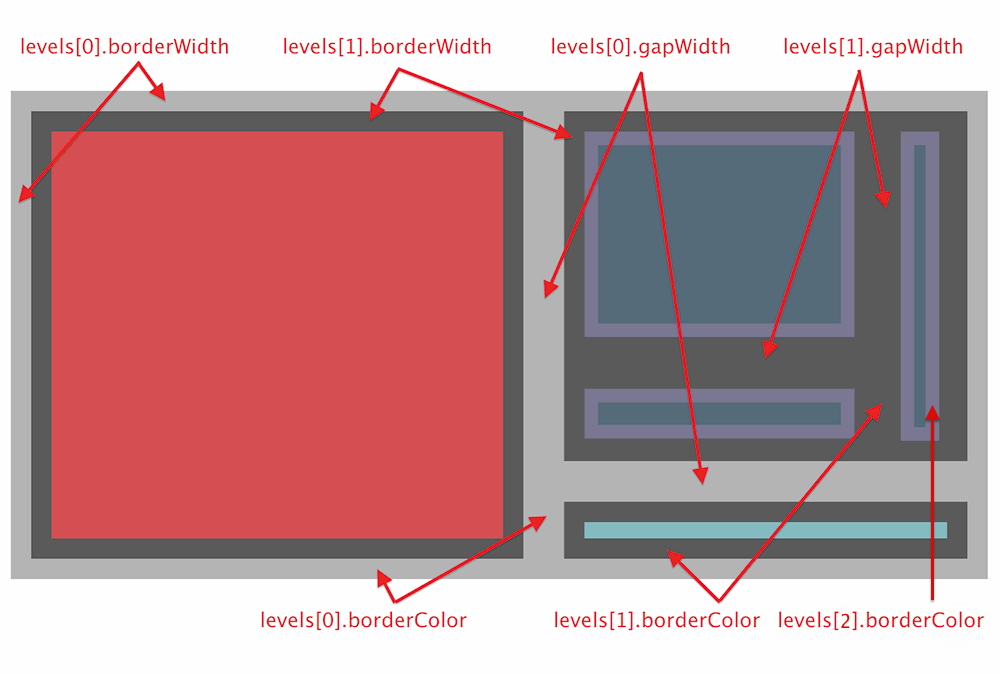

# option.series-treemap

## id
- **Type**: `string`

Component ID, not specified by default. If specified, it can be used to refer the component in option or API.

## name
- **Type**: `string`

Series name used for displaying in [tooltip](option.tooltip.md) and filtering with [legend](option.legend.md), or updating data and configuration with `setOption`.

## zlevel
- **Type**: `number`
- **Default**: `0`

`zlevel` value of all graphical elements in .

`zlevel` is used to make layers with Canvas. Graphical elements with different `zlevel` values will be placed in different Canvases, which is a common optimization technique. We can put those frequently changed elements (like those with animations) to a separate `zlevel`. Notice that too many Canvases will increase memory cost, and should be used carefully on mobile phones to avoid crash.

Canvases with bigger `zlevel` will be placed on Canvases with smaller `zlevel`.

## z
- **Type**: `number`
- **Default**: `2`

`z` value of all graphical elements in , which controls order of drawing graphical components. Components with smaller `z` values may be overwritten by those with larger `z` values.

`z` has a lower priority to `zlevel`, and will not create new Canvas.

## left
- **Type**: `string|number`
- **Default**: `center`

Distance between treemap series and the left side of the container.

`left` can be a pixel value like `20`; it can also be a percentage value relative to the container width like `'20%'`; and it can also be `'left'`, `'center'`, or `'right'`.

If the `left` value is set to be `'left'`, `'center'`, or `'right'`, then the component will be aligned automatically based on position.

## top
- **Type**: `string|number`
- **Default**: `middle`

Distance between treemap series and the top side of the container.

`top` can be a pixel value like `20`; it can also be a percentage value relative to the container height like `'20%'`; and it can also be `'top'`, `'middle'`, or `'bottom'`.

If the `top` value is set to be `'top'`, `'middle'`, or `'bottom'`, then the component will be aligned automatically based on position.

## right
- **Type**: `string|number`
- **Default**: `'auto'`

Distance between treemap series and the right side of the container.

`right` can be a pixel value like `20`; it can also be a percentage value relative to the container width like `'20%'`.

Adaptive by default.

## bottom
- **Type**: `string|number`
- **Default**: `'auto'`

Distance between treemap series and the bottom side of the container.

`bottom` can be a pixel value like `20`; it can also be a percentage value relative to the container height like `'20%'`.

Adaptive by default.

## width
- **Type**: `string|number`
- **Default**: `80%`

Width of treemap series.

`width` can be a pixel value like `20`; it can also be a percentage value relative to the container width like `'20%'`.

## height
- **Type**: `string|number`
- **Default**: `80%`

Height of treemap series.

`height` can be a pixel value like `20`; it can also be a percentage value relative to the container height like `'20%'`.

## coordinateSystem
- **Type**: `string`
- **Default**: `'none'`

Since `v6.0.0`

Specifies another coordinate system component on which this `series-treemap` is laid out.

Options:

*   `null`/`undefined`/`'none'`
    
    Not laid out in any coordinate system; instead, laid out independently.
    

*   `'calendar'`
    
    Lay out based on a [calendar coordinate system](option.calendar.md). When multiple calendar coordinate systems exist within an ECharts instance, the corresponding system should be specified using [calendarIndex](option.series-treemap.md#calendarIndex) or [calendarId](option.series-treemap.md#calendarId).
    

*   `'matrix'`
    
    Lay out based on a [matrix coordinate system](option.matrix.md). When multiple matrix coordinate systems exist within an ECharts instance, the corresponding system should be specified using [matrixIndex](option.series-treemap.md#matrixIndex) or [matrixId](option.series-treemap.md#matrixId).
    

**Support for series and component layout on coordinate systems:**

The leftmost column lists the series and components that will be laid out (coordinate systems themselves are also components), and the topmost row lists the coordinate systems that can be laid out on.

|  | no coord sys | [grid](option.grid.md) (cartesian2d) | [polar](option.polar.md) | [geo](option.geo.md) | [singleAxis](option.singleAxis.md) | [radar](option.radar.md) | [parallel](option.parallel.md) | [calendar](option.calendar.md) | [matrix](option.matrix.md) |
| --- | --- | --- | --- | --- | --- | --- | --- | --- | --- |
| [grid](option.grid.md) (cartesian2d) | ✅ | ❌ | ❌ | ❌ | ❌ | ❌ | ❌ | ✅ | ✅ |
| [polar](option.polar.md) | ✅ | ❌ | ❌ | ❌ | ❌ | ❌ | ❌ | ✅ | ✅ |
| [geo](option.geo.md) | ✅ | ❌ | ❌ | ❌ | ❌ | ❌ | ❌ | ✅ | ✅ |
| [singleAxis](option.singleAxis.md) | ✅ | ❌ | ❌ | ❌ | ❌ | ❌ | ❌ | ✅ | ✅ |
| [calendar](option.calendar.md) | ✅ | ❌ | ❌ | ❌ | ❌ | ❌ | ❌ | ❌ | ❌ |
| [matrix](option.matrix.md) | ✅ | ❌ | ❌ | ❌ | ❌ | ❌ | ❌ | ❌ | ❌ |
| [series-line](option.series-line.md) | ❌ | ✅ | ✅ | ❌ | ❌ | ❌ | ❌ | ❌ (✅ if via another coord sys like [grid](option.grid.md)) | ❌ (✅ if via another coord sys like [grid](option.grid.md)) |
| [series-bar](option.series-bar.md) | ❌ | ✅ | ✅ | ❌ | ❌ | ❌ | ❌ | ❌ (✅ if via another coord sys like [grid](option.grid.md)) | ❌ (✅ if via another coord sys like [grid](option.grid.md)) |
| [series-pie](option.series-pie.md) | ✅ | ✅ | ✅ | ✅ | ✅ | ❌ | ❌ | ✅ | ✅ |
| [series-scatter](option.series-scatter.md) | ❌ | ✅ | ✅ | ✅ | ✅ | ❌ | ❌ | ✅ | ✅ |
| [series-effectScatter](option.series-effectScatter.md) | ❌ | ✅ | ✅ | ✅ | ✅ | ❌ | ❌ | ✅ | ✅ |
| [series-radar](option.series-radar.md) | ❌ | ❌ | ❌ | ❌ | ❌ | ✅ | ❌ | ❌ (✅ if via [radar](option.radar.md) coord sys) | ❌ (✅ if via [radar](option.radar.md) coord sys) |
| [series-tree](option.series-tree.md) | ✅ | ❌ | ❌ | ❌ | ❌ | ❌ | ❌ | ✅ | ✅ |
| [series-treemap](option.series-treemap.md) | ✅ | ❌ | ❌ | ❌ | ❌ | ❌ | ❌ | ✅ | ✅ |
| [series-sunburst](option.series-sunburst.md) | ✅ | ❌ | ❌ | ❌ | ❌ | ❌ | ❌ | ✅ | ✅ |
| [series-boxplot](option.series-boxplot.md) | ❌ | ✅ | ❌ | ❌ | ❌ | ❌ | ❌ | ❌ (✅ if via another coord sys like [grid](option.grid.md)) | ❌ (✅ if via another coord sys like [grid](option.grid.md)) |
| [series-candlestick](option.series-candlestick.md) | ❌ | ✅ | ❌ | ❌ | ❌ | ❌ | ❌ | ❌ (✅ if via another coord sys like [grid](option.grid.md)) | ❌ (✅ if via another coord sys like [grid](option.grid.md)) |
| [series-heatmap](option.series-heatmap.md) | ❌ | ✅ | ❌ | ✅ | ❌ | ❌ | ❌ | ✅ | ✅ |
| [series-map](option.series-map.md) | ✅ (create a geo coord sys exclusively) | ❌ | ❌ | ✅ | ❌ | ❌ | ❌ | ✅ | ✅ |
| [series-parallel](option.series-parallel.md) | ❌ | ❌ | ❌ | ❌ | ❌ | ❌ | ✅ | ❌ (✅ if via [parallel](option.parallel.md) coord sys) | ❌ (✅ if via [parallel](option.parallel.md) coord sys) |
| [series-lines](option.series-lines.md) | ❌ | ✅ | ✅ | ✅ | ✅ | ❌ | ❌ | ❌ (✅ if via another coord sys like [geo](option.geo.md)) | ❌ (✅ if via another coord sys like [geo](option.geo.md)) |
| [series-graph](option.series-graph.md) | ✅ (create a "view" coord sys exclusively) | ✅ | ✅ | ✅ | ❌ | ❌ | ❌ | ✅ | ✅ |
| [series-sankey](option.series-sankey.md) | ✅ | ❌ | ❌ | ❌ | ❌ | ❌ | ❌ | ✅ | ✅ |
| [series-funnel](option.series-funnel.md) | ✅ | ❌ | ❌ | ❌ | ❌ | ❌ | ❌ | ✅ | ✅ |
| [series-gauge](option.series-gauge.md) | ✅ | ❌ | ❌ | ❌ | ❌ | ❌ | ❌ | ✅ | ✅ |
| [series-pictorialBar](option.series-pictorialBar.md) | ❌ | ✅ | ✅ | ❌ | ❌ | ❌ | ❌ | ❌ (✅ if via another coord sys like [grid](option.grid.md)) | ❌ (✅ if via another coord sys like [grid](option.grid.md)) |
| [series-themeRiver](option.series-themeRiver.md) | ❌ | ❌ | ❌ | ❌ | ✅ | ❌ | ❌ | ❌ (✅ if via another coord sys like [singleAxis](option.singleAxis.md)) | ❌ (✅ if via another coord sys like [singleAxis](option.singleAxis.md)) |
| [series-chord](option.series-chord.md) | ✅ | ✅ | ✅ | ✅ | ✅ | ❌ | ❌ | ✅ | ✅ |
| [title](option.title.md) | ✅ | ❌ | ❌ | ❌ | ❌ | ❌ | ❌ | ✅ | ✅ |
| [legend](option.legend.md) | ✅ | ❌ | ❌ | ❌ | ❌ | ❌ | ❌ | ✅ | ✅ |
| [dataZoom](../option.md#dataZoom) | ✅ | ❌ | ❌ | ❌ | ❌ | ❌ | ❌ | ✅ | ✅ |
| [visualMap](../option.md#visualMap) | ✅ | ❌ | ❌ | ❌ | ❌ | ❌ | ❌ | ✅ | ✅ |
| [toolbox](option.toolbox.md) | ✅ | ❌ | ❌ | ❌ | ❌ | ❌ | ❌ | ✅ | ✅ |
| [timeline](option.timeline.md) | ✅ | ❌ | ❌ | ❌ | ❌ | ❌ | ❌ | ✅ | ✅ |
| [thumbnail](option.thumbnail.md) | ✅ | ❌ | ❌ | ❌ | ❌ | ❌ | ❌ | ✅ | ✅ |

See also [series-treemap.coordinateSystemUsage](option.series-treemap.md#coordinateSystemUsage).

## coordinateSystemUsage
- **Type**: `string`
- **Default**: `'data'`

Since `v6.0.0`

Specify how to lay out this `series-treemap` based on the specified [coordinateSystem](option.series-treemap.md#coordinateSystem).

In most cases, there is no need to specify `coordinateSystemUsage`, unless the default behavior is unexpected.

Options:

*   `'data'`:
    
    Each data item of a series (e.g., each `series.data[i]`) is laid out separately based on the specified coordinate system. Currently no non-series component supports `coordinateSystemUsage: 'data'`.
    
*   `'box'`: **(Not applicable in [series-treemap](option.series-treemap.md))**
    
    The entire series or component is laid out as a whole based on the specified coordinate system - that is, the overall bounding rect or basic anchor point is calculated relative to the system.
    
    *   For example, a [grid component](option.grid.md) can be laid out in a [matrix coordinate system](option.matrix.md) or a [calendar coordinate system](option.calendar.md), where its layout rectangle is calculated by the specified [series-treemap.coords](option.series-treemap.md#coords) in that system. See example [sparkline in matrix](https://echarts.apache.org/examples/en/editor.html?c=matrix-sparkline&edit=1&reset=1).
    *   For example, a [pie series](option.series-pie.md) or a [chord series](option.series-chord.md) can be laid out in a [geo coordinate system](option.geo.md) or a [cartesian2d coordinate system](option.grid.md), where the center is calculated by the specified [series-pie.coords](option.series-pie.md#coords) or [series-pie.center](option.series-pie.md#center) in that system. See example [pie in geo](https://echarts.apache.org/examples/en/editor.html?c=map-iceland-pie&edit=1&reset=1).

Only a few series support both `coordinateSystemUsage: 'data'` and `coordinateSystemUsage: 'box'`, such as [series-graph](option.series-graph.md), [series-map](option.series-map.md). For examle, in [this example (coordinateSystemUsage: 'data')](https://echarts.apache.org/examples/en/editor.html?c=matrix-graph&edit=1&reset=1), each node of a graph series is laid out on a matrix coordinate system, while in [this example (coordinateSystemUsage: 'box')](https://echarts.apache.org/examples/en/editor.html?c=doc-example/matrix-graph-box&edit=1&reset=1), the entire graph series is laid out within a matrix cell.

Most series only support `coordinateSystemUsage: 'data'` - such as [series-line](option.series-line.md), [series-bar](option.series-bar.md), [series-scatter](option.series-scatter.md), etc. Meanwhile, some series only support `coordinateSystemUsage: 'box'` - such as [series-pie](option.series-pie.md) ([example: pie in geo](https://echarts.apache.org/examples/en/editor.html?c=map-iceland-pie&edit=1&reset=1)), [series-tree](option.series-pie.md), [series-treemap](option.series-treemap.md), [series-sankey](option.series-sankey.md), etc.

See also [series-treemap.coordinateSystem](option.series-treemap.md#coordinateSystem).

## coord
- **Type**: `Array|number|string`

Since `v6.0.0`

When [coordinateSystemUsage](option.series-treemap.md#coordinateSystemUsage) is `'box'`, `coord` is used as the input to the coordinate system and calculate the layout rectangle or anchor point.

Examples: [sparkline in matrix](https://echarts.apache.org/examples/en/editor.html?c=matrix-sparkline&edit=1&reset=1), [grpah in matrix](https://echarts.apache.org/examples/en/editor.html?c=doc-example/matrix-graph-box&edit=1&reset=1).

> Note: when [coordinateSystemUsage](option.series-treemap.md#coordinateSystemUsage) is `'data'`, the input of coordinate system is `series.data[i]` rather than this `coord`.

The format this `coord` is defined by each coordinate system, and it's the same as the second parameter of [chart.convertToPixel](../api-parts/api.echartsInstance.md#convertToPixel).

## calendarIndex
- **Type**: `number`
- **Default**: `0`

Since `v6.0.0`

The index of the [calendar coordinate system](option.calendar.md) to base on. When mutiple `calendar` exist within an ECharts instance, use this to specify the corresponding `calendar`.

## calendarId
- **Type**: `number`
- **Default**: `undefined`

Since `v6.0.0`

The id of the [calendar coordinate system](option.calendar.md) to base on. When mutiple `calendar` exist within an ECharts instance, use this to specify the corresponding `calendar`.

## matrixIndex
- **Type**: `number`
- **Default**: `0`

Since `v6.0.0`

The index of the [matrix coordinate system](option.matrix.md) to base on. When mutiple `matrix` exist within an ECharts instance, use this to specify the corresponding `matrix`.

## matrixId
- **Type**: `number`
- **Default**: `undefined`

Since `v6.0.0`

The id of the [matrix coordinate system](option.matrix.md) to base on. When mutiple `matrix` exist within an ECharts instance, use this to specify the corresponding `matrix`.

## squareRatio
- **Type**: `number`

The expected square ratio. Layout would approach the ratio as close as possible.

It defaults to be the golden ratio: `0.5 * (1 + Math.sqrt(5))`.

## leafDepth
- **Type**: `number`

When `leafDepth` is set, the feature "drill down" is enabled, which means when clicking a tree node, this node will be set as root and its children will be shown.

`leafDepth` represents how many levels are shown at most. For example, when `leafDepth` is set to `1`, only one level will be shown.

`leafDepth` is `null`/`undefined` by default, which means that "drill down" is disabled.

**An example about drill down:**

## drillDownIcon
- **Type**: `string`
- **Default**: `'▶'`

Marker when the node is able to be drilled down.

## roam
- **Type**: `boolean|string`
- **Default**: `true`

Whether to enable mouse or touch roam (move and zoom). Optional values are:

*   `false`: roam is disabled.
*   `'scale'` or `'zoom'`: zoom only.
*   `'move'` or `'pan'`: move (translation) only.
*   `true`: both zoom and move (translation) are available.

## scaleLimit
- **Type**: `Object`

Since `v5.5.1`

Limit of [zooming](option.series-treemap.md#roam), with `min` and `max`.

The value less than `1` indicates zooming out, while the value greater than `1` indicates zooming in.

### scaleLimit.min
- **Type**: `number`

Minimum zoom

### scaleLimit.max
- **Type**: `number`

Maximum zoom

## nodeClick
- **Type**: `boolean|string`
- **Default**: `'zoomToNode'`

The behaviour when clicking a node. Optional values are:

*   `false`: Do nothing after clicked.
*   `'zoomToNode'`: Zoom to clicked node.
*   `'link'`: If there is [link](option.series-treemap.md#data.link) in node data, do hyperlink jump after clicked.

## zoomToNodeRatio
- **Type**: `number`
- **Default**: `0.32*0.32`

The treemap will be auto zoomed to a appropriate ratio when a node is clicked (when [nodeClick](option.series-treemap.md#nodeClick) is set as `'zoomToNode'` and no drill down happens). This configuration item indicates the ratio.

## visualDimension
- **Type**: `number`
- **Default**: `0`

`treemap` is able to map any dimensions of data to visual.

The value of [series-treemap.data](option.series-treemap.md#data) can be an array. And each item of the array represents a "dimension". `visualDimension` specifies the dimension on which visual mapping will be performed.

About visual encoding, see details in [series-treemap.levels](option.series-treemap.md#levels).

> Tps: In treemap, `visualDimension` attribute could appear in more than one places:

> *   It could appear in [sereis-treemap](option.series-treemap.md), indicating the unified setting of the series.

> *   It could appear in each array element of [series-treemap.levels](option.series-treemap.md#levels), indicating the unified setting of each level of the tree.

> *   It could appear in each node of [series-treemap.data](option.series-treemap.md#data), indicating the particular setting of each node.

## visualMin
- **Type**: `number`

The minimal value of current level. Auto-statistics by default.

When [colorMappingBy](option.series-treemap.md#levels.colorMappingBy) is set to `'value'`, you are able to specify extent manually for visual mapping by specifying `visualMin` or `visualMax`.

## visualMax
- **Type**: `number`

The maximal value of current level. Auto-statistics by default.

When [colorMappingBy](option.series-treemap.md#levels.colorMappingBy) is set to `'value'`, you are able to specify extent manually for visual mapping by specifying `visualMin` or `visualMax`.

## colorAlpha
- **Type**: `Array`

It indicates the range of transparent rate (color alpha) for nodes of the series

. The range of values is 0 ~ 1.

For example, `colorAlpha` can be `[0.3, 1]`.

About visual encoding, see details in [series-treemap.levels](option.series-treemap.md#levels).

> Tps: In treemap, `colorAlpha` attribute could appear in more than one places:

> *   It could appear in [sereis-treemap](option.series-treemap.md), indicating the unified setting of the series.

> *   It could appear in each array element of [series-treemap.levels](option.series-treemap.md#levels), indicating the unified setting of each level of the tree.

> *   It could appear in each node of [series-treemap.data](option.series-treemap.md#data), indicating the particular setting of each node.

## colorSaturation
- **Type**: `number`

It indicates the range of saturation (color alpha) for nodes of the series.

The range of values is 0 ~ 1.

For example, `colorSaturation` can be `[0.3, 1]`.

About visual encoding, see details in [series-treemap.levels](option.series-treemap.md#levels).

> Tps: In treemap, `colorSaturation` attribute could appear in more than one places:

> *   It could appear in [sereis-treemap](option.series-treemap.md), indicating the unified setting of the series.

> *   It could appear in each array element of [series-treemap.levels](option.series-treemap.md#levels), indicating the unified setting of each level of the tree.

> *   It could appear in each node of [series-treemap.data](option.series-treemap.md#data), indicating the particular setting of each node.

## colorMappingBy
- **Type**: `string`
- **Default**: `'index'`

Specify the rule according to which each node obtain color from [color list](option.series-treemap.md#levels.color). Optional values:

*   `'value'`:

Map [series-treemap.data.value](option.series-treemap.md#data.value) to color.

In this way, the color of each node indicate its value.

[visualDimension](option.series-treemap.md#levels.visualDimension) can be used to specify which dimension of [data](option.series-treemap.md#data) is used to perform visual mapping.

*   `'index'`:

Map the `index` (ordinal number) of nodes to color. Namely, in a level, the first node is mapped to the first color of [color list](option.series-treemap.md#levels.color), and the second node gets the second color.

In this way, adjacent nodes are distinguished by color.

*   `'id'`:

Map [series-treemap.data.id](option.series-treemap.md#data.id) to color.

Since `id` is used to identify node, if user call `setOption` to modify the tree, each node will remain the original color before and after `setOption` called. See this [example](https://echarts.apache.org/examples/en/editor.html?c=treemap-obama&edit=1&reset=1).

About visual encoding, see details in [series-treemap.levels](option.series-treemap.md#levels).

> Tps: In treemap, `colorMappingBy` attribute could appear in more than one places:

> *   It could appear in [sereis-treemap](option.series-treemap.md), indicating the unified setting of the series.

> *   It could appear in each array element of [series-treemap.levels](option.series-treemap.md#levels), indicating the unified setting of each level of the tree.

> *   It could appear in each node of [series-treemap.data](option.series-treemap.md#data), indicating the particular setting of each node.

## visibleMin
- **Type**: `number`
- **Default**: `10`

A node will not be shown when its area size is smaller than this value (unit: px square).

In this way, tiny nodes will be hidden, otherwise they will huddle together. When user zoom the treemap, the area size will increase and the rectangle will be shown if the area size is larger than this threshold.

About visual encoding, see details in [series-treemap.levels](option.series-treemap.md#levels).

> Tps: In treemap, `visibleMin` attribute could appear in more than one places:

> *   It could appear in [sereis-treemap](option.series-treemap.md), indicating the unified setting of the series.

> *   It could appear in each array element of [series-treemap.levels](option.series-treemap.md#levels), indicating the unified setting of each level of the tree.

> *   It could appear in each node of [series-treemap.data](option.series-treemap.md#data), indicating the particular setting of each node.

## childrenVisibleMin
- **Type**: `number`

Children will not be shown when area size of a node is smaller than this value (unit: px square).

This can hide the details of nodes when the rectangular area is not large enough. When users zoom nodes, the child node would show if the area is larger than this threshold.

About visual encoding, see details in [series-treemap.levels](option.series-treemap.md#levels).

> Tps: In treemap, `childrenVisibleMin` attribute could appear in more than one places:

> *   It could appear in [sereis-treemap](option.series-treemap.md), indicating the unified setting of the series.

> *   It could appear in each array element of [series-treemap.levels](option.series-treemap.md#levels), indicating the unified setting of each level of the tree.

> *   It could appear in each node of [series-treemap.data](option.series-treemap.md#data), indicating the particular setting of each node.

## label
- **Type**: `Object`

`label` describes the style of the label in each node.

> Tps: In treemap, `label` attribute could appear in more than one places:

> *   It could appear in [sereis-treemap](option.series-treemap.md), indicating the unified setting of the series.

> *   It could appear in each array element of [series-treemap.levels](option.series-treemap.md#levels), indicating the unified setting of each level of the tree.

> *   It could appear in each node of [series-treemap.data](option.series-treemap.md#data), indicating the particular setting of each node.

### label.show
- **Type**: `boolean`
- **Default**: `false`

Whether to show label.

### label.position
- **Type**: `string|Array`
- **Default**: `'inside'`

Label position.

**Followings are the options:**

*   \[x, y\]
    
    Use relative percentage, or absolute pixel values to represent position of label relative to top-left corner of bounding box. For example:
    
    ```
      // Absolute pixel values
      position: [10, 10],
      // Relative percentage
      position: ['50%', '50%']
    ```
    
*   'top'
    
*   'left'
*   'right'
*   'bottom'
*   'inside'
*   'insideLeft'
*   'insideRight'
*   'insideTop'
*   'insideBottom'
*   'insideTopLeft'
*   'insideBottomLeft'
*   'insideTopRight'
*   'insideBottomRight'

See: [label position](https://echarts.apache.org/examples/en/view.html?c=doc-example/label-position).

### label.distance
- **Type**: `number`
- **Default**: `5`

Distance to the host graphic element.

It is valid only when `position` is string value (like `'top'`、`'insideRight'`).

See: [label position](https://echarts.apache.org/examples/en/editor.html?c=doc-example/label-position).

### label.rotate
- **Type**: `number`

Rotate label, from -90 degree to 90, positive value represents rotate anti-clockwise.

See: [label rotation](https://echarts.apache.org/examples/en/editor.html?c=bar-label-rotation).

### label.offset
- **Type**: `Array`

Whether to move text slightly. For example: `[30, 40]` means move `30` horizontally and move `40` vertically.

### label.textMargin
- **Type**: `number|Array`

Since `v6.0.0`

The space around the label to escape from overlapping. The unit is px.

Notice: `textMargin` is applied on the label's local bounding rect, that is, if there is a `rotate` specified on the label, apply `textMargin` on the non-rotated label first, and then apply the rotation.

> The name is `textMargin` because historically the name `margin` has been used for a different purpose.

Examples:

```
// Set margin to be 5, means [5, 5, 5, 5]
textMargin: 5
// Set the top and bottom margin to be 5, and left and right margin to be 10
textMargin: [5, 10]
// Set each of the four margin separately
textMargin: [
    5,  // up
    10, // right
    5,  // down
    10, // left
]
```

### label.minMargin
- **Type**: `number`

Since `v5.0.0`

Minimal margin between labels. Used when label has [layout](../option.md#series.labelLayout).

`minMargin` conveys a similar meaning to `textMargin`, but with a different nuance. If unsure, just use `textMargin`; it basically covers `minMargin` and can provide a more compact layout for rotated labels in some scenarios.

> TL;DR: The difference:
> 
> *   The minimal gap (if applicable) between two labels is `label1.minMargin/2 + label2.minMargin/2`, or `label1.textMargin[number] + label2.textMargin[number]`.
> *   If `rotate` is specified on a label,
>     *   `minMargin`: first rotate the label, forming a new rect by the min/max of x/y from the four corner points (that is a expanded bounding rect), and finally `minMargin` is applied on the new rect.
>     *   `textMargin`: first applied on the label's local bounding rect, and then rotate.
> *   Data type: `minMargin` should be only `number`, `textMargin` can be `number | number[]` (follow CSS margin).

### label.formatter
- **Type**: `string|Function`

Data label formatter, which supports string template and callback function. In either form, `\n` is supported to represent a new line.

**String template**

Model variation includes:

*   `{a}`: series name.
*   `{b}`: the name of a data item.
*   `{c}`: the value of a data item.
*   `{@xxx}`: the value of a dimension named `'xxx'`, for example, `{@product}` refers the value of `'product'` dimension.
*   `{@[n]}`: the value of a dimension at the index of `n`, for example, `{@[3]}` refers the value at dimensions\[3\].

**example:**

```
formatter: '{b}: {@score}'
```

**Callback function**

Callback function is in form of:

```
(params: Object|Array) => string
```

where `params` is the single dataset needed by formatter, which is formed as:

```
{
    componentType: 'series',
    // Series type
    seriesType: string,
    // Series index in option.series
    seriesIndex: number,
    // Series name
    seriesName: string,
    // Data name, or category name
    name: string,
    // Data index in input data array
    dataIndex: number,
    // Original data as input
    data: Object,
    // Value of data. In most series it is the same as data.
    // But in some series it is some part of the data (e.g., in map, radar)
    value: number|Array|Object,
    // encoding info of coordinate system
    // Key: coord, like ('x' 'y' 'radius' 'angle')
    // value: Must be an array, not null/undefined. Contain dimension indices, like:
    // {
    //     x: [2] // values on dimension index 2 are mapped to x axis.
    //     y: [0] // values on dimension index 0 are mapped to y axis.
    // }
    encode: Object,
    // dimension names list
    dimensionNames: Array<String>,
    // data dimension index, for example 0 or 1 or 2 ...
    // Only work in `radar` series.
    dimensionIndex: number,
    // Color of data
    color: string,
    // The ancestors of current node (including self)
    treeAncestors: Array
}
```

**How to use `encode` and `dimensionNames`?**

When the dataset is like

```
dataset: {
    source: [
        ['Matcha Latte', 43.3, 85.8, 93.7],
        ['Milk Tea', 83.1, 73.4, 55.1],
        ['Cheese Cocoa', 86.4, 65.2, 82.5],
        ['Walnut Brownie', 72.4, 53.9, 39.1]
    ]
}
```

We can get the value of the y-axis via

```
params.value[params.encode.y[0]]
```

When the dataset is like

```
dataset: {
    dimensions: ['product', '2015', '2016', '2017'],
    source: [
        {product: 'Matcha Latte', '2015': 43.3, '2016': 85.8, '2017': 93.7},
        {product: 'Milk Tea', '2015': 83.1, '2016': 73.4, '2017': 55.1},
        {product: 'Cheese Cocoa', '2015': 86.4, '2016': 65.2, '2017': 82.5},
        {product: 'Walnut Brownie', '2015': 72.4, '2016': 53.9, '2017': 39.1}
    ]
}
```

We can get the value of the y-axis via

```
params.value[params.dimensionNames[params.encode.y[0]]]
```

### label.color
- **Type**: `Color`
- **Default**: `'#fff'`

text color.

If set as `'inherit'`, the color will assigned as visual color, such as series color.

### label.fontStyle
- **Type**: `string`
- **Default**: `'normal'`

font style.

Options are:

*   `'normal'`
*   `'italic'`
*   `'oblique'`

### label.fontWeight
- **Type**: `string|number`
- **Default**: `'normal'`

font thick weight.

Options are:

*   `'normal'`
*   `'bold'`
*   `'bolder'`
*   `'lighter'`
*   100 | 200 | 300 | 400...

### label.fontFamily
- **Type**: `string`
- **Default**: `'sans-serif'`

font family.

Can also be 'serif' , 'monospace', ...

### label.fontSize
- **Type**: `number`
- **Default**: `12`

font size.

### label.align
- **Type**: `string`

Horizontal alignment of text, automatic by default.

Options are:

*   `'left'`
*   `'center'`
*   `'right'`

If `align` is not set in `rich`, `align` in parent level will be used. For example:

```
{
    align: right,
    rich: {
        a: {
            // `align` is not set, then it will be right
        }
    }
}
```

### label.verticalAlign
- **Type**: `string`

Vertical alignment of text, automatic by default.

Options are:

*   `'top'`
*   `'middle'`
*   `'bottom'`

If `verticalAlign` is not set in `rich`, `verticalAlign` in parent level will be used. For example:

```
{
    verticalAlign: bottom,
    rich: {
        a: {
            // `verticalAlign` is not set, then it will be bottom
        }
    }
}
```

### label.lineHeight
- **Type**: `number`

Line height of the text fragment.

If `lineHeight` is not set in `rich`, `lineHeight` in parent level will be used. For example:

```
{
    lineHeight: 56,
    rich: {
        a: {
            // `lineHeight` is not set, then it will be 56
        }
    }
}
```

### label.backgroundColor
- **Type**: `string|Object`
- **Default**: `'transparent'`

Background color of the text fragment.

Can be color string, like `'#123234'`, `'red'`, `'rgba(0,23,11,0.3)'`.

Or image can be used, for example:

```
backgroundColor: {
    image: 'xxx/xxx.png'
    // It can be URL of a image,
    // or dataURI,
    // or HTMLImageElement,
    // or HTMLCanvasElement.
}
```

`width` or `height` can be specified when using background image, or auto adapted by default.

If set as `'inherit'`, the color will assigned as visual color, such as series color.

### label.borderColor
- **Type**: `Color`

Border color of the text fragment.

If set as `'inherit'`, the color will assigned as visual color, such as series color.

### label.borderWidth
- **Type**: `number`
- **Default**: `0`

Border width of the text fragment.

### label.borderType
- **Type**: `string|number|Array`
- **Default**: `'solid'`

the text fragment border type.

Possible values are:

*   `'solid'`
*   `'dashed'`
*   `'dotted'`

Since `v5.0.0`, it can also be a number or a number array to specify the [dash array](https://developer.mozilla.org/en-US/docs/Web/SVG/Attribute/stroke-dasharray) of the line. With `borderDashOffset` , we can make the line style more flexible.

For example：

```
{

borderType: [5, 10],

borderDashOffset: 5
}
```

### label.borderDashOffset
- **Type**: `number`
- **Default**: `0`

Since `v5.0.0`

To set the line dash offset. With `borderType` , we can make the line style more flexible.

Refer to MDN [lineDashOffset](https://developer.mozilla.org/en-US/docs/Web/API/CanvasRenderingContext2D/lineDashOffset) for more details.

### label.borderRadius
- **Type**: `number`
- **Default**: `0`

Border radius of the text fragment.

### label.padding
- **Type**: `number|Array`
- **Default**: `5`

Padding of the text fragment, for example:

*   `padding: [3, 4, 5, 6]`: represents padding of `[top, right, bottom, left]`.
*   `padding: 4`: represents `padding: [4, 4, 4, 4]`.
*   `padding: [3, 4]`: represents `padding: [3, 4, 3, 4]`.

Notice, `width` and `height` specifies the width and height of the content, without `padding`.

### label.shadowColor
- **Type**: `Color`
- **Default**: `'transparent'`

Shadow color of the text block.

### label.shadowBlur
- **Type**: `number`
- **Default**: `0`

Show blur of the text block.

### label.shadowOffsetX
- **Type**: `number`
- **Default**: `0`

Shadow X offset of the text block.

### label.shadowOffsetY
- **Type**: `number`
- **Default**: `0`

Shadow Y offset of the text block.

### label.width
- **Type**: `number`

Width of text block.

### label.height
- **Type**: `number`

Height of text block.

### label.textBorderColor
- **Type**: `Color`

Stroke color of the text.

If set as `'inherit'`, the color will assigned as visual color, such as series color.

### label.textBorderWidth
- **Type**: `number`

Stroke line width of the text.

### label.textBorderType
- **Type**: `string|number|Array`
- **Default**: `'solid'`

Stroke line type of the text.

Possible values are:

*   `'solid'`
*   `'dashed'`
*   `'dotted'`

Since `v5.0.0`, it can also be a number or a number array to specify the [dash array](https://developer.mozilla.org/en-US/docs/Web/SVG/Attribute/stroke-dasharray) of the line. With `textBorderDashOffset` , we can make the line style more flexible.

For example：

```
{

textBorderType: [5, 10],

textBorderDashOffset: 5
}
```

### label.textBorderDashOffset
- **Type**: `number`
- **Default**: `0`

Since `v5.0.0`

To set the line dash offset. With `textBorderType` , we can make the line style more flexible.

Refer to MDN [lineDashOffset](https://developer.mozilla.org/en-US/docs/Web/API/CanvasRenderingContext2D/lineDashOffset) for more details.

### label.textShadowColor
- **Type**: `Color`
- **Default**: `'transparent'`

Shadow color of the text itself.

### label.textShadowBlur
- **Type**: `number`
- **Default**: `0`

Shadow blue of the text itself.

### label.textShadowOffsetX
- **Type**: `number`
- **Default**: `0`

Shadow X offset of the text itself.

### label.textShadowOffsetY
- **Type**: `number`
- **Default**: `0`

Shadow Y offset of the text itself.

### label.overflow
- **Type**: `string`
- **Default**: `'none'`

Determine how to display the text when it's overflow. Available when `width` is set.

*   `'truncate'` Truncate the text and trailing with `ellipsis`.
*   `'break'` Break by word
*   `'breakAll'` Break by character.

### label.ellipsis
- **Type**: `string`
- **Default**: `'...'`

Ellipsis to be displayed when `overflow` is set to `truncate`.

*   `'truncate'` Truncate the overflow lines.

### label.rich
- **Type**: `Object`

"Rich text styles" can be defined in this `rich` property. For example:

```
label: {
    // Styles defined in 'rich' can be applied to some fragments
    // of text by adding some markers to those fragment, like
    // `{styleName|text content text content}`.
    // `'\n'` is the newline character.
    formatter: [
        '{a|Style "a" is applied to this snippet}'
        '{b|Style "b" is applied to this snippet}This snippet use default style{x|use style "x"}'
    ].join('\n'),

    rich: {
        a: {
            color: 'red',
            lineHeight: 10
        },
        b: {
            backgroundColor: {
                image: 'xxx/xxx.jpg'
            },
            height: 40
        },
        x: {
            fontSize: 18,
            fontFamily: 'Microsoft YaHei',
            borderColor: '#449933',
            borderRadius: 4
        },
        ...
    }
}
```

For more details, see [Rich Text](tutorial.html#Rich%20Text) please.

##### label.rich.<style_name>.color
- **Type**: `Color`
- **Default**: `'#fff'`

text color.

If set as `'inherit'`, the color will assigned as visual color, such as series color.

##### label.rich.<style_name>.fontStyle
- **Type**: `string`
- **Default**: `'normal'`

font style.

Options are:

*   `'normal'`
*   `'italic'`
*   `'oblique'`

##### label.rich.<style_name>.fontWeight
- **Type**: `string|number`
- **Default**: `'normal'`

font thick weight.

Options are:

*   `'normal'`
*   `'bold'`
*   `'bolder'`
*   `'lighter'`
*   100 | 200 | 300 | 400...

##### label.rich.<style_name>.fontFamily
- **Type**: `string`
- **Default**: `'sans-serif'`

font family.

Can also be 'serif' , 'monospace', ...

##### label.rich.<style_name>.fontSize
- **Type**: `number`
- **Default**: `12`

font size.

##### label.rich.<style_name>.align
- **Type**: `string`

Horizontal alignment of text, automatic by default.

Options are:

*   `'left'`
*   `'center'`
*   `'right'`

If `align` is not set in `rich`, `align` in parent level will be used. For example:

```
{
    align: right,
    rich: {
        a: {
            // `align` is not set, then it will be right
        }
    }
}
```

##### label.rich.<style_name>.verticalAlign
- **Type**: `string`

Vertical alignment of text, automatic by default.

Options are:

*   `'top'`
*   `'middle'`
*   `'bottom'`

If `verticalAlign` is not set in `rich`, `verticalAlign` in parent level will be used. For example:

```
{
    verticalAlign: bottom,
    rich: {
        a: {
            // `verticalAlign` is not set, then it will be bottom
        }
    }
}
```

##### label.rich.<style_name>.lineHeight
- **Type**: `number`

Line height of the text fragment.

If `lineHeight` is not set in `rich`, `lineHeight` in parent level will be used. For example:

```
{
    lineHeight: 56,
    rich: {
        a: {
            // `lineHeight` is not set, then it will be 56
        }
    }
}
```

##### label.rich.<style_name>.backgroundColor
- **Type**: `string|Object`
- **Default**: `'transparent'`

Background color of the text fragment.

Can be color string, like `'#123234'`, `'red'`, `'rgba(0,23,11,0.3)'`.

Or image can be used, for example:

```
backgroundColor: {
    image: 'xxx/xxx.png'
    // It can be URL of a image,
    // or dataURI,
    // or HTMLImageElement,
    // or HTMLCanvasElement.
}
```

`width` or `height` can be specified when using background image, or auto adapted by default.

If set as `'inherit'`, the color will assigned as visual color, such as series color.

##### label.rich.<style_name>.borderColor
- **Type**: `Color`

Border color of the text fragment.

If set as `'inherit'`, the color will assigned as visual color, such as series color.

##### label.rich.<style_name>.borderWidth
- **Type**: `number`
- **Default**: `0`

Border width of the text fragment.

##### label.rich.<style_name>.borderType
- **Type**: `string|number|Array`
- **Default**: `'solid'`

the text fragment border type.

Possible values are:

*   `'solid'`
*   `'dashed'`
*   `'dotted'`

Since `v5.0.0`, it can also be a number or a number array to specify the [dash array](https://developer.mozilla.org/en-US/docs/Web/SVG/Attribute/stroke-dasharray) of the line. With `borderDashOffset` , we can make the line style more flexible.

For example：

```
{

borderType: [5, 10],

borderDashOffset: 5
}
```

##### label.rich.<style_name>.borderDashOffset
- **Type**: `number`
- **Default**: `0`

Since `v5.0.0`

To set the line dash offset. With `borderType` , we can make the line style more flexible.

Refer to MDN [lineDashOffset](https://developer.mozilla.org/en-US/docs/Web/API/CanvasRenderingContext2D/lineDashOffset) for more details.

##### label.rich.<style_name>.borderRadius
- **Type**: `number`
- **Default**: `0`

Border radius of the text fragment.

##### label.rich.<style_name>.padding
- **Type**: `number|Array`
- **Default**: `0`

Padding of the text fragment, for example:

*   `padding: [3, 4, 5, 6]`: represents padding of `[top, right, bottom, left]`.
*   `padding: 4`: represents `padding: [4, 4, 4, 4]`.
*   `padding: [3, 4]`: represents `padding: [3, 4, 3, 4]`.

Notice, `width` and `height` specifies the width and height of the content, without `padding`.

##### label.rich.<style_name>.shadowColor
- **Type**: `Color`
- **Default**: `'transparent'`

Shadow color of the text block.

##### label.rich.<style_name>.shadowBlur
- **Type**: `number`
- **Default**: `0`

Show blur of the text block.

##### label.rich.<style_name>.shadowOffsetX
- **Type**: `number`
- **Default**: `0`

Shadow X offset of the text block.

##### label.rich.<style_name>.shadowOffsetY
- **Type**: `number`
- **Default**: `0`

Shadow Y offset of the text block.

##### label.rich.<style_name>.width
- **Type**: `number|string`

Width of the text block. It is the width of the text by default. In most cases, there is no need to specify it. You may want to use it in some cases like make simple table or using background image (see `backgroundColor`).

Notice, `width` and `height` specifies the width and height of the content, without `padding`.

`width` can also be percent string, like `'100%'`, which represents the percent of `contentWidth` (that is, the width without `padding`) of its container box. It is based on `contentWidth` because that each text fragment is layout based on the `content box`, where it makes no sense that calculating width based on `outerWith` in prectice.

Notice, `width` and `height` only work when `rich` specified.

##### label.rich.<style_name>.height
- **Type**: `number|string`

Height of the text block. It is the width of the text by default. You may want to use it in some cases like using background image (see `backgroundColor`).

Notice, `width` and `height` specifies the width and height of the content, without `padding`.

Notice, `width` and `height` only work when `rich` specified.

##### label.rich.<style_name>.textBorderColor
- **Type**: `Color`

Stroke color of the text.

If set as `'inherit'`, the color will assigned as visual color, such as series color.

##### label.rich.<style_name>.textBorderWidth
- **Type**: `number`

Stroke line width of the text.

##### label.rich.<style_name>.textBorderType
- **Type**: `string|number|Array`
- **Default**: `'solid'`

Stroke line type of the text.

Possible values are:

*   `'solid'`
*   `'dashed'`
*   `'dotted'`

Since `v5.0.0`, it can also be a number or a number array to specify the [dash array](https://developer.mozilla.org/en-US/docs/Web/SVG/Attribute/stroke-dasharray) of the line. With `textBorderDashOffset` , we can make the line style more flexible.

For example：

```
{

textBorderType: [5, 10],

textBorderDashOffset: 5
}
```

##### label.rich.<style_name>.textBorderDashOffset
- **Type**: `number`
- **Default**: `0`

Since `v5.0.0`

To set the line dash offset. With `textBorderType` , we can make the line style more flexible.

Refer to MDN [lineDashOffset](https://developer.mozilla.org/en-US/docs/Web/API/CanvasRenderingContext2D/lineDashOffset) for more details.

##### label.rich.<style_name>.textShadowColor
- **Type**: `Color`
- **Default**: `'transparent'`

Shadow color of the text itself.

##### label.rich.<style_name>.textShadowBlur
- **Type**: `number`
- **Default**: `0`

Shadow blue of the text itself.

##### label.rich.<style_name>.textShadowOffsetX
- **Type**: `number`
- **Default**: `0`

Shadow X offset of the text itself.

##### label.rich.<style_name>.textShadowOffsetY
- **Type**: `number`
- **Default**: `0`

Shadow Y offset of the text itself.

### label.richInheritPlainLabel
- **Type**: `boolean`
- **Default**: `true`

Since `v6.0.0`

Whether rich text inherits plain text style.

This option is just for backward compatibility.

> The [label.rich / textStyle.rich](option.series-scatter.md#label.rich) `fontStyle`, `fontWeight`, `fontSize`, `fontFamily`, `textShadowColor`, `textShadowBlur`, `textShadowOffsetX`, `textShadowOffsetY` are changed to inherit the corresponding [plain label styles](option.series-scatter.md#label) since echarts v6. You can use `richInheritPlainLabel: false` to restore it. For example,
> 
> ```
> option = {
>     richInheritPlainLabel: false, // In most cases, this is enough.
>     xxx1: {
>         // Can also set it here to only control this label.
>         label: {
>             richInheritPlainLabel: false,
>             rich: {/* ... */},
>         }
>     },
>     xxx2: {
>         textStyle: {
>             richInheritPlainLabel: false,
>             rich: {/* ... */},
>         }
>     }
> }
> ```

## upperLabel
- **Type**: `Object`

`upperLabel` is used to specify whether show label when the node has children. When [upperLabel.show](option.series-treemap.md#upperLabel.show) is set as `true`, the feature that "show parent label" is enabled.

The same as [series-treemap.label](option.series-treemap.md#label), the option `upperLabel` can be placed at the root of [series-treemap](option.series-treemap.md) directly, or in [series-treemap.level](option.series-treemap.md#level), or in each item of [series-treemap.data](option.series-treemap.md#data).

Specifically, [series-treemap.label](option.series-treemap.md#label) specifies the style when a node is a leaf, while `upperLabel` specifies the style when a node has children, in which case the label is displayed in the inner top of the node.

See:

> Tps: In treemap, `label` attribute could appear in more than one places:

> *   It could appear in [sereis-treemap](option.series-treemap.md), indicating the unified setting of the series.

> *   It could appear in each array element of [series-treemap.levels](option.series-treemap.md#levels), indicating the unified setting of each level of the tree.

> *   It could appear in each node of [series-treemap.data](option.series-treemap.md#data), indicating the particular setting of each node.

### upperLabel.show
- **Type**: `boolean`
- **Default**: `false`

Whether to show label.

### upperLabel.position
- **Type**: `string|Array`
- **Default**: `'inside'`

Label position.

**Followings are the options:**

*   \[x, y\]
    
    Use relative percentage, or absolute pixel values to represent position of label relative to top-left corner of bounding box. For example:
    
    ```
      // Absolute pixel values
      position: [10, 10],
      // Relative percentage
      position: ['50%', '50%']
    ```
    
*   'top'
    
*   'left'
*   'right'
*   'bottom'
*   'inside'
*   'insideLeft'
*   'insideRight'
*   'insideTop'
*   'insideBottom'
*   'insideTopLeft'
*   'insideBottomLeft'
*   'insideTopRight'
*   'insideBottomRight'

See: [label position](https://echarts.apache.org/examples/en/view.html?c=doc-example/label-position).

### upperLabel.distance
- **Type**: `number`
- **Default**: `5`

Distance to the host graphic element.

It is valid only when `position` is string value (like `'top'`、`'insideRight'`).

See: [label position](https://echarts.apache.org/examples/en/editor.html?c=doc-example/label-position).

### upperLabel.rotate
- **Type**: `number`

Rotate label, from -90 degree to 90, positive value represents rotate anti-clockwise.

See: [label rotation](https://echarts.apache.org/examples/en/editor.html?c=bar-label-rotation).

### upperLabel.offset
- **Type**: `Array`

Whether to move text slightly. For example: `[30, 40]` means move `30` horizontally and move `40` vertically.

### upperLabel.formatter
- **Type**: `string|Function`

Data label formatter, which supports string template and callback function. In either form, `\n` is supported to represent a new line.

**String template**

Model variation includes:

*   `{a}`: series name.
*   `{b}`: the name of a data item.
*   `{c}`: the value of a data item.
*   `{@xxx}`: the value of a dimension named `'xxx'`, for example, `{@product}` refers the value of `'product'` dimension.
*   `{@[n]}`: the value of a dimension at the index of `n`, for example, `{@[3]}` refers the value at dimensions\[3\].

**example:**

```
formatter: '{b}: {@score}'
```

**Callback function**

Callback function is in form of:

```
(params: Object|Array) => string
```

where `params` is the single dataset needed by formatter, which is formed as:

```
{
    componentType: 'series',
    // Series type
    seriesType: string,
    // Series index in option.series
    seriesIndex: number,
    // Series name
    seriesName: string,
    // Data name, or category name
    name: string,
    // Data index in input data array
    dataIndex: number,
    // Original data as input
    data: Object,
    // Value of data. In most series it is the same as data.
    // But in some series it is some part of the data (e.g., in map, radar)
    value: number|Array|Object,
    // encoding info of coordinate system
    // Key: coord, like ('x' 'y' 'radius' 'angle')
    // value: Must be an array, not null/undefined. Contain dimension indices, like:
    // {
    //     x: [2] // values on dimension index 2 are mapped to x axis.
    //     y: [0] // values on dimension index 0 are mapped to y axis.
    // }
    encode: Object,
    // dimension names list
    dimensionNames: Array<String>,
    // data dimension index, for example 0 or 1 or 2 ...
    // Only work in `radar` series.
    dimensionIndex: number,
    // Color of data
    color: string,
    // The ancestors of current node (including self)
    treeAncestors: Array
}
```

**How to use `encode` and `dimensionNames`?**

When the dataset is like

```
dataset: {
    source: [
        ['Matcha Latte', 43.3, 85.8, 93.7],
        ['Milk Tea', 83.1, 73.4, 55.1],
        ['Cheese Cocoa', 86.4, 65.2, 82.5],
        ['Walnut Brownie', 72.4, 53.9, 39.1]
    ]
}
```

We can get the value of the y-axis via

```
params.value[params.encode.y[0]]
```

When the dataset is like

```
dataset: {
    dimensions: ['product', '2015', '2016', '2017'],
    source: [
        {product: 'Matcha Latte', '2015': 43.3, '2016': 85.8, '2017': 93.7},
        {product: 'Milk Tea', '2015': 83.1, '2016': 73.4, '2017': 55.1},
        {product: 'Cheese Cocoa', '2015': 86.4, '2016': 65.2, '2017': 82.5},
        {product: 'Walnut Brownie', '2015': 72.4, '2016': 53.9, '2017': 39.1}
    ]
}
```

We can get the value of the y-axis via

```
params.value[params.dimensionNames[params.encode.y[0]]]
```

### upperLabel.color
- **Type**: `Color`
- **Default**: `'#fff'`

text color.

If set as `'inherit'`, the color will assigned as visual color, such as series color.

### upperLabel.fontStyle
- **Type**: `string`
- **Default**: `'normal'`

font style.

Options are:

*   `'normal'`
*   `'italic'`
*   `'oblique'`

### upperLabel.fontWeight
- **Type**: `string|number`
- **Default**: `'normal'`

font thick weight.

Options are:

*   `'normal'`
*   `'bold'`
*   `'bolder'`
*   `'lighter'`
*   100 | 200 | 300 | 400...

### upperLabel.fontFamily
- **Type**: `string`
- **Default**: `'sans-serif'`

font family.

Can also be 'serif' , 'monospace', ...

### upperLabel.fontSize
- **Type**: `number`
- **Default**: `12`

font size.

### upperLabel.align
- **Type**: `string`

Horizontal alignment of text, automatic by default.

Options are:

*   `'left'`
*   `'center'`
*   `'right'`

If `align` is not set in `rich`, `align` in parent level will be used. For example:

```
{
    align: right,
    rich: {
        a: {
            // `align` is not set, then it will be right
        }
    }
}
```

### upperLabel.verticalAlign
- **Type**: `string`

Vertical alignment of text, automatic by default.

Options are:

*   `'top'`
*   `'middle'`
*   `'bottom'`

If `verticalAlign` is not set in `rich`, `verticalAlign` in parent level will be used. For example:

```
{
    verticalAlign: bottom,
    rich: {
        a: {
            // `verticalAlign` is not set, then it will be bottom
        }
    }
}
```

### upperLabel.lineHeight
- **Type**: `number`

Line height of the text fragment.

If `lineHeight` is not set in `rich`, `lineHeight` in parent level will be used. For example:

```
{
    lineHeight: 56,
    rich: {
        a: {
            // `lineHeight` is not set, then it will be 56
        }
    }
}
```

### upperLabel.backgroundColor
- **Type**: `string|Object`
- **Default**: `'transparent'`

Background color of the text fragment.

Can be color string, like `'#123234'`, `'red'`, `'rgba(0,23,11,0.3)'`.

Or image can be used, for example:

```
backgroundColor: {
    image: 'xxx/xxx.png'
    // It can be URL of a image,
    // or dataURI,
    // or HTMLImageElement,
    // or HTMLCanvasElement.
}
```

`width` or `height` can be specified when using background image, or auto adapted by default.

If set as `'inherit'`, the color will assigned as visual color, such as series color.

### upperLabel.borderColor
- **Type**: `Color`

Border color of the text fragment.

If set as `'inherit'`, the color will assigned as visual color, such as series color.

### upperLabel.borderWidth
- **Type**: `number`
- **Default**: `0`

Border width of the text fragment.

### upperLabel.borderType
- **Type**: `string|number|Array`
- **Default**: `'solid'`

the text fragment border type.

Possible values are:

*   `'solid'`
*   `'dashed'`
*   `'dotted'`

Since `v5.0.0`, it can also be a number or a number array to specify the [dash array](https://developer.mozilla.org/en-US/docs/Web/SVG/Attribute/stroke-dasharray) of the line. With `borderDashOffset` , we can make the line style more flexible.

For example：

```
{

borderType: [5, 10],

borderDashOffset: 5
}
```

### upperLabel.borderDashOffset
- **Type**: `number`
- **Default**: `0`

Since `v5.0.0`

To set the line dash offset. With `borderType` , we can make the line style more flexible.

Refer to MDN [lineDashOffset](https://developer.mozilla.org/en-US/docs/Web/API/CanvasRenderingContext2D/lineDashOffset) for more details.

### upperLabel.borderRadius
- **Type**: `number`
- **Default**: `0`

Border radius of the text fragment.

### upperLabel.padding
- **Type**: `number|Array`
- **Default**: `0`

Padding of the text fragment, for example:

*   `padding: [3, 4, 5, 6]`: represents padding of `[top, right, bottom, left]`.
*   `padding: 4`: represents `padding: [4, 4, 4, 4]`.
*   `padding: [3, 4]`: represents `padding: [3, 4, 3, 4]`.

Notice, `width` and `height` specifies the width and height of the content, without `padding`.

### upperLabel.shadowColor
- **Type**: `Color`
- **Default**: `'transparent'`

Shadow color of the text block.

### upperLabel.shadowBlur
- **Type**: `number`
- **Default**: `0`

Show blur of the text block.

### upperLabel.shadowOffsetX
- **Type**: `number`
- **Default**: `0`

Shadow X offset of the text block.

### upperLabel.shadowOffsetY
- **Type**: `number`
- **Default**: `0`

Shadow Y offset of the text block.

### upperLabel.width
- **Type**: `number`

Width of text block.

### upperLabel.height
- **Type**: `number`
- **Default**: `20`

Height of label area.

### upperLabel.textBorderColor
- **Type**: `Color`

Stroke color of the text.

If set as `'inherit'`, the color will assigned as visual color, such as series color.

### upperLabel.textBorderWidth
- **Type**: `number`

Stroke line width of the text.

### upperLabel.textBorderType
- **Type**: `string|number|Array`
- **Default**: `'solid'`

Stroke line type of the text.

Possible values are:

*   `'solid'`
*   `'dashed'`
*   `'dotted'`

Since `v5.0.0`, it can also be a number or a number array to specify the [dash array](https://developer.mozilla.org/en-US/docs/Web/SVG/Attribute/stroke-dasharray) of the line. With `textBorderDashOffset` , we can make the line style more flexible.

For example：

```
{

textBorderType: [5, 10],

textBorderDashOffset: 5
}
```

### upperLabel.textBorderDashOffset
- **Type**: `number`
- **Default**: `0`

Since `v5.0.0`

To set the line dash offset. With `textBorderType` , we can make the line style more flexible.

Refer to MDN [lineDashOffset](https://developer.mozilla.org/en-US/docs/Web/API/CanvasRenderingContext2D/lineDashOffset) for more details.

### upperLabel.textShadowColor
- **Type**: `Color`
- **Default**: `'transparent'`

Shadow color of the text itself.

### upperLabel.textShadowBlur
- **Type**: `number`
- **Default**: `0`

Shadow blue of the text itself.

### upperLabel.textShadowOffsetX
- **Type**: `number`
- **Default**: `0`

Shadow X offset of the text itself.

### upperLabel.textShadowOffsetY
- **Type**: `number`
- **Default**: `0`

Shadow Y offset of the text itself.

### upperLabel.overflow
- **Type**: `string`
- **Default**: `'none'`

Determine how to display the text when it's overflow. Available when `width` is set.

*   `'truncate'` Truncate the text and trailing with `ellipsis`.
*   `'break'` Break by word
*   `'breakAll'` Break by character.

### upperLabel.ellipsis
- **Type**: `string`
- **Default**: `'...'`

Ellipsis to be displayed when `overflow` is set to `truncate`.

*   `'truncate'` Truncate the overflow lines.

### upperLabel.rich
- **Type**: `Object`

"Rich text styles" can be defined in this `rich` property. For example:

```
label: {
    // Styles defined in 'rich' can be applied to some fragments
    // of text by adding some markers to those fragment, like
    // `{styleName|text content text content}`.
    // `'\n'` is the newline character.
    formatter: [
        '{a|Style "a" is applied to this snippet}'
        '{b|Style "b" is applied to this snippet}This snippet use default style{x|use style "x"}'
    ].join('\n'),

    rich: {
        a: {
            color: 'red',
            lineHeight: 10
        },
        b: {
            backgroundColor: {
                image: 'xxx/xxx.jpg'
            },
            height: 40
        },
        x: {
            fontSize: 18,
            fontFamily: 'Microsoft YaHei',
            borderColor: '#449933',
            borderRadius: 4
        },
        ...
    }
}
```

For more details, see [Rich Text](tutorial.html#Rich%20Text) please.

##### upperLabel.rich.<style_name>.color
- **Type**: `Color`
- **Default**: `'#fff'`

text color.

If set as `'inherit'`, the color will assigned as visual color, such as series color.

##### upperLabel.rich.<style_name>.fontStyle
- **Type**: `string`
- **Default**: `'normal'`

font style.

Options are:

*   `'normal'`
*   `'italic'`
*   `'oblique'`

##### upperLabel.rich.<style_name>.fontWeight
- **Type**: `string|number`
- **Default**: `'normal'`

font thick weight.

Options are:

*   `'normal'`
*   `'bold'`
*   `'bolder'`
*   `'lighter'`
*   100 | 200 | 300 | 400...

##### upperLabel.rich.<style_name>.fontFamily
- **Type**: `string`
- **Default**: `'sans-serif'`

font family.

Can also be 'serif' , 'monospace', ...

##### upperLabel.rich.<style_name>.fontSize
- **Type**: `number`
- **Default**: `12`

font size.

##### upperLabel.rich.<style_name>.align
- **Type**: `string`

Horizontal alignment of text, automatic by default.

Options are:

*   `'left'`
*   `'center'`
*   `'right'`

If `align` is not set in `rich`, `align` in parent level will be used. For example:

```
{
    align: right,
    rich: {
        a: {
            // `align` is not set, then it will be right
        }
    }
}
```

##### upperLabel.rich.<style_name>.verticalAlign
- **Type**: `string`

Vertical alignment of text, automatic by default.

Options are:

*   `'top'`
*   `'middle'`
*   `'bottom'`

If `verticalAlign` is not set in `rich`, `verticalAlign` in parent level will be used. For example:

```
{
    verticalAlign: bottom,
    rich: {
        a: {
            // `verticalAlign` is not set, then it will be bottom
        }
    }
}
```

##### upperLabel.rich.<style_name>.lineHeight
- **Type**: `number`

Line height of the text fragment.

If `lineHeight` is not set in `rich`, `lineHeight` in parent level will be used. For example:

```
{
    lineHeight: 56,
    rich: {
        a: {
            // `lineHeight` is not set, then it will be 56
        }
    }
}
```

##### upperLabel.rich.<style_name>.backgroundColor
- **Type**: `string|Object`
- **Default**: `'transparent'`

Background color of the text fragment.

Can be color string, like `'#123234'`, `'red'`, `'rgba(0,23,11,0.3)'`.

Or image can be used, for example:

```
backgroundColor: {
    image: 'xxx/xxx.png'
    // It can be URL of a image,
    // or dataURI,
    // or HTMLImageElement,
    // or HTMLCanvasElement.
}
```

`width` or `height` can be specified when using background image, or auto adapted by default.

If set as `'inherit'`, the color will assigned as visual color, such as series color.

##### upperLabel.rich.<style_name>.borderColor
- **Type**: `Color`

Border color of the text fragment.

If set as `'inherit'`, the color will assigned as visual color, such as series color.

##### upperLabel.rich.<style_name>.borderWidth
- **Type**: `number`
- **Default**: `0`

Border width of the text fragment.

##### upperLabel.rich.<style_name>.borderType
- **Type**: `string|number|Array`
- **Default**: `'solid'`

the text fragment border type.

Possible values are:

*   `'solid'`
*   `'dashed'`
*   `'dotted'`

Since `v5.0.0`, it can also be a number or a number array to specify the [dash array](https://developer.mozilla.org/en-US/docs/Web/SVG/Attribute/stroke-dasharray) of the line. With `borderDashOffset` , we can make the line style more flexible.

For example：

```
{

borderType: [5, 10],

borderDashOffset: 5
}
```

##### upperLabel.rich.<style_name>.borderDashOffset
- **Type**: `number`
- **Default**: `0`

Since `v5.0.0`

To set the line dash offset. With `borderType` , we can make the line style more flexible.

Refer to MDN [lineDashOffset](https://developer.mozilla.org/en-US/docs/Web/API/CanvasRenderingContext2D/lineDashOffset) for more details.

##### upperLabel.rich.<style_name>.borderRadius
- **Type**: `number`
- **Default**: `0`

Border radius of the text fragment.

##### upperLabel.rich.<style_name>.padding
- **Type**: `number|Array`
- **Default**: `0`

Padding of the text fragment, for example:

*   `padding: [3, 4, 5, 6]`: represents padding of `[top, right, bottom, left]`.
*   `padding: 4`: represents `padding: [4, 4, 4, 4]`.
*   `padding: [3, 4]`: represents `padding: [3, 4, 3, 4]`.

Notice, `width` and `height` specifies the width and height of the content, without `padding`.

##### upperLabel.rich.<style_name>.shadowColor
- **Type**: `Color`
- **Default**: `'transparent'`

Shadow color of the text block.

##### upperLabel.rich.<style_name>.shadowBlur
- **Type**: `number`
- **Default**: `0`

Show blur of the text block.

##### upperLabel.rich.<style_name>.shadowOffsetX
- **Type**: `number`
- **Default**: `0`

Shadow X offset of the text block.

##### upperLabel.rich.<style_name>.shadowOffsetY
- **Type**: `number`
- **Default**: `0`

Shadow Y offset of the text block.

##### upperLabel.rich.<style_name>.width
- **Type**: `number|string`

Width of the text block. It is the width of the text by default. In most cases, there is no need to specify it. You may want to use it in some cases like make simple table or using background image (see `backgroundColor`).

Notice, `width` and `height` specifies the width and height of the content, without `padding`.

`width` can also be percent string, like `'100%'`, which represents the percent of `contentWidth` (that is, the width without `padding`) of its container box. It is based on `contentWidth` because that each text fragment is layout based on the `content box`, where it makes no sense that calculating width based on `outerWith` in prectice.

Notice, `width` and `height` only work when `rich` specified.

##### upperLabel.rich.<style_name>.height
- **Type**: `number|string`

Height of the text block. It is the width of the text by default. You may want to use it in some cases like using background image (see `backgroundColor`).

Notice, `width` and `height` specifies the width and height of the content, without `padding`.

Notice, `width` and `height` only work when `rich` specified.

##### upperLabel.rich.<style_name>.textBorderColor
- **Type**: `Color`

Stroke color of the text.

If set as `'inherit'`, the color will assigned as visual color, such as series color.

##### upperLabel.rich.<style_name>.textBorderWidth
- **Type**: `number`

Stroke line width of the text.

##### upperLabel.rich.<style_name>.textBorderType
- **Type**: `string|number|Array`
- **Default**: `'solid'`

Stroke line type of the text.

Possible values are:

*   `'solid'`
*   `'dashed'`
*   `'dotted'`

Since `v5.0.0`, it can also be a number or a number array to specify the [dash array](https://developer.mozilla.org/en-US/docs/Web/SVG/Attribute/stroke-dasharray) of the line. With `textBorderDashOffset` , we can make the line style more flexible.

For example：

```
{

textBorderType: [5, 10],

textBorderDashOffset: 5
}
```

##### upperLabel.rich.<style_name>.textBorderDashOffset
- **Type**: `number`
- **Default**: `0`

Since `v5.0.0`

To set the line dash offset. With `textBorderType` , we can make the line style more flexible.

Refer to MDN [lineDashOffset](https://developer.mozilla.org/en-US/docs/Web/API/CanvasRenderingContext2D/lineDashOffset) for more details.

##### upperLabel.rich.<style_name>.textShadowColor
- **Type**: `Color`
- **Default**: `'transparent'`

Shadow color of the text itself.

##### upperLabel.rich.<style_name>.textShadowBlur
- **Type**: `number`
- **Default**: `0`

Shadow blue of the text itself.

##### upperLabel.rich.<style_name>.textShadowOffsetX
- **Type**: `number`
- **Default**: `0`

Shadow X offset of the text itself.

##### upperLabel.rich.<style_name>.textShadowOffsetY
- **Type**: `number`
- **Default**: `0`

Shadow Y offset of the text itself.

### upperLabel.richInheritPlainLabel
- **Type**: `boolean`
- **Default**: `true`

Since `v6.0.0`

Whether rich text inherits plain text style.

This option is just for backward compatibility.

> The [label.rich / textStyle.rich](option.series-scatter.md#label.rich) `fontStyle`, `fontWeight`, `fontSize`, `fontFamily`, `textShadowColor`, `textShadowBlur`, `textShadowOffsetX`, `textShadowOffsetY` are changed to inherit the corresponding [plain label styles](option.series-scatter.md#label) since echarts v6. You can use `richInheritPlainLabel: false` to restore it. For example,
> 
> ```
> option = {
>     richInheritPlainLabel: false, // In most cases, this is enough.
>     xxx1: {
>         // Can also set it here to only control this label.
>         label: {
>             richInheritPlainLabel: false,
>             rich: {/* ... */},
>         }
>     },
>     xxx2: {
>         textStyle: {
>             richInheritPlainLabel: false,
>             rich: {/* ... */},
>         }
>     }
> }
> ```

## itemStyle
- **Type**: `Object`

> Tps: In treemap, `itemStyle` attribute could appear in more than one places:

> *   It could appear in [sereis-treemap](option.series-treemap.md), indicating the unified setting of the series.

> *   It could appear in each array element of [series-treemap.levels](option.series-treemap.md#levels), indicating the unified setting of each level of the tree.

> *   It could appear in each node of [series-treemap.data](option.series-treemap.md#data), indicating the particular setting of each node.

### itemStyle.color
- **Type**: `Color`

The color of a node. It use global palette [option.color](../option.md#color) by default.

### itemStyle.borderRadius
- **Type**: `number|Array`
- **Default**: `0`

Border radius.

### itemStyle.borderWidth
- **Type**: `number`
- **Default**: `0`

The border width of a node. There is no border when it is set as `0`.

Tip, gaps between child nodes are specified by [gapWidth](option.series-treemap.md#levels.gapWidth)

### itemStyle.gapWidth
- **Type**: `number`
- **Default**: `0`

Gaps between child nodes.

### itemStyle.borderColor
- **Type**: `Color`
- **Default**: `'#fff',`

The border color and gap color of a node.

### itemStyle.borderColorSaturation
- **Type**: `Color`

The color saturation of a border or gap. The value range is between 0 ~ 1.

Tips:

When `borderColorSaturation` is set, the `borderColor` is disabled, and, instead, the final border color is calculated based on the color of this node (this color could be specified explicitly or inherited from its parent node) and mixing with `borderColorSaturation`.

In this way, a effect can be implemented: different sections have different hue of gap color respectively, which makes users easy to distinguish both sections and levels.

**How to avoid confusion by setting border/gap of node**

If all of the border/gaps are set with the same color, confusion might occur when rectangulars in different levels display at the same time.

See the [example](https://echarts.apache.org/examples/en/editor.html?c=doc-example/treemap-borderColor&edit=1&reset=1). Notice that the child rectangles in the red area are in the deeper level than rectangles that are saparated by white gap. So in the red area, basically we set gap color with red, and use `borderColorSaturation` to lift the saturation.

### itemStyle.shadowBlur
- **Type**: `number`

Size of shadow blur. This attribute should be used along with `shadowColor`,`shadowOffsetX`, `shadowOffsetY` to set shadow to component.

For example:

```
{
    shadowColor: 'rgba(0, 0, 0, 0.5)',
    shadowBlur: 10
}
```

### itemStyle.shadowColor
- **Type**: `Color`

Shadow color. Support same format as `color`.

### itemStyle.shadowOffsetX
- **Type**: `number`
- **Default**: `0`

Offset distance on the horizontal direction of shadow.

### itemStyle.shadowOffsetY
- **Type**: `number`
- **Default**: `0`

Offset distance on the vertical direction of shadow.

### itemStyle.opacity
- **Type**: `number`

Opacity of the component. Supports value from 0 to 1, and the component will not be drawn when set to 0.

### itemStyle.decal
- **Type**: `Object`

The style of the decal pattern. It works only if [aria.enabled](option.aria.md#enabled) and [aria.decal.show](option.aria.md#decal.show) are both set to be `true`.

If it is set to be `'none'`, no decal will be used.

#### itemStyle.decal.symbol
- **Type**: `string|Array`
- **Default**: `'rect'`

The symbol type of the decal. If it is in the type of `string[]`, it means the symbols are used one by one.

Icon types provided by ECharts includes

`'circle'`, `'rect'`, `'roundRect'`, `'triangle'`, `'diamond'`, `'pin'`, `'arrow'`, `'none'`

It can be set to an image with `'image://url'` , in which URL is the link to an image, or `dataURI` of an image.

An image URL example:

```
'image://http://example.website/a/b.png'
```

A `dataURI` example:

```
'image://data:image/gif;base64,R0lGODlhEAAQAMQAAORHHOVSKudfOulrSOp3WOyDZu6QdvCchPGolfO0o/XBs/fNwfjZ0frl3/zy7////wAAAAAAAAAAAAAAAAAAAAAAAAAAAAAAAAAAAAAAAAAAAAAAAAAAAAAAAAAAAAAAACH5BAkAABAALAAAAAAQABAAAAVVICSOZGlCQAosJ6mu7fiyZeKqNKToQGDsM8hBADgUXoGAiqhSvp5QAnQKGIgUhwFUYLCVDFCrKUE1lBavAViFIDlTImbKC5Gm2hB0SlBCBMQiB0UjIQA7'
```

Icons can be set to arbitrary vector path via `'path://'` in ECharts. As compared with a raster image, vector paths prevent jagging and blurring when scaled, and have better control over changing colors. The size of the vector icon will be adapted automatically. Refer to [SVG PathData](http://www.w3.org/TR/SVG/paths.html#PathData) for more information about the format of the path. You may export vector paths from tools like Adobe

For example:

```
'path://M30.9,53.2C16.8,53.2,5.3,41.7,5.3,27.6S16.8,2,30.9,2C45,2,56.4,13.5,56.4,27.6S45,53.2,30.9,53.2z M30.9,3.5C17.6,3.5,6.8,14.4,6.8,27.6c0,13.3,10.8,24.1,24.101,24.1C44.2,51.7,55,40.9,55,27.6C54.9,14.4,44.1,3.5,30.9,3.5z M36.9,35.8c0,0.601-0.4,1-0.9,1h-1.3c-0.5,0-0.9-0.399-0.9-1V19.5c0-0.6,0.4-1,0.9-1H36c0.5,0,0.9,0.4,0.9,1V35.8z M27.8,35.8 c0,0.601-0.4,1-0.9,1h-1.3c-0.5,0-0.9-0.399-0.9-1V19.5c0-0.6,0.4-1,0.9-1H27c0.5,0,0.9,0.4,0.9,1L27.8,35.8L27.8,35.8z'
```

#### itemStyle.decal.symbolSize
- **Type**: `number`
- **Default**: `1`

Range of values: `0` to `1`, representing the size of symbol relative to decal.

#### itemStyle.decal.symbolKeepAspect
- **Type**: `boolean`
- **Default**: `true`

Whether or not to keep the aspect ratio of the pattern.

#### itemStyle.decal.color
- **Type**: `string`
- **Default**: `'rgba(0, 0, 0, 0.2)'`

For the color of the decal pattern, it is recommended to use a translucent color, which can be superimposed on the color of the series itself.

#### itemStyle.decal.backgroundColor
- **Type**: `string`

The background color of the decal will be over the color of the series itself, under the decal pattern.

#### itemStyle.decal.dashArrayX
- **Type**: `number|Array`
- **Default**: `5`

The basic pattern of the decal pattern is an infinite loop in the form of `Pattern - Blank - Pattern - Blank - Pattern - Blank` both horizontally and vertically, respectively. By setting the length of each pattern and blank, complex pattern effects can be achieved.

`dashArrayX` controls the horizontal pattern pattern. When its value is of type `number` or `number[]`, it is similar to [SVG stroke-dasharray](https://developer.mozilla.org/en-US/docs/Web/SVG/Attribute/stroke-dasharray).

*   If it is of type `number`, it means that the pattern and the blank space are of this value respectively. For example, `5` means the pattern with width 5 is displayed first, then 5 pixels empty, then the pattern with width 5 is displayed...
    
*   In the case of `number[]` type, it means that the pattern and empty space are loops of an array of values. For example: `[5, 10, 2, 6]` means the pattern is 5 pixels wide, then 10 pixels empty, then the pattern is 2 pixels wide, then 6 pixels empty, then the pattern is 5 pixels wide...
    
*   If of type `(number | number[])[]`, it means that each row is a loop with an array of values for the pattern and blank space. For example: `[10, [2, 5]]` means that the first line will be 10 pixels by 10 pixels and empty space, the second line will be 2 pixels by 2 pixels and empty space, and the third line will be 10 pixels by 10 pixels and empty space...
    

This interface can be better understood with the following examples.

#### itemStyle.decal.dashArrayY
- **Type**: `number|Array`
- **Default**: `5`

The basic pattern of the decal pattern is an infinite loop in the form of `Pattern - Blank - Pattern - Blank - Pattern - Blank` both horizontally and vertically, respectively. By setting the length of each pattern and blank, complex pattern effects can be achieved.

`dashArrayY` controls the horizontal pattern pattern. Similar to [SVG stroke-dasharray](https://developer.mozilla.org/en-US/docs/Web/SVG/Attribute/stroke-dasharray).

*   If it is a `number` type, it means the pattern and the blank are each of this value. For example, `5` means that the pattern with a height of 5 is displayed first, then 5 pixels empty, then the pattern with a height of 5 is displayed...
    
*   In the case of `number[]` type, it means that the pattern and empty space are loops of sequential array values. For example: `[5, 10, 2, 6]` means the pattern is 5 pixels high, then 10 pixels empty, then the pattern is 2 pixels high, then 6 pixels empty, then the pattern is 5 pixels high...
    

This interface can be better understood with the following examples.

#### itemStyle.decal.rotation
- **Type**: `number`
- **Default**: `0`

The overall rotation angle (in radians) of the pattern, in the range from \`-Math.

#### itemStyle.decal.maxTileWidth
- **Type**: `number`
- **Default**: `512`

The upper limit of the width of the generated pattern before it is duplicated. Usually this value is not necessary, but you can try to increase it if you notice discontinuous seams in the pattern when it repeats.

#### itemStyle.decal.maxTileHeight
- **Type**: `number`
- **Default**: `512`

The upper limit of the height of the generated pattern before it repeats. This value is usually not necessary to set, but you can try to increase it if you find that the pattern has discontinuous seams when it is repeated.

## emphasis
- **Type**: `Object`

Emphasis state.

### emphasis.disabled
- **Type**: `boolean`
- **Default**: `false`

Since `v5.3.0`

Whether to disable the emphasis state.

When emphasis state is disabled. There will be no highlight effect when the mouse hovered the element, tooltip is triggered, or the legend is hovered. It can be used to improve interaction fluency when there are massive graphic elements.

### emphasis.focus
- **Type**: `string`
- **Default**: `'none'`

Since `v5.0.0`

When the data is highlighted, whether to fade out of other data to focus the highlighted. The following configurations are supported:

*   `'none'` Do not fade out other data, it's by default.
*   `'self'` Only focus (not fade out) the element of the currently highlighted data.

*   `'series'` Focus on all elements of the series which the currently highlighted data belongs to.

*   `'ancestor'` Focus on all ancestor nodes.
*   `'descendant'` Focus on all descendants nodes.

**Example:**

```
emphasis: {
    focus: 'series',
    blurScope: 'coordinateSystem'
}
```

### emphasis.blurScope
- **Type**: `string`
- **Default**: `'coordinateSystem'`

Since `v5.0.0`

The range of fade out when `focus` is enabled. Support the following configurations

*   `'coordinateSystem'`
*   `'series'`
*   `'global'`

#### emphasis.label.show
- **Type**: `boolean`
- **Default**: `false`

Whether to show label.

#### emphasis.label.position
- **Type**: `string|Array`
- **Default**: `'inside'`

Label position.

**Followings are the options:**

*   \[x, y\]
    
    Use relative percentage, or absolute pixel values to represent position of label relative to top-left corner of bounding box. For example:
    
    ```
      // Absolute pixel values
      position: [10, 10],
      // Relative percentage
      position: ['50%', '50%']
    ```
    
*   'top'
    
*   'left'
*   'right'
*   'bottom'
*   'inside'
*   'insideLeft'
*   'insideRight'
*   'insideTop'
*   'insideBottom'
*   'insideTopLeft'
*   'insideBottomLeft'
*   'insideTopRight'
*   'insideBottomRight'

See: [label position](https://echarts.apache.org/examples/en/view.html?c=doc-example/label-position).

#### emphasis.label.distance
- **Type**: `number`
- **Default**: `5`

Distance to the host graphic element.

It is valid only when `position` is string value (like `'top'`、`'insideRight'`).

See: [label position](https://echarts.apache.org/examples/en/editor.html?c=doc-example/label-position).

#### emphasis.label.rotate
- **Type**: `number`

Rotate label, from -90 degree to 90, positive value represents rotate anti-clockwise.

See: [label rotation](https://echarts.apache.org/examples/en/editor.html?c=bar-label-rotation).

#### emphasis.label.offset
- **Type**: `Array`

Whether to move text slightly. For example: `[30, 40]` means move `30` horizontally and move `40` vertically.

#### emphasis.label.formatter
- **Type**: `string|Function`

Data label formatter, which supports string template and callback function. In either form, `\n` is supported to represent a new line.

**String template**

Model variation includes:

*   `{a}`: series name.
*   `{b}`: the name of a data item.
*   `{c}`: the value of a data item.
*   `{@xxx}`: the value of a dimension named `'xxx'`, for example, `{@product}` refers the value of `'product'` dimension.
*   `{@[n]}`: the value of a dimension at the index of `n`, for example, `{@[3]}` refers the value at dimensions\[3\].

**example:**

```
formatter: '{b}: {@score}'
```

**Callback function**

Callback function is in form of:

```
(params: Object|Array) => string
```

where `params` is the single dataset needed by formatter, which is formed as:

```
{
    componentType: 'series',
    // Series type
    seriesType: string,
    // Series index in option.series
    seriesIndex: number,
    // Series name
    seriesName: string,
    // Data name, or category name
    name: string,
    // Data index in input data array
    dataIndex: number,
    // Original data as input
    data: Object,
    // Value of data. In most series it is the same as data.
    // But in some series it is some part of the data (e.g., in map, radar)
    value: number|Array|Object,
    // encoding info of coordinate system
    // Key: coord, like ('x' 'y' 'radius' 'angle')
    // value: Must be an array, not null/undefined. Contain dimension indices, like:
    // {
    //     x: [2] // values on dimension index 2 are mapped to x axis.
    //     y: [0] // values on dimension index 0 are mapped to y axis.
    // }
    encode: Object,
    // dimension names list
    dimensionNames: Array<String>,
    // data dimension index, for example 0 or 1 or 2 ...
    // Only work in `radar` series.
    dimensionIndex: number,
    // Color of data
    color: string,
    // The ancestors of current node (including self)
    treeAncestors: Array
}
```

**How to use `encode` and `dimensionNames`?**

When the dataset is like

```
dataset: {
    source: [
        ['Matcha Latte', 43.3, 85.8, 93.7],
        ['Milk Tea', 83.1, 73.4, 55.1],
        ['Cheese Cocoa', 86.4, 65.2, 82.5],
        ['Walnut Brownie', 72.4, 53.9, 39.1]
    ]
}
```

We can get the value of the y-axis via

```
params.value[params.encode.y[0]]
```

When the dataset is like

```
dataset: {
    dimensions: ['product', '2015', '2016', '2017'],
    source: [
        {product: 'Matcha Latte', '2015': 43.3, '2016': 85.8, '2017': 93.7},
        {product: 'Milk Tea', '2015': 83.1, '2016': 73.4, '2017': 55.1},
        {product: 'Cheese Cocoa', '2015': 86.4, '2016': 65.2, '2017': 82.5},
        {product: 'Walnut Brownie', '2015': 72.4, '2016': 53.9, '2017': 39.1}
    ]
}
```

We can get the value of the y-axis via

```
params.value[params.dimensionNames[params.encode.y[0]]]
```

#### emphasis.label.color
- **Type**: `Color`
- **Default**: `'#fff'`

text color.

If set as `'inherit'`, the color will assigned as visual color, such as series color.

#### emphasis.label.fontStyle
- **Type**: `string`
- **Default**: `'normal'`

font style.

Options are:

*   `'normal'`
*   `'italic'`
*   `'oblique'`

#### emphasis.label.fontWeight
- **Type**: `string|number`
- **Default**: `'normal'`

font thick weight.

Options are:

*   `'normal'`
*   `'bold'`
*   `'bolder'`
*   `'lighter'`
*   100 | 200 | 300 | 400...

#### emphasis.label.fontFamily
- **Type**: `string`
- **Default**: `'sans-serif'`

font family.

Can also be 'serif' , 'monospace', ...

#### emphasis.label.fontSize
- **Type**: `number`
- **Default**: `12`

font size.

#### emphasis.label.align
- **Type**: `string`

Horizontal alignment of text, automatic by default.

Options are:

*   `'left'`
*   `'center'`
*   `'right'`

If `align` is not set in `rich`, `align` in parent level will be used. For example:

```
{
    align: right,
    rich: {
        a: {
            // `align` is not set, then it will be right
        }
    }
}
```

#### emphasis.label.verticalAlign
- **Type**: `string`

Vertical alignment of text, automatic by default.

Options are:

*   `'top'`
*   `'middle'`
*   `'bottom'`

If `verticalAlign` is not set in `rich`, `verticalAlign` in parent level will be used. For example:

```
{
    verticalAlign: bottom,
    rich: {
        a: {
            // `verticalAlign` is not set, then it will be bottom
        }
    }
}
```

#### emphasis.label.lineHeight
- **Type**: `number`

Line height of the text fragment.

If `lineHeight` is not set in `rich`, `lineHeight` in parent level will be used. For example:

```
{
    lineHeight: 56,
    rich: {
        a: {
            // `lineHeight` is not set, then it will be 56
        }
    }
}
```

#### emphasis.label.backgroundColor
- **Type**: `string|Object`
- **Default**: `'transparent'`

Background color of the text fragment.

Can be color string, like `'#123234'`, `'red'`, `'rgba(0,23,11,0.3)'`.

Or image can be used, for example:

```
backgroundColor: {
    image: 'xxx/xxx.png'
    // It can be URL of a image,
    // or dataURI,
    // or HTMLImageElement,
    // or HTMLCanvasElement.
}
```

`width` or `height` can be specified when using background image, or auto adapted by default.

If set as `'inherit'`, the color will assigned as visual color, such as series color.

#### emphasis.label.borderColor
- **Type**: `Color`

Border color of the text fragment.

If set as `'inherit'`, the color will assigned as visual color, such as series color.

#### emphasis.label.borderWidth
- **Type**: `number`
- **Default**: `0`

Border width of the text fragment.

#### emphasis.label.borderType
- **Type**: `string|number|Array`
- **Default**: `'solid'`

the text fragment border type.

Possible values are:

*   `'solid'`
*   `'dashed'`
*   `'dotted'`

Since `v5.0.0`, it can also be a number or a number array to specify the [dash array](https://developer.mozilla.org/en-US/docs/Web/SVG/Attribute/stroke-dasharray) of the line. With `borderDashOffset` , we can make the line style more flexible.

For example：

```
{

borderType: [5, 10],

borderDashOffset: 5
}
```

#### emphasis.label.borderDashOffset
- **Type**: `number`
- **Default**: `0`

Since `v5.0.0`

To set the line dash offset. With `borderType` , we can make the line style more flexible.

Refer to MDN [lineDashOffset](https://developer.mozilla.org/en-US/docs/Web/API/CanvasRenderingContext2D/lineDashOffset) for more details.

#### emphasis.label.borderRadius
- **Type**: `number`
- **Default**: `0`

Border radius of the text fragment.

#### emphasis.label.padding
- **Type**: `number|Array`
- **Default**: `0`

Padding of the text fragment, for example:

*   `padding: [3, 4, 5, 6]`: represents padding of `[top, right, bottom, left]`.
*   `padding: 4`: represents `padding: [4, 4, 4, 4]`.
*   `padding: [3, 4]`: represents `padding: [3, 4, 3, 4]`.

Notice, `width` and `height` specifies the width and height of the content, without `padding`.

#### emphasis.label.shadowColor
- **Type**: `Color`
- **Default**: `'transparent'`

Shadow color of the text block.

#### emphasis.label.shadowBlur
- **Type**: `number`
- **Default**: `0`

Show blur of the text block.

#### emphasis.label.shadowOffsetX
- **Type**: `number`
- **Default**: `0`

Shadow X offset of the text block.

#### emphasis.label.shadowOffsetY
- **Type**: `number`
- **Default**: `0`

Shadow Y offset of the text block.

#### emphasis.label.width
- **Type**: `number`

Width of text block.

#### emphasis.label.height
- **Type**: `number`

Height of text block.

#### emphasis.label.textBorderColor
- **Type**: `Color`

Stroke color of the text.

If set as `'inherit'`, the color will assigned as visual color, such as series color.

#### emphasis.label.textBorderWidth
- **Type**: `number`

Stroke line width of the text.

#### emphasis.label.textBorderType
- **Type**: `string|number|Array`
- **Default**: `'solid'`

Stroke line type of the text.

Possible values are:

*   `'solid'`
*   `'dashed'`
*   `'dotted'`

Since `v5.0.0`, it can also be a number or a number array to specify the [dash array](https://developer.mozilla.org/en-US/docs/Web/SVG/Attribute/stroke-dasharray) of the line. With `textBorderDashOffset` , we can make the line style more flexible.

For example：

```
{

textBorderType: [5, 10],

textBorderDashOffset: 5
}
```

#### emphasis.label.textBorderDashOffset
- **Type**: `number`
- **Default**: `0`

Since `v5.0.0`

To set the line dash offset. With `textBorderType` , we can make the line style more flexible.

Refer to MDN [lineDashOffset](https://developer.mozilla.org/en-US/docs/Web/API/CanvasRenderingContext2D/lineDashOffset) for more details.

#### emphasis.label.textShadowColor
- **Type**: `Color`
- **Default**: `'transparent'`

Shadow color of the text itself.

#### emphasis.label.textShadowBlur
- **Type**: `number`
- **Default**: `0`

Shadow blue of the text itself.

#### emphasis.label.textShadowOffsetX
- **Type**: `number`
- **Default**: `0`

Shadow X offset of the text itself.

#### emphasis.label.textShadowOffsetY
- **Type**: `number`
- **Default**: `0`

Shadow Y offset of the text itself.

#### emphasis.label.overflow
- **Type**: `string`
- **Default**: `'none'`

Determine how to display the text when it's overflow. Available when `width` is set.

*   `'truncate'` Truncate the text and trailing with `ellipsis`.
*   `'break'` Break by word
*   `'breakAll'` Break by character.

#### emphasis.label.ellipsis
- **Type**: `string`
- **Default**: `'...'`

Ellipsis to be displayed when `overflow` is set to `truncate`.

*   `'truncate'` Truncate the overflow lines.

#### emphasis.label.rich
- **Type**: `Object`

"Rich text styles" can be defined in this `rich` property. For example:

```
label: {
    // Styles defined in 'rich' can be applied to some fragments
    // of text by adding some markers to those fragment, like
    // `{styleName|text content text content}`.
    // `'\n'` is the newline character.
    formatter: [
        '{a|Style "a" is applied to this snippet}'
        '{b|Style "b" is applied to this snippet}This snippet use default style{x|use style "x"}'
    ].join('\n'),

    rich: {
        a: {
            color: 'red',
            lineHeight: 10
        },
        b: {
            backgroundColor: {
                image: 'xxx/xxx.jpg'
            },
            height: 40
        },
        x: {
            fontSize: 18,
            fontFamily: 'Microsoft YaHei',
            borderColor: '#449933',
            borderRadius: 4
        },
        ...
    }
}
```

For more details, see [Rich Text](tutorial.html#Rich%20Text) please.

###### emphasis.label.rich.<style_name>.color
- **Type**: `Color`
- **Default**: `'#fff'`

text color.

If set as `'inherit'`, the color will assigned as visual color, such as series color.

###### emphasis.label.rich.<style_name>.fontStyle
- **Type**: `string`
- **Default**: `'normal'`

font style.

Options are:

*   `'normal'`
*   `'italic'`
*   `'oblique'`

###### emphasis.label.rich.<style_name>.fontWeight
- **Type**: `string|number`
- **Default**: `'normal'`

font thick weight.

Options are:

*   `'normal'`
*   `'bold'`
*   `'bolder'`
*   `'lighter'`
*   100 | 200 | 300 | 400...

###### emphasis.label.rich.<style_name>.fontFamily
- **Type**: `string`
- **Default**: `'sans-serif'`

font family.

Can also be 'serif' , 'monospace', ...

###### emphasis.label.rich.<style_name>.fontSize
- **Type**: `number`
- **Default**: `12`

font size.

###### emphasis.label.rich.<style_name>.align
- **Type**: `string`

Horizontal alignment of text, automatic by default.

Options are:

*   `'left'`
*   `'center'`
*   `'right'`

If `align` is not set in `rich`, `align` in parent level will be used. For example:

```
{
    align: right,
    rich: {
        a: {
            // `align` is not set, then it will be right
        }
    }
}
```

###### emphasis.label.rich.<style_name>.verticalAlign
- **Type**: `string`

Vertical alignment of text, automatic by default.

Options are:

*   `'top'`
*   `'middle'`
*   `'bottom'`

If `verticalAlign` is not set in `rich`, `verticalAlign` in parent level will be used. For example:

```
{
    verticalAlign: bottom,
    rich: {
        a: {
            // `verticalAlign` is not set, then it will be bottom
        }
    }
}
```

###### emphasis.label.rich.<style_name>.lineHeight
- **Type**: `number`

Line height of the text fragment.

If `lineHeight` is not set in `rich`, `lineHeight` in parent level will be used. For example:

```
{
    lineHeight: 56,
    rich: {
        a: {
            // `lineHeight` is not set, then it will be 56
        }
    }
}
```

###### emphasis.label.rich.<style_name>.backgroundColor
- **Type**: `string|Object`
- **Default**: `'transparent'`

Background color of the text fragment.

Can be color string, like `'#123234'`, `'red'`, `'rgba(0,23,11,0.3)'`.

Or image can be used, for example:

```
backgroundColor: {
    image: 'xxx/xxx.png'
    // It can be URL of a image,
    // or dataURI,
    // or HTMLImageElement,
    // or HTMLCanvasElement.
}
```

`width` or `height` can be specified when using background image, or auto adapted by default.

If set as `'inherit'`, the color will assigned as visual color, such as series color.

###### emphasis.label.rich.<style_name>.borderColor
- **Type**: `Color`

Border color of the text fragment.

If set as `'inherit'`, the color will assigned as visual color, such as series color.

###### emphasis.label.rich.<style_name>.borderWidth
- **Type**: `number`
- **Default**: `0`

Border width of the text fragment.

###### emphasis.label.rich.<style_name>.borderType
- **Type**: `string|number|Array`
- **Default**: `'solid'`

the text fragment border type.

Possible values are:

*   `'solid'`
*   `'dashed'`
*   `'dotted'`

Since `v5.0.0`, it can also be a number or a number array to specify the [dash array](https://developer.mozilla.org/en-US/docs/Web/SVG/Attribute/stroke-dasharray) of the line. With `borderDashOffset` , we can make the line style more flexible.

For example：

```
{

borderType: [5, 10],

borderDashOffset: 5
}
```

###### emphasis.label.rich.<style_name>.borderDashOffset
- **Type**: `number`
- **Default**: `0`

Since `v5.0.0`

To set the line dash offset. With `borderType` , we can make the line style more flexible.

Refer to MDN [lineDashOffset](https://developer.mozilla.org/en-US/docs/Web/API/CanvasRenderingContext2D/lineDashOffset) for more details.

###### emphasis.label.rich.<style_name>.borderRadius
- **Type**: `number`
- **Default**: `0`

Border radius of the text fragment.

###### emphasis.label.rich.<style_name>.padding
- **Type**: `number|Array`
- **Default**: `0`

Padding of the text fragment, for example:

*   `padding: [3, 4, 5, 6]`: represents padding of `[top, right, bottom, left]`.
*   `padding: 4`: represents `padding: [4, 4, 4, 4]`.
*   `padding: [3, 4]`: represents `padding: [3, 4, 3, 4]`.

Notice, `width` and `height` specifies the width and height of the content, without `padding`.

###### emphasis.label.rich.<style_name>.shadowColor
- **Type**: `Color`
- **Default**: `'transparent'`

Shadow color of the text block.

###### emphasis.label.rich.<style_name>.shadowBlur
- **Type**: `number`
- **Default**: `0`

Show blur of the text block.

###### emphasis.label.rich.<style_name>.shadowOffsetX
- **Type**: `number`
- **Default**: `0`

Shadow X offset of the text block.

###### emphasis.label.rich.<style_name>.shadowOffsetY
- **Type**: `number`
- **Default**: `0`

Shadow Y offset of the text block.

###### emphasis.label.rich.<style_name>.width
- **Type**: `number|string`

Width of the text block. It is the width of the text by default. In most cases, there is no need to specify it. You may want to use it in some cases like make simple table or using background image (see `backgroundColor`).

Notice, `width` and `height` specifies the width and height of the content, without `padding`.

`width` can also be percent string, like `'100%'`, which represents the percent of `contentWidth` (that is, the width without `padding`) of its container box. It is based on `contentWidth` because that each text fragment is layout based on the `content box`, where it makes no sense that calculating width based on `outerWith` in prectice.

Notice, `width` and `height` only work when `rich` specified.

###### emphasis.label.rich.<style_name>.height
- **Type**: `number|string`

Height of the text block. It is the width of the text by default. You may want to use it in some cases like using background image (see `backgroundColor`).

Notice, `width` and `height` specifies the width and height of the content, without `padding`.

Notice, `width` and `height` only work when `rich` specified.

###### emphasis.label.rich.<style_name>.textBorderColor
- **Type**: `Color`

Stroke color of the text.

If set as `'inherit'`, the color will assigned as visual color, such as series color.

###### emphasis.label.rich.<style_name>.textBorderWidth
- **Type**: `number`

Stroke line width of the text.

###### emphasis.label.rich.<style_name>.textBorderType
- **Type**: `string|number|Array`
- **Default**: `'solid'`

Stroke line type of the text.

Possible values are:

*   `'solid'`
*   `'dashed'`
*   `'dotted'`

Since `v5.0.0`, it can also be a number or a number array to specify the [dash array](https://developer.mozilla.org/en-US/docs/Web/SVG/Attribute/stroke-dasharray) of the line. With `textBorderDashOffset` , we can make the line style more flexible.

For example：

```
{

textBorderType: [5, 10],

textBorderDashOffset: 5
}
```

###### emphasis.label.rich.<style_name>.textBorderDashOffset
- **Type**: `number`
- **Default**: `0`

Since `v5.0.0`

To set the line dash offset. With `textBorderType` , we can make the line style more flexible.

Refer to MDN [lineDashOffset](https://developer.mozilla.org/en-US/docs/Web/API/CanvasRenderingContext2D/lineDashOffset) for more details.

###### emphasis.label.rich.<style_name>.textShadowColor
- **Type**: `Color`
- **Default**: `'transparent'`

Shadow color of the text itself.

###### emphasis.label.rich.<style_name>.textShadowBlur
- **Type**: `number`
- **Default**: `0`

Shadow blue of the text itself.

###### emphasis.label.rich.<style_name>.textShadowOffsetX
- **Type**: `number`
- **Default**: `0`

Shadow X offset of the text itself.

###### emphasis.label.rich.<style_name>.textShadowOffsetY
- **Type**: `number`
- **Default**: `0`

Shadow Y offset of the text itself.

#### emphasis.label.richInheritPlainLabel
- **Type**: `boolean`
- **Default**: `true`

Since `v6.0.0`

Whether rich text inherits plain text style.

This option is just for backward compatibility.

> The [label.rich / textStyle.rich](option.series-scatter.md#label.rich) `fontStyle`, `fontWeight`, `fontSize`, `fontFamily`, `textShadowColor`, `textShadowBlur`, `textShadowOffsetX`, `textShadowOffsetY` are changed to inherit the corresponding [plain label styles](option.series-scatter.md#label) since echarts v6. You can use `richInheritPlainLabel: false` to restore it. For example,
> 
> ```
> option = {
>     richInheritPlainLabel: false, // In most cases, this is enough.
>     xxx1: {
>         // Can also set it here to only control this label.
>         label: {
>             richInheritPlainLabel: false,
>             rich: {/* ... */},
>         }
>     },
>     xxx2: {
>         textStyle: {
>             richInheritPlainLabel: false,
>             rich: {/* ... */},
>         }
>     }
> }
> ```

### emphasis.labelLine
- **Type**: `Object`

Since `v5.0.0`

Configuration of label guide line.

#### emphasis.labelLine.show
- **Type**: `boolean`

Whether to show the label guide line.

##### emphasis.labelLine.lineStyle.color
- **Type**: `Color`
- **Default**: `"#000"`

Line color.

> Supports setting as solid color using `rgb(255,255,255)`, `rgba(255,255,255,1)`, `#fff`, etc. Also supports setting as gradient color and pattern fill, see [option.color](../option.md#color) for details

##### emphasis.labelLine.lineStyle.width
- **Type**: `number`
- **Default**: `0`

line width.

##### emphasis.labelLine.lineStyle.type
- **Type**: `string|number|Array`
- **Default**: `'solid'`

line type.

Possible values are:

*   `'solid'`
*   `'dashed'`
*   `'dotted'`

Since `v5.0.0`, it can also be a number or a number array to specify the [dash array](https://developer.mozilla.org/en-US/docs/Web/SVG/Attribute/stroke-dasharray) of the line. With `dashOffset` , we can make the line style more flexible.

For example：

```
{

type: [5, 10],

dashOffset: 5
}
```

##### emphasis.labelLine.lineStyle.dashOffset
- **Type**: `number`
- **Default**: `0`

Since `v5.0.0`

To set the line dash offset. With `type` , we can make the line style more flexible.

Refer to MDN [lineDashOffset](https://developer.mozilla.org/en-US/docs/Web/API/CanvasRenderingContext2D/lineDashOffset) for more details.

##### emphasis.labelLine.lineStyle.cap
- **Type**: `string`
- **Default**: `'butt'`

Since `v5.0.0`

To specify how to draw the end points of the line. Possible values are:

*   `'butt'`: The ends of lines are squared off at the endpoints.
*   `'round'`: The ends of lines are rounded.
*   `'square'`: The ends of lines are squared off by adding a box with an equal width and half the height of the line's thickness.

Default value is `'butt'`. Refer to MDN [lineCap](https://developer.mozilla.org/en-US/docs/Web/API/CanvasRenderingContext2D/lineCap) for more details.

##### emphasis.labelLine.lineStyle.join
- **Type**: `string`
- **Default**: `'bevel'`

Since `v5.0.0`

To determine the shape used to join two line segments where they meet.

Possible values are:

*   `'bevel'`: Fills an additional triangular area between the common endpoint of connected segments, and the separate outside rectangular corners of each segment.
*   `'round'`: Rounds off the corners of a shape by filling an additional sector of disc centered at the common endpoint of connected segments. The radius for these rounded corners is equal to the line width.
*   `'miter'`: Connected segments are joined by extending their outside edges to connect at a single point, with the effect of filling an additional lozenge-shaped area. This setting is affected by the `miterLimit` property.

Default value is `'bevel'`. Refer to MDN [lineJoin](https://developer.mozilla.org/en-US/docs/Web/API/CanvasRenderingContext2D/lineJoin) for more details.

##### emphasis.labelLine.lineStyle.miterLimit
- **Type**: `number`
- **Default**: `10`

Since `v5.0.0`

To set the miter limit ratio. Only works when `join` is set as `miter`.

Default value is `10`. Negative、`0`、`Infinity` and `NaN` values are ignored.

Refer to MDN [miterLimit](https://developer.mozilla.org/en-US/docs/Web/API/CanvasRenderingContext2D/miterLimit) for more details.

##### emphasis.labelLine.lineStyle.shadowBlur
- **Type**: `number`

Size of shadow blur. This attribute should be used along with `shadowColor`,`shadowOffsetX`, `shadowOffsetY` to set shadow to component.

For example:

```
{
    shadowColor: 'rgba(0, 0, 0, 0.5)',
    shadowBlur: 10
}
```

##### emphasis.labelLine.lineStyle.shadowColor
- **Type**: `Color`

Shadow color. Support same format as `color`.

##### emphasis.labelLine.lineStyle.shadowOffsetX
- **Type**: `number`
- **Default**: `0`

Offset distance on the horizontal direction of shadow.

##### emphasis.labelLine.lineStyle.shadowOffsetY
- **Type**: `number`
- **Default**: `0`

Offset distance on the vertical direction of shadow.

##### emphasis.labelLine.lineStyle.opacity
- **Type**: `number`

Opacity of the component. Supports value from 0 to 1, and the component will not be drawn when set to 0.

#### emphasis.upperLabel.show
- **Type**: `boolean`
- **Default**: `false`

Whether to show label.

#### emphasis.upperLabel.position
- **Type**: `string|Array`
- **Default**: `'inside'`

Label position.

**Followings are the options:**

*   \[x, y\]
    
    Use relative percentage, or absolute pixel values to represent position of label relative to top-left corner of bounding box. For example:
    
    ```
      // Absolute pixel values
      position: [10, 10],
      // Relative percentage
      position: ['50%', '50%']
    ```
    
*   'top'
    
*   'left'
*   'right'
*   'bottom'
*   'inside'
*   'insideLeft'
*   'insideRight'
*   'insideTop'
*   'insideBottom'
*   'insideTopLeft'
*   'insideBottomLeft'
*   'insideTopRight'
*   'insideBottomRight'

See: [label position](https://echarts.apache.org/examples/en/view.html?c=doc-example/label-position).

#### emphasis.upperLabel.distance
- **Type**: `number`
- **Default**: `5`

Distance to the host graphic element.

It is valid only when `position` is string value (like `'top'`、`'insideRight'`).

See: [label position](https://echarts.apache.org/examples/en/editor.html?c=doc-example/label-position).

#### emphasis.upperLabel.rotate
- **Type**: `number`

Rotate label, from -90 degree to 90, positive value represents rotate anti-clockwise.

See: [label rotation](https://echarts.apache.org/examples/en/editor.html?c=bar-label-rotation).

#### emphasis.upperLabel.offset
- **Type**: `Array`

Whether to move text slightly. For example: `[30, 40]` means move `30` horizontally and move `40` vertically.

#### emphasis.upperLabel.formatter
- **Type**: `string|Function`

Data label formatter, which supports string template and callback function. In either form, `\n` is supported to represent a new line.

**String template**

Model variation includes:

*   `{a}`: series name.
*   `{b}`: the name of a data item.
*   `{c}`: the value of a data item.
*   `{@xxx}`: the value of a dimension named `'xxx'`, for example, `{@product}` refers the value of `'product'` dimension.
*   `{@[n]}`: the value of a dimension at the index of `n`, for example, `{@[3]}` refers the value at dimensions\[3\].

**example:**

```
formatter: '{b}: {@score}'
```

**Callback function**

Callback function is in form of:

```
(params: Object|Array) => string
```

where `params` is the single dataset needed by formatter, which is formed as:

```
{
    componentType: 'series',
    // Series type
    seriesType: string,
    // Series index in option.series
    seriesIndex: number,
    // Series name
    seriesName: string,
    // Data name, or category name
    name: string,
    // Data index in input data array
    dataIndex: number,
    // Original data as input
    data: Object,
    // Value of data. In most series it is the same as data.
    // But in some series it is some part of the data (e.g., in map, radar)
    value: number|Array|Object,
    // encoding info of coordinate system
    // Key: coord, like ('x' 'y' 'radius' 'angle')
    // value: Must be an array, not null/undefined. Contain dimension indices, like:
    // {
    //     x: [2] // values on dimension index 2 are mapped to x axis.
    //     y: [0] // values on dimension index 0 are mapped to y axis.
    // }
    encode: Object,
    // dimension names list
    dimensionNames: Array<String>,
    // data dimension index, for example 0 or 1 or 2 ...
    // Only work in `radar` series.
    dimensionIndex: number,
    // Color of data
    color: string,
    // The ancestors of current node (including self)
    treeAncestors: Array
}
```

**How to use `encode` and `dimensionNames`?**

When the dataset is like

```
dataset: {
    source: [
        ['Matcha Latte', 43.3, 85.8, 93.7],
        ['Milk Tea', 83.1, 73.4, 55.1],
        ['Cheese Cocoa', 86.4, 65.2, 82.5],
        ['Walnut Brownie', 72.4, 53.9, 39.1]
    ]
}
```

We can get the value of the y-axis via

```
params.value[params.encode.y[0]]
```

When the dataset is like

```
dataset: {
    dimensions: ['product', '2015', '2016', '2017'],
    source: [
        {product: 'Matcha Latte', '2015': 43.3, '2016': 85.8, '2017': 93.7},
        {product: 'Milk Tea', '2015': 83.1, '2016': 73.4, '2017': 55.1},
        {product: 'Cheese Cocoa', '2015': 86.4, '2016': 65.2, '2017': 82.5},
        {product: 'Walnut Brownie', '2015': 72.4, '2016': 53.9, '2017': 39.1}
    ]
}
```

We can get the value of the y-axis via

```
params.value[params.dimensionNames[params.encode.y[0]]]
```

#### emphasis.upperLabel.color
- **Type**: `Color`
- **Default**: `'#fff'`

text color.

If set as `'inherit'`, the color will assigned as visual color, such as series color.

#### emphasis.upperLabel.fontStyle
- **Type**: `string`
- **Default**: `'normal'`

font style.

Options are:

*   `'normal'`
*   `'italic'`
*   `'oblique'`

#### emphasis.upperLabel.fontWeight
- **Type**: `string|number`
- **Default**: `'normal'`

font thick weight.

Options are:

*   `'normal'`
*   `'bold'`
*   `'bolder'`
*   `'lighter'`
*   100 | 200 | 300 | 400...

#### emphasis.upperLabel.fontFamily
- **Type**: `string`
- **Default**: `'sans-serif'`

font family.

Can also be 'serif' , 'monospace', ...

#### emphasis.upperLabel.fontSize
- **Type**: `number`
- **Default**: `12`

font size.

#### emphasis.upperLabel.align
- **Type**: `string`

Horizontal alignment of text, automatic by default.

Options are:

*   `'left'`
*   `'center'`
*   `'right'`

If `align` is not set in `rich`, `align` in parent level will be used. For example:

```
{
    align: right,
    rich: {
        a: {
            // `align` is not set, then it will be right
        }
    }
}
```

#### emphasis.upperLabel.verticalAlign
- **Type**: `string`

Vertical alignment of text, automatic by default.

Options are:

*   `'top'`
*   `'middle'`
*   `'bottom'`

If `verticalAlign` is not set in `rich`, `verticalAlign` in parent level will be used. For example:

```
{
    verticalAlign: bottom,
    rich: {
        a: {
            // `verticalAlign` is not set, then it will be bottom
        }
    }
}
```

#### emphasis.upperLabel.lineHeight
- **Type**: `number`

Line height of the text fragment.

If `lineHeight` is not set in `rich`, `lineHeight` in parent level will be used. For example:

```
{
    lineHeight: 56,
    rich: {
        a: {
            // `lineHeight` is not set, then it will be 56
        }
    }
}
```

#### emphasis.upperLabel.backgroundColor
- **Type**: `string|Object`
- **Default**: `'transparent'`

Background color of the text fragment.

Can be color string, like `'#123234'`, `'red'`, `'rgba(0,23,11,0.3)'`.

Or image can be used, for example:

```
backgroundColor: {
    image: 'xxx/xxx.png'
    // It can be URL of a image,
    // or dataURI,
    // or HTMLImageElement,
    // or HTMLCanvasElement.
}
```

`width` or `height` can be specified when using background image, or auto adapted by default.

If set as `'inherit'`, the color will assigned as visual color, such as series color.

#### emphasis.upperLabel.borderColor
- **Type**: `Color`

Border color of the text fragment.

If set as `'inherit'`, the color will assigned as visual color, such as series color.

#### emphasis.upperLabel.borderWidth
- **Type**: `number`
- **Default**: `0`

Border width of the text fragment.

#### emphasis.upperLabel.borderType
- **Type**: `string|number|Array`
- **Default**: `'solid'`

the text fragment border type.

Possible values are:

*   `'solid'`
*   `'dashed'`
*   `'dotted'`

Since `v5.0.0`, it can also be a number or a number array to specify the [dash array](https://developer.mozilla.org/en-US/docs/Web/SVG/Attribute/stroke-dasharray) of the line. With `borderDashOffset` , we can make the line style more flexible.

For example：

```
{

borderType: [5, 10],

borderDashOffset: 5
}
```

#### emphasis.upperLabel.borderDashOffset
- **Type**: `number`
- **Default**: `0`

Since `v5.0.0`

To set the line dash offset. With `borderType` , we can make the line style more flexible.

Refer to MDN [lineDashOffset](https://developer.mozilla.org/en-US/docs/Web/API/CanvasRenderingContext2D/lineDashOffset) for more details.

#### emphasis.upperLabel.borderRadius
- **Type**: `number`
- **Default**: `0`

Border radius of the text fragment.

#### emphasis.upperLabel.padding
- **Type**: `number|Array`
- **Default**: `0`

Padding of the text fragment, for example:

*   `padding: [3, 4, 5, 6]`: represents padding of `[top, right, bottom, left]`.
*   `padding: 4`: represents `padding: [4, 4, 4, 4]`.
*   `padding: [3, 4]`: represents `padding: [3, 4, 3, 4]`.

Notice, `width` and `height` specifies the width and height of the content, without `padding`.

#### emphasis.upperLabel.shadowColor
- **Type**: `Color`
- **Default**: `'transparent'`

Shadow color of the text block.

#### emphasis.upperLabel.shadowBlur
- **Type**: `number`
- **Default**: `0`

Show blur of the text block.

#### emphasis.upperLabel.shadowOffsetX
- **Type**: `number`
- **Default**: `0`

Shadow X offset of the text block.

#### emphasis.upperLabel.shadowOffsetY
- **Type**: `number`
- **Default**: `0`

Shadow Y offset of the text block.

#### emphasis.upperLabel.width
- **Type**: `number`

Width of text block.

#### emphasis.upperLabel.height
- **Type**: `number`

Height of text block.

#### emphasis.upperLabel.textBorderColor
- **Type**: `Color`

Stroke color of the text.

If set as `'inherit'`, the color will assigned as visual color, such as series color.

#### emphasis.upperLabel.textBorderWidth
- **Type**: `number`

Stroke line width of the text.

#### emphasis.upperLabel.textBorderType
- **Type**: `string|number|Array`
- **Default**: `'solid'`

Stroke line type of the text.

Possible values are:

*   `'solid'`
*   `'dashed'`
*   `'dotted'`

Since `v5.0.0`, it can also be a number or a number array to specify the [dash array](https://developer.mozilla.org/en-US/docs/Web/SVG/Attribute/stroke-dasharray) of the line. With `textBorderDashOffset` , we can make the line style more flexible.

For example：

```
{

textBorderType: [5, 10],

textBorderDashOffset: 5
}
```

#### emphasis.upperLabel.textBorderDashOffset
- **Type**: `number`
- **Default**: `0`

Since `v5.0.0`

To set the line dash offset. With `textBorderType` , we can make the line style more flexible.

Refer to MDN [lineDashOffset](https://developer.mozilla.org/en-US/docs/Web/API/CanvasRenderingContext2D/lineDashOffset) for more details.

#### emphasis.upperLabel.textShadowColor
- **Type**: `Color`
- **Default**: `'transparent'`

Shadow color of the text itself.

#### emphasis.upperLabel.textShadowBlur
- **Type**: `number`
- **Default**: `0`

Shadow blue of the text itself.

#### emphasis.upperLabel.textShadowOffsetX
- **Type**: `number`
- **Default**: `0`

Shadow X offset of the text itself.

#### emphasis.upperLabel.textShadowOffsetY
- **Type**: `number`
- **Default**: `0`

Shadow Y offset of the text itself.

#### emphasis.upperLabel.overflow
- **Type**: `string`
- **Default**: `'none'`

Determine how to display the text when it's overflow. Available when `width` is set.

*   `'truncate'` Truncate the text and trailing with `ellipsis`.
*   `'break'` Break by word
*   `'breakAll'` Break by character.

#### emphasis.upperLabel.ellipsis
- **Type**: `string`
- **Default**: `'...'`

Ellipsis to be displayed when `overflow` is set to `truncate`.

*   `'truncate'` Truncate the overflow lines.

#### emphasis.upperLabel.rich
- **Type**: `Object`

"Rich text styles" can be defined in this `rich` property. For example:

```
label: {
    // Styles defined in 'rich' can be applied to some fragments
    // of text by adding some markers to those fragment, like
    // `{styleName|text content text content}`.
    // `'\n'` is the newline character.
    formatter: [
        '{a|Style "a" is applied to this snippet}'
        '{b|Style "b" is applied to this snippet}This snippet use default style{x|use style "x"}'
    ].join('\n'),

    rich: {
        a: {
            color: 'red',
            lineHeight: 10
        },
        b: {
            backgroundColor: {
                image: 'xxx/xxx.jpg'
            },
            height: 40
        },
        x: {
            fontSize: 18,
            fontFamily: 'Microsoft YaHei',
            borderColor: '#449933',
            borderRadius: 4
        },
        ...
    }
}
```

For more details, see [Rich Text](tutorial.html#Rich%20Text) please.

###### emphasis.upperLabel.rich.<style_name>.color
- **Type**: `Color`
- **Default**: `'#fff'`

text color.

If set as `'inherit'`, the color will assigned as visual color, such as series color.

###### emphasis.upperLabel.rich.<style_name>.fontStyle
- **Type**: `string`
- **Default**: `'normal'`

font style.

Options are:

*   `'normal'`
*   `'italic'`
*   `'oblique'`

###### emphasis.upperLabel.rich.<style_name>.fontWeight
- **Type**: `string|number`
- **Default**: `'normal'`

font thick weight.

Options are:

*   `'normal'`
*   `'bold'`
*   `'bolder'`
*   `'lighter'`
*   100 | 200 | 300 | 400...

###### emphasis.upperLabel.rich.<style_name>.fontFamily
- **Type**: `string`
- **Default**: `'sans-serif'`

font family.

Can also be 'serif' , 'monospace', ...

###### emphasis.upperLabel.rich.<style_name>.fontSize
- **Type**: `number`
- **Default**: `12`

font size.

###### emphasis.upperLabel.rich.<style_name>.align
- **Type**: `string`

Horizontal alignment of text, automatic by default.

Options are:

*   `'left'`
*   `'center'`
*   `'right'`

If `align` is not set in `rich`, `align` in parent level will be used. For example:

```
{
    align: right,
    rich: {
        a: {
            // `align` is not set, then it will be right
        }
    }
}
```

###### emphasis.upperLabel.rich.<style_name>.verticalAlign
- **Type**: `string`

Vertical alignment of text, automatic by default.

Options are:

*   `'top'`
*   `'middle'`
*   `'bottom'`

If `verticalAlign` is not set in `rich`, `verticalAlign` in parent level will be used. For example:

```
{
    verticalAlign: bottom,
    rich: {
        a: {
            // `verticalAlign` is not set, then it will be bottom
        }
    }
}
```

###### emphasis.upperLabel.rich.<style_name>.lineHeight
- **Type**: `number`

Line height of the text fragment.

If `lineHeight` is not set in `rich`, `lineHeight` in parent level will be used. For example:

```
{
    lineHeight: 56,
    rich: {
        a: {
            // `lineHeight` is not set, then it will be 56
        }
    }
}
```

###### emphasis.upperLabel.rich.<style_name>.backgroundColor
- **Type**: `string|Object`
- **Default**: `'transparent'`

Background color of the text fragment.

Can be color string, like `'#123234'`, `'red'`, `'rgba(0,23,11,0.3)'`.

Or image can be used, for example:

```
backgroundColor: {
    image: 'xxx/xxx.png'
    // It can be URL of a image,
    // or dataURI,
    // or HTMLImageElement,
    // or HTMLCanvasElement.
}
```

`width` or `height` can be specified when using background image, or auto adapted by default.

If set as `'inherit'`, the color will assigned as visual color, such as series color.

###### emphasis.upperLabel.rich.<style_name>.borderColor
- **Type**: `Color`

Border color of the text fragment.

If set as `'inherit'`, the color will assigned as visual color, such as series color.

###### emphasis.upperLabel.rich.<style_name>.borderWidth
- **Type**: `number`
- **Default**: `0`

Border width of the text fragment.

###### emphasis.upperLabel.rich.<style_name>.borderType
- **Type**: `string|number|Array`
- **Default**: `'solid'`

the text fragment border type.

Possible values are:

*   `'solid'`
*   `'dashed'`
*   `'dotted'`

Since `v5.0.0`, it can also be a number or a number array to specify the [dash array](https://developer.mozilla.org/en-US/docs/Web/SVG/Attribute/stroke-dasharray) of the line. With `borderDashOffset` , we can make the line style more flexible.

For example：

```
{

borderType: [5, 10],

borderDashOffset: 5
}
```

###### emphasis.upperLabel.rich.<style_name>.borderDashOffset
- **Type**: `number`
- **Default**: `0`

Since `v5.0.0`

To set the line dash offset. With `borderType` , we can make the line style more flexible.

Refer to MDN [lineDashOffset](https://developer.mozilla.org/en-US/docs/Web/API/CanvasRenderingContext2D/lineDashOffset) for more details.

###### emphasis.upperLabel.rich.<style_name>.borderRadius
- **Type**: `number`
- **Default**: `0`

Border radius of the text fragment.

###### emphasis.upperLabel.rich.<style_name>.padding
- **Type**: `number|Array`
- **Default**: `0`

Padding of the text fragment, for example:

*   `padding: [3, 4, 5, 6]`: represents padding of `[top, right, bottom, left]`.
*   `padding: 4`: represents `padding: [4, 4, 4, 4]`.
*   `padding: [3, 4]`: represents `padding: [3, 4, 3, 4]`.

Notice, `width` and `height` specifies the width and height of the content, without `padding`.

###### emphasis.upperLabel.rich.<style_name>.shadowColor
- **Type**: `Color`
- **Default**: `'transparent'`

Shadow color of the text block.

###### emphasis.upperLabel.rich.<style_name>.shadowBlur
- **Type**: `number`
- **Default**: `0`

Show blur of the text block.

###### emphasis.upperLabel.rich.<style_name>.shadowOffsetX
- **Type**: `number`
- **Default**: `0`

Shadow X offset of the text block.

###### emphasis.upperLabel.rich.<style_name>.shadowOffsetY
- **Type**: `number`
- **Default**: `0`

Shadow Y offset of the text block.

###### emphasis.upperLabel.rich.<style_name>.width
- **Type**: `number|string`

Width of the text block. It is the width of the text by default. In most cases, there is no need to specify it. You may want to use it in some cases like make simple table or using background image (see `backgroundColor`).

Notice, `width` and `height` specifies the width and height of the content, without `padding`.

`width` can also be percent string, like `'100%'`, which represents the percent of `contentWidth` (that is, the width without `padding`) of its container box. It is based on `contentWidth` because that each text fragment is layout based on the `content box`, where it makes no sense that calculating width based on `outerWith` in prectice.

Notice, `width` and `height` only work when `rich` specified.

###### emphasis.upperLabel.rich.<style_name>.height
- **Type**: `number|string`

Height of the text block. It is the width of the text by default. You may want to use it in some cases like using background image (see `backgroundColor`).

Notice, `width` and `height` specifies the width and height of the content, without `padding`.

Notice, `width` and `height` only work when `rich` specified.

###### emphasis.upperLabel.rich.<style_name>.textBorderColor
- **Type**: `Color`

Stroke color of the text.

If set as `'inherit'`, the color will assigned as visual color, such as series color.

###### emphasis.upperLabel.rich.<style_name>.textBorderWidth
- **Type**: `number`

Stroke line width of the text.

###### emphasis.upperLabel.rich.<style_name>.textBorderType
- **Type**: `string|number|Array`
- **Default**: `'solid'`

Stroke line type of the text.

Possible values are:

*   `'solid'`
*   `'dashed'`
*   `'dotted'`

Since `v5.0.0`, it can also be a number or a number array to specify the [dash array](https://developer.mozilla.org/en-US/docs/Web/SVG/Attribute/stroke-dasharray) of the line. With `textBorderDashOffset` , we can make the line style more flexible.

For example：

```
{

textBorderType: [5, 10],

textBorderDashOffset: 5
}
```

###### emphasis.upperLabel.rich.<style_name>.textBorderDashOffset
- **Type**: `number`
- **Default**: `0`

Since `v5.0.0`

To set the line dash offset. With `textBorderType` , we can make the line style more flexible.

Refer to MDN [lineDashOffset](https://developer.mozilla.org/en-US/docs/Web/API/CanvasRenderingContext2D/lineDashOffset) for more details.

###### emphasis.upperLabel.rich.<style_name>.textShadowColor
- **Type**: `Color`
- **Default**: `'transparent'`

Shadow color of the text itself.

###### emphasis.upperLabel.rich.<style_name>.textShadowBlur
- **Type**: `number`
- **Default**: `0`

Shadow blue of the text itself.

###### emphasis.upperLabel.rich.<style_name>.textShadowOffsetX
- **Type**: `number`
- **Default**: `0`

Shadow X offset of the text itself.

###### emphasis.upperLabel.rich.<style_name>.textShadowOffsetY
- **Type**: `number`
- **Default**: `0`

Shadow Y offset of the text itself.

#### emphasis.upperLabel.richInheritPlainLabel
- **Type**: `boolean`
- **Default**: `true`

Since `v6.0.0`

Whether rich text inherits plain text style.

This option is just for backward compatibility.

> The [label.rich / textStyle.rich](option.series-scatter.md#label.rich) `fontStyle`, `fontWeight`, `fontSize`, `fontFamily`, `textShadowColor`, `textShadowBlur`, `textShadowOffsetX`, `textShadowOffsetY` are changed to inherit the corresponding [plain label styles](option.series-scatter.md#label) since echarts v6. You can use `richInheritPlainLabel: false` to restore it. For example,
> 
> ```
> option = {
>     richInheritPlainLabel: false, // In most cases, this is enough.
>     xxx1: {
>         // Can also set it here to only control this label.
>         label: {
>             richInheritPlainLabel: false,
>             rich: {/* ... */},
>         }
>     },
>     xxx2: {
>         textStyle: {
>             richInheritPlainLabel: false,
>             rich: {/* ... */},
>         }
>     }
> }
> ```

#### emphasis.itemStyle.color
- **Type**: `Color`

The color of a node. It use global palette [option.color](../option.md#color) by default.

## blur
- **Type**: `Object`

Since `v5.0.0`

Blur state.

#### blur.label.show
- **Type**: `boolean`
- **Default**: `false`

Whether to show label.

#### blur.label.position
- **Type**: `string|Array`
- **Default**: `'inside'`

Label position.

**Followings are the options:**

*   \[x, y\]
    
    Use relative percentage, or absolute pixel values to represent position of label relative to top-left corner of bounding box. For example:
    
    ```
      // Absolute pixel values
      position: [10, 10],
      // Relative percentage
      position: ['50%', '50%']
    ```
    
*   'top'
    
*   'left'
*   'right'
*   'bottom'
*   'inside'
*   'insideLeft'
*   'insideRight'
*   'insideTop'
*   'insideBottom'
*   'insideTopLeft'
*   'insideBottomLeft'
*   'insideTopRight'
*   'insideBottomRight'

See: [label position](https://echarts.apache.org/examples/en/view.html?c=doc-example/label-position).

#### blur.label.distance
- **Type**: `number`
- **Default**: `5`

Distance to the host graphic element.

It is valid only when `position` is string value (like `'top'`、`'insideRight'`).

See: [label position](https://echarts.apache.org/examples/en/editor.html?c=doc-example/label-position).

#### blur.label.rotate
- **Type**: `number`

Rotate label, from -90 degree to 90, positive value represents rotate anti-clockwise.

See: [label rotation](https://echarts.apache.org/examples/en/editor.html?c=bar-label-rotation).

#### blur.label.offset
- **Type**: `Array`

Whether to move text slightly. For example: `[30, 40]` means move `30` horizontally and move `40` vertically.

#### blur.label.formatter
- **Type**: `string|Function`

Data label formatter, which supports string template and callback function. In either form, `\n` is supported to represent a new line.

**String template**

Model variation includes:

*   `{a}`: series name.
*   `{b}`: the name of a data item.
*   `{c}`: the value of a data item.
*   `{@xxx}`: the value of a dimension named `'xxx'`, for example, `{@product}` refers the value of `'product'` dimension.
*   `{@[n]}`: the value of a dimension at the index of `n`, for example, `{@[3]}` refers the value at dimensions\[3\].

**example:**

```
formatter: '{b}: {@score}'
```

**Callback function**

Callback function is in form of:

```
(params: Object|Array) => string
```

where `params` is the single dataset needed by formatter, which is formed as:

```
{
    componentType: 'series',
    // Series type
    seriesType: string,
    // Series index in option.series
    seriesIndex: number,
    // Series name
    seriesName: string,
    // Data name, or category name
    name: string,
    // Data index in input data array
    dataIndex: number,
    // Original data as input
    data: Object,
    // Value of data. In most series it is the same as data.
    // But in some series it is some part of the data (e.g., in map, radar)
    value: number|Array|Object,
    // encoding info of coordinate system
    // Key: coord, like ('x' 'y' 'radius' 'angle')
    // value: Must be an array, not null/undefined. Contain dimension indices, like:
    // {
    //     x: [2] // values on dimension index 2 are mapped to x axis.
    //     y: [0] // values on dimension index 0 are mapped to y axis.
    // }
    encode: Object,
    // dimension names list
    dimensionNames: Array<String>,
    // data dimension index, for example 0 or 1 or 2 ...
    // Only work in `radar` series.
    dimensionIndex: number,
    // Color of data
    color: string,
    // The ancestors of current node (including self)
    treeAncestors: Array
}
```

**How to use `encode` and `dimensionNames`?**

When the dataset is like

```
dataset: {
    source: [
        ['Matcha Latte', 43.3, 85.8, 93.7],
        ['Milk Tea', 83.1, 73.4, 55.1],
        ['Cheese Cocoa', 86.4, 65.2, 82.5],
        ['Walnut Brownie', 72.4, 53.9, 39.1]
    ]
}
```

We can get the value of the y-axis via

```
params.value[params.encode.y[0]]
```

When the dataset is like

```
dataset: {
    dimensions: ['product', '2015', '2016', '2017'],
    source: [
        {product: 'Matcha Latte', '2015': 43.3, '2016': 85.8, '2017': 93.7},
        {product: 'Milk Tea', '2015': 83.1, '2016': 73.4, '2017': 55.1},
        {product: 'Cheese Cocoa', '2015': 86.4, '2016': 65.2, '2017': 82.5},
        {product: 'Walnut Brownie', '2015': 72.4, '2016': 53.9, '2017': 39.1}
    ]
}
```

We can get the value of the y-axis via

```
params.value[params.dimensionNames[params.encode.y[0]]]
```

#### blur.label.color
- **Type**: `Color`
- **Default**: `'#fff'`

text color.

If set as `'inherit'`, the color will assigned as visual color, such as series color.

#### blur.label.fontStyle
- **Type**: `string`
- **Default**: `'normal'`

font style.

Options are:

*   `'normal'`
*   `'italic'`
*   `'oblique'`

#### blur.label.fontWeight
- **Type**: `string|number`
- **Default**: `'normal'`

font thick weight.

Options are:

*   `'normal'`
*   `'bold'`
*   `'bolder'`
*   `'lighter'`
*   100 | 200 | 300 | 400...

#### blur.label.fontFamily
- **Type**: `string`
- **Default**: `'sans-serif'`

font family.

Can also be 'serif' , 'monospace', ...

#### blur.label.fontSize
- **Type**: `number`
- **Default**: `12`

font size.

#### blur.label.align
- **Type**: `string`

Horizontal alignment of text, automatic by default.

Options are:

*   `'left'`
*   `'center'`
*   `'right'`

If `align` is not set in `rich`, `align` in parent level will be used. For example:

```
{
    align: right,
    rich: {
        a: {
            // `align` is not set, then it will be right
        }
    }
}
```

#### blur.label.verticalAlign
- **Type**: `string`

Vertical alignment of text, automatic by default.

Options are:

*   `'top'`
*   `'middle'`
*   `'bottom'`

If `verticalAlign` is not set in `rich`, `verticalAlign` in parent level will be used. For example:

```
{
    verticalAlign: bottom,
    rich: {
        a: {
            // `verticalAlign` is not set, then it will be bottom
        }
    }
}
```

#### blur.label.lineHeight
- **Type**: `number`

Line height of the text fragment.

If `lineHeight` is not set in `rich`, `lineHeight` in parent level will be used. For example:

```
{
    lineHeight: 56,
    rich: {
        a: {
            // `lineHeight` is not set, then it will be 56
        }
    }
}
```

#### blur.label.backgroundColor
- **Type**: `string|Object`
- **Default**: `'transparent'`

Background color of the text fragment.

Can be color string, like `'#123234'`, `'red'`, `'rgba(0,23,11,0.3)'`.

Or image can be used, for example:

```
backgroundColor: {
    image: 'xxx/xxx.png'
    // It can be URL of a image,
    // or dataURI,
    // or HTMLImageElement,
    // or HTMLCanvasElement.
}
```

`width` or `height` can be specified when using background image, or auto adapted by default.

If set as `'inherit'`, the color will assigned as visual color, such as series color.

#### blur.label.borderColor
- **Type**: `Color`

Border color of the text fragment.

If set as `'inherit'`, the color will assigned as visual color, such as series color.

#### blur.label.borderWidth
- **Type**: `number`
- **Default**: `0`

Border width of the text fragment.

#### blur.label.borderType
- **Type**: `string|number|Array`
- **Default**: `'solid'`

the text fragment border type.

Possible values are:

*   `'solid'`
*   `'dashed'`
*   `'dotted'`

Since `v5.0.0`, it can also be a number or a number array to specify the [dash array](https://developer.mozilla.org/en-US/docs/Web/SVG/Attribute/stroke-dasharray) of the line. With `borderDashOffset` , we can make the line style more flexible.

For example：

```
{

borderType: [5, 10],

borderDashOffset: 5
}
```

#### blur.label.borderDashOffset
- **Type**: `number`
- **Default**: `0`

Since `v5.0.0`

To set the line dash offset. With `borderType` , we can make the line style more flexible.

Refer to MDN [lineDashOffset](https://developer.mozilla.org/en-US/docs/Web/API/CanvasRenderingContext2D/lineDashOffset) for more details.

#### blur.label.borderRadius
- **Type**: `number`
- **Default**: `0`

Border radius of the text fragment.

#### blur.label.padding
- **Type**: `number|Array`
- **Default**: `0`

Padding of the text fragment, for example:

*   `padding: [3, 4, 5, 6]`: represents padding of `[top, right, bottom, left]`.
*   `padding: 4`: represents `padding: [4, 4, 4, 4]`.
*   `padding: [3, 4]`: represents `padding: [3, 4, 3, 4]`.

Notice, `width` and `height` specifies the width and height of the content, without `padding`.

#### blur.label.shadowColor
- **Type**: `Color`
- **Default**: `'transparent'`

Shadow color of the text block.

#### blur.label.shadowBlur
- **Type**: `number`
- **Default**: `0`

Show blur of the text block.

#### blur.label.shadowOffsetX
- **Type**: `number`
- **Default**: `0`

Shadow X offset of the text block.

#### blur.label.shadowOffsetY
- **Type**: `number`
- **Default**: `0`

Shadow Y offset of the text block.

#### blur.label.width
- **Type**: `number`

Width of text block.

#### blur.label.height
- **Type**: `number`

Height of text block.

#### blur.label.textBorderColor
- **Type**: `Color`

Stroke color of the text.

If set as `'inherit'`, the color will assigned as visual color, such as series color.

#### blur.label.textBorderWidth
- **Type**: `number`

Stroke line width of the text.

#### blur.label.textBorderType
- **Type**: `string|number|Array`
- **Default**: `'solid'`

Stroke line type of the text.

Possible values are:

*   `'solid'`
*   `'dashed'`
*   `'dotted'`

Since `v5.0.0`, it can also be a number or a number array to specify the [dash array](https://developer.mozilla.org/en-US/docs/Web/SVG/Attribute/stroke-dasharray) of the line. With `textBorderDashOffset` , we can make the line style more flexible.

For example：

```
{

textBorderType: [5, 10],

textBorderDashOffset: 5
}
```

#### blur.label.textBorderDashOffset
- **Type**: `number`
- **Default**: `0`

Since `v5.0.0`

To set the line dash offset. With `textBorderType` , we can make the line style more flexible.

Refer to MDN [lineDashOffset](https://developer.mozilla.org/en-US/docs/Web/API/CanvasRenderingContext2D/lineDashOffset) for more details.

#### blur.label.textShadowColor
- **Type**: `Color`
- **Default**: `'transparent'`

Shadow color of the text itself.

#### blur.label.textShadowBlur
- **Type**: `number`
- **Default**: `0`

Shadow blue of the text itself.

#### blur.label.textShadowOffsetX
- **Type**: `number`
- **Default**: `0`

Shadow X offset of the text itself.

#### blur.label.textShadowOffsetY
- **Type**: `number`
- **Default**: `0`

Shadow Y offset of the text itself.

#### blur.label.overflow
- **Type**: `string`
- **Default**: `'none'`

Determine how to display the text when it's overflow. Available when `width` is set.

*   `'truncate'` Truncate the text and trailing with `ellipsis`.
*   `'break'` Break by word
*   `'breakAll'` Break by character.

#### blur.label.ellipsis
- **Type**: `string`
- **Default**: `'...'`

Ellipsis to be displayed when `overflow` is set to `truncate`.

*   `'truncate'` Truncate the overflow lines.

#### blur.label.rich
- **Type**: `Object`

"Rich text styles" can be defined in this `rich` property. For example:

```
label: {
    // Styles defined in 'rich' can be applied to some fragments
    // of text by adding some markers to those fragment, like
    // `{styleName|text content text content}`.
    // `'\n'` is the newline character.
    formatter: [
        '{a|Style "a" is applied to this snippet}'
        '{b|Style "b" is applied to this snippet}This snippet use default style{x|use style "x"}'
    ].join('\n'),

    rich: {
        a: {
            color: 'red',
            lineHeight: 10
        },
        b: {
            backgroundColor: {
                image: 'xxx/xxx.jpg'
            },
            height: 40
        },
        x: {
            fontSize: 18,
            fontFamily: 'Microsoft YaHei',
            borderColor: '#449933',
            borderRadius: 4
        },
        ...
    }
}
```

For more details, see [Rich Text](tutorial.html#Rich%20Text) please.

###### blur.label.rich.<style_name>.color
- **Type**: `Color`
- **Default**: `'#fff'`

text color.

If set as `'inherit'`, the color will assigned as visual color, such as series color.

###### blur.label.rich.<style_name>.fontStyle
- **Type**: `string`
- **Default**: `'normal'`

font style.

Options are:

*   `'normal'`
*   `'italic'`
*   `'oblique'`

###### blur.label.rich.<style_name>.fontWeight
- **Type**: `string|number`
- **Default**: `'normal'`

font thick weight.

Options are:

*   `'normal'`
*   `'bold'`
*   `'bolder'`
*   `'lighter'`
*   100 | 200 | 300 | 400...

###### blur.label.rich.<style_name>.fontFamily
- **Type**: `string`
- **Default**: `'sans-serif'`

font family.

Can also be 'serif' , 'monospace', ...

###### blur.label.rich.<style_name>.fontSize
- **Type**: `number`
- **Default**: `12`

font size.

###### blur.label.rich.<style_name>.align
- **Type**: `string`

Horizontal alignment of text, automatic by default.

Options are:

*   `'left'`
*   `'center'`
*   `'right'`

If `align` is not set in `rich`, `align` in parent level will be used. For example:

```
{
    align: right,
    rich: {
        a: {
            // `align` is not set, then it will be right
        }
    }
}
```

###### blur.label.rich.<style_name>.verticalAlign
- **Type**: `string`

Vertical alignment of text, automatic by default.

Options are:

*   `'top'`
*   `'middle'`
*   `'bottom'`

If `verticalAlign` is not set in `rich`, `verticalAlign` in parent level will be used. For example:

```
{
    verticalAlign: bottom,
    rich: {
        a: {
            // `verticalAlign` is not set, then it will be bottom
        }
    }
}
```

###### blur.label.rich.<style_name>.lineHeight
- **Type**: `number`

Line height of the text fragment.

If `lineHeight` is not set in `rich`, `lineHeight` in parent level will be used. For example:

```
{
    lineHeight: 56,
    rich: {
        a: {
            // `lineHeight` is not set, then it will be 56
        }
    }
}
```

###### blur.label.rich.<style_name>.backgroundColor
- **Type**: `string|Object`
- **Default**: `'transparent'`

Background color of the text fragment.

Can be color string, like `'#123234'`, `'red'`, `'rgba(0,23,11,0.3)'`.

Or image can be used, for example:

```
backgroundColor: {
    image: 'xxx/xxx.png'
    // It can be URL of a image,
    // or dataURI,
    // or HTMLImageElement,
    // or HTMLCanvasElement.
}
```

`width` or `height` can be specified when using background image, or auto adapted by default.

If set as `'inherit'`, the color will assigned as visual color, such as series color.

###### blur.label.rich.<style_name>.borderColor
- **Type**: `Color`

Border color of the text fragment.

If set as `'inherit'`, the color will assigned as visual color, such as series color.

###### blur.label.rich.<style_name>.borderWidth
- **Type**: `number`
- **Default**: `0`

Border width of the text fragment.

###### blur.label.rich.<style_name>.borderType
- **Type**: `string|number|Array`
- **Default**: `'solid'`

the text fragment border type.

Possible values are:

*   `'solid'`
*   `'dashed'`
*   `'dotted'`

Since `v5.0.0`, it can also be a number or a number array to specify the [dash array](https://developer.mozilla.org/en-US/docs/Web/SVG/Attribute/stroke-dasharray) of the line. With `borderDashOffset` , we can make the line style more flexible.

For example：

```
{

borderType: [5, 10],

borderDashOffset: 5
}
```

###### blur.label.rich.<style_name>.borderDashOffset
- **Type**: `number`
- **Default**: `0`

Since `v5.0.0`

To set the line dash offset. With `borderType` , we can make the line style more flexible.

Refer to MDN [lineDashOffset](https://developer.mozilla.org/en-US/docs/Web/API/CanvasRenderingContext2D/lineDashOffset) for more details.

###### blur.label.rich.<style_name>.borderRadius
- **Type**: `number`
- **Default**: `0`

Border radius of the text fragment.

###### blur.label.rich.<style_name>.padding
- **Type**: `number|Array`
- **Default**: `0`

Padding of the text fragment, for example:

*   `padding: [3, 4, 5, 6]`: represents padding of `[top, right, bottom, left]`.
*   `padding: 4`: represents `padding: [4, 4, 4, 4]`.
*   `padding: [3, 4]`: represents `padding: [3, 4, 3, 4]`.

Notice, `width` and `height` specifies the width and height of the content, without `padding`.

###### blur.label.rich.<style_name>.shadowColor
- **Type**: `Color`
- **Default**: `'transparent'`

Shadow color of the text block.

###### blur.label.rich.<style_name>.shadowBlur
- **Type**: `number`
- **Default**: `0`

Show blur of the text block.

###### blur.label.rich.<style_name>.shadowOffsetX
- **Type**: `number`
- **Default**: `0`

Shadow X offset of the text block.

###### blur.label.rich.<style_name>.shadowOffsetY
- **Type**: `number`
- **Default**: `0`

Shadow Y offset of the text block.

###### blur.label.rich.<style_name>.width
- **Type**: `number|string`

Width of the text block. It is the width of the text by default. In most cases, there is no need to specify it. You may want to use it in some cases like make simple table or using background image (see `backgroundColor`).

Notice, `width` and `height` specifies the width and height of the content, without `padding`.

`width` can also be percent string, like `'100%'`, which represents the percent of `contentWidth` (that is, the width without `padding`) of its container box. It is based on `contentWidth` because that each text fragment is layout based on the `content box`, where it makes no sense that calculating width based on `outerWith` in prectice.

Notice, `width` and `height` only work when `rich` specified.

###### blur.label.rich.<style_name>.height
- **Type**: `number|string`

Height of the text block. It is the width of the text by default. You may want to use it in some cases like using background image (see `backgroundColor`).

Notice, `width` and `height` specifies the width and height of the content, without `padding`.

Notice, `width` and `height` only work when `rich` specified.

###### blur.label.rich.<style_name>.textBorderColor
- **Type**: `Color`

Stroke color of the text.

If set as `'inherit'`, the color will assigned as visual color, such as series color.

###### blur.label.rich.<style_name>.textBorderWidth
- **Type**: `number`

Stroke line width of the text.

###### blur.label.rich.<style_name>.textBorderType
- **Type**: `string|number|Array`
- **Default**: `'solid'`

Stroke line type of the text.

Possible values are:

*   `'solid'`
*   `'dashed'`
*   `'dotted'`

Since `v5.0.0`, it can also be a number or a number array to specify the [dash array](https://developer.mozilla.org/en-US/docs/Web/SVG/Attribute/stroke-dasharray) of the line. With `textBorderDashOffset` , we can make the line style more flexible.

For example：

```
{

textBorderType: [5, 10],

textBorderDashOffset: 5
}
```

###### blur.label.rich.<style_name>.textBorderDashOffset
- **Type**: `number`
- **Default**: `0`

Since `v5.0.0`

To set the line dash offset. With `textBorderType` , we can make the line style more flexible.

Refer to MDN [lineDashOffset](https://developer.mozilla.org/en-US/docs/Web/API/CanvasRenderingContext2D/lineDashOffset) for more details.

###### blur.label.rich.<style_name>.textShadowColor
- **Type**: `Color`
- **Default**: `'transparent'`

Shadow color of the text itself.

###### blur.label.rich.<style_name>.textShadowBlur
- **Type**: `number`
- **Default**: `0`

Shadow blue of the text itself.

###### blur.label.rich.<style_name>.textShadowOffsetX
- **Type**: `number`
- **Default**: `0`

Shadow X offset of the text itself.

###### blur.label.rich.<style_name>.textShadowOffsetY
- **Type**: `number`
- **Default**: `0`

Shadow Y offset of the text itself.

#### blur.label.richInheritPlainLabel
- **Type**: `boolean`
- **Default**: `true`

Since `v6.0.0`

Whether rich text inherits plain text style.

This option is just for backward compatibility.

> The [label.rich / textStyle.rich](option.series-scatter.md#label.rich) `fontStyle`, `fontWeight`, `fontSize`, `fontFamily`, `textShadowColor`, `textShadowBlur`, `textShadowOffsetX`, `textShadowOffsetY` are changed to inherit the corresponding [plain label styles](option.series-scatter.md#label) since echarts v6. You can use `richInheritPlainLabel: false` to restore it. For example,
> 
> ```
> option = {
>     richInheritPlainLabel: false, // In most cases, this is enough.
>     xxx1: {
>         // Can also set it here to only control this label.
>         label: {
>             richInheritPlainLabel: false,
>             rich: {/* ... */},
>         }
>     },
>     xxx2: {
>         textStyle: {
>             richInheritPlainLabel: false,
>             rich: {/* ... */},
>         }
>     }
> }
> ```

### blur.labelLine
- **Type**: `Object`

Since `v5.0.0`

Configuration of label guide line.

#### blur.labelLine.show
- **Type**: `boolean`

Whether to show the label guide line.

##### blur.labelLine.lineStyle.color
- **Type**: `Color`
- **Default**: `"#000"`

Line color.

> Supports setting as solid color using `rgb(255,255,255)`, `rgba(255,255,255,1)`, `#fff`, etc. Also supports setting as gradient color and pattern fill, see [option.color](../option.md#color) for details

##### blur.labelLine.lineStyle.width
- **Type**: `number`
- **Default**: `0`

line width.

##### blur.labelLine.lineStyle.type
- **Type**: `string|number|Array`
- **Default**: `'solid'`

line type.

Possible values are:

*   `'solid'`
*   `'dashed'`
*   `'dotted'`

Since `v5.0.0`, it can also be a number or a number array to specify the [dash array](https://developer.mozilla.org/en-US/docs/Web/SVG/Attribute/stroke-dasharray) of the line. With `dashOffset` , we can make the line style more flexible.

For example：

```
{

type: [5, 10],

dashOffset: 5
}
```

##### blur.labelLine.lineStyle.dashOffset
- **Type**: `number`
- **Default**: `0`

Since `v5.0.0`

To set the line dash offset. With `type` , we can make the line style more flexible.

Refer to MDN [lineDashOffset](https://developer.mozilla.org/en-US/docs/Web/API/CanvasRenderingContext2D/lineDashOffset) for more details.

##### blur.labelLine.lineStyle.cap
- **Type**: `string`
- **Default**: `'butt'`

Since `v5.0.0`

To specify how to draw the end points of the line. Possible values are:

*   `'butt'`: The ends of lines are squared off at the endpoints.
*   `'round'`: The ends of lines are rounded.
*   `'square'`: The ends of lines are squared off by adding a box with an equal width and half the height of the line's thickness.

Default value is `'butt'`. Refer to MDN [lineCap](https://developer.mozilla.org/en-US/docs/Web/API/CanvasRenderingContext2D/lineCap) for more details.

##### blur.labelLine.lineStyle.join
- **Type**: `string`
- **Default**: `'bevel'`

Since `v5.0.0`

To determine the shape used to join two line segments where they meet.

Possible values are:

*   `'bevel'`: Fills an additional triangular area between the common endpoint of connected segments, and the separate outside rectangular corners of each segment.
*   `'round'`: Rounds off the corners of a shape by filling an additional sector of disc centered at the common endpoint of connected segments. The radius for these rounded corners is equal to the line width.
*   `'miter'`: Connected segments are joined by extending their outside edges to connect at a single point, with the effect of filling an additional lozenge-shaped area. This setting is affected by the `miterLimit` property.

Default value is `'bevel'`. Refer to MDN [lineJoin](https://developer.mozilla.org/en-US/docs/Web/API/CanvasRenderingContext2D/lineJoin) for more details.

##### blur.labelLine.lineStyle.miterLimit
- **Type**: `number`
- **Default**: `10`

Since `v5.0.0`

To set the miter limit ratio. Only works when `join` is set as `miter`.

Default value is `10`. Negative、`0`、`Infinity` and `NaN` values are ignored.

Refer to MDN [miterLimit](https://developer.mozilla.org/en-US/docs/Web/API/CanvasRenderingContext2D/miterLimit) for more details.

##### blur.labelLine.lineStyle.shadowBlur
- **Type**: `number`

Size of shadow blur. This attribute should be used along with `shadowColor`,`shadowOffsetX`, `shadowOffsetY` to set shadow to component.

For example:

```
{
    shadowColor: 'rgba(0, 0, 0, 0.5)',
    shadowBlur: 10
}
```

##### blur.labelLine.lineStyle.shadowColor
- **Type**: `Color`

Shadow color. Support same format as `color`.

##### blur.labelLine.lineStyle.shadowOffsetX
- **Type**: `number`
- **Default**: `0`

Offset distance on the horizontal direction of shadow.

##### blur.labelLine.lineStyle.shadowOffsetY
- **Type**: `number`
- **Default**: `0`

Offset distance on the vertical direction of shadow.

##### blur.labelLine.lineStyle.opacity
- **Type**: `number`

Opacity of the component. Supports value from 0 to 1, and the component will not be drawn when set to 0.

#### blur.upperLabel.show
- **Type**: `boolean`
- **Default**: `false`

Whether to show label.

#### blur.upperLabel.position
- **Type**: `string|Array`
- **Default**: `'inside'`

Label position.

**Followings are the options:**

*   \[x, y\]
    
    Use relative percentage, or absolute pixel values to represent position of label relative to top-left corner of bounding box. For example:
    
    ```
      // Absolute pixel values
      position: [10, 10],
      // Relative percentage
      position: ['50%', '50%']
    ```
    
*   'top'
    
*   'left'
*   'right'
*   'bottom'
*   'inside'
*   'insideLeft'
*   'insideRight'
*   'insideTop'
*   'insideBottom'
*   'insideTopLeft'
*   'insideBottomLeft'
*   'insideTopRight'
*   'insideBottomRight'

See: [label position](https://echarts.apache.org/examples/en/view.html?c=doc-example/label-position).

#### blur.upperLabel.distance
- **Type**: `number`
- **Default**: `5`

Distance to the host graphic element.

It is valid only when `position` is string value (like `'top'`、`'insideRight'`).

See: [label position](https://echarts.apache.org/examples/en/editor.html?c=doc-example/label-position).

#### blur.upperLabel.rotate
- **Type**: `number`

Rotate label, from -90 degree to 90, positive value represents rotate anti-clockwise.

See: [label rotation](https://echarts.apache.org/examples/en/editor.html?c=bar-label-rotation).

#### blur.upperLabel.offset
- **Type**: `Array`

Whether to move text slightly. For example: `[30, 40]` means move `30` horizontally and move `40` vertically.

#### blur.upperLabel.formatter
- **Type**: `string|Function`

Data label formatter, which supports string template and callback function. In either form, `\n` is supported to represent a new line.

**String template**

Model variation includes:

*   `{a}`: series name.
*   `{b}`: the name of a data item.
*   `{c}`: the value of a data item.
*   `{@xxx}`: the value of a dimension named `'xxx'`, for example, `{@product}` refers the value of `'product'` dimension.
*   `{@[n]}`: the value of a dimension at the index of `n`, for example, `{@[3]}` refers the value at dimensions\[3\].

**example:**

```
formatter: '{b}: {@score}'
```

**Callback function**

Callback function is in form of:

```
(params: Object|Array) => string
```

where `params` is the single dataset needed by formatter, which is formed as:

```
{
    componentType: 'series',
    // Series type
    seriesType: string,
    // Series index in option.series
    seriesIndex: number,
    // Series name
    seriesName: string,
    // Data name, or category name
    name: string,
    // Data index in input data array
    dataIndex: number,
    // Original data as input
    data: Object,
    // Value of data. In most series it is the same as data.
    // But in some series it is some part of the data (e.g., in map, radar)
    value: number|Array|Object,
    // encoding info of coordinate system
    // Key: coord, like ('x' 'y' 'radius' 'angle')
    // value: Must be an array, not null/undefined. Contain dimension indices, like:
    // {
    //     x: [2] // values on dimension index 2 are mapped to x axis.
    //     y: [0] // values on dimension index 0 are mapped to y axis.
    // }
    encode: Object,
    // dimension names list
    dimensionNames: Array<String>,
    // data dimension index, for example 0 or 1 or 2 ...
    // Only work in `radar` series.
    dimensionIndex: number,
    // Color of data
    color: string,
    // The ancestors of current node (including self)
    treeAncestors: Array
}
```

**How to use `encode` and `dimensionNames`?**

When the dataset is like

```
dataset: {
    source: [
        ['Matcha Latte', 43.3, 85.8, 93.7],
        ['Milk Tea', 83.1, 73.4, 55.1],
        ['Cheese Cocoa', 86.4, 65.2, 82.5],
        ['Walnut Brownie', 72.4, 53.9, 39.1]
    ]
}
```

We can get the value of the y-axis via

```
params.value[params.encode.y[0]]
```

When the dataset is like

```
dataset: {
    dimensions: ['product', '2015', '2016', '2017'],
    source: [
        {product: 'Matcha Latte', '2015': 43.3, '2016': 85.8, '2017': 93.7},
        {product: 'Milk Tea', '2015': 83.1, '2016': 73.4, '2017': 55.1},
        {product: 'Cheese Cocoa', '2015': 86.4, '2016': 65.2, '2017': 82.5},
        {product: 'Walnut Brownie', '2015': 72.4, '2016': 53.9, '2017': 39.1}
    ]
}
```

We can get the value of the y-axis via

```
params.value[params.dimensionNames[params.encode.y[0]]]
```

#### blur.upperLabel.color
- **Type**: `Color`
- **Default**: `'#fff'`

text color.

If set as `'inherit'`, the color will assigned as visual color, such as series color.

#### blur.upperLabel.fontStyle
- **Type**: `string`
- **Default**: `'normal'`

font style.

Options are:

*   `'normal'`
*   `'italic'`
*   `'oblique'`

#### blur.upperLabel.fontWeight
- **Type**: `string|number`
- **Default**: `'normal'`

font thick weight.

Options are:

*   `'normal'`
*   `'bold'`
*   `'bolder'`
*   `'lighter'`
*   100 | 200 | 300 | 400...

#### blur.upperLabel.fontFamily
- **Type**: `string`
- **Default**: `'sans-serif'`

font family.

Can also be 'serif' , 'monospace', ...

#### blur.upperLabel.fontSize
- **Type**: `number`
- **Default**: `12`

font size.

#### blur.upperLabel.align
- **Type**: `string`

Horizontal alignment of text, automatic by default.

Options are:

*   `'left'`
*   `'center'`
*   `'right'`

If `align` is not set in `rich`, `align` in parent level will be used. For example:

```
{
    align: right,
    rich: {
        a: {
            // `align` is not set, then it will be right
        }
    }
}
```

#### blur.upperLabel.verticalAlign
- **Type**: `string`

Vertical alignment of text, automatic by default.

Options are:

*   `'top'`
*   `'middle'`
*   `'bottom'`

If `verticalAlign` is not set in `rich`, `verticalAlign` in parent level will be used. For example:

```
{
    verticalAlign: bottom,
    rich: {
        a: {
            // `verticalAlign` is not set, then it will be bottom
        }
    }
}
```

#### blur.upperLabel.lineHeight
- **Type**: `number`

Line height of the text fragment.

If `lineHeight` is not set in `rich`, `lineHeight` in parent level will be used. For example:

```
{
    lineHeight: 56,
    rich: {
        a: {
            // `lineHeight` is not set, then it will be 56
        }
    }
}
```

#### blur.upperLabel.backgroundColor
- **Type**: `string|Object`
- **Default**: `'transparent'`

Background color of the text fragment.

Can be color string, like `'#123234'`, `'red'`, `'rgba(0,23,11,0.3)'`.

Or image can be used, for example:

```
backgroundColor: {
    image: 'xxx/xxx.png'
    // It can be URL of a image,
    // or dataURI,
    // or HTMLImageElement,
    // or HTMLCanvasElement.
}
```

`width` or `height` can be specified when using background image, or auto adapted by default.

If set as `'inherit'`, the color will assigned as visual color, such as series color.

#### blur.upperLabel.borderColor
- **Type**: `Color`

Border color of the text fragment.

If set as `'inherit'`, the color will assigned as visual color, such as series color.

#### blur.upperLabel.borderWidth
- **Type**: `number`
- **Default**: `0`

Border width of the text fragment.

#### blur.upperLabel.borderType
- **Type**: `string|number|Array`
- **Default**: `'solid'`

the text fragment border type.

Possible values are:

*   `'solid'`
*   `'dashed'`
*   `'dotted'`

Since `v5.0.0`, it can also be a number or a number array to specify the [dash array](https://developer.mozilla.org/en-US/docs/Web/SVG/Attribute/stroke-dasharray) of the line. With `borderDashOffset` , we can make the line style more flexible.

For example：

```
{

borderType: [5, 10],

borderDashOffset: 5
}
```

#### blur.upperLabel.borderDashOffset
- **Type**: `number`
- **Default**: `0`

Since `v5.0.0`

To set the line dash offset. With `borderType` , we can make the line style more flexible.

Refer to MDN [lineDashOffset](https://developer.mozilla.org/en-US/docs/Web/API/CanvasRenderingContext2D/lineDashOffset) for more details.

#### blur.upperLabel.borderRadius
- **Type**: `number`
- **Default**: `0`

Border radius of the text fragment.

#### blur.upperLabel.padding
- **Type**: `number|Array`
- **Default**: `0`

Padding of the text fragment, for example:

*   `padding: [3, 4, 5, 6]`: represents padding of `[top, right, bottom, left]`.
*   `padding: 4`: represents `padding: [4, 4, 4, 4]`.
*   `padding: [3, 4]`: represents `padding: [3, 4, 3, 4]`.

Notice, `width` and `height` specifies the width and height of the content, without `padding`.

#### blur.upperLabel.shadowColor
- **Type**: `Color`
- **Default**: `'transparent'`

Shadow color of the text block.

#### blur.upperLabel.shadowBlur
- **Type**: `number`
- **Default**: `0`

Show blur of the text block.

#### blur.upperLabel.shadowOffsetX
- **Type**: `number`
- **Default**: `0`

Shadow X offset of the text block.

#### blur.upperLabel.shadowOffsetY
- **Type**: `number`
- **Default**: `0`

Shadow Y offset of the text block.

#### blur.upperLabel.width
- **Type**: `number`

Width of text block.

#### blur.upperLabel.height
- **Type**: `number`

Height of text block.

#### blur.upperLabel.textBorderColor
- **Type**: `Color`

Stroke color of the text.

If set as `'inherit'`, the color will assigned as visual color, such as series color.

#### blur.upperLabel.textBorderWidth
- **Type**: `number`

Stroke line width of the text.

#### blur.upperLabel.textBorderType
- **Type**: `string|number|Array`
- **Default**: `'solid'`

Stroke line type of the text.

Possible values are:

*   `'solid'`
*   `'dashed'`
*   `'dotted'`

Since `v5.0.0`, it can also be a number or a number array to specify the [dash array](https://developer.mozilla.org/en-US/docs/Web/SVG/Attribute/stroke-dasharray) of the line. With `textBorderDashOffset` , we can make the line style more flexible.

For example：

```
{

textBorderType: [5, 10],

textBorderDashOffset: 5
}
```

#### blur.upperLabel.textBorderDashOffset
- **Type**: `number`
- **Default**: `0`

Since `v5.0.0`

To set the line dash offset. With `textBorderType` , we can make the line style more flexible.

Refer to MDN [lineDashOffset](https://developer.mozilla.org/en-US/docs/Web/API/CanvasRenderingContext2D/lineDashOffset) for more details.

#### blur.upperLabel.textShadowColor
- **Type**: `Color`
- **Default**: `'transparent'`

Shadow color of the text itself.

#### blur.upperLabel.textShadowBlur
- **Type**: `number`
- **Default**: `0`

Shadow blue of the text itself.

#### blur.upperLabel.textShadowOffsetX
- **Type**: `number`
- **Default**: `0`

Shadow X offset of the text itself.

#### blur.upperLabel.textShadowOffsetY
- **Type**: `number`
- **Default**: `0`

Shadow Y offset of the text itself.

#### blur.upperLabel.overflow
- **Type**: `string`
- **Default**: `'none'`

Determine how to display the text when it's overflow. Available when `width` is set.

*   `'truncate'` Truncate the text and trailing with `ellipsis`.
*   `'break'` Break by word
*   `'breakAll'` Break by character.

#### blur.upperLabel.ellipsis
- **Type**: `string`
- **Default**: `'...'`

Ellipsis to be displayed when `overflow` is set to `truncate`.

*   `'truncate'` Truncate the overflow lines.

#### blur.upperLabel.rich
- **Type**: `Object`

"Rich text styles" can be defined in this `rich` property. For example:

```
label: {
    // Styles defined in 'rich' can be applied to some fragments
    // of text by adding some markers to those fragment, like
    // `{styleName|text content text content}`.
    // `'\n'` is the newline character.
    formatter: [
        '{a|Style "a" is applied to this snippet}'
        '{b|Style "b" is applied to this snippet}This snippet use default style{x|use style "x"}'
    ].join('\n'),

    rich: {
        a: {
            color: 'red',
            lineHeight: 10
        },
        b: {
            backgroundColor: {
                image: 'xxx/xxx.jpg'
            },
            height: 40
        },
        x: {
            fontSize: 18,
            fontFamily: 'Microsoft YaHei',
            borderColor: '#449933',
            borderRadius: 4
        },
        ...
    }
}
```

For more details, see [Rich Text](tutorial.html#Rich%20Text) please.

###### blur.upperLabel.rich.<style_name>.color
- **Type**: `Color`
- **Default**: `'#fff'`

text color.

If set as `'inherit'`, the color will assigned as visual color, such as series color.

###### blur.upperLabel.rich.<style_name>.fontStyle
- **Type**: `string`
- **Default**: `'normal'`

font style.

Options are:

*   `'normal'`
*   `'italic'`
*   `'oblique'`

###### blur.upperLabel.rich.<style_name>.fontWeight
- **Type**: `string|number`
- **Default**: `'normal'`

font thick weight.

Options are:

*   `'normal'`
*   `'bold'`
*   `'bolder'`
*   `'lighter'`
*   100 | 200 | 300 | 400...

###### blur.upperLabel.rich.<style_name>.fontFamily
- **Type**: `string`
- **Default**: `'sans-serif'`

font family.

Can also be 'serif' , 'monospace', ...

###### blur.upperLabel.rich.<style_name>.fontSize
- **Type**: `number`
- **Default**: `12`

font size.

###### blur.upperLabel.rich.<style_name>.align
- **Type**: `string`

Horizontal alignment of text, automatic by default.

Options are:

*   `'left'`
*   `'center'`
*   `'right'`

If `align` is not set in `rich`, `align` in parent level will be used. For example:

```
{
    align: right,
    rich: {
        a: {
            // `align` is not set, then it will be right
        }
    }
}
```

###### blur.upperLabel.rich.<style_name>.verticalAlign
- **Type**: `string`

Vertical alignment of text, automatic by default.

Options are:

*   `'top'`
*   `'middle'`
*   `'bottom'`

If `verticalAlign` is not set in `rich`, `verticalAlign` in parent level will be used. For example:

```
{
    verticalAlign: bottom,
    rich: {
        a: {
            // `verticalAlign` is not set, then it will be bottom
        }
    }
}
```

###### blur.upperLabel.rich.<style_name>.lineHeight
- **Type**: `number`

Line height of the text fragment.

If `lineHeight` is not set in `rich`, `lineHeight` in parent level will be used. For example:

```
{
    lineHeight: 56,
    rich: {
        a: {
            // `lineHeight` is not set, then it will be 56
        }
    }
}
```

###### blur.upperLabel.rich.<style_name>.backgroundColor
- **Type**: `string|Object`
- **Default**: `'transparent'`

Background color of the text fragment.

Can be color string, like `'#123234'`, `'red'`, `'rgba(0,23,11,0.3)'`.

Or image can be used, for example:

```
backgroundColor: {
    image: 'xxx/xxx.png'
    // It can be URL of a image,
    // or dataURI,
    // or HTMLImageElement,
    // or HTMLCanvasElement.
}
```

`width` or `height` can be specified when using background image, or auto adapted by default.

If set as `'inherit'`, the color will assigned as visual color, such as series color.

###### blur.upperLabel.rich.<style_name>.borderColor
- **Type**: `Color`

Border color of the text fragment.

If set as `'inherit'`, the color will assigned as visual color, such as series color.

###### blur.upperLabel.rich.<style_name>.borderWidth
- **Type**: `number`
- **Default**: `0`

Border width of the text fragment.

###### blur.upperLabel.rich.<style_name>.borderType
- **Type**: `string|number|Array`
- **Default**: `'solid'`

the text fragment border type.

Possible values are:

*   `'solid'`
*   `'dashed'`
*   `'dotted'`

Since `v5.0.0`, it can also be a number or a number array to specify the [dash array](https://developer.mozilla.org/en-US/docs/Web/SVG/Attribute/stroke-dasharray) of the line. With `borderDashOffset` , we can make the line style more flexible.

For example：

```
{

borderType: [5, 10],

borderDashOffset: 5
}
```

###### blur.upperLabel.rich.<style_name>.borderDashOffset
- **Type**: `number`
- **Default**: `0`

Since `v5.0.0`

To set the line dash offset. With `borderType` , we can make the line style more flexible.

Refer to MDN [lineDashOffset](https://developer.mozilla.org/en-US/docs/Web/API/CanvasRenderingContext2D/lineDashOffset) for more details.

###### blur.upperLabel.rich.<style_name>.borderRadius
- **Type**: `number`
- **Default**: `0`

Border radius of the text fragment.

###### blur.upperLabel.rich.<style_name>.padding
- **Type**: `number|Array`
- **Default**: `0`

Padding of the text fragment, for example:

*   `padding: [3, 4, 5, 6]`: represents padding of `[top, right, bottom, left]`.
*   `padding: 4`: represents `padding: [4, 4, 4, 4]`.
*   `padding: [3, 4]`: represents `padding: [3, 4, 3, 4]`.

Notice, `width` and `height` specifies the width and height of the content, without `padding`.

###### blur.upperLabel.rich.<style_name>.shadowColor
- **Type**: `Color`
- **Default**: `'transparent'`

Shadow color of the text block.

###### blur.upperLabel.rich.<style_name>.shadowBlur
- **Type**: `number`
- **Default**: `0`

Show blur of the text block.

###### blur.upperLabel.rich.<style_name>.shadowOffsetX
- **Type**: `number`
- **Default**: `0`

Shadow X offset of the text block.

###### blur.upperLabel.rich.<style_name>.shadowOffsetY
- **Type**: `number`
- **Default**: `0`

Shadow Y offset of the text block.

###### blur.upperLabel.rich.<style_name>.width
- **Type**: `number|string`

Width of the text block. It is the width of the text by default. In most cases, there is no need to specify it. You may want to use it in some cases like make simple table or using background image (see `backgroundColor`).

Notice, `width` and `height` specifies the width and height of the content, without `padding`.

`width` can also be percent string, like `'100%'`, which represents the percent of `contentWidth` (that is, the width without `padding`) of its container box. It is based on `contentWidth` because that each text fragment is layout based on the `content box`, where it makes no sense that calculating width based on `outerWith` in prectice.

Notice, `width` and `height` only work when `rich` specified.

###### blur.upperLabel.rich.<style_name>.height
- **Type**: `number|string`

Height of the text block. It is the width of the text by default. You may want to use it in some cases like using background image (see `backgroundColor`).

Notice, `width` and `height` specifies the width and height of the content, without `padding`.

Notice, `width` and `height` only work when `rich` specified.

###### blur.upperLabel.rich.<style_name>.textBorderColor
- **Type**: `Color`

Stroke color of the text.

If set as `'inherit'`, the color will assigned as visual color, such as series color.

###### blur.upperLabel.rich.<style_name>.textBorderWidth
- **Type**: `number`

Stroke line width of the text.

###### blur.upperLabel.rich.<style_name>.textBorderType
- **Type**: `string|number|Array`
- **Default**: `'solid'`

Stroke line type of the text.

Possible values are:

*   `'solid'`
*   `'dashed'`
*   `'dotted'`

Since `v5.0.0`, it can also be a number or a number array to specify the [dash array](https://developer.mozilla.org/en-US/docs/Web/SVG/Attribute/stroke-dasharray) of the line. With `textBorderDashOffset` , we can make the line style more flexible.

For example：

```
{

textBorderType: [5, 10],

textBorderDashOffset: 5
}
```

###### blur.upperLabel.rich.<style_name>.textBorderDashOffset
- **Type**: `number`
- **Default**: `0`

Since `v5.0.0`

To set the line dash offset. With `textBorderType` , we can make the line style more flexible.

Refer to MDN [lineDashOffset](https://developer.mozilla.org/en-US/docs/Web/API/CanvasRenderingContext2D/lineDashOffset) for more details.

###### blur.upperLabel.rich.<style_name>.textShadowColor
- **Type**: `Color`
- **Default**: `'transparent'`

Shadow color of the text itself.

###### blur.upperLabel.rich.<style_name>.textShadowBlur
- **Type**: `number`
- **Default**: `0`

Shadow blue of the text itself.

###### blur.upperLabel.rich.<style_name>.textShadowOffsetX
- **Type**: `number`
- **Default**: `0`

Shadow X offset of the text itself.

###### blur.upperLabel.rich.<style_name>.textShadowOffsetY
- **Type**: `number`
- **Default**: `0`

Shadow Y offset of the text itself.

#### blur.upperLabel.richInheritPlainLabel
- **Type**: `boolean`
- **Default**: `true`

Since `v6.0.0`

Whether rich text inherits plain text style.

This option is just for backward compatibility.

> The [label.rich / textStyle.rich](option.series-scatter.md#label.rich) `fontStyle`, `fontWeight`, `fontSize`, `fontFamily`, `textShadowColor`, `textShadowBlur`, `textShadowOffsetX`, `textShadowOffsetY` are changed to inherit the corresponding [plain label styles](option.series-scatter.md#label) since echarts v6. You can use `richInheritPlainLabel: false` to restore it. For example,
> 
> ```
> option = {
>     richInheritPlainLabel: false, // In most cases, this is enough.
>     xxx1: {
>         // Can also set it here to only control this label.
>         label: {
>             richInheritPlainLabel: false,
>             rich: {/* ... */},
>         }
>     },
>     xxx2: {
>         textStyle: {
>             richInheritPlainLabel: false,
>             rich: {/* ... */},
>         }
>     }
> }
> ```

#### blur.itemStyle.color
- **Type**: `Color`

The color of a node. It use global palette [option.color](../option.md#color) by default.

## select
- **Type**: `Object`

Since `v5.0.0`

Select state.

### select.disabled
- **Type**: `boolean`
- **Default**: `false`

Since `v5.3.0`

If data can be selected. Available when `selectedMode` is used. Can be used to disable selection for part of the data.

#### select.label.show
- **Type**: `boolean`
- **Default**: `false`

Whether to show label.

#### select.label.position
- **Type**: `string|Array`
- **Default**: `'inside'`

Label position.

**Followings are the options:**

*   \[x, y\]
    
    Use relative percentage, or absolute pixel values to represent position of label relative to top-left corner of bounding box. For example:
    
    ```
      // Absolute pixel values
      position: [10, 10],
      // Relative percentage
      position: ['50%', '50%']
    ```
    
*   'top'
    
*   'left'
*   'right'
*   'bottom'
*   'inside'
*   'insideLeft'
*   'insideRight'
*   'insideTop'
*   'insideBottom'
*   'insideTopLeft'
*   'insideBottomLeft'
*   'insideTopRight'
*   'insideBottomRight'

See: [label position](https://echarts.apache.org/examples/en/view.html?c=doc-example/label-position).

#### select.label.distance
- **Type**: `number`
- **Default**: `5`

Distance to the host graphic element.

It is valid only when `position` is string value (like `'top'`、`'insideRight'`).

See: [label position](https://echarts.apache.org/examples/en/editor.html?c=doc-example/label-position).

#### select.label.rotate
- **Type**: `number`

Rotate label, from -90 degree to 90, positive value represents rotate anti-clockwise.

See: [label rotation](https://echarts.apache.org/examples/en/editor.html?c=bar-label-rotation).

#### select.label.offset
- **Type**: `Array`

Whether to move text slightly. For example: `[30, 40]` means move `30` horizontally and move `40` vertically.

#### select.label.formatter
- **Type**: `string|Function`

Data label formatter, which supports string template and callback function. In either form, `\n` is supported to represent a new line.

**String template**

Model variation includes:

*   `{a}`: series name.
*   `{b}`: the name of a data item.
*   `{c}`: the value of a data item.
*   `{@xxx}`: the value of a dimension named `'xxx'`, for example, `{@product}` refers the value of `'product'` dimension.
*   `{@[n]}`: the value of a dimension at the index of `n`, for example, `{@[3]}` refers the value at dimensions\[3\].

**example:**

```
formatter: '{b}: {@score}'
```

**Callback function**

Callback function is in form of:

```
(params: Object|Array) => string
```

where `params` is the single dataset needed by formatter, which is formed as:

```
{
    componentType: 'series',
    // Series type
    seriesType: string,
    // Series index in option.series
    seriesIndex: number,
    // Series name
    seriesName: string,
    // Data name, or category name
    name: string,
    // Data index in input data array
    dataIndex: number,
    // Original data as input
    data: Object,
    // Value of data. In most series it is the same as data.
    // But in some series it is some part of the data (e.g., in map, radar)
    value: number|Array|Object,
    // encoding info of coordinate system
    // Key: coord, like ('x' 'y' 'radius' 'angle')
    // value: Must be an array, not null/undefined. Contain dimension indices, like:
    // {
    //     x: [2] // values on dimension index 2 are mapped to x axis.
    //     y: [0] // values on dimension index 0 are mapped to y axis.
    // }
    encode: Object,
    // dimension names list
    dimensionNames: Array<String>,
    // data dimension index, for example 0 or 1 or 2 ...
    // Only work in `radar` series.
    dimensionIndex: number,
    // Color of data
    color: string,
    // The ancestors of current node (including self)
    treeAncestors: Array
}
```

**How to use `encode` and `dimensionNames`?**

When the dataset is like

```
dataset: {
    source: [
        ['Matcha Latte', 43.3, 85.8, 93.7],
        ['Milk Tea', 83.1, 73.4, 55.1],
        ['Cheese Cocoa', 86.4, 65.2, 82.5],
        ['Walnut Brownie', 72.4, 53.9, 39.1]
    ]
}
```

We can get the value of the y-axis via

```
params.value[params.encode.y[0]]
```

When the dataset is like

```
dataset: {
    dimensions: ['product', '2015', '2016', '2017'],
    source: [
        {product: 'Matcha Latte', '2015': 43.3, '2016': 85.8, '2017': 93.7},
        {product: 'Milk Tea', '2015': 83.1, '2016': 73.4, '2017': 55.1},
        {product: 'Cheese Cocoa', '2015': 86.4, '2016': 65.2, '2017': 82.5},
        {product: 'Walnut Brownie', '2015': 72.4, '2016': 53.9, '2017': 39.1}
    ]
}
```

We can get the value of the y-axis via

```
params.value[params.dimensionNames[params.encode.y[0]]]
```

#### select.label.color
- **Type**: `Color`
- **Default**: `'#fff'`

text color.

If set as `'inherit'`, the color will assigned as visual color, such as series color.

#### select.label.fontStyle
- **Type**: `string`
- **Default**: `'normal'`

font style.

Options are:

*   `'normal'`
*   `'italic'`
*   `'oblique'`

#### select.label.fontWeight
- **Type**: `string|number`
- **Default**: `'normal'`

font thick weight.

Options are:

*   `'normal'`
*   `'bold'`
*   `'bolder'`
*   `'lighter'`
*   100 | 200 | 300 | 400...

#### select.label.fontFamily
- **Type**: `string`
- **Default**: `'sans-serif'`

font family.

Can also be 'serif' , 'monospace', ...

#### select.label.fontSize
- **Type**: `number`
- **Default**: `12`

font size.

#### select.label.align
- **Type**: `string`

Horizontal alignment of text, automatic by default.

Options are:

*   `'left'`
*   `'center'`
*   `'right'`

If `align` is not set in `rich`, `align` in parent level will be used. For example:

```
{
    align: right,
    rich: {
        a: {
            // `align` is not set, then it will be right
        }
    }
}
```

#### select.label.verticalAlign
- **Type**: `string`

Vertical alignment of text, automatic by default.

Options are:

*   `'top'`
*   `'middle'`
*   `'bottom'`

If `verticalAlign` is not set in `rich`, `verticalAlign` in parent level will be used. For example:

```
{
    verticalAlign: bottom,
    rich: {
        a: {
            // `verticalAlign` is not set, then it will be bottom
        }
    }
}
```

#### select.label.lineHeight
- **Type**: `number`

Line height of the text fragment.

If `lineHeight` is not set in `rich`, `lineHeight` in parent level will be used. For example:

```
{
    lineHeight: 56,
    rich: {
        a: {
            // `lineHeight` is not set, then it will be 56
        }
    }
}
```

#### select.label.backgroundColor
- **Type**: `string|Object`
- **Default**: `'transparent'`

Background color of the text fragment.

Can be color string, like `'#123234'`, `'red'`, `'rgba(0,23,11,0.3)'`.

Or image can be used, for example:

```
backgroundColor: {
    image: 'xxx/xxx.png'
    // It can be URL of a image,
    // or dataURI,
    // or HTMLImageElement,
    // or HTMLCanvasElement.
}
```

`width` or `height` can be specified when using background image, or auto adapted by default.

If set as `'inherit'`, the color will assigned as visual color, such as series color.

#### select.label.borderColor
- **Type**: `Color`

Border color of the text fragment.

If set as `'inherit'`, the color will assigned as visual color, such as series color.

#### select.label.borderWidth
- **Type**: `number`
- **Default**: `0`

Border width of the text fragment.

#### select.label.borderType
- **Type**: `string|number|Array`
- **Default**: `'solid'`

the text fragment border type.

Possible values are:

*   `'solid'`
*   `'dashed'`
*   `'dotted'`

Since `v5.0.0`, it can also be a number or a number array to specify the [dash array](https://developer.mozilla.org/en-US/docs/Web/SVG/Attribute/stroke-dasharray) of the line. With `borderDashOffset` , we can make the line style more flexible.

For example：

```
{

borderType: [5, 10],

borderDashOffset: 5
}
```

#### select.label.borderDashOffset
- **Type**: `number`
- **Default**: `0`

Since `v5.0.0`

To set the line dash offset. With `borderType` , we can make the line style more flexible.

Refer to MDN [lineDashOffset](https://developer.mozilla.org/en-US/docs/Web/API/CanvasRenderingContext2D/lineDashOffset) for more details.

#### select.label.borderRadius
- **Type**: `number`
- **Default**: `0`

Border radius of the text fragment.

#### select.label.padding
- **Type**: `number|Array`
- **Default**: `0`

Padding of the text fragment, for example:

*   `padding: [3, 4, 5, 6]`: represents padding of `[top, right, bottom, left]`.
*   `padding: 4`: represents `padding: [4, 4, 4, 4]`.
*   `padding: [3, 4]`: represents `padding: [3, 4, 3, 4]`.

Notice, `width` and `height` specifies the width and height of the content, without `padding`.

#### select.label.shadowColor
- **Type**: `Color`
- **Default**: `'transparent'`

Shadow color of the text block.

#### select.label.shadowBlur
- **Type**: `number`
- **Default**: `0`

Show blur of the text block.

#### select.label.shadowOffsetX
- **Type**: `number`
- **Default**: `0`

Shadow X offset of the text block.

#### select.label.shadowOffsetY
- **Type**: `number`
- **Default**: `0`

Shadow Y offset of the text block.

#### select.label.width
- **Type**: `number`

Width of text block.

#### select.label.height
- **Type**: `number`

Height of text block.

#### select.label.textBorderColor
- **Type**: `Color`

Stroke color of the text.

If set as `'inherit'`, the color will assigned as visual color, such as series color.

#### select.label.textBorderWidth
- **Type**: `number`

Stroke line width of the text.

#### select.label.textBorderType
- **Type**: `string|number|Array`
- **Default**: `'solid'`

Stroke line type of the text.

Possible values are:

*   `'solid'`
*   `'dashed'`
*   `'dotted'`

Since `v5.0.0`, it can also be a number or a number array to specify the [dash array](https://developer.mozilla.org/en-US/docs/Web/SVG/Attribute/stroke-dasharray) of the line. With `textBorderDashOffset` , we can make the line style more flexible.

For example：

```
{

textBorderType: [5, 10],

textBorderDashOffset: 5
}
```

#### select.label.textBorderDashOffset
- **Type**: `number`
- **Default**: `0`

Since `v5.0.0`

To set the line dash offset. With `textBorderType` , we can make the line style more flexible.

Refer to MDN [lineDashOffset](https://developer.mozilla.org/en-US/docs/Web/API/CanvasRenderingContext2D/lineDashOffset) for more details.

#### select.label.textShadowColor
- **Type**: `Color`
- **Default**: `'transparent'`

Shadow color of the text itself.

#### select.label.textShadowBlur
- **Type**: `number`
- **Default**: `0`

Shadow blue of the text itself.

#### select.label.textShadowOffsetX
- **Type**: `number`
- **Default**: `0`

Shadow X offset of the text itself.

#### select.label.textShadowOffsetY
- **Type**: `number`
- **Default**: `0`

Shadow Y offset of the text itself.

#### select.label.overflow
- **Type**: `string`
- **Default**: `'none'`

Determine how to display the text when it's overflow. Available when `width` is set.

*   `'truncate'` Truncate the text and trailing with `ellipsis`.
*   `'break'` Break by word
*   `'breakAll'` Break by character.

#### select.label.ellipsis
- **Type**: `string`
- **Default**: `'...'`

Ellipsis to be displayed when `overflow` is set to `truncate`.

*   `'truncate'` Truncate the overflow lines.

#### select.label.rich
- **Type**: `Object`

"Rich text styles" can be defined in this `rich` property. For example:

```
label: {
    // Styles defined in 'rich' can be applied to some fragments
    // of text by adding some markers to those fragment, like
    // `{styleName|text content text content}`.
    // `'\n'` is the newline character.
    formatter: [
        '{a|Style "a" is applied to this snippet}'
        '{b|Style "b" is applied to this snippet}This snippet use default style{x|use style "x"}'
    ].join('\n'),

    rich: {
        a: {
            color: 'red',
            lineHeight: 10
        },
        b: {
            backgroundColor: {
                image: 'xxx/xxx.jpg'
            },
            height: 40
        },
        x: {
            fontSize: 18,
            fontFamily: 'Microsoft YaHei',
            borderColor: '#449933',
            borderRadius: 4
        },
        ...
    }
}
```

For more details, see [Rich Text](tutorial.html#Rich%20Text) please.

###### select.label.rich.<style_name>.color
- **Type**: `Color`
- **Default**: `'#fff'`

text color.

If set as `'inherit'`, the color will assigned as visual color, such as series color.

###### select.label.rich.<style_name>.fontStyle
- **Type**: `string`
- **Default**: `'normal'`

font style.

Options are:

*   `'normal'`
*   `'italic'`
*   `'oblique'`

###### select.label.rich.<style_name>.fontWeight
- **Type**: `string|number`
- **Default**: `'normal'`

font thick weight.

Options are:

*   `'normal'`
*   `'bold'`
*   `'bolder'`
*   `'lighter'`
*   100 | 200 | 300 | 400...

###### select.label.rich.<style_name>.fontFamily
- **Type**: `string`
- **Default**: `'sans-serif'`

font family.

Can also be 'serif' , 'monospace', ...

###### select.label.rich.<style_name>.fontSize
- **Type**: `number`
- **Default**: `12`

font size.

###### select.label.rich.<style_name>.align
- **Type**: `string`

Horizontal alignment of text, automatic by default.

Options are:

*   `'left'`
*   `'center'`
*   `'right'`

If `align` is not set in `rich`, `align` in parent level will be used. For example:

```
{
    align: right,
    rich: {
        a: {
            // `align` is not set, then it will be right
        }
    }
}
```

###### select.label.rich.<style_name>.verticalAlign
- **Type**: `string`

Vertical alignment of text, automatic by default.

Options are:

*   `'top'`
*   `'middle'`
*   `'bottom'`

If `verticalAlign` is not set in `rich`, `verticalAlign` in parent level will be used. For example:

```
{
    verticalAlign: bottom,
    rich: {
        a: {
            // `verticalAlign` is not set, then it will be bottom
        }
    }
}
```

###### select.label.rich.<style_name>.lineHeight
- **Type**: `number`

Line height of the text fragment.

If `lineHeight` is not set in `rich`, `lineHeight` in parent level will be used. For example:

```
{
    lineHeight: 56,
    rich: {
        a: {
            // `lineHeight` is not set, then it will be 56
        }
    }
}
```

###### select.label.rich.<style_name>.backgroundColor
- **Type**: `string|Object`
- **Default**: `'transparent'`

Background color of the text fragment.

Can be color string, like `'#123234'`, `'red'`, `'rgba(0,23,11,0.3)'`.

Or image can be used, for example:

```
backgroundColor: {
    image: 'xxx/xxx.png'
    // It can be URL of a image,
    // or dataURI,
    // or HTMLImageElement,
    // or HTMLCanvasElement.
}
```

`width` or `height` can be specified when using background image, or auto adapted by default.

If set as `'inherit'`, the color will assigned as visual color, such as series color.

###### select.label.rich.<style_name>.borderColor
- **Type**: `Color`

Border color of the text fragment.

If set as `'inherit'`, the color will assigned as visual color, such as series color.

###### select.label.rich.<style_name>.borderWidth
- **Type**: `number`
- **Default**: `0`

Border width of the text fragment.

###### select.label.rich.<style_name>.borderType
- **Type**: `string|number|Array`
- **Default**: `'solid'`

the text fragment border type.

Possible values are:

*   `'solid'`
*   `'dashed'`
*   `'dotted'`

Since `v5.0.0`, it can also be a number or a number array to specify the [dash array](https://developer.mozilla.org/en-US/docs/Web/SVG/Attribute/stroke-dasharray) of the line. With `borderDashOffset` , we can make the line style more flexible.

For example：

```
{

borderType: [5, 10],

borderDashOffset: 5
}
```

###### select.label.rich.<style_name>.borderDashOffset
- **Type**: `number`
- **Default**: `0`

Since `v5.0.0`

To set the line dash offset. With `borderType` , we can make the line style more flexible.

Refer to MDN [lineDashOffset](https://developer.mozilla.org/en-US/docs/Web/API/CanvasRenderingContext2D/lineDashOffset) for more details.

###### select.label.rich.<style_name>.borderRadius
- **Type**: `number`
- **Default**: `0`

Border radius of the text fragment.

###### select.label.rich.<style_name>.padding
- **Type**: `number|Array`
- **Default**: `0`

Padding of the text fragment, for example:

*   `padding: [3, 4, 5, 6]`: represents padding of `[top, right, bottom, left]`.
*   `padding: 4`: represents `padding: [4, 4, 4, 4]`.
*   `padding: [3, 4]`: represents `padding: [3, 4, 3, 4]`.

Notice, `width` and `height` specifies the width and height of the content, without `padding`.

###### select.label.rich.<style_name>.shadowColor
- **Type**: `Color`
- **Default**: `'transparent'`

Shadow color of the text block.

###### select.label.rich.<style_name>.shadowBlur
- **Type**: `number`
- **Default**: `0`

Show blur of the text block.

###### select.label.rich.<style_name>.shadowOffsetX
- **Type**: `number`
- **Default**: `0`

Shadow X offset of the text block.

###### select.label.rich.<style_name>.shadowOffsetY
- **Type**: `number`
- **Default**: `0`

Shadow Y offset of the text block.

###### select.label.rich.<style_name>.width
- **Type**: `number|string`

Width of the text block. It is the width of the text by default. In most cases, there is no need to specify it. You may want to use it in some cases like make simple table or using background image (see `backgroundColor`).

Notice, `width` and `height` specifies the width and height of the content, without `padding`.

`width` can also be percent string, like `'100%'`, which represents the percent of `contentWidth` (that is, the width without `padding`) of its container box. It is based on `contentWidth` because that each text fragment is layout based on the `content box`, where it makes no sense that calculating width based on `outerWith` in prectice.

Notice, `width` and `height` only work when `rich` specified.

###### select.label.rich.<style_name>.height
- **Type**: `number|string`

Height of the text block. It is the width of the text by default. You may want to use it in some cases like using background image (see `backgroundColor`).

Notice, `width` and `height` specifies the width and height of the content, without `padding`.

Notice, `width` and `height` only work when `rich` specified.

###### select.label.rich.<style_name>.textBorderColor
- **Type**: `Color`

Stroke color of the text.

If set as `'inherit'`, the color will assigned as visual color, such as series color.

###### select.label.rich.<style_name>.textBorderWidth
- **Type**: `number`

Stroke line width of the text.

###### select.label.rich.<style_name>.textBorderType
- **Type**: `string|number|Array`
- **Default**: `'solid'`

Stroke line type of the text.

Possible values are:

*   `'solid'`
*   `'dashed'`
*   `'dotted'`

Since `v5.0.0`, it can also be a number or a number array to specify the [dash array](https://developer.mozilla.org/en-US/docs/Web/SVG/Attribute/stroke-dasharray) of the line. With `textBorderDashOffset` , we can make the line style more flexible.

For example：

```
{

textBorderType: [5, 10],

textBorderDashOffset: 5
}
```

###### select.label.rich.<style_name>.textBorderDashOffset
- **Type**: `number`
- **Default**: `0`

Since `v5.0.0`

To set the line dash offset. With `textBorderType` , we can make the line style more flexible.

Refer to MDN [lineDashOffset](https://developer.mozilla.org/en-US/docs/Web/API/CanvasRenderingContext2D/lineDashOffset) for more details.

###### select.label.rich.<style_name>.textShadowColor
- **Type**: `Color`
- **Default**: `'transparent'`

Shadow color of the text itself.

###### select.label.rich.<style_name>.textShadowBlur
- **Type**: `number`
- **Default**: `0`

Shadow blue of the text itself.

###### select.label.rich.<style_name>.textShadowOffsetX
- **Type**: `number`
- **Default**: `0`

Shadow X offset of the text itself.

###### select.label.rich.<style_name>.textShadowOffsetY
- **Type**: `number`
- **Default**: `0`

Shadow Y offset of the text itself.

#### select.label.richInheritPlainLabel
- **Type**: `boolean`
- **Default**: `true`

Since `v6.0.0`

Whether rich text inherits plain text style.

This option is just for backward compatibility.

> The [label.rich / textStyle.rich](option.series-scatter.md#label.rich) `fontStyle`, `fontWeight`, `fontSize`, `fontFamily`, `textShadowColor`, `textShadowBlur`, `textShadowOffsetX`, `textShadowOffsetY` are changed to inherit the corresponding [plain label styles](option.series-scatter.md#label) since echarts v6. You can use `richInheritPlainLabel: false` to restore it. For example,
> 
> ```
> option = {
>     richInheritPlainLabel: false, // In most cases, this is enough.
>     xxx1: {
>         // Can also set it here to only control this label.
>         label: {
>             richInheritPlainLabel: false,
>             rich: {/* ... */},
>         }
>     },
>     xxx2: {
>         textStyle: {
>             richInheritPlainLabel: false,
>             rich: {/* ... */},
>         }
>     }
> }
> ```

### select.labelLine
- **Type**: `Object`

Since `v5.0.0`

Configuration of label guide line.

#### select.labelLine.show
- **Type**: `boolean`

Whether to show the label guide line.

##### select.labelLine.lineStyle.color
- **Type**: `Color`
- **Default**: `"#000"`

Line color.

> Supports setting as solid color using `rgb(255,255,255)`, `rgba(255,255,255,1)`, `#fff`, etc. Also supports setting as gradient color and pattern fill, see [option.color](../option.md#color) for details

##### select.labelLine.lineStyle.width
- **Type**: `number`
- **Default**: `0`

line width.

##### select.labelLine.lineStyle.type
- **Type**: `string|number|Array`
- **Default**: `'solid'`

line type.

Possible values are:

*   `'solid'`
*   `'dashed'`
*   `'dotted'`

Since `v5.0.0`, it can also be a number or a number array to specify the [dash array](https://developer.mozilla.org/en-US/docs/Web/SVG/Attribute/stroke-dasharray) of the line. With `dashOffset` , we can make the line style more flexible.

For example：

```
{

type: [5, 10],

dashOffset: 5
}
```

##### select.labelLine.lineStyle.dashOffset
- **Type**: `number`
- **Default**: `0`

Since `v5.0.0`

To set the line dash offset. With `type` , we can make the line style more flexible.

Refer to MDN [lineDashOffset](https://developer.mozilla.org/en-US/docs/Web/API/CanvasRenderingContext2D/lineDashOffset) for more details.

##### select.labelLine.lineStyle.cap
- **Type**: `string`
- **Default**: `'butt'`

Since `v5.0.0`

To specify how to draw the end points of the line. Possible values are:

*   `'butt'`: The ends of lines are squared off at the endpoints.
*   `'round'`: The ends of lines are rounded.
*   `'square'`: The ends of lines are squared off by adding a box with an equal width and half the height of the line's thickness.

Default value is `'butt'`. Refer to MDN [lineCap](https://developer.mozilla.org/en-US/docs/Web/API/CanvasRenderingContext2D/lineCap) for more details.

##### select.labelLine.lineStyle.join
- **Type**: `string`
- **Default**: `'bevel'`

Since `v5.0.0`

To determine the shape used to join two line segments where they meet.

Possible values are:

*   `'bevel'`: Fills an additional triangular area between the common endpoint of connected segments, and the separate outside rectangular corners of each segment.
*   `'round'`: Rounds off the corners of a shape by filling an additional sector of disc centered at the common endpoint of connected segments. The radius for these rounded corners is equal to the line width.
*   `'miter'`: Connected segments are joined by extending their outside edges to connect at a single point, with the effect of filling an additional lozenge-shaped area. This setting is affected by the `miterLimit` property.

Default value is `'bevel'`. Refer to MDN [lineJoin](https://developer.mozilla.org/en-US/docs/Web/API/CanvasRenderingContext2D/lineJoin) for more details.

##### select.labelLine.lineStyle.miterLimit
- **Type**: `number`
- **Default**: `10`

Since `v5.0.0`

To set the miter limit ratio. Only works when `join` is set as `miter`.

Default value is `10`. Negative、`0`、`Infinity` and `NaN` values are ignored.

Refer to MDN [miterLimit](https://developer.mozilla.org/en-US/docs/Web/API/CanvasRenderingContext2D/miterLimit) for more details.

##### select.labelLine.lineStyle.shadowBlur
- **Type**: `number`

Size of shadow blur. This attribute should be used along with `shadowColor`,`shadowOffsetX`, `shadowOffsetY` to set shadow to component.

For example:

```
{
    shadowColor: 'rgba(0, 0, 0, 0.5)',
    shadowBlur: 10
}
```

##### select.labelLine.lineStyle.shadowColor
- **Type**: `Color`

Shadow color. Support same format as `color`.

##### select.labelLine.lineStyle.shadowOffsetX
- **Type**: `number`
- **Default**: `0`

Offset distance on the horizontal direction of shadow.

##### select.labelLine.lineStyle.shadowOffsetY
- **Type**: `number`
- **Default**: `0`

Offset distance on the vertical direction of shadow.

##### select.labelLine.lineStyle.opacity
- **Type**: `number`

Opacity of the component. Supports value from 0 to 1, and the component will not be drawn when set to 0.

#### select.upperLabel.show
- **Type**: `boolean`
- **Default**: `false`

Whether to show label.

#### select.upperLabel.position
- **Type**: `string|Array`
- **Default**: `'inside'`

Label position.

**Followings are the options:**

*   \[x, y\]
    
    Use relative percentage, or absolute pixel values to represent position of label relative to top-left corner of bounding box. For example:
    
    ```
      // Absolute pixel values
      position: [10, 10],
      // Relative percentage
      position: ['50%', '50%']
    ```
    
*   'top'
    
*   'left'
*   'right'
*   'bottom'
*   'inside'
*   'insideLeft'
*   'insideRight'
*   'insideTop'
*   'insideBottom'
*   'insideTopLeft'
*   'insideBottomLeft'
*   'insideTopRight'
*   'insideBottomRight'

See: [label position](https://echarts.apache.org/examples/en/view.html?c=doc-example/label-position).

#### select.upperLabel.distance
- **Type**: `number`
- **Default**: `5`

Distance to the host graphic element.

It is valid only when `position` is string value (like `'top'`、`'insideRight'`).

See: [label position](https://echarts.apache.org/examples/en/editor.html?c=doc-example/label-position).

#### select.upperLabel.rotate
- **Type**: `number`

Rotate label, from -90 degree to 90, positive value represents rotate anti-clockwise.

See: [label rotation](https://echarts.apache.org/examples/en/editor.html?c=bar-label-rotation).

#### select.upperLabel.offset
- **Type**: `Array`

Whether to move text slightly. For example: `[30, 40]` means move `30` horizontally and move `40` vertically.

#### select.upperLabel.formatter
- **Type**: `string|Function`

Data label formatter, which supports string template and callback function. In either form, `\n` is supported to represent a new line.

**String template**

Model variation includes:

*   `{a}`: series name.
*   `{b}`: the name of a data item.
*   `{c}`: the value of a data item.
*   `{@xxx}`: the value of a dimension named `'xxx'`, for example, `{@product}` refers the value of `'product'` dimension.
*   `{@[n]}`: the value of a dimension at the index of `n`, for example, `{@[3]}` refers the value at dimensions\[3\].

**example:**

```
formatter: '{b}: {@score}'
```

**Callback function**

Callback function is in form of:

```
(params: Object|Array) => string
```

where `params` is the single dataset needed by formatter, which is formed as:

```
{
    componentType: 'series',
    // Series type
    seriesType: string,
    // Series index in option.series
    seriesIndex: number,
    // Series name
    seriesName: string,
    // Data name, or category name
    name: string,
    // Data index in input data array
    dataIndex: number,
    // Original data as input
    data: Object,
    // Value of data. In most series it is the same as data.
    // But in some series it is some part of the data (e.g., in map, radar)
    value: number|Array|Object,
    // encoding info of coordinate system
    // Key: coord, like ('x' 'y' 'radius' 'angle')
    // value: Must be an array, not null/undefined. Contain dimension indices, like:
    // {
    //     x: [2] // values on dimension index 2 are mapped to x axis.
    //     y: [0] // values on dimension index 0 are mapped to y axis.
    // }
    encode: Object,
    // dimension names list
    dimensionNames: Array<String>,
    // data dimension index, for example 0 or 1 or 2 ...
    // Only work in `radar` series.
    dimensionIndex: number,
    // Color of data
    color: string,
    // The ancestors of current node (including self)
    treeAncestors: Array
}
```

**How to use `encode` and `dimensionNames`?**

When the dataset is like

```
dataset: {
    source: [
        ['Matcha Latte', 43.3, 85.8, 93.7],
        ['Milk Tea', 83.1, 73.4, 55.1],
        ['Cheese Cocoa', 86.4, 65.2, 82.5],
        ['Walnut Brownie', 72.4, 53.9, 39.1]
    ]
}
```

We can get the value of the y-axis via

```
params.value[params.encode.y[0]]
```

When the dataset is like

```
dataset: {
    dimensions: ['product', '2015', '2016', '2017'],
    source: [
        {product: 'Matcha Latte', '2015': 43.3, '2016': 85.8, '2017': 93.7},
        {product: 'Milk Tea', '2015': 83.1, '2016': 73.4, '2017': 55.1},
        {product: 'Cheese Cocoa', '2015': 86.4, '2016': 65.2, '2017': 82.5},
        {product: 'Walnut Brownie', '2015': 72.4, '2016': 53.9, '2017': 39.1}
    ]
}
```

We can get the value of the y-axis via

```
params.value[params.dimensionNames[params.encode.y[0]]]
```

#### select.upperLabel.color
- **Type**: `Color`
- **Default**: `'#fff'`

text color.

If set as `'inherit'`, the color will assigned as visual color, such as series color.

#### select.upperLabel.fontStyle
- **Type**: `string`
- **Default**: `'normal'`

font style.

Options are:

*   `'normal'`
*   `'italic'`
*   `'oblique'`

#### select.upperLabel.fontWeight
- **Type**: `string|number`
- **Default**: `'normal'`

font thick weight.

Options are:

*   `'normal'`
*   `'bold'`
*   `'bolder'`
*   `'lighter'`
*   100 | 200 | 300 | 400...

#### select.upperLabel.fontFamily
- **Type**: `string`
- **Default**: `'sans-serif'`

font family.

Can also be 'serif' , 'monospace', ...

#### select.upperLabel.fontSize
- **Type**: `number`
- **Default**: `12`

font size.

#### select.upperLabel.align
- **Type**: `string`

Horizontal alignment of text, automatic by default.

Options are:

*   `'left'`
*   `'center'`
*   `'right'`

If `align` is not set in `rich`, `align` in parent level will be used. For example:

```
{
    align: right,
    rich: {
        a: {
            // `align` is not set, then it will be right
        }
    }
}
```

#### select.upperLabel.verticalAlign
- **Type**: `string`

Vertical alignment of text, automatic by default.

Options are:

*   `'top'`
*   `'middle'`
*   `'bottom'`

If `verticalAlign` is not set in `rich`, `verticalAlign` in parent level will be used. For example:

```
{
    verticalAlign: bottom,
    rich: {
        a: {
            // `verticalAlign` is not set, then it will be bottom
        }
    }
}
```

#### select.upperLabel.lineHeight
- **Type**: `number`

Line height of the text fragment.

If `lineHeight` is not set in `rich`, `lineHeight` in parent level will be used. For example:

```
{
    lineHeight: 56,
    rich: {
        a: {
            // `lineHeight` is not set, then it will be 56
        }
    }
}
```

#### select.upperLabel.backgroundColor
- **Type**: `string|Object`
- **Default**: `'transparent'`

Background color of the text fragment.

Can be color string, like `'#123234'`, `'red'`, `'rgba(0,23,11,0.3)'`.

Or image can be used, for example:

```
backgroundColor: {
    image: 'xxx/xxx.png'
    // It can be URL of a image,
    // or dataURI,
    // or HTMLImageElement,
    // or HTMLCanvasElement.
}
```

`width` or `height` can be specified when using background image, or auto adapted by default.

If set as `'inherit'`, the color will assigned as visual color, such as series color.

#### select.upperLabel.borderColor
- **Type**: `Color`

Border color of the text fragment.

If set as `'inherit'`, the color will assigned as visual color, such as series color.

#### select.upperLabel.borderWidth
- **Type**: `number`
- **Default**: `0`

Border width of the text fragment.

#### select.upperLabel.borderType
- **Type**: `string|number|Array`
- **Default**: `'solid'`

the text fragment border type.

Possible values are:

*   `'solid'`
*   `'dashed'`
*   `'dotted'`

Since `v5.0.0`, it can also be a number or a number array to specify the [dash array](https://developer.mozilla.org/en-US/docs/Web/SVG/Attribute/stroke-dasharray) of the line. With `borderDashOffset` , we can make the line style more flexible.

For example：

```
{

borderType: [5, 10],

borderDashOffset: 5
}
```

#### select.upperLabel.borderDashOffset
- **Type**: `number`
- **Default**: `0`

Since `v5.0.0`

To set the line dash offset. With `borderType` , we can make the line style more flexible.

Refer to MDN [lineDashOffset](https://developer.mozilla.org/en-US/docs/Web/API/CanvasRenderingContext2D/lineDashOffset) for more details.

#### select.upperLabel.borderRadius
- **Type**: `number`
- **Default**: `0`

Border radius of the text fragment.

#### select.upperLabel.padding
- **Type**: `number|Array`
- **Default**: `0`

Padding of the text fragment, for example:

*   `padding: [3, 4, 5, 6]`: represents padding of `[top, right, bottom, left]`.
*   `padding: 4`: represents `padding: [4, 4, 4, 4]`.
*   `padding: [3, 4]`: represents `padding: [3, 4, 3, 4]`.

Notice, `width` and `height` specifies the width and height of the content, without `padding`.

#### select.upperLabel.shadowColor
- **Type**: `Color`
- **Default**: `'transparent'`

Shadow color of the text block.

#### select.upperLabel.shadowBlur
- **Type**: `number`
- **Default**: `0`

Show blur of the text block.

#### select.upperLabel.shadowOffsetX
- **Type**: `number`
- **Default**: `0`

Shadow X offset of the text block.

#### select.upperLabel.shadowOffsetY
- **Type**: `number`
- **Default**: `0`

Shadow Y offset of the text block.

#### select.upperLabel.width
- **Type**: `number`

Width of text block.

#### select.upperLabel.height
- **Type**: `number`

Height of text block.

#### select.upperLabel.textBorderColor
- **Type**: `Color`

Stroke color of the text.

If set as `'inherit'`, the color will assigned as visual color, such as series color.

#### select.upperLabel.textBorderWidth
- **Type**: `number`

Stroke line width of the text.

#### select.upperLabel.textBorderType
- **Type**: `string|number|Array`
- **Default**: `'solid'`

Stroke line type of the text.

Possible values are:

*   `'solid'`
*   `'dashed'`
*   `'dotted'`

Since `v5.0.0`, it can also be a number or a number array to specify the [dash array](https://developer.mozilla.org/en-US/docs/Web/SVG/Attribute/stroke-dasharray) of the line. With `textBorderDashOffset` , we can make the line style more flexible.

For example：

```
{

textBorderType: [5, 10],

textBorderDashOffset: 5
}
```

#### select.upperLabel.textBorderDashOffset
- **Type**: `number`
- **Default**: `0`

Since `v5.0.0`

To set the line dash offset. With `textBorderType` , we can make the line style more flexible.

Refer to MDN [lineDashOffset](https://developer.mozilla.org/en-US/docs/Web/API/CanvasRenderingContext2D/lineDashOffset) for more details.

#### select.upperLabel.textShadowColor
- **Type**: `Color`
- **Default**: `'transparent'`

Shadow color of the text itself.

#### select.upperLabel.textShadowBlur
- **Type**: `number`
- **Default**: `0`

Shadow blue of the text itself.

#### select.upperLabel.textShadowOffsetX
- **Type**: `number`
- **Default**: `0`

Shadow X offset of the text itself.

#### select.upperLabel.textShadowOffsetY
- **Type**: `number`
- **Default**: `0`

Shadow Y offset of the text itself.

#### select.upperLabel.overflow
- **Type**: `string`
- **Default**: `'none'`

Determine how to display the text when it's overflow. Available when `width` is set.

*   `'truncate'` Truncate the text and trailing with `ellipsis`.
*   `'break'` Break by word
*   `'breakAll'` Break by character.

#### select.upperLabel.ellipsis
- **Type**: `string`
- **Default**: `'...'`

Ellipsis to be displayed when `overflow` is set to `truncate`.

*   `'truncate'` Truncate the overflow lines.

#### select.upperLabel.rich
- **Type**: `Object`

"Rich text styles" can be defined in this `rich` property. For example:

```
label: {
    // Styles defined in 'rich' can be applied to some fragments
    // of text by adding some markers to those fragment, like
    // `{styleName|text content text content}`.
    // `'\n'` is the newline character.
    formatter: [
        '{a|Style "a" is applied to this snippet}'
        '{b|Style "b" is applied to this snippet}This snippet use default style{x|use style "x"}'
    ].join('\n'),

    rich: {
        a: {
            color: 'red',
            lineHeight: 10
        },
        b: {
            backgroundColor: {
                image: 'xxx/xxx.jpg'
            },
            height: 40
        },
        x: {
            fontSize: 18,
            fontFamily: 'Microsoft YaHei',
            borderColor: '#449933',
            borderRadius: 4
        },
        ...
    }
}
```

For more details, see [Rich Text](tutorial.html#Rich%20Text) please.

###### select.upperLabel.rich.<style_name>.color
- **Type**: `Color`
- **Default**: `'#fff'`

text color.

If set as `'inherit'`, the color will assigned as visual color, such as series color.

###### select.upperLabel.rich.<style_name>.fontStyle
- **Type**: `string`
- **Default**: `'normal'`

font style.

Options are:

*   `'normal'`
*   `'italic'`
*   `'oblique'`

###### select.upperLabel.rich.<style_name>.fontWeight
- **Type**: `string|number`
- **Default**: `'normal'`

font thick weight.

Options are:

*   `'normal'`
*   `'bold'`
*   `'bolder'`
*   `'lighter'`
*   100 | 200 | 300 | 400...

###### select.upperLabel.rich.<style_name>.fontFamily
- **Type**: `string`
- **Default**: `'sans-serif'`

font family.

Can also be 'serif' , 'monospace', ...

###### select.upperLabel.rich.<style_name>.fontSize
- **Type**: `number`
- **Default**: `12`

font size.

###### select.upperLabel.rich.<style_name>.align
- **Type**: `string`

Horizontal alignment of text, automatic by default.

Options are:

*   `'left'`
*   `'center'`
*   `'right'`

If `align` is not set in `rich`, `align` in parent level will be used. For example:

```
{
    align: right,
    rich: {
        a: {
            // `align` is not set, then it will be right
        }
    }
}
```

###### select.upperLabel.rich.<style_name>.verticalAlign
- **Type**: `string`

Vertical alignment of text, automatic by default.

Options are:

*   `'top'`
*   `'middle'`
*   `'bottom'`

If `verticalAlign` is not set in `rich`, `verticalAlign` in parent level will be used. For example:

```
{
    verticalAlign: bottom,
    rich: {
        a: {
            // `verticalAlign` is not set, then it will be bottom
        }
    }
}
```

###### select.upperLabel.rich.<style_name>.lineHeight
- **Type**: `number`

Line height of the text fragment.

If `lineHeight` is not set in `rich`, `lineHeight` in parent level will be used. For example:

```
{
    lineHeight: 56,
    rich: {
        a: {
            // `lineHeight` is not set, then it will be 56
        }
    }
}
```

###### select.upperLabel.rich.<style_name>.backgroundColor
- **Type**: `string|Object`
- **Default**: `'transparent'`

Background color of the text fragment.

Can be color string, like `'#123234'`, `'red'`, `'rgba(0,23,11,0.3)'`.

Or image can be used, for example:

```
backgroundColor: {
    image: 'xxx/xxx.png'
    // It can be URL of a image,
    // or dataURI,
    // or HTMLImageElement,
    // or HTMLCanvasElement.
}
```

`width` or `height` can be specified when using background image, or auto adapted by default.

If set as `'inherit'`, the color will assigned as visual color, such as series color.

###### select.upperLabel.rich.<style_name>.borderColor
- **Type**: `Color`

Border color of the text fragment.

If set as `'inherit'`, the color will assigned as visual color, such as series color.

###### select.upperLabel.rich.<style_name>.borderWidth
- **Type**: `number`
- **Default**: `0`

Border width of the text fragment.

###### select.upperLabel.rich.<style_name>.borderType
- **Type**: `string|number|Array`
- **Default**: `'solid'`

the text fragment border type.

Possible values are:

*   `'solid'`
*   `'dashed'`
*   `'dotted'`

Since `v5.0.0`, it can also be a number or a number array to specify the [dash array](https://developer.mozilla.org/en-US/docs/Web/SVG/Attribute/stroke-dasharray) of the line. With `borderDashOffset` , we can make the line style more flexible.

For example：

```
{

borderType: [5, 10],

borderDashOffset: 5
}
```

###### select.upperLabel.rich.<style_name>.borderDashOffset
- **Type**: `number`
- **Default**: `0`

Since `v5.0.0`

To set the line dash offset. With `borderType` , we can make the line style more flexible.

Refer to MDN [lineDashOffset](https://developer.mozilla.org/en-US/docs/Web/API/CanvasRenderingContext2D/lineDashOffset) for more details.

###### select.upperLabel.rich.<style_name>.borderRadius
- **Type**: `number`
- **Default**: `0`

Border radius of the text fragment.

###### select.upperLabel.rich.<style_name>.padding
- **Type**: `number|Array`
- **Default**: `0`

Padding of the text fragment, for example:

*   `padding: [3, 4, 5, 6]`: represents padding of `[top, right, bottom, left]`.
*   `padding: 4`: represents `padding: [4, 4, 4, 4]`.
*   `padding: [3, 4]`: represents `padding: [3, 4, 3, 4]`.

Notice, `width` and `height` specifies the width and height of the content, without `padding`.

###### select.upperLabel.rich.<style_name>.shadowColor
- **Type**: `Color`
- **Default**: `'transparent'`

Shadow color of the text block.

###### select.upperLabel.rich.<style_name>.shadowBlur
- **Type**: `number`
- **Default**: `0`

Show blur of the text block.

###### select.upperLabel.rich.<style_name>.shadowOffsetX
- **Type**: `number`
- **Default**: `0`

Shadow X offset of the text block.

###### select.upperLabel.rich.<style_name>.shadowOffsetY
- **Type**: `number`
- **Default**: `0`

Shadow Y offset of the text block.

###### select.upperLabel.rich.<style_name>.width
- **Type**: `number|string`

Width of the text block. It is the width of the text by default. In most cases, there is no need to specify it. You may want to use it in some cases like make simple table or using background image (see `backgroundColor`).

Notice, `width` and `height` specifies the width and height of the content, without `padding`.

`width` can also be percent string, like `'100%'`, which represents the percent of `contentWidth` (that is, the width without `padding`) of its container box. It is based on `contentWidth` because that each text fragment is layout based on the `content box`, where it makes no sense that calculating width based on `outerWith` in prectice.

Notice, `width` and `height` only work when `rich` specified.

###### select.upperLabel.rich.<style_name>.height
- **Type**: `number|string`

Height of the text block. It is the width of the text by default. You may want to use it in some cases like using background image (see `backgroundColor`).

Notice, `width` and `height` specifies the width and height of the content, without `padding`.

Notice, `width` and `height` only work when `rich` specified.

###### select.upperLabel.rich.<style_name>.textBorderColor
- **Type**: `Color`

Stroke color of the text.

If set as `'inherit'`, the color will assigned as visual color, such as series color.

###### select.upperLabel.rich.<style_name>.textBorderWidth
- **Type**: `number`

Stroke line width of the text.

###### select.upperLabel.rich.<style_name>.textBorderType
- **Type**: `string|number|Array`
- **Default**: `'solid'`

Stroke line type of the text.

Possible values are:

*   `'solid'`
*   `'dashed'`
*   `'dotted'`

Since `v5.0.0`, it can also be a number or a number array to specify the [dash array](https://developer.mozilla.org/en-US/docs/Web/SVG/Attribute/stroke-dasharray) of the line. With `textBorderDashOffset` , we can make the line style more flexible.

For example：

```
{

textBorderType: [5, 10],

textBorderDashOffset: 5
}
```

###### select.upperLabel.rich.<style_name>.textBorderDashOffset
- **Type**: `number`
- **Default**: `0`

Since `v5.0.0`

To set the line dash offset. With `textBorderType` , we can make the line style more flexible.

Refer to MDN [lineDashOffset](https://developer.mozilla.org/en-US/docs/Web/API/CanvasRenderingContext2D/lineDashOffset) for more details.

###### select.upperLabel.rich.<style_name>.textShadowColor
- **Type**: `Color`
- **Default**: `'transparent'`

Shadow color of the text itself.

###### select.upperLabel.rich.<style_name>.textShadowBlur
- **Type**: `number`
- **Default**: `0`

Shadow blue of the text itself.

###### select.upperLabel.rich.<style_name>.textShadowOffsetX
- **Type**: `number`
- **Default**: `0`

Shadow X offset of the text itself.

###### select.upperLabel.rich.<style_name>.textShadowOffsetY
- **Type**: `number`
- **Default**: `0`

Shadow Y offset of the text itself.

#### select.upperLabel.richInheritPlainLabel
- **Type**: `boolean`
- **Default**: `true`

Since `v6.0.0`

Whether rich text inherits plain text style.

This option is just for backward compatibility.

> The [label.rich / textStyle.rich](option.series-scatter.md#label.rich) `fontStyle`, `fontWeight`, `fontSize`, `fontFamily`, `textShadowColor`, `textShadowBlur`, `textShadowOffsetX`, `textShadowOffsetY` are changed to inherit the corresponding [plain label styles](option.series-scatter.md#label) since echarts v6. You can use `richInheritPlainLabel: false` to restore it. For example,
> 
> ```
> option = {
>     richInheritPlainLabel: false, // In most cases, this is enough.
>     xxx1: {
>         // Can also set it here to only control this label.
>         label: {
>             richInheritPlainLabel: false,
>             rich: {/* ... */},
>         }
>     },
>     xxx2: {
>         textStyle: {
>             richInheritPlainLabel: false,
>             rich: {/* ... */},
>         }
>     }
> }
> ```

#### select.itemStyle.color
- **Type**: `Color`

The color of a node. It use global palette [option.color](../option.md#color) by default.

## selectedMode
- **Type**: `boolean|string`
- **Default**: `false`

Since `v5.0.0`

Selected mode. It is disabled by default, and you may set it to be `true` to enable it.

Besides, it can be set to `'single'`, `'multiple'` or `'series'`, for single selection, multiple selections and whole series selection.

> `'series'` is supported since v5.3.0

## breadcrumb
- **Type**: `Object`

To show the path of the current node.

### breadcrumb.show
- **Type**: `boolean`
- **Default**: `true`

Whether to show the breadcrumb.

### breadcrumb.left
- **Type**: `string|number`
- **Default**: `'center'`

Distance between breadcrumb and the left side of the container.

`left` can be a pixel value like `20`; it can also be a percentage value relative to the container width like `'20%'`; and it can also be `'left'`, `'center'`, or `'right'`.

If the `left` value is set to be `'left'`, `'center'`, or `'right'`, then the component will be aligned automatically based on position.

### breadcrumb.top
- **Type**: `string|number`
- **Default**: `'bottom'`

Distance between breadcrumb and the top side of the container.

`top` can be a pixel value like `20`; it can also be a percentage value relative to the container height like `'20%'`; and it can also be `'top'`, `'middle'`, or `'bottom'`.

If the `top` value is set to be `'top'`, `'middle'`, or `'bottom'`, then the component will be aligned automatically based on position.

### breadcrumb.right
- **Type**: `string|number`
- **Default**: `'auto'`

Distance between breadcrumb and the right side of the container.

`right` can be a pixel value like `20`; it can also be a percentage value relative to the container width like `'20%'`.

Adaptive by default.

### breadcrumb.bottom
- **Type**: `string|number`
- **Default**: `'auto'`

Distance between breadcrumb and the bottom side of the container.

`bottom` can be a pixel value like `20`; it can also be a percentage value relative to the container height like `'20%'`.

Adaptive by default.

### breadcrumb.height
- **Type**: `number`
- **Default**: `22`

The height of breadcrumb.

### breadcrumb.emptyItemWidth
- **Type**: `number`
- **Default**: `25`

When is no content in breadcrumb, this minimal width need to be set up.

### breadcrumb.itemStyle
- **Type**: `Object`

Graphic style of , `emphasis` is the style when it is highlighted, like being hovered by mouse, or highlighted via legend connect.

#### breadcrumb.itemStyle.color
- **Type**: `Color`
- **Default**: `rgba(0,0,0,0.7)`

breadcrumb color.

> Supports setting as solid color using `rgb(255,255,255)`, `rgba(255,255,255,1)`, `#fff`, etc. Also supports setting as gradient color and pattern fill, see [option.color](../option.md#color) for details

#### breadcrumb.itemStyle.borderColor
- **Type**: `Color`
- **Default**: `''`

breadcrumb border color, whose format is similar to that of `color`.

#### breadcrumb.itemStyle.borderWidth
- **Type**: `number`
- **Default**: `1`

breadcrumb border width. No border when it is set to be 0.

breadcrumb border width. No border when it is set to be 0.

#### breadcrumb.itemStyle.borderType
- **Type**: `string|number|Array`
- **Default**: `'solid'`

breadcrumb border type.

Possible values are:

*   `'solid'`
*   `'dashed'`
*   `'dotted'`

Since `v5.0.0`, it can also be a number or a number array to specify the [dash array](https://developer.mozilla.org/en-US/docs/Web/SVG/Attribute/stroke-dasharray) of the line. With `borderDashOffset` , we can make the line style more flexible.

For example：

```
{

borderType: [5, 10],

borderDashOffset: 5
}
```

#### breadcrumb.itemStyle.borderDashOffset
- **Type**: `number`
- **Default**: `0`

Since `v5.0.0`

To set the line dash offset. With `borderType` , we can make the line style more flexible.

Refer to MDN [lineDashOffset](https://developer.mozilla.org/en-US/docs/Web/API/CanvasRenderingContext2D/lineDashOffset) for more details.

#### breadcrumb.itemStyle.borderCap
- **Type**: `string`
- **Default**: `'butt'`

Since `v5.0.0`

To specify how to draw the end points of the line. Possible values are:

*   `'butt'`: The ends of lines are squared off at the endpoints.
*   `'round'`: The ends of lines are rounded.
*   `'square'`: The ends of lines are squared off by adding a box with an equal width and half the height of the line's thickness.

Default value is `'butt'`. Refer to MDN [lineCap](https://developer.mozilla.org/en-US/docs/Web/API/CanvasRenderingContext2D/lineCap) for more details.

#### breadcrumb.itemStyle.borderJoin
- **Type**: `string`
- **Default**: `'bevel'`

Since `v5.0.0`

To determine the shape used to join two line segments where they meet.

Possible values are:

*   `'bevel'`: Fills an additional triangular area between the common endpoint of connected segments, and the separate outside rectangular corners of each segment.
*   `'round'`: Rounds off the corners of a shape by filling an additional sector of disc centered at the common endpoint of connected segments. The radius for these rounded corners is equal to the line width.
*   `'miter'`: Connected segments are joined by extending their outside edges to connect at a single point, with the effect of filling an additional lozenge-shaped area. This setting is affected by the `borderMiterLimit` property.

Default value is `'bevel'`. Refer to MDN [lineJoin](https://developer.mozilla.org/en-US/docs/Web/API/CanvasRenderingContext2D/lineJoin) for more details.

#### breadcrumb.itemStyle.borderMiterLimit
- **Type**: `number`
- **Default**: `10`

Since `v5.0.0`

To set the miter limit ratio. Only works when `borderJoin` is set as `miter`.

Default value is `10`. Negative、`0`、`Infinity` and `NaN` values are ignored.

Refer to MDN [miterLimit](https://developer.mozilla.org/en-US/docs/Web/API/CanvasRenderingContext2D/miterLimit) for more details.

#### breadcrumb.itemStyle.shadowBlur
- **Type**: `number`

Size of shadow blur. This attribute should be used along with `shadowColor`,`shadowOffsetX`, `shadowOffsetY` to set shadow to component.

For example:

```
{
    shadowColor: 'rgba(0, 0, 0, 0.5)',
    shadowBlur: 10
}
```

#### breadcrumb.itemStyle.shadowColor
- **Type**: `Color`

Shadow color. Support same format as `color`.

#### breadcrumb.itemStyle.shadowOffsetX
- **Type**: `number`
- **Default**: `0`

Offset distance on the horizontal direction of shadow.

#### breadcrumb.itemStyle.shadowOffsetY
- **Type**: `number`
- **Default**: `0`

Offset distance on the vertical direction of shadow.

#### breadcrumb.itemStyle.opacity
- **Type**: `number`

Opacity of the component. Supports value from 0 to 1, and the component will not be drawn when set to 0.

##### breadcrumb.itemStyle.textStyle.color
- **Type**: `Color`
- **Default**: `#fff`

text color.

##### breadcrumb.itemStyle.textStyle.fontStyle
- **Type**: `string`
- **Default**: `'normal'`

font style.

Options are:

*   `'normal'`
*   `'italic'`
*   `'oblique'`

##### breadcrumb.itemStyle.textStyle.fontWeight
- **Type**: `string|number`
- **Default**: `'normal'`

font thick weight.

Options are:

*   `'normal'`
*   `'bold'`
*   `'bolder'`
*   `'lighter'`
*   100 | 200 | 300 | 400...

##### breadcrumb.itemStyle.textStyle.fontFamily
- **Type**: `string`
- **Default**: `'sans-serif'`

font family.

Can also be 'serif' , 'monospace', ...

##### breadcrumb.itemStyle.textStyle.fontSize
- **Type**: `number`
- **Default**: `12`

font size.

##### breadcrumb.itemStyle.textStyle.align
- **Type**: `string`

Horizontal alignment of text, automatic by default.

Options are:

*   `'left'`
*   `'center'`
*   `'right'`

If `align` is not set in `rich`, `align` in parent level will be used. For example:

```
{
    align: right,
    rich: {
        a: {
            // `align` is not set, then it will be right
        }
    }
}
```

##### breadcrumb.itemStyle.textStyle.verticalAlign
- **Type**: `string`

Vertical alignment of text, automatic by default.

Options are:

*   `'top'`
*   `'middle'`
*   `'bottom'`

If `verticalAlign` is not set in `rich`, `verticalAlign` in parent level will be used. For example:

```
{
    verticalAlign: bottom,
    rich: {
        a: {
            // `verticalAlign` is not set, then it will be bottom
        }
    }
}
```

##### breadcrumb.itemStyle.textStyle.lineHeight
- **Type**: `number`

Line height of the text fragment.

If `lineHeight` is not set in `rich`, `lineHeight` in parent level will be used. For example:

```
{
    lineHeight: 56,
    rich: {
        a: {
            // `lineHeight` is not set, then it will be 56
        }
    }
}
```

##### breadcrumb.itemStyle.textStyle.backgroundColor
- **Type**: `string|Object`
- **Default**: `'transparent'`

Background color of the text fragment.

Can be color string, like `'#123234'`, `'red'`, `'rgba(0,23,11,0.3)'`.

Or image can be used, for example:

```
backgroundColor: {
    image: 'xxx/xxx.png'
    // It can be URL of a image,
    // or dataURI,
    // or HTMLImageElement,
    // or HTMLCanvasElement.
}
```

`width` or `height` can be specified when using background image, or auto adapted by default.

##### breadcrumb.itemStyle.textStyle.borderColor
- **Type**: `Color`

Border color of the text fragment.

##### breadcrumb.itemStyle.textStyle.borderWidth
- **Type**: `number`
- **Default**: `0`

Border width of the text fragment.

##### breadcrumb.itemStyle.textStyle.borderType
- **Type**: `string|number|Array`
- **Default**: `'solid'`

the text fragment border type.

Possible values are:

*   `'solid'`
*   `'dashed'`
*   `'dotted'`

Since `v5.0.0`, it can also be a number or a number array to specify the [dash array](https://developer.mozilla.org/en-US/docs/Web/SVG/Attribute/stroke-dasharray) of the line. With `borderDashOffset` , we can make the line style more flexible.

For example：

```
{

borderType: [5, 10],

borderDashOffset: 5
}
```

##### breadcrumb.itemStyle.textStyle.borderDashOffset
- **Type**: `number`
- **Default**: `0`

Since `v5.0.0`

To set the line dash offset. With `borderType` , we can make the line style more flexible.

Refer to MDN [lineDashOffset](https://developer.mozilla.org/en-US/docs/Web/API/CanvasRenderingContext2D/lineDashOffset) for more details.

##### breadcrumb.itemStyle.textStyle.borderRadius
- **Type**: `number`
- **Default**: `0`

Border radius of the text fragment.

##### breadcrumb.itemStyle.textStyle.padding
- **Type**: `number|Array`
- **Default**: `0`

Padding of the text fragment, for example:

*   `padding: [3, 4, 5, 6]`: represents padding of `[top, right, bottom, left]`.
*   `padding: 4`: represents `padding: [4, 4, 4, 4]`.
*   `padding: [3, 4]`: represents `padding: [3, 4, 3, 4]`.

Notice, `width` and `height` specifies the width and height of the content, without `padding`.

##### breadcrumb.itemStyle.textStyle.shadowColor
- **Type**: `Color`
- **Default**: `'transparent'`

Shadow color of the text block.

##### breadcrumb.itemStyle.textStyle.shadowBlur
- **Type**: `number`
- **Default**: `0`

Show blur of the text block.

##### breadcrumb.itemStyle.textStyle.shadowOffsetX
- **Type**: `number`
- **Default**: `0`

Shadow X offset of the text block.

##### breadcrumb.itemStyle.textStyle.shadowOffsetY
- **Type**: `number`
- **Default**: `0`

Shadow Y offset of the text block.

##### breadcrumb.itemStyle.textStyle.width
- **Type**: `number`

Width of text block.

##### breadcrumb.itemStyle.textStyle.height
- **Type**: `number`

Height of text block.

##### breadcrumb.itemStyle.textStyle.textBorderColor
- **Type**: `Color`

Stroke color of the text.

##### breadcrumb.itemStyle.textStyle.textBorderWidth
- **Type**: `number`

Stroke line width of the text.

##### breadcrumb.itemStyle.textStyle.textBorderType
- **Type**: `string|number|Array`
- **Default**: `'solid'`

Stroke line type of the text.

Possible values are:

*   `'solid'`
*   `'dashed'`
*   `'dotted'`

Since `v5.0.0`, it can also be a number or a number array to specify the [dash array](https://developer.mozilla.org/en-US/docs/Web/SVG/Attribute/stroke-dasharray) of the line. With `textBorderDashOffset` , we can make the line style more flexible.

For example：

```
{

textBorderType: [5, 10],

textBorderDashOffset: 5
}
```

##### breadcrumb.itemStyle.textStyle.textBorderDashOffset
- **Type**: `number`
- **Default**: `0`

Since `v5.0.0`

To set the line dash offset. With `textBorderType` , we can make the line style more flexible.

Refer to MDN [lineDashOffset](https://developer.mozilla.org/en-US/docs/Web/API/CanvasRenderingContext2D/lineDashOffset) for more details.

##### breadcrumb.itemStyle.textStyle.textShadowColor
- **Type**: `Color`
- **Default**: `'transparent'`

Shadow color of the text itself.

##### breadcrumb.itemStyle.textStyle.textShadowBlur
- **Type**: `number`
- **Default**: `0`

Shadow blue of the text itself.

##### breadcrumb.itemStyle.textStyle.textShadowOffsetX
- **Type**: `number`
- **Default**: `0`

Shadow X offset of the text itself.

##### breadcrumb.itemStyle.textStyle.textShadowOffsetY
- **Type**: `number`
- **Default**: `0`

Shadow Y offset of the text itself.

##### breadcrumb.itemStyle.textStyle.overflow
- **Type**: `string`
- **Default**: `'none'`

Determine how to display the text when it's overflow. Available when `width` is set.

*   `'truncate'` Truncate the text and trailing with `ellipsis`.
*   `'break'` Break by word
*   `'breakAll'` Break by character.

##### breadcrumb.itemStyle.textStyle.ellipsis
- **Type**: `string`
- **Default**: `'...'`

Ellipsis to be displayed when `overflow` is set to `truncate`.

*   `'truncate'` Truncate the overflow lines.

##### breadcrumb.itemStyle.textStyle.rich
- **Type**: `Object`

"Rich text styles" can be defined in this `rich` property. For example:

```
label: {
    // Styles defined in 'rich' can be applied to some fragments
    // of text by adding some markers to those fragment, like
    // `{styleName|text content text content}`.
    // `'\n'` is the newline character.
    formatter: [
        '{a|Style "a" is applied to this snippet}'
        '{b|Style "b" is applied to this snippet}This snippet use default style{x|use style "x"}'
    ].join('\n'),

    rich: {
        a: {
            color: 'red',
            lineHeight: 10
        },
        b: {
            backgroundColor: {
                image: 'xxx/xxx.jpg'
            },
            height: 40
        },
        x: {
            fontSize: 18,
            fontFamily: 'Microsoft YaHei',
            borderColor: '#449933',
            borderRadius: 4
        },
        ...
    }
}
```

For more details, see [Rich Text](tutorial.html#Rich%20Text) please.

###### breadcrumb.itemStyle.textStyle.rich.<style_name>.color
- **Type**: `Color`
- **Default**: `'#fff'`

text color.

###### breadcrumb.itemStyle.textStyle.rich.<style_name>.fontStyle
- **Type**: `string`
- **Default**: `'normal'`

font style.

Options are:

*   `'normal'`
*   `'italic'`
*   `'oblique'`

###### breadcrumb.itemStyle.textStyle.rich.<style_name>.fontWeight
- **Type**: `string|number`
- **Default**: `'normal'`

font thick weight.

Options are:

*   `'normal'`
*   `'bold'`
*   `'bolder'`
*   `'lighter'`
*   100 | 200 | 300 | 400...

###### breadcrumb.itemStyle.textStyle.rich.<style_name>.fontFamily
- **Type**: `string`
- **Default**: `'sans-serif'`

font family.

Can also be 'serif' , 'monospace', ...

###### breadcrumb.itemStyle.textStyle.rich.<style_name>.fontSize
- **Type**: `number`
- **Default**: `12`

font size.

###### breadcrumb.itemStyle.textStyle.rich.<style_name>.align
- **Type**: `string`

Horizontal alignment of text, automatic by default.

Options are:

*   `'left'`
*   `'center'`
*   `'right'`

If `align` is not set in `rich`, `align` in parent level will be used. For example:

```
{
    align: right,
    rich: {
        a: {
            // `align` is not set, then it will be right
        }
    }
}
```

###### breadcrumb.itemStyle.textStyle.rich.<style_name>.verticalAlign
- **Type**: `string`

Vertical alignment of text, automatic by default.

Options are:

*   `'top'`
*   `'middle'`
*   `'bottom'`

If `verticalAlign` is not set in `rich`, `verticalAlign` in parent level will be used. For example:

```
{
    verticalAlign: bottom,
    rich: {
        a: {
            // `verticalAlign` is not set, then it will be bottom
        }
    }
}
```

###### breadcrumb.itemStyle.textStyle.rich.<style_name>.lineHeight
- **Type**: `number`

Line height of the text fragment.

If `lineHeight` is not set in `rich`, `lineHeight` in parent level will be used. For example:

```
{
    lineHeight: 56,
    rich: {
        a: {
            // `lineHeight` is not set, then it will be 56
        }
    }
}
```

###### breadcrumb.itemStyle.textStyle.rich.<style_name>.backgroundColor
- **Type**: `string|Object`
- **Default**: `'transparent'`

Background color of the text fragment.

Can be color string, like `'#123234'`, `'red'`, `'rgba(0,23,11,0.3)'`.

Or image can be used, for example:

```
backgroundColor: {
    image: 'xxx/xxx.png'
    // It can be URL of a image,
    // or dataURI,
    // or HTMLImageElement,
    // or HTMLCanvasElement.
}
```

`width` or `height` can be specified when using background image, or auto adapted by default.

###### breadcrumb.itemStyle.textStyle.rich.<style_name>.borderColor
- **Type**: `Color`

Border color of the text fragment.

###### breadcrumb.itemStyle.textStyle.rich.<style_name>.borderWidth
- **Type**: `number`
- **Default**: `0`

Border width of the text fragment.

###### breadcrumb.itemStyle.textStyle.rich.<style_name>.borderType
- **Type**: `string|number|Array`
- **Default**: `'solid'`

the text fragment border type.

Possible values are:

*   `'solid'`
*   `'dashed'`
*   `'dotted'`

Since `v5.0.0`, it can also be a number or a number array to specify the [dash array](https://developer.mozilla.org/en-US/docs/Web/SVG/Attribute/stroke-dasharray) of the line. With `borderDashOffset` , we can make the line style more flexible.

For example：

```
{

borderType: [5, 10],

borderDashOffset: 5
}
```

###### breadcrumb.itemStyle.textStyle.rich.<style_name>.borderDashOffset
- **Type**: `number`
- **Default**: `0`

Since `v5.0.0`

To set the line dash offset. With `borderType` , we can make the line style more flexible.

Refer to MDN [lineDashOffset](https://developer.mozilla.org/en-US/docs/Web/API/CanvasRenderingContext2D/lineDashOffset) for more details.

###### breadcrumb.itemStyle.textStyle.rich.<style_name>.borderRadius
- **Type**: `number`
- **Default**: `0`

Border radius of the text fragment.

###### breadcrumb.itemStyle.textStyle.rich.<style_name>.padding
- **Type**: `number|Array`
- **Default**: `0`

Padding of the text fragment, for example:

*   `padding: [3, 4, 5, 6]`: represents padding of `[top, right, bottom, left]`.
*   `padding: 4`: represents `padding: [4, 4, 4, 4]`.
*   `padding: [3, 4]`: represents `padding: [3, 4, 3, 4]`.

Notice, `width` and `height` specifies the width and height of the content, without `padding`.

###### breadcrumb.itemStyle.textStyle.rich.<style_name>.shadowColor
- **Type**: `Color`
- **Default**: `'transparent'`

Shadow color of the text block.

###### breadcrumb.itemStyle.textStyle.rich.<style_name>.shadowBlur
- **Type**: `number`
- **Default**: `0`

Show blur of the text block.

###### breadcrumb.itemStyle.textStyle.rich.<style_name>.shadowOffsetX
- **Type**: `number`
- **Default**: `0`

Shadow X offset of the text block.

###### breadcrumb.itemStyle.textStyle.rich.<style_name>.shadowOffsetY
- **Type**: `number`
- **Default**: `0`

Shadow Y offset of the text block.

###### breadcrumb.itemStyle.textStyle.rich.<style_name>.width
- **Type**: `number|string`

Width of the text block. It is the width of the text by default. In most cases, there is no need to specify it. You may want to use it in some cases like make simple table or using background image (see `backgroundColor`).

Notice, `width` and `height` specifies the width and height of the content, without `padding`.

`width` can also be percent string, like `'100%'`, which represents the percent of `contentWidth` (that is, the width without `padding`) of its container box. It is based on `contentWidth` because that each text fragment is layout based on the `content box`, where it makes no sense that calculating width based on `outerWith` in prectice.

Notice, `width` and `height` only work when `rich` specified.

###### breadcrumb.itemStyle.textStyle.rich.<style_name>.height
- **Type**: `number|string`

Height of the text block. It is the width of the text by default. You may want to use it in some cases like using background image (see `backgroundColor`).

Notice, `width` and `height` specifies the width and height of the content, without `padding`.

Notice, `width` and `height` only work when `rich` specified.

###### breadcrumb.itemStyle.textStyle.rich.<style_name>.textBorderColor
- **Type**: `Color`

Stroke color of the text.

###### breadcrumb.itemStyle.textStyle.rich.<style_name>.textBorderWidth
- **Type**: `number`

Stroke line width of the text.

###### breadcrumb.itemStyle.textStyle.rich.<style_name>.textBorderType
- **Type**: `string|number|Array`
- **Default**: `'solid'`

Stroke line type of the text.

Possible values are:

*   `'solid'`
*   `'dashed'`
*   `'dotted'`

Since `v5.0.0`, it can also be a number or a number array to specify the [dash array](https://developer.mozilla.org/en-US/docs/Web/SVG/Attribute/stroke-dasharray) of the line. With `textBorderDashOffset` , we can make the line style more flexible.

For example：

```
{

textBorderType: [5, 10],

textBorderDashOffset: 5
}
```

###### breadcrumb.itemStyle.textStyle.rich.<style_name>.textBorderDashOffset
- **Type**: `number`
- **Default**: `0`

Since `v5.0.0`

To set the line dash offset. With `textBorderType` , we can make the line style more flexible.

Refer to MDN [lineDashOffset](https://developer.mozilla.org/en-US/docs/Web/API/CanvasRenderingContext2D/lineDashOffset) for more details.

###### breadcrumb.itemStyle.textStyle.rich.<style_name>.textShadowColor
- **Type**: `Color`
- **Default**: `'transparent'`

Shadow color of the text itself.

###### breadcrumb.itemStyle.textStyle.rich.<style_name>.textShadowBlur
- **Type**: `number`
- **Default**: `0`

Shadow blue of the text itself.

###### breadcrumb.itemStyle.textStyle.rich.<style_name>.textShadowOffsetX
- **Type**: `number`
- **Default**: `0`

Shadow X offset of the text itself.

###### breadcrumb.itemStyle.textStyle.rich.<style_name>.textShadowOffsetY
- **Type**: `number`
- **Default**: `0`

Shadow Y offset of the text itself.

##### breadcrumb.itemStyle.textStyle.richInheritPlainLabel
- **Type**: `boolean`
- **Default**: `true`

Since `v6.0.0`

Whether rich text inherits plain text style.

This option is just for backward compatibility.

> The [label.rich / textStyle.rich](option.series-scatter.md#label.rich) `fontStyle`, `fontWeight`, `fontSize`, `fontFamily`, `textShadowColor`, `textShadowBlur`, `textShadowOffsetX`, `textShadowOffsetY` are changed to inherit the corresponding [plain label styles](option.series-scatter.md#label) since echarts v6. You can use `richInheritPlainLabel: false` to restore it. For example,
> 
> ```
> option = {
>     richInheritPlainLabel: false, // In most cases, this is enough.
>     xxx1: {
>         // Can also set it here to only control this label.
>         label: {
>             richInheritPlainLabel: false,
>             rich: {/* ... */},
>         }
>     },
>     xxx2: {
>         textStyle: {
>             richInheritPlainLabel: false,
>             rich: {/* ... */},
>         }
>     }
> }
> ```

### breadcrumb.emphasis
- **Type**: `Object`

Since `v5.4.0`

##### breadcrumb.emphasis.itemStyle.color
- **Type**: `Color`
- **Default**: `rgba(0,0,0,0.9)`

breadcrumb color. Since v5.2.0, it can be set to `'inherit'` in the `emphasis` state to disable color highlight.

> Supports setting as solid color using `rgb(255,255,255)`, `rgba(255,255,255,1)`, `#fff`, etc. Also supports setting as gradient color and pattern fill, see [option.color](../option.md#color) for details

##### breadcrumb.emphasis.itemStyle.borderColor
- **Type**: `Color`
- **Default**: `''`

breadcrumb border color, whose format is similar to that of `color`.

##### breadcrumb.emphasis.itemStyle.borderWidth
- **Type**: `number`
- **Default**: `1`

breadcrumb border width. No border when it is set to be 0.

breadcrumb border width. No border when it is set to be 0.

##### breadcrumb.emphasis.itemStyle.borderType
- **Type**: `string|number|Array`
- **Default**: `'solid'`

breadcrumb border type.

Possible values are:

*   `'solid'`
*   `'dashed'`
*   `'dotted'`

Since `v5.0.0`, it can also be a number or a number array to specify the [dash array](https://developer.mozilla.org/en-US/docs/Web/SVG/Attribute/stroke-dasharray) of the line. With `borderDashOffset` , we can make the line style more flexible.

For example：

```
{

borderType: [5, 10],

borderDashOffset: 5
}
```

##### breadcrumb.emphasis.itemStyle.borderDashOffset
- **Type**: `number`
- **Default**: `0`

Since `v5.0.0`

To set the line dash offset. With `borderType` , we can make the line style more flexible.

Refer to MDN [lineDashOffset](https://developer.mozilla.org/en-US/docs/Web/API/CanvasRenderingContext2D/lineDashOffset) for more details.

##### breadcrumb.emphasis.itemStyle.borderCap
- **Type**: `string`
- **Default**: `'butt'`

Since `v5.0.0`

To specify how to draw the end points of the line. Possible values are:

*   `'butt'`: The ends of lines are squared off at the endpoints.
*   `'round'`: The ends of lines are rounded.
*   `'square'`: The ends of lines are squared off by adding a box with an equal width and half the height of the line's thickness.

Default value is `'butt'`. Refer to MDN [lineCap](https://developer.mozilla.org/en-US/docs/Web/API/CanvasRenderingContext2D/lineCap) for more details.

##### breadcrumb.emphasis.itemStyle.borderJoin
- **Type**: `string`
- **Default**: `'bevel'`

Since `v5.0.0`

To determine the shape used to join two line segments where they meet.

Possible values are:

*   `'bevel'`: Fills an additional triangular area between the common endpoint of connected segments, and the separate outside rectangular corners of each segment.
*   `'round'`: Rounds off the corners of a shape by filling an additional sector of disc centered at the common endpoint of connected segments. The radius for these rounded corners is equal to the line width.
*   `'miter'`: Connected segments are joined by extending their outside edges to connect at a single point, with the effect of filling an additional lozenge-shaped area. This setting is affected by the `borderMiterLimit` property.

Default value is `'bevel'`. Refer to MDN [lineJoin](https://developer.mozilla.org/en-US/docs/Web/API/CanvasRenderingContext2D/lineJoin) for more details.

##### breadcrumb.emphasis.itemStyle.borderMiterLimit
- **Type**: `number`
- **Default**: `10`

Since `v5.0.0`

To set the miter limit ratio. Only works when `borderJoin` is set as `miter`.

Default value is `10`. Negative、`0`、`Infinity` and `NaN` values are ignored.

Refer to MDN [miterLimit](https://developer.mozilla.org/en-US/docs/Web/API/CanvasRenderingContext2D/miterLimit) for more details.

##### breadcrumb.emphasis.itemStyle.shadowBlur
- **Type**: `number`

Size of shadow blur. This attribute should be used along with `shadowColor`,`shadowOffsetX`, `shadowOffsetY` to set shadow to component.

For example:

```
{
    shadowColor: 'rgba(0, 0, 0, 0.5)',
    shadowBlur: 10
}
```

##### breadcrumb.emphasis.itemStyle.shadowColor
- **Type**: `Color`

Shadow color. Support same format as `color`.

##### breadcrumb.emphasis.itemStyle.shadowOffsetX
- **Type**: `number`
- **Default**: `0`

Offset distance on the horizontal direction of shadow.

##### breadcrumb.emphasis.itemStyle.shadowOffsetY
- **Type**: `number`
- **Default**: `0`

Offset distance on the vertical direction of shadow.

##### breadcrumb.emphasis.itemStyle.opacity
- **Type**: `number`

Opacity of the component. Supports value from 0 to 1, and the component will not be drawn when set to 0.

###### breadcrumb.emphasis.itemStyle.textStyle.color
- **Type**: `Color`
- **Default**: `#fff`

text color.

###### breadcrumb.emphasis.itemStyle.textStyle.fontStyle
- **Type**: `string`
- **Default**: `'normal'`

font style.

Options are:

*   `'normal'`
*   `'italic'`
*   `'oblique'`

###### breadcrumb.emphasis.itemStyle.textStyle.fontWeight
- **Type**: `string|number`
- **Default**: `'normal'`

font thick weight.

Options are:

*   `'normal'`
*   `'bold'`
*   `'bolder'`
*   `'lighter'`
*   100 | 200 | 300 | 400...

###### breadcrumb.emphasis.itemStyle.textStyle.fontFamily
- **Type**: `string`
- **Default**: `'sans-serif'`

font family.

Can also be 'serif' , 'monospace', ...

###### breadcrumb.emphasis.itemStyle.textStyle.fontSize
- **Type**: `number`
- **Default**: `12`

font size.

###### breadcrumb.emphasis.itemStyle.textStyle.align
- **Type**: `string`

Horizontal alignment of text, automatic by default.

Options are:

*   `'left'`
*   `'center'`
*   `'right'`

If `align` is not set in `rich`, `align` in parent level will be used. For example:

```
{
    align: right,
    rich: {
        a: {
            // `align` is not set, then it will be right
        }
    }
}
```

###### breadcrumb.emphasis.itemStyle.textStyle.verticalAlign
- **Type**: `string`

Vertical alignment of text, automatic by default.

Options are:

*   `'top'`
*   `'middle'`
*   `'bottom'`

If `verticalAlign` is not set in `rich`, `verticalAlign` in parent level will be used. For example:

```
{
    verticalAlign: bottom,
    rich: {
        a: {
            // `verticalAlign` is not set, then it will be bottom
        }
    }
}
```

###### breadcrumb.emphasis.itemStyle.textStyle.lineHeight
- **Type**: `number`

Line height of the text fragment.

If `lineHeight` is not set in `rich`, `lineHeight` in parent level will be used. For example:

```
{
    lineHeight: 56,
    rich: {
        a: {
            // `lineHeight` is not set, then it will be 56
        }
    }
}
```

###### breadcrumb.emphasis.itemStyle.textStyle.backgroundColor
- **Type**: `string|Object`
- **Default**: `'transparent'`

Background color of the text fragment.

Can be color string, like `'#123234'`, `'red'`, `'rgba(0,23,11,0.3)'`.

Or image can be used, for example:

```
backgroundColor: {
    image: 'xxx/xxx.png'
    // It can be URL of a image,
    // or dataURI,
    // or HTMLImageElement,
    // or HTMLCanvasElement.
}
```

`width` or `height` can be specified when using background image, or auto adapted by default.

###### breadcrumb.emphasis.itemStyle.textStyle.borderColor
- **Type**: `Color`

Border color of the text fragment.

###### breadcrumb.emphasis.itemStyle.textStyle.borderWidth
- **Type**: `number`
- **Default**: `0`

Border width of the text fragment.

###### breadcrumb.emphasis.itemStyle.textStyle.borderType
- **Type**: `string|number|Array`
- **Default**: `'solid'`

the text fragment border type.

Possible values are:

*   `'solid'`
*   `'dashed'`
*   `'dotted'`

Since `v5.0.0`, it can also be a number or a number array to specify the [dash array](https://developer.mozilla.org/en-US/docs/Web/SVG/Attribute/stroke-dasharray) of the line. With `borderDashOffset` , we can make the line style more flexible.

For example：

```
{

borderType: [5, 10],

borderDashOffset: 5
}
```

###### breadcrumb.emphasis.itemStyle.textStyle.borderDashOffset
- **Type**: `number`
- **Default**: `0`

Since `v5.0.0`

To set the line dash offset. With `borderType` , we can make the line style more flexible.

Refer to MDN [lineDashOffset](https://developer.mozilla.org/en-US/docs/Web/API/CanvasRenderingContext2D/lineDashOffset) for more details.

###### breadcrumb.emphasis.itemStyle.textStyle.borderRadius
- **Type**: `number`
- **Default**: `0`

Border radius of the text fragment.

###### breadcrumb.emphasis.itemStyle.textStyle.padding
- **Type**: `number|Array`
- **Default**: `0`

Padding of the text fragment, for example:

*   `padding: [3, 4, 5, 6]`: represents padding of `[top, right, bottom, left]`.
*   `padding: 4`: represents `padding: [4, 4, 4, 4]`.
*   `padding: [3, 4]`: represents `padding: [3, 4, 3, 4]`.

Notice, `width` and `height` specifies the width and height of the content, without `padding`.

###### breadcrumb.emphasis.itemStyle.textStyle.shadowColor
- **Type**: `Color`
- **Default**: `'transparent'`

Shadow color of the text block.

###### breadcrumb.emphasis.itemStyle.textStyle.shadowBlur
- **Type**: `number`
- **Default**: `0`

Show blur of the text block.

###### breadcrumb.emphasis.itemStyle.textStyle.shadowOffsetX
- **Type**: `number`
- **Default**: `0`

Shadow X offset of the text block.

###### breadcrumb.emphasis.itemStyle.textStyle.shadowOffsetY
- **Type**: `number`
- **Default**: `0`

Shadow Y offset of the text block.

###### breadcrumb.emphasis.itemStyle.textStyle.width
- **Type**: `number`

Width of text block.

###### breadcrumb.emphasis.itemStyle.textStyle.height
- **Type**: `number`

Height of text block.

###### breadcrumb.emphasis.itemStyle.textStyle.textBorderColor
- **Type**: `Color`

Stroke color of the text.

###### breadcrumb.emphasis.itemStyle.textStyle.textBorderWidth
- **Type**: `number`

Stroke line width of the text.

###### breadcrumb.emphasis.itemStyle.textStyle.textBorderType
- **Type**: `string|number|Array`
- **Default**: `'solid'`

Stroke line type of the text.

Possible values are:

*   `'solid'`
*   `'dashed'`
*   `'dotted'`

Since `v5.0.0`, it can also be a number or a number array to specify the [dash array](https://developer.mozilla.org/en-US/docs/Web/SVG/Attribute/stroke-dasharray) of the line. With `textBorderDashOffset` , we can make the line style more flexible.

For example：

```
{

textBorderType: [5, 10],

textBorderDashOffset: 5
}
```

###### breadcrumb.emphasis.itemStyle.textStyle.textBorderDashOffset
- **Type**: `number`
- **Default**: `0`

Since `v5.0.0`

To set the line dash offset. With `textBorderType` , we can make the line style more flexible.

Refer to MDN [lineDashOffset](https://developer.mozilla.org/en-US/docs/Web/API/CanvasRenderingContext2D/lineDashOffset) for more details.

###### breadcrumb.emphasis.itemStyle.textStyle.textShadowColor
- **Type**: `Color`
- **Default**: `'transparent'`

Shadow color of the text itself.

###### breadcrumb.emphasis.itemStyle.textStyle.textShadowBlur
- **Type**: `number`
- **Default**: `0`

Shadow blue of the text itself.

###### breadcrumb.emphasis.itemStyle.textStyle.textShadowOffsetX
- **Type**: `number`
- **Default**: `0`

Shadow X offset of the text itself.

###### breadcrumb.emphasis.itemStyle.textStyle.textShadowOffsetY
- **Type**: `number`
- **Default**: `0`

Shadow Y offset of the text itself.

###### breadcrumb.emphasis.itemStyle.textStyle.overflow
- **Type**: `string`
- **Default**: `'none'`

Determine how to display the text when it's overflow. Available when `width` is set.

*   `'truncate'` Truncate the text and trailing with `ellipsis`.
*   `'break'` Break by word
*   `'breakAll'` Break by character.

###### breadcrumb.emphasis.itemStyle.textStyle.ellipsis
- **Type**: `string`
- **Default**: `'...'`

Ellipsis to be displayed when `overflow` is set to `truncate`.

*   `'truncate'` Truncate the overflow lines.

###### breadcrumb.emphasis.itemStyle.textStyle.rich
- **Type**: `Object`

"Rich text styles" can be defined in this `rich` property. For example:

```
label: {
    // Styles defined in 'rich' can be applied to some fragments
    // of text by adding some markers to those fragment, like
    // `{styleName|text content text content}`.
    // `'\n'` is the newline character.
    formatter: [
        '{a|Style "a" is applied to this snippet}'
        '{b|Style "b" is applied to this snippet}This snippet use default style{x|use style "x"}'
    ].join('\n'),

    rich: {
        a: {
            color: 'red',
            lineHeight: 10
        },
        b: {
            backgroundColor: {
                image: 'xxx/xxx.jpg'
            },
            height: 40
        },
        x: {
            fontSize: 18,
            fontFamily: 'Microsoft YaHei',
            borderColor: '#449933',
            borderRadius: 4
        },
        ...
    }
}
```

For more details, see [Rich Text](tutorial.html#Rich%20Text) please.

###### breadcrumb.emphasis.itemStyle.textStyle.rich.<style_name>.color
- **Type**: `Color`
- **Default**: `'#fff'`

text color.

###### breadcrumb.emphasis.itemStyle.textStyle.rich.<style_name>.fontStyle
- **Type**: `string`
- **Default**: `'normal'`

font style.

Options are:

*   `'normal'`
*   `'italic'`
*   `'oblique'`

###### breadcrumb.emphasis.itemStyle.textStyle.rich.<style_name>.fontWeight
- **Type**: `string|number`
- **Default**: `'normal'`

font thick weight.

Options are:

*   `'normal'`
*   `'bold'`
*   `'bolder'`
*   `'lighter'`
*   100 | 200 | 300 | 400...

###### breadcrumb.emphasis.itemStyle.textStyle.rich.<style_name>.fontFamily
- **Type**: `string`
- **Default**: `'sans-serif'`

font family.

Can also be 'serif' , 'monospace', ...

###### breadcrumb.emphasis.itemStyle.textStyle.rich.<style_name>.fontSize
- **Type**: `number`
- **Default**: `12`

font size.

###### breadcrumb.emphasis.itemStyle.textStyle.rich.<style_name>.align
- **Type**: `string`

Horizontal alignment of text, automatic by default.

Options are:

*   `'left'`
*   `'center'`
*   `'right'`

If `align` is not set in `rich`, `align` in parent level will be used. For example:

```
{
    align: right,
    rich: {
        a: {
            // `align` is not set, then it will be right
        }
    }
}
```

###### breadcrumb.emphasis.itemStyle.textStyle.rich.<style_name>.verticalAlign
- **Type**: `string`

Vertical alignment of text, automatic by default.

Options are:

*   `'top'`
*   `'middle'`
*   `'bottom'`

If `verticalAlign` is not set in `rich`, `verticalAlign` in parent level will be used. For example:

```
{
    verticalAlign: bottom,
    rich: {
        a: {
            // `verticalAlign` is not set, then it will be bottom
        }
    }
}
```

###### breadcrumb.emphasis.itemStyle.textStyle.rich.<style_name>.lineHeight
- **Type**: `number`

Line height of the text fragment.

If `lineHeight` is not set in `rich`, `lineHeight` in parent level will be used. For example:

```
{
    lineHeight: 56,
    rich: {
        a: {
            // `lineHeight` is not set, then it will be 56
        }
    }
}
```

###### breadcrumb.emphasis.itemStyle.textStyle.rich.<style_name>.backgroundColor
- **Type**: `string|Object`
- **Default**: `'transparent'`

Background color of the text fragment.

Can be color string, like `'#123234'`, `'red'`, `'rgba(0,23,11,0.3)'`.

Or image can be used, for example:

```
backgroundColor: {
    image: 'xxx/xxx.png'
    // It can be URL of a image,
    // or dataURI,
    // or HTMLImageElement,
    // or HTMLCanvasElement.
}
```

`width` or `height` can be specified when using background image, or auto adapted by default.

###### breadcrumb.emphasis.itemStyle.textStyle.rich.<style_name>.borderColor
- **Type**: `Color`

Border color of the text fragment.

###### breadcrumb.emphasis.itemStyle.textStyle.rich.<style_name>.borderWidth
- **Type**: `number`
- **Default**: `0`

Border width of the text fragment.

###### breadcrumb.emphasis.itemStyle.textStyle.rich.<style_name>.borderType
- **Type**: `string|number|Array`
- **Default**: `'solid'`

the text fragment border type.

Possible values are:

*   `'solid'`
*   `'dashed'`
*   `'dotted'`

Since `v5.0.0`, it can also be a number or a number array to specify the [dash array](https://developer.mozilla.org/en-US/docs/Web/SVG/Attribute/stroke-dasharray) of the line. With `borderDashOffset` , we can make the line style more flexible.

For example：

```
{

borderType: [5, 10],

borderDashOffset: 5
}
```

###### breadcrumb.emphasis.itemStyle.textStyle.rich.<style_name>.borderDashOffset
- **Type**: `number`
- **Default**: `0`

Since `v5.0.0`

To set the line dash offset. With `borderType` , we can make the line style more flexible.

Refer to MDN [lineDashOffset](https://developer.mozilla.org/en-US/docs/Web/API/CanvasRenderingContext2D/lineDashOffset) for more details.

###### breadcrumb.emphasis.itemStyle.textStyle.rich.<style_name>.borderRadius
- **Type**: `number`
- **Default**: `0`

Border radius of the text fragment.

###### breadcrumb.emphasis.itemStyle.textStyle.rich.<style_name>.padding
- **Type**: `number|Array`
- **Default**: `0`

Padding of the text fragment, for example:

*   `padding: [3, 4, 5, 6]`: represents padding of `[top, right, bottom, left]`.
*   `padding: 4`: represents `padding: [4, 4, 4, 4]`.
*   `padding: [3, 4]`: represents `padding: [3, 4, 3, 4]`.

Notice, `width` and `height` specifies the width and height of the content, without `padding`.

###### breadcrumb.emphasis.itemStyle.textStyle.rich.<style_name>.shadowColor
- **Type**: `Color`
- **Default**: `'transparent'`

Shadow color of the text block.

###### breadcrumb.emphasis.itemStyle.textStyle.rich.<style_name>.shadowBlur
- **Type**: `number`
- **Default**: `0`

Show blur of the text block.

###### breadcrumb.emphasis.itemStyle.textStyle.rich.<style_name>.shadowOffsetX
- **Type**: `number`
- **Default**: `0`

Shadow X offset of the text block.

###### breadcrumb.emphasis.itemStyle.textStyle.rich.<style_name>.shadowOffsetY
- **Type**: `number`
- **Default**: `0`

Shadow Y offset of the text block.

###### breadcrumb.emphasis.itemStyle.textStyle.rich.<style_name>.width
- **Type**: `number|string`

Width of the text block. It is the width of the text by default. In most cases, there is no need to specify it. You may want to use it in some cases like make simple table or using background image (see `backgroundColor`).

Notice, `width` and `height` specifies the width and height of the content, without `padding`.

`width` can also be percent string, like `'100%'`, which represents the percent of `contentWidth` (that is, the width without `padding`) of its container box. It is based on `contentWidth` because that each text fragment is layout based on the `content box`, where it makes no sense that calculating width based on `outerWith` in prectice.

Notice, `width` and `height` only work when `rich` specified.

###### breadcrumb.emphasis.itemStyle.textStyle.rich.<style_name>.height
- **Type**: `number|string`

Height of the text block. It is the width of the text by default. You may want to use it in some cases like using background image (see `backgroundColor`).

Notice, `width` and `height` specifies the width and height of the content, without `padding`.

Notice, `width` and `height` only work when `rich` specified.

###### breadcrumb.emphasis.itemStyle.textStyle.rich.<style_name>.textBorderColor
- **Type**: `Color`

Stroke color of the text.

###### breadcrumb.emphasis.itemStyle.textStyle.rich.<style_name>.textBorderWidth
- **Type**: `number`

Stroke line width of the text.

###### breadcrumb.emphasis.itemStyle.textStyle.rich.<style_name>.textBorderType
- **Type**: `string|number|Array`
- **Default**: `'solid'`

Stroke line type of the text.

Possible values are:

*   `'solid'`
*   `'dashed'`
*   `'dotted'`

Since `v5.0.0`, it can also be a number or a number array to specify the [dash array](https://developer.mozilla.org/en-US/docs/Web/SVG/Attribute/stroke-dasharray) of the line. With `textBorderDashOffset` , we can make the line style more flexible.

For example：

```
{

textBorderType: [5, 10],

textBorderDashOffset: 5
}
```

###### breadcrumb.emphasis.itemStyle.textStyle.rich.<style_name>.textBorderDashOffset
- **Type**: `number`
- **Default**: `0`

Since `v5.0.0`

To set the line dash offset. With `textBorderType` , we can make the line style more flexible.

Refer to MDN [lineDashOffset](https://developer.mozilla.org/en-US/docs/Web/API/CanvasRenderingContext2D/lineDashOffset) for more details.

###### breadcrumb.emphasis.itemStyle.textStyle.rich.<style_name>.textShadowColor
- **Type**: `Color`
- **Default**: `'transparent'`

Shadow color of the text itself.

###### breadcrumb.emphasis.itemStyle.textStyle.rich.<style_name>.textShadowBlur
- **Type**: `number`
- **Default**: `0`

Shadow blue of the text itself.

###### breadcrumb.emphasis.itemStyle.textStyle.rich.<style_name>.textShadowOffsetX
- **Type**: `number`
- **Default**: `0`

Shadow X offset of the text itself.

###### breadcrumb.emphasis.itemStyle.textStyle.rich.<style_name>.textShadowOffsetY
- **Type**: `number`
- **Default**: `0`

Shadow Y offset of the text itself.

###### breadcrumb.emphasis.itemStyle.textStyle.richInheritPlainLabel
- **Type**: `boolean`
- **Default**: `true`

Since `v6.0.0`

Whether rich text inherits plain text style.

This option is just for backward compatibility.

> The [label.rich / textStyle.rich](option.series-scatter.md#label.rich) `fontStyle`, `fontWeight`, `fontSize`, `fontFamily`, `textShadowColor`, `textShadowBlur`, `textShadowOffsetX`, `textShadowOffsetY` are changed to inherit the corresponding [plain label styles](option.series-scatter.md#label) since echarts v6. You can use `richInheritPlainLabel: false` to restore it. For example,
> 
> ```
> option = {
>     richInheritPlainLabel: false, // In most cases, this is enough.
>     xxx1: {
>         // Can also set it here to only control this label.
>         label: {
>             richInheritPlainLabel: false,
>             rich: {/* ... */},
>         }
>     },
>     xxx2: {
>         textStyle: {
>             richInheritPlainLabel: false,
>             rich: {/* ... */},
>         }
>     }
> }
> ```

## labelLine
- **Type**: `Object`

Since `v5.0.0`

Configuration of label guide line.

### labelLine.show
- **Type**: `boolean`

Whether to show the label guide line.

### labelLine.showAbove
- **Type**: `boolean`

Since `v5.0.0`

Whether to show the label guide line above the corresponding element.

### labelLine.length2
- **Type**: `number`

The length of the second segment of guide line.

### labelLine.smooth
- **Type**: `boolean|number`
- **Default**: `false`

Whether to smooth the guide line. It defaults to be `false` and can be set as `true` or the values from 0 to 1 which indicating the smoothness.

### labelLine.minTurnAngle
- **Type**: `number`

Since `v5.0.0`

Minimum turn angle between two segments of guide line to prevent unaesthetic display when angle is too small.

Can be 0 - 180 degree.

#### labelLine.lineStyle.color
- **Type**: `Color`
- **Default**: `"#000"`

Line color.

> Supports setting as solid color using `rgb(255,255,255)`, `rgba(255,255,255,1)`, `#fff`, etc. Also supports setting as gradient color and pattern fill, see [option.color](../option.md#color) for details

#### labelLine.lineStyle.width
- **Type**: `number`
- **Default**: `0`

line width.

#### labelLine.lineStyle.type
- **Type**: `string|number|Array`
- **Default**: `'solid'`

line type.

Possible values are:

*   `'solid'`
*   `'dashed'`
*   `'dotted'`

Since `v5.0.0`, it can also be a number or a number array to specify the [dash array](https://developer.mozilla.org/en-US/docs/Web/SVG/Attribute/stroke-dasharray) of the line. With `dashOffset` , we can make the line style more flexible.

For example：

```
{

type: [5, 10],

dashOffset: 5
}
```

#### labelLine.lineStyle.dashOffset
- **Type**: `number`
- **Default**: `0`

Since `v5.0.0`

To set the line dash offset. With `type` , we can make the line style more flexible.

Refer to MDN [lineDashOffset](https://developer.mozilla.org/en-US/docs/Web/API/CanvasRenderingContext2D/lineDashOffset) for more details.

#### labelLine.lineStyle.cap
- **Type**: `string`
- **Default**: `'butt'`

Since `v5.0.0`

To specify how to draw the end points of the line. Possible values are:

*   `'butt'`: The ends of lines are squared off at the endpoints.
*   `'round'`: The ends of lines are rounded.
*   `'square'`: The ends of lines are squared off by adding a box with an equal width and half the height of the line's thickness.

Default value is `'butt'`. Refer to MDN [lineCap](https://developer.mozilla.org/en-US/docs/Web/API/CanvasRenderingContext2D/lineCap) for more details.

#### labelLine.lineStyle.join
- **Type**: `string`
- **Default**: `'bevel'`

Since `v5.0.0`

To determine the shape used to join two line segments where they meet.

Possible values are:

*   `'bevel'`: Fills an additional triangular area between the common endpoint of connected segments, and the separate outside rectangular corners of each segment.
*   `'round'`: Rounds off the corners of a shape by filling an additional sector of disc centered at the common endpoint of connected segments. The radius for these rounded corners is equal to the line width.
*   `'miter'`: Connected segments are joined by extending their outside edges to connect at a single point, with the effect of filling an additional lozenge-shaped area. This setting is affected by the `miterLimit` property.

Default value is `'bevel'`. Refer to MDN [lineJoin](https://developer.mozilla.org/en-US/docs/Web/API/CanvasRenderingContext2D/lineJoin) for more details.

#### labelLine.lineStyle.miterLimit
- **Type**: `number`
- **Default**: `10`

Since `v5.0.0`

To set the miter limit ratio. Only works when `join` is set as `miter`.

Default value is `10`. Negative、`0`、`Infinity` and `NaN` values are ignored.

Refer to MDN [miterLimit](https://developer.mozilla.org/en-US/docs/Web/API/CanvasRenderingContext2D/miterLimit) for more details.

#### labelLine.lineStyle.shadowBlur
- **Type**: `number`

Size of shadow blur. This attribute should be used along with `shadowColor`,`shadowOffsetX`, `shadowOffsetY` to set shadow to component.

For example:

```
{
    shadowColor: 'rgba(0, 0, 0, 0.5)',
    shadowBlur: 10
}
```

#### labelLine.lineStyle.shadowColor
- **Type**: `Color`

Shadow color. Support same format as `color`.

#### labelLine.lineStyle.shadowOffsetX
- **Type**: `number`
- **Default**: `0`

Offset distance on the horizontal direction of shadow.

#### labelLine.lineStyle.shadowOffsetY
- **Type**: `number`
- **Default**: `0`

Offset distance on the vertical direction of shadow.

#### labelLine.lineStyle.opacity
- **Type**: `number`

Opacity of the component. Supports value from 0 to 1, and the component will not be drawn when set to 0.

## labelLayout
- **Type**: `Object|Function`

Since `v5.0.0`

Unified layout configuration of labels.

It provide a chance to adjust the labels' `(x, y)` position, alignment based on the original layout each series provides.

This option can be a callback with following parameters.

```
// corresponding index of data
dataIndex: number
// corresponding type of data. Only available in graph, in which it can be 'node' or 'edge'
dataType?: string
// corresponding index of series
seriesIndex: number
// Displayed text of label.
text: string
// Bounding rectangle of label.
labelRect: {x: number, y: number, width: number, height: number}
// Horizontal alignment of label.
align: 'left' | 'center' | 'right'
// Vertical alignment of label.
verticalAlign: 'top' | 'middle' | 'bottom'
// Bounding rectangle of the element corresponding to.
rect: {x: number, y: number, width: number, height: number}
// Default points array of labelLine. Currently only provided in pie and funnel series.
// It's null in other series.
labelLinePoints?: number[][]
```

**Example:**

Align the labels on the right. Left 10px margin to the edge.

```
labelLayout(params) {
    return {
        x: params.rect.x + 10,
        y: params.rect.y + params.rect.height / 2,
        verticalAlign: 'middle',
        align: 'left'
    }
}
```

Set the text size based on the size of element bounding rectangle.

```

labelLayout(params) {
    return {
        fontSize: Math.max(params.rect.width / 10, 5)
    };
}
```

### labelLayout.hideOverlap
- **Type**: `boolean`

If hide the overlapped labels.

The following example shows how to hide the overlapped labels in graph automatically when zooming.

### labelLayout.moveOverlap
- **Type**: `string`

If move the overlapped labels to avoid overlapping.

Currently supported configurations:

*   `'shiftX'` Place the labels on horizontal direction sequencely, used when aligned horizontally.
*   `'shiftY'` Place the labels on vertical direction sequencely, used when aligned vertically.

The following example shows how to use `moverOverlap: 'shiftY'` to place the labels aligned vertically.

### labelLayout.x
- **Type**: `number|string`

The x position of the label. Support absolute pixel values ​​or relative values ​​such as `'20%'`.

### labelLayout.y
- **Type**: `number|string`

The y position of the label. Support absolute pixel values ​​or relative values ​​such as `'20%'`.

### labelLayout.dx
- **Type**: `number`

The pixel offset of the label in the x direction. Can be used with `x`.

### labelLayout.dy
- **Type**: `number`

The pixel offset of the label in the y direction. Can be used with `y`

### labelLayout.rotate
- **Type**: `number`

Label rotation angle.

### labelLayout.width
- **Type**: `number`

The width of displayed label. It can be used with `overflow` to constraint the label in a fixed width.

### labelLayout.height
- **Type**: `number`

The height of displayed label.

### labelLayout.align
- **Type**: `string`

The horizontal alignment of the label. Can be `'left'`, `'center'`, `'right'`.

### labelLayout.verticalAlign
- **Type**: `string`

The vertical alignment of the label. Can be `'top'`, `'middle'`, `'bottom'`.

### labelLayout.fontSize
- **Type**: `number`

The text size of the label.

### labelLayout.draggable
- **Type**: `boolean`

Whether to allow the user to adjust the position by dragging.

### labelLayout.labelLinePoints
- **Type**: `Array`

The array of the three points of the label guide line. The format is:

```
[[x, y], [x, y], [x, y]]
```

It is often used in pie charts to fine-tune the guide line that has been calculated. Usually not recommended to set it in other situations.

## levels
- **Type**: `Array`

**Multiple Levels Configuration**

treemap adopts 4-level configuration:

```
"each node" --> "each level" --> "each series".
```

That is, we can configurate each node, can also configurate each level of the tree, or set overall configurations on each series. The highest priority is node configuration.

`levels` is configurations on each levels, which is used most.

For example:

```
// Notice that in fact the data structure is not "tree", but is "forest".
data: [
    {
        name: 'nodeA',
        children: [
            {name: 'nodeAA'},
            {name: 'nodeAB'},
        ]
    },
    {
        name: 'nodeB',
        children: [
            {name: 'nodeBA'}
        ]
    }
],
levels: [
    {...}, // configurations of the top level of the data structure "forest"
        // (the level that contains 'nodeA', 'nodeB' shown above).
    {...}, // configurations of the next level
        // (the level that contains 'nodeAA', 'nodeAB', 'nodeBA' shown above)
    {...}, // configurations of the next level
    ...
]
```

**The Rules about Visual Mapping**

When designing a treemap, we primarily focus on how to visually distinguish "different levels", "different categories in the same level", which requires appropriate settings of "rectangular color", "border thickness", "border color" and even "color saturation of rectangular" and so on on each level.

See [example](https://echarts.apache.org/examples/en/editor.html?c=treemap-disk&edit=1&reset=1). The top level is divided into several parts by colors "red", "green", "blue", and etc ... In each color block, `colorSaturation` is used to distinguish nodes in sublevel. The border color of the top level is "white", while the border color of the sublevel is the color that based on the current block color and processed by `borderColorSaturation`.

`treemap` uses this rule of visual configuration: each level computes its visual value based on the configurations (`color`, `colorSaturation`, `borderColor`, `borderColorSaturation`) on this level. If there is no certain configuration in a node, it inherits the configuration from its parent.

In this way, this effect can be configured: set a `color` list on the parent level, and set `colorSaturation` on the child level, and then each node in the parent level would obtain a color from the `color` list, and each node in the child level would obtain a value from `colorSaturation` and compound it with the color inherited from its parent node to get its final color.

**Dimensions and "Extra Visual Mapping"**

See the example below: every `value` field is set as an Array, in which each item in the array represents a dimension respectively.

```
[
    {
        value: [434, 6969, 8382],
        children: [
            {
                value: [1212, 4943, 5453],
                id: 'someid-1',
                name: 'description of this node',
                children: [...]
            },
            {
                value: [4545, 192, 439],
                id: 'someid-2',
                name: 'description of this node',
                children: [...]
            },
            ...
        ]
    },
    {
        value: [23, 59, 12],
        children: [...]
    },
    ...
]
```

`treemap` will map the first dimension (the first item of the array) to "area". If we want to express more information, we could map another dimension (specified by [series-treemap.visualDimension](option.series-treemap.md#viusalDimension)) to another visual types, such as `colorSaturation` and so on. See the [example](https://echarts.apache.org/examples/en/editor.html?c=treemap-obama&edit=1&reset=1) and select the legend 'Growth'.

**How to avoid confusion by setting border/gap of node**

If all of the border/gaps are set with the same color, confusion might occur when rectangulars in different levels display at the same time.

See the [example](https://echarts.apache.org/examples/en/editor.html?c=doc-example/treemap-borderColor&edit=1&reset=1). Notice that the child rectangles in the red area are in the deeper level than rectangles that are saparated by white gap. So in the red area, basically we set gap color with red, and use `borderColorSaturation` to lift the saturation.

**Explanation about borderWidth, gapWidth, borderColor**



### levels.visualDimension
- **Type**: `number`
- **Default**: `0`

`treemap` is able to map any dimensions of data to visual.

The value of [series-treemap.data](option.series-treemap.md#data) can be an array. And each item of the array represents a "dimension". `visualDimension` specifies the dimension on which visual mapping will be performed.

About visual encoding, see details in [series-treemap.levels](option.series-treemap.md#levels).

> Tps: In treemap, `visualDimension` attribute could appear in more than one places:

> *   It could appear in [sereis-treemap](option.series-treemap.md), indicating the unified setting of the series.

> *   It could appear in each array element of [series-treemap.levels](option.series-treemap.md#levels), indicating the unified setting of each level of the tree.

> *   It could appear in each node of [series-treemap.data](option.series-treemap.md#data), indicating the particular setting of each node.

### levels.visualMin
- **Type**: `number`

The minimal value of current level. Auto-statistics by default.

When [colorMappingBy](option.series-treemap.md#levels.colorMappingBy) is set to `'value'`, you are able to specify extent manually for visual mapping by specifying `visualMin` or `visualMax`.

### levels.visualMax
- **Type**: `number`

The maximal value of current level. Auto-statistics by default.

When [colorMappingBy](option.series-treemap.md#levels.colorMappingBy) is set to `'value'`, you are able to specify extent manually for visual mapping by specifying `visualMin` or `visualMax`.

### levels.color
- **Type**: `Array`

A color list for a level. Each node in the level will obtain a color from the color list (the rule see [colorMappingBy](option.series-treemap.md#levels.colorMappingBy)). It is empty by default, which means the global color list will be used.

About visual encoding, see details in [series-treemap.levels](option.series-treemap.md#levels).

> Tps: In treemap, `color` attribute could appear in more than one places:

> *   It could appear in each array element of [series-treemap.levels](option.series-treemap.md#levels), indicating the unified setting of each level of the tree.

> *   It could appear in each node of [series-treemap.data](option.series-treemap.md#data), indicating the particular setting of each node.

### levels.colorAlpha
- **Type**: `Array`

It indicates the range of transparent rate (color alpha) for nodes in a level

. The range of values is 0 ~ 1.

For example, `colorAlpha` can be `[0.3, 1]`.

About visual encoding, see details in [series-treemap.levels](option.series-treemap.md#levels).

> Tps: In treemap, `colorAlpha` attribute could appear in more than one places:

> *   It could appear in [sereis-treemap](option.series-treemap.md), indicating the unified setting of the series.

> *   It could appear in each array element of [series-treemap.levels](option.series-treemap.md#levels), indicating the unified setting of each level of the tree.

> *   It could appear in each node of [series-treemap.data](option.series-treemap.md#data), indicating the particular setting of each node.

### levels.colorSaturation
- **Type**: `number`

It indicates the range of saturation (color alpha) for nodes in a level.

The range of values is 0 ~ 1.

For example, `colorSaturation` can be `[0.3, 1]`.

About visual encoding, see details in [series-treemap.levels](option.series-treemap.md#levels).

> Tps: In treemap, `colorSaturation` attribute could appear in more than one places:

> *   It could appear in [sereis-treemap](option.series-treemap.md), indicating the unified setting of the series.

> *   It could appear in each array element of [series-treemap.levels](option.series-treemap.md#levels), indicating the unified setting of each level of the tree.

> *   It could appear in each node of [series-treemap.data](option.series-treemap.md#data), indicating the particular setting of each node.

### levels.colorMappingBy
- **Type**: `string`
- **Default**: `'index'`

Specify the rule according to which each node obtain color from [color list](option.series-treemap.md#levels.color). Optional values:

*   `'value'`:

Map [series-treemap.data.value](option.series-treemap.md#data.value) to color.

In this way, the color of each node indicate its value.

[visualDimension](option.series-treemap.md#levels.visualDimension) can be used to specify which dimension of [data](option.series-treemap.md#data) is used to perform visual mapping.

*   `'index'`:

Map the `index` (ordinal number) of nodes to color. Namely, in a level, the first node is mapped to the first color of [color list](option.series-treemap.md#levels.color), and the second node gets the second color.

In this way, adjacent nodes are distinguished by color.

*   `'id'`:

Map [series-treemap.data.id](option.series-treemap.md#data.id) to color.

Since `id` is used to identify node, if user call `setOption` to modify the tree, each node will remain the original color before and after `setOption` called. See this [example](https://echarts.apache.org/examples/en/editor.html?c=treemap-obama&edit=1&reset=1).

About visual encoding, see details in [series-treemap.levels](option.series-treemap.md#levels).

> Tps: In treemap, `colorMappingBy` attribute could appear in more than one places:

> *   It could appear in [sereis-treemap](option.series-treemap.md), indicating the unified setting of the series.

> *   It could appear in each array element of [series-treemap.levels](option.series-treemap.md#levels), indicating the unified setting of each level of the tree.

> *   It could appear in each node of [series-treemap.data](option.series-treemap.md#data), indicating the particular setting of each node.

### levels.visibleMin
- **Type**: `number`
- **Default**: `10`

A node will not be shown when its area size is smaller than this value (unit: px square).

In this way, tiny nodes will be hidden, otherwise they will huddle together. When user zoom the treemap, the area size will increase and the rectangle will be shown if the area size is larger than this threshold.

About visual encoding, see details in [series-treemap.levels](option.series-treemap.md#levels).

> Tps: In treemap, `visibleMin` attribute could appear in more than one places:

> *   It could appear in [sereis-treemap](option.series-treemap.md), indicating the unified setting of the series.

> *   It could appear in each array element of [series-treemap.levels](option.series-treemap.md#levels), indicating the unified setting of each level of the tree.

> *   It could appear in each node of [series-treemap.data](option.series-treemap.md#data), indicating the particular setting of each node.

### levels.childrenVisibleMin
- **Type**: `number`

Children will not be shown when area size of a node is smaller than this value (unit: px square).

This can hide the details of nodes when the rectangular area is not large enough. When users zoom nodes, the child node would show if the area is larger than this threshold.

About visual encoding, see details in [series-treemap.levels](option.series-treemap.md#levels).

> Tps: In treemap, `childrenVisibleMin` attribute could appear in more than one places:

> *   It could appear in [sereis-treemap](option.series-treemap.md), indicating the unified setting of the series.

> *   It could appear in each array element of [series-treemap.levels](option.series-treemap.md#levels), indicating the unified setting of each level of the tree.

> *   It could appear in each node of [series-treemap.data](option.series-treemap.md#data), indicating the particular setting of each node.

### levels.label
- **Type**: `Object`

`label` describes the style of the label in each node.

> Tps: In treemap, `label` attribute could appear in more than one places:

> *   It could appear in [sereis-treemap](option.series-treemap.md), indicating the unified setting of the series.

> *   It could appear in each array element of [series-treemap.levels](option.series-treemap.md#levels), indicating the unified setting of each level of the tree.

> *   It could appear in each node of [series-treemap.data](option.series-treemap.md#data), indicating the particular setting of each node.

#### levels.label.show
- **Type**: `boolean`
- **Default**: `false`

Whether to show label.

#### levels.label.position
- **Type**: `string|Array`
- **Default**: `'inside'`

Label position.

**Followings are the options:**

*   \[x, y\]
    
    Use relative percentage, or absolute pixel values to represent position of label relative to top-left corner of bounding box. For example:
    
    ```
      // Absolute pixel values
      position: [10, 10],
      // Relative percentage
      position: ['50%', '50%']
    ```
    
*   'top'
    
*   'left'
*   'right'
*   'bottom'
*   'inside'
*   'insideLeft'
*   'insideRight'
*   'insideTop'
*   'insideBottom'
*   'insideTopLeft'
*   'insideBottomLeft'
*   'insideTopRight'
*   'insideBottomRight'

See: [label position](https://echarts.apache.org/examples/en/view.html?c=doc-example/label-position).

#### levels.label.distance
- **Type**: `number`
- **Default**: `5`

Distance to the host graphic element.

It is valid only when `position` is string value (like `'top'`、`'insideRight'`).

See: [label position](https://echarts.apache.org/examples/en/editor.html?c=doc-example/label-position).

#### levels.label.rotate
- **Type**: `number`

Rotate label, from -90 degree to 90, positive value represents rotate anti-clockwise.

See: [label rotation](https://echarts.apache.org/examples/en/editor.html?c=bar-label-rotation).

#### levels.label.offset
- **Type**: `Array`

Whether to move text slightly. For example: `[30, 40]` means move `30` horizontally and move `40` vertically.

#### levels.label.textMargin
- **Type**: `number|Array`

Since `v6.0.0`

The space around the label to escape from overlapping. The unit is px.

Notice: `textMargin` is applied on the label's local bounding rect, that is, if there is a `rotate` specified on the label, apply `textMargin` on the non-rotated label first, and then apply the rotation.

> The name is `textMargin` because historically the name `margin` has been used for a different purpose.

Examples:

```
// Set margin to be 5, means [5, 5, 5, 5]
textMargin: 5
// Set the top and bottom margin to be 5, and left and right margin to be 10
textMargin: [5, 10]
// Set each of the four margin separately
textMargin: [
    5,  // up
    10, // right
    5,  // down
    10, // left
]
```

#### levels.label.minMargin
- **Type**: `number`

Since `v5.0.0`

Minimal margin between labels. Used when label has [layout](../option.md#series.labelLayout).

`minMargin` conveys a similar meaning to `textMargin`, but with a different nuance. If unsure, just use `textMargin`; it basically covers `minMargin` and can provide a more compact layout for rotated labels in some scenarios.

> TL;DR: The difference:
> 
> *   The minimal gap (if applicable) between two labels is `label1.minMargin/2 + label2.minMargin/2`, or `label1.textMargin[number] + label2.textMargin[number]`.
> *   If `rotate` is specified on a label,
>     *   `minMargin`: first rotate the label, forming a new rect by the min/max of x/y from the four corner points (that is a expanded bounding rect), and finally `minMargin` is applied on the new rect.
>     *   `textMargin`: first applied on the label's local bounding rect, and then rotate.
> *   Data type: `minMargin` should be only `number`, `textMargin` can be `number | number[]` (follow CSS margin).

#### levels.label.formatter
- **Type**: `string|Function`

Data label formatter, which supports string template and callback function. In either form, `\n` is supported to represent a new line.

**String template**

Model variation includes:

*   `{a}`: series name.
*   `{b}`: the name of a data item.
*   `{c}`: the value of a data item.
*   `{@xxx}`: the value of a dimension named `'xxx'`, for example, `{@product}` refers the value of `'product'` dimension.
*   `{@[n]}`: the value of a dimension at the index of `n`, for example, `{@[3]}` refers the value at dimensions\[3\].

**example:**

```
formatter: '{b}: {@score}'
```

**Callback function**

Callback function is in form of:

```
(params: Object|Array) => string
```

where `params` is the single dataset needed by formatter, which is formed as:

```
{
    componentType: 'series',
    // Series type
    seriesType: string,
    // Series index in option.series
    seriesIndex: number,
    // Series name
    seriesName: string,
    // Data name, or category name
    name: string,
    // Data index in input data array
    dataIndex: number,
    // Original data as input
    data: Object,
    // Value of data. In most series it is the same as data.
    // But in some series it is some part of the data (e.g., in map, radar)
    value: number|Array|Object,
    // encoding info of coordinate system
    // Key: coord, like ('x' 'y' 'radius' 'angle')
    // value: Must be an array, not null/undefined. Contain dimension indices, like:
    // {
    //     x: [2] // values on dimension index 2 are mapped to x axis.
    //     y: [0] // values on dimension index 0 are mapped to y axis.
    // }
    encode: Object,
    // dimension names list
    dimensionNames: Array<String>,
    // data dimension index, for example 0 or 1 or 2 ...
    // Only work in `radar` series.
    dimensionIndex: number,
    // Color of data
    color: string,
    // The ancestors of current node (including self)
    treeAncestors: Array
}
```

**How to use `encode` and `dimensionNames`?**

When the dataset is like

```
dataset: {
    source: [
        ['Matcha Latte', 43.3, 85.8, 93.7],
        ['Milk Tea', 83.1, 73.4, 55.1],
        ['Cheese Cocoa', 86.4, 65.2, 82.5],
        ['Walnut Brownie', 72.4, 53.9, 39.1]
    ]
}
```

We can get the value of the y-axis via

```
params.value[params.encode.y[0]]
```

When the dataset is like

```
dataset: {
    dimensions: ['product', '2015', '2016', '2017'],
    source: [
        {product: 'Matcha Latte', '2015': 43.3, '2016': 85.8, '2017': 93.7},
        {product: 'Milk Tea', '2015': 83.1, '2016': 73.4, '2017': 55.1},
        {product: 'Cheese Cocoa', '2015': 86.4, '2016': 65.2, '2017': 82.5},
        {product: 'Walnut Brownie', '2015': 72.4, '2016': 53.9, '2017': 39.1}
    ]
}
```

We can get the value of the y-axis via

```
params.value[params.dimensionNames[params.encode.y[0]]]
```

#### levels.label.color
- **Type**: `Color`
- **Default**: `'#fff'`

text color.

If set as `'inherit'`, the color will assigned as visual color, such as series color.

#### levels.label.fontStyle
- **Type**: `string`
- **Default**: `'normal'`

font style.

Options are:

*   `'normal'`
*   `'italic'`
*   `'oblique'`

#### levels.label.fontWeight
- **Type**: `string|number`
- **Default**: `'normal'`

font thick weight.

Options are:

*   `'normal'`
*   `'bold'`
*   `'bolder'`
*   `'lighter'`
*   100 | 200 | 300 | 400...

#### levels.label.fontFamily
- **Type**: `string`
- **Default**: `'sans-serif'`

font family.

Can also be 'serif' , 'monospace', ...

#### levels.label.fontSize
- **Type**: `number`
- **Default**: `12`

font size.

#### levels.label.align
- **Type**: `string`

Horizontal alignment of text, automatic by default.

Options are:

*   `'left'`
*   `'center'`
*   `'right'`

If `align` is not set in `rich`, `align` in parent level will be used. For example:

```
{
    align: right,
    rich: {
        a: {
            // `align` is not set, then it will be right
        }
    }
}
```

#### levels.label.verticalAlign
- **Type**: `string`

Vertical alignment of text, automatic by default.

Options are:

*   `'top'`
*   `'middle'`
*   `'bottom'`

If `verticalAlign` is not set in `rich`, `verticalAlign` in parent level will be used. For example:

```
{
    verticalAlign: bottom,
    rich: {
        a: {
            // `verticalAlign` is not set, then it will be bottom
        }
    }
}
```

#### levels.label.lineHeight
- **Type**: `number`

Line height of the text fragment.

If `lineHeight` is not set in `rich`, `lineHeight` in parent level will be used. For example:

```
{
    lineHeight: 56,
    rich: {
        a: {
            // `lineHeight` is not set, then it will be 56
        }
    }
}
```

#### levels.label.backgroundColor
- **Type**: `string|Object`
- **Default**: `'transparent'`

Background color of the text fragment.

Can be color string, like `'#123234'`, `'red'`, `'rgba(0,23,11,0.3)'`.

Or image can be used, for example:

```
backgroundColor: {
    image: 'xxx/xxx.png'
    // It can be URL of a image,
    // or dataURI,
    // or HTMLImageElement,
    // or HTMLCanvasElement.
}
```

`width` or `height` can be specified when using background image, or auto adapted by default.

If set as `'inherit'`, the color will assigned as visual color, such as series color.

#### levels.label.borderColor
- **Type**: `Color`

Border color of the text fragment.

If set as `'inherit'`, the color will assigned as visual color, such as series color.

#### levels.label.borderWidth
- **Type**: `number`
- **Default**: `0`

Border width of the text fragment.

#### levels.label.borderType
- **Type**: `string|number|Array`
- **Default**: `'solid'`

the text fragment border type.

Possible values are:

*   `'solid'`
*   `'dashed'`
*   `'dotted'`

Since `v5.0.0`, it can also be a number or a number array to specify the [dash array](https://developer.mozilla.org/en-US/docs/Web/SVG/Attribute/stroke-dasharray) of the line. With `borderDashOffset` , we can make the line style more flexible.

For example：

```
{

borderType: [5, 10],

borderDashOffset: 5
}
```

#### levels.label.borderDashOffset
- **Type**: `number`
- **Default**: `0`

Since `v5.0.0`

To set the line dash offset. With `borderType` , we can make the line style more flexible.

Refer to MDN [lineDashOffset](https://developer.mozilla.org/en-US/docs/Web/API/CanvasRenderingContext2D/lineDashOffset) for more details.

#### levels.label.borderRadius
- **Type**: `number`
- **Default**: `0`

Border radius of the text fragment.

#### levels.label.padding
- **Type**: `number|Array`
- **Default**: `5`

Padding of the text fragment, for example:

*   `padding: [3, 4, 5, 6]`: represents padding of `[top, right, bottom, left]`.
*   `padding: 4`: represents `padding: [4, 4, 4, 4]`.
*   `padding: [3, 4]`: represents `padding: [3, 4, 3, 4]`.

Notice, `width` and `height` specifies the width and height of the content, without `padding`.

#### levels.label.shadowColor
- **Type**: `Color`
- **Default**: `'transparent'`

Shadow color of the text block.

#### levels.label.shadowBlur
- **Type**: `number`
- **Default**: `0`

Show blur of the text block.

#### levels.label.shadowOffsetX
- **Type**: `number`
- **Default**: `0`

Shadow X offset of the text block.

#### levels.label.shadowOffsetY
- **Type**: `number`
- **Default**: `0`

Shadow Y offset of the text block.

#### levels.label.width
- **Type**: `number`

Width of text block.

#### levels.label.height
- **Type**: `number`

Height of text block.

#### levels.label.textBorderColor
- **Type**: `Color`

Stroke color of the text.

If set as `'inherit'`, the color will assigned as visual color, such as series color.

#### levels.label.textBorderWidth
- **Type**: `number`

Stroke line width of the text.

#### levels.label.textBorderType
- **Type**: `string|number|Array`
- **Default**: `'solid'`

Stroke line type of the text.

Possible values are:

*   `'solid'`
*   `'dashed'`
*   `'dotted'`

Since `v5.0.0`, it can also be a number or a number array to specify the [dash array](https://developer.mozilla.org/en-US/docs/Web/SVG/Attribute/stroke-dasharray) of the line. With `textBorderDashOffset` , we can make the line style more flexible.

For example：

```
{

textBorderType: [5, 10],

textBorderDashOffset: 5
}
```

#### levels.label.textBorderDashOffset
- **Type**: `number`
- **Default**: `0`

Since `v5.0.0`

To set the line dash offset. With `textBorderType` , we can make the line style more flexible.

Refer to MDN [lineDashOffset](https://developer.mozilla.org/en-US/docs/Web/API/CanvasRenderingContext2D/lineDashOffset) for more details.

#### levels.label.textShadowColor
- **Type**: `Color`
- **Default**: `'transparent'`

Shadow color of the text itself.

#### levels.label.textShadowBlur
- **Type**: `number`
- **Default**: `0`

Shadow blue of the text itself.

#### levels.label.textShadowOffsetX
- **Type**: `number`
- **Default**: `0`

Shadow X offset of the text itself.

#### levels.label.textShadowOffsetY
- **Type**: `number`
- **Default**: `0`

Shadow Y offset of the text itself.

#### levels.label.overflow
- **Type**: `string`
- **Default**: `'none'`

Determine how to display the text when it's overflow. Available when `width` is set.

*   `'truncate'` Truncate the text and trailing with `ellipsis`.
*   `'break'` Break by word
*   `'breakAll'` Break by character.

#### levels.label.ellipsis
- **Type**: `string`
- **Default**: `'...'`

Ellipsis to be displayed when `overflow` is set to `truncate`.

*   `'truncate'` Truncate the overflow lines.

#### levels.label.rich
- **Type**: `Object`

"Rich text styles" can be defined in this `rich` property. For example:

```
label: {
    // Styles defined in 'rich' can be applied to some fragments
    // of text by adding some markers to those fragment, like
    // `{styleName|text content text content}`.
    // `'\n'` is the newline character.
    formatter: [
        '{a|Style "a" is applied to this snippet}'
        '{b|Style "b" is applied to this snippet}This snippet use default style{x|use style "x"}'
    ].join('\n'),

    rich: {
        a: {
            color: 'red',
            lineHeight: 10
        },
        b: {
            backgroundColor: {
                image: 'xxx/xxx.jpg'
            },
            height: 40
        },
        x: {
            fontSize: 18,
            fontFamily: 'Microsoft YaHei',
            borderColor: '#449933',
            borderRadius: 4
        },
        ...
    }
}
```

For more details, see [Rich Text](tutorial.html#Rich%20Text) please.

###### levels.label.rich.<style_name>.color
- **Type**: `Color`
- **Default**: `'#fff'`

text color.

If set as `'inherit'`, the color will assigned as visual color, such as series color.

###### levels.label.rich.<style_name>.fontStyle
- **Type**: `string`
- **Default**: `'normal'`

font style.

Options are:

*   `'normal'`
*   `'italic'`
*   `'oblique'`

###### levels.label.rich.<style_name>.fontWeight
- **Type**: `string|number`
- **Default**: `'normal'`

font thick weight.

Options are:

*   `'normal'`
*   `'bold'`
*   `'bolder'`
*   `'lighter'`
*   100 | 200 | 300 | 400...

###### levels.label.rich.<style_name>.fontFamily
- **Type**: `string`
- **Default**: `'sans-serif'`

font family.

Can also be 'serif' , 'monospace', ...

###### levels.label.rich.<style_name>.fontSize
- **Type**: `number`
- **Default**: `12`

font size.

###### levels.label.rich.<style_name>.align
- **Type**: `string`

Horizontal alignment of text, automatic by default.

Options are:

*   `'left'`
*   `'center'`
*   `'right'`

If `align` is not set in `rich`, `align` in parent level will be used. For example:

```
{
    align: right,
    rich: {
        a: {
            // `align` is not set, then it will be right
        }
    }
}
```

###### levels.label.rich.<style_name>.verticalAlign
- **Type**: `string`

Vertical alignment of text, automatic by default.

Options are:

*   `'top'`
*   `'middle'`
*   `'bottom'`

If `verticalAlign` is not set in `rich`, `verticalAlign` in parent level will be used. For example:

```
{
    verticalAlign: bottom,
    rich: {
        a: {
            // `verticalAlign` is not set, then it will be bottom
        }
    }
}
```

###### levels.label.rich.<style_name>.lineHeight
- **Type**: `number`

Line height of the text fragment.

If `lineHeight` is not set in `rich`, `lineHeight` in parent level will be used. For example:

```
{
    lineHeight: 56,
    rich: {
        a: {
            // `lineHeight` is not set, then it will be 56
        }
    }
}
```

###### levels.label.rich.<style_name>.backgroundColor
- **Type**: `string|Object`
- **Default**: `'transparent'`

Background color of the text fragment.

Can be color string, like `'#123234'`, `'red'`, `'rgba(0,23,11,0.3)'`.

Or image can be used, for example:

```
backgroundColor: {
    image: 'xxx/xxx.png'
    // It can be URL of a image,
    // or dataURI,
    // or HTMLImageElement,
    // or HTMLCanvasElement.
}
```

`width` or `height` can be specified when using background image, or auto adapted by default.

If set as `'inherit'`, the color will assigned as visual color, such as series color.

###### levels.label.rich.<style_name>.borderColor
- **Type**: `Color`

Border color of the text fragment.

If set as `'inherit'`, the color will assigned as visual color, such as series color.

###### levels.label.rich.<style_name>.borderWidth
- **Type**: `number`
- **Default**: `0`

Border width of the text fragment.

###### levels.label.rich.<style_name>.borderType
- **Type**: `string|number|Array`
- **Default**: `'solid'`

the text fragment border type.

Possible values are:

*   `'solid'`
*   `'dashed'`
*   `'dotted'`

Since `v5.0.0`, it can also be a number or a number array to specify the [dash array](https://developer.mozilla.org/en-US/docs/Web/SVG/Attribute/stroke-dasharray) of the line. With `borderDashOffset` , we can make the line style more flexible.

For example：

```
{

borderType: [5, 10],

borderDashOffset: 5
}
```

###### levels.label.rich.<style_name>.borderDashOffset
- **Type**: `number`
- **Default**: `0`

Since `v5.0.0`

To set the line dash offset. With `borderType` , we can make the line style more flexible.

Refer to MDN [lineDashOffset](https://developer.mozilla.org/en-US/docs/Web/API/CanvasRenderingContext2D/lineDashOffset) for more details.

###### levels.label.rich.<style_name>.borderRadius
- **Type**: `number`
- **Default**: `0`

Border radius of the text fragment.

###### levels.label.rich.<style_name>.padding
- **Type**: `number|Array`
- **Default**: `0`

Padding of the text fragment, for example:

*   `padding: [3, 4, 5, 6]`: represents padding of `[top, right, bottom, left]`.
*   `padding: 4`: represents `padding: [4, 4, 4, 4]`.
*   `padding: [3, 4]`: represents `padding: [3, 4, 3, 4]`.

Notice, `width` and `height` specifies the width and height of the content, without `padding`.

###### levels.label.rich.<style_name>.shadowColor
- **Type**: `Color`
- **Default**: `'transparent'`

Shadow color of the text block.

###### levels.label.rich.<style_name>.shadowBlur
- **Type**: `number`
- **Default**: `0`

Show blur of the text block.

###### levels.label.rich.<style_name>.shadowOffsetX
- **Type**: `number`
- **Default**: `0`

Shadow X offset of the text block.

###### levels.label.rich.<style_name>.shadowOffsetY
- **Type**: `number`
- **Default**: `0`

Shadow Y offset of the text block.

###### levels.label.rich.<style_name>.width
- **Type**: `number|string`

Width of the text block. It is the width of the text by default. In most cases, there is no need to specify it. You may want to use it in some cases like make simple table or using background image (see `backgroundColor`).

Notice, `width` and `height` specifies the width and height of the content, without `padding`.

`width` can also be percent string, like `'100%'`, which represents the percent of `contentWidth` (that is, the width without `padding`) of its container box. It is based on `contentWidth` because that each text fragment is layout based on the `content box`, where it makes no sense that calculating width based on `outerWith` in prectice.

Notice, `width` and `height` only work when `rich` specified.

###### levels.label.rich.<style_name>.height
- **Type**: `number|string`

Height of the text block. It is the width of the text by default. You may want to use it in some cases like using background image (see `backgroundColor`).

Notice, `width` and `height` specifies the width and height of the content, without `padding`.

Notice, `width` and `height` only work when `rich` specified.

###### levels.label.rich.<style_name>.textBorderColor
- **Type**: `Color`

Stroke color of the text.

If set as `'inherit'`, the color will assigned as visual color, such as series color.

###### levels.label.rich.<style_name>.textBorderWidth
- **Type**: `number`

Stroke line width of the text.

###### levels.label.rich.<style_name>.textBorderType
- **Type**: `string|number|Array`
- **Default**: `'solid'`

Stroke line type of the text.

Possible values are:

*   `'solid'`
*   `'dashed'`
*   `'dotted'`

Since `v5.0.0`, it can also be a number or a number array to specify the [dash array](https://developer.mozilla.org/en-US/docs/Web/SVG/Attribute/stroke-dasharray) of the line. With `textBorderDashOffset` , we can make the line style more flexible.

For example：

```
{

textBorderType: [5, 10],

textBorderDashOffset: 5
}
```

###### levels.label.rich.<style_name>.textBorderDashOffset
- **Type**: `number`
- **Default**: `0`

Since `v5.0.0`

To set the line dash offset. With `textBorderType` , we can make the line style more flexible.

Refer to MDN [lineDashOffset](https://developer.mozilla.org/en-US/docs/Web/API/CanvasRenderingContext2D/lineDashOffset) for more details.

###### levels.label.rich.<style_name>.textShadowColor
- **Type**: `Color`
- **Default**: `'transparent'`

Shadow color of the text itself.

###### levels.label.rich.<style_name>.textShadowBlur
- **Type**: `number`
- **Default**: `0`

Shadow blue of the text itself.

###### levels.label.rich.<style_name>.textShadowOffsetX
- **Type**: `number`
- **Default**: `0`

Shadow X offset of the text itself.

###### levels.label.rich.<style_name>.textShadowOffsetY
- **Type**: `number`
- **Default**: `0`

Shadow Y offset of the text itself.

#### levels.label.richInheritPlainLabel
- **Type**: `boolean`
- **Default**: `true`

Since `v6.0.0`

Whether rich text inherits plain text style.

This option is just for backward compatibility.

> The [label.rich / textStyle.rich](option.series-scatter.md#label.rich) `fontStyle`, `fontWeight`, `fontSize`, `fontFamily`, `textShadowColor`, `textShadowBlur`, `textShadowOffsetX`, `textShadowOffsetY` are changed to inherit the corresponding [plain label styles](option.series-scatter.md#label) since echarts v6. You can use `richInheritPlainLabel: false` to restore it. For example,
> 
> ```
> option = {
>     richInheritPlainLabel: false, // In most cases, this is enough.
>     xxx1: {
>         // Can also set it here to only control this label.
>         label: {
>             richInheritPlainLabel: false,
>             rich: {/* ... */},
>         }
>     },
>     xxx2: {
>         textStyle: {
>             richInheritPlainLabel: false,
>             rich: {/* ... */},
>         }
>     }
> }
> ```

### levels.upperLabel
- **Type**: `Object`

`upperLabel` is used to specify whether show label when the node has children. When [upperLabel.show](option.series-treemap.md#upperLabel.show) is set as `true`, the feature that "show parent label" is enabled.

The same as [series-treemap.label](option.series-treemap.md#label), the option `upperLabel` can be placed at the root of [series-treemap](option.series-treemap.md) directly, or in [series-treemap.level](option.series-treemap.md#level), or in each item of [series-treemap.data](option.series-treemap.md#data).

Specifically, [series-treemap.label](option.series-treemap.md#label) specifies the style when a node is a leaf, while `upperLabel` specifies the style when a node has children, in which case the label is displayed in the inner top of the node.

See:

> Tps: In treemap, `label` attribute could appear in more than one places:

> *   It could appear in [sereis-treemap](option.series-treemap.md), indicating the unified setting of the series.

> *   It could appear in each array element of [series-treemap.levels](option.series-treemap.md#levels), indicating the unified setting of each level of the tree.

> *   It could appear in each node of [series-treemap.data](option.series-treemap.md#data), indicating the particular setting of each node.

#### levels.upperLabel.show
- **Type**: `boolean`
- **Default**: `false`

Whether to show label.

#### levels.upperLabel.position
- **Type**: `string|Array`
- **Default**: `'inside'`

Label position.

**Followings are the options:**

*   \[x, y\]
    
    Use relative percentage, or absolute pixel values to represent position of label relative to top-left corner of bounding box. For example:
    
    ```
      // Absolute pixel values
      position: [10, 10],
      // Relative percentage
      position: ['50%', '50%']
    ```
    
*   'top'
    
*   'left'
*   'right'
*   'bottom'
*   'inside'
*   'insideLeft'
*   'insideRight'
*   'insideTop'
*   'insideBottom'
*   'insideTopLeft'
*   'insideBottomLeft'
*   'insideTopRight'
*   'insideBottomRight'

See: [label position](https://echarts.apache.org/examples/en/view.html?c=doc-example/label-position).

#### levels.upperLabel.distance
- **Type**: `number`
- **Default**: `5`

Distance to the host graphic element.

It is valid only when `position` is string value (like `'top'`、`'insideRight'`).

See: [label position](https://echarts.apache.org/examples/en/editor.html?c=doc-example/label-position).

#### levels.upperLabel.rotate
- **Type**: `number`

Rotate label, from -90 degree to 90, positive value represents rotate anti-clockwise.

See: [label rotation](https://echarts.apache.org/examples/en/editor.html?c=bar-label-rotation).

#### levels.upperLabel.offset
- **Type**: `Array`

Whether to move text slightly. For example: `[30, 40]` means move `30` horizontally and move `40` vertically.

#### levels.upperLabel.formatter
- **Type**: `string|Function`

Data label formatter, which supports string template and callback function. In either form, `\n` is supported to represent a new line.

**String template**

Model variation includes:

*   `{a}`: series name.
*   `{b}`: the name of a data item.
*   `{c}`: the value of a data item.
*   `{@xxx}`: the value of a dimension named `'xxx'`, for example, `{@product}` refers the value of `'product'` dimension.
*   `{@[n]}`: the value of a dimension at the index of `n`, for example, `{@[3]}` refers the value at dimensions\[3\].

**example:**

```
formatter: '{b}: {@score}'
```

**Callback function**

Callback function is in form of:

```
(params: Object|Array) => string
```

where `params` is the single dataset needed by formatter, which is formed as:

```
{
    componentType: 'series',
    // Series type
    seriesType: string,
    // Series index in option.series
    seriesIndex: number,
    // Series name
    seriesName: string,
    // Data name, or category name
    name: string,
    // Data index in input data array
    dataIndex: number,
    // Original data as input
    data: Object,
    // Value of data. In most series it is the same as data.
    // But in some series it is some part of the data (e.g., in map, radar)
    value: number|Array|Object,
    // encoding info of coordinate system
    // Key: coord, like ('x' 'y' 'radius' 'angle')
    // value: Must be an array, not null/undefined. Contain dimension indices, like:
    // {
    //     x: [2] // values on dimension index 2 are mapped to x axis.
    //     y: [0] // values on dimension index 0 are mapped to y axis.
    // }
    encode: Object,
    // dimension names list
    dimensionNames: Array<String>,
    // data dimension index, for example 0 or 1 or 2 ...
    // Only work in `radar` series.
    dimensionIndex: number,
    // Color of data
    color: string,
    // The ancestors of current node (including self)
    treeAncestors: Array
}
```

**How to use `encode` and `dimensionNames`?**

When the dataset is like

```
dataset: {
    source: [
        ['Matcha Latte', 43.3, 85.8, 93.7],
        ['Milk Tea', 83.1, 73.4, 55.1],
        ['Cheese Cocoa', 86.4, 65.2, 82.5],
        ['Walnut Brownie', 72.4, 53.9, 39.1]
    ]
}
```

We can get the value of the y-axis via

```
params.value[params.encode.y[0]]
```

When the dataset is like

```
dataset: {
    dimensions: ['product', '2015', '2016', '2017'],
    source: [
        {product: 'Matcha Latte', '2015': 43.3, '2016': 85.8, '2017': 93.7},
        {product: 'Milk Tea', '2015': 83.1, '2016': 73.4, '2017': 55.1},
        {product: 'Cheese Cocoa', '2015': 86.4, '2016': 65.2, '2017': 82.5},
        {product: 'Walnut Brownie', '2015': 72.4, '2016': 53.9, '2017': 39.1}
    ]
}
```

We can get the value of the y-axis via

```
params.value[params.dimensionNames[params.encode.y[0]]]
```

#### levels.upperLabel.color
- **Type**: `Color`
- **Default**: `'#fff'`

text color.

If set as `'inherit'`, the color will assigned as visual color, such as series color.

#### levels.upperLabel.fontStyle
- **Type**: `string`
- **Default**: `'normal'`

font style.

Options are:

*   `'normal'`
*   `'italic'`
*   `'oblique'`

#### levels.upperLabel.fontWeight
- **Type**: `string|number`
- **Default**: `'normal'`

font thick weight.

Options are:

*   `'normal'`
*   `'bold'`
*   `'bolder'`
*   `'lighter'`
*   100 | 200 | 300 | 400...

#### levels.upperLabel.fontFamily
- **Type**: `string`
- **Default**: `'sans-serif'`

font family.

Can also be 'serif' , 'monospace', ...

#### levels.upperLabel.fontSize
- **Type**: `number`
- **Default**: `12`

font size.

#### levels.upperLabel.align
- **Type**: `string`

Horizontal alignment of text, automatic by default.

Options are:

*   `'left'`
*   `'center'`
*   `'right'`

If `align` is not set in `rich`, `align` in parent level will be used. For example:

```
{
    align: right,
    rich: {
        a: {
            // `align` is not set, then it will be right
        }
    }
}
```

#### levels.upperLabel.verticalAlign
- **Type**: `string`

Vertical alignment of text, automatic by default.

Options are:

*   `'top'`
*   `'middle'`
*   `'bottom'`

If `verticalAlign` is not set in `rich`, `verticalAlign` in parent level will be used. For example:

```
{
    verticalAlign: bottom,
    rich: {
        a: {
            // `verticalAlign` is not set, then it will be bottom
        }
    }
}
```

#### levels.upperLabel.lineHeight
- **Type**: `number`

Line height of the text fragment.

If `lineHeight` is not set in `rich`, `lineHeight` in parent level will be used. For example:

```
{
    lineHeight: 56,
    rich: {
        a: {
            // `lineHeight` is not set, then it will be 56
        }
    }
}
```

#### levels.upperLabel.backgroundColor
- **Type**: `string|Object`
- **Default**: `'transparent'`

Background color of the text fragment.

Can be color string, like `'#123234'`, `'red'`, `'rgba(0,23,11,0.3)'`.

Or image can be used, for example:

```
backgroundColor: {
    image: 'xxx/xxx.png'
    // It can be URL of a image,
    // or dataURI,
    // or HTMLImageElement,
    // or HTMLCanvasElement.
}
```

`width` or `height` can be specified when using background image, or auto adapted by default.

If set as `'inherit'`, the color will assigned as visual color, such as series color.

#### levels.upperLabel.borderColor
- **Type**: `Color`

Border color of the text fragment.

If set as `'inherit'`, the color will assigned as visual color, such as series color.

#### levels.upperLabel.borderWidth
- **Type**: `number`
- **Default**: `0`

Border width of the text fragment.

#### levels.upperLabel.borderType
- **Type**: `string|number|Array`
- **Default**: `'solid'`

the text fragment border type.

Possible values are:

*   `'solid'`
*   `'dashed'`
*   `'dotted'`

Since `v5.0.0`, it can also be a number or a number array to specify the [dash array](https://developer.mozilla.org/en-US/docs/Web/SVG/Attribute/stroke-dasharray) of the line. With `borderDashOffset` , we can make the line style more flexible.

For example：

```
{

borderType: [5, 10],

borderDashOffset: 5
}
```

#### levels.upperLabel.borderDashOffset
- **Type**: `number`
- **Default**: `0`

Since `v5.0.0`

To set the line dash offset. With `borderType` , we can make the line style more flexible.

Refer to MDN [lineDashOffset](https://developer.mozilla.org/en-US/docs/Web/API/CanvasRenderingContext2D/lineDashOffset) for more details.

#### levels.upperLabel.borderRadius
- **Type**: `number`
- **Default**: `0`

Border radius of the text fragment.

#### levels.upperLabel.padding
- **Type**: `number|Array`
- **Default**: `0`

Padding of the text fragment, for example:

*   `padding: [3, 4, 5, 6]`: represents padding of `[top, right, bottom, left]`.
*   `padding: 4`: represents `padding: [4, 4, 4, 4]`.
*   `padding: [3, 4]`: represents `padding: [3, 4, 3, 4]`.

Notice, `width` and `height` specifies the width and height of the content, without `padding`.

#### levels.upperLabel.shadowColor
- **Type**: `Color`
- **Default**: `'transparent'`

Shadow color of the text block.

#### levels.upperLabel.shadowBlur
- **Type**: `number`
- **Default**: `0`

Show blur of the text block.

#### levels.upperLabel.shadowOffsetX
- **Type**: `number`
- **Default**: `0`

Shadow X offset of the text block.

#### levels.upperLabel.shadowOffsetY
- **Type**: `number`
- **Default**: `0`

Shadow Y offset of the text block.

#### levels.upperLabel.width
- **Type**: `number`

Width of text block.

#### levels.upperLabel.height
- **Type**: `number`
- **Default**: `20`

Height of label area.

#### levels.upperLabel.textBorderColor
- **Type**: `Color`

Stroke color of the text.

If set as `'inherit'`, the color will assigned as visual color, such as series color.

#### levels.upperLabel.textBorderWidth
- **Type**: `number`

Stroke line width of the text.

#### levels.upperLabel.textBorderType
- **Type**: `string|number|Array`
- **Default**: `'solid'`

Stroke line type of the text.

Possible values are:

*   `'solid'`
*   `'dashed'`
*   `'dotted'`

Since `v5.0.0`, it can also be a number or a number array to specify the [dash array](https://developer.mozilla.org/en-US/docs/Web/SVG/Attribute/stroke-dasharray) of the line. With `textBorderDashOffset` , we can make the line style more flexible.

For example：

```
{

textBorderType: [5, 10],

textBorderDashOffset: 5
}
```

#### levels.upperLabel.textBorderDashOffset
- **Type**: `number`
- **Default**: `0`

Since `v5.0.0`

To set the line dash offset. With `textBorderType` , we can make the line style more flexible.

Refer to MDN [lineDashOffset](https://developer.mozilla.org/en-US/docs/Web/API/CanvasRenderingContext2D/lineDashOffset) for more details.

#### levels.upperLabel.textShadowColor
- **Type**: `Color`
- **Default**: `'transparent'`

Shadow color of the text itself.

#### levels.upperLabel.textShadowBlur
- **Type**: `number`
- **Default**: `0`

Shadow blue of the text itself.

#### levels.upperLabel.textShadowOffsetX
- **Type**: `number`
- **Default**: `0`

Shadow X offset of the text itself.

#### levels.upperLabel.textShadowOffsetY
- **Type**: `number`
- **Default**: `0`

Shadow Y offset of the text itself.

#### levels.upperLabel.overflow
- **Type**: `string`
- **Default**: `'none'`

Determine how to display the text when it's overflow. Available when `width` is set.

*   `'truncate'` Truncate the text and trailing with `ellipsis`.
*   `'break'` Break by word
*   `'breakAll'` Break by character.

#### levels.upperLabel.ellipsis
- **Type**: `string`
- **Default**: `'...'`

Ellipsis to be displayed when `overflow` is set to `truncate`.

*   `'truncate'` Truncate the overflow lines.

#### levels.upperLabel.rich
- **Type**: `Object`

"Rich text styles" can be defined in this `rich` property. For example:

```
label: {
    // Styles defined in 'rich' can be applied to some fragments
    // of text by adding some markers to those fragment, like
    // `{styleName|text content text content}`.
    // `'\n'` is the newline character.
    formatter: [
        '{a|Style "a" is applied to this snippet}'
        '{b|Style "b" is applied to this snippet}This snippet use default style{x|use style "x"}'
    ].join('\n'),

    rich: {
        a: {
            color: 'red',
            lineHeight: 10
        },
        b: {
            backgroundColor: {
                image: 'xxx/xxx.jpg'
            },
            height: 40
        },
        x: {
            fontSize: 18,
            fontFamily: 'Microsoft YaHei',
            borderColor: '#449933',
            borderRadius: 4
        },
        ...
    }
}
```

For more details, see [Rich Text](tutorial.html#Rich%20Text) please.

###### levels.upperLabel.rich.<style_name>.color
- **Type**: `Color`
- **Default**: `'#fff'`

text color.

If set as `'inherit'`, the color will assigned as visual color, such as series color.

###### levels.upperLabel.rich.<style_name>.fontStyle
- **Type**: `string`
- **Default**: `'normal'`

font style.

Options are:

*   `'normal'`
*   `'italic'`
*   `'oblique'`

###### levels.upperLabel.rich.<style_name>.fontWeight
- **Type**: `string|number`
- **Default**: `'normal'`

font thick weight.

Options are:

*   `'normal'`
*   `'bold'`
*   `'bolder'`
*   `'lighter'`
*   100 | 200 | 300 | 400...

###### levels.upperLabel.rich.<style_name>.fontFamily
- **Type**: `string`
- **Default**: `'sans-serif'`

font family.

Can also be 'serif' , 'monospace', ...

###### levels.upperLabel.rich.<style_name>.fontSize
- **Type**: `number`
- **Default**: `12`

font size.

###### levels.upperLabel.rich.<style_name>.align
- **Type**: `string`

Horizontal alignment of text, automatic by default.

Options are:

*   `'left'`
*   `'center'`
*   `'right'`

If `align` is not set in `rich`, `align` in parent level will be used. For example:

```
{
    align: right,
    rich: {
        a: {
            // `align` is not set, then it will be right
        }
    }
}
```

###### levels.upperLabel.rich.<style_name>.verticalAlign
- **Type**: `string`

Vertical alignment of text, automatic by default.

Options are:

*   `'top'`
*   `'middle'`
*   `'bottom'`

If `verticalAlign` is not set in `rich`, `verticalAlign` in parent level will be used. For example:

```
{
    verticalAlign: bottom,
    rich: {
        a: {
            // `verticalAlign` is not set, then it will be bottom
        }
    }
}
```

###### levels.upperLabel.rich.<style_name>.lineHeight
- **Type**: `number`

Line height of the text fragment.

If `lineHeight` is not set in `rich`, `lineHeight` in parent level will be used. For example:

```
{
    lineHeight: 56,
    rich: {
        a: {
            // `lineHeight` is not set, then it will be 56
        }
    }
}
```

###### levels.upperLabel.rich.<style_name>.backgroundColor
- **Type**: `string|Object`
- **Default**: `'transparent'`

Background color of the text fragment.

Can be color string, like `'#123234'`, `'red'`, `'rgba(0,23,11,0.3)'`.

Or image can be used, for example:

```
backgroundColor: {
    image: 'xxx/xxx.png'
    // It can be URL of a image,
    // or dataURI,
    // or HTMLImageElement,
    // or HTMLCanvasElement.
}
```

`width` or `height` can be specified when using background image, or auto adapted by default.

If set as `'inherit'`, the color will assigned as visual color, such as series color.

###### levels.upperLabel.rich.<style_name>.borderColor
- **Type**: `Color`

Border color of the text fragment.

If set as `'inherit'`, the color will assigned as visual color, such as series color.

###### levels.upperLabel.rich.<style_name>.borderWidth
- **Type**: `number`
- **Default**: `0`

Border width of the text fragment.

###### levels.upperLabel.rich.<style_name>.borderType
- **Type**: `string|number|Array`
- **Default**: `'solid'`

the text fragment border type.

Possible values are:

*   `'solid'`
*   `'dashed'`
*   `'dotted'`

Since `v5.0.0`, it can also be a number or a number array to specify the [dash array](https://developer.mozilla.org/en-US/docs/Web/SVG/Attribute/stroke-dasharray) of the line. With `borderDashOffset` , we can make the line style more flexible.

For example：

```
{

borderType: [5, 10],

borderDashOffset: 5
}
```

###### levels.upperLabel.rich.<style_name>.borderDashOffset
- **Type**: `number`
- **Default**: `0`

Since `v5.0.0`

To set the line dash offset. With `borderType` , we can make the line style more flexible.

Refer to MDN [lineDashOffset](https://developer.mozilla.org/en-US/docs/Web/API/CanvasRenderingContext2D/lineDashOffset) for more details.

###### levels.upperLabel.rich.<style_name>.borderRadius
- **Type**: `number`
- **Default**: `0`

Border radius of the text fragment.

###### levels.upperLabel.rich.<style_name>.padding
- **Type**: `number|Array`
- **Default**: `0`

Padding of the text fragment, for example:

*   `padding: [3, 4, 5, 6]`: represents padding of `[top, right, bottom, left]`.
*   `padding: 4`: represents `padding: [4, 4, 4, 4]`.
*   `padding: [3, 4]`: represents `padding: [3, 4, 3, 4]`.

Notice, `width` and `height` specifies the width and height of the content, without `padding`.

###### levels.upperLabel.rich.<style_name>.shadowColor
- **Type**: `Color`
- **Default**: `'transparent'`

Shadow color of the text block.

###### levels.upperLabel.rich.<style_name>.shadowBlur
- **Type**: `number`
- **Default**: `0`

Show blur of the text block.

###### levels.upperLabel.rich.<style_name>.shadowOffsetX
- **Type**: `number`
- **Default**: `0`

Shadow X offset of the text block.

###### levels.upperLabel.rich.<style_name>.shadowOffsetY
- **Type**: `number`
- **Default**: `0`

Shadow Y offset of the text block.

###### levels.upperLabel.rich.<style_name>.width
- **Type**: `number|string`

Width of the text block. It is the width of the text by default. In most cases, there is no need to specify it. You may want to use it in some cases like make simple table or using background image (see `backgroundColor`).

Notice, `width` and `height` specifies the width and height of the content, without `padding`.

`width` can also be percent string, like `'100%'`, which represents the percent of `contentWidth` (that is, the width without `padding`) of its container box. It is based on `contentWidth` because that each text fragment is layout based on the `content box`, where it makes no sense that calculating width based on `outerWith` in prectice.

Notice, `width` and `height` only work when `rich` specified.

###### levels.upperLabel.rich.<style_name>.height
- **Type**: `number|string`

Height of the text block. It is the width of the text by default. You may want to use it in some cases like using background image (see `backgroundColor`).

Notice, `width` and `height` specifies the width and height of the content, without `padding`.

Notice, `width` and `height` only work when `rich` specified.

###### levels.upperLabel.rich.<style_name>.textBorderColor
- **Type**: `Color`

Stroke color of the text.

If set as `'inherit'`, the color will assigned as visual color, such as series color.

###### levels.upperLabel.rich.<style_name>.textBorderWidth
- **Type**: `number`

Stroke line width of the text.

###### levels.upperLabel.rich.<style_name>.textBorderType
- **Type**: `string|number|Array`
- **Default**: `'solid'`

Stroke line type of the text.

Possible values are:

*   `'solid'`
*   `'dashed'`
*   `'dotted'`

Since `v5.0.0`, it can also be a number or a number array to specify the [dash array](https://developer.mozilla.org/en-US/docs/Web/SVG/Attribute/stroke-dasharray) of the line. With `textBorderDashOffset` , we can make the line style more flexible.

For example：

```
{

textBorderType: [5, 10],

textBorderDashOffset: 5
}
```

###### levels.upperLabel.rich.<style_name>.textBorderDashOffset
- **Type**: `number`
- **Default**: `0`

Since `v5.0.0`

To set the line dash offset. With `textBorderType` , we can make the line style more flexible.

Refer to MDN [lineDashOffset](https://developer.mozilla.org/en-US/docs/Web/API/CanvasRenderingContext2D/lineDashOffset) for more details.

###### levels.upperLabel.rich.<style_name>.textShadowColor
- **Type**: `Color`
- **Default**: `'transparent'`

Shadow color of the text itself.

###### levels.upperLabel.rich.<style_name>.textShadowBlur
- **Type**: `number`
- **Default**: `0`

Shadow blue of the text itself.

###### levels.upperLabel.rich.<style_name>.textShadowOffsetX
- **Type**: `number`
- **Default**: `0`

Shadow X offset of the text itself.

###### levels.upperLabel.rich.<style_name>.textShadowOffsetY
- **Type**: `number`
- **Default**: `0`

Shadow Y offset of the text itself.

#### levels.upperLabel.richInheritPlainLabel
- **Type**: `boolean`
- **Default**: `true`

Since `v6.0.0`

Whether rich text inherits plain text style.

This option is just for backward compatibility.

> The [label.rich / textStyle.rich](option.series-scatter.md#label.rich) `fontStyle`, `fontWeight`, `fontSize`, `fontFamily`, `textShadowColor`, `textShadowBlur`, `textShadowOffsetX`, `textShadowOffsetY` are changed to inherit the corresponding [plain label styles](option.series-scatter.md#label) since echarts v6. You can use `richInheritPlainLabel: false` to restore it. For example,
> 
> ```
> option = {
>     richInheritPlainLabel: false, // In most cases, this is enough.
>     xxx1: {
>         // Can also set it here to only control this label.
>         label: {
>             richInheritPlainLabel: false,
>             rich: {/* ... */},
>         }
>     },
>     xxx2: {
>         textStyle: {
>             richInheritPlainLabel: false,
>             rich: {/* ... */},
>         }
>     }
> }
> ```

### levels.itemStyle
- **Type**: `Object`

> Tps: In treemap, `itemStyle` attribute could appear in more than one places:

> *   It could appear in [sereis-treemap](option.series-treemap.md), indicating the unified setting of the series.

> *   It could appear in each array element of [series-treemap.levels](option.series-treemap.md#levels), indicating the unified setting of each level of the tree.

> *   It could appear in each node of [series-treemap.data](option.series-treemap.md#data), indicating the particular setting of each node.

#### levels.itemStyle.color
- **Type**: `Color`

The color of a node. It use global palette [option.color](../option.md#color) by default.

#### levels.itemStyle.borderRadius
- **Type**: `number|Array`
- **Default**: `0`

Border radius.

#### levels.itemStyle.borderWidth
- **Type**: `number`
- **Default**: `0`

The border width of a node. There is no border when it is set as `0`.

Tip, gaps between child nodes are specified by [gapWidth](option.series-treemap.md#levels.gapWidth)

#### levels.itemStyle.gapWidth
- **Type**: `number`
- **Default**: `0`

Gaps between child nodes.

#### levels.itemStyle.borderColor
- **Type**: `Color`
- **Default**: `'#fff',`

The border color and gap color of a node.

#### levels.itemStyle.borderColorSaturation
- **Type**: `Color`

The color saturation of a border or gap. The value range is between 0 ~ 1.

Tips:

When `borderColorSaturation` is set, the `borderColor` is disabled, and, instead, the final border color is calculated based on the color of this node (this color could be specified explicitly or inherited from its parent node) and mixing with `borderColorSaturation`.

In this way, a effect can be implemented: different sections have different hue of gap color respectively, which makes users easy to distinguish both sections and levels.

**How to avoid confusion by setting border/gap of node**

If all of the border/gaps are set with the same color, confusion might occur when rectangulars in different levels display at the same time.

See the [example](https://echarts.apache.org/examples/en/editor.html?c=doc-example/treemap-borderColor&edit=1&reset=1). Notice that the child rectangles in the red area are in the deeper level than rectangles that are saparated by white gap. So in the red area, basically we set gap color with red, and use `borderColorSaturation` to lift the saturation.

#### levels.itemStyle.shadowBlur
- **Type**: `number`

Size of shadow blur. This attribute should be used along with `shadowColor`,`shadowOffsetX`, `shadowOffsetY` to set shadow to component.

For example:

```
{
    shadowColor: 'rgba(0, 0, 0, 0.5)',
    shadowBlur: 10
}
```

#### levels.itemStyle.shadowColor
- **Type**: `Color`

Shadow color. Support same format as `color`.

#### levels.itemStyle.shadowOffsetX
- **Type**: `number`
- **Default**: `0`

Offset distance on the horizontal direction of shadow.

#### levels.itemStyle.shadowOffsetY
- **Type**: `number`
- **Default**: `0`

Offset distance on the vertical direction of shadow.

#### levels.itemStyle.opacity
- **Type**: `number`

Opacity of the component. Supports value from 0 to 1, and the component will not be drawn when set to 0.

#### levels.itemStyle.decal
- **Type**: `Object`

The style of the decal pattern. It works only if [aria.enabled](option.aria.md#enabled) and [aria.decal.show](option.aria.md#decal.show) are both set to be `true`.

If it is set to be `'none'`, no decal will be used.

##### levels.itemStyle.decal.symbol
- **Type**: `string|Array`
- **Default**: `'rect'`

The symbol type of the decal. If it is in the type of `string[]`, it means the symbols are used one by one.

Icon types provided by ECharts includes

`'circle'`, `'rect'`, `'roundRect'`, `'triangle'`, `'diamond'`, `'pin'`, `'arrow'`, `'none'`

It can be set to an image with `'image://url'` , in which URL is the link to an image, or `dataURI` of an image.

An image URL example:

```
'image://http://example.website/a/b.png'
```

A `dataURI` example:

```
'image://data:image/gif;base64,R0lGODlhEAAQAMQAAORHHOVSKudfOulrSOp3WOyDZu6QdvCchPGolfO0o/XBs/fNwfjZ0frl3/zy7////wAAAAAAAAAAAAAAAAAAAAAAAAAAAAAAAAAAAAAAAAAAAAAAAAAAAAAAAAAAAAAAACH5BAkAABAALAAAAAAQABAAAAVVICSOZGlCQAosJ6mu7fiyZeKqNKToQGDsM8hBADgUXoGAiqhSvp5QAnQKGIgUhwFUYLCVDFCrKUE1lBavAViFIDlTImbKC5Gm2hB0SlBCBMQiB0UjIQA7'
```

Icons can be set to arbitrary vector path via `'path://'` in ECharts. As compared with a raster image, vector paths prevent jagging and blurring when scaled, and have better control over changing colors. The size of the vector icon will be adapted automatically. Refer to [SVG PathData](http://www.w3.org/TR/SVG/paths.html#PathData) for more information about the format of the path. You may export vector paths from tools like Adobe

For example:

```
'path://M30.9,53.2C16.8,53.2,5.3,41.7,5.3,27.6S16.8,2,30.9,2C45,2,56.4,13.5,56.4,27.6S45,53.2,30.9,53.2z M30.9,3.5C17.6,3.5,6.8,14.4,6.8,27.6c0,13.3,10.8,24.1,24.101,24.1C44.2,51.7,55,40.9,55,27.6C54.9,14.4,44.1,3.5,30.9,3.5z M36.9,35.8c0,0.601-0.4,1-0.9,1h-1.3c-0.5,0-0.9-0.399-0.9-1V19.5c0-0.6,0.4-1,0.9-1H36c0.5,0,0.9,0.4,0.9,1V35.8z M27.8,35.8 c0,0.601-0.4,1-0.9,1h-1.3c-0.5,0-0.9-0.399-0.9-1V19.5c0-0.6,0.4-1,0.9-1H27c0.5,0,0.9,0.4,0.9,1L27.8,35.8L27.8,35.8z'
```

##### levels.itemStyle.decal.symbolSize
- **Type**: `number`
- **Default**: `1`

Range of values: `0` to `1`, representing the size of symbol relative to decal.

##### levels.itemStyle.decal.symbolKeepAspect
- **Type**: `boolean`
- **Default**: `true`

Whether or not to keep the aspect ratio of the pattern.

##### levels.itemStyle.decal.color
- **Type**: `string`
- **Default**: `'rgba(0, 0, 0, 0.2)'`

For the color of the decal pattern, it is recommended to use a translucent color, which can be superimposed on the color of the series itself.

##### levels.itemStyle.decal.backgroundColor
- **Type**: `string`

The background color of the decal will be over the color of the series itself, under the decal pattern.

##### levels.itemStyle.decal.dashArrayX
- **Type**: `number|Array`
- **Default**: `5`

The basic pattern of the decal pattern is an infinite loop in the form of `Pattern - Blank - Pattern - Blank - Pattern - Blank` both horizontally and vertically, respectively. By setting the length of each pattern and blank, complex pattern effects can be achieved.

`dashArrayX` controls the horizontal pattern pattern. When its value is of type `number` or `number[]`, it is similar to [SVG stroke-dasharray](https://developer.mozilla.org/en-US/docs/Web/SVG/Attribute/stroke-dasharray).

*   If it is of type `number`, it means that the pattern and the blank space are of this value respectively. For example, `5` means the pattern with width 5 is displayed first, then 5 pixels empty, then the pattern with width 5 is displayed...
    
*   In the case of `number[]` type, it means that the pattern and empty space are loops of an array of values. For example: `[5, 10, 2, 6]` means the pattern is 5 pixels wide, then 10 pixels empty, then the pattern is 2 pixels wide, then 6 pixels empty, then the pattern is 5 pixels wide...
    
*   If of type `(number | number[])[]`, it means that each row is a loop with an array of values for the pattern and blank space. For example: `[10, [2, 5]]` means that the first line will be 10 pixels by 10 pixels and empty space, the second line will be 2 pixels by 2 pixels and empty space, and the third line will be 10 pixels by 10 pixels and empty space...
    

This interface can be better understood with the following examples.

##### levels.itemStyle.decal.dashArrayY
- **Type**: `number|Array`
- **Default**: `5`

The basic pattern of the decal pattern is an infinite loop in the form of `Pattern - Blank - Pattern - Blank - Pattern - Blank` both horizontally and vertically, respectively. By setting the length of each pattern and blank, complex pattern effects can be achieved.

`dashArrayY` controls the horizontal pattern pattern. Similar to [SVG stroke-dasharray](https://developer.mozilla.org/en-US/docs/Web/SVG/Attribute/stroke-dasharray).

*   If it is a `number` type, it means the pattern and the blank are each of this value. For example, `5` means that the pattern with a height of 5 is displayed first, then 5 pixels empty, then the pattern with a height of 5 is displayed...
    
*   In the case of `number[]` type, it means that the pattern and empty space are loops of sequential array values. For example: `[5, 10, 2, 6]` means the pattern is 5 pixels high, then 10 pixels empty, then the pattern is 2 pixels high, then 6 pixels empty, then the pattern is 5 pixels high...
    

This interface can be better understood with the following examples.

##### levels.itemStyle.decal.rotation
- **Type**: `number`
- **Default**: `0`

The overall rotation angle (in radians) of the pattern, in the range from \`-Math.

##### levels.itemStyle.decal.maxTileWidth
- **Type**: `number`
- **Default**: `512`

The upper limit of the width of the generated pattern before it is duplicated. Usually this value is not necessary, but you can try to increase it if you notice discontinuous seams in the pattern when it repeats.

##### levels.itemStyle.decal.maxTileHeight
- **Type**: `number`
- **Default**: `512`

The upper limit of the height of the generated pattern before it repeats. This value is usually not necessary to set, but you can try to increase it if you find that the pattern has discontinuous seams when it is repeated.

### levels.emphasis
- **Type**: `Object`

Emphasis state.

#### levels.emphasis.disabled
- **Type**: `boolean`
- **Default**: `false`

Since `v5.3.0`

Whether to disable the emphasis state.

When emphasis state is disabled. There will be no highlight effect when the mouse hovered the element, tooltip is triggered, or the legend is hovered. It can be used to improve interaction fluency when there are massive graphic elements.

##### levels.emphasis.label.show
- **Type**: `boolean`
- **Default**: `false`

Whether to show label.

##### levels.emphasis.label.position
- **Type**: `string|Array`
- **Default**: `'inside'`

Label position.

**Followings are the options:**

*   \[x, y\]
    
    Use relative percentage, or absolute pixel values to represent position of label relative to top-left corner of bounding box. For example:
    
    ```
      // Absolute pixel values
      position: [10, 10],
      // Relative percentage
      position: ['50%', '50%']
    ```
    
*   'top'
    
*   'left'
*   'right'
*   'bottom'
*   'inside'
*   'insideLeft'
*   'insideRight'
*   'insideTop'
*   'insideBottom'
*   'insideTopLeft'
*   'insideBottomLeft'
*   'insideTopRight'
*   'insideBottomRight'

See: [label position](https://echarts.apache.org/examples/en/view.html?c=doc-example/label-position).

##### levels.emphasis.label.distance
- **Type**: `number`
- **Default**: `5`

Distance to the host graphic element.

It is valid only when `position` is string value (like `'top'`、`'insideRight'`).

See: [label position](https://echarts.apache.org/examples/en/editor.html?c=doc-example/label-position).

##### levels.emphasis.label.rotate
- **Type**: `number`

Rotate label, from -90 degree to 90, positive value represents rotate anti-clockwise.

See: [label rotation](https://echarts.apache.org/examples/en/editor.html?c=bar-label-rotation).

##### levels.emphasis.label.offset
- **Type**: `Array`

Whether to move text slightly. For example: `[30, 40]` means move `30` horizontally and move `40` vertically.

##### levels.emphasis.label.formatter
- **Type**: `string|Function`

Data label formatter, which supports string template and callback function. In either form, `\n` is supported to represent a new line.

**String template**

Model variation includes:

*   `{a}`: series name.
*   `{b}`: the name of a data item.
*   `{c}`: the value of a data item.
*   `{@xxx}`: the value of a dimension named `'xxx'`, for example, `{@product}` refers the value of `'product'` dimension.
*   `{@[n]}`: the value of a dimension at the index of `n`, for example, `{@[3]}` refers the value at dimensions\[3\].

**example:**

```
formatter: '{b}: {@score}'
```

**Callback function**

Callback function is in form of:

```
(params: Object|Array) => string
```

where `params` is the single dataset needed by formatter, which is formed as:

```
{
    componentType: 'series',
    // Series type
    seriesType: string,
    // Series index in option.series
    seriesIndex: number,
    // Series name
    seriesName: string,
    // Data name, or category name
    name: string,
    // Data index in input data array
    dataIndex: number,
    // Original data as input
    data: Object,
    // Value of data. In most series it is the same as data.
    // But in some series it is some part of the data (e.g., in map, radar)
    value: number|Array|Object,
    // encoding info of coordinate system
    // Key: coord, like ('x' 'y' 'radius' 'angle')
    // value: Must be an array, not null/undefined. Contain dimension indices, like:
    // {
    //     x: [2] // values on dimension index 2 are mapped to x axis.
    //     y: [0] // values on dimension index 0 are mapped to y axis.
    // }
    encode: Object,
    // dimension names list
    dimensionNames: Array<String>,
    // data dimension index, for example 0 or 1 or 2 ...
    // Only work in `radar` series.
    dimensionIndex: number,
    // Color of data
    color: string,
    // The ancestors of current node (including self)
    treeAncestors: Array
}
```

**How to use `encode` and `dimensionNames`?**

When the dataset is like

```
dataset: {
    source: [
        ['Matcha Latte', 43.3, 85.8, 93.7],
        ['Milk Tea', 83.1, 73.4, 55.1],
        ['Cheese Cocoa', 86.4, 65.2, 82.5],
        ['Walnut Brownie', 72.4, 53.9, 39.1]
    ]
}
```

We can get the value of the y-axis via

```
params.value[params.encode.y[0]]
```

When the dataset is like

```
dataset: {
    dimensions: ['product', '2015', '2016', '2017'],
    source: [
        {product: 'Matcha Latte', '2015': 43.3, '2016': 85.8, '2017': 93.7},
        {product: 'Milk Tea', '2015': 83.1, '2016': 73.4, '2017': 55.1},
        {product: 'Cheese Cocoa', '2015': 86.4, '2016': 65.2, '2017': 82.5},
        {product: 'Walnut Brownie', '2015': 72.4, '2016': 53.9, '2017': 39.1}
    ]
}
```

We can get the value of the y-axis via

```
params.value[params.dimensionNames[params.encode.y[0]]]
```

##### levels.emphasis.label.color
- **Type**: `Color`
- **Default**: `'#fff'`

text color.

If set as `'inherit'`, the color will assigned as visual color, such as series color.

##### levels.emphasis.label.fontStyle
- **Type**: `string`
- **Default**: `'normal'`

font style.

Options are:

*   `'normal'`
*   `'italic'`
*   `'oblique'`

##### levels.emphasis.label.fontWeight
- **Type**: `string|number`
- **Default**: `'normal'`

font thick weight.

Options are:

*   `'normal'`
*   `'bold'`
*   `'bolder'`
*   `'lighter'`
*   100 | 200 | 300 | 400...

##### levels.emphasis.label.fontFamily
- **Type**: `string`
- **Default**: `'sans-serif'`

font family.

Can also be 'serif' , 'monospace', ...

##### levels.emphasis.label.fontSize
- **Type**: `number`
- **Default**: `12`

font size.

##### levels.emphasis.label.align
- **Type**: `string`

Horizontal alignment of text, automatic by default.

Options are:

*   `'left'`
*   `'center'`
*   `'right'`

If `align` is not set in `rich`, `align` in parent level will be used. For example:

```
{
    align: right,
    rich: {
        a: {
            // `align` is not set, then it will be right
        }
    }
}
```

##### levels.emphasis.label.verticalAlign
- **Type**: `string`

Vertical alignment of text, automatic by default.

Options are:

*   `'top'`
*   `'middle'`
*   `'bottom'`

If `verticalAlign` is not set in `rich`, `verticalAlign` in parent level will be used. For example:

```
{
    verticalAlign: bottom,
    rich: {
        a: {
            // `verticalAlign` is not set, then it will be bottom
        }
    }
}
```

##### levels.emphasis.label.lineHeight
- **Type**: `number`

Line height of the text fragment.

If `lineHeight` is not set in `rich`, `lineHeight` in parent level will be used. For example:

```
{
    lineHeight: 56,
    rich: {
        a: {
            // `lineHeight` is not set, then it will be 56
        }
    }
}
```

##### levels.emphasis.label.backgroundColor
- **Type**: `string|Object`
- **Default**: `'transparent'`

Background color of the text fragment.

Can be color string, like `'#123234'`, `'red'`, `'rgba(0,23,11,0.3)'`.

Or image can be used, for example:

```
backgroundColor: {
    image: 'xxx/xxx.png'
    // It can be URL of a image,
    // or dataURI,
    // or HTMLImageElement,
    // or HTMLCanvasElement.
}
```

`width` or `height` can be specified when using background image, or auto adapted by default.

If set as `'inherit'`, the color will assigned as visual color, such as series color.

##### levels.emphasis.label.borderColor
- **Type**: `Color`

Border color of the text fragment.

If set as `'inherit'`, the color will assigned as visual color, such as series color.

##### levels.emphasis.label.borderWidth
- **Type**: `number`
- **Default**: `0`

Border width of the text fragment.

##### levels.emphasis.label.borderType
- **Type**: `string|number|Array`
- **Default**: `'solid'`

the text fragment border type.

Possible values are:

*   `'solid'`
*   `'dashed'`
*   `'dotted'`

Since `v5.0.0`, it can also be a number or a number array to specify the [dash array](https://developer.mozilla.org/en-US/docs/Web/SVG/Attribute/stroke-dasharray) of the line. With `borderDashOffset` , we can make the line style more flexible.

For example：

```
{

borderType: [5, 10],

borderDashOffset: 5
}
```

##### levels.emphasis.label.borderDashOffset
- **Type**: `number`
- **Default**: `0`

Since `v5.0.0`

To set the line dash offset. With `borderType` , we can make the line style more flexible.

Refer to MDN [lineDashOffset](https://developer.mozilla.org/en-US/docs/Web/API/CanvasRenderingContext2D/lineDashOffset) for more details.

##### levels.emphasis.label.borderRadius
- **Type**: `number`
- **Default**: `0`

Border radius of the text fragment.

##### levels.emphasis.label.padding
- **Type**: `number|Array`
- **Default**: `0`

Padding of the text fragment, for example:

*   `padding: [3, 4, 5, 6]`: represents padding of `[top, right, bottom, left]`.
*   `padding: 4`: represents `padding: [4, 4, 4, 4]`.
*   `padding: [3, 4]`: represents `padding: [3, 4, 3, 4]`.

Notice, `width` and `height` specifies the width and height of the content, without `padding`.

##### levels.emphasis.label.shadowColor
- **Type**: `Color`
- **Default**: `'transparent'`

Shadow color of the text block.

##### levels.emphasis.label.shadowBlur
- **Type**: `number`
- **Default**: `0`

Show blur of the text block.

##### levels.emphasis.label.shadowOffsetX
- **Type**: `number`
- **Default**: `0`

Shadow X offset of the text block.

##### levels.emphasis.label.shadowOffsetY
- **Type**: `number`
- **Default**: `0`

Shadow Y offset of the text block.

##### levels.emphasis.label.width
- **Type**: `number`

Width of text block.

##### levels.emphasis.label.height
- **Type**: `number`

Height of text block.

##### levels.emphasis.label.textBorderColor
- **Type**: `Color`

Stroke color of the text.

If set as `'inherit'`, the color will assigned as visual color, such as series color.

##### levels.emphasis.label.textBorderWidth
- **Type**: `number`

Stroke line width of the text.

##### levels.emphasis.label.textBorderType
- **Type**: `string|number|Array`
- **Default**: `'solid'`

Stroke line type of the text.

Possible values are:

*   `'solid'`
*   `'dashed'`
*   `'dotted'`

Since `v5.0.0`, it can also be a number or a number array to specify the [dash array](https://developer.mozilla.org/en-US/docs/Web/SVG/Attribute/stroke-dasharray) of the line. With `textBorderDashOffset` , we can make the line style more flexible.

For example：

```
{

textBorderType: [5, 10],

textBorderDashOffset: 5
}
```

##### levels.emphasis.label.textBorderDashOffset
- **Type**: `number`
- **Default**: `0`

Since `v5.0.0`

To set the line dash offset. With `textBorderType` , we can make the line style more flexible.

Refer to MDN [lineDashOffset](https://developer.mozilla.org/en-US/docs/Web/API/CanvasRenderingContext2D/lineDashOffset) for more details.

##### levels.emphasis.label.textShadowColor
- **Type**: `Color`
- **Default**: `'transparent'`

Shadow color of the text itself.

##### levels.emphasis.label.textShadowBlur
- **Type**: `number`
- **Default**: `0`

Shadow blue of the text itself.

##### levels.emphasis.label.textShadowOffsetX
- **Type**: `number`
- **Default**: `0`

Shadow X offset of the text itself.

##### levels.emphasis.label.textShadowOffsetY
- **Type**: `number`
- **Default**: `0`

Shadow Y offset of the text itself.

##### levels.emphasis.label.overflow
- **Type**: `string`
- **Default**: `'none'`

Determine how to display the text when it's overflow. Available when `width` is set.

*   `'truncate'` Truncate the text and trailing with `ellipsis`.
*   `'break'` Break by word
*   `'breakAll'` Break by character.

##### levels.emphasis.label.ellipsis
- **Type**: `string`
- **Default**: `'...'`

Ellipsis to be displayed when `overflow` is set to `truncate`.

*   `'truncate'` Truncate the overflow lines.

##### levels.emphasis.label.rich
- **Type**: `Object`

"Rich text styles" can be defined in this `rich` property. For example:

```
label: {
    // Styles defined in 'rich' can be applied to some fragments
    // of text by adding some markers to those fragment, like
    // `{styleName|text content text content}`.
    // `'\n'` is the newline character.
    formatter: [
        '{a|Style "a" is applied to this snippet}'
        '{b|Style "b" is applied to this snippet}This snippet use default style{x|use style "x"}'
    ].join('\n'),

    rich: {
        a: {
            color: 'red',
            lineHeight: 10
        },
        b: {
            backgroundColor: {
                image: 'xxx/xxx.jpg'
            },
            height: 40
        },
        x: {
            fontSize: 18,
            fontFamily: 'Microsoft YaHei',
            borderColor: '#449933',
            borderRadius: 4
        },
        ...
    }
}
```

For more details, see [Rich Text](tutorial.html#Rich%20Text) please.

###### levels.emphasis.label.rich.<style_name>.color
- **Type**: `Color`
- **Default**: `'#fff'`

text color.

If set as `'inherit'`, the color will assigned as visual color, such as series color.

###### levels.emphasis.label.rich.<style_name>.fontStyle
- **Type**: `string`
- **Default**: `'normal'`

font style.

Options are:

*   `'normal'`
*   `'italic'`
*   `'oblique'`

###### levels.emphasis.label.rich.<style_name>.fontWeight
- **Type**: `string|number`
- **Default**: `'normal'`

font thick weight.

Options are:

*   `'normal'`
*   `'bold'`
*   `'bolder'`
*   `'lighter'`
*   100 | 200 | 300 | 400...

###### levels.emphasis.label.rich.<style_name>.fontFamily
- **Type**: `string`
- **Default**: `'sans-serif'`

font family.

Can also be 'serif' , 'monospace', ...

###### levels.emphasis.label.rich.<style_name>.fontSize
- **Type**: `number`
- **Default**: `12`

font size.

###### levels.emphasis.label.rich.<style_name>.align
- **Type**: `string`

Horizontal alignment of text, automatic by default.

Options are:

*   `'left'`
*   `'center'`
*   `'right'`

If `align` is not set in `rich`, `align` in parent level will be used. For example:

```
{
    align: right,
    rich: {
        a: {
            // `align` is not set, then it will be right
        }
    }
}
```

###### levels.emphasis.label.rich.<style_name>.verticalAlign
- **Type**: `string`

Vertical alignment of text, automatic by default.

Options are:

*   `'top'`
*   `'middle'`
*   `'bottom'`

If `verticalAlign` is not set in `rich`, `verticalAlign` in parent level will be used. For example:

```
{
    verticalAlign: bottom,
    rich: {
        a: {
            // `verticalAlign` is not set, then it will be bottom
        }
    }
}
```

###### levels.emphasis.label.rich.<style_name>.lineHeight
- **Type**: `number`

Line height of the text fragment.

If `lineHeight` is not set in `rich`, `lineHeight` in parent level will be used. For example:

```
{
    lineHeight: 56,
    rich: {
        a: {
            // `lineHeight` is not set, then it will be 56
        }
    }
}
```

###### levels.emphasis.label.rich.<style_name>.backgroundColor
- **Type**: `string|Object`
- **Default**: `'transparent'`

Background color of the text fragment.

Can be color string, like `'#123234'`, `'red'`, `'rgba(0,23,11,0.3)'`.

Or image can be used, for example:

```
backgroundColor: {
    image: 'xxx/xxx.png'
    // It can be URL of a image,
    // or dataURI,
    // or HTMLImageElement,
    // or HTMLCanvasElement.
}
```

`width` or `height` can be specified when using background image, or auto adapted by default.

If set as `'inherit'`, the color will assigned as visual color, such as series color.

###### levels.emphasis.label.rich.<style_name>.borderColor
- **Type**: `Color`

Border color of the text fragment.

If set as `'inherit'`, the color will assigned as visual color, such as series color.

###### levels.emphasis.label.rich.<style_name>.borderWidth
- **Type**: `number`
- **Default**: `0`

Border width of the text fragment.

###### levels.emphasis.label.rich.<style_name>.borderType
- **Type**: `string|number|Array`
- **Default**: `'solid'`

the text fragment border type.

Possible values are:

*   `'solid'`
*   `'dashed'`
*   `'dotted'`

Since `v5.0.0`, it can also be a number or a number array to specify the [dash array](https://developer.mozilla.org/en-US/docs/Web/SVG/Attribute/stroke-dasharray) of the line. With `borderDashOffset` , we can make the line style more flexible.

For example：

```
{

borderType: [5, 10],

borderDashOffset: 5
}
```

###### levels.emphasis.label.rich.<style_name>.borderDashOffset
- **Type**: `number`
- **Default**: `0`

Since `v5.0.0`

To set the line dash offset. With `borderType` , we can make the line style more flexible.

Refer to MDN [lineDashOffset](https://developer.mozilla.org/en-US/docs/Web/API/CanvasRenderingContext2D/lineDashOffset) for more details.

###### levels.emphasis.label.rich.<style_name>.borderRadius
- **Type**: `number`
- **Default**: `0`

Border radius of the text fragment.

###### levels.emphasis.label.rich.<style_name>.padding
- **Type**: `number|Array`
- **Default**: `0`

Padding of the text fragment, for example:

*   `padding: [3, 4, 5, 6]`: represents padding of `[top, right, bottom, left]`.
*   `padding: 4`: represents `padding: [4, 4, 4, 4]`.
*   `padding: [3, 4]`: represents `padding: [3, 4, 3, 4]`.

Notice, `width` and `height` specifies the width and height of the content, without `padding`.

###### levels.emphasis.label.rich.<style_name>.shadowColor
- **Type**: `Color`
- **Default**: `'transparent'`

Shadow color of the text block.

###### levels.emphasis.label.rich.<style_name>.shadowBlur
- **Type**: `number`
- **Default**: `0`

Show blur of the text block.

###### levels.emphasis.label.rich.<style_name>.shadowOffsetX
- **Type**: `number`
- **Default**: `0`

Shadow X offset of the text block.

###### levels.emphasis.label.rich.<style_name>.shadowOffsetY
- **Type**: `number`
- **Default**: `0`

Shadow Y offset of the text block.

###### levels.emphasis.label.rich.<style_name>.width
- **Type**: `number|string`

Width of the text block. It is the width of the text by default. In most cases, there is no need to specify it. You may want to use it in some cases like make simple table or using background image (see `backgroundColor`).

Notice, `width` and `height` specifies the width and height of the content, without `padding`.

`width` can also be percent string, like `'100%'`, which represents the percent of `contentWidth` (that is, the width without `padding`) of its container box. It is based on `contentWidth` because that each text fragment is layout based on the `content box`, where it makes no sense that calculating width based on `outerWith` in prectice.

Notice, `width` and `height` only work when `rich` specified.

###### levels.emphasis.label.rich.<style_name>.height
- **Type**: `number|string`

Height of the text block. It is the width of the text by default. You may want to use it in some cases like using background image (see `backgroundColor`).

Notice, `width` and `height` specifies the width and height of the content, without `padding`.

Notice, `width` and `height` only work when `rich` specified.

###### levels.emphasis.label.rich.<style_name>.textBorderColor
- **Type**: `Color`

Stroke color of the text.

If set as `'inherit'`, the color will assigned as visual color, such as series color.

###### levels.emphasis.label.rich.<style_name>.textBorderWidth
- **Type**: `number`

Stroke line width of the text.

###### levels.emphasis.label.rich.<style_name>.textBorderType
- **Type**: `string|number|Array`
- **Default**: `'solid'`

Stroke line type of the text.

Possible values are:

*   `'solid'`
*   `'dashed'`
*   `'dotted'`

Since `v5.0.0`, it can also be a number or a number array to specify the [dash array](https://developer.mozilla.org/en-US/docs/Web/SVG/Attribute/stroke-dasharray) of the line. With `textBorderDashOffset` , we can make the line style more flexible.

For example：

```
{

textBorderType: [5, 10],

textBorderDashOffset: 5
}
```

###### levels.emphasis.label.rich.<style_name>.textBorderDashOffset
- **Type**: `number`
- **Default**: `0`

Since `v5.0.0`

To set the line dash offset. With `textBorderType` , we can make the line style more flexible.

Refer to MDN [lineDashOffset](https://developer.mozilla.org/en-US/docs/Web/API/CanvasRenderingContext2D/lineDashOffset) for more details.

###### levels.emphasis.label.rich.<style_name>.textShadowColor
- **Type**: `Color`
- **Default**: `'transparent'`

Shadow color of the text itself.

###### levels.emphasis.label.rich.<style_name>.textShadowBlur
- **Type**: `number`
- **Default**: `0`

Shadow blue of the text itself.

###### levels.emphasis.label.rich.<style_name>.textShadowOffsetX
- **Type**: `number`
- **Default**: `0`

Shadow X offset of the text itself.

###### levels.emphasis.label.rich.<style_name>.textShadowOffsetY
- **Type**: `number`
- **Default**: `0`

Shadow Y offset of the text itself.

##### levels.emphasis.label.richInheritPlainLabel
- **Type**: `boolean`
- **Default**: `true`

Since `v6.0.0`

Whether rich text inherits plain text style.

This option is just for backward compatibility.

> The [label.rich / textStyle.rich](option.series-scatter.md#label.rich) `fontStyle`, `fontWeight`, `fontSize`, `fontFamily`, `textShadowColor`, `textShadowBlur`, `textShadowOffsetX`, `textShadowOffsetY` are changed to inherit the corresponding [plain label styles](option.series-scatter.md#label) since echarts v6. You can use `richInheritPlainLabel: false` to restore it. For example,
> 
> ```
> option = {
>     richInheritPlainLabel: false, // In most cases, this is enough.
>     xxx1: {
>         // Can also set it here to only control this label.
>         label: {
>             richInheritPlainLabel: false,
>             rich: {/* ... */},
>         }
>     },
>     xxx2: {
>         textStyle: {
>             richInheritPlainLabel: false,
>             rich: {/* ... */},
>         }
>     }
> }
> ```

#### levels.emphasis.labelLine
- **Type**: `Object`

Since `v5.0.0`

Configuration of label guide line.

##### levels.emphasis.labelLine.show
- **Type**: `boolean`

Whether to show the label guide line.

###### levels.emphasis.labelLine.lineStyle.color
- **Type**: `Color`
- **Default**: `"#000"`

Line color.

> Supports setting as solid color using `rgb(255,255,255)`, `rgba(255,255,255,1)`, `#fff`, etc. Also supports setting as gradient color and pattern fill, see [option.color](../option.md#color) for details

###### levels.emphasis.labelLine.lineStyle.width
- **Type**: `number`
- **Default**: `0`

line width.

###### levels.emphasis.labelLine.lineStyle.type
- **Type**: `string|number|Array`
- **Default**: `'solid'`

line type.

Possible values are:

*   `'solid'`
*   `'dashed'`
*   `'dotted'`

Since `v5.0.0`, it can also be a number or a number array to specify the [dash array](https://developer.mozilla.org/en-US/docs/Web/SVG/Attribute/stroke-dasharray) of the line. With `dashOffset` , we can make the line style more flexible.

For example：

```
{

type: [5, 10],

dashOffset: 5
}
```

###### levels.emphasis.labelLine.lineStyle.dashOffset
- **Type**: `number`
- **Default**: `0`

Since `v5.0.0`

To set the line dash offset. With `type` , we can make the line style more flexible.

Refer to MDN [lineDashOffset](https://developer.mozilla.org/en-US/docs/Web/API/CanvasRenderingContext2D/lineDashOffset) for more details.

###### levels.emphasis.labelLine.lineStyle.cap
- **Type**: `string`
- **Default**: `'butt'`

Since `v5.0.0`

To specify how to draw the end points of the line. Possible values are:

*   `'butt'`: The ends of lines are squared off at the endpoints.
*   `'round'`: The ends of lines are rounded.
*   `'square'`: The ends of lines are squared off by adding a box with an equal width and half the height of the line's thickness.

Default value is `'butt'`. Refer to MDN [lineCap](https://developer.mozilla.org/en-US/docs/Web/API/CanvasRenderingContext2D/lineCap) for more details.

###### levels.emphasis.labelLine.lineStyle.join
- **Type**: `string`
- **Default**: `'bevel'`

Since `v5.0.0`

To determine the shape used to join two line segments where they meet.

Possible values are:

*   `'bevel'`: Fills an additional triangular area between the common endpoint of connected segments, and the separate outside rectangular corners of each segment.
*   `'round'`: Rounds off the corners of a shape by filling an additional sector of disc centered at the common endpoint of connected segments. The radius for these rounded corners is equal to the line width.
*   `'miter'`: Connected segments are joined by extending their outside edges to connect at a single point, with the effect of filling an additional lozenge-shaped area. This setting is affected by the `miterLimit` property.

Default value is `'bevel'`. Refer to MDN [lineJoin](https://developer.mozilla.org/en-US/docs/Web/API/CanvasRenderingContext2D/lineJoin) for more details.

###### levels.emphasis.labelLine.lineStyle.miterLimit
- **Type**: `number`
- **Default**: `10`

Since `v5.0.0`

To set the miter limit ratio. Only works when `join` is set as `miter`.

Default value is `10`. Negative、`0`、`Infinity` and `NaN` values are ignored.

Refer to MDN [miterLimit](https://developer.mozilla.org/en-US/docs/Web/API/CanvasRenderingContext2D/miterLimit) for more details.

###### levels.emphasis.labelLine.lineStyle.shadowBlur
- **Type**: `number`

Size of shadow blur. This attribute should be used along with `shadowColor`,`shadowOffsetX`, `shadowOffsetY` to set shadow to component.

For example:

```
{
    shadowColor: 'rgba(0, 0, 0, 0.5)',
    shadowBlur: 10
}
```

###### levels.emphasis.labelLine.lineStyle.shadowColor
- **Type**: `Color`

Shadow color. Support same format as `color`.

###### levels.emphasis.labelLine.lineStyle.shadowOffsetX
- **Type**: `number`
- **Default**: `0`

Offset distance on the horizontal direction of shadow.

###### levels.emphasis.labelLine.lineStyle.shadowOffsetY
- **Type**: `number`
- **Default**: `0`

Offset distance on the vertical direction of shadow.

###### levels.emphasis.labelLine.lineStyle.opacity
- **Type**: `number`

Opacity of the component. Supports value from 0 to 1, and the component will not be drawn when set to 0.

##### levels.emphasis.upperLabel.show
- **Type**: `boolean`
- **Default**: `false`

Whether to show label.

##### levels.emphasis.upperLabel.position
- **Type**: `string|Array`
- **Default**: `'inside'`

Label position.

**Followings are the options:**

*   \[x, y\]
    
    Use relative percentage, or absolute pixel values to represent position of label relative to top-left corner of bounding box. For example:
    
    ```
      // Absolute pixel values
      position: [10, 10],
      // Relative percentage
      position: ['50%', '50%']
    ```
    
*   'top'
    
*   'left'
*   'right'
*   'bottom'
*   'inside'
*   'insideLeft'
*   'insideRight'
*   'insideTop'
*   'insideBottom'
*   'insideTopLeft'
*   'insideBottomLeft'
*   'insideTopRight'
*   'insideBottomRight'

See: [label position](https://echarts.apache.org/examples/en/view.html?c=doc-example/label-position).

##### levels.emphasis.upperLabel.distance
- **Type**: `number`
- **Default**: `5`

Distance to the host graphic element.

It is valid only when `position` is string value (like `'top'`、`'insideRight'`).

See: [label position](https://echarts.apache.org/examples/en/editor.html?c=doc-example/label-position).

##### levels.emphasis.upperLabel.rotate
- **Type**: `number`

Rotate label, from -90 degree to 90, positive value represents rotate anti-clockwise.

See: [label rotation](https://echarts.apache.org/examples/en/editor.html?c=bar-label-rotation).

##### levels.emphasis.upperLabel.offset
- **Type**: `Array`

Whether to move text slightly. For example: `[30, 40]` means move `30` horizontally and move `40` vertically.

##### levels.emphasis.upperLabel.formatter
- **Type**: `string|Function`

Data label formatter, which supports string template and callback function. In either form, `\n` is supported to represent a new line.

**String template**

Model variation includes:

*   `{a}`: series name.
*   `{b}`: the name of a data item.
*   `{c}`: the value of a data item.
*   `{@xxx}`: the value of a dimension named `'xxx'`, for example, `{@product}` refers the value of `'product'` dimension.
*   `{@[n]}`: the value of a dimension at the index of `n`, for example, `{@[3]}` refers the value at dimensions\[3\].

**example:**

```
formatter: '{b}: {@score}'
```

**Callback function**

Callback function is in form of:

```
(params: Object|Array) => string
```

where `params` is the single dataset needed by formatter, which is formed as:

```
{
    componentType: 'series',
    // Series type
    seriesType: string,
    // Series index in option.series
    seriesIndex: number,
    // Series name
    seriesName: string,
    // Data name, or category name
    name: string,
    // Data index in input data array
    dataIndex: number,
    // Original data as input
    data: Object,
    // Value of data. In most series it is the same as data.
    // But in some series it is some part of the data (e.g., in map, radar)
    value: number|Array|Object,
    // encoding info of coordinate system
    // Key: coord, like ('x' 'y' 'radius' 'angle')
    // value: Must be an array, not null/undefined. Contain dimension indices, like:
    // {
    //     x: [2] // values on dimension index 2 are mapped to x axis.
    //     y: [0] // values on dimension index 0 are mapped to y axis.
    // }
    encode: Object,
    // dimension names list
    dimensionNames: Array<String>,
    // data dimension index, for example 0 or 1 or 2 ...
    // Only work in `radar` series.
    dimensionIndex: number,
    // Color of data
    color: string,
    // The ancestors of current node (including self)
    treeAncestors: Array
}
```

**How to use `encode` and `dimensionNames`?**

When the dataset is like

```
dataset: {
    source: [
        ['Matcha Latte', 43.3, 85.8, 93.7],
        ['Milk Tea', 83.1, 73.4, 55.1],
        ['Cheese Cocoa', 86.4, 65.2, 82.5],
        ['Walnut Brownie', 72.4, 53.9, 39.1]
    ]
}
```

We can get the value of the y-axis via

```
params.value[params.encode.y[0]]
```

When the dataset is like

```
dataset: {
    dimensions: ['product', '2015', '2016', '2017'],
    source: [
        {product: 'Matcha Latte', '2015': 43.3, '2016': 85.8, '2017': 93.7},
        {product: 'Milk Tea', '2015': 83.1, '2016': 73.4, '2017': 55.1},
        {product: 'Cheese Cocoa', '2015': 86.4, '2016': 65.2, '2017': 82.5},
        {product: 'Walnut Brownie', '2015': 72.4, '2016': 53.9, '2017': 39.1}
    ]
}
```

We can get the value of the y-axis via

```
params.value[params.dimensionNames[params.encode.y[0]]]
```

##### levels.emphasis.upperLabel.color
- **Type**: `Color`
- **Default**: `'#fff'`

text color.

If set as `'inherit'`, the color will assigned as visual color, such as series color.

##### levels.emphasis.upperLabel.fontStyle
- **Type**: `string`
- **Default**: `'normal'`

font style.

Options are:

*   `'normal'`
*   `'italic'`
*   `'oblique'`

##### levels.emphasis.upperLabel.fontWeight
- **Type**: `string|number`
- **Default**: `'normal'`

font thick weight.

Options are:

*   `'normal'`
*   `'bold'`
*   `'bolder'`
*   `'lighter'`
*   100 | 200 | 300 | 400...

##### levels.emphasis.upperLabel.fontFamily
- **Type**: `string`
- **Default**: `'sans-serif'`

font family.

Can also be 'serif' , 'monospace', ...

##### levels.emphasis.upperLabel.fontSize
- **Type**: `number`
- **Default**: `12`

font size.

##### levels.emphasis.upperLabel.align
- **Type**: `string`

Horizontal alignment of text, automatic by default.

Options are:

*   `'left'`
*   `'center'`
*   `'right'`

If `align` is not set in `rich`, `align` in parent level will be used. For example:

```
{
    align: right,
    rich: {
        a: {
            // `align` is not set, then it will be right
        }
    }
}
```

##### levels.emphasis.upperLabel.verticalAlign
- **Type**: `string`

Vertical alignment of text, automatic by default.

Options are:

*   `'top'`
*   `'middle'`
*   `'bottom'`

If `verticalAlign` is not set in `rich`, `verticalAlign` in parent level will be used. For example:

```
{
    verticalAlign: bottom,
    rich: {
        a: {
            // `verticalAlign` is not set, then it will be bottom
        }
    }
}
```

##### levels.emphasis.upperLabel.lineHeight
- **Type**: `number`

Line height of the text fragment.

If `lineHeight` is not set in `rich`, `lineHeight` in parent level will be used. For example:

```
{
    lineHeight: 56,
    rich: {
        a: {
            // `lineHeight` is not set, then it will be 56
        }
    }
}
```

##### levels.emphasis.upperLabel.backgroundColor
- **Type**: `string|Object`
- **Default**: `'transparent'`

Background color of the text fragment.

Can be color string, like `'#123234'`, `'red'`, `'rgba(0,23,11,0.3)'`.

Or image can be used, for example:

```
backgroundColor: {
    image: 'xxx/xxx.png'
    // It can be URL of a image,
    // or dataURI,
    // or HTMLImageElement,
    // or HTMLCanvasElement.
}
```

`width` or `height` can be specified when using background image, or auto adapted by default.

If set as `'inherit'`, the color will assigned as visual color, such as series color.

##### levels.emphasis.upperLabel.borderColor
- **Type**: `Color`

Border color of the text fragment.

If set as `'inherit'`, the color will assigned as visual color, such as series color.

##### levels.emphasis.upperLabel.borderWidth
- **Type**: `number`
- **Default**: `0`

Border width of the text fragment.

##### levels.emphasis.upperLabel.borderType
- **Type**: `string|number|Array`
- **Default**: `'solid'`

the text fragment border type.

Possible values are:

*   `'solid'`
*   `'dashed'`
*   `'dotted'`

Since `v5.0.0`, it can also be a number or a number array to specify the [dash array](https://developer.mozilla.org/en-US/docs/Web/SVG/Attribute/stroke-dasharray) of the line. With `borderDashOffset` , we can make the line style more flexible.

For example：

```
{

borderType: [5, 10],

borderDashOffset: 5
}
```

##### levels.emphasis.upperLabel.borderDashOffset
- **Type**: `number`
- **Default**: `0`

Since `v5.0.0`

To set the line dash offset. With `borderType` , we can make the line style more flexible.

Refer to MDN [lineDashOffset](https://developer.mozilla.org/en-US/docs/Web/API/CanvasRenderingContext2D/lineDashOffset) for more details.

##### levels.emphasis.upperLabel.borderRadius
- **Type**: `number`
- **Default**: `0`

Border radius of the text fragment.

##### levels.emphasis.upperLabel.padding
- **Type**: `number|Array`
- **Default**: `0`

Padding of the text fragment, for example:

*   `padding: [3, 4, 5, 6]`: represents padding of `[top, right, bottom, left]`.
*   `padding: 4`: represents `padding: [4, 4, 4, 4]`.
*   `padding: [3, 4]`: represents `padding: [3, 4, 3, 4]`.

Notice, `width` and `height` specifies the width and height of the content, without `padding`.

##### levels.emphasis.upperLabel.shadowColor
- **Type**: `Color`
- **Default**: `'transparent'`

Shadow color of the text block.

##### levels.emphasis.upperLabel.shadowBlur
- **Type**: `number`
- **Default**: `0`

Show blur of the text block.

##### levels.emphasis.upperLabel.shadowOffsetX
- **Type**: `number`
- **Default**: `0`

Shadow X offset of the text block.

##### levels.emphasis.upperLabel.shadowOffsetY
- **Type**: `number`
- **Default**: `0`

Shadow Y offset of the text block.

##### levels.emphasis.upperLabel.width
- **Type**: `number`

Width of text block.

##### levels.emphasis.upperLabel.height
- **Type**: `number`

Height of text block.

##### levels.emphasis.upperLabel.textBorderColor
- **Type**: `Color`

Stroke color of the text.

If set as `'inherit'`, the color will assigned as visual color, such as series color.

##### levels.emphasis.upperLabel.textBorderWidth
- **Type**: `number`

Stroke line width of the text.

##### levels.emphasis.upperLabel.textBorderType
- **Type**: `string|number|Array`
- **Default**: `'solid'`

Stroke line type of the text.

Possible values are:

*   `'solid'`
*   `'dashed'`
*   `'dotted'`

Since `v5.0.0`, it can also be a number or a number array to specify the [dash array](https://developer.mozilla.org/en-US/docs/Web/SVG/Attribute/stroke-dasharray) of the line. With `textBorderDashOffset` , we can make the line style more flexible.

For example：

```
{

textBorderType: [5, 10],

textBorderDashOffset: 5
}
```

##### levels.emphasis.upperLabel.textBorderDashOffset
- **Type**: `number`
- **Default**: `0`

Since `v5.0.0`

To set the line dash offset. With `textBorderType` , we can make the line style more flexible.

Refer to MDN [lineDashOffset](https://developer.mozilla.org/en-US/docs/Web/API/CanvasRenderingContext2D/lineDashOffset) for more details.

##### levels.emphasis.upperLabel.textShadowColor
- **Type**: `Color`
- **Default**: `'transparent'`

Shadow color of the text itself.

##### levels.emphasis.upperLabel.textShadowBlur
- **Type**: `number`
- **Default**: `0`

Shadow blue of the text itself.

##### levels.emphasis.upperLabel.textShadowOffsetX
- **Type**: `number`
- **Default**: `0`

Shadow X offset of the text itself.

##### levels.emphasis.upperLabel.textShadowOffsetY
- **Type**: `number`
- **Default**: `0`

Shadow Y offset of the text itself.

##### levels.emphasis.upperLabel.overflow
- **Type**: `string`
- **Default**: `'none'`

Determine how to display the text when it's overflow. Available when `width` is set.

*   `'truncate'` Truncate the text and trailing with `ellipsis`.
*   `'break'` Break by word
*   `'breakAll'` Break by character.

##### levels.emphasis.upperLabel.ellipsis
- **Type**: `string`
- **Default**: `'...'`

Ellipsis to be displayed when `overflow` is set to `truncate`.

*   `'truncate'` Truncate the overflow lines.

##### levels.emphasis.upperLabel.rich
- **Type**: `Object`

"Rich text styles" can be defined in this `rich` property. For example:

```
label: {
    // Styles defined in 'rich' can be applied to some fragments
    // of text by adding some markers to those fragment, like
    // `{styleName|text content text content}`.
    // `'\n'` is the newline character.
    formatter: [
        '{a|Style "a" is applied to this snippet}'
        '{b|Style "b" is applied to this snippet}This snippet use default style{x|use style "x"}'
    ].join('\n'),

    rich: {
        a: {
            color: 'red',
            lineHeight: 10
        },
        b: {
            backgroundColor: {
                image: 'xxx/xxx.jpg'
            },
            height: 40
        },
        x: {
            fontSize: 18,
            fontFamily: 'Microsoft YaHei',
            borderColor: '#449933',
            borderRadius: 4
        },
        ...
    }
}
```

For more details, see [Rich Text](tutorial.html#Rich%20Text) please.

###### levels.emphasis.upperLabel.rich.<style_name>.color
- **Type**: `Color`
- **Default**: `'#fff'`

text color.

If set as `'inherit'`, the color will assigned as visual color, such as series color.

###### levels.emphasis.upperLabel.rich.<style_name>.fontStyle
- **Type**: `string`
- **Default**: `'normal'`

font style.

Options are:

*   `'normal'`
*   `'italic'`
*   `'oblique'`

###### levels.emphasis.upperLabel.rich.<style_name>.fontWeight
- **Type**: `string|number`
- **Default**: `'normal'`

font thick weight.

Options are:

*   `'normal'`
*   `'bold'`
*   `'bolder'`
*   `'lighter'`
*   100 | 200 | 300 | 400...

###### levels.emphasis.upperLabel.rich.<style_name>.fontFamily
- **Type**: `string`
- **Default**: `'sans-serif'`

font family.

Can also be 'serif' , 'monospace', ...

###### levels.emphasis.upperLabel.rich.<style_name>.fontSize
- **Type**: `number`
- **Default**: `12`

font size.

###### levels.emphasis.upperLabel.rich.<style_name>.align
- **Type**: `string`

Horizontal alignment of text, automatic by default.

Options are:

*   `'left'`
*   `'center'`
*   `'right'`

If `align` is not set in `rich`, `align` in parent level will be used. For example:

```
{
    align: right,
    rich: {
        a: {
            // `align` is not set, then it will be right
        }
    }
}
```

###### levels.emphasis.upperLabel.rich.<style_name>.verticalAlign
- **Type**: `string`

Vertical alignment of text, automatic by default.

Options are:

*   `'top'`
*   `'middle'`
*   `'bottom'`

If `verticalAlign` is not set in `rich`, `verticalAlign` in parent level will be used. For example:

```
{
    verticalAlign: bottom,
    rich: {
        a: {
            // `verticalAlign` is not set, then it will be bottom
        }
    }
}
```

###### levels.emphasis.upperLabel.rich.<style_name>.lineHeight
- **Type**: `number`

Line height of the text fragment.

If `lineHeight` is not set in `rich`, `lineHeight` in parent level will be used. For example:

```
{
    lineHeight: 56,
    rich: {
        a: {
            // `lineHeight` is not set, then it will be 56
        }
    }
}
```

###### levels.emphasis.upperLabel.rich.<style_name>.backgroundColor
- **Type**: `string|Object`
- **Default**: `'transparent'`

Background color of the text fragment.

Can be color string, like `'#123234'`, `'red'`, `'rgba(0,23,11,0.3)'`.

Or image can be used, for example:

```
backgroundColor: {
    image: 'xxx/xxx.png'
    // It can be URL of a image,
    // or dataURI,
    // or HTMLImageElement,
    // or HTMLCanvasElement.
}
```

`width` or `height` can be specified when using background image, or auto adapted by default.

If set as `'inherit'`, the color will assigned as visual color, such as series color.

###### levels.emphasis.upperLabel.rich.<style_name>.borderColor
- **Type**: `Color`

Border color of the text fragment.

If set as `'inherit'`, the color will assigned as visual color, such as series color.

###### levels.emphasis.upperLabel.rich.<style_name>.borderWidth
- **Type**: `number`
- **Default**: `0`

Border width of the text fragment.

###### levels.emphasis.upperLabel.rich.<style_name>.borderType
- **Type**: `string|number|Array`
- **Default**: `'solid'`

the text fragment border type.

Possible values are:

*   `'solid'`
*   `'dashed'`
*   `'dotted'`

Since `v5.0.0`, it can also be a number or a number array to specify the [dash array](https://developer.mozilla.org/en-US/docs/Web/SVG/Attribute/stroke-dasharray) of the line. With `borderDashOffset` , we can make the line style more flexible.

For example：

```
{

borderType: [5, 10],

borderDashOffset: 5
}
```

###### levels.emphasis.upperLabel.rich.<style_name>.borderDashOffset
- **Type**: `number`
- **Default**: `0`

Since `v5.0.0`

To set the line dash offset. With `borderType` , we can make the line style more flexible.

Refer to MDN [lineDashOffset](https://developer.mozilla.org/en-US/docs/Web/API/CanvasRenderingContext2D/lineDashOffset) for more details.

###### levels.emphasis.upperLabel.rich.<style_name>.borderRadius
- **Type**: `number`
- **Default**: `0`

Border radius of the text fragment.

###### levels.emphasis.upperLabel.rich.<style_name>.padding
- **Type**: `number|Array`
- **Default**: `0`

Padding of the text fragment, for example:

*   `padding: [3, 4, 5, 6]`: represents padding of `[top, right, bottom, left]`.
*   `padding: 4`: represents `padding: [4, 4, 4, 4]`.
*   `padding: [3, 4]`: represents `padding: [3, 4, 3, 4]`.

Notice, `width` and `height` specifies the width and height of the content, without `padding`.

###### levels.emphasis.upperLabel.rich.<style_name>.shadowColor
- **Type**: `Color`
- **Default**: `'transparent'`

Shadow color of the text block.

###### levels.emphasis.upperLabel.rich.<style_name>.shadowBlur
- **Type**: `number`
- **Default**: `0`

Show blur of the text block.

###### levels.emphasis.upperLabel.rich.<style_name>.shadowOffsetX
- **Type**: `number`
- **Default**: `0`

Shadow X offset of the text block.

###### levels.emphasis.upperLabel.rich.<style_name>.shadowOffsetY
- **Type**: `number`
- **Default**: `0`

Shadow Y offset of the text block.

###### levels.emphasis.upperLabel.rich.<style_name>.width
- **Type**: `number|string`

Width of the text block. It is the width of the text by default. In most cases, there is no need to specify it. You may want to use it in some cases like make simple table or using background image (see `backgroundColor`).

Notice, `width` and `height` specifies the width and height of the content, without `padding`.

`width` can also be percent string, like `'100%'`, which represents the percent of `contentWidth` (that is, the width without `padding`) of its container box. It is based on `contentWidth` because that each text fragment is layout based on the `content box`, where it makes no sense that calculating width based on `outerWith` in prectice.

Notice, `width` and `height` only work when `rich` specified.

###### levels.emphasis.upperLabel.rich.<style_name>.height
- **Type**: `number|string`

Height of the text block. It is the width of the text by default. You may want to use it in some cases like using background image (see `backgroundColor`).

Notice, `width` and `height` specifies the width and height of the content, without `padding`.

Notice, `width` and `height` only work when `rich` specified.

###### levels.emphasis.upperLabel.rich.<style_name>.textBorderColor
- **Type**: `Color`

Stroke color of the text.

If set as `'inherit'`, the color will assigned as visual color, such as series color.

###### levels.emphasis.upperLabel.rich.<style_name>.textBorderWidth
- **Type**: `number`

Stroke line width of the text.

###### levels.emphasis.upperLabel.rich.<style_name>.textBorderType
- **Type**: `string|number|Array`
- **Default**: `'solid'`

Stroke line type of the text.

Possible values are:

*   `'solid'`
*   `'dashed'`
*   `'dotted'`

Since `v5.0.0`, it can also be a number or a number array to specify the [dash array](https://developer.mozilla.org/en-US/docs/Web/SVG/Attribute/stroke-dasharray) of the line. With `textBorderDashOffset` , we can make the line style more flexible.

For example：

```
{

textBorderType: [5, 10],

textBorderDashOffset: 5
}
```

###### levels.emphasis.upperLabel.rich.<style_name>.textBorderDashOffset
- **Type**: `number`
- **Default**: `0`

Since `v5.0.0`

To set the line dash offset. With `textBorderType` , we can make the line style more flexible.

Refer to MDN [lineDashOffset](https://developer.mozilla.org/en-US/docs/Web/API/CanvasRenderingContext2D/lineDashOffset) for more details.

###### levels.emphasis.upperLabel.rich.<style_name>.textShadowColor
- **Type**: `Color`
- **Default**: `'transparent'`

Shadow color of the text itself.

###### levels.emphasis.upperLabel.rich.<style_name>.textShadowBlur
- **Type**: `number`
- **Default**: `0`

Shadow blue of the text itself.

###### levels.emphasis.upperLabel.rich.<style_name>.textShadowOffsetX
- **Type**: `number`
- **Default**: `0`

Shadow X offset of the text itself.

###### levels.emphasis.upperLabel.rich.<style_name>.textShadowOffsetY
- **Type**: `number`
- **Default**: `0`

Shadow Y offset of the text itself.

##### levels.emphasis.upperLabel.richInheritPlainLabel
- **Type**: `boolean`
- **Default**: `true`

Since `v6.0.0`

Whether rich text inherits plain text style.

This option is just for backward compatibility.

> The [label.rich / textStyle.rich](option.series-scatter.md#label.rich) `fontStyle`, `fontWeight`, `fontSize`, `fontFamily`, `textShadowColor`, `textShadowBlur`, `textShadowOffsetX`, `textShadowOffsetY` are changed to inherit the corresponding [plain label styles](option.series-scatter.md#label) since echarts v6. You can use `richInheritPlainLabel: false` to restore it. For example,
> 
> ```
> option = {
>     richInheritPlainLabel: false, // In most cases, this is enough.
>     xxx1: {
>         // Can also set it here to only control this label.
>         label: {
>             richInheritPlainLabel: false,
>             rich: {/* ... */},
>         }
>     },
>     xxx2: {
>         textStyle: {
>             richInheritPlainLabel: false,
>             rich: {/* ... */},
>         }
>     }
> }
> ```

##### levels.emphasis.itemStyle.color
- **Type**: `Color`

The color of a node. It use global palette [option.color](../option.md#color) by default.

### levels.blur
- **Type**: `Object`

Since `v5.0.0`

Blur state.

##### levels.blur.label.show
- **Type**: `boolean`
- **Default**: `false`

Whether to show label.

##### levels.blur.label.position
- **Type**: `string|Array`
- **Default**: `'inside'`

Label position.

**Followings are the options:**

*   \[x, y\]
    
    Use relative percentage, or absolute pixel values to represent position of label relative to top-left corner of bounding box. For example:
    
    ```
      // Absolute pixel values
      position: [10, 10],
      // Relative percentage
      position: ['50%', '50%']
    ```
    
*   'top'
    
*   'left'
*   'right'
*   'bottom'
*   'inside'
*   'insideLeft'
*   'insideRight'
*   'insideTop'
*   'insideBottom'
*   'insideTopLeft'
*   'insideBottomLeft'
*   'insideTopRight'
*   'insideBottomRight'

See: [label position](https://echarts.apache.org/examples/en/view.html?c=doc-example/label-position).

##### levels.blur.label.distance
- **Type**: `number`
- **Default**: `5`

Distance to the host graphic element.

It is valid only when `position` is string value (like `'top'`、`'insideRight'`).

See: [label position](https://echarts.apache.org/examples/en/editor.html?c=doc-example/label-position).

##### levels.blur.label.rotate
- **Type**: `number`

Rotate label, from -90 degree to 90, positive value represents rotate anti-clockwise.

See: [label rotation](https://echarts.apache.org/examples/en/editor.html?c=bar-label-rotation).

##### levels.blur.label.offset
- **Type**: `Array`

Whether to move text slightly. For example: `[30, 40]` means move `30` horizontally and move `40` vertically.

##### levels.blur.label.formatter
- **Type**: `string|Function`

Data label formatter, which supports string template and callback function. In either form, `\n` is supported to represent a new line.

**String template**

Model variation includes:

*   `{a}`: series name.
*   `{b}`: the name of a data item.
*   `{c}`: the value of a data item.
*   `{@xxx}`: the value of a dimension named `'xxx'`, for example, `{@product}` refers the value of `'product'` dimension.
*   `{@[n]}`: the value of a dimension at the index of `n`, for example, `{@[3]}` refers the value at dimensions\[3\].

**example:**

```
formatter: '{b}: {@score}'
```

**Callback function**

Callback function is in form of:

```
(params: Object|Array) => string
```

where `params` is the single dataset needed by formatter, which is formed as:

```
{
    componentType: 'series',
    // Series type
    seriesType: string,
    // Series index in option.series
    seriesIndex: number,
    // Series name
    seriesName: string,
    // Data name, or category name
    name: string,
    // Data index in input data array
    dataIndex: number,
    // Original data as input
    data: Object,
    // Value of data. In most series it is the same as data.
    // But in some series it is some part of the data (e.g., in map, radar)
    value: number|Array|Object,
    // encoding info of coordinate system
    // Key: coord, like ('x' 'y' 'radius' 'angle')
    // value: Must be an array, not null/undefined. Contain dimension indices, like:
    // {
    //     x: [2] // values on dimension index 2 are mapped to x axis.
    //     y: [0] // values on dimension index 0 are mapped to y axis.
    // }
    encode: Object,
    // dimension names list
    dimensionNames: Array<String>,
    // data dimension index, for example 0 or 1 or 2 ...
    // Only work in `radar` series.
    dimensionIndex: number,
    // Color of data
    color: string,
    // The ancestors of current node (including self)
    treeAncestors: Array
}
```

**How to use `encode` and `dimensionNames`?**

When the dataset is like

```
dataset: {
    source: [
        ['Matcha Latte', 43.3, 85.8, 93.7],
        ['Milk Tea', 83.1, 73.4, 55.1],
        ['Cheese Cocoa', 86.4, 65.2, 82.5],
        ['Walnut Brownie', 72.4, 53.9, 39.1]
    ]
}
```

We can get the value of the y-axis via

```
params.value[params.encode.y[0]]
```

When the dataset is like

```
dataset: {
    dimensions: ['product', '2015', '2016', '2017'],
    source: [
        {product: 'Matcha Latte', '2015': 43.3, '2016': 85.8, '2017': 93.7},
        {product: 'Milk Tea', '2015': 83.1, '2016': 73.4, '2017': 55.1},
        {product: 'Cheese Cocoa', '2015': 86.4, '2016': 65.2, '2017': 82.5},
        {product: 'Walnut Brownie', '2015': 72.4, '2016': 53.9, '2017': 39.1}
    ]
}
```

We can get the value of the y-axis via

```
params.value[params.dimensionNames[params.encode.y[0]]]
```

##### levels.blur.label.color
- **Type**: `Color`
- **Default**: `'#fff'`

text color.

If set as `'inherit'`, the color will assigned as visual color, such as series color.

##### levels.blur.label.fontStyle
- **Type**: `string`
- **Default**: `'normal'`

font style.

Options are:

*   `'normal'`
*   `'italic'`
*   `'oblique'`

##### levels.blur.label.fontWeight
- **Type**: `string|number`
- **Default**: `'normal'`

font thick weight.

Options are:

*   `'normal'`
*   `'bold'`
*   `'bolder'`
*   `'lighter'`
*   100 | 200 | 300 | 400...

##### levels.blur.label.fontFamily
- **Type**: `string`
- **Default**: `'sans-serif'`

font family.

Can also be 'serif' , 'monospace', ...

##### levels.blur.label.fontSize
- **Type**: `number`
- **Default**: `12`

font size.

##### levels.blur.label.align
- **Type**: `string`

Horizontal alignment of text, automatic by default.

Options are:

*   `'left'`
*   `'center'`
*   `'right'`

If `align` is not set in `rich`, `align` in parent level will be used. For example:

```
{
    align: right,
    rich: {
        a: {
            // `align` is not set, then it will be right
        }
    }
}
```

##### levels.blur.label.verticalAlign
- **Type**: `string`

Vertical alignment of text, automatic by default.

Options are:

*   `'top'`
*   `'middle'`
*   `'bottom'`

If `verticalAlign` is not set in `rich`, `verticalAlign` in parent level will be used. For example:

```
{
    verticalAlign: bottom,
    rich: {
        a: {
            // `verticalAlign` is not set, then it will be bottom
        }
    }
}
```

##### levels.blur.label.lineHeight
- **Type**: `number`

Line height of the text fragment.

If `lineHeight` is not set in `rich`, `lineHeight` in parent level will be used. For example:

```
{
    lineHeight: 56,
    rich: {
        a: {
            // `lineHeight` is not set, then it will be 56
        }
    }
}
```

##### levels.blur.label.backgroundColor
- **Type**: `string|Object`
- **Default**: `'transparent'`

Background color of the text fragment.

Can be color string, like `'#123234'`, `'red'`, `'rgba(0,23,11,0.3)'`.

Or image can be used, for example:

```
backgroundColor: {
    image: 'xxx/xxx.png'
    // It can be URL of a image,
    // or dataURI,
    // or HTMLImageElement,
    // or HTMLCanvasElement.
}
```

`width` or `height` can be specified when using background image, or auto adapted by default.

If set as `'inherit'`, the color will assigned as visual color, such as series color.

##### levels.blur.label.borderColor
- **Type**: `Color`

Border color of the text fragment.

If set as `'inherit'`, the color will assigned as visual color, such as series color.

##### levels.blur.label.borderWidth
- **Type**: `number`
- **Default**: `0`

Border width of the text fragment.

##### levels.blur.label.borderType
- **Type**: `string|number|Array`
- **Default**: `'solid'`

the text fragment border type.

Possible values are:

*   `'solid'`
*   `'dashed'`
*   `'dotted'`

Since `v5.0.0`, it can also be a number or a number array to specify the [dash array](https://developer.mozilla.org/en-US/docs/Web/SVG/Attribute/stroke-dasharray) of the line. With `borderDashOffset` , we can make the line style more flexible.

For example：

```
{

borderType: [5, 10],

borderDashOffset: 5
}
```

##### levels.blur.label.borderDashOffset
- **Type**: `number`
- **Default**: `0`

Since `v5.0.0`

To set the line dash offset. With `borderType` , we can make the line style more flexible.

Refer to MDN [lineDashOffset](https://developer.mozilla.org/en-US/docs/Web/API/CanvasRenderingContext2D/lineDashOffset) for more details.

##### levels.blur.label.borderRadius
- **Type**: `number`
- **Default**: `0`

Border radius of the text fragment.

##### levels.blur.label.padding
- **Type**: `number|Array`
- **Default**: `0`

Padding of the text fragment, for example:

*   `padding: [3, 4, 5, 6]`: represents padding of `[top, right, bottom, left]`.
*   `padding: 4`: represents `padding: [4, 4, 4, 4]`.
*   `padding: [3, 4]`: represents `padding: [3, 4, 3, 4]`.

Notice, `width` and `height` specifies the width and height of the content, without `padding`.

##### levels.blur.label.shadowColor
- **Type**: `Color`
- **Default**: `'transparent'`

Shadow color of the text block.

##### levels.blur.label.shadowBlur
- **Type**: `number`
- **Default**: `0`

Show blur of the text block.

##### levels.blur.label.shadowOffsetX
- **Type**: `number`
- **Default**: `0`

Shadow X offset of the text block.

##### levels.blur.label.shadowOffsetY
- **Type**: `number`
- **Default**: `0`

Shadow Y offset of the text block.

##### levels.blur.label.width
- **Type**: `number`

Width of text block.

##### levels.blur.label.height
- **Type**: `number`

Height of text block.

##### levels.blur.label.textBorderColor
- **Type**: `Color`

Stroke color of the text.

If set as `'inherit'`, the color will assigned as visual color, such as series color.

##### levels.blur.label.textBorderWidth
- **Type**: `number`

Stroke line width of the text.

##### levels.blur.label.textBorderType
- **Type**: `string|number|Array`
- **Default**: `'solid'`

Stroke line type of the text.

Possible values are:

*   `'solid'`
*   `'dashed'`
*   `'dotted'`

Since `v5.0.0`, it can also be a number or a number array to specify the [dash array](https://developer.mozilla.org/en-US/docs/Web/SVG/Attribute/stroke-dasharray) of the line. With `textBorderDashOffset` , we can make the line style more flexible.

For example：

```
{

textBorderType: [5, 10],

textBorderDashOffset: 5
}
```

##### levels.blur.label.textBorderDashOffset
- **Type**: `number`
- **Default**: `0`

Since `v5.0.0`

To set the line dash offset. With `textBorderType` , we can make the line style more flexible.

Refer to MDN [lineDashOffset](https://developer.mozilla.org/en-US/docs/Web/API/CanvasRenderingContext2D/lineDashOffset) for more details.

##### levels.blur.label.textShadowColor
- **Type**: `Color`
- **Default**: `'transparent'`

Shadow color of the text itself.

##### levels.blur.label.textShadowBlur
- **Type**: `number`
- **Default**: `0`

Shadow blue of the text itself.

##### levels.blur.label.textShadowOffsetX
- **Type**: `number`
- **Default**: `0`

Shadow X offset of the text itself.

##### levels.blur.label.textShadowOffsetY
- **Type**: `number`
- **Default**: `0`

Shadow Y offset of the text itself.

##### levels.blur.label.overflow
- **Type**: `string`
- **Default**: `'none'`

Determine how to display the text when it's overflow. Available when `width` is set.

*   `'truncate'` Truncate the text and trailing with `ellipsis`.
*   `'break'` Break by word
*   `'breakAll'` Break by character.

##### levels.blur.label.ellipsis
- **Type**: `string`
- **Default**: `'...'`

Ellipsis to be displayed when `overflow` is set to `truncate`.

*   `'truncate'` Truncate the overflow lines.

##### levels.blur.label.rich
- **Type**: `Object`

"Rich text styles" can be defined in this `rich` property. For example:

```
label: {
    // Styles defined in 'rich' can be applied to some fragments
    // of text by adding some markers to those fragment, like
    // `{styleName|text content text content}`.
    // `'\n'` is the newline character.
    formatter: [
        '{a|Style "a" is applied to this snippet}'
        '{b|Style "b" is applied to this snippet}This snippet use default style{x|use style "x"}'
    ].join('\n'),

    rich: {
        a: {
            color: 'red',
            lineHeight: 10
        },
        b: {
            backgroundColor: {
                image: 'xxx/xxx.jpg'
            },
            height: 40
        },
        x: {
            fontSize: 18,
            fontFamily: 'Microsoft YaHei',
            borderColor: '#449933',
            borderRadius: 4
        },
        ...
    }
}
```

For more details, see [Rich Text](tutorial.html#Rich%20Text) please.

###### levels.blur.label.rich.<style_name>.color
- **Type**: `Color`
- **Default**: `'#fff'`

text color.

If set as `'inherit'`, the color will assigned as visual color, such as series color.

###### levels.blur.label.rich.<style_name>.fontStyle
- **Type**: `string`
- **Default**: `'normal'`

font style.

Options are:

*   `'normal'`
*   `'italic'`
*   `'oblique'`

###### levels.blur.label.rich.<style_name>.fontWeight
- **Type**: `string|number`
- **Default**: `'normal'`

font thick weight.

Options are:

*   `'normal'`
*   `'bold'`
*   `'bolder'`
*   `'lighter'`
*   100 | 200 | 300 | 400...

###### levels.blur.label.rich.<style_name>.fontFamily
- **Type**: `string`
- **Default**: `'sans-serif'`

font family.

Can also be 'serif' , 'monospace', ...

###### levels.blur.label.rich.<style_name>.fontSize
- **Type**: `number`
- **Default**: `12`

font size.

###### levels.blur.label.rich.<style_name>.align
- **Type**: `string`

Horizontal alignment of text, automatic by default.

Options are:

*   `'left'`
*   `'center'`
*   `'right'`

If `align` is not set in `rich`, `align` in parent level will be used. For example:

```
{
    align: right,
    rich: {
        a: {
            // `align` is not set, then it will be right
        }
    }
}
```

###### levels.blur.label.rich.<style_name>.verticalAlign
- **Type**: `string`

Vertical alignment of text, automatic by default.

Options are:

*   `'top'`
*   `'middle'`
*   `'bottom'`

If `verticalAlign` is not set in `rich`, `verticalAlign` in parent level will be used. For example:

```
{
    verticalAlign: bottom,
    rich: {
        a: {
            // `verticalAlign` is not set, then it will be bottom
        }
    }
}
```

###### levels.blur.label.rich.<style_name>.lineHeight
- **Type**: `number`

Line height of the text fragment.

If `lineHeight` is not set in `rich`, `lineHeight` in parent level will be used. For example:

```
{
    lineHeight: 56,
    rich: {
        a: {
            // `lineHeight` is not set, then it will be 56
        }
    }
}
```

###### levels.blur.label.rich.<style_name>.backgroundColor
- **Type**: `string|Object`
- **Default**: `'transparent'`

Background color of the text fragment.

Can be color string, like `'#123234'`, `'red'`, `'rgba(0,23,11,0.3)'`.

Or image can be used, for example:

```
backgroundColor: {
    image: 'xxx/xxx.png'
    // It can be URL of a image,
    // or dataURI,
    // or HTMLImageElement,
    // or HTMLCanvasElement.
}
```

`width` or `height` can be specified when using background image, or auto adapted by default.

If set as `'inherit'`, the color will assigned as visual color, such as series color.

###### levels.blur.label.rich.<style_name>.borderColor
- **Type**: `Color`

Border color of the text fragment.

If set as `'inherit'`, the color will assigned as visual color, such as series color.

###### levels.blur.label.rich.<style_name>.borderWidth
- **Type**: `number`
- **Default**: `0`

Border width of the text fragment.

###### levels.blur.label.rich.<style_name>.borderType
- **Type**: `string|number|Array`
- **Default**: `'solid'`

the text fragment border type.

Possible values are:

*   `'solid'`
*   `'dashed'`
*   `'dotted'`

Since `v5.0.0`, it can also be a number or a number array to specify the [dash array](https://developer.mozilla.org/en-US/docs/Web/SVG/Attribute/stroke-dasharray) of the line. With `borderDashOffset` , we can make the line style more flexible.

For example：

```
{

borderType: [5, 10],

borderDashOffset: 5
}
```

###### levels.blur.label.rich.<style_name>.borderDashOffset
- **Type**: `number`
- **Default**: `0`

Since `v5.0.0`

To set the line dash offset. With `borderType` , we can make the line style more flexible.

Refer to MDN [lineDashOffset](https://developer.mozilla.org/en-US/docs/Web/API/CanvasRenderingContext2D/lineDashOffset) for more details.

###### levels.blur.label.rich.<style_name>.borderRadius
- **Type**: `number`
- **Default**: `0`

Border radius of the text fragment.

###### levels.blur.label.rich.<style_name>.padding
- **Type**: `number|Array`
- **Default**: `0`

Padding of the text fragment, for example:

*   `padding: [3, 4, 5, 6]`: represents padding of `[top, right, bottom, left]`.
*   `padding: 4`: represents `padding: [4, 4, 4, 4]`.
*   `padding: [3, 4]`: represents `padding: [3, 4, 3, 4]`.

Notice, `width` and `height` specifies the width and height of the content, without `padding`.

###### levels.blur.label.rich.<style_name>.shadowColor
- **Type**: `Color`
- **Default**: `'transparent'`

Shadow color of the text block.

###### levels.blur.label.rich.<style_name>.shadowBlur
- **Type**: `number`
- **Default**: `0`

Show blur of the text block.

###### levels.blur.label.rich.<style_name>.shadowOffsetX
- **Type**: `number`
- **Default**: `0`

Shadow X offset of the text block.

###### levels.blur.label.rich.<style_name>.shadowOffsetY
- **Type**: `number`
- **Default**: `0`

Shadow Y offset of the text block.

###### levels.blur.label.rich.<style_name>.width
- **Type**: `number|string`

Width of the text block. It is the width of the text by default. In most cases, there is no need to specify it. You may want to use it in some cases like make simple table or using background image (see `backgroundColor`).

Notice, `width` and `height` specifies the width and height of the content, without `padding`.

`width` can also be percent string, like `'100%'`, which represents the percent of `contentWidth` (that is, the width without `padding`) of its container box. It is based on `contentWidth` because that each text fragment is layout based on the `content box`, where it makes no sense that calculating width based on `outerWith` in prectice.

Notice, `width` and `height` only work when `rich` specified.

###### levels.blur.label.rich.<style_name>.height
- **Type**: `number|string`

Height of the text block. It is the width of the text by default. You may want to use it in some cases like using background image (see `backgroundColor`).

Notice, `width` and `height` specifies the width and height of the content, without `padding`.

Notice, `width` and `height` only work when `rich` specified.

###### levels.blur.label.rich.<style_name>.textBorderColor
- **Type**: `Color`

Stroke color of the text.

If set as `'inherit'`, the color will assigned as visual color, such as series color.

###### levels.blur.label.rich.<style_name>.textBorderWidth
- **Type**: `number`

Stroke line width of the text.

###### levels.blur.label.rich.<style_name>.textBorderType
- **Type**: `string|number|Array`
- **Default**: `'solid'`

Stroke line type of the text.

Possible values are:

*   `'solid'`
*   `'dashed'`
*   `'dotted'`

Since `v5.0.0`, it can also be a number or a number array to specify the [dash array](https://developer.mozilla.org/en-US/docs/Web/SVG/Attribute/stroke-dasharray) of the line. With `textBorderDashOffset` , we can make the line style more flexible.

For example：

```
{

textBorderType: [5, 10],

textBorderDashOffset: 5
}
```

###### levels.blur.label.rich.<style_name>.textBorderDashOffset
- **Type**: `number`
- **Default**: `0`

Since `v5.0.0`

To set the line dash offset. With `textBorderType` , we can make the line style more flexible.

Refer to MDN [lineDashOffset](https://developer.mozilla.org/en-US/docs/Web/API/CanvasRenderingContext2D/lineDashOffset) for more details.

###### levels.blur.label.rich.<style_name>.textShadowColor
- **Type**: `Color`
- **Default**: `'transparent'`

Shadow color of the text itself.

###### levels.blur.label.rich.<style_name>.textShadowBlur
- **Type**: `number`
- **Default**: `0`

Shadow blue of the text itself.

###### levels.blur.label.rich.<style_name>.textShadowOffsetX
- **Type**: `number`
- **Default**: `0`

Shadow X offset of the text itself.

###### levels.blur.label.rich.<style_name>.textShadowOffsetY
- **Type**: `number`
- **Default**: `0`

Shadow Y offset of the text itself.

##### levels.blur.label.richInheritPlainLabel
- **Type**: `boolean`
- **Default**: `true`

Since `v6.0.0`

Whether rich text inherits plain text style.

This option is just for backward compatibility.

> The [label.rich / textStyle.rich](option.series-scatter.md#label.rich) `fontStyle`, `fontWeight`, `fontSize`, `fontFamily`, `textShadowColor`, `textShadowBlur`, `textShadowOffsetX`, `textShadowOffsetY` are changed to inherit the corresponding [plain label styles](option.series-scatter.md#label) since echarts v6. You can use `richInheritPlainLabel: false` to restore it. For example,
> 
> ```
> option = {
>     richInheritPlainLabel: false, // In most cases, this is enough.
>     xxx1: {
>         // Can also set it here to only control this label.
>         label: {
>             richInheritPlainLabel: false,
>             rich: {/* ... */},
>         }
>     },
>     xxx2: {
>         textStyle: {
>             richInheritPlainLabel: false,
>             rich: {/* ... */},
>         }
>     }
> }
> ```

#### levels.blur.labelLine
- **Type**: `Object`

Since `v5.0.0`

Configuration of label guide line.

##### levels.blur.labelLine.show
- **Type**: `boolean`

Whether to show the label guide line.

###### levels.blur.labelLine.lineStyle.color
- **Type**: `Color`
- **Default**: `"#000"`

Line color.

> Supports setting as solid color using `rgb(255,255,255)`, `rgba(255,255,255,1)`, `#fff`, etc. Also supports setting as gradient color and pattern fill, see [option.color](../option.md#color) for details

###### levels.blur.labelLine.lineStyle.width
- **Type**: `number`
- **Default**: `0`

line width.

###### levels.blur.labelLine.lineStyle.type
- **Type**: `string|number|Array`
- **Default**: `'solid'`

line type.

Possible values are:

*   `'solid'`
*   `'dashed'`
*   `'dotted'`

Since `v5.0.0`, it can also be a number or a number array to specify the [dash array](https://developer.mozilla.org/en-US/docs/Web/SVG/Attribute/stroke-dasharray) of the line. With `dashOffset` , we can make the line style more flexible.

For example：

```
{

type: [5, 10],

dashOffset: 5
}
```

###### levels.blur.labelLine.lineStyle.dashOffset
- **Type**: `number`
- **Default**: `0`

Since `v5.0.0`

To set the line dash offset. With `type` , we can make the line style more flexible.

Refer to MDN [lineDashOffset](https://developer.mozilla.org/en-US/docs/Web/API/CanvasRenderingContext2D/lineDashOffset) for more details.

###### levels.blur.labelLine.lineStyle.cap
- **Type**: `string`
- **Default**: `'butt'`

Since `v5.0.0`

To specify how to draw the end points of the line. Possible values are:

*   `'butt'`: The ends of lines are squared off at the endpoints.
*   `'round'`: The ends of lines are rounded.
*   `'square'`: The ends of lines are squared off by adding a box with an equal width and half the height of the line's thickness.

Default value is `'butt'`. Refer to MDN [lineCap](https://developer.mozilla.org/en-US/docs/Web/API/CanvasRenderingContext2D/lineCap) for more details.

###### levels.blur.labelLine.lineStyle.join
- **Type**: `string`
- **Default**: `'bevel'`

Since `v5.0.0`

To determine the shape used to join two line segments where they meet.

Possible values are:

*   `'bevel'`: Fills an additional triangular area between the common endpoint of connected segments, and the separate outside rectangular corners of each segment.
*   `'round'`: Rounds off the corners of a shape by filling an additional sector of disc centered at the common endpoint of connected segments. The radius for these rounded corners is equal to the line width.
*   `'miter'`: Connected segments are joined by extending their outside edges to connect at a single point, with the effect of filling an additional lozenge-shaped area. This setting is affected by the `miterLimit` property.

Default value is `'bevel'`. Refer to MDN [lineJoin](https://developer.mozilla.org/en-US/docs/Web/API/CanvasRenderingContext2D/lineJoin) for more details.

###### levels.blur.labelLine.lineStyle.miterLimit
- **Type**: `number`
- **Default**: `10`

Since `v5.0.0`

To set the miter limit ratio. Only works when `join` is set as `miter`.

Default value is `10`. Negative、`0`、`Infinity` and `NaN` values are ignored.

Refer to MDN [miterLimit](https://developer.mozilla.org/en-US/docs/Web/API/CanvasRenderingContext2D/miterLimit) for more details.

###### levels.blur.labelLine.lineStyle.shadowBlur
- **Type**: `number`

Size of shadow blur. This attribute should be used along with `shadowColor`,`shadowOffsetX`, `shadowOffsetY` to set shadow to component.

For example:

```
{
    shadowColor: 'rgba(0, 0, 0, 0.5)',
    shadowBlur: 10
}
```

###### levels.blur.labelLine.lineStyle.shadowColor
- **Type**: `Color`

Shadow color. Support same format as `color`.

###### levels.blur.labelLine.lineStyle.shadowOffsetX
- **Type**: `number`
- **Default**: `0`

Offset distance on the horizontal direction of shadow.

###### levels.blur.labelLine.lineStyle.shadowOffsetY
- **Type**: `number`
- **Default**: `0`

Offset distance on the vertical direction of shadow.

###### levels.blur.labelLine.lineStyle.opacity
- **Type**: `number`

Opacity of the component. Supports value from 0 to 1, and the component will not be drawn when set to 0.

##### levels.blur.upperLabel.show
- **Type**: `boolean`
- **Default**: `false`

Whether to show label.

##### levels.blur.upperLabel.position
- **Type**: `string|Array`
- **Default**: `'inside'`

Label position.

**Followings are the options:**

*   \[x, y\]
    
    Use relative percentage, or absolute pixel values to represent position of label relative to top-left corner of bounding box. For example:
    
    ```
      // Absolute pixel values
      position: [10, 10],
      // Relative percentage
      position: ['50%', '50%']
    ```
    
*   'top'
    
*   'left'
*   'right'
*   'bottom'
*   'inside'
*   'insideLeft'
*   'insideRight'
*   'insideTop'
*   'insideBottom'
*   'insideTopLeft'
*   'insideBottomLeft'
*   'insideTopRight'
*   'insideBottomRight'

See: [label position](https://echarts.apache.org/examples/en/view.html?c=doc-example/label-position).

##### levels.blur.upperLabel.distance
- **Type**: `number`
- **Default**: `5`

Distance to the host graphic element.

It is valid only when `position` is string value (like `'top'`、`'insideRight'`).

See: [label position](https://echarts.apache.org/examples/en/editor.html?c=doc-example/label-position).

##### levels.blur.upperLabel.rotate
- **Type**: `number`

Rotate label, from -90 degree to 90, positive value represents rotate anti-clockwise.

See: [label rotation](https://echarts.apache.org/examples/en/editor.html?c=bar-label-rotation).

##### levels.blur.upperLabel.offset
- **Type**: `Array`

Whether to move text slightly. For example: `[30, 40]` means move `30` horizontally and move `40` vertically.

##### levels.blur.upperLabel.formatter
- **Type**: `string|Function`

Data label formatter, which supports string template and callback function. In either form, `\n` is supported to represent a new line.

**String template**

Model variation includes:

*   `{a}`: series name.
*   `{b}`: the name of a data item.
*   `{c}`: the value of a data item.
*   `{@xxx}`: the value of a dimension named `'xxx'`, for example, `{@product}` refers the value of `'product'` dimension.
*   `{@[n]}`: the value of a dimension at the index of `n`, for example, `{@[3]}` refers the value at dimensions\[3\].

**example:**

```
formatter: '{b}: {@score}'
```

**Callback function**

Callback function is in form of:

```
(params: Object|Array) => string
```

where `params` is the single dataset needed by formatter, which is formed as:

```
{
    componentType: 'series',
    // Series type
    seriesType: string,
    // Series index in option.series
    seriesIndex: number,
    // Series name
    seriesName: string,
    // Data name, or category name
    name: string,
    // Data index in input data array
    dataIndex: number,
    // Original data as input
    data: Object,
    // Value of data. In most series it is the same as data.
    // But in some series it is some part of the data (e.g., in map, radar)
    value: number|Array|Object,
    // encoding info of coordinate system
    // Key: coord, like ('x' 'y' 'radius' 'angle')
    // value: Must be an array, not null/undefined. Contain dimension indices, like:
    // {
    //     x: [2] // values on dimension index 2 are mapped to x axis.
    //     y: [0] // values on dimension index 0 are mapped to y axis.
    // }
    encode: Object,
    // dimension names list
    dimensionNames: Array<String>,
    // data dimension index, for example 0 or 1 or 2 ...
    // Only work in `radar` series.
    dimensionIndex: number,
    // Color of data
    color: string,
    // The ancestors of current node (including self)
    treeAncestors: Array
}
```

**How to use `encode` and `dimensionNames`?**

When the dataset is like

```
dataset: {
    source: [
        ['Matcha Latte', 43.3, 85.8, 93.7],
        ['Milk Tea', 83.1, 73.4, 55.1],
        ['Cheese Cocoa', 86.4, 65.2, 82.5],
        ['Walnut Brownie', 72.4, 53.9, 39.1]
    ]
}
```

We can get the value of the y-axis via

```
params.value[params.encode.y[0]]
```

When the dataset is like

```
dataset: {
    dimensions: ['product', '2015', '2016', '2017'],
    source: [
        {product: 'Matcha Latte', '2015': 43.3, '2016': 85.8, '2017': 93.7},
        {product: 'Milk Tea', '2015': 83.1, '2016': 73.4, '2017': 55.1},
        {product: 'Cheese Cocoa', '2015': 86.4, '2016': 65.2, '2017': 82.5},
        {product: 'Walnut Brownie', '2015': 72.4, '2016': 53.9, '2017': 39.1}
    ]
}
```

We can get the value of the y-axis via

```
params.value[params.dimensionNames[params.encode.y[0]]]
```

##### levels.blur.upperLabel.color
- **Type**: `Color`
- **Default**: `'#fff'`

text color.

If set as `'inherit'`, the color will assigned as visual color, such as series color.

##### levels.blur.upperLabel.fontStyle
- **Type**: `string`
- **Default**: `'normal'`

font style.

Options are:

*   `'normal'`
*   `'italic'`
*   `'oblique'`

##### levels.blur.upperLabel.fontWeight
- **Type**: `string|number`
- **Default**: `'normal'`

font thick weight.

Options are:

*   `'normal'`
*   `'bold'`
*   `'bolder'`
*   `'lighter'`
*   100 | 200 | 300 | 400...

##### levels.blur.upperLabel.fontFamily
- **Type**: `string`
- **Default**: `'sans-serif'`

font family.

Can also be 'serif' , 'monospace', ...

##### levels.blur.upperLabel.fontSize
- **Type**: `number`
- **Default**: `12`

font size.

##### levels.blur.upperLabel.align
- **Type**: `string`

Horizontal alignment of text, automatic by default.

Options are:

*   `'left'`
*   `'center'`
*   `'right'`

If `align` is not set in `rich`, `align` in parent level will be used. For example:

```
{
    align: right,
    rich: {
        a: {
            // `align` is not set, then it will be right
        }
    }
}
```

##### levels.blur.upperLabel.verticalAlign
- **Type**: `string`

Vertical alignment of text, automatic by default.

Options are:

*   `'top'`
*   `'middle'`
*   `'bottom'`

If `verticalAlign` is not set in `rich`, `verticalAlign` in parent level will be used. For example:

```
{
    verticalAlign: bottom,
    rich: {
        a: {
            // `verticalAlign` is not set, then it will be bottom
        }
    }
}
```

##### levels.blur.upperLabel.lineHeight
- **Type**: `number`

Line height of the text fragment.

If `lineHeight` is not set in `rich`, `lineHeight` in parent level will be used. For example:

```
{
    lineHeight: 56,
    rich: {
        a: {
            // `lineHeight` is not set, then it will be 56
        }
    }
}
```

##### levels.blur.upperLabel.backgroundColor
- **Type**: `string|Object`
- **Default**: `'transparent'`

Background color of the text fragment.

Can be color string, like `'#123234'`, `'red'`, `'rgba(0,23,11,0.3)'`.

Or image can be used, for example:

```
backgroundColor: {
    image: 'xxx/xxx.png'
    // It can be URL of a image,
    // or dataURI,
    // or HTMLImageElement,
    // or HTMLCanvasElement.
}
```

`width` or `height` can be specified when using background image, or auto adapted by default.

If set as `'inherit'`, the color will assigned as visual color, such as series color.

##### levels.blur.upperLabel.borderColor
- **Type**: `Color`

Border color of the text fragment.

If set as `'inherit'`, the color will assigned as visual color, such as series color.

##### levels.blur.upperLabel.borderWidth
- **Type**: `number`
- **Default**: `0`

Border width of the text fragment.

##### levels.blur.upperLabel.borderType
- **Type**: `string|number|Array`
- **Default**: `'solid'`

the text fragment border type.

Possible values are:

*   `'solid'`
*   `'dashed'`
*   `'dotted'`

Since `v5.0.0`, it can also be a number or a number array to specify the [dash array](https://developer.mozilla.org/en-US/docs/Web/SVG/Attribute/stroke-dasharray) of the line. With `borderDashOffset` , we can make the line style more flexible.

For example：

```
{

borderType: [5, 10],

borderDashOffset: 5
}
```

##### levels.blur.upperLabel.borderDashOffset
- **Type**: `number`
- **Default**: `0`

Since `v5.0.0`

To set the line dash offset. With `borderType` , we can make the line style more flexible.

Refer to MDN [lineDashOffset](https://developer.mozilla.org/en-US/docs/Web/API/CanvasRenderingContext2D/lineDashOffset) for more details.

##### levels.blur.upperLabel.borderRadius
- **Type**: `number`
- **Default**: `0`

Border radius of the text fragment.

##### levels.blur.upperLabel.padding
- **Type**: `number|Array`
- **Default**: `0`

Padding of the text fragment, for example:

*   `padding: [3, 4, 5, 6]`: represents padding of `[top, right, bottom, left]`.
*   `padding: 4`: represents `padding: [4, 4, 4, 4]`.
*   `padding: [3, 4]`: represents `padding: [3, 4, 3, 4]`.

Notice, `width` and `height` specifies the width and height of the content, without `padding`.

##### levels.blur.upperLabel.shadowColor
- **Type**: `Color`
- **Default**: `'transparent'`

Shadow color of the text block.

##### levels.blur.upperLabel.shadowBlur
- **Type**: `number`
- **Default**: `0`

Show blur of the text block.

##### levels.blur.upperLabel.shadowOffsetX
- **Type**: `number`
- **Default**: `0`

Shadow X offset of the text block.

##### levels.blur.upperLabel.shadowOffsetY
- **Type**: `number`
- **Default**: `0`

Shadow Y offset of the text block.

##### levels.blur.upperLabel.width
- **Type**: `number`

Width of text block.

##### levels.blur.upperLabel.height
- **Type**: `number`

Height of text block.

##### levels.blur.upperLabel.textBorderColor
- **Type**: `Color`

Stroke color of the text.

If set as `'inherit'`, the color will assigned as visual color, such as series color.

##### levels.blur.upperLabel.textBorderWidth
- **Type**: `number`

Stroke line width of the text.

##### levels.blur.upperLabel.textBorderType
- **Type**: `string|number|Array`
- **Default**: `'solid'`

Stroke line type of the text.

Possible values are:

*   `'solid'`
*   `'dashed'`
*   `'dotted'`

Since `v5.0.0`, it can also be a number or a number array to specify the [dash array](https://developer.mozilla.org/en-US/docs/Web/SVG/Attribute/stroke-dasharray) of the line. With `textBorderDashOffset` , we can make the line style more flexible.

For example：

```
{

textBorderType: [5, 10],

textBorderDashOffset: 5
}
```

##### levels.blur.upperLabel.textBorderDashOffset
- **Type**: `number`
- **Default**: `0`

Since `v5.0.0`

To set the line dash offset. With `textBorderType` , we can make the line style more flexible.

Refer to MDN [lineDashOffset](https://developer.mozilla.org/en-US/docs/Web/API/CanvasRenderingContext2D/lineDashOffset) for more details.

##### levels.blur.upperLabel.textShadowColor
- **Type**: `Color`
- **Default**: `'transparent'`

Shadow color of the text itself.

##### levels.blur.upperLabel.textShadowBlur
- **Type**: `number`
- **Default**: `0`

Shadow blue of the text itself.

##### levels.blur.upperLabel.textShadowOffsetX
- **Type**: `number`
- **Default**: `0`

Shadow X offset of the text itself.

##### levels.blur.upperLabel.textShadowOffsetY
- **Type**: `number`
- **Default**: `0`

Shadow Y offset of the text itself.

##### levels.blur.upperLabel.overflow
- **Type**: `string`
- **Default**: `'none'`

Determine how to display the text when it's overflow. Available when `width` is set.

*   `'truncate'` Truncate the text and trailing with `ellipsis`.
*   `'break'` Break by word
*   `'breakAll'` Break by character.

##### levels.blur.upperLabel.ellipsis
- **Type**: `string`
- **Default**: `'...'`

Ellipsis to be displayed when `overflow` is set to `truncate`.

*   `'truncate'` Truncate the overflow lines.

##### levels.blur.upperLabel.rich
- **Type**: `Object`

"Rich text styles" can be defined in this `rich` property. For example:

```
label: {
    // Styles defined in 'rich' can be applied to some fragments
    // of text by adding some markers to those fragment, like
    // `{styleName|text content text content}`.
    // `'\n'` is the newline character.
    formatter: [
        '{a|Style "a" is applied to this snippet}'
        '{b|Style "b" is applied to this snippet}This snippet use default style{x|use style "x"}'
    ].join('\n'),

    rich: {
        a: {
            color: 'red',
            lineHeight: 10
        },
        b: {
            backgroundColor: {
                image: 'xxx/xxx.jpg'
            },
            height: 40
        },
        x: {
            fontSize: 18,
            fontFamily: 'Microsoft YaHei',
            borderColor: '#449933',
            borderRadius: 4
        },
        ...
    }
}
```

For more details, see [Rich Text](tutorial.html#Rich%20Text) please.

###### levels.blur.upperLabel.rich.<style_name>.color
- **Type**: `Color`
- **Default**: `'#fff'`

text color.

If set as `'inherit'`, the color will assigned as visual color, such as series color.

###### levels.blur.upperLabel.rich.<style_name>.fontStyle
- **Type**: `string`
- **Default**: `'normal'`

font style.

Options are:

*   `'normal'`
*   `'italic'`
*   `'oblique'`

###### levels.blur.upperLabel.rich.<style_name>.fontWeight
- **Type**: `string|number`
- **Default**: `'normal'`

font thick weight.

Options are:

*   `'normal'`
*   `'bold'`
*   `'bolder'`
*   `'lighter'`
*   100 | 200 | 300 | 400...

###### levels.blur.upperLabel.rich.<style_name>.fontFamily
- **Type**: `string`
- **Default**: `'sans-serif'`

font family.

Can also be 'serif' , 'monospace', ...

###### levels.blur.upperLabel.rich.<style_name>.fontSize
- **Type**: `number`
- **Default**: `12`

font size.

###### levels.blur.upperLabel.rich.<style_name>.align
- **Type**: `string`

Horizontal alignment of text, automatic by default.

Options are:

*   `'left'`
*   `'center'`
*   `'right'`

If `align` is not set in `rich`, `align` in parent level will be used. For example:

```
{
    align: right,
    rich: {
        a: {
            // `align` is not set, then it will be right
        }
    }
}
```

###### levels.blur.upperLabel.rich.<style_name>.verticalAlign
- **Type**: `string`

Vertical alignment of text, automatic by default.

Options are:

*   `'top'`
*   `'middle'`
*   `'bottom'`

If `verticalAlign` is not set in `rich`, `verticalAlign` in parent level will be used. For example:

```
{
    verticalAlign: bottom,
    rich: {
        a: {
            // `verticalAlign` is not set, then it will be bottom
        }
    }
}
```

###### levels.blur.upperLabel.rich.<style_name>.lineHeight
- **Type**: `number`

Line height of the text fragment.

If `lineHeight` is not set in `rich`, `lineHeight` in parent level will be used. For example:

```
{
    lineHeight: 56,
    rich: {
        a: {
            // `lineHeight` is not set, then it will be 56
        }
    }
}
```

###### levels.blur.upperLabel.rich.<style_name>.backgroundColor
- **Type**: `string|Object`
- **Default**: `'transparent'`

Background color of the text fragment.

Can be color string, like `'#123234'`, `'red'`, `'rgba(0,23,11,0.3)'`.

Or image can be used, for example:

```
backgroundColor: {
    image: 'xxx/xxx.png'
    // It can be URL of a image,
    // or dataURI,
    // or HTMLImageElement,
    // or HTMLCanvasElement.
}
```

`width` or `height` can be specified when using background image, or auto adapted by default.

If set as `'inherit'`, the color will assigned as visual color, such as series color.

###### levels.blur.upperLabel.rich.<style_name>.borderColor
- **Type**: `Color`

Border color of the text fragment.

If set as `'inherit'`, the color will assigned as visual color, such as series color.

###### levels.blur.upperLabel.rich.<style_name>.borderWidth
- **Type**: `number`
- **Default**: `0`

Border width of the text fragment.

###### levels.blur.upperLabel.rich.<style_name>.borderType
- **Type**: `string|number|Array`
- **Default**: `'solid'`

the text fragment border type.

Possible values are:

*   `'solid'`
*   `'dashed'`
*   `'dotted'`

Since `v5.0.0`, it can also be a number or a number array to specify the [dash array](https://developer.mozilla.org/en-US/docs/Web/SVG/Attribute/stroke-dasharray) of the line. With `borderDashOffset` , we can make the line style more flexible.

For example：

```
{

borderType: [5, 10],

borderDashOffset: 5
}
```

###### levels.blur.upperLabel.rich.<style_name>.borderDashOffset
- **Type**: `number`
- **Default**: `0`

Since `v5.0.0`

To set the line dash offset. With `borderType` , we can make the line style more flexible.

Refer to MDN [lineDashOffset](https://developer.mozilla.org/en-US/docs/Web/API/CanvasRenderingContext2D/lineDashOffset) for more details.

###### levels.blur.upperLabel.rich.<style_name>.borderRadius
- **Type**: `number`
- **Default**: `0`

Border radius of the text fragment.

###### levels.blur.upperLabel.rich.<style_name>.padding
- **Type**: `number|Array`
- **Default**: `0`

Padding of the text fragment, for example:

*   `padding: [3, 4, 5, 6]`: represents padding of `[top, right, bottom, left]`.
*   `padding: 4`: represents `padding: [4, 4, 4, 4]`.
*   `padding: [3, 4]`: represents `padding: [3, 4, 3, 4]`.

Notice, `width` and `height` specifies the width and height of the content, without `padding`.

###### levels.blur.upperLabel.rich.<style_name>.shadowColor
- **Type**: `Color`
- **Default**: `'transparent'`

Shadow color of the text block.

###### levels.blur.upperLabel.rich.<style_name>.shadowBlur
- **Type**: `number`
- **Default**: `0`

Show blur of the text block.

###### levels.blur.upperLabel.rich.<style_name>.shadowOffsetX
- **Type**: `number`
- **Default**: `0`

Shadow X offset of the text block.

###### levels.blur.upperLabel.rich.<style_name>.shadowOffsetY
- **Type**: `number`
- **Default**: `0`

Shadow Y offset of the text block.

###### levels.blur.upperLabel.rich.<style_name>.width
- **Type**: `number|string`

Width of the text block. It is the width of the text by default. In most cases, there is no need to specify it. You may want to use it in some cases like make simple table or using background image (see `backgroundColor`).

Notice, `width` and `height` specifies the width and height of the content, without `padding`.

`width` can also be percent string, like `'100%'`, which represents the percent of `contentWidth` (that is, the width without `padding`) of its container box. It is based on `contentWidth` because that each text fragment is layout based on the `content box`, where it makes no sense that calculating width based on `outerWith` in prectice.

Notice, `width` and `height` only work when `rich` specified.

###### levels.blur.upperLabel.rich.<style_name>.height
- **Type**: `number|string`

Height of the text block. It is the width of the text by default. You may want to use it in some cases like using background image (see `backgroundColor`).

Notice, `width` and `height` specifies the width and height of the content, without `padding`.

Notice, `width` and `height` only work when `rich` specified.

###### levels.blur.upperLabel.rich.<style_name>.textBorderColor
- **Type**: `Color`

Stroke color of the text.

If set as `'inherit'`, the color will assigned as visual color, such as series color.

###### levels.blur.upperLabel.rich.<style_name>.textBorderWidth
- **Type**: `number`

Stroke line width of the text.

###### levels.blur.upperLabel.rich.<style_name>.textBorderType
- **Type**: `string|number|Array`
- **Default**: `'solid'`

Stroke line type of the text.

Possible values are:

*   `'solid'`
*   `'dashed'`
*   `'dotted'`

Since `v5.0.0`, it can also be a number or a number array to specify the [dash array](https://developer.mozilla.org/en-US/docs/Web/SVG/Attribute/stroke-dasharray) of the line. With `textBorderDashOffset` , we can make the line style more flexible.

For example：

```
{

textBorderType: [5, 10],

textBorderDashOffset: 5
}
```

###### levels.blur.upperLabel.rich.<style_name>.textBorderDashOffset
- **Type**: `number`
- **Default**: `0`

Since `v5.0.0`

To set the line dash offset. With `textBorderType` , we can make the line style more flexible.

Refer to MDN [lineDashOffset](https://developer.mozilla.org/en-US/docs/Web/API/CanvasRenderingContext2D/lineDashOffset) for more details.

###### levels.blur.upperLabel.rich.<style_name>.textShadowColor
- **Type**: `Color`
- **Default**: `'transparent'`

Shadow color of the text itself.

###### levels.blur.upperLabel.rich.<style_name>.textShadowBlur
- **Type**: `number`
- **Default**: `0`

Shadow blue of the text itself.

###### levels.blur.upperLabel.rich.<style_name>.textShadowOffsetX
- **Type**: `number`
- **Default**: `0`

Shadow X offset of the text itself.

###### levels.blur.upperLabel.rich.<style_name>.textShadowOffsetY
- **Type**: `number`
- **Default**: `0`

Shadow Y offset of the text itself.

##### levels.blur.upperLabel.richInheritPlainLabel
- **Type**: `boolean`
- **Default**: `true`

Since `v6.0.0`

Whether rich text inherits plain text style.

This option is just for backward compatibility.

> The [label.rich / textStyle.rich](option.series-scatter.md#label.rich) `fontStyle`, `fontWeight`, `fontSize`, `fontFamily`, `textShadowColor`, `textShadowBlur`, `textShadowOffsetX`, `textShadowOffsetY` are changed to inherit the corresponding [plain label styles](option.series-scatter.md#label) since echarts v6. You can use `richInheritPlainLabel: false` to restore it. For example,
> 
> ```
> option = {
>     richInheritPlainLabel: false, // In most cases, this is enough.
>     xxx1: {
>         // Can also set it here to only control this label.
>         label: {
>             richInheritPlainLabel: false,
>             rich: {/* ... */},
>         }
>     },
>     xxx2: {
>         textStyle: {
>             richInheritPlainLabel: false,
>             rich: {/* ... */},
>         }
>     }
> }
> ```

##### levels.blur.itemStyle.color
- **Type**: `Color`

The color of a node. It use global palette [option.color](../option.md#color) by default.

### levels.select
- **Type**: `Object`

Since `v5.0.0`

Select state.

#### levels.select.disabled
- **Type**: `boolean`
- **Default**: `false`

Since `v5.3.0`

If data can be selected. Available when `selectedMode` is used. Can be used to disable selection for part of the data.

##### levels.select.label.show
- **Type**: `boolean`
- **Default**: `false`

Whether to show label.

##### levels.select.label.position
- **Type**: `string|Array`
- **Default**: `'inside'`

Label position.

**Followings are the options:**

*   \[x, y\]
    
    Use relative percentage, or absolute pixel values to represent position of label relative to top-left corner of bounding box. For example:
    
    ```
      // Absolute pixel values
      position: [10, 10],
      // Relative percentage
      position: ['50%', '50%']
    ```
    
*   'top'
    
*   'left'
*   'right'
*   'bottom'
*   'inside'
*   'insideLeft'
*   'insideRight'
*   'insideTop'
*   'insideBottom'
*   'insideTopLeft'
*   'insideBottomLeft'
*   'insideTopRight'
*   'insideBottomRight'

See: [label position](https://echarts.apache.org/examples/en/view.html?c=doc-example/label-position).

##### levels.select.label.distance
- **Type**: `number`
- **Default**: `5`

Distance to the host graphic element.

It is valid only when `position` is string value (like `'top'`、`'insideRight'`).

See: [label position](https://echarts.apache.org/examples/en/editor.html?c=doc-example/label-position).

##### levels.select.label.rotate
- **Type**: `number`

Rotate label, from -90 degree to 90, positive value represents rotate anti-clockwise.

See: [label rotation](https://echarts.apache.org/examples/en/editor.html?c=bar-label-rotation).

##### levels.select.label.offset
- **Type**: `Array`

Whether to move text slightly. For example: `[30, 40]` means move `30` horizontally and move `40` vertically.

##### levels.select.label.formatter
- **Type**: `string|Function`

Data label formatter, which supports string template and callback function. In either form, `\n` is supported to represent a new line.

**String template**

Model variation includes:

*   `{a}`: series name.
*   `{b}`: the name of a data item.
*   `{c}`: the value of a data item.
*   `{@xxx}`: the value of a dimension named `'xxx'`, for example, `{@product}` refers the value of `'product'` dimension.
*   `{@[n]}`: the value of a dimension at the index of `n`, for example, `{@[3]}` refers the value at dimensions\[3\].

**example:**

```
formatter: '{b}: {@score}'
```

**Callback function**

Callback function is in form of:

```
(params: Object|Array) => string
```

where `params` is the single dataset needed by formatter, which is formed as:

```
{
    componentType: 'series',
    // Series type
    seriesType: string,
    // Series index in option.series
    seriesIndex: number,
    // Series name
    seriesName: string,
    // Data name, or category name
    name: string,
    // Data index in input data array
    dataIndex: number,
    // Original data as input
    data: Object,
    // Value of data. In most series it is the same as data.
    // But in some series it is some part of the data (e.g., in map, radar)
    value: number|Array|Object,
    // encoding info of coordinate system
    // Key: coord, like ('x' 'y' 'radius' 'angle')
    // value: Must be an array, not null/undefined. Contain dimension indices, like:
    // {
    //     x: [2] // values on dimension index 2 are mapped to x axis.
    //     y: [0] // values on dimension index 0 are mapped to y axis.
    // }
    encode: Object,
    // dimension names list
    dimensionNames: Array<String>,
    // data dimension index, for example 0 or 1 or 2 ...
    // Only work in `radar` series.
    dimensionIndex: number,
    // Color of data
    color: string,
    // The ancestors of current node (including self)
    treeAncestors: Array
}
```

**How to use `encode` and `dimensionNames`?**

When the dataset is like

```
dataset: {
    source: [
        ['Matcha Latte', 43.3, 85.8, 93.7],
        ['Milk Tea', 83.1, 73.4, 55.1],
        ['Cheese Cocoa', 86.4, 65.2, 82.5],
        ['Walnut Brownie', 72.4, 53.9, 39.1]
    ]
}
```

We can get the value of the y-axis via

```
params.value[params.encode.y[0]]
```

When the dataset is like

```
dataset: {
    dimensions: ['product', '2015', '2016', '2017'],
    source: [
        {product: 'Matcha Latte', '2015': 43.3, '2016': 85.8, '2017': 93.7},
        {product: 'Milk Tea', '2015': 83.1, '2016': 73.4, '2017': 55.1},
        {product: 'Cheese Cocoa', '2015': 86.4, '2016': 65.2, '2017': 82.5},
        {product: 'Walnut Brownie', '2015': 72.4, '2016': 53.9, '2017': 39.1}
    ]
}
```

We can get the value of the y-axis via

```
params.value[params.dimensionNames[params.encode.y[0]]]
```

##### levels.select.label.color
- **Type**: `Color`
- **Default**: `'#fff'`

text color.

If set as `'inherit'`, the color will assigned as visual color, such as series color.

##### levels.select.label.fontStyle
- **Type**: `string`
- **Default**: `'normal'`

font style.

Options are:

*   `'normal'`
*   `'italic'`
*   `'oblique'`

##### levels.select.label.fontWeight
- **Type**: `string|number`
- **Default**: `'normal'`

font thick weight.

Options are:

*   `'normal'`
*   `'bold'`
*   `'bolder'`
*   `'lighter'`
*   100 | 200 | 300 | 400...

##### levels.select.label.fontFamily
- **Type**: `string`
- **Default**: `'sans-serif'`

font family.

Can also be 'serif' , 'monospace', ...

##### levels.select.label.fontSize
- **Type**: `number`
- **Default**: `12`

font size.

##### levels.select.label.align
- **Type**: `string`

Horizontal alignment of text, automatic by default.

Options are:

*   `'left'`
*   `'center'`
*   `'right'`

If `align` is not set in `rich`, `align` in parent level will be used. For example:

```
{
    align: right,
    rich: {
        a: {
            // `align` is not set, then it will be right
        }
    }
}
```

##### levels.select.label.verticalAlign
- **Type**: `string`

Vertical alignment of text, automatic by default.

Options are:

*   `'top'`
*   `'middle'`
*   `'bottom'`

If `verticalAlign` is not set in `rich`, `verticalAlign` in parent level will be used. For example:

```
{
    verticalAlign: bottom,
    rich: {
        a: {
            // `verticalAlign` is not set, then it will be bottom
        }
    }
}
```

##### levels.select.label.lineHeight
- **Type**: `number`

Line height of the text fragment.

If `lineHeight` is not set in `rich`, `lineHeight` in parent level will be used. For example:

```
{
    lineHeight: 56,
    rich: {
        a: {
            // `lineHeight` is not set, then it will be 56
        }
    }
}
```

##### levels.select.label.backgroundColor
- **Type**: `string|Object`
- **Default**: `'transparent'`

Background color of the text fragment.

Can be color string, like `'#123234'`, `'red'`, `'rgba(0,23,11,0.3)'`.

Or image can be used, for example:

```
backgroundColor: {
    image: 'xxx/xxx.png'
    // It can be URL of a image,
    // or dataURI,
    // or HTMLImageElement,
    // or HTMLCanvasElement.
}
```

`width` or `height` can be specified when using background image, or auto adapted by default.

If set as `'inherit'`, the color will assigned as visual color, such as series color.

##### levels.select.label.borderColor
- **Type**: `Color`

Border color of the text fragment.

If set as `'inherit'`, the color will assigned as visual color, such as series color.

##### levels.select.label.borderWidth
- **Type**: `number`
- **Default**: `0`

Border width of the text fragment.

##### levels.select.label.borderType
- **Type**: `string|number|Array`
- **Default**: `'solid'`

the text fragment border type.

Possible values are:

*   `'solid'`
*   `'dashed'`
*   `'dotted'`

Since `v5.0.0`, it can also be a number or a number array to specify the [dash array](https://developer.mozilla.org/en-US/docs/Web/SVG/Attribute/stroke-dasharray) of the line. With `borderDashOffset` , we can make the line style more flexible.

For example：

```
{

borderType: [5, 10],

borderDashOffset: 5
}
```

##### levels.select.label.borderDashOffset
- **Type**: `number`
- **Default**: `0`

Since `v5.0.0`

To set the line dash offset. With `borderType` , we can make the line style more flexible.

Refer to MDN [lineDashOffset](https://developer.mozilla.org/en-US/docs/Web/API/CanvasRenderingContext2D/lineDashOffset) for more details.

##### levels.select.label.borderRadius
- **Type**: `number`
- **Default**: `0`

Border radius of the text fragment.

##### levels.select.label.padding
- **Type**: `number|Array`
- **Default**: `0`

Padding of the text fragment, for example:

*   `padding: [3, 4, 5, 6]`: represents padding of `[top, right, bottom, left]`.
*   `padding: 4`: represents `padding: [4, 4, 4, 4]`.
*   `padding: [3, 4]`: represents `padding: [3, 4, 3, 4]`.

Notice, `width` and `height` specifies the width and height of the content, without `padding`.

##### levels.select.label.shadowColor
- **Type**: `Color`
- **Default**: `'transparent'`

Shadow color of the text block.

##### levels.select.label.shadowBlur
- **Type**: `number`
- **Default**: `0`

Show blur of the text block.

##### levels.select.label.shadowOffsetX
- **Type**: `number`
- **Default**: `0`

Shadow X offset of the text block.

##### levels.select.label.shadowOffsetY
- **Type**: `number`
- **Default**: `0`

Shadow Y offset of the text block.

##### levels.select.label.width
- **Type**: `number`

Width of text block.

##### levels.select.label.height
- **Type**: `number`

Height of text block.

##### levels.select.label.textBorderColor
- **Type**: `Color`

Stroke color of the text.

If set as `'inherit'`, the color will assigned as visual color, such as series color.

##### levels.select.label.textBorderWidth
- **Type**: `number`

Stroke line width of the text.

##### levels.select.label.textBorderType
- **Type**: `string|number|Array`
- **Default**: `'solid'`

Stroke line type of the text.

Possible values are:

*   `'solid'`
*   `'dashed'`
*   `'dotted'`

Since `v5.0.0`, it can also be a number or a number array to specify the [dash array](https://developer.mozilla.org/en-US/docs/Web/SVG/Attribute/stroke-dasharray) of the line. With `textBorderDashOffset` , we can make the line style more flexible.

For example：

```
{

textBorderType: [5, 10],

textBorderDashOffset: 5
}
```

##### levels.select.label.textBorderDashOffset
- **Type**: `number`
- **Default**: `0`

Since `v5.0.0`

To set the line dash offset. With `textBorderType` , we can make the line style more flexible.

Refer to MDN [lineDashOffset](https://developer.mozilla.org/en-US/docs/Web/API/CanvasRenderingContext2D/lineDashOffset) for more details.

##### levels.select.label.textShadowColor
- **Type**: `Color`
- **Default**: `'transparent'`

Shadow color of the text itself.

##### levels.select.label.textShadowBlur
- **Type**: `number`
- **Default**: `0`

Shadow blue of the text itself.

##### levels.select.label.textShadowOffsetX
- **Type**: `number`
- **Default**: `0`

Shadow X offset of the text itself.

##### levels.select.label.textShadowOffsetY
- **Type**: `number`
- **Default**: `0`

Shadow Y offset of the text itself.

##### levels.select.label.overflow
- **Type**: `string`
- **Default**: `'none'`

Determine how to display the text when it's overflow. Available when `width` is set.

*   `'truncate'` Truncate the text and trailing with `ellipsis`.
*   `'break'` Break by word
*   `'breakAll'` Break by character.

##### levels.select.label.ellipsis
- **Type**: `string`
- **Default**: `'...'`

Ellipsis to be displayed when `overflow` is set to `truncate`.

*   `'truncate'` Truncate the overflow lines.

##### levels.select.label.rich
- **Type**: `Object`

"Rich text styles" can be defined in this `rich` property. For example:

```
label: {
    // Styles defined in 'rich' can be applied to some fragments
    // of text by adding some markers to those fragment, like
    // `{styleName|text content text content}`.
    // `'\n'` is the newline character.
    formatter: [
        '{a|Style "a" is applied to this snippet}'
        '{b|Style "b" is applied to this snippet}This snippet use default style{x|use style "x"}'
    ].join('\n'),

    rich: {
        a: {
            color: 'red',
            lineHeight: 10
        },
        b: {
            backgroundColor: {
                image: 'xxx/xxx.jpg'
            },
            height: 40
        },
        x: {
            fontSize: 18,
            fontFamily: 'Microsoft YaHei',
            borderColor: '#449933',
            borderRadius: 4
        },
        ...
    }
}
```

For more details, see [Rich Text](tutorial.html#Rich%20Text) please.

###### levels.select.label.rich.<style_name>.color
- **Type**: `Color`
- **Default**: `'#fff'`

text color.

If set as `'inherit'`, the color will assigned as visual color, such as series color.

###### levels.select.label.rich.<style_name>.fontStyle
- **Type**: `string`
- **Default**: `'normal'`

font style.

Options are:

*   `'normal'`
*   `'italic'`
*   `'oblique'`

###### levels.select.label.rich.<style_name>.fontWeight
- **Type**: `string|number`
- **Default**: `'normal'`

font thick weight.

Options are:

*   `'normal'`
*   `'bold'`
*   `'bolder'`
*   `'lighter'`
*   100 | 200 | 300 | 400...

###### levels.select.label.rich.<style_name>.fontFamily
- **Type**: `string`
- **Default**: `'sans-serif'`

font family.

Can also be 'serif' , 'monospace', ...

###### levels.select.label.rich.<style_name>.fontSize
- **Type**: `number`
- **Default**: `12`

font size.

###### levels.select.label.rich.<style_name>.align
- **Type**: `string`

Horizontal alignment of text, automatic by default.

Options are:

*   `'left'`
*   `'center'`
*   `'right'`

If `align` is not set in `rich`, `align` in parent level will be used. For example:

```
{
    align: right,
    rich: {
        a: {
            // `align` is not set, then it will be right
        }
    }
}
```

###### levels.select.label.rich.<style_name>.verticalAlign
- **Type**: `string`

Vertical alignment of text, automatic by default.

Options are:

*   `'top'`
*   `'middle'`
*   `'bottom'`

If `verticalAlign` is not set in `rich`, `verticalAlign` in parent level will be used. For example:

```
{
    verticalAlign: bottom,
    rich: {
        a: {
            // `verticalAlign` is not set, then it will be bottom
        }
    }
}
```

###### levels.select.label.rich.<style_name>.lineHeight
- **Type**: `number`

Line height of the text fragment.

If `lineHeight` is not set in `rich`, `lineHeight` in parent level will be used. For example:

```
{
    lineHeight: 56,
    rich: {
        a: {
            // `lineHeight` is not set, then it will be 56
        }
    }
}
```

###### levels.select.label.rich.<style_name>.backgroundColor
- **Type**: `string|Object`
- **Default**: `'transparent'`

Background color of the text fragment.

Can be color string, like `'#123234'`, `'red'`, `'rgba(0,23,11,0.3)'`.

Or image can be used, for example:

```
backgroundColor: {
    image: 'xxx/xxx.png'
    // It can be URL of a image,
    // or dataURI,
    // or HTMLImageElement,
    // or HTMLCanvasElement.
}
```

`width` or `height` can be specified when using background image, or auto adapted by default.

If set as `'inherit'`, the color will assigned as visual color, such as series color.

###### levels.select.label.rich.<style_name>.borderColor
- **Type**: `Color`

Border color of the text fragment.

If set as `'inherit'`, the color will assigned as visual color, such as series color.

###### levels.select.label.rich.<style_name>.borderWidth
- **Type**: `number`
- **Default**: `0`

Border width of the text fragment.

###### levels.select.label.rich.<style_name>.borderType
- **Type**: `string|number|Array`
- **Default**: `'solid'`

the text fragment border type.

Possible values are:

*   `'solid'`
*   `'dashed'`
*   `'dotted'`

Since `v5.0.0`, it can also be a number or a number array to specify the [dash array](https://developer.mozilla.org/en-US/docs/Web/SVG/Attribute/stroke-dasharray) of the line. With `borderDashOffset` , we can make the line style more flexible.

For example：

```
{

borderType: [5, 10],

borderDashOffset: 5
}
```

###### levels.select.label.rich.<style_name>.borderDashOffset
- **Type**: `number`
- **Default**: `0`

Since `v5.0.0`

To set the line dash offset. With `borderType` , we can make the line style more flexible.

Refer to MDN [lineDashOffset](https://developer.mozilla.org/en-US/docs/Web/API/CanvasRenderingContext2D/lineDashOffset) for more details.

###### levels.select.label.rich.<style_name>.borderRadius
- **Type**: `number`
- **Default**: `0`

Border radius of the text fragment.

###### levels.select.label.rich.<style_name>.padding
- **Type**: `number|Array`
- **Default**: `0`

Padding of the text fragment, for example:

*   `padding: [3, 4, 5, 6]`: represents padding of `[top, right, bottom, left]`.
*   `padding: 4`: represents `padding: [4, 4, 4, 4]`.
*   `padding: [3, 4]`: represents `padding: [3, 4, 3, 4]`.

Notice, `width` and `height` specifies the width and height of the content, without `padding`.

###### levels.select.label.rich.<style_name>.shadowColor
- **Type**: `Color`
- **Default**: `'transparent'`

Shadow color of the text block.

###### levels.select.label.rich.<style_name>.shadowBlur
- **Type**: `number`
- **Default**: `0`

Show blur of the text block.

###### levels.select.label.rich.<style_name>.shadowOffsetX
- **Type**: `number`
- **Default**: `0`

Shadow X offset of the text block.

###### levels.select.label.rich.<style_name>.shadowOffsetY
- **Type**: `number`
- **Default**: `0`

Shadow Y offset of the text block.

###### levels.select.label.rich.<style_name>.width
- **Type**: `number|string`

Width of the text block. It is the width of the text by default. In most cases, there is no need to specify it. You may want to use it in some cases like make simple table or using background image (see `backgroundColor`).

Notice, `width` and `height` specifies the width and height of the content, without `padding`.

`width` can also be percent string, like `'100%'`, which represents the percent of `contentWidth` (that is, the width without `padding`) of its container box. It is based on `contentWidth` because that each text fragment is layout based on the `content box`, where it makes no sense that calculating width based on `outerWith` in prectice.

Notice, `width` and `height` only work when `rich` specified.

###### levels.select.label.rich.<style_name>.height
- **Type**: `number|string`

Height of the text block. It is the width of the text by default. You may want to use it in some cases like using background image (see `backgroundColor`).

Notice, `width` and `height` specifies the width and height of the content, without `padding`.

Notice, `width` and `height` only work when `rich` specified.

###### levels.select.label.rich.<style_name>.textBorderColor
- **Type**: `Color`

Stroke color of the text.

If set as `'inherit'`, the color will assigned as visual color, such as series color.

###### levels.select.label.rich.<style_name>.textBorderWidth
- **Type**: `number`

Stroke line width of the text.

###### levels.select.label.rich.<style_name>.textBorderType
- **Type**: `string|number|Array`
- **Default**: `'solid'`

Stroke line type of the text.

Possible values are:

*   `'solid'`
*   `'dashed'`
*   `'dotted'`

Since `v5.0.0`, it can also be a number or a number array to specify the [dash array](https://developer.mozilla.org/en-US/docs/Web/SVG/Attribute/stroke-dasharray) of the line. With `textBorderDashOffset` , we can make the line style more flexible.

For example：

```
{

textBorderType: [5, 10],

textBorderDashOffset: 5
}
```

###### levels.select.label.rich.<style_name>.textBorderDashOffset
- **Type**: `number`
- **Default**: `0`

Since `v5.0.0`

To set the line dash offset. With `textBorderType` , we can make the line style more flexible.

Refer to MDN [lineDashOffset](https://developer.mozilla.org/en-US/docs/Web/API/CanvasRenderingContext2D/lineDashOffset) for more details.

###### levels.select.label.rich.<style_name>.textShadowColor
- **Type**: `Color`
- **Default**: `'transparent'`

Shadow color of the text itself.

###### levels.select.label.rich.<style_name>.textShadowBlur
- **Type**: `number`
- **Default**: `0`

Shadow blue of the text itself.

###### levels.select.label.rich.<style_name>.textShadowOffsetX
- **Type**: `number`
- **Default**: `0`

Shadow X offset of the text itself.

###### levels.select.label.rich.<style_name>.textShadowOffsetY
- **Type**: `number`
- **Default**: `0`

Shadow Y offset of the text itself.

##### levels.select.label.richInheritPlainLabel
- **Type**: `boolean`
- **Default**: `true`

Since `v6.0.0`

Whether rich text inherits plain text style.

This option is just for backward compatibility.

> The [label.rich / textStyle.rich](option.series-scatter.md#label.rich) `fontStyle`, `fontWeight`, `fontSize`, `fontFamily`, `textShadowColor`, `textShadowBlur`, `textShadowOffsetX`, `textShadowOffsetY` are changed to inherit the corresponding [plain label styles](option.series-scatter.md#label) since echarts v6. You can use `richInheritPlainLabel: false` to restore it. For example,
> 
> ```
> option = {
>     richInheritPlainLabel: false, // In most cases, this is enough.
>     xxx1: {
>         // Can also set it here to only control this label.
>         label: {
>             richInheritPlainLabel: false,
>             rich: {/* ... */},
>         }
>     },
>     xxx2: {
>         textStyle: {
>             richInheritPlainLabel: false,
>             rich: {/* ... */},
>         }
>     }
> }
> ```

#### levels.select.labelLine
- **Type**: `Object`

Since `v5.0.0`

Configuration of label guide line.

##### levels.select.labelLine.show
- **Type**: `boolean`

Whether to show the label guide line.

###### levels.select.labelLine.lineStyle.color
- **Type**: `Color`
- **Default**: `"#000"`

Line color.

> Supports setting as solid color using `rgb(255,255,255)`, `rgba(255,255,255,1)`, `#fff`, etc. Also supports setting as gradient color and pattern fill, see [option.color](../option.md#color) for details

###### levels.select.labelLine.lineStyle.width
- **Type**: `number`
- **Default**: `0`

line width.

###### levels.select.labelLine.lineStyle.type
- **Type**: `string|number|Array`
- **Default**: `'solid'`

line type.

Possible values are:

*   `'solid'`
*   `'dashed'`
*   `'dotted'`

Since `v5.0.0`, it can also be a number or a number array to specify the [dash array](https://developer.mozilla.org/en-US/docs/Web/SVG/Attribute/stroke-dasharray) of the line. With `dashOffset` , we can make the line style more flexible.

For example：

```
{

type: [5, 10],

dashOffset: 5
}
```

###### levels.select.labelLine.lineStyle.dashOffset
- **Type**: `number`
- **Default**: `0`

Since `v5.0.0`

To set the line dash offset. With `type` , we can make the line style more flexible.

Refer to MDN [lineDashOffset](https://developer.mozilla.org/en-US/docs/Web/API/CanvasRenderingContext2D/lineDashOffset) for more details.

###### levels.select.labelLine.lineStyle.cap
- **Type**: `string`
- **Default**: `'butt'`

Since `v5.0.0`

To specify how to draw the end points of the line. Possible values are:

*   `'butt'`: The ends of lines are squared off at the endpoints.
*   `'round'`: The ends of lines are rounded.
*   `'square'`: The ends of lines are squared off by adding a box with an equal width and half the height of the line's thickness.

Default value is `'butt'`. Refer to MDN [lineCap](https://developer.mozilla.org/en-US/docs/Web/API/CanvasRenderingContext2D/lineCap) for more details.

###### levels.select.labelLine.lineStyle.join
- **Type**: `string`
- **Default**: `'bevel'`

Since `v5.0.0`

To determine the shape used to join two line segments where they meet.

Possible values are:

*   `'bevel'`: Fills an additional triangular area between the common endpoint of connected segments, and the separate outside rectangular corners of each segment.
*   `'round'`: Rounds off the corners of a shape by filling an additional sector of disc centered at the common endpoint of connected segments. The radius for these rounded corners is equal to the line width.
*   `'miter'`: Connected segments are joined by extending their outside edges to connect at a single point, with the effect of filling an additional lozenge-shaped area. This setting is affected by the `miterLimit` property.

Default value is `'bevel'`. Refer to MDN [lineJoin](https://developer.mozilla.org/en-US/docs/Web/API/CanvasRenderingContext2D/lineJoin) for more details.

###### levels.select.labelLine.lineStyle.miterLimit
- **Type**: `number`
- **Default**: `10`

Since `v5.0.0`

To set the miter limit ratio. Only works when `join` is set as `miter`.

Default value is `10`. Negative、`0`、`Infinity` and `NaN` values are ignored.

Refer to MDN [miterLimit](https://developer.mozilla.org/en-US/docs/Web/API/CanvasRenderingContext2D/miterLimit) for more details.

###### levels.select.labelLine.lineStyle.shadowBlur
- **Type**: `number`

Size of shadow blur. This attribute should be used along with `shadowColor`,`shadowOffsetX`, `shadowOffsetY` to set shadow to component.

For example:

```
{
    shadowColor: 'rgba(0, 0, 0, 0.5)',
    shadowBlur: 10
}
```

###### levels.select.labelLine.lineStyle.shadowColor
- **Type**: `Color`

Shadow color. Support same format as `color`.

###### levels.select.labelLine.lineStyle.shadowOffsetX
- **Type**: `number`
- **Default**: `0`

Offset distance on the horizontal direction of shadow.

###### levels.select.labelLine.lineStyle.shadowOffsetY
- **Type**: `number`
- **Default**: `0`

Offset distance on the vertical direction of shadow.

###### levels.select.labelLine.lineStyle.opacity
- **Type**: `number`

Opacity of the component. Supports value from 0 to 1, and the component will not be drawn when set to 0.

##### levels.select.upperLabel.show
- **Type**: `boolean`
- **Default**: `false`

Whether to show label.

##### levels.select.upperLabel.position
- **Type**: `string|Array`
- **Default**: `'inside'`

Label position.

**Followings are the options:**

*   \[x, y\]
    
    Use relative percentage, or absolute pixel values to represent position of label relative to top-left corner of bounding box. For example:
    
    ```
      // Absolute pixel values
      position: [10, 10],
      // Relative percentage
      position: ['50%', '50%']
    ```
    
*   'top'
    
*   'left'
*   'right'
*   'bottom'
*   'inside'
*   'insideLeft'
*   'insideRight'
*   'insideTop'
*   'insideBottom'
*   'insideTopLeft'
*   'insideBottomLeft'
*   'insideTopRight'
*   'insideBottomRight'

See: [label position](https://echarts.apache.org/examples/en/view.html?c=doc-example/label-position).

##### levels.select.upperLabel.distance
- **Type**: `number`
- **Default**: `5`

Distance to the host graphic element.

It is valid only when `position` is string value (like `'top'`、`'insideRight'`).

See: [label position](https://echarts.apache.org/examples/en/editor.html?c=doc-example/label-position).

##### levels.select.upperLabel.rotate
- **Type**: `number`

Rotate label, from -90 degree to 90, positive value represents rotate anti-clockwise.

See: [label rotation](https://echarts.apache.org/examples/en/editor.html?c=bar-label-rotation).

##### levels.select.upperLabel.offset
- **Type**: `Array`

Whether to move text slightly. For example: `[30, 40]` means move `30` horizontally and move `40` vertically.

##### levels.select.upperLabel.formatter
- **Type**: `string|Function`

Data label formatter, which supports string template and callback function. In either form, `\n` is supported to represent a new line.

**String template**

Model variation includes:

*   `{a}`: series name.
*   `{b}`: the name of a data item.
*   `{c}`: the value of a data item.
*   `{@xxx}`: the value of a dimension named `'xxx'`, for example, `{@product}` refers the value of `'product'` dimension.
*   `{@[n]}`: the value of a dimension at the index of `n`, for example, `{@[3]}` refers the value at dimensions\[3\].

**example:**

```
formatter: '{b}: {@score}'
```

**Callback function**

Callback function is in form of:

```
(params: Object|Array) => string
```

where `params` is the single dataset needed by formatter, which is formed as:

```
{
    componentType: 'series',
    // Series type
    seriesType: string,
    // Series index in option.series
    seriesIndex: number,
    // Series name
    seriesName: string,
    // Data name, or category name
    name: string,
    // Data index in input data array
    dataIndex: number,
    // Original data as input
    data: Object,
    // Value of data. In most series it is the same as data.
    // But in some series it is some part of the data (e.g., in map, radar)
    value: number|Array|Object,
    // encoding info of coordinate system
    // Key: coord, like ('x' 'y' 'radius' 'angle')
    // value: Must be an array, not null/undefined. Contain dimension indices, like:
    // {
    //     x: [2] // values on dimension index 2 are mapped to x axis.
    //     y: [0] // values on dimension index 0 are mapped to y axis.
    // }
    encode: Object,
    // dimension names list
    dimensionNames: Array<String>,
    // data dimension index, for example 0 or 1 or 2 ...
    // Only work in `radar` series.
    dimensionIndex: number,
    // Color of data
    color: string,
    // The ancestors of current node (including self)
    treeAncestors: Array
}
```

**How to use `encode` and `dimensionNames`?**

When the dataset is like

```
dataset: {
    source: [
        ['Matcha Latte', 43.3, 85.8, 93.7],
        ['Milk Tea', 83.1, 73.4, 55.1],
        ['Cheese Cocoa', 86.4, 65.2, 82.5],
        ['Walnut Brownie', 72.4, 53.9, 39.1]
    ]
}
```

We can get the value of the y-axis via

```
params.value[params.encode.y[0]]
```

When the dataset is like

```
dataset: {
    dimensions: ['product', '2015', '2016', '2017'],
    source: [
        {product: 'Matcha Latte', '2015': 43.3, '2016': 85.8, '2017': 93.7},
        {product: 'Milk Tea', '2015': 83.1, '2016': 73.4, '2017': 55.1},
        {product: 'Cheese Cocoa', '2015': 86.4, '2016': 65.2, '2017': 82.5},
        {product: 'Walnut Brownie', '2015': 72.4, '2016': 53.9, '2017': 39.1}
    ]
}
```

We can get the value of the y-axis via

```
params.value[params.dimensionNames[params.encode.y[0]]]
```

##### levels.select.upperLabel.color
- **Type**: `Color`
- **Default**: `'#fff'`

text color.

If set as `'inherit'`, the color will assigned as visual color, such as series color.

##### levels.select.upperLabel.fontStyle
- **Type**: `string`
- **Default**: `'normal'`

font style.

Options are:

*   `'normal'`
*   `'italic'`
*   `'oblique'`

##### levels.select.upperLabel.fontWeight
- **Type**: `string|number`
- **Default**: `'normal'`

font thick weight.

Options are:

*   `'normal'`
*   `'bold'`
*   `'bolder'`
*   `'lighter'`
*   100 | 200 | 300 | 400...

##### levels.select.upperLabel.fontFamily
- **Type**: `string`
- **Default**: `'sans-serif'`

font family.

Can also be 'serif' , 'monospace', ...

##### levels.select.upperLabel.fontSize
- **Type**: `number`
- **Default**: `12`

font size.

##### levels.select.upperLabel.align
- **Type**: `string`

Horizontal alignment of text, automatic by default.

Options are:

*   `'left'`
*   `'center'`
*   `'right'`

If `align` is not set in `rich`, `align` in parent level will be used. For example:

```
{
    align: right,
    rich: {
        a: {
            // `align` is not set, then it will be right
        }
    }
}
```

##### levels.select.upperLabel.verticalAlign
- **Type**: `string`

Vertical alignment of text, automatic by default.

Options are:

*   `'top'`
*   `'middle'`
*   `'bottom'`

If `verticalAlign` is not set in `rich`, `verticalAlign` in parent level will be used. For example:

```
{
    verticalAlign: bottom,
    rich: {
        a: {
            // `verticalAlign` is not set, then it will be bottom
        }
    }
}
```

##### levels.select.upperLabel.lineHeight
- **Type**: `number`

Line height of the text fragment.

If `lineHeight` is not set in `rich`, `lineHeight` in parent level will be used. For example:

```
{
    lineHeight: 56,
    rich: {
        a: {
            // `lineHeight` is not set, then it will be 56
        }
    }
}
```

##### levels.select.upperLabel.backgroundColor
- **Type**: `string|Object`
- **Default**: `'transparent'`

Background color of the text fragment.

Can be color string, like `'#123234'`, `'red'`, `'rgba(0,23,11,0.3)'`.

Or image can be used, for example:

```
backgroundColor: {
    image: 'xxx/xxx.png'
    // It can be URL of a image,
    // or dataURI,
    // or HTMLImageElement,
    // or HTMLCanvasElement.
}
```

`width` or `height` can be specified when using background image, or auto adapted by default.

If set as `'inherit'`, the color will assigned as visual color, such as series color.

##### levels.select.upperLabel.borderColor
- **Type**: `Color`

Border color of the text fragment.

If set as `'inherit'`, the color will assigned as visual color, such as series color.

##### levels.select.upperLabel.borderWidth
- **Type**: `number`
- **Default**: `0`

Border width of the text fragment.

##### levels.select.upperLabel.borderType
- **Type**: `string|number|Array`
- **Default**: `'solid'`

the text fragment border type.

Possible values are:

*   `'solid'`
*   `'dashed'`
*   `'dotted'`

Since `v5.0.0`, it can also be a number or a number array to specify the [dash array](https://developer.mozilla.org/en-US/docs/Web/SVG/Attribute/stroke-dasharray) of the line. With `borderDashOffset` , we can make the line style more flexible.

For example：

```
{

borderType: [5, 10],

borderDashOffset: 5
}
```

##### levels.select.upperLabel.borderDashOffset
- **Type**: `number`
- **Default**: `0`

Since `v5.0.0`

To set the line dash offset. With `borderType` , we can make the line style more flexible.

Refer to MDN [lineDashOffset](https://developer.mozilla.org/en-US/docs/Web/API/CanvasRenderingContext2D/lineDashOffset) for more details.

##### levels.select.upperLabel.borderRadius
- **Type**: `number`
- **Default**: `0`

Border radius of the text fragment.

##### levels.select.upperLabel.padding
- **Type**: `number|Array`
- **Default**: `0`

Padding of the text fragment, for example:

*   `padding: [3, 4, 5, 6]`: represents padding of `[top, right, bottom, left]`.
*   `padding: 4`: represents `padding: [4, 4, 4, 4]`.
*   `padding: [3, 4]`: represents `padding: [3, 4, 3, 4]`.

Notice, `width` and `height` specifies the width and height of the content, without `padding`.

##### levels.select.upperLabel.shadowColor
- **Type**: `Color`
- **Default**: `'transparent'`

Shadow color of the text block.

##### levels.select.upperLabel.shadowBlur
- **Type**: `number`
- **Default**: `0`

Show blur of the text block.

##### levels.select.upperLabel.shadowOffsetX
- **Type**: `number`
- **Default**: `0`

Shadow X offset of the text block.

##### levels.select.upperLabel.shadowOffsetY
- **Type**: `number`
- **Default**: `0`

Shadow Y offset of the text block.

##### levels.select.upperLabel.width
- **Type**: `number`

Width of text block.

##### levels.select.upperLabel.height
- **Type**: `number`

Height of text block.

##### levels.select.upperLabel.textBorderColor
- **Type**: `Color`

Stroke color of the text.

If set as `'inherit'`, the color will assigned as visual color, such as series color.

##### levels.select.upperLabel.textBorderWidth
- **Type**: `number`

Stroke line width of the text.

##### levels.select.upperLabel.textBorderType
- **Type**: `string|number|Array`
- **Default**: `'solid'`

Stroke line type of the text.

Possible values are:

*   `'solid'`
*   `'dashed'`
*   `'dotted'`

Since `v5.0.0`, it can also be a number or a number array to specify the [dash array](https://developer.mozilla.org/en-US/docs/Web/SVG/Attribute/stroke-dasharray) of the line. With `textBorderDashOffset` , we can make the line style more flexible.

For example：

```
{

textBorderType: [5, 10],

textBorderDashOffset: 5
}
```

##### levels.select.upperLabel.textBorderDashOffset
- **Type**: `number`
- **Default**: `0`

Since `v5.0.0`

To set the line dash offset. With `textBorderType` , we can make the line style more flexible.

Refer to MDN [lineDashOffset](https://developer.mozilla.org/en-US/docs/Web/API/CanvasRenderingContext2D/lineDashOffset) for more details.

##### levels.select.upperLabel.textShadowColor
- **Type**: `Color`
- **Default**: `'transparent'`

Shadow color of the text itself.

##### levels.select.upperLabel.textShadowBlur
- **Type**: `number`
- **Default**: `0`

Shadow blue of the text itself.

##### levels.select.upperLabel.textShadowOffsetX
- **Type**: `number`
- **Default**: `0`

Shadow X offset of the text itself.

##### levels.select.upperLabel.textShadowOffsetY
- **Type**: `number`
- **Default**: `0`

Shadow Y offset of the text itself.

##### levels.select.upperLabel.overflow
- **Type**: `string`
- **Default**: `'none'`

Determine how to display the text when it's overflow. Available when `width` is set.

*   `'truncate'` Truncate the text and trailing with `ellipsis`.
*   `'break'` Break by word
*   `'breakAll'` Break by character.

##### levels.select.upperLabel.ellipsis
- **Type**: `string`
- **Default**: `'...'`

Ellipsis to be displayed when `overflow` is set to `truncate`.

*   `'truncate'` Truncate the overflow lines.

##### levels.select.upperLabel.rich
- **Type**: `Object`

"Rich text styles" can be defined in this `rich` property. For example:

```
label: {
    // Styles defined in 'rich' can be applied to some fragments
    // of text by adding some markers to those fragment, like
    // `{styleName|text content text content}`.
    // `'\n'` is the newline character.
    formatter: [
        '{a|Style "a" is applied to this snippet}'
        '{b|Style "b" is applied to this snippet}This snippet use default style{x|use style "x"}'
    ].join('\n'),

    rich: {
        a: {
            color: 'red',
            lineHeight: 10
        },
        b: {
            backgroundColor: {
                image: 'xxx/xxx.jpg'
            },
            height: 40
        },
        x: {
            fontSize: 18,
            fontFamily: 'Microsoft YaHei',
            borderColor: '#449933',
            borderRadius: 4
        },
        ...
    }
}
```

For more details, see [Rich Text](tutorial.html#Rich%20Text) please.

###### levels.select.upperLabel.rich.<style_name>.color
- **Type**: `Color`
- **Default**: `'#fff'`

text color.

If set as `'inherit'`, the color will assigned as visual color, such as series color.

###### levels.select.upperLabel.rich.<style_name>.fontStyle
- **Type**: `string`
- **Default**: `'normal'`

font style.

Options are:

*   `'normal'`
*   `'italic'`
*   `'oblique'`

###### levels.select.upperLabel.rich.<style_name>.fontWeight
- **Type**: `string|number`
- **Default**: `'normal'`

font thick weight.

Options are:

*   `'normal'`
*   `'bold'`
*   `'bolder'`
*   `'lighter'`
*   100 | 200 | 300 | 400...

###### levels.select.upperLabel.rich.<style_name>.fontFamily
- **Type**: `string`
- **Default**: `'sans-serif'`

font family.

Can also be 'serif' , 'monospace', ...

###### levels.select.upperLabel.rich.<style_name>.fontSize
- **Type**: `number`
- **Default**: `12`

font size.

###### levels.select.upperLabel.rich.<style_name>.align
- **Type**: `string`

Horizontal alignment of text, automatic by default.

Options are:

*   `'left'`
*   `'center'`
*   `'right'`

If `align` is not set in `rich`, `align` in parent level will be used. For example:

```
{
    align: right,
    rich: {
        a: {
            // `align` is not set, then it will be right
        }
    }
}
```

###### levels.select.upperLabel.rich.<style_name>.verticalAlign
- **Type**: `string`

Vertical alignment of text, automatic by default.

Options are:

*   `'top'`
*   `'middle'`
*   `'bottom'`

If `verticalAlign` is not set in `rich`, `verticalAlign` in parent level will be used. For example:

```
{
    verticalAlign: bottom,
    rich: {
        a: {
            // `verticalAlign` is not set, then it will be bottom
        }
    }
}
```

###### levels.select.upperLabel.rich.<style_name>.lineHeight
- **Type**: `number`

Line height of the text fragment.

If `lineHeight` is not set in `rich`, `lineHeight` in parent level will be used. For example:

```
{
    lineHeight: 56,
    rich: {
        a: {
            // `lineHeight` is not set, then it will be 56
        }
    }
}
```

###### levels.select.upperLabel.rich.<style_name>.backgroundColor
- **Type**: `string|Object`
- **Default**: `'transparent'`

Background color of the text fragment.

Can be color string, like `'#123234'`, `'red'`, `'rgba(0,23,11,0.3)'`.

Or image can be used, for example:

```
backgroundColor: {
    image: 'xxx/xxx.png'
    // It can be URL of a image,
    // or dataURI,
    // or HTMLImageElement,
    // or HTMLCanvasElement.
}
```

`width` or `height` can be specified when using background image, or auto adapted by default.

If set as `'inherit'`, the color will assigned as visual color, such as series color.

###### levels.select.upperLabel.rich.<style_name>.borderColor
- **Type**: `Color`

Border color of the text fragment.

If set as `'inherit'`, the color will assigned as visual color, such as series color.

###### levels.select.upperLabel.rich.<style_name>.borderWidth
- **Type**: `number`
- **Default**: `0`

Border width of the text fragment.

###### levels.select.upperLabel.rich.<style_name>.borderType
- **Type**: `string|number|Array`
- **Default**: `'solid'`

the text fragment border type.

Possible values are:

*   `'solid'`
*   `'dashed'`
*   `'dotted'`

Since `v5.0.0`, it can also be a number or a number array to specify the [dash array](https://developer.mozilla.org/en-US/docs/Web/SVG/Attribute/stroke-dasharray) of the line. With `borderDashOffset` , we can make the line style more flexible.

For example：

```
{

borderType: [5, 10],

borderDashOffset: 5
}
```

###### levels.select.upperLabel.rich.<style_name>.borderDashOffset
- **Type**: `number`
- **Default**: `0`

Since `v5.0.0`

To set the line dash offset. With `borderType` , we can make the line style more flexible.

Refer to MDN [lineDashOffset](https://developer.mozilla.org/en-US/docs/Web/API/CanvasRenderingContext2D/lineDashOffset) for more details.

###### levels.select.upperLabel.rich.<style_name>.borderRadius
- **Type**: `number`
- **Default**: `0`

Border radius of the text fragment.

###### levels.select.upperLabel.rich.<style_name>.padding
- **Type**: `number|Array`
- **Default**: `0`

Padding of the text fragment, for example:

*   `padding: [3, 4, 5, 6]`: represents padding of `[top, right, bottom, left]`.
*   `padding: 4`: represents `padding: [4, 4, 4, 4]`.
*   `padding: [3, 4]`: represents `padding: [3, 4, 3, 4]`.

Notice, `width` and `height` specifies the width and height of the content, without `padding`.

###### levels.select.upperLabel.rich.<style_name>.shadowColor
- **Type**: `Color`
- **Default**: `'transparent'`

Shadow color of the text block.

###### levels.select.upperLabel.rich.<style_name>.shadowBlur
- **Type**: `number`
- **Default**: `0`

Show blur of the text block.

###### levels.select.upperLabel.rich.<style_name>.shadowOffsetX
- **Type**: `number`
- **Default**: `0`

Shadow X offset of the text block.

###### levels.select.upperLabel.rich.<style_name>.shadowOffsetY
- **Type**: `number`
- **Default**: `0`

Shadow Y offset of the text block.

###### levels.select.upperLabel.rich.<style_name>.width
- **Type**: `number|string`

Width of the text block. It is the width of the text by default. In most cases, there is no need to specify it. You may want to use it in some cases like make simple table or using background image (see `backgroundColor`).

Notice, `width` and `height` specifies the width and height of the content, without `padding`.

`width` can also be percent string, like `'100%'`, which represents the percent of `contentWidth` (that is, the width without `padding`) of its container box. It is based on `contentWidth` because that each text fragment is layout based on the `content box`, where it makes no sense that calculating width based on `outerWith` in prectice.

Notice, `width` and `height` only work when `rich` specified.

###### levels.select.upperLabel.rich.<style_name>.height
- **Type**: `number|string`

Height of the text block. It is the width of the text by default. You may want to use it in some cases like using background image (see `backgroundColor`).

Notice, `width` and `height` specifies the width and height of the content, without `padding`.

Notice, `width` and `height` only work when `rich` specified.

###### levels.select.upperLabel.rich.<style_name>.textBorderColor
- **Type**: `Color`

Stroke color of the text.

If set as `'inherit'`, the color will assigned as visual color, such as series color.

###### levels.select.upperLabel.rich.<style_name>.textBorderWidth
- **Type**: `number`

Stroke line width of the text.

###### levels.select.upperLabel.rich.<style_name>.textBorderType
- **Type**: `string|number|Array`
- **Default**: `'solid'`

Stroke line type of the text.

Possible values are:

*   `'solid'`
*   `'dashed'`
*   `'dotted'`

Since `v5.0.0`, it can also be a number or a number array to specify the [dash array](https://developer.mozilla.org/en-US/docs/Web/SVG/Attribute/stroke-dasharray) of the line. With `textBorderDashOffset` , we can make the line style more flexible.

For example：

```
{

textBorderType: [5, 10],

textBorderDashOffset: 5
}
```

###### levels.select.upperLabel.rich.<style_name>.textBorderDashOffset
- **Type**: `number`
- **Default**: `0`

Since `v5.0.0`

To set the line dash offset. With `textBorderType` , we can make the line style more flexible.

Refer to MDN [lineDashOffset](https://developer.mozilla.org/en-US/docs/Web/API/CanvasRenderingContext2D/lineDashOffset) for more details.

###### levels.select.upperLabel.rich.<style_name>.textShadowColor
- **Type**: `Color`
- **Default**: `'transparent'`

Shadow color of the text itself.

###### levels.select.upperLabel.rich.<style_name>.textShadowBlur
- **Type**: `number`
- **Default**: `0`

Shadow blue of the text itself.

###### levels.select.upperLabel.rich.<style_name>.textShadowOffsetX
- **Type**: `number`
- **Default**: `0`

Shadow X offset of the text itself.

###### levels.select.upperLabel.rich.<style_name>.textShadowOffsetY
- **Type**: `number`
- **Default**: `0`

Shadow Y offset of the text itself.

##### levels.select.upperLabel.richInheritPlainLabel
- **Type**: `boolean`
- **Default**: `true`

Since `v6.0.0`

Whether rich text inherits plain text style.

This option is just for backward compatibility.

> The [label.rich / textStyle.rich](option.series-scatter.md#label.rich) `fontStyle`, `fontWeight`, `fontSize`, `fontFamily`, `textShadowColor`, `textShadowBlur`, `textShadowOffsetX`, `textShadowOffsetY` are changed to inherit the corresponding [plain label styles](option.series-scatter.md#label) since echarts v6. You can use `richInheritPlainLabel: false` to restore it. For example,
> 
> ```
> option = {
>     richInheritPlainLabel: false, // In most cases, this is enough.
>     xxx1: {
>         // Can also set it here to only control this label.
>         label: {
>             richInheritPlainLabel: false,
>             rich: {/* ... */},
>         }
>     },
>     xxx2: {
>         textStyle: {
>             richInheritPlainLabel: false,
>             rich: {/* ... */},
>         }
>     }
> }
> ```

##### levels.select.itemStyle.color
- **Type**: `Color`

The color of a node. It use global palette [option.color](../option.md#color) by default.

## data
- **Type**: `Array`

the the data format of [series-treemap.data](option.series-treemap.md#data) is a forest. For example:

```
[ // Tips, the top level is an array.
    {
        value: 1212,
        children: [
            {
                value: 2323,    // The value of this node, indicating the area size.
                                // it could also be an array, such as [2323, 43, 55], in which the first item of array indicates the area size.
                                // The other items of the array can be used for extra visual mapping. See details in series-treemap.levels.
                id: 'someid-1', // id is not mandatory.
                                // But if using API, id is used to locate node.
                name: 'description of this node', // show the description text in rectangle.
                children: [...],
                label: {        // The label config of this node (if necessary).
                    ...         // see series-treemap.label.
                },
                itemStyle: {    // the itemStyle of this node (if necessary).
                    ...         // the see series-treemap.itemStyle.
                }
            },
            {
                value: 4545,
                id: 'someid-2',
                name: 'description of this node',
                children: [
                    {
                        value: 5656,
                        id: 'someid-3',
                        name: 'description of this node',
                        children: [...]
                    },
                    ...
                ]
            }
        ]
    },
    {
        value: [23, 59, 12]
        // if there is no children, here could be nothing.
    },
    ...
]
```

### data.value
- **Type**: `number|Array`

The value of this node, indicating the area size.

It could also be an array, such as \[2323, 43, 55\], in which the first item of array indicates the area size.

The other items of the array can be used for extra visual mapping. See details in series-treemap.levels.

### data.id
- **Type**: `string`

`id` is not mandatory. But if using API, id is used to locate node.

### data.name
- **Type**: `string`

Show the description text in rectangle.

### data.visualDimension
- **Type**: `number`
- **Default**: `0`

`treemap` is able to map any dimensions of data to visual.

The value of [series-treemap.data](option.series-treemap.md#data) can be an array. And each item of the array represents a "dimension". `visualDimension` specifies the dimension on which visual mapping will be performed.

About visual encoding, see details in [series-treemap.levels](option.series-treemap.md#levels).

> Tps: In treemap, `visualDimension` attribute could appear in more than one places:

> *   It could appear in [sereis-treemap](option.series-treemap.md), indicating the unified setting of the series.

> *   It could appear in each array element of [series-treemap.levels](option.series-treemap.md#levels), indicating the unified setting of each level of the tree.

> *   It could appear in each node of [series-treemap.data](option.series-treemap.md#data), indicating the particular setting of each node.

### data.visualMin
- **Type**: `number`

The minimal value of current level. Auto-statistics by default.

When [colorMappingBy](option.series-treemap.md#levels.colorMappingBy) is set to `'value'`, you are able to specify extent manually for visual mapping by specifying `visualMin` or `visualMax`.

### data.visualMax
- **Type**: `number`

The maximal value of current level. Auto-statistics by default.

When [colorMappingBy](option.series-treemap.md#levels.colorMappingBy) is set to `'value'`, you are able to specify extent manually for visual mapping by specifying `visualMin` or `visualMax`.

### data.color
- **Type**: `Array`

A color list for a level. Each node in the level will obtain a color from the color list (the rule see [colorMappingBy](option.series-treemap.md#levels.colorMappingBy)). It is empty by default, which means the global color list will be used.

About visual encoding, see details in [series-treemap.levels](option.series-treemap.md#levels).

> Tps: In treemap, `color` attribute could appear in more than one places:

> *   It could appear in each array element of [series-treemap.levels](option.series-treemap.md#levels), indicating the unified setting of each level of the tree.

> *   It could appear in each node of [series-treemap.data](option.series-treemap.md#data), indicating the particular setting of each node.

### data.colorAlpha
- **Type**: `Array`

It indicates the range of transparent rate (color alpha) for nodes in a level

. The range of values is 0 ~ 1.

For example, `colorAlpha` can be `[0.3, 1]`.

About visual encoding, see details in [series-treemap.levels](option.series-treemap.md#levels).

> Tps: In treemap, `colorAlpha` attribute could appear in more than one places:

> *   It could appear in [sereis-treemap](option.series-treemap.md), indicating the unified setting of the series.

> *   It could appear in each array element of [series-treemap.levels](option.series-treemap.md#levels), indicating the unified setting of each level of the tree.

> *   It could appear in each node of [series-treemap.data](option.series-treemap.md#data), indicating the particular setting of each node.

### data.colorSaturation
- **Type**: `number`

It indicates the range of saturation (color alpha) for nodes in a level.

The range of values is 0 ~ 1.

For example, `colorSaturation` can be `[0.3, 1]`.

About visual encoding, see details in [series-treemap.levels](option.series-treemap.md#levels).

> Tps: In treemap, `colorSaturation` attribute could appear in more than one places:

> *   It could appear in [sereis-treemap](option.series-treemap.md), indicating the unified setting of the series.

> *   It could appear in each array element of [series-treemap.levels](option.series-treemap.md#levels), indicating the unified setting of each level of the tree.

> *   It could appear in each node of [series-treemap.data](option.series-treemap.md#data), indicating the particular setting of each node.

### data.colorMappingBy
- **Type**: `string`
- **Default**: `'index'`

Specify the rule according to which each node obtain color from [color list](option.series-treemap.md#levels.color). Optional values:

*   `'value'`:

Map [series-treemap.data.value](option.series-treemap.md#data.value) to color.

In this way, the color of each node indicate its value.

[visualDimension](option.series-treemap.md#levels.visualDimension) can be used to specify which dimension of [data](option.series-treemap.md#data) is used to perform visual mapping.

*   `'index'`:

Map the `index` (ordinal number) of nodes to color. Namely, in a level, the first node is mapped to the first color of [color list](option.series-treemap.md#levels.color), and the second node gets the second color.

In this way, adjacent nodes are distinguished by color.

*   `'id'`:

Map [series-treemap.data.id](option.series-treemap.md#data.id) to color.

Since `id` is used to identify node, if user call `setOption` to modify the tree, each node will remain the original color before and after `setOption` called. See this [example](https://echarts.apache.org/examples/en/editor.html?c=treemap-obama&edit=1&reset=1).

About visual encoding, see details in [series-treemap.levels](option.series-treemap.md#levels).

> Tps: In treemap, `colorMappingBy` attribute could appear in more than one places:

> *   It could appear in [sereis-treemap](option.series-treemap.md), indicating the unified setting of the series.

> *   It could appear in each array element of [series-treemap.levels](option.series-treemap.md#levels), indicating the unified setting of each level of the tree.

> *   It could appear in each node of [series-treemap.data](option.series-treemap.md#data), indicating the particular setting of each node.

### data.visibleMin
- **Type**: `number`
- **Default**: `10`

A node will not be shown when its area size is smaller than this value (unit: px square).

In this way, tiny nodes will be hidden, otherwise they will huddle together. When user zoom the treemap, the area size will increase and the rectangle will be shown if the area size is larger than this threshold.

About visual encoding, see details in [series-treemap.levels](option.series-treemap.md#levels).

> Tps: In treemap, `visibleMin` attribute could appear in more than one places:

> *   It could appear in [sereis-treemap](option.series-treemap.md), indicating the unified setting of the series.

> *   It could appear in each array element of [series-treemap.levels](option.series-treemap.md#levels), indicating the unified setting of each level of the tree.

> *   It could appear in each node of [series-treemap.data](option.series-treemap.md#data), indicating the particular setting of each node.

### data.childrenVisibleMin
- **Type**: `number`

Children will not be shown when area size of a node is smaller than this value (unit: px square).

This can hide the details of nodes when the rectangular area is not large enough. When users zoom nodes, the child node would show if the area is larger than this threshold.

About visual encoding, see details in [series-treemap.levels](option.series-treemap.md#levels).

> Tps: In treemap, `childrenVisibleMin` attribute could appear in more than one places:

> *   It could appear in [sereis-treemap](option.series-treemap.md), indicating the unified setting of the series.

> *   It could appear in each array element of [series-treemap.levels](option.series-treemap.md#levels), indicating the unified setting of each level of the tree.

> *   It could appear in each node of [series-treemap.data](option.series-treemap.md#data), indicating the particular setting of each node.

### data.label
- **Type**: `Object`

`label` describes the style of the label in each node.

> Tps: In treemap, `label` attribute could appear in more than one places:

> *   It could appear in [sereis-treemap](option.series-treemap.md), indicating the unified setting of the series.

> *   It could appear in each array element of [series-treemap.levels](option.series-treemap.md#levels), indicating the unified setting of each level of the tree.

> *   It could appear in each node of [series-treemap.data](option.series-treemap.md#data), indicating the particular setting of each node.

#### data.label.show
- **Type**: `boolean`
- **Default**: `false`

Whether to show label.

#### data.label.position
- **Type**: `string|Array`
- **Default**: `'inside'`

Label position.

**Followings are the options:**

*   \[x, y\]
    
    Use relative percentage, or absolute pixel values to represent position of label relative to top-left corner of bounding box. For example:
    
    ```
      // Absolute pixel values
      position: [10, 10],
      // Relative percentage
      position: ['50%', '50%']
    ```
    
*   'top'
    
*   'left'
*   'right'
*   'bottom'
*   'inside'
*   'insideLeft'
*   'insideRight'
*   'insideTop'
*   'insideBottom'
*   'insideTopLeft'
*   'insideBottomLeft'
*   'insideTopRight'
*   'insideBottomRight'

See: [label position](https://echarts.apache.org/examples/en/view.html?c=doc-example/label-position).

#### data.label.distance
- **Type**: `number`
- **Default**: `5`

Distance to the host graphic element.

It is valid only when `position` is string value (like `'top'`、`'insideRight'`).

See: [label position](https://echarts.apache.org/examples/en/editor.html?c=doc-example/label-position).

#### data.label.rotate
- **Type**: `number`

Rotate label, from -90 degree to 90, positive value represents rotate anti-clockwise.

See: [label rotation](https://echarts.apache.org/examples/en/editor.html?c=bar-label-rotation).

#### data.label.offset
- **Type**: `Array`

Whether to move text slightly. For example: `[30, 40]` means move `30` horizontally and move `40` vertically.

#### data.label.textMargin
- **Type**: `number|Array`

Since `v6.0.0`

The space around the label to escape from overlapping. The unit is px.

Notice: `textMargin` is applied on the label's local bounding rect, that is, if there is a `rotate` specified on the label, apply `textMargin` on the non-rotated label first, and then apply the rotation.

> The name is `textMargin` because historically the name `margin` has been used for a different purpose.

Examples:

```
// Set margin to be 5, means [5, 5, 5, 5]
textMargin: 5
// Set the top and bottom margin to be 5, and left and right margin to be 10
textMargin: [5, 10]
// Set each of the four margin separately
textMargin: [
    5,  // up
    10, // right
    5,  // down
    10, // left
]
```

#### data.label.minMargin
- **Type**: `number`

Since `v5.0.0`

Minimal margin between labels. Used when label has [layout](../option.md#series.labelLayout).

`minMargin` conveys a similar meaning to `textMargin`, but with a different nuance. If unsure, just use `textMargin`; it basically covers `minMargin` and can provide a more compact layout for rotated labels in some scenarios.

> TL;DR: The difference:
> 
> *   The minimal gap (if applicable) between two labels is `label1.minMargin/2 + label2.minMargin/2`, or `label1.textMargin[number] + label2.textMargin[number]`.
> *   If `rotate` is specified on a label,
>     *   `minMargin`: first rotate the label, forming a new rect by the min/max of x/y from the four corner points (that is a expanded bounding rect), and finally `minMargin` is applied on the new rect.
>     *   `textMargin`: first applied on the label's local bounding rect, and then rotate.
> *   Data type: `minMargin` should be only `number`, `textMargin` can be `number | number[]` (follow CSS margin).

#### data.label.formatter
- **Type**: `string|Function`

Data label formatter, which supports string template and callback function. In either form, `\n` is supported to represent a new line.

**String template**

Model variation includes:

*   `{a}`: series name.
*   `{b}`: the name of a data item.
*   `{c}`: the value of a data item.
*   `{@xxx}`: the value of a dimension named `'xxx'`, for example, `{@product}` refers the value of `'product'` dimension.
*   `{@[n]}`: the value of a dimension at the index of `n`, for example, `{@[3]}` refers the value at dimensions\[3\].

**example:**

```
formatter: '{b}: {@score}'
```

**Callback function**

Callback function is in form of:

```
(params: Object|Array) => string
```

where `params` is the single dataset needed by formatter, which is formed as:

```
{
    componentType: 'series',
    // Series type
    seriesType: string,
    // Series index in option.series
    seriesIndex: number,
    // Series name
    seriesName: string,
    // Data name, or category name
    name: string,
    // Data index in input data array
    dataIndex: number,
    // Original data as input
    data: Object,
    // Value of data. In most series it is the same as data.
    // But in some series it is some part of the data (e.g., in map, radar)
    value: number|Array|Object,
    // encoding info of coordinate system
    // Key: coord, like ('x' 'y' 'radius' 'angle')
    // value: Must be an array, not null/undefined. Contain dimension indices, like:
    // {
    //     x: [2] // values on dimension index 2 are mapped to x axis.
    //     y: [0] // values on dimension index 0 are mapped to y axis.
    // }
    encode: Object,
    // dimension names list
    dimensionNames: Array<String>,
    // data dimension index, for example 0 or 1 or 2 ...
    // Only work in `radar` series.
    dimensionIndex: number,
    // Color of data
    color: string,
    // The ancestors of current node (including self)
    treeAncestors: Array
}
```

**How to use `encode` and `dimensionNames`?**

When the dataset is like

```
dataset: {
    source: [
        ['Matcha Latte', 43.3, 85.8, 93.7],
        ['Milk Tea', 83.1, 73.4, 55.1],
        ['Cheese Cocoa', 86.4, 65.2, 82.5],
        ['Walnut Brownie', 72.4, 53.9, 39.1]
    ]
}
```

We can get the value of the y-axis via

```
params.value[params.encode.y[0]]
```

When the dataset is like

```
dataset: {
    dimensions: ['product', '2015', '2016', '2017'],
    source: [
        {product: 'Matcha Latte', '2015': 43.3, '2016': 85.8, '2017': 93.7},
        {product: 'Milk Tea', '2015': 83.1, '2016': 73.4, '2017': 55.1},
        {product: 'Cheese Cocoa', '2015': 86.4, '2016': 65.2, '2017': 82.5},
        {product: 'Walnut Brownie', '2015': 72.4, '2016': 53.9, '2017': 39.1}
    ]
}
```

We can get the value of the y-axis via

```
params.value[params.dimensionNames[params.encode.y[0]]]
```

#### data.label.color
- **Type**: `Color`
- **Default**: `'#fff'`

text color.

If set as `'inherit'`, the color will assigned as visual color, such as series color.

#### data.label.fontStyle
- **Type**: `string`
- **Default**: `'normal'`

font style.

Options are:

*   `'normal'`
*   `'italic'`
*   `'oblique'`

#### data.label.fontWeight
- **Type**: `string|number`
- **Default**: `'normal'`

font thick weight.

Options are:

*   `'normal'`
*   `'bold'`
*   `'bolder'`
*   `'lighter'`
*   100 | 200 | 300 | 400...

#### data.label.fontFamily
- **Type**: `string`
- **Default**: `'sans-serif'`

font family.

Can also be 'serif' , 'monospace', ...

#### data.label.fontSize
- **Type**: `number`
- **Default**: `12`

font size.

#### data.label.align
- **Type**: `string`

Horizontal alignment of text, automatic by default.

Options are:

*   `'left'`
*   `'center'`
*   `'right'`

If `align` is not set in `rich`, `align` in parent level will be used. For example:

```
{
    align: right,
    rich: {
        a: {
            // `align` is not set, then it will be right
        }
    }
}
```

#### data.label.verticalAlign
- **Type**: `string`

Vertical alignment of text, automatic by default.

Options are:

*   `'top'`
*   `'middle'`
*   `'bottom'`

If `verticalAlign` is not set in `rich`, `verticalAlign` in parent level will be used. For example:

```
{
    verticalAlign: bottom,
    rich: {
        a: {
            // `verticalAlign` is not set, then it will be bottom
        }
    }
}
```

#### data.label.lineHeight
- **Type**: `number`

Line height of the text fragment.

If `lineHeight` is not set in `rich`, `lineHeight` in parent level will be used. For example:

```
{
    lineHeight: 56,
    rich: {
        a: {
            // `lineHeight` is not set, then it will be 56
        }
    }
}
```

#### data.label.backgroundColor
- **Type**: `string|Object`
- **Default**: `'transparent'`

Background color of the text fragment.

Can be color string, like `'#123234'`, `'red'`, `'rgba(0,23,11,0.3)'`.

Or image can be used, for example:

```
backgroundColor: {
    image: 'xxx/xxx.png'
    // It can be URL of a image,
    // or dataURI,
    // or HTMLImageElement,
    // or HTMLCanvasElement.
}
```

`width` or `height` can be specified when using background image, or auto adapted by default.

If set as `'inherit'`, the color will assigned as visual color, such as series color.

#### data.label.borderColor
- **Type**: `Color`

Border color of the text fragment.

If set as `'inherit'`, the color will assigned as visual color, such as series color.

#### data.label.borderWidth
- **Type**: `number`
- **Default**: `0`

Border width of the text fragment.

#### data.label.borderType
- **Type**: `string|number|Array`
- **Default**: `'solid'`

the text fragment border type.

Possible values are:

*   `'solid'`
*   `'dashed'`
*   `'dotted'`

Since `v5.0.0`, it can also be a number or a number array to specify the [dash array](https://developer.mozilla.org/en-US/docs/Web/SVG/Attribute/stroke-dasharray) of the line. With `borderDashOffset` , we can make the line style more flexible.

For example：

```
{

borderType: [5, 10],

borderDashOffset: 5
}
```

#### data.label.borderDashOffset
- **Type**: `number`
- **Default**: `0`

Since `v5.0.0`

To set the line dash offset. With `borderType` , we can make the line style more flexible.

Refer to MDN [lineDashOffset](https://developer.mozilla.org/en-US/docs/Web/API/CanvasRenderingContext2D/lineDashOffset) for more details.

#### data.label.borderRadius
- **Type**: `number`
- **Default**: `0`

Border radius of the text fragment.

#### data.label.padding
- **Type**: `number|Array`
- **Default**: `5`

Padding of the text fragment, for example:

*   `padding: [3, 4, 5, 6]`: represents padding of `[top, right, bottom, left]`.
*   `padding: 4`: represents `padding: [4, 4, 4, 4]`.
*   `padding: [3, 4]`: represents `padding: [3, 4, 3, 4]`.

Notice, `width` and `height` specifies the width and height of the content, without `padding`.

#### data.label.shadowColor
- **Type**: `Color`
- **Default**: `'transparent'`

Shadow color of the text block.

#### data.label.shadowBlur
- **Type**: `number`
- **Default**: `0`

Show blur of the text block.

#### data.label.shadowOffsetX
- **Type**: `number`
- **Default**: `0`

Shadow X offset of the text block.

#### data.label.shadowOffsetY
- **Type**: `number`
- **Default**: `0`

Shadow Y offset of the text block.

#### data.label.width
- **Type**: `number`

Width of text block.

#### data.label.height
- **Type**: `number`

Height of text block.

#### data.label.textBorderColor
- **Type**: `Color`

Stroke color of the text.

If set as `'inherit'`, the color will assigned as visual color, such as series color.

#### data.label.textBorderWidth
- **Type**: `number`

Stroke line width of the text.

#### data.label.textBorderType
- **Type**: `string|number|Array`
- **Default**: `'solid'`

Stroke line type of the text.

Possible values are:

*   `'solid'`
*   `'dashed'`
*   `'dotted'`

Since `v5.0.0`, it can also be a number or a number array to specify the [dash array](https://developer.mozilla.org/en-US/docs/Web/SVG/Attribute/stroke-dasharray) of the line. With `textBorderDashOffset` , we can make the line style more flexible.

For example：

```
{

textBorderType: [5, 10],

textBorderDashOffset: 5
}
```

#### data.label.textBorderDashOffset
- **Type**: `number`
- **Default**: `0`

Since `v5.0.0`

To set the line dash offset. With `textBorderType` , we can make the line style more flexible.

Refer to MDN [lineDashOffset](https://developer.mozilla.org/en-US/docs/Web/API/CanvasRenderingContext2D/lineDashOffset) for more details.

#### data.label.textShadowColor
- **Type**: `Color`
- **Default**: `'transparent'`

Shadow color of the text itself.

#### data.label.textShadowBlur
- **Type**: `number`
- **Default**: `0`

Shadow blue of the text itself.

#### data.label.textShadowOffsetX
- **Type**: `number`
- **Default**: `0`

Shadow X offset of the text itself.

#### data.label.textShadowOffsetY
- **Type**: `number`
- **Default**: `0`

Shadow Y offset of the text itself.

#### data.label.overflow
- **Type**: `string`
- **Default**: `'none'`

Determine how to display the text when it's overflow. Available when `width` is set.

*   `'truncate'` Truncate the text and trailing with `ellipsis`.
*   `'break'` Break by word
*   `'breakAll'` Break by character.

#### data.label.ellipsis
- **Type**: `string`
- **Default**: `'...'`

Ellipsis to be displayed when `overflow` is set to `truncate`.

*   `'truncate'` Truncate the overflow lines.

#### data.label.rich
- **Type**: `Object`

"Rich text styles" can be defined in this `rich` property. For example:

```
label: {
    // Styles defined in 'rich' can be applied to some fragments
    // of text by adding some markers to those fragment, like
    // `{styleName|text content text content}`.
    // `'\n'` is the newline character.
    formatter: [
        '{a|Style "a" is applied to this snippet}'
        '{b|Style "b" is applied to this snippet}This snippet use default style{x|use style "x"}'
    ].join('\n'),

    rich: {
        a: {
            color: 'red',
            lineHeight: 10
        },
        b: {
            backgroundColor: {
                image: 'xxx/xxx.jpg'
            },
            height: 40
        },
        x: {
            fontSize: 18,
            fontFamily: 'Microsoft YaHei',
            borderColor: '#449933',
            borderRadius: 4
        },
        ...
    }
}
```

For more details, see [Rich Text](tutorial.html#Rich%20Text) please.

###### data.label.rich.<style_name>.color
- **Type**: `Color`
- **Default**: `'#fff'`

text color.

If set as `'inherit'`, the color will assigned as visual color, such as series color.

###### data.label.rich.<style_name>.fontStyle
- **Type**: `string`
- **Default**: `'normal'`

font style.

Options are:

*   `'normal'`
*   `'italic'`
*   `'oblique'`

###### data.label.rich.<style_name>.fontWeight
- **Type**: `string|number`
- **Default**: `'normal'`

font thick weight.

Options are:

*   `'normal'`
*   `'bold'`
*   `'bolder'`
*   `'lighter'`
*   100 | 200 | 300 | 400...

###### data.label.rich.<style_name>.fontFamily
- **Type**: `string`
- **Default**: `'sans-serif'`

font family.

Can also be 'serif' , 'monospace', ...

###### data.label.rich.<style_name>.fontSize
- **Type**: `number`
- **Default**: `12`

font size.

###### data.label.rich.<style_name>.align
- **Type**: `string`

Horizontal alignment of text, automatic by default.

Options are:

*   `'left'`
*   `'center'`
*   `'right'`

If `align` is not set in `rich`, `align` in parent level will be used. For example:

```
{
    align: right,
    rich: {
        a: {
            // `align` is not set, then it will be right
        }
    }
}
```

###### data.label.rich.<style_name>.verticalAlign
- **Type**: `string`

Vertical alignment of text, automatic by default.

Options are:

*   `'top'`
*   `'middle'`
*   `'bottom'`

If `verticalAlign` is not set in `rich`, `verticalAlign` in parent level will be used. For example:

```
{
    verticalAlign: bottom,
    rich: {
        a: {
            // `verticalAlign` is not set, then it will be bottom
        }
    }
}
```

###### data.label.rich.<style_name>.lineHeight
- **Type**: `number`

Line height of the text fragment.

If `lineHeight` is not set in `rich`, `lineHeight` in parent level will be used. For example:

```
{
    lineHeight: 56,
    rich: {
        a: {
            // `lineHeight` is not set, then it will be 56
        }
    }
}
```

###### data.label.rich.<style_name>.backgroundColor
- **Type**: `string|Object`
- **Default**: `'transparent'`

Background color of the text fragment.

Can be color string, like `'#123234'`, `'red'`, `'rgba(0,23,11,0.3)'`.

Or image can be used, for example:

```
backgroundColor: {
    image: 'xxx/xxx.png'
    // It can be URL of a image,
    // or dataURI,
    // or HTMLImageElement,
    // or HTMLCanvasElement.
}
```

`width` or `height` can be specified when using background image, or auto adapted by default.

If set as `'inherit'`, the color will assigned as visual color, such as series color.

###### data.label.rich.<style_name>.borderColor
- **Type**: `Color`

Border color of the text fragment.

If set as `'inherit'`, the color will assigned as visual color, such as series color.

###### data.label.rich.<style_name>.borderWidth
- **Type**: `number`
- **Default**: `0`

Border width of the text fragment.

###### data.label.rich.<style_name>.borderType
- **Type**: `string|number|Array`
- **Default**: `'solid'`

the text fragment border type.

Possible values are:

*   `'solid'`
*   `'dashed'`
*   `'dotted'`

Since `v5.0.0`, it can also be a number or a number array to specify the [dash array](https://developer.mozilla.org/en-US/docs/Web/SVG/Attribute/stroke-dasharray) of the line. With `borderDashOffset` , we can make the line style more flexible.

For example：

```
{

borderType: [5, 10],

borderDashOffset: 5
}
```

###### data.label.rich.<style_name>.borderDashOffset
- **Type**: `number`
- **Default**: `0`

Since `v5.0.0`

To set the line dash offset. With `borderType` , we can make the line style more flexible.

Refer to MDN [lineDashOffset](https://developer.mozilla.org/en-US/docs/Web/API/CanvasRenderingContext2D/lineDashOffset) for more details.

###### data.label.rich.<style_name>.borderRadius
- **Type**: `number`
- **Default**: `0`

Border radius of the text fragment.

###### data.label.rich.<style_name>.padding
- **Type**: `number|Array`
- **Default**: `0`

Padding of the text fragment, for example:

*   `padding: [3, 4, 5, 6]`: represents padding of `[top, right, bottom, left]`.
*   `padding: 4`: represents `padding: [4, 4, 4, 4]`.
*   `padding: [3, 4]`: represents `padding: [3, 4, 3, 4]`.

Notice, `width` and `height` specifies the width and height of the content, without `padding`.

###### data.label.rich.<style_name>.shadowColor
- **Type**: `Color`
- **Default**: `'transparent'`

Shadow color of the text block.

###### data.label.rich.<style_name>.shadowBlur
- **Type**: `number`
- **Default**: `0`

Show blur of the text block.

###### data.label.rich.<style_name>.shadowOffsetX
- **Type**: `number`
- **Default**: `0`

Shadow X offset of the text block.

###### data.label.rich.<style_name>.shadowOffsetY
- **Type**: `number`
- **Default**: `0`

Shadow Y offset of the text block.

###### data.label.rich.<style_name>.width
- **Type**: `number|string`

Width of the text block. It is the width of the text by default. In most cases, there is no need to specify it. You may want to use it in some cases like make simple table or using background image (see `backgroundColor`).

Notice, `width` and `height` specifies the width and height of the content, without `padding`.

`width` can also be percent string, like `'100%'`, which represents the percent of `contentWidth` (that is, the width without `padding`) of its container box. It is based on `contentWidth` because that each text fragment is layout based on the `content box`, where it makes no sense that calculating width based on `outerWith` in prectice.

Notice, `width` and `height` only work when `rich` specified.

###### data.label.rich.<style_name>.height
- **Type**: `number|string`

Height of the text block. It is the width of the text by default. You may want to use it in some cases like using background image (see `backgroundColor`).

Notice, `width` and `height` specifies the width and height of the content, without `padding`.

Notice, `width` and `height` only work when `rich` specified.

###### data.label.rich.<style_name>.textBorderColor
- **Type**: `Color`

Stroke color of the text.

If set as `'inherit'`, the color will assigned as visual color, such as series color.

###### data.label.rich.<style_name>.textBorderWidth
- **Type**: `number`

Stroke line width of the text.

###### data.label.rich.<style_name>.textBorderType
- **Type**: `string|number|Array`
- **Default**: `'solid'`

Stroke line type of the text.

Possible values are:

*   `'solid'`
*   `'dashed'`
*   `'dotted'`

Since `v5.0.0`, it can also be a number or a number array to specify the [dash array](https://developer.mozilla.org/en-US/docs/Web/SVG/Attribute/stroke-dasharray) of the line. With `textBorderDashOffset` , we can make the line style more flexible.

For example：

```
{

textBorderType: [5, 10],

textBorderDashOffset: 5
}
```

###### data.label.rich.<style_name>.textBorderDashOffset
- **Type**: `number`
- **Default**: `0`

Since `v5.0.0`

To set the line dash offset. With `textBorderType` , we can make the line style more flexible.

Refer to MDN [lineDashOffset](https://developer.mozilla.org/en-US/docs/Web/API/CanvasRenderingContext2D/lineDashOffset) for more details.

###### data.label.rich.<style_name>.textShadowColor
- **Type**: `Color`
- **Default**: `'transparent'`

Shadow color of the text itself.

###### data.label.rich.<style_name>.textShadowBlur
- **Type**: `number`
- **Default**: `0`

Shadow blue of the text itself.

###### data.label.rich.<style_name>.textShadowOffsetX
- **Type**: `number`
- **Default**: `0`

Shadow X offset of the text itself.

###### data.label.rich.<style_name>.textShadowOffsetY
- **Type**: `number`
- **Default**: `0`

Shadow Y offset of the text itself.

#### data.label.richInheritPlainLabel
- **Type**: `boolean`
- **Default**: `true`

Since `v6.0.0`

Whether rich text inherits plain text style.

This option is just for backward compatibility.

> The [label.rich / textStyle.rich](option.series-scatter.md#label.rich) `fontStyle`, `fontWeight`, `fontSize`, `fontFamily`, `textShadowColor`, `textShadowBlur`, `textShadowOffsetX`, `textShadowOffsetY` are changed to inherit the corresponding [plain label styles](option.series-scatter.md#label) since echarts v6. You can use `richInheritPlainLabel: false` to restore it. For example,
> 
> ```
> option = {
>     richInheritPlainLabel: false, // In most cases, this is enough.
>     xxx1: {
>         // Can also set it here to only control this label.
>         label: {
>             richInheritPlainLabel: false,
>             rich: {/* ... */},
>         }
>     },
>     xxx2: {
>         textStyle: {
>             richInheritPlainLabel: false,
>             rich: {/* ... */},
>         }
>     }
> }
> ```

### data.upperLabel
- **Type**: `Object`

`upperLabel` is used to specify whether show label when the node has children. When [upperLabel.show](option.series-treemap.md#upperLabel.show) is set as `true`, the feature that "show parent label" is enabled.

The same as [series-treemap.label](option.series-treemap.md#label), the option `upperLabel` can be placed at the root of [series-treemap](option.series-treemap.md) directly, or in [series-treemap.level](option.series-treemap.md#level), or in each item of [series-treemap.data](option.series-treemap.md#data).

Specifically, [series-treemap.label](option.series-treemap.md#label) specifies the style when a node is a leaf, while `upperLabel` specifies the style when a node has children, in which case the label is displayed in the inner top of the node.

See:

> Tps: In treemap, `label` attribute could appear in more than one places:

> *   It could appear in [sereis-treemap](option.series-treemap.md), indicating the unified setting of the series.

> *   It could appear in each array element of [series-treemap.levels](option.series-treemap.md#levels), indicating the unified setting of each level of the tree.

> *   It could appear in each node of [series-treemap.data](option.series-treemap.md#data), indicating the particular setting of each node.

#### data.upperLabel.show
- **Type**: `boolean`
- **Default**: `false`

Whether to show label.

#### data.upperLabel.position
- **Type**: `string|Array`
- **Default**: `'inside'`

Label position.

**Followings are the options:**

*   \[x, y\]
    
    Use relative percentage, or absolute pixel values to represent position of label relative to top-left corner of bounding box. For example:
    
    ```
      // Absolute pixel values
      position: [10, 10],
      // Relative percentage
      position: ['50%', '50%']
    ```
    
*   'top'
    
*   'left'
*   'right'
*   'bottom'
*   'inside'
*   'insideLeft'
*   'insideRight'
*   'insideTop'
*   'insideBottom'
*   'insideTopLeft'
*   'insideBottomLeft'
*   'insideTopRight'
*   'insideBottomRight'

See: [label position](https://echarts.apache.org/examples/en/view.html?c=doc-example/label-position).

#### data.upperLabel.distance
- **Type**: `number`
- **Default**: `5`

Distance to the host graphic element.

It is valid only when `position` is string value (like `'top'`、`'insideRight'`).

See: [label position](https://echarts.apache.org/examples/en/editor.html?c=doc-example/label-position).

#### data.upperLabel.rotate
- **Type**: `number`

Rotate label, from -90 degree to 90, positive value represents rotate anti-clockwise.

See: [label rotation](https://echarts.apache.org/examples/en/editor.html?c=bar-label-rotation).

#### data.upperLabel.offset
- **Type**: `Array`

Whether to move text slightly. For example: `[30, 40]` means move `30` horizontally and move `40` vertically.

#### data.upperLabel.formatter
- **Type**: `string|Function`

Data label formatter, which supports string template and callback function. In either form, `\n` is supported to represent a new line.

**String template**

Model variation includes:

*   `{a}`: series name.
*   `{b}`: the name of a data item.
*   `{c}`: the value of a data item.
*   `{@xxx}`: the value of a dimension named `'xxx'`, for example, `{@product}` refers the value of `'product'` dimension.
*   `{@[n]}`: the value of a dimension at the index of `n`, for example, `{@[3]}` refers the value at dimensions\[3\].

**example:**

```
formatter: '{b}: {@score}'
```

**Callback function**

Callback function is in form of:

```
(params: Object|Array) => string
```

where `params` is the single dataset needed by formatter, which is formed as:

```
{
    componentType: 'series',
    // Series type
    seriesType: string,
    // Series index in option.series
    seriesIndex: number,
    // Series name
    seriesName: string,
    // Data name, or category name
    name: string,
    // Data index in input data array
    dataIndex: number,
    // Original data as input
    data: Object,
    // Value of data. In most series it is the same as data.
    // But in some series it is some part of the data (e.g., in map, radar)
    value: number|Array|Object,
    // encoding info of coordinate system
    // Key: coord, like ('x' 'y' 'radius' 'angle')
    // value: Must be an array, not null/undefined. Contain dimension indices, like:
    // {
    //     x: [2] // values on dimension index 2 are mapped to x axis.
    //     y: [0] // values on dimension index 0 are mapped to y axis.
    // }
    encode: Object,
    // dimension names list
    dimensionNames: Array<String>,
    // data dimension index, for example 0 or 1 or 2 ...
    // Only work in `radar` series.
    dimensionIndex: number,
    // Color of data
    color: string,
    // The ancestors of current node (including self)
    treeAncestors: Array
}
```

**How to use `encode` and `dimensionNames`?**

When the dataset is like

```
dataset: {
    source: [
        ['Matcha Latte', 43.3, 85.8, 93.7],
        ['Milk Tea', 83.1, 73.4, 55.1],
        ['Cheese Cocoa', 86.4, 65.2, 82.5],
        ['Walnut Brownie', 72.4, 53.9, 39.1]
    ]
}
```

We can get the value of the y-axis via

```
params.value[params.encode.y[0]]
```

When the dataset is like

```
dataset: {
    dimensions: ['product', '2015', '2016', '2017'],
    source: [
        {product: 'Matcha Latte', '2015': 43.3, '2016': 85.8, '2017': 93.7},
        {product: 'Milk Tea', '2015': 83.1, '2016': 73.4, '2017': 55.1},
        {product: 'Cheese Cocoa', '2015': 86.4, '2016': 65.2, '2017': 82.5},
        {product: 'Walnut Brownie', '2015': 72.4, '2016': 53.9, '2017': 39.1}
    ]
}
```

We can get the value of the y-axis via

```
params.value[params.dimensionNames[params.encode.y[0]]]
```

#### data.upperLabel.color
- **Type**: `Color`
- **Default**: `'#fff'`

text color.

If set as `'inherit'`, the color will assigned as visual color, such as series color.

#### data.upperLabel.fontStyle
- **Type**: `string`
- **Default**: `'normal'`

font style.

Options are:

*   `'normal'`
*   `'italic'`
*   `'oblique'`

#### data.upperLabel.fontWeight
- **Type**: `string|number`
- **Default**: `'normal'`

font thick weight.

Options are:

*   `'normal'`
*   `'bold'`
*   `'bolder'`
*   `'lighter'`
*   100 | 200 | 300 | 400...

#### data.upperLabel.fontFamily
- **Type**: `string`
- **Default**: `'sans-serif'`

font family.

Can also be 'serif' , 'monospace', ...

#### data.upperLabel.fontSize
- **Type**: `number`
- **Default**: `12`

font size.

#### data.upperLabel.align
- **Type**: `string`

Horizontal alignment of text, automatic by default.

Options are:

*   `'left'`
*   `'center'`
*   `'right'`

If `align` is not set in `rich`, `align` in parent level will be used. For example:

```
{
    align: right,
    rich: {
        a: {
            // `align` is not set, then it will be right
        }
    }
}
```

#### data.upperLabel.verticalAlign
- **Type**: `string`

Vertical alignment of text, automatic by default.

Options are:

*   `'top'`
*   `'middle'`
*   `'bottom'`

If `verticalAlign` is not set in `rich`, `verticalAlign` in parent level will be used. For example:

```
{
    verticalAlign: bottom,
    rich: {
        a: {
            // `verticalAlign` is not set, then it will be bottom
        }
    }
}
```

#### data.upperLabel.lineHeight
- **Type**: `number`

Line height of the text fragment.

If `lineHeight` is not set in `rich`, `lineHeight` in parent level will be used. For example:

```
{
    lineHeight: 56,
    rich: {
        a: {
            // `lineHeight` is not set, then it will be 56
        }
    }
}
```

#### data.upperLabel.backgroundColor
- **Type**: `string|Object`
- **Default**: `'transparent'`

Background color of the text fragment.

Can be color string, like `'#123234'`, `'red'`, `'rgba(0,23,11,0.3)'`.

Or image can be used, for example:

```
backgroundColor: {
    image: 'xxx/xxx.png'
    // It can be URL of a image,
    // or dataURI,
    // or HTMLImageElement,
    // or HTMLCanvasElement.
}
```

`width` or `height` can be specified when using background image, or auto adapted by default.

If set as `'inherit'`, the color will assigned as visual color, such as series color.

#### data.upperLabel.borderColor
- **Type**: `Color`

Border color of the text fragment.

If set as `'inherit'`, the color will assigned as visual color, such as series color.

#### data.upperLabel.borderWidth
- **Type**: `number`
- **Default**: `0`

Border width of the text fragment.

#### data.upperLabel.borderType
- **Type**: `string|number|Array`
- **Default**: `'solid'`

the text fragment border type.

Possible values are:

*   `'solid'`
*   `'dashed'`
*   `'dotted'`

Since `v5.0.0`, it can also be a number or a number array to specify the [dash array](https://developer.mozilla.org/en-US/docs/Web/SVG/Attribute/stroke-dasharray) of the line. With `borderDashOffset` , we can make the line style more flexible.

For example：

```
{

borderType: [5, 10],

borderDashOffset: 5
}
```

#### data.upperLabel.borderDashOffset
- **Type**: `number`
- **Default**: `0`

Since `v5.0.0`

To set the line dash offset. With `borderType` , we can make the line style more flexible.

Refer to MDN [lineDashOffset](https://developer.mozilla.org/en-US/docs/Web/API/CanvasRenderingContext2D/lineDashOffset) for more details.

#### data.upperLabel.borderRadius
- **Type**: `number`
- **Default**: `0`

Border radius of the text fragment.

#### data.upperLabel.padding
- **Type**: `number|Array`
- **Default**: `0`

Padding of the text fragment, for example:

*   `padding: [3, 4, 5, 6]`: represents padding of `[top, right, bottom, left]`.
*   `padding: 4`: represents `padding: [4, 4, 4, 4]`.
*   `padding: [3, 4]`: represents `padding: [3, 4, 3, 4]`.

Notice, `width` and `height` specifies the width and height of the content, without `padding`.

#### data.upperLabel.shadowColor
- **Type**: `Color`
- **Default**: `'transparent'`

Shadow color of the text block.

#### data.upperLabel.shadowBlur
- **Type**: `number`
- **Default**: `0`

Show blur of the text block.

#### data.upperLabel.shadowOffsetX
- **Type**: `number`
- **Default**: `0`

Shadow X offset of the text block.

#### data.upperLabel.shadowOffsetY
- **Type**: `number`
- **Default**: `0`

Shadow Y offset of the text block.

#### data.upperLabel.width
- **Type**: `number`

Width of text block.

#### data.upperLabel.height
- **Type**: `number`
- **Default**: `20`

Height of label area.

#### data.upperLabel.textBorderColor
- **Type**: `Color`

Stroke color of the text.

If set as `'inherit'`, the color will assigned as visual color, such as series color.

#### data.upperLabel.textBorderWidth
- **Type**: `number`

Stroke line width of the text.

#### data.upperLabel.textBorderType
- **Type**: `string|number|Array`
- **Default**: `'solid'`

Stroke line type of the text.

Possible values are:

*   `'solid'`
*   `'dashed'`
*   `'dotted'`

Since `v5.0.0`, it can also be a number or a number array to specify the [dash array](https://developer.mozilla.org/en-US/docs/Web/SVG/Attribute/stroke-dasharray) of the line. With `textBorderDashOffset` , we can make the line style more flexible.

For example：

```
{

textBorderType: [5, 10],

textBorderDashOffset: 5
}
```

#### data.upperLabel.textBorderDashOffset
- **Type**: `number`
- **Default**: `0`

Since `v5.0.0`

To set the line dash offset. With `textBorderType` , we can make the line style more flexible.

Refer to MDN [lineDashOffset](https://developer.mozilla.org/en-US/docs/Web/API/CanvasRenderingContext2D/lineDashOffset) for more details.

#### data.upperLabel.textShadowColor
- **Type**: `Color`
- **Default**: `'transparent'`

Shadow color of the text itself.

#### data.upperLabel.textShadowBlur
- **Type**: `number`
- **Default**: `0`

Shadow blue of the text itself.

#### data.upperLabel.textShadowOffsetX
- **Type**: `number`
- **Default**: `0`

Shadow X offset of the text itself.

#### data.upperLabel.textShadowOffsetY
- **Type**: `number`
- **Default**: `0`

Shadow Y offset of the text itself.

#### data.upperLabel.overflow
- **Type**: `string`
- **Default**: `'none'`

Determine how to display the text when it's overflow. Available when `width` is set.

*   `'truncate'` Truncate the text and trailing with `ellipsis`.
*   `'break'` Break by word
*   `'breakAll'` Break by character.

#### data.upperLabel.ellipsis
- **Type**: `string`
- **Default**: `'...'`

Ellipsis to be displayed when `overflow` is set to `truncate`.

*   `'truncate'` Truncate the overflow lines.

#### data.upperLabel.rich
- **Type**: `Object`

"Rich text styles" can be defined in this `rich` property. For example:

```
label: {
    // Styles defined in 'rich' can be applied to some fragments
    // of text by adding some markers to those fragment, like
    // `{styleName|text content text content}`.
    // `'\n'` is the newline character.
    formatter: [
        '{a|Style "a" is applied to this snippet}'
        '{b|Style "b" is applied to this snippet}This snippet use default style{x|use style "x"}'
    ].join('\n'),

    rich: {
        a: {
            color: 'red',
            lineHeight: 10
        },
        b: {
            backgroundColor: {
                image: 'xxx/xxx.jpg'
            },
            height: 40
        },
        x: {
            fontSize: 18,
            fontFamily: 'Microsoft YaHei',
            borderColor: '#449933',
            borderRadius: 4
        },
        ...
    }
}
```

For more details, see [Rich Text](tutorial.html#Rich%20Text) please.

###### data.upperLabel.rich.<style_name>.color
- **Type**: `Color`
- **Default**: `'#fff'`

text color.

If set as `'inherit'`, the color will assigned as visual color, such as series color.

###### data.upperLabel.rich.<style_name>.fontStyle
- **Type**: `string`
- **Default**: `'normal'`

font style.

Options are:

*   `'normal'`
*   `'italic'`
*   `'oblique'`

###### data.upperLabel.rich.<style_name>.fontWeight
- **Type**: `string|number`
- **Default**: `'normal'`

font thick weight.

Options are:

*   `'normal'`
*   `'bold'`
*   `'bolder'`
*   `'lighter'`
*   100 | 200 | 300 | 400...

###### data.upperLabel.rich.<style_name>.fontFamily
- **Type**: `string`
- **Default**: `'sans-serif'`

font family.

Can also be 'serif' , 'monospace', ...

###### data.upperLabel.rich.<style_name>.fontSize
- **Type**: `number`
- **Default**: `12`

font size.

###### data.upperLabel.rich.<style_name>.align
- **Type**: `string`

Horizontal alignment of text, automatic by default.

Options are:

*   `'left'`
*   `'center'`
*   `'right'`

If `align` is not set in `rich`, `align` in parent level will be used. For example:

```
{
    align: right,
    rich: {
        a: {
            // `align` is not set, then it will be right
        }
    }
}
```

###### data.upperLabel.rich.<style_name>.verticalAlign
- **Type**: `string`

Vertical alignment of text, automatic by default.

Options are:

*   `'top'`
*   `'middle'`
*   `'bottom'`

If `verticalAlign` is not set in `rich`, `verticalAlign` in parent level will be used. For example:

```
{
    verticalAlign: bottom,
    rich: {
        a: {
            // `verticalAlign` is not set, then it will be bottom
        }
    }
}
```

###### data.upperLabel.rich.<style_name>.lineHeight
- **Type**: `number`

Line height of the text fragment.

If `lineHeight` is not set in `rich`, `lineHeight` in parent level will be used. For example:

```
{
    lineHeight: 56,
    rich: {
        a: {
            // `lineHeight` is not set, then it will be 56
        }
    }
}
```

###### data.upperLabel.rich.<style_name>.backgroundColor
- **Type**: `string|Object`
- **Default**: `'transparent'`

Background color of the text fragment.

Can be color string, like `'#123234'`, `'red'`, `'rgba(0,23,11,0.3)'`.

Or image can be used, for example:

```
backgroundColor: {
    image: 'xxx/xxx.png'
    // It can be URL of a image,
    // or dataURI,
    // or HTMLImageElement,
    // or HTMLCanvasElement.
}
```

`width` or `height` can be specified when using background image, or auto adapted by default.

If set as `'inherit'`, the color will assigned as visual color, such as series color.

###### data.upperLabel.rich.<style_name>.borderColor
- **Type**: `Color`

Border color of the text fragment.

If set as `'inherit'`, the color will assigned as visual color, such as series color.

###### data.upperLabel.rich.<style_name>.borderWidth
- **Type**: `number`
- **Default**: `0`

Border width of the text fragment.

###### data.upperLabel.rich.<style_name>.borderType
- **Type**: `string|number|Array`
- **Default**: `'solid'`

the text fragment border type.

Possible values are:

*   `'solid'`
*   `'dashed'`
*   `'dotted'`

Since `v5.0.0`, it can also be a number or a number array to specify the [dash array](https://developer.mozilla.org/en-US/docs/Web/SVG/Attribute/stroke-dasharray) of the line. With `borderDashOffset` , we can make the line style more flexible.

For example：

```
{

borderType: [5, 10],

borderDashOffset: 5
}
```

###### data.upperLabel.rich.<style_name>.borderDashOffset
- **Type**: `number`
- **Default**: `0`

Since `v5.0.0`

To set the line dash offset. With `borderType` , we can make the line style more flexible.

Refer to MDN [lineDashOffset](https://developer.mozilla.org/en-US/docs/Web/API/CanvasRenderingContext2D/lineDashOffset) for more details.

###### data.upperLabel.rich.<style_name>.borderRadius
- **Type**: `number`
- **Default**: `0`

Border radius of the text fragment.

###### data.upperLabel.rich.<style_name>.padding
- **Type**: `number|Array`
- **Default**: `0`

Padding of the text fragment, for example:

*   `padding: [3, 4, 5, 6]`: represents padding of `[top, right, bottom, left]`.
*   `padding: 4`: represents `padding: [4, 4, 4, 4]`.
*   `padding: [3, 4]`: represents `padding: [3, 4, 3, 4]`.

Notice, `width` and `height` specifies the width and height of the content, without `padding`.

###### data.upperLabel.rich.<style_name>.shadowColor
- **Type**: `Color`
- **Default**: `'transparent'`

Shadow color of the text block.

###### data.upperLabel.rich.<style_name>.shadowBlur
- **Type**: `number`
- **Default**: `0`

Show blur of the text block.

###### data.upperLabel.rich.<style_name>.shadowOffsetX
- **Type**: `number`
- **Default**: `0`

Shadow X offset of the text block.

###### data.upperLabel.rich.<style_name>.shadowOffsetY
- **Type**: `number`
- **Default**: `0`

Shadow Y offset of the text block.

###### data.upperLabel.rich.<style_name>.width
- **Type**: `number|string`

Width of the text block. It is the width of the text by default. In most cases, there is no need to specify it. You may want to use it in some cases like make simple table or using background image (see `backgroundColor`).

Notice, `width` and `height` specifies the width and height of the content, without `padding`.

`width` can also be percent string, like `'100%'`, which represents the percent of `contentWidth` (that is, the width without `padding`) of its container box. It is based on `contentWidth` because that each text fragment is layout based on the `content box`, where it makes no sense that calculating width based on `outerWith` in prectice.

Notice, `width` and `height` only work when `rich` specified.

###### data.upperLabel.rich.<style_name>.height
- **Type**: `number|string`

Height of the text block. It is the width of the text by default. You may want to use it in some cases like using background image (see `backgroundColor`).

Notice, `width` and `height` specifies the width and height of the content, without `padding`.

Notice, `width` and `height` only work when `rich` specified.

###### data.upperLabel.rich.<style_name>.textBorderColor
- **Type**: `Color`

Stroke color of the text.

If set as `'inherit'`, the color will assigned as visual color, such as series color.

###### data.upperLabel.rich.<style_name>.textBorderWidth
- **Type**: `number`

Stroke line width of the text.

###### data.upperLabel.rich.<style_name>.textBorderType
- **Type**: `string|number|Array`
- **Default**: `'solid'`

Stroke line type of the text.

Possible values are:

*   `'solid'`
*   `'dashed'`
*   `'dotted'`

Since `v5.0.0`, it can also be a number or a number array to specify the [dash array](https://developer.mozilla.org/en-US/docs/Web/SVG/Attribute/stroke-dasharray) of the line. With `textBorderDashOffset` , we can make the line style more flexible.

For example：

```
{

textBorderType: [5, 10],

textBorderDashOffset: 5
}
```

###### data.upperLabel.rich.<style_name>.textBorderDashOffset
- **Type**: `number`
- **Default**: `0`

Since `v5.0.0`

To set the line dash offset. With `textBorderType` , we can make the line style more flexible.

Refer to MDN [lineDashOffset](https://developer.mozilla.org/en-US/docs/Web/API/CanvasRenderingContext2D/lineDashOffset) for more details.

###### data.upperLabel.rich.<style_name>.textShadowColor
- **Type**: `Color`
- **Default**: `'transparent'`

Shadow color of the text itself.

###### data.upperLabel.rich.<style_name>.textShadowBlur
- **Type**: `number`
- **Default**: `0`

Shadow blue of the text itself.

###### data.upperLabel.rich.<style_name>.textShadowOffsetX
- **Type**: `number`
- **Default**: `0`

Shadow X offset of the text itself.

###### data.upperLabel.rich.<style_name>.textShadowOffsetY
- **Type**: `number`
- **Default**: `0`

Shadow Y offset of the text itself.

#### data.upperLabel.richInheritPlainLabel
- **Type**: `boolean`
- **Default**: `true`

Since `v6.0.0`

Whether rich text inherits plain text style.

This option is just for backward compatibility.

> The [label.rich / textStyle.rich](option.series-scatter.md#label.rich) `fontStyle`, `fontWeight`, `fontSize`, `fontFamily`, `textShadowColor`, `textShadowBlur`, `textShadowOffsetX`, `textShadowOffsetY` are changed to inherit the corresponding [plain label styles](option.series-scatter.md#label) since echarts v6. You can use `richInheritPlainLabel: false` to restore it. For example,
> 
> ```
> option = {
>     richInheritPlainLabel: false, // In most cases, this is enough.
>     xxx1: {
>         // Can also set it here to only control this label.
>         label: {
>             richInheritPlainLabel: false,
>             rich: {/* ... */},
>         }
>     },
>     xxx2: {
>         textStyle: {
>             richInheritPlainLabel: false,
>             rich: {/* ... */},
>         }
>     }
> }
> ```

### data.itemStyle
- **Type**: `Object`

> Tps: In treemap, `itemStyle` attribute could appear in more than one places:

> *   It could appear in [sereis-treemap](option.series-treemap.md), indicating the unified setting of the series.

> *   It could appear in each array element of [series-treemap.levels](option.series-treemap.md#levels), indicating the unified setting of each level of the tree.

> *   It could appear in each node of [series-treemap.data](option.series-treemap.md#data), indicating the particular setting of each node.

#### data.itemStyle.color
- **Type**: `Color`

The color of a node. It use global palette [option.color](../option.md#color) by default.

#### data.itemStyle.borderRadius
- **Type**: `number|Array`
- **Default**: `0`

Border radius.

#### data.itemStyle.borderWidth
- **Type**: `number`
- **Default**: `0`

The border width of a node. There is no border when it is set as `0`.

Tip, gaps between child nodes are specified by [gapWidth](option.series-treemap.md#levels.gapWidth)

#### data.itemStyle.gapWidth
- **Type**: `number`
- **Default**: `0`

Gaps between child nodes.

#### data.itemStyle.borderColor
- **Type**: `Color`
- **Default**: `'#fff',`

The border color and gap color of a node.

#### data.itemStyle.borderColorSaturation
- **Type**: `Color`

The color saturation of a border or gap. The value range is between 0 ~ 1.

Tips:

When `borderColorSaturation` is set, the `borderColor` is disabled, and, instead, the final border color is calculated based on the color of this node (this color could be specified explicitly or inherited from its parent node) and mixing with `borderColorSaturation`.

In this way, a effect can be implemented: different sections have different hue of gap color respectively, which makes users easy to distinguish both sections and levels.

**How to avoid confusion by setting border/gap of node**

If all of the border/gaps are set with the same color, confusion might occur when rectangulars in different levels display at the same time.

See the [example](https://echarts.apache.org/examples/en/editor.html?c=doc-example/treemap-borderColor&edit=1&reset=1). Notice that the child rectangles in the red area are in the deeper level than rectangles that are saparated by white gap. So in the red area, basically we set gap color with red, and use `borderColorSaturation` to lift the saturation.

#### data.itemStyle.shadowBlur
- **Type**: `number`

Size of shadow blur. This attribute should be used along with `shadowColor`,`shadowOffsetX`, `shadowOffsetY` to set shadow to component.

For example:

```
{
    shadowColor: 'rgba(0, 0, 0, 0.5)',
    shadowBlur: 10
}
```

#### data.itemStyle.shadowColor
- **Type**: `Color`

Shadow color. Support same format as `color`.

#### data.itemStyle.shadowOffsetX
- **Type**: `number`
- **Default**: `0`

Offset distance on the horizontal direction of shadow.

#### data.itemStyle.shadowOffsetY
- **Type**: `number`
- **Default**: `0`

Offset distance on the vertical direction of shadow.

#### data.itemStyle.opacity
- **Type**: `number`

Opacity of the component. Supports value from 0 to 1, and the component will not be drawn when set to 0.

#### data.itemStyle.decal
- **Type**: `Object`

The style of the decal pattern. It works only if [aria.enabled](option.aria.md#enabled) and [aria.decal.show](option.aria.md#decal.show) are both set to be `true`.

If it is set to be `'none'`, no decal will be used.

##### data.itemStyle.decal.symbol
- **Type**: `string|Array`
- **Default**: `'rect'`

The symbol type of the decal. If it is in the type of `string[]`, it means the symbols are used one by one.

Icon types provided by ECharts includes

`'circle'`, `'rect'`, `'roundRect'`, `'triangle'`, `'diamond'`, `'pin'`, `'arrow'`, `'none'`

It can be set to an image with `'image://url'` , in which URL is the link to an image, or `dataURI` of an image.

An image URL example:

```
'image://http://example.website/a/b.png'
```

A `dataURI` example:

```
'image://data:image/gif;base64,R0lGODlhEAAQAMQAAORHHOVSKudfOulrSOp3WOyDZu6QdvCchPGolfO0o/XBs/fNwfjZ0frl3/zy7////wAAAAAAAAAAAAAAAAAAAAAAAAAAAAAAAAAAAAAAAAAAAAAAAAAAAAAAAAAAAAAAACH5BAkAABAALAAAAAAQABAAAAVVICSOZGlCQAosJ6mu7fiyZeKqNKToQGDsM8hBADgUXoGAiqhSvp5QAnQKGIgUhwFUYLCVDFCrKUE1lBavAViFIDlTImbKC5Gm2hB0SlBCBMQiB0UjIQA7'
```

Icons can be set to arbitrary vector path via `'path://'` in ECharts. As compared with a raster image, vector paths prevent jagging and blurring when scaled, and have better control over changing colors. The size of the vector icon will be adapted automatically. Refer to [SVG PathData](http://www.w3.org/TR/SVG/paths.html#PathData) for more information about the format of the path. You may export vector paths from tools like Adobe

For example:

```
'path://M30.9,53.2C16.8,53.2,5.3,41.7,5.3,27.6S16.8,2,30.9,2C45,2,56.4,13.5,56.4,27.6S45,53.2,30.9,53.2z M30.9,3.5C17.6,3.5,6.8,14.4,6.8,27.6c0,13.3,10.8,24.1,24.101,24.1C44.2,51.7,55,40.9,55,27.6C54.9,14.4,44.1,3.5,30.9,3.5z M36.9,35.8c0,0.601-0.4,1-0.9,1h-1.3c-0.5,0-0.9-0.399-0.9-1V19.5c0-0.6,0.4-1,0.9-1H36c0.5,0,0.9,0.4,0.9,1V35.8z M27.8,35.8 c0,0.601-0.4,1-0.9,1h-1.3c-0.5,0-0.9-0.399-0.9-1V19.5c0-0.6,0.4-1,0.9-1H27c0.5,0,0.9,0.4,0.9,1L27.8,35.8L27.8,35.8z'
```

##### data.itemStyle.decal.symbolSize
- **Type**: `number`
- **Default**: `1`

Range of values: `0` to `1`, representing the size of symbol relative to decal.

##### data.itemStyle.decal.symbolKeepAspect
- **Type**: `boolean`
- **Default**: `true`

Whether or not to keep the aspect ratio of the pattern.

##### data.itemStyle.decal.color
- **Type**: `string`
- **Default**: `'rgba(0, 0, 0, 0.2)'`

For the color of the decal pattern, it is recommended to use a translucent color, which can be superimposed on the color of the series itself.

##### data.itemStyle.decal.backgroundColor
- **Type**: `string`

The background color of the decal will be over the color of the series itself, under the decal pattern.

##### data.itemStyle.decal.dashArrayX
- **Type**: `number|Array`
- **Default**: `5`

The basic pattern of the decal pattern is an infinite loop in the form of `Pattern - Blank - Pattern - Blank - Pattern - Blank` both horizontally and vertically, respectively. By setting the length of each pattern and blank, complex pattern effects can be achieved.

`dashArrayX` controls the horizontal pattern pattern. When its value is of type `number` or `number[]`, it is similar to [SVG stroke-dasharray](https://developer.mozilla.org/en-US/docs/Web/SVG/Attribute/stroke-dasharray).

*   If it is of type `number`, it means that the pattern and the blank space are of this value respectively. For example, `5` means the pattern with width 5 is displayed first, then 5 pixels empty, then the pattern with width 5 is displayed...
    
*   In the case of `number[]` type, it means that the pattern and empty space are loops of an array of values. For example: `[5, 10, 2, 6]` means the pattern is 5 pixels wide, then 10 pixels empty, then the pattern is 2 pixels wide, then 6 pixels empty, then the pattern is 5 pixels wide...
    
*   If of type `(number | number[])[]`, it means that each row is a loop with an array of values for the pattern and blank space. For example: `[10, [2, 5]]` means that the first line will be 10 pixels by 10 pixels and empty space, the second line will be 2 pixels by 2 pixels and empty space, and the third line will be 10 pixels by 10 pixels and empty space...
    

This interface can be better understood with the following examples.

##### data.itemStyle.decal.dashArrayY
- **Type**: `number|Array`
- **Default**: `5`

The basic pattern of the decal pattern is an infinite loop in the form of `Pattern - Blank - Pattern - Blank - Pattern - Blank` both horizontally and vertically, respectively. By setting the length of each pattern and blank, complex pattern effects can be achieved.

`dashArrayY` controls the horizontal pattern pattern. Similar to [SVG stroke-dasharray](https://developer.mozilla.org/en-US/docs/Web/SVG/Attribute/stroke-dasharray).

*   If it is a `number` type, it means the pattern and the blank are each of this value. For example, `5` means that the pattern with a height of 5 is displayed first, then 5 pixels empty, then the pattern with a height of 5 is displayed...
    
*   In the case of `number[]` type, it means that the pattern and empty space are loops of sequential array values. For example: `[5, 10, 2, 6]` means the pattern is 5 pixels high, then 10 pixels empty, then the pattern is 2 pixels high, then 6 pixels empty, then the pattern is 5 pixels high...
    

This interface can be better understood with the following examples.

##### data.itemStyle.decal.rotation
- **Type**: `number`
- **Default**: `0`

The overall rotation angle (in radians) of the pattern, in the range from \`-Math.

##### data.itemStyle.decal.maxTileWidth
- **Type**: `number`
- **Default**: `512`

The upper limit of the width of the generated pattern before it is duplicated. Usually this value is not necessary, but you can try to increase it if you notice discontinuous seams in the pattern when it repeats.

##### data.itemStyle.decal.maxTileHeight
- **Type**: `number`
- **Default**: `512`

The upper limit of the height of the generated pattern before it repeats. This value is usually not necessary to set, but you can try to increase it if you find that the pattern has discontinuous seams when it is repeated.

### data.emphasis
- **Type**: `Object`

Emphasis state.

#### data.emphasis.disabled
- **Type**: `boolean`
- **Default**: `false`

Since `v5.3.0`

Whether to disable the emphasis state.

When emphasis state is disabled. There will be no highlight effect when the mouse hovered the element, tooltip is triggered, or the legend is hovered. It can be used to improve interaction fluency when there are massive graphic elements.

##### data.emphasis.label.show
- **Type**: `boolean`
- **Default**: `false`

Whether to show label.

##### data.emphasis.label.position
- **Type**: `string|Array`
- **Default**: `'inside'`

Label position.

**Followings are the options:**

*   \[x, y\]
    
    Use relative percentage, or absolute pixel values to represent position of label relative to top-left corner of bounding box. For example:
    
    ```
      // Absolute pixel values
      position: [10, 10],
      // Relative percentage
      position: ['50%', '50%']
    ```
    
*   'top'
    
*   'left'
*   'right'
*   'bottom'
*   'inside'
*   'insideLeft'
*   'insideRight'
*   'insideTop'
*   'insideBottom'
*   'insideTopLeft'
*   'insideBottomLeft'
*   'insideTopRight'
*   'insideBottomRight'

See: [label position](https://echarts.apache.org/examples/en/view.html?c=doc-example/label-position).

##### data.emphasis.label.distance
- **Type**: `number`
- **Default**: `5`

Distance to the host graphic element.

It is valid only when `position` is string value (like `'top'`、`'insideRight'`).

See: [label position](https://echarts.apache.org/examples/en/editor.html?c=doc-example/label-position).

##### data.emphasis.label.rotate
- **Type**: `number`

Rotate label, from -90 degree to 90, positive value represents rotate anti-clockwise.

See: [label rotation](https://echarts.apache.org/examples/en/editor.html?c=bar-label-rotation).

##### data.emphasis.label.offset
- **Type**: `Array`

Whether to move text slightly. For example: `[30, 40]` means move `30` horizontally and move `40` vertically.

##### data.emphasis.label.formatter
- **Type**: `string|Function`

Data label formatter, which supports string template and callback function. In either form, `\n` is supported to represent a new line.

**String template**

Model variation includes:

*   `{a}`: series name.
*   `{b}`: the name of a data item.
*   `{c}`: the value of a data item.
*   `{@xxx}`: the value of a dimension named `'xxx'`, for example, `{@product}` refers the value of `'product'` dimension.
*   `{@[n]}`: the value of a dimension at the index of `n`, for example, `{@[3]}` refers the value at dimensions\[3\].

**example:**

```
formatter: '{b}: {@score}'
```

**Callback function**

Callback function is in form of:

```
(params: Object|Array) => string
```

where `params` is the single dataset needed by formatter, which is formed as:

```
{
    componentType: 'series',
    // Series type
    seriesType: string,
    // Series index in option.series
    seriesIndex: number,
    // Series name
    seriesName: string,
    // Data name, or category name
    name: string,
    // Data index in input data array
    dataIndex: number,
    // Original data as input
    data: Object,
    // Value of data. In most series it is the same as data.
    // But in some series it is some part of the data (e.g., in map, radar)
    value: number|Array|Object,
    // encoding info of coordinate system
    // Key: coord, like ('x' 'y' 'radius' 'angle')
    // value: Must be an array, not null/undefined. Contain dimension indices, like:
    // {
    //     x: [2] // values on dimension index 2 are mapped to x axis.
    //     y: [0] // values on dimension index 0 are mapped to y axis.
    // }
    encode: Object,
    // dimension names list
    dimensionNames: Array<String>,
    // data dimension index, for example 0 or 1 or 2 ...
    // Only work in `radar` series.
    dimensionIndex: number,
    // Color of data
    color: string,
    // The ancestors of current node (including self)
    treeAncestors: Array
}
```

**How to use `encode` and `dimensionNames`?**

When the dataset is like

```
dataset: {
    source: [
        ['Matcha Latte', 43.3, 85.8, 93.7],
        ['Milk Tea', 83.1, 73.4, 55.1],
        ['Cheese Cocoa', 86.4, 65.2, 82.5],
        ['Walnut Brownie', 72.4, 53.9, 39.1]
    ]
}
```

We can get the value of the y-axis via

```
params.value[params.encode.y[0]]
```

When the dataset is like

```
dataset: {
    dimensions: ['product', '2015', '2016', '2017'],
    source: [
        {product: 'Matcha Latte', '2015': 43.3, '2016': 85.8, '2017': 93.7},
        {product: 'Milk Tea', '2015': 83.1, '2016': 73.4, '2017': 55.1},
        {product: 'Cheese Cocoa', '2015': 86.4, '2016': 65.2, '2017': 82.5},
        {product: 'Walnut Brownie', '2015': 72.4, '2016': 53.9, '2017': 39.1}
    ]
}
```

We can get the value of the y-axis via

```
params.value[params.dimensionNames[params.encode.y[0]]]
```

##### data.emphasis.label.color
- **Type**: `Color`
- **Default**: `'#fff'`

text color.

If set as `'inherit'`, the color will assigned as visual color, such as series color.

##### data.emphasis.label.fontStyle
- **Type**: `string`
- **Default**: `'normal'`

font style.

Options are:

*   `'normal'`
*   `'italic'`
*   `'oblique'`

##### data.emphasis.label.fontWeight
- **Type**: `string|number`
- **Default**: `'normal'`

font thick weight.

Options are:

*   `'normal'`
*   `'bold'`
*   `'bolder'`
*   `'lighter'`
*   100 | 200 | 300 | 400...

##### data.emphasis.label.fontFamily
- **Type**: `string`
- **Default**: `'sans-serif'`

font family.

Can also be 'serif' , 'monospace', ...

##### data.emphasis.label.fontSize
- **Type**: `number`
- **Default**: `12`

font size.

##### data.emphasis.label.align
- **Type**: `string`

Horizontal alignment of text, automatic by default.

Options are:

*   `'left'`
*   `'center'`
*   `'right'`

If `align` is not set in `rich`, `align` in parent level will be used. For example:

```
{
    align: right,
    rich: {
        a: {
            // `align` is not set, then it will be right
        }
    }
}
```

##### data.emphasis.label.verticalAlign
- **Type**: `string`

Vertical alignment of text, automatic by default.

Options are:

*   `'top'`
*   `'middle'`
*   `'bottom'`

If `verticalAlign` is not set in `rich`, `verticalAlign` in parent level will be used. For example:

```
{
    verticalAlign: bottom,
    rich: {
        a: {
            // `verticalAlign` is not set, then it will be bottom
        }
    }
}
```

##### data.emphasis.label.lineHeight
- **Type**: `number`

Line height of the text fragment.

If `lineHeight` is not set in `rich`, `lineHeight` in parent level will be used. For example:

```
{
    lineHeight: 56,
    rich: {
        a: {
            // `lineHeight` is not set, then it will be 56
        }
    }
}
```

##### data.emphasis.label.backgroundColor
- **Type**: `string|Object`
- **Default**: `'transparent'`

Background color of the text fragment.

Can be color string, like `'#123234'`, `'red'`, `'rgba(0,23,11,0.3)'`.

Or image can be used, for example:

```
backgroundColor: {
    image: 'xxx/xxx.png'
    // It can be URL of a image,
    // or dataURI,
    // or HTMLImageElement,
    // or HTMLCanvasElement.
}
```

`width` or `height` can be specified when using background image, or auto adapted by default.

If set as `'inherit'`, the color will assigned as visual color, such as series color.

##### data.emphasis.label.borderColor
- **Type**: `Color`

Border color of the text fragment.

If set as `'inherit'`, the color will assigned as visual color, such as series color.

##### data.emphasis.label.borderWidth
- **Type**: `number`
- **Default**: `0`

Border width of the text fragment.

##### data.emphasis.label.borderType
- **Type**: `string|number|Array`
- **Default**: `'solid'`

the text fragment border type.

Possible values are:

*   `'solid'`
*   `'dashed'`
*   `'dotted'`

Since `v5.0.0`, it can also be a number or a number array to specify the [dash array](https://developer.mozilla.org/en-US/docs/Web/SVG/Attribute/stroke-dasharray) of the line. With `borderDashOffset` , we can make the line style more flexible.

For example：

```
{

borderType: [5, 10],

borderDashOffset: 5
}
```

##### data.emphasis.label.borderDashOffset
- **Type**: `number`
- **Default**: `0`

Since `v5.0.0`

To set the line dash offset. With `borderType` , we can make the line style more flexible.

Refer to MDN [lineDashOffset](https://developer.mozilla.org/en-US/docs/Web/API/CanvasRenderingContext2D/lineDashOffset) for more details.

##### data.emphasis.label.borderRadius
- **Type**: `number`
- **Default**: `0`

Border radius of the text fragment.

##### data.emphasis.label.padding
- **Type**: `number|Array`
- **Default**: `0`

Padding of the text fragment, for example:

*   `padding: [3, 4, 5, 6]`: represents padding of `[top, right, bottom, left]`.
*   `padding: 4`: represents `padding: [4, 4, 4, 4]`.
*   `padding: [3, 4]`: represents `padding: [3, 4, 3, 4]`.

Notice, `width` and `height` specifies the width and height of the content, without `padding`.

##### data.emphasis.label.shadowColor
- **Type**: `Color`
- **Default**: `'transparent'`

Shadow color of the text block.

##### data.emphasis.label.shadowBlur
- **Type**: `number`
- **Default**: `0`

Show blur of the text block.

##### data.emphasis.label.shadowOffsetX
- **Type**: `number`
- **Default**: `0`

Shadow X offset of the text block.

##### data.emphasis.label.shadowOffsetY
- **Type**: `number`
- **Default**: `0`

Shadow Y offset of the text block.

##### data.emphasis.label.width
- **Type**: `number`

Width of text block.

##### data.emphasis.label.height
- **Type**: `number`

Height of text block.

##### data.emphasis.label.textBorderColor
- **Type**: `Color`

Stroke color of the text.

If set as `'inherit'`, the color will assigned as visual color, such as series color.

##### data.emphasis.label.textBorderWidth
- **Type**: `number`

Stroke line width of the text.

##### data.emphasis.label.textBorderType
- **Type**: `string|number|Array`
- **Default**: `'solid'`

Stroke line type of the text.

Possible values are:

*   `'solid'`
*   `'dashed'`
*   `'dotted'`

Since `v5.0.0`, it can also be a number or a number array to specify the [dash array](https://developer.mozilla.org/en-US/docs/Web/SVG/Attribute/stroke-dasharray) of the line. With `textBorderDashOffset` , we can make the line style more flexible.

For example：

```
{

textBorderType: [5, 10],

textBorderDashOffset: 5
}
```

##### data.emphasis.label.textBorderDashOffset
- **Type**: `number`
- **Default**: `0`

Since `v5.0.0`

To set the line dash offset. With `textBorderType` , we can make the line style more flexible.

Refer to MDN [lineDashOffset](https://developer.mozilla.org/en-US/docs/Web/API/CanvasRenderingContext2D/lineDashOffset) for more details.

##### data.emphasis.label.textShadowColor
- **Type**: `Color`
- **Default**: `'transparent'`

Shadow color of the text itself.

##### data.emphasis.label.textShadowBlur
- **Type**: `number`
- **Default**: `0`

Shadow blue of the text itself.

##### data.emphasis.label.textShadowOffsetX
- **Type**: `number`
- **Default**: `0`

Shadow X offset of the text itself.

##### data.emphasis.label.textShadowOffsetY
- **Type**: `number`
- **Default**: `0`

Shadow Y offset of the text itself.

##### data.emphasis.label.overflow
- **Type**: `string`
- **Default**: `'none'`

Determine how to display the text when it's overflow. Available when `width` is set.

*   `'truncate'` Truncate the text and trailing with `ellipsis`.
*   `'break'` Break by word
*   `'breakAll'` Break by character.

##### data.emphasis.label.ellipsis
- **Type**: `string`
- **Default**: `'...'`

Ellipsis to be displayed when `overflow` is set to `truncate`.

*   `'truncate'` Truncate the overflow lines.

##### data.emphasis.label.rich
- **Type**: `Object`

"Rich text styles" can be defined in this `rich` property. For example:

```
label: {
    // Styles defined in 'rich' can be applied to some fragments
    // of text by adding some markers to those fragment, like
    // `{styleName|text content text content}`.
    // `'\n'` is the newline character.
    formatter: [
        '{a|Style "a" is applied to this snippet}'
        '{b|Style "b" is applied to this snippet}This snippet use default style{x|use style "x"}'
    ].join('\n'),

    rich: {
        a: {
            color: 'red',
            lineHeight: 10
        },
        b: {
            backgroundColor: {
                image: 'xxx/xxx.jpg'
            },
            height: 40
        },
        x: {
            fontSize: 18,
            fontFamily: 'Microsoft YaHei',
            borderColor: '#449933',
            borderRadius: 4
        },
        ...
    }
}
```

For more details, see [Rich Text](tutorial.html#Rich%20Text) please.

###### data.emphasis.label.rich.<style_name>.color
- **Type**: `Color`
- **Default**: `'#fff'`

text color.

If set as `'inherit'`, the color will assigned as visual color, such as series color.

###### data.emphasis.label.rich.<style_name>.fontStyle
- **Type**: `string`
- **Default**: `'normal'`

font style.

Options are:

*   `'normal'`
*   `'italic'`
*   `'oblique'`

###### data.emphasis.label.rich.<style_name>.fontWeight
- **Type**: `string|number`
- **Default**: `'normal'`

font thick weight.

Options are:

*   `'normal'`
*   `'bold'`
*   `'bolder'`
*   `'lighter'`
*   100 | 200 | 300 | 400...

###### data.emphasis.label.rich.<style_name>.fontFamily
- **Type**: `string`
- **Default**: `'sans-serif'`

font family.

Can also be 'serif' , 'monospace', ...

###### data.emphasis.label.rich.<style_name>.fontSize
- **Type**: `number`
- **Default**: `12`

font size.

###### data.emphasis.label.rich.<style_name>.align
- **Type**: `string`

Horizontal alignment of text, automatic by default.

Options are:

*   `'left'`
*   `'center'`
*   `'right'`

If `align` is not set in `rich`, `align` in parent level will be used. For example:

```
{
    align: right,
    rich: {
        a: {
            // `align` is not set, then it will be right
        }
    }
}
```

###### data.emphasis.label.rich.<style_name>.verticalAlign
- **Type**: `string`

Vertical alignment of text, automatic by default.

Options are:

*   `'top'`
*   `'middle'`
*   `'bottom'`

If `verticalAlign` is not set in `rich`, `verticalAlign` in parent level will be used. For example:

```
{
    verticalAlign: bottom,
    rich: {
        a: {
            // `verticalAlign` is not set, then it will be bottom
        }
    }
}
```

###### data.emphasis.label.rich.<style_name>.lineHeight
- **Type**: `number`

Line height of the text fragment.

If `lineHeight` is not set in `rich`, `lineHeight` in parent level will be used. For example:

```
{
    lineHeight: 56,
    rich: {
        a: {
            // `lineHeight` is not set, then it will be 56
        }
    }
}
```

###### data.emphasis.label.rich.<style_name>.backgroundColor
- **Type**: `string|Object`
- **Default**: `'transparent'`

Background color of the text fragment.

Can be color string, like `'#123234'`, `'red'`, `'rgba(0,23,11,0.3)'`.

Or image can be used, for example:

```
backgroundColor: {
    image: 'xxx/xxx.png'
    // It can be URL of a image,
    // or dataURI,
    // or HTMLImageElement,
    // or HTMLCanvasElement.
}
```

`width` or `height` can be specified when using background image, or auto adapted by default.

If set as `'inherit'`, the color will assigned as visual color, such as series color.

###### data.emphasis.label.rich.<style_name>.borderColor
- **Type**: `Color`

Border color of the text fragment.

If set as `'inherit'`, the color will assigned as visual color, such as series color.

###### data.emphasis.label.rich.<style_name>.borderWidth
- **Type**: `number`
- **Default**: `0`

Border width of the text fragment.

###### data.emphasis.label.rich.<style_name>.borderType
- **Type**: `string|number|Array`
- **Default**: `'solid'`

the text fragment border type.

Possible values are:

*   `'solid'`
*   `'dashed'`
*   `'dotted'`

Since `v5.0.0`, it can also be a number or a number array to specify the [dash array](https://developer.mozilla.org/en-US/docs/Web/SVG/Attribute/stroke-dasharray) of the line. With `borderDashOffset` , we can make the line style more flexible.

For example：

```
{

borderType: [5, 10],

borderDashOffset: 5
}
```

###### data.emphasis.label.rich.<style_name>.borderDashOffset
- **Type**: `number`
- **Default**: `0`

Since `v5.0.0`

To set the line dash offset. With `borderType` , we can make the line style more flexible.

Refer to MDN [lineDashOffset](https://developer.mozilla.org/en-US/docs/Web/API/CanvasRenderingContext2D/lineDashOffset) for more details.

###### data.emphasis.label.rich.<style_name>.borderRadius
- **Type**: `number`
- **Default**: `0`

Border radius of the text fragment.

###### data.emphasis.label.rich.<style_name>.padding
- **Type**: `number|Array`
- **Default**: `0`

Padding of the text fragment, for example:

*   `padding: [3, 4, 5, 6]`: represents padding of `[top, right, bottom, left]`.
*   `padding: 4`: represents `padding: [4, 4, 4, 4]`.
*   `padding: [3, 4]`: represents `padding: [3, 4, 3, 4]`.

Notice, `width` and `height` specifies the width and height of the content, without `padding`.

###### data.emphasis.label.rich.<style_name>.shadowColor
- **Type**: `Color`
- **Default**: `'transparent'`

Shadow color of the text block.

###### data.emphasis.label.rich.<style_name>.shadowBlur
- **Type**: `number`
- **Default**: `0`

Show blur of the text block.

###### data.emphasis.label.rich.<style_name>.shadowOffsetX
- **Type**: `number`
- **Default**: `0`

Shadow X offset of the text block.

###### data.emphasis.label.rich.<style_name>.shadowOffsetY
- **Type**: `number`
- **Default**: `0`

Shadow Y offset of the text block.

###### data.emphasis.label.rich.<style_name>.width
- **Type**: `number|string`

Width of the text block. It is the width of the text by default. In most cases, there is no need to specify it. You may want to use it in some cases like make simple table or using background image (see `backgroundColor`).

Notice, `width` and `height` specifies the width and height of the content, without `padding`.

`width` can also be percent string, like `'100%'`, which represents the percent of `contentWidth` (that is, the width without `padding`) of its container box. It is based on `contentWidth` because that each text fragment is layout based on the `content box`, where it makes no sense that calculating width based on `outerWith` in prectice.

Notice, `width` and `height` only work when `rich` specified.

###### data.emphasis.label.rich.<style_name>.height
- **Type**: `number|string`

Height of the text block. It is the width of the text by default. You may want to use it in some cases like using background image (see `backgroundColor`).

Notice, `width` and `height` specifies the width and height of the content, without `padding`.

Notice, `width` and `height` only work when `rich` specified.

###### data.emphasis.label.rich.<style_name>.textBorderColor
- **Type**: `Color`

Stroke color of the text.

If set as `'inherit'`, the color will assigned as visual color, such as series color.

###### data.emphasis.label.rich.<style_name>.textBorderWidth
- **Type**: `number`

Stroke line width of the text.

###### data.emphasis.label.rich.<style_name>.textBorderType
- **Type**: `string|number|Array`
- **Default**: `'solid'`

Stroke line type of the text.

Possible values are:

*   `'solid'`
*   `'dashed'`
*   `'dotted'`

Since `v5.0.0`, it can also be a number or a number array to specify the [dash array](https://developer.mozilla.org/en-US/docs/Web/SVG/Attribute/stroke-dasharray) of the line. With `textBorderDashOffset` , we can make the line style more flexible.

For example：

```
{

textBorderType: [5, 10],

textBorderDashOffset: 5
}
```

###### data.emphasis.label.rich.<style_name>.textBorderDashOffset
- **Type**: `number`
- **Default**: `0`

Since `v5.0.0`

To set the line dash offset. With `textBorderType` , we can make the line style more flexible.

Refer to MDN [lineDashOffset](https://developer.mozilla.org/en-US/docs/Web/API/CanvasRenderingContext2D/lineDashOffset) for more details.

###### data.emphasis.label.rich.<style_name>.textShadowColor
- **Type**: `Color`
- **Default**: `'transparent'`

Shadow color of the text itself.

###### data.emphasis.label.rich.<style_name>.textShadowBlur
- **Type**: `number`
- **Default**: `0`

Shadow blue of the text itself.

###### data.emphasis.label.rich.<style_name>.textShadowOffsetX
- **Type**: `number`
- **Default**: `0`

Shadow X offset of the text itself.

###### data.emphasis.label.rich.<style_name>.textShadowOffsetY
- **Type**: `number`
- **Default**: `0`

Shadow Y offset of the text itself.

##### data.emphasis.label.richInheritPlainLabel
- **Type**: `boolean`
- **Default**: `true`

Since `v6.0.0`

Whether rich text inherits plain text style.

This option is just for backward compatibility.

> The [label.rich / textStyle.rich](option.series-scatter.md#label.rich) `fontStyle`, `fontWeight`, `fontSize`, `fontFamily`, `textShadowColor`, `textShadowBlur`, `textShadowOffsetX`, `textShadowOffsetY` are changed to inherit the corresponding [plain label styles](option.series-scatter.md#label) since echarts v6. You can use `richInheritPlainLabel: false` to restore it. For example,
> 
> ```
> option = {
>     richInheritPlainLabel: false, // In most cases, this is enough.
>     xxx1: {
>         // Can also set it here to only control this label.
>         label: {
>             richInheritPlainLabel: false,
>             rich: {/* ... */},
>         }
>     },
>     xxx2: {
>         textStyle: {
>             richInheritPlainLabel: false,
>             rich: {/* ... */},
>         }
>     }
> }
> ```

#### data.emphasis.labelLine
- **Type**: `Object`

Since `v5.0.0`

Configuration of label guide line.

##### data.emphasis.labelLine.show
- **Type**: `boolean`

Whether to show the label guide line.

###### data.emphasis.labelLine.lineStyle.color
- **Type**: `Color`
- **Default**: `"#000"`

Line color.

> Supports setting as solid color using `rgb(255,255,255)`, `rgba(255,255,255,1)`, `#fff`, etc. Also supports setting as gradient color and pattern fill, see [option.color](../option.md#color) for details

###### data.emphasis.labelLine.lineStyle.width
- **Type**: `number`
- **Default**: `0`

line width.

###### data.emphasis.labelLine.lineStyle.type
- **Type**: `string|number|Array`
- **Default**: `'solid'`

line type.

Possible values are:

*   `'solid'`
*   `'dashed'`
*   `'dotted'`

Since `v5.0.0`, it can also be a number or a number array to specify the [dash array](https://developer.mozilla.org/en-US/docs/Web/SVG/Attribute/stroke-dasharray) of the line. With `dashOffset` , we can make the line style more flexible.

For example：

```
{

type: [5, 10],

dashOffset: 5
}
```

###### data.emphasis.labelLine.lineStyle.dashOffset
- **Type**: `number`
- **Default**: `0`

Since `v5.0.0`

To set the line dash offset. With `type` , we can make the line style more flexible.

Refer to MDN [lineDashOffset](https://developer.mozilla.org/en-US/docs/Web/API/CanvasRenderingContext2D/lineDashOffset) for more details.

###### data.emphasis.labelLine.lineStyle.cap
- **Type**: `string`
- **Default**: `'butt'`

Since `v5.0.0`

To specify how to draw the end points of the line. Possible values are:

*   `'butt'`: The ends of lines are squared off at the endpoints.
*   `'round'`: The ends of lines are rounded.
*   `'square'`: The ends of lines are squared off by adding a box with an equal width and half the height of the line's thickness.

Default value is `'butt'`. Refer to MDN [lineCap](https://developer.mozilla.org/en-US/docs/Web/API/CanvasRenderingContext2D/lineCap) for more details.

###### data.emphasis.labelLine.lineStyle.join
- **Type**: `string`
- **Default**: `'bevel'`

Since `v5.0.0`

To determine the shape used to join two line segments where they meet.

Possible values are:

*   `'bevel'`: Fills an additional triangular area between the common endpoint of connected segments, and the separate outside rectangular corners of each segment.
*   `'round'`: Rounds off the corners of a shape by filling an additional sector of disc centered at the common endpoint of connected segments. The radius for these rounded corners is equal to the line width.
*   `'miter'`: Connected segments are joined by extending their outside edges to connect at a single point, with the effect of filling an additional lozenge-shaped area. This setting is affected by the `miterLimit` property.

Default value is `'bevel'`. Refer to MDN [lineJoin](https://developer.mozilla.org/en-US/docs/Web/API/CanvasRenderingContext2D/lineJoin) for more details.

###### data.emphasis.labelLine.lineStyle.miterLimit
- **Type**: `number`
- **Default**: `10`

Since `v5.0.0`

To set the miter limit ratio. Only works when `join` is set as `miter`.

Default value is `10`. Negative、`0`、`Infinity` and `NaN` values are ignored.

Refer to MDN [miterLimit](https://developer.mozilla.org/en-US/docs/Web/API/CanvasRenderingContext2D/miterLimit) for more details.

###### data.emphasis.labelLine.lineStyle.shadowBlur
- **Type**: `number`

Size of shadow blur. This attribute should be used along with `shadowColor`,`shadowOffsetX`, `shadowOffsetY` to set shadow to component.

For example:

```
{
    shadowColor: 'rgba(0, 0, 0, 0.5)',
    shadowBlur: 10
}
```

###### data.emphasis.labelLine.lineStyle.shadowColor
- **Type**: `Color`

Shadow color. Support same format as `color`.

###### data.emphasis.labelLine.lineStyle.shadowOffsetX
- **Type**: `number`
- **Default**: `0`

Offset distance on the horizontal direction of shadow.

###### data.emphasis.labelLine.lineStyle.shadowOffsetY
- **Type**: `number`
- **Default**: `0`

Offset distance on the vertical direction of shadow.

###### data.emphasis.labelLine.lineStyle.opacity
- **Type**: `number`

Opacity of the component. Supports value from 0 to 1, and the component will not be drawn when set to 0.

##### data.emphasis.upperLabel.show
- **Type**: `boolean`
- **Default**: `false`

Whether to show label.

##### data.emphasis.upperLabel.position
- **Type**: `string|Array`
- **Default**: `'inside'`

Label position.

**Followings are the options:**

*   \[x, y\]
    
    Use relative percentage, or absolute pixel values to represent position of label relative to top-left corner of bounding box. For example:
    
    ```
      // Absolute pixel values
      position: [10, 10],
      // Relative percentage
      position: ['50%', '50%']
    ```
    
*   'top'
    
*   'left'
*   'right'
*   'bottom'
*   'inside'
*   'insideLeft'
*   'insideRight'
*   'insideTop'
*   'insideBottom'
*   'insideTopLeft'
*   'insideBottomLeft'
*   'insideTopRight'
*   'insideBottomRight'

See: [label position](https://echarts.apache.org/examples/en/view.html?c=doc-example/label-position).

##### data.emphasis.upperLabel.distance
- **Type**: `number`
- **Default**: `5`

Distance to the host graphic element.

It is valid only when `position` is string value (like `'top'`、`'insideRight'`).

See: [label position](https://echarts.apache.org/examples/en/editor.html?c=doc-example/label-position).

##### data.emphasis.upperLabel.rotate
- **Type**: `number`

Rotate label, from -90 degree to 90, positive value represents rotate anti-clockwise.

See: [label rotation](https://echarts.apache.org/examples/en/editor.html?c=bar-label-rotation).

##### data.emphasis.upperLabel.offset
- **Type**: `Array`

Whether to move text slightly. For example: `[30, 40]` means move `30` horizontally and move `40` vertically.

##### data.emphasis.upperLabel.formatter
- **Type**: `string|Function`

Data label formatter, which supports string template and callback function. In either form, `\n` is supported to represent a new line.

**String template**

Model variation includes:

*   `{a}`: series name.
*   `{b}`: the name of a data item.
*   `{c}`: the value of a data item.
*   `{@xxx}`: the value of a dimension named `'xxx'`, for example, `{@product}` refers the value of `'product'` dimension.
*   `{@[n]}`: the value of a dimension at the index of `n`, for example, `{@[3]}` refers the value at dimensions\[3\].

**example:**

```
formatter: '{b}: {@score}'
```

**Callback function**

Callback function is in form of:

```
(params: Object|Array) => string
```

where `params` is the single dataset needed by formatter, which is formed as:

```
{
    componentType: 'series',
    // Series type
    seriesType: string,
    // Series index in option.series
    seriesIndex: number,
    // Series name
    seriesName: string,
    // Data name, or category name
    name: string,
    // Data index in input data array
    dataIndex: number,
    // Original data as input
    data: Object,
    // Value of data. In most series it is the same as data.
    // But in some series it is some part of the data (e.g., in map, radar)
    value: number|Array|Object,
    // encoding info of coordinate system
    // Key: coord, like ('x' 'y' 'radius' 'angle')
    // value: Must be an array, not null/undefined. Contain dimension indices, like:
    // {
    //     x: [2] // values on dimension index 2 are mapped to x axis.
    //     y: [0] // values on dimension index 0 are mapped to y axis.
    // }
    encode: Object,
    // dimension names list
    dimensionNames: Array<String>,
    // data dimension index, for example 0 or 1 or 2 ...
    // Only work in `radar` series.
    dimensionIndex: number,
    // Color of data
    color: string,
    // The ancestors of current node (including self)
    treeAncestors: Array
}
```

**How to use `encode` and `dimensionNames`?**

When the dataset is like

```
dataset: {
    source: [
        ['Matcha Latte', 43.3, 85.8, 93.7],
        ['Milk Tea', 83.1, 73.4, 55.1],
        ['Cheese Cocoa', 86.4, 65.2, 82.5],
        ['Walnut Brownie', 72.4, 53.9, 39.1]
    ]
}
```

We can get the value of the y-axis via

```
params.value[params.encode.y[0]]
```

When the dataset is like

```
dataset: {
    dimensions: ['product', '2015', '2016', '2017'],
    source: [
        {product: 'Matcha Latte', '2015': 43.3, '2016': 85.8, '2017': 93.7},
        {product: 'Milk Tea', '2015': 83.1, '2016': 73.4, '2017': 55.1},
        {product: 'Cheese Cocoa', '2015': 86.4, '2016': 65.2, '2017': 82.5},
        {product: 'Walnut Brownie', '2015': 72.4, '2016': 53.9, '2017': 39.1}
    ]
}
```

We can get the value of the y-axis via

```
params.value[params.dimensionNames[params.encode.y[0]]]
```

##### data.emphasis.upperLabel.color
- **Type**: `Color`
- **Default**: `'#fff'`

text color.

If set as `'inherit'`, the color will assigned as visual color, such as series color.

##### data.emphasis.upperLabel.fontStyle
- **Type**: `string`
- **Default**: `'normal'`

font style.

Options are:

*   `'normal'`
*   `'italic'`
*   `'oblique'`

##### data.emphasis.upperLabel.fontWeight
- **Type**: `string|number`
- **Default**: `'normal'`

font thick weight.

Options are:

*   `'normal'`
*   `'bold'`
*   `'bolder'`
*   `'lighter'`
*   100 | 200 | 300 | 400...

##### data.emphasis.upperLabel.fontFamily
- **Type**: `string`
- **Default**: `'sans-serif'`

font family.

Can also be 'serif' , 'monospace', ...

##### data.emphasis.upperLabel.fontSize
- **Type**: `number`
- **Default**: `12`

font size.

##### data.emphasis.upperLabel.align
- **Type**: `string`

Horizontal alignment of text, automatic by default.

Options are:

*   `'left'`
*   `'center'`
*   `'right'`

If `align` is not set in `rich`, `align` in parent level will be used. For example:

```
{
    align: right,
    rich: {
        a: {
            // `align` is not set, then it will be right
        }
    }
}
```

##### data.emphasis.upperLabel.verticalAlign
- **Type**: `string`

Vertical alignment of text, automatic by default.

Options are:

*   `'top'`
*   `'middle'`
*   `'bottom'`

If `verticalAlign` is not set in `rich`, `verticalAlign` in parent level will be used. For example:

```
{
    verticalAlign: bottom,
    rich: {
        a: {
            // `verticalAlign` is not set, then it will be bottom
        }
    }
}
```

##### data.emphasis.upperLabel.lineHeight
- **Type**: `number`

Line height of the text fragment.

If `lineHeight` is not set in `rich`, `lineHeight` in parent level will be used. For example:

```
{
    lineHeight: 56,
    rich: {
        a: {
            // `lineHeight` is not set, then it will be 56
        }
    }
}
```

##### data.emphasis.upperLabel.backgroundColor
- **Type**: `string|Object`
- **Default**: `'transparent'`

Background color of the text fragment.

Can be color string, like `'#123234'`, `'red'`, `'rgba(0,23,11,0.3)'`.

Or image can be used, for example:

```
backgroundColor: {
    image: 'xxx/xxx.png'
    // It can be URL of a image,
    // or dataURI,
    // or HTMLImageElement,
    // or HTMLCanvasElement.
}
```

`width` or `height` can be specified when using background image, or auto adapted by default.

If set as `'inherit'`, the color will assigned as visual color, such as series color.

##### data.emphasis.upperLabel.borderColor
- **Type**: `Color`

Border color of the text fragment.

If set as `'inherit'`, the color will assigned as visual color, such as series color.

##### data.emphasis.upperLabel.borderWidth
- **Type**: `number`
- **Default**: `0`

Border width of the text fragment.

##### data.emphasis.upperLabel.borderType
- **Type**: `string|number|Array`
- **Default**: `'solid'`

the text fragment border type.

Possible values are:

*   `'solid'`
*   `'dashed'`
*   `'dotted'`

Since `v5.0.0`, it can also be a number or a number array to specify the [dash array](https://developer.mozilla.org/en-US/docs/Web/SVG/Attribute/stroke-dasharray) of the line. With `borderDashOffset` , we can make the line style more flexible.

For example：

```
{

borderType: [5, 10],

borderDashOffset: 5
}
```

##### data.emphasis.upperLabel.borderDashOffset
- **Type**: `number`
- **Default**: `0`

Since `v5.0.0`

To set the line dash offset. With `borderType` , we can make the line style more flexible.

Refer to MDN [lineDashOffset](https://developer.mozilla.org/en-US/docs/Web/API/CanvasRenderingContext2D/lineDashOffset) for more details.

##### data.emphasis.upperLabel.borderRadius
- **Type**: `number`
- **Default**: `0`

Border radius of the text fragment.

##### data.emphasis.upperLabel.padding
- **Type**: `number|Array`
- **Default**: `0`

Padding of the text fragment, for example:

*   `padding: [3, 4, 5, 6]`: represents padding of `[top, right, bottom, left]`.
*   `padding: 4`: represents `padding: [4, 4, 4, 4]`.
*   `padding: [3, 4]`: represents `padding: [3, 4, 3, 4]`.

Notice, `width` and `height` specifies the width and height of the content, without `padding`.

##### data.emphasis.upperLabel.shadowColor
- **Type**: `Color`
- **Default**: `'transparent'`

Shadow color of the text block.

##### data.emphasis.upperLabel.shadowBlur
- **Type**: `number`
- **Default**: `0`

Show blur of the text block.

##### data.emphasis.upperLabel.shadowOffsetX
- **Type**: `number`
- **Default**: `0`

Shadow X offset of the text block.

##### data.emphasis.upperLabel.shadowOffsetY
- **Type**: `number`
- **Default**: `0`

Shadow Y offset of the text block.

##### data.emphasis.upperLabel.width
- **Type**: `number`

Width of text block.

##### data.emphasis.upperLabel.height
- **Type**: `number`

Height of text block.

##### data.emphasis.upperLabel.textBorderColor
- **Type**: `Color`

Stroke color of the text.

If set as `'inherit'`, the color will assigned as visual color, such as series color.

##### data.emphasis.upperLabel.textBorderWidth
- **Type**: `number`

Stroke line width of the text.

##### data.emphasis.upperLabel.textBorderType
- **Type**: `string|number|Array`
- **Default**: `'solid'`

Stroke line type of the text.

Possible values are:

*   `'solid'`
*   `'dashed'`
*   `'dotted'`

Since `v5.0.0`, it can also be a number or a number array to specify the [dash array](https://developer.mozilla.org/en-US/docs/Web/SVG/Attribute/stroke-dasharray) of the line. With `textBorderDashOffset` , we can make the line style more flexible.

For example：

```
{

textBorderType: [5, 10],

textBorderDashOffset: 5
}
```

##### data.emphasis.upperLabel.textBorderDashOffset
- **Type**: `number`
- **Default**: `0`

Since `v5.0.0`

To set the line dash offset. With `textBorderType` , we can make the line style more flexible.

Refer to MDN [lineDashOffset](https://developer.mozilla.org/en-US/docs/Web/API/CanvasRenderingContext2D/lineDashOffset) for more details.

##### data.emphasis.upperLabel.textShadowColor
- **Type**: `Color`
- **Default**: `'transparent'`

Shadow color of the text itself.

##### data.emphasis.upperLabel.textShadowBlur
- **Type**: `number`
- **Default**: `0`

Shadow blue of the text itself.

##### data.emphasis.upperLabel.textShadowOffsetX
- **Type**: `number`
- **Default**: `0`

Shadow X offset of the text itself.

##### data.emphasis.upperLabel.textShadowOffsetY
- **Type**: `number`
- **Default**: `0`

Shadow Y offset of the text itself.

##### data.emphasis.upperLabel.overflow
- **Type**: `string`
- **Default**: `'none'`

Determine how to display the text when it's overflow. Available when `width` is set.

*   `'truncate'` Truncate the text and trailing with `ellipsis`.
*   `'break'` Break by word
*   `'breakAll'` Break by character.

##### data.emphasis.upperLabel.ellipsis
- **Type**: `string`
- **Default**: `'...'`

Ellipsis to be displayed when `overflow` is set to `truncate`.

*   `'truncate'` Truncate the overflow lines.

##### data.emphasis.upperLabel.rich
- **Type**: `Object`

"Rich text styles" can be defined in this `rich` property. For example:

```
label: {
    // Styles defined in 'rich' can be applied to some fragments
    // of text by adding some markers to those fragment, like
    // `{styleName|text content text content}`.
    // `'\n'` is the newline character.
    formatter: [
        '{a|Style "a" is applied to this snippet}'
        '{b|Style "b" is applied to this snippet}This snippet use default style{x|use style "x"}'
    ].join('\n'),

    rich: {
        a: {
            color: 'red',
            lineHeight: 10
        },
        b: {
            backgroundColor: {
                image: 'xxx/xxx.jpg'
            },
            height: 40
        },
        x: {
            fontSize: 18,
            fontFamily: 'Microsoft YaHei',
            borderColor: '#449933',
            borderRadius: 4
        },
        ...
    }
}
```

For more details, see [Rich Text](tutorial.html#Rich%20Text) please.

###### data.emphasis.upperLabel.rich.<style_name>.color
- **Type**: `Color`
- **Default**: `'#fff'`

text color.

If set as `'inherit'`, the color will assigned as visual color, such as series color.

###### data.emphasis.upperLabel.rich.<style_name>.fontStyle
- **Type**: `string`
- **Default**: `'normal'`

font style.

Options are:

*   `'normal'`
*   `'italic'`
*   `'oblique'`

###### data.emphasis.upperLabel.rich.<style_name>.fontWeight
- **Type**: `string|number`
- **Default**: `'normal'`

font thick weight.

Options are:

*   `'normal'`
*   `'bold'`
*   `'bolder'`
*   `'lighter'`
*   100 | 200 | 300 | 400...

###### data.emphasis.upperLabel.rich.<style_name>.fontFamily
- **Type**: `string`
- **Default**: `'sans-serif'`

font family.

Can also be 'serif' , 'monospace', ...

###### data.emphasis.upperLabel.rich.<style_name>.fontSize
- **Type**: `number`
- **Default**: `12`

font size.

###### data.emphasis.upperLabel.rich.<style_name>.align
- **Type**: `string`

Horizontal alignment of text, automatic by default.

Options are:

*   `'left'`
*   `'center'`
*   `'right'`

If `align` is not set in `rich`, `align` in parent level will be used. For example:

```
{
    align: right,
    rich: {
        a: {
            // `align` is not set, then it will be right
        }
    }
}
```

###### data.emphasis.upperLabel.rich.<style_name>.verticalAlign
- **Type**: `string`

Vertical alignment of text, automatic by default.

Options are:

*   `'top'`
*   `'middle'`
*   `'bottom'`

If `verticalAlign` is not set in `rich`, `verticalAlign` in parent level will be used. For example:

```
{
    verticalAlign: bottom,
    rich: {
        a: {
            // `verticalAlign` is not set, then it will be bottom
        }
    }
}
```

###### data.emphasis.upperLabel.rich.<style_name>.lineHeight
- **Type**: `number`

Line height of the text fragment.

If `lineHeight` is not set in `rich`, `lineHeight` in parent level will be used. For example:

```
{
    lineHeight: 56,
    rich: {
        a: {
            // `lineHeight` is not set, then it will be 56
        }
    }
}
```

###### data.emphasis.upperLabel.rich.<style_name>.backgroundColor
- **Type**: `string|Object`
- **Default**: `'transparent'`

Background color of the text fragment.

Can be color string, like `'#123234'`, `'red'`, `'rgba(0,23,11,0.3)'`.

Or image can be used, for example:

```
backgroundColor: {
    image: 'xxx/xxx.png'
    // It can be URL of a image,
    // or dataURI,
    // or HTMLImageElement,
    // or HTMLCanvasElement.
}
```

`width` or `height` can be specified when using background image, or auto adapted by default.

If set as `'inherit'`, the color will assigned as visual color, such as series color.

###### data.emphasis.upperLabel.rich.<style_name>.borderColor
- **Type**: `Color`

Border color of the text fragment.

If set as `'inherit'`, the color will assigned as visual color, such as series color.

###### data.emphasis.upperLabel.rich.<style_name>.borderWidth
- **Type**: `number`
- **Default**: `0`

Border width of the text fragment.

###### data.emphasis.upperLabel.rich.<style_name>.borderType
- **Type**: `string|number|Array`
- **Default**: `'solid'`

the text fragment border type.

Possible values are:

*   `'solid'`
*   `'dashed'`
*   `'dotted'`

Since `v5.0.0`, it can also be a number or a number array to specify the [dash array](https://developer.mozilla.org/en-US/docs/Web/SVG/Attribute/stroke-dasharray) of the line. With `borderDashOffset` , we can make the line style more flexible.

For example：

```
{

borderType: [5, 10],

borderDashOffset: 5
}
```

###### data.emphasis.upperLabel.rich.<style_name>.borderDashOffset
- **Type**: `number`
- **Default**: `0`

Since `v5.0.0`

To set the line dash offset. With `borderType` , we can make the line style more flexible.

Refer to MDN [lineDashOffset](https://developer.mozilla.org/en-US/docs/Web/API/CanvasRenderingContext2D/lineDashOffset) for more details.

###### data.emphasis.upperLabel.rich.<style_name>.borderRadius
- **Type**: `number`
- **Default**: `0`

Border radius of the text fragment.

###### data.emphasis.upperLabel.rich.<style_name>.padding
- **Type**: `number|Array`
- **Default**: `0`

Padding of the text fragment, for example:

*   `padding: [3, 4, 5, 6]`: represents padding of `[top, right, bottom, left]`.
*   `padding: 4`: represents `padding: [4, 4, 4, 4]`.
*   `padding: [3, 4]`: represents `padding: [3, 4, 3, 4]`.

Notice, `width` and `height` specifies the width and height of the content, without `padding`.

###### data.emphasis.upperLabel.rich.<style_name>.shadowColor
- **Type**: `Color`
- **Default**: `'transparent'`

Shadow color of the text block.

###### data.emphasis.upperLabel.rich.<style_name>.shadowBlur
- **Type**: `number`
- **Default**: `0`

Show blur of the text block.

###### data.emphasis.upperLabel.rich.<style_name>.shadowOffsetX
- **Type**: `number`
- **Default**: `0`

Shadow X offset of the text block.

###### data.emphasis.upperLabel.rich.<style_name>.shadowOffsetY
- **Type**: `number`
- **Default**: `0`

Shadow Y offset of the text block.

###### data.emphasis.upperLabel.rich.<style_name>.width
- **Type**: `number|string`

Width of the text block. It is the width of the text by default. In most cases, there is no need to specify it. You may want to use it in some cases like make simple table or using background image (see `backgroundColor`).

Notice, `width` and `height` specifies the width and height of the content, without `padding`.

`width` can also be percent string, like `'100%'`, which represents the percent of `contentWidth` (that is, the width without `padding`) of its container box. It is based on `contentWidth` because that each text fragment is layout based on the `content box`, where it makes no sense that calculating width based on `outerWith` in prectice.

Notice, `width` and `height` only work when `rich` specified.

###### data.emphasis.upperLabel.rich.<style_name>.height
- **Type**: `number|string`

Height of the text block. It is the width of the text by default. You may want to use it in some cases like using background image (see `backgroundColor`).

Notice, `width` and `height` specifies the width and height of the content, without `padding`.

Notice, `width` and `height` only work when `rich` specified.

###### data.emphasis.upperLabel.rich.<style_name>.textBorderColor
- **Type**: `Color`

Stroke color of the text.

If set as `'inherit'`, the color will assigned as visual color, such as series color.

###### data.emphasis.upperLabel.rich.<style_name>.textBorderWidth
- **Type**: `number`

Stroke line width of the text.

###### data.emphasis.upperLabel.rich.<style_name>.textBorderType
- **Type**: `string|number|Array`
- **Default**: `'solid'`

Stroke line type of the text.

Possible values are:

*   `'solid'`
*   `'dashed'`
*   `'dotted'`

Since `v5.0.0`, it can also be a number or a number array to specify the [dash array](https://developer.mozilla.org/en-US/docs/Web/SVG/Attribute/stroke-dasharray) of the line. With `textBorderDashOffset` , we can make the line style more flexible.

For example：

```
{

textBorderType: [5, 10],

textBorderDashOffset: 5
}
```

###### data.emphasis.upperLabel.rich.<style_name>.textBorderDashOffset
- **Type**: `number`
- **Default**: `0`

Since `v5.0.0`

To set the line dash offset. With `textBorderType` , we can make the line style more flexible.

Refer to MDN [lineDashOffset](https://developer.mozilla.org/en-US/docs/Web/API/CanvasRenderingContext2D/lineDashOffset) for more details.

###### data.emphasis.upperLabel.rich.<style_name>.textShadowColor
- **Type**: `Color`
- **Default**: `'transparent'`

Shadow color of the text itself.

###### data.emphasis.upperLabel.rich.<style_name>.textShadowBlur
- **Type**: `number`
- **Default**: `0`

Shadow blue of the text itself.

###### data.emphasis.upperLabel.rich.<style_name>.textShadowOffsetX
- **Type**: `number`
- **Default**: `0`

Shadow X offset of the text itself.

###### data.emphasis.upperLabel.rich.<style_name>.textShadowOffsetY
- **Type**: `number`
- **Default**: `0`

Shadow Y offset of the text itself.

##### data.emphasis.upperLabel.richInheritPlainLabel
- **Type**: `boolean`
- **Default**: `true`

Since `v6.0.0`

Whether rich text inherits plain text style.

This option is just for backward compatibility.

> The [label.rich / textStyle.rich](option.series-scatter.md#label.rich) `fontStyle`, `fontWeight`, `fontSize`, `fontFamily`, `textShadowColor`, `textShadowBlur`, `textShadowOffsetX`, `textShadowOffsetY` are changed to inherit the corresponding [plain label styles](option.series-scatter.md#label) since echarts v6. You can use `richInheritPlainLabel: false` to restore it. For example,
> 
> ```
> option = {
>     richInheritPlainLabel: false, // In most cases, this is enough.
>     xxx1: {
>         // Can also set it here to only control this label.
>         label: {
>             richInheritPlainLabel: false,
>             rich: {/* ... */},
>         }
>     },
>     xxx2: {
>         textStyle: {
>             richInheritPlainLabel: false,
>             rich: {/* ... */},
>         }
>     }
> }
> ```

##### data.emphasis.itemStyle.color
- **Type**: `Color`

The color of a node. It use global palette [option.color](../option.md#color) by default.

### data.blur
- **Type**: `Object`

Since `v5.0.0`

Blur state.

##### data.blur.label.show
- **Type**: `boolean`
- **Default**: `false`

Whether to show label.

##### data.blur.label.position
- **Type**: `string|Array`
- **Default**: `'inside'`

Label position.

**Followings are the options:**

*   \[x, y\]
    
    Use relative percentage, or absolute pixel values to represent position of label relative to top-left corner of bounding box. For example:
    
    ```
      // Absolute pixel values
      position: [10, 10],
      // Relative percentage
      position: ['50%', '50%']
    ```
    
*   'top'
    
*   'left'
*   'right'
*   'bottom'
*   'inside'
*   'insideLeft'
*   'insideRight'
*   'insideTop'
*   'insideBottom'
*   'insideTopLeft'
*   'insideBottomLeft'
*   'insideTopRight'
*   'insideBottomRight'

See: [label position](https://echarts.apache.org/examples/en/view.html?c=doc-example/label-position).

##### data.blur.label.distance
- **Type**: `number`
- **Default**: `5`

Distance to the host graphic element.

It is valid only when `position` is string value (like `'top'`、`'insideRight'`).

See: [label position](https://echarts.apache.org/examples/en/editor.html?c=doc-example/label-position).

##### data.blur.label.rotate
- **Type**: `number`

Rotate label, from -90 degree to 90, positive value represents rotate anti-clockwise.

See: [label rotation](https://echarts.apache.org/examples/en/editor.html?c=bar-label-rotation).

##### data.blur.label.offset
- **Type**: `Array`

Whether to move text slightly. For example: `[30, 40]` means move `30` horizontally and move `40` vertically.

##### data.blur.label.formatter
- **Type**: `string|Function`

Data label formatter, which supports string template and callback function. In either form, `\n` is supported to represent a new line.

**String template**

Model variation includes:

*   `{a}`: series name.
*   `{b}`: the name of a data item.
*   `{c}`: the value of a data item.
*   `{@xxx}`: the value of a dimension named `'xxx'`, for example, `{@product}` refers the value of `'product'` dimension.
*   `{@[n]}`: the value of a dimension at the index of `n`, for example, `{@[3]}` refers the value at dimensions\[3\].

**example:**

```
formatter: '{b}: {@score}'
```

**Callback function**

Callback function is in form of:

```
(params: Object|Array) => string
```

where `params` is the single dataset needed by formatter, which is formed as:

```
{
    componentType: 'series',
    // Series type
    seriesType: string,
    // Series index in option.series
    seriesIndex: number,
    // Series name
    seriesName: string,
    // Data name, or category name
    name: string,
    // Data index in input data array
    dataIndex: number,
    // Original data as input
    data: Object,
    // Value of data. In most series it is the same as data.
    // But in some series it is some part of the data (e.g., in map, radar)
    value: number|Array|Object,
    // encoding info of coordinate system
    // Key: coord, like ('x' 'y' 'radius' 'angle')
    // value: Must be an array, not null/undefined. Contain dimension indices, like:
    // {
    //     x: [2] // values on dimension index 2 are mapped to x axis.
    //     y: [0] // values on dimension index 0 are mapped to y axis.
    // }
    encode: Object,
    // dimension names list
    dimensionNames: Array<String>,
    // data dimension index, for example 0 or 1 or 2 ...
    // Only work in `radar` series.
    dimensionIndex: number,
    // Color of data
    color: string,
    // The ancestors of current node (including self)
    treeAncestors: Array
}
```

**How to use `encode` and `dimensionNames`?**

When the dataset is like

```
dataset: {
    source: [
        ['Matcha Latte', 43.3, 85.8, 93.7],
        ['Milk Tea', 83.1, 73.4, 55.1],
        ['Cheese Cocoa', 86.4, 65.2, 82.5],
        ['Walnut Brownie', 72.4, 53.9, 39.1]
    ]
}
```

We can get the value of the y-axis via

```
params.value[params.encode.y[0]]
```

When the dataset is like

```
dataset: {
    dimensions: ['product', '2015', '2016', '2017'],
    source: [
        {product: 'Matcha Latte', '2015': 43.3, '2016': 85.8, '2017': 93.7},
        {product: 'Milk Tea', '2015': 83.1, '2016': 73.4, '2017': 55.1},
        {product: 'Cheese Cocoa', '2015': 86.4, '2016': 65.2, '2017': 82.5},
        {product: 'Walnut Brownie', '2015': 72.4, '2016': 53.9, '2017': 39.1}
    ]
}
```

We can get the value of the y-axis via

```
params.value[params.dimensionNames[params.encode.y[0]]]
```

##### data.blur.label.color
- **Type**: `Color`
- **Default**: `'#fff'`

text color.

If set as `'inherit'`, the color will assigned as visual color, such as series color.

##### data.blur.label.fontStyle
- **Type**: `string`
- **Default**: `'normal'`

font style.

Options are:

*   `'normal'`
*   `'italic'`
*   `'oblique'`

##### data.blur.label.fontWeight
- **Type**: `string|number`
- **Default**: `'normal'`

font thick weight.

Options are:

*   `'normal'`
*   `'bold'`
*   `'bolder'`
*   `'lighter'`
*   100 | 200 | 300 | 400...

##### data.blur.label.fontFamily
- **Type**: `string`
- **Default**: `'sans-serif'`

font family.

Can also be 'serif' , 'monospace', ...

##### data.blur.label.fontSize
- **Type**: `number`
- **Default**: `12`

font size.

##### data.blur.label.align
- **Type**: `string`

Horizontal alignment of text, automatic by default.

Options are:

*   `'left'`
*   `'center'`
*   `'right'`

If `align` is not set in `rich`, `align` in parent level will be used. For example:

```
{
    align: right,
    rich: {
        a: {
            // `align` is not set, then it will be right
        }
    }
}
```

##### data.blur.label.verticalAlign
- **Type**: `string`

Vertical alignment of text, automatic by default.

Options are:

*   `'top'`
*   `'middle'`
*   `'bottom'`

If `verticalAlign` is not set in `rich`, `verticalAlign` in parent level will be used. For example:

```
{
    verticalAlign: bottom,
    rich: {
        a: {
            // `verticalAlign` is not set, then it will be bottom
        }
    }
}
```

##### data.blur.label.lineHeight
- **Type**: `number`

Line height of the text fragment.

If `lineHeight` is not set in `rich`, `lineHeight` in parent level will be used. For example:

```
{
    lineHeight: 56,
    rich: {
        a: {
            // `lineHeight` is not set, then it will be 56
        }
    }
}
```

##### data.blur.label.backgroundColor
- **Type**: `string|Object`
- **Default**: `'transparent'`

Background color of the text fragment.

Can be color string, like `'#123234'`, `'red'`, `'rgba(0,23,11,0.3)'`.

Or image can be used, for example:

```
backgroundColor: {
    image: 'xxx/xxx.png'
    // It can be URL of a image,
    // or dataURI,
    // or HTMLImageElement,
    // or HTMLCanvasElement.
}
```

`width` or `height` can be specified when using background image, or auto adapted by default.

If set as `'inherit'`, the color will assigned as visual color, such as series color.

##### data.blur.label.borderColor
- **Type**: `Color`

Border color of the text fragment.

If set as `'inherit'`, the color will assigned as visual color, such as series color.

##### data.blur.label.borderWidth
- **Type**: `number`
- **Default**: `0`

Border width of the text fragment.

##### data.blur.label.borderType
- **Type**: `string|number|Array`
- **Default**: `'solid'`

the text fragment border type.

Possible values are:

*   `'solid'`
*   `'dashed'`
*   `'dotted'`

Since `v5.0.0`, it can also be a number or a number array to specify the [dash array](https://developer.mozilla.org/en-US/docs/Web/SVG/Attribute/stroke-dasharray) of the line. With `borderDashOffset` , we can make the line style more flexible.

For example：

```
{

borderType: [5, 10],

borderDashOffset: 5
}
```

##### data.blur.label.borderDashOffset
- **Type**: `number`
- **Default**: `0`

Since `v5.0.0`

To set the line dash offset. With `borderType` , we can make the line style more flexible.

Refer to MDN [lineDashOffset](https://developer.mozilla.org/en-US/docs/Web/API/CanvasRenderingContext2D/lineDashOffset) for more details.

##### data.blur.label.borderRadius
- **Type**: `number`
- **Default**: `0`

Border radius of the text fragment.

##### data.blur.label.padding
- **Type**: `number|Array`
- **Default**: `0`

Padding of the text fragment, for example:

*   `padding: [3, 4, 5, 6]`: represents padding of `[top, right, bottom, left]`.
*   `padding: 4`: represents `padding: [4, 4, 4, 4]`.
*   `padding: [3, 4]`: represents `padding: [3, 4, 3, 4]`.

Notice, `width` and `height` specifies the width and height of the content, without `padding`.

##### data.blur.label.shadowColor
- **Type**: `Color`
- **Default**: `'transparent'`

Shadow color of the text block.

##### data.blur.label.shadowBlur
- **Type**: `number`
- **Default**: `0`

Show blur of the text block.

##### data.blur.label.shadowOffsetX
- **Type**: `number`
- **Default**: `0`

Shadow X offset of the text block.

##### data.blur.label.shadowOffsetY
- **Type**: `number`
- **Default**: `0`

Shadow Y offset of the text block.

##### data.blur.label.width
- **Type**: `number`

Width of text block.

##### data.blur.label.height
- **Type**: `number`

Height of text block.

##### data.blur.label.textBorderColor
- **Type**: `Color`

Stroke color of the text.

If set as `'inherit'`, the color will assigned as visual color, such as series color.

##### data.blur.label.textBorderWidth
- **Type**: `number`

Stroke line width of the text.

##### data.blur.label.textBorderType
- **Type**: `string|number|Array`
- **Default**: `'solid'`

Stroke line type of the text.

Possible values are:

*   `'solid'`
*   `'dashed'`
*   `'dotted'`

Since `v5.0.0`, it can also be a number or a number array to specify the [dash array](https://developer.mozilla.org/en-US/docs/Web/SVG/Attribute/stroke-dasharray) of the line. With `textBorderDashOffset` , we can make the line style more flexible.

For example：

```
{

textBorderType: [5, 10],

textBorderDashOffset: 5
}
```

##### data.blur.label.textBorderDashOffset
- **Type**: `number`
- **Default**: `0`

Since `v5.0.0`

To set the line dash offset. With `textBorderType` , we can make the line style more flexible.

Refer to MDN [lineDashOffset](https://developer.mozilla.org/en-US/docs/Web/API/CanvasRenderingContext2D/lineDashOffset) for more details.

##### data.blur.label.textShadowColor
- **Type**: `Color`
- **Default**: `'transparent'`

Shadow color of the text itself.

##### data.blur.label.textShadowBlur
- **Type**: `number`
- **Default**: `0`

Shadow blue of the text itself.

##### data.blur.label.textShadowOffsetX
- **Type**: `number`
- **Default**: `0`

Shadow X offset of the text itself.

##### data.blur.label.textShadowOffsetY
- **Type**: `number`
- **Default**: `0`

Shadow Y offset of the text itself.

##### data.blur.label.overflow
- **Type**: `string`
- **Default**: `'none'`

Determine how to display the text when it's overflow. Available when `width` is set.

*   `'truncate'` Truncate the text and trailing with `ellipsis`.
*   `'break'` Break by word
*   `'breakAll'` Break by character.

##### data.blur.label.ellipsis
- **Type**: `string`
- **Default**: `'...'`

Ellipsis to be displayed when `overflow` is set to `truncate`.

*   `'truncate'` Truncate the overflow lines.

##### data.blur.label.rich
- **Type**: `Object`

"Rich text styles" can be defined in this `rich` property. For example:

```
label: {
    // Styles defined in 'rich' can be applied to some fragments
    // of text by adding some markers to those fragment, like
    // `{styleName|text content text content}`.
    // `'\n'` is the newline character.
    formatter: [
        '{a|Style "a" is applied to this snippet}'
        '{b|Style "b" is applied to this snippet}This snippet use default style{x|use style "x"}'
    ].join('\n'),

    rich: {
        a: {
            color: 'red',
            lineHeight: 10
        },
        b: {
            backgroundColor: {
                image: 'xxx/xxx.jpg'
            },
            height: 40
        },
        x: {
            fontSize: 18,
            fontFamily: 'Microsoft YaHei',
            borderColor: '#449933',
            borderRadius: 4
        },
        ...
    }
}
```

For more details, see [Rich Text](tutorial.html#Rich%20Text) please.

###### data.blur.label.rich.<style_name>.color
- **Type**: `Color`
- **Default**: `'#fff'`

text color.

If set as `'inherit'`, the color will assigned as visual color, such as series color.

###### data.blur.label.rich.<style_name>.fontStyle
- **Type**: `string`
- **Default**: `'normal'`

font style.

Options are:

*   `'normal'`
*   `'italic'`
*   `'oblique'`

###### data.blur.label.rich.<style_name>.fontWeight
- **Type**: `string|number`
- **Default**: `'normal'`

font thick weight.

Options are:

*   `'normal'`
*   `'bold'`
*   `'bolder'`
*   `'lighter'`
*   100 | 200 | 300 | 400...

###### data.blur.label.rich.<style_name>.fontFamily
- **Type**: `string`
- **Default**: `'sans-serif'`

font family.

Can also be 'serif' , 'monospace', ...

###### data.blur.label.rich.<style_name>.fontSize
- **Type**: `number`
- **Default**: `12`

font size.

###### data.blur.label.rich.<style_name>.align
- **Type**: `string`

Horizontal alignment of text, automatic by default.

Options are:

*   `'left'`
*   `'center'`
*   `'right'`

If `align` is not set in `rich`, `align` in parent level will be used. For example:

```
{
    align: right,
    rich: {
        a: {
            // `align` is not set, then it will be right
        }
    }
}
```

###### data.blur.label.rich.<style_name>.verticalAlign
- **Type**: `string`

Vertical alignment of text, automatic by default.

Options are:

*   `'top'`
*   `'middle'`
*   `'bottom'`

If `verticalAlign` is not set in `rich`, `verticalAlign` in parent level will be used. For example:

```
{
    verticalAlign: bottom,
    rich: {
        a: {
            // `verticalAlign` is not set, then it will be bottom
        }
    }
}
```

###### data.blur.label.rich.<style_name>.lineHeight
- **Type**: `number`

Line height of the text fragment.

If `lineHeight` is not set in `rich`, `lineHeight` in parent level will be used. For example:

```
{
    lineHeight: 56,
    rich: {
        a: {
            // `lineHeight` is not set, then it will be 56
        }
    }
}
```

###### data.blur.label.rich.<style_name>.backgroundColor
- **Type**: `string|Object`
- **Default**: `'transparent'`

Background color of the text fragment.

Can be color string, like `'#123234'`, `'red'`, `'rgba(0,23,11,0.3)'`.

Or image can be used, for example:

```
backgroundColor: {
    image: 'xxx/xxx.png'
    // It can be URL of a image,
    // or dataURI,
    // or HTMLImageElement,
    // or HTMLCanvasElement.
}
```

`width` or `height` can be specified when using background image, or auto adapted by default.

If set as `'inherit'`, the color will assigned as visual color, such as series color.

###### data.blur.label.rich.<style_name>.borderColor
- **Type**: `Color`

Border color of the text fragment.

If set as `'inherit'`, the color will assigned as visual color, such as series color.

###### data.blur.label.rich.<style_name>.borderWidth
- **Type**: `number`
- **Default**: `0`

Border width of the text fragment.

###### data.blur.label.rich.<style_name>.borderType
- **Type**: `string|number|Array`
- **Default**: `'solid'`

the text fragment border type.

Possible values are:

*   `'solid'`
*   `'dashed'`
*   `'dotted'`

Since `v5.0.0`, it can also be a number or a number array to specify the [dash array](https://developer.mozilla.org/en-US/docs/Web/SVG/Attribute/stroke-dasharray) of the line. With `borderDashOffset` , we can make the line style more flexible.

For example：

```
{

borderType: [5, 10],

borderDashOffset: 5
}
```

###### data.blur.label.rich.<style_name>.borderDashOffset
- **Type**: `number`
- **Default**: `0`

Since `v5.0.0`

To set the line dash offset. With `borderType` , we can make the line style more flexible.

Refer to MDN [lineDashOffset](https://developer.mozilla.org/en-US/docs/Web/API/CanvasRenderingContext2D/lineDashOffset) for more details.

###### data.blur.label.rich.<style_name>.borderRadius
- **Type**: `number`
- **Default**: `0`

Border radius of the text fragment.

###### data.blur.label.rich.<style_name>.padding
- **Type**: `number|Array`
- **Default**: `0`

Padding of the text fragment, for example:

*   `padding: [3, 4, 5, 6]`: represents padding of `[top, right, bottom, left]`.
*   `padding: 4`: represents `padding: [4, 4, 4, 4]`.
*   `padding: [3, 4]`: represents `padding: [3, 4, 3, 4]`.

Notice, `width` and `height` specifies the width and height of the content, without `padding`.

###### data.blur.label.rich.<style_name>.shadowColor
- **Type**: `Color`
- **Default**: `'transparent'`

Shadow color of the text block.

###### data.blur.label.rich.<style_name>.shadowBlur
- **Type**: `number`
- **Default**: `0`

Show blur of the text block.

###### data.blur.label.rich.<style_name>.shadowOffsetX
- **Type**: `number`
- **Default**: `0`

Shadow X offset of the text block.

###### data.blur.label.rich.<style_name>.shadowOffsetY
- **Type**: `number`
- **Default**: `0`

Shadow Y offset of the text block.

###### data.blur.label.rich.<style_name>.width
- **Type**: `number|string`

Width of the text block. It is the width of the text by default. In most cases, there is no need to specify it. You may want to use it in some cases like make simple table or using background image (see `backgroundColor`).

Notice, `width` and `height` specifies the width and height of the content, without `padding`.

`width` can also be percent string, like `'100%'`, which represents the percent of `contentWidth` (that is, the width without `padding`) of its container box. It is based on `contentWidth` because that each text fragment is layout based on the `content box`, where it makes no sense that calculating width based on `outerWith` in prectice.

Notice, `width` and `height` only work when `rich` specified.

###### data.blur.label.rich.<style_name>.height
- **Type**: `number|string`

Height of the text block. It is the width of the text by default. You may want to use it in some cases like using background image (see `backgroundColor`).

Notice, `width` and `height` specifies the width and height of the content, without `padding`.

Notice, `width` and `height` only work when `rich` specified.

###### data.blur.label.rich.<style_name>.textBorderColor
- **Type**: `Color`

Stroke color of the text.

If set as `'inherit'`, the color will assigned as visual color, such as series color.

###### data.blur.label.rich.<style_name>.textBorderWidth
- **Type**: `number`

Stroke line width of the text.

###### data.blur.label.rich.<style_name>.textBorderType
- **Type**: `string|number|Array`
- **Default**: `'solid'`

Stroke line type of the text.

Possible values are:

*   `'solid'`
*   `'dashed'`
*   `'dotted'`

Since `v5.0.0`, it can also be a number or a number array to specify the [dash array](https://developer.mozilla.org/en-US/docs/Web/SVG/Attribute/stroke-dasharray) of the line. With `textBorderDashOffset` , we can make the line style more flexible.

For example：

```
{

textBorderType: [5, 10],

textBorderDashOffset: 5
}
```

###### data.blur.label.rich.<style_name>.textBorderDashOffset
- **Type**: `number`
- **Default**: `0`

Since `v5.0.0`

To set the line dash offset. With `textBorderType` , we can make the line style more flexible.

Refer to MDN [lineDashOffset](https://developer.mozilla.org/en-US/docs/Web/API/CanvasRenderingContext2D/lineDashOffset) for more details.

###### data.blur.label.rich.<style_name>.textShadowColor
- **Type**: `Color`
- **Default**: `'transparent'`

Shadow color of the text itself.

###### data.blur.label.rich.<style_name>.textShadowBlur
- **Type**: `number`
- **Default**: `0`

Shadow blue of the text itself.

###### data.blur.label.rich.<style_name>.textShadowOffsetX
- **Type**: `number`
- **Default**: `0`

Shadow X offset of the text itself.

###### data.blur.label.rich.<style_name>.textShadowOffsetY
- **Type**: `number`
- **Default**: `0`

Shadow Y offset of the text itself.

##### data.blur.label.richInheritPlainLabel
- **Type**: `boolean`
- **Default**: `true`

Since `v6.0.0`

Whether rich text inherits plain text style.

This option is just for backward compatibility.

> The [label.rich / textStyle.rich](option.series-scatter.md#label.rich) `fontStyle`, `fontWeight`, `fontSize`, `fontFamily`, `textShadowColor`, `textShadowBlur`, `textShadowOffsetX`, `textShadowOffsetY` are changed to inherit the corresponding [plain label styles](option.series-scatter.md#label) since echarts v6. You can use `richInheritPlainLabel: false` to restore it. For example,
> 
> ```
> option = {
>     richInheritPlainLabel: false, // In most cases, this is enough.
>     xxx1: {
>         // Can also set it here to only control this label.
>         label: {
>             richInheritPlainLabel: false,
>             rich: {/* ... */},
>         }
>     },
>     xxx2: {
>         textStyle: {
>             richInheritPlainLabel: false,
>             rich: {/* ... */},
>         }
>     }
> }
> ```

#### data.blur.labelLine
- **Type**: `Object`

Since `v5.0.0`

Configuration of label guide line.

##### data.blur.labelLine.show
- **Type**: `boolean`

Whether to show the label guide line.

###### data.blur.labelLine.lineStyle.color
- **Type**: `Color`
- **Default**: `"#000"`

Line color.

> Supports setting as solid color using `rgb(255,255,255)`, `rgba(255,255,255,1)`, `#fff`, etc. Also supports setting as gradient color and pattern fill, see [option.color](../option.md#color) for details

###### data.blur.labelLine.lineStyle.width
- **Type**: `number`
- **Default**: `0`

line width.

###### data.blur.labelLine.lineStyle.type
- **Type**: `string|number|Array`
- **Default**: `'solid'`

line type.

Possible values are:

*   `'solid'`
*   `'dashed'`
*   `'dotted'`

Since `v5.0.0`, it can also be a number or a number array to specify the [dash array](https://developer.mozilla.org/en-US/docs/Web/SVG/Attribute/stroke-dasharray) of the line. With `dashOffset` , we can make the line style more flexible.

For example：

```
{

type: [5, 10],

dashOffset: 5
}
```

###### data.blur.labelLine.lineStyle.dashOffset
- **Type**: `number`
- **Default**: `0`

Since `v5.0.0`

To set the line dash offset. With `type` , we can make the line style more flexible.

Refer to MDN [lineDashOffset](https://developer.mozilla.org/en-US/docs/Web/API/CanvasRenderingContext2D/lineDashOffset) for more details.

###### data.blur.labelLine.lineStyle.cap
- **Type**: `string`
- **Default**: `'butt'`

Since `v5.0.0`

To specify how to draw the end points of the line. Possible values are:

*   `'butt'`: The ends of lines are squared off at the endpoints.
*   `'round'`: The ends of lines are rounded.
*   `'square'`: The ends of lines are squared off by adding a box with an equal width and half the height of the line's thickness.

Default value is `'butt'`. Refer to MDN [lineCap](https://developer.mozilla.org/en-US/docs/Web/API/CanvasRenderingContext2D/lineCap) for more details.

###### data.blur.labelLine.lineStyle.join
- **Type**: `string`
- **Default**: `'bevel'`

Since `v5.0.0`

To determine the shape used to join two line segments where they meet.

Possible values are:

*   `'bevel'`: Fills an additional triangular area between the common endpoint of connected segments, and the separate outside rectangular corners of each segment.
*   `'round'`: Rounds off the corners of a shape by filling an additional sector of disc centered at the common endpoint of connected segments. The radius for these rounded corners is equal to the line width.
*   `'miter'`: Connected segments are joined by extending their outside edges to connect at a single point, with the effect of filling an additional lozenge-shaped area. This setting is affected by the `miterLimit` property.

Default value is `'bevel'`. Refer to MDN [lineJoin](https://developer.mozilla.org/en-US/docs/Web/API/CanvasRenderingContext2D/lineJoin) for more details.

###### data.blur.labelLine.lineStyle.miterLimit
- **Type**: `number`
- **Default**: `10`

Since `v5.0.0`

To set the miter limit ratio. Only works when `join` is set as `miter`.

Default value is `10`. Negative、`0`、`Infinity` and `NaN` values are ignored.

Refer to MDN [miterLimit](https://developer.mozilla.org/en-US/docs/Web/API/CanvasRenderingContext2D/miterLimit) for more details.

###### data.blur.labelLine.lineStyle.shadowBlur
- **Type**: `number`

Size of shadow blur. This attribute should be used along with `shadowColor`,`shadowOffsetX`, `shadowOffsetY` to set shadow to component.

For example:

```
{
    shadowColor: 'rgba(0, 0, 0, 0.5)',
    shadowBlur: 10
}
```

###### data.blur.labelLine.lineStyle.shadowColor
- **Type**: `Color`

Shadow color. Support same format as `color`.

###### data.blur.labelLine.lineStyle.shadowOffsetX
- **Type**: `number`
- **Default**: `0`

Offset distance on the horizontal direction of shadow.

###### data.blur.labelLine.lineStyle.shadowOffsetY
- **Type**: `number`
- **Default**: `0`

Offset distance on the vertical direction of shadow.

###### data.blur.labelLine.lineStyle.opacity
- **Type**: `number`

Opacity of the component. Supports value from 0 to 1, and the component will not be drawn when set to 0.

##### data.blur.upperLabel.show
- **Type**: `boolean`
- **Default**: `false`

Whether to show label.

##### data.blur.upperLabel.position
- **Type**: `string|Array`
- **Default**: `'inside'`

Label position.

**Followings are the options:**

*   \[x, y\]
    
    Use relative percentage, or absolute pixel values to represent position of label relative to top-left corner of bounding box. For example:
    
    ```
      // Absolute pixel values
      position: [10, 10],
      // Relative percentage
      position: ['50%', '50%']
    ```
    
*   'top'
    
*   'left'
*   'right'
*   'bottom'
*   'inside'
*   'insideLeft'
*   'insideRight'
*   'insideTop'
*   'insideBottom'
*   'insideTopLeft'
*   'insideBottomLeft'
*   'insideTopRight'
*   'insideBottomRight'

See: [label position](https://echarts.apache.org/examples/en/view.html?c=doc-example/label-position).

##### data.blur.upperLabel.distance
- **Type**: `number`
- **Default**: `5`

Distance to the host graphic element.

It is valid only when `position` is string value (like `'top'`、`'insideRight'`).

See: [label position](https://echarts.apache.org/examples/en/editor.html?c=doc-example/label-position).

##### data.blur.upperLabel.rotate
- **Type**: `number`

Rotate label, from -90 degree to 90, positive value represents rotate anti-clockwise.

See: [label rotation](https://echarts.apache.org/examples/en/editor.html?c=bar-label-rotation).

##### data.blur.upperLabel.offset
- **Type**: `Array`

Whether to move text slightly. For example: `[30, 40]` means move `30` horizontally and move `40` vertically.

##### data.blur.upperLabel.formatter
- **Type**: `string|Function`

Data label formatter, which supports string template and callback function. In either form, `\n` is supported to represent a new line.

**String template**

Model variation includes:

*   `{a}`: series name.
*   `{b}`: the name of a data item.
*   `{c}`: the value of a data item.
*   `{@xxx}`: the value of a dimension named `'xxx'`, for example, `{@product}` refers the value of `'product'` dimension.
*   `{@[n]}`: the value of a dimension at the index of `n`, for example, `{@[3]}` refers the value at dimensions\[3\].

**example:**

```
formatter: '{b}: {@score}'
```

**Callback function**

Callback function is in form of:

```
(params: Object|Array) => string
```

where `params` is the single dataset needed by formatter, which is formed as:

```
{
    componentType: 'series',
    // Series type
    seriesType: string,
    // Series index in option.series
    seriesIndex: number,
    // Series name
    seriesName: string,
    // Data name, or category name
    name: string,
    // Data index in input data array
    dataIndex: number,
    // Original data as input
    data: Object,
    // Value of data. In most series it is the same as data.
    // But in some series it is some part of the data (e.g., in map, radar)
    value: number|Array|Object,
    // encoding info of coordinate system
    // Key: coord, like ('x' 'y' 'radius' 'angle')
    // value: Must be an array, not null/undefined. Contain dimension indices, like:
    // {
    //     x: [2] // values on dimension index 2 are mapped to x axis.
    //     y: [0] // values on dimension index 0 are mapped to y axis.
    // }
    encode: Object,
    // dimension names list
    dimensionNames: Array<String>,
    // data dimension index, for example 0 or 1 or 2 ...
    // Only work in `radar` series.
    dimensionIndex: number,
    // Color of data
    color: string,
    // The ancestors of current node (including self)
    treeAncestors: Array
}
```

**How to use `encode` and `dimensionNames`?**

When the dataset is like

```
dataset: {
    source: [
        ['Matcha Latte', 43.3, 85.8, 93.7],
        ['Milk Tea', 83.1, 73.4, 55.1],
        ['Cheese Cocoa', 86.4, 65.2, 82.5],
        ['Walnut Brownie', 72.4, 53.9, 39.1]
    ]
}
```

We can get the value of the y-axis via

```
params.value[params.encode.y[0]]
```

When the dataset is like

```
dataset: {
    dimensions: ['product', '2015', '2016', '2017'],
    source: [
        {product: 'Matcha Latte', '2015': 43.3, '2016': 85.8, '2017': 93.7},
        {product: 'Milk Tea', '2015': 83.1, '2016': 73.4, '2017': 55.1},
        {product: 'Cheese Cocoa', '2015': 86.4, '2016': 65.2, '2017': 82.5},
        {product: 'Walnut Brownie', '2015': 72.4, '2016': 53.9, '2017': 39.1}
    ]
}
```

We can get the value of the y-axis via

```
params.value[params.dimensionNames[params.encode.y[0]]]
```

##### data.blur.upperLabel.color
- **Type**: `Color`
- **Default**: `'#fff'`

text color.

If set as `'inherit'`, the color will assigned as visual color, such as series color.

##### data.blur.upperLabel.fontStyle
- **Type**: `string`
- **Default**: `'normal'`

font style.

Options are:

*   `'normal'`
*   `'italic'`
*   `'oblique'`

##### data.blur.upperLabel.fontWeight
- **Type**: `string|number`
- **Default**: `'normal'`

font thick weight.

Options are:

*   `'normal'`
*   `'bold'`
*   `'bolder'`
*   `'lighter'`
*   100 | 200 | 300 | 400...

##### data.blur.upperLabel.fontFamily
- **Type**: `string`
- **Default**: `'sans-serif'`

font family.

Can also be 'serif' , 'monospace', ...

##### data.blur.upperLabel.fontSize
- **Type**: `number`
- **Default**: `12`

font size.

##### data.blur.upperLabel.align
- **Type**: `string`

Horizontal alignment of text, automatic by default.

Options are:

*   `'left'`
*   `'center'`
*   `'right'`

If `align` is not set in `rich`, `align` in parent level will be used. For example:

```
{
    align: right,
    rich: {
        a: {
            // `align` is not set, then it will be right
        }
    }
}
```

##### data.blur.upperLabel.verticalAlign
- **Type**: `string`

Vertical alignment of text, automatic by default.

Options are:

*   `'top'`
*   `'middle'`
*   `'bottom'`

If `verticalAlign` is not set in `rich`, `verticalAlign` in parent level will be used. For example:

```
{
    verticalAlign: bottom,
    rich: {
        a: {
            // `verticalAlign` is not set, then it will be bottom
        }
    }
}
```

##### data.blur.upperLabel.lineHeight
- **Type**: `number`

Line height of the text fragment.

If `lineHeight` is not set in `rich`, `lineHeight` in parent level will be used. For example:

```
{
    lineHeight: 56,
    rich: {
        a: {
            // `lineHeight` is not set, then it will be 56
        }
    }
}
```

##### data.blur.upperLabel.backgroundColor
- **Type**: `string|Object`
- **Default**: `'transparent'`

Background color of the text fragment.

Can be color string, like `'#123234'`, `'red'`, `'rgba(0,23,11,0.3)'`.

Or image can be used, for example:

```
backgroundColor: {
    image: 'xxx/xxx.png'
    // It can be URL of a image,
    // or dataURI,
    // or HTMLImageElement,
    // or HTMLCanvasElement.
}
```

`width` or `height` can be specified when using background image, or auto adapted by default.

If set as `'inherit'`, the color will assigned as visual color, such as series color.

##### data.blur.upperLabel.borderColor
- **Type**: `Color`

Border color of the text fragment.

If set as `'inherit'`, the color will assigned as visual color, such as series color.

##### data.blur.upperLabel.borderWidth
- **Type**: `number`
- **Default**: `0`

Border width of the text fragment.

##### data.blur.upperLabel.borderType
- **Type**: `string|number|Array`
- **Default**: `'solid'`

the text fragment border type.

Possible values are:

*   `'solid'`
*   `'dashed'`
*   `'dotted'`

Since `v5.0.0`, it can also be a number or a number array to specify the [dash array](https://developer.mozilla.org/en-US/docs/Web/SVG/Attribute/stroke-dasharray) of the line. With `borderDashOffset` , we can make the line style more flexible.

For example：

```
{

borderType: [5, 10],

borderDashOffset: 5
}
```

##### data.blur.upperLabel.borderDashOffset
- **Type**: `number`
- **Default**: `0`

Since `v5.0.0`

To set the line dash offset. With `borderType` , we can make the line style more flexible.

Refer to MDN [lineDashOffset](https://developer.mozilla.org/en-US/docs/Web/API/CanvasRenderingContext2D/lineDashOffset) for more details.

##### data.blur.upperLabel.borderRadius
- **Type**: `number`
- **Default**: `0`

Border radius of the text fragment.

##### data.blur.upperLabel.padding
- **Type**: `number|Array`
- **Default**: `0`

Padding of the text fragment, for example:

*   `padding: [3, 4, 5, 6]`: represents padding of `[top, right, bottom, left]`.
*   `padding: 4`: represents `padding: [4, 4, 4, 4]`.
*   `padding: [3, 4]`: represents `padding: [3, 4, 3, 4]`.

Notice, `width` and `height` specifies the width and height of the content, without `padding`.

##### data.blur.upperLabel.shadowColor
- **Type**: `Color`
- **Default**: `'transparent'`

Shadow color of the text block.

##### data.blur.upperLabel.shadowBlur
- **Type**: `number`
- **Default**: `0`

Show blur of the text block.

##### data.blur.upperLabel.shadowOffsetX
- **Type**: `number`
- **Default**: `0`

Shadow X offset of the text block.

##### data.blur.upperLabel.shadowOffsetY
- **Type**: `number`
- **Default**: `0`

Shadow Y offset of the text block.

##### data.blur.upperLabel.width
- **Type**: `number`

Width of text block.

##### data.blur.upperLabel.height
- **Type**: `number`

Height of text block.

##### data.blur.upperLabel.textBorderColor
- **Type**: `Color`

Stroke color of the text.

If set as `'inherit'`, the color will assigned as visual color, such as series color.

##### data.blur.upperLabel.textBorderWidth
- **Type**: `number`

Stroke line width of the text.

##### data.blur.upperLabel.textBorderType
- **Type**: `string|number|Array`
- **Default**: `'solid'`

Stroke line type of the text.

Possible values are:

*   `'solid'`
*   `'dashed'`
*   `'dotted'`

Since `v5.0.0`, it can also be a number or a number array to specify the [dash array](https://developer.mozilla.org/en-US/docs/Web/SVG/Attribute/stroke-dasharray) of the line. With `textBorderDashOffset` , we can make the line style more flexible.

For example：

```
{

textBorderType: [5, 10],

textBorderDashOffset: 5
}
```

##### data.blur.upperLabel.textBorderDashOffset
- **Type**: `number`
- **Default**: `0`

Since `v5.0.0`

To set the line dash offset. With `textBorderType` , we can make the line style more flexible.

Refer to MDN [lineDashOffset](https://developer.mozilla.org/en-US/docs/Web/API/CanvasRenderingContext2D/lineDashOffset) for more details.

##### data.blur.upperLabel.textShadowColor
- **Type**: `Color`
- **Default**: `'transparent'`

Shadow color of the text itself.

##### data.blur.upperLabel.textShadowBlur
- **Type**: `number`
- **Default**: `0`

Shadow blue of the text itself.

##### data.blur.upperLabel.textShadowOffsetX
- **Type**: `number`
- **Default**: `0`

Shadow X offset of the text itself.

##### data.blur.upperLabel.textShadowOffsetY
- **Type**: `number`
- **Default**: `0`

Shadow Y offset of the text itself.

##### data.blur.upperLabel.overflow
- **Type**: `string`
- **Default**: `'none'`

Determine how to display the text when it's overflow. Available when `width` is set.

*   `'truncate'` Truncate the text and trailing with `ellipsis`.
*   `'break'` Break by word
*   `'breakAll'` Break by character.

##### data.blur.upperLabel.ellipsis
- **Type**: `string`
- **Default**: `'...'`

Ellipsis to be displayed when `overflow` is set to `truncate`.

*   `'truncate'` Truncate the overflow lines.

##### data.blur.upperLabel.rich
- **Type**: `Object`

"Rich text styles" can be defined in this `rich` property. For example:

```
label: {
    // Styles defined in 'rich' can be applied to some fragments
    // of text by adding some markers to those fragment, like
    // `{styleName|text content text content}`.
    // `'\n'` is the newline character.
    formatter: [
        '{a|Style "a" is applied to this snippet}'
        '{b|Style "b" is applied to this snippet}This snippet use default style{x|use style "x"}'
    ].join('\n'),

    rich: {
        a: {
            color: 'red',
            lineHeight: 10
        },
        b: {
            backgroundColor: {
                image: 'xxx/xxx.jpg'
            },
            height: 40
        },
        x: {
            fontSize: 18,
            fontFamily: 'Microsoft YaHei',
            borderColor: '#449933',
            borderRadius: 4
        },
        ...
    }
}
```

For more details, see [Rich Text](tutorial.html#Rich%20Text) please.

###### data.blur.upperLabel.rich.<style_name>.color
- **Type**: `Color`
- **Default**: `'#fff'`

text color.

If set as `'inherit'`, the color will assigned as visual color, such as series color.

###### data.blur.upperLabel.rich.<style_name>.fontStyle
- **Type**: `string`
- **Default**: `'normal'`

font style.

Options are:

*   `'normal'`
*   `'italic'`
*   `'oblique'`

###### data.blur.upperLabel.rich.<style_name>.fontWeight
- **Type**: `string|number`
- **Default**: `'normal'`

font thick weight.

Options are:

*   `'normal'`
*   `'bold'`
*   `'bolder'`
*   `'lighter'`
*   100 | 200 | 300 | 400...

###### data.blur.upperLabel.rich.<style_name>.fontFamily
- **Type**: `string`
- **Default**: `'sans-serif'`

font family.

Can also be 'serif' , 'monospace', ...

###### data.blur.upperLabel.rich.<style_name>.fontSize
- **Type**: `number`
- **Default**: `12`

font size.

###### data.blur.upperLabel.rich.<style_name>.align
- **Type**: `string`

Horizontal alignment of text, automatic by default.

Options are:

*   `'left'`
*   `'center'`
*   `'right'`

If `align` is not set in `rich`, `align` in parent level will be used. For example:

```
{
    align: right,
    rich: {
        a: {
            // `align` is not set, then it will be right
        }
    }
}
```

###### data.blur.upperLabel.rich.<style_name>.verticalAlign
- **Type**: `string`

Vertical alignment of text, automatic by default.

Options are:

*   `'top'`
*   `'middle'`
*   `'bottom'`

If `verticalAlign` is not set in `rich`, `verticalAlign` in parent level will be used. For example:

```
{
    verticalAlign: bottom,
    rich: {
        a: {
            // `verticalAlign` is not set, then it will be bottom
        }
    }
}
```

###### data.blur.upperLabel.rich.<style_name>.lineHeight
- **Type**: `number`

Line height of the text fragment.

If `lineHeight` is not set in `rich`, `lineHeight` in parent level will be used. For example:

```
{
    lineHeight: 56,
    rich: {
        a: {
            // `lineHeight` is not set, then it will be 56
        }
    }
}
```

###### data.blur.upperLabel.rich.<style_name>.backgroundColor
- **Type**: `string|Object`
- **Default**: `'transparent'`

Background color of the text fragment.

Can be color string, like `'#123234'`, `'red'`, `'rgba(0,23,11,0.3)'`.

Or image can be used, for example:

```
backgroundColor: {
    image: 'xxx/xxx.png'
    // It can be URL of a image,
    // or dataURI,
    // or HTMLImageElement,
    // or HTMLCanvasElement.
}
```

`width` or `height` can be specified when using background image, or auto adapted by default.

If set as `'inherit'`, the color will assigned as visual color, such as series color.

###### data.blur.upperLabel.rich.<style_name>.borderColor
- **Type**: `Color`

Border color of the text fragment.

If set as `'inherit'`, the color will assigned as visual color, such as series color.

###### data.blur.upperLabel.rich.<style_name>.borderWidth
- **Type**: `number`
- **Default**: `0`

Border width of the text fragment.

###### data.blur.upperLabel.rich.<style_name>.borderType
- **Type**: `string|number|Array`
- **Default**: `'solid'`

the text fragment border type.

Possible values are:

*   `'solid'`
*   `'dashed'`
*   `'dotted'`

Since `v5.0.0`, it can also be a number or a number array to specify the [dash array](https://developer.mozilla.org/en-US/docs/Web/SVG/Attribute/stroke-dasharray) of the line. With `borderDashOffset` , we can make the line style more flexible.

For example：

```
{

borderType: [5, 10],

borderDashOffset: 5
}
```

###### data.blur.upperLabel.rich.<style_name>.borderDashOffset
- **Type**: `number`
- **Default**: `0`

Since `v5.0.0`

To set the line dash offset. With `borderType` , we can make the line style more flexible.

Refer to MDN [lineDashOffset](https://developer.mozilla.org/en-US/docs/Web/API/CanvasRenderingContext2D/lineDashOffset) for more details.

###### data.blur.upperLabel.rich.<style_name>.borderRadius
- **Type**: `number`
- **Default**: `0`

Border radius of the text fragment.

###### data.blur.upperLabel.rich.<style_name>.padding
- **Type**: `number|Array`
- **Default**: `0`

Padding of the text fragment, for example:

*   `padding: [3, 4, 5, 6]`: represents padding of `[top, right, bottom, left]`.
*   `padding: 4`: represents `padding: [4, 4, 4, 4]`.
*   `padding: [3, 4]`: represents `padding: [3, 4, 3, 4]`.

Notice, `width` and `height` specifies the width and height of the content, without `padding`.

###### data.blur.upperLabel.rich.<style_name>.shadowColor
- **Type**: `Color`
- **Default**: `'transparent'`

Shadow color of the text block.

###### data.blur.upperLabel.rich.<style_name>.shadowBlur
- **Type**: `number`
- **Default**: `0`

Show blur of the text block.

###### data.blur.upperLabel.rich.<style_name>.shadowOffsetX
- **Type**: `number`
- **Default**: `0`

Shadow X offset of the text block.

###### data.blur.upperLabel.rich.<style_name>.shadowOffsetY
- **Type**: `number`
- **Default**: `0`

Shadow Y offset of the text block.

###### data.blur.upperLabel.rich.<style_name>.width
- **Type**: `number|string`

Width of the text block. It is the width of the text by default. In most cases, there is no need to specify it. You may want to use it in some cases like make simple table or using background image (see `backgroundColor`).

Notice, `width` and `height` specifies the width and height of the content, without `padding`.

`width` can also be percent string, like `'100%'`, which represents the percent of `contentWidth` (that is, the width without `padding`) of its container box. It is based on `contentWidth` because that each text fragment is layout based on the `content box`, where it makes no sense that calculating width based on `outerWith` in prectice.

Notice, `width` and `height` only work when `rich` specified.

###### data.blur.upperLabel.rich.<style_name>.height
- **Type**: `number|string`

Height of the text block. It is the width of the text by default. You may want to use it in some cases like using background image (see `backgroundColor`).

Notice, `width` and `height` specifies the width and height of the content, without `padding`.

Notice, `width` and `height` only work when `rich` specified.

###### data.blur.upperLabel.rich.<style_name>.textBorderColor
- **Type**: `Color`

Stroke color of the text.

If set as `'inherit'`, the color will assigned as visual color, such as series color.

###### data.blur.upperLabel.rich.<style_name>.textBorderWidth
- **Type**: `number`

Stroke line width of the text.

###### data.blur.upperLabel.rich.<style_name>.textBorderType
- **Type**: `string|number|Array`
- **Default**: `'solid'`

Stroke line type of the text.

Possible values are:

*   `'solid'`
*   `'dashed'`
*   `'dotted'`

Since `v5.0.0`, it can also be a number or a number array to specify the [dash array](https://developer.mozilla.org/en-US/docs/Web/SVG/Attribute/stroke-dasharray) of the line. With `textBorderDashOffset` , we can make the line style more flexible.

For example：

```
{

textBorderType: [5, 10],

textBorderDashOffset: 5
}
```

###### data.blur.upperLabel.rich.<style_name>.textBorderDashOffset
- **Type**: `number`
- **Default**: `0`

Since `v5.0.0`

To set the line dash offset. With `textBorderType` , we can make the line style more flexible.

Refer to MDN [lineDashOffset](https://developer.mozilla.org/en-US/docs/Web/API/CanvasRenderingContext2D/lineDashOffset) for more details.

###### data.blur.upperLabel.rich.<style_name>.textShadowColor
- **Type**: `Color`
- **Default**: `'transparent'`

Shadow color of the text itself.

###### data.blur.upperLabel.rich.<style_name>.textShadowBlur
- **Type**: `number`
- **Default**: `0`

Shadow blue of the text itself.

###### data.blur.upperLabel.rich.<style_name>.textShadowOffsetX
- **Type**: `number`
- **Default**: `0`

Shadow X offset of the text itself.

###### data.blur.upperLabel.rich.<style_name>.textShadowOffsetY
- **Type**: `number`
- **Default**: `0`

Shadow Y offset of the text itself.

##### data.blur.upperLabel.richInheritPlainLabel
- **Type**: `boolean`
- **Default**: `true`

Since `v6.0.0`

Whether rich text inherits plain text style.

This option is just for backward compatibility.

> The [label.rich / textStyle.rich](option.series-scatter.md#label.rich) `fontStyle`, `fontWeight`, `fontSize`, `fontFamily`, `textShadowColor`, `textShadowBlur`, `textShadowOffsetX`, `textShadowOffsetY` are changed to inherit the corresponding [plain label styles](option.series-scatter.md#label) since echarts v6. You can use `richInheritPlainLabel: false` to restore it. For example,
> 
> ```
> option = {
>     richInheritPlainLabel: false, // In most cases, this is enough.
>     xxx1: {
>         // Can also set it here to only control this label.
>         label: {
>             richInheritPlainLabel: false,
>             rich: {/* ... */},
>         }
>     },
>     xxx2: {
>         textStyle: {
>             richInheritPlainLabel: false,
>             rich: {/* ... */},
>         }
>     }
> }
> ```

##### data.blur.itemStyle.color
- **Type**: `Color`

The color of a node. It use global palette [option.color](../option.md#color) by default.

### data.select
- **Type**: `Object`

Since `v5.0.0`

Select state.

#### data.select.disabled
- **Type**: `boolean`
- **Default**: `false`

Since `v5.3.0`

If data can be selected. Available when `selectedMode` is used. Can be used to disable selection for part of the data.

##### data.select.label.show
- **Type**: `boolean`
- **Default**: `false`

Whether to show label.

##### data.select.label.position
- **Type**: `string|Array`
- **Default**: `'inside'`

Label position.

**Followings are the options:**

*   \[x, y\]
    
    Use relative percentage, or absolute pixel values to represent position of label relative to top-left corner of bounding box. For example:
    
    ```
      // Absolute pixel values
      position: [10, 10],
      // Relative percentage
      position: ['50%', '50%']
    ```
    
*   'top'
    
*   'left'
*   'right'
*   'bottom'
*   'inside'
*   'insideLeft'
*   'insideRight'
*   'insideTop'
*   'insideBottom'
*   'insideTopLeft'
*   'insideBottomLeft'
*   'insideTopRight'
*   'insideBottomRight'

See: [label position](https://echarts.apache.org/examples/en/view.html?c=doc-example/label-position).

##### data.select.label.distance
- **Type**: `number`
- **Default**: `5`

Distance to the host graphic element.

It is valid only when `position` is string value (like `'top'`、`'insideRight'`).

See: [label position](https://echarts.apache.org/examples/en/editor.html?c=doc-example/label-position).

##### data.select.label.rotate
- **Type**: `number`

Rotate label, from -90 degree to 90, positive value represents rotate anti-clockwise.

See: [label rotation](https://echarts.apache.org/examples/en/editor.html?c=bar-label-rotation).

##### data.select.label.offset
- **Type**: `Array`

Whether to move text slightly. For example: `[30, 40]` means move `30` horizontally and move `40` vertically.

##### data.select.label.formatter
- **Type**: `string|Function`

Data label formatter, which supports string template and callback function. In either form, `\n` is supported to represent a new line.

**String template**

Model variation includes:

*   `{a}`: series name.
*   `{b}`: the name of a data item.
*   `{c}`: the value of a data item.
*   `{@xxx}`: the value of a dimension named `'xxx'`, for example, `{@product}` refers the value of `'product'` dimension.
*   `{@[n]}`: the value of a dimension at the index of `n`, for example, `{@[3]}` refers the value at dimensions\[3\].

**example:**

```
formatter: '{b}: {@score}'
```

**Callback function**

Callback function is in form of:

```
(params: Object|Array) => string
```

where `params` is the single dataset needed by formatter, which is formed as:

```
{
    componentType: 'series',
    // Series type
    seriesType: string,
    // Series index in option.series
    seriesIndex: number,
    // Series name
    seriesName: string,
    // Data name, or category name
    name: string,
    // Data index in input data array
    dataIndex: number,
    // Original data as input
    data: Object,
    // Value of data. In most series it is the same as data.
    // But in some series it is some part of the data (e.g., in map, radar)
    value: number|Array|Object,
    // encoding info of coordinate system
    // Key: coord, like ('x' 'y' 'radius' 'angle')
    // value: Must be an array, not null/undefined. Contain dimension indices, like:
    // {
    //     x: [2] // values on dimension index 2 are mapped to x axis.
    //     y: [0] // values on dimension index 0 are mapped to y axis.
    // }
    encode: Object,
    // dimension names list
    dimensionNames: Array<String>,
    // data dimension index, for example 0 or 1 or 2 ...
    // Only work in `radar` series.
    dimensionIndex: number,
    // Color of data
    color: string,
    // The ancestors of current node (including self)
    treeAncestors: Array
}
```

**How to use `encode` and `dimensionNames`?**

When the dataset is like

```
dataset: {
    source: [
        ['Matcha Latte', 43.3, 85.8, 93.7],
        ['Milk Tea', 83.1, 73.4, 55.1],
        ['Cheese Cocoa', 86.4, 65.2, 82.5],
        ['Walnut Brownie', 72.4, 53.9, 39.1]
    ]
}
```

We can get the value of the y-axis via

```
params.value[params.encode.y[0]]
```

When the dataset is like

```
dataset: {
    dimensions: ['product', '2015', '2016', '2017'],
    source: [
        {product: 'Matcha Latte', '2015': 43.3, '2016': 85.8, '2017': 93.7},
        {product: 'Milk Tea', '2015': 83.1, '2016': 73.4, '2017': 55.1},
        {product: 'Cheese Cocoa', '2015': 86.4, '2016': 65.2, '2017': 82.5},
        {product: 'Walnut Brownie', '2015': 72.4, '2016': 53.9, '2017': 39.1}
    ]
}
```

We can get the value of the y-axis via

```
params.value[params.dimensionNames[params.encode.y[0]]]
```

##### data.select.label.color
- **Type**: `Color`
- **Default**: `'#fff'`

text color.

If set as `'inherit'`, the color will assigned as visual color, such as series color.

##### data.select.label.fontStyle
- **Type**: `string`
- **Default**: `'normal'`

font style.

Options are:

*   `'normal'`
*   `'italic'`
*   `'oblique'`

##### data.select.label.fontWeight
- **Type**: `string|number`
- **Default**: `'normal'`

font thick weight.

Options are:

*   `'normal'`
*   `'bold'`
*   `'bolder'`
*   `'lighter'`
*   100 | 200 | 300 | 400...

##### data.select.label.fontFamily
- **Type**: `string`
- **Default**: `'sans-serif'`

font family.

Can also be 'serif' , 'monospace', ...

##### data.select.label.fontSize
- **Type**: `number`
- **Default**: `12`

font size.

##### data.select.label.align
- **Type**: `string`

Horizontal alignment of text, automatic by default.

Options are:

*   `'left'`
*   `'center'`
*   `'right'`

If `align` is not set in `rich`, `align` in parent level will be used. For example:

```
{
    align: right,
    rich: {
        a: {
            // `align` is not set, then it will be right
        }
    }
}
```

##### data.select.label.verticalAlign
- **Type**: `string`

Vertical alignment of text, automatic by default.

Options are:

*   `'top'`
*   `'middle'`
*   `'bottom'`

If `verticalAlign` is not set in `rich`, `verticalAlign` in parent level will be used. For example:

```
{
    verticalAlign: bottom,
    rich: {
        a: {
            // `verticalAlign` is not set, then it will be bottom
        }
    }
}
```

##### data.select.label.lineHeight
- **Type**: `number`

Line height of the text fragment.

If `lineHeight` is not set in `rich`, `lineHeight` in parent level will be used. For example:

```
{
    lineHeight: 56,
    rich: {
        a: {
            // `lineHeight` is not set, then it will be 56
        }
    }
}
```

##### data.select.label.backgroundColor
- **Type**: `string|Object`
- **Default**: `'transparent'`

Background color of the text fragment.

Can be color string, like `'#123234'`, `'red'`, `'rgba(0,23,11,0.3)'`.

Or image can be used, for example:

```
backgroundColor: {
    image: 'xxx/xxx.png'
    // It can be URL of a image,
    // or dataURI,
    // or HTMLImageElement,
    // or HTMLCanvasElement.
}
```

`width` or `height` can be specified when using background image, or auto adapted by default.

If set as `'inherit'`, the color will assigned as visual color, such as series color.

##### data.select.label.borderColor
- **Type**: `Color`

Border color of the text fragment.

If set as `'inherit'`, the color will assigned as visual color, such as series color.

##### data.select.label.borderWidth
- **Type**: `number`
- **Default**: `0`

Border width of the text fragment.

##### data.select.label.borderType
- **Type**: `string|number|Array`
- **Default**: `'solid'`

the text fragment border type.

Possible values are:

*   `'solid'`
*   `'dashed'`
*   `'dotted'`

Since `v5.0.0`, it can also be a number or a number array to specify the [dash array](https://developer.mozilla.org/en-US/docs/Web/SVG/Attribute/stroke-dasharray) of the line. With `borderDashOffset` , we can make the line style more flexible.

For example：

```
{

borderType: [5, 10],

borderDashOffset: 5
}
```

##### data.select.label.borderDashOffset
- **Type**: `number`
- **Default**: `0`

Since `v5.0.0`

To set the line dash offset. With `borderType` , we can make the line style more flexible.

Refer to MDN [lineDashOffset](https://developer.mozilla.org/en-US/docs/Web/API/CanvasRenderingContext2D/lineDashOffset) for more details.

##### data.select.label.borderRadius
- **Type**: `number`
- **Default**: `0`

Border radius of the text fragment.

##### data.select.label.padding
- **Type**: `number|Array`
- **Default**: `0`

Padding of the text fragment, for example:

*   `padding: [3, 4, 5, 6]`: represents padding of `[top, right, bottom, left]`.
*   `padding: 4`: represents `padding: [4, 4, 4, 4]`.
*   `padding: [3, 4]`: represents `padding: [3, 4, 3, 4]`.

Notice, `width` and `height` specifies the width and height of the content, without `padding`.

##### data.select.label.shadowColor
- **Type**: `Color`
- **Default**: `'transparent'`

Shadow color of the text block.

##### data.select.label.shadowBlur
- **Type**: `number`
- **Default**: `0`

Show blur of the text block.

##### data.select.label.shadowOffsetX
- **Type**: `number`
- **Default**: `0`

Shadow X offset of the text block.

##### data.select.label.shadowOffsetY
- **Type**: `number`
- **Default**: `0`

Shadow Y offset of the text block.

##### data.select.label.width
- **Type**: `number`

Width of text block.

##### data.select.label.height
- **Type**: `number`

Height of text block.

##### data.select.label.textBorderColor
- **Type**: `Color`

Stroke color of the text.

If set as `'inherit'`, the color will assigned as visual color, such as series color.

##### data.select.label.textBorderWidth
- **Type**: `number`

Stroke line width of the text.

##### data.select.label.textBorderType
- **Type**: `string|number|Array`
- **Default**: `'solid'`

Stroke line type of the text.

Possible values are:

*   `'solid'`
*   `'dashed'`
*   `'dotted'`

Since `v5.0.0`, it can also be a number or a number array to specify the [dash array](https://developer.mozilla.org/en-US/docs/Web/SVG/Attribute/stroke-dasharray) of the line. With `textBorderDashOffset` , we can make the line style more flexible.

For example：

```
{

textBorderType: [5, 10],

textBorderDashOffset: 5
}
```

##### data.select.label.textBorderDashOffset
- **Type**: `number`
- **Default**: `0`

Since `v5.0.0`

To set the line dash offset. With `textBorderType` , we can make the line style more flexible.

Refer to MDN [lineDashOffset](https://developer.mozilla.org/en-US/docs/Web/API/CanvasRenderingContext2D/lineDashOffset) for more details.

##### data.select.label.textShadowColor
- **Type**: `Color`
- **Default**: `'transparent'`

Shadow color of the text itself.

##### data.select.label.textShadowBlur
- **Type**: `number`
- **Default**: `0`

Shadow blue of the text itself.

##### data.select.label.textShadowOffsetX
- **Type**: `number`
- **Default**: `0`

Shadow X offset of the text itself.

##### data.select.label.textShadowOffsetY
- **Type**: `number`
- **Default**: `0`

Shadow Y offset of the text itself.

##### data.select.label.overflow
- **Type**: `string`
- **Default**: `'none'`

Determine how to display the text when it's overflow. Available when `width` is set.

*   `'truncate'` Truncate the text and trailing with `ellipsis`.
*   `'break'` Break by word
*   `'breakAll'` Break by character.

##### data.select.label.ellipsis
- **Type**: `string`
- **Default**: `'...'`

Ellipsis to be displayed when `overflow` is set to `truncate`.

*   `'truncate'` Truncate the overflow lines.

##### data.select.label.rich
- **Type**: `Object`

"Rich text styles" can be defined in this `rich` property. For example:

```
label: {
    // Styles defined in 'rich' can be applied to some fragments
    // of text by adding some markers to those fragment, like
    // `{styleName|text content text content}`.
    // `'\n'` is the newline character.
    formatter: [
        '{a|Style "a" is applied to this snippet}'
        '{b|Style "b" is applied to this snippet}This snippet use default style{x|use style "x"}'
    ].join('\n'),

    rich: {
        a: {
            color: 'red',
            lineHeight: 10
        },
        b: {
            backgroundColor: {
                image: 'xxx/xxx.jpg'
            },
            height: 40
        },
        x: {
            fontSize: 18,
            fontFamily: 'Microsoft YaHei',
            borderColor: '#449933',
            borderRadius: 4
        },
        ...
    }
}
```

For more details, see [Rich Text](tutorial.html#Rich%20Text) please.

###### data.select.label.rich.<style_name>.color
- **Type**: `Color`
- **Default**: `'#fff'`

text color.

If set as `'inherit'`, the color will assigned as visual color, such as series color.

###### data.select.label.rich.<style_name>.fontStyle
- **Type**: `string`
- **Default**: `'normal'`

font style.

Options are:

*   `'normal'`
*   `'italic'`
*   `'oblique'`

###### data.select.label.rich.<style_name>.fontWeight
- **Type**: `string|number`
- **Default**: `'normal'`

font thick weight.

Options are:

*   `'normal'`
*   `'bold'`
*   `'bolder'`
*   `'lighter'`
*   100 | 200 | 300 | 400...

###### data.select.label.rich.<style_name>.fontFamily
- **Type**: `string`
- **Default**: `'sans-serif'`

font family.

Can also be 'serif' , 'monospace', ...

###### data.select.label.rich.<style_name>.fontSize
- **Type**: `number`
- **Default**: `12`

font size.

###### data.select.label.rich.<style_name>.align
- **Type**: `string`

Horizontal alignment of text, automatic by default.

Options are:

*   `'left'`
*   `'center'`
*   `'right'`

If `align` is not set in `rich`, `align` in parent level will be used. For example:

```
{
    align: right,
    rich: {
        a: {
            // `align` is not set, then it will be right
        }
    }
}
```

###### data.select.label.rich.<style_name>.verticalAlign
- **Type**: `string`

Vertical alignment of text, automatic by default.

Options are:

*   `'top'`
*   `'middle'`
*   `'bottom'`

If `verticalAlign` is not set in `rich`, `verticalAlign` in parent level will be used. For example:

```
{
    verticalAlign: bottom,
    rich: {
        a: {
            // `verticalAlign` is not set, then it will be bottom
        }
    }
}
```

###### data.select.label.rich.<style_name>.lineHeight
- **Type**: `number`

Line height of the text fragment.

If `lineHeight` is not set in `rich`, `lineHeight` in parent level will be used. For example:

```
{
    lineHeight: 56,
    rich: {
        a: {
            // `lineHeight` is not set, then it will be 56
        }
    }
}
```

###### data.select.label.rich.<style_name>.backgroundColor
- **Type**: `string|Object`
- **Default**: `'transparent'`

Background color of the text fragment.

Can be color string, like `'#123234'`, `'red'`, `'rgba(0,23,11,0.3)'`.

Or image can be used, for example:

```
backgroundColor: {
    image: 'xxx/xxx.png'
    // It can be URL of a image,
    // or dataURI,
    // or HTMLImageElement,
    // or HTMLCanvasElement.
}
```

`width` or `height` can be specified when using background image, or auto adapted by default.

If set as `'inherit'`, the color will assigned as visual color, such as series color.

###### data.select.label.rich.<style_name>.borderColor
- **Type**: `Color`

Border color of the text fragment.

If set as `'inherit'`, the color will assigned as visual color, such as series color.

###### data.select.label.rich.<style_name>.borderWidth
- **Type**: `number`
- **Default**: `0`

Border width of the text fragment.

###### data.select.label.rich.<style_name>.borderType
- **Type**: `string|number|Array`
- **Default**: `'solid'`

the text fragment border type.

Possible values are:

*   `'solid'`
*   `'dashed'`
*   `'dotted'`

Since `v5.0.0`, it can also be a number or a number array to specify the [dash array](https://developer.mozilla.org/en-US/docs/Web/SVG/Attribute/stroke-dasharray) of the line. With `borderDashOffset` , we can make the line style more flexible.

For example：

```
{

borderType: [5, 10],

borderDashOffset: 5
}
```

###### data.select.label.rich.<style_name>.borderDashOffset
- **Type**: `number`
- **Default**: `0`

Since `v5.0.0`

To set the line dash offset. With `borderType` , we can make the line style more flexible.

Refer to MDN [lineDashOffset](https://developer.mozilla.org/en-US/docs/Web/API/CanvasRenderingContext2D/lineDashOffset) for more details.

###### data.select.label.rich.<style_name>.borderRadius
- **Type**: `number`
- **Default**: `0`

Border radius of the text fragment.

###### data.select.label.rich.<style_name>.padding
- **Type**: `number|Array`
- **Default**: `0`

Padding of the text fragment, for example:

*   `padding: [3, 4, 5, 6]`: represents padding of `[top, right, bottom, left]`.
*   `padding: 4`: represents `padding: [4, 4, 4, 4]`.
*   `padding: [3, 4]`: represents `padding: [3, 4, 3, 4]`.

Notice, `width` and `height` specifies the width and height of the content, without `padding`.

###### data.select.label.rich.<style_name>.shadowColor
- **Type**: `Color`
- **Default**: `'transparent'`

Shadow color of the text block.

###### data.select.label.rich.<style_name>.shadowBlur
- **Type**: `number`
- **Default**: `0`

Show blur of the text block.

###### data.select.label.rich.<style_name>.shadowOffsetX
- **Type**: `number`
- **Default**: `0`

Shadow X offset of the text block.

###### data.select.label.rich.<style_name>.shadowOffsetY
- **Type**: `number`
- **Default**: `0`

Shadow Y offset of the text block.

###### data.select.label.rich.<style_name>.width
- **Type**: `number|string`

Width of the text block. It is the width of the text by default. In most cases, there is no need to specify it. You may want to use it in some cases like make simple table or using background image (see `backgroundColor`).

Notice, `width` and `height` specifies the width and height of the content, without `padding`.

`width` can also be percent string, like `'100%'`, which represents the percent of `contentWidth` (that is, the width without `padding`) of its container box. It is based on `contentWidth` because that each text fragment is layout based on the `content box`, where it makes no sense that calculating width based on `outerWith` in prectice.

Notice, `width` and `height` only work when `rich` specified.

###### data.select.label.rich.<style_name>.height
- **Type**: `number|string`

Height of the text block. It is the width of the text by default. You may want to use it in some cases like using background image (see `backgroundColor`).

Notice, `width` and `height` specifies the width and height of the content, without `padding`.

Notice, `width` and `height` only work when `rich` specified.

###### data.select.label.rich.<style_name>.textBorderColor
- **Type**: `Color`

Stroke color of the text.

If set as `'inherit'`, the color will assigned as visual color, such as series color.

###### data.select.label.rich.<style_name>.textBorderWidth
- **Type**: `number`

Stroke line width of the text.

###### data.select.label.rich.<style_name>.textBorderType
- **Type**: `string|number|Array`
- **Default**: `'solid'`

Stroke line type of the text.

Possible values are:

*   `'solid'`
*   `'dashed'`
*   `'dotted'`

Since `v5.0.0`, it can also be a number or a number array to specify the [dash array](https://developer.mozilla.org/en-US/docs/Web/SVG/Attribute/stroke-dasharray) of the line. With `textBorderDashOffset` , we can make the line style more flexible.

For example：

```
{

textBorderType: [5, 10],

textBorderDashOffset: 5
}
```

###### data.select.label.rich.<style_name>.textBorderDashOffset
- **Type**: `number`
- **Default**: `0`

Since `v5.0.0`

To set the line dash offset. With `textBorderType` , we can make the line style more flexible.

Refer to MDN [lineDashOffset](https://developer.mozilla.org/en-US/docs/Web/API/CanvasRenderingContext2D/lineDashOffset) for more details.

###### data.select.label.rich.<style_name>.textShadowColor
- **Type**: `Color`
- **Default**: `'transparent'`

Shadow color of the text itself.

###### data.select.label.rich.<style_name>.textShadowBlur
- **Type**: `number`
- **Default**: `0`

Shadow blue of the text itself.

###### data.select.label.rich.<style_name>.textShadowOffsetX
- **Type**: `number`
- **Default**: `0`

Shadow X offset of the text itself.

###### data.select.label.rich.<style_name>.textShadowOffsetY
- **Type**: `number`
- **Default**: `0`

Shadow Y offset of the text itself.

##### data.select.label.richInheritPlainLabel
- **Type**: `boolean`
- **Default**: `true`

Since `v6.0.0`

Whether rich text inherits plain text style.

This option is just for backward compatibility.

> The [label.rich / textStyle.rich](option.series-scatter.md#label.rich) `fontStyle`, `fontWeight`, `fontSize`, `fontFamily`, `textShadowColor`, `textShadowBlur`, `textShadowOffsetX`, `textShadowOffsetY` are changed to inherit the corresponding [plain label styles](option.series-scatter.md#label) since echarts v6. You can use `richInheritPlainLabel: false` to restore it. For example,
> 
> ```
> option = {
>     richInheritPlainLabel: false, // In most cases, this is enough.
>     xxx1: {
>         // Can also set it here to only control this label.
>         label: {
>             richInheritPlainLabel: false,
>             rich: {/* ... */},
>         }
>     },
>     xxx2: {
>         textStyle: {
>             richInheritPlainLabel: false,
>             rich: {/* ... */},
>         }
>     }
> }
> ```

#### data.select.labelLine
- **Type**: `Object`

Since `v5.0.0`

Configuration of label guide line.

##### data.select.labelLine.show
- **Type**: `boolean`

Whether to show the label guide line.

###### data.select.labelLine.lineStyle.color
- **Type**: `Color`
- **Default**: `"#000"`

Line color.

> Supports setting as solid color using `rgb(255,255,255)`, `rgba(255,255,255,1)`, `#fff`, etc. Also supports setting as gradient color and pattern fill, see [option.color](../option.md#color) for details

###### data.select.labelLine.lineStyle.width
- **Type**: `number`
- **Default**: `0`

line width.

###### data.select.labelLine.lineStyle.type
- **Type**: `string|number|Array`
- **Default**: `'solid'`

line type.

Possible values are:

*   `'solid'`
*   `'dashed'`
*   `'dotted'`

Since `v5.0.0`, it can also be a number or a number array to specify the [dash array](https://developer.mozilla.org/en-US/docs/Web/SVG/Attribute/stroke-dasharray) of the line. With `dashOffset` , we can make the line style more flexible.

For example：

```
{

type: [5, 10],

dashOffset: 5
}
```

###### data.select.labelLine.lineStyle.dashOffset
- **Type**: `number`
- **Default**: `0`

Since `v5.0.0`

To set the line dash offset. With `type` , we can make the line style more flexible.

Refer to MDN [lineDashOffset](https://developer.mozilla.org/en-US/docs/Web/API/CanvasRenderingContext2D/lineDashOffset) for more details.

###### data.select.labelLine.lineStyle.cap
- **Type**: `string`
- **Default**: `'butt'`

Since `v5.0.0`

To specify how to draw the end points of the line. Possible values are:

*   `'butt'`: The ends of lines are squared off at the endpoints.
*   `'round'`: The ends of lines are rounded.
*   `'square'`: The ends of lines are squared off by adding a box with an equal width and half the height of the line's thickness.

Default value is `'butt'`. Refer to MDN [lineCap](https://developer.mozilla.org/en-US/docs/Web/API/CanvasRenderingContext2D/lineCap) for more details.

###### data.select.labelLine.lineStyle.join
- **Type**: `string`
- **Default**: `'bevel'`

Since `v5.0.0`

To determine the shape used to join two line segments where they meet.

Possible values are:

*   `'bevel'`: Fills an additional triangular area between the common endpoint of connected segments, and the separate outside rectangular corners of each segment.
*   `'round'`: Rounds off the corners of a shape by filling an additional sector of disc centered at the common endpoint of connected segments. The radius for these rounded corners is equal to the line width.
*   `'miter'`: Connected segments are joined by extending their outside edges to connect at a single point, with the effect of filling an additional lozenge-shaped area. This setting is affected by the `miterLimit` property.

Default value is `'bevel'`. Refer to MDN [lineJoin](https://developer.mozilla.org/en-US/docs/Web/API/CanvasRenderingContext2D/lineJoin) for more details.

###### data.select.labelLine.lineStyle.miterLimit
- **Type**: `number`
- **Default**: `10`

Since `v5.0.0`

To set the miter limit ratio. Only works when `join` is set as `miter`.

Default value is `10`. Negative、`0`、`Infinity` and `NaN` values are ignored.

Refer to MDN [miterLimit](https://developer.mozilla.org/en-US/docs/Web/API/CanvasRenderingContext2D/miterLimit) for more details.

###### data.select.labelLine.lineStyle.shadowBlur
- **Type**: `number`

Size of shadow blur. This attribute should be used along with `shadowColor`,`shadowOffsetX`, `shadowOffsetY` to set shadow to component.

For example:

```
{
    shadowColor: 'rgba(0, 0, 0, 0.5)',
    shadowBlur: 10
}
```

###### data.select.labelLine.lineStyle.shadowColor
- **Type**: `Color`

Shadow color. Support same format as `color`.

###### data.select.labelLine.lineStyle.shadowOffsetX
- **Type**: `number`
- **Default**: `0`

Offset distance on the horizontal direction of shadow.

###### data.select.labelLine.lineStyle.shadowOffsetY
- **Type**: `number`
- **Default**: `0`

Offset distance on the vertical direction of shadow.

###### data.select.labelLine.lineStyle.opacity
- **Type**: `number`

Opacity of the component. Supports value from 0 to 1, and the component will not be drawn when set to 0.

##### data.select.upperLabel.show
- **Type**: `boolean`
- **Default**: `false`

Whether to show label.

##### data.select.upperLabel.position
- **Type**: `string|Array`
- **Default**: `'inside'`

Label position.

**Followings are the options:**

*   \[x, y\]
    
    Use relative percentage, or absolute pixel values to represent position of label relative to top-left corner of bounding box. For example:
    
    ```
      // Absolute pixel values
      position: [10, 10],
      // Relative percentage
      position: ['50%', '50%']
    ```
    
*   'top'
    
*   'left'
*   'right'
*   'bottom'
*   'inside'
*   'insideLeft'
*   'insideRight'
*   'insideTop'
*   'insideBottom'
*   'insideTopLeft'
*   'insideBottomLeft'
*   'insideTopRight'
*   'insideBottomRight'

See: [label position](https://echarts.apache.org/examples/en/view.html?c=doc-example/label-position).

##### data.select.upperLabel.distance
- **Type**: `number`
- **Default**: `5`

Distance to the host graphic element.

It is valid only when `position` is string value (like `'top'`、`'insideRight'`).

See: [label position](https://echarts.apache.org/examples/en/editor.html?c=doc-example/label-position).

##### data.select.upperLabel.rotate
- **Type**: `number`

Rotate label, from -90 degree to 90, positive value represents rotate anti-clockwise.

See: [label rotation](https://echarts.apache.org/examples/en/editor.html?c=bar-label-rotation).

##### data.select.upperLabel.offset
- **Type**: `Array`

Whether to move text slightly. For example: `[30, 40]` means move `30` horizontally and move `40` vertically.

##### data.select.upperLabel.formatter
- **Type**: `string|Function`

Data label formatter, which supports string template and callback function. In either form, `\n` is supported to represent a new line.

**String template**

Model variation includes:

*   `{a}`: series name.
*   `{b}`: the name of a data item.
*   `{c}`: the value of a data item.
*   `{@xxx}`: the value of a dimension named `'xxx'`, for example, `{@product}` refers the value of `'product'` dimension.
*   `{@[n]}`: the value of a dimension at the index of `n`, for example, `{@[3]}` refers the value at dimensions\[3\].

**example:**

```
formatter: '{b}: {@score}'
```

**Callback function**

Callback function is in form of:

```
(params: Object|Array) => string
```

where `params` is the single dataset needed by formatter, which is formed as:

```
{
    componentType: 'series',
    // Series type
    seriesType: string,
    // Series index in option.series
    seriesIndex: number,
    // Series name
    seriesName: string,
    // Data name, or category name
    name: string,
    // Data index in input data array
    dataIndex: number,
    // Original data as input
    data: Object,
    // Value of data. In most series it is the same as data.
    // But in some series it is some part of the data (e.g., in map, radar)
    value: number|Array|Object,
    // encoding info of coordinate system
    // Key: coord, like ('x' 'y' 'radius' 'angle')
    // value: Must be an array, not null/undefined. Contain dimension indices, like:
    // {
    //     x: [2] // values on dimension index 2 are mapped to x axis.
    //     y: [0] // values on dimension index 0 are mapped to y axis.
    // }
    encode: Object,
    // dimension names list
    dimensionNames: Array<String>,
    // data dimension index, for example 0 or 1 or 2 ...
    // Only work in `radar` series.
    dimensionIndex: number,
    // Color of data
    color: string,
    // The ancestors of current node (including self)
    treeAncestors: Array
}
```

**How to use `encode` and `dimensionNames`?**

When the dataset is like

```
dataset: {
    source: [
        ['Matcha Latte', 43.3, 85.8, 93.7],
        ['Milk Tea', 83.1, 73.4, 55.1],
        ['Cheese Cocoa', 86.4, 65.2, 82.5],
        ['Walnut Brownie', 72.4, 53.9, 39.1]
    ]
}
```

We can get the value of the y-axis via

```
params.value[params.encode.y[0]]
```

When the dataset is like

```
dataset: {
    dimensions: ['product', '2015', '2016', '2017'],
    source: [
        {product: 'Matcha Latte', '2015': 43.3, '2016': 85.8, '2017': 93.7},
        {product: 'Milk Tea', '2015': 83.1, '2016': 73.4, '2017': 55.1},
        {product: 'Cheese Cocoa', '2015': 86.4, '2016': 65.2, '2017': 82.5},
        {product: 'Walnut Brownie', '2015': 72.4, '2016': 53.9, '2017': 39.1}
    ]
}
```

We can get the value of the y-axis via

```
params.value[params.dimensionNames[params.encode.y[0]]]
```

##### data.select.upperLabel.color
- **Type**: `Color`
- **Default**: `'#fff'`

text color.

If set as `'inherit'`, the color will assigned as visual color, such as series color.

##### data.select.upperLabel.fontStyle
- **Type**: `string`
- **Default**: `'normal'`

font style.

Options are:

*   `'normal'`
*   `'italic'`
*   `'oblique'`

##### data.select.upperLabel.fontWeight
- **Type**: `string|number`
- **Default**: `'normal'`

font thick weight.

Options are:

*   `'normal'`
*   `'bold'`
*   `'bolder'`
*   `'lighter'`
*   100 | 200 | 300 | 400...

##### data.select.upperLabel.fontFamily
- **Type**: `string`
- **Default**: `'sans-serif'`

font family.

Can also be 'serif' , 'monospace', ...

##### data.select.upperLabel.fontSize
- **Type**: `number`
- **Default**: `12`

font size.

##### data.select.upperLabel.align
- **Type**: `string`

Horizontal alignment of text, automatic by default.

Options are:

*   `'left'`
*   `'center'`
*   `'right'`

If `align` is not set in `rich`, `align` in parent level will be used. For example:

```
{
    align: right,
    rich: {
        a: {
            // `align` is not set, then it will be right
        }
    }
}
```

##### data.select.upperLabel.verticalAlign
- **Type**: `string`

Vertical alignment of text, automatic by default.

Options are:

*   `'top'`
*   `'middle'`
*   `'bottom'`

If `verticalAlign` is not set in `rich`, `verticalAlign` in parent level will be used. For example:

```
{
    verticalAlign: bottom,
    rich: {
        a: {
            // `verticalAlign` is not set, then it will be bottom
        }
    }
}
```

##### data.select.upperLabel.lineHeight
- **Type**: `number`

Line height of the text fragment.

If `lineHeight` is not set in `rich`, `lineHeight` in parent level will be used. For example:

```
{
    lineHeight: 56,
    rich: {
        a: {
            // `lineHeight` is not set, then it will be 56
        }
    }
}
```

##### data.select.upperLabel.backgroundColor
- **Type**: `string|Object`
- **Default**: `'transparent'`

Background color of the text fragment.

Can be color string, like `'#123234'`, `'red'`, `'rgba(0,23,11,0.3)'`.

Or image can be used, for example:

```
backgroundColor: {
    image: 'xxx/xxx.png'
    // It can be URL of a image,
    // or dataURI,
    // or HTMLImageElement,
    // or HTMLCanvasElement.
}
```

`width` or `height` can be specified when using background image, or auto adapted by default.

If set as `'inherit'`, the color will assigned as visual color, such as series color.

##### data.select.upperLabel.borderColor
- **Type**: `Color`

Border color of the text fragment.

If set as `'inherit'`, the color will assigned as visual color, such as series color.

##### data.select.upperLabel.borderWidth
- **Type**: `number`
- **Default**: `0`

Border width of the text fragment.

##### data.select.upperLabel.borderType
- **Type**: `string|number|Array`
- **Default**: `'solid'`

the text fragment border type.

Possible values are:

*   `'solid'`
*   `'dashed'`
*   `'dotted'`

Since `v5.0.0`, it can also be a number or a number array to specify the [dash array](https://developer.mozilla.org/en-US/docs/Web/SVG/Attribute/stroke-dasharray) of the line. With `borderDashOffset` , we can make the line style more flexible.

For example：

```
{

borderType: [5, 10],

borderDashOffset: 5
}
```

##### data.select.upperLabel.borderDashOffset
- **Type**: `number`
- **Default**: `0`

Since `v5.0.0`

To set the line dash offset. With `borderType` , we can make the line style more flexible.

Refer to MDN [lineDashOffset](https://developer.mozilla.org/en-US/docs/Web/API/CanvasRenderingContext2D/lineDashOffset) for more details.

##### data.select.upperLabel.borderRadius
- **Type**: `number`
- **Default**: `0`

Border radius of the text fragment.

##### data.select.upperLabel.padding
- **Type**: `number|Array`
- **Default**: `0`

Padding of the text fragment, for example:

*   `padding: [3, 4, 5, 6]`: represents padding of `[top, right, bottom, left]`.
*   `padding: 4`: represents `padding: [4, 4, 4, 4]`.
*   `padding: [3, 4]`: represents `padding: [3, 4, 3, 4]`.

Notice, `width` and `height` specifies the width and height of the content, without `padding`.

##### data.select.upperLabel.shadowColor
- **Type**: `Color`
- **Default**: `'transparent'`

Shadow color of the text block.

##### data.select.upperLabel.shadowBlur
- **Type**: `number`
- **Default**: `0`

Show blur of the text block.

##### data.select.upperLabel.shadowOffsetX
- **Type**: `number`
- **Default**: `0`

Shadow X offset of the text block.

##### data.select.upperLabel.shadowOffsetY
- **Type**: `number`
- **Default**: `0`

Shadow Y offset of the text block.

##### data.select.upperLabel.width
- **Type**: `number`

Width of text block.

##### data.select.upperLabel.height
- **Type**: `number`

Height of text block.

##### data.select.upperLabel.textBorderColor
- **Type**: `Color`

Stroke color of the text.

If set as `'inherit'`, the color will assigned as visual color, such as series color.

##### data.select.upperLabel.textBorderWidth
- **Type**: `number`

Stroke line width of the text.

##### data.select.upperLabel.textBorderType
- **Type**: `string|number|Array`
- **Default**: `'solid'`

Stroke line type of the text.

Possible values are:

*   `'solid'`
*   `'dashed'`
*   `'dotted'`

Since `v5.0.0`, it can also be a number or a number array to specify the [dash array](https://developer.mozilla.org/en-US/docs/Web/SVG/Attribute/stroke-dasharray) of the line. With `textBorderDashOffset` , we can make the line style more flexible.

For example：

```
{

textBorderType: [5, 10],

textBorderDashOffset: 5
}
```

##### data.select.upperLabel.textBorderDashOffset
- **Type**: `number`
- **Default**: `0`

Since `v5.0.0`

To set the line dash offset. With `textBorderType` , we can make the line style more flexible.

Refer to MDN [lineDashOffset](https://developer.mozilla.org/en-US/docs/Web/API/CanvasRenderingContext2D/lineDashOffset) for more details.

##### data.select.upperLabel.textShadowColor
- **Type**: `Color`
- **Default**: `'transparent'`

Shadow color of the text itself.

##### data.select.upperLabel.textShadowBlur
- **Type**: `number`
- **Default**: `0`

Shadow blue of the text itself.

##### data.select.upperLabel.textShadowOffsetX
- **Type**: `number`
- **Default**: `0`

Shadow X offset of the text itself.

##### data.select.upperLabel.textShadowOffsetY
- **Type**: `number`
- **Default**: `0`

Shadow Y offset of the text itself.

##### data.select.upperLabel.overflow
- **Type**: `string`
- **Default**: `'none'`

Determine how to display the text when it's overflow. Available when `width` is set.

*   `'truncate'` Truncate the text and trailing with `ellipsis`.
*   `'break'` Break by word
*   `'breakAll'` Break by character.

##### data.select.upperLabel.ellipsis
- **Type**: `string`
- **Default**: `'...'`

Ellipsis to be displayed when `overflow` is set to `truncate`.

*   `'truncate'` Truncate the overflow lines.

##### data.select.upperLabel.rich
- **Type**: `Object`

"Rich text styles" can be defined in this `rich` property. For example:

```
label: {
    // Styles defined in 'rich' can be applied to some fragments
    // of text by adding some markers to those fragment, like
    // `{styleName|text content text content}`.
    // `'\n'` is the newline character.
    formatter: [
        '{a|Style "a" is applied to this snippet}'
        '{b|Style "b" is applied to this snippet}This snippet use default style{x|use style "x"}'
    ].join('\n'),

    rich: {
        a: {
            color: 'red',
            lineHeight: 10
        },
        b: {
            backgroundColor: {
                image: 'xxx/xxx.jpg'
            },
            height: 40
        },
        x: {
            fontSize: 18,
            fontFamily: 'Microsoft YaHei',
            borderColor: '#449933',
            borderRadius: 4
        },
        ...
    }
}
```

For more details, see [Rich Text](tutorial.html#Rich%20Text) please.

###### data.select.upperLabel.rich.<style_name>.color
- **Type**: `Color`
- **Default**: `'#fff'`

text color.

If set as `'inherit'`, the color will assigned as visual color, such as series color.

###### data.select.upperLabel.rich.<style_name>.fontStyle
- **Type**: `string`
- **Default**: `'normal'`

font style.

Options are:

*   `'normal'`
*   `'italic'`
*   `'oblique'`

###### data.select.upperLabel.rich.<style_name>.fontWeight
- **Type**: `string|number`
- **Default**: `'normal'`

font thick weight.

Options are:

*   `'normal'`
*   `'bold'`
*   `'bolder'`
*   `'lighter'`
*   100 | 200 | 300 | 400...

###### data.select.upperLabel.rich.<style_name>.fontFamily
- **Type**: `string`
- **Default**: `'sans-serif'`

font family.

Can also be 'serif' , 'monospace', ...

###### data.select.upperLabel.rich.<style_name>.fontSize
- **Type**: `number`
- **Default**: `12`

font size.

###### data.select.upperLabel.rich.<style_name>.align
- **Type**: `string`

Horizontal alignment of text, automatic by default.

Options are:

*   `'left'`
*   `'center'`
*   `'right'`

If `align` is not set in `rich`, `align` in parent level will be used. For example:

```
{
    align: right,
    rich: {
        a: {
            // `align` is not set, then it will be right
        }
    }
}
```

###### data.select.upperLabel.rich.<style_name>.verticalAlign
- **Type**: `string`

Vertical alignment of text, automatic by default.

Options are:

*   `'top'`
*   `'middle'`
*   `'bottom'`

If `verticalAlign` is not set in `rich`, `verticalAlign` in parent level will be used. For example:

```
{
    verticalAlign: bottom,
    rich: {
        a: {
            // `verticalAlign` is not set, then it will be bottom
        }
    }
}
```

###### data.select.upperLabel.rich.<style_name>.lineHeight
- **Type**: `number`

Line height of the text fragment.

If `lineHeight` is not set in `rich`, `lineHeight` in parent level will be used. For example:

```
{
    lineHeight: 56,
    rich: {
        a: {
            // `lineHeight` is not set, then it will be 56
        }
    }
}
```

###### data.select.upperLabel.rich.<style_name>.backgroundColor
- **Type**: `string|Object`
- **Default**: `'transparent'`

Background color of the text fragment.

Can be color string, like `'#123234'`, `'red'`, `'rgba(0,23,11,0.3)'`.

Or image can be used, for example:

```
backgroundColor: {
    image: 'xxx/xxx.png'
    // It can be URL of a image,
    // or dataURI,
    // or HTMLImageElement,
    // or HTMLCanvasElement.
}
```

`width` or `height` can be specified when using background image, or auto adapted by default.

If set as `'inherit'`, the color will assigned as visual color, such as series color.

###### data.select.upperLabel.rich.<style_name>.borderColor
- **Type**: `Color`

Border color of the text fragment.

If set as `'inherit'`, the color will assigned as visual color, such as series color.

###### data.select.upperLabel.rich.<style_name>.borderWidth
- **Type**: `number`
- **Default**: `0`

Border width of the text fragment.

###### data.select.upperLabel.rich.<style_name>.borderType
- **Type**: `string|number|Array`
- **Default**: `'solid'`

the text fragment border type.

Possible values are:

*   `'solid'`
*   `'dashed'`
*   `'dotted'`

Since `v5.0.0`, it can also be a number or a number array to specify the [dash array](https://developer.mozilla.org/en-US/docs/Web/SVG/Attribute/stroke-dasharray) of the line. With `borderDashOffset` , we can make the line style more flexible.

For example：

```
{

borderType: [5, 10],

borderDashOffset: 5
}
```

###### data.select.upperLabel.rich.<style_name>.borderDashOffset
- **Type**: `number`
- **Default**: `0`

Since `v5.0.0`

To set the line dash offset. With `borderType` , we can make the line style more flexible.

Refer to MDN [lineDashOffset](https://developer.mozilla.org/en-US/docs/Web/API/CanvasRenderingContext2D/lineDashOffset) for more details.

###### data.select.upperLabel.rich.<style_name>.borderRadius
- **Type**: `number`
- **Default**: `0`

Border radius of the text fragment.

###### data.select.upperLabel.rich.<style_name>.padding
- **Type**: `number|Array`
- **Default**: `0`

Padding of the text fragment, for example:

*   `padding: [3, 4, 5, 6]`: represents padding of `[top, right, bottom, left]`.
*   `padding: 4`: represents `padding: [4, 4, 4, 4]`.
*   `padding: [3, 4]`: represents `padding: [3, 4, 3, 4]`.

Notice, `width` and `height` specifies the width and height of the content, without `padding`.

###### data.select.upperLabel.rich.<style_name>.shadowColor
- **Type**: `Color`
- **Default**: `'transparent'`

Shadow color of the text block.

###### data.select.upperLabel.rich.<style_name>.shadowBlur
- **Type**: `number`
- **Default**: `0`

Show blur of the text block.

###### data.select.upperLabel.rich.<style_name>.shadowOffsetX
- **Type**: `number`
- **Default**: `0`

Shadow X offset of the text block.

###### data.select.upperLabel.rich.<style_name>.shadowOffsetY
- **Type**: `number`
- **Default**: `0`

Shadow Y offset of the text block.

###### data.select.upperLabel.rich.<style_name>.width
- **Type**: `number|string`

Width of the text block. It is the width of the text by default. In most cases, there is no need to specify it. You may want to use it in some cases like make simple table or using background image (see `backgroundColor`).

Notice, `width` and `height` specifies the width and height of the content, without `padding`.

`width` can also be percent string, like `'100%'`, which represents the percent of `contentWidth` (that is, the width without `padding`) of its container box. It is based on `contentWidth` because that each text fragment is layout based on the `content box`, where it makes no sense that calculating width based on `outerWith` in prectice.

Notice, `width` and `height` only work when `rich` specified.

###### data.select.upperLabel.rich.<style_name>.height
- **Type**: `number|string`

Height of the text block. It is the width of the text by default. You may want to use it in some cases like using background image (see `backgroundColor`).

Notice, `width` and `height` specifies the width and height of the content, without `padding`.

Notice, `width` and `height` only work when `rich` specified.

###### data.select.upperLabel.rich.<style_name>.textBorderColor
- **Type**: `Color`

Stroke color of the text.

If set as `'inherit'`, the color will assigned as visual color, such as series color.

###### data.select.upperLabel.rich.<style_name>.textBorderWidth
- **Type**: `number`

Stroke line width of the text.

###### data.select.upperLabel.rich.<style_name>.textBorderType
- **Type**: `string|number|Array`
- **Default**: `'solid'`

Stroke line type of the text.

Possible values are:

*   `'solid'`
*   `'dashed'`
*   `'dotted'`

Since `v5.0.0`, it can also be a number or a number array to specify the [dash array](https://developer.mozilla.org/en-US/docs/Web/SVG/Attribute/stroke-dasharray) of the line. With `textBorderDashOffset` , we can make the line style more flexible.

For example：

```
{

textBorderType: [5, 10],

textBorderDashOffset: 5
}
```

###### data.select.upperLabel.rich.<style_name>.textBorderDashOffset
- **Type**: `number`
- **Default**: `0`

Since `v5.0.0`

To set the line dash offset. With `textBorderType` , we can make the line style more flexible.

Refer to MDN [lineDashOffset](https://developer.mozilla.org/en-US/docs/Web/API/CanvasRenderingContext2D/lineDashOffset) for more details.

###### data.select.upperLabel.rich.<style_name>.textShadowColor
- **Type**: `Color`
- **Default**: `'transparent'`

Shadow color of the text itself.

###### data.select.upperLabel.rich.<style_name>.textShadowBlur
- **Type**: `number`
- **Default**: `0`

Shadow blue of the text itself.

###### data.select.upperLabel.rich.<style_name>.textShadowOffsetX
- **Type**: `number`
- **Default**: `0`

Shadow X offset of the text itself.

###### data.select.upperLabel.rich.<style_name>.textShadowOffsetY
- **Type**: `number`
- **Default**: `0`

Shadow Y offset of the text itself.

##### data.select.upperLabel.richInheritPlainLabel
- **Type**: `boolean`
- **Default**: `true`

Since `v6.0.0`

Whether rich text inherits plain text style.

This option is just for backward compatibility.

> The [label.rich / textStyle.rich](option.series-scatter.md#label.rich) `fontStyle`, `fontWeight`, `fontSize`, `fontFamily`, `textShadowColor`, `textShadowBlur`, `textShadowOffsetX`, `textShadowOffsetY` are changed to inherit the corresponding [plain label styles](option.series-scatter.md#label) since echarts v6. You can use `richInheritPlainLabel: false` to restore it. For example,
> 
> ```
> option = {
>     richInheritPlainLabel: false, // In most cases, this is enough.
>     xxx1: {
>         // Can also set it here to only control this label.
>         label: {
>             richInheritPlainLabel: false,
>             rich: {/* ... */},
>         }
>     },
>     xxx2: {
>         textStyle: {
>             richInheritPlainLabel: false,
>             rich: {/* ... */},
>         }
>     }
> }
> ```

##### data.select.itemStyle.color
- **Type**: `Color`

The color of a node. It use global palette [option.color](../option.md#color) by default.

### data.link
- **Type**: `string`

Enable hyperlink jump when clicking on node. It is available when [series-treemap.nodeClick](option.series-treemap.md#nodeClick) is `'link'`.

See [series-treemap.data.target](option.series-treemap.md#data.target).

\[WARNING\]: This URL string is accepted directly without any internal sanitization. **Security risks** must be considered if it comes from untrusted sources. See document ["Security Guidelines"](https://echarts.apache.org/handbook/en/best-practices/security) for recommendations on safe usage.

### data.target
- **Type**: `string`
- **Default**: `'blank'`

The same meaning as `target` in `html` `<a>` label, See [series-treemap.data.link](option.series-treemap.md#data.link). Option values are: `'blank'` or `'self'`.

### data.children
- **Type**: `Array`

child nodes, recursive definition, configurations are the same as [series-treemap.data](option.series-treemap.md#data).

### data.tooltip
- **Type**: `Object`

tooltip settings in this series data.

#### data.tooltip.position
- **Type**: `string|Array`

> **Notice：**series.data.tooltip only works when [tooltip.trigger](option.tooltip.md#trigger) is `'item'`.  

The position of the tooltip's floating layer, which would follow the position of mouse by default.

Options:

*   `Array`
    
    Display the position of tooltip's floating layer through array, which supports absolute position and relative percentage.
    
    Example:
    
    ```
      // absolute position, which is 10px to the left side and 10px to the top side of the container
      position: [10, 10]
      // relative position, in the exact center of the container
      position: ['50%', '50%']
    ```
    
*   `Function`
    
    Callback function in the following form:
    
    ```
      (point: Array, params: Object|Array.<Object>, dom: HTMLDomElement, rect: Object, size: Object) => Array
    ```
    
    **Parameters:**  
    point: Mouse position.  
    param: The same as formatter.  
    dom: The DOM object of tooltip.  
    rect: It is valid only when mouse is on graphic elements, which stands for a bounding box with `x`, `y`, `width`, and `height`.  
    size: The size of dom echarts container. For example: `{contentSize: [width, height], viewSize: [width, height]}`.  
    
    **Return:**  
    Return value is an array standing for tooltip position, which can be absolute pixels, or relative percentage.  
    Or can be an object, like `{left: 10, top: 30}`, or `{right: '20%', bottom: 40}`.  
    
    For example:
    
    ```
      position: function (point, params, dom, rect, size) {
          // fixed at top
          return [point[0], '10%'];
      }
    ```
    
    Or:
    
    ```
      position: function (pos, params, dom, rect, size) {
          // tooltip will be fixed on the right if mouse hovering on the left,
          // and on the left if hovering on the right.
          var obj = {top: 60};
          obj[['left', 'right'][+(pos[0] < size.viewSize[0] / 2)]] = 5;
          return obj;
      }
    ```
    
*   `'inside'`
    
    Center position of the graphic element where the mouse is in, which is only valid when [trigger](option.tooltip.md#trigger) is `'item'`.
    
*   `'top'`
    
    Top position of the graphic element where the mouse is in, which is only valid when [trigger](option.tooltip.md#trigger) is `'item'`.
    
*   `'left'`
    
    Left position of the graphic element where the mouse is in, which is only valid when [trigger](option.tooltip.md#trigger) is `'item'`.
    
*   `'right'`
    
    Right position of the graphic element where the mouse is in, which is only valid when [trigger](option.tooltip.md#trigger) is `'item'`.
    
*   `'bottom'`
    
    Bottom position of the graphic element where the mouse is in, which is only valid when [trigger](option.tooltip.md#trigger) is `'item'`.

#### data.tooltip.formatter
- **Type**: `string|Function`

> **Notice：**series.data.tooltip only works when [tooltip.trigger](option.tooltip.md#trigger) is `'item'`.  

The content formatter of tooltip's floating layer which supports string template and callback function.

**1\. String template**

The template variables are `{a}`, `{b}`, `{c}`, `{d}` and `{e}`, which stands for series name, data name and data value and ect. When [trigger](option.tooltip.md#trigger) is set to be `'axis'`, there may be data from multiple series. In this time, series index can be referred as `{a0}`, `{a1}`, or `{a2}`.

`{a}`, `{b}`, `{c}`, `{d}` have different meanings for different series types:

*   Line (area) charts, bar (column) charts, K charts: `{a}` for series name, `{b}` for category name, `{c}` for data value, `{d}` for none;
    
*   Scatter (bubble) charts: `{a}` for series name, `{b}` for data name, `{c}` for data value, `{d}` for none;
    
*   Map: `{a}` for series name, `{b}` for area name, `{c}` for merging data, `{d}` for none;
    
*   Pie charts, gauge charts, funnel charts: `{a}` for series name, `{b}` for data item name, `{c}` for data value, `{d}` for percentage.
    

**Example:**

```
formatter: '{b0}: {c0}<br />{b1}: {c1}'
```

**2\. Callback function**

The format of callback function:

```
(params: Object|Array, ticket: string, callback: (ticket: string, html: string | HTMLElement | HTMLElement[])) => string | HTMLElement | HTMLElement[]
```

\[WARNING\]: `tooltip` is implemented in HTML (unless [tooltip.renderMode](option.tooltip.md#renderMode) is set as `richText`), allowing users to customize the HTML in this way. The content in the HTML must be properly escaped before being passed in. **Security risks** must be considered when using it. See document ["Security Guidelines"](https://echarts.apache.org/handbook/en/best-practices/security) for recommendations on safe usage.

**HTML-escaping must be enforced** before passing the HTML to ECharts. For example,

```
{
    tooltip: {
        formatter: params => {
            const { name, value } = params;
            // HTML-escaping must be performed.
            // Otherwise, the rendering may be incorrect if `name` or
            // `value` contain special charactors like '<', '>', etc.
            // Additionally, unescaped strings may introduces XSS risks
            // if `name` or `value` come from untrusted sources, where
            // malicious code may be injected into that strings.
            return echarts.format.encodeHTML(name)
                + '<b>' + echarts.format.encodeHTML(value) + '</b>';
            // NOTE: `echarts.format.encodeHTML` is an utility that converts special
            //  characters ('&', '<', '>', '"', "'") to their corresponding HTML entities.
            //  This is just an example -- any HTML-escaping utility can be used.
        }
    }
}
```

The first parameter `params` is the data that the formatter needs. Its format is shown as follows:

```
{
    componentType: 'series',
    // Series type
    seriesType: string,
    // Series index in option.series
    seriesIndex: number,
    // Series name
    seriesName: string,
    // Data name, or category name
    name: string,
    // Data index in input data array
    dataIndex: number,
    // Original data as input
    data: Object,
    // Value of data. In most series it is the same as data.
    // But in some series it is some part of the data (e.g., in map, radar)
    value: number|Array|Object,
    // encoding info of coordinate system
    // Key: coord, like ('x' 'y' 'radius' 'angle')
    // value: Must be an array, not null/undefined. Contain dimension indices, like:
    // {
    //     x: [2] // values on dimension index 2 are mapped to x axis.
    //     y: [0] // values on dimension index 0 are mapped to y axis.
    // }
    encode: Object,
    // dimension names list
    dimensionNames: Array<String>,
    // data dimension index, for example 0 or 1 or 2 ...
    // Only work in `radar` series.
    dimensionIndex: number,
    // Color of data
    color: string,
    // The percentage of current data item in the pie/funnel series
    percent: number,
    // The ancestors of current node in the sunburst series (including self)
    treePathInfo: Array,
    // The ancestors of current node in the tree/treemap series (including self)
    treeAncestors: Array,
    // A function that returns a boolean value to flag if the axis label is truncated
    isTruncated: Function,
    // Current index of the axis label tick
    tickIndex: number
}
```

**How to use `encode` and `dimensionNames`?**

When the dataset is like

```
dataset: {
    source: [
        ['Matcha Latte', 43.3, 85.8, 93.7],
        ['Milk Tea', 83.1, 73.4, 55.1],
        ['Cheese Cocoa', 86.4, 65.2, 82.5],
        ['Walnut Brownie', 72.4, 53.9, 39.1]
    ]
}
```

We can get the value of the y-axis via

```
params.value[params.encode.y[0]]
```

When the dataset is like

```
dataset: {
    dimensions: ['product', '2015', '2016', '2017'],
    source: [
        {product: 'Matcha Latte', '2015': 43.3, '2016': 85.8, '2017': 93.7},
        {product: 'Milk Tea', '2015': 83.1, '2016': 73.4, '2017': 55.1},
        {product: 'Cheese Cocoa', '2015': 86.4, '2016': 65.2, '2017': 82.5},
        {product: 'Walnut Brownie', '2015': 72.4, '2016': 53.9, '2017': 39.1}
    ]
}
```

We can get the value of the y-axis via

```
params.value[params.dimensionNames[params.encode.y[0]]]
```

When [trigger](option.tooltip.md#trigger) is `'axis'`, or when tooltip is triggered by [axisPointer](option.xAxis.md#axisPointer), `params` is the data array of multiple series. The content of each item of the array is the same as above. Besides,

```
{
    componentType: 'series',
    // Series type
    seriesType: string,
    // Series index in option.series
    seriesIndex: number,
    // Series name
    seriesName: string,
    // Data name, or category name
    name: string,
    // Data index in input data array
    dataIndex: number,
    // Original data as input
    data: Object,
    // Value of data. In most series it is the same as data.
    // But in some series it is some part of the data (e.g., in map, radar)
    value: number|Array|Object,
    // encoding info of coordinate system
    // Key: coord, like ('x' 'y' 'radius' 'angle')
    // value: Must be an array, not null/undefined. Contain dimension indices, like:
    // {
    //     x: [2] // values on dimension index 2 are mapped to x axis.
    //     y: [0] // values on dimension index 0 are mapped to y axis.
    // }
    encode: Object,
    // dimension names list
    dimensionNames: Array<String>,
    // data dimension index, for example 0 or 1 or 2 ...
    // Only work in `radar` series.
    dimensionIndex: number,
    // Color of data
    color: string
}
```

**How to use `encode` and `dimensionNames`?**

When the dataset is like

```
dataset: {
    source: [
        ['Matcha Latte', 43.3, 85.8, 93.7],
        ['Milk Tea', 83.1, 73.4, 55.1],
        ['Cheese Cocoa', 86.4, 65.2, 82.5],
        ['Walnut Brownie', 72.4, 53.9, 39.1]
    ]
}
```

We can get the value of the y-axis via

```
params.value[params.encode.y[0]]
```

When the dataset is like

```
dataset: {
    dimensions: ['product', '2015', '2016', '2017'],
    source: [
        {product: 'Matcha Latte', '2015': 43.3, '2016': 85.8, '2017': 93.7},
        {product: 'Milk Tea', '2015': 83.1, '2016': 73.4, '2017': 55.1},
        {product: 'Cheese Cocoa', '2015': 86.4, '2016': 65.2, '2017': 82.5},
        {product: 'Walnut Brownie', '2015': 72.4, '2016': 53.9, '2017': 39.1}
    ]
}
```

We can get the value of the y-axis via

```
params.value[params.dimensionNames[params.encode.y[0]]]
```

**Note:** Using array to present all the parameters in ECharts 2.x is not supported anymore.

The second parameter `ticket` is the asynchronous callback flag which should be used along with the third parameter `callback` when it is used.

The third parameter `callback` is asynchronous callback. When the content of tooltip is acquired asynchronously, `ticket` and `htm` as introduced above can be used to update tooltip with callback.

Example:

```
formatter: function (params, ticket, callback) {
    $.get('detail?name=' + params.name, function (content) {
        callback(ticket, toHTML(content));
    });
    return 'Loading';
}
```

#### data.tooltip.valueFormatter
- **Type**: `string`

Since `v5.3.0`

Callback function for formatting the value section in tooltip.

Interface:

```
(value: number | string, dataIndex: number) => string
```

Since `v5.5.0` `dataIndex` is provided; but not reasonable when `dataZoom` exists, since it is the index after dataZoom filtering.

Since `v6.1.0` `dataIndex` is corrected to the index before `dataZoom` filtering.

Example:

```
// Add $ prefix
valueFormatter: (value) => '$' + value.toFixed(2)
```

> **\[NOTE\]:** Different from [tooltip.formater](option.tooltip.md#formatter), raw HTML is NOT accepted in this approach -- the returned content will be escaped internally before rendering.

#### data.tooltip.backgroundColor
- **Type**: `Color`
- **Default**: `'rgba(50,50,50,0.7)'`

> **Notice：**series.data.tooltip only works when [tooltip.trigger](option.tooltip.md#trigger) is `'item'`.  

The background color of tooltip's floating layer.

#### data.tooltip.borderColor
- **Type**: `Color`
- **Default**: `'#333'`

> **Notice：**series.data.tooltip only works when [tooltip.trigger](option.tooltip.md#trigger) is `'item'`.  

The border color of tooltip's floating layer.

#### data.tooltip.borderWidth
- **Type**: `number`
- **Default**: `0`

> **Notice：**series.data.tooltip only works when [tooltip.trigger](option.tooltip.md#trigger) is `'item'`.  

The border width of tooltip's floating layer.

#### data.tooltip.padding
- **Type**: `number`
- **Default**: `5`

> **Notice：**series.data.tooltip only works when [tooltip.trigger](option.tooltip.md#trigger) is `'item'`.  

The floating layer of tooltip space around content. The unit is px. Default values for each position are 5. And they can be set to different values with left, right, top, and bottom.

Examples:

```
// Set padding to be 5
padding: 5
// Set the top and bottom paddings to be 5, and left and right paddings to be 10
padding: [5, 10]
// Set each of the four paddings separately
padding: [
    5,  // up
    10, // right
    5,  // down
    10, // left
]
```

#### data.tooltip.textStyle
- **Type**: `Object`

> **Notice：**series.data.tooltip only works when [tooltip.trigger](option.tooltip.md#trigger) is `'item'`.  

The text style of tooltip's floating layer.

##### data.tooltip.textStyle.color
- **Type**: `Color`
- **Default**: `'#fff'`

text color.

##### data.tooltip.textStyle.fontStyle
- **Type**: `string`
- **Default**: `'normal'`

font style.

Options are:

*   `'normal'`
*   `'italic'`
*   `'oblique'`

##### data.tooltip.textStyle.fontWeight
- **Type**: `string|number`
- **Default**: `'normal'`

font thick weight.

Options are:

*   `'normal'`
*   `'bold'`
*   `'bolder'`
*   `'lighter'`
*   100 | 200 | 300 | 400...

##### data.tooltip.textStyle.fontFamily
- **Type**: `string`
- **Default**: `'sans-serif'`

font family.

Can also be 'serif' , 'monospace', ...

##### data.tooltip.textStyle.fontSize
- **Type**: `number`
- **Default**: `14`

font size.

##### data.tooltip.textStyle.lineHeight
- **Type**: `number`

Line height of the text fragment.

If `lineHeight` is not set in `rich`, `lineHeight` in parent level will be used. For example:

```
{
    lineHeight: 56,
    rich: {
        a: {
            // `lineHeight` is not set, then it will be 56
        }
    }
}
```

##### data.tooltip.textStyle.width
- **Type**: `number`

Width of text block.

##### data.tooltip.textStyle.height
- **Type**: `number`

Height of text block.

##### data.tooltip.textStyle.textBorderColor
- **Type**: `Color`

Stroke color of the text.

##### data.tooltip.textStyle.textBorderWidth
- **Type**: `number`

Stroke line width of the text.

##### data.tooltip.textStyle.textBorderType
- **Type**: `string|number|Array`
- **Default**: `'solid'`

Stroke line type of the text.

Possible values are:

*   `'solid'`
*   `'dashed'`
*   `'dotted'`

Since `v5.0.0`, it can also be a number or a number array to specify the [dash array](https://developer.mozilla.org/en-US/docs/Web/SVG/Attribute/stroke-dasharray) of the line. With `textBorderDashOffset` , we can make the line style more flexible.

For example：

```
{

textBorderType: [5, 10],

textBorderDashOffset: 5
}
```

##### data.tooltip.textStyle.textBorderDashOffset
- **Type**: `number`
- **Default**: `0`

Since `v5.0.0`

To set the line dash offset. With `textBorderType` , we can make the line style more flexible.

Refer to MDN [lineDashOffset](https://developer.mozilla.org/en-US/docs/Web/API/CanvasRenderingContext2D/lineDashOffset) for more details.

##### data.tooltip.textStyle.textShadowColor
- **Type**: `Color`
- **Default**: `'transparent'`

Shadow color of the text itself.

##### data.tooltip.textStyle.textShadowBlur
- **Type**: `number`
- **Default**: `0`

Shadow blue of the text itself.

##### data.tooltip.textStyle.textShadowOffsetX
- **Type**: `number`
- **Default**: `0`

Shadow X offset of the text itself.

##### data.tooltip.textStyle.textShadowOffsetY
- **Type**: `number`
- **Default**: `0`

Shadow Y offset of the text itself.

##### data.tooltip.textStyle.overflow
- **Type**: `string`
- **Default**: `'none'`

Determine how to display the text when it's overflow. Available when `width` is set.

*   `'truncate'` Truncate the text and trailing with `ellipsis`.
*   `'break'` Break by word
*   `'breakAll'` Break by character.

##### data.tooltip.textStyle.ellipsis
- **Type**: `string`
- **Default**: `'...'`

Ellipsis to be displayed when `overflow` is set to `truncate`.

*   `'truncate'` Truncate the overflow lines.

#### data.tooltip.extraCssText
- **Type**: `string`

> **Notice：**series.data.tooltip only works when [tooltip.trigger](option.tooltip.md#trigger) is `'item'`.  

Extra CSS style for floating layer. The following is an example for adding shadow.

```
extraCssText: 'box-shadow: 0 0 3px rgba(0, 0, 0, 0.3);'
```

\[WARNING\]: `tooltip` is implemented in HTML (unless [tooltip.renderMode](option.tooltip.md#renderMode) is set as `richText`), allowing users to customize the CSS text of the box in this way. **Security risks** must be considered if the CSS text comes from untrusted sources. See document ["Security Guidelines"](https://echarts.apache.org/handbook/en/best-practices/security) for recommendations on safe usage.

### data.cursor
- **Type**: `string`
- **Default**: `pointer`

Since `v5.6.0`

The mouse style when mouse hovers over an element, the same as `cursor` property in `CSS`.

## silent
- **Type**: `boolean`
- **Default**: `false`

Whether to ignore user interactions (typically, mouse or touch events).

*   `true`: Elements do not respond to mouse and touch interactions. As a result:
    *   Interactive features are disabled, such as `tooltip`, hover state changing (i.e., `emphasis`), hover linking, etc.
    *   Mouse/touch events are not dispatched to user-registered listeners (i.e., `chart.on('xxx', listener)`).
*   `false`:
    *   Interactive features are not disabled by this option, but they still depend on other relevant options to be enabled.
    *   Mouse/touch events are not prevented by this option, but they still depend on other relevent options (typically, `triggerEvent`, if supported).

## animationDuration
- **Type**: `number|Function`
- **Default**: `1500`

Duration of the first animation, which supports callback function for different data to have different animation effect:

```
animationDuration: function (idx) {
    // delay for later data is larger
    return idx * 100;
}
```

## animationEasing
- **Type**: `string`
- **Default**: `quinticInOut`

Easing method used for the first animation. Varied easing effects can be found at [easing effect example](https://echarts.apache.org/examples/en/editor.html?c=line-easing).

## animationDelay
- **Type**: `number|Function`
- **Default**: `0`

Delay before updating the first animation, which supports callback function for different data to have different animation effect.

For example:

```
animationDelay: function (idx) {
    // delay for later data is larger
    return idx * 100;
}
```

See [this example](https://echarts.apache.org/examples/en/editor.html?c=bar-animation-delay) for more information.

## tooltip
- **Type**: `Object`

tooltip settings in this series.

### tooltip.position
- **Type**: `string|Array`

> **Notice：**series.tooltip only works when [tooltip.trigger](option.tooltip.md#trigger) is `'item'`.  

The position of the tooltip's floating layer, which would follow the position of mouse by default.

Options:

*   `Array`
    
    Display the position of tooltip's floating layer through array, which supports absolute position and relative percentage.
    
    Example:
    
    ```
      // absolute position, which is 10px to the left side and 10px to the top side of the container
      position: [10, 10]
      // relative position, in the exact center of the container
      position: ['50%', '50%']
    ```
    
*   `Function`
    
    Callback function in the following form:
    
    ```
      (point: Array, params: Object|Array.<Object>, dom: HTMLDomElement, rect: Object, size: Object) => Array
    ```
    
    **Parameters:**  
    point: Mouse position.  
    param: The same as formatter.  
    dom: The DOM object of tooltip.  
    rect: It is valid only when mouse is on graphic elements, which stands for a bounding box with `x`, `y`, `width`, and `height`.  
    size: The size of dom echarts container. For example: `{contentSize: [width, height], viewSize: [width, height]}`.  
    
    **Return:**  
    Return value is an array standing for tooltip position, which can be absolute pixels, or relative percentage.  
    Or can be an object, like `{left: 10, top: 30}`, or `{right: '20%', bottom: 40}`.  
    
    For example:
    
    ```
      position: function (point, params, dom, rect, size) {
          // fixed at top
          return [point[0], '10%'];
      }
    ```
    
    Or:
    
    ```
      position: function (pos, params, dom, rect, size) {
          // tooltip will be fixed on the right if mouse hovering on the left,
          // and on the left if hovering on the right.
          var obj = {top: 60};
          obj[['left', 'right'][+(pos[0] < size.viewSize[0] / 2)]] = 5;
          return obj;
      }
    ```
    
*   `'inside'`
    
    Center position of the graphic element where the mouse is in, which is only valid when [trigger](option.tooltip.md#trigger) is `'item'`.
    
*   `'top'`
    
    Top position of the graphic element where the mouse is in, which is only valid when [trigger](option.tooltip.md#trigger) is `'item'`.
    
*   `'left'`
    
    Left position of the graphic element where the mouse is in, which is only valid when [trigger](option.tooltip.md#trigger) is `'item'`.
    
*   `'right'`
    
    Right position of the graphic element where the mouse is in, which is only valid when [trigger](option.tooltip.md#trigger) is `'item'`.
    
*   `'bottom'`
    
    Bottom position of the graphic element where the mouse is in, which is only valid when [trigger](option.tooltip.md#trigger) is `'item'`.

### tooltip.formatter
- **Type**: `string|Function`

> **Notice：**series.tooltip only works when [tooltip.trigger](option.tooltip.md#trigger) is `'item'`.  

The content formatter of tooltip's floating layer which supports string template and callback function.

**1\. String template**

The template variables are `{a}`, `{b}`, `{c}`, `{d}` and `{e}`, which stands for series name, data name and data value and ect. When [trigger](option.tooltip.md#trigger) is set to be `'axis'`, there may be data from multiple series. In this time, series index can be referred as `{a0}`, `{a1}`, or `{a2}`.

`{a}`, `{b}`, `{c}`, `{d}` have different meanings for different series types:

*   Line (area) charts, bar (column) charts, K charts: `{a}` for series name, `{b}` for category name, `{c}` for data value, `{d}` for none;
    
*   Scatter (bubble) charts: `{a}` for series name, `{b}` for data name, `{c}` for data value, `{d}` for none;
    
*   Map: `{a}` for series name, `{b}` for area name, `{c}` for merging data, `{d}` for none;
    
*   Pie charts, gauge charts, funnel charts: `{a}` for series name, `{b}` for data item name, `{c}` for data value, `{d}` for percentage.
    

**Example:**

```
formatter: '{b0}: {c0}<br />{b1}: {c1}'
```

**2\. Callback function**

The format of callback function:

```
(params: Object|Array, ticket: string, callback: (ticket: string, html: string | HTMLElement | HTMLElement[])) => string | HTMLElement | HTMLElement[]
```

\[WARNING\]: `tooltip` is implemented in HTML (unless [tooltip.renderMode](option.tooltip.md#renderMode) is set as `richText`), allowing users to customize the HTML in this way. The content in the HTML must be properly escaped before being passed in. **Security risks** must be considered when using it. See document ["Security Guidelines"](https://echarts.apache.org/handbook/en/best-practices/security) for recommendations on safe usage.

**HTML-escaping must be enforced** before passing the HTML to ECharts. For example,

```
{
    tooltip: {
        formatter: params => {
            const { name, value } = params;
            // HTML-escaping must be performed.
            // Otherwise, the rendering may be incorrect if `name` or
            // `value` contain special charactors like '<', '>', etc.
            // Additionally, unescaped strings may introduces XSS risks
            // if `name` or `value` come from untrusted sources, where
            // malicious code may be injected into that strings.
            return echarts.format.encodeHTML(name)
                + '<b>' + echarts.format.encodeHTML(value) + '</b>';
            // NOTE: `echarts.format.encodeHTML` is an utility that converts special
            //  characters ('&', '<', '>', '"', "'") to their corresponding HTML entities.
            //  This is just an example -- any HTML-escaping utility can be used.
        }
    }
}
```

The first parameter `params` is the data that the formatter needs. Its format is shown as follows:

```
{
    componentType: 'series',
    // Series type
    seriesType: string,
    // Series index in option.series
    seriesIndex: number,
    // Series name
    seriesName: string,
    // Data name, or category name
    name: string,
    // Data index in input data array
    dataIndex: number,
    // Original data as input
    data: Object,
    // Value of data. In most series it is the same as data.
    // But in some series it is some part of the data (e.g., in map, radar)
    value: number|Array|Object,
    // encoding info of coordinate system
    // Key: coord, like ('x' 'y' 'radius' 'angle')
    // value: Must be an array, not null/undefined. Contain dimension indices, like:
    // {
    //     x: [2] // values on dimension index 2 are mapped to x axis.
    //     y: [0] // values on dimension index 0 are mapped to y axis.
    // }
    encode: Object,
    // dimension names list
    dimensionNames: Array<String>,
    // data dimension index, for example 0 or 1 or 2 ...
    // Only work in `radar` series.
    dimensionIndex: number,
    // Color of data
    color: string,
    // The percentage of current data item in the pie/funnel series
    percent: number,
    // The ancestors of current node in the sunburst series (including self)
    treePathInfo: Array,
    // The ancestors of current node in the tree/treemap series (including self)
    treeAncestors: Array,
    // A function that returns a boolean value to flag if the axis label is truncated
    isTruncated: Function,
    // Current index of the axis label tick
    tickIndex: number
}
```

**How to use `encode` and `dimensionNames`?**

When the dataset is like

```
dataset: {
    source: [
        ['Matcha Latte', 43.3, 85.8, 93.7],
        ['Milk Tea', 83.1, 73.4, 55.1],
        ['Cheese Cocoa', 86.4, 65.2, 82.5],
        ['Walnut Brownie', 72.4, 53.9, 39.1]
    ]
}
```

We can get the value of the y-axis via

```
params.value[params.encode.y[0]]
```

When the dataset is like

```
dataset: {
    dimensions: ['product', '2015', '2016', '2017'],
    source: [
        {product: 'Matcha Latte', '2015': 43.3, '2016': 85.8, '2017': 93.7},
        {product: 'Milk Tea', '2015': 83.1, '2016': 73.4, '2017': 55.1},
        {product: 'Cheese Cocoa', '2015': 86.4, '2016': 65.2, '2017': 82.5},
        {product: 'Walnut Brownie', '2015': 72.4, '2016': 53.9, '2017': 39.1}
    ]
}
```

We can get the value of the y-axis via

```
params.value[params.dimensionNames[params.encode.y[0]]]
```

When [trigger](option.tooltip.md#trigger) is `'axis'`, or when tooltip is triggered by [axisPointer](option.xAxis.md#axisPointer), `params` is the data array of multiple series. The content of each item of the array is the same as above. Besides,

```
{
    componentType: 'series',
    // Series type
    seriesType: string,
    // Series index in option.series
    seriesIndex: number,
    // Series name
    seriesName: string,
    // Data name, or category name
    name: string,
    // Data index in input data array
    dataIndex: number,
    // Original data as input
    data: Object,
    // Value of data. In most series it is the same as data.
    // But in some series it is some part of the data (e.g., in map, radar)
    value: number|Array|Object,
    // encoding info of coordinate system
    // Key: coord, like ('x' 'y' 'radius' 'angle')
    // value: Must be an array, not null/undefined. Contain dimension indices, like:
    // {
    //     x: [2] // values on dimension index 2 are mapped to x axis.
    //     y: [0] // values on dimension index 0 are mapped to y axis.
    // }
    encode: Object,
    // dimension names list
    dimensionNames: Array<String>,
    // data dimension index, for example 0 or 1 or 2 ...
    // Only work in `radar` series.
    dimensionIndex: number,
    // Color of data
    color: string
}
```

**How to use `encode` and `dimensionNames`?**

When the dataset is like

```
dataset: {
    source: [
        ['Matcha Latte', 43.3, 85.8, 93.7],
        ['Milk Tea', 83.1, 73.4, 55.1],
        ['Cheese Cocoa', 86.4, 65.2, 82.5],
        ['Walnut Brownie', 72.4, 53.9, 39.1]
    ]
}
```

We can get the value of the y-axis via

```
params.value[params.encode.y[0]]
```

When the dataset is like

```
dataset: {
    dimensions: ['product', '2015', '2016', '2017'],
    source: [
        {product: 'Matcha Latte', '2015': 43.3, '2016': 85.8, '2017': 93.7},
        {product: 'Milk Tea', '2015': 83.1, '2016': 73.4, '2017': 55.1},
        {product: 'Cheese Cocoa', '2015': 86.4, '2016': 65.2, '2017': 82.5},
        {product: 'Walnut Brownie', '2015': 72.4, '2016': 53.9, '2017': 39.1}
    ]
}
```

We can get the value of the y-axis via

```
params.value[params.dimensionNames[params.encode.y[0]]]
```

**Note:** Using array to present all the parameters in ECharts 2.x is not supported anymore.

The second parameter `ticket` is the asynchronous callback flag which should be used along with the third parameter `callback` when it is used.

The third parameter `callback` is asynchronous callback. When the content of tooltip is acquired asynchronously, `ticket` and `htm` as introduced above can be used to update tooltip with callback.

Example:

```
formatter: function (params, ticket, callback) {
    $.get('detail?name=' + params.name, function (content) {
        callback(ticket, toHTML(content));
    });
    return 'Loading';
}
```

### tooltip.valueFormatter
- **Type**: `string`

Since `v5.3.0`

Callback function for formatting the value section in tooltip.

Interface:

```
(value: number | string, dataIndex: number) => string
```

Since `v5.5.0` `dataIndex` is provided; but not reasonable when `dataZoom` exists, since it is the index after dataZoom filtering.

Since `v6.1.0` `dataIndex` is corrected to the index before `dataZoom` filtering.

Example:

```
// Add $ prefix
valueFormatter: (value) => '$' + value.toFixed(2)
```

> **\[NOTE\]:** Different from [tooltip.formater](option.tooltip.md#formatter), raw HTML is NOT accepted in this approach -- the returned content will be escaped internally before rendering.

### tooltip.backgroundColor
- **Type**: `Color`
- **Default**: `'rgba(50,50,50,0.7)'`

> **Notice：**series.tooltip only works when [tooltip.trigger](option.tooltip.md#trigger) is `'item'`.  

The background color of tooltip's floating layer.

### tooltip.borderColor
- **Type**: `Color`
- **Default**: `'#333'`

> **Notice：**series.tooltip only works when [tooltip.trigger](option.tooltip.md#trigger) is `'item'`.  

The border color of tooltip's floating layer.

### tooltip.borderWidth
- **Type**: `number`
- **Default**: `0`

> **Notice：**series.tooltip only works when [tooltip.trigger](option.tooltip.md#trigger) is `'item'`.  

The border width of tooltip's floating layer.

### tooltip.padding
- **Type**: `number`
- **Default**: `5`

> **Notice：**series.tooltip only works when [tooltip.trigger](option.tooltip.md#trigger) is `'item'`.  

The floating layer of tooltip space around content. The unit is px. Default values for each position are 5. And they can be set to different values with left, right, top, and bottom.

Examples:

```
// Set padding to be 5
padding: 5
// Set the top and bottom paddings to be 5, and left and right paddings to be 10
padding: [5, 10]
// Set each of the four paddings separately
padding: [
    5,  // up
    10, // right
    5,  // down
    10, // left
]
```

### tooltip.textStyle
- **Type**: `Object`

> **Notice：**series.tooltip only works when [tooltip.trigger](option.tooltip.md#trigger) is `'item'`.  

The text style of tooltip's floating layer.

#### tooltip.textStyle.color
- **Type**: `Color`
- **Default**: `'#fff'`

text color.

#### tooltip.textStyle.fontStyle
- **Type**: `string`
- **Default**: `'normal'`

font style.

Options are:

*   `'normal'`
*   `'italic'`
*   `'oblique'`

#### tooltip.textStyle.fontWeight
- **Type**: `string|number`
- **Default**: `'normal'`

font thick weight.

Options are:

*   `'normal'`
*   `'bold'`
*   `'bolder'`
*   `'lighter'`
*   100 | 200 | 300 | 400...

#### tooltip.textStyle.fontFamily
- **Type**: `string`
- **Default**: `'sans-serif'`

font family.

Can also be 'serif' , 'monospace', ...

#### tooltip.textStyle.fontSize
- **Type**: `number`
- **Default**: `14`

font size.

#### tooltip.textStyle.lineHeight
- **Type**: `number`

Line height of the text fragment.

If `lineHeight` is not set in `rich`, `lineHeight` in parent level will be used. For example:

```
{
    lineHeight: 56,
    rich: {
        a: {
            // `lineHeight` is not set, then it will be 56
        }
    }
}
```

#### tooltip.textStyle.width
- **Type**: `number`

Width of text block.

#### tooltip.textStyle.height
- **Type**: `number`

Height of text block.

#### tooltip.textStyle.textBorderColor
- **Type**: `Color`

Stroke color of the text.

#### tooltip.textStyle.textBorderWidth
- **Type**: `number`

Stroke line width of the text.

#### tooltip.textStyle.textBorderType
- **Type**: `string|number|Array`
- **Default**: `'solid'`

Stroke line type of the text.

Possible values are:

*   `'solid'`
*   `'dashed'`
*   `'dotted'`

Since `v5.0.0`, it can also be a number or a number array to specify the [dash array](https://developer.mozilla.org/en-US/docs/Web/SVG/Attribute/stroke-dasharray) of the line. With `textBorderDashOffset` , we can make the line style more flexible.

For example：

```
{

textBorderType: [5, 10],

textBorderDashOffset: 5
}
```

#### tooltip.textStyle.textBorderDashOffset
- **Type**: `number`
- **Default**: `0`

Since `v5.0.0`

To set the line dash offset. With `textBorderType` , we can make the line style more flexible.

Refer to MDN [lineDashOffset](https://developer.mozilla.org/en-US/docs/Web/API/CanvasRenderingContext2D/lineDashOffset) for more details.

#### tooltip.textStyle.textShadowColor
- **Type**: `Color`
- **Default**: `'transparent'`

Shadow color of the text itself.

#### tooltip.textStyle.textShadowBlur
- **Type**: `number`
- **Default**: `0`

Shadow blue of the text itself.

#### tooltip.textStyle.textShadowOffsetX
- **Type**: `number`
- **Default**: `0`

Shadow X offset of the text itself.

#### tooltip.textStyle.textShadowOffsetY
- **Type**: `number`
- **Default**: `0`

Shadow Y offset of the text itself.

#### tooltip.textStyle.overflow
- **Type**: `string`
- **Default**: `'none'`

Determine how to display the text when it's overflow. Available when `width` is set.

*   `'truncate'` Truncate the text and trailing with `ellipsis`.
*   `'break'` Break by word
*   `'breakAll'` Break by character.

#### tooltip.textStyle.ellipsis
- **Type**: `string`
- **Default**: `'...'`

Ellipsis to be displayed when `overflow` is set to `truncate`.

*   `'truncate'` Truncate the overflow lines.

### tooltip.extraCssText
- **Type**: `string`

> **Notice：**series.tooltip only works when [tooltip.trigger](option.tooltip.md#trigger) is `'item'`.  

Extra CSS style for floating layer. The following is an example for adding shadow.

```
extraCssText: 'box-shadow: 0 0 3px rgba(0, 0, 0, 0.3);'
```

\[WARNING\]: `tooltip` is implemented in HTML (unless [tooltip.renderMode](option.tooltip.md#renderMode) is set as `richText`), allowing users to customize the CSS text of the box in this way. **Security risks** must be considered if the CSS text comes from untrusted sources. See document ["Security Guidelines"](https://echarts.apache.org/handbook/en/best-practices/security) for recommendations on safe usage.

## cursor
- **Type**: `string`
- **Default**: `pointer`

Since `v5.6.0`

The mouse style when mouse hovers over an element, the same as `cursor` property in `CSS`.
