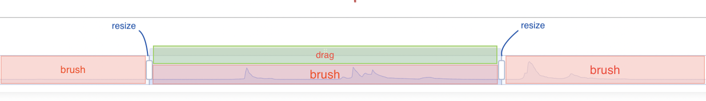

# option

## title
- **Type**: `Object`

Title component, including main title and subtitle.

In ECharts 2.x, a single instance of ECharts could contains one title component at most. However, in ECharts 3, there could be one or more than one title components. It is more useful when multiple diagrams in one instance all need titles.

**Here are some instances of different animation easing functions, among which every instance has a title component:**

## legend
- **Type**: `Object`

Legend component.

Legend component shows symbol, color and name of different series. You can click legends to toggle displaying series in the chart.

In ECharts 3, a single echarts instance may contain multiple legend components, which makes it easier for the layout of multiple legend components.

If there have to be too many legend items, [vertically scrollable legend](https://echarts.apache.org/examples/en/editor.html?c=pie-legend&edit=1&reset=1) or [horizontally scrollable legend](https://echarts.apache.org/examples/en/editor.html?c=radar2&edit=1&reset=1) are options to paginate them. Check [legend.type](option-parts/option.legend.md#type) please.

## grid
- **Type**: `Object`

The `grid component` is a rectangular container, used to lay out two-dimensional rectangular coordinate system (also known as `cartesian2d` coordinate system).

A `cartesian2d` coordinate system is composed fo an [xAxis](option.md#xAixs) and a [yAxis](option-parts/option.yAxis.md). Multiple `cartesian2d` coordinate systems can be arranged within a single `grid component` - that is, multiple [xAxis](option.md#xAixs) and multiple [yAxis](option-parts/option.yAxis.md) instances can be configured within one `grid component`.

An [xAxis](option.md#xAixs) or a [yAxis](option-parts/option.yAxis.md) can be shared by multiple `cartesian2d` coordinate systems. For example, one [xAxis](option.md#xAixs) and two [yAxis](option-parts/option.yAxis.md) form two `cartesian2d` coordinate systems.

[Line chart](option-parts/option.series-line.md), [bar chart](option-parts/option.series-bar.md), and [scatter chart (bubble chart)](option-parts/option.series-scatter.md), etc., can be drawn in `grid component`.

> In ECharts 2.x, there could only be one single grid component at most in a single echarts instance. But since ECharts 3, there is no limitation.

**Following is an example of Anscombe Quartet:**

## xAxis
- **Type**: `Object`

The x axis in cartesian(rectangular) coordinate. Usually a single grid component can place at most 2 x axis, one on the bottom and another on the top. [offset](option-parts/option.xAxis.md#offset) can be used to avoid overlap when you need to put more than two x axis.

## yAxis
- **Type**: `Object`

The y axis in cartesian(rectangular) coordinate. Usually a single grid component can place at most 2 y axis, one on the left and another on the right. [offset](option-parts/option.yAxis.md#offset) can be used to avoid overlap when you need to put more than two y axis.

## polar
- **Type**: `Object`

Polar coordinate can be used in scatter and line chart. Every polar coordinate has an [angleAxis](option-parts/option.angleAxis.md) and a [radiusAxis](option-parts/option.radiusAxis.md).

**For example:**

## radiusAxis
- **Type**: `Object`

Radial axis of polar coordinate.

## angleAxis
- **Type**: `Object`

The angle axis in Polar Coordinate.

## radar
- **Type**: `Object`

Coordinate for [radar charts](option-parts/option.series-radar.md). This component is equal to the polar component in ECharts 2. Because the polar component in the echarts 3 is reconstructed to be the standard polar coordinate component, this component is renamed to be radar to avoid confusion.

Radar chart coordinate is different from polar coordinate, in that every axis indicator of the radar chart coordinate is an individual dimension. The style of indicator coordinate axis could be configured through the following configuration items, including [name](option-parts/option.radar.md#name), [axisLine](option-parts/option.radar.md#axisLine), [axisTick](option-parts/option.radar.md#axisTick), [axisLabel](option-parts/option.radar.md#axisLabel), [splitLine](option-parts/option.radar.md#splitLine), [splitArea](option-parts/option.radar.md#splitArea).

Here is a custom example of radar component.

## dataZoom
- **Type**: `Array`

`dataZoom` component is used for zooming a specific area, which enables user to investigate data in detail, or get an overview of the data, or get rid of outlier points.

These types of `dataZoom` component are supported:

*   [dataZoomInside](option-parts/option.dataZoom-inside.md): Data zoom functionalities is embedded inside coordinate systems, enable user to zoom or roam coordinate system by mouse dragging, mouse move or finger touch (in touch screen).
    
*   [dataZoomSlider](option-parts/option.dataZoom-slider.md): A special slider bar is provided, on which coordinate systems can be zoomed or roamed by mouse dragging or finger touch (in touch screen).
    
*   [dataZoomSelect](option-parts/option.toolbox.md#feature.dataZoom): A marquee tool is provided for zooming or roaming coordinate system. That is [toolbox.feature.dataZoom](option-parts/option.toolbox.md#feature.dataZoom), which can only be configured in toolbox.
    

Example:

  

* * *

**✦ Relationship between dataZoom and axis ✦**

Basically `dataZoom` component operates "window" on axis to zoom or roam coordinate system.

> Use [dataZoom.xAxisIndex](option.md#dataZoom.xAxisIndex) or [dataZoom.yAxisIndex](option.md#dataZoom.yAxisIndex) or [dataZoom.radiusAxisIndex](option.md#dataZoom.radiusAxisIndex) or [dataZoom.angleAxisIndex](option.md#dataZoom.angleAxisIndex) to specify which axes are operated by `dataZoom`.

A single chart instance can contain several `dataZoom` components, each of which controls different axes. The `dataZoom` components that control the same axis will be automatically linked (i.e., all of them will be updated when one of them is updated by user action or API call).

  

* * *

**✦ How dataZoom components operates axes and data ✦**

Generally `dataZoom` component zoom or roam coordinate system through data filtering and set the windows of axes internally.

Its behaviours vary according to filtering mode settings ([dataZoom.filterMode](option.md#dataZoom.filterMode)).

Possible values:

*   'filter': data that outside the window will be **filtered**, which may lead to some changes of windows of other axes. For each data item, it will be filtered if one of the relevant dimensions is out of the window.
    
*   'weakFilter': data that outside the window will be **filtered**, which may lead to some changes of windows of other axes. For each data item, it will be filtered only if all of the relevant dimensions are out of the same side of the window.
    
*   'empty': data that outside the window will be **set to NaN**, which will not lead to changes of windows of other axes.
    
*   'none': Do not filter data.
    

How to set `filterMode` is up to users, depending on the requirements and scenarios. Expirically:

*   If only `xAxis` or only `yAxis` is controlled by `dataZoom`, `filterMode: 'filter'` is typically used, which enable the other axis auto adapte its window to the extent of the filtered data.
    
*   If both `xAxis` and `yAxis` are operated by `dataZoom`:
    
    *   If `xAxis` and `yAxis` should not effect mutually (e.g. a scatter chart with both axes on the type of `'value'`), they should be set to be `filterMode: 'empty'`.
        
    *   If `xAxis` is the main axis and `yAxis` is the auxiliary axis (or vise versa) (e.g., in a bar chart, when dragging `dataZoomX` to change the window of xAxis, we need the yAxis to adapt to the clipped data, but when dragging `dataZoomY` to change the window of yAxis, we need the xAxis not to be changed), in this case, `xAxis` should be set to be `filterMode: 'filter'`, while `yAxis` should be set to be `filterMode: 'empty'`.
        

It can be demonstrated by the sample:

```
option = {
    dataZoom: [
        {
            id: 'dataZoomX',
            type: 'slider',
            xAxisIndex: [0],
            filterMode: 'filter'
        },
        {
            id: 'dataZoomY',
            type: 'slider',
            yAxisIndex: [0],
            filterMode: 'empty'
        }
    ],
    xAxis: {type: 'value'},
    yAxis: {type: 'value'},
    series{
        type: 'bar',
        data: [
            // The first column corresponds to xAxis,
            // and the second column corresponds to yAxis.
            [12, 24, 36],
            [90, 80, 70],
            [3, 9, 27],
            [1, 11, 111]
        ]
    }
}
```

In the sample above, `dataZoomX` is set as `filterMode: 'filter'`. When use drags `dataZoomX` (do not touch `dataZoomY`) and the valueWindow of `xAxis` is changed to `[2, 50]` consequently, `dataZoomX` travel the first column of series.data and filter items that out of the window. The series.data turns out to be:

```
[
    [12, 24, 36],
    // [90, 80, 70] This item is filtered, as 90 is out of the window.
    [3, 9, 27]
    // [1, 11, 111] This item is filtered, as 1 is out of the window.
]
```

Before filtering, the second column, which corresponds to yAxis, has values `24`, `80`, `9`, `11`. After filtering, only `24` and `9` are left. Then the extent of `yAxis` is adjusted to adapt the two values (if `yAxis.min` and `yAxis.max` are not set).

So `filterMode: 'filter'` can be used to enable the other axis to auto adapt the filtered data.

Then let's review the sample from the beginning, `dataZoomY` is set as `filterMode: 'empty'`. So if user drags `dataZoomY` (do not touch `dataZoomX`) and its window is changed to `[10, 60]` consequently, `dataZoomY` travels the second column of series.data and set NaN to all of the values that outside the window (NaN cause the graphical elements, i.e., bar elements, do not show, but still hold the place). The series.data turns out to be:

```
[
    [12, 24, 36],
    [90, NaN, 70], // Set to NaN
    [3, NaN, 27],  // Set to NaN
    [1, 11, 111]
]
```

In this case, the first column (i.e., `12`, `90`, `3`, `1`, which corresponds to `xAxis`), will not be changed at all. So dragging `yAxis` will not change extent of `xAxis`, which is good for requirements like outlier filtering.

See this example:

Moreover, when `min`, `max` of an axis is set (e.g., `yAxis: {min: 0, max: 400}`), this extent of the axis will not be modified by the behaviour of dataZoom of other axis any more.

  

* * *

**✦ How to set window ✦**

You can set the current window in two forms:

*   percent value: see [dataZoom.start](option.md#dataZoom.start) and [dataZoom.end](option.md#dataZoom.end).
    
*   absolute value: see [dataZoom.startValue](option.md#dataZoom.startValue) and [dataZoom.endValue](option.md#dataZoom.endValue).
    

Notice: If use percent value form, and it is in the scenario below, the result of dataZoom depends on the sequence of dataZoom definitions appearing in `option`.

```
option = {
    dataZoom: [
        {
            id: 'dataZoomX',
            type: 'slider',
            xAxisIndex: [0],
            filterMode: 'filter',   // Set as 'filter' so that the modification
                                    // of window of xAxis will effect the
                                    // window of yAxis.
            start: 30,
            end: 70
        },
        {
            id: 'dataZoomY',
            type: 'slider',
            yAxisIndex: [0],
            filterMode: 'empty',
            start: 20,
            end: 80
        }
    ],
    xAxis: {
        type: 'value'
    },
    yAxis: {
        type: 'value'
        // Notice there is no min or max set to
        // restrict the view extent of yAxis.
    },
    series{
        type: 'bar',
        data: [
            // The first column corresponds to xAxis,
            // and the second column corresponds to yAxis.
            [12, 24, 36],
            [90, 80, 70],
            [3, 9, 27],
            [1, 11, 111]
        ]
    }
}
```

What is the exact meaning of `start: 20, end: 80` in `dataZoomY` in the example above?

*   If `yAxis.min` and `yAxis.max` are set:
    
    `start: 20, end: 80` of `dataZoomY` means: from `20%` to `80%` out of `[yAxis.min, yAxis.max]`.
    
    If one of `yAxis.min` and `yAxis.max` is not set, the corresponding edge of the full extend also follow rule as follows.
    
*   If `yAxis.min` and `yAxis.max` are not set:
    
    *   If `dataZoomX` is set to be `filterMode: 'empty'`:
        
        `start: 20, end: 80` of `dataZoomY` means: from `20%` to `80%` out of `[dataMinY to dataMaxY]` of series.data (i.e., `[9, 80]` in the example above).
        
    *   If `dataZoomX` is set to `filterMode: 'filter'`:
        
        Since `dataZoomX` is defined before `dataZoomY`, `start: 30, end: 70` of `dataZoomX` means: from `30%` to `70%` out of full series.data, whereas `start: 20, end: 80` of `dataZoomY` means: from `20%` to `80%` out of the series.data having been filtered by `dataZoomX`.
        
        If you want to change the process sequence, you can just change the sequence of the definitions apearing in `option`.

## dataZoom-inside
- **Type**: `Object`

**dataZoomInside**

Data zoom component of _inside_ type.

Refer to [dataZoom](option.md#dataZoom) for more information.

The _inside_ means it's inside the coordinates.

*   Translation: data area can be translated when moving in coordinates.
*   Scaling:
    *   PC: when mouse rolls (similar with touch pad) in coordinates.
    *   Mobile: when touches and moved with two fingers in coordinates on touch screens.

## dataZoom-slider
- **Type**: `Object`

Slider type dataZoom component provides functions like data thumbnail, zoom, brush to select, drag to move, click to locate.

The followling picture shows areas to interact.



## visualMap
- **Type**: `Array`

`visualMap` is a type of component for visual encoding, which maps the data to visual channels, including:

*   `symbol`: Type of symbol.
*   `symbolSize`: Symbol size.
*   `color`: Symbol color.
*   `colorAlpha`: Symbol alpha channel.
*   `opacity`: Opacity of symbol and others (like labels).
*   `colorLightness`: Lightness in [HSL](https://en.wikipedia.org/wiki/HSL_and_HSV).
*   `colorSaturation`: Saturation in [HSL](https://en.wikipedia.org/wiki/HSL_and_HSV).
*   `colorHue`: Hue in [HSL](https://en.wikipedia.org/wiki/HSL_and_HSV).

Multiple `visualMap` component could be defined in a chart instance, which enable that different dimensions of a series data are mapped to different visual channels.

`visualMap` could be defined as [Piecewise (visualMapPiecewise)](option-parts/option.visualMap-piecewise.md) or [Continuous (visualMapContinuous)](option-parts/option.visualMap-continuous.md), which is distinguished by the property `type`. For instance:

```
option = {
    visualMap: [
        { // the first visualMap component
            type: 'continuous', // defined to be continuous visualMap
            ...
        },
        { // the second visualMap component
            type: 'piecewise', // defined to be piecewise visualMap
            ...
        }
    ],
    ...
};
```

  
**✦ Configure mapping ✦**

The dimension of [series.data](option.md#series.data) can be specified by [visualMap.dimension](option.md#visualMap.dimension), from which the value can be retrieved and mapped onto visual channels, which can be defined in [visualMap.inRange](option.md#visualMap.inRange) and [visualMap.outOfRange](option.md#visualMap.outOfRange).

  
In series that controlled by visualMap, if a data item needs to escape from controlled by visualMap, you can set like this:

```
series: {
    type: '...',
    data: [
        {name: 'Shanghai', value: 251},
        {name: 'Haikou', value: 21},
        // Mark as `visualMap: false`, then this item does not controlled by visualMap any more,
        // and series visual config (like color, symbol, ...) can be used to this item.
        {name: 'Beijing', value: 821, },
        ...
    ]
}
```

  
**✦ The relationship between visualMap of ECharts3 and dataRange of ECharts2 ✦**

`visualMap` is renamed from the `dataRange` of ECharts2, and the scope of functionalities are extended a lot. The configurations of `dataRange` are still compatible in ECharts3, which automatically convert them to `visualMap`. It is recommended to use `visualMap` instead of `dataRange` in ECharts3.

  
**✦ The detailed configurations of visualMap are elaborated as follows. ✦**

## visualMap-continuous
- **Type**: `Object`

**Continuous visualMap component (visualMapContinuous)**

(See [the introduction to visual Map component (visualMap)](option.md#visualMap))

You can set [visualMap.calculable](option.md#visualMap.calculable) to show or hide the handles, which are used to change the selected range in `visualMapContinuous`.

## visualMap-piecewise
- **Type**: `Object`

**Piecewise visualMap component (visualMapPiecewise)**

(Reference to [the introduction of visual Map component (visualMap)](option.md#visualMap))

Sample:

Piecewise visualMap component works in one of the three modes:

*   **CONTINUOUS-AVERAGE**: The series.data is continuous and is divided into pieces averagely according to [visualMap-piecewise.splitNumber](option-parts/option.visualMap-piecewise.md#splitNumber).
*   **CONTINUOUS-CUSTOMIZED**: The series.data is continuous and is divided into pieces according to the given rule defined in [visualMap-piecewise.pieces](option-parts/option.visualMap-piecewise.md#pieces).
*   **CATEGORY**: The series.data is discrete and is categorized according to [visualMap-piecewise.categories](option-parts/option.visualMap-piecewise.md#categories).

## tooltip
- **Type**: `Object`

Tooltip component.

* * *

**General Introduction:**

tooltip can be configured on different places:

*   Configured on global: [tooltip](option-parts/option.tooltip.md)
    
*   Configured in a coordinate system: [grid.tooltip](option-parts/option.grid.md#tooltip), [polar.tooltip](option-parts/option.polar.md#tooltip), [single.tooltip](option.md#single.tooltip)
    
*   Configured in a series: [series.tooltip](option.md#series.tooltip)
    
*   Configured in each item of `series.data`: [series.data.tooltip](option.md#series.data.tooltip)

## axisPointer
- **Type**: `Object`

This is the global configurations of axisPointer.

* * *

`axisPointer` is a tool for displaying reference line and axis value under mouse pointer.

For example:

In the demo above, [axisPointer.link](option-parts/option.axisPointer.md#link) is used to link axisPointer from different coordinate systems.

`axisPointer` can also be used on touch device, where user can drag the button to move the reference line and label.

In the cases that more than one axis exist, axisPointer helps to look inside the data.

* * *

> **Notice:** Generally, axisPointers is configured in each axes who need them (for example [xAxis.axisPointer](option-parts/option.xAxis.md#axisPointer)), or configured in `tooltip` (for example [tooltip.axisPointer](option-parts/option.tooltip.md#axisPointer)).

> But these configurations can only be configured in global axisPointer: [axisPointer.triggerOn](option-parts/option.axisPointer.md#triggerOn), [axisPointer.link](option-parts/option.axisPointer.md#link).

* * *

* * *

**How to display axisPointer:**

In [cartesian (grid)](option-parts/option.grid.md) and [polar\](~polar) and (single axis](option.md#single), each axis has its own axisPointer.

Those axisPointer will not be displayed by default, utill configured as follows:

*   Set `someAxis.axisPointer.show` (like [xAxis.axisPointer.show](option-parts/option.xAxis.md#axisPointer.show)) as `true`. Then axisPointer of this axis will be displayed.
    
*   Set [tooltip.trigger](option-parts/option.tooltip.md#trigger) as `'axis'`, or set [tooltip.axisPointer.type](option-parts/option.tooltip.md#axisPointer.type) as `'cross'`. Then coordinate system will automatically chose the axes who will display their axisPointers. ([tooltip.axisPointer.axis](option-parts/option.tooltip.md#axisPointer.axis) can be used to change the choice.) Notice, `axis.axisPointer` will override `tooltip.axisPointer` settings.
    

* * *

**How to display the label of axisPointer:**

The label of axisPointer will not be displayed by default(namely, only reference line will be displayed by default), utill configured as follows:

*   Set `someAxis.axisPointer.label.show` (for example [xAxis.axisPointer.label.show](option-parts/option.xAxis.md#axisPointer.show)) as `true`. Then the label of the axisPointer will be displayed.
    
*   Set [tooltip.axisPointer.type](option-parts/option.tooltip.md#axisPointer.type) as `'cross'`. Then the label of the crossed axisPointers will be displayed.
    

* * *

**How to configure axisPointer on touch device:**

Set `someAxis.axisPointer.handle.show` (for example [xAxis.axisPointer.handle.show](option-parts/option.xAxis.md#axisPointer.handle.show) as `true`. Then the button for dragging will be displayed. (This feature is not supported on polar).

**Notice:** If tooltip does not work well in this case, try to set[tooltip.triggerOn](option-parts/option.tooltip.md#triggerOn) as `'none'` (for the effect: show tooltip when finger holding on the button, and hide tooltip after finger left the button), or set [tooltip.alwaysShowContent](option-parts/option.tooltip.md#alwaysShowContent) as `true` (then tooltip will always be displayed).

See the [example](https://echarts.apache.org/examples/en/editor.html?c=line-tooltip-touch&edit=1&reset=1).

* * *

**Snap to point**

In value axis and time axis, if [snap](option-parts/option.xAxis.md#axisPointer.snap) is set as true, axisPointer will snap to point automatically.

* * *

* * *

## toolbox
- **Type**: `Object`

A group of utility tools, which includes [export](option-parts/option.toolbox.md#feature.saveAsImage), [data view](option-parts/option.toolbox.md#feature.dataView), [dynamic type switching](option-parts/option.toolbox.md#feature.magicType), [data area zooming](option-parts/option.toolbox.md#feature.dataZoom), and [reset](option-parts/option.toolbox.md#feature.reset).

**Example:**

## brush
- **Type**: `Object`

`brush` is an area-selecting component, with which user can select part of data from a chart to display in detail, or do calculations with them.

  

* * *

**Brush type and triggering button**

Currently, supported `brush` types include: `scatter`, `bar`, `candlestick`. (Note that `parallel` contains brush function by itself, which is not provided by brush component.)

Click the button in `toolbox` to enable operations like _area selecting_, or _canceling selecting_.

  
Example of `horizontal brush`: (Click the button in `toolbox` to enable brushing.)

  
Example of `brush` in `bar` charts:

Button for `brush` can be assigned in [`toolbox`](option-parts/option.toolbox.md#feature.brush.type) or [`brush` configuration](option-parts/option.brush.md#toolbox).

The following types of brushes are supported: `rect`, `polygon`, `lineX`, `lineY`. See [brush.toolbox](option-parts/option.brush.md#toolbox) for more information.

`keep` button can be used to toggle a single or multiple selections.

*   Only one select box is available in single selection mode, and the select-box can be removed by clicking on the blank area.
*   Multiple select boxes are available in multiple selection mode, and the select-boxes cannot be removed by click on the blank area. Instead, you need to click the _clear_ button.

  

* * *

**Relationship between brush-selecting and coordinates**

`brush` can be set to be _global_, or _belonging to a particular coordinate_.

**Global brushes**

Selecting is enabled for everywhere in ECharts's instance in this case. This is the default situation, when brush is not set to be global.

**Coordinate brushes**

Selecting is enabled only in the assigned coordinates in this case. Selecting-box will be altered according to scaling and translating of coordinate (see `roam` and `dataZoom`).

In practice, you may often find coordinate brush to be a more frequently made choice, particularly in `geo` charts.

By assigning [brush.geoIndex](option-parts/option.brush.md#geoIndex), or [brush.xAxisIndex](option-parts/option.brush.md#xAxisIndex), or [brush.yAxisIndex](option-parts/option.brush.md#yAxisIndex), brush selecting axes can be assigned, whose value can be:

*   `'all'`: for all axes;
*   `number`: like `0`, for a particular coordinate with that index;
*   `Array`: like `[0, 4, 2]`, for coordinates with those indexes;
*   `'none'`, or `null`, or `undefined`: for not assigning.

Example:

```
option = {
    geo: {
        ...
    },
    brush: {
        geoIndex: 'all', // brush selecting is enabled only in all geo charts above
        ...
    }
};
```

Example:

```
option = {
    grid: [
        {...}, // grid 0
        {...}  // grid 1
    ],
    xAxis: [
        {gridIndex: 1, ...}, // xAxis 0 for grid 1
        {gridIndex: 0, ...}  // xAxis 1 for grid 0
    ],
    yAxis: [
        {gridIndex: 1, ...}, // yAxis 0 for grid 1
        {gridIndex: 0, ...}  // yAxis 1 for grid 0
    ],
    brush: {
        xAxisIndex: [0, 1], // brush selecting is enabled only in coordinates with xAxisIndex as `0` or `1`
        ...
    }
};
```

  

* * *

**Control select-box with API**

`dispatchAction` can be used to render select-box programmatically. For example:

```
myChart.dispatchAction({
    type: 'brush',
    areas: [
        {
            geoIndex: 0,
            // Assign select-box type
            brushType: 'polygon',
            // Assign select-box shape
            coordRange: [[119.72,34.85],[119.68,34.85],[119.5,34.84],[119.19,34.77]]
        }
    ]
});
```

Please refer to [action.brush](api-parts/api.action.md#brush) for more information.

  

* * *

**brushLink**

Links interaction between selected items in different series.

Following is an example of enabling selected effect for `scatter` and `parallel` charts once a scatter chart is selected.

`brushLink` is an array of `seriesIndex`es, which assigns the series that can be interacted. For example, it can be:

*   `[3, 4, 5]` for interacting series with seriesIndex as `3`, `4`, or `5`;
*   `'all'` for interacting all series;
*   `'none'`, or `null`, or `undefined` for disabling `brushLink`.

**Attention**

`brushLink` is a mapping of `dataIndex`. So **`data` of every series with `brushLink` should be guaranteed to correspond to the other**.

Example:

```
option = {
    brush: {
        brushLink: [0, 1]
    },
    series: [
        {
            type: 'bar'
            data: [232,    4434,    545,      654]     // data has 4 items
        },
        {
            type: 'parallel',
            data: [[4, 5], [3, 5], [66, 33], [99, 66]] // data also has 4 items, which correspond to the data above
        }
    ]
};
```

Please refer to [brush.brushLink](option-parts/option.brush.md#brushLink).

  

* * *

**throttle / debounce**

By default, `brushSelected` is always triggered when selection-box is selected or moved, to tell the outside about the event.

But efficiency problems may occur when events are triggered too frequently, or the animation result may be affected. So brush components provides [brush.throttleType](option-parts/option.brush.md#throttleType) and [brush.throttleDelay](option-parts/option.brush.md#throttleDelay) to solve this problem.

Valid `throttleType` values can be:

*   `'debounce'`: for triggering events only when the action has been stopped (no action after some duration). Time threshold can be assigned with [brush.throttleDelay](option-parts/option.brush.md#throttleDelay);
*   `'fixRate'`: for triggering event with a certain frequency. The frequency can be assigned with [brush.throttleDelay](option-parts/option.brush.md#throttleDelay).

In this [example](https://echarts.apache.org/examples/en/view.html?c=scatter-map-brush&edit=1&reset=1), `debounce` is used to make sure the bar chart is updated only when the user has stopped action. In other cases, the animation result may not be so good.

  

* * *

**Visual configurations of selected and unselected items**

Refer to [brush.inBrush](option-parts/option.brush.md#inBrush) and [brush.outOfBrush](option-parts/option.brush.md#outOfBrush).

  

* * *

Here is the configuration in detail.

## geo
- **Type**: `Object`

Geographic coordinate system component.

Geographic coordinate system component is used to draw maps, which also supports [scatter series](option-parts/option.series-scatter.md), and [line series](option-parts/option.series-lines.md).

From `3.1.10`, geo component also supports mouse events, whose parameters are:

```
{
    componentType: 'geo',
    // geo component's index in option
    geoIndex: number,
    // name of clicking area, e.g., Shanghai
    name: string,
    // clicking region object as input, see geo.regions
    region: Object
}
```

**Tip:** The region color can also be controlled by map series. See [series-map.geoIndex](option-parts/option.series-map.md#geoIndex).

## parallel
- **Type**: `Object`

**Introduction about Parallel coordinates**

[Parallel Coordinates](https://en.wikipedia.org/wiki/Parallel_coordinates) is a common way of visualizing high-dimensional geometry and analyzing multivariate data.

For example, [series-parallel.data](option-parts/option.series-parallel.md#data) is the following data:

```
[
    [1,  55,  9,   56,  0.46,  18,  6,  'good'],
    [2,  25,  11,  21,  0.65,  34,  9,  'excellent'],
    [3,  56,  7,   63,  0.3,   14,  5,  'good'],
    [4,  33,  7,   29,  0.33,  16,  6,  'excellent'],
    { // Data item can also be an Object, so that perticular settings of its line can be set here.
        value: [5,  42,  24,  44,  0.76,  40,  16, 'excellent']
        lineStyle: {...},
    }
    ...
]
```

In data above, each row is a "data item", and each column represents a "dimension". For example, the meanings of columns above are: "data", "AQI", "PM2.5", "PM10", "carbon monoxide level", "nitrogen dioxide level", and "sulfur dioxide level".

Parallel coordinates are often used to visualize multi-dimension data shown above. Each axis represents a dimension (namely, a column), and each line represents a data item. Data can be brush-selected on axes. For example:

**Brief about Configuration**

Basic configuration parallel coordinates is shown as follow:

```
option = {
    parallelAxis: [                     // Definitions of axes.
        {dim: 0, name: schema[0].text}, // Each axis has a 'dim' attribute, representing dimension index in data.
        {dim: 1, name: schema[1].text},
        {dim: 2, name: schema[2].text},
        {dim: 3, name: schema[3].text},
        {dim: 4, name: schema[4].text},
        {dim: 5, name: schema[5].text},
        {dim: 6, name: schema[6].text},
        {dim: 7, name: schema[7].text,
            type: 'category',           // Also supports category data.
            data: ['Excellent', 'good', 'light pollution', 'moderate pollution', 'heavy pollution', 'severe pollution']
        }
    ],
    parallel: {                         // Definition of a parallel coordinate system.
        left: '5%',                     // Location of parallel coordinate system.
        right: '13%',
        bottom: '10%',
        top: '20%',
        parallelAxisDefault: {          // A pattern for axis definition, which can avoid repeating in `parallelAxis`.
            type: 'value',
            nameLocation: 'end',
            nameGap: 20
        }
    },
    series: [                           // Here the three series sharing the same parallel coordinate system.
        {
            name: 'Beijing',
            type: 'parallel',           // The type of this series is 'parallel'
            data: [
                [1,  55,  9,   56,  0.46,  18,  6,  'good'],
                [2,  25,  11,  21,  0.65,  34,  9,  'excellent'],
                ...
            ]
        },
        {
            name: 'Shanghai',
            type: 'parallel',
            data: [
                [3,  56,  7,   63,  0.3,   14,  5,  'good'],
                [4,  33,  7,   29,  0.33,  16,  6,  'excellent'],
                ...
            ]
        },
        {
            name: 'Guangzhou',
            type: 'parallel',
            data: [
                [4,  33,  7,   29,  0.33,  16,  6,  'excellent'],
                [5,  42,  24,  44,  0.76,  40,  16, 'excellent'],
                ...
            ]
        }
    ]
};
```

Three components are involved here: [parallel](option-parts/option.parallel.md), [parallelAxis](option-parts/option.parallelAxis.md), [series-parallel](option-parts/option.series-parallel.md)

*   [parallel](option-parts/option.parallel.md)
    
    This component is the coordinate system. One or more series (like "Beijing", "Shanghai", and "Guangzhou" in the above example) can share one coordinate system.
    
    Like other coordinate systems, multiple parallel coordinate systems can be created in one echarts instance.
    
    Position setting is also carried out here.
    
*   [parallelAxis](option-parts/option.parallelAxis.md)
    
    This is axis configuration. Multiple axes are needed in parallel coordinates.
    
    [parallelAxis.parallelIndex](option-parts/option.parallelAxis.md#parallelIndex) is used to specify which coordinate system this axis belongs to. The first coordinate system is used by default.
    
*   [series-parallel](option-parts/option.series-parallel.md)
    
    This is the definition of parallel series, which will be drawn on parallel coordinate system.
    
    [parallelAxis.parallelIndex](option-parts/option.parallelAxis.md#parallelIndex) is used to specify which coordinate system this axis belongs to. The first coordinate system is used by default.
    

**Notes and Best Practices**

When configuring multiple [parallelAxis](option-parts/option.parallelAxis.md), there might be some common attributes in each axis configuration. To avoid writing them repeatedly, they can be put under [parallel.parallelAxisDefault](option-parts/option.parallel.md#parallelAxisDefault). Before initializing axis, configurations in [parallel.parallelAxisDefault](option-parts/option.parallel.md#parallelAxisDefault) will be merged into [parallelAxis](option-parts/option.parallelAxis.md) to generate the final axis configuration.

**If data is too large and cause bad performance**

It is suggested to set [series-parallel.lineStyle.width](option-parts/option.series-parallel.md#lineStyle.width) to be `0.5` (or less), which may improve performance significantly.

**Display High-Dimension Data**

When dimension number is extremely large, say, more than 50 dimensions, there will be more than 50 axes, which may hardly display in a page.

In this case, you may use [parallel.axisExpandable](option-parts/option.parallel.md#axisExpandable) to improve the display. See this example:

## parallelAxis
- **Type**: `Object`

This component is the coordinate axis for parallel coordinate.

**Introduction about Parallel coordinates**

[Parallel Coordinates](https://en.wikipedia.org/wiki/Parallel_coordinates) is a common way of visualizing high-dimensional geometry and analyzing multivariate data.

For example, [series-parallel.data](option-parts/option.series-parallel.md#data) is the following data:

```
[
    [1,  55,  9,   56,  0.46,  18,  6,  'good'],
    [2,  25,  11,  21,  0.65,  34,  9,  'excellent'],
    [3,  56,  7,   63,  0.3,   14,  5,  'good'],
    [4,  33,  7,   29,  0.33,  16,  6,  'excellent'],
    { // Data item can also be an Object, so that perticular settings of its line can be set here.
        value: [5,  42,  24,  44,  0.76,  40,  16, 'excellent']
        lineStyle: {...},
    }
    ...
]
```

In data above, each row is a "data item", and each column represents a "dimension". For example, the meanings of columns above are: "data", "AQI", "PM2.5", "PM10", "carbon monoxide level", "nitrogen dioxide level", and "sulfur dioxide level".

Parallel coordinates are often used to visualize multi-dimension data shown above. Each axis represents a dimension (namely, a column), and each line represents a data item. Data can be brush-selected on axes. For example:

**Brief about Configuration**

Basic configuration parallel coordinates is shown as follow:

```
option = {
    parallelAxis: [                     // Definitions of axes.
        {dim: 0, name: schema[0].text}, // Each axis has a 'dim' attribute, representing dimension index in data.
        {dim: 1, name: schema[1].text},
        {dim: 2, name: schema[2].text},
        {dim: 3, name: schema[3].text},
        {dim: 4, name: schema[4].text},
        {dim: 5, name: schema[5].text},
        {dim: 6, name: schema[6].text},
        {dim: 7, name: schema[7].text,
            type: 'category',           // Also supports category data.
            data: ['Excellent', 'good', 'light pollution', 'moderate pollution', 'heavy pollution', 'severe pollution']
        }
    ],
    parallel: {                         // Definition of a parallel coordinate system.
        left: '5%',                     // Location of parallel coordinate system.
        right: '13%',
        bottom: '10%',
        top: '20%',
        parallelAxisDefault: {          // A pattern for axis definition, which can avoid repeating in `parallelAxis`.
            type: 'value',
            nameLocation: 'end',
            nameGap: 20
        }
    },
    series: [                           // Here the three series sharing the same parallel coordinate system.
        {
            name: 'Beijing',
            type: 'parallel',           // The type of this series is 'parallel'
            data: [
                [1,  55,  9,   56,  0.46,  18,  6,  'good'],
                [2,  25,  11,  21,  0.65,  34,  9,  'excellent'],
                ...
            ]
        },
        {
            name: 'Shanghai',
            type: 'parallel',
            data: [
                [3,  56,  7,   63,  0.3,   14,  5,  'good'],
                [4,  33,  7,   29,  0.33,  16,  6,  'excellent'],
                ...
            ]
        },
        {
            name: 'Guangzhou',
            type: 'parallel',
            data: [
                [4,  33,  7,   29,  0.33,  16,  6,  'excellent'],
                [5,  42,  24,  44,  0.76,  40,  16, 'excellent'],
                ...
            ]
        }
    ]
};
```

Three components are involved here: [parallel](option-parts/option.parallel.md), [parallelAxis](option-parts/option.parallelAxis.md), [series-parallel](option-parts/option.series-parallel.md)

*   [parallel](option-parts/option.parallel.md)
    
    This component is the coordinate system. One or more series (like "Beijing", "Shanghai", and "Guangzhou" in the above example) can share one coordinate system.
    
    Like other coordinate systems, multiple parallel coordinate systems can be created in one echarts instance.
    
    Position setting is also carried out here.
    
*   [parallelAxis](option-parts/option.parallelAxis.md)
    
    This is axis configuration. Multiple axes are needed in parallel coordinates.
    
    [parallelAxis.parallelIndex](option-parts/option.parallelAxis.md#parallelIndex) is used to specify which coordinate system this axis belongs to. The first coordinate system is used by default.
    
*   [series-parallel](option-parts/option.series-parallel.md)
    
    This is the definition of parallel series, which will be drawn on parallel coordinate system.
    
    [parallelAxis.parallelIndex](option-parts/option.parallelAxis.md#parallelIndex) is used to specify which coordinate system this axis belongs to. The first coordinate system is used by default.
    

**Notes and Best Practices**

When configuring multiple [parallelAxis](option-parts/option.parallelAxis.md), there might be some common attributes in each axis configuration. To avoid writing them repeatedly, they can be put under [parallel.parallelAxisDefault](option-parts/option.parallel.md#parallelAxisDefault). Before initializing axis, configurations in [parallel.parallelAxisDefault](option-parts/option.parallel.md#parallelAxisDefault) will be merged into [parallelAxis](option-parts/option.parallelAxis.md) to generate the final axis configuration.

**If data is too large and cause bad performance**

It is suggested to set [series-parallel.lineStyle.width](option-parts/option.series-parallel.md#lineStyle.width) to be `0.5` (or less), which may improve performance significantly.

**Display High-Dimension Data**

When dimension number is extremely large, say, more than 50 dimensions, there will be more than 50 axes, which may hardly display in a page.

In this case, you may use [parallel.axisExpandable](option-parts/option.parallel.md#axisExpandable) to improve the display. See this example:

## singleAxis
- **Type**: `Object`

An axis with a single dimension. It can be used to display data in one dimension. For example:

## timeline
- **Type**: `Object`

`timeline` component, which provides functions like switching and playing between multiple ECharts `options`.

Here is an example:

Different from other cases, `timeline` component requires multiple options. We call first the parameter of `setOption` as `ECOption`, and call the traditional single ECharts option as `ECUnitOption`.

*   In the case that `timeline` and `media query` are not set, an `ECUnitOption` is an `ECOption`.
*   In the case that `timeline` or `media query` are set, an `ECOption` is made up with several `ECUnitOption`s.
    *   The properties at the root of `ECOption` form an `ECUnitOption`, which is also called `baseOption`, representing the default settings.
    *   Each item of the array `options` form an `ECUnitOption`, which can be also called `switchableOption`, representing options for each time tick.
*   `baseOption` and one `switchableOption` are used to calculate the `finalOption`, based on which the chart will be final rendered.

For example:

```
myChart.setOption({
    // This is the properties of `baseOption`.
    timeline: {
        ...,
        // each item in `timeline.data` corresponds to each
        // `option` in `options` array.
        data: ['2002-01-01', '2003-01-01', '2004-01-01']
    },
    title: {
        subtext: ' Data is from National Bureau of Statistics '
    },
    grid: { ... },
    xAxis: [ ... ],
    yAxis: [ ... ],
    series: [{
        // other configurations of series 1
        type: 'bar',
        ...
    }, {
        // other configurations of series 2
        type: 'line',
        ...
    }, {
        // other configurations of series 3
        type: 'pie',
        ...
    }],
    // `switchableOption`s:
    options: [{
        // it is an option corresponding to '2002-01-01'
        title: {
        text: 'the statistics of the year 2002'
        },
        series: [
            { data: [] }, // the data of series 1
            { data: [] }, // the data of series 2
            { data: [] }  // the data of series 3
        ]
    }, {
        // it is an option corresponding to '2003-01-01'
        title: {
            text: 'the statistics of the year 2003'
        },
        series: [
            { data: [] },
            { data: [] },
            { data: [] }
        ]
    }, {
        // it is an option corresponding to '2004-01-01'
        title: {
            text: 'the statistics of the year 2004'
        },
        series: [
            { data: [] },
            { data: [] },
            { data: [] }
        ]
    }]
});
```

  
**How the `finalOption` calculated?**

When initializing, a `switchableOption` corresponding to the current time tick are merged into `baseOption` to form the `finalOption`. Each time the current tick changed, the new `switchableOption` corresponding to the new time tick are merged into the `finalOption`.

There are two merging strategy.

*   By default, use `NORMAL_MERGE`.
*   If [timeline.replaceMerge](option.md#option.html#timeline.replaceMerge) is set, use `REPLACE_MERGE`. See [setOption](option.md#api.html#echartsInstance.setOption) for more details of `REPLACE_MERGE`.

  
**Compatibility with ECharts 4:**

We also support these equivalent setting styles:

```
option = {
    baseOption: {
        timeline: {},
        series: [],
        // ... other properties of baseOption.
    },
    options: []
};
```

## graphic
- **Type**: `*`

`graphic` component enables creating graphic elements in ECharts.

Those graphic type are supported.

[image](option-parts/option.graphic.md#elements-image), [text](option-parts/option.graphic.md#elements-text), [circle](option-parts/option.graphic.md#elements-circle), [sector](option-parts/option.graphic.md#elements-sector), [ring](option-parts/option.graphic.md#elements-ring), [polygon](option-parts/option.graphic.md#elements-polygon), [polyline](option-parts/option.graphic.md#elements-polyline), [rect](option-parts/option.graphic.md#elements-rect), [line](option-parts/option.graphic.md#elements-line), [bezierCurve](option-parts/option.graphic.md#elements-bezierCurve), [arc](option-parts/option.graphic.md#elements-arc), [compoundPath](option-parts/option.graphic.md#elements-compoundPath), [group](option-parts/option.graphic.md#elements-group),

This example shows how to make a watermark and text block:

This example use hidden graphic elements to implement dragging:

**Graphic Component Configuration**

A simple way to define a graphic element:

```
myChart.setOption({
    ...,
    graphic: {
        type: 'image',
        ...
    }
});
```

Define multiple graphic elements:

```
myChart.setOption({
    ...,
    graphic: [
        { // A 'image' element.
            type: 'image',
            ...
        },
        { // A 'text' element, with id specified.
            type: 'text',
            id: 'text1',
            ...
        },
        { // A 'group' element, in which children can be defined.
            type: 'group',
            children: [
                {
                    type: 'rect',
                    id: 'rect1',
                    ...
                },
                {
                    type: 'image',
                    ...
                },
                ...
            ]
        }
        ...
    ]
});

```

How to remove or replace existing elements by `setOption`:

```
myChart.setOption({
    ...,
    graphic: [
        { // Remove the element 'text1' defined above.
            id: 'text1',
            $action: 'remove',
            ...
        },
        { // Replace the element 'rect1' to a new circle element.
          // Note, although in the sample above 'rect1' is a children of a group,
          // it is not necessary to consider level relationship when setOption
          // again if you use id to specify them.
            id: 'rect1',
            $action: 'replace',
            type: 'circle',
            ...
        }
    ]
});
```

Notice, when using `setOption` to modify existing elements, if id is not specified, new options will be mapped to existing elements by their order, which might bring unexpected result sometimes. So, generally, using id is recommended.

**Graphic Element Configuration**

Different types of graphic elements has their own configuration respectively, but they have these common configuration below:

```
{
    // id is used to specifying element when willing to update it.
    // id can be ignored if you do not need it.
    id: 'xxx',

    // Specify element type. Can not be ignored when define a element at the first time.
    type: 'image',

    // All of the properties below can be ignored and a default value will be assigned.

    // Specify the operation should be performed to the element when calling `setOption`.
    // Default value is 'merge', other values can be 'replace' or 'remove'.
    $action: 'replace',

    // These four properties is used to locating the element. Each property can be absolute
    // value (like 10, means 10 pixel) or percent (like '12%') or 'center'/'middle'.
    left: 10,
    // right: 10,
    top: 'center',
    // bottom: '10%',

    shape: {
        // Here are configurations for shape, like `x`, `y`, `cx`, `cy`, `width`,
        // `height`, `r`, `points`, ...
        // Note, if `left`/`right`/`top`/`bottom` has been set, `x`/`y`/`cx`/`cy`
        // do not work here.
    },

    style: {
        // Here are configurations for style of the element, like `fill`, `stroke`,
        // `lineWidth`, `shadowBlur`, ...
    },

    // z value of the elements.
    z: 10,
    // Whether response to mouse events / touch events.
    silent: true,
    // Whether the element is invisible.
    invisible: false,
    // Used to specify whether the entire transformed element (containing children if is group)
    // is confined in its container. Optional values: 'raw', 'all'.
    bounding: 'raw',
    // Can be dragged or not.
    draggable: false,
    // Event handler, can also be onmousemove, ondrag, ... (listed below)
    onclick: function () {...}
}
```

**Event Handlers of Graphic Element**

These events are supported: `onclick`, `onmouseover`, `onmouseout`, `onmousemove`, `onmousewheel`, `onmousedown`, `onmouseup`, `ondrag`, `ondragstart`, `ondragend`, `ondragenter`, `ondragleave`, `ondragover`, `ondrop`.

**Hierarchy of Graphic Elements**

Only `group` element has children, which enable a group of elements to be positioned and transformed together.

**Shape Configuration of Graphic Element**

Elements with different types have different shape setting respectively. For example:

```
{
    type: 'rect',
    shape: {
        x: 10,
        y: 10,
        width: 100,
        height: 200
    }
},
{
    type: 'circle',
    shape: {
        cx: 20,
        cy: 30,
        r: 100
    }
},
{
    type: 'image',
    style: {
        image: 'http://example.website/a.png',
        x: 100,
        y: 200,
        width: 230,
        height: 400
    }
},
{
    type: 'text',
    style: {
        text: 'This text',
        x: 100,
        y: 200
    }

}
```

**Transforming and Absolutely Positioning of Graphic Element**

Element can be transformed (translation, rotation, scale). See [position](option-parts/option.graphic.md#elements.position), [rotation](option-parts/option.graphic.md#elements.rotation), [scale](option-parts/option.graphic.md#elements.scale), [origin](option-parts/option.graphic.md#elements.origin)

For example:

```
{
    type: 'rect', // or any other types.

    // Translation, using [0, 0] by default.
    position: [100, 200],

    // Scale, using [1, 1] by default.
    scale: [2, 4],

    // Rotation, using 0 by default. Negative value means rotating clockwise.
    rotation: Math.PI / 4,

    // Origin point of rotation and scale, using [0, 0] by default.
    origin: [10, 20],

    shape: {
        // ...
    }
}
```

Each element is transformed in the coordinate system of its parent, namely, transform of a element and its parent can be "stacked".

Transformation is performed by this order:

1.  Translate \[-el.origin\[0\], -el.origin\[1\]\].
2.  Scale according to el.scale.
3.  Rotate according to el.rotation.
4.  Translate back according to el.origin.
5.  Translate according to el.position.

Namely, scaling and rotating firstly, and then translate. By this mechanism, translation does not affect origin of scale and rotation.

**Relatively Positioning**

In real application, size of a container is always not fixed. So mechanism of relative position is required. In `graphic` component, [left](option-parts/option.graphic.md#elements.left) / [right](option-parts/option.graphic.md#elements.right) / [top](option-parts/option.graphic.md#elements.top) / [bottom](option-parts/option.graphic.md#elements.bottom) / [width](option-parts/option.graphic.md#elements.width) / [height](option-parts/option.graphic.md#elements.height) are used to position element relatively.

For example:

```
{ // Position the image at the bottom center of its container.
    type: 'image',
    left: 'center', // Position at the center horizontally.
    bottom: '10%',  // Position beyond the bottom boundary 10%.
    style: {
        image: 'http://example.website/a.png',
        width: 45,
        height: 45
    }
},
{ // Position the entire rotated group at the right-bottom corner of its container.
    type: 'group',
    right: 0,  // Position at the right boundary.
    bottom: 0, // Position at the bottom boundary.
    rotation: Math.PI / 4,
    children: [
        {
            type: 'rect',
            left: 'center', // Position at horizontal center according to its parent.
            top: 'middle',  // Position at vertical center according to its parent.
            shape: {
                width: 190,
                height: 90
            },
            style: {
                fill: '#fff',
                stroke: '#999',
                lineWidth: 2,
                shadowBlur: 8,
                shadowOffsetX: 3,
                shadowOffsetY: 3,
                shadowColor: 'rgba(0,0,0,0.3)'
            }
        },
        {
            type: 'text',
            left: 'center', // Position at horizontal center according to its parent.
            top: 'middle',  // Position at vertical center according to its parent.
            style: {
                fill: '#777',
                text: [
                    'This is text',
                    'This is text',
                    'Print some text'
                ].join('\n'),
                font: '14px Microsoft YaHei'
            }
        }
    ]
}
```

Note, [bounding](graphic.elements.bounding) can be used to specify whether the entire transformed element (containing children if is group) is confined in its container.

## calendar
- **Type**: `Object`

Calendar coordinates.

In ECharts, we are very creative to achieve the calendar chart, by using the calendar coordinates to achieve the calendar chart, as shown in the following example, we can use calendar coordinates in heatmap, scatter, effectScatter, and graph.

Example of using heatmap in calendar coordinates:

Example of using effectScatter in calendar coordinates:

Example of using graph in calendar coordinates:

By combining calendar coordinate system and charts, you may be able to create more wonderful effects.

[Display Text in Calendar](https://echarts.apache.org/examples/en/editor.html?c=calendar-lunar&edit=1&reset=1), [Display Pies in Calendar](https://echarts.apache.org/examples/en/editor.html?c=calendar-pie&edit=1&reset=1)

* * *

**Calendar layout**

Calendar coordinate system can be placed horizontally or vertically. By convention, the heatmap calendar is horizontal. But if we need bigger cell size in other cases, the total width may be too wide. So [calendar.orient](option-parts/option.calendar.md#orient) can help in this case.

* * *

**Adapt to container size**

Calendar coordinate system can be configured to adapt to container size, which is useful when page size is not sure. First of all, like other components, those location and size configurations can be specified on canlendar: [left](option-parts/option.calendar.md#left) [right](option-parts/option.calendar.md#right) [top](option-parts/option.calendar.md#top) [bottom](bottom) [width](option-parts/option.calendar.md#width) [height](option-parts/option.calendar.md#height), which make calendar possible to modify its size according to container size. Besides, [cellSize](option-parts/option.calendar.md#cellSize) can be specified to fix the size of each cell of calendar.

* * *

## matrix
- **Type**: `Object`

Since `v6.0.0`

Matrix coordinate system component.

The `matrix` coordinate system, like a table, can serve as the layout system of data items in a series, mainly used to display the relationship and interaction of multi-dimensional data. It presents data in the form of a rectangular grid, where each grid unit (or "cell") represents the value of a specific data point in series like `series.heatmap`, `series.scatter`, `series.custom`, etc. The entire layout is displayed in rows and columns to express the relationship of two-dimensional or higher-dimensional data.

The `matrix` coordinate system can also serve as the layout system of the box of series like `series.pie`, `series.tree`, etc., or another coordinate systems like `grid` (i.e., Cartesian coordinate system), `geo`, `polar`, etc., or plain components like `legend`, `dataZoom`, etc. This character enables [mini charts](https://echarts.apache.org/examples/en/editor.html?c=matrix-sparkline&edit=1&reset=1) to be laid out in a table, or enables the layout approach like [CSS grid layout](https://echarts.apache.org/examples/en/editor.html?c=matrix-grid-layout&edit=1&reset=1). Currently all the series and components can be laid out within a matrix. `matrix` can also be used purely as table for data texts.

Correlation heat map using heat map in matrix coordinate system:

Correlation scatter plot using scatter plot in matrix coordinate system:

Correlation graph using relationship graph in matrix coordinate system:

Correlation pie chart using pie chart in matrix coordinate system. The example below shows multi-level X data:

Confusion matrix using custom series in matrix coordinate system:

Mini charts are laid out in a table:

And other **mini charts** examples: [matrix mini bar example](https://echarts.apache.org/examples/en/editor.html?c=matrix-mini-bar-data-collection&edit=1&reset=1).

By flexibly using the combination of chart series, coordinate systems, and APIs, richer effects can be achieved.

Reference:

*   Cell locating and reference: see the description in [matrix.body.data](option-parts/option.matrix.md#body.data.coord)

## thumbnail
- **Type**: `Object`

Since `v6.0.0`

Thumbnail component.

Currently it only supports [series.graph](option-parts/option.series-graph.md).

Examples: [graph NPM](https://echarts.apache.org/examples/en/editor.html?c=graph-npm&edit=1&reset=1), [graph Webkit dep](https://echarts.apache.org/examples/en/editor.html?c=graph-webkit-dep&edit=1&reset=1).

## dataset
- **Type**: `Object`

`dataset` component is published since ECharts 4. `dataset` brings convenience in data management separated with styles and enables data reuse by different series. More importantly, it enables data encoding from data to visual, which brings convenience in some scenarios.

More details about `dataset` can be checked in the [tutorial](https://echarts.apache.org/handbook/en/concepts/dataset/).

## aria
- **Type**: `*`

The W3C has developed the [WAI-ARIA](https://www.w3.org/WAI/intro/aria), the Accessible Rich Internet Applications Suite, which is dedicated to making web content and web applications accessible. Apache ECharts 4 complies with this specification by supporting the automatic generation of intelligent descriptions based on chart configuration items, allowing blind people to understand the chart content with the help of a reading device, making the chart accessible to a wider audience. In addition, Apache ECharts 5 adds support for applique textures as an auxiliary expression of color to further differentiate the data.

It is turned off by default and needs to be turned on by setting [aria.enabled](option-parts/option.aria.md#enabled) to `true`.

## series-line
- **Type**: `Object`

**broken line chart**

Broken line chart relates all the data points [symbol](option-parts/option.series-line.md#symbol) by broken lines, which is used to show the trend of data changing. It could be used in both [rectangular coordinate](option-parts/option.grid.md) and[polar coordinate](option-parts/option.polar.md).

**Tip:** When [areaStyle](option-parts/option.series-line.md#areaStyle) is set, area chart will be drawn.

**Tip:** With [visualMap](option-parts/option.visualMap-piecewise.md) component, Broken line / area chart can have different colors on different sections, as below:

## series-bar
- **Type**: `Object`

**bar chart**

Bar chart shows different data through the height of a bar, which is used in [rectangular coordinate](option-parts/option.grid.md) with at least 1 category axis.

## series-pie
- **Type**: `Object`

The pie chart is mainly used for showing proportion of different categories. Each arc length represents the proportion of data quantity.

**Tip:** The pie chart is more suitable for illustrating the numerical proportion. If you just to present the numerical differences of various categories, the [bar graph](bar) chart is more suggested. Because compared to tiny length difference, people is less sensitive to the minor radian difference. Otherwise, it can also be shown as Nightingale chart by using the [roseType](option-parts/option.series-pie.md#roseType) to distinguish different data through radius.

For multiple pie series in a single chart, you may use [left](option-parts/option.series-pie.md#left), [right](option-parts/option.series-pie.md#right), [top](option-parts/option.series-pie.md#top), [bottom](option-parts/option.series-pie.md#bottom), [width](option-parts/option.series-pie.md#width), and [height](option-parts/option.series-pie.md#height) to locate the pies. Percetage values like [radius](option-parts/option.series-pie.md#radius) or [label.edgeDistance](option-parts/option.series-pie.md#label.edgeDistance) are relative to the viewport defined by this setting.

**The below example shows a customized Nightingale chart:**

Since ECharts v4.6.0, we provide `'labelLine'` and `'edge'` two extra layouts. Check [label.alignTo](option-parts/option.series-pie.md#label.alignTo) for more information.

## series-scatter
- **Type**: `Object`

Scatter (bubble) chart . The scatter chart in [rectangular coordinate](option-parts/option.grid.md) could be used to present the relation between `x` and `y`. If data have multiple dimensions, the values of the other dimensions can be visualized through [symbol](option-parts/option.series-scatter.md#symbol) with various sizes and colors, which becomes a bubble chart. These can be done by using with [visualMap](option.md#visualMap) component.

It could be used with [rectangular coordinate](option-parts/option.grid.md) and [polar coordinate](option-parts/option.polar.md) and [geographical coordinate](option-parts/option.geo.md).

## series-effectScatter
- **Type**: `Object`

The scatter (bubble) graph with ripple animation. The special animation effect can visually highlights some data.

**Tip:** The effects of map was achieved through markPoint in ECharts 2.x. However, in ECharts 3, effectScatter on geographic coordinate is recommended for achieving that effects of map.

## series-radar
- **Type**: `Object`

**radar chart**

Radar chart is mainly used to show multi-variable data, such as the analysis of a football player's varied attributes. It relies [radar](option-parts/option.radar.md) component.

Here is the example of AQI data which is presented in radar chart.

## series-tree
- **Type**: `Object`

**Tree Diagram**

The tree diagram is mainly used to visualize the tree data structure, which is a special hierarchical type with a unique root node, left subtree, and right subtree.

**Note: Forests are not currently supported directly in a single series, and can be implemented by configuring multiple series in an option**

**Tree example：**

**Multiple series are combined into forest：**

## series-treemap
- **Type**: `Object`

[Treemap](https://en.wikipedia.org/wiki/Treemapping) is a common way to present "hierarchical data" or "tree data". It primarily highlights the important nodes at all hierarchies in 『Tree』with area.

**Example:**

**Visual Mapping:**

treemap maps the numerical values to area.

Moreover, it is able to map some dimensions of data to other visual channel, like colors, lightness of colors and etc.

About visual encoding, see details in [series-treemap.levels](option-parts/option.series-treemap.md#levels).

**Drill Down:**

The feature `drill down` means: when clicking a tree node, this node will be set as root and its children will be shown. When [leafDepth](option-parts/option.series-treemap.md#leafDepth) is set, this feature is enabled.

**An example about drill down:**

Notice: There are some difference in treemap configuration between ECharts3 and ECharts2. Some immature configuration ways are no longer supported:

*   The position method using `center/size` is no longer supported, and `left/top/bottom/right/width/height` are used to position treemap, as other components do.
    
*   The configuration item `breadcrumb` is moved outside `itemStyle/itemStyle.emphasis`, and it is in the same level with `itemStyle` now.
    
*   The configuration item `root` is not available temporarily.User can zoom treemap to see some tiny or deep descendants, or using [leafDepth](option-parts/option.series-treemap.md#leafDepth) to enable the feature of "drill down".
    
*   The configuration item `label` is moved outside the `itemStyle/itemStyle.emphasis`, and it is in the same level with `itemStyle` now.
    
*   The configuration items `itemStyle.childBorderWidth` and `itemStyle.childBorderColor` are not supported anymore (because in this way only 2 levels can be defined). [series-treemap.levels](option-parts/option.series-treemap.md#levels) is used to define all levels now.

## series-sunburst
- **Type**: `Object`

[Sunburst Chart](https://en.wikipedia.org/wiki/Pie_chart#Ring_chart,_sunburst_chart,_and_multilevel_pie_chart) is composed of multiple pie charts. From the view of data structure, inner rings are the parent nodes of outer rings. Therefore, it can show the partial-overall relationship as [Pie](option-parts/option.series-pie.md) charts, and also level relation as [Treemap](option-parts/option.series-treemap.md) charts.

**For example:**

**Data Drilling**

The sunburst chart supports data drilling by default, which means when a user clicks a sector, it will be used as the root node, and there will be a circle in the center used to return to the parent node. If data drilling is not needed, it can be disabled by [series-sunburst.nodeClick](option-parts/option.series-sunburst.md#nodeClick).

## series-boxplot
- **Type**: `Object`

[Boxplot](https://en.wikipedia.org/wiki/Box_plot) is a convenient way of graphically depicting groups of numerical data through their quartiles.

**Example:**

  
Multiple `series` can be displayed in the same coordinate system. Please refer to [this example](https://echarts.apache.org/examples/en/editor.html?c=boxplot-multi&edit=1&reset=1).

## series-candlestick
- **Type**: `Object`

A [candlestick](https://en.wikipedia.org/wiki/Candlestick_chart) chart (also called Japanese candlestick chart) is a style of financial chart used to describe price movements of a security, derivative, or currency.

ECharts3 supports both `'candlestick'` and `'k'` in [series.type](option.md#\(series.type) (`'k'` would automatically turns into `'candlestick'`).

**An example:**

  
**About color of increase and decrease**

Different countries or regions have different implications for the colors of candlestick charts. It may use red to indicate an increase and green or blue to indicate a decrease (in Chinese mainland, China's Taiwan region, Japan, South Korea, etc.), or use green to indicate an increase and red to indicate a decrease (in Europe, North America, China Hong Kong, Singapore, etc.). Besides colors, the increase and decrease of stock prices can also be represented by filled or hollow candlesticks.

By default, we use **red** to represent an increase and **green** to represent a decrease. If you want to change the configuration, you may change the following parameters:

*   [series-candlestick.itemStyle.color](option-parts/option.series-candlestick.md#itemStyle.color): fill color for bullish candlestick (namely, increase)
*   [series-candlestick.itemStyle.color0](option-parts/option.series-candlestick.md#itemStyle.color0): fill color for bearish candlestick (namely, decrease)
*   [series-candlestick.itemStyle.borderColor](option-parts/option.series-candlestick.md#itemStyle.borderColor): border color for bullish candlestick (namely, increase)
*   [series-candlestick.itemStyle.borderColor0](option-parts/option.series-candlestick.md#itemStyle.borderColor0): border color for bearish candlestick (namely, decrease)
*   [series-candlestick.itemStyle.borderColorDoji](option-parts/option.series-candlestick.md#itemStyle.borderColorDoji): border color for doji (when the open price is the same as the close price)

## series-heatmap
- **Type**: `Object`

**heat map**

Heat map mainly use colors to represent values, which must be used along with [visualMap](option.md#visualMap) component.

It can be used in either [rectangular coordinate](option-parts/option.grid.md) or [geographic coordinate](option-parts/option.geo.md). But the behaviour on them are quite different. Rectangular coordinate must have two categories to use it.

Here are the examples using it in rectangular coordinate and geographic coordinate:

**rectangular coordinate:**

## series-map
- **Type**: `Object`

**Map.**

Map is mainly used in the visualization of geographic area data, which can be used with [visualMap](option.md#visualMap) component to visualize the data such as population distribution density in different areas.

Series of same [map type](option-parts/option.series-map.md#map) will show in one map. At this point, the configuration of the first series will be used for the map configuration.

## series-parallel
- **Type**: `Object`

The series in parallel coordinate system.

**Introduction about Parallel coordinates**

[Parallel Coordinates](https://en.wikipedia.org/wiki/Parallel_coordinates) is a common way of visualizing high-dimensional geometry and analyzing multivariate data.

For example, [series-parallel.data](option-parts/option.series-parallel.md#data) is the following data:

```
[
    [1,  55,  9,   56,  0.46,  18,  6,  'good'],
    [2,  25,  11,  21,  0.65,  34,  9,  'excellent'],
    [3,  56,  7,   63,  0.3,   14,  5,  'good'],
    [4,  33,  7,   29,  0.33,  16,  6,  'excellent'],
    { // Data item can also be an Object, so that perticular settings of its line can be set here.
        value: [5,  42,  24,  44,  0.76,  40,  16, 'excellent']
        lineStyle: {...},
    }
    ...
]
```

In data above, each row is a "data item", and each column represents a "dimension". For example, the meanings of columns above are: "data", "AQI", "PM2.5", "PM10", "carbon monoxide level", "nitrogen dioxide level", and "sulfur dioxide level".

Parallel coordinates are often used to visualize multi-dimension data shown above. Each axis represents a dimension (namely, a column), and each line represents a data item. Data can be brush-selected on axes. For example:

**Brief about Configuration**

Basic configuration parallel coordinates is shown as follow:

```
option = {
    parallelAxis: [                     // Definitions of axes.
        {dim: 0, name: schema[0].text}, // Each axis has a 'dim' attribute, representing dimension index in data.
        {dim: 1, name: schema[1].text},
        {dim: 2, name: schema[2].text},
        {dim: 3, name: schema[3].text},
        {dim: 4, name: schema[4].text},
        {dim: 5, name: schema[5].text},
        {dim: 6, name: schema[6].text},
        {dim: 7, name: schema[7].text,
            type: 'category',           // Also supports category data.
            data: ['Excellent', 'good', 'light pollution', 'moderate pollution', 'heavy pollution', 'severe pollution']
        }
    ],
    parallel: {                         // Definition of a parallel coordinate system.
        left: '5%',                     // Location of parallel coordinate system.
        right: '13%',
        bottom: '10%',
        top: '20%',
        parallelAxisDefault: {          // A pattern for axis definition, which can avoid repeating in `parallelAxis`.
            type: 'value',
            nameLocation: 'end',
            nameGap: 20
        }
    },
    series: [                           // Here the three series sharing the same parallel coordinate system.
        {
            name: 'Beijing',
            type: 'parallel',           // The type of this series is 'parallel'
            data: [
                [1,  55,  9,   56,  0.46,  18,  6,  'good'],
                [2,  25,  11,  21,  0.65,  34,  9,  'excellent'],
                ...
            ]
        },
        {
            name: 'Shanghai',
            type: 'parallel',
            data: [
                [3,  56,  7,   63,  0.3,   14,  5,  'good'],
                [4,  33,  7,   29,  0.33,  16,  6,  'excellent'],
                ...
            ]
        },
        {
            name: 'Guangzhou',
            type: 'parallel',
            data: [
                [4,  33,  7,   29,  0.33,  16,  6,  'excellent'],
                [5,  42,  24,  44,  0.76,  40,  16, 'excellent'],
                ...
            ]
        }
    ]
};
```

Three components are involved here: [parallel](option-parts/option.parallel.md), [parallelAxis](option-parts/option.parallelAxis.md), [series-parallel](option-parts/option.series-parallel.md)

*   [parallel](option-parts/option.parallel.md)
    
    This component is the coordinate system. One or more series (like "Beijing", "Shanghai", and "Guangzhou" in the above example) can share one coordinate system.
    
    Like other coordinate systems, multiple parallel coordinate systems can be created in one echarts instance.
    
    Position setting is also carried out here.
    
*   [parallelAxis](option-parts/option.parallelAxis.md)
    
    This is axis configuration. Multiple axes are needed in parallel coordinates.
    
    [parallelAxis.parallelIndex](option-parts/option.parallelAxis.md#parallelIndex) is used to specify which coordinate system this axis belongs to. The first coordinate system is used by default.
    
*   [series-parallel](option-parts/option.series-parallel.md)
    
    This is the definition of parallel series, which will be drawn on parallel coordinate system.
    
    [parallelAxis.parallelIndex](option-parts/option.parallelAxis.md#parallelIndex) is used to specify which coordinate system this axis belongs to. The first coordinate system is used by default.
    

**Notes and Best Practices**

When configuring multiple [parallelAxis](option-parts/option.parallelAxis.md), there might be some common attributes in each axis configuration. To avoid writing them repeatedly, they can be put under [parallel.parallelAxisDefault](option-parts/option.parallel.md#parallelAxisDefault). Before initializing axis, configurations in [parallel.parallelAxisDefault](option-parts/option.parallel.md#parallelAxisDefault) will be merged into [parallelAxis](option-parts/option.parallelAxis.md) to generate the final axis configuration.

**If data is too large and cause bad performance**

It is suggested to set [series-parallel.lineStyle.width](option-parts/option.series-parallel.md#lineStyle.width) to be `0.5` (or less), which may improve performance significantly.

**Display High-Dimension Data**

When dimension number is extremely large, say, more than 50 dimensions, there will be more than 50 axes, which may hardly display in a page.

In this case, you may use [parallel.axisExpandable](option-parts/option.parallel.md#axisExpandable) to improve the display. See this example:

## series-lines
- **Type**: `Object`

**Lines graph**

It is used to draw the line data with the information about "from" and "to"; and it is applied for drawing the air routes on map, which visualizes these routes.

ECharts 2.x uses the `markLine` to draw the migrating effect, while in ECharts 3, the `lines` graph is recommended to be used.

## series-graph
- **Type**: `Object`

**relation graph**

Graph is a diagram to represent [nodes](option-parts/option.series-graph.md#nodes) and the [links](option-parts/option.series-graph.md#links) connecting nodes.

**Example:**

## series-sankey
- **Type**: `Object`

**Sankey diagram** Sankey diagram is a specific type of streamgraph (can also be seen as a directed acyclic graph) in which the width of each branch is shown proportionally to the flow quantity. These graphs are typically used to visualize energy or material or cost transfers between processes. They can also visualize the energy accounts, material flow accounts on a regional or national level, and also the breakdown of cost of item or services.

**Example:**

  
**Visual Encoding:**

The Sankey diagram encodes each `node` of the raw data into a small rectangle. Different nodes are presented in different colors as far as possible. The `label` next to the small rectangle encodes the name of the node.

In addition, the edge between two small rectangles in the diagram encodes the `link` of the raw data. The width of edge is shown proportionally to the `value` of `link`.

## series-funnel
- **Type**: `Object`

**Funnel chart**

**sample:**

## series-gauge
- **Type**: `Object`

**Gauge chart**

**Example:**

## series-pictorialBar
- **Type**: `Object`

**pictorial bar chart**

Pictorial bar chart is a type of bar chart that customized glyph (like images, [SVG PathData](http://www.w3.org/TR/SVG/paths.html#PathData)) can be used instead of rectangular bar. This kind of chart is usually used in infographic.

Pictorial bar chart can only be used in [rectangular coordinate](option-parts/option.grid.md) with at least 1 category axis.

**Example:**

**Layout**

Basically `pictorialBar` is a type of bar chart, which follows the bar chart layout. In `pictorialBar`, each bar is named as `reference bar`, which does not be shown, but only be used as a reference for layout of pictorial graphic elements. Each pictorial graphic element is positioned with respect to its `reference bar` according to the setting of [symbolPosition](option-parts/option.series-pictorialBar.md#symbolPosition)、[symbolOffset](option-parts/option.series-pictorialBar.md#symbolOffset).

See the example below:

[symbolSize](option-parts/option.series-pictorialBar.md#symbolSize) is used to specify the size of graphic elements.

See the example below:

**Graphic types**

[symbolRepeat](option-parts/option.series-pictorialBar.md#symbolRepeat) can be

Graphic elements can be set as 'repeat' or not by [symbolRepeat](option-parts/option.series-pictorialBar.md#symbolRepeat).

*   If set as `false` (default), a single graphic element is used to represent a data item.
*   If set as `true`, a group of repeat graphic elements are used to represent a data item.

See the example below:

Each graphic element can be basic shape (like `'circle'`, `'rect'`, ...), or [SVG PathData](http://www.w3.org/TR/SVG/paths.html#PathData), or image. See [symbolType](option-parts/option.series-pictorialBar.md#symbolType).

See the example below:

[symbolClip](option-parts/option.series-pictorialBar.md#symbolClip) can be used to clip graphic elements.

See the example below:

## series-themeRiver
- **Type**: `Object`

**Theme river**

It is a special flow graph which is mainly used to present the changes of an event or theme during a period.

**Sample:**

  
**visual encoding:**

The ribbon-shape river branches in different colors in theme river encode variable events or themes. The width of river branches encode the value of the original dataset.

What's more, the time attribute of the orinigal dataset would map to a single time axis.

## series-chord
- **Type**: `Object`

Since `v6.0.0`

A chord diagram is a chart used to visualize relationships and flows between different entities. It displays the direction and proportion of data flows with elegant arcs and chords.

**Example:**

## series-custom
- **Type**: `Object`

**custom series**

`custom series` supports customizing graphic elements, and then generate more types of charts.

echarts manages the creation, deletion, animation and interaction with other components (like [dataZoom](option.md#dataZoom)、[visualMap](option.md#visualMap)), which frees developers from handling those issue themselves.

**For example, a "x-range" chart is made by custom sereis:**

**[More samples of custom series](https://echarts.apache.org/examples/en/index.html#chart-type-custom)**

**[A tutotial of custom series](tutorial.html#Custom%20Series)**

  
**Customize the render logic (in renderItem method)**

`custom series` requires developers to write a rendering logic by themselves in the form of `Function`, or use a registered rendering logic in the form of `string` (since `v6.0.0`; See [echarts.registerCustomSeries](api-parts/api.echarts.md#registerCustomSeries) for more information). This render logic is called [renderItem](option-parts/option.series-custom.md#renderItem).

For example:

```
var option = {
    ...,
    series: [{
        type: 'custom',
        renderItem: function (params, api) {
            var categoryIndex = api.value(0);
            var start = api.coord([api.value(1), categoryIndex]);
            var end = api.coord([api.value(2), categoryIndex]);
            var height = api.size([0, 1])[1] * 0.6;

            var rectShape = echarts.graphic.clipRectByRect({
                x: start[0],
                y: start[1] - height / 2,
                width: end[0] - start[0],
                height: height
            }, {
                x: params.coordSys.x,
                y: params.coordSys.y,
                width: params.coordSys.width,
                height: params.coordSys.height
            });

            return rectShape && {
                type: 'rect',
                shape: rectShape,
                style: api.style()
            };
        },
        data: data
    }]
}
```

[renderItem](option-parts/option.series-custom.md#renderItem) will be called on each data item.

[renderItem](option-parts/option.series-custom.md#renderItem) provides two parameters:

*   [params](option-parts/option.series-custom.md#renderItem.arguments.params): provides info about the current series and data and coordinate system.
*   [api](option-parts/option.series-custom.md#renderItem.arguments.api): includes some methods.

[renderItem](option-parts/option.series-custom.md#renderItem) method should returns graphic elements definitions.See [renderItem.return](option-parts/option.series-custom.md#renderItem.return).

Generally, the main process of [renderItem](option-parts/option.series-custom.md#renderItem) is that retrieve value from data and convert them to graphic elements on the current coordinate system. Two methods in [renderItem.arguments.api](option-parts/option.series-custom.md#renderItem.arguments.api) are always used in this procedure:

*   [api.value(...)](option-parts/option.series-custom.md#renderItem.arguments.api.value) is used to retrieve value from data. For example, `api.value(0)` retrieve the value of the first dimension in the current data item.
*   [api.coord(...)](option-parts/option.series-custom.md#renderItem.arguments.api.coord) is used to convert data to coordinate. For example, `var point = api.coord([api.value(0), api.value(1)])` converet the data to the point on the current coordinate system.

Sometimes [api.size(...)](option-parts/option.series-custom.md#renderItem.arguments.api.size) method is needed, which calculates the size on the coordinate system by a given data range.

Moreover, [api.style(...)](option-parts/option.series-custom.md#renderItem.arguments.api.style) method can be used to set style. It provides not only the style settings specified in [series.itemStyle](option-parts/option.series-custom.md#itemStyle), but also the result of visual mapping. This method can also be called like `api.style({fill: 'green', stroke: 'yellow'})` to override those style settings.

  
**Dimension mapping (by encode and dimension option)**

In most cases, [series.encode](option-parts/option.series-custom.md#encode) needs to be specified when using `custom series` series, which indicate the mapping of dimensions, and then echarts can render appropriate axis by the extent of those data.

`encode.tooltip` and `encode.label` can also be specified to define the content of default `tooltip` and `label`. [series.dimensions](option-parts/option.series-custom.md#dimensions) can also be specified to defined names of each dimensions, which will be displayed in tooltip.

For example:

```
series: {
    type: 'custom',
    renderItem: function () {
        ...
    },
    encode: {
        x: [2, 4, 3],
        y: 1,
        label: 0,
        tooltip: [2, 4, 3]
    }
}
```

  
**Controlled by dataZoom**

When use `custom series` with [dataZoom](option.md#dataZoom), [dataZoom.filterMode](option.md#dataZoom.filterMode) usually be set as `'weakFilter'`, which prevent `dataItem` from being filtered when only part of its dimensions are out of the current data window.

  
  
**Difference between `dataIndex` and `dataIndexInside`**

*   `dataIndex` is the index of a `dataItem` in the original data.
*   `dataIndexInside` is the index of a `dataItem` in the current data window (see [dataZoom](option.md#dataZoom).

[renderItem.arguments.api](option-parts/option.series-custom.md#renderItem.arguments.api) uses `dataIndexInside` as the input parameter but not `dataIndex`, because conversion from `dataIndex` to `dataIndexInside` is time-consuming.

  
**Event listener**

```
chart.setOption({
    // ...
    series: {
        type: 'custom',
        renderItem: function () {
            // ...
            return {
                type: 'group',
                children: [{
                    type: 'circle'
                    // ...
                }, {
                    type: 'circle',
                    name: 'aaa',
                    // User specified info, available
                    // in event handler.
                    info: 12345,
                    // ...
                }]
            };
        }
    }
});
chart.on('click', {element: 'aaa'}, function (params) {
    // When the element with name 'aaa' clicked,
    // this method called.
    console.log(params.info);
});
```

## darkMode
- **Type**: `boolean`

To specify whether it's dark mode.

ECharts will automatically detect it via [backgroundColor](option.md#backgroundColor) by default and adjust the text color accordingly.

This option is usually used in themes.

## color
- **Type**: `Array`

The color list of palette. If no color is set in series, the colors would be adopted sequentially and circularly from this list as the colors of series.

Defaults:

```
['#5470c6', '#91cc75', '#fac858', '#ee6666', '#73c0de', '#3ba272', '#fc8452', '#9a60b4', '#ea7ccc']
```

Supported color formats.

*   Use RGB for colors, like `'rgb(128, 128, 128)'`, or RGBA if you want to add an alpha channel for opacity, like `'rgba(128, 128, 128, 0.5)`, or use hex string, like `'#ccc'`.
    
*   Gradient Color or Pattern
    
    ```
    // Linear gradient with first four parameters x0, y0, x2, y2, ranging from 0 - 1, corresponding to the percentage in the graphical wraparound box, if globalCoord is ``true``, then the four values are absolute pixel positions
    {
      type: 'linear',
      x: 0,
      y: 0,
      x2: 0,
      y2: 1,
      colorStops: [{
          offset: 0, color: 'red' // color at 0%
      }, {
          offset: 1, color: 'blue' // color at 100%
      }],
      global: false // default is false
    }
    // Radial gradient, the first three parameters are the center x, y and radius, the values are the same as the linear gradient
    {
      type: 'radial',
      x: 0.5,
      y: 0.5,
      r: 0.5,
      colorStops: [{
          offset: 0, color: 'red' // color at 0%
      }, {
          offset: 1, color: 'blue' // color at 100%
      }],
      global: false // default is false
    }
    // Pattern
    {
      image: imageDom, // supported as HTMLImageElement, HTMLCanvasElement, but not path string of SVG
      repeat: 'repeat' // whether to tile, can be 'repeat-x', 'repeat-y', 'no-repeat'
    }
    ```

## backgroundColor
- **Type**: `Color`

Background color. No background by default.

> Supports setting as solid color using `rgb(255,255,255)`, `rgba(255,255,255,1)`, `#fff`, etc. Also supports setting as gradient color and pattern fill, see [option.color](option.md#color) for details

## textStyle
- **Type**: `Object`

Global font style.

## animation
- **Type**: `boolean`
- **Default**: `true`

Whether to enable animation.

## animationThreshold
- **Type**: `number`
- **Default**: `2000`

Whether to set graphic number threshold to animation. Animation will be disabled when graphic number is larger than threshold.

## animationDuration
- **Type**: `number|Function`
- **Default**: `1000`

Duration of the first animation, which supports callback function for different data to have different animation effect:

```
animationDuration: function (idx) {
    // delay for later data is larger
    return idx * 100;
}
```

## animationEasing
- **Type**: `string`
- **Default**: `'cubicOut'`

Easing method used for the first animation. Varied easing effects can be found at [easing effect example](https://echarts.apache.org/examples/en/editor.html?c=line-easing).

## animationDelay
- **Type**: `number|Function`
- **Default**: `0`

Delay before updating the first animation, which supports callback function for different data to have different animation effect.

For example:

```
animationDelay: function (idx) {
    // delay for later data is larger
    return idx * 100;
}
```

See [this example](https://echarts.apache.org/examples/en/editor.html?c=bar-animation-delay) for more information.

## animationDurationUpdate
- **Type**: `number|Function`
- **Default**: `300`

Time for animation to complete, which supports callback function for different data to have different animation effect:

```
animationDurationUpdate: function (idx) {
    // delay for later data is larger
    return idx * 100;
}
```

## animationEasingUpdate
- **Type**: `string`
- **Default**: `'cubicOut'`

Easing method used for animation.

## animationDelayUpdate
- **Type**: `number|Function`
- **Default**: `0`

Delay before updating animation, which supports callback function for different data to have different animation effects.

For example:

```
animationDelayUpdate: function (idx) {
    // delay for later data is larger
    return idx * 100;
}
```

See [this example](https://echarts.apache.org/examples/en/editor.html?c=bar-animation-delay) for more information.

## stateAnimation
- **Type**: `Object`

Animation configurations of state switchment. Can be configured in each series individually.

## blendMode
- **Type**: `string`
- **Default**: `'source-over'`

Sets the type of compositing operation to apply when drawing a new shape. See the different type: [https://developer.mozilla.org/en-US/docs/Web/API/CanvasRenderingContext2D/globalCompositeOperation](https://developer.mozilla.org/en-US/docs/Web/API/CanvasRenderingContext2D/globalCompositeOperation).

The default is `'source-over'`. Support settings for each series.

`'lighter'` is also a common type of compositing operation. In this mode, the area where the number of graphics is concentrated is superimposed into a high-brightness color (white). It often used to highlight the effect of the area. See example [Global airline](https://echarts.apache.org/examples/en/editor.html?c=lines-airline)

## hoverLayerThreshold
- **Type**: `number`
- **Default**: `3000`

When the number of element of the whole chart is larger than `hoverLayerThreshold`, a separate hover layer is used to render hovered elements.

The separate hover layer is used to avoid re-painting the whole canvas when hovering on elements. Instead, the hovered elements are rendered in a separate layer so that other elements don't have to be rendered again.

ECharts 2 use separate layer for all cases. But it brings some problems like the hovered elements may not covering everything else correctly, or translucent elements may not overlay correctly to each other. And it brings extra member cost due to the extra canvas and may bring burden on mobile devices. So since ECharts 3, the hover layer is not used by default. Only when the element amount is large enough will the hover layer used.

## useUTC
- **Type**: `boolean`
- **Default**: `false`

Whether to use UTC in display.

*   `true`: When `axis.type` is `'time'`, ticks is determined according to UTC, and `axisLabel` and `tooltip` use UTC by default.
*   `false`: When `axis.type` is `'time'`, ticks is determined according to local time, and `axisLabel` and `tooltip` use local time by default.

The default value of `useUTC` is false, for sake of considering:

*   In many cases, labels should be displayed in local time (whether the time is stored in server in local time or UTC).
*   If user uses time string (like '2012-01-02') in data, it usually means local time if time zone is not specified. Time should be displayed in its original time zone by default.

Notice: the setting only affects "display time", not "parse time". For how time value (like `1491339540396`, `'2013-01-04'`, ...) is parsed in echarts, see [the time part in date](option-parts/option.series-line.md#data).

Notice: if you set `useUTC: true` and use the helper method `echarts.time.format` (or other similar third-party methods), it should also be configured to format in UTC. For example,

```
// The third param `true` indicates that format time based on UTC.
const timeStrUTC = echarts.time.format(value, '{yyyy}-{MM}-{dd} {hh}:{mm}:{ss}', true);
```

## richInheritPlainLabel
- **Type**: `boolean`
- **Default**: `true`

Since `v6.0.0`

Whether rich text inherits plain text style.

This option is just for backward compatibility.

> The [label.rich / textStyle.rich](option-parts/option.series-scatter.md#label.rich) `fontStyle`, `fontWeight`, `fontSize`, `fontFamily`, `textShadowColor`, `textShadowBlur`, `textShadowOffsetX`, `textShadowOffsetY` are changed to inherit the corresponding [plain label styles](option-parts/option.series-scatter.md#label) since echarts v6. You can use `richInheritPlainLabel: false` to restore it. For example,
> 
> ```
> option = {
>     richInheritPlainLabel: false, // In most cases, this is enough.
>     xxx1: {
>         // Can also set it here to only control this label.
>         label: {
>             richInheritPlainLabel: false,
>             rich: {/* ... */},
>         }
>     },
>     xxx2: {
>         textStyle: {
>             richInheritPlainLabel: false,
>             rich: {/* ... */},
>         }
>     }
> }
> ```

## options
- **Type**: `Array`

Option array used in [timeline](option-parts/option.timeline.md). Each item of this array is an echarts option (`ECUnitOption`).

## media
- **Type**: `Array`

See [Responsive Mobile-End](tutorial.html#Responsive%20Mobile-End) for details.
