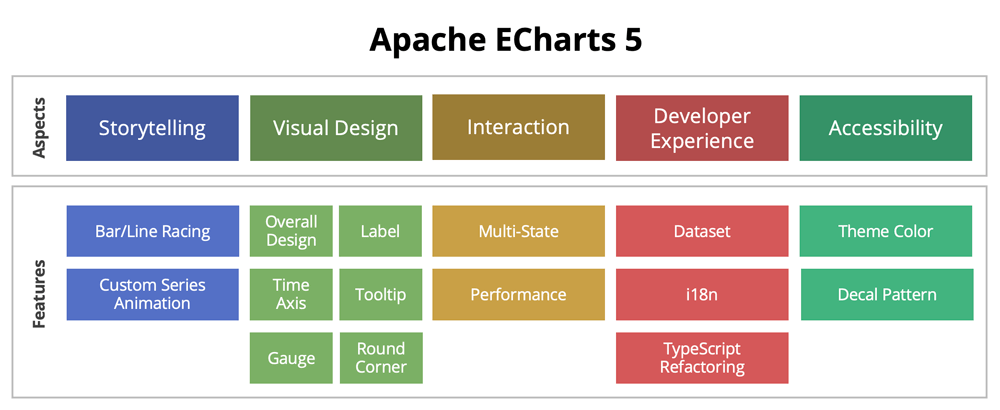
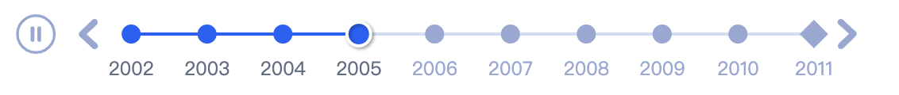
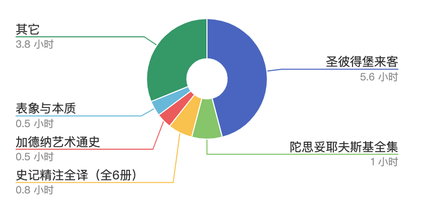
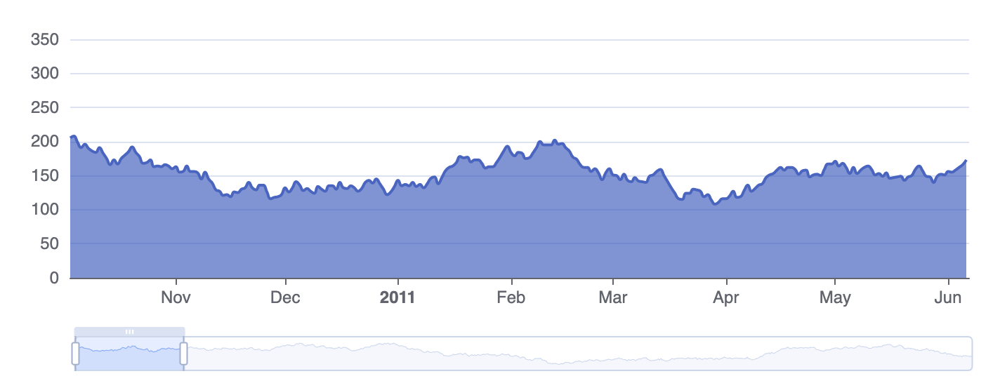
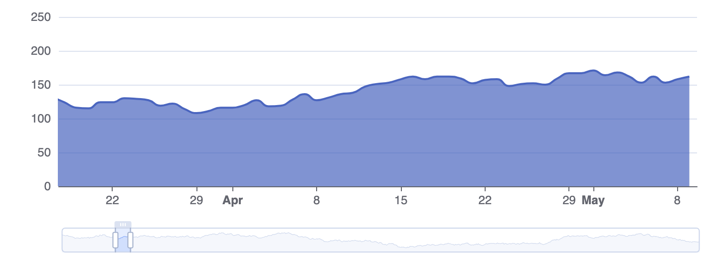
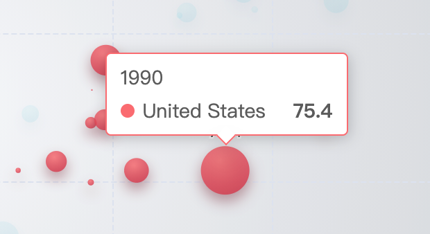
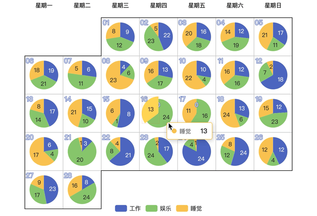
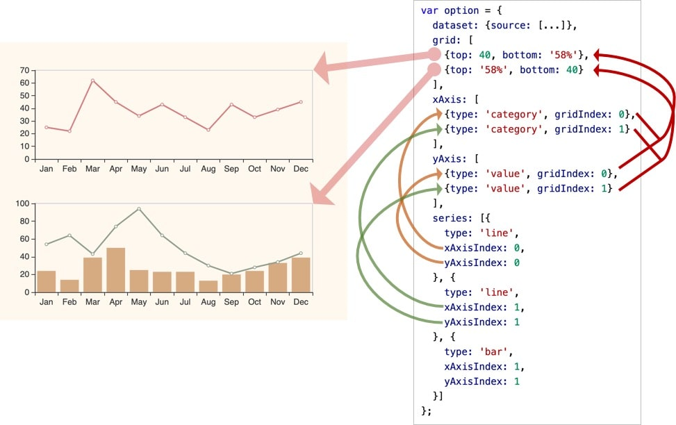

# tutorial

## Get Started with ECharts in 5 minutes

## Installing ECharts

First, install Apache EChartsTM using one of the following methods:

*   Download official source release from [Apache ECharts website](https://echarts.apache.org/en/download.html). Then [build](https://github.com/apache/echarts#build) from the source release.
    
*   Download from [GitHub](https://github.com/apache/echarts/releases)
    
*   Using npm: `npm install echarts --save`. [Using ECharts with webpack](tutorial.md#Use%20ECharts%20with%20webpack)
    
*   Use CDN like [jsDelivr](https://www.jsdelivr.com/package/npm/echarts).
    

## Including ECharts

Load `echarts.min.js` with a script tag.

```
<!DOCTYPE html>
<html>
<head>
    <meta charset="utf-8">
    <!-- including ECharts file -->
    <script src="echarts.min.js"></script>
</head>
</html>
```

## Draw a simple chart

Before drawing charts, we need to prepare a DOM container with width and height for ECharts.

```
<body>
    <!-- preparing a DOM with width and height for ECharts -->
    <div id="main" style="width:600px; height:400px;"></div>
</body>
```

Then we can initialize an ECharts instance using [echarts.init](api-parts/api.echarts.md#init), and create a simple bar chart with [setOption](api-parts/api.echartsInstance.md#setOption). Below is the complete code.

```
<!DOCTYPE html>
<html>
<head>
    <meta charset="utf-8">
    <title>ECharts</title>
    <!-- including ECharts file -->
    <script src="echarts.js"></script>
</head>
<body>
    <!-- prepare a DOM container with width and height -->
    <div id="main" style="width: 600px;height:400px;"></div>
    <script type="text/javascript">
        // based on prepared DOM, initialize echarts instance
        var myChart = echarts.init(document.getElementById('main'));

        // specify chart configuration item and data
        var option = {
            title: {
                text: 'ECharts entry example'
            },
            tooltip: {},
            legend: {
                data:['Sales']
            },
            xAxis: {
                data: ["shirt","cardign","chiffon shirt","pants","heels","socks"]
            },
            yAxis: {},
            series: [{
                name: 'Sales',
                type: 'bar',
                data: [5, 20, 36, 10, 10, 20]
            }]
        };

        // use configuration item and data specified to show chart
        myChart.setOption(option);
    </script>
</body>
</html>
```

You've made your first chart!

For more examples, go to the [ECharts Gallery](https://echarts.apache.org/examples/en/editor.html?c=doc-example/getting-started)

## New features in ECharts 5

Data visualization has come a long way in the last few years. Developers no longer expect visualization products to be simple chart creation tools, but have more advanced needs in terms of interaction, performance, data processing, and more.

Apache ECharts has always been committed to making it easier for developers to create flexible and rich visualizations. In the latest release of Apache ECharts 5, we have focused on enhancing the storytelling of charts, allowing developers to tell the story behind the data in a simpler way.



"The core of Apache ECharts 5 is "Show, do not tell", which is a comprehensive upgrade of five topics and 15 features around the stroy telling of visualizations, allowing charts to better tell the story behind the data. It helps developers to create visualizations that meet the needs of various scenarios more easily.

## Storytelling

The importance of animation to human cognition cannot be overstated. In our previous work, we used initialization animations and transition animations to help users understand the connection between data transformations, making the appearance of charts and transformations seem less rigid. This time, we have even enhanced our animation capabilities, even more significantly. We hope to further exploit the role of animation to help users' cognition, and help them understand the story behind the chart more easily with the dynamic stroy function of the chart.

#### Bar/Line Racing

Apache ECharts 5 adds support for dynamically sorted bar-racing and dynamically sorted line-racing charts to help developers easily create time-series charts that show changes in data over time and tell the evolution of data.

The dynamic sorting chart shows the derivation of different categories in the ranking over time. The developer can enable this effect in ECharts with a few simple configuration code.

#### Custom Series Animation

In addition to dynamic sorting charts, Apache ECharts 5 provides even richer and more powerful animations in the custom series, supporting interpolation animations for label value text, transition animations for morph, combine, separate, and other effects of graphics.

Imagine what amazing visualizations you can create with these dynamic effects!

## Visual Design

The role of visual design is not only to make the chart look better, but more importantly, a design that conforms to the principles of visualization can help users understand more quickly what the chart is trying to say and eliminate as much misunderstanding as possible from poor design.

#### Overall Design

We have found that a large percentage of developers use the default theme style for ECharts, so it is important to have an elegant default theme design. In Apache ECharts 5, we redesigned the default theme style, optimizing it for different charts and components. For example, we took into account factors such as differentiation between colors, contrast with background colors, and harmony with adjacent colors, and ensured that people with color blindness could clearly distinguish data.


Let's look at the new version of the light and dark theme styles using the most commonly used bar chart as an example.

 

For the data area zoom, timeline and other interactive components, we also designed a new style and provide a better interactive experience: <img src="documents/asset/img/feature/v5/new-theme-dark.png




#### Label

Labels are one of the core elements of a chart, and clear and unambiguous labels help users to have a more accurate understanding of the data. Apache ECharts 5 provides a variety of new labeling features that allow dense labels to be clearly displayed and accurately represented.

Apache ECharts 5 can be enabled to automatically hide overlapping labels through a configuration item. For labels that exceed the display area, you can choose to automatically truncate or line break them. Dense pie chart labels now have a more aesthetically pleasing automatic layout.

These features can help avoid text that is too dense and affects readability. And, no additional code needs to be written by the developer for them to take effect by default, greatly simplifying the development cost for developers.

We also provide several configuration options to allow developers to actively control the layout strategy of tabs, such as tab dragging, overall display at the edge of the canvas, connecting with guide lines and graphical elements, and still linking to highlight the associated relationships.

The new label feature allows you to have very clear label presentation even in a confined space mobile:

 

#### Time Axis

Apache ECharts 5 brings a time axis suitable for expressing timestamp scales. The default design of the time axis highlights important information more prominently and provides more flexible customization capabilities, allowing developers to tailor the time axis's label content to different needs.

First of all, the time axis is no longer split absolutely evenly as before, but instead selects more meaningful points like year, month, day, and whole point to display, and can show different levels of scales at the same time. The `formatter` of labels supports templates for time (e.g. `{yyyy}-{MM}-{dd}`), and different `formatter` can be specified for labels with different time granularity, which can be combined with rich text labels to create eye-catching and diverse time effects.

The display of the time scale at different dataZoom granularities.





#### Tooltip

Tooltip is one of the most commonly used visualization components to help users interactively understand the details of data. In Apache ECharts 5, we have optimized the style of the tooltip, making the default display of the tooltip elegant and clear by adjusting the font style, color, arrow pointing to the graph, border color following the graph color, and other features. The rendering logic of rich text has been improved to ensure that the display is consistent with the HTML way, allowing users to choose different technical solutions to achieve the same effect in different scenarios.

 

In addition to this, we have also added the ability to sort the list in the tip box by value size or category order this time.

#### Gauge

We have seen a lot of cool gauge charts created by community users, but the way they are configured is often complex and tricky. Therefore, we have upgraded the gauge to support image or vector path drawing pointers, anchor configurations, progress bars, rounded corner effects, and more.

Different styles of gauge pointers.


These upgrades not only allow developers to achieve cool effects with simpler configuration items, but also bring richer customization capabilities.

#### Round Corner

Apache ECharts 5 supports round corner for pie charts, sunburst charts, and treemap charts. Don't underestimate the simplicity of the rounded corners configuration, but combine them with other effects to create a more personalized visualization.

## Interactivity

The interactivity of the visualization helps users explore the work and deepen their understanding of the main idea of the diagram.

#### Multi-State

In ECharts 4, there were two interactive states, `emphasis` and `normal`, graph will enter the `emphasis` state when the mouse hovered to distinguish the data.

This time in Apache ECharts 5, we have added a new effect of **blur** other non-related elements to the original mouse hover highlighting, so that the target data can be focused.

For example, in this [bar chart](https://echarts.apache.org/examples/zh/editor.html?c=bar-y-category-stack) example, when the mouse hovers over a series, other non-related series will fade out, thus highlighting more clearly the comparison of data in the focused series. of data in the comparison. On diagrams with more complex data structures such as relationship, tree, sunburst, sankey, etc., it is also possible to see the connections between data by fading out non-related elements. Also, colors, shadows, and other styles that can be set in `emphasis` can now be set in `blur`.

In addition, we've added **click to select** to all series, an interaction that was previously only available in a few series such as pie charts and maps, allowing developers to set it to single or multiple selection mode, and to listen to the `selectchanged` event to get all the selected shapes for further processing. As with `emphasis` and `blur`, the selection style can also be configured in `select`.

#### Performance improvements

##### Dirty Rectangle Rendering

Apache ECharts 5 has new support for dirty rectangle rendering to address performance bottlenecks in large scenes with only local changes. When using the Canvas renderer, the dirty rectangle rendering technique detects and updates only the parts of the view that have changed, rather than any changes causing a complete redraw of the canvas. This can help improve rendering frame rates in some special scenarios, such as scenes where the mouse frequently triggers some graphical highlighting many times. In the past for such scenes, additional Canvas layers were used to optimize performance, but this approach is not universal for all scenes and does not work well for complex styles. Dirty Rectangle rendering does a good job of satisfying both performance and display correctness.

A visual demonstration of a dirty rectangle, with the red boxed area redrawn for the frame.



You can see the effect by enable dirty rectangle optimization on the new example page.

##### Line Chart Performance Optimization for Real-Time Time-Series Data

In addition, the performance of line graphs with large amounts of data has also seen a significant performance improvement. We often encounter the need for high-performance plotting of large amounts of real-time time-series data, which will be updated every hundreds or tens of milliseconds.

Apache ECharts 5 deeply optimizes CPU consumption, memory usage, and initialization time in these scenarios, enabling real-time updates (less than 30ms per update) for millions of data, and even rendering within 1s for ten millions of data, with low memory usage and smooth tooltip interactions.

## Development Experience

We want such a powerful visualization tool to be used by more developers in a simpler way, so the developer experience is also a very important aspect for us.

#### Datasets

ECharts 5 enhances the data transformation capabilities of datasets, allowing developers to implement common data processing such as filtering, sorting, aggregating, histogram, simple clustering, regression, etc. in a simple way. Developers can use these functions in a uniform and declarative way, and can easily implement common data operations.

#### Internationalization

The original internationalization implementation of ECharts takes the form of different distribution files packaged according to different language parameters. In this way, the dynamic language and main code are bound together, and the only way to switch languages when using ECharts is to reload different language versions of ECharts distributions.

Therefore, starting with Apache ECharts 5, the dynamic language is separated from the main code. To switch languages, you only need to load the corresponding language, use the `registerLocale` function to mount the language object in a similar way to mount the theme, and then reinitialize it to complete the language switch.

```
// import the lang object and set when init
echarts.registerLocale('DE', lang).
echarts.init(DomElement, null, {
   locale: 'DE'
});
```

#### TypeScript Refactoring

In order to continue to refactor and develop new features more safely and efficiently, we started the development of Apache ECharts 5 by rewriting the code using TypeScript. The strong typing brought by TypeScript gave us the confidence to refactor the code drastically to achieve more exciting features during the development of ECharts 5.

For developers, we can also generate better and more code-compliant `DTS` type description files directly from TypeScript code. Until now, ECharts type description files have been maintained by community developers and published to [DefinityTyped](https://github.com/DefinitelyTyped/DefinitelyTyped/tree/master/types/echarts), which is a lot of work, so thanks for your contribution.

In addition, if a developer's component is introduced on-demand, we provide a `ComposeOption` type method that can combine a configuration item type that contains only the introduced components, which can bring stricter type checking and help you detect unintroduced component types in advance.

## Accessibility

Apache ECharts has always taken accessibility design seriously, and we want to make the information conveyed by charts equally to be accessed. We also want to make this possible for chart developers at a very low development cost, thus making developers more willing to support the accessibility.

In the last major release, we supported automatic intelligent generation of chart descriptions based on different chart types and data, making it very easy for developers to support DOM description information for charts. In ECharts 5, we have also made more accessibility improvements to help people with visual impairments better understand the chart content.

#### Theme Colors

We took accessibility into account when designing the new default theme, and we repeatedly tested the brightness and color values of the colors to help accessibility users clearly identify the chart data.

Moreover, for developers with further accessibility needs, we also provide special high-contrast themes to further differentiate the data with higher contrast colors.

#### Decal Patterns

ECharts 5 also provides a new feature of decals to help users further differentiate data by using patterns to assist with color representation.

In addition, decal patterns can also help in some other scenarios, such as: helping to better distinguish data in printed materials like newspapers and books that have only a single color or very few colors; using graphical elements to facilitate a more intuitive understanding of the data by the user.

## Summary

In addition to the features described above, Apache ECharts has been improved in a very large number of details to help developers more easily create charts that good by default, are flexible in configuration, and tell the story behind the data with charts.

Thank you to all the developers who have used ECharts, and even participated in community contributions, for making Apache ECharts 5 possible. We'll be working on future developments with even more enthusiasm, and we'll see you all in 6 with even more enthusiasm!

## ECharts 5 Upgrade Guide

This guide is for those who want to upgrade from echarts 4.x (hereafter `v4`) to echarts 5.x (hereafter `v5`). You can find out what new features `v5` brings that are worth upgrading in [New Features in ECharts 5](tutorial.md#ECharts%205%20Upgrade%20Guide). In most cases, developers won't need to do anything extra for this upgrade, as echarts has always tried to keep the API as stable and backward-compatible as possible. However, `v5` still brings some breaking changes that require special attention. In addition, in some cases, `v5` provides a better API to replace the previous one, and these superseded APIs will no longer be recommended (though we have tried to be as compatible as possible with these changes). We'll try to explain these changes in detail in this document.

Since we added the new [tree-shaking API](tutorial.md#Use%20ECharts%20with%20bundler%20and%20NPM) in `v5.0.1`, this documentation is based on `v5.0.1` or higher.

## Breaking Changes

#### Default theme

First of all, the default theme has been changed. `v5` has made a lot of changes and optimizations on the theme design. If you still want to keep the colors of the old version, you can manually declare the colors as follows.

```
chart.setOption({
    color: [
        '#c23531', '#2f4554', '#61a0a8', '#d48265', '#91c7ae', '#749f83',
        '#ca8622', '#bda29a', '#6e7074', '#546570', '#c4ccd3'
    ],
    // ...
});
```

Or, to make a simple `v4` theme.

```
var themeEC4 = {
    color: [
        '#c23531', '#2f4554', '#61a0a8', '#d48265', '#91c7ae', '#749f83',
        '#ca8622', '#bda29a', '#6e7074', '#546570', '#c4ccd3'
    ]
};
var chart = echarts.init(dom, themeEC4);
chart.setOption(/* ... */);
```

#### Importing ECharts

##### Removing support for default exports

Since `v5`, echarts only provides `named exports`.

So if you are importing `echarts` like this:

```
import echarts from 'echarts';
// Or import core module
import echarts from 'echarts/lib/echarts';
```

It will throw error in `v5`. You need to change the code as follows to import the entire module.

```
import * as echarts from 'echarts';
// Or
import * as echarts from 'echarts/lib/echarts';
```

##### tree-shaking API

In 5.0.1, we introduced the new [tree-shaking API](tutorial.md#Use%20ECharts%20with%20bundler%20and%20NPM)

```
import * as echarts from 'echarts/core';
import { BarChart } from 'echarts/charts';
import { GridComponent } from 'echarts/components';
// Note that the Canvas renderer is no longer included by default and needs to be imported explicitly, or import the SVGRenderer if you need to use the SVG rendering mode
import { CanvasRenderer } from 'echarts/renderers';

echarts.use([BarChart, GridComponent, CanvasRenderer]);
```

To make it easier for you to know which modules you need to import based on your option, our new example page adds a new feature to generate the three-shakable code, you can check the `Full Code` tab on the example page to see the modules you need to introduce and the related code.

In most cases, we recommend using the new tree-shaking interface whenever possible, as it maximizes the power of the packaging tool tree-shaking and effectively resolves namespace conflicts and prevents the exposure of internal structures. If you are still using the CommonJS method of writing modules, the previous approach is still supported:

```
const echarts = require('echarts/lib/echarts');
require('echarts/lib/chart/bar');
require('echarts/lib/component/grid');
```

Second, because our source code has been rewritten using TypeScript, `v5` will no longer support importing files from `echarts/src`. You need to change it to import from `echarts/lib`.

##### dependency adjustment

> Note: This section is only for developers who use tree-shaking interfaces to ensure a minimal bundle size, not for those who imports the whole package.

In order to keep the size of the bundle small enough, we remove some dependencies that would have been imported by default. For example, as mentioned above, when using the new on-demand interface, `CanvasRenderer` is no longer introduced by default, which ensures that unneeded Canvas rendering code is not imported when only SVG rendering mode is used, and in addition, the following dependencies are adjusted.

*   The right-angle coordinate system component is no longer introduced by default when using line charts and bar charts, so the following introduction method was used before
    
    ```
    const echarts = require('echarts/lib/echarts');
    require('echarts/lib/chart/bar');
    require('echarts/lib/chart/line');
    ```
    
    Need to introduce the `grid` component separately again
    
    ```
    require('echarts/lib/component/grid');
    ```
    

Reference issues: [#14080](https://github.com/apache/echarts/issues/14080), [#13764](https://github.com/apache/echarts/issues/13764)

*   `aria` components are no longer imported by default. You need import it manually if necessary.
    
    ```
    import { AriaComponent } from 'echarts/components';
    echarts.use(AriaComponent);
    ```
    
    Or
    
    ```
    require('echarts/lib/component/aria');
    ```
    

#### removes built-in geoJSON

`v5` removes the built-in geoJSON (previously in the `echarts/map` folder). These geoJSON files were always sourced from third parties. If users still need them, they can go get them from the old version, or find more appropriate data and register it with ECharts via the registerMap interface.

#### Browser Compatibility

IE8 is no longer supported by `v5`. We no longer maintain and upgrade the previous [VML renderer](https://github.com/ecomfe/zrender/tree/4.3.2/src/vml) for IE8 compatibility. If developers have a strong need for a VML renderer, they are welcome to submit a pull request to upgrade the VML renderer or maintain a separate third-party VML renderer, as we support registration of standalone renderers starting with `v5.0.1`.

#### ECharts configuration item adjustment

##### Visual style settings priority change

The priority of the visuals between [visualMap component](option.md#visualMap) and [itemStyle](option-parts/option.series-scatter.md#itemStyle) | [lineStyle](option-parts/option.series-scatter.md#lineStyle) | [areaStyle](option-parts/option.series-scatter.md#areaStyle) are reversed since `v5`.

That is, previously in `v4`, the visuals (i.e., color, symbol, symbolSize, ...) that generated by [visualMap component](option.md#visualMap) has the highest priority, which will overwrite the same visuals settings in [itemStyle](option-parts/option.series-scatter.md#itemStyle) | [lineStyle](option-parts/option.series-scatter.md#lineStyle) | [areaStyle](option-parts/option.series-scatter.md#areaStyle). That brought troubles when needing to specify specific style to some certain data items while using [visualMap component](option.md#visualMap). Since `v5`, the visuals specified in [itemStyle](option-parts/option.series-scatter.md#itemStyle) | [lineStyle](option-parts/option.series-scatter.md#lineStyle) | [areaStyle](option-parts/option.series-scatter.md#areaStyle) has the highest priority.

In most cases, users will probably not notice this change when migrating from `v4` to `v5`. But users can still check that if [visualMap component](option.md#visualMap) and [itemStyle](option-parts/option.series-scatter.md#itemStyle) | [lineStyle](option-parts/option.series-scatter.md#lineStyle) | [areaStyle](option-parts/option.series-scatter.md#areaStyle) are both specified.

##### `padding` for rich text

`v5` adjusts the [rich.?.padding](option-parts/option.series-scatter.md#label.rich.\<style_name\>.padding) to make it more compliant with CSS specifications. In `v4`, for example `rich. .padding: [11, 22, 33, 44]` means that `padding-top` is `33` and `padding-bottom` is `11`. The position of the top and bottom is adjusted in `v5`, `rich. .padding: [11, 22, 33, 44]` means that `padding-top` is `11` and `padding-bottom` is `33`.

If the user is using [rich.?.padding](option-parts/option.series-scatter.md#label.rich.\<style_name\>.padding), this order needs to be adjusted.

## ECharts Related Extensions

These extensions need to be upgraded to new version to support echarts `v5`:

*   [echarts-gl](https://github.com/ecomfe/echarts-gl)
*   [echarts-wordcloud](https://github.com/ecomfe/echarts-wordcloud)
*   [echarts-liquidfill](https://github.com/ecomfe/echarts-liquidfill)

## Deprecated API

Some of the API and echarts options are deprecated since `v5`, but are still backward compatible. Users can **keep using these deprecated API**, with only some warning will be printed to console in dev mode. But if users have spare time, it is recommended to upgraded to new API for the consideration of long term maintenance.

The deprecated API and their corresponding new API are listed as follows:

*   Transform related props of a graphic element are changed:
    *   Changes:
        *   `position: [number, number]` are changed to `x: number`/`y: number`.
        *   `scale: [number, number]` are changed to `scaleX: number`/`scaleY: number`.
        *   `origin: [number, number]` are changed to `originX: number`/`originY: number`.
    *   The `position`, `scale` and `origin` are still supported but deprecated.
    *   It effects these places:
        *   In the `graphic` components: the declarations of each element.
        *   In `custom series`: the declarations of each element in the return of `renderItem`.
        *   Directly use zrender graphic elements.
*   Text related props on graphic elements are changed:
    *   Changes:
        *   The declaration of attached text (or say, rect text) are changed.
            *   Prop `style.text` are deprecated in elements except `Text`. Instead, Prop set `textContent` and `textConfig` are provided to support more powerful capabilities.
            *   These related props at the left part below are deprecated. Use the right part below instead.
                *   textPosition => textConfig.position
                *   textOffset => textConfig.offset
                *   textRotation => textConfig.rotation
                *   textDistance => textConfig.distance
        *   The props at the left part below are deprecated in `style` and `style.rich.?`. Use the props at the right part below instead.
            *   textFill => fill
            *   textStroke => stroke
            *   textFont => font
            *   textStrokeWidth => lineWidth
            *   textAlign => align
            *   textVerticalAlign => verticalAlign);
            *   textLineHeight =>
            *   textWidth => width
            *   textHeight => hight
            *   textBackgroundColor => backgroundColor
            *   textPadding => padding
            *   textBorderColor => borderColor
            *   textBorderWidth => borderWidth
            *   textBorderRadius => borderRadius
            *   textBoxShadowColor => shadowColor
            *   textBoxShadowBlur => shadowBlur
            *   textBoxShadowOffsetX => shadowOffsetX
            *   textBoxShadowOffsetY => shadowOffsetY
        *   Note: these props are not changed:
            *   textShadowColor
            *   textShadowBlur
            *   textShadowOffsetX
            *   textShadowOffsetY
    *   It effects these places:
        *   In the `graphic` components: the declarations of each element. \[compat, but not accurately the same in some complicated cases.\]
        *   In `custom series`: the declarations of each element in the return of `renderItem`. \[compat, but not accurately the same in some complicated cases\].
        *   Directly use zrender API to create graphic elements. \[No compat, breaking change\].
*   API on chart instance:
    *   `chart.one(...)` is deprecated.
*   `label`:
    *   In props `color`, `textBorderColor`, `backgroundColor` and `borderColor`, the value `'auto'` is deprecated. Use the value `'inherit'` instead.
*   `hoverAnimation`:
    *   option `series.hoverAnimation` is deprecated. Use `series.emphasis.scale` instead.
*   `line series`:
    *   option `series.clipOverflow` is deprecated. Use `series.clip` instead.
*   `custom series`:
    *   In `renderItem`, the `api.style(...)` and `api.styleEmphasis(...)` are deprecated. Because it is not really necessary and hard to ensure backward compatibility. Users can fetch system designated visual by `api.visual(...)`.
*   `sunburst series`:
    *   Action type `highlight` is deprecated. Use `sunburstHighlight` instead.
    *   Action type `downplay` is deprecated. Use `sunburstUnhighlight` instead.
    *   option `series.downplay` is deprecated. Use `series.blur` instead.
    *   option `series.highlightPolicy` is deprecated. Use `series.emphasis.focus` instead.
*   `pie series`:
    *   The action type at the left part below are deprecated. Use the right part instead:
        *   `pieToggleSelect` => `toggleSelect`
        *   `pieSelect` => `select`
        *   `pieUnSelect` => `unselect`
    *   The event type at the left part below are deprecated. Use the right part instead:
        *   `pieselectchanged` => `selectchanged`
        *   `pieselected` => `selected`
        *   `pieunselected` => `unselected`
    *   option `series.label.margin` is deprecated. Use `series.label.edgeDistance` instead.
    *   option `series.clockWise` is deprecated. Use `series.clockwise` instead.
    *   option `series.hoverOffset` is deprecated. Use `series.emphasis.scaleSize` instead.
*   `map series`:
    *   The action type at the left part below are deprecated. Use the right part instead:
        *   `mapToggleSelect` => `toggleSelect`
        *   `mapSelect` => `select`
        *   `mapUnSelect` => `unselect`
    *   The event type at the left part below are deprecated. Use the right part instead:
        *   `mapselectchanged` => `selectchanged`
        *   `mapselected` => `selected`
        *   `mapunselected` => `unselected`
    *   option `series.mapType` is deprecated. Use `series.map` instead.
    *   option `series.mapLocation` is deprecated.
*   `graph series`:
    *   option `series.focusNodeAdjacency` is deprecated. Use `series.emphasis: { focus: 'adjacency'}` instead.
*   `gauge series`:
    *   option `series.clockWise` is deprecated. Use `series.clockwise` instead.
    *   option `series.hoverOffset` is deprecated. Use `series.emphasis.scaleSize` instead.
*   `dataZoom component`:
    *   option `dataZoom.handleIcon` need prefix `path://` if using SVGPath.
*   `radar`:
    *   option `radar.name` is deprecated. Use `radar.axisName` instead.
    *   option `radar.nameGap` is deprecated. Use `radar.axisNameGap` instead.
*   Parse and format:
    *   `echarts.format.formatTime` is deprecated. Use `echarts.time.format` instead.
    *   `echarts.number.parseDate` is deprecated. Use `echarts.time.parse` instead.
    *   `echarts.format.getTextRect` is deprecated.

## Use ECharts with bundler and NPM

If your development environment uses a package management tool like `npm` or `yarn` and builds with a packaging tool like Webpack, this article will describe how to get a minimal bundle of Apache EChartsTM via treeshaking.

## NPM installation of ECharts

You can install ECharts via npm using the following command

```
npm install echarts --save
```

## Introduce ECharts

```
import * as echarts from 'echarts';

// initialize the echarts instance
var myChart = echarts.init(document.getElementById('main'));
// Draw the chart
myChart.setOption({
    title: {
        text: 'ECharts Getting Started Example'
    },
    tooltip: {},
    xAxis: {
        data: ['shirt', 'cardigan', 'chiffon', 'pants', 'heels', 'socks']
    },
    yAxis: {},
    series: [{
        name: 'sales',
        type: 'bar',
        data: [5, 20, 36, 10, 10, 20]
    }]
});
```

## Importing required charts and components to have minimal bundle.

The above code will import all the charts and components in ECharts, but if you don't want to bring in all the components, you can use the tree-shakeable interface provided by ECharts to bundle the required components and get a minimal bundle.

```
// Import the echarts core module, which provides the necessary interfaces for using echarts.
import * as echarts from 'echarts/core';
// Import bar charts, all with Chart suffix
import {
    BarChart
} from 'echarts/charts';
// import the tooltip, title, and rectangular coordinate system components, all suffixed with Component
import {
    TitleComponent,
    TooltipComponent,
    GridComponent
} from 'echarts/components';
// Import the Canvas renderer, note that introducing the CanvasRenderer or SVGRenderer is a required step
import {
    CanvasRenderer
} from 'echarts/renderers';

// Register the required components
echarts.use(
    [TitleComponent, TooltipComponent, GridComponent, BarChart, CanvasRenderer]
);

// The next step is the same as before, initialize the chart and set the configuration items
var myChart = echarts.init(document.getElementById('main'));
myChart.setOption({
    ...
});
```

> Note that in order to keep the size of the package to a minimum, ECharts does not provide any renderer in tree-shakeable interface, so you need to choose to import `CanvasRenderer` or `SVGRenderer` as the renderer. The advantage of this is that if you only need to use the svg rendering mode, the bundle will not include the `CanvasRenderer` module, which is not needed.

The "Full Code" tab on our sample editor page provides a very convenient way to generate a tree-shakable code. It will generate tree-shakable code based on the current option dynamically. You can use it directly in your project.

## Minimal Option Type in TypeScript

For developers who are using TypeScript to develop ECharts, we provide a type interface to combine the minimal `EChartsOption` type. This stricter type can effectively help you check for missing components or charts.

```
import * as echarts from 'echarts/core';
import {
    BarChart,
    // The series types are defined with the SeriesOption suffix
    BarSeriesOption,
    LineChart,
    LineSeriesOption
} from 'echarts/charts';
import {
    TitleComponent,
    // The component types are defined with the suffix ComponentOption
    TitleComponentOption,
    GridComponent,
    GridComponentOption
} from 'echarts/components';
import {
    CanvasRenderer
} from 'echarts/renderers';

// Combine an Option type with only required components and charts via ComposeOption
type ECOption = echarts.ComposeOption<
  BarSeriesOption | LineSeriesOption | TitleComponentOption | GridComponentOption
>;

// Register the required components
echarts.use(
    [TitleComponent, TooltipComponent, GridComponent, BarChart, CanvasRenderer]
);

var option: ECOption = {
    ...
}
```

## ECharts Basic Concepts Overview

This chapter describes some of the common concepts and terms of Apache EChartsTM.

## ECharts instance

We can create multiple `echarts instances` in a webpage. In each `echarts instance` we can create multiple diagrams, coordinate systems, etc. (described by `option`). With a DOM element prepared (as the container of an echarts instance), we can create a `echarts instance` based on that element. Each `echarts instance` takes its DOM element exclusively.

  


## Series

[series](option.md#series) is a very common term. In echarts, [series](option.md#series) represents a series of value and the diagram generated from them. So the concept [series](option.md#series) includes these key points: a series of value, the type of the diagram (`series.type`) and other parameters specified for the mapping from the values to a diagram.

In echarts, the `series.type` and the "diagram type" are the same concept. `series.type` includes: [line](option-parts/option.series-line.md) (line plot), [bar](option-parts/option.series-bar.md) (bar chart), [pie](option-parts/option.series-pie.md) (pie chart), [scatter](option-parts/option.series-scatter.md) (scatter plot), [graph](option-parts/option.series-graph.md) (graph plot), [tree](option-parts/option.series-tree.md) (tree plot), etc.

In the example below, there are three [series](option.md#series) ([pie](option-parts/option.series-pie.md), [line](option-parts/option.series-line.md), [bar](option-parts/option.series-bar.md)) declared in the `option` on the right, where [series.data](option.md#series.data) are declared in each series:

  


  

Similarly, the following example shows another style of `option`, where each series retrieves data from [dataset](option-parts/option.dataset.md):

  


## Component

Over series, the entities in echarts are abstracted using the term "component". For example, echarts includes these components: [xAxis](option-parts/option.xAxis.md) (the x axis of Cartesian coordinate system), [yAxis](option-parts/option.yAxis.md) (the y axis of Cartesian coordinate system), [grid](option-parts/option.grid.md) (the baseboard of Cartesian coordinate system), [angleAxis](option-parts/option.angleAxis.md) (the angle axis of polar coordinate system), [radiusAxis](option-parts/option.radiusAxis.md) (the radius axis of polar coordinate system), [polar](option-parts/option.polar.md) (the baseboard of polar coordinate system), [geo](option-parts/option.geo.md) (GEO coordinate system), [dataZoom](option.md#dataZoom) (the component for changing the displayed range of data), [visualMap](option.md#visualMap) (the component for specifying the visual mapping), [tooltip](option-parts/option.tooltip.md) (the tooltip component), [toolbox](option-parts/option.toolbox.md) (the toolbox component), [series](option.md#series), etc.

Notice that [series](option.md#series) is a kind of component, a component for rendering diagram.

Check the example below. Components (including series) are declared in `option` on the right, and the are finally rendered in the echarts instance.

  


  

Notice: although [series](option.md#series) is a kind of component, sometimes we can see phrases like "series and components". The term "component" in this context actually means "components except series".

## Define charts using option

We have met the term `option` above. Users should use `option` to describe all of their requirements and input it to echarts. The requirements includes: "what does the data like", "what the diagram we need", "what components we need", "what the user interactions we need", etc. In short, `option` defines: `data`, `visual mapping`, `interaction`.

```
// Create an echarts instance.
var dom = document.getElementById('dom-id');
var chart = echarts.init(dom);

// Use option to describe `data`, `visual mapping`, `interaction`, ...
// `option` is a big JavaScript object.
var option = {
    // Each property represents a kind of components.
    legend: {...},
    grid: {...},
    tooltip: {...},
    toolbox: {...},
    dataZoom: {...},
    visualMap: {...},
    // If there are more than one components in one kind, we use an array.
    // For example, there are three x axes here.
    xAxis: [
        // Each item represents an instance of component.
        // `type` is used to indicate the sub-type of the component.
        {type: 'category', ...},
        {type: 'category', ...},
        {type: 'value', ...}
    ],
    yAxis: [{...}, {...}],
    // There are multiple series, using an array.
    series: [
        // `type` is also used to indicate the sub-type
        // (i.e., diagram type) of each series.
        {type: 'line', data: [['AA', 332], ['CC', 124], ['FF', 412], ... ]},
        {type: 'line', data: [2231, 1234, 552, ... ]},
        {type: 'line', data: [[4, 51], [8, 12], ... ]}
    }]
};

// Call `setOption` and input the `option`. And then the
// echarts instance processes data and renders charts.
chart.setOption(option);
```

Data is put in [series.data](option.md#series.data) in the above example. And we give another example showing another way, where each series retrieves data from [dataset](option-parts/option.dataset.md):

```
var option = {
    dataset: {
        source: [
            [121, 'XX', 442, 43.11],
            [663, 'ZZ', 311, 91.14],
            [913, 'ZZ', 312, 92.12],
            ...
        ]
    },
    xAxis: {},
    yAxis: {},
    series: [
        // Each series retrieves data from `dataset`. The values in `encode`
        // are the indices of the dimensions (i.e., column) of `dataset.source`.
        {type: 'bar', encode: {x: 1, y: 0}},
        {type: 'bar', encode: {x: 1, y: 2}},
        {type: 'scatter', encode: {x: 1, y: 3}},
        ...
    ]
};
```

## Position a component

These approaches are used to Position a component.

  

**\[Absolute positioning like CSS\]**

  

Most components and series can be absolutely positioned according to `top` / `right` / `down` / `left` / `width` / `height`. This approach is like the absolute positioning in CSS. The absolute positioning is based on the container DOM element of the echarts.

The value of each attribute can be:

*   Absolute value (like `bottom: 54`, means: the distance from the boundary of the echarts container to bottom boundary of the component is `54` pixel).
*   Or the percentage based on the width/height of the echarts container (like `right: '20%'`, means: the distance from the boundary of the echarts container to the right boundary of this component is `20%` of the width of the echarts container).

Check the example below, where the [grid](option-parts/option.grid.md) component (that is the baseboard of a Cartesian coordinate system) are configured with `left`、`right`、`height`、`bottom`.

  


  

Note that `left` `right` `width` are one group of attributes for horizontal layout, while `top` `bottom` `height` are another group of attributes for vertical layout. The two groups have nothing to do with each other. In each group, it is enough to set only one or at most two attributes. For example, when `left` and `right` have been specified, `width` can be automatically calculated by them.

  

**\[Center-radius positioning\]**

  

A few circular components or series need to be positioned by "center" and "radius". For example, [pie](option-parts/option.series-pie.md) (pie chart)、[sunburst](option-parts/option.series-sunburst.md) (sunburst chart)、[polar](option-parts/option.polar.md) (polar coordinate system).

As the name implies, it position the component according to [center](option-parts/option.series-pie.md#center) and [radius](option-parts/option.series-pie.md#radius).

  

**\[Other positioning\]**

  

A few other components may has their own specific positioning approach. Check their docs before using them.

## Coordinate system

Many series, like [line](option-parts/option.series-line.md), [bar](option-parts/option.series-bar.md), [scatter](option-parts/option.series-scatter.md), [heatmap](option-parts/option.series-heatmap.md), etc., need to work on a coordinate system. Coordinate system is used to layout each graphic elements and display some ticks and labels. For example, echarts at least provides these coordinate systems: [Cartesian coordinate system](option-parts/option.grid.md), [polar coordinate system](option-parts/option.polar.md), [GEO coordinate system](option-parts/option.geo.md), [single axis coordinate system](option-parts/option.singleAxis.md), [calendar coordinate system](option-parts/option.calendar.md), etc. Some other series like [pie](option-parts/option.series-pie.md), [tree](option-parts/option.series-tree.md), work independently without any coordinate systems. And still some other series like [graph](option-parts/option.series-graph.md) are available either independently or on some coordinate system, depending on user settings.

A coordinate system may consist of several components. For example, Cartesian coordinate system consists of [xAxis](option-parts/option.xAxis.md), [yAxis](option-parts/option.yAxis.md) and [grid](option-parts/option.grid.md) (the baseboard). [xAxis](option-parts/option.xAxis.md) and [yAxis](option-parts/option.yAxis.md) are referenced and assembled by `grid` and work together cooperatively.

The following example demonstrates the most simple way to use a Cartesian coordinate system, where only [xAxis](option-parts/option.xAxis.md), [yAxis](option-parts/option.yAxis.md) and a [scatter series](option-parts/option.series-scatter.md) are declared, and `echarts` create and a `grid` implicitly to link them.

  


  

And the following example demonstrates a more complicated case, where two [yAxis](option-parts/option.yAxis.md) share one [xAxis](option-parts/option.xAxis.md). And the two `series` are also share the [xAxis](option-parts/option.xAxis.md), but use different [yAxis](option-parts/option.yAxis.md) respectively. The property [yAxisIndex](option-parts/option.series-line.md#yAxisIndex) is used to specify which [yAxis](option-parts/option.yAxis.md) is used.

  


  

The following echarts instance contain more than one [grid](option-parts/option.grid.md). Each [grid](option-parts/option.grid.md) has its own [xAxis](option-parts/option.xAxis.md) and [yAxis](option-parts/option.yAxis.md). The properties [xAxisIndex](option-parts/option.series-line.md#xAxisIndex), [yAxisIndex](option-parts/option.series-line.md#yAxisIndex) and [gridIndex](option-parts/option.yAxis.md#gridIndex) are used to specify the reference relationships.

  



  

Moreover, a type of series is usually available on various coordinate systems. For example, a [scatter series](option-parts/option.series-scatter.md) can work on [Cartesian coordinate system](option-parts/option.grid.md), [polar coordinate system](option-parts/option.polar.md), [GEO coordinate system](option-parts/option.geo.md) or other coordinate systems. Similarly, a coordinate system can serve different type of series. As the examples shown above, a [Cartesian coordinate system](option-parts/option.grid.md) serves several [line series](option-parts/option.series-line.md) and [bar series](option-parts/option.series-bar.md).

## Customized Chart Styles

Apache EChartsTM provides a rich amount of configurable items, which can be set in global, series, and data three different levels. Next, let's see an example of how to use ECharts to implement the following Nightingale rose chart:

## Drawing Nightingale Rose Chart

[Getting started tutorial](tutorial.md#Get%20Started%20with%20ECharts%20in%205%20minutes) introduced how to make a simple bar chart. This time, we are going to make a pie chart. Pie charts use arc length of fans to represent ratio of a certain series in total share. It's data format is simpler than bar chart, because it only contains one dimension without category. Besides, since it's not in rectangular system, it doesn't need `xAxis`、`yAxis` either.

```
myChart.setOption({
    series : [
        {
            name: 'Reference Page',
            type: 'pie',
            radius: '55%',
            data:[
                {value:400, name:'Searching Engine'},
                {value:335, name:'Direct'},
                {value:310, name:'Email'},
                {value:274, name:'Alliance Advertisement'},
                {value:235, name:'Video Advertisement'}
            ]
        }
    ]
})
```

With the above code, we can create a simple pie chart:

Here, the value of `data` is not a single value, as that of the example in get started. Instead, it's an object containing `name` and `value`. Data in ECharts can always be a single value, or a configurable object with name, style and label. You may refer to [data](option-parts/option.series-pie.md#data) for more information.

[Pie charts](option-parts/option.series-pie.md) of EChart can be made into Nightingale rose charts with [roseType](option-parts/option.series-pie.md#roseType) field.

```
roseType: 'angle'
```

Nightingale rose charts use radius to represent data value.

## Configuring Shadow

Commonly used styles of ECharts, like shadow, opacity, color, border-color, border-width, and etc., are set by [itemStyle](tutorial.md#series-pie.itemStyle) in series.

```
itemStyle: {
    // shadow size
    shadowBlur: 200,
    // horizontal offset of shadow
    shadowOffsetX: 0,
    // vertical offset of shadow
    shadowOffsetY: 0,
    // shadow color
    shadowColor: 'rgba(0, 0, 0, 0.5)'
}
```

The effect after added shadow is:

Each `itemStyle` has `emphasis` as the highlighted style when mouse hovered. The last example shows the effect of adding shadow by default. But in most situations, we may probably need to add shadow to emphasis when mouse is hovered.

```
itemStyle: {
    emphasis: {
        shadowBlur: 200,
        shadowColor: 'rgba(0, 0, 0, 0.5)'
    }
}
```

## Dark Background and Light Text

Now, we need to change the whole theme as that shown in the example at the beginning of this tutorial. This can be achieved by changing background color and text color.

Background is a global configurable object, so we can set it directly with [backgroundColor](option.md#backgroundColor) of option.

```
setOption({
    backgroundColor: '#2c343c'
})
```

Text style can also be set globally in [textStyle](option-parts/option.textStyle.md).

```
setOption({
    textStyle: {
        color: 'rgba(255, 255, 255, 0.3)'
    }
})
```

On the other hand, we can also set them in [label.textStyle](option-parts/option.series-pie.md#label.textStyle) of each series.

```
label: {
    textStyle: {
        color: 'rgba(255, 255, 255, 0.3)'
    }
}
```

We also need to set line color of pie chart to be lighter.

```
labelLine: {
    lineStyle: {
        color: 'rgba(255, 255, 255, 0.3)'
    }
}
```

Thus, we can get the following effect.

Similar to `itemStyle`, `label` and `labelLine` also have `emphasis` children.

## Setting Fan Colors

Fan colors can be set in `itemStyle`:

```
itemStyle: {
    // set fan color
    color: '#c23531',
    shadowBlur: 200,
    shadowColor: 'rgba(0, 0, 0, 0.5)'
}
```

This is quite similar to our expect effect, except that fan colors should be made darker within shadow area, so as to make a sense of layering and space with blocked light.

Each fan's color can be set under `data`:

```
data: [{
    value:400,
    name:'Search Engine',
    itemStyle: {
        color: '#c23531'
    }
}, ...]
```

But since we only need the variation of color in this example, there's a simpler way to map data value to lightness through [visualMap](option.md#visualMap).

```
visualMap: {
    // hide visualMap component; use lightness mapping only
    show: false,
    // mapping with min value at 80
    min: 80,
    // mapping with max value at 600
    max: 600,
    inRange: {
        // mapping lightness from 0 to 1
        colorLightness: [0, 1]
    }
}
```

The final effect is:

## Overview of Style Customization

This article provides an overview of the different approaches about Apache EChartsTM style customization. For example, how to config the color, size, shadow of the graphic elements and labels.

> The term "style" may not follow the convention of data visualization, but we use it in this article because it is popular and easy to understand.

These approaches below will be introduced. The functionalities of them might be overlapped, but they are suitable for different scenarios.

*   Theme
*   Palette
*   Customize style explicitly (itemStyle, lineStyle, areaStyle, label, ...)
*   Visual encoding (visualMap component)

Other article about styling can be check in [Customized Chart Styles](tutorial.md#Customized%20Chart%20Styles) and [Visual Map of Data](tutorial.md#Visual%20Map%20of%20Data).

  

* * *

  

**Theme**

Setting a theme is the simplest way to change the color style. For example, in [Examples page](https://echarts.apache.org/examples/en/index.html), "Theme" can be selected, and view the result directly.

Since ECharts4, besides the original default theme, ECharts provide another two built-in themes, named '`'light'` and `'dark'`. They can be used as follows:

```
var chart = echarts.init(dom, 'light');
```

or

```
var chart = echarts.init(dom, 'dark');
```

Other themes are not included in ECharts package by default, and need to load them ourselves if we want to use them. Themes can be visited and downloaded in [Theme Builder](https://echarts.apache.org/en/theme-builder.html). Theme can also be created or edited in it. The downloaded theme can be used as follows:

If a theme is downloaded as a JSON file, we should register it by ourselves, for example:

```
var xhr = new XMLHttpRequest();
// Assume the theme name is "vintage".
xhr.open('GET', 'xxx/xxx/vintage.json', true);
xhr.onload = function () {
    var themeJSON = this.response;
    echarts.registerTheme('vintage', JSON.parse(themeJSON))
    var chart = echarts.init(dom, 'vintage');
    // ...
});
xhr.send();
```

If a them is downloaded as a JS file, it will auto register itself:

```
// Import the `vintage.js` file in HTML, then:
var chart = echarts.init(dom, 'vintage');
// ...
```

  

* * *

  

**Palette**

Pallettes can be given in option. They provide a group of colors, which will be auto picked by series and data. We can give a global palette, or exclusive palette for certain series.

```
option = {
    // Global palette:
    color: ['#c23531','#2f4554', '#61a0a8', '#d48265', '#91c7ae','#749f83',  '#ca8622', '#bda29a','#6e7074', '#546570', '#c4ccd3'],

    series: [{
        type: 'bar',
        // A palette only work for the series:
        color: ['#dd6b66','#759aa0','#e69d87','#8dc1a9','#ea7e53','#eedd78','#73a373','#73b9bc','#7289ab', '#91ca8c','#f49f42'],
        ...
    }, {
        type: 'pie',
        // A palette only work for the series:
        color: ['#37A2DA', '#32C5E9', '#67E0E3', '#9FE6B8', '#FFDB5C','#ff9f7f', '#fb7293', '#E062AE', '#E690D1', '#e7bcf3', '#9d96f5', '#8378EA', '#96BFFF'],
        ...
    }]
}
```

  

* * *

  

**Customize style explicitly (itemStyle, lineStyle, areaStyle, label, ...)**

It is a common way to set style explicitly. Throughout ECharts [option](option.html), style related options can be set in various place, including [itemStyle](option.md#series.itemStyle), [lineStyle](option-parts/option.series-line.md#lineStyle), [areaStyle](option-parts/option.series-line.md#areaStyle), [label](option.md#series.label), etc.

Generally speaking, all of the built-in components and series follow the naming convention like `itemStyle`, `lineStyle`, `areaStyle`, `label` etc., although they may occur in different place according to different series or components.

There is another article for style setting, [Customized Chart Styles](tutorial.md#Customized%20Chart%20Styles).

  

* * *

  

**Style of emphasis state**

When mouse hovering a graphic elements, usually the emphasis style will be displayed. By default, the emphasis style is auto generated by the normal style. However they can be specified by [emphasis](option-parts/option.series-scatter.md#emphasis) property. The options in [emphasis](option-parts/option.series-scatter.md#emphasis) is the same as the ones for normal state, for example:

```
option = {
    series: {
        type: 'scatter',

        // Styles for normal state.
        itemStyle: {
            // Color of the point.
            color: 'red'
        },
        label: {
            show: true,
            // Text of labels.
            formatter: 'This is a normal label.'
        },

        // Styles for emphasis state.
        emphasis: {
            itemStyle: {
                // Color in emphasis state.
                color: 'blue'
            },
            label: {
                show: true,
                // Text in emphasis.
                formatter: 'This is a emphasis label.'
            }
        }
    }
}
```

Notice: Before ECharts4, the emphasis style should be written like this:

```
option = {
    series: {
        type: 'scatter',

        itemStyle: {
            // Styles for normal state.
            normal: {
                color: 'red'
            },
            // Styles for emphasis state.
            emphasis: {
                color: 'blue'
            }
        },

        label: {
            // Styles for normal state.
            normal: {
                show: true,
                formatter: 'This is a normal label.'
            },
            // Styles for emphasis state.
            emphasis: {
                show: true,
                formatter: 'This is a emphasis label.'
            }
        }
    }
}
```

The option format is still **compatible**, but not recommended. In fact, in most cases, users only set normal style, and use the default emphasis style. So since ECharts4, we support to write style without the "normal" term, which makes the option more simple and neat.

  

* * *

  

**Visual encoding (visualMap component)**

[visualMap component](option.md#visualMap) supports config the rule that mapping value to visual channel (color, size, ...). More details can be check in [Visual Map of Data](tutorial.md#Visual%20Map%20of%20Data).

## Loading and Updating of Asynchronous Data

## Asynchronous Loading

Data in [Get started](tutorial.md#getting-started) is directly filled in `setOption` after initialization, but in some cases, data may be filled after asynchronous loading. Data updating asynchronously in Apache EChartsTM is very easy. After initialization, you can pass in data and configuration item through `setOption` after data obtained through jQuery and other tools at any time.

```
var myChart = echarts.init(document.getElementById('main'));

$.get('data.json').done(function (data) {
    myChart.setOption({
        title: {
            text: 'asynchronous data loading example'
        },
        tooltip: {},
        legend: {
            data:['Sales']
        },
        xAxis: {
            data: data.categories
        },
        yAxis: {},
        series: [{
            name: 'Sales',
            type: 'bar',
            data: data.data
        }]
    });
});
```

Or, you may set other styles, displaying an empty rectangular axis, and then fill in data when ready.

```
var myChart = echarts.init(document.getElementById('main'));
// show title. legend and empty axis
myChart.setOption({
    title: {
        text: 'asynchronous data loading example'
    },
    tooltip: {},
    legend: {
        data:['Sales']
    },
    xAxis: {
        data: []
    },
    yAxis: {},
    series: [{
        name: 'Sales',
        type: 'bar',
        data: []
    }]
});

// Asynchronous data loading
$.get('data.json').done(function (data) {
    // fill in data
    myChart.setOption({
        xAxis: {
            data: data.categories
        },
        series: [{
            // find series by name
            name: 'Sales',
            data: data.data
        }]
    });
});
```

For example:

In ECharts, updating data need to find the corresponding series through `name`. In the above example, updating can be performed correctly according to series order if `name` is not defined. But in most cases, it is recommended to update data with series `name` information.

## Loading Animation

If data loading time is too long, an empty axis on the canvas may confuse users. In this case, a loading animation is needed to tell the user that it's still loading.

ECharts provides a simple loading animation by default. You only need [showLoading](api-parts/api.echartsInstance.md#showLoading) to show, and then use [hideLoading](api-parts/api.echartsInstance.md#hideLoading) to hide loading animation after data loading.

```
myChart.showLoading();
$.get('data.json').done(function (data) {
    myChart.hideLoading();
    myChart.setOption(...);
});
```

Effects are as followed:

## Dynamic Data Updating

ECharts is driven by data. Change of data changes the presentation of chart, therefore, implementing dynamic data updating is extremely easy.

All data updating are through [setOption](tutorial.md#api.html#echartsInstance.setOption). You only need to get data as you wish, fill in data to [setOption](tutorial.md#api.html#echartsInstance.setOption) without considering the changes brought by data, ECharts will find the difference between two group of data and present the difference through proper animation.

> In ECharts 3, addData in ECharts 2 is removed.If a single data needs to be added, you can first data.push(value) and then setOption.

See details in the following example:

## Dataset

`dataset` component is published since Apache EChartsTM 4. `dataset` brings convenience in data management separated with styles and enables data reuse by different series. More importantly, it enables data encoding from data to visual, which brings convenience in some scenarios.

Before ECharts 4, data was only able to declared in each series, for example:

```
option = {
    xAxis: {
        type: 'category',
        data: ['Matcha Latte', 'Milk Tea', 'Cheese Cocoa', 'Walnut Brownie']
    },
    yAxis: {},
    series: [
        {
            type: 'bar',
            name: '2015',
            data: [89.3, 92.1, 94.4, 85.4]
        },
        {
            type: 'bar',
            name: '2016',
            data: [95.8, 89.4, 91.2, 76.9]
        },
        {
            type: 'bar',
            name: '2017',
            data: [97.7, 83.1, 92.5, 78.1]
        }
    ]
}
```

This approach is easy to be understand and is flexible when some series needs special data definitions. But the shortcomings are also obvious: some data extra works are usually needed to split the original data to each series, and it not supports sharing data in different series, moreover, it is not good for encode.

ECharts4 starts to provide `dataset` component, which brings benefits below:

*   Benefit from `dataset`, we can follow the common methodology of data visualization: based on data, specify the mapping (via the option [encode](option.md#series.encode)) from data to visual.
*   Data can be managed and configured separately from other configurations.
*   Data can be reused by different series and components.
*   Support more common data format (like 2d-array, object-array), to avoid data transform works for users.

## Get started

This is a simplest example of `dataset`:

```
option = {
    legend: {},
    tooltip: {},
    dataset: {
        // Provide data.
        source: [
            ['product', '2015', '2016', '2017'],
            ['Matcha Latte', 43.3, 85.8, 93.7],
            ['Milk Tea', 83.1, 73.4, 55.1],
            ['Cheese Cocoa', 86.4, 65.2, 82.5],
            ['Walnut Brownie', 72.4, 53.9, 39.1]
        ]
    },
    // Declare X axis, which is a category axis, mapping
    // to the first column by default.
    xAxis: {type: 'category'},
    // Declare Y axis, which is a value axis.
    yAxis: {},
    // Declare several series, each of them mapped to a
    // column of the dataset by default.
    series: [
        {type: 'bar'},
        {type: 'bar'},
        {type: 'bar'}
    ]
}
```

This is the result:

Or the common format object-array is also supported:

```
option = {
    legend: {},
    tooltip: {},
    dataset: {
        // Here the declared `dimensions` is mainly for providing the order of
        // the dimensions, which enables ECharts to apply the default mapping
        // from dimensions to axes.
        // Alternatively, we can declare `series.encode` to specify the mapping,
        // which will be introduced later.
        dimensions: ['product', '2015', '2016', '2017'],
        source: [
            {product: 'Matcha Latte', '2015': 43.3, '2016': 85.8, '2017': 93.7},
            {product: 'Milk Tea', '2015': 83.1, '2016': 73.4, '2017': 55.1},
            {product: 'Cheese Cocoa', '2015': 86.4, '2016': 65.2, '2017': 82.5},
            {product: 'Walnut Brownie', '2015': 72.4, '2016': 53.9, '2017': 39.1}
        ]
    },
    xAxis: {type: 'category'},
    yAxis: {},
    series: [
        {type: 'bar'},
        {type: 'bar'},
        {type: 'bar'}
    ]
};
```

## Mapping from data to graphic

In this tutorial, we make charts following this methodology: base on data, config the rule to map data to graphic, namely, encode the data to graphic.

Generally, this mapping can be performed:

*   Configure whether columns or rows of a dataset will mapped to series, namely, the series layout on the columns or rows of a dataset. This can be specified by [series.seriesLayoutBy](option.md#series.seriesLayoutBy). `'column'` is the default value.
*   Configure the mapping rule from dimensions (a dimension means a column/row) to axes in coordinate system, tooltip, labels, color, symbol size, etc. This can be specified by [series.encode](option.md#series.encode) and [visualMap](option.md#visualMap) (if visual encoding is required). The example above does not give a mapping rule, so ECharts make default mapping by common sense: because x axis is a category axis, the first column is mapped to the x axis, and each series use each subsequent column in order.

Let's illustrate them in detail below.

## Mapping by column or row

Giving dataset, users can configure whether columns or rows of a dataset will be mapped to series, namely, the series layout on the columns or rows of a dataset. This can be specified by [series.seriesLayoutBy](option.md#series.seriesLayoutBy). The optional values are:

*   'column': series are positioned on each columns of the dataset. Default value.
*   'row': series are positioned on each row of the dataset.

See the example below:

```
option = {
    legend: {},
    tooltip: {},
    dataset: {
        source: [
            ['product', '2012', '2013', '2014', '2015'],
            ['Matcha Latte', 41.1, 30.4, 65.1, 53.3],
            ['Milk Tea', 86.5, 92.1, 85.7, 83.1],
            ['Cheese Cocoa', 24.1, 67.2, 79.5, 86.4]
        ]
    },
    xAxis: [
        {type: 'category', gridIndex: 0},
        {type: 'category', gridIndex: 1}
    ],
    yAxis: [
        {gridIndex: 0},
        {gridIndex: 1}
    ],
    grid: [
        {bottom: '55%'},
        {top: '55%'}
    ],
    series: [
        // These series is in the first cartesian (grid), and each
        // is mapped to a row.
        {type: 'bar', seriesLayoutBy: 'row'},
        {type: 'bar', seriesLayoutBy: 'row'},
        {type: 'bar', seriesLayoutBy: 'row'},
        // These series is in the second cartesian (grid), and each
        // is mapped to a column.
        {type: 'bar', xAxisIndex: 1, yAxisIndex: 1},
        {type: 'bar', xAxisIndex: 1, yAxisIndex: 1},
        {type: 'bar', xAxisIndex: 1, yAxisIndex: 1},
        {type: 'bar', xAxisIndex: 1, yAxisIndex: 1}
    ]
}
```

This is the result:

## Dimension

Before introducing `encode`, we should clarify the concept of `dimension`.

Most of common charts describe data in the format of "two-dimensions table" (note that the meaning of the word "dimension" in "two-dimension table" is not the same as the dimensions in ECharts. In order not to be confusing, we use "2d-table", "2d-array" below). In the examples above, we use 2d-array to carry the 2d-table. When we set `seriesLayoutBy` as `'column'`, namely, mapping columns to series, each column is called a dimension, and each row is a data item. When we set `seriesLayoutBy` as `'row'`, namely, mapping rows to series, each row is called a dimension, and each column is a data item.

Dimension can have its name to displayed on charts. Dimension name can be defined on the first row/column. Take the code above as an example, `'score'`、`'amount'`、`'product'` are dimension names, and data start from the second row. By default ECharts auto detect whether the first row/column of `dataset.source` is dimension name or data. Use can also set `dataset.sourceHeader` as `true` to mandatorily specify the first row/column is dimension name, or set as `false` to indicate the data start from the first row/column.

The definitions of the dimensions can also be provided separately in `dataset.dimensions` or `series.dimensions`, where not only dimension name, but also dimension type can be specified:

```
var option1 = {
    dataset: {
        dimensions: [
            // Each item can be object or string.
            {name: 'score'},
            // A string indicates the dimension name.
            'amount',
            // Dimension type can be specified.
            {name: 'product', type: 'ordinal'}
        ],
        source: [...]
    },
    ...
};

var option2 = {
    dataset: {
        source: [...]
    },
    series: {
        type: 'line',
        // Dimensions declared in series will be adapted with higher priority.
        dimensions: [
            null, // Set as null means we don't want to set dimension name.
            'amount',
            {name: 'product', type: 'ordinal'}
        ]
    },
    ...
};
```

Generally, we do not need to set dimensions types, because it can be auto detected based on data by ECharts. But in some cases, for example, the data is empty, the detection might not be accurate, where dimension type can be set manually.

The optional values of dimension types can be:

*   `'number'`: Normal data, default value.
*   `'ordinal'`: Represents string data like category data or text data. ECharts will auto detect them by default. They can be set manually if the detection fail.
*   `'time'`: Represents time data, where it is supported that parse time string to timestamp. For example, if users need to parse '2017-05-10' to timestamp, it should be set as `time` type. If the dimension is used on a time axis ([axis.type](option-parts/option.xAxis.md#type) is `'time'`), it will be auto set to `time` type. The supported time string is listed in [data](option.md#series.data).
*   `'float'`: If set as `'float'`, it will be stored in `TypedArray`, which is good for performance optimization.
*   `'int'`: If set as `'int'`, it will be stored in `TypedArray`, which is good for performance optimization.

## Mapping from data to graphic (encode)

Having the concept of dimension clarified, we can use [encode](option.md#series.encode) to map data to graphic:

```
var option = {
    dataset: {
        source: [
            ['score', 'amount', 'product'],
            [89.3, 58212, 'Matcha Latte'],
            [57.1, 78254, 'Milk Tea'],
            [74.4, 41032, 'Cheese Cocoa'],
            [50.1, 12755, 'Cheese Brownie'],
            [89.7, 20145, 'Matcha Cocoa'],
            [68.1, 79146, 'Tea'],
            [19.6, 91852, 'Orange Juice'],
            [10.6, 101852, 'Lemon Juice'],
            [32.7, 20112, 'Walnut Brownie']
        ]
    },
    xAxis: {},
    yAxis: {type: 'category'},
    series: [
        {
            type: 'bar',
            encode: {
                // Map dimension "amount" to the X axis.
                x: 'amount',
                // Map dimension "product" to the Y axis.
                y: 'product'
            }
        }
    ]
};
```

This is the result:

The basic structure of [encode](option.md#series.encode) is illustrated as follows, where the left part of colon is the name of axis like `'x'`, `'y'`, `'radius'`, `'angle'` or some special reserved names like "tooltip", "itemName" etc., and the right part of the colon is the dimension names or dimension indices (based on 0). One or more dimensions can be specified. Usually not all of mappings need to be specified, only specify needed ones.

The properties available in `encode` listed as follows:

```
// In any of the series and coordinate systems,
// these properties are available:
encode: {
    // Display dimension "product" and "score" in the tooltip.
    tooltip: ['product', 'score']
    // Set the series name as the concat of the names of dimensions[1] and dimensions[3].
    // (sometimes the dimension names are too long to type in series.name manually).
    seriesName: [1, 3],
    // Using dimensions[2] as the id of each data item. This is useful when dynamically
    // update data by `chart.setOption()`, where the new and old data item can be
    // corresponded by id, by which the appropriate animation can be performed when updating.
    itemId: 2,
    // Using dimensions[3] as the name of each data item. This is useful in charts like
    // 'pie', 'funnel', where data item name can be displayed in legend.
    itemName: 3
}

// These properties only work in cartesian(grid) coordinate system:
encode: {
    // Map dimensions[1], dimensions[5] and dimension "score" to the X axis.
    x: [1, 5, 'score'],
    // Map dimensions[0] to the Y axis.
    y: 0
}

// These properties only work in polar coordinate system:
encode: {
    radius: 3,
    angle: 2,
    ...
}

// These properties only work in geo coordinate system:
encode: {
    lng: 3,
    lat: 2
}

// For some type of series that are not in any coordinate system,
// like 'pie', 'funnel' etc.:
encode: {
    value: 3
}
```

There is an other example for `encode`:

## Visual encoding (color, symbol, etc.)

We can use [visualMap](option.md#visualMap) component to map data to visual channel like color, symbol size, etc.. More info about it can be checked in its [doc](option.md#visualMap).

## Default encoding

For some common cases (line chart, bar chart, scatter plot, candlestick, pie, funnel, etc.), EChart provides default encoding settings, by which chart will be displayed even if no `encode` option is specified. (If `encode` option is specified, default encoding will not be applied.) The rule of default encoding should not be too complicated. Basically it is:

*   In coordinate system (like cartesian(grid), polar):
    *   If category axis (i.e., axis.type is `'category'`) exists, map the first column/row to the axis, and each series use a following column/row.
    *   If no category axis exists, and the coordinate system contains two axis (like X Y in cartesian), each series use two columns/rows, one for a axis.
*   If no coordinate system (like pie chart):
    *   Use the first column/row as item name, and the second column/row as item value.

If the default rule does not meet the requirements, configure the `encode` yourself please.

## Q & A

Q: How to map the third column to X axis, and map the fifth column to Y axis?

A:

```
series: {
    // Notice that the dimension index is based on 0,
    // thus the third column is dimensions[2].
    encode: {x: 2, y: 4},
    ...
}
```

Q: How to map the third row th X axis, and map the fifth row to Y axis?

A:

```
series: {
    encode: {x: 2, y: 4},
    seriesLayoutBy: 'row',
    ...
}
```

Q: How to use the values in the second column in label.

A: The [label.formatter](option.md#series.label.formatter) supports refer value in a certain dimension. For example:

```
series: {
    label: {
        // `'{@score}'` means use the value in the "score" dimension.
        // `'{@[4]}'` means use the value in dimensions[4].
        formatter: 'aaa{@product}bbb{@score}ccc{@[4]}ddd'
    }
}
```

Q: How to display the second column and the third column in tooltip?

A:

```
series: {
    encode: {
        tooltip: [1, 2]
        ...
    },
    ...
}
```

Q: If there is no dimension name in dataset.source, how to give dimension name?

A:

```
dataset: {
    dimensions: ['score', 'amount'],
    source: [
        [89.3, 3371],
        [92.1, 8123],
        [94.4, 1954],
        [85.4, 829]
    ]
}
```

Q: How to encode the third column in bubble size in bubble plot?

A:

```
var option = {
    dataset: {
        source: [
            [12, 323, 11.2],
            [23, 167, 8.3],
            [81, 284, 12],
            [91, 413, 4.1],
            [13, 287, 13.5]
        ]
    },
    // Use visualMap to perform visual encoding.
    visualMap: {
        show: false,
        dimension: 2, // Encode the third column.
        min: 2, // Min value is required in visualMap component.
        max: 15, // Max value is required in visualMap component.
        inRange: {
            // The range of bubble size, from 5 pixel to 60 pixel.
            symbolSize: [5, 60]
        }
    },
    xAxis: {},
    yAxis: {},
    series: {
        type: 'scatter'
    }
};
```

Q: We have specified `encode`, but why it does not work?

A: Maybe we can try to check typo, for example, the dimension name is `'Life Expectancy'`, be we typed `'Life Expectency'` in `encode` option.

## Various formats in dataset

In lots of cases, data is described in 2d-table. For example, some data processing software like MS Excel, Numbers are based on 2d-table. The data can be exported as JSON format and input to `dataset.source`.

> Some csv tools can be used to export the table data to JSON, for example, [dsv](https://github.com/d3/d3-dsv) or [PapaParse](https://github.com/mholt/PapaParse).

In common used data transfer formats in JavaScript, 2d-array is a good choice to carry table data, which has been illustrated in the examples above.

Besides, 2d-array, `dataset` also support key-value format as follows, which is also commonly used. But notice, the option [seriesLayoutBy](option.md#series.seriesLayoutBy) is not supported in this format.

```
dataset: [{
    // Row based key-value format, namely, object array, is a commonly used format.
    source: [
        {product: 'Matcha Latte', count: 823, score: 95.8},
        {product: 'Milk Tea', count: 235, score: 81.4},
        {product: 'Cheese Cocoa', count: 1042, score: 91.2},
        {product: 'Walnut Brownie', count: 988, score: 76.9}
    ]
}, {
    // Column based key-value format is also supported.
    source: {
        'product': ['Matcha Latte', 'Milk Tea', 'Cheese Cocoa', 'Walnut Brownie'],
        'count': [823, 235, 1042, 988],
        'score': [95.8, 81.4, 91.2, 76.9]
    }
}]
```

## Multiple datasets and references

Multiple datasets can be defined, and series can refer them by [series.datasetIndex](option.md#series.datasetIndex).

```
var option = {
    dataset: [{
        source: [...],
    }, {
        source: [...]
    }, {
        source: [...]
    }],
    series: [{
        // Use the third dataset.
        datasetIndex: 2
    }, {
        // Use the second dataset.
        datasetIndex: 1
    }]
}
```

## Data transform

`Data transform` has been supported since Apache EChartsTM 5. In echarts, the term `data transform` means that generate new data from user provided source data and transform functions. This feature is enable users to process data in declarative way, and provides users some common "transform functions" to make that kind of tasks "out-of-the-box".

See the details of data transform in this [doc](tutorial.md#data-transform).

## ECharts3 data setting approach (series.data) can be used normally

The data setting approach before ECharts4 can still be used normally. If a series has declared [series.data](option.md#series.data), it will be used but not `dataset`.

```
{
    xAxis: {
        type: 'category'
        data: ['Matcha Latte', 'Milk Tea', 'Cheese Cocoa', 'Walnut Brownie']
    },
    yAxis: {},
    series: [{
        type: 'bar',
        name: '2015',
        data: [89.3, 92.1, 94.4, 85.4]
    }, {
        type: 'bar',
        name: '2016',
        data: [95.8, 89.4, 91.2, 76.9]
    }, {
        type: 'bar',
        name: '2017',
        data: [97.7, 83.1, 92.5, 78.1]
    }]
}
```

In fact, setting data via [series.data](option.md#series.data) is not deprecated and useful in some cases. For example, for some charts, like [treemap](option-parts/option.series-treemap.md), [graph](option-parts/option.series-graph.md), [lines](option-parts/option.series-lines.md), that do not apply table data, `dataset` is not supported for yet. Moreover, for the case of large data rendering (for example, millions of data), [appendData](api-parts/api.echartsInstance.md#appendData) is probably needed to load data incrementally. `dataset` is not supported in the case.

## Data transform

See [data transform](tutorial.md#Data%20Transform).

## Others

Currently, not all types of series support dataset. Series that support dataset includes:

`line`, `bar`, `pie`, `scatter`, `effectScatter`, `parallel`, `candlestick`, `map`, `funnel`, `custom`.

More types of series will support dataset in our further work.

Finally, this is an example, multiple series sharing one `dataset` and having interactions:

## Data Transform

`Data transform` has been supported since Apache EChartsTM 5. In echarts, the term `data transform` means that generate new data from user provided source data and transform functions. both This feature is enable users to process data in declarative way, and provides users some common "transform functions" to make that kind of tasks "out-of-the-box". (For consistency in the context, the noun form of the word we keep using the "transform" rather than "transformation").

The abstract formula of data transform is: `outData = f(inputData)`, where the transform function `f` can be like `filter`, `sort`, `regression`, `boxplot`, `cluster`, `aggregate`(todo) ... With the help of those transform methods, users can be implements the features like:

*   Partition data into multiple series.
*   Make some statistics and visualize the result.
*   Adapt some visualization algorithms to data and display the result.
*   Sort data.
*   Remove or choose some kind of empty or special datums.
*   ...

## Get started to data transform

In echarts, data transform is implemented based on the concept of [dataset](tutorial.md#dataset). A [dataset.transform](option-parts/option.dataset.md#transform) can be configured in a dataset instance to indicate that this dataset is to be generated from this `transform`. For example:

```
var option = {
    dataset: [{
        // This dataset is on `datasetIndex: 0`.
        source: [
            ['Product', 'Sales', 'Price', 'Year'],
            ['Cake', 123, 32, 2011],
            ['Cereal', 231, 14, 2011],
            ['Tofu', 235, 5, 2011],
            ['Dumpling', 341, 25, 2011],
            ['Biscuit', 122, 29, 2011],
            ['Cake', 143, 30, 2012],
            ['Cereal', 201, 19, 2012],
            ['Tofu', 255, 7, 2012],
            ['Dumpling', 241, 27, 2012],
            ['Biscuit', 102, 34, 2012],
            ['Cake', 153, 28, 2013],
            ['Cereal', 181, 21, 2013],
            ['Tofu', 395, 4, 2013],
            ['Dumpling', 281, 31, 2013],
            ['Biscuit', 92, 39, 2013],
            ['Cake', 223, 29, 2014],
            ['Cereal', 211, 17, 2014],
            ['Tofu', 345, 3, 2014],
            ['Dumpling', 211, 35, 2014],
            ['Biscuit', 72, 24, 2014],
        ],
        // id: 'a'
    }, {
        // This dataset is on `datasetIndex: 1`.
        // A `transform` is configured to indicate that the
        // final data of this dataset is transformed via this
        // transform function.
        transform: {
            type: 'filter',
            config: { dimension: 'Year', value: 2011 }
        },
        // There can be optional properties `fromDatasetIndex` or `fromDatasetId`
        // to indicate that where is the input data of the transform from.
        // For example, `fromDatasetIndex: 0` specify the input data is from
        // the dataset on `datasetIndex: 0`, or `fromDatasetId: 'a'` specify the
        // input data is from the dataset having `id: 'a'`.
        // [DEFAULT_RULE]
        // If both `fromDatasetIndex` and `fromDatasetId` are omitted,
        // `fromDatasetIndex: 0` are used by default.
    }, {
        // This dataset is on `datasetIndex: 2`.
        // Similarly, if neither `fromDatasetIndex` nor `fromDatasetId` is
        // specified, `fromDatasetIndex: 0` is used by default
        transform: {
            // The "filter" transform filters and gets data items only match
            // the given condition in property `config`.
            type: 'filter',
            // Transforms has a property `config`. In this "filter" transform,
            // the `config` specify the condition that each result data item
            // should be satisfied. In this case, this transform get all of
            // the data items that the value on dimension "Year" equals to 2012.
            config: { dimension: 'Year', value: 2012 }
        }
    }, {
        // This dataset is on `datasetIndex: 3`
        transform: {
            type: 'filter',
            config: { dimension: 'Year', value: 2013 }
        }
    }],
    series: [{
        type: 'pie', radius: 50, center: ['25%', '50%'],
        // In this case, each "pie" series reference to a dataset that has
        // the result of its "filter" transform.
        datasetIndex: 1
    }, {
        type: 'pie', radius: 50, center: ['50%', '50%'],
        datasetIndex: 2
    }, {
        type: 'pie', radius: 50, center: ['75%', '50%'],
        datasetIndex: 3
    }]
};
```

The case shows how we get three pies, representing the data from 2011, 2012, 2013.

Let's summarize the key points of using data transform:

*   Generate new data from existing declared data via the declaration of `transform`, `fromDatasetIndex`/`fromDatasetId` in some blank dataset.
*   Series references these datasets to show the result.

## Advanced usage

#### Piped transform

There is a syntactic sugar that pipe transforms like:

```
option: {
    dataset: [{
        source: [ ... ] // The original data
    }, {
        // Declare transforms in an array to pipe multiple transforms,
        // which makes them execute one by one and take the output of
        // the previous transform as the input of the next transform.
        transform: [{
            type: 'filter',
            config: { dimension: 'Product', value: 'Tofu' }
        }, {
            type: 'sort',
            config: { dimension: 'Year', order: 'desc' }
        }]
    }],
    series: {
        type: 'pie',
        // Display the result of the piped transform.
        datasetIndex: 1
    }
}
```

> Note: theoretically any type of transform is able to have multiple input data and multiple output data. But when a transform is piped, it is only able to take one input (except it is the first transform of the pipe) and product one output (except it is the last transform of the pipe).

#### Output multiple data

In most cases, transform functions only need to produce one data. But there is indeed scenarios that a transform function needs to produce multiple data, each of whom might be used by different series.

For example, in the built-in boxplot transform, besides boxplot data produced, the outlier data are also produced, which can be used in a scatter series. See the [example](https://echarts.apache.org/examples/en/editor.html?c=boxplot-light-velocity&edit=1&reset=1).

We use prop [dataset.fromTransformResult](option-parts/option.dataset.md#fromTransformResult) to satisfy this requirement. For example:

```
option = {
    dataset: [{
        // Original source data.
        source: [...]
    }, {
        transform: {
            type: 'boxplot'
        }
        // After this "boxplot transform" two result data generated:
        // result[0]: The boxplot data
        // result[1]: The outlier data
        // By default, when series or other dataset reference this dataset,
        // only result[0] can be visited.
        // If we need to visit result[1], we have to use another dataset
        // as follows:
    }, {
        // This extra dataset references the dataset above, and retrieves
        // the result[1] as its own data. Thus series or other dataset can
        // reference this dataset to get the data from result[1].
        fromDatasetIndex: 1,
        fromTransformResult: 1
    }],
    xAxis: {
        type: 'category'
    },
    yAxis: {
    },
    series: [{
        name: 'boxplot',
        type: 'boxplot',
        // Reference the data from result[0].
        datasetIndex: 1
    }, {
        name: 'outlier',
        type: 'scatter',
        // Reference the data from result[1].
        datasetIndex: 2
    }]
};
```

What more, [dataset.fromTransformResult](option-parts/option.dataset.md#fromTransformResult) and [dataset.transform](option-parts/option.dataset.md#transform) can both appear in one dataset, which means that the input of the transform is from retrieved from the upstream result specified by `fromTransformResult`. For example:

```
{
    fromDatasetIndex: 1,
    fromTransformResult: 1,
    transform: {
        type: 'sort',
        config: { dimension: 2, order: 'desc' }
    }
}
```

#### Debug in develop environment

When using data transform, we might run into the trouble that the final chart do not display correctly but we do not know where the config is wrong. There is a property `transform.print` might help in such case. (`transform.print` is only available in dev environment).

```
option = {
    dataset: [{
        source: [ ... ]
    }, {
        transform: {
            type: 'filter',
            config: { ... }
            // The result of this transform will be printed
            // in dev tool via `console.log`.
            print: true
        }
    }],
    ...
}
```

## The transform "filter"

Transform type "filter" is a built-in transform that provide data filter according to specified conditions. The basic option is like:

```
option = {
    dataset: [{
        source: [
            ['Product', 'Sales', 'Price', 'Year'],
            ['Cake', 123, 32, 2011],
            ['Latte', 231, 14, 2011],
            ['Tofu', 235, 5, 2011],
            ['Milk Tee', 341, 25, 2011],
            ['Porridge', 122, 29, 2011],
            ['Cake', 143, 30, 2012],
            ['Latte', 201, 19, 2012],
            ['Tofu', 255, 7, 2012],
            ['Milk Tee', 241, 27, 2012],
            ['Porridge', 102, 34, 2012],
            ['Cake', 153, 28, 2013],
            ['Latte', 181, 21, 2013],
            ['Tofu', 395, 4, 2013],
            ['Milk Tee', 281, 31, 2013],
            ['Porridge', 92, 39, 2013],
            ['Cake', 223, 29, 2014],
            ['Latte', 211, 17, 2014],
            ['Tofu', 345, 3, 2014],
            ['Milk Tee', 211, 35, 2014],
            ['Porridge', 72, 24, 2014]
        ]
    }, {
        transform: {
            type: 'filter',
            config: { dimension: 'Year', '=': 2011 }
            // The config is the "condition" of this filter.
            // This transform traverse the source data and
            // and retrieve all the items that the "Year"
            // is `2011`.
        }
    }],
    series: {
        type: 'pie',
        datasetIndex: 1
    }
};
```

  
  
This is another example of filter transform:

**About dimension:**

The `config.dimension` can be:

*   Dimension name declared in dataset, like `config: { dimension: 'Year', '=': 2011 }`. Dimension name declaration is not mandatory.
*   Dimension index (start from 0), like `config: { dimension: 3, '=': 2011 }`.

**About relational operator:**

The relational operator can be: `>`(`gt`), `>=`(`gte`), `<`(`lt`), `<=`(`lte`), `=`(`eq`), `!=`(`ne`, `<>`), `reg`. (The name in the parentheses are aliases). They follows the common semantics. Besides the common number comparison, there is some extra features:

*   Multiple operators are able to appear in one {} item like `{ dimension: 'Price', '>=': 20, '<': 30 }`, which means logical "and" (Price >= 20 and Price < 30).
*   The data value can be "numeric string". Numeric string is a string that can be converted to number. Like ' 123 '. White spaces and line breaks will be auto trimmed in the conversion.
*   If we need to compare "JS `Date` instance" or date string (like '2012-05-12'), we need to specify `parser: 'time'` manually, like `config: { dimension: 3, lt: '2012-05-12', parser: 'time' }`.
*   Pure string comparison is supported but can only be used in `=`, `!=`. `>`, `>=`, `<`, `<=` do not support pure string comparison (the "right value" of the four operators can not be a "string").
*   The operator `reg` can be used to make regular expression test. Like using `{ dimension: 'Name', reg: /\s+Müller\s*$/ }` to select all data items that the "Name" dimension contains family name Müller.

**About logical relationship:**

Sometimes we also need to express logical relationship ( `and` / `or` / `not` ):

```
option = {
    dataset: [{
        source: [...]
    }, {
        transform: {
            type: 'filter',
            config: {
                // Use operator "and".
                // Similarly, we can also use "or", "not" in the same place.
                // But "not" should be followed with a {...} rather than `[...]`.
                and: [
                    { dimension: 'Year', '=': 2011 },
                    { dimension: 'Price', '>=': 20, '<': 30 }
                ]
            }
            // The condition is "Year" is 2011 and "Price" is greater
            // or equal to 20 but less than 30.
        }
    }],
    series: {
        type: 'pie',
        datasetIndex: 1
    }
};
```

`and`/`or`/`not` can be nested like:

```
transform: {
    type: 'filter',
    config: {
        or: [{
            and: [{
                dimension: 'Price', '>=': 10, '<': 20
            }, {
                dimension: 'Sales', '<': 100
            }, {
                not: { dimension: 'Product', '=': 'Tofu' }
            }]
        }, {
            and: [{
                dimension: 'Price', '>=': 10, '<': 20
            }, {
                dimension: 'Sales', '<': 100
            }, {
                not: { dimension: 'Product', '=': 'Cake' }
            }]
        }]
    }
}
```

**About parser:**

Some "parser" can be specified when make value comparison. At present only supported:

*   `parser: 'time'`: Parse the value to date time before comparing. The parser rule is the same as `echarts.time.parse`, where JS `Date` instance, timestamp number (in millisecond) and time string (like `'2012-05-12 03:11:22'`) are supported to be parse to timestamp number, while other value will be parsed to `NaN`.
*   `parser: 'trim'`: Trim the string before making comparison. For non-string, return the original value.
*   `parser: 'number'`: Force to convert the value to number before making comparison. If not possible to be converted to a meaningful number, converted to `NaN`. In most cases it is not necessary, because by default the value will be auto converted to number if possible before making comparison. But the default conversion is strict while this parser provide a loose strategy. If we meet the case that number string with unit suffix (like `'33%'`, `12px`), we should use `parser: 'number'` to convert them to number before making comparison.

This is an example to show the `parser: 'time'`:

```
option = {
    dataset: [{
        source: [
            ['Product', 'Sales', 'Price', 'Date'],
            ['Milk Tee', 311, 21, '2012-05-12'],
            ['Cake', 135, 28, '2012-05-22'],
            ['Latte', 262, 36, '2012-06-02'],
            ['Milk Tee', 359, 21, '2012-06-22'],
            ['Cake', 121, 28, '2012-07-02'],
            ['Latte', 271, 36, '2012-06-22'],
            ...
        ]
    }, {
        transform: {
            type: 'filter',
            config: {
                { dimension: 'Date', '>=': '2012-05', '<': '2012-06', parser: 'time' }
            }
        }
    }]
}
```

**Formally definition:**

Finally, we give the formally definition of the filter transform config here:

```
type FilterTransform = {
    type: 'filter';
    config: ConditionalExpressionOption;
};
type ConditionalExpressionOption =
    true | false | RelationalExpressionOption | LogicalExpressionOption;
type RelationalExpressionOption = {
    dimension: DimensionName | DimensionIndex;
    parser?: 'time' | 'trim' | 'number';
    lt?: DataValue; // less than
    lte?: DataValue; // less than or equal
    gt?: DataValue; // greater than
    gte?: DataValue; // greater than or equal
    eq?: DataValue; // equal
    ne?: DataValue; // not equal
    '<'?: DataValue; // lt
    '<='?: DataValue; // lte
    '>'?: DataValue; // gt
    '>='?: DataValue; // gte
    '='?: DataValue; // eq
    '!='?: DataValue; // ne
    '<>'?: DataValue; // ne (SQL style)
    reg?: RegExp | string; // RegExp
};
type LogicalExpressionOption = {
    and?: ConditionalExpressionOption[];
    or?: ConditionalExpressionOption[];
    not?: ConditionalExpressionOption;
};
type DataValue = string | number | Date;
type DimensionName = string;
type DimensionIndex = number;
```

## The transform "sort"

Another built-in transform is "sort".

```
option = {
    dataset: [{
        dimensions: ['name', 'age', 'profession', 'score', 'date'],
        source: [
            [' Hannah Krause ', 41, 'Engineer', 314, '2011-02-12'],
            ['Zhao Qian ', 20, 'Teacher', 351, '2011-03-01'],
            [' Jasmin Krause ', 52, 'Musician', 287, '2011-02-14'],
            ['Li Lei', 37, 'Teacher', 219, '2011-02-18'],
            [' Karle Neumann ', 25, 'Engineer', 253, '2011-04-02'],
            [' Adrian Groß', 19, 'Teacher', null, '2011-01-16'],
            ['Mia Neumann', 71, 'Engineer', 165, '2011-03-19'],
            [' Böhm Fuchs', 36, 'Musician', 318, '2011-02-24'],
            ['Han Meimei ', 67, 'Engineer', 366, '2011-03-12'],
        ]
    }, {
        transform: {
            type: 'sort',
            // Sort by score.
            config: { dimension: 'score', order: 'asc' }
        }
    }],
    series: {
        type: 'bar',
        datasetIndex: 1
    },
    ...
};
```

Some extra features about "sort transform":

*   Order by multiple dimensions is supported. See examples below.
*   The sort rule:
    *   By default "numeric" (that is, number and numeric-string like `' 123 '`) are able to sorted by numeric order.
    *   Otherwise "non-numeric-string" are also able to be ordered among themselves. This might help to the case like grouping data items with the same tag, especially when multiple dimensions participated in the sort (See example below).
    *   When "numeric" is compared with "non-numeric-string", or either of them is compared with other types of value, they are not comparable. So we call the latter one as "incomparable" and treat it as "min value" or "max value" according to the prop `incomparable: 'min' | 'max'`. This feature usually helps to decide whether to put the empty values (like `null`, `undefined`, `NaN`, `''`, `'-'`) or other illegal values to the head or tail.
*   `filter: 'time' | 'trim' | 'number'` can be used, the same as "filter transform".
    *   If intending to sort time values (JS `Date` instance or time string like `'2012-03-12 11:13:54'`), `parser: 'time'` should be specified. Like `config: { dimension: 'date', order: 'desc', parser: 'time' }`
    *   If intending to sort values with unit suffix (like `'33%'`, `'16px'`), need to use `parser: 'number'`.

See an example of multiple order:

```
option = {
    dataset: [{
        dimensions: ['name', 'age', 'profession', 'score', 'date'],
        source: [
            [' Hannah Krause ', 41, 'Engineer', 314, '2011-02-12'],
            ['Zhao Qian ', 20, 'Teacher', 351, '2011-03-01'],
            [' Jasmin Krause ', 52, 'Musician', 287, '2011-02-14'],
            ['Li Lei', 37, 'Teacher', 219, '2011-02-18'],
            [' Karle Neumann ', 25, 'Engineer', 253, '2011-04-02'],
            [' Adrian Groß', 19, 'Teacher', null, '2011-01-16'],
            ['Mia Neumann', 71, 'Engineer', 165, '2011-03-19'],
            [' Böhm Fuchs', 36, 'Musician', 318, '2011-02-24'],
            ['Han Meimei ', 67, 'Engineer', 366, '2011-03-12'],
        ]
    }, {
        transform: {
            type: 'sort',
            config: [
                // Sort by the two dimensions.
                { dimension: 'profession', order: 'desc' },
                { dimension: 'score', order: 'desc' }
            ]
        }
    }],
    series: {
        type: 'bar',
        datasetIndex: 1
    },
    ...
};
```

Finally, we give the formally definition of the sort transform config here:

```
type SortTransform = {
    type: 'filter';
    config: OrderExpression | OrderExpression[];
};
type OrderExpression = {
    dimension: DimensionName | DimensionIndex;
    order: 'asc' | 'desc';
    incomparable?: 'min' | 'max';
    parser?: 'time' | 'trim' | 'number';
};
type DimensionName = string;
type DimensionIndex = number;
```

## Use external transforms

Besides built-in transforms (like 'filter', 'sort'), we can also use external transforms to provide more powerful functionalities. Here we use a third-party library [ecStat](https://github.com/ecomfe/echarts-stat) as an example:

This case show how to make a regression line via ecStat:

```
// Register the external transform at first.
echarts.registerTransform(ecStatTransform(ecStat).regression);
```

```
option = {
    dataset: [{
        source: rawData
    }, {
        transform: {
            // Reference the registered external transform.
            // Note that external transform has a namespace (like 'ecStat:xxx'
            // has namespace 'ecStat').
            // built-in transform (like 'filter', 'sort') does not have a namespace.
            type: 'ecStat:regression',
            config: {
                // Parameters needed by the external transform.
                method: 'exponential'
            }
        }
    }],
    xAxis: { type: 'category' },
    yAxis: {},
    series: [{
        name: 'scatter',
        type: 'scatter',
        datasetIndex: 0
    }, {
        name: 'regression',
        type: 'line',
        symbol: 'none',
        datasetIndex: 1
    }]
};
```

Examples with echarts-stat:

*   [Bar histogram](https://echarts.apache.org/examples/en/editor.html?c=bar-histogram&edit=1&reset=1)
*   [Scatter clustering](https://echarts.apache.org/examples/en/editor.html?c=scatter-clustering&edit=1&reset=1)
*   [Scatter linear regression](https://echarts.apache.org/examples/en/editor.html?c=scatter-linear-regression&edit=1&reset=1)
*   [Scatter exponential regression](https://echarts.apache.org/examples/en/editor.html?c=scatter-exponential-regression&edit=1&reset=1)
*   [Scatter logarithmic regression](https://echarts.apache.org/examples/en/editor.html?c=scatter-logarithmic-regression&edit=1&reset=1)
*   [Scatter polynomial regression](https://echarts.apache.org/examples/en/editor.html?c=scatter-polynomial-regression&edit=1&reset=1)

## Add interaction to the chart component

Apache EChartsTM provides many interaction components besides chart. For example:

`legend component` [legend](option-parts/option.legend.md)、`title component` [title](option-parts/option.title.md)、`visualmap component` [visualMap](option.md#visualMap)、`datazoom component` [dataZoom](option.md#dataZoom)、`dataline component` [timeline](option-parts/option.timeline.md)

Following is an example of `datazoom component` [dataZoom](option.md#dataZoom) as an introduction of how to add this kind of component.

## Introduction of data zoom component (dataZoom)

Data overview by default, and detail by requirement is a basic interaction need of data visualization. `dataZoom` component can implement this function in rectangular coordinate ([grid](option-parts/option.grid.md)) and polar coordinate ([polar](option-parts/option.polar.md).

**For example:**

  

*   `dataZoom` component operates _data window zoom_ and _data window translation_ on `axis`.

> Use [dataZoom.xAxisIndex](option.md#dataZoom.xAxisIndex), [dataZoom.yAxisIndex](option.md#dataZoom.yAxisIndex) to specify which axis `dataZoom` controls.

*   Multiple `dataZoom` components can exist at the same time to control function together. Components controlling the same axis will be connected automatically. The example below explains in detail.
    
*   Operation principle of `dataZoom` achieves _data window zooming_ through _data filtering_.
    
    Different settings of data filtering modes lead to different data window zooming effects, please see: [dataZoom.filterMode](option.md#dataZoom.filterMode).
    
*   Setting of `dataZoom` data window range supports two formats currently:
    
    *   Percentage: see [dataZoom.start](option.md#dataZoom.start) and [dataZoom.end](option.md#dataZoom.end).
        
    *   Absolute value: see [dataZoom.startValue](option.md#dataZoom.startValue) and [dataZoom.endValue](option.md#dataZoom.endValue).
        

**dataZoom component supports several child components:**

*   [Inside data zoom component (dataZoomInside)](option-parts/option.dataZoom-inside.md): inside coordinates.
    
*   [Slider data zoom component (dataZoomSlider)](option-parts/option.dataZoom-slider.md): has separate slide option.
    
*   [Select data zoom component (dataZoomSelect)](option-parts/option.toolbox.md#feature.dataZoom): full-screen box for zoom data area. Entrance and configuration item are both in `toolbox`.
    

## Adding dataZoom component

First, only add dataZoom component to x-axis. Following examples shows the code.

```

option = {
    xAxis: {
        type: 'value'
    },
    yAxis: {
        type: 'value'
    },
    dataZoom: [
        {   // This dataZoom component controls x-axis by default
            type: 'slider', // this dataZoom component is dataZoom component of slider
            start: 10,      // the left is located at 10%
            end: 60         // the right is located at 60%
        }
    ],
    series: [
        {
            type: 'scatter', // this is scatter chart
            itemStyle: {
                opacity: 0.8
            },
            symbolSize: function (val) {
                return val[2] * 40;
            },
            data: [["14.616","7.241","0.896"],["3.958","5.701","0.955"],["2.768","8.971","0.669"],["9.051","9.710","0.171"],["14.046","4.182","0.536"],["12.295","1.429","0.962"],["4.417","8.167","0.113"],["0.492","4.771","0.785"],["7.632","2.605","0.645"],["14.242","5.042","0.368"]]
        }
    ]
}
```

which will show the following result:

  

The chart above can only change window by dragging dataZoom component. If you want to drag in coordinate, or use mouse wheel (or slides with two fingers on mobile) to zoom, then another inside dataZoom component needs to be added. You can just add in the `option.dataZoom` above:

```
option = {
    ...,
    dataZoom: [
        {   // this dataZoom component controls x-axis by default
            type: 'slider', // this dataZoom component is dataZoom component of slider
            start: 10,      // the left is located at 10%
            end: 60         // the right is located at 60%
        },
        {   // This dataZoom component controls x-axis by default
            type: 'inside', // this dataZoom component is dataZoom component of inside
            start: 10,      // the left is located at 10%
            end: 60         // the right is located at 60%
        }
    ],
    ...
}
```

Following results can be seen (you can now slide or use mouse wheel to zoom in coordinate) :

  

If you want to enable zooming on y-axis, then you need to add dataZoom component on y-axis:

```
option = {
    ...,
    dataZoom: [
        {
            type: 'slider',
            xAxisIndex: 0,
            start: 10,
            end: 60
        },
        {
            type: 'inside',
            xAxisIndex: 0,
            start: 10,
            end: 60
        },
        {
            type: 'slider',
            yAxisIndex: 0,
            start: 30,
            end: 80
        },
        {
            type: 'inside',
            yAxisIndex: 0,
            start: 30,
            end: 80
        }
    ],
    ...
}
```

Following result can be seen:

## Responsive Mobile-End

Apache EChartsTM works in DOM nodes with user defined width and height. ECharts _component_ and _series_ are both in this DOM node, whose location can be assigned by user separately. Inner components of charts are not suitable for implementing DOM flow layout. Instead, we use a simpler and more understandable layout similar to absolute layout. But sometimes when container is of extreme size, this method cannot avoid component overlapping automatically, especially on small screens on mobile-end.

Besides, sometimes one chart may need to be displayed on both PC and mobile-end, which involves the ability of ECharts inner components to be responsive with different container sizes.

To solve this problem, ECharts improved component location algorithm, and implemented responsive ability similar to [CSS Media Query](https://www.w3.org/TR/css3-mediaqueries/).

## Location and Layout of ECharts Components

Most _component_ and _series_ follow two locating methods:

  
**left/right/top/bottom/width/height locating method:**

Each of those six parameters can be _absolute value_ or _percentage_ or _location description_.

*   Absolute value
    
    in browser pixels (px); in form of `number` (no unit); e.g.: `{left: 23, height: 400}`.
    
*   Percentage
    
    to the width and height of DOM container; in form of `string`; e.g.: `{right: '30%', bottom: '40%'}`.
    
*   Location Description
    
    *   can be set to `left: 'center'`, for horizontally centering.
    *   can be set to `top: 'middle'`, for vertically centering.

The concept of these six parameters is similar to that in CSS:

*   left: distance to left border of DOM container.
*   right: distance to right border of DOM container.
*   top: distance to top border of DOM container.
*   bottom: distance to bottom border of DOM container.
*   width: width.
*   height: height.

Two out of the three horizontal parameters, `left`, `right`, `width`, are enough to determine the component location. For example, `left` and `right`, or `right` and `width` can both determine component location and size. The same goes for vertical parameters `top`, `bottom` and `height`.

  
**Locating method of `center` / `radius`:**

*   `center`
    
    an array in form of `[x, y]`, in which `x` and `y` can either be _absolute value_ or _percentage_, as described above.
    
*   `radius`
    
    an array in form of `[innerRadius, outerRadius]`, in which `innerRadius` and `outerRadius` can either be _absolute value_ or _percentage_, as described above.
    
    Percentage location turns out to be very useful for responsive positioning.
    

  
**Horizontal and vertical**

Most of ECharts's long and narrow components (such as `legend`,`visualMap`,`dataZoom`,`timeline` and so on), provide option to set them to be horizontal or vertical. For example, long and narrow screen of mobile-end, vertical layout may be a more suitable choice, while horizontal may more suit for PC's wide screen.

Setting of horizontal or vertical layout is usually with component or series's `orient` or `layout` option, which can be set to `'horizontal'` or `'vertical'`.

  
**Compatibility with ECharts2:**

Naming of `x/x2/y/y2` in ECharts2 is still compatible, as well as the newly added `left/right/top/bottom`. But `left/right/top/bottom` is recommended.

To be compatible with ECharts2, there may be settings that seems to be odd, e.g.: `left: 'right'`, `left: 'left'`, `top: 'bottom'`, `top: 'top'`, which are equal to: `right: 0`, `left: 0`, `bottom: 0`, `top: 0`, in a more normal expression.

## Media Query

[Media Query](https://www.w3.org/TR/css3-mediaqueries/#media1) provides the ability to be responsive with container size.

As shown in the following example, you may drag **the circle in bottom-right corner** to see the legend and series change layout position and method with container size.

The following format should be followed if you need to set Media Query in option:

```
option = {
    // here defines baseOption
    title: {...},
    legend: {...},
    series: [{...}, {...}, ...],
    ...,
    media: [ // each rule of media query is defined here
        {
            query: {...},   // write rule here
            option: {       // write options accordingly
                legend: {...},
                ...
            }
        },
        {
            query: {...},   // the second rule
            option: {       // the second option
                legend: {...},
                ...
            }
        },
        {                   // default with no rules,
            option: {       // when all rules fail, use this option
                legend: {...},
                ...
            }
        }
    ]
};
```

In the above example, `baseOption` and every option in `media` are all _simple options_, which are regular options containing components and series. `baseOption` is always be used, while options of every will be merged with `chart.mergeOption()` when given `query` condition is satisfied with.

**query:**

A `query` is in the following format:

```
{
    minWidth: 200,
    maxHeight: 300,
    minAspectRatio: 1.3
}
```

Currently there are three supported attributes:`width`, `height`, `aspectRatio` (height / width), each of which can add `min` or `max` as prefix. E.g., `minWidth: 200` stands for when width is greater than or equal to 200px. When two attributes are written together, it means _and_ in Bool logic. For example, `{minWidth: 200, maxHeight: 300}` stands for when width is greater than or equal to 200px and height is smaller than or equal to 300px.

**option:**

Since option in `media` is _simple option_, technically speaking, you can write every option configuration item. But usually we only write those related to layout. Take part of the above query option as example:

```
media: [
    ...,
    {
        query: {
            maxAspectRatio: 1           // when length-to-width ratio is less than 1
        },
        option: {
            legend: {                   // legend is placed in middle-bottom
                right: 'center',
                bottom: 0,
                orient: 'horizontal'    // horizontal layout of legend
            },
            series: [                   // left and right layout of two pie charts
                {
                    radius: [20, '50%'],
                    center: ['50%', '30%']
                },
                {
                    radius: [30, '50%'],
                    center: ['50%', '70%']
                }
            ]
        }
    },
    {
        query: {
            maxWidth: 500               // when container width is smaller than 500
        },
        option: {
            legend: {
                right: 10,              // legend is placed in middle-right
                top: '15%',
                orient: 'vertical'      // vertical layout
            },
            series: [                   // top and bottom layout of two pie charts
                {
                    radius: [20, '50%'],
                    center: ['50%', '30%']
                },
                {
                    radius: [30, '50%'],
                    center: ['50%', '75%']
                }
            ]
        }
    },
    ...
]
```

**Priority when multiple queries are satisfied:**

Attention: When multiple `query` are satisfied at the same time, all of them will be merged with `mergeOption` and those are defined later will be merged later, thus provides them with higher priority.

**Query by default:**

If an item in `media` has no not `query`, then it means _default value_, which will be used when all other rules fail.

**Pay attention when container size changes:**

In many cases, container DOM node doesn't need to change size with user dragging. Instead, it may set to several sizes on varied ends.

But if the container DOM node needs to change size with dragging, you need to pay attention to this: if certain configuration item appears in one `query option`, then it should also appeared in other `query option`, or it will not be able to return to the original state. (`left/right/top/bottom/width/height` are not restricted to this rule.)

**`media` in _composite option_ does not support merge**

When `chart.setOption(rawOption)` for the second, third, fourth, fifth, and etc. times, if `rawOption` is `composite option` (which means it contains `media` list), then, the new `rawOption.media` list will not merge with the old `media`. instead, it will simply replace the option. Of course, `baseOption` will still merge with the old option normally.

## Some Examples

Use [matrix coordinate system (grid layout)](option-parts/option.matrix.md) and media query:

This is another [media query example](https://echarts.apache.org/examples/en/editor.html?c=doc-example/bar-media-timeline&edit=1&reset=1).

## Visual Map of Data

Data visualization is a procedure of mapping data into visual elements. This procedure can also be called visual coding, and visual elements can also be called visual tunnels.

Every type of charts in Apache EChartsTM has this built-in mapping procedure. For example, line charts map data into _lines_, bar charts map data into _length_. Some more complicated charts, like `graph`, `themeRiver`, and `treemap` have their own built-in mapping.

Besides, ECharts provides [visualMap component](option.md#visualMap) for general visual mapping. Visual elements allowed in `visualMap` component are:  
`symbol`, `symbolSize`  
`color`, `opacity`, `colorAlpha`,  
`colorLightness`, `colorSaturation`, `colorHue`

Next, we are going to introduce how to use `visualMap` component.

## Data and Dimension

Data are usually stored in [series.data](option.md#series.data) in ECharts. Depending on chart types, like list, tree, graph, and so on, the form of data may vary somehow. But they have one common feature, that they are a collection of `dataItem`s. Every data item contains data value, and other information if needed. Every data value can be a single value (one dimension) or an array (multiple dimensions).

For example, [series.data](option.md#series.data) is the most common form, which is a `list`, a common array:

```
series: {
    data: [
        {       // every item here is a dataItem
            value: 2323, // this is data value
            itemStyle: {...}
        },
        1212,   // it can also be a value of dataItem, which is a more common case
        2323,   // every data value here is one dimension
        4343,
        3434
    ]
}
```

```
series: {
    data: [
        {                        // every item here is a dataItem
            value: [3434, 129,  'San Marino'], // this is data value
            itemStyle: {...}
        },
        [1212, 5454, 'Vatican'],   // it can also be a value of dataItem, which is a more common case
        [2323, 3223, 'Nauru'],     // every data value here is three dimension
        [4343, 23,   'Tuvalu']    // If is scatter chart, usually map the first dimension to x axis,
                                 // the second dimension to y axis,
                                 // and the third dimension to symbolSize
    ]
}
```

Usually the first one or two dimensions are used for mapping. For example, map the first dimension to x axis, and the second dimension to y axis. If you want to represent more dimensions, `visualMap` is what you need. Most likely, [scatter charts](option-parts/option.series-scatter.md) use radius to represent the third dimension.

## visualMap Component

visualMap component defines the mapping from _which dimension of data_ to _what visual elements_.

The following two types of visualMap components are supported, identified with [visualMap.type](option.md#visualMap.type).

Its structure is defined as:

```
option = {
    visualMap: [ // can define multiple visualMap components at the same time
        { // the first visualMap component
            type: 'continuous', // defined as continuous visualMap
            ...
        },
        { // the second visualMap component
            type: 'piecewise', // defined as discrete visualMap
            ...
        }
    ],
    ...
};
```

[visualMapContinuous](option-parts/option.visualMap-continuous.md)：

[visualMapPiecewise](option-parts/option.visualMap-piecewise.md)：

Piecewise visual map component（visualMapPiecewise）has three types:

*   Equal division of continuous data: divide equally based on [visualMap-piecewise.splitNumber](option-parts/option.visualMap-piecewise.md#splitNumber);
*   User-defined division of continuous data: divide with range in [visualMap-piecewise.pieces](option-parts/option.visualMap-piecewise.md#pieces);
*   Discrete data (data in category type): divide with [visualMap-piecewise.categories](option-parts/option.visualMap-piecewise.md#categories).

  
**Configuration of visualMap mapping method**

As we have introduced above, `visualMap` maps a certain dimension to a certain visual element, we can configure which dimension of the data (see in [visualMap.dimension](tutorial.md#visualMap.dimension)) to be mapped to which visual elements (see in [visualMap.inRange](option.md#visualMap.inRange) and [visualMap.outOfRange](option.md#visualMap.outOfRange)).

Example A:

```
option = {
    visualMap: [
        {
            type: 'piecewise',
            min: 0,
            max: 5000,
            dimension: 3,       // the fourth dimension of series.data, or value[3], is mapped
            seriesIndex: 4,     // map with the fourth series
            inRange: {          // visual configuration items in selected range
                color: ['blue', '#121122', 'red'], // defines color list of mapping
                                                   // The largest value will be mapped to 'red',
                                                   // and others will be interpolated
                symbolSize: [30, 100]              // the smallest value will be mapped to size of 30,
                                                   // the largest to 100,
                                                   // and others will be interpolated
            },
            outOfRange: {       // visual configuration items out of selected range
                symbolSize: [30, 100]
            }
        },
        ...
    ]
};
```

Example B:

```
option = {
    visualMap: [
        {
            ...,
            inRange: {          // visual configuration items in selected range
                colorLightness: [0.2, 1], // map to lightness, which will process lightness based on original color
                                          // original color may be selected from global color palette,
                                          // which is not concerned by visualMap component
                symbolSize: [30, 100]
            },
            ...
        },
        ...
    ]
};
```

For more information, please refer to [visualMap.inRange](option.md#visualMap.inRange) and [visualMap.outOfRange](option.md#visualMap.outOfRange).

## Events and Actions in ECharts

User interactions trigger corresponding events in Apache EChartsTM. Developers can listen to these events and handle accordingly through callback functions, e.g., redirecting to an address, popping out a dialog box, or drilling down data and so on.

Binding events in ECharts 3 is though [on](api-parts/api.echartsInstance.md#on) method, same as in ECharts 2. But event names are much simpler than it is in 2. Event names in ECharts 3 are the same as DOM event names, in lowercases. Below is an example of binding clicking operation.

```
myChart.on('click', function (params) {
    // printing data name in console
    console.log(params.name);
});
```

Event in ECharts can be divided in two kinds. One is mouse event, which is triggered when mouse clicks on certain component, the other is triggered with interaction components, such as triggering ['legendselectchanged'](api-parts/api.events.md#legendselectchanged) event when toggling legend (Notice here, that `'legendselected'` event will not be triggered when toggling legend), triggering ['datazoom'](api-parts/api.events.md#legendselectchanged) event when data zooming in some area.

## Mouse Events Handling

ECharts support regular mouse events, which includes `'click'`, `'dblclick'`, `'mousedown'`, `'mousemove'`, `'mouseup'`, `'mouseover'`, `'mouseout'`, `'globalout'`, `'contextmenu'`. Next let's see an example of opening Baidu search page when clicks a bar chart.

```
// initialize ECharts instance based on prepared dom
var myChart = echarts.init(document.getElementById('main'));

// data and configuration item of specific chart
var option = {
    xAxis: {
        data: ["shirt","cardign","chiffon shirt","pants","heels","socks"]
    },
    yAxis: {},
    series: [{
        name: 'sales',
        type: 'bar',
        data: [5, 20, 36, 10, 10, 20]
    }]
};
// use specified configuration item and data to show chart
myChart.setOption(option);
// handle click event and redirect to corresponding Baidu search page
myChart.on('click', function (params) {
    window.open('https://www.baidu.com/s?wd=' + encodeURIComponent(params.name));
});
```

All types of mouse events have a common parameter called `params`, which is an object that contains data information of the clicked chart, whose format is as followed:

```
{
    // component name of clicked component
    // e.g., 'series', 'markLine', 'markPoint', 'timeLine'
    componentType: string,
    // series type (useful when componentType is 'series')
    // e.g., 'line', 'bar', 'pie'
    seriesType: string,
    // series index in option.series (useful when componentType is 'series')
    seriesIndex: number,
    // series name (useful when componentType is 'series')
    seriesName: string,
    // data name, or category name
    name: string,
    // data index in input data array
    dataIndex: number,
    // raw input data item
    data: Object,
    // Some series, such as sankey or graph, maintains both nodeData and edgeData,
    // in which case, dataType is set to be 'node' or 'edge' to identify.
    // On the other hand, most other series have only one type of data,
    // where dataType is not needed.
    dataType: string,
    // input data value
    value: number|Array
    // color of component (useful when componentType is 'series')
    color: string
}
```

How to know where the mouse clicked:

```
myChart.on('click', function (params) {
    if (params.componentType === 'markPoint') {
        // clicked on markPoint
        if (params.seriesIndex === 5) {
            // clicked on a markPoint which belongs to a series indexed with 5
        }
    }
    else if (params.componentType === 'series') {
        if (params.seriesType === 'graph') {
            if (params.dataType === 'edge') {
                // clicked on an edge of the graph
            }
            else {
                // clicked on a node of the graph
            }
        }
    }
});
```

Use `query` to call handler only on the graphic elements of the specified components:

```
chart.on(eventName, query, handler);
```

`query` can be `string` or `Object`.

If `string`, the formatter can be 'mainType' or 'mainType.subType'. For example:

```
chart.on('click', 'series', function () {...});
chart.on('click', 'series.line', function () {...});
chart.on('click', 'xAxis.category', function () {...});
```

If `Object`, one or more properties below can be included, and any of them is optional.

```
{
    <mainType>Index: number // component index
    <mainType>Name: string // component name
    <mainType>Id: string // component id
    dataIndex: number // data item index
    name: string // data item name
    dataType: string // data item type, e.g.,
                     // 'node' and 'edge' in graph.
    element: string // element name in custom series
}
```

For example:

```
chart.setOption({
    // ...
    series: [{
        name: 'uuu'
        // ...
    }]
});
chart.on('mouseover', {seriesName: 'uuu'}, function () {
    // When the graphic elements in the series with name 'uuu' mouse overed, this method called.
});
```

For example:

```
chart.setOption({
    // ...
    series: [{
        // ...
    }, {
        // ...
        data: [
            {name: 'xx', value: 121},
            {name: 'yy', value: 33}
        ]
    }]
});
chart.on('mouseover', {seriesIndex: 1, name: 'xx'}, function () {
    // When the graphic elements of the data item with name 'xx' in the series with index 1 mouse overed, this method called.
});
```

For example:

```
chart.setOption({
    // ...
    series: [{
        type: 'graph',
        nodes: [{name: 'a', value: 10}, {name: 'b', value: 20}],
        edges: [{source: 0, target: 1}]
    }]
});
chart.on('click', {dataType: 'node'}, function () {
    // When the nodes of the graph clicked, this method is called.
});
chart.on('click', {dataType: 'edge'}, function () {
    // When the edges of the graph clicked, this method is called.
});
```

For example:

```
chart.setOption({
    // ...
    series: {
        // ...
        type: 'custom',
        renderItem: function (params, api) {
            return {
                type: 'group',
                children: [{
                    type: 'circle',
                    name: 'my_el',
                    // ...
                }, {
                    // ...
                }]
            }
        },
        data: [[12, 33]]
    }
})
chart.on('click', {element: 'my_el'}, function () {
    // When the element with name 'my_el' clicked, this method called.
});
```

You may update chart or show customized layer with information got from your own data warehouse, indexed from data name or series name of an object received from a callback function. Sample code is shown as followed:

```
myChart.on('click', function (parmas) {
    $.get('detail?q=' + params.name, function (detail) {
        myChart.setOption({
            series: [{
                name: 'pie',
                // present data distribution  of a single bar through pie chart
                data: [detail.data]
            }]
        });
    });
});
```

## Interaction Events with Components

Basically all component interactions in ECharts trigger corresponding events. Frequently used events and corresponding parameters are listed in [events](api-parts/api.events.md).

Below is example that listens to a legend toggling:

```
// legend toggling triggers legendselectchanged event only
myChart.on('legendselectchanged', function (params) {
    // obtain selecting status of clicked legend
    var isSelected = params.selected[params.name];
    // print in console
    console.log((isSelected ? 'select' : 'unselect') + 'legend' + params.name);
    // print all legend status
    console.log(params.selected);
});
```

## Triggering Component Actions through Code in ECharts

Actions like `'legendselectchanged'` mentioned above will be triggered by component interaction. Besides that, sometimes we need to trigger certain actions in our program, such as showing tooltip, or selecting legend.

ECharts 2.x triggers actions through `myChart.component.tooltip.showTip`, whose entrance is deep and involves organization of inner components. On the other hand, ECharts 3 triggers actions through `myChart.dispatchAction({ type: '' })`, which manages all actions in a uniformed way, and may record user's event path when need.

Frequently used actions and the parameters are listed in [action](api-parts/api.action.md).

Below displays how to highlight each sector of pie chart in turn through `dispatchAction`.

## Listen to events from the blank

Sometimes developers need to listen to the events that are triggered from the blank of the canvas. For example, need to reset the chart when users click on the blank.

Before we talk about this feature, we need to clarify two kinds of events: `zrender events` and `echarts events`.

```
myChart.getZr().on('click', function (event) {
    // This listener is listening to a `zrender event`.
});
myChart.on('click', function (event) {
    // This listener is listening to a `echarts event`.
});
```

`zrender events` are different from `echarts events`. The former one are triggered when mouse/pointer is at everywhere, while the latter one can only be triggered when mouse/pointer is at the graphic elements. In fact, `echarts events` are implemented based on `zrender events`, that is, when a `zrender events` is triggered at a graphic element, `echarts` will trigger a `echarts event`.

Having `zrender events`, we can implement "listen to events from the blank" as follows:

```
myChart.getZr().on('click', function (event) {
    // No "target" means that mouse/pointer is not on
    // any of the graphic elements, which is "blank".
    if (!event.target) {
        // Click on blank. Do something.
    }
});
```

## Bar Race

Bar race is a chart that shows changes in the ranking of data over time and it is supported by default sinde ECharts 5.

> Bar race charts usually use horizontal bars. If you want to use vertical bars, just take the X axis and Y axis in this tutorial to the opposite.

1.  Set `yAxis.realtimeSort` to be `true` to enable bar race
2.  Set `yAxis.inverse` to be `true` to display longer bars at top
3.  `yAxis.animationDuration` is suggested to be set to be `300` for bar reordering animation for the first time
4.  `yAxis.animationDurationUpdate` is suggested to be set to be `300` for bar reordering animation for later times
5.  Set `yAxis.max` to be _n - 1_ where _n_ is the number of bars to be displayed; otherwise, all bars are displayed
6.  `xAxis.max` is suggested to be set to be `'dataMax'` so that the maximum of data is used as X maximum.
7.  If realtime label changing is required, set `series.label.valueAnimation` to be `true`
8.  Set `animationDuration` to be `0` so that the first animation doesn't start from 0; if you wish otherwise, set it to be the same value as `animationDurationUpdate`
9.  `animationDurationUpdate` is suggested to be set to be `3000` for animation update duration, which should be the same as the frequency of calling `setOption`
10.  Call `setOption` to update data to be of next time with `setInterval` at the frequency of `animationDurationUpdate`

A full example is:

As you see, there are many options to be set to enable bar race effect. We are going to provide a tool that doesn't require any coding to help you make bar race charts more easily.

## An Example: Implement Dragging

This is a tiny example, introducing how to implement dragging of graphic elements in Apache EChartsTM. From this example, we will see how to make an application with rich intractivity based on echarts API.

This example mainly implements that dragging points of a curve and by which the curve is modified. Although it is a simple example, we can do more based on that, like editing charts visually. So let's get started.

## \[ Part 1 \] Implement basic dragging

First of all, we create a basic [line chart (line series)](option-parts/option.series-line.md):

```
var symbolSize = 20;
var data = [[15, 0], [-50, 10], [-56.5, 20], [-46.5, 30], [-22.1, 40]];

myChart.setOption({
    xAxis: {
        min: -100,
        max: 80,
        type: 'value',
        axisLine: {onZero: false}
    },
    yAxis: {
        min: -30,
        max: 60,
        type: 'value',
        axisLine: {onZero: false}
    },
    series: [
        {
            id: 'a',
            type: 'line',
            smooth: true,
            // Set a big symbolSize for dragging convenience.
            symbolSize: symbolSize,
            data: data
        }
    ]
});
```

Since the symbols in line is not draggable, we make them draggable by using [graphic component](option-parts/option.graphic.md) to add draggable circular elements to symbols respectively.

```
myChart.setOption({
    // Declare a graphic component, which contains some graphic elements
    // with the type of 'circle'.
    // Here we have used the method `echarts.util.map`, which has the same
    // behavior as Array.prototype.map, and is compatible with ES5-.
    graphic: echarts.util.map(data, function (dataItem, dataIndex) {
        return {
            // 'circle' means this graphic element is a shape of circle.
            type: 'circle',

            shape: {
                // The radius of the circle.
                r: symbolSize / 2
            },
            // Transform is used to located the circle. position:
            // [x, y] means translate the circle to the position [x, y].
            // The API `convertToPixel` is used to get the position of
            // the circle, which will introduced later.
            position: myChart.convertToPixel('grid', dataItem),

            // Make the circle invisible (but mouse event works as normal).
            invisible: true,
            // Make the circle draggable.
            draggable: true,
            // Give a big z value, which makes the circle cover the symbol
            // in line series.
            z: 100,
            // This is the event handler of dragging, which will be triggered
            // repeatedly while dragging. See more details below.
            // A util method `echarts.util.curry` is used here to generate a
            // new function the same as `onPointDragging`, except that the
            // first parameter is fixed to be the `dataIndex` here.
            ondrag: echarts.util.curry(onPointDragging, dataIndex)
        };
    })
});
```

In the code above, API [convertToPixel](api-parts/api.echartsInstance.md#convertToPixel) is used to convert data to its "pixel coordinate", based on which each graphic elements can be rendered on canvas. The term "pixel coordinate" means the coordinate is in canvas pixel, whose origin is the top-left of the canvas. In the sentence `myChart.convertToPixel('grid', dataItem)`, the first parameter `'grid'` indicates that `dataItem` should be converted in the first [grid component (cartesian)](option-parts/option.grid.md).

**Notice:** `convertToPixel` should not be called before the first time that `setOption` called. Namely, it can only be used after coordinate systems (grid/polar/...) initialized.

Now points have been made draggable. Then we will bind event listeners on dragging to those points.

```
// This function will be called repeatedly while dragging.
// The mission of this function is to update `series.data` based on
// the new points updated by dragging, and to re-render the line
// series based on the new data, by which the graphic elements of the
// line series can be synchronized with dragging.
function onPointDragging(dataIndex) {
    // Here the `data` is declared in the code block in the beginning
    // of this article. The `this` refers to the dragged circle.
    // `this.position` is the current position of the circle.
    data[dataIndex] = myChart.convertFromPixel('grid', this.position);
    // Re-render the chart based on the updated `data`.
    myChart.setOption({
        series: [{
            id: 'a',
            data: data
        }]
    });
}
```

In the code above, API [convertFromPixel](api-parts/api.echartsInstance.md#convertFromPixel) is used, which is the reversed process of [convertToPixel](api-parts/api.echartsInstance.md#convertToPixel). `myChart.convertFromPixel('grid', this.position)` converts a pixel coordinate to data item in [grid (cartesian)](option-parts/option.grid.md).

Finally, add those code to make graphic elements responsive to change of canvas size.

```
window.addEventListener('resize', function () {
    // Re-calculate the position of each circle and update chart using `setOption`.
    myChart.setOption({
        graphic: echarts.util.map(data, function (item, dataIndex) {
            return {
                position: myChart.convertToPixel('grid', item)
            };
        })
    });
});

```

## \[ Part 2 \] Add tooltip component

Now basic functionality have been implemented by parte 1. If we need the data can be displayed realtime when dragging, we can use [tooltip component](option-parts/option.tooltip.md) to do that. Nevertheless, tooltip component has its default "show/hide rule", which is not applicable in this case. So we need to customize the "show/hide rule" for our case.

Add these snippets to the code block above:

```
myChart.setOption({
    ...,
    tooltip: {
        // Means disable default "show/hide rule".
        triggerOn: 'none',
        formatter: function (params) {
            return 'X: ' + params.data[0].toFixed(2) + '<br>Y: ' + params.data[1].toFixed(2);
        }
    }
});
```

```
myChart.setOption({
    graphic: echarts.util.map(data, function (item, dataIndex) {
        return {
            type: 'circle',
            ...,
            // Customize "show/hide rule", show when mouse over, hide when mouse out.
            onmousemove: echarts.util.curry(showTooltip, dataIndex),
            onmouseout: echarts.util.curry(hideTooltip, dataIndex),
        };
    })
});

function showTooltip(dataIndex) {
    myChart.dispatchAction({
        type: 'showTip',
        seriesIndex: 0,
        dataIndex: dataIndex
    });
}

function hideTooltip(dataIndex) {
    myChart.dispatchAction({
        type: 'hideTip'
    });
}
```

The API [dispatchAction](api-parts/api.echartsInstance.md#dispatchAction) is used to show/hide tooltip content, where actions [showTip](api-parts/api.action.md#tooltip.showTip) and [hideTip](api-parts/api.action.md#tooltip.hideTip) is dispatched.

## \[ Part 3 \] Full code

Full code is shown as follow:

```
<!DOCTYPE html>
<html>
<head>
    <meta charset="utf-8">
    <script src="dist/echarts.min.js"></script>
</head>
<body>
    <div id="main" style="width: 600px;height:400px;"></div>
    <script type="text/javascript">

    var symbolSize = 20;
    var data = [[15, 0], [-50, 10], [-56.5, 20], [-46.5, 30], [-22.1, 40]];

    var myChart = echarts.init(document.getElementById('main'));

    myChart.setOption({
        tooltip: {
            triggerOn: 'none',
            formatter: function (params) {
                return 'X: ' + params.data[0].toFixed(2) + '<br>Y: ' + params.data[1].toFixed(2);
            }
        },
        xAxis: {
            min: -100,
            max: 80,
            type: 'value',
            axisLine: {onZero: false}
        },
        yAxis: {
            min: -30,
            max: 60,
            type: 'value',
            axisLine: {onZero: false}
        },
        series: [
            {
                id: 'a',
                type: 'line',
                smooth: true,
                symbolSize: symbolSize,
                data: data
            }
        ],
    });

    myChart.setOption({
        graphic: echarts.util.map(data, function (item, dataIndex) {
            return {
                type: 'circle',
                position: myChart.convertToPixel('grid', item),
                shape: {
                    r: symbolSize / 2
                },
                invisible: true,
                draggable: true,
                ondrag: echarts.util.curry(onPointDragging, dataIndex),
                onmousemove: echarts.util.curry(showTooltip, dataIndex),
                onmouseout: echarts.util.curry(hideTooltip, dataIndex),
                z: 100
            };
        })
    });

    window.addEventListener('resize', function () {
        myChart.setOption({
            graphic: echarts.util.map(data, function (item, dataIndex) {
                return {
                    position: myChart.convertToPixel('grid', item)
                };
            })
        });
    });

    function showTooltip(dataIndex) {
        myChart.dispatchAction({
            type: 'showTip',
            seriesIndex: 0,
            dataIndex: dataIndex
        });
    }

    function hideTooltip(dataIndex) {
        myChart.dispatchAction({
            type: 'hideTip'
        });
    }

    function onPointDragging(dataIndex, dx, dy) {
        data[dataIndex] = myChart.convertFromPixel('grid', this.position);
        myChart.setOption({
            series: [{
                id: 'a',
                data: data
            }]
        });
    }

</script>
</body>
</html>
```

  

With knowledge introduced above, more feature can be implemented. For example, [dataZoom component](option.md#dataZoom) can be added to cooperate with the cartesian, or we can make a plotting board on coordinate systems. Use your imagination ~

## Custom Series

[custom series](option-parts/option.series-custom.md) is a type of series, which enable develpers to customize graphic elements rendering and generate new types of chart.

Why does Apache EChartsTM supports `custom series`?

There are endless chart types in the world of data visualization, which are not enumerable. Thus only most common used chart types are built-in supported in echarts. For other chart types, it is necessary to provide an approach to make new types of chart for developers. This approach should be as simple as possible, which had better not to bothered developers with some details of implementation, such as creating and deleting graphic elements, transition animation, tooltip supporting, working with [dataZoom](option.md#dataZoom) or [visualMap](option.md#visualMap). Having considered the factors above, a solution [custom series](option-parts/option.series-custom.md) is published.

**For example, a "x-range" chart is made by custom sereis:**

**[More samples of custom series](https://echarts.apache.org/examples/en/index.html#chart-type-custom)**

Let's begin the tutorial.

## (I) The method `renderItem`

The snippet of graphic elements rendering should be written in `renderItem` method my developers. For example:

```
var option = {
    ...,
    series: [{
        type: 'custom',
        renderItem: function (params, api) {
            // ...
        },
        data: data
    }]
}
```

In the rendering phase of echarts workflow, [renderItem](option-parts/option.series-custom.md#renderItem) is called respectively for each `dataItem` in [series.data](option-parts/option.series-custom.md#data). `renderItem` is responsible for build a group of definitions of graphic elements, including graphic type, size, location, style, etc. echarts will then build graphic elements according to those definitions. For example:

```
var option = {
    ...,
    series: [{
        type: 'custom',
        renderItem: function (params, api) {
            // This method will be called for each dataItem respectively.
            // Notice: it does not ensure that called according to the order
            // of `dataItem`.

            // Some processes, such as coordinate conversion.
            // `api.value(0)` is used to retrieve the value on the first
            // dimension in the current `dataItem`.
            var categoryIndex = api.value(0);
            // `api.coord(...)` is used to convert data values to pixel values,
            // will are necessary for graphic elements rendering.
            var startPoint = api.coord([api.value(1), categoryIndex]);
            var endPoint = api.coord([api.value(2), categoryIndex]);
            // `api.size(...)` is used to calculate the pixel size corresponding to
            // the a value range that the length is 1 on Y axis.
            var height = api.size([0, 1])[1] * 0.6;

            // The property `shape` incicates the location and size of this
            // element.
            // `echarts.graphic.clipRectByRect` is used for clipping the
            // rectangular when it overflow the bounding box of the current
            // coordinate system (cartesian).
            // If the rect is totally clipped, returns undefined.
            var rectShape = echarts.graphic.clipRectByRect({
                // position and location of the rectangular.
                x: startPoint[0],
                y: startPoint[1] - height / 2,
                width: endPoint[0] - startPoint[0],
                height: height
            }, {
                // Bounding box of the current cooridinate system (cartesian).
                x: params.coordSys.x,
                y: params.coordSys.y,
                width: params.coordSys.width,
                height: params.coordSys.height
            })

            // Returns definitions for the current `dataItem`.
            return rectShape && {
                // 'rect' indicates that the graphic element is rectangular.
                // Can also be 'circle', 'sector', 'polygon', ...
                type: 'rect',
                shape: rectShape,
                // `api.style(...)` is used to obtain style settings, which
                // includes itemStyle settings in optino and the result of
                // visual mapping.
                style: api.style()
            };
        },
        data: [
            [12, 44, 55, 60], // The first dataItem.
            [53, 31, 21, 56], // The second dataItem.
            [71, 33, 10, 20], // The third dataItem.
            ...
        ]
    }]
}
```

[renderItem](option-parts/option.series-custom.md#renderItem) provides two parameters:

*   [params](option-parts/option.series-custom.md#renderItem.arguments.params)：provides info about the current series (such as `seriesIndex`、`dataIndex`, etc.) and data (such as `dataIndex`, `dataIndexInside`, etc.) and coordinate system (such as location and size of bounding box of the current coordinate system)
*   [api](option-parts/option.series-custom.md#renderItem.arguments.api) provides some methods to developers (such as `api.value()`, `api.coord()`).

[renderItem](option-parts/option.series-custom.md#renderItem) method should return definitions of graphic elements for the current `dataItem`. See [renderItem.return](option-parts/option.series-custom.md#renderItem.return).

Generally, the main process of [renderItem](option-parts/option.series-custom.md#renderItem) is that retrieve value from data and convert them to graphic elements on the current coordinate system. Two methods in [renderItem.arguments.api](option-parts/option.series-custom.md#renderItem.arguments.api) are always used in this procedure:

*   [api.value(...)](option-parts/option.series-custom.md#renderItem.arguments.api.value) is used to retrieve value from data. For example, `api.value(0)` retrieve the value of the first dimension in the current data item.
*   [api.coord(...)](option-parts/option.series-custom.md#renderItem.arguments.api.coord) is used to convert data to coordinate. For example, `var point = api.coord([api.value(0), api.value(1)])` converet the data to the point on the current coordinate system.

Sometimes [api.size(...)](option-parts/option.series-custom.md#renderItem.arguments.api.size) method is needed, which calculates the size on the coordinate system by a given data range.

Moreover, [api.style(...)](option-parts/option.series-custom.md#renderItem.arguments.api.style) method can be used to set style. It provides not only the style settings specified in [series.itemStyle](option-parts/option.series-custom.md#itemStyle), but also the result of visual mapping. This method can also be called like `api.style({fill: 'green', stroke: 'yellow'})` to override those style settings.

Having `renderItem` provided, 90% of the work of creating custom series has been accomplished. The rest of this work is to refine and polish them.

## (II) Make the extent of axes fit the data

There is axes in some coordinate systems, such as [cartesian2d (grid)](option-parts/option.grid.md)and [polar](option-parts/option.polar.md). The extent of an axis should fit the data automatically, otherwise the graphic elements would be overflow the bounding box of the coordinate system. So, for example, in [cartesian2d (grid)](option-parts/option.grid.md), developers should specify that which dimensions correspond to `x` axis and which to `y` axis use the property [encode](option-parts/option.series-custom.md#encode):

```
option = {
    series: [{
        type: 'custom',
        renderItem: function () {
            ...
        },
        encode: {
            // `dim1` and `dim2` correspond to `x` axis.
            x: [1, 2],
            // `dim0` corresponds to `y` axis.
            y: 0
        },
        data: [
            // dim0  dim1  dim2  dim3
            [   12,   44,   55,   60   ], // The first dataItem.
            [   53,   31,   21,   56   ], // The second dataItem.
            [   71,   33,   10,   20   ], // The third dataItem.
            ...
        ]
    }]
};
```

## (III) Set tooltip content

Of course [tooltip.formatter](option-parts/option.tooltip.md#formatter) can be used to define the content in tooltip. But it is easier to do that by setting [encode](option-parts/option.series-custom.md#encode) and [dimensions](option-parts/option.series-custom.md#dimensions):

```
option = {
    series: [{
        type: 'custom',
        renderItem: function () {
            ...
        },
        encode: {
            x: [1, 2],
            y: 0,
            // `dim2` and `dim3` will displayed in tooltip.
            tooltip: [2, 3]
        },
        // `dim2` is named as "Age" and `dim3` is named as "Satisfaction".
        dimensions: [null, null, 'Age', 'Satisfaction'],
        data: [
            // dim0  dim1  dim2  dim3
            [   12,   44,   55,   60   ],
            [   53,   31,   21,   56   ],
            [   71,   33,   10,   20   ],
            ...
        ]
    }]
};
```

  
  
  

* * *

Several other issues about `custom series` are introduced below.

## (IV) Shape clipping when overflow the coordinates area

When use `custom series` with [dataZoom](option.md#dataZoom), [dataZoom.filterMode](option.md#dataZoom.filterMode) usually be set as `'weakFilter'`, which prevent `dataItem` from being filtered when only part of its dimensions are out of the current data window. For example:

```
option = {
    dataZoom: {
        xAxisIndex: 0,
        filterMode: 'weakFilter'
    },
    series: [{
        type: 'custom',
        renderItem: function () {
            ...
        },
        encode: {
            x: [1, 2],
            y: 0
        },
        data: [
            // dim0  dim1  dim2  dim3
            [   12,   44,   55,   60   ], // The first dataItem.
            [   53,   31,   21,   56   ], // The second dataItem.
            [   71,   33,   10,   20   ], // The third dataItem.
            ...
        ]
    }]
};
```

In the example above, `dim` and `dim2` corresponds to `x` axis, and the `dataZoom` component constrols the data window of `x` axis. If part of a `dataItem` is overflow the extent of `x` axis (the value on `dim1` is overflow and the value on `dim2` is not) while zooming, the `dataItem` will not be filtered if `dataZoom.filterMode = 'weakFilter'` set. Thus the `dataItem` can be still rendered (usually be partially rendered by using `echarts.graphic.clipRectByRect` to clip the exceeding part). See the example mentioned above [Profile](https://echarts.apache.org/examples/en/editor.html?c=custom-profile).

## (V) About dataIndex

Developers had better notice that in [renderItem.arguments.params](option-parts/option.series-custom.md#renderItem.arguments.params) `dataIndexInside` and `dataIndex` is different:

*   `dataIndex` is the index of a `dataItem` in the original data.
*   `dataIndexInside` is the index of a `dataItem` in the current data window (see [dataZoom](option.md#dataZoom).

[renderItem.arguments.api](option-parts/option.series-custom.md#renderItem.arguments.api) uses `dataIndexInside` as the input parameter but not `dataIndex`, because conversion from `dataIndex` to `dataIndexInside` is time-consuming.

## (VI) Event listener

```
chart.setOption({
    // ...
    series: {
        type: 'custom',
        renderItem: function () {
            // ...
            return {
                type: 'group',
                children: [{
                    type: 'circle'
                    // ...
                }, {
                    type: 'circle',
                    name: 'aaa',
                    // User specified info, available
                    // in event handler.
                    info: 12345,
                    // ...
                }]
            };
        }
    }
});
chart.on('click', {element: 'aaa'}, function (params) {
    // When the element with name 'aaa' clicked,
    // this method called.
    console.log(params.info);
});
```

## (VII) Custom vector shapes

[SVG PathData](http://www.w3.org/TR/SVG/paths.html#PathData) is supported, which enables to use shapes that are created in vector tool. See [path](option-parts/option.series-custom.md#renderItem.return_path), and examples: [icons](https://echarts.apache.org/examples/en/editor.html?c=custom-calendar-icon), [shapes](https://echarts.apache.org/examples/en/editor.html?c=custom-gantt-flight).

  

**[More examples about custom series](https://echarts.apache.org/examples/en/index.html#chart-type-custom)**

## Rich Text

Rich text can be used in Apache EChartsTM labels of series, axis or other components. For example:

  

More examples: [Map Labels](https://echarts.apache.org/examples/en/editor.html?c=map-labels&edit=1&reset=1), [Pie Labels](https://echarts.apache.org/examples/en/editor.html?c=pie-nest&edit=1&reset=1), [Gauge](https://echarts.apache.org/examples/en/editor.html?c=gauge-car&edit=1&reset=1).

  

Before v3.7, the style options was only able to applied to the whole label text block, and only color and font can be configured, which restricted the expressability of text descriptions.

Since v3.7, rich text has been supported:

*   Box styles (background, border, shadow, etc.), rotation, position of a text block can be specified.
*   Styles (color, font, width/height, background, shadow, etc.) and alignment can be customized on fragments of text.
*   Image can be used in text as icon or background.
*   Combine these configurations, some special effects can be made, such as simple table, horizontal rule (hr).

At the beginning, the meanings of two terms that will be used below should be clarified:

*   Text Block: The whole block of label text.
*   Text fragment: Some piece of text in a text block.

For example:

## Options about Text

echarts provides plenty of text options, including:

*   Basic font style: `fontStyle`, `fontWeight`, `fontSize`, `fontFamily`.
*   Fill of text: `color`.
*   Stroke of text: `textBorderColor`, `textBorderWidth`.
*   Shadow of text: `textShadowColor`, `textShadowBlur`, `textShadowOffsetX`, `textShadowOffsetY`.
*   Box size of text block or text fragment: `lineHeight`, `width`, `height`, `padding`.
*   Alignment of text block or text fragment: `align`, `verticalAlign`.
*   Border, background (color or image) of text block or text fragment: `backgroundColor`, `borderColor`, `borderWidth`, `borderRadius`.
*   Shadow of text block or text fragment: `shadowColor`, `shadowBlur`, `shadowOffsetX`, `shadowOffsetY`.
*   Position and rotation of text block: `position`, `distance`, `rotate`.

User can defined styles for text fragment in `rich` property. For example, [series-bar.label.rich](option-parts/option.series-bar.md#label.rich)

For example:

```
label: {
    // Styles defined in 'rich' can be applied to some fragments
    // of text by adding some markers to those fragment, like
    // `{styleName|text content text content}`.
    // `'\n'` is the newline character.
    formatter: [
        '{a|Style "a" is applied to this fragment}'
        '{b|Style "b" is applied to this fragment}This fragment use default style{x|use style "x"}'
    ].join('\n'),

    // Styles for the whole text block are defined here:
    color: '#333',
    fontSize: 5,
    fontFamily: 'Arial',
    borderWidth: 3,
    backgroundColor: '#984455',
    padding: [3, 10, 10, 5],
    lineHeight: 20,

    // Styles for text fragments are defined here:
    rich: {
        a: {
            color: 'red',
            lineHeight: 10
        },
        b: {
            backgroundColor: {
                image: 'xxx/xxx.jpg'
            },
            height: 40
        },
        x: {
            fontSize: 18,
            fontFamily: 'Microsoft YaHei',
            borderColor: '#449933',
            borderRadius: 4
        },
        ...
    }
}
```

> Notice: `width` and `height` only work when `rich` specified.

## Basic Styles of Text, Text Block and Text Fragment

Basic font style can be set to text: `fontStyle`, `fontWeight`, `fontSize`, `fontFamily`.

Fill color and stroke color can be set to text: `color`, `textBorderColor`, `textBorderWidth`.

Border style and background style can be set to text block: `borderColor`, `borderWidth`, `backgroundColor`, `padding`.

Border style and background style can be set to text fragment too: `borderColor`, `borderWidth`, `backgroundColor`, `padding`.

For example:

## Label Position

`label` option can be use in charts like `bar`, `line`, `scatter`, etc. The position of a label, can be specified by [label.position](option-parts/option.series-scatter.md#label.position)、[label.distance](option-parts/option.series-scatter.md#label.distance).

For example:

> Notice, there are different optional values of `position` by different chart types. And `distance` is not supported in every chart. More detailed info can be checked in [option doc](option.html).

## Label Rotation

Sometimes label is needed to be rotated. For example:

[align](option-parts/option.series-bar.md#label.align) and[verticalAlign](option-parts/option.series-bar.md#label.verticalAlign) can be used to adjust location of label in this scenario.

Notice, `align` and `verticalAlign` are applied firstly, then rotate.

## Layout and Alignment of Text fragment

To understand the layout rule, every text fragment can be imagined as a `inline-block` dom element in CSS.

`content box size` of a text fragment is determined by its font size by default. It can also be specified directly by `width` and `height`, although they are rarely set. `border box size` of a text fragment is calculated by adding the `border box size` and `padding`.

Only `'\n'` is the newline character, which breaks a line.

Multiple text fragment exist in a single line. The height of a line is determined by the biggest `lineHeight` of text fragments. `lineHeight` of a text fragment can be specified in `rich`, or in the parent level of `rich`, otherwise using `box size` of the text fragment.

Having `lineHeight` determined, the vertical position of text fragments can be determined by `verticalAlign` (there is a little different from the rule in CSS):

*   `'bottom'`: The bottom edge of the text fragment sticks to the bottom edge of the line.
*   `'top'`: The top edge of the text fragment sticks to the top edge of the line.
*   `'middle'`: In the middle of the line.

The width of a text block can be specified by `width`, otherwise, by the longest line. Having the width determined, text fragment can be placed in each line, where the horizontal position of text fragments can be determined by its `align`.

*   Firstly, place text fragments whose `align` is `'left'` from left to right continuously.
*   Secondly, place text fragments whose `align` is `'right'` from right to left continuously.
*   Finally, the text fragments remained will be sticked and placed in the center of the rest of space.

The position of text in a text fragment:

*   If `align` is `'center'`, text aligns at the center of the text fragment box.
*   If `align` is `'left'`, text aligns at the left of the text fragment box.
*   If `align` is `'right'`, text aligns at the right of the text fragment box.

For example:

## Effects: Icon, Horizontal Rule, Title Block, Simple Table

See example:

Icon is implemented by using image in `backgroundColor`.

```
rich: {
    Sunny: {
        backgroundColor: {
            image: './data/asset/img/weather/sunny_128.png'
        },
        // Can only height specified, but leave width auto obtained
        // from the image, where the aspect ratio kept.
        height: 30
    }
}
```

Horizontal rule (like HTML <hr> tag) can be implemented by border:

```
rich: {
    hr: {
        borderColor: '#777',
        // width is set as '100%' to fulfill the text block.
        // Notice, the percentage is based on the content box, without
        // padding. Although it is a little different from CSS rule,
        // it is convenient in most cases.
        width: '100%',
        borderWidth: 0.5,
        height: 0
    }
}
```

Title block can be implemented by `backgroundColor`:

```
// Title is at left.
formatter: '{titleBg|Left Title}',
rich: {
    titleBg: {
        backgroundColor: '#000',
        height: 30,
        borderRadius: [5, 5, 0, 0],
        padding: [0, 10, 0, 10],
        width: '100%',
        color: '#eee'
    }
}

// Title is in the center of the line.
// This implementation is a little tricky, but is works
// without more complicated layout mechanism involved.
formatter: '{tc|Center Title}{titleBg|}',
rich: {
    titleBg: {
        align: 'right',
        backgroundColor: '#000',
        height: 30,
        borderRadius: [5, 5, 0, 0],
        padding: [0, 10, 0, 10],
        width: '100%',
        color: '#eee'
    }
}
```

Simple table can be implemented by specify the same width to text fragments that are in the same column of different lines. See the [example](https://echarts.apache.org/examples/en/view.html?c=pie-rich-text&edit=1&reset=1) at the mentioned above.

## Server-side Rendering

Apache EChartsTM can be rendered at server-side. For example, the thumbnails in the [official examples page](https://echarts.apache.org/examples/en/index.html) are generated at a server.

Commonly used headless tool is required, for example, [puppeteer](https://github.com/GoogleChrome/puppeteer), [headless chrome](https://chromium.googlesource.com/chromium/src/+/lkgr/headless/README.md), [node-canvas](https://github.com/Automattic/node-canvas), [jsdom](https://github.com/jsdom/jsdom), [PhantomJS](http://phantomjs.org/), etc.

Some solutions contributed by the community are list as follows:

*   [https://github.com/hellosean1025/node-echarts](https://github.com/hellosean1025/node-echarts)
*   [https://github.com/chfw/echarts-scrappeteer](https://github.com/chfw/echarts-scrappeteer)
*   [https://github.com/chfw/pyecharts-snapshot/blob/master/pyecharts\_snapshot/phantomjs/snapshot.js](https://github.com/chfw/pyecharts-snapshot/blob/master/pyecharts_snapshot/phantomjs/snapshot.js)
*   [https://gist.github.com/pissang/4c32ee30e35c91336af72b129a1a4a73](https://gist.github.com/pissang/4c32ee30e35c91336af72b129a1a4a73)

Notice: if server-side rendering result is different from browser-side rendering, please set [animation](option.md#animation) as `false` and try again.

## Render by Canvas or SVG

Most of browser-side charting libraries use SVG or Canvas as their underlying renderer. In the scope of Apache EChartsTM, they are usually alternative, without critical differences. But in some environment and scenarios, they show notable differences in performance or functionality.

ECharts has been using Canvas as its renderer (use VML for IE8-) from the beginning. As of [ECharts v3.8](https://github.com/apache/echarts/releases) we provide an SVG renderer (beta version) as another option. Either of them can be used by specifying parameter [renderer](api-parts/api.echarts.md#init) as `'canvas'` or `'svg'` when initializing a chart instance.

> Both SVG and Canvas, which are very different rendering implementations, are supported in ECharts by leveraging the Canvas and SVG renderers offered by the [zrender](https://github.com/ecomfe/zrender) library.

## How to make a choice?

Generally speaking, Canvas is suitable for cases where there is a large amount of graphical elements (usually due to a large amount of data points), like heatmap and lines or scatter plot with large data in geo or parallel coordinates. In addition, it supports some [special visual effect](https://echarts.apache.org/examples/en/editor.html?c=lines-bmap-effect) not supported by SVG. However, in some other scenarios SVG has some critical advantages: it consumes less memory than Canvas (especially in mobile devices), and gives better performance in rendering. Moreover, it never blurs when zooming the viewport of the browser whereas Canvas may blur.

How to make a choice? These factors, hardware and software environment, data amount and functional requirements, should be considered.

*   When not constrained by hardware/software, and the data amount is not large, both should provide equally satisfactory results.
*   When encountering performance issues, we can attempt to get better result by choose appropriate renderer.
    *   If lots of ECharts instances have to be created, and it causes the browser crash (probably caused by that the large memory consumption) we can try the SVG renderer. Or, generally, when running on some old Android devices, or if we are using some kind of charts like [liquidfill](https://ecomfe.github.io/echarts-liquidfill/example/), the SVG renderer probably gives a better performance.
    *   If visualizing a large amount of data, or complicated human interactions with data is required, the Canvas renderer works better currently.

Therefore [feedback](https://github.com/apache/echarts/issues/new) of experiences and usage scenarios are strongly welcomed, which will help improve the these renderers.

## How to use specify a renderer?

ECharts uses Canvas by default. If a user intends to use the SVG renderer, the module of the SVG renderer should be included in ECharts bundle.

*   In the [pre-build](https://www.jsdelivr.com/package/npm/echarts) of ECharts, the SVG renderer has been included in [common version](https://cdn.jsdelivr.net/npm/echarts/dist/echarts.common.min.js) and [complete version](https://cdn.jsdelivr.net/npm/echarts/dist/echarts.min.js). But not in [simple version](https://cdn.jsdelivr.net/npm/echarts/dist/echarts.simple.min.js).
*   When [building ECharts online](https://echarts.apache.org/en/builder.html), the checkbox "SVG Renderer" should be checked.
*   When [building ECharts offline](tutorial.md#Use%20ECharts%20with%20bundler%20and%20NPM), the SVG renderer module should be imported:

```
import 'zrender/lib/svg/svg';
```

Then we can specify renderer by [parameter](api-parts/api.echarts.md#init):

```
// Use the Canvas renderer (default).
var chart = echarts.init(containerDom, null, {renderer: 'canvas'});
// which is equal to:
var chart = echarts.init(containerDom, null, {renderer: 'canvas'});

// Use the SVG renderer.
var chart = echarts.init(containerDom, null, {renderer: 'svg'});
```

## SVG Base Map in Geo Coords and Map Series

Since `v5.1.0`, ECharts support to use SVG as the base map in [geo coordinate system](option-parts/option.geo.md) and [map series](option-parts/option.series-map.md), where previously only [GeoJSON](http://geojson.org/) is supported.

This feature enables ECharts to display SVG in either of the render modes (`canvas` render mode and `svg` render mode), and enables features like [zoom](option-parts/option.geo.md#roam), [pan](option-parts/option.geo.md#roam), [select](option-parts/option.geo.md#select), [emphasis](option-parts/option.geo.md#emphasis), [focus-blur](option-parts/option.geo.md#emphasis.focus), [label](option-parts/option.geo.md#label), [labelLayout](option-parts/option.series-map.md#labelLayout), [tooltip](option-parts/option.geo.md#tooltip) on SVG with only simple some ECharts options. Series like [scatter](option-parts/option.series-scatter.md), [effectScatter](option-parts/option.series-effectScatter.md), [lines](option-parts/option.series-lines.md), [custom](option-parts/option.series-custom.md) that are available on [geo coordinate system](option-parts/option.geo.md) can also be positioned and displayed based on SVG base map.

There are several examples where SVG base map is used:

[Beef Cuts](https://echarts.apache.org/examples/en/editor.html?c=geo-beef-cuts) | [Organ Visualization](https://echarts.apache.org/examples/en/editor.html?c=geo-organ) | [Flight Seatmap](https://echarts.apache.org/examples/en/editor.html?c=geo-seatmap-flight) | [SVG Map](https://echarts.apache.org/examples/en/editor.html?c=geo-svg-map) | [SVG Scatter](https://echarts.apache.org/examples/en/editor.html?c=geo-svg-scatter-simple) | [SVG Lines](https://echarts.apache.org/examples/en/editor.html?c=geo-svg-lines) | [SVG Traffic](https://echarts.apache.org/examples/en/editor.html?c=geo-svg-traffic)

## Basic Usage

The usage of SVG base map is the same as the usage of [GeoJSON](http://geojson.org/).

If used in [geo coordinate system](option-parts/option.geo.md):

```
$.get('map/organ.svg', function (svg) {
    // Firstly we need to register SVG raw string or parsed SVG DOM
    // to echarts with a name:
    echarts.registerMap('organ_diagram', {svg: svg});

    var chart = echarts.init(document.getElementById('main'));
    chart.setOption({
        geo: {
            // Reference it in echarts option.
            map: 'organ_diagram',
            ...
        }
    });
});
```

If used in [map series](option-parts/option.series-map.md):

```
$.get('map/beef_cuts.svg', function (svg) {
    // Firstly we need to register SVG raw string or parsed SVG DOM
    // to echarts with a name:
    echarts.registerMap('beef_cuts_diagram', {svg: svg});

    var chart = echarts.init(document.getElementById('main'));
    chart.setOption({
        series: {
            type: 'map',
            // Reference it in echarts option.
            map: 'beef_cuts_diagram',
            ...
        }
    });
});
```

## Zoom and Pan

For [Geo coordinate system](option-parts/option.geo.md)

```
option = {
    geo: {
        // Enable zoom and pan.
        roam: true,
        ...
    }
};
```

For [map series](option-parts/option.series-map.md)

```
option = {
    series: {
        type: 'map',
        // Enable zoom and pan.
        roam: true,
        ...
    }
};
```

See [roam](option-parts/option.geo.md#roam). Also see example [SVG Map](https://echarts.apache.org/examples/en/editor.html?c=geo-svg-map).

## Named Element

If intending to interact with some elements of SVG, we need to mark those elements in SVG firstly. That can be done simply by adding names to the target elements. The interaction related feature like [select](option-parts/option.geo.md#select), [emphasis](option-parts/option.geo.md#emphasis), [focus-blur](option-parts/option.geo.md#emphasis.focus), [label](option-parts/option.geo.md#label), [labelLayout](option-parts/option.series-map.md#labelLayout), [tooltip](option-parts/option.geo.md#tooltip) depend on those named elements.

For example, we add name attribute `name="named_rect"` only to the left SVG `path`.

```
<?xml version="1.0" encoding="utf-8"?>
<svg xmlns="http://www.w3.org/2000/svg" version="1.2" fill-rule="evenodd" xml:space="preserve">
    <path name="named_rect" d="M 0,0 L 0,100 100,100 100,0 Z" fill="#765" />
    <path d="M 150,0 L 150,100 250,100 250,0 Z" fill="#567" />
</svg>
```

Then hover on the left rect, it can be highlighted, whereas the right one can not.

Option for some certain named elements can be specified in [geo.regions](option-parts/option.geo.md#regions), like:

```
option = {
    geo: {
        map: 'some_svg',
        regions: [{
            name: 'element_name_1',
            itemStyle: { ... }
        }, {
            name: 'element_name_2',
            itemStyle: { ... }
        }]
    }
};
```

Note:

*   These SVG elements can be named and recognized by ECharts: `rect`, `circle`, `line`, `ellipse`, `polygon`, `polyline`, `path`, `text`, `tspan`, `g`.
*   It is supported that multiple elements are named with the same name, will they will be highlighted/selected together.

## Style Customization

Although the style (such as color, font, lineWidth, ...) of SVG Elements can be defined directly in SVG file, style of named elements can also be customized in ECharts option, which will be handy in some scenario.

Styles can be specified in [geo.itemStyle](option-parts/option.geo.md#itemStyle) and [series-map.itemStyle](option-parts/option.series-map.md#itemStyle) (also includes `emphasis.itemStyle`, `select.itemStyle`, `blur.itemStyle`, `regions[i].itemStyle`, `regions[i].emphasis.itemStyle`, `regions[i].select.itemStyle`, `regions[i].blur.itemStyle`). Some default style of the named elements can also be removed here (e.g., set `emphasis.itemStyle.color: null` to prevent the fill color from changing when mouse hovering.)

Moreover, named elements can also be styled by [visualMap component](option.md#visualMap) if using [series-map](option-parts/option.series-map.md). See [Beef Cuts](https://echarts.apache.org/examples/en/editor.html?c=geo-beef-cuts).

Note: Only these named elements can be styled in `itemStyle`: `rect`, `circle`, `line`, `ellipse`, `polygon`, `polyline`, `path`.

## Select

Named elements can adopt "select" feature by setting [geo.selectedMode](option-parts/option.geo.md#selectedMode) or [series-map.selectedMode](option-parts/option.series-map.md#selectedMode) as `'single'` or `'multiple'`. The style of element when selected can be specified in [geo.select](option-parts/option.geo.md#select) or [series-map.select](option-parts/option.series-map.md#select).

The selected names can be obtained by [geoselectchanged](api-parts/api.events.md#geoselectchanged) event, like:

```
myChart.on('geoselectchanged', function (params) {
    var selectedNames = params.allSelected[0].name;
    console.log('selected', selectedNames);
});
```

See [Flight Seatmap](https://echarts.apache.org/examples/en/editor.html?c=geo-seatmap-flight) for more details.

## Emphasis and Focus-Blur

`emphasis` state (highlight when hovering) can be auto adopted to named elements.

Especially, [geo.emphasis.focus](option-parts/option.geo.md#emphasis.focus) and be set as `'self'` to enable "focus-blur" feature, where all all of the other elements will be blurred when hovering on an named element.

See [Organ Visualization](https://echarts.apache.org/examples/en/editor.html?c=geo-organ) for more details.

## Tooltip

Tooltip can be enabled or disabled on named elements.

```
option = {
    // Need to declare the root tooltip to
    // enable tooltip feature on ECharts.
    tooltip: {},
    geo: {
        map: 'some_svg',
        tooltip: {
            // Use `show` to enable/disable tooltip
            // on geo coordinate system.
            show: true
        },
        regions: [{
            name: 'some_name1',
            // Set named element specified tooltip option if needed.
            tooltip: {
                formatter: 'some special tooltip 1'
            }
        }, {
            name: 'some_name2',
            tooltip: {
                formatter: 'some special tooltip 2'
            }
        }]
    }
};
```

If intending to disable the geo tooltip when hovering a on named elements, just:

```
option = {
    tooltip: {},
    geo: {
        map: 'some_svg',
        tooltip: {
            show: false
        }
    }
};
```

See [SVG Map](https://echarts.apache.org/examples/en/editor.html?c=geo-svg-map) for more details.

## Label

Although text label can be declared in SVG file directly via `<text>`/`<tspan>`, we can also use ECharts built-in label feature on named elements by specifying [geo.label](option-parts/option.geo.md#label) or [series-map.label](option-parts/option.series-map.md#label).

By default the label feature is enabled when hovering on a named element. If intending to disable it, just:

```
option = {
    geo: {
        map: 'some_svg',
        emphasis: {
            label: {
                show: false
            }
        }
    }
};
```

When multiple elements need to share one label text, we have two choices:

*   Wrap those elements in a named `<g>` (e.g., `<g name="name_a">`), where a single label will be displayed and located based on the bounding rect of the `<g>`.
*   Name those elements with the same name (e.g., `<path name="name_b"/><path name="name_b"/>`), where multiple labels will be displayed and located based on each elements self.

For example (hover to show the labels):

Note: Only these named elements can be labeled via `label` option: `rect`, `circle`, `line`, `ellipse`, `polygon`, `polyline`, `path`, `g`.

Also see [Organ Visualization](https://echarts.apache.org/examples/en/editor.html?c=geo-organ) for the usage of label.

## Events

Mouse events or touch events of named elements can be listened simply by:

```
// 'name1' is a name of a SVG element.
myChart.on('click', { geoIndex: 0, name: 'name1' }, function (params) {
    console.log(params);
});
```

## Layout of SVG Base Map

By default ECharts will position the SVG base map in the center of the canvas. If need some adjust, we usually only adjust [layoutCenter](option-parts/option.geo.md#layoutCenter)/[layoutSize](option-parts/option.geo.md#layoutSize), and occasionally `<svg viewBox="...">`/[geo.boundingCoords](option-parts/option.geo.md#boundingCoords) (difference: clip or not). In most cases they are enough.

If need some advanced precise control of the position and zoom, several concepts below can be noticed.

The layout rule and options of [geo coordinate system](option-parts/option.geo.md) and [map series](option-parts/option.series-map.md) are the same. So we only demonstrate [geo coordinate system](option-parts/option.geo.md) below.

The demo above shows six [geo coordinate system](option-parts/option.geo.md) with three SVG files in a single ECharts canvas. Each two [geo](option-parts/option.geo.md) that are in the same column use the same SVG file.

Firstly, what shapes looks like is determined by SVG file itself. That is, in the demo above, determined by the `<circle>` and `viewBox` attribute (`viewBox` cut (clips) the circle). We can noticed that the final shape outlines in each column are the same (despite the difference in position, size and scratch), since they use the same SVG file.

Secondly, users can use either of the two option groups below to determine the location and the size of the `geo view port` of [geo coordinate system](option-parts/option.geo.md) according to the entire chart canvas (all of these options are measured in echarts canvas pixel, or percentage value):

*   [layoutCenter](option-parts/option.geo.md#layoutCenter), [layoutSize](option-parts/option.geo.md#layoutSize) (recommended).
*   [top](option-parts/option.geo.md#top), [right](option-parts/option.geo.md#right), [bottom](option-parts/option.geo.md#bottom), [left](option-parts/option.geo.md#left) (which is used in the demo above).

In the demo above, the six geo `geo view ports` are displayed as six black squares.

Thirdly, a `bounding rect` of the SVG is determined, which is determined by methods below (all of them are measured in SVG local unit):

1.  If [geo.boundingCoords](option-parts/option.geo.md#boundingCoords) is specified, use it as `bounding rect`.
2.  Else if `<svg width="..." height="...">` is specified, use `[0, 0, width, height]` as `bounding rect`. (If only `width` or only `height` is specified, only use `[0, width]` or `[0, height]`).
3.  Else if `svg viewBox="...">` is specified, use `viewBox` as `bounding rect`.
4.  Else use the union bounding rect of all of the SVG elements as the `bounding rect`.
5.  If [geo.center](option-parts/option.geo.md#center) or [geo.zoom](option-parts/option.geo.md#zoom) is specified, transform the `bounding rect` determined by `1~4` above.

Having `bounding rect` determined, it will be placed into its corresponding `geo view port`:

*   If [layoutCenter](option-parts/option.geo.md#layoutCenter), [layoutSize](option-parts/option.geo.md#layoutSize) is used, the `bounding rect` will be placed at the center and as big as possible into the `geo view port` (keep aspect ratio).
*   If [top](option-parts/option.geo.md#top), [right](option-parts/option.geo.md#right), [bottom](option-parts/option.geo.md#bottom), [left](option-parts/option.geo.md#left) is used, the view rect will be stretched to fill the `geo view port` entirely.

## Place Series on SVG Base Map

Series like [scatter](option-parts/option.series-scatter.md), [effectScatter](option-parts/option.series-effectScatter.md), [lines](option-parts/option.series-lines.md), [custom](option-parts/option.series-custom.md) that are available on [geo coordinate system](option-parts/option.geo.md) can also be positioned and displayed on SVG base map.

Note that in this kind of usage the unit of series data value is the SVG file local coords. For example:

```
option = {
    geo: {
        map: 'some_svg'
    },
    series: {
        type: 'effectScatter',
        coordinateSystem: 'geo',
        geoIndex: 0,
        data: [
            // SVG local coords.
            [488.2358421078053, 459.70913833075736],
            [770.3415644319939, 757.9672194986475],
            [1180.0329284196291, 743.6141808346214],
        ]
    }
};
```

By the way, there is a simple approach to get SVG local coord:

```
myChart.setOption({
    geo: {
        map: 'some_svg'
    }
});
myChart.getZr().on('click', function (params) {
    var pixelPoint = [params.offsetX, params.offsetY];
    var dataPoint = myChart.convertFromPixel({ geoIndex: 0 }, pixelPoint);
    // When click, the data in SVG local coords will be printed,
    // which can be used in `series.data`.
    console.log(dataPoint);
});
```

See also [SVG Scatter](https://echarts.apache.org/examples/en/editor.html?c=geo-svg-scatter-simple), [SVG Lines](https://echarts.apache.org/examples/en/editor.html?c=geo-svg-lines), [SVG Traffic](https://echarts.apache.org/examples/en/editor.html?c=geo-traffic).

## Unsupported SVG features

Unfortunately it is difficult to implement a complete SVG parser. While the common SVG features are supported, at least these features listed below are not supported yet:

*   Flip and skew (will be supported `v5.1.2`):
    *   Not support `transform: skew(...)` (including `transform: matrix(...)` that includes skew).
    *   Not support `transform: scale(x, y)` that `x`, `y` has different sign while has `rotate` (e.g., `scale: (1, -1), rotate(90)`).
*   Standalone `<style>` tag is not supported.
    *   But inline style is supported (e.g., `<path style="color:red" />`).
*   Unit:
    *   Only `px` is supported. Other unit like `width="231.65mm"` is not supported.
    *   Percentage value like `<svg width="30%" height="40%">` is not supported.
*   `<defs>` tag:
    *   Only `<linearGradient>`, `<radialGradient>` are supported.
    *   other elements (e.g., `<pattern>`, `<path>`, ...) defined in `<defs>` are not supported yet.
*   `<linearGradient>`, `<radialGradient>`:
    *   `fx`, `fy` is not supported.
    *   `gradientTransform` attribute is not supported.
*   `fill:url(...)`, `stroke:utl(...)`:
    *   Only `url(#someId)` is supported.
    *   Other URL patterns are not supported. e.g.,
        *   `url(https://example.com/images/myImg.jpg)`;
        *   `url(data:image/png;base64,iRxVB0…)`;
        *   `url(myFont.woff)`;
*   `<switch>` tag:
    *   All the content inside `<switch>` tag will be displayed. The "switch" feature is not supported.
*   `<text>`:
    *   `textPath` is not supported.
    *   [Addressable character](https://www.w3.org/TR/SVG/text.html#TermAddressableCharacter) is not supported. That is,
        
        ```
        <!-- Not supported: -->
        <tspan x="0 4.94 9.89">abc</tspan>
        <!-- Supported: -->
        <tspan x="0">a</tspan>
        <tspan x="4.94">b</tspan>
        <tspan x="9.89">c</tspan>
        ```

## Supporting ARIA in Charts

The W3C has developed the [WAI-ARIA](https://www.w3.org/WAI/intro/aria), the Accessible Rich Internet Applications Suite, which is dedicated to making web content and web applications accessible. Apache EChartsTM 4 complies with this specification by supporting the automatic generation of intelligent descriptions based on chart configuration items, allowing blind people to understand the chart content with the help of a reading device, making the chart accessible to a wider audience.

By default, ARIA is disabled. To enable it, you should set [aria.enabled](tutorial.md#aria.enabled) to be `true`. After enabling, it will generate descriptions based on charts, series, data, and so on. Users may change the generated description.

**For example:**

For config:

```
option = {
    aria: {
        show: true
    },
    title: {
        text: 'Source of user access to a site',
        x: 'center'
    },
    series: [
        {
             Name: 'access source',
            type: 'pie',
            data: [
                { value: 335, name: 'direct access' },
                { value: 310, name: 'mail marketing' },
                { value: 234, name: 'union ad' },
                { value: 135, name: 'video ad' },
                { value: 1548, name: 'search engine' }
            ]
        }
    ]
};
```

There should be an `aria-label` attribute on the chart DOM, which can help the disabled understand the content of charts with the help of certain devices. The value of the label is:

```
This is a chart of "Source of user access to a site." The chart type is a pie chart that indicates the source of the visit. The data is - direct access data is 335, mail marketing data is 310, union ad data is 234, video ad data is 135, search engine data is 1548.
```

The default language is in defined by the language package (Chinese by default), but you can configure it with templates.

In addition, Apache ECharts 5 now supports applique textures as a secondary expression of color to further differentiate data. If `aria.enabled` is set to `true`, `aria.decal.show` is set to `true` to adopt the default applique style.

Next, let's describe more specifically how these two accessible designs can be configured.

## Chart Labels

### Apply Overall Modification Description

For some charts, the default generated descriptions of the data points are not sufficient to represent the overall information. For example, in the scatter plot below, the default description can include the coordinates of the data points, but knowing the coordinates of hundreds or thousands of points does not help us to effectively understand the information presented in the chart.


At this point, the user can specify the overall description of the chart via the [aria.label.description](option-parts/option.aria.md#label.description) configuration item.

### Customizing the Template Description

In addition to modifying descriptions holistically, we also provide templates for generating descriptions that can be easily modified at a fine-grained level.

The basic flow for generating descriptions is that if [aria.label.description](option-parts/option.aria.md#label.show) is set to `true`, then the accessibility description is generated, otherwise it is not. If [aria.label.description](option-parts/option.aria.md#label.description) is defined, it is used as the full description of the chart, otherwise the description is generated according to the template stitching. We provide a default algorithm for generating descriptions, and only if the generated descriptions are not quite right, we need to modify these templates, or even override them completely with `aria.description`.

When using the template, whether [title.text](tutorial.md#title.text) is used along with [aria.label.general.withTitle](option-parts/option.aria.md#label.general.withTitle) while [aria.label.general.withoutTitle](option-parts/option.aria.md#label.general.withoutTitle) is used if there is no title text. `aria.general.withTitle` supports a template `'{title}'`, which will be replaced with chart title. This means, if `aria.general.withTitle` is set to be `'The chart title is {title}.'` and the chart title is `Price Distribution`, it will be interpreted into `'The chart title is Price Distribution.'`

After generating the title, the description of the series ([aria.label.series](option-parts/option.aria.md#label.series)) and the description of the data for each series ([aria.label.data](option-parts/option.aria.md#label.data)) are generated in turn. The following is an example of a template. Likewise, each template may include template variables to replace actual values.

## Decal Pattern

The way to use the default applique pattern was described above. If you need to customize the decal pattern, you can use [aria.decal.decals](option-parts/option.aria.md#decal.decals) to configure a flexible decal pattern.

Please refer to [ARIA option](option-parts/option.aria.md) for more detail.
