# option-gl.geo3D

## show
- **Type**: `boolean`
- **Default**: `true`

是否显示三维地理坐标系组件。

## map
- **Type**: `string`

地图类型。echarts-gl 中使用的地图类型同 [geo](https://echarts.apache.org/zh/option.html#geo.map) 组件相同。

ECharts 提供了两种格式的地图数据，一种是可以直接通过 script 标签引入的 js 文件，引入后会自动注册地图名字和数据。还有一种是 JSON 文件，需要通过 AJAX 异步加载后手动注册。

下面是两种类型的使用示例：

**JavaScript 引入示例**

```
<script src="echarts.js"></script>
<script src="map/js/china.js"></script>
<script>
var chart = echarts.init(document.getElementById('main'));
chart.setOption({
    series: [{
        type: 'map',
        map: 'china'
    }]
});
</script>
```

**JSON 引入示例**

```
$.get('map/json/china.json', function (chinaJson) {
    echarts.registerMap('china', chinaJson);
    var chart = echarts.init(document.getElementById('main'));
    chart.setOption({
        series: [{
            type: 'map',
            map: 'china'
        }]
    });
});
```

ECharts 使用 [GeoJSON](http://geojson.org/) 格式的数据作为地图的轮廓。除此之外，你也可以通过其它手段获取地图的 [GeoJSON](http://geojson.org/) 格式的数据注册到 ECharts 中。

## boxWidth
- **Type**: `number`
- **Default**: `100`

三维地理坐标系组件在三维场景中的宽度。配合 [viewControl.distance](option-gl.geo3D.md#viewControl.distance) 可以得到最合适的展示尺寸。

下面是三维地理坐标系组件 中`boxWidth`, `boxHeight`, `boxDepth`, `regionHeight`的示意图。

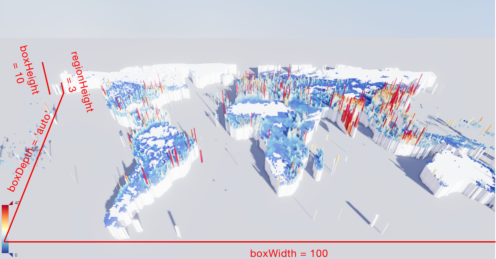

## boxHeight
- **Type**: `number`
- **Default**: `10`

三维地理坐标系组件在三维场景中的高度。

组件高度。这个高度包含三维地图上的柱状图、散点图的高度。

## boxDepth
- **Type**: `number`
- **Default**: `auto`

三维地理坐标系组件在三维场景中的深度。

组件深度默认自动，保证三维组件的显示比例跟输入的 GeoJSON 的比例相同。

## regionHeight
- **Type**: `number`
- **Default**: `3`

三维地图每个区域的高度。这个高度是模型的高度，小于 [boxHeight](option-gl.geo3D.md#boxHeight)。`boxHeight - regionHeight` 这一片区域会被用于三维柱状图，散点图等的展示。

## environment
- **Type**: `string`
- **Default**: `'auto'`

环境贴图。支持纯色、渐变色、全景贴图的 url。默认为 `'auto'`，在配置有 [light.ambientCubemap.texture](option-gl.geo3D.md#light.ambientCubemap.texture) 的时候会使用该纹理作为环境贴图。否则则不显示环境贴图。

示例：

```
// 配置为全景贴图
environment: 'asset/starfield.jpg'
// 配置为纯黑色的背景
environment: '#000'
// 配置为垂直渐变的背景
environment: new echarts.graphic.LinearGradient(0, 0, 0, 1, [{
  offset: 0, color: '#00aaff' // 天空颜色
}, {
  offset: 0.7, color: '#998866' // 地面颜色
}, {
  offset: 1, color: '#998866' // 地面颜色
}], false)

```

## groundPlane
- **Type**: `Object`

地面可以让整个组件有个“摆放”的地方，从而使整个场景看起来更真实，更有模型感。

`groundPlane` 下支持设置单独的 `realisticMaterial`, `colorMaterial`, `lambertMaterial` 等材质。如果不设置则默认取组件下的材质参数。

### groundPlane.show
- **Type**: `boolean`
- **Default**: `false`

是否显示地面。

### groundPlane.color
- **Type**: `string`
- **Default**: `'#aaa'`

地面颜色。

## instancing
- **Type**: `boolean`
- **Default**: `false`

`instancing`会将 GeoJSON 中所有的 [geometry](http://geojson.org/geojson-spec.html#geometry-objects) 合并成一个，在 GeoJSON 拥有特别多（上千）的 [geometry](http://geojson.org/geojson-spec.html#geometry-objects) 时可以有效提升绘制效率。

## label
- **Type**: `Object`

标签的相关设置。

### label.show
- **Type**: `boolean`
- **Default**: `false`

是否显示标签。

### label.distance
- **Type**: `number`

标签距离图形的距离，在三维的散点图中这个距离是屏幕空间的像素值，其它图中这个距离是相对的三维距离。

### label.formatter
- **Type**: `Function|string`

标签内容格式器，支持字符串模板和回调函数两种形式，字符串模板与回调函数返回的字符串均支持用 `\n` 换行。

**字符串模板**

模板变量有：

*   `{a}`：系列名。
*   `{b}`：数据名。
*   `{c}`：数据值。

**示例：**

```
formatter: '{b}: {c}'
```

**回调函数**

回调函数格式：

```
(params: Object|Array) => string
```

参数 `params` 是 formatter 需要的单个数据集。格式如下：

```
{
    componentType: 'series',
    // 系列类型
    seriesType: string,
    // 系列在传入的 option.series 中的 index
    seriesIndex: number,
    // 系列名称
    seriesName: string,
    // 数据名，类目名
    name: string,
    // 数据在传入的 data 数组中的 index
    dataIndex: number,
    // 传入的原始数据项
    data: Object,
    // 传入的数据值。在多数系列下它和 data 相同。在一些系列下是 data 中的分量（如 map、radar 中）
    value: number|Array|Object,
    // 坐标轴 encode 映射信息，
    // key 为坐标轴（如 'x' 'y' 'radius' 'angle' 等）
    // value 必然为数组，不会为 null/undefined，表示 dimension index 。
    // 其内容如：
    // {
    //     x: [2] // dimension index 为 2 的数据映射到 x 轴
    //     y: [0] // dimension index 为 0 的数据映射到 y 轴
    // }
    encode: Object,
    // 维度名列表
    dimensionNames: Array<String>,
    // 数据的维度 index，如 0 或 1 或 2 ...
    // 仅在雷达图中使用。
    dimensionIndex: number,
    // 数据图形的颜色
    color: string,

}
```

注：encode 和 dimensionNames 的使用方式，例如：

如果数据为：

```
dataset: {
    source: [
        ['Matcha Latte', 43.3, 85.8, 93.7],
        ['Milk Tea', 83.1, 73.4, 55.1],
        ['Cheese Cocoa', 86.4, 65.2, 82.5],
        ['Walnut Brownie', 72.4, 53.9, 39.1]
    ]
}
```

则可这样得到 y 轴对应的 value：

```
params.value[params.encode.y[0]]
```

如果数据为：

```
dataset: {
    dimensions: ['product', '2015', '2016', '2017'],
    source: [
        {product: 'Matcha Latte', '2015': 43.3, '2016': 85.8, '2017': 93.7},
        {product: 'Milk Tea', '2015': 83.1, '2016': 73.4, '2017': 55.1},
        {product: 'Cheese Cocoa', '2015': 86.4, '2016': 65.2, '2017': 82.5},
        {product: 'Walnut Brownie', '2015': 72.4, '2016': 53.9, '2017': 39.1}
    ]
}
```

则可这样得到 y 轴对应的 value：

```
params.value[params.dimensionNames[params.encode.y[0]]]
```

### label.textStyle
- **Type**: `Object`

标签的字体样式。

#### label.textStyle.color
- **Type**: `string`
- **Default**: `"#fff"`

文字的颜色。

#### label.textStyle.borderWidth
- **Type**: `number`
- **Default**: `0`

文字的描边宽度。

#### label.textStyle.borderColor
- **Type**: `string`
- **Default**: `#fff`

文字的描边颜色。

#### label.textStyle.fontFamily
- **Type**: `string`
- **Default**: `'sans-serif'`

文字的字体系列。

#### label.textStyle.fontSize
- **Type**: `number`
- **Default**: `12`

文字的字体大小。

#### label.textStyle.fontWeight
- **Type**: `string`
- **Default**: `normal`

文字字体的粗细。

**可选：**

*   `'normal'`
*   `'bold'`
*   `'bolder'`
*   `'lighter'`
*   100 | 200 | 300 | 400...

## itemStyle
- **Type**: `Object`

三维地理坐标系组件 中三维图形的视觉属性，包括颜色，透明度，描边等。

### itemStyle.color
- **Type**: `string|Function`
- **Default**: `自适应`

图形的颜色。 默认从全局调色盘 [option.color](https://echarts.apache.org/zh/option.html#color) 获取颜色

除了颜色字符串外，支持使用数组表示的 RGBA 值，例如：

```
// 纯白色
[1, 1, 1, 1]
```

使用数组表示的时候，每个通道可以设置大于 1 的值用于表示 HDR 的色值。

### itemStyle.opacity
- **Type**: `number`
- **Default**: `1`

图形的不透明度。

### itemStyle.borderWidth
- **Type**: `number`
- **Default**: `0`

图形描边的宽度。加上描边后可以更清晰的区分每个区域。如下图：


### itemStyle.borderColor
- **Type**: `string`
- **Default**: `#333`

图形描边的颜色。

## emphasis
- **Type**: `Object`

鼠标 hover 高亮时图形和标签的样式。

#### emphasis.label.show
- **Type**: `boolean`
- **Default**: `false`

是否显示标签。

#### emphasis.label.distance
- **Type**: `number`
- **Default**: `2`

标签距离图形的距离，在三维的散点图中这个距离是屏幕空间的像素值，其它图中这个距离是相对的三维距离。

#### emphasis.label.formatter
- **Type**: `Function|string`

标签内容格式器，支持字符串模板和回调函数两种形式，字符串模板与回调函数返回的字符串均支持用 `\n` 换行。

**字符串模板**

模板变量有：

*   `{a}`：系列名。
*   `{b}`：数据名。
*   `{c}`：数据值。

**示例：**

```
formatter: '{b}: {c}'
```

**回调函数**

回调函数格式：

```
(params: Object|Array) => string
```

参数 `params` 是 formatter 需要的单个数据集。格式如下：

```
{
    componentType: 'series',
    // 系列类型
    seriesType: string,
    // 系列在传入的 option.series 中的 index
    seriesIndex: number,
    // 系列名称
    seriesName: string,
    // 数据名，类目名
    name: string,
    // 数据在传入的 data 数组中的 index
    dataIndex: number,
    // 传入的原始数据项
    data: Object,
    // 传入的数据值。在多数系列下它和 data 相同。在一些系列下是 data 中的分量（如 map、radar 中）
    value: number|Array|Object,
    // 坐标轴 encode 映射信息，
    // key 为坐标轴（如 'x' 'y' 'radius' 'angle' 等）
    // value 必然为数组，不会为 null/undefined，表示 dimension index 。
    // 其内容如：
    // {
    //     x: [2] // dimension index 为 2 的数据映射到 x 轴
    //     y: [0] // dimension index 为 0 的数据映射到 y 轴
    // }
    encode: Object,
    // 维度名列表
    dimensionNames: Array<String>,
    // 数据的维度 index，如 0 或 1 或 2 ...
    // 仅在雷达图中使用。
    dimensionIndex: number,
    // 数据图形的颜色
    color: string,

}
```

注：encode 和 dimensionNames 的使用方式，例如：

如果数据为：

```
dataset: {
    source: [
        ['Matcha Latte', 43.3, 85.8, 93.7],
        ['Milk Tea', 83.1, 73.4, 55.1],
        ['Cheese Cocoa', 86.4, 65.2, 82.5],
        ['Walnut Brownie', 72.4, 53.9, 39.1]
    ]
}
```

则可这样得到 y 轴对应的 value：

```
params.value[params.encode.y[0]]
```

如果数据为：

```
dataset: {
    dimensions: ['product', '2015', '2016', '2017'],
    source: [
        {product: 'Matcha Latte', '2015': 43.3, '2016': 85.8, '2017': 93.7},
        {product: 'Milk Tea', '2015': 83.1, '2016': 73.4, '2017': 55.1},
        {product: 'Cheese Cocoa', '2015': 86.4, '2016': 65.2, '2017': 82.5},
        {product: 'Walnut Brownie', '2015': 72.4, '2016': 53.9, '2017': 39.1}
    ]
}
```

则可这样得到 y 轴对应的 value：

```
params.value[params.dimensionNames[params.encode.y[0]]]
```

#### emphasis.label.textStyle
- **Type**: `Object`

标签的字体样式。

##### emphasis.label.textStyle.color
- **Type**: `string`
- **Default**: `#000`

文字的颜色。

##### emphasis.label.textStyle.borderWidth
- **Type**: `number`
- **Default**: `1`

文字的描边宽度。

##### emphasis.label.textStyle.borderColor
- **Type**: `string`
- **Default**: `#fff`

文字的描边颜色。

##### emphasis.label.textStyle.fontFamily
- **Type**: `string`
- **Default**: `'sans-serif'`

文字的字体系列。

##### emphasis.label.textStyle.fontSize
- **Type**: `number`
- **Default**: `20`

文字的字体大小。

##### emphasis.label.textStyle.fontWeight
- **Type**: `string`
- **Default**: `normal`

文字字体的粗细。

**可选：**

*   `'normal'`
*   `'bold'`
*   `'bolder'`
*   `'lighter'`
*   100 | 200 | 300 | 400...

#### emphasis.itemStyle.color
- **Type**: `string`
- **Default**: `自适应`

图形的颜色。

除了颜色字符串外，支持使用数组表示的 RGBA 值，例如：

```
// 纯白色
[1, 1, 1, 1]
```

使用数组表示的时候，每个通道可以设置大于 1 的值用于表示 HDR 的色值。

#### emphasis.itemStyle.opacity
- **Type**: `number`
- **Default**: `1`

图形的不透明度。

## regions
- **Type**: `Array`

地图区域的设置。

### regions.name
- **Type**: `string`

所对应的地图区域的名称，例如 `'广东'`，`'浙江'`。

### regions.regionHeight
- **Type**: `number`

区域的高度。可以设置不同的高度用来表达数据的大小。当 GeoJSON 为建筑的数据时，也可以通过这个值表示简直的高度。如下图:


### regions.itemStyle
- **Type**: `Object`

单个区域的样式设置。

#### regions.itemStyle.color
- **Type**: `string`
- **Default**: `自适应`

图形的颜色。

除了颜色字符串外，支持使用数组表示的 RGBA 值，例如：

```
// 纯白色
[1, 1, 1, 1]
```

使用数组表示的时候，每个通道可以设置大于 1 的值用于表示 HDR 的色值。

#### regions.itemStyle.opacity
- **Type**: `number`
- **Default**: `1`

图形的不透明度。

#### regions.itemStyle.borderWidth
- **Type**: `number`
- **Default**: `0`

图形描边的宽度。加上描边后可以更清晰的区分每个区域。如下图：


#### regions.itemStyle.borderColor
- **Type**: `string`
- **Default**: `#333`

图形描边的颜色。

### regions.label
- **Type**: `Object`

单个区域的标签设置。

#### regions.label.show
- **Type**: `boolean`
- **Default**: `false`

是否显示标签。

#### regions.label.distance
- **Type**: `number`
- **Default**: `2`

标签距离图形的距离，在三维的散点图中这个距离是屏幕空间的像素值，其它图中这个距离是相对的三维距离。

#### regions.label.formatter
- **Type**: `Function|string`

标签内容格式器，支持字符串模板和回调函数两种形式，字符串模板与回调函数返回的字符串均支持用 `\n` 换行。

**字符串模板**

模板变量有：

*   `{a}`：系列名。
*   `{b}`：数据名。
*   `{c}`：数据值。

**示例：**

```
formatter: '{b}: {c}'
```

**回调函数**

回调函数格式：

```
(params: Object|Array) => string
```

参数 `params` 是 formatter 需要的单个数据集。格式如下：

```
{
    componentType: 'series',
    // 系列类型
    seriesType: string,
    // 系列在传入的 option.series 中的 index
    seriesIndex: number,
    // 系列名称
    seriesName: string,
    // 数据名，类目名
    name: string,
    // 数据在传入的 data 数组中的 index
    dataIndex: number,
    // 传入的原始数据项
    data: Object,
    // 传入的数据值。在多数系列下它和 data 相同。在一些系列下是 data 中的分量（如 map、radar 中）
    value: number|Array|Object,
    // 坐标轴 encode 映射信息，
    // key 为坐标轴（如 'x' 'y' 'radius' 'angle' 等）
    // value 必然为数组，不会为 null/undefined，表示 dimension index 。
    // 其内容如：
    // {
    //     x: [2] // dimension index 为 2 的数据映射到 x 轴
    //     y: [0] // dimension index 为 0 的数据映射到 y 轴
    // }
    encode: Object,
    // 维度名列表
    dimensionNames: Array<String>,
    // 数据的维度 index，如 0 或 1 或 2 ...
    // 仅在雷达图中使用。
    dimensionIndex: number,
    // 数据图形的颜色
    color: string,

}
```

注：encode 和 dimensionNames 的使用方式，例如：

如果数据为：

```
dataset: {
    source: [
        ['Matcha Latte', 43.3, 85.8, 93.7],
        ['Milk Tea', 83.1, 73.4, 55.1],
        ['Cheese Cocoa', 86.4, 65.2, 82.5],
        ['Walnut Brownie', 72.4, 53.9, 39.1]
    ]
}
```

则可这样得到 y 轴对应的 value：

```
params.value[params.encode.y[0]]
```

如果数据为：

```
dataset: {
    dimensions: ['product', '2015', '2016', '2017'],
    source: [
        {product: 'Matcha Latte', '2015': 43.3, '2016': 85.8, '2017': 93.7},
        {product: 'Milk Tea', '2015': 83.1, '2016': 73.4, '2017': 55.1},
        {product: 'Cheese Cocoa', '2015': 86.4, '2016': 65.2, '2017': 82.5},
        {product: 'Walnut Brownie', '2015': 72.4, '2016': 53.9, '2017': 39.1}
    ]
}
```

则可这样得到 y 轴对应的 value：

```
params.value[params.dimensionNames[params.encode.y[0]]]
```

#### regions.label.textStyle
- **Type**: `Object`

标签的字体样式。

##### regions.label.textStyle.color
- **Type**: `string`
- **Default**: `#000`

文字的颜色。

##### regions.label.textStyle.borderWidth
- **Type**: `number`
- **Default**: `1`

文字的描边宽度。

##### regions.label.textStyle.borderColor
- **Type**: `string`
- **Default**: `#fff`

文字的描边颜色。

##### regions.label.textStyle.fontFamily
- **Type**: `string`
- **Default**: `'sans-serif'`

文字的字体系列。

##### regions.label.textStyle.fontSize
- **Type**: `number`
- **Default**: `20`

文字的字体大小。

##### regions.label.textStyle.fontWeight
- **Type**: `string`
- **Default**: `normal`

文字字体的粗细。

**可选：**

*   `'normal'`
*   `'bold'`
*   `'bolder'`
*   `'lighter'`
*   100 | 200 | 300 | 400...

### regions.emphasis
- **Type**: `Object`

单个区域的标签和样式的高亮设置。

##### regions.emphasis.itemStyle.color
- **Type**: `string`
- **Default**: `自适应`

图形的颜色。

除了颜色字符串外，支持使用数组表示的 RGBA 值，例如：

```
// 纯白色
[1, 1, 1, 1]
```

使用数组表示的时候，每个通道可以设置大于 1 的值用于表示 HDR 的色值。

##### regions.emphasis.itemStyle.opacity
- **Type**: `number`
- **Default**: `1`

图形的不透明度。

##### regions.emphasis.itemStyle.borderWidth
- **Type**: `number`
- **Default**: `0`

图形描边的宽度。加上描边后可以更清晰的区分每个区域。如下图：


##### regions.emphasis.itemStyle.borderColor
- **Type**: `string`
- **Default**: `#333`

图形描边的颜色。

##### regions.emphasis.label.show
- **Type**: `boolean`
- **Default**: `false`

是否显示标签。

##### regions.emphasis.label.distance
- **Type**: `number`
- **Default**: `2`

标签距离图形的距离，在三维的散点图中这个距离是屏幕空间的像素值，其它图中这个距离是相对的三维距离。

##### regions.emphasis.label.formatter
- **Type**: `Function|string`

标签内容格式器，支持字符串模板和回调函数两种形式，字符串模板与回调函数返回的字符串均支持用 `\n` 换行。

**字符串模板**

模板变量有：

*   `{a}`：系列名。
*   `{b}`：数据名。
*   `{c}`：数据值。

**示例：**

```
formatter: '{b}: {c}'
```

**回调函数**

回调函数格式：

```
(params: Object|Array) => string
```

参数 `params` 是 formatter 需要的单个数据集。格式如下：

```
{
    componentType: 'series',
    // 系列类型
    seriesType: string,
    // 系列在传入的 option.series 中的 index
    seriesIndex: number,
    // 系列名称
    seriesName: string,
    // 数据名，类目名
    name: string,
    // 数据在传入的 data 数组中的 index
    dataIndex: number,
    // 传入的原始数据项
    data: Object,
    // 传入的数据值。在多数系列下它和 data 相同。在一些系列下是 data 中的分量（如 map、radar 中）
    value: number|Array|Object,
    // 坐标轴 encode 映射信息，
    // key 为坐标轴（如 'x' 'y' 'radius' 'angle' 等）
    // value 必然为数组，不会为 null/undefined，表示 dimension index 。
    // 其内容如：
    // {
    //     x: [2] // dimension index 为 2 的数据映射到 x 轴
    //     y: [0] // dimension index 为 0 的数据映射到 y 轴
    // }
    encode: Object,
    // 维度名列表
    dimensionNames: Array<String>,
    // 数据的维度 index，如 0 或 1 或 2 ...
    // 仅在雷达图中使用。
    dimensionIndex: number,
    // 数据图形的颜色
    color: string,

}
```

注：encode 和 dimensionNames 的使用方式，例如：

如果数据为：

```
dataset: {
    source: [
        ['Matcha Latte', 43.3, 85.8, 93.7],
        ['Milk Tea', 83.1, 73.4, 55.1],
        ['Cheese Cocoa', 86.4, 65.2, 82.5],
        ['Walnut Brownie', 72.4, 53.9, 39.1]
    ]
}
```

则可这样得到 y 轴对应的 value：

```
params.value[params.encode.y[0]]
```

如果数据为：

```
dataset: {
    dimensions: ['product', '2015', '2016', '2017'],
    source: [
        {product: 'Matcha Latte', '2015': 43.3, '2016': 85.8, '2017': 93.7},
        {product: 'Milk Tea', '2015': 83.1, '2016': 73.4, '2017': 55.1},
        {product: 'Cheese Cocoa', '2015': 86.4, '2016': 65.2, '2017': 82.5},
        {product: 'Walnut Brownie', '2015': 72.4, '2016': 53.9, '2017': 39.1}
    ]
}
```

则可这样得到 y 轴对应的 value：

```
params.value[params.dimensionNames[params.encode.y[0]]]
```

##### regions.emphasis.label.textStyle
- **Type**: `Object`

标签的字体样式。

###### regions.emphasis.label.textStyle.color
- **Type**: `string`
- **Default**: `#000`

文字的颜色。

###### regions.emphasis.label.textStyle.borderWidth
- **Type**: `number`
- **Default**: `1`

文字的描边宽度。

###### regions.emphasis.label.textStyle.borderColor
- **Type**: `string`
- **Default**: `#fff`

文字的描边颜色。

###### regions.emphasis.label.textStyle.fontFamily
- **Type**: `string`
- **Default**: `'sans-serif'`

文字的字体系列。

###### regions.emphasis.label.textStyle.fontSize
- **Type**: `number`
- **Default**: `20`

文字的字体大小。

###### regions.emphasis.label.textStyle.fontWeight
- **Type**: `string`
- **Default**: `normal`

文字字体的粗细。

**可选：**

*   `'normal'`
*   `'bold'`
*   `'bolder'`
*   `'lighter'`
*   100 | 200 | 300 | 400...

## shading
- **Type**: `string`

三维地理坐标系组件中三维图形的着色效果。echarts-gl 中支持下面三种着色方式：

*   `'color'` 只显示颜色，不受光照等其它因素的影响。
    
*   `'lambert'` 通过经典的 [lambert](https://en.wikipedia.org/wiki/Lambertian_reflectance) 着色表现光照带来的明暗。
    
*   `'realistic'` 真实感渲染，配合 [light.ambientCubemap](option-gl.globe.md#light.ambientCubemap) 和 [postEffect](option-gl.globe.md#postEffect) 使用可以让展示的画面效果和质感有质的提升。ECharts GL 中使用了[基于物理的渲染（PBR）](https://www.marmoset.co/posts/physically-based-rendering-and-you-can-too/) 来表现真实感材质。

## realisticMaterial
- **Type**: `Object`

真实感材质相关的配置项，在 [shading](option-gl.geo3D.md#shading) 为`'realistic'`时有效。

### realisticMaterial.detailTexture
- **Type**: `string|HTMLImageElement|HTMLCanvasElement`

材质细节的纹理贴图。

### realisticMaterial.textureTiling
- **Type**: `number`
- **Default**: `1`

材质细节纹理的平铺。默认为`1`，也就是拉伸填满。大于 `1` 的时候，数字表示纹理平铺重复的次数。

**注：** 使用平铺需要 `detailTexture` 的高宽是 2 的 n 次方。例如 512x512，如果是 200x200 的纹理无法使用平铺。

### realisticMaterial.textureOffset
- **Type**: `number`
- **Default**: `0`

材质细节纹理的位移。

### realisticMaterial.roughness
- **Type**: `number|string|HTMLImageElement|HTMLCanvasElement`
- **Default**: `0.5`

`roughness`属性用于表示材质的粗糙度，`0`为完全光滑，`1`完全粗糙，中间的值则是介于这两者之间。

下图是 [globe](option-gl.globe.md) 中`roughness`分别是`0.2`（光滑）与`0.8`（粗糙）的效果。

 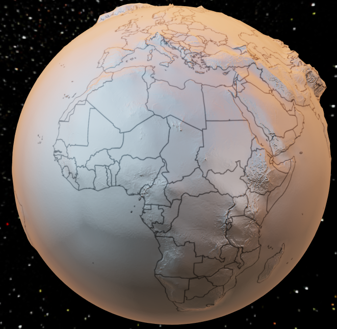

当你想要表达更复杂的材质时。你可以直接将 `roughness` 设置为如下用每个像素存储粗糙度的贴图。

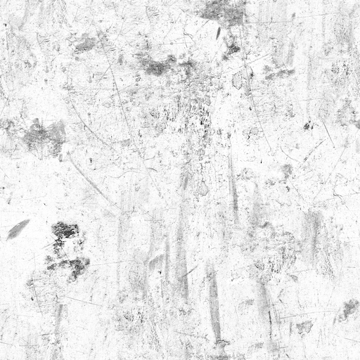

贴图中颜色越白的地方值越大，就越粗糙。你可以从 [http://freepbr.com/](http://freepbr.com/) 等资源网站获取不同材质的贴图资源，也可以使用其他工具自己生成。

### realisticMaterial.metalness
- **Type**: `number|string|HTMLImageElement|HTMLCanvasElement`
- **Default**: `0`

`metalness`属性用于表示材质是金属还是非金属，`0`为非金属，`1`为金属，中间的值则是介于这两者之间。通常设成`0`和`1`就能满足大部分场景了。

下图是 [globe](option-gl.globe.md) 中`metalness`分别设成`1`与`0`的效果区别。

 

跟 [roughness](option-gl.geo3D.md#realisticMaterial.roughness) 一样 你可以直接将 `metalness` 设置为金属度贴图。

### realisticMaterial.roughnessAdjust
- **Type**: `number`
- **Default**: `0.5`

粗糙度调整，在使用粗糙度贴图的时候有用。可以对贴图整体的粗糙度进行调整。默认为 `0.5`，`0`的时候为完全光滑，`1`的时候为完全粗糙。

### realisticMaterial.metalnessAdjust
- **Type**: `number`
- **Default**: `0.5`

金属度调整，在使用金属度贴图的时候有用。可以对贴图整体的金属度进行调整。默认为 `0.5`，`0`的时候为非金属，`1`的时候为金属。

### realisticMaterial.normalTexture
- **Type**: `string|HTMLImageElement|HTMLCanvasElement`

材质细节的法线贴图。

使用法线贴图可以在较少的顶点下依然表现出物体表面丰富的明暗细节。

## lambertMaterial
- **Type**: `Object`

lambert 材质相关的配置项，在 [shading](option-gl.geo3D.md#shading) 为`'lambert'`时有效。

### lambertMaterial.detailTexture
- **Type**: `string|HTMLImageElement|HTMLCanvasElement`

材质细节的纹理贴图。

### lambertMaterial.textureTiling
- **Type**: `number`
- **Default**: `1`

材质细节纹理的平铺。默认为`1`，也就是拉伸填满。大于 `1` 的时候，数字表示纹理平铺重复的次数。

**注：** 使用平铺需要 `detailTexture` 的高宽是 2 的 n 次方。例如 512x512，如果是 200x200 的纹理无法使用平铺。

### lambertMaterial.textureOffset
- **Type**: `number`
- **Default**: `0`

材质细节纹理的位移。

## colorMaterial
- **Type**: `Object`

color 材质相关的配置项，在 [shading](option-gl.geo3D.md#shading) 为`'color'`时有效。

### colorMaterial.detailTexture
- **Type**: `string|HTMLImageElement|HTMLCanvasElement`

材质细节的纹理贴图。

### colorMaterial.textureTiling
- **Type**: `number`
- **Default**: `1`

材质细节纹理的平铺。默认为`1`，也就是拉伸填满。大于 `1` 的时候，数字表示纹理平铺重复的次数。

**注：** 使用平铺需要 `detailTexture` 的高宽是 2 的 n 次方。例如 512x512，如果是 200x200 的纹理无法使用平铺。

### colorMaterial.textureOffset
- **Type**: `number`
- **Default**: `0`

材质细节纹理的位移。

## light
- **Type**: `Object`

光照相关的设置。在 [shading](option-gl.geo3D.md#shading) 为 `'color'` 的时候无效。

光照的设置会影响到组件以及组件所在坐标系上的所有图表。

合理的光照设置能够让整个场景的明暗变得更丰富，更有层次。

### light.main
- **Type**: `Object`

场景主光源的设置，在 [globe](option-gl.globe.md) 组件中就是太阳光。

#### light.main.color
- **Type**: `string`
- **Default**: `#fff`

主光源的颜色。

#### light.main.intensity
- **Type**: `number`
- **Default**: `1`

主光源的强度。

#### light.main.shadow
- **Type**: `boolean`
- **Default**: `false`

主光源是否投射阴影。默认为关闭。

开启阴影可以给场景带来更真实和有层次的光照效果。但是同时也会增加程序的运行开销。

下图是开启阴影以及关闭阴影的区别。

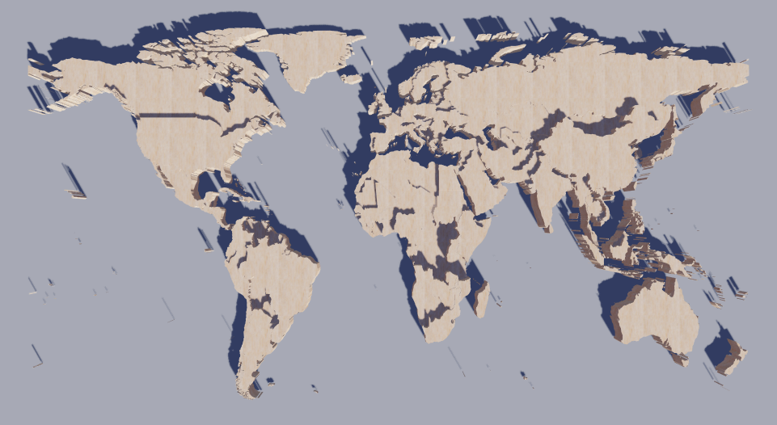 

#### light.main.shadowQuality
- **Type**: `string`
- **Default**: `'medium'`

阴影的质量。可选`'low'`, `'medium'`, `'high'`, `'ultra'`

下图是低质量和高质量阴影的区别。

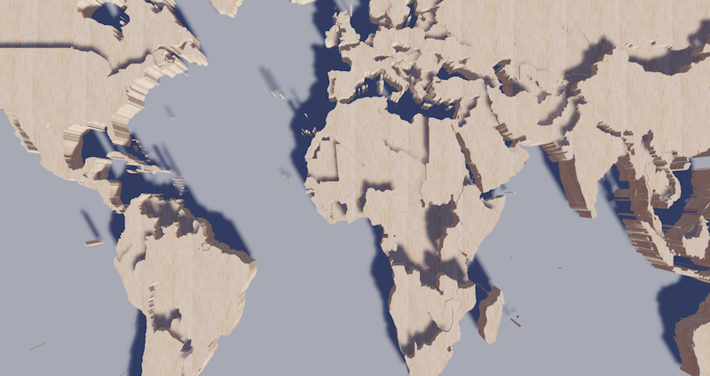 

#### light.main.alpha
- **Type**: `number`
- **Default**: `40`

主光源绕 x 轴，即上下旋转的角度。配合 [beta](option-gl.geo3D.md#light.main.beta) 控制光源的方向。

如下示意图：


[globe](option-gl.globe.md) 组件中可以通过 [time](option-gl.globe.md#light.main.time) 控制日光的时间。

#### light.main.beta
- **Type**: `number`
- **Default**: `40`

主光源绕 y 轴，即左右旋转的角度。

### light.ambient
- **Type**: `Object`

全局的环境光设置。

#### light.ambient.color
- **Type**: `string`
- **Default**: `#fff`

环境光的颜色。

#### light.ambient.intensity
- **Type**: `number`
- **Default**: `0.2`

环境光的强度。

### light.ambientCubemap
- **Type**: `Object`

ambientCubemap 会使用纹理作为环境光的光源，会为物体提供漫反射和高光反射。可以通过 [diffuseIntensity](option-gl.geo3D.md#light.ambientCubemap.diffuseIntensity) 和 [specularIntensity](option-gl.geo3D.md#light.ambientCubemap.specularIntensity) 分别设置漫反射强度和高光反射强度。

#### light.ambientCubemap.texture
- **Type**: `string`

环境光贴图的 url，支持使用`.hdr`格式的 HDR 图片。可以从 [http://www.hdrlabs.com/sibl/archive.html](http://www.hdrlabs.com/sibl/archive.html) 等网站获取 `.hdr` 的资源。

例如：

```
ambientCubemap: {
    texture: 'pisa.hdr',
    // 解析 hdr 时使用的曝光值
    exposure: 1.0
}
```

#### light.ambientCubemap.diffuseIntensity
- **Type**: `number`
- **Default**: `0.5`

漫反射的强度。

#### light.ambientCubemap.specularIntensity
- **Type**: `number`
- **Default**: `0.5`

高光反射的强度。

## postEffect
- **Type**: `Object`

后处理特效的相关配置。后处理特效可以为画面添加高光、景深、环境光遮蔽（SSAO）、调色等效果。可以让整个画面更富有质感。

下面分别是关闭和开启 `postEffect` 的区别。

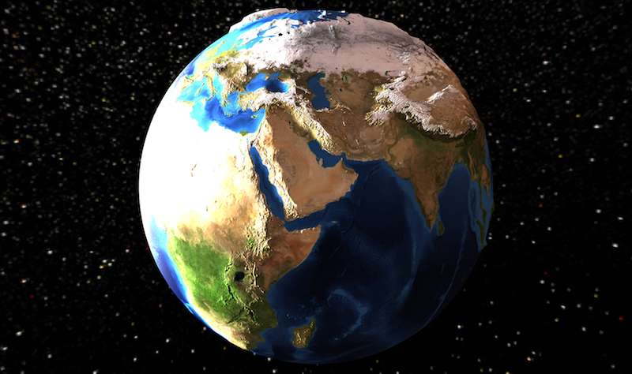 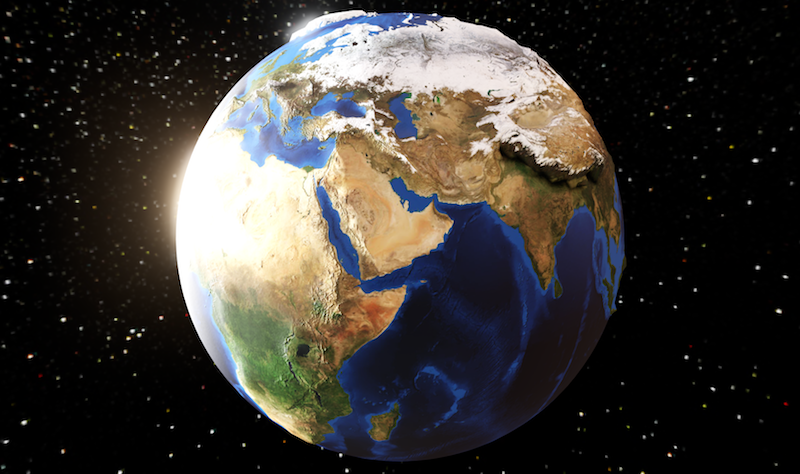

注意在开启 postEffect 的时候默认会开启 [temporalSuperSampling](option-gl.geo3D.md#temporalSuperSampling) 在画面静止后持续对画面增强，包括抗锯齿、景深、SSAO、阴影等。

### postEffect.enable
- **Type**: `boolean`
- **Default**: `false`

是否开启后处理特效。默认关闭。

### postEffect.bloom
- **Type**: `Object`

高光特效。高光特效用来表现很“亮”的颜色，因为传统的 RGB 只能表现`0 - 255`范围的颜色，所以对于超出这个范围特别“亮”的颜色，会通过这种高光溢出的特效去表现。如下图：


#### postEffect.bloom.enable
- **Type**: `boolean`
- **Default**: `false`

是否开启光晕特效。

#### postEffect.bloom.bloomIntensity
- **Type**: `number`
- **Default**: `0.1`

光晕的强度，默认为 0.1

### postEffect.depthOfField
- **Type**: `Object`

景深效果。景深效果是模拟摄像机的光学成像效果，在对焦的区域相对清晰，离对焦的区域越远则会逐渐模糊。

景深效果可以让观察者集中注意力到对焦的区域，而且让画面的镜头感更强，大景深还能塑造出微距的模型效果。

下面分别是关闭和开启景深的区别。

 

#### postEffect.depthOfField.enable
- **Type**: `boolean`
- **Default**: `false`

是否开启景深。

#### postEffect.depthOfField.focalDistance
- **Type**: `boolean`
- **Default**: `50`

初始的焦距，用户可以点击区域自动聚焦。

#### postEffect.depthOfField.focalRange
- **Type**: `boolean`
- **Default**: `20`

完全聚焦的区域范围，在此范围内的物体时完全清晰的，不会有模糊

#### postEffect.depthOfField.fstop
- **Type**: `number`
- **Default**: `2.8`

镜头的[F值](https://zh.wikipedia.org/wiki/%E7%84%A6%E6%AF%94)，值越小景深越浅。

#### postEffect.depthOfField.blurRadius
- **Type**: `number`
- **Default**: `10`

焦外的模糊半径

不同模糊半径的区别：

 

### postEffect.screenSpaceAmbientOcclusion
- **Type**: `Object`

屏幕空间的环境光遮蔽效果。环境光遮蔽效果可以让拐角处、洞、缝隙等大部分光无法到达的区域变暗，是传统的阴影贴图的补充，可以让整个场景更加自然，有层次。

下面是无 SSAO 和有 SSAO 的效果对比：

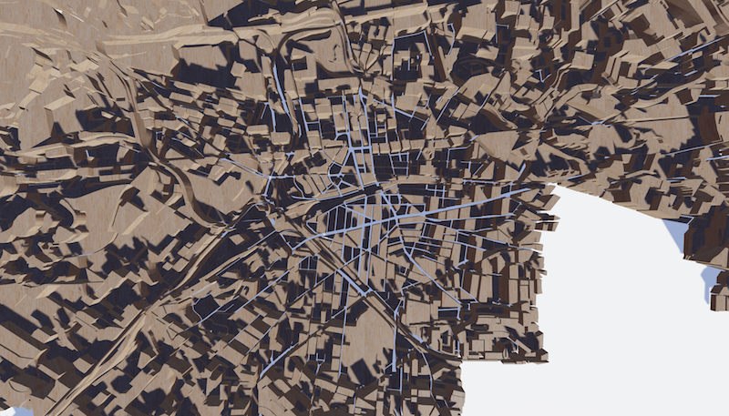 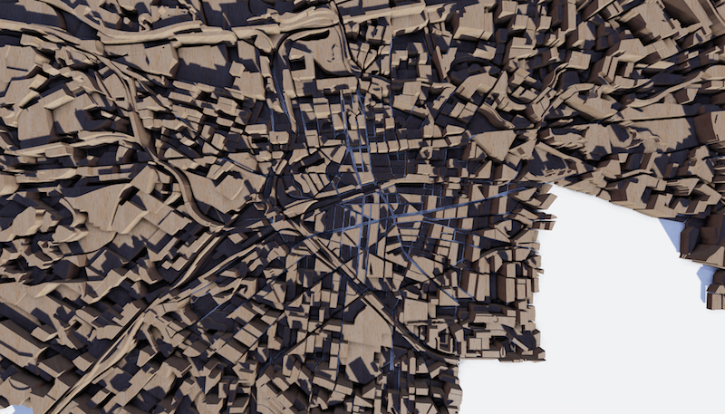

### postEffect.SSAO
- **Type**: `Object`

同 [screenSpaceAmbientOcclusion](option-gl.geo3D.md#postEffect.screenSpaceAmbientOcclusion)

#### postEffect.SSAO.enable
- **Type**: `boolean`
- **Default**: `false`

是否开启环境光遮蔽。默认不开启。

#### postEffect.SSAO.quality
- **Type**: `string`
- **Default**: `'medium'`

环境光遮蔽的质量。支持`'low'`, `'medium'`, `'high'`, `'ultra'`。

#### postEffect.SSAO.radius
- **Type**: `number`
- **Default**: `2`

环境光遮蔽的采样半径。半径越大效果越自然，但是需要设置较高的`'quality'`。

下面是半径值较小与较大之间的区别：

 

#### postEffect.SSAO.intensity
- **Type**: `number`
- **Default**: `1`

环境光遮蔽的强度。值越大颜色越深。

### postEffect.colorCorrection
- **Type**: `Object`

颜色纠正和调整。类似 Photoshop 中的 Color Adjustments。

下图同个场景调整为冷色系和暖色系的区别。

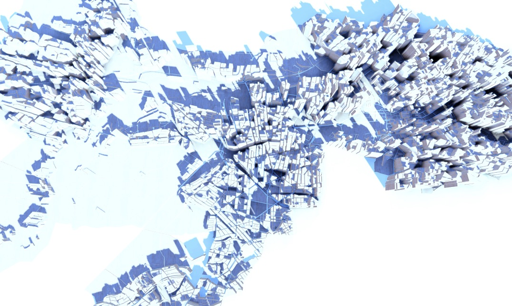 

#### postEffect.colorCorrection.enable
- **Type**: `boolean`
- **Default**: `true`

是否开启颜色纠正。

#### postEffect.colorCorrection.lookupTexture
- **Type**: `string|HTMLImageElement|HTMLCanvasElement`

颜色查找表，推荐使用。

颜色查找表是一张像下面这样的纹理图片。

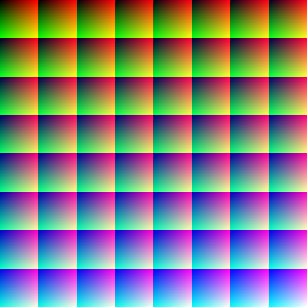

这张是基础的查找表图片，你可以直接拿来使用，为了方便将场景色调调整你想要的效果，你可以将场景截图后在 Photoshop 等图像处理软件中调整颜色到想要的效果，然后将相同的调整应用到上面这张查找表的图片上。

比如调成冷色调后，查找表的纹理图片就会成为下面这样：


然后那这张纹理图片就作为该配置项的值，就可以得到相同的在 Photoshop 里调整好的效果了。

当然如果你只是想得到一张截图，完全可以不这样操作，但是如果你想在可以实时交互的作品中能方便的调整到理想的色调，这个就非常有用了。

#### postEffect.colorCorrection.exposure
- **Type**: `number`
- **Default**: `0`

画面的曝光。

#### postEffect.colorCorrection.brightness
- **Type**: `number`
- **Default**: `0`

画面的亮度。

#### postEffect.colorCorrection.contrast
- **Type**: `number`
- **Default**: `1`

画面的对比度。

#### postEffect.colorCorrection.saturation
- **Type**: `number`
- **Default**: `1`

画面的饱和度。

### postEffect.FXAA
- **Type**: `Object`

在开启 [postEffect](option-gl.geo3D.md#postEffect) 后，WebGL 默认的 MSAA (Multi Sampling Anti Aliasing) 会无法使用。这时候通过 FXAA (Fast Approximate Anti-Aliasing) 可以廉价方便的解决抗锯齿的问题，FXAA 会对一些场景的边缘部分进行模糊从而解决锯齿的问题，这在一些场景上效果还不错，但是在 echarts-gl 中，需要保证很多文字和线条边缘的锐利清晰，因此 FXAA 并不是那么适用。这时候我们可以通过设置更高的`devicePixelRatio`来使用超采样，如下所示：

```
var chart = echarts.init(dom, null, {
    devicePixelRatio: 2
})
```

但是设置更高的`devicePixelRatio` 对电脑性能有很高的要求，所以更多时候我们建议使用 echarts-gl 中的 [temporalSuperSampling](option-gl.geo3D.md#temporalSuperSampling)，在画面静止后会持续分帧对一个像素多次抖动采样，从而达到超采样抗锯齿的效果。

#### postEffect.FXAA.enable
- **Type**: `boolean`
- **Default**: `false`

是否开启 FXAA。默认为不开启。

## temporalSuperSampling
- **Type**: `Object`

分帧超采样。在开启 [postEffect](option-gl.geo3D.md#postEffect) 后，WebGL 默认的 MSAA 会无法使用，所以我们需要自己解决锯齿的问题。

分帧超采样是用来解决锯齿问题的方法，它在画面静止后会持续分帧对一个像素多次抖动采样，从而达到抗锯齿的效果。而且在这个分帧采样的过程中，echarts-gl 也会对 [postEffect](option-gl.geo3D.md#postEffect) 中一些需要采样保证效果的特效，例如 [SSAO](option-gl.geo3D.md#postEffect.SSAO), [景深](option-gl.geo3D.md#postEffect.depthOfField)，以及阴影进行渐进增强。

下面是未开启和开启`temporalSuperSampling`的区别。

 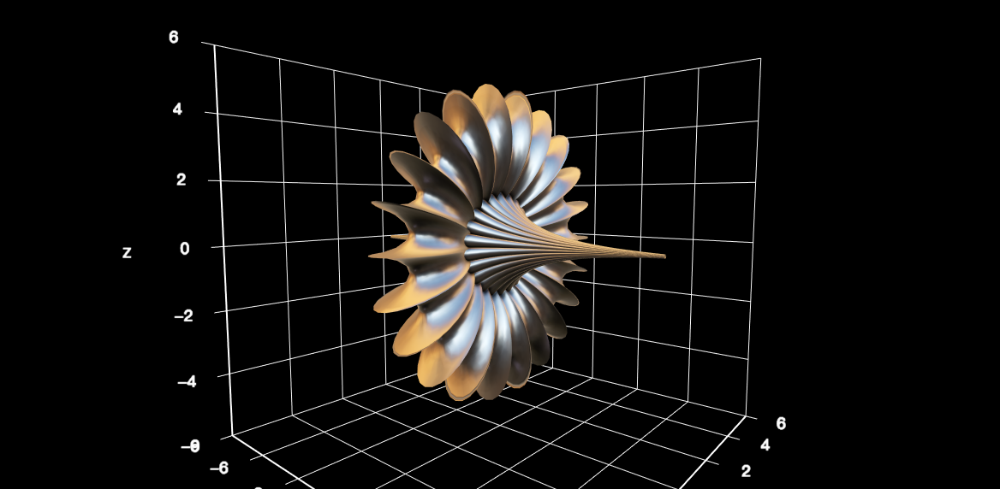

### temporalSuperSampling.enable
- **Type**: `boolean`
- **Default**: `'auto'`

是否开启分帧超采样。默认在开启 [postEffect](option-gl.geo3D.md#postEffect) 后也会同步开启。

## viewControl
- **Type**: `Object`

`viewControl`用于鼠标的旋转，缩放等视角控制。

### viewControl.projection
- **Type**: `string`
- **Default**: `perspective`

投影方式，默认为透视投影`'perspective'`，也支持设置为正交投影`'orthographic'`。

### viewControl.autoRotate
- **Type**: `boolean`
- **Default**: `false`

是否开启视角绕物体的自动旋转查看。

### viewControl.autoRotateDirection
- **Type**: `string`
- **Default**: `cw`

物体自转的方向。默认是 `'cw'` 也就是从上往下看是顺时针方向，也可以取 `'ccw'`，既从上往下看为逆时针方向。

### viewControl.autoRotateSpeed
- **Type**: `number`
- **Default**: `10`

物体自转的速度。单位为`角度 / 秒`，默认为`10` ，也就是`36`秒转一圈。

### viewControl.autoRotateAfterStill
- **Type**: `number`
- **Default**: `3`

在鼠标静止操作后恢复自动旋转的时间间隔。在开启 [autoRotate](option-gl.geo3D.md#viewControl.autoRotate) 后有效。

### viewControl.damping
- **Type**: `number`
- **Default**: `0.8`

鼠标进行旋转，缩放等操作时的迟滞因子，在大于 0 的时候鼠标在停止操作后，视角仍会因为一定的惯性继续运动（旋转和缩放）。

### viewControl.rotateSensitivity
- **Type**: `number|Array`
- **Default**: `1`

旋转操作的灵敏度，值越大越灵敏。支持使用数组分别设置横向和纵向的旋转灵敏度。

默认为`1`。

设置为`0`后无法旋转。

```
// 无法旋转
rotateSensitivity: 0
// 只能横向旋转
rotateSensitivity: [1, 0]
// 只能纵向旋转
rotateSensitivity: [0, 1]
```

### viewControl.zoomSensitivity
- **Type**: `number`
- **Default**: `1`

缩放操作的灵敏度，值越大越灵敏。默认为`1`。

设置为`0`后无法缩放。

### viewControl.panSensitivity
- **Type**: `number`
- **Default**: `1`

平移操作的灵敏度，值越大越灵敏。支持使用数组分别设置横向和纵向的平移灵敏度

默认为`1`。

设置为`0`后无法平移。

### viewControl.panMouseButton
- **Type**: `string`
- **Default**: `left`

平移操作使用的鼠标按键，支持：

*   `'left'` 鼠标左键（默认）
    
*   `'middle'` 鼠标中键
    
*   `'right'` 鼠标右键
    

注意：如果设置为鼠标右键则会阻止默认的右键菜单。

### viewControl.rotateMouseButton
- **Type**: `string`
- **Default**: `middle`

旋转操作使用的鼠标按键，支持：

*   `'left'` 鼠标左键
    
*   `'middle'` 鼠标中键（默认）
    
*   `'right'` 鼠标右键
    

注意：如果设置为鼠标右键则会阻止默认的右键菜单。

### viewControl.distance
- **Type**: `number`
- **Default**: `100`

默认视角距离主体的距离，对于 [globe](option-gl.globe.md) 来说是距离地球表面的距离，对于 [grid3D](option-gl.grid3D.md) 和 [geo3D](option-gl.geo3D.md) 等其它组件来说是距离中心原点的距离。在 [projection](option-gl.geo3D.md#viewControl.projection) 为`'perspective'`的时候有效。

### viewControl.minDistance
- **Type**: `number`
- **Default**: `40`

视角通过鼠标控制能拉近到主体的最小距离。在 [projection](option-gl.geo3D.md#viewControl.projection) 为`'perspective'`的时候有效。

### viewControl.maxDistance
- **Type**: `number`
- **Default**: `400`

视角通过鼠标控制能拉远到主体的最大距离。在 [projection](option-gl.geo3D.md#viewControl.projection) 为`'perspective'`的时候有效。

### viewControl.orthographicSize
- **Type**: `number`
- **Default**: `100`

正交投影的大小。在 [projection](option-gl.geo3D.md#viewControl.projection) 为`'orthographic'`的时候有效。

### viewControl.maxOrthographicSize
- **Type**: `number`
- **Default**: `20`

正交投影缩放的最大值。在 [projection](option-gl.geo3D.md#viewControl.projection) 为`'orthographic'`的时候有效。

### viewControl.minOrthographicSize
- **Type**: `number`
- **Default**: `400`

正交投影缩放的最小值。在 [projection](option-gl.geo3D.md#viewControl.projection) 为`'orthographic'`的时候有效。

### viewControl.alpha
- **Type**: `number`
- **Default**: `40`

视角绕 x 轴，即上下旋转的角度。配合 [beta](option-gl.geo3D.md#light.main.beta) 可以控制视角的方向。

如下示意图：


### viewControl.beta
- **Type**: `number`
- **Default**: `0`

视角绕 y 轴，即左右旋转的角度。

### viewControl.center
- **Type**: `Array`

视角中心点，旋转也会围绕这个中心点旋转，默认为`[0,0,0]`。

### viewControl.minAlpha
- **Type**: `number`
- **Default**: `5`

上下旋转的最小 alpha 值。即视角能旋转到达最上面的角度。

### viewControl.maxAlpha
- **Type**: `number`
- **Default**: `90`

上下旋转的最大 alpha 值。即视角能旋转到达最下面的角度。

### viewControl.minBeta
- **Type**: `number`
- **Default**: `-80`

左右旋转的最小 beta 值。即视角能旋转到达最左的角度。

### viewControl.maxBeta
- **Type**: `number`
- **Default**: `80`

左右旋转的最大 beta 值。即视角能旋转到达最右的角度。

### viewControl.animation
- **Type**: `boolean`
- **Default**: `true`

是否开启动画。

### viewControl.animationDurationUpdate
- **Type**: `number`
- **Default**: `1000`

过渡动画的时长。

### viewControl.animationEasingUpdate
- **Type**: `string`
- **Default**: `cubicInOut`

过渡动画的缓动效果。

## zlevel
- **Type**: `number`
- **Default**: `-10`

组件所在的层。

`zlevel`用于 Canvas 分层，不同`zlevel`值的图形会放置在不同的 Canvas 中，Canvas 分层是一种常见的优化手段。我们可以把一些图形变化频繁（例如有动画）的组件设置成一个单独的`zlevel`。需要注意的是过多的 Canvas 会引起内存开销的增大，在手机端上需要谨慎使用以防崩溃。

`zlevel` 大的 Canvas 会放在 `zlevel` 小的 Canvas 的上面。

**注:** echarts-gl 中组件的层需要跟 echarts 中组件的层分开。同一个 `zlevel` 不能同时用于 WebGL 和 Canvas 的绘制。

## left
- **Type**: `string|number`
- **Default**: `auto`

组件的视图离容器左侧的距离。

`left` 的值可以是像 `20` 这样的具体像素值，可以是像 `'20%'` 这样相对于容器高宽的百分比，也可以是 `'left'`, `'center'`, `'right'`。

如果 `left` 的值为`'left'`, `'center'`, `'right'`，组件会根据相应的位置自动对齐。

## top
- **Type**: `string|number`
- **Default**: `auto`

组件的视图离容器上侧的距离。

`top` 的值可以是像 `20` 这样的具体像素值，可以是像 `'20%'` 这样相对于容器高宽的百分比，也可以是 `'top'`, `'middle'`, `'bottom'`。

如果 `top` 的值为`'top'`, `'middle'`, `'bottom'`，组件会根据相应的位置自动对齐。

## right
- **Type**: `string|number`
- **Default**: `auto`

组件的视图离容器右侧的距离。

`right` 的值可以是像 `20` 这样的具体像素值，可以是像 `'20%'` 这样相对于容器高宽的百分比。

默认自适应。

## bottom
- **Type**: `string|number`
- **Default**: `auto`

组件的视图离容器下侧的距离。

`bottom` 的值可以是像 `20` 这样的具体像素值，可以是像 `'20%'` 这样相对于容器高宽的百分比。

默认自适应。

## width
- **Type**: `string|number`
- **Default**: `auto`

组件的视图宽度。

## height
- **Type**: `string|number`
- **Default**: `auto`

组件的视图高度。
