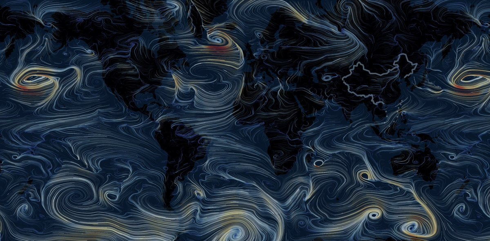
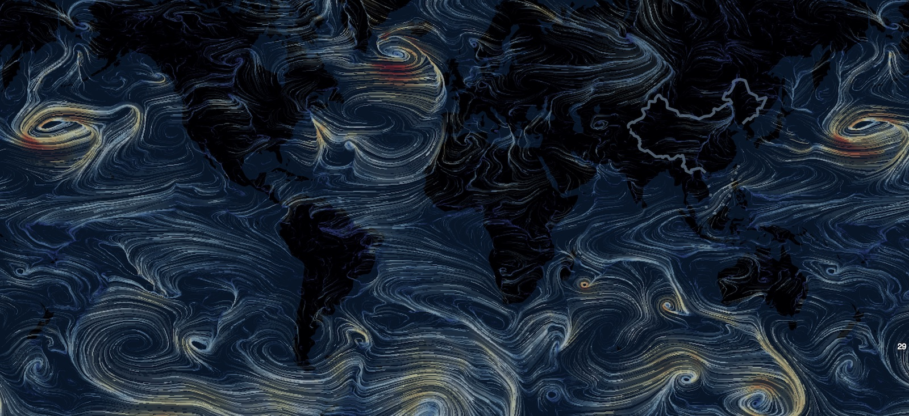
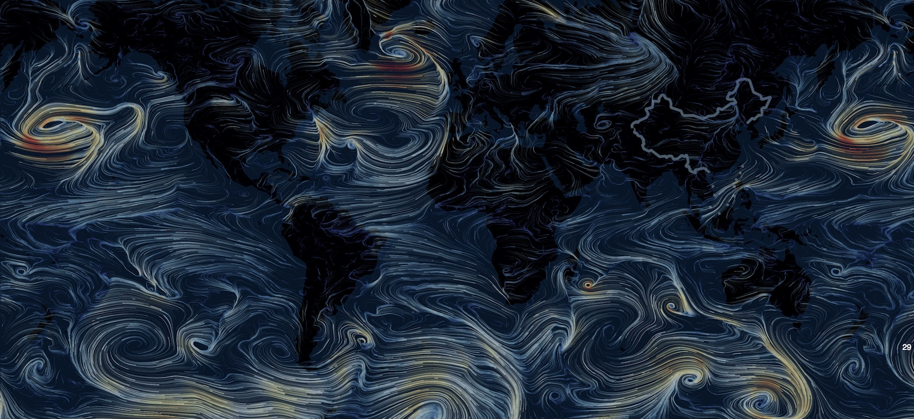

# option-gl.series-flowGL

## particleDensity
- **Type**: `number`
- **Default**: `128`

粒子的密度，实际的粒子数量是设置数目的平方。粒子密度越大迹线效果越好，但是性能开销也会越大。除了该属性，使用 [particleType](option-gl.series-flowGL.md#particleType) 也可以得到更加清晰连贯的迹线。

## particleType
- **Type**: `string`
- **Default**: `'point'`

粒子的类型，默认为点 `'point'`，可以设置成线 `'line'`。线类型的粒子会用一条线连接上个运动的位置和当前运动的位置，这会让这个轨迹更加连贯。

下面是类型分别是`'point'`和`'line'`的区别。

 

## particleSize
- **Type**: `number`
- **Default**: `1`

粒子的大小，如果 [particleType](option-gl.series-flowGL.md#particleType) 是 `'line'` 的话则会通过线宽的形式表现。

## particleSpeed
- **Type**: `number`
- **Default**: `1`

粒子的速度，默认为 1。注意在 [particleType](option-gl.series-flowGL.md#particleType) 为 `'point'` 的时候过大的速度会让整个轨迹变得断断续续。

## particleTrail
- **Type**: `number`
- **Default**: `2`

粒子的轨迹长度，数值越大轨迹越长。

## supersampling
- **Type**: `number`
- **Default**: `1`

画面的超采样比率，采用`4`的超采样可以有效的提高画面的清晰度，减少画面锯齿。但是因为需要处理更多的像素数量，所以也对性能有更高的要求。

下面分别是没有超采样和超采样值为 4 的区别。

 

## gridWidth
- **Type**: `number|string`
- **Default**: `'auto'`

传入的网格数据的网格宽度数量。`flowGL` 会根据这个值和 [gridHeight](option-gl.series-flowGL.md#gridHeight) 创建存储向量场的浮点纹理，用于粒子的轨迹计算。

## gridHeight
- **Type**: `number|string`
- **Default**: `'auto'`

传入的网格数据的网格高度数量。

## data
- **Type**: `Array`

向量场数据，包含向量的位置和向量的方向（包含大小）。`flowGL` 对数据的存储顺序和没有强制性要求，你甚至可以传入比较稀疏的向量数据。

如下示例

```
data: [
    // 每个数据项包含四个值，表示位置的 lng、lat 以及相应维度上的速度 sLng、 sLat.
    // 如果是直角坐标系上的话则是表示位置的 x、y 以及相应维度上的速度 sx、sy
    [0, 0, 1, 1], [1, 0, 1, 1],
    [0, 1, 1, 1], [1, 1, 1, 1]
];
```

默认`flowGL`会根据规整的网格形数据自动计算 [gridWidth](option-gl.series-flowGL.md#gridWidth) 和 [gridHeight](option-gl.series-flowGL.md#gridHeight)。但是因为 flowGL 也支持相对稀疏的数据格式，也可以手动指定这两个值。

## itemStyle
- **Type**: `Object`

向量场迹线的样式。

### itemStyle.color
- **Type**: `string`
- **Default**: `'#fff'`

向量场迹线的颜色。更多的是按照上面图中演示的通过`visualMap`组件去编码向量的大小。

### itemStyle.opacity
- **Type**: `number`
- **Default**: `0.8`

向量场迹线的透明度。
