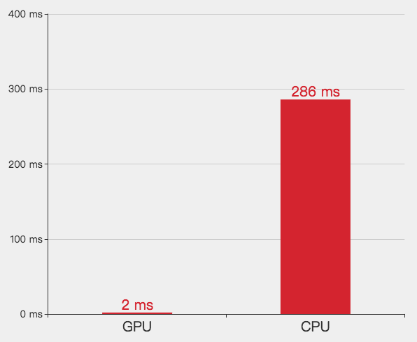

# option-gl.series-graphGL

## name
- **Type**: `string`

系列名称，用于 [tooltip](https://echarts.apache.org/zh/option.html#tooltip) 的显示，[legend](https://echarts.apache.org/zh/option.html#legend) 的图例筛选，在 `setOption` 更新数据和配置项时用于指定对应的系列。

## layout
- **Type**: `string`
- **Default**: `'forceAtlas2'`

布局的算法，支持使用 gephi 的 [forceAtlas2](https://github.com/gephi/gephi/wiki/Force-Atlas-2) 算法布局。

## forceAtlas2
- **Type**: `Object`

[forceAtlas2](https://github.com/gephi/gephi/wiki/Force-Atlas-2) 布局算法。

该算法对大规模的网络数据有着高效的布局效率和稳定的布局结果。

支持通过 [forceAtlas2.GPU](option-gl.series-graphGL.md#forceAtlas2.GPU) 配置为 GPU 还是 CPU 布局。

CPU 实现的优势是兼容性好，而 GPU 实现在高端显卡中有着数十倍甚至上百倍的性能优势。

下面是在 GTX1070 和 i7 4GHz 的电脑中对一个 2w 个节点（近 5w 条边）的关系图一次布局的迭代的性能对比。



### forceAtlas2.GPU
- **Type**: `boolean`
- **Default**: `true`

是否启用 GPU 布局。

### forceAtlas2.steps
- **Type**: `number`
- **Default**: `1`

一次更新的迭代次数。因为力引导算法通常会把每次迭代的结果都绘制出来，但是因为绘制时间往往会大于布局的时间，会导致布局的效率降低，这时候我们可以设置更大的`steps`参数，保证布局和绘制的时间均衡，加快布局的速度。

### forceAtlas2.stopThreshold
- **Type**: `number`
- **Default**: `1`

停止布局的阈值，当布局的全局速度因子小于这个阈值时停止布局。设为 0 则永远不停止。

### forceAtlas2.barnesHutOptimize
- **Type**: `boolean`

是否开启 [Barnes Hut](https://en.wikipedia.org/wiki/Barnes%E2%80%93Hut_simulation) 优化，在 [forceAtlas2.GPU](option-gl.series-graphGL.md#forceAtlas2.GPU) 为 false 时有效。

默认在节点数 > 1000时开启。

### forceAtlas2.repulsionByDegree
- **Type**: `number`
- **Default**: `true`

是否根据节点边的数量来计算节点的斥力因子，建议开启。

### forceAtlas2.linLogMode
- **Type**: `boolean`
- **Default**: `false`

是否是`lin-log`模式。`lin-log` 模式会让聚类的节点更加紧凑。

### forceAtlas2.gravity
- **Type**: `number`
- **Default**: `1`

节点受到的向心力。这个力会让节点像中心靠拢。

### forceAtlas2.gravityCenter
- **Type**: `Array`

向心力中心的位置。默认去初始位置的中间点。

### forceAtlas2.scaling
- **Type**: `number`

布局的缩放因子，值越大则节点间的斥力越大。

### forceAtlas2.edgeWeightInfluence
- **Type**: `number`
- **Default**: `1`

边权重的影响因子。值越大，则边权重对于引力的影响也越大。

注：这个因子是指数级的，因此在边权重为`0`和`1`的时候无效。

### forceAtlas2.edgeWeight
- **Type**: `Array|number`
- **Default**: `[1, 4]`

边的权重分布。映射自 [links.value](option-gl.series-graphGL.md#links.value)。

支持设置为单个数字，这时候就是统一的权重值。

### forceAtlas2.nodeWeight
- **Type**: `Array|number`
- **Default**: `[1, 4]`

节点的权重分布。映射自 [nodes.value](option-gl.series-graphGL.md#nodes.value)。

支持设置为单个数字，这时候就是统一的权重值。

### forceAtlas2.preventOverlap
- **Type**: `boolean`
- **Default**: `false`

是否开启防止节点重叠。

## symbol
- **Type**: `string`
- **Default**: `'circle'`

散点的形状。默认为圆形。

ECharts 提供的标记类型包括 `'circle'`, `'rect'`, `'roundRect'`, `'triangle'`, `'diamond'`, `'pin'`, `'arrow'`, `'none'`

可以通过 `'path://'` 将图标设置为任意的矢量路径。这种方式相比于使用图片的方式，不用担心因为缩放而产生锯齿或模糊，而且可以设置为任意颜色。路径图形会自适应调整为合适（如果是 `symbol` 的话就是 `symbolSize`）的大小。路径的格式参见 [SVG PathData](http://www.w3.org/TR/SVG/paths.html#PathData)。可以从 Adobe Illustrator 等工具编辑导出。

## symbolSize
- **Type**: `number|Array|Function`
- **Default**: `5`

标记的大小，可以设置成诸如 `10` 这样单一的数字，也可以用数组分开表示宽和高，例如 `[20, 10]` 表示标记宽为`20`，高为`10`。

如果需要每个数据的图形大小不一样，可以设置为如下格式的回调函数：

```
(value: Array|number, params: Object) => number|Array
```

其中第一个参数 `value` 为 [data](../option-gl.md#series-.data) 中的数据值。第二个参数`params` 是其它的数据项参数。

## itemStyle
- **Type**: `Object`

节点的样式设置。

### itemStyle.color
- **Type**: `string`
- **Default**: `自适应`

图形的颜色。

除了颜色字符串外，支持使用数组表示的 RGBA 值，例如：

```
// 纯白色
[1, 1, 1, 1]
```

使用数组表示的时候，每个通道可以设置大于 1 的值用于表示 HDR 的色值。

### itemStyle.opacity
- **Type**: `number`
- **Default**: `1`

图形的不透明度。

### itemStyle.borderWidth
- **Type**: `number`
- **Default**: `0`

图形描边宽度。

### itemStyle.borderColor
- **Type**: `string`
- **Default**: `'#fff'`

图形描边颜色。

## lineStyle
- **Type**: `Object`

关系边的样式设置。

### lineStyle.color
- **Type**: `string`
- **Default**: `#aaa`

线条的颜色。

除了颜色字符串外，支持使用数组表示的 RGBA 值，例如：

```
// 纯白色
[1, 1, 1, 1]
```

使用数组表示的时候，每个通道可以设置大于 1 的值用于表示 HDR 的色值。

### lineStyle.opacity
- **Type**: `number`
- **Default**: `1`

线条的不透明度。

### lineStyle.width
- **Type**: `number`
- **Default**: `1`

线条的宽度。

## data
- **Type**: `Array`

节点的数据集。

数据格式同 [graph.data](https://echarts.apache.org/zh/option.html#series-graph.data)

### data.name
- **Type**: `string`

数据项名称。

### data.value
- **Type**: `number|Array`

数据项值。

### data.itemStyle
- **Type**: `Object`

单个节点的样式。

#### data.itemStyle.color
- **Type**: `string`
- **Default**: `自适应`

图形的颜色。

除了颜色字符串外，支持使用数组表示的 RGBA 值，例如：

```
// 纯白色
[1, 1, 1, 1]
```

使用数组表示的时候，每个通道可以设置大于 1 的值用于表示 HDR 的色值。

#### data.itemStyle.opacity
- **Type**: `number`
- **Default**: `1`

图形的不透明度。

#### data.itemStyle.borderWidth
- **Type**: `number`
- **Default**: `0`

图形描边宽度。

#### data.itemStyle.borderColor
- **Type**: `string`
- **Default**: `'#fff'`

图形描边颜色。

## nodes
- **Type**: `Array`

同 [graphGL.data](option-gl.series-graphGL.md#data)。

## links
- **Type**: `Array`

节点间的关系数据。 数据格式同 [graph.links](https://echarts.apache.org/zh/option.html#series-graph.links)

### links.source
- **Type**: `string`

边的源节点名称的字符串，也支持使用数字表示源节点的索引。

### links.target
- **Type**: `string`

边的目标节点名称的字符串，也支持使用数字表示源节点的索引。

### links.value
- **Type**: `number`

边的数值。

### links.lineStyle
- **Type**: `Object`

单条边的样式。

#### links.lineStyle.color
- **Type**: `string`
- **Default**: `#aaa`

线条的颜色。

除了颜色字符串外，支持使用数组表示的 RGBA 值，例如：

```
// 纯白色
[1, 1, 1, 1]
```

使用数组表示的时候，每个通道可以设置大于 1 的值用于表示 HDR 的色值。

#### links.lineStyle.opacity
- **Type**: `number`
- **Default**: `1`

线条的不透明度。

#### links.lineStyle.width
- **Type**: `number`
- **Default**: `1`

线条的宽度。

## edges
- **Type**: `Array`

同 [graphGL.links](option-gl.series-graphGL.md#links)

## zlevel
- **Type**: `number`
- **Default**: `10`

组件所在的层。

`zlevel`用于 Canvas 分层，不同`zlevel`值的图形会放置在不同的 Canvas 中，Canvas 分层是一种常见的优化手段。我们可以把一些图形变化频繁（例如有动画）的组件设置成一个单独的`zlevel`。需要注意的是过多的 Canvas 会引起内存开销的增大，在手机端上需要谨慎使用以防崩溃。

`zlevel` 大的 Canvas 会放在 `zlevel` 小的 Canvas 的上面。

**注:** echarts-gl 中组件的层需要跟 echarts 中组件的层分开。同一个 `zlevel` 不能同时用于 WebGL 和 Canvas 的绘制。
