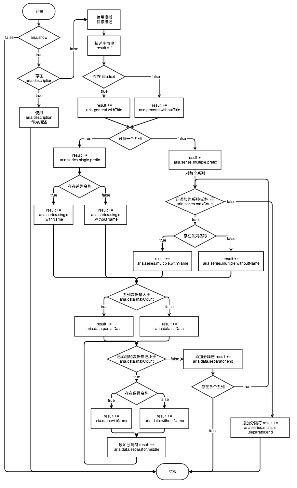

# option.aria

## enabled
- **Type**: `boolean`
- **Default**: `false`

是否开启无障碍访问。如果不开启，则不会开启 `label` 或 `decal` 效果。

## label
- **Type**: `Object`

如果 [aria.enabled](option.aria.md#enabled) 设置为 `true`，`label` 默认开启。开启后，会根据图表、数据、标题等情况，自动智能生成关于图表的描述，用户也可以通过配置项修改描述。

**例子：**

```
option = {
    aria: {
        // 下面几行可以不写，因为 label.enabled 默认 true
        // label: {
        //     enabled: true
        // },
        enabled: true
    },
    title: {
        text: '某站点用户访问来源',
        x: 'center'
    },
    series: [
        {
            name: '访问来源',
            type: 'pie',
            data: [
                { value: 335, name: '直接访问' },
                { value: 310, name: '邮件营销' },
                { value: 234, name: '联盟广告' },
                { value: 135, name: '视频广告' },
                { value: 1548, name: '搜索引擎' }
            ]
        }
    ]
};
```

生成的图表 DOM 上，会有一个 `aria-label` 属性，在朗读设备的帮助下，盲人能够了解图表的内容。其值为：

> 这是一个关于“某站点用户访问来源”的图表。图表类型是饼图，表示访问来源。其数据是——直接访问的数据是335，邮件营销的数据是310，联盟广告的数据是234，视频广告的数据是135，搜索引擎的数据是1548。

生成描述的基本流程为，如果 [aria.enabled](option.aria.md#enabled) 设置为 `true`（非默认）且 [aria.label.enabled](option.aria.md#label.enabled) 设置为 `true`（默认），则生成无障碍访问描述，否则不生成。如果定义了 [aria.label.description](option.aria.md#label.description)，则将其作为图表的完整描述，否则根据模板拼接生成描述。我们提供了默认的生成描述的算法，仅当生成的描述不太合适时，才需要修改这些模板，甚至使用 `aria.label.description` 完全覆盖。

使用模板拼接时，先根据是否存在标题 [title.text](option.title.md#text) 决定使用 [aria.label.general.withTitle](option.aria.md#label.general.withTitle) 还是 [aria.label.general.withoutTitle](option.aria.md#label.general.withoutTitle) 作为整体性描述。其中，`aria.label.general.withTitle` 配置项包括模板变量 `'{title}'`，将会被替换成图表标题。也就是说，如果 `aria.label.general.withTitle` 被设置为 `'图表的标题是：{title}。'`，则如果包含标题 `'价格分布图'`，这部分的描述为 `'图表的标题是：价格分布图。'`。

拼接完标题之后，会依次拼接系列的描述（[aria.label.series](option.aria.md#label.series)），和每个系列的数据的描述（[aria.label.data](option.aria.md#label.data)）。同样，每个模板都有可能包括模板变量，用以替换实际的值。

完整的描述生成流程为：



### label.enabled
- **Type**: `boolean`
- **Default**: `true`

是否开启无障碍访问的标签生成。开启后将生成 `aria-label` 属性。

### label.description
- **Type**: `string`

默认采用算法自动生成图表描述，如果用户需要完全自定义，可以将这个值设为描述。如将其设置为 `'这是一个展示了价格走势的图表'`，则图表 DOM 元素的 `aria-label` 属性值即为该字符串。

这一配置项常用于展示单个的数据并不能展示图表内容时，用户显示指定概括性描述图表的文字。例如图表是一个包含大量散点图的地图，默认的算法只能显示数据点的位置，不能从整体上传达作者的意图。这时候，可以将 `description` 指定为作者想表达的内容即可。

### label.general
- **Type**: `Object`

对于图表的整体性描述。

#### label.general.withTitle
- **Type**: `string`
- **Default**: `'这是一个关于“{title}”的图表。'`

如果图表存在 [title.text](option.title.md#text)，则采用 `withTitle`。其中包括模板变量：

*   `{title}`：将被替换为图表的 [title.text](option.title.md#text)。

#### label.general.withoutTitle
- **Type**: `string`
- **Default**: `'这是一个图表，'`

如果图表不存在 [title.text](option.title.md#text)，则采用 `withoutTitle`。

### label.series
- **Type**: `Object`

系列相关的配置项。

#### label.series.maxCount
- **Type**: `number`
- **Default**: `10`

描述中最多出现的系列个数。

#### label.series.single
- **Type**: `Object`

当图表只包含一个系列时，采用的描述。

##### label.series.single.prefix
- **Type**: `string`
- **Default**: `''`

对于所有系列的整体性描述，显示在每个系列描述之前。其中包括模板变量：

*   `{seriesCount}`：将被替换为系列个数，这里始终为 1。

##### label.series.single.withName
- **Type**: `string`
- **Default**: `'图表类型是{seriesType}，表示{seriesName}。'`

如果系列有 `name` 属性，则采用该描述。其中包括模板变量：

*   `{seriesName}`：将被替换为系列的 `name`；
*   `{seriesType}`：将被替换为系列的类型名称，如：`'柱状图'`、 `'折线图'` 等等。

##### label.series.single.withoutName
- **Type**: `string`
- **Default**: `'图表类型是{seriesType}。'`

如果系列没有 `name` 属性，则采用该描述。其中包括模板变量：

*   `{seriesType}`：将被替换为系列的类型名称，如：`'柱状图'`、 `'折线图'` 等等。

#### label.series.multiple
- **Type**: `Object`

当图表只包含多个系列时，采用的描述。

##### label.series.multiple.prefix
- **Type**: `string`
- **Default**: `'它由{seriesCount}个图表系列组成。'`

对于所有系列的整体性描述，显示在每个系列描述之前。其中包括模板变量：

*   `{seriesCount}`：将被替换为系列个数。

##### label.series.multiple.withName
- **Type**: `string`
- **Default**: `'图表类型是{seriesType}，表示{seriesName}。'`

如果系列有 `name` 属性，则采用该描述。其中包括模板变量：

*   `{seriesName}`：将被替换为系列的 `name`；
*   `{seriesType}`：将被替换为系列的类型名称，如：`'柱状图'`、 `'折线图'` 等等。

##### label.series.multiple.withoutName
- **Type**: `string`
- **Default**: `'图表类型是{seriesType}。'`

如果系列没有 `name` 属性，则采用该描述。其中包括模板变量：

*   `{seriesType}`：将被替换为系列的类型名称，如：`'柱状图'`、 `'折线图'` 等等。

##### label.series.multiple.separator
- **Type**: `Object`

系列与系列之间描述的分隔符。

###### label.series.multiple.separator.middle
- **Type**: `string`
- **Default**: `'；'`

除了最后一个系列后的分隔符。

###### label.series.multiple.separator.end
- **Type**: `string`
- **Default**: `'。'`

最后一个系列后的分隔符。

### label.data
- **Type**: `Object`

数据相关的配置项。

#### label.data.maxCount
- **Type**: `number`
- **Default**: `10`

描述中每个系列最多出现的数据个数。

#### label.data.allData
- **Type**: `string`
- **Default**: `'其数据是——'`

当数据全部显示时采用的描述。这一配置项**不会**使得数据全部显示，可以通过将 [aria.data.maxCount](option.aria.md#data.maxCount) 设置为 `Number.MAX_VALUE` 实现全部显示的效果。

#### label.data.partialData
- **Type**: `string`
- **Default**: `'其中，前{displayCnt}项是——'`

当只有部分数据显示时采用的描述。其中包括模板变量：

*   `{displayCnt}`：将被替换为显示的数据个数。

#### label.data.withName
- **Type**: `string`
- **Default**: `'{name}的数据是{value}'`

如果数据有 `name` 属性，则采用该描述。其中包括模板变量：

*   `{name}`：将被替换为数据的 `name`；
*   `{value}`：将被替换为数据的值。

#### label.data.withoutName
- **Type**: `string`
- **Default**: `'{value}'`

如果数据没有 `name` 属性，则采用该描述。其中包括模板变量：

*   `{value}`：将被替换为数据的值。

#### label.data.excludeDimensionId
- **Type**: `Array`

从 `v5.6.0` 开始支持

忽略 [aria.label](option.aria.md#label) 下数据相应的维度。

#### label.data.separator
- **Type**: `Object`

数据与数据之间描述的分隔符。

##### label.data.separator.middle
- **Type**: `string`
- **Default**: `'，'`

除了最后一个数据后的分隔符。

##### label.data.separator.end
- **Type**: `string`
- **Default**: `''`

最后一个数据后的分隔符。

需要注意的是，通常最后一个数据后是系列的 `separator.end`，所以 `data.separator.end` 在大多数情况下为空字符串。

## decal
- **Type**: `Object`

为系列数据增加贴花纹理，作为颜色的辅助，帮助区分数据。使用默认贴花图案的方式非常简单，只需要开启即可：

```
aria: {
    enabled: true,
    decal: {
        show: true
    }
}
```

绝大部分支持填充色的系列都支持贴花图案，包括：`'line'`, `'bar'`, `'pie'`, `'radar'`, `'treemap'`, `'sunburst'`, `'boxplot'`, `'sankey'`, `'funnel'`, `'gauge'`, `'pictorialBar'`, `'themeRiver'`, `'custom'` 等。其中，部分系列默认没有填充色（如 `'line'`, `'radar'`, `'boxplot'`）需要在设置了填充样式 `areaStyle` 的情况下才生效。

### decal.show
- **Type**: `boolean`
- **Default**: `false`

是否显示贴花图案，默认不显示。如果要显示贴花，需要保证 [aria.enabled](option.aria.md#enabled) 与 `aria.decal.show` 都是 `true`。

### decal.decals
- **Type**: `Object|Array`

贴花图案的样式。如果是 `Object` 类型，表示为所有数据采用同样的样式，如果是数组，则数组的每一项各为一种样式，数据将会依次循环取数组中的样式。

#### decal.decals.symbol
- **Type**: `string|Array`
- **Default**: `'rect'`

贴花的图案，如果是 `string[]` 表示循环使用数组中的图案。

ECharts 提供的标记类型包括

`'circle'`, `'rect'`, `'roundRect'`, `'triangle'`, `'diamond'`, `'pin'`, `'arrow'`, `'none'`

可以通过 `'image://url'` 设置为图片，其中 URL 为图片的链接，或者 `dataURI`。

URL 为图片链接例如：

```
'image://http://example.website/a/b.png'
```

URL 为 `dataURI` 例如：

```
'image://data:image/gif;base64,R0lGODlhEAAQAMQAAORHHOVSKudfOulrSOp3WOyDZu6QdvCchPGolfO0o/XBs/fNwfjZ0frl3/zy7////wAAAAAAAAAAAAAAAAAAAAAAAAAAAAAAAAAAAAAAAAAAAAAAAAAAAAAAAAAAAAAAACH5BAkAABAALAAAAAAQABAAAAVVICSOZGlCQAosJ6mu7fiyZeKqNKToQGDsM8hBADgUXoGAiqhSvp5QAnQKGIgUhwFUYLCVDFCrKUE1lBavAViFIDlTImbKC5Gm2hB0SlBCBMQiB0UjIQA7'
```

可以通过 `'path://'` 将图标设置为任意的矢量路径。这种方式相比于使用图片的方式，不用担心因为缩放而产生锯齿或模糊，而且可以设置为任意颜色。路径图形会自适应调整为合适的大小。路径的格式参见 [SVG PathData](http://www.w3.org/TR/SVG/paths.html#PathData)。可以从 Adobe Illustrator 等工具编辑导出。

例如：

```
'path://M30.9,53.2C16.8,53.2,5.3,41.7,5.3,27.6S16.8,2,30.9,2C45,2,56.4,13.5,56.4,27.6S45,53.2,30.9,53.2z M30.9,3.5C17.6,3.5,6.8,14.4,6.8,27.6c0,13.3,10.8,24.1,24.101,24.1C44.2,51.7,55,40.9,55,27.6C54.9,14.4,44.1,3.5,30.9,3.5z M36.9,35.8c0,0.601-0.4,1-0.9,1h-1.3c-0.5,0-0.9-0.399-0.9-1V19.5c0-0.6,0.4-1,0.9-1H36c0.5,0,0.9,0.4,0.9,1V35.8z M27.8,35.8 c0,0.601-0.4,1-0.9,1h-1.3c-0.5,0-0.9-0.399-0.9-1V19.5c0-0.6,0.4-1,0.9-1H27c0.5,0,0.9,0.4,0.9,1L27.8,35.8L27.8,35.8z'
```

#### decal.decals.symbolSize
- **Type**: `number`
- **Default**: `1`

取值范围：`0` 到 `1`，表示占图案区域的百分比。

#### decal.decals.symbolKeepAspect
- **Type**: `boolean`
- **Default**: `true`

是否保持图案的长宽比。

#### decal.decals.color
- **Type**: `string`
- **Default**: `'rgba(0, 0, 0, 0.2)'`

贴花图案的颜色，建议使用半透明色，这样能叠加在系列本身的颜色上。

#### decal.decals.backgroundColor
- **Type**: `string`

贴花的背景色，将会覆盖在系列本身颜色之上，贴花图案之下。

#### decal.decals.dashArrayX
- **Type**: `number|Array`
- **Default**: `5`

贴花图案的基本模式是在横向和纵向上分别以`图案 - 空白 - 图案 - 空白 - 图案 - 空白`的形式无限循环。通过设置每个图案和空白的长度，可以实现复杂的图案效果。

`dashArrayX` 控制了横向的图案模式。当其值为 `number` 或 `number[]` 类型时，与 [SVG stroke-dasharray](https://developer.mozilla.org/en-US/docs/Web/SVG/Attribute/stroke-dasharray) 类似。

*   如果是 `number` 类型，表示图案和空白分别是这个值。如 `5` 表示先显示宽度为 5 的图案，然后空 5 像素，再然后显示宽度为 5 的图案……
    
*   如果是 `number[]` 类型，则表示图案和空白依次为数组值的循环。如：`[5, 10, 2, 6]` 表示图案宽 5 像素，然后空 10 像素，然后图案宽 2 像素，然后空 6 像素，然后图案宽 5 像素……
    
*   如果是 `(number | number[])[]` 类型，表示每行的图案和空白依次为数组值的循环。如：`[10, [2, 5]]` 表示第一行以图案 10 像素空 10 像素循环，第二行以图案 2 像素空 5 像素循环，第三行以图案 10 像素空 10 像素循环……
    

可以结合以下的例子理解本接口：

#### decal.decals.dashArrayY
- **Type**: `number|Array`
- **Default**: `5`

贴花图案的基本模式是在横向和纵向上分别以`图案 - 空白 - 图案 - 空白 - 图案 - 空白`的形式无限循环。通过设置每个图案和空白的长度，可以实现复杂的图案效果。

`dashArrayY` 控制了横向的图案模式。与 [SVG stroke-dasharray](https://developer.mozilla.org/en-US/docs/Web/SVG/Attribute/stroke-dasharray) 类似。

*   如果是 `number` 类型，表示图案和空白分别是这个值。如 `5` 表示先显示高度为 5 的图案，然后空 5 像素，再然后显示高度为 5 的图案……
    
*   如果是 `number[]` 类型，则表示图案和空白依次为数组值的循环。如：`[5, 10, 2, 6]` 表示图案高 5 像素，然后空 10 像素，然后图案高 2 像素，然后空 6 像素，然后图案高 5 像素……
    

可以结合以下的例子理解本接口：

#### decal.decals.rotation
- **Type**: `number`
- **Default**: `0`

图案的整体旋转角度（弧度制），取值范围从 `-Math.PI` 到 `Math.PI`。

#### decal.decals.maxTileWidth
- **Type**: `number`
- **Default**: `512`

生成的图案在未重复之前的宽度上限。通常不需要设置该值，当你发现图案在重复的时候出现不连续的接缝时，可以尝试提高该值。

#### decal.decals.maxTileHeight
- **Type**: `number`
- **Default**: `512`

生成的图案在未重复之前的高度上限。通常不需要设置该值，当你发现图案在重复的时候出现不连续的接缝时，可以尝试提高该值。
