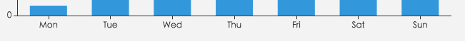

# option.singleAxis

## id
- **Type**: `string`

组件 ID。默认不指定。指定则可用于在 option 或者 API 中引用组件。

## zlevel
- **Type**: `number`
- **Default**: `0`

所有图形的 zlevel 值。

`zlevel`用于 Canvas 分层，不同`zlevel`值的图形会放置在不同的 Canvas 中，Canvas 分层是一种常见的优化手段。我们可以把一些图形变化频繁（例如有动画）的组件设置成一个单独的`zlevel`。需要注意的是过多的 Canvas 会引起内存开销的增大，在手机端上需要谨慎使用以防崩溃。

`zlevel` 大的 Canvas 会放在 `zlevel` 小的 Canvas 的上面。

## z
- **Type**: `number`
- **Default**: `2`

组件的所有图形的`z`值。控制图形的前后顺序。`z`值小的图形会被`z`值大的图形覆盖。

`z`相比`zlevel`优先级更低，而且不会创建新的 Canvas。

## left
- **Type**: `string|number`
- **Default**: `'5%'`

undefined组件离容器左侧的距离。

`left` 的值可以是像 `20` 这样的具体像素值，可以是像 `'20%'` 这样相对于容器宽度的百分比，也可以是 `'left'`, `'center'`, `'right'`。

如果 `left` 的值为 `'left'`, `'center'`, `'right'`，组件会根据相应的位置自动对齐。

## top
- **Type**: `string|number`
- **Default**: `'5%'`

undefined组件离容器上侧的距离。

`top` 的值可以是像 `20` 这样的具体像素值，可以是像 `'20%'` 这样相对于容器高度的百分比，也可以是 `'top'`, `'middle'`, `'bottom'`。

如果 `top` 的值为 `'top'`, `'middle'`, `'bottom'`，组件会根据相应的位置自动对齐。

## right
- **Type**: `string|number`
- **Default**: `'5%'`

undefined组件离容器右侧的距离。

`right` 的值可以是像 `20` 这样的具体像素值，可以是像 `'20%'` 这样相对于容器宽度的百分比。

## bottom
- **Type**: `string|number`
- **Default**: `'5%'`

undefined组件离容器下侧的距离。

bottom 的值可以是像 `20` 这样的具体像素值，可以是像 `'20%'` 这样相对于容器高度的百分比。

## width
- **Type**: `string|number`
- **Default**: `'auto'`

单轴（singleAxis）组件的宽度。默认自适应。

`width` 的值可以是像 `20` 这样的具体像素值，可以是像 `'20%'` 这样相对于容器宽度的百分比。

## height
- **Type**: `string|number`
- **Default**: `'auto'`

单轴（singleAxis）组件的高度。默认自适应。

`height` 的值可以是像 `20` 这样的具体像素值，可以是像 `'20%'` 这样相对于容器高度的百分比。

## orient
- **Type**: `string`
- **Default**: `'horizontal'`

轴的朝向，默认水平朝向，可以设置成 `'vertical'` 垂直朝向。

## type
- **Type**: `string`
- **Default**: `'value'`

坐标轴类型。

可选：

*   `'value'` 数值轴，适用于连续数据。
    
*   `'category'` 类目轴，适用于离散的类目数据。为该类型时类目数据可自动从 [series.data](../option.md#series.data) 或 [dataset.source](option.dataset.md#source) 中取，或者可通过 [singleAxis.data](option.singleAxis.md#data) 设置类目数据。
    
*   `'time'` 时间轴，适用于连续的时序数据，与数值轴相比时间轴带有时间的格式化，在刻度计算上也有所不同，例如会根据跨度的范围来决定使用月，星期，日还是小时范围的刻度。
    
*   `'log'` 对数轴。适用于对数数据。对数轴下的堆积柱状图或堆积折线图可能带来很大的视觉误差，并且在一定情况下可能存在非预期效果，应避免使用。

## name
- **Type**: `string`

坐标轴名称。

## nameLocation
- **Type**: `string`
- **Default**: `'end'`

坐标轴名称显示位置。

**可选：**

*   `'start'`
*   `'middle'` 或者 `'center'`
*   `'end'`

## nameTextStyle
- **Type**: `Object`

坐标轴名称的文字样式。

### nameTextStyle.color
- **Type**: `Color`

坐标轴名称的颜色，默认取 [axisLine.lineStyle.color](option.singleAxis.md#axisLine.lineStyle.color)。

### nameTextStyle.fontStyle
- **Type**: `string`
- **Default**: `'normal'`

坐标轴名称文字字体的风格。

可选：

*   `'normal'`
*   `'italic'`
*   `'oblique'`

### nameTextStyle.fontWeight
- **Type**: `string|number`
- **Default**: `'normal'`

坐标轴名称文字字体的粗细。

可选：

*   `'normal'`
*   `'bold'`
*   `'bolder'`
*   `'lighter'`
*   100 | 200 | 300 | 400...

### nameTextStyle.fontFamily
- **Type**: `string`
- **Default**: `'sans-serif'`

坐标轴名称文字的字体系列。

还可以是 'serif' , 'monospace', 'Arial', 'Courier New', 'Microsoft YaHei', ...

### nameTextStyle.fontSize
- **Type**: `number`
- **Default**: `12`

坐标轴名称文字的字体大小。

### nameTextStyle.align
- **Type**: `string`

文字水平对齐方式，默认自动。

可选：

*   `'left'`
*   `'center'`
*   `'right'`

`rich` 中如果没有设置 `align`，则会取父层级的 `align`。例如：

```
{
    align: right,
    rich: {
        a: {
            // 没有设置 `align`，则 `align` 为 right
        }
    }
}
```

### nameTextStyle.verticalAlign
- **Type**: `string`

文字垂直对齐方式，默认自动。

可选：

*   `'top'`
*   `'middle'`
*   `'bottom'`

`rich` 中如果没有设置 `verticalAlign`，则会取父层级的 `verticalAlign`。例如：

```
{
    verticalAlign: bottom,
    rich: {
        a: {
            // 没有设置 `verticalAlign`，则 `verticalAlign` 为 bottom
        }
    }
}
```

### nameTextStyle.lineHeight
- **Type**: `number`

行高。

`rich` 中如果没有设置 `lineHeight`，则会取父层级的 `lineHeight`。例如：

```
{
    lineHeight: 56,
    rich: {
        a: {
            // 没有设置 `lineHeight`，则 `lineHeight` 为 56
        }
    }
}
```

### nameTextStyle.backgroundColor
- **Type**: `string|Object`
- **Default**: `'transparent'`

文字块背景色。

可以使用颜色值，例如：`'#123234'`, `'red'`, `'rgba(0,23,11,0.3)'`。

也可以直接使用图片，例如：

```
backgroundColor: {
    image: 'xxx/xxx.png'
    // 这里可以是图片的 URL，
    // 或者图片的 dataURI，
    // 或者 HTMLImageElement 对象，
    // 或者 HTMLCanvasElement 对象。
}
```

当使用图片的时候，可以使用 `width` 或 `height` 指定高宽，也可以不指定自适应。

### nameTextStyle.borderColor
- **Type**: `Color`

文字块边框颜色。

### nameTextStyle.borderWidth
- **Type**: `number`
- **Default**: `0`

文字块边框宽度。

### nameTextStyle.borderType
- **Type**: `string|number|Array`
- **Default**: `'solid'`

文字块边框描边类型。

可选：

*   `'solid'`
*   `'dashed'`
*   `'dotted'`

自 `v5.0.0` 开始，也可以是 `number` 或者 `number` 数组，用以指定线条的 [dash array](https://developer.mozilla.org/zh-CN/docs/Web/SVG/Attribute/stroke-dasharray)，配合 `borderDashOffset` 可实现更灵活的虚线效果。

例如：

```
{

borderType: [5, 10],

borderDashOffset: 5
}
```

### nameTextStyle.borderDashOffset
- **Type**: `number`
- **Default**: `0`

从 `v5.0.0` 开始支持

用于设置虚线的偏移量，可搭配 `borderType` 指定 dash array 实现灵活的虚线效果。

更多详情可以参考 MDN [lineDashOffset](https://developer.mozilla.org/zh-CN/docs/Web/API/CanvasRenderingContext2D/lineDashOffset)。

### nameTextStyle.borderRadius
- **Type**: `number|Array`
- **Default**: `0`

文字块的圆角。

### nameTextStyle.padding
- **Type**: `number|Array`
- **Default**: `0`

文字块的内边距。例如：

*   `padding: [3, 4, 5, 6]`：表示 `[上, 右, 下, 左]` 的边距。
*   `padding: 4`：表示 `padding: [4, 4, 4, 4]`。
*   `padding: [3, 4]`：表示 `padding: [3, 4, 3, 4]`。

注意，文字块的 `width` 和 `height` 指定的是内容高宽，不包含 `padding`。

### nameTextStyle.shadowColor
- **Type**: `Color`
- **Default**: `'transparent'`

文字块的背景阴影颜色。

### nameTextStyle.shadowBlur
- **Type**: `number`
- **Default**: `0`

文字块的背景阴影长度。

### nameTextStyle.shadowOffsetX
- **Type**: `number`
- **Default**: `0`

文字块的背景阴影 X 偏移。

### nameTextStyle.shadowOffsetY
- **Type**: `number`
- **Default**: `0`

文字块的背景阴影 Y 偏移。

### nameTextStyle.width
- **Type**: `number`

文本显示宽度。

### nameTextStyle.height
- **Type**: `number`

文本显示高度。

### nameTextStyle.textBorderColor
- **Type**: `Color`

文字本身的描边颜色。

### nameTextStyle.textBorderWidth
- **Type**: `number`

文字本身的描边宽度。

### nameTextStyle.textBorderType
- **Type**: `string|number|Array`
- **Default**: `'solid'`

文字本身的描边类型。

可选：

*   `'solid'`
*   `'dashed'`
*   `'dotted'`

自 `v5.0.0` 开始，也可以是 `number` 或者 `number` 数组，用以指定线条的 [dash array](https://developer.mozilla.org/zh-CN/docs/Web/SVG/Attribute/stroke-dasharray)，配合 `textBorderDashOffset` 可实现更灵活的虚线效果。

例如：

```
{

textBorderType: [5, 10],

textBorderDashOffset: 5
}
```

### nameTextStyle.textBorderDashOffset
- **Type**: `number`
- **Default**: `0`

从 `v5.0.0` 开始支持

用于设置虚线的偏移量，可搭配 `textBorderType` 指定 dash array 实现灵活的虚线效果。

更多详情可以参考 MDN [lineDashOffset](https://developer.mozilla.org/zh-CN/docs/Web/API/CanvasRenderingContext2D/lineDashOffset)。

### nameTextStyle.textShadowColor
- **Type**: `Color`
- **Default**: `'transparent'`

文字本身的阴影颜色。

### nameTextStyle.textShadowBlur
- **Type**: `number`
- **Default**: `0`

文字本身的阴影长度。

### nameTextStyle.textShadowOffsetX
- **Type**: `number`
- **Default**: `0`

文字本身的阴影 X 偏移。

### nameTextStyle.textShadowOffsetY
- **Type**: `number`
- **Default**: `0`

文字本身的阴影 Y 偏移。

### nameTextStyle.overflow
- **Type**: `string`
- **Default**: `'none'`

文字超出宽度是否截断或者换行。配置`width`时有效

*   `'truncate'` 截断，并在末尾显示`ellipsis`配置的文本，默认为`...`
*   `'break'` 换行
*   `'breakAll'` 换行，跟`'break'`不同的是，在英语等拉丁文中，`'breakAll'`还会强制单词内换行

### nameTextStyle.ellipsis
- **Type**: `string`
- **Default**: `'...'`

在`overflow`配置为`'truncate'`的时候，可以通过该属性配置末尾显示的文本。

### nameTextStyle.rich
- **Type**: `Object`

在 `rich` 里面，可以自定义富文本样式。利用富文本样式，可以在标签中做出非常丰富的效果。

例如：

```
label: {
    // 在文本中，可以对部分文本采用 rich 中定义样式。
    // 这里需要在文本中使用标记符号：
    // `{styleName|text content text content}` 标记样式名。
    // 注意，换行仍是使用 '\n'。
    formatter: [
        '{a|这段文本采用样式a}',
        '{b|这段文本采用样式b}这段用默认样式{x|这段用样式x}'
    ].join('\n'),

    rich: {
        a: {
            color: 'red',
            lineHeight: 10
        },
        b: {
            backgroundColor: {
                image: 'xxx/xxx.jpg'
            },
            height: 40
        },
        x: {
            fontSize: 18,
            fontFamily: 'Microsoft YaHei',
            borderColor: '#449933',
            borderRadius: 4
        },
        ...
    }
}
```

详情参见教程：[富文本标签](../tutorial.md#%E5%AF%8C%E6%96%87%E6%9C%AC%E6%A0%87%E7%AD%BE)

##### nameTextStyle.rich.<style_name>.color
- **Type**: `Color`
- **Default**: `'#fff'`

文字的颜色。

##### nameTextStyle.rich.<style_name>.fontStyle
- **Type**: `string`
- **Default**: `'normal'`

文字字体的风格。

可选：

*   `'normal'`
*   `'italic'`
*   `'oblique'`

##### nameTextStyle.rich.<style_name>.fontWeight
- **Type**: `string|number`
- **Default**: `'normal'`

文字字体的粗细。

可选：

*   `'normal'`
*   `'bold'`
*   `'bolder'`
*   `'lighter'`
*   100 | 200 | 300 | 400...

##### nameTextStyle.rich.<style_name>.fontFamily
- **Type**: `string`
- **Default**: `'sans-serif'`

文字的字体系列。

还可以是 'serif' , 'monospace', 'Arial', 'Courier New', 'Microsoft YaHei', ...

##### nameTextStyle.rich.<style_name>.fontSize
- **Type**: `number`
- **Default**: `12`

文字的字体大小。

##### nameTextStyle.rich.<style_name>.align
- **Type**: `string`

文字水平对齐方式，默认自动。

可选：

*   `'left'`
*   `'center'`
*   `'right'`

`rich` 中如果没有设置 `align`，则会取父层级的 `align`。例如：

```
{
    align: right,
    rich: {
        a: {
            // 没有设置 `align`，则 `align` 为 right
        }
    }
}
```

##### nameTextStyle.rich.<style_name>.verticalAlign
- **Type**: `string`

文字垂直对齐方式，默认自动。

可选：

*   `'top'`
*   `'middle'`
*   `'bottom'`

`rich` 中如果没有设置 `verticalAlign`，则会取父层级的 `verticalAlign`。例如：

```
{
    verticalAlign: bottom,
    rich: {
        a: {
            // 没有设置 `verticalAlign`，则 `verticalAlign` 为 bottom
        }
    }
}
```

##### nameTextStyle.rich.<style_name>.lineHeight
- **Type**: `number`

行高。

`rich` 中如果没有设置 `lineHeight`，则会取父层级的 `lineHeight`。例如：

```
{
    lineHeight: 56,
    rich: {
        a: {
            // 没有设置 `lineHeight`，则 `lineHeight` 为 56
        }
    }
}
```

##### nameTextStyle.rich.<style_name>.backgroundColor
- **Type**: `string|Object`
- **Default**: `'transparent'`

文字块背景色。

可以使用颜色值，例如：`'#123234'`, `'red'`, `'rgba(0,23,11,0.3)'`。

也可以直接使用图片，例如：

```
backgroundColor: {
    image: 'xxx/xxx.png'
    // 这里可以是图片的 URL，
    // 或者图片的 dataURI，
    // 或者 HTMLImageElement 对象，
    // 或者 HTMLCanvasElement 对象。
}
```

当使用图片的时候，可以使用 `width` 或 `height` 指定高宽，也可以不指定自适应。

##### nameTextStyle.rich.<style_name>.borderColor
- **Type**: `Color`

文字块边框颜色。

##### nameTextStyle.rich.<style_name>.borderWidth
- **Type**: `number`
- **Default**: `0`

文字块边框宽度。

##### nameTextStyle.rich.<style_name>.borderType
- **Type**: `string|number|Array`
- **Default**: `'solid'`

文字块边框描边类型。

可选：

*   `'solid'`
*   `'dashed'`
*   `'dotted'`

自 `v5.0.0` 开始，也可以是 `number` 或者 `number` 数组，用以指定线条的 [dash array](https://developer.mozilla.org/zh-CN/docs/Web/SVG/Attribute/stroke-dasharray)，配合 `borderDashOffset` 可实现更灵活的虚线效果。

例如：

```
{

borderType: [5, 10],

borderDashOffset: 5
}
```

##### nameTextStyle.rich.<style_name>.borderDashOffset
- **Type**: `number`
- **Default**: `0`

从 `v5.0.0` 开始支持

用于设置虚线的偏移量，可搭配 `borderType` 指定 dash array 实现灵活的虚线效果。

更多详情可以参考 MDN [lineDashOffset](https://developer.mozilla.org/zh-CN/docs/Web/API/CanvasRenderingContext2D/lineDashOffset)。

##### nameTextStyle.rich.<style_name>.borderRadius
- **Type**: `number|Array`
- **Default**: `0`

文字块的圆角。

##### nameTextStyle.rich.<style_name>.padding
- **Type**: `number|Array`
- **Default**: `0`

文字块的内边距。例如：

*   `padding: [3, 4, 5, 6]`：表示 `[上, 右, 下, 左]` 的边距。
*   `padding: 4`：表示 `padding: [4, 4, 4, 4]`。
*   `padding: [3, 4]`：表示 `padding: [3, 4, 3, 4]`。

注意，文字块的 `width` 和 `height` 指定的是内容高宽，不包含 `padding`。

##### nameTextStyle.rich.<style_name>.shadowColor
- **Type**: `Color`
- **Default**: `'transparent'`

文字块的背景阴影颜色。

##### nameTextStyle.rich.<style_name>.shadowBlur
- **Type**: `number`
- **Default**: `0`

文字块的背景阴影长度。

##### nameTextStyle.rich.<style_name>.shadowOffsetX
- **Type**: `number`
- **Default**: `0`

文字块的背景阴影 X 偏移。

##### nameTextStyle.rich.<style_name>.shadowOffsetY
- **Type**: `number`
- **Default**: `0`

文字块的背景阴影 Y 偏移。

##### nameTextStyle.rich.<style_name>.width
- **Type**: `number|string`

文字块的宽度。一般不用指定，不指定则自动是文字的宽度。在想做表格项或者使用图片（参见 `backgroundColor`）时，可能会使用它。

注意，文字块的 `width` 和 `height` 指定的是内容高宽，不包含 `padding`。

`width` 也可以是百分比字符串，如 `'100%'`。表示的是所在文本块的 `contentWidth`（即不包含文本块的 `padding`）的百分之多少。之所以以 `contentWidth` 做基数，因为每个文本片段只能基于 `content box` 布局。如果以 `outerWidth` 做基数，则百分比的计算在实用中不具有意义，可能会超出。

注意，如果不定义 `rich` 属性，则不能指定 `width` 和 `height`。

##### nameTextStyle.rich.<style_name>.height
- **Type**: `number|string`

文字块的高度。一般不用指定，不指定则自动是文字的高度。在使用图片（参见 `backgroundColor`）时，可能会使用它。

注意，文字块的 `width` 和 `height` 指定的是内容高宽，不包含 `padding`。

注意，如果不定义 `rich` 属性，则不能指定 `width` 和 `height`。

##### nameTextStyle.rich.<style_name>.textBorderColor
- **Type**: `Color`

文字本身的描边颜色。

##### nameTextStyle.rich.<style_name>.textBorderWidth
- **Type**: `number`

文字本身的描边宽度。

##### nameTextStyle.rich.<style_name>.textBorderType
- **Type**: `string|number|Array`
- **Default**: `'solid'`

文字本身的描边类型。

可选：

*   `'solid'`
*   `'dashed'`
*   `'dotted'`

自 `v5.0.0` 开始，也可以是 `number` 或者 `number` 数组，用以指定线条的 [dash array](https://developer.mozilla.org/zh-CN/docs/Web/SVG/Attribute/stroke-dasharray)，配合 `textBorderDashOffset` 可实现更灵活的虚线效果。

例如：

```
{

textBorderType: [5, 10],

textBorderDashOffset: 5
}
```

##### nameTextStyle.rich.<style_name>.textBorderDashOffset
- **Type**: `number`
- **Default**: `0`

从 `v5.0.0` 开始支持

用于设置虚线的偏移量，可搭配 `textBorderType` 指定 dash array 实现灵活的虚线效果。

更多详情可以参考 MDN [lineDashOffset](https://developer.mozilla.org/zh-CN/docs/Web/API/CanvasRenderingContext2D/lineDashOffset)。

##### nameTextStyle.rich.<style_name>.textShadowColor
- **Type**: `Color`
- **Default**: `'transparent'`

文字本身的阴影颜色。

##### nameTextStyle.rich.<style_name>.textShadowBlur
- **Type**: `number`
- **Default**: `0`

文字本身的阴影长度。

##### nameTextStyle.rich.<style_name>.textShadowOffsetX
- **Type**: `number`
- **Default**: `0`

文字本身的阴影 X 偏移。

##### nameTextStyle.rich.<style_name>.textShadowOffsetY
- **Type**: `number`
- **Default**: `0`

文字本身的阴影 Y 偏移。

### nameTextStyle.richInheritPlainLabel
- **Type**: `boolean`
- **Default**: `true`

从 `v6.0.0` 开始支持

富文本样式是否继承普通文本样式。

此配置项用于向历史兼容。

> 从 v6 版本开始，[富文本标签 (label.rich / textStyle.rich)](option.series-scatter.md#label.rich) 部分样式（`fontStyle`, `fontWeight`, `fontSize`, `fontFamily`, `textShadowColor`, `textShadowBlur`, `textShadowOffsetX`, `textShadowOffsetY`）默认继承 [普通文本样式 (label / textStyle)](option.series-scatter.md#label)。你可以设置 `richInheritPlainLabel: false` （可在最外层配置项或与同级文本样式配置项）来禁用此行为。
> 
> ```
> option = {
>     richInheritPlainLabel: false, // In most cases, this is enough.
>     xxx1: {
>         // Can also set it here to only control this label.
>         label: {
>             richInheritPlainLabel: false,
>             rich: {/* ... */},
>         }
>     },
>     xxx2: {
>         textStyle: {
>             richInheritPlainLabel: false,
>             rich: {/* ... */},
>         }
>     }
> }
> ```

## nameGap
- **Type**: `number`
- **Default**: `15`

坐标轴名称与轴线之间的距离。

## nameRotate
- **Type**: `number`

坐标轴名字旋转，角度值。

## nameTruncate
- **Type**: `Object`

坐标轴名字的截断。

### nameTruncate.maxWidth
- **Type**: `number`

截断文本的最大长度，超过此长度会被截断。

### nameTruncate.ellipsis
- **Type**: `string`
- **Default**: `'...'`

截断后文字末尾显示的内容。

## inverse
- **Type**: `boolean`
- **Default**: `false`

是否是反向坐标轴。

## boundaryGap
- **Type**: `boolean|Array`

坐标轴两边留白策略，类目轴和非类目轴的设置和表现不一样。

类目轴中 `boundaryGap` 可以配置为 `true` 和 `false`。默认为 `true`，这时候[刻度](option.singleAxis.md#axisTick)只是作为分隔线，标签和数据点都会在两个[刻度](option.singleAxis.md#axisTick)之间的带(band)中间。

非类目轴，包括时间，数值，对数轴，`boundaryGap`是一个两个值的数组，分别表示数据最小值和最大值的延伸范围，可以直接设置数值或者相对的百分比，在设置 [min](option.singleAxis.md#min) 和 [max](option.singleAxis.md#max) 后无效。 **示例：**

```
boundaryGap: ['20%', '20%']
```

## min
- **Type**: `number|string|Function`

坐标轴刻度最小值。

可以设置成特殊值 `'dataMin'`，此时取数据在该轴上的最小值作为最小刻度。

不设置时会自动计算最小值保证坐标轴刻度的均匀分布。

*   如果 [axis.type](../option.md#.type) 是 `'value'` 或 `'log'`，则使用 `number` 类型的值。
    
*   如果 [axis.type](../option.md#.type) 是 `'category'`，值可以是：
    
    *   原始字符串，例如 `'categoryA'`、`'categoryB'`。
    *   序号。例如，如果类目轴定义为 `data: ['categoryA', 'categoryB', 'categoryC']`，则序号 `2` 表示 `'categoryC'`（从 `0` 开始计数）。此外，也可以设置为负数，例如 `-3`。
*   如果 [axis.type](../option.md#.type) 是 `'time'`，值可以是：
    
    *   `string` 类型，表示任意能被 [方法 `parseDate` (`echarts/src/util/number.ts`)](https://github.com/apache/echarts/blob/master/src/util/number.ts) 解析的时间格式，例如 `'2024-04-09 13:00:00'`。
    *   `number` 类型，表示时间戳，例如 `1712667600000`。
    *   `Date` 类型的时间对象，例如 `new Date('2024-04-09T13:00:00Z')`。

当设置成 `function` 形式时，可以根据计算得出的数据最大最小值设定坐标轴的最小值。如：

```
min: function (value) {
    return value.min - 20;
}
```

其中 `value` 是一个包含 `min` 和 `max` 的对象，分别表示数据的最大最小值，这个函数可返回坐标轴的最小值，也可返回 `null`/`undefined` 来表示“自动计算最小值”（返回 `null`/`undefined` 从 `v4.8.0` 开始支持）。

## max
- **Type**: `number|string|Function`

坐标轴刻度最大值。

可以设置成特殊值 `'dataMax'`，此时取数据在该轴上的最大值作为最大刻度。

不设置时会自动计算最大值保证坐标轴刻度的均匀分布。

*   如果 [axis.type](../option.md#.type) 是 `'value'` 或 `'log'`，则使用 `number` 类型的值。
    
*   如果 [axis.type](../option.md#.type) 是 `'category'`，值可以是：
    
    *   原始字符串，例如 `'categoryA'`、`'categoryB'`。
    *   序号。例如，如果类目轴定义为 `data: ['categoryA', 'categoryB', 'categoryC']`，则序号 `2` 表示 `'categoryC'`（从 `0` 开始计数）。此外，也可以设置为负数，例如 `-3`。
*   如果 [axis.type](../option.md#.type) 是 `'time'`，值可以是：
    
    *   `string` 类型，表示任意能被 [方法 `parseDate` (`echarts/src/util/number.ts`)](https://github.com/apache/echarts/blob/master/src/util/number.ts) 解析的时间格式，例如 `'2024-04-09 13:00:00'`。
    *   `number` 类型，表示时间戳，例如 `1712667600000`。
    *   `Date` 类型的时间对象，例如 `new Date('2024-04-09T13:00:00Z')`。

当设置成 `function` 形式时，可以根据计算得出的数据最大最小值设定坐标轴的最小值。如：

```
max: function (value) {
    return value.max - 20;
}
```

其中 `value` 是一个包含 `min` 和 `max` 的对象，分别表示数据的最大最小值，这个函数可返回坐标轴的最大值，也可返回 `null`/`undefined` 来表示“自动计算最大值”（返回 `null`/`undefined` 从 `v4.8.0` 开始支持）。

## scale
- **Type**: `boolean`
- **Default**: `false`

只在数值轴中（[type](option.singleAxis.md#type): 'value'）有效。

是否是脱离 0 值比例。设置成 `true` 后坐标刻度不会强制包含零刻度。在双数值轴的散点图中比较有用。

在设置 [min](option.singleAxis.md#min) 和 [max](option.singleAxis.md#max) 之后该配置项无效。

## splitNumber
- **Type**: `number`
- **Default**: `5`

坐标轴的分割段数，需要注意的是这个分割段数只是个预估值，最后实际显示的段数会在这个基础上根据分割后坐标轴刻度显示的易读程度作调整。

在类目轴中无效。

## minInterval
- **Type**: `number`
- **Default**: `0`

自动计算的坐标轴最小间隔大小。

例如可以设置成`1`保证坐标轴分割刻度显示成整数。

```
{
    minInterval: 1
}
```

只在数值轴或时间轴中（[type](option.singleAxis.md#type): 'value' 或 'time'）有效。

## maxInterval
- **Type**: `number`

自动计算的坐标轴最大间隔大小。

例如，在时间轴（（[type](option.singleAxis.md#type): 'time'））可以设置成 `3600 * 24 * 1000` 保证坐标轴分割刻度最大为一天。

```
{
    maxInterval: 3600 * 24 * 1000
}
```

只在数值轴或时间轴中（[type](option.singleAxis.md#type): 'value' 或 'time'）有效。

## interval
- **Type**: `number`

强制设置坐标轴分割间隔。

因为 [splitNumber](option.singleAxis.md#splitNumber) 是预估的值，实际根据策略计算出来的刻度可能无法达到想要的效果，这时候可以使用 interval 配合 [min](option.singleAxis.md#min)、[max](option.singleAxis.md#max) 强制设定刻度划分，一般不建议使用。

无法在类目轴中使用。在时间轴（[type](option.singleAxis.md#type): 'time'）中需要传时间戳，在对数轴（[type](option.singleAxis.md#type): 'log'）中需要传指数值。

## logBase
- **Type**: `number`
- **Default**: `10`

对数轴的底数，只在对数轴中（[type](option.singleAxis.md#type): 'log'）有效。

## startValue
- **Type**: `number`

从 `v5.5.1` 开始支持

用于指定轴的起始值。

## silent
- **Type**: `boolean`
- **Default**: `false`

坐标轴是否是静态无法交互。

## triggerEvent
- **Type**: `boolean`
- **Default**: `false`

坐标轴的标签是否响应和触发鼠标事件，默认不响应。

事件参数如下：

```
{
    // 组件类型，xAxis, yAxis, radiusAxis, angleAxis
    // 对应组件类型都会有一个属性表示组件的 index，例如 xAxis 就是 xAxisIndex
    componentType: string,
    // 未格式化过的刻度值, 点击刻度标签有效
    value: '',
    // 坐标轴名称, 点击坐标轴名称有效
    name: ''
}
```

## axisLine
- **Type**: `Object`

坐标轴轴线相关设置。

### axisLine.show
- **Type**: `boolean`
- **Default**: `true`

是否显示坐标轴轴线。

### axisLine.symbol
- **Type**: `string|Array`
- **Default**: `'none'`

轴线两边的箭头。可以是字符串，表示两端使用同样的箭头；或者长度为 2 的字符串数组，分别表示两端的箭头。默认不显示箭头，即 `'none'`。两端都显示箭头可以设置为 `'arrow'`，只在末端显示箭头可以设置为 `['none', 'arrow']`。

### axisLine.symbolSize
- **Type**: `Array`
- **Default**: `[10, 15]`

轴线两边的箭头的大小，第一个数字表示宽度（垂直坐标轴方向），第二个数字表示高度（平行坐标轴方向）。

### axisLine.symbolOffset
- **Type**: `Array|number`
- **Default**: `[0, 0]`

轴线两边的箭头的偏移，如果是数组，第一个数字表示起始箭头的偏移，第二个数字表示末端箭头的偏移；如果是数字，表示这两个箭头使用同样的偏移。

#### axisLine.lineStyle.color
- **Type**: `Color`
- **Default**: `'#333'`

坐标轴线线的颜色。

> 支持使用`rgb(255,255,255)`，`rgba(255,255,255,1)`，`#fff`等方式设置为纯色，也支持设置为渐变色和纹理填充，具体见[option.color](../option.md#color)

#### axisLine.lineStyle.width
- **Type**: `number`
- **Default**: `1`

坐标轴线线宽。

#### axisLine.lineStyle.type
- **Type**: `string|number|Array`
- **Default**: `'solid'`

线的类型。

可选：

*   `'solid'`
*   `'dashed'`
*   `'dotted'`

自 `v5.0.0` 开始，也可以是 `number` 或者 `number` 数组，用以指定线条的 [dash array](https://developer.mozilla.org/zh-CN/docs/Web/SVG/Attribute/stroke-dasharray)，配合 `dashOffset` 可实现更灵活的虚线效果。

例如：

```
{

type: [5, 10],

dashOffset: 5
}
```

#### axisLine.lineStyle.dashOffset
- **Type**: `number`
- **Default**: `0`

从 `v5.0.0` 开始支持

用于设置虚线的偏移量，可搭配 `type` 指定 dash array 实现灵活的虚线效果。

更多详情可以参考 MDN [lineDashOffset](https://developer.mozilla.org/zh-CN/docs/Web/API/CanvasRenderingContext2D/lineDashOffset)。

#### axisLine.lineStyle.cap
- **Type**: `string`
- **Default**: `'butt'`

从 `v5.0.0` 开始支持

用于指定线段末端的绘制方式，可以是：

*   `'butt'`: 线段末端以方形结束。
*   `'round'`: 线段末端以圆形结束。
*   `'square'`: 线段末端以方形结束，但是增加了一个宽度和线段相同，高度是线段厚度一半的矩形区域。

默认值为 `'butt'`。 更多详情可以参考 MDN [lineCap](https://developer.mozilla.org/zh-CN/docs/Web/API/CanvasRenderingContext2D/lineCap)。

#### axisLine.lineStyle.join
- **Type**: `string`
- **Default**: `'bevel'`

从 `v5.0.0` 开始支持

用于设置2个长度不为0的相连部分（线段，圆弧，曲线）如何连接在一起的属性（长度为0的变形部分，其指定的末端和控制点在同一位置，会被忽略）。

可以是：

*   `'bevel'`: 在相连部分的末端填充一个额外的以三角形为底的区域， 每个部分都有各自独立的矩形拐角。
*   `'round'`: 通过填充一个额外的，圆心在相连部分末端的扇形，绘制拐角的形状。 圆角的半径是线段的宽度。
*   `'miter'`: 通过延伸相连部分的外边缘，使其相交于一点，形成一个额外的菱形区域。这个设置可以通过 `miterLimit` 属性看到效果。

默认值为 `'bevel'`。 更多详情可以参考 MDN [lineJoin](https://developer.mozilla.org/zh-CN/docs/Web/API/CanvasRenderingContext2D/lineJoin)。

#### axisLine.lineStyle.miterLimit
- **Type**: `number`
- **Default**: `10`

从 `v5.0.0` 开始支持

用于设置斜接面限制比例。只有当 `join` 为 `miter` 时， `miterLimit` 才有效。

默认值为 `10`。负数、`0`、`Infinity` 和 `NaN` 均会被忽略。

更多详情可以参考 MDN [miterLimit](https://developer.mozilla.org/zh-CN/docs/Web/API/CanvasRenderingContext2D/miterLimit)。

#### axisLine.lineStyle.shadowBlur
- **Type**: `number`

图形阴影的模糊大小。该属性配合 `shadowColor`,`shadowOffsetX`, `shadowOffsetY` 一起设置图形的阴影效果。

示例：

```
{
    shadowColor: 'rgba(0, 0, 0, 0.5)',
    shadowBlur: 10
}
```

#### axisLine.lineStyle.shadowColor
- **Type**: `Color`

阴影颜色。支持的格式同`color`。

#### axisLine.lineStyle.shadowOffsetX
- **Type**: `number`
- **Default**: `0`

阴影水平方向上的偏移距离。

#### axisLine.lineStyle.shadowOffsetY
- **Type**: `number`
- **Default**: `0`

阴影垂直方向上的偏移距离。

#### axisLine.lineStyle.opacity
- **Type**: `number`
- **Default**: `1`

图形透明度。支持从 0 到 1 的数字，为 0 时不绘制该图形。

## axisTick
- **Type**: `Object`

坐标轴刻度相关设置。

### axisTick.show
- **Type**: `boolean`
- **Default**: `true`

是否显示坐标轴刻度。

### axisTick.alignWithLabel
- **Type**: `boolean`
- **Default**: `false`

类目轴中在 `boundaryGap` 为 `true` 的时候有效，可以保证刻度线和标签对齐。如下图：



### axisTick.interval
- **Type**: `number|Function`
- **Default**: `'auto'`

坐标轴刻度的显示间隔，在类目轴中有效。默认同 [axisLabel.interval](option.singleAxis.md#axisLabel.interval) 一样。

默认会采用标签不重叠的策略间隔显示标签。

可以设置成 0 强制显示所有标签。

如果设置为 `1`，表示『隔一个标签显示一个标签』，如果值为 `2`，表示隔两个标签显示一个标签，以此类推。

可以用数值表示间隔的数据，也可以通过回调函数控制。回调函数格式如下：

```
(index:number, value: string) => boolean
```

第一个参数是类目的 index，第二个值是类目名称，如果跳过则返回 `false`。

### axisTick.inside
- **Type**: `boolean`
- **Default**: `false`

坐标轴刻度是否朝内，默认朝外。

### axisTick.length
- **Type**: `number`
- **Default**: `5`

坐标轴刻度的长度。

### axisTick.lineStyle
- **Type**: `Object`

刻度线的样式设置。

#### axisTick.lineStyle.color
- **Type**: `Color`

刻度线的颜色，默认取 [axisLine.lineStyle.color](option.singleAxis.md#axisLine.lineStyle.color)。

#### axisTick.lineStyle.width
- **Type**: `number`
- **Default**: `1`

坐标轴刻度线宽。

#### axisTick.lineStyle.type
- **Type**: `string|number|Array`
- **Default**: `'solid'`

线的类型。

可选：

*   `'solid'`
*   `'dashed'`
*   `'dotted'`

自 `v5.0.0` 开始，也可以是 `number` 或者 `number` 数组，用以指定线条的 [dash array](https://developer.mozilla.org/zh-CN/docs/Web/SVG/Attribute/stroke-dasharray)，配合 `dashOffset` 可实现更灵活的虚线效果。

例如：

```
{

type: [5, 10],

dashOffset: 5
}
```

#### axisTick.lineStyle.dashOffset
- **Type**: `number`
- **Default**: `0`

从 `v5.0.0` 开始支持

用于设置虚线的偏移量，可搭配 `type` 指定 dash array 实现灵活的虚线效果。

更多详情可以参考 MDN [lineDashOffset](https://developer.mozilla.org/zh-CN/docs/Web/API/CanvasRenderingContext2D/lineDashOffset)。

#### axisTick.lineStyle.cap
- **Type**: `string`
- **Default**: `'butt'`

从 `v5.0.0` 开始支持

用于指定线段末端的绘制方式，可以是：

*   `'butt'`: 线段末端以方形结束。
*   `'round'`: 线段末端以圆形结束。
*   `'square'`: 线段末端以方形结束，但是增加了一个宽度和线段相同，高度是线段厚度一半的矩形区域。

默认值为 `'butt'`。 更多详情可以参考 MDN [lineCap](https://developer.mozilla.org/zh-CN/docs/Web/API/CanvasRenderingContext2D/lineCap)。

#### axisTick.lineStyle.join
- **Type**: `string`
- **Default**: `'bevel'`

从 `v5.0.0` 开始支持

用于设置2个长度不为0的相连部分（线段，圆弧，曲线）如何连接在一起的属性（长度为0的变形部分，其指定的末端和控制点在同一位置，会被忽略）。

可以是：

*   `'bevel'`: 在相连部分的末端填充一个额外的以三角形为底的区域， 每个部分都有各自独立的矩形拐角。
*   `'round'`: 通过填充一个额外的，圆心在相连部分末端的扇形，绘制拐角的形状。 圆角的半径是线段的宽度。
*   `'miter'`: 通过延伸相连部分的外边缘，使其相交于一点，形成一个额外的菱形区域。这个设置可以通过 `miterLimit` 属性看到效果。

默认值为 `'bevel'`。 更多详情可以参考 MDN [lineJoin](https://developer.mozilla.org/zh-CN/docs/Web/API/CanvasRenderingContext2D/lineJoin)。

#### axisTick.lineStyle.miterLimit
- **Type**: `number`
- **Default**: `10`

从 `v5.0.0` 开始支持

用于设置斜接面限制比例。只有当 `join` 为 `miter` 时， `miterLimit` 才有效。

默认值为 `10`。负数、`0`、`Infinity` 和 `NaN` 均会被忽略。

更多详情可以参考 MDN [miterLimit](https://developer.mozilla.org/zh-CN/docs/Web/API/CanvasRenderingContext2D/miterLimit)。

#### axisTick.lineStyle.shadowBlur
- **Type**: `number`

图形阴影的模糊大小。该属性配合 `shadowColor`,`shadowOffsetX`, `shadowOffsetY` 一起设置图形的阴影效果。

示例：

```
{
    shadowColor: 'rgba(0, 0, 0, 0.5)',
    shadowBlur: 10
}
```

#### axisTick.lineStyle.shadowColor
- **Type**: `Color`

阴影颜色。支持的格式同`color`。

#### axisTick.lineStyle.shadowOffsetX
- **Type**: `number`
- **Default**: `0`

阴影水平方向上的偏移距离。

#### axisTick.lineStyle.shadowOffsetY
- **Type**: `number`
- **Default**: `0`

阴影垂直方向上的偏移距离。

#### axisTick.lineStyle.opacity
- **Type**: `number`
- **Default**: `1`

图形透明度。支持从 0 到 1 的数字，为 0 时不绘制该图形。

### axisTick.customValues
- **Type**: `Array`

从 `v5.5.1` 开始支持

自定义要显示的坐标轴刻度位置。例如：

```
axisTick: {
    alignWithLabel: true,
    customValues: [0, 0.5, 1, 1.5, 2, 8, 9]
}
```


## minorTick
- **Type**: `Object`

从 `v4.6.0` 开始支持

坐标轴次刻度线相关设置。

注意：次刻度线无法在类目轴（[type](option.singleAxis.md#type): `'category'`）中使用。

示例：

1) 函数绘图中使用次刻度线

2) 在对数轴中使用次刻度线

### minorTick.show
- **Type**: `boolean`
- **Default**: `false`

是否显示次刻度线。

### minorTick.splitNumber
- **Type**: `number`
- **Default**: `5`

次刻度线分割数，默认会分割成 5 段

### minorTick.length
- **Type**: `number`
- **Default**: `3`

次刻度线的长度。

#### minorTick.lineStyle.color
- **Type**: `Color`

刻度线的颜色，默认取 [axisLine.lineStyle.color](option.singleAxis.md#axisLine.lineStyle.color)。

#### minorTick.lineStyle.width
- **Type**: `number`
- **Default**: `1`

次刻度线线宽。

#### minorTick.lineStyle.type
- **Type**: `string|number|Array`
- **Default**: `'solid'`

线的类型。

可选：

*   `'solid'`
*   `'dashed'`
*   `'dotted'`

自 `v5.0.0` 开始，也可以是 `number` 或者 `number` 数组，用以指定线条的 [dash array](https://developer.mozilla.org/zh-CN/docs/Web/SVG/Attribute/stroke-dasharray)，配合 `dashOffset` 可实现更灵活的虚线效果。

例如：

```
{

type: [5, 10],

dashOffset: 5
}
```

#### minorTick.lineStyle.dashOffset
- **Type**: `number`
- **Default**: `0`

从 `v5.0.0` 开始支持

用于设置虚线的偏移量，可搭配 `type` 指定 dash array 实现灵活的虚线效果。

更多详情可以参考 MDN [lineDashOffset](https://developer.mozilla.org/zh-CN/docs/Web/API/CanvasRenderingContext2D/lineDashOffset)。

#### minorTick.lineStyle.cap
- **Type**: `string`
- **Default**: `'butt'`

从 `v5.0.0` 开始支持

用于指定线段末端的绘制方式，可以是：

*   `'butt'`: 线段末端以方形结束。
*   `'round'`: 线段末端以圆形结束。
*   `'square'`: 线段末端以方形结束，但是增加了一个宽度和线段相同，高度是线段厚度一半的矩形区域。

默认值为 `'butt'`。 更多详情可以参考 MDN [lineCap](https://developer.mozilla.org/zh-CN/docs/Web/API/CanvasRenderingContext2D/lineCap)。

#### minorTick.lineStyle.join
- **Type**: `string`
- **Default**: `'bevel'`

从 `v5.0.0` 开始支持

用于设置2个长度不为0的相连部分（线段，圆弧，曲线）如何连接在一起的属性（长度为0的变形部分，其指定的末端和控制点在同一位置，会被忽略）。

可以是：

*   `'bevel'`: 在相连部分的末端填充一个额外的以三角形为底的区域， 每个部分都有各自独立的矩形拐角。
*   `'round'`: 通过填充一个额外的，圆心在相连部分末端的扇形，绘制拐角的形状。 圆角的半径是线段的宽度。
*   `'miter'`: 通过延伸相连部分的外边缘，使其相交于一点，形成一个额外的菱形区域。这个设置可以通过 `miterLimit` 属性看到效果。

默认值为 `'bevel'`。 更多详情可以参考 MDN [lineJoin](https://developer.mozilla.org/zh-CN/docs/Web/API/CanvasRenderingContext2D/lineJoin)。

#### minorTick.lineStyle.miterLimit
- **Type**: `number`
- **Default**: `10`

从 `v5.0.0` 开始支持

用于设置斜接面限制比例。只有当 `join` 为 `miter` 时， `miterLimit` 才有效。

默认值为 `10`。负数、`0`、`Infinity` 和 `NaN` 均会被忽略。

更多详情可以参考 MDN [miterLimit](https://developer.mozilla.org/zh-CN/docs/Web/API/CanvasRenderingContext2D/miterLimit)。

#### minorTick.lineStyle.shadowBlur
- **Type**: `number`

图形阴影的模糊大小。该属性配合 `shadowColor`,`shadowOffsetX`, `shadowOffsetY` 一起设置图形的阴影效果。

示例：

```
{
    shadowColor: 'rgba(0, 0, 0, 0.5)',
    shadowBlur: 10
}
```

#### minorTick.lineStyle.shadowColor
- **Type**: `Color`

阴影颜色。支持的格式同`color`。

#### minorTick.lineStyle.shadowOffsetX
- **Type**: `number`
- **Default**: `0`

阴影水平方向上的偏移距离。

#### minorTick.lineStyle.shadowOffsetY
- **Type**: `number`
- **Default**: `0`

阴影垂直方向上的偏移距离。

#### minorTick.lineStyle.opacity
- **Type**: `number`
- **Default**: `1`

图形透明度。支持从 0 到 1 的数字，为 0 时不绘制该图形。

## axisLabel
- **Type**: `Object`

坐标轴刻度标签的相关设置。

### axisLabel.show
- **Type**: `boolean`
- **Default**: `true`

是否显示刻度标签。

### axisLabel.interval
- **Type**: `number|Function`
- **Default**: `'auto'`

坐标轴刻度标签的显示间隔，在类目轴中有效。

默认会采用标签不重叠的策略间隔显示标签。

可以设置成 0 强制显示所有标签。

如果设置为 `1`，表示『隔一个标签显示一个标签』，如果值为 `2`，表示隔两个标签显示一个标签，以此类推。

可以用数值表示间隔的数据，也可以通过回调函数控制。回调函数格式如下：

```
(index:number, value: string) => boolean
```

第一个参数是类目的 index，第二个值是类目名称，如果跳过则返回 `false`。

### axisLabel.inside
- **Type**: `boolean`
- **Default**: `false`

刻度标签是否朝内，默认朝外。

### axisLabel.rotate
- **Type**: `number`
- **Default**: `0`

刻度标签旋转的角度，在类目轴的类目标签显示不下的时候可以通过旋转防止标签之间重叠。

旋转的角度从 -90 度到 90 度。

### axisLabel.margin
- **Type**: `number`
- **Default**: `8`

刻度标签与轴线之间的距离。

### axisLabel.formatter
- **Type**: `string|Function`

刻度标签的内容格式器，支持字符串模板和回调函数两种形式。

示例:

```
// 使用字符串模板，模板变量为刻度默认标签 {value}
formatter: '{value} kg'
// 使用函数模板，函数参数分别为刻度数值（类目），刻度的索引
formatter: function (value, index, extra?) {
    return value + 'kg';
}
```

* * *

  

**如果使用了 [axis break](singleAxis.breaks)**

break 信息可以在参数 `extra` 里被获取：

```
type AxisLabelFormatterExtraBreakPart = {
    // 如果这个 label 是 break 的 start 或者 end
    break?: {
        type: 'start' | 'end';
        // 这是解析过的 `start`/`end` 值，必然为 number，且进行过排序和重叠
        // 去除，所以不一定和原先输入的 `start`/`end` 的类型和值相同。
        start: number;
        end: number;
    }
}
formatter = function (value, index, extra: AxisLabelFormatterExtraBreakPart) {
    if (extra && extra.break) {
        console.log(extra.break);
    }
    return value + 'kg';
}
```

注意：使用前需要判空。

* * *

  

**对于时间轴（[`singleAxis.type: 'time'`](option.singleAxis.md#type)）**

`formatter` 的字符串模板支持多种形式：

*   **字符串模板**：简单快速实现常用日期时间模板，`string` 类型
*   **回调函数**：自定义 formatter，可以用来实现复杂高级的格式，`Function` 类型
*   **分级模板**：为不同时间粒度的标签使用不同的 formatter，`object` 类型

下面我们分别介绍这三种形式。

**字符串模板**

使用字符串模板是一种方便实现常用日期时间格式化方式的形式。如果字符串模板可以实现你的效果，那我们优先推荐使用此方式；如果无法实现，再考虑其他两种更复杂的方式。支持的模板如下：

| 分类 | 模板 | 取值（英文） | 取值（中文） |
| --- | --- | --- | --- |
| Year | {yyyy} | e.g., 2020, 2021, ... | 例：2020, 2021, ... |
|  | {yy} | 00-99 | 00-99 |
| Quarter | {Q} | 1, 2, 3, 4 | 1, 2, 3, 4 |
| Month | {MMMM} | e.g., January, February, ... | 一月、二月、…… |
|  | {MMM} | e.g., Jan, Feb, ... | 1月、2月、…… |
|  | {MM} | 01-12 | 01-12 |
|  | {M} | 1-12 | 1-12 |
| Day of Month | {dd} | 01-31 | 01-31 |
|  | {d} | 1-31 | 1-31 |
| Day of Week | {eeee} | Sunday, Monday, Tuesday, Wednesday, Thursday, Friday, Saturday | 星期日、星期一、星期二、星期三、星期四、星期五、星期六 |
|  | {ee} | Sun, Mon, Tues, Wed, Thu, Fri, Sat | 日、一、二、三、四、五、六 |
|  | {e} | 1-54 | 1-54 |
| Hour | {HH} | 00-23 | 00-23 |
|  | {H} | 0-23 | 0-23 |
|  | {hh} | 01-12 | 01-12 |
|  | {h} | 1-12 | 1-12 |
| Minute | {mm} | 00-59 | 00-59 |
|  | {m} | 0-59 | 0-59 |
| Second | {ss} | 00-59 | 00-59 |
|  | {s} | 0-59 | 0-59 |
| Millisecond | {SSS} | 000-999 | 000-999 |
|  | {S} | 0-999 | 0-999 |

> 其他语言请参考相应[语言包](https://github.com/apache/echarts/tree/master/src/i18n)中的定义，语言包可以通过 [echarts.registerLocale](../api-parts/api.echarts.md#registerLocale) 注册。

示例:

```
formatter: '{yyyy}-{MM}-{dd}' // 得到的 label 形如：'2020-12-02'
formatter: '{d}日' // 得到的 label 形如：'2日'
```

**回调函数**

回调函数可以根据刻度值返回不同的格式，如果有复杂的时间格式化需求，也可以引用第三方的日期时间相关的库（如 [Moment.js](https://momentjs.com/)、[date-fns](https://date-fns.org/) 等），返回显示的文本。

示例：

```
// 使用函数模板，函数参数分别为刻度数值（类目），刻度的索引
formatter: function (value, index) {
    // 格式化成月/日，只在第一个刻度显示年份
    var date = new Date(value);
    var texts = [(date.getMonth() + 1), date.getDate()];
    if (index === 0) {
        texts.unshift(date.getFullYear());
    }
    return texts.join('/');
}

// 另外，`echarts.time.format` 也可以被使用：
formatter: function (value, index) {
    // 时间模版的规则如上描述。
    const timeStrLocal = echarts.time.format(value, '{yyyy}-{MM}-{dd} {hh}:{mm}:{ss}');
    // 第三个参数表示，基于 UTC 解析时间。
    const timeStrUTC = echarts.time.format(value, '{yyyy}-{MM}-{dd} {hh}:{mm}:{ss}', true);
    // 注意：如果使用 UTC，https://echarts.apache.org/zh/option.html#useUTC 也要设置为 `true`，保持一致。
    return timeStrLocal;
}
```

**分级模板**

有时候，我们希望对不同的时间粒度采用不同的格式化策略。例如，在季度图表中，我们可能希望对每个月的第一天显示月份，而其他日期显示日期。我们可以使用以下方式实现该效果：

示例：

```
formatter: {
    month: '{MMMM}', // 一月、二月、……
    day: '{d}日' // 1日、2日、……
}
```

支持的分级以及各自默认的取值为：

```
{
    year: '{yyyy}',
    month: '{MMM}',
    day: '{d}',
    hour: '{HH}:{mm}',
    minute: '{HH}:{mm}',
    second: '{HH}:{mm}:{ss}',
    millisecond: '{hh}:{mm}:{ss} {SSS}',
    none: '{yyyy}-{MM}-{dd} {hh}:{mm}:{ss} {SSS}'
}
```

以 `day` 为例，当一个刻度点的值的小时、分钟、秒、毫秒都为 `0` 时，将采用 `day` 的分级值作为模板。`none` 表示当其他规则都不适用时采用的模板，也就是带有毫秒值的刻度点的模板。

**富文本**

以上这三种形式的 formatter 都支持富文本，所以可以做成一些复杂的效果。

示例：

```
xAxis: {
    type: 'time',
    axisLabel: {
        formatter: {
            // 一年的第一个月显示年度信息和月份信息
            year: '{yearStyle|{yyyy}}\n{monthStyle|{MMM}}',
            month: '{monthStyle|{MMM}}'
        },
        rich: {
            yearStyle: {
                // 让年度信息更醒目
                color: '#000',
                fontWeight: 'bold'
            },
            monthStyle: {
                color: '#999'
            }
        }
    }
},
```

使用回调函数形式实现上面例子同样的效果：

示例：

```
xAxis: {
    type: 'time',
    axisLabel: {
        formatter: function (value) {
            const date = new Date(value);
            const yearStart = new Date(value);
            yearStart.setMonth(0);
            yearStart.setDate(1);
            yearStart.setHours(0);
            yearStart.setMinutes(0);
            yearStart.setSeconds(0);
            yearStart.setMilliseconds(0);
            // 判断一个刻度值知否为一年的开始
            if (date.getTime() === yearStart.getTime()) {
                return '{year|' + date.getFullYear() + '}\n'
                    + '{month|' + (date.getMonth() + 1) + '月}';
            }
            else {
                return '{month|' + (date.getMonth() + 1) + '月}'
            }
        },
        rich: {
            year: {
                color: '#000',
                fontWeight: 'bold'
            },
            month: {
                color: '#999'
            }
        }
    }
},
```

### axisLabel.showMinLabel
- **Type**: `boolean`

是否显示最小 tick 的 label。可取值 `true`, `false`, `null`。默认自动判定（即如果标签重叠，不会显示最小 tick 的 label）。

### axisLabel.showMaxLabel
- **Type**: `boolean`

是否显示最大 tick 的 label。可取值 `true`, `false`, `null`。默认自动判定（即如果标签重叠，不会显示最大 tick 的 label）。

### axisLabel.hideOverlap
- **Type**: `boolean`

从 `v5.2.0` 开始支持

是否隐藏重叠的标签。

### axisLabel.customValues
- **Type**: `Array`

从 `v5.5.1` 开始支持

自定义要显示的标签位置。例如：

```
axisLabel: {
    customValues: [0, 4, 7, 8, 9]
}
```


### axisLabel.color
- **Type**: `Color|Function`

刻度标签文字的颜色，默认取 [axisLine.lineStyle.color](option.singleAxis.md#axisLine.lineStyle.color)。支持回调函数，格式如下

```
(val: string) => Color
```

参数是标签的文本，返回颜色值，如下示例：

```
textStyle: {
    color: function (value, index) {
        return value >= 0 ? 'green' : 'red';
    }
}
```

### axisLabel.fontStyle
- **Type**: `string`
- **Default**: `'normal'`

文字字体的风格。

可选：

*   `'normal'`
*   `'italic'`
*   `'oblique'`

### axisLabel.fontWeight
- **Type**: `string|number`
- **Default**: `'normal'`

文字字体的粗细。

可选：

*   `'normal'`
*   `'bold'`
*   `'bolder'`
*   `'lighter'`
*   100 | 200 | 300 | 400...

### axisLabel.fontFamily
- **Type**: `string`
- **Default**: `'sans-serif'`

文字的字体系列。

还可以是 'serif' , 'monospace', 'Arial', 'Courier New', 'Microsoft YaHei', ...

### axisLabel.fontSize
- **Type**: `number`
- **Default**: `12`

文字的字体大小。

### axisLabel.align
- **Type**: `string`

文字水平对齐方式，默认自动。

可选：

*   `'left'`
*   `'center'`
*   `'right'`

`rich` 中如果没有设置 `align`，则会取父层级的 `align`。例如：

```
{
    align: right,
    rich: {
        a: {
            // 没有设置 `align`，则 `align` 为 right
        }
    }
}
```

### axisLabel.verticalAlign
- **Type**: `string`

文字垂直对齐方式，默认自动。

可选：

*   `'top'`
*   `'middle'`
*   `'bottom'`

`rich` 中如果没有设置 `verticalAlign`，则会取父层级的 `verticalAlign`。例如：

```
{
    verticalAlign: bottom,
    rich: {
        a: {
            // 没有设置 `verticalAlign`，则 `verticalAlign` 为 bottom
        }
    }
}
```

### axisLabel.lineHeight
- **Type**: `number`

行高。

`rich` 中如果没有设置 `lineHeight`，则会取父层级的 `lineHeight`。例如：

```
{
    lineHeight: 56,
    rich: {
        a: {
            // 没有设置 `lineHeight`，则 `lineHeight` 为 56
        }
    }
}
```

### axisLabel.backgroundColor
- **Type**: `string|Object`
- **Default**: `'transparent'`

文字块背景色。

可以使用颜色值，例如：`'#123234'`, `'red'`, `'rgba(0,23,11,0.3)'`。

也可以直接使用图片，例如：

```
backgroundColor: {
    image: 'xxx/xxx.png'
    // 这里可以是图片的 URL，
    // 或者图片的 dataURI，
    // 或者 HTMLImageElement 对象，
    // 或者 HTMLCanvasElement 对象。
}
```

当使用图片的时候，可以使用 `width` 或 `height` 指定高宽，也可以不指定自适应。

### axisLabel.borderColor
- **Type**: `Color`

文字块边框颜色。

### axisLabel.borderWidth
- **Type**: `number`
- **Default**: `0`

文字块边框宽度。

### axisLabel.borderType
- **Type**: `string|number|Array`
- **Default**: `'solid'`

文字块边框描边类型。

可选：

*   `'solid'`
*   `'dashed'`
*   `'dotted'`

自 `v5.0.0` 开始，也可以是 `number` 或者 `number` 数组，用以指定线条的 [dash array](https://developer.mozilla.org/zh-CN/docs/Web/SVG/Attribute/stroke-dasharray)，配合 `borderDashOffset` 可实现更灵活的虚线效果。

例如：

```
{

borderType: [5, 10],

borderDashOffset: 5
}
```

### axisLabel.borderDashOffset
- **Type**: `number`
- **Default**: `0`

从 `v5.0.0` 开始支持

用于设置虚线的偏移量，可搭配 `borderType` 指定 dash array 实现灵活的虚线效果。

更多详情可以参考 MDN [lineDashOffset](https://developer.mozilla.org/zh-CN/docs/Web/API/CanvasRenderingContext2D/lineDashOffset)。

### axisLabel.borderRadius
- **Type**: `number|Array`
- **Default**: `0`

文字块的圆角。

### axisLabel.padding
- **Type**: `number|Array`
- **Default**: `0`

文字块的内边距。例如：

*   `padding: [3, 4, 5, 6]`：表示 `[上, 右, 下, 左]` 的边距。
*   `padding: 4`：表示 `padding: [4, 4, 4, 4]`。
*   `padding: [3, 4]`：表示 `padding: [3, 4, 3, 4]`。

注意，文字块的 `width` 和 `height` 指定的是内容高宽，不包含 `padding`。

### axisLabel.shadowColor
- **Type**: `Color`
- **Default**: `'transparent'`

文字块的背景阴影颜色。

### axisLabel.shadowBlur
- **Type**: `number`
- **Default**: `0`

文字块的背景阴影长度。

### axisLabel.shadowOffsetX
- **Type**: `number`
- **Default**: `0`

文字块的背景阴影 X 偏移。

### axisLabel.shadowOffsetY
- **Type**: `number`
- **Default**: `0`

文字块的背景阴影 Y 偏移。

### axisLabel.width
- **Type**: `number`

文本显示宽度。

### axisLabel.height
- **Type**: `number`

文本显示高度。

### axisLabel.textBorderColor
- **Type**: `Color`

文字本身的描边颜色。

### axisLabel.textBorderWidth
- **Type**: `number`

文字本身的描边宽度。

### axisLabel.textBorderType
- **Type**: `string|number|Array`
- **Default**: `'solid'`

文字本身的描边类型。

可选：

*   `'solid'`
*   `'dashed'`
*   `'dotted'`

自 `v5.0.0` 开始，也可以是 `number` 或者 `number` 数组，用以指定线条的 [dash array](https://developer.mozilla.org/zh-CN/docs/Web/SVG/Attribute/stroke-dasharray)，配合 `textBorderDashOffset` 可实现更灵活的虚线效果。

例如：

```
{

textBorderType: [5, 10],

textBorderDashOffset: 5
}
```

### axisLabel.textBorderDashOffset
- **Type**: `number`
- **Default**: `0`

从 `v5.0.0` 开始支持

用于设置虚线的偏移量，可搭配 `textBorderType` 指定 dash array 实现灵活的虚线效果。

更多详情可以参考 MDN [lineDashOffset](https://developer.mozilla.org/zh-CN/docs/Web/API/CanvasRenderingContext2D/lineDashOffset)。

### axisLabel.textShadowColor
- **Type**: `Color`
- **Default**: `'transparent'`

文字本身的阴影颜色。

### axisLabel.textShadowBlur
- **Type**: `number`
- **Default**: `0`

文字本身的阴影长度。

### axisLabel.textShadowOffsetX
- **Type**: `number`
- **Default**: `0`

文字本身的阴影 X 偏移。

### axisLabel.textShadowOffsetY
- **Type**: `number`
- **Default**: `0`

文字本身的阴影 Y 偏移。

### axisLabel.overflow
- **Type**: `string`
- **Default**: `'none'`

文字超出宽度是否截断或者换行。配置`width`时有效

*   `'truncate'` 截断，并在末尾显示`ellipsis`配置的文本，默认为`...`
*   `'break'` 换行
*   `'breakAll'` 换行，跟`'break'`不同的是，在英语等拉丁文中，`'breakAll'`还会强制单词内换行

### axisLabel.ellipsis
- **Type**: `string`
- **Default**: `'...'`

在`overflow`配置为`'truncate'`的时候，可以通过该属性配置末尾显示的文本。

### axisLabel.rich
- **Type**: `Object`

在 `rich` 里面，可以自定义富文本样式。利用富文本样式，可以在标签中做出非常丰富的效果。

例如：

```
label: {
    // 在文本中，可以对部分文本采用 rich 中定义样式。
    // 这里需要在文本中使用标记符号：
    // `{styleName|text content text content}` 标记样式名。
    // 注意，换行仍是使用 '\n'。
    formatter: [
        '{a|这段文本采用样式a}',
        '{b|这段文本采用样式b}这段用默认样式{x|这段用样式x}'
    ].join('\n'),

    rich: {
        a: {
            color: 'red',
            lineHeight: 10
        },
        b: {
            backgroundColor: {
                image: 'xxx/xxx.jpg'
            },
            height: 40
        },
        x: {
            fontSize: 18,
            fontFamily: 'Microsoft YaHei',
            borderColor: '#449933',
            borderRadius: 4
        },
        ...
    }
}
```

详情参见教程：[富文本标签](../tutorial.md#%E5%AF%8C%E6%96%87%E6%9C%AC%E6%A0%87%E7%AD%BE)

##### axisLabel.rich.<style_name>.color
- **Type**: `Color`
- **Default**: `'#fff'`

文字的颜色。

##### axisLabel.rich.<style_name>.fontStyle
- **Type**: `string`
- **Default**: `'normal'`

文字字体的风格。

可选：

*   `'normal'`
*   `'italic'`
*   `'oblique'`

##### axisLabel.rich.<style_name>.fontWeight
- **Type**: `string|number`
- **Default**: `'normal'`

文字字体的粗细。

可选：

*   `'normal'`
*   `'bold'`
*   `'bolder'`
*   `'lighter'`
*   100 | 200 | 300 | 400...

##### axisLabel.rich.<style_name>.fontFamily
- **Type**: `string`
- **Default**: `'sans-serif'`

文字的字体系列。

还可以是 'serif' , 'monospace', 'Arial', 'Courier New', 'Microsoft YaHei', ...

##### axisLabel.rich.<style_name>.fontSize
- **Type**: `number`
- **Default**: `12`

文字的字体大小。

##### axisLabel.rich.<style_name>.align
- **Type**: `string`

文字水平对齐方式，默认自动。

可选：

*   `'left'`
*   `'center'`
*   `'right'`

`rich` 中如果没有设置 `align`，则会取父层级的 `align`。例如：

```
{
    align: right,
    rich: {
        a: {
            // 没有设置 `align`，则 `align` 为 right
        }
    }
}
```

##### axisLabel.rich.<style_name>.verticalAlign
- **Type**: `string`

文字垂直对齐方式，默认自动。

可选：

*   `'top'`
*   `'middle'`
*   `'bottom'`

`rich` 中如果没有设置 `verticalAlign`，则会取父层级的 `verticalAlign`。例如：

```
{
    verticalAlign: bottom,
    rich: {
        a: {
            // 没有设置 `verticalAlign`，则 `verticalAlign` 为 bottom
        }
    }
}
```

##### axisLabel.rich.<style_name>.lineHeight
- **Type**: `number`

行高。

`rich` 中如果没有设置 `lineHeight`，则会取父层级的 `lineHeight`。例如：

```
{
    lineHeight: 56,
    rich: {
        a: {
            // 没有设置 `lineHeight`，则 `lineHeight` 为 56
        }
    }
}
```

##### axisLabel.rich.<style_name>.backgroundColor
- **Type**: `string|Object`
- **Default**: `'transparent'`

文字块背景色。

可以使用颜色值，例如：`'#123234'`, `'red'`, `'rgba(0,23,11,0.3)'`。

也可以直接使用图片，例如：

```
backgroundColor: {
    image: 'xxx/xxx.png'
    // 这里可以是图片的 URL，
    // 或者图片的 dataURI，
    // 或者 HTMLImageElement 对象，
    // 或者 HTMLCanvasElement 对象。
}
```

当使用图片的时候，可以使用 `width` 或 `height` 指定高宽，也可以不指定自适应。

##### axisLabel.rich.<style_name>.borderColor
- **Type**: `Color`

文字块边框颜色。

##### axisLabel.rich.<style_name>.borderWidth
- **Type**: `number`
- **Default**: `0`

文字块边框宽度。

##### axisLabel.rich.<style_name>.borderType
- **Type**: `string|number|Array`
- **Default**: `'solid'`

文字块边框描边类型。

可选：

*   `'solid'`
*   `'dashed'`
*   `'dotted'`

自 `v5.0.0` 开始，也可以是 `number` 或者 `number` 数组，用以指定线条的 [dash array](https://developer.mozilla.org/zh-CN/docs/Web/SVG/Attribute/stroke-dasharray)，配合 `borderDashOffset` 可实现更灵活的虚线效果。

例如：

```
{

borderType: [5, 10],

borderDashOffset: 5
}
```

##### axisLabel.rich.<style_name>.borderDashOffset
- **Type**: `number`
- **Default**: `0`

从 `v5.0.0` 开始支持

用于设置虚线的偏移量，可搭配 `borderType` 指定 dash array 实现灵活的虚线效果。

更多详情可以参考 MDN [lineDashOffset](https://developer.mozilla.org/zh-CN/docs/Web/API/CanvasRenderingContext2D/lineDashOffset)。

##### axisLabel.rich.<style_name>.borderRadius
- **Type**: `number|Array`
- **Default**: `0`

文字块的圆角。

##### axisLabel.rich.<style_name>.padding
- **Type**: `number|Array`
- **Default**: `0`

文字块的内边距。例如：

*   `padding: [3, 4, 5, 6]`：表示 `[上, 右, 下, 左]` 的边距。
*   `padding: 4`：表示 `padding: [4, 4, 4, 4]`。
*   `padding: [3, 4]`：表示 `padding: [3, 4, 3, 4]`。

注意，文字块的 `width` 和 `height` 指定的是内容高宽，不包含 `padding`。

##### axisLabel.rich.<style_name>.shadowColor
- **Type**: `Color`
- **Default**: `'transparent'`

文字块的背景阴影颜色。

##### axisLabel.rich.<style_name>.shadowBlur
- **Type**: `number`
- **Default**: `0`

文字块的背景阴影长度。

##### axisLabel.rich.<style_name>.shadowOffsetX
- **Type**: `number`
- **Default**: `0`

文字块的背景阴影 X 偏移。

##### axisLabel.rich.<style_name>.shadowOffsetY
- **Type**: `number`
- **Default**: `0`

文字块的背景阴影 Y 偏移。

##### axisLabel.rich.<style_name>.width
- **Type**: `number|string`

文字块的宽度。一般不用指定，不指定则自动是文字的宽度。在想做表格项或者使用图片（参见 `backgroundColor`）时，可能会使用它。

注意，文字块的 `width` 和 `height` 指定的是内容高宽，不包含 `padding`。

`width` 也可以是百分比字符串，如 `'100%'`。表示的是所在文本块的 `contentWidth`（即不包含文本块的 `padding`）的百分之多少。之所以以 `contentWidth` 做基数，因为每个文本片段只能基于 `content box` 布局。如果以 `outerWidth` 做基数，则百分比的计算在实用中不具有意义，可能会超出。

注意，如果不定义 `rich` 属性，则不能指定 `width` 和 `height`。

##### axisLabel.rich.<style_name>.height
- **Type**: `number|string`

文字块的高度。一般不用指定，不指定则自动是文字的高度。在使用图片（参见 `backgroundColor`）时，可能会使用它。

注意，文字块的 `width` 和 `height` 指定的是内容高宽，不包含 `padding`。

注意，如果不定义 `rich` 属性，则不能指定 `width` 和 `height`。

##### axisLabel.rich.<style_name>.textBorderColor
- **Type**: `Color`

文字本身的描边颜色。

##### axisLabel.rich.<style_name>.textBorderWidth
- **Type**: `number`

文字本身的描边宽度。

##### axisLabel.rich.<style_name>.textBorderType
- **Type**: `string|number|Array`
- **Default**: `'solid'`

文字本身的描边类型。

可选：

*   `'solid'`
*   `'dashed'`
*   `'dotted'`

自 `v5.0.0` 开始，也可以是 `number` 或者 `number` 数组，用以指定线条的 [dash array](https://developer.mozilla.org/zh-CN/docs/Web/SVG/Attribute/stroke-dasharray)，配合 `textBorderDashOffset` 可实现更灵活的虚线效果。

例如：

```
{

textBorderType: [5, 10],

textBorderDashOffset: 5
}
```

##### axisLabel.rich.<style_name>.textBorderDashOffset
- **Type**: `number`
- **Default**: `0`

从 `v5.0.0` 开始支持

用于设置虚线的偏移量，可搭配 `textBorderType` 指定 dash array 实现灵活的虚线效果。

更多详情可以参考 MDN [lineDashOffset](https://developer.mozilla.org/zh-CN/docs/Web/API/CanvasRenderingContext2D/lineDashOffset)。

##### axisLabel.rich.<style_name>.textShadowColor
- **Type**: `Color`
- **Default**: `'transparent'`

文字本身的阴影颜色。

##### axisLabel.rich.<style_name>.textShadowBlur
- **Type**: `number`
- **Default**: `0`

文字本身的阴影长度。

##### axisLabel.rich.<style_name>.textShadowOffsetX
- **Type**: `number`
- **Default**: `0`

文字本身的阴影 X 偏移。

##### axisLabel.rich.<style_name>.textShadowOffsetY
- **Type**: `number`
- **Default**: `0`

文字本身的阴影 Y 偏移。

### axisLabel.richInheritPlainLabel
- **Type**: `boolean`
- **Default**: `true`

从 `v6.0.0` 开始支持

富文本样式是否继承普通文本样式。

此配置项用于向历史兼容。

> 从 v6 版本开始，[富文本标签 (label.rich / textStyle.rich)](option.series-scatter.md#label.rich) 部分样式（`fontStyle`, `fontWeight`, `fontSize`, `fontFamily`, `textShadowColor`, `textShadowBlur`, `textShadowOffsetX`, `textShadowOffsetY`）默认继承 [普通文本样式 (label / textStyle)](option.series-scatter.md#label)。你可以设置 `richInheritPlainLabel: false` （可在最外层配置项或与同级文本样式配置项）来禁用此行为。
> 
> ```
> option = {
>     richInheritPlainLabel: false, // In most cases, this is enough.
>     xxx1: {
>         // Can also set it here to only control this label.
>         label: {
>             richInheritPlainLabel: false,
>             rich: {/* ... */},
>         }
>     },
>     xxx2: {
>         textStyle: {
>             richInheritPlainLabel: false,
>             rich: {/* ... */},
>         }
>     }
> }
> ```

## splitLine
- **Type**: `Object`

坐标轴在 [grid](option.grid.md) 区域中的分隔线。

### splitLine.show
- **Type**: `boolean`
- **Default**: `true`

是否显示分隔线。默认数值轴显示，类目轴不显示。

### splitLine.showMinLine
- **Type**: `boolean`
- **Default**: `true`

从 `v5.6.0` 开始支持

是否显示最小 tick 的分隔线。默认为 `true`。

### splitLine.showMaxLine
- **Type**: `boolean`
- **Default**: `true`

从 `v5.6.0` 开始支持

是否显示最大 tick 的分隔线。默认为 `true`。

### splitLine.interval
- **Type**: `number|Function`
- **Default**: `'auto'`

坐标轴分隔线的显示间隔，在类目轴中有效。默认同 [axisLabel.interval](option.singleAxis.md#axisLabel.interval) 一样。

默认会采用标签不重叠的策略间隔显示标签。

可以设置成 0 强制显示所有标签。

如果设置为 `1`，表示『隔一个标签显示一个标签』，如果值为 `2`，表示隔两个标签显示一个标签，以此类推。

可以用数值表示间隔的数据，也可以通过回调函数控制。回调函数格式如下：

```
(index:number, value: string) => boolean
```

第一个参数是类目的 index，第二个值是类目名称，如果跳过则返回 `false`。

#### splitLine.lineStyle.color
- **Type**: `Array|string`
- **Default**: `['#ccc']`

分隔线颜色，可以设置成单个颜色。

也可以设置成颜色数组，分隔线会按数组中颜色的顺序依次循环设置颜色。

示例

```
splitLine: {
    lineStyle: {
        // 使用深浅的间隔色
        color: ['#aaa', '#ddd']
    }
}
```

#### splitLine.lineStyle.width
- **Type**: `number`
- **Default**: `1`

分隔线线宽。

#### splitLine.lineStyle.type
- **Type**: `string|number|Array`
- **Default**: `'solid'`

线的类型。

可选：

*   `'solid'`
*   `'dashed'`
*   `'dotted'`

自 `v5.0.0` 开始，也可以是 `number` 或者 `number` 数组，用以指定线条的 [dash array](https://developer.mozilla.org/zh-CN/docs/Web/SVG/Attribute/stroke-dasharray)，配合 `dashOffset` 可实现更灵活的虚线效果。

例如：

```
{

type: [5, 10],

dashOffset: 5
}
```

#### splitLine.lineStyle.dashOffset
- **Type**: `number`
- **Default**: `0`

从 `v5.0.0` 开始支持

用于设置虚线的偏移量，可搭配 `type` 指定 dash array 实现灵活的虚线效果。

更多详情可以参考 MDN [lineDashOffset](https://developer.mozilla.org/zh-CN/docs/Web/API/CanvasRenderingContext2D/lineDashOffset)。

#### splitLine.lineStyle.cap
- **Type**: `string`
- **Default**: `'butt'`

从 `v5.0.0` 开始支持

用于指定线段末端的绘制方式，可以是：

*   `'butt'`: 线段末端以方形结束。
*   `'round'`: 线段末端以圆形结束。
*   `'square'`: 线段末端以方形结束，但是增加了一个宽度和线段相同，高度是线段厚度一半的矩形区域。

默认值为 `'butt'`。 更多详情可以参考 MDN [lineCap](https://developer.mozilla.org/zh-CN/docs/Web/API/CanvasRenderingContext2D/lineCap)。

#### splitLine.lineStyle.join
- **Type**: `string`
- **Default**: `'bevel'`

从 `v5.0.0` 开始支持

用于设置2个长度不为0的相连部分（线段，圆弧，曲线）如何连接在一起的属性（长度为0的变形部分，其指定的末端和控制点在同一位置，会被忽略）。

可以是：

*   `'bevel'`: 在相连部分的末端填充一个额外的以三角形为底的区域， 每个部分都有各自独立的矩形拐角。
*   `'round'`: 通过填充一个额外的，圆心在相连部分末端的扇形，绘制拐角的形状。 圆角的半径是线段的宽度。
*   `'miter'`: 通过延伸相连部分的外边缘，使其相交于一点，形成一个额外的菱形区域。这个设置可以通过 `miterLimit` 属性看到效果。

默认值为 `'bevel'`。 更多详情可以参考 MDN [lineJoin](https://developer.mozilla.org/zh-CN/docs/Web/API/CanvasRenderingContext2D/lineJoin)。

#### splitLine.lineStyle.miterLimit
- **Type**: `number`
- **Default**: `10`

从 `v5.0.0` 开始支持

用于设置斜接面限制比例。只有当 `join` 为 `miter` 时， `miterLimit` 才有效。

默认值为 `10`。负数、`0`、`Infinity` 和 `NaN` 均会被忽略。

更多详情可以参考 MDN [miterLimit](https://developer.mozilla.org/zh-CN/docs/Web/API/CanvasRenderingContext2D/miterLimit)。

#### splitLine.lineStyle.shadowBlur
- **Type**: `number`

图形阴影的模糊大小。该属性配合 `shadowColor`,`shadowOffsetX`, `shadowOffsetY` 一起设置图形的阴影效果。

示例：

```
{
    shadowColor: 'rgba(0, 0, 0, 0.5)',
    shadowBlur: 10
}
```

#### splitLine.lineStyle.shadowColor
- **Type**: `Color`

阴影颜色。支持的格式同`color`。

#### splitLine.lineStyle.shadowOffsetX
- **Type**: `number`
- **Default**: `0`

阴影水平方向上的偏移距离。

#### splitLine.lineStyle.shadowOffsetY
- **Type**: `number`
- **Default**: `0`

阴影垂直方向上的偏移距离。

#### splitLine.lineStyle.opacity
- **Type**: `number`
- **Default**: `1`

图形透明度。支持从 0 到 1 的数字，为 0 时不绘制该图形。

## minorSplitLine
- **Type**: `Object`

从 `v4.6.0` 开始支持

坐标轴在 [grid](option.grid.md) 区域中的次分隔线。次分割线会对齐次刻度线 [minorTick](option.singleAxis.md#minorTick)

### minorSplitLine.show
- **Type**: `boolean`
- **Default**: `false`

是否显示次分隔线。默认不显示。

#### minorSplitLine.lineStyle.color
- **Type**: `Color`
- **Default**: `'#eee'`

次分隔线线的颜色。

> 支持使用`rgb(255,255,255)`，`rgba(255,255,255,1)`，`#fff`等方式设置为纯色，也支持设置为渐变色和纹理填充，具体见[option.color](../option.md#color)

#### minorSplitLine.lineStyle.width
- **Type**: `number`
- **Default**: `1`

次分隔线线宽。

#### minorSplitLine.lineStyle.type
- **Type**: `string|number|Array`
- **Default**: `'solid'`

线的类型。

可选：

*   `'solid'`
*   `'dashed'`
*   `'dotted'`

自 `v5.0.0` 开始，也可以是 `number` 或者 `number` 数组，用以指定线条的 [dash array](https://developer.mozilla.org/zh-CN/docs/Web/SVG/Attribute/stroke-dasharray)，配合 `dashOffset` 可实现更灵活的虚线效果。

例如：

```
{

type: [5, 10],

dashOffset: 5
}
```

#### minorSplitLine.lineStyle.dashOffset
- **Type**: `number`
- **Default**: `0`

从 `v5.0.0` 开始支持

用于设置虚线的偏移量，可搭配 `type` 指定 dash array 实现灵活的虚线效果。

更多详情可以参考 MDN [lineDashOffset](https://developer.mozilla.org/zh-CN/docs/Web/API/CanvasRenderingContext2D/lineDashOffset)。

#### minorSplitLine.lineStyle.cap
- **Type**: `string`
- **Default**: `'butt'`

从 `v5.0.0` 开始支持

用于指定线段末端的绘制方式，可以是：

*   `'butt'`: 线段末端以方形结束。
*   `'round'`: 线段末端以圆形结束。
*   `'square'`: 线段末端以方形结束，但是增加了一个宽度和线段相同，高度是线段厚度一半的矩形区域。

默认值为 `'butt'`。 更多详情可以参考 MDN [lineCap](https://developer.mozilla.org/zh-CN/docs/Web/API/CanvasRenderingContext2D/lineCap)。

#### minorSplitLine.lineStyle.join
- **Type**: `string`
- **Default**: `'bevel'`

从 `v5.0.0` 开始支持

用于设置2个长度不为0的相连部分（线段，圆弧，曲线）如何连接在一起的属性（长度为0的变形部分，其指定的末端和控制点在同一位置，会被忽略）。

可以是：

*   `'bevel'`: 在相连部分的末端填充一个额外的以三角形为底的区域， 每个部分都有各自独立的矩形拐角。
*   `'round'`: 通过填充一个额外的，圆心在相连部分末端的扇形，绘制拐角的形状。 圆角的半径是线段的宽度。
*   `'miter'`: 通过延伸相连部分的外边缘，使其相交于一点，形成一个额外的菱形区域。这个设置可以通过 `miterLimit` 属性看到效果。

默认值为 `'bevel'`。 更多详情可以参考 MDN [lineJoin](https://developer.mozilla.org/zh-CN/docs/Web/API/CanvasRenderingContext2D/lineJoin)。

#### minorSplitLine.lineStyle.miterLimit
- **Type**: `number`
- **Default**: `10`

从 `v5.0.0` 开始支持

用于设置斜接面限制比例。只有当 `join` 为 `miter` 时， `miterLimit` 才有效。

默认值为 `10`。负数、`0`、`Infinity` 和 `NaN` 均会被忽略。

更多详情可以参考 MDN [miterLimit](https://developer.mozilla.org/zh-CN/docs/Web/API/CanvasRenderingContext2D/miterLimit)。

#### minorSplitLine.lineStyle.shadowBlur
- **Type**: `number`

图形阴影的模糊大小。该属性配合 `shadowColor`,`shadowOffsetX`, `shadowOffsetY` 一起设置图形的阴影效果。

示例：

```
{
    shadowColor: 'rgba(0, 0, 0, 0.5)',
    shadowBlur: 10
}
```

#### minorSplitLine.lineStyle.shadowColor
- **Type**: `Color`

阴影颜色。支持的格式同`color`。

#### minorSplitLine.lineStyle.shadowOffsetX
- **Type**: `number`
- **Default**: `0`

阴影水平方向上的偏移距离。

#### minorSplitLine.lineStyle.shadowOffsetY
- **Type**: `number`
- **Default**: `0`

阴影垂直方向上的偏移距离。

#### minorSplitLine.lineStyle.opacity
- **Type**: `number`
- **Default**: `1`

图形透明度。支持从 0 到 1 的数字，为 0 时不绘制该图形。

## splitArea
- **Type**: `Object`

坐标轴在 [grid](option.grid.md) 区域中的分隔区域，默认不显示。

### splitArea.interval
- **Type**: `number|Function`
- **Default**: `'auto'`

坐标轴分隔区域的显示间隔，在类目轴中有效。默认同 [axisLabel.interval](option.singleAxis.md#axisLabel.interval) 一样。

默认会采用标签不重叠的策略间隔显示标签。

可以设置成 0 强制显示所有标签。

如果设置为 `1`，表示『隔一个标签显示一个标签』，如果值为 `2`，表示隔两个标签显示一个标签，以此类推。

可以用数值表示间隔的数据，也可以通过回调函数控制。回调函数格式如下：

```
(index:number, value: string) => boolean
```

第一个参数是类目的 index，第二个值是类目名称，如果跳过则返回 `false`。

### splitArea.show
- **Type**: `boolean`
- **Default**: `false`

是否显示分隔区域。

### splitArea.areaStyle
- **Type**: `Object`

分隔区域的样式设置。

#### splitArea.areaStyle.color
- **Type**: `Array`
- **Default**: `['rgba(250,250,250,0.3)','rgba(200,200,200,0.3)']`

分隔区域颜色。分隔区域会按数组中颜色的顺序依次循环设置颜色。默认是一个深浅的间隔色。

#### splitArea.areaStyle.shadowBlur
- **Type**: `number`

图形阴影的模糊大小。该属性配合 `shadowColor`,`shadowOffsetX`, `shadowOffsetY` 一起设置图形的阴影效果。

示例：

```
{
    shadowColor: 'rgba(0, 0, 0, 0.5)',
    shadowBlur: 10
}
```

#### splitArea.areaStyle.shadowColor
- **Type**: `Color`

阴影颜色。支持的格式同`color`。

#### splitArea.areaStyle.shadowOffsetX
- **Type**: `number`
- **Default**: `0`

阴影水平方向上的偏移距离。

#### splitArea.areaStyle.shadowOffsetY
- **Type**: `number`
- **Default**: `0`

阴影垂直方向上的偏移距离。

#### splitArea.areaStyle.opacity
- **Type**: `number`
- **Default**: `1`

图形透明度。支持从 0 到 1 的数字，为 0 时不绘制该图形。

## data
- **Type**: `Array`

类目数据，在类目轴（[type](option.singleAxis.md#type): `'category'`）中有效。

如果没有设置 [type](option.singleAxis.md#type)，但是设置了 `axis.data`，则认为 `type` 是 `'category'`。

如果设置了 [type](option.singleAxis.md#type) 是 `'category'`，但没有设置 `axis.data`，则 `axis.data` 的内容会自动从 [series.data](../option.md#series.data) 中获取，这会比较方便。不过注意，`axis.data` 指明的是 `'category'` 轴的取值范围。如果不指定而是从 [series.data](../option.md#series.data) 中获取，那么只能获取到 [series.data](../option.md#series.data) 中出现的值。比如说，假如 [series.data](../option.md#series.data) 为空时，就什么也获取不到。

示例：

```
// 所有类目名称列表
data: ['周一', '周二', '周三', '周四', '周五', '周六', '周日']
// 每一项也可以是具体的配置项，此时取配置项中的 `value` 为类目名
data: [{
    value: '周一',
    // 突出周一
    textStyle: {
        fontSize: 20,
        color: 'red'
    }
}, '周二', '周三', '周四', '周五', '周六', '周日']
```

### data.value
- **Type**: `string`

单个类目名称。

### data.textStyle
- **Type**: `Object`

类目标签的文字样式。

#### data.textStyle.color
- **Type**: `Color`
- **Default**: `'#fff'`

文字的颜色。

#### data.textStyle.fontStyle
- **Type**: `string`
- **Default**: `'normal'`

文字字体的风格。

可选：

*   `'normal'`
*   `'italic'`
*   `'oblique'`

#### data.textStyle.fontWeight
- **Type**: `string|number`
- **Default**: `'normal'`

文字字体的粗细。

可选：

*   `'normal'`
*   `'bold'`
*   `'bolder'`
*   `'lighter'`
*   100 | 200 | 300 | 400...

#### data.textStyle.fontFamily
- **Type**: `string`
- **Default**: `'sans-serif'`

文字的字体系列。

还可以是 'serif' , 'monospace', 'Arial', 'Courier New', 'Microsoft YaHei', ...

#### data.textStyle.fontSize
- **Type**: `number`
- **Default**: `12`

文字的字体大小。

#### data.textStyle.align
- **Type**: `string`

文字水平对齐方式，默认自动。

可选：

*   `'left'`
*   `'center'`
*   `'right'`

`rich` 中如果没有设置 `align`，则会取父层级的 `align`。例如：

```
{
    align: right,
    rich: {
        a: {
            // 没有设置 `align`，则 `align` 为 right
        }
    }
}
```

#### data.textStyle.verticalAlign
- **Type**: `string`

文字垂直对齐方式，默认自动。

可选：

*   `'top'`
*   `'middle'`
*   `'bottom'`

`rich` 中如果没有设置 `verticalAlign`，则会取父层级的 `verticalAlign`。例如：

```
{
    verticalAlign: bottom,
    rich: {
        a: {
            // 没有设置 `verticalAlign`，则 `verticalAlign` 为 bottom
        }
    }
}
```

#### data.textStyle.lineHeight
- **Type**: `number`

行高。

`rich` 中如果没有设置 `lineHeight`，则会取父层级的 `lineHeight`。例如：

```
{
    lineHeight: 56,
    rich: {
        a: {
            // 没有设置 `lineHeight`，则 `lineHeight` 为 56
        }
    }
}
```

#### data.textStyle.backgroundColor
- **Type**: `string|Object`
- **Default**: `'transparent'`

文字块背景色。

可以使用颜色值，例如：`'#123234'`, `'red'`, `'rgba(0,23,11,0.3)'`。

也可以直接使用图片，例如：

```
backgroundColor: {
    image: 'xxx/xxx.png'
    // 这里可以是图片的 URL，
    // 或者图片的 dataURI，
    // 或者 HTMLImageElement 对象，
    // 或者 HTMLCanvasElement 对象。
}
```

当使用图片的时候，可以使用 `width` 或 `height` 指定高宽，也可以不指定自适应。

#### data.textStyle.borderColor
- **Type**: `Color`

文字块边框颜色。

#### data.textStyle.borderWidth
- **Type**: `number`
- **Default**: `0`

文字块边框宽度。

#### data.textStyle.borderType
- **Type**: `string|number|Array`
- **Default**: `'solid'`

文字块边框描边类型。

可选：

*   `'solid'`
*   `'dashed'`
*   `'dotted'`

自 `v5.0.0` 开始，也可以是 `number` 或者 `number` 数组，用以指定线条的 [dash array](https://developer.mozilla.org/zh-CN/docs/Web/SVG/Attribute/stroke-dasharray)，配合 `borderDashOffset` 可实现更灵活的虚线效果。

例如：

```
{

borderType: [5, 10],

borderDashOffset: 5
}
```

#### data.textStyle.borderDashOffset
- **Type**: `number`
- **Default**: `0`

从 `v5.0.0` 开始支持

用于设置虚线的偏移量，可搭配 `borderType` 指定 dash array 实现灵活的虚线效果。

更多详情可以参考 MDN [lineDashOffset](https://developer.mozilla.org/zh-CN/docs/Web/API/CanvasRenderingContext2D/lineDashOffset)。

#### data.textStyle.borderRadius
- **Type**: `number|Array`
- **Default**: `0`

文字块的圆角。

#### data.textStyle.padding
- **Type**: `number|Array`
- **Default**: `0`

文字块的内边距。例如：

*   `padding: [3, 4, 5, 6]`：表示 `[上, 右, 下, 左]` 的边距。
*   `padding: 4`：表示 `padding: [4, 4, 4, 4]`。
*   `padding: [3, 4]`：表示 `padding: [3, 4, 3, 4]`。

注意，文字块的 `width` 和 `height` 指定的是内容高宽，不包含 `padding`。

#### data.textStyle.shadowColor
- **Type**: `Color`
- **Default**: `'transparent'`

文字块的背景阴影颜色。

#### data.textStyle.shadowBlur
- **Type**: `number`
- **Default**: `0`

文字块的背景阴影长度。

#### data.textStyle.shadowOffsetX
- **Type**: `number`
- **Default**: `0`

文字块的背景阴影 X 偏移。

#### data.textStyle.shadowOffsetY
- **Type**: `number`
- **Default**: `0`

文字块的背景阴影 Y 偏移。

#### data.textStyle.width
- **Type**: `number`

文本显示宽度。

#### data.textStyle.height
- **Type**: `number`

文本显示高度。

#### data.textStyle.textBorderColor
- **Type**: `Color`

文字本身的描边颜色。

#### data.textStyle.textBorderWidth
- **Type**: `number`

文字本身的描边宽度。

#### data.textStyle.textBorderType
- **Type**: `string|number|Array`
- **Default**: `'solid'`

文字本身的描边类型。

可选：

*   `'solid'`
*   `'dashed'`
*   `'dotted'`

自 `v5.0.0` 开始，也可以是 `number` 或者 `number` 数组，用以指定线条的 [dash array](https://developer.mozilla.org/zh-CN/docs/Web/SVG/Attribute/stroke-dasharray)，配合 `textBorderDashOffset` 可实现更灵活的虚线效果。

例如：

```
{

textBorderType: [5, 10],

textBorderDashOffset: 5
}
```

#### data.textStyle.textBorderDashOffset
- **Type**: `number`
- **Default**: `0`

从 `v5.0.0` 开始支持

用于设置虚线的偏移量，可搭配 `textBorderType` 指定 dash array 实现灵活的虚线效果。

更多详情可以参考 MDN [lineDashOffset](https://developer.mozilla.org/zh-CN/docs/Web/API/CanvasRenderingContext2D/lineDashOffset)。

#### data.textStyle.textShadowColor
- **Type**: `Color`
- **Default**: `'transparent'`

文字本身的阴影颜色。

#### data.textStyle.textShadowBlur
- **Type**: `number`
- **Default**: `0`

文字本身的阴影长度。

#### data.textStyle.textShadowOffsetX
- **Type**: `number`
- **Default**: `0`

文字本身的阴影 X 偏移。

#### data.textStyle.textShadowOffsetY
- **Type**: `number`
- **Default**: `0`

文字本身的阴影 Y 偏移。

#### data.textStyle.overflow
- **Type**: `string`
- **Default**: `'none'`

文字超出宽度是否截断或者换行。配置`width`时有效

*   `'truncate'` 截断，并在末尾显示`ellipsis`配置的文本，默认为`...`
*   `'break'` 换行
*   `'breakAll'` 换行，跟`'break'`不同的是，在英语等拉丁文中，`'breakAll'`还会强制单词内换行

#### data.textStyle.ellipsis
- **Type**: `string`
- **Default**: `'...'`

在`overflow`配置为`'truncate'`的时候，可以通过该属性配置末尾显示的文本。

#### data.textStyle.rich
- **Type**: `Object`

在 `rich` 里面，可以自定义富文本样式。利用富文本样式，可以在标签中做出非常丰富的效果。

例如：

```
label: {
    // 在文本中，可以对部分文本采用 rich 中定义样式。
    // 这里需要在文本中使用标记符号：
    // `{styleName|text content text content}` 标记样式名。
    // 注意，换行仍是使用 '\n'。
    formatter: [
        '{a|这段文本采用样式a}',
        '{b|这段文本采用样式b}这段用默认样式{x|这段用样式x}'
    ].join('\n'),

    rich: {
        a: {
            color: 'red',
            lineHeight: 10
        },
        b: {
            backgroundColor: {
                image: 'xxx/xxx.jpg'
            },
            height: 40
        },
        x: {
            fontSize: 18,
            fontFamily: 'Microsoft YaHei',
            borderColor: '#449933',
            borderRadius: 4
        },
        ...
    }
}
```

详情参见教程：[富文本标签](../tutorial.md#%E5%AF%8C%E6%96%87%E6%9C%AC%E6%A0%87%E7%AD%BE)

###### data.textStyle.rich.<style_name>.color
- **Type**: `Color`
- **Default**: `'#fff'`

文字的颜色。

###### data.textStyle.rich.<style_name>.fontStyle
- **Type**: `string`
- **Default**: `'normal'`

文字字体的风格。

可选：

*   `'normal'`
*   `'italic'`
*   `'oblique'`

###### data.textStyle.rich.<style_name>.fontWeight
- **Type**: `string|number`
- **Default**: `'normal'`

文字字体的粗细。

可选：

*   `'normal'`
*   `'bold'`
*   `'bolder'`
*   `'lighter'`
*   100 | 200 | 300 | 400...

###### data.textStyle.rich.<style_name>.fontFamily
- **Type**: `string`
- **Default**: `'sans-serif'`

文字的字体系列。

还可以是 'serif' , 'monospace', 'Arial', 'Courier New', 'Microsoft YaHei', ...

###### data.textStyle.rich.<style_name>.fontSize
- **Type**: `number`
- **Default**: `12`

文字的字体大小。

###### data.textStyle.rich.<style_name>.align
- **Type**: `string`

文字水平对齐方式，默认自动。

可选：

*   `'left'`
*   `'center'`
*   `'right'`

`rich` 中如果没有设置 `align`，则会取父层级的 `align`。例如：

```
{
    align: right,
    rich: {
        a: {
            // 没有设置 `align`，则 `align` 为 right
        }
    }
}
```

###### data.textStyle.rich.<style_name>.verticalAlign
- **Type**: `string`

文字垂直对齐方式，默认自动。

可选：

*   `'top'`
*   `'middle'`
*   `'bottom'`

`rich` 中如果没有设置 `verticalAlign`，则会取父层级的 `verticalAlign`。例如：

```
{
    verticalAlign: bottom,
    rich: {
        a: {
            // 没有设置 `verticalAlign`，则 `verticalAlign` 为 bottom
        }
    }
}
```

###### data.textStyle.rich.<style_name>.lineHeight
- **Type**: `number`

行高。

`rich` 中如果没有设置 `lineHeight`，则会取父层级的 `lineHeight`。例如：

```
{
    lineHeight: 56,
    rich: {
        a: {
            // 没有设置 `lineHeight`，则 `lineHeight` 为 56
        }
    }
}
```

###### data.textStyle.rich.<style_name>.backgroundColor
- **Type**: `string|Object`
- **Default**: `'transparent'`

文字块背景色。

可以使用颜色值，例如：`'#123234'`, `'red'`, `'rgba(0,23,11,0.3)'`。

也可以直接使用图片，例如：

```
backgroundColor: {
    image: 'xxx/xxx.png'
    // 这里可以是图片的 URL，
    // 或者图片的 dataURI，
    // 或者 HTMLImageElement 对象，
    // 或者 HTMLCanvasElement 对象。
}
```

当使用图片的时候，可以使用 `width` 或 `height` 指定高宽，也可以不指定自适应。

###### data.textStyle.rich.<style_name>.borderColor
- **Type**: `Color`

文字块边框颜色。

###### data.textStyle.rich.<style_name>.borderWidth
- **Type**: `number`
- **Default**: `0`

文字块边框宽度。

###### data.textStyle.rich.<style_name>.borderType
- **Type**: `string|number|Array`
- **Default**: `'solid'`

文字块边框描边类型。

可选：

*   `'solid'`
*   `'dashed'`
*   `'dotted'`

自 `v5.0.0` 开始，也可以是 `number` 或者 `number` 数组，用以指定线条的 [dash array](https://developer.mozilla.org/zh-CN/docs/Web/SVG/Attribute/stroke-dasharray)，配合 `borderDashOffset` 可实现更灵活的虚线效果。

例如：

```
{

borderType: [5, 10],

borderDashOffset: 5
}
```

###### data.textStyle.rich.<style_name>.borderDashOffset
- **Type**: `number`
- **Default**: `0`

从 `v5.0.0` 开始支持

用于设置虚线的偏移量，可搭配 `borderType` 指定 dash array 实现灵活的虚线效果。

更多详情可以参考 MDN [lineDashOffset](https://developer.mozilla.org/zh-CN/docs/Web/API/CanvasRenderingContext2D/lineDashOffset)。

###### data.textStyle.rich.<style_name>.borderRadius
- **Type**: `number|Array`
- **Default**: `0`

文字块的圆角。

###### data.textStyle.rich.<style_name>.padding
- **Type**: `number|Array`
- **Default**: `0`

文字块的内边距。例如：

*   `padding: [3, 4, 5, 6]`：表示 `[上, 右, 下, 左]` 的边距。
*   `padding: 4`：表示 `padding: [4, 4, 4, 4]`。
*   `padding: [3, 4]`：表示 `padding: [3, 4, 3, 4]`。

注意，文字块的 `width` 和 `height` 指定的是内容高宽，不包含 `padding`。

###### data.textStyle.rich.<style_name>.shadowColor
- **Type**: `Color`
- **Default**: `'transparent'`

文字块的背景阴影颜色。

###### data.textStyle.rich.<style_name>.shadowBlur
- **Type**: `number`
- **Default**: `0`

文字块的背景阴影长度。

###### data.textStyle.rich.<style_name>.shadowOffsetX
- **Type**: `number`
- **Default**: `0`

文字块的背景阴影 X 偏移。

###### data.textStyle.rich.<style_name>.shadowOffsetY
- **Type**: `number`
- **Default**: `0`

文字块的背景阴影 Y 偏移。

###### data.textStyle.rich.<style_name>.width
- **Type**: `number|string`

文字块的宽度。一般不用指定，不指定则自动是文字的宽度。在想做表格项或者使用图片（参见 `backgroundColor`）时，可能会使用它。

注意，文字块的 `width` 和 `height` 指定的是内容高宽，不包含 `padding`。

`width` 也可以是百分比字符串，如 `'100%'`。表示的是所在文本块的 `contentWidth`（即不包含文本块的 `padding`）的百分之多少。之所以以 `contentWidth` 做基数，因为每个文本片段只能基于 `content box` 布局。如果以 `outerWidth` 做基数，则百分比的计算在实用中不具有意义，可能会超出。

注意，如果不定义 `rich` 属性，则不能指定 `width` 和 `height`。

###### data.textStyle.rich.<style_name>.height
- **Type**: `number|string`

文字块的高度。一般不用指定，不指定则自动是文字的高度。在使用图片（参见 `backgroundColor`）时，可能会使用它。

注意，文字块的 `width` 和 `height` 指定的是内容高宽，不包含 `padding`。

注意，如果不定义 `rich` 属性，则不能指定 `width` 和 `height`。

###### data.textStyle.rich.<style_name>.textBorderColor
- **Type**: `Color`

文字本身的描边颜色。

###### data.textStyle.rich.<style_name>.textBorderWidth
- **Type**: `number`

文字本身的描边宽度。

###### data.textStyle.rich.<style_name>.textBorderType
- **Type**: `string|number|Array`
- **Default**: `'solid'`

文字本身的描边类型。

可选：

*   `'solid'`
*   `'dashed'`
*   `'dotted'`

自 `v5.0.0` 开始，也可以是 `number` 或者 `number` 数组，用以指定线条的 [dash array](https://developer.mozilla.org/zh-CN/docs/Web/SVG/Attribute/stroke-dasharray)，配合 `textBorderDashOffset` 可实现更灵活的虚线效果。

例如：

```
{

textBorderType: [5, 10],

textBorderDashOffset: 5
}
```

###### data.textStyle.rich.<style_name>.textBorderDashOffset
- **Type**: `number`
- **Default**: `0`

从 `v5.0.0` 开始支持

用于设置虚线的偏移量，可搭配 `textBorderType` 指定 dash array 实现灵活的虚线效果。

更多详情可以参考 MDN [lineDashOffset](https://developer.mozilla.org/zh-CN/docs/Web/API/CanvasRenderingContext2D/lineDashOffset)。

###### data.textStyle.rich.<style_name>.textShadowColor
- **Type**: `Color`
- **Default**: `'transparent'`

文字本身的阴影颜色。

###### data.textStyle.rich.<style_name>.textShadowBlur
- **Type**: `number`
- **Default**: `0`

文字本身的阴影长度。

###### data.textStyle.rich.<style_name>.textShadowOffsetX
- **Type**: `number`
- **Default**: `0`

文字本身的阴影 X 偏移。

###### data.textStyle.rich.<style_name>.textShadowOffsetY
- **Type**: `number`
- **Default**: `0`

文字本身的阴影 Y 偏移。

#### data.textStyle.richInheritPlainLabel
- **Type**: `boolean`
- **Default**: `true`

从 `v6.0.0` 开始支持

富文本样式是否继承普通文本样式。

此配置项用于向历史兼容。

> 从 v6 版本开始，[富文本标签 (label.rich / textStyle.rich)](option.series-scatter.md#label.rich) 部分样式（`fontStyle`, `fontWeight`, `fontSize`, `fontFamily`, `textShadowColor`, `textShadowBlur`, `textShadowOffsetX`, `textShadowOffsetY`）默认继承 [普通文本样式 (label / textStyle)](option.series-scatter.md#label)。你可以设置 `richInheritPlainLabel: false` （可在最外层配置项或与同级文本样式配置项）来禁用此行为。
> 
> ```
> option = {
>     richInheritPlainLabel: false, // In most cases, this is enough.
>     xxx1: {
>         // Can also set it here to only control this label.
>         label: {
>             richInheritPlainLabel: false,
>             rich: {/* ... */},
>         }
>     },
>     xxx2: {
>         textStyle: {
>             richInheritPlainLabel: false,
>             rich: {/* ... */},
>         }
>     }
> }
> ```

## axisPointer
- **Type**: `Object`

坐标轴指示器配置项。

### axisPointer.show
- **Type**: `boolean`
- **Default**: `false`

默认不显示。但是如果 [tooltip.trigger](option.tooltip.md#trigger) 设置为 `'axis'` 或者 [tooltip.axisPointer.type](option.tooltip.md#axisPointer.type) 设置为 `'cross'`，则自动显示 axisPointer。坐标系会自动选择显示显示哪个轴的 axisPointer，也可以使用 [tooltip.axisPointer.axis](option.tooltip.md#axisPointer.axis) 改变这种选择。

### axisPointer.type
- **Type**: `string`
- **Default**: `'line'`

指示器类型。

可选

*   `'line'` 直线指示器
    
*   `'shadow'` 阴影指示器
    
*   `'none'` 无指示器

### axisPointer.snap
- **Type**: `boolean`

坐标轴指示器是否自动吸附到点上。默认自动判断。

这个功能在数值轴和时间轴上比较有意义，可以自动寻找细小的数值点。

### axisPointer.z
- **Type**: `number`

坐标轴指示器的 z 值。控制图形的前后顺序。`z`值小的图形会被`z`值大的图形覆盖。

### axisPointer.label
- **Type**: `Object`

坐标轴指示器的文本标签。

#### axisPointer.label.show
- **Type**: `boolean`
- **Default**: `false`

是否显示文本标签。如果 [tooltip.axisPointer.type](option.tooltip.md#axisPointer.type) 设置为 `'cross'` 则默认显示标签，否则默认不显示。

#### axisPointer.label.precision
- **Type**: `number|string`
- **Default**: `'auto'`

文本标签中数值的小数点精度。默认根据当前轴的值自动判断。也可以指定如 `2` 表示保留两位小数。

#### axisPointer.label.formatter
- **Type**: `string|Function`

文本标签文字的格式化器。

如果为 `string`，可以是例如：`formatter: 'some text {value} some text`，其中 `{value}` 会被自动替换为轴的值。

如果为 `function`，可以是例如：

**参数：**

`{Object}` params: 含有：

`{Object}` params.value: 轴当前值，如果 axis.type 为 'category' 时，其值为 axis.data 里的数值。如果 axis.type 为 `'time'`，其值为时间戳。

`{Array.<Object>}` params.seriesData: 一个数组，是当前 axisPointer 最近的点的信息，每项内容为

`{string}` params.axisDimension: 轴的维度名，例如直角坐标系中是 `'x'`、`'y'`，极坐标系中是 `'radius'`、`'angle'`。

`{number}` params.axisIndex: 轴的 index，`0`、`1`、`2`、...

```
{
    componentType: 'series',
    // 系列类型
    seriesType: string,
    // 系列在传入的 option.series 中的 index
    seriesIndex: number,
    // 系列名称
    seriesName: string,
    // 数据名，类目名
    name: string,
    // 数据在传入的 data 数组中的 index
    dataIndex: number,
    // 传入的原始数据项
    data: Object,
    // 传入的数据值。在多数系列下它和 data 相同。在一些系列下是 data 中的分量（如 map、radar 中）
    value: number|Array|Object,
    // 坐标轴 encode 映射信息，
    // key 为坐标轴（如 'x' 'y' 'radius' 'angle' 等）
    // value 必然为数组，不会为 null/undefined，表示 dimension index 。
    // 其内容如：
    // {
    //     x: [2] // dimension index 为 2 的数据映射到 x 轴
    //     y: [0] // dimension index 为 0 的数据映射到 y 轴
    // }
    encode: Object,
    // 维度名列表
    dimensionNames: Array<String>,
    // 数据的维度 index，如 0 或 1 或 2 ...
    // 仅在雷达图中使用。
    dimensionIndex: number,
    // 数据图形的颜色
    color: string
}
```

注：encode 和 dimensionNames 的使用方式，例如：

如果数据为：

```
dataset: {
    source: [
        ['Matcha Latte', 43.3, 85.8, 93.7],
        ['Milk Tea', 83.1, 73.4, 55.1],
        ['Cheese Cocoa', 86.4, 65.2, 82.5],
        ['Walnut Brownie', 72.4, 53.9, 39.1]
    ]
}
```

则可这样得到 y 轴对应的 value：

```
params.value[params.encode.y[0]]
```

如果数据为：

```
dataset: {
    dimensions: ['product', '2015', '2016', '2017'],
    source: [
        {product: 'Matcha Latte', '2015': 43.3, '2016': 85.8, '2017': 93.7},
        {product: 'Milk Tea', '2015': 83.1, '2016': 73.4, '2017': 55.1},
        {product: 'Cheese Cocoa', '2015': 86.4, '2016': 65.2, '2017': 82.5},
        {product: 'Walnut Brownie', '2015': 72.4, '2016': 53.9, '2017': 39.1}
    ]
}
```

则可这样得到 y 轴对应的 value：

```
params.value[params.dimensionNames[params.encode.y[0]]]
```

每项内容还包括轴的信息：

```
{
    axisDim: 'x', // 'x', 'y', 'angle', 'radius', 'single'
    axisId: 'xxx',
    axisName: 'xxx',
    axisIndex: 3,
    axisValue: 121, // 当前 axisPointer 对应的 value。
    axisValueLabel: '文本'
}
```

**返回值：**

显示的 string。

例如：

```
formatter: function (params) {
    // 假设此轴的 type 为 'time'。
    return 'some text' + echarts.format.formatTime(params.value);
}
```

#### axisPointer.label.margin
- **Type**: `number`
- **Default**: `3`

label 距离轴的距离。

#### axisPointer.label.color
- **Type**: `Color`
- **Default**: `'#fff'`

文字的颜色。

#### axisPointer.label.fontStyle
- **Type**: `string`
- **Default**: `'normal'`

文字字体的风格。

可选：

*   `'normal'`
*   `'italic'`
*   `'oblique'`

#### axisPointer.label.fontWeight
- **Type**: `string|number`
- **Default**: `'normal'`

文字字体的粗细。

可选：

*   `'normal'`
*   `'bold'`
*   `'bolder'`
*   `'lighter'`
*   100 | 200 | 300 | 400...

#### axisPointer.label.fontFamily
- **Type**: `string`
- **Default**: `'sans-serif'`

文字的字体系列。

还可以是 'serif' , 'monospace', 'Arial', 'Courier New', 'Microsoft YaHei', ...

#### axisPointer.label.fontSize
- **Type**: `number`
- **Default**: `12`

文字的字体大小。

#### axisPointer.label.lineHeight
- **Type**: `number`

行高。

`rich` 中如果没有设置 `lineHeight`，则会取父层级的 `lineHeight`。例如：

```
{
    lineHeight: 56,
    rich: {
        a: {
            // 没有设置 `lineHeight`，则 `lineHeight` 为 56
        }
    }
}
```

#### axisPointer.label.width
- **Type**: `number`

文本显示宽度。

#### axisPointer.label.height
- **Type**: `number`

文本显示高度。

#### axisPointer.label.textBorderColor
- **Type**: `Color`

文字本身的描边颜色。

#### axisPointer.label.textBorderWidth
- **Type**: `number`

文字本身的描边宽度。

#### axisPointer.label.textBorderType
- **Type**: `string|number|Array`
- **Default**: `'solid'`

文字本身的描边类型。

可选：

*   `'solid'`
*   `'dashed'`
*   `'dotted'`

自 `v5.0.0` 开始，也可以是 `number` 或者 `number` 数组，用以指定线条的 [dash array](https://developer.mozilla.org/zh-CN/docs/Web/SVG/Attribute/stroke-dasharray)，配合 `textBorderDashOffset` 可实现更灵活的虚线效果。

例如：

```
{

textBorderType: [5, 10],

textBorderDashOffset: 5
}
```

#### axisPointer.label.textBorderDashOffset
- **Type**: `number`
- **Default**: `0`

从 `v5.0.0` 开始支持

用于设置虚线的偏移量，可搭配 `textBorderType` 指定 dash array 实现灵活的虚线效果。

更多详情可以参考 MDN [lineDashOffset](https://developer.mozilla.org/zh-CN/docs/Web/API/CanvasRenderingContext2D/lineDashOffset)。

#### axisPointer.label.textShadowColor
- **Type**: `Color`
- **Default**: `'transparent'`

文字本身的阴影颜色。

#### axisPointer.label.textShadowBlur
- **Type**: `number`
- **Default**: `0`

文字本身的阴影长度。

#### axisPointer.label.textShadowOffsetX
- **Type**: `number`
- **Default**: `0`

文字本身的阴影 X 偏移。

#### axisPointer.label.textShadowOffsetY
- **Type**: `number`
- **Default**: `0`

文字本身的阴影 Y 偏移。

#### axisPointer.label.overflow
- **Type**: `string`
- **Default**: `'none'`

文字超出宽度是否截断或者换行。配置`width`时有效

*   `'truncate'` 截断，并在末尾显示`ellipsis`配置的文本，默认为`...`
*   `'break'` 换行
*   `'breakAll'` 换行，跟`'break'`不同的是，在英语等拉丁文中，`'breakAll'`还会强制单词内换行

#### axisPointer.label.ellipsis
- **Type**: `string`
- **Default**: `'...'`

在`overflow`配置为`'truncate'`的时候，可以通过该属性配置末尾显示的文本。

#### axisPointer.label.padding
- **Type**: `string|Array`
- **Default**: `[5, 7, 5, 7]`

axisPointer内边距，单位px，默认各方向内边距为5，接受数组分别设定上右下左边距。

使用示例：

```
// 设置内边距为 5
padding: 5
// 设置上下的内边距为 5，左右的内边距为 10
padding: [5, 10]
// 分别设置四个方向的内边距
padding: [
    5,  // 上
    10, // 右
    5,  // 下
    10, // 左
]
```

#### axisPointer.label.backgroundColor
- **Type**: `string`
- **Default**: `'auto'`

文本标签的背景颜色，默认是和 [axis.axisLine.lineStyle.color](option.xAxis.md#axisLine.lineStyle.color) 相同。

#### axisPointer.label.borderColor
- **Type**: `string`

文本标签的边框颜色。

#### axisPointer.label.borderWidth
- **Type**: `string`
- **Default**: `0`

文本标签的边框宽度。

#### axisPointer.label.shadowBlur
- **Type**: `number`
- **Default**: `3`

图形阴影的模糊大小。该属性配合 `shadowColor`,`shadowOffsetX`, `shadowOffsetY` 一起设置图形的阴影效果。

示例：

```
{
    shadowColor: 'rgba(0, 0, 0, 0.5)',
    shadowBlur: 10
}
```

#### axisPointer.label.shadowColor
- **Type**: `Color`
- **Default**: `#aaa`

阴影颜色。支持的格式同`color`。

#### axisPointer.label.shadowOffsetX
- **Type**: `number`
- **Default**: `0`

阴影水平方向上的偏移距离。

#### axisPointer.label.shadowOffsetY
- **Type**: `number`
- **Default**: `0`

阴影垂直方向上的偏移距离。

### axisPointer.lineStyle
- **Type**: `Object`

[axisPointer.type](option.tooltip.md#axisPointer.type) 为 `'line'` 时有效。

#### axisPointer.lineStyle.color
- **Type**: `Color`
- **Default**: `#555`

线的颜色。

> 支持使用`rgb(255,255,255)`，`rgba(255,255,255,1)`，`#fff`等方式设置为纯色，也支持设置为渐变色和纹理填充，具体见[option.color](../option.md#color)

#### axisPointer.lineStyle.width
- **Type**: `number`
- **Default**: `1`

线宽。

#### axisPointer.lineStyle.type
- **Type**: `string|number|Array`
- **Default**: `solid`

线的类型。

可选：

*   `'solid'`
*   `'dashed'`
*   `'dotted'`

自 `v5.0.0` 开始，也可以是 `number` 或者 `number` 数组，用以指定线条的 [dash array](https://developer.mozilla.org/zh-CN/docs/Web/SVG/Attribute/stroke-dasharray)，配合 `dashOffset` 可实现更灵活的虚线效果。

例如：

```
{

type: [5, 10],

dashOffset: 5
}
```

#### axisPointer.lineStyle.dashOffset
- **Type**: `number`
- **Default**: `0`

从 `v5.0.0` 开始支持

用于设置虚线的偏移量，可搭配 `type` 指定 dash array 实现灵活的虚线效果。

更多详情可以参考 MDN [lineDashOffset](https://developer.mozilla.org/zh-CN/docs/Web/API/CanvasRenderingContext2D/lineDashOffset)。

#### axisPointer.lineStyle.cap
- **Type**: `string`
- **Default**: `'butt'`

从 `v5.0.0` 开始支持

用于指定线段末端的绘制方式，可以是：

*   `'butt'`: 线段末端以方形结束。
*   `'round'`: 线段末端以圆形结束。
*   `'square'`: 线段末端以方形结束，但是增加了一个宽度和线段相同，高度是线段厚度一半的矩形区域。

默认值为 `'butt'`。 更多详情可以参考 MDN [lineCap](https://developer.mozilla.org/zh-CN/docs/Web/API/CanvasRenderingContext2D/lineCap)。

#### axisPointer.lineStyle.join
- **Type**: `string`
- **Default**: `'bevel'`

从 `v5.0.0` 开始支持

用于设置2个长度不为0的相连部分（线段，圆弧，曲线）如何连接在一起的属性（长度为0的变形部分，其指定的末端和控制点在同一位置，会被忽略）。

可以是：

*   `'bevel'`: 在相连部分的末端填充一个额外的以三角形为底的区域， 每个部分都有各自独立的矩形拐角。
*   `'round'`: 通过填充一个额外的，圆心在相连部分末端的扇形，绘制拐角的形状。 圆角的半径是线段的宽度。
*   `'miter'`: 通过延伸相连部分的外边缘，使其相交于一点，形成一个额外的菱形区域。这个设置可以通过 `miterLimit` 属性看到效果。

默认值为 `'bevel'`。 更多详情可以参考 MDN [lineJoin](https://developer.mozilla.org/zh-CN/docs/Web/API/CanvasRenderingContext2D/lineJoin)。

#### axisPointer.lineStyle.miterLimit
- **Type**: `number`
- **Default**: `10`

从 `v5.0.0` 开始支持

用于设置斜接面限制比例。只有当 `join` 为 `miter` 时， `miterLimit` 才有效。

默认值为 `10`。负数、`0`、`Infinity` 和 `NaN` 均会被忽略。

更多详情可以参考 MDN [miterLimit](https://developer.mozilla.org/zh-CN/docs/Web/API/CanvasRenderingContext2D/miterLimit)。

#### axisPointer.lineStyle.shadowBlur
- **Type**: `number`

图形阴影的模糊大小。该属性配合 `shadowColor`,`shadowOffsetX`, `shadowOffsetY` 一起设置图形的阴影效果。

示例：

```
{
    shadowColor: 'rgba(0, 0, 0, 0.5)',
    shadowBlur: 10
}
```

#### axisPointer.lineStyle.shadowColor
- **Type**: `Color`

阴影颜色。支持的格式同`color`。

#### axisPointer.lineStyle.shadowOffsetX
- **Type**: `number`
- **Default**: `0`

阴影水平方向上的偏移距离。

#### axisPointer.lineStyle.shadowOffsetY
- **Type**: `number`
- **Default**: `0`

阴影垂直方向上的偏移距离。

#### axisPointer.lineStyle.opacity
- **Type**: `number`
- **Default**: `1`

图形透明度。支持从 0 到 1 的数字，为 0 时不绘制该图形。

### axisPointer.shadowStyle
- **Type**: `Object`

[axisPointer.type](option.tooltip.md#axisPointer.type) 为 `'shadow'` 时有效。

#### axisPointer.shadowStyle.color
- **Type**: `Color`
- **Default**: `'rgba(150,150,150,0.3)`

填充的颜色。

> 支持使用`rgb(255,255,255)`，`rgba(255,255,255,1)`，`#fff`等方式设置为纯色，也支持设置为渐变色和纹理填充，具体见[option.color](../option.md#color)

#### axisPointer.shadowStyle.shadowBlur
- **Type**: `number`

图形阴影的模糊大小。该属性配合 `shadowColor`,`shadowOffsetX`, `shadowOffsetY` 一起设置图形的阴影效果。

示例：

```
{
    shadowColor: 'rgba(0, 0, 0, 0.5)',
    shadowBlur: 10
}
```

#### axisPointer.shadowStyle.shadowColor
- **Type**: `Color`

阴影颜色。支持的格式同`color`。

#### axisPointer.shadowStyle.shadowOffsetX
- **Type**: `number`
- **Default**: `0`

阴影水平方向上的偏移距离。

#### axisPointer.shadowStyle.shadowOffsetY
- **Type**: `number`
- **Default**: `0`

阴影垂直方向上的偏移距离。

#### axisPointer.shadowStyle.opacity
- **Type**: `number`
- **Default**: `1`

图形透明度。支持从 0 到 1 的数字，为 0 时不绘制该图形。

### axisPointer.triggerEmphasis
- **Type**: `boolean`
- **Default**: `true`

从 `v5.4.3` 开始支持

是否触发系列强调功能。

### axisPointer.triggerTooltip
- **Type**: `boolean`
- **Default**: `true`

是否触发 tooltip。如果不想触发 tooltip 可以关掉。

### axisPointer.value
- **Type**: `number`

当前的 value。在使用 [axisPointer.handle](xAxisPointer.handle) 时，可以设置此值进行初始值设定，从而决定 axisPointer 的初始位置。

### axisPointer.status
- **Type**: `boolean`

当前的状态，可取值为 `'show'` 和 `'hide'`。

### axisPointer.handle
- **Type**: `Object`

拖拽手柄，适用于触屏的环境。参见 [例子](https://echarts.apache.org/examples/zh/editor.html?c=line-tooltip-touch&edit=1&reset=1)。

#### axisPointer.handle.show
- **Type**: `boolean`
- **Default**: `false`

当 show 设为 `true` 时开启，这时显示手柄，并且 axisPointer 会一直显示。

#### axisPointer.handle.icon
- **Type**: `*`

手柄的图标。

可以通过 `'image://url'` 设置为图片，其中 URL 为图片的链接，或者 `dataURI`。

URL 为图片链接例如：

```
'image://http://example.website/a/b.png'
```

URL 为 `dataURI` 例如：

```
'image://data:image/gif;base64,R0lGODlhEAAQAMQAAORHHOVSKudfOulrSOp3WOyDZu6QdvCchPGolfO0o/XBs/fNwfjZ0frl3/zy7////wAAAAAAAAAAAAAAAAAAAAAAAAAAAAAAAAAAAAAAAAAAAAAAAAAAAAAAAAAAAAAAACH5BAkAABAALAAAAAAQABAAAAVVICSOZGlCQAosJ6mu7fiyZeKqNKToQGDsM8hBADgUXoGAiqhSvp5QAnQKGIgUhwFUYLCVDFCrKUE1lBavAViFIDlTImbKC5Gm2hB0SlBCBMQiB0UjIQA7'
```

可以通过 `'path://'` 将图标设置为任意的矢量路径。这种方式相比于使用图片的方式，不用担心因为缩放而产生锯齿或模糊，而且可以设置为任意颜色。路径图形会自适应调整为合适的大小。路径的格式参见 [SVG PathData](http://www.w3.org/TR/SVG/paths.html#PathData)。可以从 Adobe Illustrator 等工具编辑导出。

例如：

```
'path://M30.9,53.2C16.8,53.2,5.3,41.7,5.3,27.6S16.8,2,30.9,2C45,2,56.4,13.5,56.4,27.6S45,53.2,30.9,53.2z M30.9,3.5C17.6,3.5,6.8,14.4,6.8,27.6c0,13.3,10.8,24.1,24.101,24.1C44.2,51.7,55,40.9,55,27.6C54.9,14.4,44.1,3.5,30.9,3.5z M36.9,35.8c0,0.601-0.4,1-0.9,1h-1.3c-0.5,0-0.9-0.399-0.9-1V19.5c0-0.6,0.4-1,0.9-1H36c0.5,0,0.9,0.4,0.9,1V35.8z M27.8,35.8 c0,0.601-0.4,1-0.9,1h-1.3c-0.5,0-0.9-0.399-0.9-1V19.5c0-0.6,0.4-1,0.9-1H27c0.5,0,0.9,0.4,0.9,1L27.8,35.8L27.8,35.8z'
```

参见 [使用图片的例子](https://echarts.apache.org/examples/zh/editor.html?c=doc-example/axisPointer-handle-image&edit=1&reset=1)

#### axisPointer.handle.size
- **Type**: `number|Array`
- **Default**: `45`

手柄的尺寸，可以设置单值，如 `45`，也可以设置为数组：`[width, height]`。

#### axisPointer.handle.margin
- **Type**: `number`
- **Default**: `50`

手柄与轴的距离。注意，这是手柄中心点和轴的距离。

#### axisPointer.handle.color
- **Type**: `string`
- **Default**: `'#333'`

手柄颜色。

#### axisPointer.handle.throttle
- **Type**: `number`
- **Default**: `40`

手柄拖拽时触发视图更新周期，单位毫秒，调大这个数值可以改善性能，但是降低体验。

#### axisPointer.handle.shadowBlur
- **Type**: `number`
- **Default**: `3`

图形阴影的模糊大小。该属性配合 `shadowColor`,`shadowOffsetX`, `shadowOffsetY` 一起设置图形的阴影效果。

示例：

```
{
    shadowColor: 'rgba(0, 0, 0, 0.5)',
    shadowBlur: 10
}
```

#### axisPointer.handle.shadowColor
- **Type**: `Color`
- **Default**: `#aaa`

阴影颜色。支持的格式同`color`。

#### axisPointer.handle.shadowOffsetX
- **Type**: `number`
- **Default**: `2`

阴影水平方向上的偏移距离。

#### axisPointer.handle.shadowOffsetY
- **Type**: `number`
- **Default**: `0`

阴影垂直方向上的偏移距离。

## tooltip
- **Type**: `Object`

本坐标系特定的 tooltip 设定。

**提示框组件的通用介绍：**

提示框组件可以设置在多种地方：

*   可以设置在全局，即 [tooltip](option.tooltip.md)
    
*   可以设置在坐标系中，即 [grid.tooltip](option.grid.md#tooltip)、[polar.tooltip](option.polar.md#tooltip)、[single.tooltip](../option.md#single.tooltip)
    
*   可以设置在系列中，即 [series.tooltip](../option.md#series.tooltip)
    
*   可以设置在系列的每个数据项中，即 [series.data.tooltip](../option.md#series.data.tooltip)

### tooltip.show
- **Type**: `boolean`
- **Default**: `true`

是否显示提示框组件。

包括提示框浮层和 [axisPointer](option.tooltip.md#axisPointer)。

### tooltip.trigger
- **Type**: `string`
- **Default**: `'item'`

触发类型。

可选：

*   `'item'`
    
    数据项图形触发，主要在散点图，饼图等无类目轴的图表中使用。
    
*   `'axis'`
    
    坐标轴触发，主要在柱状图，折线图等会使用类目轴的图表中使用。
    
    在 ECharts 2.x 中只支持类目轴上使用 axis trigger，在 ECharts 3 中支持在[直角坐标系](option.grid.md)和[极坐标系](option.polar.md)上的所有类型的轴。并且可以通过 [axisPointer.axis](option.tooltip.md#axisPointer.axis) 指定坐标轴。
    
*   `'none'`
    
    什么都不触发。

### tooltip.axisPointer
- **Type**: `Object`

坐标轴指示器配置项。

`tooltip.axisPointer` 是配置坐标轴指示器的快捷方式。实际上坐标轴指示器的全部功能，都可以通过轴上的 axisPointer 配置项完成（例如 [xAxis.axisPointer](option.xAxis.md#axisPointer) 或 [angleAxis.axisPointer](option.angleAxis.md#axisPointer)）。但是使用 `tooltip.axisPointer` 在简单场景下会更方便一些。

> **注意：** `tooltip.axisPointer` 中诸配置项的优先级低于轴上的 axisPointer 的配置项。

坐标轴指示器是指示坐标轴当前刻度的工具。

如下例，鼠标悬浮到图上，可以出现标线和刻度文本。

上例中，使用了 [axisPointer.link](option.axisPointer.md#link) 来关联不同的坐标系中的 axisPointer。

坐标轴指示器也有适合触屏的交互方式，如下：

坐标轴指示器在多轴的场景能起到辅助作用：

* * *

> **注意：** 一般来说，axisPointer 的具体配置项会配置在各个轴中（如 [xAxis.axisPointer](option.xAxis.md#axisPointer)）或者 `tooltip` 中（如 [tooltip.axisPointer](option.tooltip.md#axisPointer)）。

> 但是这几个选项只能配置在全局的 axisPointer 中：[axisPointer.triggerOn](option.axisPointer.md#triggerOn)、[axisPointer.link](option.axisPointer.md#link)。

* * *

**如何显示 axisPointer：**

直角坐标系 [grid](option.grid.md)、极坐标系 [polar](option.polar.md)、单轴坐标系 [single](../option.md#single) 中的每个轴都自己的 axisPointer。

他们的 axisPointer 默认不显示。有两种方法可以让他们显示：

*   设置轴上的 `axisPointer.show`（例如 [xAxis.axisPointer.show](option.xAxis.md#axisPointer.show)）为 `true`，则显示此轴的 axisPointer。
    
*   设置 [tooltip.trigger](option.tooltip.md#trigger) 设置为 `'axis'` 或者 [tooltip.axisPointer.type](option.tooltip.md#axisPointer.type) 设置为 `'cross'`，则此时坐标系会自动选择显示哪个轴的 axisPointer，也可以使用 [tooltip.axisPointer.axis](option.tooltip.md#axisPointer.axis) 改变这种选择。注意，轴上如果设置了 axisPointer，会覆盖此设置。
    

* * *

**如何显示 axisPointer 的 label：**

axisPointer 的 label 默认不显示（也就是默认只显示指示线），除非：

*   设置轴上的 `axisPointer.label.show`（例如 [xAxis.axisPointer.label.show](option.xAxis.md#axisPointer.show)）为 `true`，则显示此轴的 axisPointer 的 label。
    
*   设置 [tooltip.axisPointer.type](option.tooltip.md#axisPointer.type) 为 `'cross'` 时会自动显示 axisPointer 的 label。
    

* * *

**关于触屏的 axisPointer 的设置**

设置轴上的 `axisPointer.handle.show`（例如 [xAxis.axisPointer.handle.show](option.xAxis.md#axisPointer.handle.show) 为 `true` 则会显示出此 axisPointer 的拖拽按钮。（polar 坐标系暂不支持此功能）。

**注意：** 如果发现此时 tooltip 效果不良好，可设置 [tooltip.triggerOn](option.tooltip.md#triggerOn) 为 `'none'`（于是效果为：手指按住按钮则显示 tooltip，松开按钮则隐藏 tooltip），或者 [tooltip.alwaysShowContent](option.tooltip.md#alwaysShowContent) 为 `true`（效果为 tooltip 一直显示）。

参见[例子](https://echarts.apache.org/examples/zh/editor.html?c=line-tooltip-touch&edit=1&reset=1)。

* * *

**自动吸附到数据（snap）**

对于数值轴、时间轴，如果开启了 [snap](option.xAxis.md#axisPointer.snap)，则 axisPointer 会自动吸附到最近的点上。

#### tooltip.axisPointer.type
- **Type**: `string`
- **Default**: `'line'`

指示器类型。

可选

*   `'line'` 直线指示器
    
*   `'shadow'` 阴影指示器
    
*   `'none'` 无指示器
    
*   `'cross'` 十字准星指示器。其实是种简写，表示启用两个正交的轴的 axisPointer。

#### tooltip.axisPointer.axis
- **Type**: `string`
- **Default**: `'auto'`

指示器的坐标轴。

默认情况，坐标系会自动选择显示哪个轴的 axisPointer（默认取类目轴或者时间轴）。

可以是 `'x'`, `'y'`, `'radius'`, `'angle'`。

#### tooltip.axisPointer.snap
- **Type**: `boolean`

坐标轴指示器是否自动吸附到点上。默认自动判断。

这个功能在数值轴和时间轴上比较有意义，可以自动寻找细小的数值点。

#### tooltip.axisPointer.z
- **Type**: `number`

坐标轴指示器的 z 值。控制图形的前后顺序。`z`值小的图形会被`z`值大的图形覆盖。

#### tooltip.axisPointer.label
- **Type**: `Object`

坐标轴指示器的文本标签。

##### tooltip.axisPointer.label.show
- **Type**: `boolean`
- **Default**: `false`

是否显示文本标签。如果 [tooltip.axisPointer.type](option.tooltip.md#axisPointer.type) 设置为 `'cross'` 则默认显示标签，否则默认不显示。

##### tooltip.axisPointer.label.precision
- **Type**: `number|string`
- **Default**: `'auto'`

文本标签中数值的小数点精度。默认根据当前轴的值自动判断。也可以指定如 `2` 表示保留两位小数。

##### tooltip.axisPointer.label.formatter
- **Type**: `string|Function`

文本标签文字的格式化器。

如果为 `string`，可以是例如：`formatter: 'some text {value} some text`，其中 `{value}` 会被自动替换为轴的值。

如果为 `function`，可以是例如：

**参数：**

`{Object}` params: 含有：

`{Object}` params.value: 轴当前值，如果 axis.type 为 'category' 时，其值为 axis.data 里的数值。如果 axis.type 为 `'time'`，其值为时间戳。

`{Array.<Object>}` params.seriesData: 一个数组，是当前 axisPointer 最近的点的信息，每项内容为

`{string}` params.axisDimension: 轴的维度名，例如直角坐标系中是 `'x'`、`'y'`，极坐标系中是 `'radius'`、`'angle'`。

`{number}` params.axisIndex: 轴的 index，`0`、`1`、`2`、...

```
{
    componentType: 'series',
    // 系列类型
    seriesType: string,
    // 系列在传入的 option.series 中的 index
    seriesIndex: number,
    // 系列名称
    seriesName: string,
    // 数据名，类目名
    name: string,
    // 数据在传入的 data 数组中的 index
    dataIndex: number,
    // 传入的原始数据项
    data: Object,
    // 传入的数据值。在多数系列下它和 data 相同。在一些系列下是 data 中的分量（如 map、radar 中）
    value: number|Array|Object,
    // 坐标轴 encode 映射信息，
    // key 为坐标轴（如 'x' 'y' 'radius' 'angle' 等）
    // value 必然为数组，不会为 null/undefined，表示 dimension index 。
    // 其内容如：
    // {
    //     x: [2] // dimension index 为 2 的数据映射到 x 轴
    //     y: [0] // dimension index 为 0 的数据映射到 y 轴
    // }
    encode: Object,
    // 维度名列表
    dimensionNames: Array<String>,
    // 数据的维度 index，如 0 或 1 或 2 ...
    // 仅在雷达图中使用。
    dimensionIndex: number,
    // 数据图形的颜色
    color: string
}
```

注：encode 和 dimensionNames 的使用方式，例如：

如果数据为：

```
dataset: {
    source: [
        ['Matcha Latte', 43.3, 85.8, 93.7],
        ['Milk Tea', 83.1, 73.4, 55.1],
        ['Cheese Cocoa', 86.4, 65.2, 82.5],
        ['Walnut Brownie', 72.4, 53.9, 39.1]
    ]
}
```

则可这样得到 y 轴对应的 value：

```
params.value[params.encode.y[0]]
```

如果数据为：

```
dataset: {
    dimensions: ['product', '2015', '2016', '2017'],
    source: [
        {product: 'Matcha Latte', '2015': 43.3, '2016': 85.8, '2017': 93.7},
        {product: 'Milk Tea', '2015': 83.1, '2016': 73.4, '2017': 55.1},
        {product: 'Cheese Cocoa', '2015': 86.4, '2016': 65.2, '2017': 82.5},
        {product: 'Walnut Brownie', '2015': 72.4, '2016': 53.9, '2017': 39.1}
    ]
}
```

则可这样得到 y 轴对应的 value：

```
params.value[params.dimensionNames[params.encode.y[0]]]
```

每项内容还包括轴的信息：

```
{
    axisDim: 'x', // 'x', 'y', 'angle', 'radius', 'single'
    axisId: 'xxx',
    axisName: 'xxx',
    axisIndex: 3,
    axisValue: 121, // 当前 axisPointer 对应的 value。
    axisValueLabel: '文本'
}
```

**返回值：**

显示的 string。

例如：

```
formatter: function (params) {
    // 假设此轴的 type 为 'time'。
    return 'some text' + echarts.format.formatTime(params.value);
}
```

##### tooltip.axisPointer.label.margin
- **Type**: `number`
- **Default**: `3`

label 距离轴的距离。

##### tooltip.axisPointer.label.color
- **Type**: `Color`
- **Default**: `'#fff'`

文字的颜色。

##### tooltip.axisPointer.label.fontStyle
- **Type**: `string`
- **Default**: `'normal'`

文字字体的风格。

可选：

*   `'normal'`
*   `'italic'`
*   `'oblique'`

##### tooltip.axisPointer.label.fontWeight
- **Type**: `string|number`
- **Default**: `'normal'`

文字字体的粗细。

可选：

*   `'normal'`
*   `'bold'`
*   `'bolder'`
*   `'lighter'`
*   100 | 200 | 300 | 400...

##### tooltip.axisPointer.label.fontFamily
- **Type**: `string`
- **Default**: `'sans-serif'`

文字的字体系列。

还可以是 'serif' , 'monospace', 'Arial', 'Courier New', 'Microsoft YaHei', ...

##### tooltip.axisPointer.label.fontSize
- **Type**: `number`
- **Default**: `12`

文字的字体大小。

##### tooltip.axisPointer.label.lineHeight
- **Type**: `number`

行高。

`rich` 中如果没有设置 `lineHeight`，则会取父层级的 `lineHeight`。例如：

```
{
    lineHeight: 56,
    rich: {
        a: {
            // 没有设置 `lineHeight`，则 `lineHeight` 为 56
        }
    }
}
```

##### tooltip.axisPointer.label.width
- **Type**: `number`

文本显示宽度。

##### tooltip.axisPointer.label.height
- **Type**: `number`

文本显示高度。

##### tooltip.axisPointer.label.textBorderColor
- **Type**: `Color`

文字本身的描边颜色。

##### tooltip.axisPointer.label.textBorderWidth
- **Type**: `number`

文字本身的描边宽度。

##### tooltip.axisPointer.label.textBorderType
- **Type**: `string|number|Array`
- **Default**: `'solid'`

文字本身的描边类型。

可选：

*   `'solid'`
*   `'dashed'`
*   `'dotted'`

自 `v5.0.0` 开始，也可以是 `number` 或者 `number` 数组，用以指定线条的 [dash array](https://developer.mozilla.org/zh-CN/docs/Web/SVG/Attribute/stroke-dasharray)，配合 `textBorderDashOffset` 可实现更灵活的虚线效果。

例如：

```
{

textBorderType: [5, 10],

textBorderDashOffset: 5
}
```

##### tooltip.axisPointer.label.textBorderDashOffset
- **Type**: `number`
- **Default**: `0`

从 `v5.0.0` 开始支持

用于设置虚线的偏移量，可搭配 `textBorderType` 指定 dash array 实现灵活的虚线效果。

更多详情可以参考 MDN [lineDashOffset](https://developer.mozilla.org/zh-CN/docs/Web/API/CanvasRenderingContext2D/lineDashOffset)。

##### tooltip.axisPointer.label.textShadowColor
- **Type**: `Color`
- **Default**: `'transparent'`

文字本身的阴影颜色。

##### tooltip.axisPointer.label.textShadowBlur
- **Type**: `number`
- **Default**: `0`

文字本身的阴影长度。

##### tooltip.axisPointer.label.textShadowOffsetX
- **Type**: `number`
- **Default**: `0`

文字本身的阴影 X 偏移。

##### tooltip.axisPointer.label.textShadowOffsetY
- **Type**: `number`
- **Default**: `0`

文字本身的阴影 Y 偏移。

##### tooltip.axisPointer.label.overflow
- **Type**: `string`
- **Default**: `'none'`

文字超出宽度是否截断或者换行。配置`width`时有效

*   `'truncate'` 截断，并在末尾显示`ellipsis`配置的文本，默认为`...`
*   `'break'` 换行
*   `'breakAll'` 换行，跟`'break'`不同的是，在英语等拉丁文中，`'breakAll'`还会强制单词内换行

##### tooltip.axisPointer.label.ellipsis
- **Type**: `string`
- **Default**: `'...'`

在`overflow`配置为`'truncate'`的时候，可以通过该属性配置末尾显示的文本。

##### tooltip.axisPointer.label.padding
- **Type**: `string|Array`
- **Default**: `[5, 7, 5, 7]`

axisPointer内边距，单位px，默认各方向内边距为5，接受数组分别设定上右下左边距。

使用示例：

```
// 设置内边距为 5
padding: 5
// 设置上下的内边距为 5，左右的内边距为 10
padding: [5, 10]
// 分别设置四个方向的内边距
padding: [
    5,  // 上
    10, // 右
    5,  // 下
    10, // 左
]
```

##### tooltip.axisPointer.label.backgroundColor
- **Type**: `string`
- **Default**: `'auto'`

文本标签的背景颜色，默认是和 [axis.axisLine.lineStyle.color](option.xAxis.md#axisLine.lineStyle.color) 相同。

##### tooltip.axisPointer.label.borderColor
- **Type**: `string`

文本标签的边框颜色。

##### tooltip.axisPointer.label.borderWidth
- **Type**: `string`
- **Default**: `0`

文本标签的边框宽度。

##### tooltip.axisPointer.label.shadowBlur
- **Type**: `number`
- **Default**: `3`

图形阴影的模糊大小。该属性配合 `shadowColor`,`shadowOffsetX`, `shadowOffsetY` 一起设置图形的阴影效果。

示例：

```
{
    shadowColor: 'rgba(0, 0, 0, 0.5)',
    shadowBlur: 10
}
```

##### tooltip.axisPointer.label.shadowColor
- **Type**: `Color`
- **Default**: `#aaa`

阴影颜色。支持的格式同`color`。

##### tooltip.axisPointer.label.shadowOffsetX
- **Type**: `number`
- **Default**: `0`

阴影水平方向上的偏移距离。

##### tooltip.axisPointer.label.shadowOffsetY
- **Type**: `number`
- **Default**: `0`

阴影垂直方向上的偏移距离。

#### tooltip.axisPointer.lineStyle
- **Type**: `Object`

[axisPointer.type](option.tooltip.md#axisPointer.type) 为 `'line'` 时有效。

##### tooltip.axisPointer.lineStyle.color
- **Type**: `Color`
- **Default**: `#555`

线的颜色。

> 支持使用`rgb(255,255,255)`，`rgba(255,255,255,1)`，`#fff`等方式设置为纯色，也支持设置为渐变色和纹理填充，具体见[option.color](../option.md#color)

##### tooltip.axisPointer.lineStyle.width
- **Type**: `number`
- **Default**: `1`

线宽。

##### tooltip.axisPointer.lineStyle.type
- **Type**: `string|number|Array`
- **Default**: `solid`

线的类型。

可选：

*   `'solid'`
*   `'dashed'`
*   `'dotted'`

自 `v5.0.0` 开始，也可以是 `number` 或者 `number` 数组，用以指定线条的 [dash array](https://developer.mozilla.org/zh-CN/docs/Web/SVG/Attribute/stroke-dasharray)，配合 `dashOffset` 可实现更灵活的虚线效果。

例如：

```
{

type: [5, 10],

dashOffset: 5
}
```

##### tooltip.axisPointer.lineStyle.dashOffset
- **Type**: `number`
- **Default**: `0`

从 `v5.0.0` 开始支持

用于设置虚线的偏移量，可搭配 `type` 指定 dash array 实现灵活的虚线效果。

更多详情可以参考 MDN [lineDashOffset](https://developer.mozilla.org/zh-CN/docs/Web/API/CanvasRenderingContext2D/lineDashOffset)。

##### tooltip.axisPointer.lineStyle.cap
- **Type**: `string`
- **Default**: `'butt'`

从 `v5.0.0` 开始支持

用于指定线段末端的绘制方式，可以是：

*   `'butt'`: 线段末端以方形结束。
*   `'round'`: 线段末端以圆形结束。
*   `'square'`: 线段末端以方形结束，但是增加了一个宽度和线段相同，高度是线段厚度一半的矩形区域。

默认值为 `'butt'`。 更多详情可以参考 MDN [lineCap](https://developer.mozilla.org/zh-CN/docs/Web/API/CanvasRenderingContext2D/lineCap)。

##### tooltip.axisPointer.lineStyle.join
- **Type**: `string`
- **Default**: `'bevel'`

从 `v5.0.0` 开始支持

用于设置2个长度不为0的相连部分（线段，圆弧，曲线）如何连接在一起的属性（长度为0的变形部分，其指定的末端和控制点在同一位置，会被忽略）。

可以是：

*   `'bevel'`: 在相连部分的末端填充一个额外的以三角形为底的区域， 每个部分都有各自独立的矩形拐角。
*   `'round'`: 通过填充一个额外的，圆心在相连部分末端的扇形，绘制拐角的形状。 圆角的半径是线段的宽度。
*   `'miter'`: 通过延伸相连部分的外边缘，使其相交于一点，形成一个额外的菱形区域。这个设置可以通过 `miterLimit` 属性看到效果。

默认值为 `'bevel'`。 更多详情可以参考 MDN [lineJoin](https://developer.mozilla.org/zh-CN/docs/Web/API/CanvasRenderingContext2D/lineJoin)。

##### tooltip.axisPointer.lineStyle.miterLimit
- **Type**: `number`
- **Default**: `10`

从 `v5.0.0` 开始支持

用于设置斜接面限制比例。只有当 `join` 为 `miter` 时， `miterLimit` 才有效。

默认值为 `10`。负数、`0`、`Infinity` 和 `NaN` 均会被忽略。

更多详情可以参考 MDN [miterLimit](https://developer.mozilla.org/zh-CN/docs/Web/API/CanvasRenderingContext2D/miterLimit)。

##### tooltip.axisPointer.lineStyle.shadowBlur
- **Type**: `number`

图形阴影的模糊大小。该属性配合 `shadowColor`,`shadowOffsetX`, `shadowOffsetY` 一起设置图形的阴影效果。

示例：

```
{
    shadowColor: 'rgba(0, 0, 0, 0.5)',
    shadowBlur: 10
}
```

##### tooltip.axisPointer.lineStyle.shadowColor
- **Type**: `Color`

阴影颜色。支持的格式同`color`。

##### tooltip.axisPointer.lineStyle.shadowOffsetX
- **Type**: `number`
- **Default**: `0`

阴影水平方向上的偏移距离。

##### tooltip.axisPointer.lineStyle.shadowOffsetY
- **Type**: `number`
- **Default**: `0`

阴影垂直方向上的偏移距离。

##### tooltip.axisPointer.lineStyle.opacity
- **Type**: `number`
- **Default**: `1`

图形透明度。支持从 0 到 1 的数字，为 0 时不绘制该图形。

#### tooltip.axisPointer.shadowStyle
- **Type**: `Object`

[axisPointer.type](option.tooltip.md#axisPointer.type) 为 `'shadow'` 时有效。

##### tooltip.axisPointer.shadowStyle.color
- **Type**: `Color`
- **Default**: `'rgba(150,150,150,0.3)`

填充的颜色。

> 支持使用`rgb(255,255,255)`，`rgba(255,255,255,1)`，`#fff`等方式设置为纯色，也支持设置为渐变色和纹理填充，具体见[option.color](../option.md#color)

##### tooltip.axisPointer.shadowStyle.shadowBlur
- **Type**: `number`

图形阴影的模糊大小。该属性配合 `shadowColor`,`shadowOffsetX`, `shadowOffsetY` 一起设置图形的阴影效果。

示例：

```
{
    shadowColor: 'rgba(0, 0, 0, 0.5)',
    shadowBlur: 10
}
```

##### tooltip.axisPointer.shadowStyle.shadowColor
- **Type**: `Color`

阴影颜色。支持的格式同`color`。

##### tooltip.axisPointer.shadowStyle.shadowOffsetX
- **Type**: `number`
- **Default**: `0`

阴影水平方向上的偏移距离。

##### tooltip.axisPointer.shadowStyle.shadowOffsetY
- **Type**: `number`
- **Default**: `0`

阴影垂直方向上的偏移距离。

##### tooltip.axisPointer.shadowStyle.opacity
- **Type**: `number`
- **Default**: `1`

图形透明度。支持从 0 到 1 的数字，为 0 时不绘制该图形。

#### tooltip.axisPointer.crossStyle
- **Type**: `Object`

[axisPointer.type](option.tooltip.md#axisPointer.type) 为 `'cross'` 时有效。

##### tooltip.axisPointer.crossStyle.color
- **Type**: `Color`
- **Default**: `#555`

线的颜色。

> 支持使用`rgb(255,255,255)`，`rgba(255,255,255,1)`，`#fff`等方式设置为纯色，也支持设置为渐变色和纹理填充，具体见[option.color](../option.md#color)

##### tooltip.axisPointer.crossStyle.width
- **Type**: `number`
- **Default**: `1`

线宽。

##### tooltip.axisPointer.crossStyle.type
- **Type**: `string|number|Array`
- **Default**: `dashed`

线的类型。

可选：

*   `'solid'`
*   `'dashed'`
*   `'dotted'`

自 `v5.0.0` 开始，也可以是 `number` 或者 `number` 数组，用以指定线条的 [dash array](https://developer.mozilla.org/zh-CN/docs/Web/SVG/Attribute/stroke-dasharray)，配合 `dashOffset` 可实现更灵活的虚线效果。

例如：

```
{

type: [5, 10],

dashOffset: 5
}
```

##### tooltip.axisPointer.crossStyle.dashOffset
- **Type**: `number`
- **Default**: `0`

从 `v5.0.0` 开始支持

用于设置虚线的偏移量，可搭配 `type` 指定 dash array 实现灵活的虚线效果。

更多详情可以参考 MDN [lineDashOffset](https://developer.mozilla.org/zh-CN/docs/Web/API/CanvasRenderingContext2D/lineDashOffset)。

##### tooltip.axisPointer.crossStyle.cap
- **Type**: `string`
- **Default**: `'butt'`

从 `v5.0.0` 开始支持

用于指定线段末端的绘制方式，可以是：

*   `'butt'`: 线段末端以方形结束。
*   `'round'`: 线段末端以圆形结束。
*   `'square'`: 线段末端以方形结束，但是增加了一个宽度和线段相同，高度是线段厚度一半的矩形区域。

默认值为 `'butt'`。 更多详情可以参考 MDN [lineCap](https://developer.mozilla.org/zh-CN/docs/Web/API/CanvasRenderingContext2D/lineCap)。

##### tooltip.axisPointer.crossStyle.join
- **Type**: `string`
- **Default**: `'bevel'`

从 `v5.0.0` 开始支持

用于设置2个长度不为0的相连部分（线段，圆弧，曲线）如何连接在一起的属性（长度为0的变形部分，其指定的末端和控制点在同一位置，会被忽略）。

可以是：

*   `'bevel'`: 在相连部分的末端填充一个额外的以三角形为底的区域， 每个部分都有各自独立的矩形拐角。
*   `'round'`: 通过填充一个额外的，圆心在相连部分末端的扇形，绘制拐角的形状。 圆角的半径是线段的宽度。
*   `'miter'`: 通过延伸相连部分的外边缘，使其相交于一点，形成一个额外的菱形区域。这个设置可以通过 `miterLimit` 属性看到效果。

默认值为 `'bevel'`。 更多详情可以参考 MDN [lineJoin](https://developer.mozilla.org/zh-CN/docs/Web/API/CanvasRenderingContext2D/lineJoin)。

##### tooltip.axisPointer.crossStyle.miterLimit
- **Type**: `number`
- **Default**: `10`

从 `v5.0.0` 开始支持

用于设置斜接面限制比例。只有当 `join` 为 `miter` 时， `miterLimit` 才有效。

默认值为 `10`。负数、`0`、`Infinity` 和 `NaN` 均会被忽略。

更多详情可以参考 MDN [miterLimit](https://developer.mozilla.org/zh-CN/docs/Web/API/CanvasRenderingContext2D/miterLimit)。

##### tooltip.axisPointer.crossStyle.shadowBlur
- **Type**: `number`

图形阴影的模糊大小。该属性配合 `shadowColor`,`shadowOffsetX`, `shadowOffsetY` 一起设置图形的阴影效果。

示例：

```
{
    shadowColor: 'rgba(0, 0, 0, 0.5)',
    shadowBlur: 10
}
```

##### tooltip.axisPointer.crossStyle.shadowColor
- **Type**: `Color`

阴影颜色。支持的格式同`color`。

##### tooltip.axisPointer.crossStyle.shadowOffsetX
- **Type**: `number`
- **Default**: `0`

阴影水平方向上的偏移距离。

##### tooltip.axisPointer.crossStyle.shadowOffsetY
- **Type**: `number`
- **Default**: `0`

阴影垂直方向上的偏移距离。

##### tooltip.axisPointer.crossStyle.opacity
- **Type**: `number`
- **Default**: `1`

图形透明度。支持从 0 到 1 的数字，为 0 时不绘制该图形。

#### tooltip.axisPointer.animation
- **Type**: `boolean`
- **Default**: `true`

是否开启动画。

#### tooltip.axisPointer.animationThreshold
- **Type**: `number`
- **Default**: `2000`

是否开启动画的阈值，当单个系列显示的图形数量大于这个阈值时会关闭动画。

#### tooltip.axisPointer.animationDuration
- **Type**: `number|Function`
- **Default**: `1000`

初始动画的时长，支持回调函数，可以通过每个数据返回不同的时长实现更戏剧的初始动画效果：

```
animationDuration: function (idx) {
    // 越往后的数据时长越大
    return idx * 100;
}
```

#### tooltip.axisPointer.animationEasing
- **Type**: `string`
- **Default**: `'cubicOut'`

初始动画的缓动效果。不同的缓动效果可以参考 [缓动示例](https://echarts.apache.org/examples/zh/editor.html?c=line-easing)。

#### tooltip.axisPointer.animationDelay
- **Type**: `number|Function`
- **Default**: `0`

初始动画的延迟，支持回调函数，可以通过每个数据返回不同的 delay 时间实现更戏剧的初始动画效果。

如下示例：

```
animationDelay: function (idx) {
    // 越往后的数据延迟越大
    return idx * 100;
}
```

也可以看[该示例](https://echarts.apache.org/examples/zh/editor.html?c=bar-animation-delay)

#### tooltip.axisPointer.animationDurationUpdate
- **Type**: `number|Function`
- **Default**: `200`

数据更新动画的时长。

支持回调函数，可以通过每个数据返回不同的时长实现更戏剧的更新动画效果：

```
animationDurationUpdate: function (idx) {
    // 越往后的数据时长越大
    return idx * 100;
}
```

#### tooltip.axisPointer.animationEasingUpdate
- **Type**: `string`
- **Default**: `exponentialOut`

数据更新动画的缓动效果。

#### tooltip.axisPointer.animationDelayUpdate
- **Type**: `number|Function`
- **Default**: `0`

数据更新动画的延迟，支持回调函数，可以通过每个数据返回不同的 delay 时间实现更戏剧的更新动画效果。

如下示例：

```
animationDelayUpdate: function (idx) {
    // 越往后的数据延迟越大
    return idx * 100;
}
```

也可以看[该示例](https://echarts.apache.org/examples/zh/editor.html?c=bar-animation-delay)

### tooltip.position
- **Type**: `string|Array|Function`

提示框浮层的位置，默认不设置时位置会跟随鼠标的位置。

可选：

*   `Array`
    
    通过数组表示提示框浮层的位置，支持数字设置绝对位置，百分比设置相对位置。
    
    示例:
    
    ```
      // 绝对位置，相对于容器左侧 10px, 上侧 10 px
      position: [10, 10]
      // 相对位置，放置在容器正中间
      position: ['50%', '50%']
    ```
    
*   `Function`
    
    回调函数，格式如下：
    
    ```
      (point: Array, params: Object|Array.<Object>, dom: HTMLDomElement, rect: Object, size: Object) => Array
    ```
    
    **参数：**  
    point: 鼠标位置，如 \[20, 40\]。  
    params: 同 formatter 的参数相同。  
    dom: tooltip 的 dom 对象。  
    rect: 只有鼠标在图形上时有效，是一个用`x`, `y`, `width`, `height`四个属性表达的图形包围盒。  
    size: 包括 dom 的尺寸和 echarts 容器的当前尺寸，例如：`{contentSize: [width, height], viewSize: [width, height]}`。  
    
    **返回值：**  
    可以是一个表示 tooltip 位置的数组，数组值可以是绝对的像素值，也可以是相 百分比。  
    也可以是一个对象，如：`{left: 10, top: 30}`，或者 `{right: '20%', bottom: 40}`。  
    
    如下示例：
    
    ```
      position: function (point, params, dom, rect, size) {
          // 固定在顶部
          return [point[0], '10%'];
      }
    ```
    
    或者：
    
    ```
      position: function (pos, params, dom, rect, size) {
          // 鼠标在左侧时 tooltip 显示到右侧，鼠标在右侧时 tooltip 显示到左侧。
          var obj = {top: 60};
          obj[['left', 'right'][+(pos[0] < size.viewSize[0] / 2)]] = 5;
          return obj;
      }
    ```
    

*   `'inside'`
    
    鼠标所在图形的内部中心位置，只在 [trigger](option.tooltip.md#trigger) 为`'item'`的时候有效。
    
*   `'top'`
    
    鼠标所在图形上侧，只在 [trigger](option.tooltip.md#trigger) 为`'item'`的时候有效。
    
*   `'left'`
    
    鼠标所在图形左侧，只在 [trigger](option.tooltip.md#trigger) 为`'item'`的时候有效。
    
*   `'right'`
    
    鼠标所在图形右侧，只在 [trigger](option.tooltip.md#trigger) 为`'item'`的时候有效。
    
*   `'bottom'`
    
    鼠标所在图形底侧，只在 [trigger](option.tooltip.md#trigger) 为`'item'`的时候有效。

### tooltip.formatter
- **Type**: `string|Function`

提示框浮层内容格式器，支持字符串模板和回调函数两种形式。

**1\. 字符串模板**

模板变量有 `{a}`, `{b}`，`{c}`，`{d}`，`{e}`，分别表示系列名，数据名，数据值等。 在 [trigger](option.tooltip.md#trigger) 为 `'axis'` 的时候，会有多个系列的数据，此时可以通过 `{a0}`, `{a1}`, `{a2}` 这种后面加索引的方式表示系列的索引。 不同图表类型下的 `{a}`，`{b}`，`{c}`，`{d}` 含义不一样。 其中变量`{a}`, `{b}`, `{c}`, `{d}`在不同图表类型下代表数据含义为：

*   折线（区域）图、柱状（条形）图、K线图 : `{a}`（系列名称），`{b}`（类目值），`{c}`（数值）, `{d}`（无）
    
*   散点图（气泡）图 : `{a}`（系列名称），`{b}`（数据名称），`{c}`（数值数组）, `{d}`（无）
    
*   地图 : `{a}`（系列名称），`{b}`（区域名称），`{c}`（合并数值）, `{d}`（无）
    
*   饼图、仪表盘、漏斗图: `{a}`（系列名称），`{b}`（数据项名称），`{c}`（数值）, `{d}`（百分比）
    

更多其它图表模板变量的含义可以见相应的图表的 label.formatter 配置项。

**示例：**

```
formatter: '{b0}: {c0}<br />{b1}: {c1}'
```

**2\. 回调函数**

回调函数格式：

```
(params: Object|Array, ticket: string, callback: (ticket: string, html: string | HTMLElement | HTMLElement[])) => string | HTMLElement | HTMLElement[]
```

支持返回 HTML 字符串或者创建的 DOM 实例。

\[警告\]: tooltip 是用 HTML 实现的（除非 [tooltip.renderMode](option.tooltip.md#renderMode) 设为 `richText`）。允许用此方式定制 HTML。传入 HTML 前须要对其内容进行正确转义。 使用时必须考虑 **安全风险**。文档 [“安全指南”](https://echarts.apache.org/handbook/zh/best-practices/security) 给出了安全使用建议。

组装 HTML 字符串时，**必须进行 HTML 转义（HTML-escaping）**。例如：

```
{
    tooltip: {
        formatter: params => {
            const { name, value } = params;
            // 必须进行 HTML 转义。
            // 否则，如果 name 或 value 中含有功能性字符，如 '<' '>' 等，
            // 则可能渲染不正确。
            // 同时，如果 name 或 value 的值来自于“非受信任”的来源，则可能被注入恶意代码；
            // 如果未被转义，则会被运行。
            return echarts.format.encodeHTML(name)
                + '<b>' + echarts.format.encodeHTML(value) + '</b>';
            // 注：`echarts.format.encodeHTML` 是个工具函数，把特殊字符
            //  （'&'、'<'、'>'、'"'、"'"）转换成他们对应的 HTML entities.
            //  这只是个例子，任何 HTML 转义工具函数都可使用。
        }
    }
}
```

第一个参数 `params` 是 formatter 需要的数据集。格式如下：

```
{
    componentType: 'series',
    // 系列类型
    seriesType: string,
    // 系列在传入的 option.series 中的 index
    seriesIndex: number,
    // 系列名称
    seriesName: string,
    // 数据名，类目名
    name: string,
    // 数据在传入的 data 数组中的 index
    dataIndex: number,
    // 传入的原始数据项
    data: Object,
    // 传入的数据值。在多数系列下它和 data 相同。在一些系列下是 data 中的分量（如 map、radar 中）
    value: number|Array|Object,
    // 坐标轴 encode 映射信息，
    // key 为坐标轴（如 'x' 'y' 'radius' 'angle' 等）
    // value 必然为数组，不会为 null/undefined，表示 dimension index 。
    // 其内容如：
    // {
    //     x: [2] // dimension index 为 2 的数据映射到 x 轴
    //     y: [0] // dimension index 为 0 的数据映射到 y 轴
    // }
    encode: Object,
    // 维度名列表
    dimensionNames: Array<String>,
    // 数据的维度 index，如 0 或 1 或 2 ...
    // 仅在雷达图中使用。
    dimensionIndex: number,
    // 数据图形的颜色
    color: string,
    // 饼图/漏斗图的百分比
    percent: number,
    // 旭日图中当前节点的祖先节点（包括自身）
    treePathInfo: Array,
    // 树图/矩形树图中当前节点的祖先节点（包括自身）
    treeAncestors: Array,
    // 坐标轴标签文本是否溢出隐藏，可以使用此函数判断是否需要弹出提示框
    isTruncated: Function,
    // 当前坐标轴标签刻度索引
    tickIndex: number
}
```

注：encode 和 dimensionNames 的使用方式，例如：

如果数据为：

```
dataset: {
    source: [
        ['Matcha Latte', 43.3, 85.8, 93.7],
        ['Milk Tea', 83.1, 73.4, 55.1],
        ['Cheese Cocoa', 86.4, 65.2, 82.5],
        ['Walnut Brownie', 72.4, 53.9, 39.1]
    ]
}
```

则可这样得到 y 轴对应的 value：

```
params.value[params.encode.y[0]]
```

如果数据为：

```
dataset: {
    dimensions: ['product', '2015', '2016', '2017'],
    source: [
        {product: 'Matcha Latte', '2015': 43.3, '2016': 85.8, '2017': 93.7},
        {product: 'Milk Tea', '2015': 83.1, '2016': 73.4, '2017': 55.1},
        {product: 'Cheese Cocoa', '2015': 86.4, '2016': 65.2, '2017': 82.5},
        {product: 'Walnut Brownie', '2015': 72.4, '2016': 53.9, '2017': 39.1}
    ]
}
```

则可这样得到 y 轴对应的 value：

```
params.value[params.dimensionNames[params.encode.y[0]]]
```

在 [trigger](option.tooltip.md#trigger) 为 `'axis'` 的时候，或者 tooltip 被 [axisPointer](option.xAxis.md#axisPointer) 触发的时候，`params` 是多个系列的数据数组。其中每项内容格式同上，并且，

```
{
    componentType: 'series',
    // 系列类型
    seriesType: string,
    // 系列在传入的 option.series 中的 index
    seriesIndex: number,
    // 系列名称
    seriesName: string,
    // 数据名，类目名
    name: string,
    // 数据在传入的 data 数组中的 index
    dataIndex: number,
    // 传入的原始数据项
    data: Object,
    // 传入的数据值。在多数系列下它和 data 相同。在一些系列下是 data 中的分量（如 map、radar 中）
    value: number|Array|Object,
    // 坐标轴 encode 映射信息，
    // key 为坐标轴（如 'x' 'y' 'radius' 'angle' 等）
    // value 必然为数组，不会为 null/undefined，表示 dimension index 。
    // 其内容如：
    // {
    //     x: [2] // dimension index 为 2 的数据映射到 x 轴
    //     y: [0] // dimension index 为 0 的数据映射到 y 轴
    // }
    encode: Object,
    // 维度名列表
    dimensionNames: Array<String>,
    // 数据的维度 index，如 0 或 1 或 2 ...
    // 仅在雷达图中使用。
    dimensionIndex: number,
    // 数据图形的颜色
    color: string
}
```

注：encode 和 dimensionNames 的使用方式，例如：

如果数据为：

```
dataset: {
    source: [
        ['Matcha Latte', 43.3, 85.8, 93.7],
        ['Milk Tea', 83.1, 73.4, 55.1],
        ['Cheese Cocoa', 86.4, 65.2, 82.5],
        ['Walnut Brownie', 72.4, 53.9, 39.1]
    ]
}
```

则可这样得到 y 轴对应的 value：

```
params.value[params.encode.y[0]]
```

如果数据为：

```
dataset: {
    dimensions: ['product', '2015', '2016', '2017'],
    source: [
        {product: 'Matcha Latte', '2015': 43.3, '2016': 85.8, '2017': 93.7},
        {product: 'Milk Tea', '2015': 83.1, '2016': 73.4, '2017': 55.1},
        {product: 'Cheese Cocoa', '2015': 86.4, '2016': 65.2, '2017': 82.5},
        {product: 'Walnut Brownie', '2015': 72.4, '2016': 53.9, '2017': 39.1}
    ]
}
```

则可这样得到 y 轴对应的 value：

```
params.value[params.dimensionNames[params.encode.y[0]]]
```

第二个参数 `ticket` 是异步回调标识，配合第三个参数 `callback` 使用。 第三个参数 `callback` 是异步回调，在提示框浮层内容是异步获取的时候，可以通过 callback 传入上述的 `ticket` 和 `html` 更新提示框浮层内容。

示例：

```
formatter: function (params, ticket, callback) {
    $.get('detail?name=' + params.name, function (content) {
        callback(ticket, toHTML(content));
    });
    return 'Loading';
}
```

### tooltip.valueFormatter
- **Type**: `string`

从 `v5.3.0` 开始支持

tooltip 中数值显示部分的格式化回调函数。

回调函数格式：

```
(value: number | string, dataIndex: number) => string
```

`dataIndex` 参数 从 `v5.3.0` 开始支持

示例：

```
// 添加 $ 前缀
valueFormatter: (value) => '$' + value.toFixed(2)
```

> **\[注\]:** 不同于 [tooltip.formater](option.tooltip.md#formatter)，本方式不支持返回原始 HTML。返回内容渲染前会被自动按需转义。

### tooltip.backgroundColor
- **Type**: `Color`
- **Default**: `'rgba(50,50,50,0.7)'`

提示框浮层的背景颜色。

### tooltip.borderColor
- **Type**: `Color`
- **Default**: `'#333'`

提示框浮层的边框颜色。

### tooltip.borderWidth
- **Type**: `number`
- **Default**: `0`

提示框浮层的边框宽。

### tooltip.padding
- **Type**: `number`
- **Default**: `5`

提示框浮层内边距，单位px，默认各方向内边距为5，接受数组分别设定上右下左边距。

使用示例：

```
// 设置内边距为 5
padding: 5
// 设置上下的内边距为 5，左右的内边距为 10
padding: [5, 10]
// 分别设置四个方向的内边距
padding: [
    5,  // 上
    10, // 右
    5,  // 下
    10, // 左
]
```

### tooltip.textStyle
- **Type**: `Object`

提示框浮层的文本样式。

#### tooltip.textStyle.color
- **Type**: `Color`
- **Default**: `'#fff'`

文字的颜色。

#### tooltip.textStyle.fontStyle
- **Type**: `string`
- **Default**: `'normal'`

文字字体的风格。

可选：

*   `'normal'`
*   `'italic'`
*   `'oblique'`

#### tooltip.textStyle.fontWeight
- **Type**: `string|number`
- **Default**: `'normal'`

文字字体的粗细。

可选：

*   `'normal'`
*   `'bold'`
*   `'bolder'`
*   `'lighter'`
*   100 | 200 | 300 | 400...

#### tooltip.textStyle.fontFamily
- **Type**: `string`
- **Default**: `'sans-serif'`

文字的字体系列。

还可以是 'serif' , 'monospace', 'Arial', 'Courier New', 'Microsoft YaHei', ...

#### tooltip.textStyle.fontSize
- **Type**: `number`
- **Default**: `14`

文字的字体大小。

#### tooltip.textStyle.lineHeight
- **Type**: `number`

行高。

`rich` 中如果没有设置 `lineHeight`，则会取父层级的 `lineHeight`。例如：

```
{
    lineHeight: 56,
    rich: {
        a: {
            // 没有设置 `lineHeight`，则 `lineHeight` 为 56
        }
    }
}
```

#### tooltip.textStyle.width
- **Type**: `number`

文本显示宽度。

#### tooltip.textStyle.height
- **Type**: `number`

文本显示高度。

#### tooltip.textStyle.textBorderColor
- **Type**: `Color`

文字本身的描边颜色。

#### tooltip.textStyle.textBorderWidth
- **Type**: `number`

文字本身的描边宽度。

#### tooltip.textStyle.textBorderType
- **Type**: `string|number|Array`
- **Default**: `'solid'`

文字本身的描边类型。

可选：

*   `'solid'`
*   `'dashed'`
*   `'dotted'`

自 `v5.0.0` 开始，也可以是 `number` 或者 `number` 数组，用以指定线条的 [dash array](https://developer.mozilla.org/zh-CN/docs/Web/SVG/Attribute/stroke-dasharray)，配合 `textBorderDashOffset` 可实现更灵活的虚线效果。

例如：

```
{

textBorderType: [5, 10],

textBorderDashOffset: 5
}
```

#### tooltip.textStyle.textBorderDashOffset
- **Type**: `number`
- **Default**: `0`

从 `v5.0.0` 开始支持

用于设置虚线的偏移量，可搭配 `textBorderType` 指定 dash array 实现灵活的虚线效果。

更多详情可以参考 MDN [lineDashOffset](https://developer.mozilla.org/zh-CN/docs/Web/API/CanvasRenderingContext2D/lineDashOffset)。

#### tooltip.textStyle.textShadowColor
- **Type**: `Color`
- **Default**: `'transparent'`

文字本身的阴影颜色。

#### tooltip.textStyle.textShadowBlur
- **Type**: `number`
- **Default**: `0`

文字本身的阴影长度。

#### tooltip.textStyle.textShadowOffsetX
- **Type**: `number`
- **Default**: `0`

文字本身的阴影 X 偏移。

#### tooltip.textStyle.textShadowOffsetY
- **Type**: `number`
- **Default**: `0`

文字本身的阴影 Y 偏移。

#### tooltip.textStyle.overflow
- **Type**: `string`
- **Default**: `'none'`

文字超出宽度是否截断或者换行。配置`width`时有效

*   `'truncate'` 截断，并在末尾显示`ellipsis`配置的文本，默认为`...`
*   `'break'` 换行
*   `'breakAll'` 换行，跟`'break'`不同的是，在英语等拉丁文中，`'breakAll'`还会强制单词内换行

#### tooltip.textStyle.ellipsis
- **Type**: `string`
- **Default**: `'...'`

在`overflow`配置为`'truncate'`的时候，可以通过该属性配置末尾显示的文本。

### tooltip.extraCssText
- **Type**: `string`

额外附加到浮层的 css 样式。如下为浮层添加阴影的示例：

```
extraCssText: 'box-shadow: 0 0 3px rgba(0, 0, 0, 0.3);'
```

\[警告\]: tooltip 是用 HTML 实现的（除非 [tooltip.renderMode](option.tooltip.md#renderMode) 设为 `richText`）。允许用此方式定制 toolbox 外壳的 CSS text。 如果此 CSS text 来自于“不受信任”的来源，必须考虑 **安全风险**。文档 [“安全指南”](https://echarts.apache.org/handbook/zh/best-practices/security) 给出了安全使用建议。

## animation
- **Type**: `boolean`
- **Default**: `true`

是否开启动画。

## animationThreshold
- **Type**: `number`
- **Default**: `2000`

是否开启动画的阈值，当单个系列显示的图形数量大于这个阈值时会关闭动画。

## animationDuration
- **Type**: `number|Function`
- **Default**: `1000`

初始动画的时长，支持回调函数，可以通过每个数据返回不同的时长实现更戏剧的初始动画效果：

```
animationDuration: function (idx) {
    // 越往后的数据时长越大
    return idx * 100;
}
```

## animationEasing
- **Type**: `string`
- **Default**: `'cubicOut'`

初始动画的缓动效果。不同的缓动效果可以参考 [缓动示例](https://echarts.apache.org/examples/zh/editor.html?c=line-easing)。

## animationDelay
- **Type**: `number|Function`
- **Default**: `0`

初始动画的延迟，支持回调函数，可以通过每个数据返回不同的 delay 时间实现更戏剧的初始动画效果。

如下示例：

```
animationDelay: function (idx) {
    // 越往后的数据延迟越大
    return idx * 100;
}
```

也可以看[该示例](https://echarts.apache.org/examples/zh/editor.html?c=bar-animation-delay)

## animationDurationUpdate
- **Type**: `number|Function`
- **Default**: `300`

数据更新动画的时长。

支持回调函数，可以通过每个数据返回不同的时长实现更戏剧的更新动画效果：

```
animationDurationUpdate: function (idx) {
    // 越往后的数据时长越大
    return idx * 100;
}
```

## animationEasingUpdate
- **Type**: `string`
- **Default**: `'cubicInOut'`

数据更新动画的缓动效果。

## animationDelayUpdate
- **Type**: `number|Function`
- **Default**: `0`

数据更新动画的延迟，支持回调函数，可以通过每个数据返回不同的 delay 时间实现更戏剧的更新动画效果。

如下示例：

```
animationDelayUpdate: function (idx) {
    // 越往后的数据延迟越大
    return idx * 100;
}
```

也可以看[该示例](https://echarts.apache.org/examples/zh/editor.html?c=bar-animation-delay)
