# tutorial

## 5 分钟上手 ECharts

## 获取 ECharts

你可以通过以下几种方式获取 Apache EChartsTM。

*   从 [Apache ECharts 官网下载界面](https://echarts.apache.org/zh/download.html) 获取官方源码包后构建。
    
*   在 ECharts 的 [GitHub](https://github.com/apache/echarts/releases) 获取。
    
*   通过 npm 获取 echarts，`npm install echarts --save`，详见“[在 webpack 中使用 echarts](tutorial.md#%E5%9C%A8%20webpack%20%E4%B8%AD%E4%BD%BF%E7%94%A8%20ECharts)”
    
*   通过 [jsDelivr](https://www.jsdelivr.com/package/npm/echarts) 等 CDN 引入
    

## 引入 ECharts

通过标签方式直接引入构建好的 echarts 文件

```
<!DOCTYPE html>
<html>
<head>
    <meta charset="utf-8">
    <!-- 引入 ECharts 文件 -->
    <script src="echarts.min.js"></script>
</head>
</html>
```

## 绘制一个简单的图表

在绘图前我们需要为 ECharts 准备一个具备高宽的 DOM 容器。

```
<body>
    <!-- 为 ECharts 准备一个具备大小（宽高）的 DOM -->
    <div id="main" style="width: 600px;height:400px;"></div>
</body>
```

然后就可以通过 [echarts.init](api-parts/api.echarts.md#init) 方法初始化一个 echarts 实例并通过 [setOption](api-parts/api.echartsInstance.md#setOption) 方法生成一个简单的柱状图，下面是完整代码。

```
<!DOCTYPE html>
<html>
<head>
    <meta charset="utf-8">
    <title>ECharts</title>
    <!-- 引入 echarts.js -->
    <script src="echarts.min.js"></script>
</head>
<body>
    <!-- 为ECharts准备一个具备大小（宽高）的Dom -->
    <div id="main" style="width: 600px;height:400px;"></div>
    <script type="text/javascript">
        // 基于准备好的dom，初始化echarts实例
        var myChart = echarts.init(document.getElementById('main'));

        // 指定图表的配置项和数据
        var option = {
            title: {
                text: 'ECharts 入门示例'
            },
            tooltip: {},
            legend: {
                data:['销量']
            },
            xAxis: {
                data: ["衬衫","羊毛衫","雪纺衫","裤子","高跟鞋","袜子"]
            },
            yAxis: {},
            series: [{
                name: '销量',
                type: 'bar',
                data: [5, 20, 36, 10, 10, 20]
            }]
        };

        // 使用刚指定的配置项和数据显示图表。
        myChart.setOption(option);
    </script>
</body>
</html>
```

这样你的第一个图表就诞生了！

你也可以直接进入 [ECharts Gallery](https://echarts.apache.org/examples/zh/editor.html?c=doc-example/getting-started) 中查看编辑示例

## ECharts 5 新特性

数据可视化在过去的几年中得到了长足的发展。开发者对于可视化产品的期待不再是简单的图表创建工具，而在交互、性能、数据处理等方面有了更高级的需求。

Apache ECharts 始终致力于让开发者以更方便的方式创造灵活丰富的可视化作品。在最新推出的 Apache ECharts 5，我们着力加强了图表的叙事能力，让开发者可以以更简单的方式，讲述数据背后的故事。

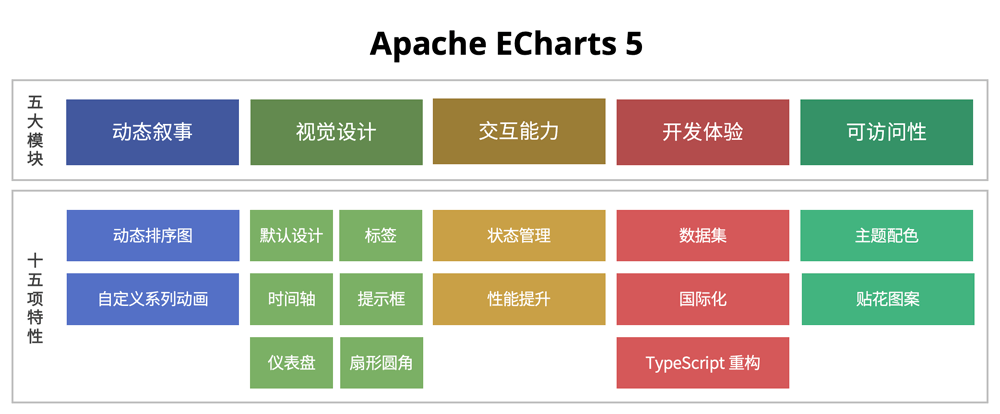

“表·达”是 Apache ECharts 5 的核心，通过五大模块、十五项特性的全面升级，围绕可视化作品的叙事表达能力，让图“表”更能传“达”数据背后的故事，帮助开发者更轻松地创造满足各种场景需求的可视化作品。

## 动态叙事

动画对于人类认知的重要性不言而喻。在之前的作品中，我们会通过初始化动画和过渡动画帮助用户理解数据变换之间的联系，让图表的出现和变换显得不那么生硬。这次，我们更是大幅度增强了我们的动画叙事能力。希望能够进一步发挥动画对于用户认知的帮助作用，借助图表的动态叙事功能，帮助用户更容易理解图表背后表达的故事。

#### 动态排序图

Apache ECharts 5 新增支持动态排序柱状图（bar-racing）以及动态排序折线图（line-racing），帮助开发者方便地创建带有时序性的图表，展现数据随着时间维度上的变化，讲述数据的演变过程。

动态排序图展现了不同的类目随着时间在排名上的衍变。而开发者只需要通过几行简单的配置项就可以在 ECharts 中开启这样的效果。

#### 自定义系列动画

除了动态排序图，Apache ECharts 5 在自定义系列中提供了更加丰富强大的动画效果，支持标签数值文本的插值动画，图形的形变（morph）、分裂（separate）、合并（combine）等效果的过渡动画。

想象一下，用这些动态效果，你可以创造出多么令人称奇的可视化作品！

## 视觉设计

视觉设计的作用并不仅仅是为了让图表更好看，更重要的是，符合可视化原理的设计可以帮用户更快速地理解图表想表达的内容，并且尽可能消除不良设计带来的误解。

#### 默认设计

我们发现，有很大一部分开发者使用了 ECharts 默认的主题样式，因而设计优雅、符合可视化原理的默认主题设计是非常重要的。在 Apache ECharts 5 中，我们重新设计了默认的主题样式，针对不同的系列和组件分别做了优化调整。以主题色为例，我们考量了颜色之间的区分度、与背景色的对比度、相邻颜色的和谐度等因素，并且确保色觉辨识障碍人士也能清楚地区分数据。

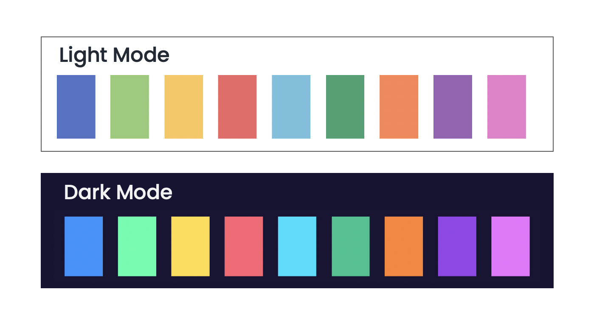

我们以最常用的柱状图为例，来看看新版本浅色主题和深色主题的样式：

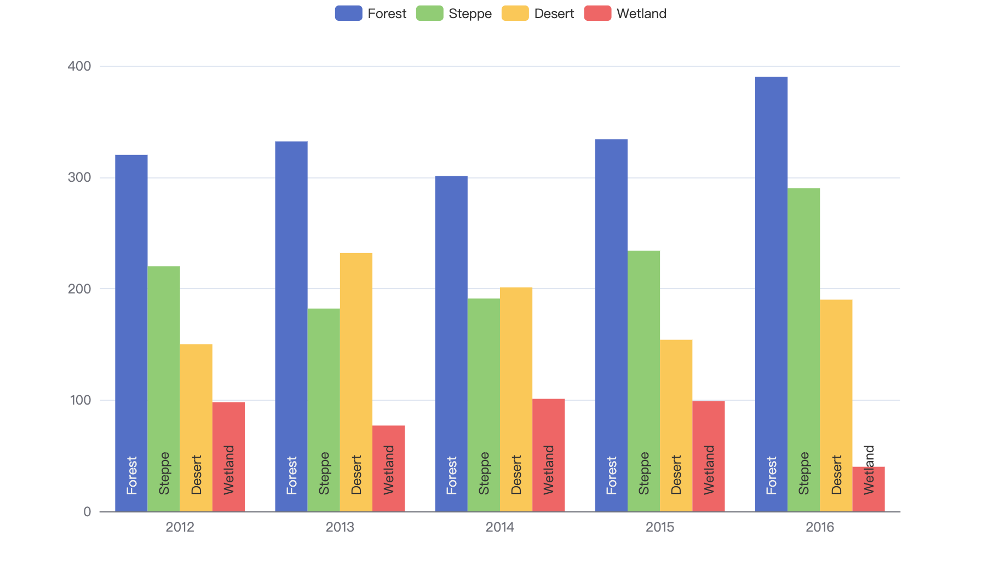 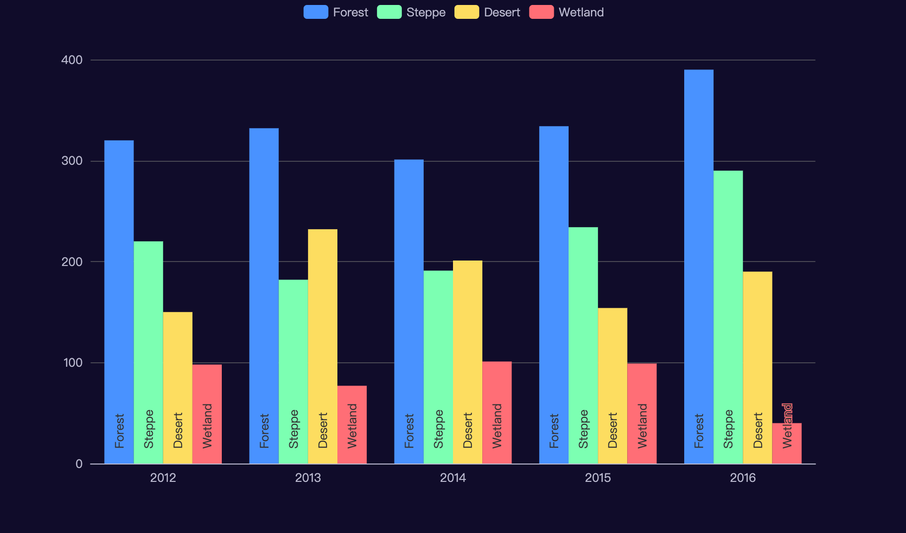

对于数据区域缩放，时间轴等交互组件，我们也设计了全新的样式并且提供了更好的交互体验：


#### 标签

标签是图表中的核心元素之一，清晰而明确的标签可以帮助用户对数据有更准确的理解。Apache ECharts 5 提供了多种新的标签功能，让密集的标签能清晰显示、准确表意。

Apache ECharts 5 可以通过一个配置项开启自动隐藏重叠的标签。对于超出显示区域的标签，可以选择自动截断或者换行。密集的饼图标签，现在有了更美观的自动排布。

这些功能可以帮助避免文字过于密集影响可读性。并且，无需开发者编写额外的代码就能默认生效，大大简化了开发者的开发成本。

我们也提供了多个配置项来让开发者主动控制标签的布局策略，例如标签拖动、整体显示在画布边缘，用引导线和图形元素连接，并且仍可联动高亮表达关联关系。

新的标签功能可以让你在移动端这样局限的空间内也可以有很优雅的标签展示：

 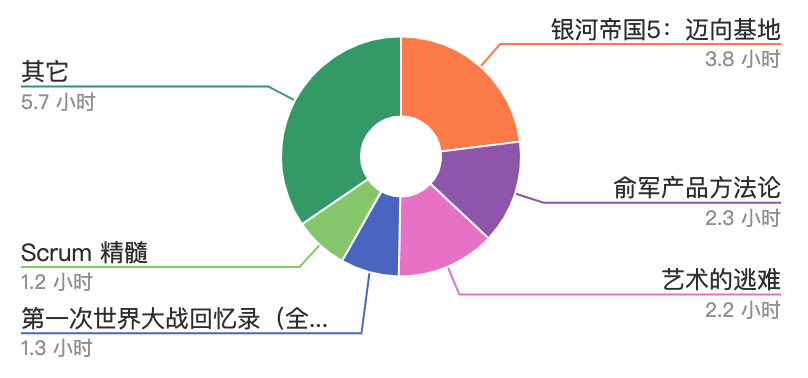

#### 时间轴

Apache ECharts 5 带来了适于表达时间标签刻度的时间轴。时间轴的默认设计更突出重要的信息，并且提供了更灵活的定制化能力，让开发者根据不同的需求定制时间轴的标签内容。

首先，时间轴不再如之前般绝对平均分割，而是选取年、月、日、整点这类更有意义的点来展示，并且能同时显示不同层级的刻度。标签的 `formatter` 支持了时间模版（例如 `{yyyy}-{MM}-{dd}`），并且可以为不同时间粒度的标签指定不同的 `formatter`，结合已有的富文本标签，可以定制出醒目而多样的时间效果。

不同的 dataZoom 粒度下时间刻度的显示：


#### 提示框

提示框（Tooltip）是一种最常用的可视化组件，可以帮助用户交互式地了解数据的详细信息。在 Apache ECharts 5 中，我们对提示框的样式进行了优化，通过对字体样式，颜色的调整，指向图形的箭头，跟随图形颜色的边框色等功能，让提示框的默认展示优雅又清晰。并且改进了富文本的渲染逻辑，确保显示效果与 HTML 方式一致，让用户在不同场景下可以选择不同的技术方案实现同样的效果。

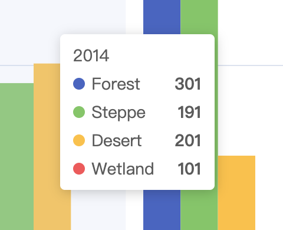 

除此之外，我们这次也加上了提示框内的列表按照数值大小或者类目顺序排序的功能。

#### 仪表盘

我们看到社区用户创建了很多酷炫的仪表盘图表，但是他们的配置方式往往比较复杂而取巧。因此，我们对仪表盘的功能作了全面升级，支持了图片或者矢量路径绘制指针、也支持了锚点（anchor）配置项、进度条（progress）、圆角效果等等配置项。

不同样式的仪表盘指针：

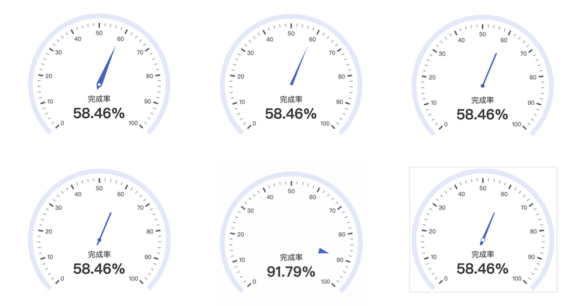

这些升级，不仅可以让开发者用更简单的配置项实现酷炫的效果，而且带来了更丰富的定制能力。

#### 扇形圆角

圆角可以带来更美观而柔和的视觉，也能够赋予更多的创造力。Apache ECharts 5 支持了饼图、旭日图、矩形树图的扇形圆角。可不要小看了简单的圆角配置项，合理地搭配其他的效果，就可以形成更具个性的的可视化作品。

## 交互能力

可视化作品的交互能力帮助用户探索了解作品，加深对于图表主旨的理解。

#### 状态管理

在 ECharts 4 中有高亮（emphasis）和普通（normal）两个交互的状态，在鼠标移到图形上的时候会进入高亮状态以区分该数据，开发者可以分别设置这两个状态的颜色，阴影等样式。

这次在 Apache ECharts 5 中，我们在原先的鼠标 hover 高亮的基础上，新增加了**淡出**其它非相关元素的效果，从而可以达到聚焦目标数据的目的。

比如在这个[柱状图](https://echarts.apache.org/examples/zh/editor.html?c=bar-y-category-stack)的例子中，鼠标移到一个系列上的时候，其它非相关的系列就会淡出，从而可以更清晰的突出聚焦系列中数据的对比。在关系图，树图，旭日图，桑基等更复杂数据结构的图上，也可以通过淡出非相关元素来观察数据之间的联系。而且颜色，阴影等在高亮（emphasis）中可以设置的样式，现在也可以在淡出（blur）状态中设置了。

除此之外，我们为所有系列还添加了**点击选中**这个之前只有在饼图、地图等少数系列中才能开启的交互，开发者可以设置为单选或多选模式，并且通过监听 `selectchanged` 事件获取到选中的所有图形然后进行更进一步的处理。与高亮和淡出一样，选中的样式也可以在 `select` 中配置。

#### 性能提升

##### 脏矩形渲染

Apache ECharts 5 新支持了脏矩形渲染，解决只有局部变化的场景下的性能瓶颈。在使用 Canvas 渲染器时，脏矩形渲染技术探测并只更新视图变化的部分，而不是任何变动都引起画布完全重绘。这能在一些特殊场景下帮助提高渲染帧率，例如在图形很多时候，鼠标频繁触发一些图形高亮的场景。以往这类场景，会使用额外的 Canvas 层以优化性能，但是这种方式不是所有场景都通用，而且对于复杂的样式的效果并不理想。脏矩形渲染很好地同时满足了性能和显示正确。

脏矩形的可视化演示，红色框选部分为该帧重绘区域：


大家在新的示例页面选择开启脏矩形优化就可以看到该效果。

##### 实时时序数据的折线图性能优化

除此之外，海量数据下折线图的性能也有了大幅度的性能提升。我们经常碰到大量的实时时序数据的高性能绘制的需求，这些数据可能需要几百或者几十毫秒更新一次。

Apache ECharts 5 对这些场景下的 CPU 消耗、内存占用、初始化时间都进行了深度的优化，使得百万量级的数据也能做到实时的更新（每次更新耗时少于 30ms），甚至对于千万级的数据，也可以在 1s 内渲染完，并且保持很小的内存占用以及流畅的提示框（tooltip）等交互。

## 开发体验

我们希望如此强大的可视化工具可以被更多开发者以更简单的方式使用，因而开发者的开发体验也是我们非常关注的方面。

#### 数据集

ECharts 5 加强了数据集的数据转换能力，让开发者可以使用简单的方式实现常用的数据处理，如：数据过滤（filter）、排序（sort）、聚合（aggregate）、直方图（histogram）、简单聚类（clustering）、回归线计算（regression）等。开发者可以用统一的声明式方式来使用这些功能，可以方便地实现常用的数据操作。

#### 国际化

ECharts 原有的国际化方案，采用的是根据不同的语言参数打包出不同的部署文件的形式。​这种方式，使动态的语言和静态的代码包绑定在一起，使用的时候只能通过重新加载不同语言版本的 ECharts 代码来达到切换语言的目的。

因此，从 Apache ECharts 5 开始，动态的语言包和静态的代码包分离开。切换语言的时候，只需要加载相应语言包​，通过类似挂载主题的方式，使用 `registerLocale` 函数挂载语言包对象​，重新初始化后就完成了语言的切换​。

```
// import the lang object and set when init​
echarts.registerLocale('DE', lang);​
echarts.init(DomElement, null, {​
   locale: 'DE'​
});
```

#### TypeScript 重构

在近 8 年的时间里，Apache ECharts 已经发展成一个非常复杂的可视化库了，为了可以继续更安全高效地进行重构和新功能的开发，我们在 Apache ECharts 5 的开发之初，使用 TypeScript 对代码进行了重写，TypeScript 所带来的强类型让我们更有信心地在 ECharts 5 开发时对代码进行大刀阔斧的重构以实现更多激动人心的特性。

对于开发者，我们也可以从 TypeScript 代码直接生成更好更符合代码的`DTS`类型描述文件。在此之前，ECharts 的类型描述文件一直是由社区开发者帮我们维护并发布到[DefinityTyped](https://github.com/DefinitelyTyped/DefinitelyTyped/tree/master/types/echarts)，这个有着不小的工作量，非常感谢大家的贡献。

除此之外，如果开发者的组件是按需引入的，我们还提供了一个 `ComposeOption` 类型方法，可以组合出一个只包含了引入组件的配置项类型，可以带来更严格的类型检查，帮助你提前检测到未引入的组件类型。

## 可访问性

Apache ECharts 一直非常重视无障碍设计，我们希望让视觉障碍人士也能平等了解图表传递的信息。并且也希望图表的开发者能以极低的开发成本实现这一点，因而有利于让开发者更愿意为视觉障碍人士提供支持。

在上一个大版本中，我们支持了根据不同的图表类型和数据自动一键智能生成图表描述的功能，帮助开发者非常方便地支持图表的 DOM 描述信息。在 ECharts 5 中，我们也做了更多提高可访问性的设计，帮助视觉障碍人士更好地理解图表内容。

#### 主题配色

我们在设计新版默认主题样式的时候，将无障碍设计作为一个重要的考量依据，对颜色的明度和色值都进行反复测试，帮助视觉辨识障碍用户清楚地识别图表数据。​

并且，针对有更进一步无障碍需求的开发者，我们还提供了特殊的高对比度主题，以更高对比度颜色的主题将数据作进一步区分。

#### 贴花图案

ECharts 5 还新增提供了贴花的功能，用图案辅助颜色表达，进一步帮助用户区分数据。

此外，贴花图案还能在一些其他的场景下提供帮助，比如：在报纸、书籍之类只有单色或者非常少的颜色的印刷品中，帮助更好地区分数据；用图形元素方便用户对数据产生更直观的理解等。

## 小结

除了以上介绍的功能，Apache ECharts 还在非常多的细节中做了改进，帮助开发者更轻松地创建默认好用、配置灵活的图表，用图表讲述数据背后的故事。

感谢所有使用过 ECharts，甚至参与过社区贡献的开发者，正是你们才使得 Apache ECharts 5 成为可能。我们会以更大的热情投入到未来的开发中，Apache ECharts 也会以更大的诚意和大家在 6 相见！

## ECharts 5 升级指南

本指南面向那些希望将 echarts 4.x（以下简称 `v4`）升级到 echarts 5.x（以下简称 `v5`）的用户。大家可以在 [ECharts 5 新特性](tutorial.md#ECharts%205%20新特性) 中了解这次`v5`带来了哪些值得升级的新特性。在绝大多数情况下，开发者用不着为这个升级做什么额外的事，因为 echarts 一直尽可能地保持 API 的稳定和向后兼容。但是，`v5` 仍然带来了一些非兼容改动，需要特别关注。此外，在一些情况下，`v5` 提供了更好的 API 用来取代之前的 API，这些被取代的 API 将不再被推荐使用（当然，我们尽量兼容了这些改动）。我们会在这篇文档里尽量详尽得解释这些改动。

因为我们在 `v5.0.1` 增加了新的[按需引入接口](tutorial.md#%E5%9C%A8%E6%89%93%E5%8C%85%E7%8E%AF%E5%A2%83%E4%B8%AD%E4%BD%BF%E7%94%A8%20ECharts)，所以本文档基于 `v5.0.1` 或者更高的版本。

## 非兼容性改变

#### 默认主题（theme）

首先是默认主题的改动，`v5` 在配色等主题设计上做了很多的优化来达到更好的视觉效果。如果大家依旧想保留旧版本的颜色，可以手动声明颜色，如下：

```
chart.setOption({
    color: [
        '#c23531', '#2f4554', '#61a0a8', '#d48265', '#91c7ae', '#749f83',
        '#ca8622', '#bda29a', '#6e7074', '#546570', '#c4ccd3'
    ],
    // ...
});
```

或者，做一个简单的 `v4` 主题：

```
var themeEC4 = {
    color: [
        '#c23531', '#2f4554', '#61a0a8', '#d48265', '#91c7ae', '#749f83',
        '#ca8622', '#bda29a', '#6e7074', '#546570', '#c4ccd3'
    ]
};
var chart = echarts.init(dom, themeEC4);
chart.setOption(/* ... */);
```

#### 引用 ECharts

##### 去除 default exports 的支持

如果使用者在 `v4` 中这样引用了 echarts：

```
import echarts from 'echarts';
// 或者按需引入
import echarts from 'echarts/lib/echarts';
```

这两种方式，`v5` 中不再支持了。

使用者需要如下更改代码解决这个问题：

```
import * as echarts from 'echarts';
// 按需引入
import * as echarts from 'echarts/lib/echarts';
```

##### 按需引入

在 5.0.1 中，我们引入了新的[按需引入接口](tutorial.md#%E5%9C%A8%E6%89%93%E5%8C%85%E7%8E%AF%E5%A2%83%E4%B8%AD%E4%BD%BF%E7%94%A8%20ECharts)

```
import * as echarts from 'echarts/core';
import { BarChart } from 'echarts/charts';
import { GridComponent } from 'echarts/components';
// 注意，新的接口中默认不再包含 Canvas 渲染器，需要显示引入，如果需要使用 SVG 渲染模式则使用 SVGRenderer
import { CanvasRenderer } from 'echarts/renderers';

echarts.use([BarChart, GridComponent, CanvasRenderer]);
```

如果之前是使用`import 'echarts/lib/chart/bar'`引入，新的接口对应的是`import {BarChart} from 'echarts/charts'`;

为了方便大家了解自己的配置项需要引入哪些模块，我们新的示例编辑页面添加了生成按需引入代码的功能，大家可以在示例编辑页的`完整代码`标签下选中按需引入后查看需要引入的模块以及相关代码。

在大部分情况下，我们都推荐大家尽可能用这套新的按需引入接口，它可以最大程度的利用打包工具 tree-shaking 的能力，并且可以有效解决命名空间冲突的问题而且防止了内部结构的暴露。如果你依旧在使用 CommonJS 的模块写法，之前的方式我们也依旧是支持的：

```
const echarts = require('echarts/lib/echarts');
require('echarts/lib/chart/bar');
require('echarts/lib/component/grid');
```

其次，因为我们的源代码已使用 TypeScript 重写，`v5` 将不再支持从 `echarts/src` 引用文件，需要改为从`echarts/lib`引入。

##### 依赖调整

> 注意：该部分只针对为了保证较小的打包体积而是用按需引入接口的开发者，如果是全量引入的不需要关注

为了保证 tree-shaking 后的体积足够小，我们去除了一些之前会默认被打包进来的依赖。比如前面提到的在使用新的按需引入接口的时候，`CanvasRenderer`将不再被默认引入，这样可以保证只需要使用 SVG 渲染模式的时候不会把不需要的 Canvas 渲染代码也一起打包进来，除此之外，还有下面这些依赖的改动：

*   在使用折线图，柱状图中不再默认引入直角坐标系组件，因此之前使用下面的引入方式
    
    ```
    const echarts = require('echarts/lib/echarts');
    require('echarts/lib/chart/bar');
    require('echarts/lib/chart/line');
    ```
    
    需要再单独引入`grid`组件
    
    ```
    require('echarts/lib/component/grid');
    ```
    

参考 issue：[#14080](https://github.com/apache/echarts/issues/14080), [#13764](https://github.com/apache/echarts/issues/13764)

*   默认不再引入`aria`组件，如果需要的话可以手动引入。
    
    ```
    import { AriaComponent } from 'echarts/components';
    echarts.use(AriaComponent);
    ```
    
    或者：
    
    ```
    require('echarts/lib/component/aria');
    ```
    

#### 去除内置的 geoJSON

`v5` 移除了内置的 geoJSON（原先在 `echarts/map` 文件夹下）。这些 geoJSON 文件本就一直来源于第三方。如果使用者仍然需要他们，可以去从老版本中得到，或者自己寻找更合适的数据然后通过 registerMap 接口注册到 ECharts 中。

#### 浏览器兼容性

`v5` 不再支持 IE8 浏览器。我们不再继续维护和升级之前的 [VML 渲染器](https://github.com/ecomfe/zrender/tree/4.3.2/src/vml) 来着实现 IE8 的兼容。如果使用者确实有很强的需求，那么欢迎提 pull request 来升级 VML 渲染器，或者单独维护一个第三方 VML 渲染器，我们从 `v5.0.1` 开始支持注册独立的渲染器了。

#### ECharts 配置项调整

##### 视觉样式设置的优先级改变

`v5` 对调了 [visualMap 组件](option.md#visualMap) 和 [itemStyle](option-parts/option.series-scatter.md#itemStyle) | [lineStyle](option-parts/option.series-scatter.md#lineStyle) | [areaStyle](option-parts/option.series-scatter.md#areaStyle) 的视觉样式优先级。

具体来说，`v4` 中，[visualMap 组件](option.md#visualMap) 中生成的视觉样式（如，颜色、图形类型、图形尺寸等）的优先级，比开发者在 [itemStyle](option-parts/option.series-scatter.md#itemStyle) | [lineStyle](option-parts/option.series-scatter.md#lineStyle) | [areaStyle](option-parts/option.series-scatter.md#areaStyle) 中设置的样式的优先级高，也就是说如果他们同时设置的话，前者会生效而后者不会生效。这带来了些麻烦：假如使用者在使用 [visualMap 组件](option.md#visualMap) 时，又想针对某个数据项对应的图形，设置 [itemStyle](option-parts/option.series-scatter.md#itemStyle) 样式，则做不到。`v5` 中于是提高了 [itemStyle](option-parts/option.series-scatter.md#itemStyle) | [lineStyle](option-parts/option.series-scatter.md#lineStyle) | [areaStyle](option-parts/option.series-scatter.md#areaStyle) 的优先级，使他们能生效。

在绝大多处情况下，这个变化并不会带来什么影响。但是为保险起见，使用者在升级 `v4` 到 `v5` 时，还是可以检查下，是否有同时使用 [visualMap](option.md#visualMap) 和 [itemStyle](option-parts/option.series-scatter.md#itemStyle) | [lineStyle](option-parts/option.series-scatter.md#lineStyle) | [areaStyle](option-parts/option.series-scatter.md#areaStyle) 的情况。

##### 富文本的 `padding`

`v5` 调整了 [rich.?.padding](option-parts/option.series-scatter.md#label.rich.\<style_name\>.padding) 的格式使其更符合 CSS 的规范。`v4` 里，例如 `rich.?.padding: [11, 22, 33, 44]` 表示 `padding-top` 是 `33` 且 `padding-bottom` 是 `11`。在 `v5` 中调整了上下的位置，`rich.?.padding: [11, 22, 33, 44]` 表示 `padding-top` 是 `11` 且 `padding-bottom` 是 `33`。

如果使用者有在使用 [rich.?.padding](option-parts/option.series-scatter.md#label.rich.\<style_name\>.padding)，需要注意调整下这个顺序。

## ECharts 的相关扩展

如果想要升级到 `v5` ，下面这些扩展需要升级到最新的版本实现兼容。

*   [echarts-gl](https://github.com/ecomfe/echarts-gl)
*   [echarts-wordcloud](https://github.com/ecomfe/echarts-wordcloud)
*   [echarts-liquidfill](https://github.com/ecomfe/echarts-liquidfill)

## 不再推荐使用的 API

一些 API（包括接口调用，事件监听和配置项）在 `v5` 中不再推荐使用。当然，使用者仍然可以用他们，只是会在 dev 模式下，在 console 中打印一些 warning，并不会影响功能。但是从长远维护考虑，我们还是推荐升级成新的 API。

下面是不再推荐使用的 API 以及推荐的新 API：

*   图形元素 transform 相关的属性被改变了：
    *   变更点：
        *   `position: [number, number]` 改为 `x: number` / `y: number`。
        *   `scale: [number, number]` 改为 `scaleX: number` / `scaleY: number`。
        *   `origin: [number, number]` 改为 `originX: number` / `originY: number`。
    *   `position`、`scale` 和 `origin` 仍然支持，但已不推荐使用。
    *   它影响到这些地方：
        *   在`graphic`组件中：每个元素的声明。
        *   在 `custom series` 中：`renderItem` 返回的每个元素的声明。
        *   直接使用 zrender 图形元素时。
*   Text 相关的属性被改变：
    *   变更点：
        *   图形元素附带的文本的声明方式被改变：
            *   除了 `Text` 元素之外，其他元素中的属性 `style.text` 都不推荐使用了。取而代之的是新属性 `textContent` 和 `textConfig`，他们能带来更丰富的功能。
            *   其中，下面左边部分的这些属性已不推荐使用或废弃。请使用下面的右边部分的属性：
                *   textPosition => textConfig.position
                *   textOffset => textConfig.offset
                *   textRotation => textConfig.rotation
                *   textDistance => textConfig.distance
        *   下面左边部分的属性在 `style` 和 `style.rich.?` 中已不推荐使用或废弃。请使用下面右边的属性：
            *   textFill => fill
            *   textStroke => stroke
            *   textFont => font
            *   textStrokeWidth => lineWidth
            *   textAlign => align
            *   textVerticalAlign => verticalAlign
            *   textLineHeight =>
            *   textWidth => width
            *   textHeight => hight
            *   textBackgroundColor => backgroundColor
            *   textPadding => padding
            *   textBorderColor => borderColor
            *   textBorderWidth => borderWidth
            *   textBorderRadius => borderRadius
            *   textBoxShadowColor => shadowColor
            *   textBoxShadowBlur => shadowBlur
            *   textBoxShadowOffsetX => shadowOffsetX
            *   textBoxShadowOffsetY => shadowOffsetY
        *   注：这些属性并没有变化：
            *   textShadowColor
            *   textShadowBlur
            *   textShadowOffsetX
            *   textShadowOffsetY
    *   它影响到这些地方：
        *   在 `graphic` 组件中：每个元素的声明。（原来的写法仍兼容，但在一些很复杂的情况下，可能效果不完全一致。）
        *   在自定义系列（`custom series`）中：`renderItem` 返回中的每个元素的声明。（原来的写法仍兼容，但在一些很复杂的情况下，可能效果不完全一致。）
        *   直接使用 zrender API 创建图形元素。（不再兼容，原写法被废弃。）
*   图表实例上的 API：
    *   `chart.one(...)` 已不推荐使用。
*   `label`。
    *   属性 `color`、`textBorderColor`、`backgroundColor`、`borderColor` 中，值 `auto` 已不推荐使用，而推荐使用 `'inherit'` 代替。
*   `hoverAnimation`:
    *   选项 `series.hoverAnimation` 已不推荐使用，使用 `series.emphasis.scale` 代替之。
*   折线图（`line series`）：
    *   选项 `series.clipOverflow` 已不推荐使用，使用 `series.clip` 代替之。
*   自定义系列（`custom series`）。
    *   在 `renderItem` 中，`api.style(...)` 和 `api.styleEmphasis(...)` 已不推荐使用。因为这两个接口其实并不真正必要，也很难保证向后兼容。用户可以通过 `api.visual(...)` 获取系统自动分配的视觉信息。
*   旭日图（`sunburst`）：
    *   动作类型 `highlight` 已被弃用，请使用 `sunburstHighlight` 代替。
    *   动作类型 `downplay` 已被弃用，请使用 `sunburstUnhighlight` 代替。
    *   选项 `series.downplay` 已被弃用，请使用 `series.blur` 代替。
    *   选项 `series.highlightPolicy` 已不适用，请使用 `series.emphasis.focus` 代替。
*   饼图（`pie`）：
    *   下面左边部分的 action 名已经不推荐使用。请使用右边的 action 名。
        *   `pieToggleSelect` => `toggleSelect`。
        *   `pieSelect` => `select`。
        *   `pieUnSelect` => `unselect`。
    *   下面左边部分的事件名已经不推荐使用。请使用右边的事件名。
        *   `pieselectchanged` => `selectchanged`。
        *   `pieselected` => `selected`。
        *   `pieunselected` => `unselected`。
    *   选项 `series.label.margin` 已经不推荐使用。使用 `series.label.edgeDistance` 代替。
    *   选项 `series.clockWise` 已经不推荐使用。使用 `series.clockwise` 代替。
    *   选项 `series.hoverOffset` 已经不推荐使用。使用 `series.emphasis.scaleSize` 代替。
*   地图（`map series`）：
    *   下文左边部分的 action 名已经不推荐使用。请使用右边的 action 名。
        *   `mapToggleSelect` => `toggleSelect`。
        *   `mapSelect` => `select`。
        *   `mapUnSelect` => `unselect`。
    *   下面左边部分的事件名已经不推荐使用。请使用右边的事件名。
        *   `mapselectchanged` => `selectchanged`。
        *   `mapselected` => `selected`。
        *   `mapunselected` => `unselected`。
    *   选项 `series.mapType` 已经不推荐使用。使用 `series.map` 代替。
    *   选项 `series.mapLocation` 已经不推荐使用。
*   关系图（`graph series`）：
    *   选项 `series.focusNodeAdjacency` 已经不推荐使用。使用 `series.emphasis: { focus: 'adjacency'}` 代替。
*   仪表盘（`gauge series`）：
    *   选项 `series.clockWise` 已经不推荐使用。使用 `series.clockwise` 代替。
    *   选项 `series.hoverOffset` 已经不推荐使用。使用 `series.emphasis.scaleSize` 代替。
*   `dataZoom` 组件：
    *   选项 `dataZoom.handleIcon` 如果使用 `SVGPath`，需要前缀 `path://`。
*   雷达图（`radar`）：
    *   选项 `radar.name` 已经不推荐使用。使用 `radar.axisName` 代替。
    *   选项 `radar.nameGap` 已经不推荐使用。使用 `radar.axisNameGap` 代替。
*   Parse and format：
    *   `echarts.format.formatTime` 已经不推荐使用。使用 `echarts.time.format` 代替。
    *   `echarts.number.parseDate` 已经不推荐使用。使用 `echarts.time.parse` 代替。
    *   `echarts.format.getTextRect` 已经不推荐使用。

## 在打包环境中使用 ECharts

假如你的开发环境使用了`npm`或者`yarn`等包管理工具，并且使用 Webpack 等打包工具进行构建，本文将会介绍如何引入 Apache EChartsTM 并通过 treeshaking 只打包需要的模块。

## NPM 安装 ECharts

你可以使用如下命令通过 npm 安装 ECharts

```
npm install echarts --save
```

## 引入 ECharts

```
import * as echarts from 'echarts';

// 基于准备好的dom，初始化echarts实例
var myChart = echarts.init(document.getElementById('main'));
// 绘制图表
myChart.setOption({
    title: {
        text: 'ECharts 入门示例'
    },
    tooltip: {},
    xAxis: {
        data: ['衬衫', '羊毛衫', '雪纺衫', '裤子', '高跟鞋', '袜子']
    },
    yAxis: {},
    series: [{
        name: '销量',
        type: 'bar',
        data: [5, 20, 36, 10, 10, 20]
    }]
});
```

## 按需引入 ECharts 图表和组件

上面的代码会引入所有 ECharts 中所有的图表和组件，但是假如你不想引入所有组件，也可以使用 ECharts 提供的按需引入的接口来打包必须的组件。

```
// 引入 echarts 核心模块，核心模块提供了 echarts 使用必须要的接口。
import * as echarts from 'echarts/core';
// 引入柱状图图表，图表后缀都为 Chart
import {
    BarChart
} from 'echarts/charts';
// 引入提示框，标题，直角坐标系组件，组件后缀都为 Component
import {
    TitleComponent,
    TooltipComponent,
    GridComponent
} from 'echarts/components';
// 引入 Canvas 渲染器，注意引入 CanvasRenderer 或者 SVGRenderer 是必须的一步
import {
    CanvasRenderer
} from 'echarts/renderers';

// 注册必须的组件
echarts.use(
    [TitleComponent, TooltipComponent, GridComponent, BarChart, CanvasRenderer]
);

// 接下来的使用就跟之前一样，初始化图表，设置配置项
var myChart = echarts.init(document.getElementById('main'));
myChart.setOption({
    ...
});
```

> 需要注意的是注意为了保证打包的体积是最小的，ECharts 按需引入的时候不再提供任何渲染器，所以需要选择引入`CanvasRenderer`或者`SVGRenderer`作为渲染器。这样的好处是假如你只需要使用 svg 渲染模式，打包的结果中就不会再包含无需使用的`CanvasRenderer`模块。

我们在示例编辑页的“完整代码”标签提供了非常方便的生成按需引入代码的功能。这个功能会根据当前的配置项动态生成最小的按需引入的代码。你可以直接在你的项目中使用。

## 在 TypeScript 中按需引入

对于使用了 TypeScript 来开发 ECharts 的开发者，我们提供了类型接口来组合出最小的`EChartsOption`类型。这个更严格的类型可以有效帮助你检查出是否少加载了组件或者图表。

```
import * as echarts from 'echarts/core';
import {
    BarChart,
    // 系列类型的定义后缀都为 SeriesOption
    BarSeriesOption,
    LineChart,
    LineSeriesOption
} from 'echarts/charts';
import {
    TitleComponent,
    // 组件类型的定义后缀都为 ComponentOption
    TitleComponentOption,
    GridComponent,
    GridComponentOption
} from 'echarts/components';
import {
    CanvasRenderer
} from 'echarts/renderers';

// 通过 ComposeOption 来组合出一个只有必须组件和图表的 Option 类型
type ECOption = echarts.ComposeOption<
  BarSeriesOption | LineSeriesOption | TitleComponentOption | GridComponentOption
>;

// 注册必须的组件
echarts.use(
    [TitleComponent, TooltipComponent, GridComponent, BarChart, CanvasRenderer]
);

var option: ECOption = {
    ...
}
```

## ECharts 基础概念概览

本文介绍 Apache EChartsTM 最基本的名词和概念。

## echarts 实例

一个网页中可以创建多个 `echarts 实例`。每个 `echarts 实例` 中可以创建多个图表和坐标系等等（用 `option` 来描述）。准备一个 DOM 节点（作为 echarts 的渲染容器），就可以在上面创建一个 echarts 实例。每个 echarts 实例独占一个 DOM 节点。

  

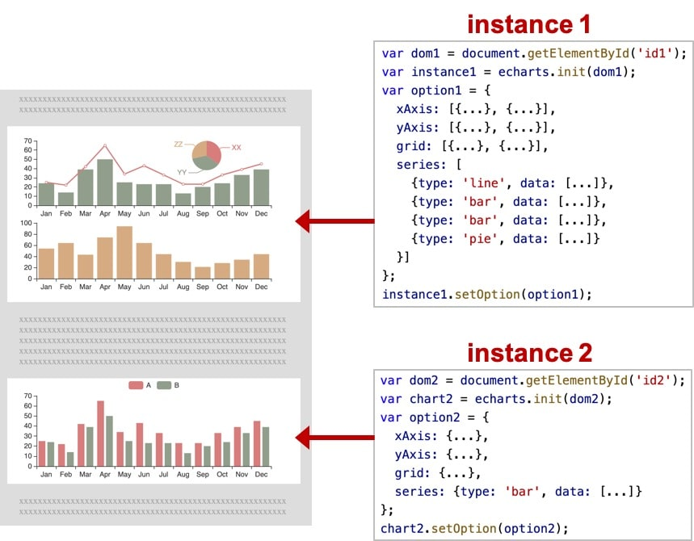

## 系列（series）

`系列`（[series](option.md#series)）是很常见的名词。在 echarts 里，`系列`（[series](option.md#series)）是指：一组数值以及他们映射成的图。“系列”这个词原本可能来源于“一系列的数据”，而在 echarts 中取其扩展的概念，不仅表示数据，也表示数据映射成为的图。所以，一个 `系列` 包含的要素至少有：一组数值、图表类型（`series.type`）、以及其他的关于这些数据如何映射成图的参数。

echarts 里系列类型（`series.type`）就是图表类型。系列类型（`series.type`）至少有：[line](option-parts/option.series-line.md)（折线图）、[bar](option-parts/option.series-bar.md)（柱状图）、[pie](option-parts/option.series-pie.md)（饼图）、[scatter](option-parts/option.series-scatter.md)（散点图）、[graph](option-parts/option.series-graph.md)（关系图）、[tree](option-parts/option.series-tree.md)（树图）、...

如下图，右侧的 `option` 中声明了三个 `系列`（[series](option.md#series)）：[pie](option-parts/option.series-pie.md)（饼图系列）、[line](option-parts/option.series-line.md)（折线图系列）、[bar](option-parts/option.series-bar.md)（柱状图系列），每个系列中有他所需要的数据（[series.data](option.md#series.data)）。

  

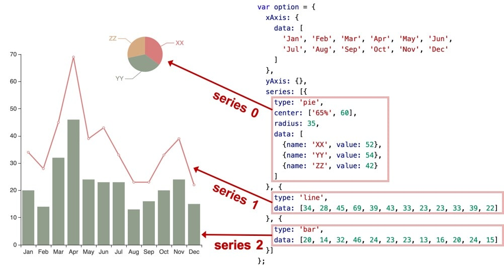

  

类同地，下图中是另一种配置方式，系列的数据从 [dataset](option-parts/option.dataset.md) 中取：

  

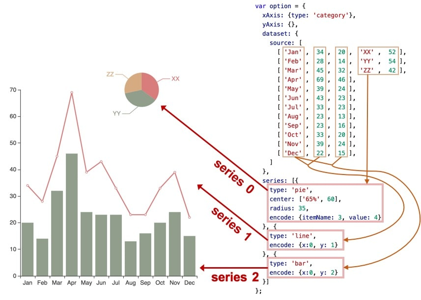

## 组件（component）

在系列之上，echarts 中各种内容，被抽象为“组件”。例如，echarts 中至少有这些组件：[xAxis](option-parts/option.xAxis.md)（直角坐标系 X 轴）、[yAxis](option-parts/option.yAxis.md)（直角坐标系 Y 轴）、[grid](option-parts/option.grid.md)（直角坐标系底板）、[angleAxis](option-parts/option.angleAxis.md)（极坐标系角度轴）、[radiusAxis](option-parts/option.radiusAxis.md)（极坐标系半径轴）、[polar](option-parts/option.polar.md)（极坐标系底板）、[geo](option-parts/option.geo.md)（地理坐标系）、[dataZoom](option.md#dataZoom)（数据区缩放组件）、[visualMap](option.md#visualMap)（视觉映射组件）、[tooltip](option-parts/option.tooltip.md)（提示框组件）、[toolbox](option-parts/option.toolbox.md)（工具栏组件）、[series](option.md#series)（系列）、...

我们注意到，其实系列（[series](option.md#series)）也是一种组件，可以理解为：系列是专门绘制“图”的组件。

如下图，右侧的 `option` 中声明了各个组件（包括系列），各个组件就出现在图中。

  

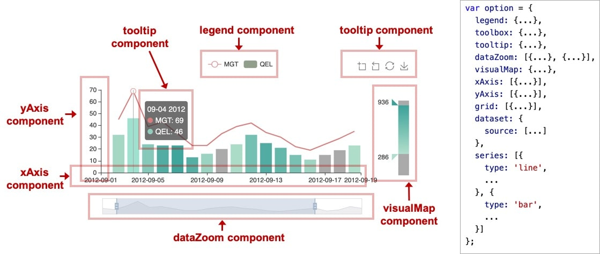

  

注：因为系列是一种特殊的组件，所以有时候也会出现 “组件和系列” 这样的描述，这种语境下的 “组件” 是指：除了 “系列” 以外的其他组件。

## 用 option 描述图表

上面已经出现了 `option` 这个概念。echarts 的使用者，使用 `option` 来描述其对图表的各种需求，包括：有什么数据、要画什么图表、图表长什么样子、含有什么组件、组件能操作什么事情等等。简而言之，`option` 表述了：`数据`、`数据如何映射成图形`、`交互行为`。

```
// 创建 echarts 实例。
var dom = document.getElementById('dom-id');
var chart = echarts.init(dom);

// 用 option 描述 `数据`、`数据如何映射成图形`、`交互行为` 等。
// option 是个大的 JavaScript 对象。
var option = {
    // option 每个属性是一类组件。
    legend: {...},
    grid: {...},
    tooltip: {...},
    toolbox: {...},
    dataZoom: {...},
    visualMap: {...},
    // 如果有多个同类组件，那么就是个数组。例如这里有三个 X 轴。
    xAxis: [
        // 数组每项表示一个组件实例，用 type 描述“子类型”。
        {type: 'category', ...},
        {type: 'category', ...},
        {type: 'value', ...}
    ],
    yAxis: [{...}, {...}],
    // 这里有多个系列，也是构成一个数组。
    series: [
        // 每个系列，也有 type 描述“子类型”，即“图表类型”。
        {type: 'line', data: [['AA', 332], ['CC', 124], ['FF', 412], ... ]},
        {type: 'line', data: [2231, 1234, 552, ... ]},
        {type: 'line', data: [[4, 51], [8, 12], ... ]}
    }]
};

// 调用 setOption 将 option 输入 echarts，然后 echarts 渲染图表。
chart.setOption(option);
```

系列里的 [series.data](option.md#series.data) 是本系列的数据。而另一种描述方式，系列数据从 [dataset](option-parts/option.dataset.md) 中取：

```
var option = {
    dataset: {
        source: [
            [121, 'XX', 442, 43.11],
            [663, 'ZZ', 311, 91.14],
            [913, 'ZZ', 312, 92.12],
            ...
        ]
    },
    xAxis: {},
    yAxis: {},
    series: [
        // 数据从 dataset 中取，encode 中的数值是 dataset.source 的维度 index （即第几列）
        {type: 'bar', encode: {x: 1, y: 0}},
        {type: 'bar', encode: {x: 1, y: 2}},
        {type: 'scatter', encode: {x: 1, y: 3}},
        ...
    ]
};
```

## 组件的定位

不同的组件、系列，常有不同的定位方式。

  

**\[类 CSS 的绝对定位\]**

  

多数组件和系列，都能够基于 `top` / `right` / `down` / `left` / `width` / `height` 绝对定位。 这种绝对定位的方式，类似于 `CSS` 的绝对定位（`position: absolute`）。绝对定位基于的是 echarts 容器 DOM 节点。

其中，他们每个值都可以是：

*   绝对数值（例如 `bottom: 54` 表示：距离 echarts 容器底边界 `54` 像素）。
*   或者基于 echarts 容器高宽的百分比（例如 `right: '20%'` 表示：距离 echarts 容器右边界的距离是 echarts 容器宽度的 `20%`）。

如下图的例子，对 [grid](option-parts/option.grid.md) 组件（也就是直角坐标系的底板）设置 `left`、`right`、`height`、`bottom` 达到的效果。

  

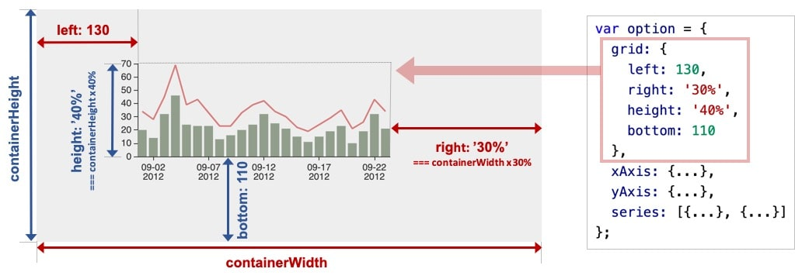

  

我们可以注意到，`left` `right` `width` 是一组（横向）、`top` `bottom` `height` 是另一组（纵向）。这两组没有什么关联。每组中，至多设置两项就可以了，第三项会被自动算出。例如，设置了 `left` 和 `right` 就可以了，`width` 会被自动算出。

  

**\[中心半径定位\]**

  

少数圆形的组件或系列，可以使用“中心半径定位”，例如，[pie](option-parts/option.series-pie.md)（饼图）、[sunburst](option-parts/option.series-sunburst.md)（旭日图）、[polar](option-parts/option.polar.md)（极坐标系）。

中心半径定位，往往依据 [center](option-parts/option.series-pie.md#center)（中心）、[radius](option-parts/option.series-pie.md#radius)（半径）来决定位置。

  

**\[其他定位\]**

  

少数组件和系列可能有自己的特殊的定位方式。在他们的文档中会有说明。

## 坐标系

很多系列，例如 [line](option-parts/option.series-line.md)（折线图）、[bar](option-parts/option.series-bar.md)（柱状图）、[scatter](option-parts/option.series-scatter.md)（散点图）、[heatmap](option-parts/option.series-heatmap.md)（热力图）等等，需要运行在 “坐标系” 上。坐标系用于布局这些图，以及显示数据的刻度等等。例如 echarts 中至少支持这些坐标系：[直角坐标系](option-parts/option.grid.md)、[极坐标系](option-parts/option.polar.md)、[地理坐标系（GEO）](option-parts/option.geo.md)、[单轴坐标系](option-parts/option.singleAxis.md)、[日历坐标系](option-parts/option.calendar.md) 等。其他一些系列，例如 [pie](option-parts/option.series-pie.md)（饼图）、[tree](option-parts/option.series-tree.md)（树图）等等，并不依赖坐标系，能独立存在。还有一些图，例如 [graph](option-parts/option.series-graph.md)（关系图）等，既能独立存在，也能布局在坐标系中，依据用户的设定而来。

一个坐标系，可能由多个组件协作而成。我们以最常见的直角坐标系来举例。直角坐标系中，包括有 [xAxis](option-parts/option.xAxis.md)（直角坐标系 X 轴）、[yAxis](option-parts/option.yAxis.md)（直角坐标系 Y 轴）、[grid](option-parts/option.grid.md)（直角坐标系底板）三种组件。`xAxis`、`yAxis` 被 `grid` 自动引用并组织起来，共同工作。

我们来看下图，这是最简单的使用直角坐标系的方式：只声明了 `xAxis`、`yAxis` 和一个 `scatter`（散点图系列），echarts 暗自为他们创建了 `grid` 并关联起他们：

  

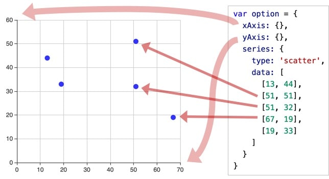

  

再来看下图，两个 `yAxis`，共享了一个 `xAxis`。两个 `series`，也共享了这个 `xAxis`，但是分别使用不同的 `yAxis`，使用 [yAxisIndex](option-parts/option.series-line.md#yAxisIndex) 来指定它自己使用的是哪个 `yAxis`：

  

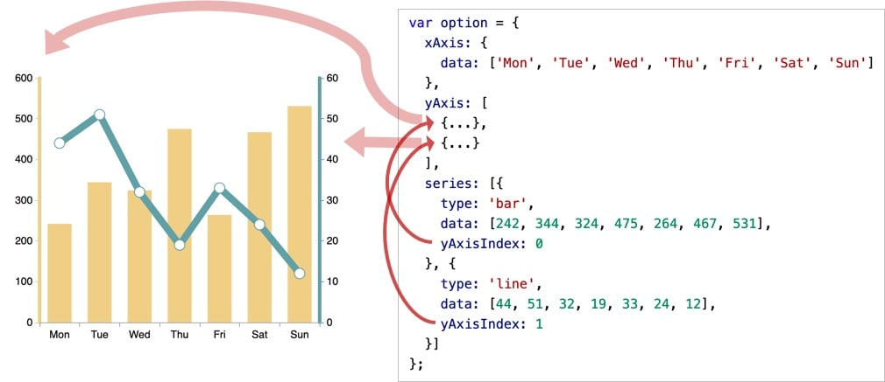

  

再来看下图，一个 echarts 实例中，有多个 `grid`，每个 `grid` 分别有 `xAxis`、`yAxis`，他们使用 `xAxisIndex`、`yAxisIndex`、`gridIndex` 来指定引用关系：

  


  

另外，一个系列，往往能运行在不同的坐标系中。例如，一个 [scatter](option-parts/option.series-scatter.md)（散点图）能运行在 [直角坐标系](option-parts/option.grid.md)、[极坐标系](option-parts/option.polar.md) 、[地理坐标系（GEO）](option-parts/option.geo.md) 等各种坐标系中。同样，一个坐标系，也能承载不同的系列，如上面出现的各种例子，[直角坐标系](option-parts/option.grid.md) 里承载了 [line](option-parts/option.series-line.md)（折线图）、[bar](option-parts/option.series-bar.md)（柱状图）等等。

## 个性化图表的样式

Apache EChartsTM 提供了丰富的自定义配置选项，并且能够从全局、系列、数据三个层级去设置数据图形的样式。下面我们来看如何使用 ECharts 实现下面这个南丁格尔图：

## 绘制南丁格尔图

[5分钟上手ECharts](tutorial.md#5%20%E5%88%86%E9%92%9F%E4%B8%8A%E6%89%8B%20ECharts) 中讲了如何绘制一个简单的柱状图，这次要画的是饼图，饼图主要是通过扇形的弧度表现不同类目的数据在总和中的占比，它的数据格式比柱状图更简单，只有一维的数值，不需要给类目。因为不在直角坐标系上，所以也不需要`xAxis`，`yAxis`。

```
myChart.setOption({
    series : [
        {
            name: '访问来源',
            type: 'pie',
            radius: '55%',
            data:[
                {value:235, name:'视频广告'},
                {value:274, name:'联盟广告'},
                {value:310, name:'邮件营销'},
                {value:335, name:'直接访问'},
                {value:400, name:'搜索引擎'}
            ]
        }
    ]
})
```

上面代码就能画出一个简单的饼图：

这里`data`属性值不像入门教程里那样每一项都是单个数值，而是一个包含 `name` 和 `value` 属性的对象，ECharts 中的数据项都是既可以只设成数值，也可以设成一个包含有名称、该数据图形的样式配置、标签配置的对象，具体见 [data](option-parts/option.series-pie.md#data) 文档。

ECharts 中的[饼图](option-parts/option.series-pie.md)也支持通过设置 [roseType](option-parts/option.series-pie.md#roseType) 显示成南丁格尔图。

```
roseType: 'angle'
```

南丁格尔图会通过半径表示数据的大小。

## 阴影的配置

ECharts 中有一些通用的样式，诸如阴影、透明度、颜色、边框颜色、边框宽度等，这些样式一般都会在系列的 [itemStyle](tutorial.md#series-pie.itemStyle) 里设置。例如阴影的样式可以通过下面几个配置项设置：

```
itemStyle: {
    // 阴影的大小
    shadowBlur: 200,
    // 阴影水平方向上的偏移
    shadowOffsetX: 0,
    // 阴影垂直方向上的偏移
    shadowOffsetY: 0,
    // 阴影颜色
    shadowColor: 'rgba(0, 0, 0, 0.5)'
}
```

加上阴影后的效果：

`itemStyle`的`emphasis`是鼠标 hover 时候的高亮样式。这个示例里是正常的样式下加阴影，但是可能更多的时候是 hover 的时候通过阴影突出。

```
itemStyle: {
    emphasis: {
        shadowBlur: 200,
        shadowColor: 'rgba(0, 0, 0, 0.5)'
    }
}
```

## 深色背景和浅色标签

现在我们需要把整个主题改成开始的示例中那样的深色主题，这就需要改背景色和文本颜色。

背景色是全局的，所以直接在 option 下设置 [backgroundColor](option.md#backgroundColor)

```
setOption({
    backgroundColor: '#2c343c'
})
```

文本的样式可以设置全局的 [textStyle](option-parts/option.textStyle.md)。

```
setOption({
    textStyle: {
        color: 'rgba(255, 255, 255, 0.3)'
    }
})
```

也可以每个系列分别设置，每个系列的文本设置在 [label.textStyle](option-parts/option.series-pie.md#label.textStyle)。

```
label: {
    textStyle: {
        color: 'rgba(255, 255, 255, 0.3)'
    }
}
```

饼图的话还要将标签的视觉引导线的颜色设为浅色。

```
labelLine: {
    lineStyle: {
        color: 'rgba(255, 255, 255, 0.3)'
    }
}
```

如下：

跟`itemStyle`一样，`label`和`labelLine`的样式也有`emphasis`状态。

## 设置扇形的颜色

扇形的颜色也是在 itemStyle 中设置：

```
itemStyle: {
    // 设置扇形的颜色
    color: '#c23531',
    shadowBlur: 200,
    shadowColor: 'rgba(0, 0, 0, 0.5)'
}
```

跟我们要实现的效果已经挺像了，除了每个扇形的颜色，效果中阴影下面的扇形颜色更深，有种光线被遮住的感觉，从而会出现层次感和空间感。

ECharts 中每个扇形颜色的可以通过分别设置 data 下的数据项实现。

```
data: [{
    value:400,
    name:'搜索引擎',
    itemStyle: {
        color: '#c23531'
    }
}, ...]
```

但是这次因为只有明暗度的变化，所以有一种更快捷的方式是通过 [visualMap](option.md#visualMap) 组件将数值的大小映射到明暗度。

```
visualMap: {
    // 不显示 visualMap 组件，只用于明暗度的映射
    show: false,
    // 映射的最小值为 80
    min: 80,
    // 映射的最大值为 600
    max: 600,
    inRange: {
        // 明暗度的范围是 0 到 1
        colorLightness: [0, 1]
    }
}
```

最终效果：

## ECharts 中的样式简介

本文主要是大略概述，用哪些方法，可以在 Apache EChartsTM 中设置样式，改变图形元素或者文字的颜色、明暗、大小等。

> 之所以用“样式”这种可能不很符合数据可视化思维的词，是因为，比较通俗易懂。

本文介绍这几种方式，他们的功能范畴可能会有交叉（即同一种细节的效果可能可以用不同的方式实现），但是他们各有各的场景偏好。

*   颜色主题（Theme）
*   调色盘
*   直接样式设置（itemStyle、lineStyle、areaStyle、label、...）
*   视觉映射（visualMap）

其他关于样式的文章，参见：[个性化图表的样式](tutorial.md#%E4%B8%AA%E6%80%A7%E5%8C%96%E5%9B%BE%E8%A1%A8%E7%9A%84%E6%A0%B7%E5%BC%8F)，[数据的视觉映射](tutorial.md#%E6%95%B0%E6%8D%AE%E7%9A%84%E8%A7%86%E8%A7%89%E6%98%A0%E5%B0%84)。

## 颜色主题（Theme）

最简单的更改全局样式的方式，是直接采用颜色主题（theme）。例如，在 [示例集合](https://echarts.apache.org/examples/zh/index.html) 中，可以选择 “Theme”，直接看到采用主题的效果。

ECharts4 开始，除了一贯的默认主题外，新内置了两套主题，分别为 `'light'` 和 `'dark'`。可以这么来使用它们：

```
var chart = echarts.init(dom, 'light');
```

或者

```
var chart = echarts.init(dom, 'dark');
```

其他的主题，没有内置在 ECharts 中，需要自己加载。这些主题可以在 [主题编辑器](https://echarts.apache.org/zh/theme-builder.html) 里访问到。也可以使用这个主题编辑器，自己编辑主题。下载下来的主题可以这样使用：

如果主题保存为 JSON 文件，那么可以自行加载和注册，例如：

```
// 假设主题名称是 "vintage"
$.getJSON('xxx/xxx/vintage.json', function (themeJSON) {
    echarts.registerTheme('vintage', JSON.parse(themeJSON))
    var chart = echarts.init(dom, 'vintage');
});
```

如果保存为 UMD 格式的 JS 文件，那么支持了自注册，直接引入 JS 文件即可：

```
// HTML 引入 vintage.js 文件后（假设主题名称是 "vintage"）
var chart = echarts.init(dom, 'vintage');
// ...
```

## 调色盘

调色盘，可以在 option 中设置。它给定了一组颜色，图形、系列会自动从其中选择颜色。 可以设置全局的调色盘，也可以设置系列自己专属的调色盘。

```
option = {
    // 全局调色盘。
    color: ['#c23531','#2f4554', '#61a0a8', '#d48265', '#91c7ae','#749f83',  '#ca8622', '#bda29a','#6e7074', '#546570', '#c4ccd3'],

    series: [{
        type: 'bar',
        // 此系列自己的调色盘。
        color: ['#dd6b66','#759aa0','#e69d87','#8dc1a9','#ea7e53','#eedd78','#73a373','#73b9bc','#7289ab', '#91ca8c','#f49f42'],
        ...
    }, {
        type: 'pie',
        // 此系列自己的调色盘。
        color: ['#37A2DA', '#32C5E9', '#67E0E3', '#9FE6B8', '#FFDB5C','#ff9f7f', '#fb7293', '#E062AE', '#E690D1', '#e7bcf3', '#9d96f5', '#8378EA', '#96BFFF'],
        ...
    }]
}
```

## 直接的样式设置 itemStyle, lineStyle, areaStyle, label, ...

直接的样式设置是比较常用设置方式。纵观 ECharts 的 [option](option.html) 中，很多地方可以设置 [itemStyle](option.md#series.itemStyle)、[lineStyle](option-parts/option.series-line.md#lineStyle)、[areaStyle](option-parts/option.series-line.md#areaStyle)、[label](option.md#series.label) 等等。这些的地方可以直接设置图形元素的颜色、线宽、点的大小、标签的文字、标签的样式等等。

一般来说，ECharts 的各个系列和组件，都遵从这些命名习惯，虽然不同图表和组件中，`itemStyle`、`label` 等可能出现在不同的地方。

直接样式设置的另一篇介绍，参见 [个性化图表的样式](tutorial.md#%E4%B8%AA%E6%80%A7%E5%8C%96%E5%9B%BE%E8%A1%A8%E7%9A%84%E6%A0%B7%E5%BC%8F)。

## 高亮的样式：emphasis

在鼠标悬浮到图形元素上时，一般会出现高亮的样式。默认情况下，高亮的样式是根据普通样式自动生成的。但是高亮的样式也可以自己定义，主要是通过 [emphasis](option-parts/option.series-scatter.md#emphasis) 属性来定制。[emphasis](option-parts/option.series-scatter.md#emphasis) 中的结构，和普通样式的结构相同，例如：

```
option = {
    series: {
        type: 'scatter',

        // 普通样式。
        itemStyle: {
            // 点的颜色。
            color: 'red'
        },
        label: {
            show: true,
            // 标签的文字。
            formatter: 'This is a normal label.'
        },

        // 高亮样式。
        emphasis: {
            itemStyle: {
                // 高亮时点的颜色。
                color: 'blue'
            },
            label: {
                show: true,
                // 高亮时标签的文字。
                formatter: 'This is a emphasis label.'
            }
        }
    }
}
```

注意：在 ECharts4 以前，高亮和普通样式的写法，是这样的：

```
option = {
    series: {
        type: 'scatter',

        itemStyle: {
            // 普通样式。
            normal: {
                // 点的颜色。
                color: 'red'
            },
            // 高亮样式。
            emphasis: {
                // 高亮时点的颜色。
                color: 'blue'
            }
        },

        label: {
            // 普通样式。
            normal: {
                show: true,
                // 标签的文字。
                formatter: 'This is a normal label.'
            },
            // 高亮样式。
            emphasis: {
                show: true,
                // 高亮时标签的文字。
                formatter: 'This is a emphasis label.'
            }
        }
    }
}
```

这种写法 **仍然被兼容**，但是，不再推荐。事实上，多数情况下，使用者只会配置普通状态下的样式，而使用默认的高亮样式。所以在 ECharts4 中，支持不写 `normal` 的配置方法（即本文开头的那种写法），使得配置项更扁平简单。

## 通过 visualMap 组件设定样式

[visualMap 组件](option.md#visualMap) 能指定数据到颜色、图形尺寸的映射规则，详见 [数据的视觉映射](tutorial.md#%E6%95%B0%E6%8D%AE%E7%9A%84%E8%A7%86%E8%A7%89%E6%98%A0%E5%B0%84)。

## 异步数据加载和更新

## 异步加载

[入门示例](tutorial.md#getting-started)中的数据是在初始化后 `setOption` 中直接填入的，但是很多时候可能数据需要异步加载后再填入。Apache EChartsTM 中实现异步数据的更新非常简单，在图表初始化后不管任何时候只要通过 jQuery 等工具异步获取数据后通过 `setOption` 填入数据和配置项就行。

```
var myChart = echarts.init(document.getElementById('main'));

$.get('data.json').done(function (data) {
    myChart.setOption({
        title: {
            text: '异步数据加载示例'
        },
        tooltip: {},
        legend: {
            data:['销量']
        },
        xAxis: {
            data: data.categories
        },
        yAxis: {},
        series: [{
            name: '销量',
            type: 'bar',
            data: data.data
        }]
    });
});
```

或者先设置完其它的样式，显示一个空的直角坐标轴，然后获取数据后填入数据。

```
var myChart = echarts.init(document.getElementById('main'));
// 显示标题，图例和空的坐标轴
myChart.setOption({
    title: {
        text: '异步数据加载示例'
    },
    tooltip: {},
    legend: {
        data:['销量']
    },
    xAxis: {
        data: []
    },
    yAxis: {},
    series: [{
        name: '销量',
        type: 'bar',
        data: []
    }]
});

// 异步加载数据
$.get('data.json').done(function (data) {
    // 填入数据
    myChart.setOption({
        xAxis: {
            data: data.categories
        },
        series: [{
            // 根据名字对应到相应的系列
            name: '销量',
            data: data.data
        }]
    });
});
```

如下：

ECharts 中在更新数据的时候需要通过`name`属性对应到相应的系列，上面示例中如果`name`不存在也可以根据系列的顺序正常更新，但是更多时候推荐更新数据的时候加上系列的`name`数据。

## loading 动画

如果数据加载时间较长，一个空的坐标轴放在画布上也会让用户觉得是不是产生 bug 了，因此需要一个 loading 的动画来提示用户数据正在加载。

ECharts 默认有提供了一个简单的加载动画。只需要调用 [showLoading](api-parts/api.echartsInstance.md#showLoading) 方法显示。数据加载完成后再调用 [hideLoading](api-parts/api.echartsInstance.md#hideLoading) 方法隐藏加载动画。

```
myChart.showLoading();
$.get('data.json').done(function (data) {
    myChart.hideLoading();
    myChart.setOption(...);
});
```

效果如下：

## 数据的动态更新

ECharts 由数据驱动，数据的改变驱动图表展现的改变，因此动态数据的实现也变得异常简单。

所有数据的更新都通过 [setOption](tutorial.md#api.html#echartsInstance.setOption)实现，你只需要定时获取数据，[setOption](tutorial.md#api.html#echartsInstance.setOption) 填入数据，而不用考虑数据到底产生了那些变化，ECharts 会找到两组数据之间的差异然后通过合适的动画去表现数据的变化。

> ECharts 3 中移除了 ECharts 2 中的 addData 方法。如果只需要加入单个数据，可以先 data.push(value) 后 setOption

具体可以看下面示例：

## 使用 dataset 管理数据

Apache EChartsTM 4 开始支持了 `dataset` 组件用于单独的数据集声明，从而数据可以单独管理，被多个组件复用，并且可以基于数据指定数据到视觉的映射。这在不少场景下能带来使用上的方便。

ECharts 4 以前，数据只能声明在各个“系列（series）”中，例如：

```
option = {
    xAxis: {
        type: 'category',
        data: ['Matcha Latte', 'Milk Tea', 'Cheese Cocoa', 'Walnut Brownie']
    },
    yAxis: {},
    series: [
        {
            type: 'bar',
            name: '2015',
            data: [89.3, 92.1, 94.4, 85.4]
        },
        {
            type: 'bar',
            name: '2016',
            data: [95.8, 89.4, 91.2, 76.9]
        },
        {
            type: 'bar',
            name: '2017',
            data: [97.7, 83.1, 92.5, 78.1]
        }
    ]
}
```

这种方式的优点是，直观易理解，以及适于对一些特殊图表类型进行一定的数据类型定制。但是缺点是，为匹配这种数据输入形式，常需要有数据处理的过程，把数据分割设置到各个系列（和类目轴）中。此外，不利于多个系列共享一份数据，也不利于基于原始数据进行图表类型、系列的映射安排。

于是，ECharts 4 提供了 `数据集`（`dataset`）组件来单独声明数据，它带来了这些效果：

*   能够贴近这样的数据可视化常见思维方式：(I) 提供数据，(II) 指定数据到视觉的映射，从而形成图表。
*   数据和其他配置可以被分离开来。数据常变，其他配置常不变。分开易于分别管理。
*   数据可以被多个系列或者组件复用，对于大数据量的场景，不必为每个系列创建一份数据。
*   支持更多的数据的常用格式，例如二维数组、对象数组等，一定程度上避免使用者为了数据格式而进行转换。

## 入门例子

下面是一个最简单的 `dataset` 的例子：

```
option = {
    legend: {},
    tooltip: {},
    dataset: {
        // 提供一份数据。
        source: [
            ['product', '2015', '2016', '2017'],
            ['Matcha Latte', 43.3, 85.8, 93.7],
            ['Milk Tea', 83.1, 73.4, 55.1],
            ['Cheese Cocoa', 86.4, 65.2, 82.5],
            ['Walnut Brownie', 72.4, 53.9, 39.1]
        ]
    },
    // 声明一个 X 轴，类目轴（category）。默认情况下，类目轴对应到 dataset 第一列。
    xAxis: {type: 'category'},
    // 声明一个 Y 轴，数值轴。
    yAxis: {},
    // 声明多个 bar 系列，默认情况下，每个系列会自动对应到 dataset 的每一列。
    series: [
        {type: 'bar'},
        {type: 'bar'},
        {type: 'bar'}
    ]
}
```

效果如下：

或者也可以使用常见的对象数组的格式：

```
option = {
    legend: {},
    tooltip: {},
    dataset: {
        // 用 dimensions 指定了维度的顺序。直角坐标系中，
        // 默认把第一个维度映射到 X 轴上，第二个维度映射到 Y 轴上。
        // 如果不指定 dimensions，也可以通过指定 series.encode
        // 完成映射，参见后文。
        dimensions: ['product', '2015', '2016', '2017'],
        source: [
            {product: 'Matcha Latte', '2015': 43.3, '2016': 85.8, '2017': 93.7},
            {product: 'Milk Tea', '2015': 83.1, '2016': 73.4, '2017': 55.1},
            {product: 'Cheese Cocoa', '2015': 86.4, '2016': 65.2, '2017': 82.5},
            {product: 'Walnut Brownie', '2015': 72.4, '2016': 53.9, '2017': 39.1}
        ]
    },
    xAxis: {type: 'category'},
    yAxis: {},
    series: [
        {type: 'bar'},
        {type: 'bar'},
        {type: 'bar'}
    ]
};
```

## 数据到图形的映射

本篇里，我们制作数据可视化图表的逻辑是这样的：基于数据，在配置项中指定如何映射到图形。

概略而言，可以进行这些映射：

*   指定 dataset 的列（column）还是行（row）映射为图形系列（series）。这件事可以使用 [series.seriesLayoutBy](option.md#series.seriesLayoutBy) 属性来配置。默认是按照列（column）来映射。
*   指定维度映射的规则：如何从 dataset 的维度（一个“维度”的意思是一行/列）映射到坐标轴（如 X、Y 轴）、提示框（tooltip）、标签（label）、图形元素大小颜色等（visualMap）。这件事可以使用 [series.encode](option.md#series.encode) 属性，以及 [visualMap](option.md#visualMap) 组件（如果有需要映射颜色大小等视觉维度的话）来配置。上面的例子中，没有给出这种映射配置，那么 ECharts 就按最常见的理解进行默认映射：X 坐标轴声明为类目轴，默认情况下会自动对应到 dataset.source 中的第一列；三个柱图系列，一一对应到 dataset.source 中后面每一列。

下面详细解释。

## 把数据集（ dataset ）的行或列映射为系列（series）

有了数据表之后，使用者可以灵活得配置：数据如何对应到轴和图形系列。

用户可以使用 `seriesLayoutBy` 配置项，改变图表对于行列的理解。`seriesLayoutBy` 可取值：

*   'column': 默认值。系列被安放到 `dataset` 的列上面。
*   'row': 系列被安放到 `dataset` 的行上面。

看这个例子：

```
option = {
    legend: {},
    tooltip: {},
    dataset: {
        source: [
            ['product', '2012', '2013', '2014', '2015'],
            ['Matcha Latte', 41.1, 30.4, 65.1, 53.3],
            ['Milk Tea', 86.5, 92.1, 85.7, 83.1],
            ['Cheese Cocoa', 24.1, 67.2, 79.5, 86.4]
        ]
    },
    xAxis: [
        {type: 'category', gridIndex: 0},
        {type: 'category', gridIndex: 1}
    ],
    yAxis: [
        {gridIndex: 0},
        {gridIndex: 1}
    ],
    grid: [
        {bottom: '55%'},
        {top: '55%'}
    ],
    series: [
        // 这几个系列会在第一个直角坐标系中，每个系列对应到 dataset 的每一行。
        {type: 'bar', seriesLayoutBy: 'row'},
        {type: 'bar', seriesLayoutBy: 'row'},
        {type: 'bar', seriesLayoutBy: 'row'},
        // 这几个系列会在第二个直角坐标系中，每个系列对应到 dataset 的每一列。
        {type: 'bar', xAxisIndex: 1, yAxisIndex: 1},
        {type: 'bar', xAxisIndex: 1, yAxisIndex: 1},
        {type: 'bar', xAxisIndex: 1, yAxisIndex: 1},
        {type: 'bar', xAxisIndex: 1, yAxisIndex: 1}
    ]
}
```

效果如下：

## 维度（dimension）

介绍 `encode` 之前，首先要介绍“维度（dimension）”的概念。

常用图表所描述的数据大部分是“二维表”结构，上述的例子中，我们都使用二维数组来容纳二维表。现在，当我们把系列（series）对应到“列”的时候，那么每一列就称为一个“维度（dimension）”，而每一行称为数据项（item）。反之，如果我们把系列（series）对应到表行，那么每一行就是“维度（dimension）”，每一列就是数据项（item）。

维度可以有单独的名字，便于在图表中显示。维度名（dimension name）可以在定义在 dataset 的第一行（或者第一列）。例如上面的例子中，`'score'`、`'amount'`、`'product'` 就是维度名。从第二行开始，才是正式的数据。`dataset.source` 中第一行（列）到底包含不包含维度名，ECharts 默认会自动探测。当然也可以设置 `dataset.sourceHeader: true` 显示声明第一行（列）就是维度，或者 `dataset.sourceHeader: false` 表明第一行（列）开始就直接是数据。

维度的定义，也可以使用单独的 `dataset.dimensions` 或者 `series.dimensions` 来定义，这样可以同时指定维度名，和维度的类型（dimension type）：

```
var option1 = {
    dataset: {
        dimensions: [
            {name: 'score'},
            // 可以简写为 string，表示维度名。
            'amount',
            // 可以在 type 中指定维度类型。
            {name: 'product', type: 'ordinal'}
        ],
        source: [...]
    },
    ...
};

var option2 = {
    dataset: {
        source: [...]
    },
    series: {
        type: 'line',
        // 在系列中设置的 dimensions 会更优先采纳。
        dimensions: [
            null, // 可以设置为 null 表示不想设置维度名
            'amount',
            {name: 'product', type: 'ordinal'}
        ]
    },
    ...
};
```

大多数情况下，我们并不需要去设置维度类型，因为会自动判断。但是如果因为数据为空之类原因导致判断不足够准确时，可以手动设置维度类型。

维度类型（dimension type）可以取这些值：

*   `'number'`: 默认，表示普通数据。
*   `'ordinal'`: 对于类目、文本这些 string 类型的数据，如果需要能在数轴上使用，须是 'ordinal' 类型。ECharts 默认会自动判断这个类型。但是自动判断也是不可能很完备的，所以使用者也可以手动强制指定。
*   `'time'`: 表示时间数据。设置成 `'time'` 则能支持自动解析数据成时间戳（timestamp），比如该维度的数据是 '2017-05-10'，会自动被解析。如果这个维度被用在时间数轴（[axis.type](option-parts/option.xAxis.md#type) 为 `'time'`）上，那么会被自动设置为 `'time'` 类型。时间类型的支持参见 [data](option.md#series.data)。
*   `'float'`: 如果设置成 `'float'`，在存储时候会使用 `TypedArray`，对性能优化有好处。
*   `'int'`: 如果设置成 `'int'`，在存储时候会使用 `TypedArray`，对性能优化有好处。

## 数据到图形的映射（ series.encode ）

了解了维度的概念后，我们就可以使用 [encode](option.md#series.encode) 来做映射。总体是这样的感觉：

```
var option = {
    dataset: {
        source: [
            ['score', 'amount', 'product'],
            [89.3, 58212, 'Matcha Latte'],
            [57.1, 78254, 'Milk Tea'],
            [74.4, 41032, 'Cheese Cocoa'],
            [50.1, 12755, 'Cheese Brownie'],
            [89.7, 20145, 'Matcha Cocoa'],
            [68.1, 79146, 'Tea'],
            [19.6, 91852, 'Orange Juice'],
            [10.6, 101852, 'Lemon Juice'],
            [32.7, 20112, 'Walnut Brownie']
        ]
    },
    xAxis: {},
    yAxis: {type: 'category'},
    series: [
        {
            type: 'bar',
            encode: {
                // 将 "amount" 列映射到 X 轴。
                x: 'amount',
                // 将 "product" 列映射到 Y 轴。
                y: 'product'
            }
        }
    ]
};
```

效果如下：

`series.encode` 声明的基本结构如下，其中冒号左边是坐标系、标签等特定名称，如 `'x'`, `'y'`, `'tooltip'` 等，冒号右边是数据中的维度名（string 格式）或者维度的序号（number 格式，从 0 开始计数），可以指定一个或多个维度（使用数组）。通常情况下，下面各种信息不需要所有的都写，按需写即可。

下面是 `series.encode` 支持的属性：

```
// 在任何坐标系和系列中，都支持：
encode: {
    // 使用 “名为 product 的维度” 和 “名为 score 的维度” 的值在 tooltip 中显示
    tooltip: ['product', 'score']
    // 使用 “维度 1” 和 “维度 3” 的维度名连起来作为系列名。（有时候名字比较长，这可以避免在 series.name 重复输入这些名字）
    seriesName: [1, 3],
    // 表示使用 “维度2” 中的值作为 id。这在使用 setOption 动态更新数据时有用处，可以使新老数据用 id 对应起来，从而能够产生合适的数据更新动画。
    itemId: 2,
    // 指定数据项的名称使用 “维度3” 在饼图等图表中有用，可以使这个名字显示在图例（legend）中。
    itemName: 3
}

// 直角坐标系（grid/cartesian）特有的属性：
encode: {
    // 把 “维度1”、“维度5”、“名为 score 的维度” 映射到 X 轴：
    x: [1, 5, 'score'],
    // 把“维度0”映射到 Y 轴。
    y: 0
}

// 单轴（singleAxis）特有的属性：
encode: {
    single: 3
}

// 极坐标系（polar）特有的属性：
encode: {
    radius: 3,
    angle: 2
}

// 地理坐标系（geo）特有的属性：
encode: {
    lng: 3,
    lat: 2
}

// 对于一些没有坐标系的图表，例如饼图、漏斗图等，可以是：
encode: {
    value: 3
}
```

下面给出个更丰富的 `series.encode` 的示例：

## 视觉通道（颜色、尺寸等）的映射

我们可以使用 [visualMap](option.md#visualMap) 组件进行视觉通道的映射。详见 `visualMap` 文档的介绍。这是一个示例：

## 默认的 encode

值得一提的是，当 `series.encode` 并没有指定时，ECharts 针对最常见直角坐标系中的图表（折线图、柱状图、散点图、K线图等）、饼图、漏斗图，会采用一些默认的映射规则。默认的映射规则比较简单，大体是：

*   在坐标系中（如直角坐标系、极坐标系等）
    *   如果有类目轴（axis.type 为 'category'），则将第一列（行）映射到这个轴上，后续每一列（行）对应一个系列。
    *   如果没有类目轴，假如坐标系有两个轴（例如直角坐标系的 X Y 轴），则每两列对应一个系列，这两列分别映射到这两个轴上。
*   如果没有坐标系（如饼图）
    *   取第一列（行）为名字，第二列（行）为数值（如果只有一列，则取第一列为数值）。

默认的规则不能满足要求时，就可以自己来配置 `encode`，也并不复杂。

## 几个常见的 series.encode 设置方式举例

问：如何把第三列设置为 X 轴，第五列设置为 Y 轴？

答：

```
series: {
    // 注意维度序号（dimensionIndex）从 0 开始计数，第三列是 dimensions[2]。
    encode: {x: 2, y: 4},
    ...
}
```

问：如何把第三行设置为 X 轴，第五行设置为 Y 轴？

答：

```
series: {
    encode: {x: 2, y: 4},
    seriesLayoutBy: 'row',
    ...
}
```

问：如何把第二列设置为标签？

答： 关于标签的显示 [label.formatter](option.md#series.label.formatter)，现在支持引用特定维度的值，例如：

```
series: {
    label: {
        // `'{@score}'` 表示 “名为 score” 的维度里的值。
        // `'{@[4]}'` 表示引用序号为 4 的维度里的值。
        formatter: 'aaa{@product}bbb{@score}ccc{@[4]}ddd'
    }
}
```

问：如何让第 2 列和第 3 列显示在提示框（tooltip）中？

答：

```
series: {
    encode: {
        tooltip: [1, 2]
        ...
    },
    ...
}
```

问：数据里没有维度名，那么怎么给出维度名？

答：

```
dataset: {
    dimensions: ['score', 'amount'],
    source: [
        [89.3, 3371],
        [92.1, 8123],
        [94.4, 1954],
        [85.4, 829]
    ]
}
```

问：如何把第三列映射为气泡图的点的大小？

答：

```
var option = {
    dataset: {
        source: [
            [12, 323, 11.2],
            [23, 167, 8.3],
            [81, 284, 12],
            [91, 413, 4.1],
            [13, 287, 13.5]
        ]
    },
    visualMap: {
        show: false,
        dimension: 2, // 指向第三列（列序号从 0 开始记，所以设置为 2）。
        min: 2, // 需要给出数值范围，最小数值。
        max: 15, // 需要给出数值范围，最大数值。
        inRange: {
            // 气泡尺寸：5 像素到 60 像素。
            symbolSize: [5, 60]
        }
    },
    xAxis: {},
    yAxis: {},
    series: {
        type: 'scatter'
    }
};
```

问：encode 里指定了映射，但是不管用？

答：可以查查有没有拼错，比如，维度名是：`'Life Expectancy'`，encode 中拼成了 `'Life Expectency'`。

## 数据的各种格式

多数常见图表中，数据适于用二维表的形式描述。广为使用的数据表格软件（如 MS Excel、Numbers）或者关系数据数据库都是二维表。他们的数据可以导出成 JSON 格式，输入到 `dataset.source` 中，在不少情况下可以免去一些数据处理的步骤。

> 假如数据导出成 csv 文件，那么可以使用一些 csv 工具如 [dsv](https://github.com/d3/d3-dsv) 或者 [PapaParse](https://github.com/mholt/PapaParse) 将 csv 转成 JSON。

在 JavaScript 常用的数据传输格式中，二维数组可以比较直观的存储二维表。前面的示例都是使用二维数组表示。

除了二维数组以外，dataset 也支持例如下面 key-value 方式的数据格式，这类格式也非常常见。但是这类格式中，目前并不支持 [seriesLayoutBy](option.md#series.seriesLayoutBy) 参数。

```
dataset: [{
    // 按行的 key-value 形式（对象数组），这是个比较常见的格式。
    source: [
        {product: 'Matcha Latte', count: 823, score: 95.8},
        {product: 'Milk Tea', count: 235, score: 81.4},
        {product: 'Cheese Cocoa', count: 1042, score: 91.2},
        {product: 'Walnut Brownie', count: 988, score: 76.9}
    ]
}, {
    // 按列的 key-value 形式。
    source: {
        'product': ['Matcha Latte', 'Milk Tea', 'Cheese Cocoa', 'Walnut Brownie'],
        'count': [823, 235, 1042, 988],
        'score': [95.8, 81.4, 91.2, 76.9]
    }
}]
```

## 多个 dataset 以及如何引用他们

可以同时定义多个 dataset。系列可以通过 [series.datasetIndex](option.md#series.datasetIndex) 来指定引用哪个 dataset。例如：

```
var option = {
    dataset: [{
        // 序号为 0 的 dataset。
        source: [...],
    }, {
        // 序号为 1 的 dataset。
        source: [...]
    }, {
        // 序号为 2 的 dataset。
        source: [...]
    }],
    series: [{
        // 使用序号为 2 的 dataset。
        datasetIndex: 2
    }, {
        // 使用序号为 1 的 dataset。
        datasetIndex: 1
    }]
}
```

## ECharts 3 的数据设置方式（series.data）仍正常使用

ECharts 4 之前一直以来的数据声明方式仍然被正常支持，如果系列已经声明了 [series.data](option.md#series.data)， 那么就会使用 [series.data](option.md#series.data) 而非 `dataset`。

```
{
    xAxis: {
        type: 'category'
        data: ['Matcha Latte', 'Milk Tea', 'Cheese Cocoa', 'Walnut Brownie']
    },
    yAxis: {},
    series: [{
        type: 'bar',
        name: '2015',
        data: [89.3, 92.1, 94.4, 85.4]
    }, {
        type: 'bar',
        name: '2016',
        data: [95.8, 89.4, 91.2, 76.9]
    }, {
        type: 'bar',
        name: '2017',
        data: [97.7, 83.1, 92.5, 78.1]
    }]
}
```

其实，[series.data](option.md#series.data) 也是种会一直存在的重要设置方式。一些特殊的非 table 格式的图表，如 [treemap](option-parts/option.series-treemap.md)、[graph](option-parts/option.series-graph.md)、[lines](option-parts/option.series-lines.md) 等，现在仍不支持在 dataset 中设置，仍然需要使用 [series.data](option.md#series.data)。另外，对于巨大数据量的渲染（如百万以上的数据量），需要使用 [appendData](api-parts/api.echartsInstance.md#appendData) 进行增量加载，这种情况不支持使用 `dataset`。

## 数据转换器（ data transform ）

参见 [data transform](tutorial.md#%E4%BD%BF%E7%94%A8%20transform%20%E8%BF%9B%E8%A1%8C%E6%95%B0%E6%8D%AE%E8%BD%AC%E6%8D%A2)。

## 其他

目前并非所有图表都支持 dataset。支持 dataset 的图表有： `line`、`bar`、`pie`、`scatter`、`effectScatter`、`parallel`、`candlestick`、`map`、`funnel`、`custom`。 后续会有更多的图表进行支持。

最后，给出一个示例，多个图表共享一个 `dataset`，并带有联动交互：

## 使用 transform 进行数据转换

Apache EChartsTM 5 开始支持了“数据转换”（ data transform ）功能。在 echarts 中，“数据转换” 这个词指的是，给定一个已有的“数据集”（[dataset](option-parts/option.dataset.md)）和一个“转换方法”（[transform](option-parts/option.dataset.md#transform)），echarts 能生成一个新的“数据集”，然后可以使用这个新的“数据集”绘制图表。这些工作都可以声明式地完成。

抽象地来说，数据转换是这样一种公式：`outData = f(inputData)`。`f` 是转换方法，例如：`filter`、`sort`、`regression`、`boxplot`、`cluster`、`aggregate`(todo) 等等。有了数据转换能力后，我们就至少可以做到这些事情：

*   把数据分成多份用不同的饼图展现。
*   进行一些数据统计运算，并展示结果。
*   用某些数据可视化算法处理数据，并展示结果。
*   数据排序。
*   去除或直选择数据项。
*   ...

## 数据转换基础使用

在 echarts 中，数据转换是依托于数据集（[dataset](tutorial.md#dataset)）来实现的. 我们可以设置 [dataset.transform](option-parts/option.dataset.md#transform) 来表示，此 dataset 的数据，来自于此 transform 的结果。例如。

```
var option = {
    dataset: [{
        // 这个 dataset 的 index 是 `0`。
        source: [
            ['Product', 'Sales', 'Price', 'Year'],
            ['Cake', 123, 32, 2011],
            ['Cereal', 231, 14, 2011],
            ['Tofu', 235, 5, 2011],
            ['Dumpling', 341, 25, 2011],
            ['Biscuit', 122, 29, 2011],
            ['Cake', 143, 30, 2012],
            ['Cereal', 201, 19, 2012],
            ['Tofu', 255, 7, 2012],
            ['Dumpling', 241, 27, 2012],
            ['Biscuit', 102, 34, 2012],
            ['Cake', 153, 28, 2013],
            ['Cereal', 181, 21, 2013],
            ['Tofu', 395, 4, 2013],
            ['Dumpling', 281, 31, 2013],
            ['Biscuit', 92, 39, 2013],
            ['Cake', 223, 29, 2014],
            ['Cereal', 211, 17, 2014],
            ['Tofu', 345, 3, 2014],
            ['Dumpling', 211, 35, 2014],
            ['Biscuit', 72, 24, 2014],
        ],
        // id: 'a'
    }, {
        // 这个 dataset 的 index 是 `1`。
        // 这个 `transform` 配置，表示，此 dataset 的数据，来自于此 transform 的结果。
        transform: {
            type: 'filter',
            config: { dimension: 'Year', value: 2011 }
        },
        // 我们还可以设置这些可选的属性： `fromDatasetIndex` 或 `fromDatasetId`。
        // 这些属性，指定了，transform 的输入，来自于哪个 dataset。例如，
        // `fromDatasetIndex: 0` 表示输入来自于 index 为 `0` 的 dataset 。又例如，
        // `fromDatasetId: 'a'` 表示输入来自于 `id: 'a'` 的 dataset。
        // 当这些属性都不指定时，默认认为，输入来自于 index 为 `0` 的 dataset 。
    }, {
        // 这个 dataset 的 index 是 `2`。
        // 同样，这里因为 `fromDatasetIndex` 和 `fromDatasetId` 都没有被指定，
        // 那么输入默认来自于 index 为 `0` 的 dataset 。
        transform: {
            // 这个类型为 "filter" 的 transform 能够遍历并筛选出满足条件的数据项。
            type: 'filter',
            // 每个 transform 如果需要有配置参数的话，都须配置在 `config` 里。
            // 在这个 "filter" transform 中，`config` 用于指定筛选条件。
            // 下面这个筛选条件是：选出维度（ dimension ）'Year' 中值为 2012 的所有
            // 数据项。
            config: { dimension: 'Year', value: 2012 }
        }
    }, {
        // 这个 dataset 的 index 是 `3`。
        transform: {
            type: 'filter',
            config: { dimension: 'Year', value: 2013 }
        }
    }],
    series: [{
        type: 'pie', radius: 50, center: ['25%', '50%'],
        // 这个饼图系列，引用了 index 为 `1` 的 dataset 。也就是，引用了上述
        // 2011 年那个 "filter" transform 的结果。
        datasetIndex: 1
    }, {
        type: 'pie', radius: 50, center: ['50%', '50%'],
        datasetIndex: 2
    }, {
        type: 'pie', radius: 50, center: ['75%', '50%'],
        datasetIndex: 3
    }]
};
```

下面是上述例子的效果，三个饼图分别显示了 2011、2012、2013 年的数据。

现在我们简单总结下，使用 transform 时的几个要点：

*   在一个空的 dataset 中声明 `transform`, `fromDatasetIndex`/`fromDatasetId` 来表示我们要生成新的数据。
*   系列引用这个 dataset 。

## 数据转换的进阶使用

#### 链式声明 transform

`transform` 可以被链式声明，这是一个语法糖。

```
option: {
    dataset: [{
        source: [ ... ] // 原始数据
    }, {
        // 几个 transform 被声明成 array ，他们构成了一个链，
        // 前一个 transform 的输出是后一个 transform 的输入。
        transform: [{
            type: 'filter',
            config: { dimension: 'Product', value: 'Tofu' }
        }, {
            type: 'sort',
            config: { dimension: 'Year', order: 'desc' }
        }]
    }],
    series: {
        type: 'pie',
        // 这个系列引用上述 transform 的结果。
        datasetIndex: 1
    }
}
```

> 注意：理论上，任何 transform 都可能有多个输入或多个输出。但是，如果一个 transform 被链式声明，它只能获取前一个 transform 的第一个输出作为输入（第一个 transform 除外），以及它只能把自己的第一个输出给到后一个 transform （最后一个 transform 除外）。

#### 一个 transform 输出多个 data

在大多数场景下，transform 只需输出一个 data 。但是也有一些场景，需要输出多个 data ，每个 data 可以被不同的 series 或者 dataset 所使用。

例如，在内置的 "boxplot" transform 中，除了 boxplot 系列所需要的 data 外，离群点（ outlier ）也会被生成，并且可以用例如散点图系列显示出来。例如，[example](https://echarts.apache.org/examples/zh/editor.html?c=boxplot-light-velocity&edit=1&reset=1)。

我们提供配置 [dataset.fromTransformResult](option-parts/option.dataset.md#fromTransformResult) 来满足这种情况，例如：

```
option = {
    dataset: [{
        // 这个 dataset 的 index 为 `0`。
        source: [...] // 原始数据
    }, {
        // 这个 dataset 的 index 为 `1`。
        transform: {
            type: 'boxplot'
        }
        // 这个 "boxplot" transform 生成了两个数据：
        // result[0]: boxplot series 所需的数据。
        // result[1]: 离群点数据。
        // 当其他 series 或者 dataset 引用这个 dataset 时，他们默认只能得到
        // result[0] 。
        // 如果想要他们得到 result[1] ，需要额外声明如下这样一个 dataset ：
    }, {
        // 这个 dataset 的 index 为 `2`。
        // 这个额外的 dataset 指定了数据来源于 index 为 `1` 的 dataset。
        fromDatasetIndex: 1,
        // 并且指定了获取 transform result[1] 。
        fromTransformResult: 1
    }],
    xAxis: {
        type: 'category'
    },
    yAxis: {
    },
    series: [{
        name: 'boxplot',
        type: 'boxplot',
        // Reference the data from result[0].
        // 这个 series 引用 index 为 `1` 的 dataset 。
        datasetIndex: 1
    }, {
        name: 'outlier',
        type: 'scatter',
        // 这个 series 引用 index 为 `2` 的 dataset 。
        // 从而也就得到了上述的 transform result[1] （即离群点数据）
        datasetIndex: 2
    }]
};
```

另外，[dataset.fromTransformResult](option-parts/option.dataset.md#fromTransformResult) 和 [dataset.transform](option-parts/option.dataset.md#transform) 能同时出现在一个 dataset 中，这表示，这个 transform 的输入，是上游的结果中以 `fromTransformResult` 获取的结果。例如：

```
{
    fromDatasetIndex: 1,
    fromTransformResult: 1,
    transform: {
        type: 'sort',
        config: { dimension: 2, order: 'desc' }
    }
}
```

#### 在开发环境中 debug

使用 transform 时，有时候我们会配不对，显示不出来结果，并且不知道哪里错了。所以，这里提供了一个配置项 `transform.print` 方便 debug 。这个配置项只在开发环境中生效。如下例：

```
option = {
    dataset: [{
        source: [ ... ]
    }, {
        transform: {
            type: 'filter',
            config: { ... }
            // 配置为 `true` 后， transform 的结果
            // 会被 console.log 打印出来。
            print: true
        }
    }],
    ...
}
```

## 数据转换器 "filter"

echarts 内置提供了能起过滤作用的数据转换器。我们只需声明 `transform.type: "filter"`，以及给出数据筛选条件。如下例：

```
option = {
    dataset: [{
        source: [
            ['Product', 'Sales', 'Price', 'Year'],
            ['Cake', 123, 32, 2011],
            ['Latte', 231, 14, 2011],
            ['Tofu', 235, 5, 2011],
            ['Milk Tee', 341, 25, 2011],
            ['Porridge', 122, 29, 2011],
            ['Cake', 143, 30, 2012],
            ['Latte', 201, 19, 2012],
            ['Tofu', 255, 7, 2012],
            ['Milk Tee', 241, 27, 2012],
            ['Porridge', 102, 34, 2012],
            ['Cake', 153, 28, 2013],
            ['Latte', 181, 21, 2013],
            ['Tofu', 395, 4, 2013],
            ['Milk Tee', 281, 31, 2013],
            ['Porridge', 92, 39, 2013],
            ['Cake', 223, 29, 2014],
            ['Latte', 211, 17, 2014],
            ['Tofu', 345, 3, 2014],
            ['Milk Tee', 211, 35, 2014],
            ['Porridge', 72, 24, 2014]
        ]
    }, {
        transform: {
            type: 'filter',
            config: { dimension: 'Year', '=': 2011 }
            // 这个筛选条件表示，遍历数据，筛选出维度（ dimension ）
            // 'Year' 上值为 2011 的所有数据项。
        }
    }],
    series: {
        type: 'pie',
        datasetIndex: 1
    }
};
```

  
  
这是 filter 的另一个例子的效果：

在 "filter" transform 中，有这些要素：

**关于维度（ dimension ）：**

`config.dimension` 指定了维度，能设成这样的值：

*   设定成声明在 dataset 中的维度名，例如 `config: { dimension: 'Year', '=': 2011 }`。不过， dataset 中维度名的声明并非强制，所以我们也可以
*   设定成 dataset 中的维度 index （index 值从 0 开始）例如 `config: { dimension: 3, '=': 2011 }`。

**关于关系比较操作符：**

关系操作符，可以设定这些： `>`（`gt`）、`>=`（`gte`）、`<`（`lt`）、`<=`（`lte`）、`=`（`eq`）、`!=`（`ne`、`<>`）、`reg`。（小括号中的符号或名字，是别名，设置起来作用相同）。他们首先基本地能基于数值大小进行比较，然后也有些额外的功能特性：

*   多个关系操作符能声明在一个 {} 中，例如 `{ dimension: 'Price', '>=': 20, '<': 30 }`。这表示“与”的关系，即，筛选出价格大于等于 20 小于 30 的数据项。
*   data 里的值，不仅可以是数值（ number ），也可以是“类数值的字符串”（“ numeric string ”）。“类数值的字符串”本身是一个字符串，但是可以被转换为字面所描述的数值，例如 `' 123 '`。转换过程中，空格（全角半角空格）和换行符都能被消除（ trim ）。
*   如果我们需要对日期对象（JS `Date`）或者日期字符串（如 '2012-05-12'）进行比较，我们需要手动指定 `parser: 'time'`，例如 `config: { dimension: 3, lt: '2012-05-12', parser: 'time' }`。
*   纯字符串比较也被支持，但是只能用在 `=` 或 `!=` 上。而 `>`, `>=`, `<`, `<=` 并不支持纯字符串比较，也就是说，这四个操作符的右值，不能是字符串。
*   `reg` 操作符能提供正则表达式比较。例如， `{ dimension: 'Name', reg: /\s+Müller\s*$/ }` 能在 `'Name'` 维度上选出姓 `'Müller'` 的数据项。

**关于逻辑比较：**

我们也支持了逻辑比较操作符 **与或非**（ `and` | `or` | `not` ）：

```
option = {
    dataset: [{
        source: [...]
    }, {
        transform: {
            type: 'filter',
            config: {
                // 使用 and 操作符。
                // 类似地，同样的位置也可以使用 “or” 或 “not”。
                // 但是注意 “not” 后应该跟一个 {...} 而非 [...] 。
                and: [
                    { dimension: 'Year', '=': 2011 },
                    { dimension: 'Price', '>=': 20, '<': 30 }
                ]
            }
            // 这个表达的是，选出 2011 年价格大于等于 20 但小于 30 的数据项。
        }
    }],
    series: {
        type: 'pie',
        datasetIndex: 1
    }
};
```

`and`/`or`/`not` 自然可以被嵌套，例如：

```
transform: {
    type: 'filter',
    config: {
        or: [{
            and: [{
                dimension: 'Price', '>=': 10, '<': 20
            }, {
                dimension: 'Sales', '<': 100
            }, {
                not: { dimension: 'Product', '=': 'Tofu' }
            }]
        }, {
            and: [{
                dimension: 'Price', '>=': 10, '<': 20
            }, {
                dimension: 'Sales', '<': 100
            }, {
                not: { dimension: 'Product', '=': 'Cake' }
            }]
        }]
    }
}
```

**关于解析器（ parser ）：**

还可以指定“解析器”（ parser ）来对值进行解析后再做比较。现在支持的解析器有：

*   `parser: 'time'`：把原始值解析成时间戳（ timestamp ）后再做比较。这个解析器的行为，和 `echarts.time.parse` 相同，即，当原始值为时间对象（ JS `Date` 实例），或者是时间戳，或者是描述时间的字符串（例如 `'2012-05-12 03:11:22'` ），都可以被解析为时间戳，然后就可以基于数值大小进行比较。如果原始数据是其他不可解析为时间戳的值，那么会被解析为 NaN。
*   `parser: 'trim'`：如果原始数据是字符串，则把字符串两端的空格（全角半角）和换行符去掉。如果不是字符串，还保持为原始数据。
*   `parser: 'number'`：强制把原始数据转成数值。如果不能转成有意义的数值，那么转成 `NaN`。在大多数场景下，我们并不需要这个解析器，因为按默认策略，“像数值的字符串”就会被转成数值。但是默认策略比较严格，这个解析器比较宽松，如果我们遇到含有尾缀的字符串（例如 `'33%'`, `12px`），我们需要手动指定 `parser: 'number'`，从而去掉尾缀转为数值才能比较。

这个例子显示了如何使用 `parser: 'time'`：

```
option = {
    dataset: [{
        source: [
            ['Product', 'Sales', 'Price', 'Date'],
            ['Milk Tee', 311, 21, '2012-05-12'],
            ['Cake', 135, 28, '2012-05-22'],
            ['Latte', 262, 36, '2012-06-02'],
            ['Milk Tee', 359, 21, '2012-06-22'],
            ['Cake', 121, 28, '2012-07-02'],
            ['Latte', 271, 36, '2012-06-22'],
            ...
        ]
    }, {
        transform: {
            type: 'filter',
            config: {
                { dimension: 'Date', '>=': '2012-05', '<': '2012-06', parser: 'time' }
            }
        }
    }]
}
```

**形式化定义：**

最后，我们给出，数据转换器 "filter" 的 config 的形式化定义：

```
type FilterTransform = {
    type: 'filter';
    config: ConditionalExpressionOption;
};
type ConditionalExpressionOption =
    true | false | RelationalExpressionOption | LogicalExpressionOption;
type RelationalExpressionOption = {
    dimension: DimensionName | DimensionIndex;
    parser?: 'time' | 'trim' | 'number';
    lt?: DataValue; // less than
    lte?: DataValue; // less than or equal
    gt?: DataValue; // greater than
    gte?: DataValue; // greater than or equal
    eq?: DataValue; // equal
    ne?: DataValue; // not equal
    '<'?: DataValue; // lt
    '<='?: DataValue; // lte
    '>'?: DataValue; // gt
    '>='?: DataValue; // gte
    '='?: DataValue; // eq
    '!='?: DataValue; // ne
    '<>'?: DataValue; // ne (SQL style)
    reg?: RegExp | string; // RegExp
};
type LogicalExpressionOption = {
    and?: ConditionalExpressionOption[];
    or?: ConditionalExpressionOption[];
    not?: ConditionalExpressionOption;
};
type DataValue = string | number | Date;
type DimensionName = string;
type DimensionIndex = number;
```

## 数据转换器 "sort"

"sort" 是另一个内置的数据转换器，用于排序数据。目前主要能用于在类目轴（ `axis.type: 'category'` ）中显示排过序的数据。例如：

```
option = {
    dataset: [{
        dimensions: ['name', 'age', 'profession', 'score', 'date'],
        source: [
            [' Hannah Krause ', 41, 'Engineer', 314, '2011-02-12'],
            ['Zhao Qian ', 20, 'Teacher', 351, '2011-03-01'],
            [' Jasmin Krause ', 52, 'Musician', 287, '2011-02-14'],
            ['Li Lei', 37, 'Teacher', 219, '2011-02-18'],
            [' Karle Neumann ', 25, 'Engineer', 253, '2011-04-02'],
            [' Adrian Groß', 19, 'Teacher', null, '2011-01-16'],
            ['Mia Neumann', 71, 'Engineer', 165, '2011-03-19'],
            [' Böhm Fuchs', 36, 'Musician', 318, '2011-02-24'],
            ['Han Meimei ', 67, 'Engineer', 366, '2011-03-12'],
        ]
    }, {
        transform: {
            type: 'sort',
            // 按分数排序
            config: { dimension: 'score', order: 'asc' }
        }
    }],
    series: {
        type: 'bar',
        datasetIndex: 1
    },
    ...
};
```

数据转换器 "sort" 还有一些额外的功能：

*   可以多重排序，多个维度一起排序。见下面的例子。
*   排序规则是这样的：
    *   默认按照数值大小排序。其中，“可转为数值的字符串”也被转换成数值，和其他数值一起按大小排序。
    *   对于其他“不能转为数值的字符串”，也能在它们之间按字符串进行排序。这个特性有助于这种场景：把相同标签的数据项排到一起，尤其是当多个维度共同排序时。见下面的例子。
    *   当“数值及可转为数值的字符串”和“不能转为数值的字符串”进行排序时，或者它们和“其他类型的值”进行比较时，它们本身是不知如何进行比较的。那么我们称呼“后者”为“incomparable”，并且可以设置 `incomparable: 'min' | 'max'` 来指定一个“incomparable”在这个比较中是最大还是最小，从而能使它们能产生比较结果。这个设定的用途，比如可以是，决定空值（例如 `null`, `undefined`, `NaN`, `''`, `'-'`）在排序的头还是尾。
*   过滤器 `filter: 'time' | 'trim' | 'number'` 可以被使用，和数据转换器 "filter" 中的情况一样。
    *   如果要对时间进行排序（例如，值为 JS `Date` 实例或者时间字符串如 `'2012-03-12 11:13:54'`），我们需要声明 `parser: 'time'`。
    *   如果需要对有后缀的数值进行排序（如 `'33%'`, `'16px'`）我们需要声明 `parser: 'number'`。

这是一个“多维度排序”的例子。

```
option = {
    dataset: [{
        dimensions: ['name', 'age', 'profession', 'score', 'date'],
        source: [
            [' Hannah Krause ', 41, 'Engineer', 314, '2011-02-12'],
            ['Zhao Qian ', 20, 'Teacher', 351, '2011-03-01'],
            [' Jasmin Krause ', 52, 'Musician', 287, '2011-02-14'],
            ['Li Lei', 37, 'Teacher', 219, '2011-02-18'],
            [' Karle Neumann ', 25, 'Engineer', 253, '2011-04-02'],
            [' Adrian Groß', 19, 'Teacher', null, '2011-01-16'],
            ['Mia Neumann', 71, 'Engineer', 165, '2011-03-19'],
            [' Böhm Fuchs', 36, 'Musician', 318, '2011-02-24'],
            ['Han Meimei ', 67, 'Engineer', 366, '2011-03-12'],
        ]
    }, {
        transform: {
            type: 'sort',
            config: [
                // 对两个维度按声明的优先级分别排序。
                { dimension: 'profession', order: 'desc' },
                { dimension: 'score', order: 'desc' }
            ]
        }
    }],
    series: {
        type: 'bar',
        datasetIndex: 1
    },
    ...
};
```

最后，我们给出数据转换器 "sort" 的 config 的形式化定义。

```
type SortTransform = {
    type: 'filter';
    config: OrderExpression | OrderExpression[];
};
type OrderExpression = {
    dimension: DimensionName | DimensionIndex;
    order: 'asc' | 'desc';
    incomparable?: 'min' | 'max';
    parser?: 'time' | 'trim' | 'number';
};
type DimensionName = string;
type DimensionIndex = number;
```

## 使用外部的数据转换器

除了上述的内置的数据转换器外，我们也可以使用外部的数据转换器。外部数据转换器能提供或自己定制更丰富的功能。下面的例子中，我们使用第三方库 [ecStat](https://github.com/ecomfe/echarts-stat) 提供的数据转换器。

生成数据的回归线：

```
// 首先要注册外部数据转换器。
echarts.registerTransform(ecStatTransform(ecStat).regression);
```

```
option = {
    dataset: [{
        source: rawData
    }, {
        transform: {
            // 引用注册的数据转换器。
            // 注意，每个外部的数据转换器，都有名空间（如 'ecStat:xxx'，'ecStat' 是名空间）。
            // 而内置数据转换器（如 'filter', 'sort'）没有名空间。
            type: 'ecStat:regression',
            config: {
                // 这里是此外部数据转换器所需的参数。
                method: 'exponential'
            }
        }
    }],
    xAxis: { type: 'category' },
    yAxis: {},
    series: [{
        name: 'scatter',
        type: 'scatter',
        datasetIndex: 0
    }, {
        name: 'regression',
        type: 'line',
        symbol: 'none',
        datasetIndex: 1
    }]
};
```

一些使用外部转换器的例子：

*   [聚集](https://echarts.apache.org/examples/zh/editor.html?c=data-transform-aggregate&edit=1&reset=1)
*   [直方图](https://echarts.apache.org/examples/zh/editor.html?c=bar-histogram&edit=1&reset=1)
*   [简单聚类](https://echarts.apache.org/examples/zh/editor.html?c=scatter-clustering&edit=1&reset=1)
*   [线性回归线](https://echarts.apache.org/examples/zh/editor.html?c=scatter-linear-regression&edit=1&reset=1)
*   [指数回归线](https://echarts.apache.org/examples/zh/editor.html?c=scatter-exponential-regression&edit=1&reset=1)
*   [对数回归线](https://echarts.apache.org/examples/zh/editor.html?c=scatter-logarithmic-regression&edit=1&reset=1)
*   [多项式回归线](https://echarts.apache.org/examples/zh/editor.html?c=scatter-polynomial-regression&edit=1&reset=1)

## 在图表中加入交互组件

除了图表外 Apache EChartsTM 中，提供了很多交互组件。例如：

`图例组件` [legend](option-parts/option.legend.md)、`标题组件` [title](option-parts/option.title.md)、`视觉映射组件` [visualMap](option.md#visualMap)、`数据区域缩放组件` [dataZoom](option.md#dataZoom)、`时间线组件` [timeline](option-parts/option.timeline.md)

下面以 `数据区域缩放组件` [dataZoom](option.md#dataZoom) 为例，介绍如何加入这种组件。

## 数据区域缩放组件（dataZoom）介绍

『概览数据整体，按需关注数据细节』是数据可视化的基本交互需求。`dataZoom` 组件能够在直角坐标系（[grid](option-parts/option.grid.md)）、极坐标系（[polar](option-parts/option.polar.md)）中实现这一功能。

**如下例子：**

  

*   `dataZoom` 组件是对 `数轴（axis）` 进行『数据窗口缩放』『数据窗口平移』操作。

> 可以通过 [dataZoom.xAxisIndex](option.md#dataZoom.xAxisIndex) 或 [dataZoom.yAxisIndex](option.md#dataZoom.yAxisIndex) 来指定 `dataZoom` 控制哪个或哪些数轴。

*   `dataZoom` 组件可同时存在多个，起到共同控制的作用。控制同一个数轴的组件，会自动联动。下面例子中会详细说明。
    
*   `dataZoom` 的运行原理是通过『数据过滤』来达到『数据窗口缩放』的效果。
    
    数据过滤模式的设置不同，效果也不同，参见：[dataZoom.filterMode](option.md#dataZoom.filterMode)。
    
*   `dataZoom` 的数据窗口范围的设置，目前支持两种形式：
    
    *   百分比形式：参见 [dataZoom.start](option.md#dataZoom.start) 和 [dataZoom.end](option.md#dataZoom.end)。
        
    *   绝对数值形式：参见 [dataZoom.startValue](option.md#dataZoom.startValue) 和 [dataZoom.endValue](option.md#dataZoom.endValue)。
        

**dataZoom 组件现在支持几种子组件：**

*   [内置型数据区域缩放组件（dataZoomInside）](option-parts/option.dataZoom-inside.md)：内置于坐标系中。
    
*   [滑动条型数据区域缩放组件（dataZoomSlider）](option-parts/option.dataZoom-slider.md)：有单独的滑动条操作。
    
*   [框选型数据区域缩放组件（dataZoomSelect）](option-parts/option.toolbox.md#feature.dataZoom)：全屏的选框进行数据区域缩放。入口和配置项均在 `toolbox`中。
    

## 在代码加入 dataZoom 组件

先只在对单独一个横轴，加上 dataZoom 组件，代码示例如下：

```

option = {
    xAxis: {
        type: 'value'
    },
    yAxis: {
        type: 'value'
    },
    dataZoom: [
        {   // 这个dataZoom组件，默认控制x轴。
            type: 'slider', // 这个 dataZoom 组件是 slider 型 dataZoom 组件
            start: 10,      // 左边在 10% 的位置。
            end: 60         // 右边在 60% 的位置。
        }
    ],
    series: [
        {
            type: 'scatter', // 这是个『散点图』
            itemStyle: {
                opacity: 0.8
            },
            symbolSize: function (val) {
                return val[2] * 40;
            },
            data: [["14.616","7.241","0.896"],["3.958","5.701","0.955"],["2.768","8.971","0.669"],["9.051","9.710","0.171"],["14.046","4.182","0.536"],["12.295","1.429","0.962"],["4.417","8.167","0.113"],["0.492","4.771","0.785"],["7.632","2.605","0.645"],["14.242","5.042","0.368"]]
        }
    ]
}
```

可以看到如下结果：

  

上面的图只能拖动 dataZoom 组件导致窗口变化。如果想在坐标系内进行拖动，以及用滚轮（或移动触屏上的两指滑动）进行缩放，那么要再加上一个 inside 型的 dataZoom组件。直接在上面的 `option.dataZoom` 中增加即可：

```
option = {
    ...,
    dataZoom: [
        {   // 这个dataZoom组件，默认控制x轴。
            type: 'slider', // 这个 dataZoom 组件是 slider 型 dataZoom 组件
            start: 10,      // 左边在 10% 的位置。
            end: 60         // 右边在 60% 的位置。
        },
        {   // 这个dataZoom组件，也控制x轴。
            type: 'inside', // 这个 dataZoom 组件是 inside 型 dataZoom 组件
            start: 10,      // 左边在 10% 的位置。
            end: 60         // 右边在 60% 的位置。
        }
    ],
    ...
}
```

可以看到如下结果（能在坐标系中进行滑动，以及使用滚轮缩放了）：

  

如果想 y 轴也能够缩放，那么在 y 轴上也加上 dataZoom 组件：

```
option = {
    ...,
    dataZoom: [
        {
            type: 'slider',
            xAxisIndex: 0,
            start: 10,
            end: 60
        },
        {
            type: 'inside',
            xAxisIndex: 0,
            start: 10,
            end: 60
        },
        {
            type: 'slider',
            yAxisIndex: 0,
            start: 30,
            end: 80
        },
        {
            type: 'inside',
            yAxisIndex: 0,
            start: 30,
            end: 80
        }
    ],
    ...
}
```

可以看到如下结果：

## 移动端自适应

Apache EChartsTM 工作在用户指定高宽的 DOM 节点（容器）中。ECharts 的『组件』和『系列』都在这个 DOM 节点中，每个节点都可以由用户指定位置。图表库内部并不适宜实现 DOM 文档流布局，因此采用类似绝对布局的简单容易理解的布局方式。但是有时候容器尺寸极端时，这种方式并不能自动避免组件重叠的情况，尤其在移动端小屏的情况下。

另外，有时会出现一个图表需要同时在PC、移动端上展现的场景。这需要 ECharts 内部组件随着容器尺寸变化而变化的能力。

为了解决这个问题，ECharts 完善了组件的定位设置，并且实现了类似 [CSS Media Query](https://www.w3.org/TR/css3-mediaqueries/) 的自适应能力。

## ECharts组件的定位和布局

大部分『组件』和『系列』会遵循两种定位方式：

  
**left/right/top/bottom/width/height 定位方式：**

这六个量中，每个量都可以是『绝对值』或者『百分比』或者『位置描述』。

*   绝对值
    
    单位是浏览器像素（px），用 `number` 形式书写（不写单位）。例如 `{left: 23, height: 400}`。
    
*   百分比
    
    表示占 DOM 容器高宽的百分之多少，用 `string` 形式书写。例如 `{right: '30%', bottom: '40%'}`。
    
*   位置描述
    
    *   可以设置 `left: 'center'`，表示水平居中。
    *   可以设置 `top: 'middle'`，表示垂直居中。

这六个量的概念，和 CSS 中六个量的概念类似：

*   left：距离 DOM 容器左边界的距离。
*   right：距离 DOM 容器右边界的距离。
*   top：距离 DOM 容器上边界的距离。
*   bottom：距离 DOM 容器下边界的距离。
*   width：宽度。
*   height：高度。

在横向，`left`、`right`、`width` 三个量中，只需两个量有值即可，因为任两个量可以决定组件的位置和大小，例如 `left` 和 `right` 或者 `right` 和 `width` 都可以决定组件的位置和大小。 纵向，`top`、`bottom`、`height` 三个量，和横向类同不赘述。

  
**`center` / `radius` 定位方式：**

*   `center`
    
    是一个数组，表示 `[x, y]`，其中，`x`、`y`可以是『绝对值』或者『百分比』，含义和前述相同。
    
*   `radius`
    
    是一个数组，表示 `[内半径, 外半径]`，其中，内外半径可以是『绝对值』或者『百分比』，含义和前述相同。
    
    在自适应容器大小时，百分比设置是很有用的。
    

  
**横向（horizontal）和纵向（vertical）**

ECharts的『外观狭长』型的组件（如 `legend`、`visualMap`、`dataZoom`、`timeline`等），大多提供了『横向布局』『纵向布局』的选择。例如，在细长的移动端屏幕上，可能适合使用『纵向布局』；在PC宽屏上，可能适合使用『横向布局』。

横纵向布局的设置，一般在『组件』或者『系列』的 `orient` 或者 `layout` 配置项上，设置为 `'horizontal'` 或者 `'vertical'`。

  
**与 ECharts2 的兼容：**

ECharts2 中的 `x/x2/y/y2` 的命名方式仍被兼容，对应于 `left/right/top/bottom`。但是建议写 `left/right/top/bottom`。

位置描述中，为兼容 ECharts2，可以支持一些看起来略奇怪的设置：`left: 'right'`、`left: 'left'`、`top: 'bottom'`、`top: 'top'`。这些语句分别等效于：`right: 0`、`left: 0`、`bottom: 0`、`top: 0`，写成后者就不奇怪了。

## Media Query

[Media Query](https://www.w3.org/TR/css3-mediaqueries/#media1) 提供了『随着容器尺寸改变而改变』的能力。

如下例子，可尝试拖动**右下角的圆点**，随着尺寸变化，legend 和 系列会自动改变布局位置和方式。

要在 option 中设置 Media Query 须遵循如下格式：

```
option = {
    // 这里是基本的『原子option』。
    title: {...},
    legend: {...},
    series: [{...}, {...}, ...],
    ...,
    media: [ // 这里定义了 media query 的逐条规则。
        {
            query: {...},   // 这里写规则。
            option: {       // 这里写此规则满足下的option。
                legend: {...},
                ...
            }
        },
        {
            query: {...},   // 第二个规则。
            option: {       // 第二个规则对应的option。
                legend: {...},
                ...
            }
        },
        {                   // 这条里没有写规则，表示『默认』，
            option: {       // 即所有规则都不满足时，采纳这个option。
                legend: {...},
                ...
            }
        }
    ]
};
```

上面的例子中，`baseOption`、以及 `media` 每个 option 都是『原子 option』，即普通的含有各组件、系列定义的 option。而由『原子option』组合成的整个 option，我们称为『复合 option』。`baseOption` 是必然被使用的，此外，满足了某个 `query` 条件时，对应的 option 会被使用 `chart.mergeOption()` 来 merge 进去。

**query：**

每个 `query` 类似于这样：

```
{
    minWidth: 200,
    maxHeight: 300,
    minAspectRatio: 1.3
}
```

现在支持三个属性：`width`、`height`、`aspectRatio`（长宽比）。每个属性都可以加上 `min` 或 `max` 前缀。比如，`minWidth: 200` 表示『大于等于200px宽度』。两个属性一起写表示『并且』，比如：`{minWidth: 200, maxHeight: 300}` 表示『大于等于200px宽度，并且小于等于300px高度』。

**option：**

`media`中的 option 既然是『原子 option』，理论上可以写任何 option 的配置项。但是一般我们只写跟布局定位相关的，例如截取上面例子中的一部分 query option：

```
media: [
    ...,
    {
        query: {
            maxAspectRatio: 1           // 当长宽比小于1时。
        },
        option: {
            legend: {                   // legend 放在底部中间。
                right: 'center',
                bottom: 0,
                orient: 'horizontal'    // legend 横向布局。
            },
            series: [                   // 两个饼图左右布局。
                {
                    radius: [20, '50%'],
                    center: ['50%', '30%']
                },
                {
                    radius: [30, '50%'],
                    center: ['50%', '70%']
                }
            ]
        }
    },
    {
        query: {
            maxWidth: 500               // 当容器宽度小于 500 时。
        },
        option: {
            legend: {
                right: 10,              // legend 放置在右侧中间。
                top: '15%',
                orient: 'vertical'      // 纵向布局。
            },
            series: [                   // 两个饼图上下布局。
                {
                    radius: [20, '50%'],
                    center: ['50%', '30%']
                },
                {
                    radius: [30, '50%'],
                    center: ['50%', '75%']
                }
            ]
        }
    },
    ...
]
```

**多个 query 被满足时的优先级：**

注意，可以有多个 `query` 同时被满足，会都被 `mergeOption`，定义在后的后被 merge（即优先级更高）。

**默认 query：**

如果 `media` 中有某项不写 `query`，则表示『默认值』，即所有规则都不满足时，采纳这个option。

**容器大小实时变化时的注意事项：**

在不少情况下，并不需要容器DOM节点任意随着拖拽变化大小，而是只是根据不同终端设置几个典型尺寸。

但是如果容器DOM节点需要能任意随着拖拽变化大小，那么目前使用时需要注意这件事：某个配置项，如果在某一个 `query option` 中出现，那么在其他 `query option` 中也必须出现，否则不能够回归到原来的状态。（`left/right/top/bottom/width/height` 不受这个限制。）

**『复合 option』 中的 `media` 不支持 merge**

也就是说，当第二（或三、四、五 ...）次 `chart.setOption(rawOption)` 时，如果 `rawOption` 是 `复合option`（即包含 `media` 列表），那么新的 `rawOption.media` 列表不会和老的 `media` 列表进行 merge，而是简单替代。当然，`baseOption` 仍然会正常和老的 option 进行merge。

其实，很少有场景需要使用『复合 option』来多次 `setOption`，而我们推荐的做法是，使用 mediaQuery 时，第一次setOption使用『复合 option』，后面 `setOption` 时仅使用 『原子 option』，也就是仅仅用 setOption 来改变 `baseOption`。

## 一些示例

使用 [矩阵坐标系进行 grid layout](option-parts/option.matrix.md) 和 media query:

This is another [media query example](https://echarts.apache.org/examples/zh/editor.html?c=doc-example/bar-media-timeline&edit=1&reset=1).

## 数据的视觉映射

数据可视化是 **数据** 到 **视觉元素** 的映射过程（这个过程也可称为视觉编码，视觉元素也可称为视觉通道）。

Apache EChartsTM 的每种图表本身就内置了这种映射过程，比如折线图把数据映射到『线』，柱状图把数据映射到『长度』。一些更复杂的图表，如 `graph`、`事件河流图`、`treemap` 也都会做出他们内置的映射。

此外，ECharts 还提供了 [visualMap 组件](option.md#visualMap) 来提供通用的视觉映射。`visualMap` 组件中可以使用的视觉元素有：  
`图形类别（symbol）`、`图形大小（symbolSize）`  
`颜色（color）`、`透明度（opacity）`、`颜色透明度（colorAlpha）`、  
`颜色明暗度（colorLightness）`、`颜色饱和度（colorSaturation）`、`色调（colorHue）`

下面对 `visualMap` 组件的使用方式进行简要的介绍。

## 数据和维度

ECharts中的数据，一般存放于 [series.data](option.md#series.data) 中。根据图表类型不同，数据的具体形式也可能有些许差异。比如可能是『线性表』、『树』、『图』等。但他们都有个共性：都是『数据项（dataItem）』的集合。每个数据项含有『数据值（value）』和其他信息（如果需要的话）。每个数据值，可以是单一的数值（一维）或者一个数组（多维）。

例如，[series.data](option.md#series.data) 最常见的形式，是『线性表』，即一个普通数组：

```
series: {
    data: [
        {       // 这里每一个项就是数据项（dataItem）
            value: 2323, // 这是数据项的数据值（value）
            itemStyle: {...}
        },
        1212,   // 也可以直接是 dataItem 的 value，这更常见。
        2323,   // 每个 value 都是『一维』的。
        4343,
        3434
    ]
}
```

```
series: {
    data: [
        {                        // 这里每一个项就是数据项（dataItem）
            value: [3434, 129,  '圣马力诺'], // 这是数据项的数据值（value）
            itemStyle: {...}
        },
        [1212, 5454, '梵蒂冈'],   // 也可以直接是 dataItem 的 value，这更常见。
        [2323, 3223, '瑙鲁'],     // 每个 value 都是『三维』的，每列是一个维度。
        [4343, 23,   '图瓦卢']    // 假如是『气泡图』，常见第一维度映射到x轴，
                                 // 第二维度映射到y轴，
                                 // 第三维度映射到气泡半径（symbolSize）
    ]
}
```

在图表中，往往默认把 value 的前一两个维度进行映射，比如取第一个维度映射到x轴，取第二个维度映射到y轴。如果想要把更多的维度展现出来，可以借助 `visualMap` 。最常见的情况，[气泡图（scatter）](option-parts/option.series-scatter.md) 使用半径展现了第三个维度。

## visualMap 组件

visualMap 组件定义了把数据的『哪个维度』映射到『什么视觉元素上』。

现在提供如下两种类型的visualMap组件，通过 [visualMap.type](option.md#visualMap.type) 来区分。

其定义结构例如：

```
option = {
    visualMap: [ // 可以同时定义多个 visualMap 组件。
        { // 第一个 visualMap 组件
            type: 'continuous', // 定义为连续型 visualMap
            ...
        },
        { // 第二个 visualMap 组件
            type: 'piecewise', // 定义为分段型 visualMap
            ...
        }
    ],
    ...
};
```

[连续型（visualMapContinuous）](option-parts/option.visualMap-continuous.md)

[分段型（visualMapPiecewise）](option-parts/option.visualMap-piecewise.md)：

分段型视觉映射组件（visualMapPiecewise），有三种模式：

*   连续型数据平均分段: 依据 [visualMap-piecewise.splitNumber](option-parts/option.visualMap-piecewise.md#splitNumber) 来自动平均分割成若干块。
*   连续型数据自定义分段: 依据 [visualMap-piecewise.pieces](option-parts/option.visualMap-piecewise.md#pieces) 来定义每块范围。
*   离散数据（类别性数据）: 类别定义在 [visualMap-piecewise.categories](option-parts/option.visualMap-piecewise.md#categories) 中。

  
**视觉映射方式的配置**

既然是『数据』到『视觉元素』的映射，`visualMap` 中可以指定数据的『哪个维度』（参见[visualMap.dimension](tutorial.md#visualMap.dimension)）映射到哪些『视觉元素』（参见 [visualMap.inRange](option.md#visualMap.inRange) 和 [visualMap.outOfRange](option.md#visualMap.outOfRange)）中。

例一：

```
option = {
    visualMap: [
        {
            type: 'piecewise',
            min: 0,
            max: 5000,
            dimension: 3,       // series.data 的第四个维度（即 value[3]）被映射
            seriesIndex: 4,     // 对第四个系列进行映射。
            inRange: {          // 选中范围中的视觉配置
                color: ['blue', '#121122', 'red'], // 定义了图形颜色映射的颜色列表，
                                                    // 数据最小值映射到'blue'上，
                                                    // 最大值映射到'red'上，
                                                    // 其余自动线性计算。
                symbolSize: [30, 100]               // 定义了图形尺寸的映射范围，
                                                    // 数据最小值映射到30上，
                                                    // 最大值映射到100上，
                                                    // 其余自动线性计算。
            },
            outOfRange: {       // 选中范围外的视觉配置
                symbolSize: [30, 100]
            }
        },
        ...
    ]
};
```

例二：

```
option = {
    visualMap: [
        {
            ...,
            inRange: {          // 选中范围中的视觉配置
                colorLightness: [0.2, 1], // 映射到明暗度上。也就是对本来的颜色进行明暗度处理。
                                          // 本来的颜色可能是从全局色板中选取的颜色，visualMap组件并不关心。
                symbolSize: [30, 100]
            },
            ...
        },
        ...
    ]
};
```

更多详情，参见 [visualMap.inRange](option.md#visualMap.inRange) 和 [visualMap.outOfRange](option.md#visualMap.outOfRange)。

## ECharts 中的事件和行为

在 Apache EChartsTM 的图表中用户的操作将会触发相应的事件。开发者可以监听这些事件，然后通过回调函数做相应的处理，比如跳转到一个地址，或者弹出对话框，或者做数据下钻等等。

在 ECharts 3 中绑定事件跟 2 一样都是通过 [on](api-parts/api.echartsInstance.md#on) 方法，但是事件名称比 2 更加简单了。ECharts 3 中，事件名称对应 DOM 事件名称，均为小写的字符串，如下是一个绑定点击操作的示例。

```
myChart.on('click', function (params) {
    // 控制台打印数据的名称
    console.log(params.name);
});
```

在 ECharts 中事件分为两种类型，一种是用户鼠标操作点击，或者 hover 图表的图形时触发的事件，还有一种是用户在使用可以交互的组件后触发的行为事件，例如在切换图例开关时触发的 ['legendselectchanged'](api-parts/api.events.md#legendselectchanged) 事件（这里需要注意切换图例开关是不会触发`'legendselected'`事件的），数据区域缩放时触发的 ['datazoom'](api-parts/api.events.md#legendselectchanged) 事件等等。

## 鼠标事件的处理

ECharts 支持常规的鼠标事件类型，包括 `'click'`、`'dblclick'`、`'mousedown'`、`'mousemove'`、`'mouseup'`、`'mouseover'`、`'mouseout'`、`'globalout'`、`'contextmenu'` 事件。下面先来看一个简单的点击柱状图后打开相应的百度搜索页面的示例。

```
// 基于准备好的dom，初始化ECharts实例
var myChart = echarts.init(document.getElementById('main'));

// 指定图表的配置项和数据
var option = {
    xAxis: {
        data: ["衬衫","羊毛衫","雪纺衫","裤子","高跟鞋","袜子"]
    },
    yAxis: {},
    series: [{
        name: '销量',
        type: 'bar',
        data: [5, 20, 36, 10, 10, 20]
    }]
};
// 使用刚指定的配置项和数据显示图表。
myChart.setOption(option);
// 处理点击事件并且跳转到相应的百度搜索页面
myChart.on('click', function (params) {
    window.open('https://www.baidu.com/s?wd=' + encodeURIComponent(params.name));
});
```

所有的鼠标事件包含参数 `params`，这是一个包含点击图形的数据信息的对象，如下格式：

```
{
    // 当前点击的图形元素所属的组件名称，
    // 其值如 'series'、'markLine'、'markPoint'、'timeLine' 等。
    componentType: string,
    // 系列类型。值可能为：'line'、'bar'、'pie' 等。当 componentType 为 'series' 时有意义。
    seriesType: string,
    // 系列在传入的 option.series 中的 index。当 componentType 为 'series' 时有意义。
    seriesIndex: number,
    // 系列名称。当 componentType 为 'series' 时有意义。
    seriesName: string,
    // 数据名，类目名
    name: string,
    // 数据在传入的 data 数组中的 index
    dataIndex: number,
    // 传入的原始数据项
    data: Object,
    // sankey、graph 等图表同时含有 nodeData 和 edgeData 两种 data，
    // dataType 的值会是 'node' 或者 'edge'，表示当前点击在 node 还是 edge 上。
    // 其他大部分图表中只有一种 data，dataType 无意义。
    dataType: string,
    // 传入的数据值
    value: number|Array
    // 数据图形的颜色。当 componentType 为 'series' 时有意义。
    color: string
}
```

如何区分鼠标点击到了哪里：

```
myChart.on('click', function (params) {
    if (params.componentType === 'markPoint') {
        // 点击到了 markPoint 上
        if (params.seriesIndex === 5) {
            // 点击到了 index 为 5 的 series 的 markPoint 上。
        }
    }
    else if (params.componentType === 'series') {
        if (params.seriesType === 'graph') {
            if (params.dataType === 'edge') {
                // 点击到了 graph 的 edge（边）上。
            }
            else {
                // 点击到了 graph 的 node（节点）上。
            }
        }
    }
});
```

使用 `query` 只对指定的组件的图形元素的触发回调：

```
chart.on(eventName, query, handler);
```

`query` 可为 `string` 或者 `Object`。

如果为 `string` 表示组件类型。格式可以是 'mainType' 或者 'mainType.subType'。例如：

```
chart.on('click', 'series', function () {...});
chart.on('click', 'series.line', function () {...});
chart.on('click', 'xAxis.category', function () {...});
```

如果为 `Object`，可以包含以下一个或多个属性，每个属性都是可选的：

```
{
    <mainType>Index: number // 组件 index
    <mainType>Name: string // 组件 name
    <mainType>Id: string // 组件 id
    dataIndex: number // 数据项 index
    name: string // 数据项 name
    dataType: string // 数据项 type，如关系图中的 'node', 'edge'
    element: string // 自定义系列中的 el 的 name
}
```

例如：

```
chart.setOption({
    // ...
    series: [{
        name: 'uuu'
        // ...
    }]
});
chart.on('mouseover', {seriesName: 'uuu'}, function () {
    // series name 为 'uuu' 的系列中的图形元素被 'mouseover' 时，此方法被回调。
});
```

例如：

```
chart.setOption({
    // ...
    series: [{
        // ...
    }, {
        // ...
        data: [
            {name: 'xx', value: 121},
            {name: 'yy', value: 33}
        ]
    }]
});
chart.on('mouseover', {seriesIndex: 1, name: 'xx'}, function () {
    // series index 1 的系列中的 name 为 'xx' 的元素被 'mouseover' 时，此方法被回调。
});
```

例如：

```
chart.setOption({
    // ...
    series: [{
        type: 'graph',
        nodes: [{name: 'a', value: 10}, {name: 'b', value: 20}],
        edges: [{source: 0, target: 1}]
    }]
});
chart.on('click', {dataType: 'node'}, function () {
    // 关系图的节点被点击时此方法被回调。
});
chart.on('click', {dataType: 'edge'}, function () {
    // 关系图的边被点击时此方法被回调。
});
```

例如：

```
chart.setOption({
    // ...
    series: {
        // ...
        type: 'custom',
        renderItem: function (params, api) {
            return {
                type: 'group',
                children: [{
                    type: 'circle',
                    name: 'my_el',
                    // ...
                }, {
                    // ...
                }]
            }
        },
        data: [[12, 33]]
    }
})
chart.on('mouseup', {element: 'my_el'}, function () {
    // name 为 'my_el' 的元素被 'mouseup' 时，此方法被回调。
});
```

你可以在回调函数中获得这个对象中的数据名、系列名称后在自己的数据仓库中索引得到其它的信息候更新图表，显示浮层等等，如下示例代码：

```
myChart.on('click', function (parmas) {
    $.get('detail?q=' + params.name, function (detail) {
        myChart.setOption({
            series: [{
                name: 'pie',
                // 通过饼图表现单个柱子中的数据分布
                data: [detail.data]
            }]
        });
    });
});
```

## 组件交互的行为事件

在 ECharts 中基本上所有的组件交互行为都会触发相应的事件，常用的事件和事件对应参数在 [events](api-parts/api.events.md) 文档中有列出。

下面是监听一个图例开关的示例：

```
// 图例开关的行为只会触发 legendselectchanged 事件
myChart.on('legendselectchanged', function (params) {
    // 获取点击图例的选中状态
    var isSelected = params.selected[params.name];
    // 在控制台中打印
    console.log((isSelected ? '选中了' : '取消选中了') + '图例' + params.name);
    // 打印所有图例的状态
    console.log(params.selected);
});
```

## 代码触发 ECharts 中组件的行为

上面提到诸如`'legendselectchanged'`事件会由组件交互的行为触发，那除了用户的交互操作，有时候也会有需要在程序里调用方法触发图表的行为，诸如显示 tooltip，选中图例。

在 ECharts 2.x 是通过 `myChart.component.tooltip.showTip` 这种形式调用相应的接口触发图表行为，入口很深，而且涉及到内部组件的组织。相对地，在 ECharts 3 里改为通过调用 `myChart.dispatchAction({ type: '' })` 触发图表行为，统一管理了所有动作，也可以方便地根据需要去记录用户的行为路径。

常用的动作和动作对应参数在 [action](api-parts/api.action.md) 文档中有列出。

下面示例演示了如何通过`dispatchAction`去轮流高亮饼图的每个扇形。

## 监听“空白处”的事件

有时候，开发者需要监听画布的“空白处”所触发的事件。比如，当需要在用户点击“空白处”的时候重置图表时。

在讨论这个功能之前，我们需要先明确两种事件。`zrender 事件`和`echarts 事件`。

```
myChart.getZr().on('click', function (event) {
    // 该监听器正在监听一个`zrender 事件`。
});
myChart.on('click', function (event) {
    // 该监听器正在监听一个`echarts 事件`。
});
```

`zrender 事件`与`echarts 事件`不同。前者是当鼠标在任何地方都会被触发，而后者是只有当鼠标在图形元素上时才能被触发。事实上，`echarts 事件` 是在 `zrender 事件` 的基础上实现的，也就是说，当一个 `zrender 事件` 在图形元素上被触发时，`echarts` 将触发一个 `echarts 事件` 给开发者。

有了 `zrender事件`，我们就可以实现 “监听空白处的事件”，具体如下：

```
myChart.getZr().on('click', function (event) {
    // 没有 target 意味着鼠标/指针不在任何一个图形元素上，它是从“空白处”触发的。
    if (!event.target) {
        // 点击在了空白处，做些什么。
    }
});
```

## 动态排序柱状图

动态排序柱状图是一种展示随时间变化的数据排名变化的图表，从 ECharts 5 开始内置支持。

> 动态排序柱状图通常是横向的柱条，如果想要采用纵向的柱条，只要把本教程中的 X 轴和 Y 轴相反设置即可。

1.  `yAxis.realtimeSort` 设为 `true`，表示开启 Y 轴的动态排序效果
2.  `yAxis.inverse` 设为 `true`，表示 Y 轴从下往上是从小到大的排列
3.  `yAxis.animationDuration` 建议设为 `300`，表示第一次柱条排序动画的时长
4.  `yAxis.animationDurationUpdate` 建议设为 `300`，表示第一次后柱条排序动画的时长
5.  如果想只显示前 _n_ 名，将 `yAxis.max` 设为 _n - 1_，否则显示所有柱条
6.  `xAxis.max` 建议设为 `'dataMax'` 表示用数据的最大值作为 X 轴最大值，视觉效果更好
7.  如果想要实时改变标签，需要将 `series.label.valueAnimation` 设为 `true`
8.  `animationDuration` 设为 `0`，表示第一份数据不需要从 `0` 开始动画（如果希望从 `0` 开始则设为和 `animationDurationUpdate` 相同的值）
9.  `animationDurationUpdate` 建议设为 `3000` 表示每次更新动画时长，这一数值应与调用 `setOption` 改变数据的频率相同
10.  以 `animationDurationUpdate` 的频率调用 `setInterval`，更新数据值，显示下一个时间点对应的柱条排序

完整的例子如下：

以上的设置项比较多，如果手动设置比较繁琐，之后我们也会推出不用写代码就能实现动态排序柱状图的工具，敬请期待！

## 小例子：自己实现拖拽

介绍一个实现拖拽的小例子。这个例子是在原生 Apache EChartsTM 基础上做了些小小扩展，带有一定的交互性。通过这个例子，我们可以了解到，如何使用 ECharts 提供的 API 实现定制化的富交互的功能。

这个例子主要做到了这样一件事，用鼠标可以拖拽曲线的点，从而改变曲线的形状。例子很简单，但是有了这个基础我们还可以做更多的事情，比如在图中可视化得编辑。所以我们从这个简单的例子开始。

echarts 本身没有提供封装好的『拖拽改变图表』功能，因为现在认为这个功能并不足够有通用性。那么这个功能就留给开发者用 API 实现，这也有助于开发者按自己的需要个性定制。

## （一）实现基本的拖拽功能

在这个例子中，基础的图表是一个 [折线图 (series-line)](option-parts/option.series-line.md)。参见如下配置：

```
var symbolSize = 20;

// 这个 data 变量在这里单独声明，在后面也会用到。
var data = [[15, 0], [-50, 10], [-56.5, 20], [-46.5, 30], [-22.1, 40]];

myChart.setOption({
    xAxis: {
        min: -100,
        max: 80,
        type: 'value',
        axisLine: {onZero: false}
    },
    yAxis: {
        min: -30,
        max: 60,
        type: 'value',
        axisLine: {onZero: false}
    },
    series: [
        {
            id: 'a',
            type: 'line',
            smooth: true,
            symbolSize: symbolSize, // 为了方便拖拽，把 symbolSize 尺寸设大了。
            data: data
        }
    ]
});
```

既然折线中原生的点没有拖拽功能，我们就为它加上拖拽功能：用 [graphic](option-parts/option.graphic.md) 组件，在每个点上面，覆盖一个隐藏的可拖拽的圆点。

```
myChart.setOption({
    // 声明一个 graphic component，里面有若干个 type 为 'circle' 的 graphic elements。
    // 这里使用了 echarts.util.map 这个帮助方法，其行为和 Array.prototype.map 一样，但是兼容 es5 以下的环境。
    // 用 map 方法遍历 data 的每项，为每项生成一个圆点。
    graphic: echarts.util.map(data, function (dataItem, dataIndex) {
        return {
            // 'circle' 表示这个 graphic element 的类型是圆点。
            type: 'circle',

            shape: {
                // 圆点的半径。
                r: symbolSize / 2
            },
            // 用 transform 的方式对圆点进行定位。position: [x, y] 表示将圆点平移到 [x, y] 位置。
            // 这里使用了 convertToPixel 这个 API 来得到每个圆点的位置，下面介绍。
            position: myChart.convertToPixel('grid', dataItem),

            // 这个属性让圆点不可见（但是不影响他响应鼠标事件）。
            invisible: true,
            // 这个属性让圆点可以被拖拽。
            draggable: true,
            // 把 z 值设得比较大，表示这个圆点在最上方，能覆盖住已有的折线图的圆点。
            z: 100,
            // 此圆点的拖拽的响应事件，在拖拽过程中会不断被触发。下面介绍详情。
            // 这里使用了 echarts.util.curry 这个帮助方法，意思是生成一个与 onPointDragging
            // 功能一样的新的函数，只不过第一个参数永远为此时传入的 dataIndex 的值。
            ondrag: echarts.util.curry(onPointDragging, dataIndex)
        };
    })
});
```

上面的代码中，使用 [convertToPixel](api-parts/api.echartsInstance.md#convertToPixel) 这个 API，进行了从 data 到『像素坐标』的转换，从而得到了每个圆点应该在的位置，从而能绘制这些圆点。`myChart.convertToPixel('grid', dataItem)` 这句话中，第一个参数 `'grid'` 表示 `dataItem` 在 [grid](option-parts/option.grid.md) 这个组件中（即直角坐标系）中进行转换。所谓『像素坐标』，就是以 echarts 容器 dom element 的左上角为零点的以像素为单位的坐标系中的坐标。

注意这件事需要在第一次 setOption 后再进行，也就是说，须在坐标系（[grid](option-parts/option.grid.md)）初始化后才能调用 `myChart.convertToPixel('grid', dataItem)`。

有了这段代码后，就有了诸个能拖拽的点。接下来要为每个点，加上拖拽响应的事件：

```
// 拖拽某个圆点的过程中会不断调用此函数。
// 此函数中会根据拖拽后的新位置，改变 data 中的值，并用新的 data 值，重绘折线图，从而使折线图同步于被拖拽的隐藏圆点。
function onPointDragging(dataIndex) {
    // 这里的 data 就是本文最初的代码块中声明的 data，在这里会被更新。
    // 这里的 this 就是被拖拽的圆点。this.position 就是圆点当前的位置。
    data[dataIndex] = myChart.convertFromPixel('grid', this.position);
    // 用更新后的 data，重绘折线图。
    myChart.setOption({
        series: [{
            id: 'a',
            data: data
        }]
    });
}
```

上面的代码中，使用了 [convertFromPixel](api-parts/api.echartsInstance.md#convertFromPixel) 这个 API。它是 [convertToPixel](api-parts/api.echartsInstance.md#convertToPixel) 的逆向过程。`myChart.convertFromPixel('grid', this.position)` 表示把当前像素坐标转换成 [grid](option-parts/option.grid.md) 组件中直角坐标系的 dataItem 值。

最后，为了使 dom 尺寸改变时，图中的元素能自适应得变化，加上这些代码：

```
window.addEventListener('resize', function () {
    // 对每个拖拽圆点重新计算位置，并用 setOption 更新。
    myChart.setOption({
        graphic: echarts.util.map(data, function (item, dataIndex) {
            return {
                position: myChart.convertToPixel('grid', item)
            };
        })
    });
});

```

## （二）添加 tooltip 组件

到此，拖拽的基本功能就完成了。但是想要更进一步得实时看到拖拽过程中，被拖拽的点的 data 值的变化状况，我们可以使用 [tooltip](option-parts/option.tooltip.md) 组件来实时显示这个值。但是，tooltip 有其默认的『显示』『隐藏』触发规则，在我们拖拽的场景中并不适用，所以我们还要手动定制 tooltip 的『显示』『隐藏』行为。

在上述代码中分别添加如下定义：

```
myChart.setOption({
    ...,
    tooltip: {
        // 表示不使用默认的『显示』『隐藏』触发规则。
        triggerOn: 'none',
        formatter: function (params) {
            return 'X: ' + params.data[0].toFixed(2) + '<br>Y: ' + params.data[1].toFixed(2);
        }
    }
});
```

```
myChart.setOption({
    graphic: echarts.util.map(data, function (item, dataIndex) {
        return {
            type: 'circle',
            ...,
            // 在 mouseover 的时候显示，在 mouseout 的时候隐藏。
            onmousemove: echarts.util.curry(showTooltip, dataIndex),
            onmouseout: echarts.util.curry(hideTooltip, dataIndex),
        };
    })
});

function showTooltip(dataIndex) {
    myChart.dispatchAction({
        type: 'showTip',
        seriesIndex: 0,
        dataIndex: dataIndex
    });
}

function hideTooltip(dataIndex) {
    myChart.dispatchAction({
        type: 'hideTip'
    });
}
```

这里使用了 [dispatchAction](api-parts/api.echartsInstance.md#dispatchAction) 来显示隐藏 tooltip。用到了 [showTip](api-parts/api.action.md#tooltip.showTip)、[hideTip](api-parts/api.action.md#tooltip.hideTip)。

## （三）全部代码

总结一下，全部的代码如下：

```
<!DOCTYPE html>
<html>
<head>
    <meta charset="utf-8">
    <script src="dist/echarts.min.js"></script>
</head>
<body>
    <div id="main" style="width: 600px;height:400px;"></div>
    <script type="text/javascript">

    var symbolSize = 20;
    var data = [[15, 0], [-50, 10], [-56.5, 20], [-46.5, 30], [-22.1, 40]];

    var myChart = echarts.init(document.getElementById('main'));

    myChart.setOption({
        tooltip: {
            triggerOn: 'none',
            formatter: function (params) {
                return 'X: ' + params.data[0].toFixed(2) + '<br>Y: ' + params.data[1].toFixed(2);
            }
        },
        xAxis: {
            min: -100,
            max: 80,
            type: 'value',
            axisLine: {onZero: false}
        },
        yAxis: {
            min: -30,
            max: 60,
            type: 'value',
            axisLine: {onZero: false}
        },
        series: [
            {
                id: 'a',
                type: 'line',
                smooth: true,
                symbolSize: symbolSize,
                data: data
            }
        ],
    });

    myChart.setOption({
        graphic: echarts.util.map(data, function (item, dataIndex) {
            return {
                type: 'circle',
                position: myChart.convertToPixel('grid', item),
                shape: {
                    r: symbolSize / 2
                },
                invisible: true,
                draggable: true,
                ondrag: echarts.util.curry(onPointDragging, dataIndex),
                onmousemove: echarts.util.curry(showTooltip, dataIndex),
                onmouseout: echarts.util.curry(hideTooltip, dataIndex),
                z: 100
            };
        })
    });

    window.addEventListener('resize', function () {
        myChart.setOption({
            graphic: echarts.util.map(data, function (item, dataIndex) {
                return {
                    position: myChart.convertToPixel('grid', item)
                };
            })
        });
    });

    function showTooltip(dataIndex) {
        myChart.dispatchAction({
            type: 'showTip',
            seriesIndex: 0,
            dataIndex: dataIndex
        });
    }

    function hideTooltip(dataIndex) {
        myChart.dispatchAction({
            type: 'hideTip'
        });
    }

    function onPointDragging(dataIndex, dx, dy) {
        data[dataIndex] = myChart.convertFromPixel('grid', this.position);
        myChart.setOption({
            series: [{
                id: 'a',
                data: data
            }]
        });
    }

</script>
</body>
</html>
```

  

有了这些基础，就可以定制更多的功能了。可以加 [dataZoom](option.md#dataZoom) 组件，可以制作一个直角坐标系上的绘图板等等。可以发挥想象力。

## 小例子：实现日历图

在 Apache EChartsTM 中，我们新增了日历坐标系，如何快速写出一个日历图呢？

通过以下三个步骤即可实现上述效果：

## 第一步：引入js文件

下载的最新完整版本 echarts.min.js 即可，无需再单独引入其他文件哦

```
<script src="echarts.min.js"></script>
<script>
    // ...
</script>
```

## 第二步：指定DOM元素作为图表容器

和ECharts中的其他图表一样，创建一个DOM来作为绘制图表的容器

```
<div id="main" style="width=100%; height = 400px"></div>
```

使用ECharts进行初始化

```
var myChart = echarts.init(document.getElementById('main'));
```

## 第三步：配置参数

以常见的日历图为例: calendar坐标 + heatmap图

```
var option = {
    visualMap: {
        show: false
        min: 0,
        max: 1000
    },
    calendar: {
        range: '2017'
    },
    series: {
        type: 'heatmap',
        coordinateSystem: 'calendar',
        data: [['2017-01-02', 900], ['2017-01-02', 877], ['2017-01-02', 699], ...]
    }
}
myChart.setOption(option);
```

在heatmap图的基础上，加上`coordinateSystem: 'calendar',`和`calendar: { range: '2017' }`heatmap图就秒变为日历图了。

> 若发现图表没有正确显示，你可以检查以下几种可能：
> 
> *   JS文件是否正确加载；
> *   `echarts` 变量是否存在；
> *   控制台是否报错;
> *   DOM 元素在 `echarts.init` 的时候是否有高度和宽度。
> *   若为 `type: heatmap`，检查是否配置了 `visualMap`。

**附完整示例代码**

```
<!DOCTYPE html>
<html>
<head>
    <meta charset="utf-8">
    <title>ECharts</title>
    <script src="echarts.min.js"></script>
</head>
<body>
    <div id="main" style="width:100%;height:400px;"></div>
    <script type="text/javascript">
        var myChart = echarts.init(document.getElementById('main'));

        // 模拟数据
        function getVirtualData(year) {
            year = year || '2017';
            var date = +echarts.time.parse(year + '-01-01');
            var end = +echarts.time.parse(year + '-12-31');
            var dayTime = 3600 * 24 * 1000;
            var data = [];
            for (var time = date; time <= end; time += dayTime) {
                data.push([
                    echarts.format.formatTime('yyyy-MM-dd', time),
                    Math.floor(Math.random() * 10000)
                ]);
            }
            return data;
        }
        var option = {
            visualMap: {
                show: false,
                min: 0,
                max: 10000
            },
            calendar: {
                range: '2017'
            },
            series: {
                type: 'heatmap',
                coordinateSystem: 'calendar',
                data: getVirtualData(2017)
            }
        };
        myChart.setOption(option);
    </script>
</body>
</html>

```

以上就是绘制最简日历图的步骤了，如若还想进一步私人定制，还可以通过自定义配置参数来实现

## 自定义配置参数

使用日历坐标绘制日历图时，支持自定义各项属性:

*   [range](option-parts/option.calendar.md#range): `设置时间的范围，可支持某年、某月、某天，还可支持跨年`
    
*   [cellSize](option-parts/option.calendar.md#cellSize): `设置日历格的大小，可支持设置不同高宽，还可支持自适应auto`
    
*   [width](option-parts/option.calendar.md#width)、[height](http://xxx): `也可以直接设置改日历图的整体高宽，让其基于已有的高宽全部自适应`
    
*   [orient](option-parts/option.calendar.md#orient): `设置坐标的方向，既可以横着也可以竖着`
    
*   [splitLine](option-parts/option.calendar.md#splitLine): `设置分隔线样式，也可以直接不显示`
    
*   [itemStyle](option-parts/option.calendar.md#itemStyle): `设置日历格的样式，背景色、方框线颜色大小类型、透明度均可自定义，甚至还能加阴影`
    
*   [dayLabel](option-parts/option.calendar.md#dayLabel): `设置坐标中 星期样式，可以设置星期从第几天开始，快捷设置中英文、甚至是自定义中英文混搭、或局部不显示、通过formatter 可以想怎么显示就怎么显示;`
    
*   [monthLabel](option-parts/option.calendar.md#monthLabel): `设置坐标中 月样式，和星期一样，可快捷设置中英文和自定义混搭`
    
*   [yearLabel](option-parts/option.calendar.md#yearLabel): `设置坐标中 年样式，默认显示一年，通过formatter 文字可以想显示什么就能通过string function任性自定义，上下左右方位随便选;`
    

完整的配置项参数参见：[calendar API](option-parts/option.calendar.md)

## 日历坐标系的其他形式

日历坐标系是一种新的 `ECharts` 坐标系，提供了在日历上绘制图表的能力; 所以除了制作常用的日历图外，我们可以在热力图、散点图、关系图中使用日历坐标系。

在日历坐标系中使用热力图：

在日历坐标系中使用散点图：

还可以混合放置不同的图表，例如下例子，同时放置了热力图和关系图：

**其他更丰富的效果**

灵活利用 `ECharts` 图表和坐标系的组合，以及 API，还可以实现更丰富的效果。

例如，制作农历：

例如，使用 `chart.convertToPixel` 接口，在日历坐标系绘制饼图。

## 旭日图

[旭日图（Sunburst）](https://en.wikipedia.org/wiki/Pie_chart#Ring_chart_/_Sunburst_chart_/_Multilevel_pie_chart)由多层的环形图组成，在数据结构上，内圈是外圈的父节点。因此，它既能像[饼图](option-parts/option.series-pie.md)一样表现局部和整体的占比，又能像[矩形树图](option-parts/option.series-treemap.md)一样表现层级关系。

## 引入相关文件

旭日图是 Apache EChartsTM 4.0 新增的图表类型，从 [CDN](https://www.jsdelivr.com/package/npm/echarts) 引入完整版的 [echarts.min.js](https://cdn.jsdelivr.net/npm/echarts/dist/echarts.min.js)

## 最简单的旭日图

创建旭日图需要在 `series` 配置项中声明类型为 `'sunburst'` 的系列，并且以树形结构声明其 `data`：

```
var option = {
    series: {
        type: 'sunburst',
        data: [{
            name: 'A',
            value: 10,
            children: [{
                value: 3,
                name: 'Aa'
            }, {
                value: 5,
                name: 'Ab'
            }]
        }, {
            name: 'B',
            children: [{
                name: 'Ba',
                value: 4
            }, {
                name: 'Bb',
                value: 2
            }]
        }, {
            name: 'C',
            value: 3
        }]
    }
};
```

得到以下结果：

## 颜色等样式调整

默认情况下会使用全局调色盘 [color](option.md#color) 分配最内层的颜色，其余层则与其父元素同色。在旭日图中，扇形块的颜色有以下三种设置方式：

*   在 [series.data.itemStyle](option-parts/option.series-sunburst.md#data.itemStyle) 中设置每个扇形块的样式；
*   在 [series.levels.itemStyle](option-parts/option.series-sunburst.md#levels.itemStyle) 中设置每一层的样式；
*   在 [series.itemStyle](option-parts/option.series-sunburst.md#itemStyle) 中设置整个旭日图的样式。

上述三者的优先级是从高到低的，也就是说，配置了 `series.data.itemStyle` 的扇形块将会覆盖 `series.levels.itemStyle` 和 `series.itemStyle` 的设置。

下面，我们将整体的颜色设为灰色 `'#aaa'`，将最内层的颜色设为蓝色 `'blue'`，将 `Aa`、`B` 这两块设为红色 `'red'`。

```
var option = {
    series: {
        type: 'sunburst',
        data: [{
            name: 'A',
            value: 10,
            children: [{
                value: 3,
                name: 'Aa',
                itemStyle: {
                    color: 'red'
                }
            }, {
                value: 5,
                name: 'Ab'
            }]
        }, {
            name: 'B',
            children: [{
                name: 'Ba',
                value: 4
            }, {
                name: 'Bb',
                value: 2
            }],
            itemStyle: {
                color: 'red'
            }
        }, {
            name: 'C',
            value: 3
        }],
        itemStyle: {
            color: '#aaa'
        },
        levels: [{
            // 留给数据下钻的节点属性
        }, {
            itemStyle: {
                color: 'blue'
            }
        }]
    }
};
```

效果为：

## 按层配置样式

旭日图是一种有层次的结构，为了方便同一层样式的配置，我们提供了 [levels](option-parts/option.series-sunburst.md#levels) 配置项。它是一个数组，其中的第 0 项表示数据下钻后返回上级的图形，其后的每一项分别表示从圆心向外层的层级。

例如，假设我们没有数据下钻功能，并且希望将最内层的扇形块的颜色设为红色，文字设为蓝色，可以这样设置：

```
series: {
    // ...
    levels: [
        {
            // 留给数据下钻点的空白配置
        },
        {
            // 最靠内测的第一层
            itemStyle: {
                color: 'red'
            },
            label: {
                color: 'blue'
            }
        },
        {
            // 第二层 ...
        }
    ]
}
```

在实际使用的过程中，你会发现按层配置样式是一个很常用的功能，能够很大程度上提高配置的效率。

## 数据下钻

旭日图默认支持数据下钻，也就是说，当点击了扇形块之后，将以该扇形块的数据作为根节点，便于进一步了解该数据的细节。

当数据下钻后，中间会出现一个用于返回上一层的图形，该图形的样式可以通过 [levels\[0\]](option-parts/option.series-sunburst.md#levels) 配置。

如果不需要数据下钻功能，可以通过将 [nodeClick](option-parts/option.series-sunburst.md#nodeClick) 设置为 `false` 关闭；或者将其设为 `'link'`，并将 [data.link](option-parts/option.series-sunburst.md#data.link) 设为点击扇形块对应打开的链接。

## 高亮相关扇形块

旭日图支持鼠标移动到某扇形块时，高亮相关数据块的操作，可以通过设置 [highlightPolicy](option-parts/option.series-sunburst.md#highlightPolicy)，包括以下几种高亮方式：

*   `'descendant'`（默认值）：高亮鼠标移动所在扇形块与其后代元素；
*   `'ancestor'`：高亮鼠标所在扇形块与其祖先元素；
*   `'self'`：仅高亮鼠标所在扇形块；
*   `'none'`：不会淡化（downplay）其他元素。

上面提到的“高亮”，对于鼠标所在的扇形块，会使用 `emphasis` 样式；对于其他相关扇形块，则会使用 `highlight` 样式。通过这种方式，可以很方便地实现突出显示相关数据的需求。

具体来说，对于配置项：

```
itemStyle: {
    color: 'yellow',
    borderWidth: 2,
    emphasis: {
        color: 'red'
    },
    highlight: {
        color: 'orange'
    },
    downplay: {
        color: '#ccc'
    }
}
```

`highlightPolicy` 为 `'descendant'` 或 `'ancestor'` 的效果分别为：

## 总结

上面的教程主要讲述的是如何入门使用旭日图，感兴趣的用户可以在 [配置项手册](option-parts/option.series-sunburst.md) 查看更完整的文档。在灵活应用这些配置项之后，就能做出丰富多彩的旭日图了！

## 自定义系列

[自定义系列（custom series）](option-parts/option.series-custom.md)，是一种系列的类型。它把绘制图形元素这一步留给开发者去做，从而开发者能在坐标系中自由绘制出自己需要的图表。

Apache EChartsTM 为什么会要支持 `自定义系列` 呢？

ECharts 内置支持的图表类型是最常见的图表类型，但是图表类型是难于穷举的，有很多小众的需求 echarts 并不能内置的支持。那么就需要提供一种方式来让开发者自己扩展。另一方面，所提供的扩展方式要尽可能得简单，例如图形元素创建和释放、过渡动画、tooltip、[数据区域缩放（dataZoom）](option.md#dataZoom)、[视觉映射（visualMap）](option.md#visualMap)等功能，尽量在 ECharts 中内置得处理，使开发者不必纠结于这些细节。综上考虑形成了 [自定义系列（custom series）](option-parts/option.series-custom.md)。

**例如，下面的例子使用 custom series 扩展出了 x-range 图：**

**更多的例子参见：[custom examples](https://echarts.apache.org/examples/zh/index.html#chart-type-custom)**

下面来介绍开发者怎么使用 [自定义系列（custom series）](option-parts/option.series-custom.md)。

## （一）renderItem 方法

开发者自定义的图形元素渲染逻辑，是通过书写 `renderItem` 函数实现的，例如：

```
var option = {
    ...,
    series: [{
        type: 'custom',
        renderItem: function (params, api) {
            // ...
        },
        data: data
    }]
}
```

在渲染阶段，对于 [series.data](option-parts/option.series-custom.md#data) 中的每个数据项（为方便描述，这里称为 `dataItem`)，会调用此 [renderItem](option-parts/option.series-custom.md#renderItem) 函数。这个 `renderItem` 函数的职责，就是返回一个（或者一组）`图形元素定义`，`图形元素定义` 中包括图形元素的类型、位置、尺寸、样式等。echarts 会根据这些 `图形元素定义` 来渲染出图形元素。如下的示意：

```
var option = {
    ...,
    series: [{
        type: 'custom',
        renderItem: function (params, api) {
            // 对于 data 中的每个 dataItem，都会调用这个 renderItem 函数。
            // （但是注意，并不一定是按照 data 的顺序调用）

            // 这里进行一些处理，例如，坐标转换。
            // 这里使用 api.value(0) 取出当前 dataItem 中第一个维度的数值。
            var categoryIndex = api.value(0);
            // 这里使用 api.coord(...) 将数值在当前坐标系中转换成为屏幕上的点的像素值。
            var startPoint = api.coord([api.value(1), categoryIndex]);
            var endPoint = api.coord([api.value(2), categoryIndex]);
            // 这里使用 api.size(...) 获得 Y 轴上数值范围为 1 的一段所对应的像素长度。
            var height = api.size([0, 1])[1] * 0.6;

            // shape 属性描述了这个矩形的像素位置和大小。
            // 其中特殊得用到了 echarts.graphic.clipRectByRect，意思是，
            // 如果矩形超出了当前坐标系的包围盒，则剪裁这个矩形。
            // 如果矩形完全被剪掉，会返回 undefined.
            var rectShape = echarts.graphic.clipRectByRect({
                // 矩形的位置和大小。
                x: startPoint[0],
                y: startPoint[1] - height / 2,
                width: endPoint[0] - startPoint[0],
                height: height
            }, {
                // 当前坐标系的包围盒。
                x: params.coordSys.x,
                y: params.coordSys.y,
                width: params.coordSys.width,
                height: params.coordSys.height
            });

            // 这里返回为这个 dataItem 构建的图形元素定义。
            return rectShape && {
                // 表示这个图形元素是矩形。还可以是 'circle', 'sector', 'polygon' 等等。
                type: 'rect',
                shape: rectShape,
                // 用 api.style(...) 得到默认的样式设置。这个样式设置包含了
                // option 中 itemStyle 的配置和视觉映射得到的颜色。
                style: api.style()
            };
        },
        data: [
            [12, 44, 55, 60], // 这是第一个 dataItem
            [53, 31, 21, 56], // 这是第二个 dataItem
            [71, 33, 10, 20], // 这是第三个 dataItem
            ...
        ]
    }]
}
```

[renderItem](option-parts/option.series-custom.md#renderItem) 函数提供了两个参数：

*   [params](option-parts/option.series-custom.md#renderItem.arguments.params)：包含了当前数据信息（如 `seriesIndex`、`dataIndex` 等等）和坐标系的信息（如坐标系包围盒的位置和尺寸）。
*   [api](option-parts/option.series-custom.md#renderItem.arguments.api)：是一些开发者可调用的方法集合（如 `api.value()`、`api.coord()`）。

[renderItem](option-parts/option.series-custom.md#renderItem) 函数须返回根据此 `dataItem` 绘制出的图形元素的定义信息，参见 [renderItem.return](option-parts/option.series-custom.md#renderItem.return)。

一般来说，[renderItem](option-parts/option.series-custom.md#renderItem) 函数的主要逻辑，是将 `dataItem` 里的值映射到坐标系上的图形元素。这一般需要用到 [renderItem.arguments.api](option-parts/option.series-custom.md#renderItem.arguments.api) 中的两个函数：

*   [api.value(...)](option-parts/option.series-custom.md#renderItem.arguments.api.value)，意思是取出 `dataItem` 中的数值。例如 `api.value(0)` 表示取出当前 `dataItem` 中第一个维度的数值。
*   [api.coord(...)](option-parts/option.series-custom.md#renderItem.arguments.api.coord)，意思是进行坐标转换计算。例如 `var point = api.coord([api.value(0), api.value(1)])` 表示 `dataItem` 中的数值转换成坐标系上的点。

有时候还需要用到 [api.size(...)](option-parts/option.series-custom.md#renderItem.arguments.api.size) 函数，表示得到坐标系上一段数值范围对应的长度。

返回值中样式的设置可以使用 [api.style(...)](option-parts/option.series-custom.md#renderItem.arguments.api.style) 函数，他能得到 [series.itemStyle](option-parts/option.series-custom.md#itemStyle) 中定义的样式信息，以及视觉映射的样式信息。也可以用这种方式覆盖这些样式信息：`api.style({fill: 'green', stroke: 'yellow'})`。

书写完 `renderItem` 方法后，自定义系列的 90% 工作就做完了。剩下的是一些精化工作。

## （二）使坐标轴的范围自适应数据范围

在 [直角坐标系（grid）](option-parts/option.grid.md)、[极坐标系（polar）](option-parts/option.polar.md) 中都有坐标轴。坐标轴的刻度范围需要自适应当前显示出的数据的范围，否则绘制出的图形会超出去。所以，例如，在 [直角坐标系（grid）](option-parts/option.grid.md) 中，使用自定义系列的开发者，需要设定，`data` 中的哪些维度会对应到 `x` 轴上，哪些维度会对应到 `y` 轴上。这件事通过 [encode](option-parts/option.series-custom.md#encode) 来设定。例如：

```
option = {
    series: [{
        type: 'custom',
        renderItem: function () {
            ...
        },
        encode: {
            // data 中『维度1』和『维度2』对应到 X 轴
            x: [1, 2],
            // data 中『维度0』对应到 Y 轴
            y: 0
        },
        data: [
            // 维度0  维度1  维度2  维度3
            [   12,   44,   55,   60   ], // 这是第一个 dataItem
            [   53,   31,   21,   56   ], // 这是第二个 dataItem
            [   71,   33,   10,   20   ], // 这是第三个 dataItem
            ...
        ]
    }]
};
```

## （三）设定 tooltip

当然，使用 [tooltip.formatter](option-parts/option.tooltip.md#formatter) 可以任意定制 tooltip 中的内容。但是还有更简单的方法，通过[encode](option-parts/option.series-custom.md#encode) 和 [dimensions](option-parts/option.series-custom.md#dimensions) 来设定：

```
option = {
    series: [{
        type: 'custom',
        renderItem: function () {
            ...
        },
        encode: {
            x: [1, 2],
            y: 0,
            // 表示『维度2』和『维度3』要显示到 tooltip 中。
            tooltip: [2, 3]
        },
        // 表示给『维度2』和『维度3』分别取名为『年龄』和『满意度』，显示到 tooltip 中。
        dimensions: [null, null, '年龄', '满意度'],
        data: [
            // 维度0  维度1  维度2  维度3
            [   12,   44,   55,   60   ], // 这是第一个 dataItem
            [   53,   31,   21,   56   ], // 这是第二个 dataItem
            [   71,   33,   10,   20   ], // 这是第三个 dataItem
            ...
        ]
    }]
};
```

  
  
  

* * *

上面，一个简单的 custome series 例子完成了。

下面介绍几个其他细节要点。

## （四）超出坐标系范围的截取

与 [dataZoom](option.md#dataZoom) 结合使用的时候，常常使用会设置 [dataZoom.filterMode](option.md#dataZoom.filterMode) 为 'weakFilter'。这个设置的意思是：当 `dataItem` 部分超出坐标系边界的时候，`dataItem` 不会整体被过滤掉。例如：

```
option = {
    dataZoom: {
        xAxisIndex: 0,
        filterMode: 'weakFilter'
    },
    series: [{
        type: 'custom',
        renderItem: function () {
            ...
        },
        encode: {
            // data 中『维度1』和『维度2』对应到 X 轴
            x: [1, 2],
            y: 0
        },
        data: [
            // 维度0  维度1  维度2  维度3
            [   12,   44,   55,   60   ], // 这是第一个 dataItem
            [   53,   31,   21,   56   ], // 这是第二个 dataItem
            [   71,   33,   10,   20   ], // 这是第三个 dataItem
            ...
        ]
    }]
};
```

在这个例子中，『维度1』和『维度2』对应到 X 轴，`dataZoom` 组件控制 X 轴的缩放。假如在缩放的过程中，某个 dataItem 的『维度1』超出了 X 轴的范围，『维度2』还在 X 轴的范围中，那么只要设置 `dataZoom.filterMode = 'weakFilter'`，这个 dataItem 就不会被过滤掉，从而还能够使用 `renderItem` 绘制图形（可以使用上面提到过的 `echarts.graphic.clipRectByRect` 把图形绘制成被坐标系剪裁过的样子）。参见上面提到过的例子：[Profile](https://echarts.apache.org/examples/zh/editor.html?c=custom-profile)

## （五）关于 dataIndex

开发者如果使用到的话应注意，[renderItem.arguments.params](option-parts/option.series-custom.md#renderItem.arguments.params) 中的 `dataIndex` 和 `dataIndexInside` 是有区别的：

*   `dataIndex` 指的 `dataItem` 在原始数据中的 index。
*   `dataIndexInside` 指的是 `dataItem` 在当前数据窗口（参见 [dataZoom](option.md#dataZoom)）中的 index。

[renderItem.arguments.api](option-parts/option.series-custom.md#renderItem.arguments.api) 中使用的参数都是 `dataIndexInside` 而非 `dataIndex`，因为从 `dataIndex` 转换成 `dataIndexInside` 需要时间开销。

## （六）事件监听

```
chart.setOption({
    // ...
    series: {
        type: 'custom',
        renderItem: function () {
            // ...
            return {
                type: 'group',
                children: [{
                    type: 'circle'
                    // ...
                }, {
                    type: 'circle',
                    name: 'aaa',
                    // 用户指定的信息，可以在 event handler 访问到。
                    info: 12345,
                    // ...
                }]
            };
        }
    }
});
chart.on('click', {element: 'aaa'}, function (params) {
    // 当 name 为 'aaa' 的图形元素被点击时，此回调被触发。
    console.log(params.info);
});
```

## （七）自定义矢量图形

自定义系列能支持使用 [SVG PathData](http://www.w3.org/TR/SVG/paths.html#PathData) 定义矢量路径。从而可以使用矢量图工具中做出的图形。参见：[path](option-parts/option.series-custom.md#renderItem.return_path)，以及例子：[icons](https://echarts.apache.org/examples/zh/editor.html?c=custom-calendar-icon) 和 [shapes](https://echarts.apache.org/examples/zh/editor.html?c=custom-gantt-flight)。

  

**更多的自定义系列的例子参见：[custom examples](https://echarts.apache.org/examples/zh/index.html#chart-type-custom)**

## 富文本标签

在许多地方（如图、轴的标签等）都可以使用富文本标签。例如：

  

其他一些例子： [Map Labels](https://echarts.apache.org/examples/zh/editor.html?c=map-labels&edit=1&reset=1), [Pie Labels](https://echarts.apache.org/examples/zh/editor.html?c=pie-nest&edit=1&reset=1), [Gauge](https://echarts.apache.org/examples/zh/editor.html?c=gauge-car&edit=1&reset=1).

  

原先 Apache EChartsTM 中的文本标签，只能对整块统一进行样式设置，并且仅仅支持颜色和字体的设置，从而导致不易于制作表达能力更强的文字描述信息。

echarts v3.7 以后，支持了富文本标签，能够：

*   定制文本块整体的样式（如背景、边框、阴影等）、位置、旋转等。
*   对文本块中个别片段定义样式（如颜色、字体、高宽、背景、阴影等）、对齐方式等。
*   在文本中使用图片做小图标或者背景。
*   特定组合以上的规则，可以做出简单表格、分割线等效果。

开始下面的介绍之前，先说明一下下面会使用的两个名词的含义：

*   文本块（Text Block）：文本标签块整体。
*   文本片段（Text fragment）：文本标签块中的部分文本。

如下图示例：

## 文本样式相关的配置项

echarts 提供了丰富的文本标签配置项，包括：

*   字体基本样式设置：`fontStyle`、`fontWeight`、`fontSize`、`fontFamily`。
*   文字颜色：`color`。
*   文字描边：`textBorderColor`、`textBorderWidth`。
*   文字阴影：`textShadowColor`、`textShadowBlur`、`textShadowOffsetX`、`textShadowOffsetY`。
*   文本块或文本片段大小：`lineHeight`、`width`、`height`、`padding`。
*   文本块或文本片段的对齐：`align`、`verticalAlign`。
*   文本块或文本片段的边框、背景（颜色或图片）：`backgroundColor`、`borderColor`、`borderWidth`、`borderRadius`。
*   文本块或文本片段的阴影：`shadowColor`、`shadowBlur`、`shadowOffsetX`、`shadowOffsetY`。
*   文本块的位置和旋转：`position`、`distance`、`rotate`。

可以在各处的 `rich` 属性中定义文本片段样式。例如 [series-bar.label.rich](option-parts/option.series-bar.md#label.rich)

例如：

```
label: {
    // 在文本中，可以对部分文本采用 rich 中定义样式。
    // 这里需要在文本中使用标记符号：
    // `{styleName|text content text content}` 标记样式名。
    // 注意，换行仍是使用 '\n'。
    formatter: [
        '{a|这段文本采用样式a}',
        '{b|这段文本采用样式b}这段用默认样式{x|这段用样式x}'
    ].join('\n'),

    // 这里是文本块的样式设置：
    color: '#333',
    fontSize: 5,
    fontFamily: 'Arial',
    borderWidth: 3,
    backgroundColor: '#984455',
    padding: [3, 10, 10, 5],
    lineHeight: 20,

    // rich 里是文本片段的样式设置：
    rich: {
        a: {
            color: 'red',
            lineHeight: 10
        },
        b: {
            backgroundColor: {
                image: 'xxx/xxx.jpg'
            },
            height: 40
        },
        x: {
            fontSize: 18,
            fontFamily: 'Microsoft YaHei',
            borderColor: '#449933',
            borderRadius: 4
        },
        ...
    }
}
```

> 注意：如果不定义 `rich`，不能指定文字块的 `width` 和 `height`。

## 文本、文本框、文本片段的基本样式和装饰

每个文本可以设置基本的字体样式：`fontStyle`、`fontWeight`、`fontSize`、`fontFamily`。

可以设置文字的颜色 `color` 和边框的颜色 `textBorderColor`、`textBorderWidth`。

文本框可以设置边框和背景的样式：`borderColor`、`borderWidth`、`backgroundColor`、`padding`。

文本片段也可以设置边框和背景的样式：`borderColor`、`borderWidth`、`backgroundColor`、`padding`。

例如：

## 标签的位置

对于折线图、柱状图、散点图等，均可以使用 `label` 来设置标签。标签的相对于图形元素的位置，一般使用 [label.position](option-parts/option.series-scatter.md#label.position)、[label.distance](option-parts/option.series-scatter.md#label.distance) 来配置。

例如：

> 注意：`position` 在不同的图中可取值有所不同。`distance` 并不是在每个图中都支持。详情请参见 [option 文档](option.html)。

## 标签的旋转

某些图中，为了能有足够长的空间来显示标签，需要对标签进行旋转。例如：

这种场景下，可以结合 [align](option-parts/option.series-bar.md#label.align) 和 [verticalAlign](option-parts/option.series-bar.md#label.verticalAlign) 来调整标签位置。

注意，逻辑是，先使用 `align` 和 `verticalAlign` 定位，再旋转。

## 文本片段的排版和对齐

关于排版方式，每个文本片段，可以想象成 CSS 中的 `inline-block`，在文档流中按行放置。

每个文本片段的内容盒尺寸（`content box size`），默认是根据文字大小决定的。但是，也可以设置 `width`、`height` 来强制指定，虽然一般不会这么做（参见下文）。文本片段的边框盒尺寸（`border box size`），由上述本身尺寸，加上文本片段的 `padding` 来得到。

只有 `'\n'` 是换行符，能导致换行。

一行内，会有多个文本片段。每行的实际高度，由 `lineHeight` 最大的文本片段决定。文本片段的 `lineHeight` 可直接在 `rich` 中指定，也可以在 `rich` 的父层级中统一指定而采用到 `rich` 的所有项中，如果都不指定，则取文本片段的边框盒尺寸（`border box size`）。

在一行的 `lineHeight` 被决定后，一行内，文本片段的竖直位置，由文本片段的 `verticalAlign` 来指定（这里和 CSS 中的规则稍有不同）：

*   `'bottom'`：文本片段的盒的底边贴住行底。
*   `'top'`：文本片段的盒的顶边贴住行顶。
*   `'middle'`：居行中。

文本块的宽度，可以直接由文本块的 `width` 指定，否则，由最长的行决定。宽度决定后，在一行中进行文本片段的放置。文本片段的 `align` 决定了文本片段在行中的水平位置：

*   首先，从左向右连续紧靠放置 `align` 为 `'left'` 的文本片段盒。
*   然后，从右向左连续紧靠放置 `align` 为 `'right'` 的文本片段盒。
*   最后，剩余的没处理的文本片段盒，紧贴着，在中间剩余的区域中居中放置。

关于文字在文本片段盒中的位置：

*   如果 `align` 为 `'center'`，则文字在文本片段盒中是居中的。
*   如果 `align` 为 `'left'`，则文字在文本片段盒中是居左的。
*   如果 `align` 为 `'right'`，则文字在文本片段盒中是居右的。

例如：

## 特殊效果：图标、分割线、标题块、简单表格

看下面的例子：

文本片段的 `backgroundColor` 可以指定为图片后，就可以在文本中使用图标了：

```
rich: {
    Sunny: {
        // 这样设定 backgroundColor 就可以是图片了。
        backgroundColor: {
            image: './data/asset/img/weather/sunny_128.png'
        },
        // 可以只指定图片的高度，从而图片的宽度根据图片的长宽比自动得到。
        height: 30
    }
}
```

分割线实际是用 border 实现的：

```
rich: {
    hr: {
        borderColor: '#777',
        // 这里把 width 设置为 '100%'，表示分割线的长度充满文本块。
        // 注意，这里是文本块内容盒（content box）的 100%，而不包含 padding。
        // 虽然这和 CSS 相关的定义有所不同，但是在这类场景中更加方便。
        width: '100%',
        borderWidth: 0.5,
        height: 0
    }
}
```

标题块是使用 `backgroundColor` 实现的：

```
// 标题文字居左
formatter: '{titleBg|Left Title}',
rich: {
    titleBg: {
        backgroundColor: '#000',
        height: 30,
        borderRadius: [5, 5, 0, 0],
        padding: [0, 10, 0, 10],
        width: '100%',
        color: '#eee'
    }
}

// 标题文字居中。
// 这个实现有些 tricky，但是，能够不引入更复杂的排版规则而实现这个效果。
formatter: '{tc|Center Title}{titleBg|}',
rich: {
    titleBg: {
        align: 'right',
        backgroundColor: '#000',
        height: 30,
        borderRadius: [5, 5, 0, 0],
        padding: [0, 10, 0, 10],
        width: '100%',
        color: '#eee'
    }
}
```

简单表格的设定，其实就是给不同行上纵向对应的文本片段设定同样的宽度就可以了。参见本文最开始的 [例子](https://echarts.apache.org/examples/zh/view.html?c=pie-rich-text&edit=1&reset=1)。

## 服务端渲染

Apache EChartsTM 可以在服务端进行渲染。例如 [官方示例](https://echarts.apache.org/examples/zh/index.html) 里的一个个小截图，就是在服务端预生成出来的。

服务端渲染可以使用流行的 headless 环境，例如 [puppeteer](https://github.com/GoogleChrome/puppeteer)、[headless chrome](https://chromium.googlesource.com/chromium/src/+/lkgr/headless/README.md)、[node-canvas](https://github.com/Automattic/node-canvas)、[jsdom](https://github.com/jsdom/jsdom)、[PhantomJS](http://phantomjs.org/) 等。

这是一些社区贡献的 echarts 服务端渲染方案：

*   [https://github.com/hellosean1025/node-echarts](https://github.com/hellosean1025/node-echarts)
*   [https://github.com/chfw/echarts-scrappeteer](https://github.com/chfw/echarts-scrappeteer)
*   [https://github.com/chfw/pyecharts-snapshot/blob/master/pyecharts\_snapshot/phantomjs/snapshot.js](https://github.com/chfw/pyecharts-snapshot/blob/master/pyecharts_snapshot/phantomjs/snapshot.js)
*   [https://gist.github.com/pissang/4c32ee30e35c91336af72b129a1a4a73](https://gist.github.com/pissang/4c32ee30e35c91336af72b129a1a4a73)

注意：如果发现 server 端渲染结果和浏览器渲染结果不一致，请将 [animation](option.md#animation) 设置为 `false` 再尝试一下。

## 使用 Canvas 或者 SVG 渲染

浏览器端图表库大多会选择 SVG 或者 Canvas 进行渲染。对于绘制图表来说，这两种技术往往是可替换的，效果相近。但是在一些场景中，他们的表现和能力又有一定差异。于是，对它们的选择取舍，就成为了一个一直存在的不易有标准答案的话题。

Apache EChartsTM 从初始一直使用 Canvas 绘制图表（除了对 IE8- 使用 VML）。而 [ECharts v4.0](https://github.com/apache/echarts/releases) 发布了 SVG 渲染器，从而提供了一种新的选择。只须在初始化一个图表实例时，设置 [renderer 参数](api-parts/api.echarts.md#init) 为 `'canvas'` 或 `'svg'` 即可指定渲染器，比较方便。

> SVG 和 Canvas 这两种使用方式差异很大的技术，能够做到同时被透明支持，主要归功于 ECharts 底层库 [ZRender](https://github.com/ecomfe/zrender) 的抽象和实现，形成可互换的 SVG 渲染器和 Canvas 渲染器。

## 选择哪种渲染器

一般来说，Canvas 更适合绘制图形元素数量非常大（这一般是由数据量大导致）的图表（如热力图、地理坐标系或平行坐标系上的大规模线图或散点图等），也利于实现某些视觉 [特效](https://echarts.apache.org/examples/zh/editor.html?c=lines-bmap-effect)。但是，在不少场景中，SVG 具有重要的优势：它的内存占用更低（这对移动端尤其重要）、渲染性能略高、并且用户使用浏览器内置的缩放功能时不会模糊。

选择哪种渲染器，我们可以根据软硬件环境、数据量、功能需求综合考虑。

*   在软硬件环境较好，数据量不大的场景下（例如 PC 端做商务报表），两种渲染器都可以适用，并不需要太多纠结。
*   在环境较差，出现性能问题需要优化的场景下，可以通过试验来确定使用哪种渲染器。比如有这些经验：
    *   在须要创建很多 ECharts 实例且浏览器易崩溃的情况下（可能是因为 Canvas 数量多导致内存占用超出手机承受能力），可以使用 SVG 渲染器来进行改善。大略得说，如果图表运行在低端安卓机，或者我们在使用一些特定图表如 [水球图](https://ecomfe.github.io/echarts-liquidfill/example/) 等，SVG 渲染器可能效果更好。
    *   数据量很大、较多交互时，可以选用 Canvas 渲染器。

我们强烈欢迎开发者们 [反馈](https://github.com/apache/echarts/issues/new) 给我们使用的体验和场景，帮助我们更好的做优化。

注：除了某些特殊的渲染可能依赖 Canvas：如[炫光尾迹特效](option-parts/option.series-lines.md#effect)、[带有混合效果的热力图](https://echarts.apache.org/examples/zh/editor.html?c=heatmap-bmap)等，绝大部分功能 SVG 都是支持的。

## 如何使用渲染器

ECharts 默认使用 Canvas 渲染。如果想使用 SVG 渲染，ECharts 代码中须包括有 SVG 渲染器模块。

*   ECharts 的 [预构建文件](https://www.jsdelivr.com/package/npm/echarts) 中，[常用版](https://cdn.jsdelivr.net/npm/echarts/dist/echarts.common.min.js) 和 [完整版](https://cdn.jsdelivr.net/npm/echarts/dist/echarts.min.js) 已经包含了 SVG 渲染器，可直接使用。而 [精简版](https://cdn.jsdelivr.net/npm/echarts/dist/echarts.simple.min.js) 没有包括。
*   如果 [在线自定义构建 ECharts](https://echarts.apache.org/zh/builder.html)，则需要勾上页面下方的 “SVG 渲染”。
*   如果 [线下自定义构建 ECharts](tutorial.md#%E8%87%AA%E5%AE%9A%E4%B9%89%E6%9E%84%E5%BB%BA%20ECharts)，则须引入 SVG 渲染器模块，即：

```
import 'zrender/lib/svg/svg';
```

然后，我们就可以在代码中，初始化图表实例时，[传入参数](api-parts/api.echarts.md#init) 选择渲染器类型：

```
// 使用 Canvas 渲染器（默认）
var chart = echarts.init(containerDom, null, {renderer: 'canvas'});
// 等价于：
var chart = echarts.init(containerDom);

// 使用 SVG 渲染器
var chart = echarts.init(containerDom, null, {renderer: 'svg'});
```

## 地理坐标系和地图系列的 SVG 底图

从 `v5.1.0` 开始，ECharts 支持在 [地理坐标系（geo）](option-parts/option.geo.md) 和 [地图系列（map series）](option-parts/option.series-map.md) 中使用 SVG 作为底图。之前只支持 [GeoJSON](http://geojson.org/) 格式的底图。

有了这个功能，ECharts 能在任一种渲染模式（`canvas` 渲染模式和 `svg` 渲染模式）中绘制 SVG 底图，并且能够只用简单的 ECharts 配置项（option）就带来 [放大](option-parts/option.geo.md#roam)、[平移](option-parts/option.geo.md#roam)、[点选（select）](option-parts/option.geo.md#select)、[高亮强调（emphasis）](option-parts/option.geo.md#roam)、[聚焦-淡出（focus-blur）](option-parts/option.geo.md#emphasis.focus)、[标签（label）](option-parts/option.geo.md#label)、[标签布局（labelLayout）](option-parts/option.series-map.md#labelLayout)、[提示框（tooltip）](option-parts/option.geo.md#tooltip) 等特性。ECharts 中的所有在 [地理坐标系（geo）](option-parts/option.geo.md) 中可用系列（如 [散点图（scatter）](option-parts/option.series-scatter.md)、[特效散点图（effectScatter）](option-parts/option.series-effectScatter.md)，[路径图（lines）](option-parts/option.series-lines.md)，[自定义系列（custom）](option-parts/option.series-custom.md)）也能显示在 SVG 底图上。

这些是使用 SVG 底图的例子：

[庖丁解牛](https://echarts.apache.org/examples/zh/editor.html?c=geo-beef-cuts) | [内脏数据](https://echarts.apache.org/examples/zh/editor.html?c=geo-organ) | [航班选座](https://echarts.apache.org/examples/zh/editor.html?c=geo-seatmap-flight) | [地图](https://echarts.apache.org/examples/zh/editor.html?c=geo-svg-map) | [散点图](https://echarts.apache.org/examples/zh/editor.html?c=geo-svg-scatter-simple) | [路径图](https://echarts.apache.org/examples/zh/editor.html?c=geo-svg-lines) | [交通](https://echarts.apache.org/examples/zh/editor.html?c=geo-svg-traffic)

## 基本用法

SVG 底图的用法与 [GeoJSON](http://geojson.org/) 底图的用法相同。

如果在 [地理坐标系（geo）](option-parts/option.geo.md) 中使用：

```
$.get('map/organ.svg', function (svg) {
    // 首先向 echarts 注册 SVG 字符串或解析过的 SVG DOM
    echarts.registerMap('organ_diagram', {svg: svg});

    var chart = echarts.init(document.getElementById('main'))。
    chart.setOption({
        geo: [{
            // 引用注册过的底图。
            map: 'organ_diagram',
            ...
        }]
    });
});
```

如果在 [地图系列（map series）](option-parts/option.series-map.md) 中使用：

```
$.get('map/beef_cuts.svg', function (svg) {
    // 首先向 echarts 注册 SVG 字符串或解析过的 SVG DOM
    echarts.registerMap('beef_cuts_diagram', {svg: svg})。

    var chart = echarts.init(document.getElementById('main'))。
    chart.setOption({
        series: {
            type: 'map',
            // 引用注册过的底图。
            map: 'beef_cuts_diagram',
            ...
        }
    });
});
```

## 缩放和平移

[地理坐标系（geo）](option-parts/option.geo.md)

```
option = {
    geo: {
        // 启用缩放和平移。
        roam: true,
        ...
    }
};
```

[地图系列（map series）](option-parts/option.series-map.md)

```
option = {
    series: {
        type: 'map',
        // 启用缩放和平移。
        roam: true,
        ...
    }
};
```

参见例子 [roam](option-parts/option.geo.md#roam)、[SVG 地图](https://echarts.apache.org/examples/zh/editor.html?c=geo-svg-map)。

## 具名元素

如果要控制 SVG 中的某些元素，或者让某些元素能交互，我们首先要在 SVG 中标记这些元素：在这些元素上添加 `name` 属性（下文称此类添加过 `name` 属性的元素为：“具名元素”）。许多功能（如 [select](option-parts/option.geo.md#select)、[emphasis](option-parts/option.geo.md#emphasis)、[focus-blur](option-parts/option.geo.md#emphasis.focus)、[label](option-parts/option.geo.md#label)、[labelLayout](option-parts/option.series-map.md#labelLayout) 和 [tooltip](option-parts/option.geo.md#tooltip) 这类交互相关的功能）都依赖于对元素的命名。

如下例，我们只在左边的 SVG `path` 上添加名称属性 `name="named_rect"`：

```
<?xml version="1.0" encoding="utf-8"?>
<svg xmlns="http://www.w3.org/2000/svg" version="1.2" fill-rule="evenodd" xml:space="preserve">
    <path name="named_rect" d="M 0,0 L 0,100 100,100 100,0 Z" fill="#765" />
    <path d="M 150,0 L 150,100 250,100 250,0 Z" fill="#567" />
</svg>
```

这样，鼠标 hover 时能高亮左边的矩形，但是右边的不行。

我们还可以在 [geo.regions](option-parts/option.geo.md#regions) 中为具名元素指定一些专属配置项：

```
option = {
    geo: {
        map: 'some_svg',
        regions: [{
            name: 'element_name_1',
            itemStyle: { ... }
        }, {
            name: 'element_name_2',
            itemStyle: { ... }
        }]
    }
};
```

注意:

*   只有这些 SVG 元素可以被命名： `rect`、`circle`、`line`、`ellipse`、`polygon`、`polyline`、`path`、`text`、`tspan`、`g`。
*   支持多个元素以相同的名称命名，这样它们能被同时高亮、选中。

## 自定义样式

虽然 SVG 元素的样式（如颜色、字体、线宽等等）都能直接在 SVG 文件中定义，但 ECharts 也支持在 `option` 中为具名元素定制样式，这能提供不少便利。

可以在 [geo.itemStyle](option-parts/option.geo.md#itemStyle) 或 [series-map.itemStyle](option-parts/option.series-map.md#itemStyle) 中设置样式（也包括 `emphasis.itemStyle`、`select.itemStyle`、`blur.itemStyle`、`regions[i].itemStyle`、`regions[i].emphasis.itemStyle`、`regions[i].select.itemStyle`、`regions[i].blur.itemStyle`）。也能在这里删除一些具名元素的默认样式（例如，设置 `emphasis.itemStyle.color: null` 后，鼠标 hover 时填充色就不会改变）。

此外，使用 [series-map](option-parts/option.series-map.md) 时，也可以用 [visualMap 组件](option.md#visualMap) 为具名元素赋予样式。参见例子 [庖丁解牛](https://echarts.apache.org/examples/zh/editor.html?c=geo-beef-cuts)。

注意： 只有这些具名元素可以在 `itemStyle` 中设置样式： `rect`、`circle`、`line`、`ellipse`、`polygon`、`polyline`、`path`。

## 元素的“选中”能力（select）

如果想使具名元素能被“选中”，把 [geo.selectedMode](option-parts/option.geo.md#selectedMode) 或 [series-map.selectedMode](option-parts/option.series-map.md#selectedMode) 设置为 `'single'` 或者 `'multiple'` 即可。元素被选中时的样式可以在 [geo.select](option-parts/option.geo.md#select) 或 [series-map.select](option-parts/option.series-map.md#select) 中设定。

可以通过 [geoselectchanged](api-parts/api.events.md#geoselectchanged) 事件获得所有被选中者的名称，例如：

```
myChart.on('geoselectchanged', function (params) {
    var selectedNames = params.allSelected[0].name;
    console.log('selected', selectedNames);
});
```

参见例子 [航班选座](https://echarts.apache.org/examples/zh/editor.html?c=geo-seatmap-flight)。

## 元素的“高亮强调”（emphasis）和“聚焦-淡出”（focus-blur）

具名元素可以自动在鼠标 hover 时有“高亮强调”（emphasis）的能力。

此外，可以把 [geo.emphasis.focus](option-parts/option.geo.md#emphasis.focus) 设置为 `'self'` 来启用 “聚焦-淡出”（focus-blur）功能。也就是，当鼠标 hover 在一个具名元素上时，所有其他元素都会被淡出。

参见例子 [Organ Visualization](https://echarts.apache.org/examples/zh/editor.html?c=geo-organ)。

## 提示框（tooltip）

可以在具名元素上启用或禁用提示框（tooltip）功能。

```
option = {
    // 在 option 根部声明 tooltip 以整体开启 tooltip 功能。
    tooltip: {},
    geo: {
        map: 'some_svg',
        tooltip: {
            // 用 `show` 来启用/禁用 geo 上的 tooltip。
            show: true
        },
        regions: [{
            name: 'some_name1',
            // 如果需要的话，可以对特定具名元素指定 tooltip 参数。
            tooltip: {
                formatter: '一些特殊的提示 1'
            }
        }, {
            name: 'some_name2',
            tooltip: {
                formatter: '一些特殊的提示 2'
            }
        }]
    }
};
```

如果想单独禁用 geo 上的 tooltip，只需：

```
option = {
    tooltip: {},
    geo: {
        map: 'some_svg',
        tooltip: {
            show: false
        }
    }
};
```

参见例子 [SVG 地图](https://echarts.apache.org/examples/zh/editor.html?c=geo-svg-map)。

## 标签（label）

虽然可以直接在 SVG 中定义 `<text>`/`<tspan>` 来显示文本标签，但 ECharts 也支持用 [geo.label](option-parts/option.geo.md#label) 或 [series-map.label](option-parts/option.series-map.md#label) 来设置底图上的标签。

标签功能默认在鼠标 hover 时是启用的。如果想禁用标签，只需：

```
option = {
    geo: {
        map: 'some_svg',
        emphasis: {
            label: {
                show: false
            }
        }
    }
};
```

当想要多个元素共享一个标签时，我们有两种选择：

*   将这些元素包裹在一个具名的 `<g>` 中（如 `<g="name_a">`）中，这样只会显示一个标签，并且基于 `<g>` 的 `boundingRect` 定位。
*   给这些元素起相同的名字（如 `<path name="name_b"/><path name="name_b"/>`），这样每个元素都会显示一个标签，并且会根据每个元素自身显示和定位。

例如（将鼠标 hover 到元素上能显示标签）：

注意：只有这些具名元素可以设置 `label`： `rect`、`circle`、`line`、`ellipse`、`polygon`、`polyline`、`path`、`g`。

标签的用法也参见示例 [Organ Visualization](https://echarts.apache.org/examples/zh/editor.html?c=geo-organ)。

## 事件

可以用如下方式监听具名元素的鼠标事件或者触摸事件：

```
// 'name1' 是一个 SVG 元素的名字。
myChart.on('click', { geoIndex: 0, name: 'name1' }, function (params) {
    console.log(params);
});
```

## SVG 底图的布局

在默认情况下，ECharts 会将 SVG 底图放置在画布的中心。如果需要调整的话，一般只调整 [layoutCenter](option-parts/option.geo.md#layoutCenter)/[layoutSize](option-parts/option.geo.md#layoutSize)，偶尔也可能要调整 `<svg viewBox="...">`/[geo.boundingCoords](option-parts/option.geo.md#boundingCoords)（它们两个的区别是：是否产生剪裁）。在大多数情况下，用这些已经足够了。

如果要做一些精确的位置定制，那么还得了解下面这些概念。

[地理坐标系（geo）](option-parts/option.geo.md) 和 [地图系列（map series）](option-parts/option.series-map.md) 的布局规则和选项都是一样的。所以下面我们只讲 [地理坐标系（geo）](option-parts/option.geo.md)。

上面的例子只有一个 ECharts 画布，其中三个 SVG 展示在六个 [地理坐标系（geo）](option-parts/option.geo.md) 中。同一列中的两个 [地理坐标系（geo）](option-parts/option.geo.md) 使用相同的 SVG。

首先，形状的外观是由 SVG 文件本身决定的。也就是说，在上例中，由 `<circle>` 和 `viewBox` 属性决定（`viewBox` 会切割圆形）。可以注意，每一列的形状轮廓都一样（不管它们的位置、大小是否不同和是否被拉伸），因为它们使用的是同一个 SVG。

其次，用户可以用下面任一组选项，指定 [地理坐标系（geo）](option-parts/option.geo.md) 的视口（`view port`）的位置和大小（它们的单位都是 echarts 画布的像素，或者百分比值）：

*   [layoutCenter](option-parts/option.geo.md#layoutCenter)、[layoutSize](option-parts/option.geo.md#layoutSize)（最常用）。
*   [top](option-parts/option.geo.md#top)、[right](option-parts/option.geo.md#right)、[bottom](option-parts/option.geo.md#bottom)、[left](option-parts/option.geo.md#left)（在上例中使用的是这组）。

在上例中，六个 `geo view port` 用六个黑色方块表示。

第三，确定 SVG 的 `bounding rect`。`bounding rect` 由以下方法决定（它们的单位都是 SVG 内部元素的度量单位）：

1.  如果设定了 [geo.boundingCoords](option-parts/option.geo.md#boundingCoords)，则用它作 `bounding rect`。
2.  否则，如果设定了 `<svg width="..." height="...">`，则用 `[0, 0, width, height]` 作为 `bounding rect`。（如果只设定了 `width` 或 `height`，则只使用 `[0, width]` 或 `[0, height]`）。
3.  否则，如果设定了 `<svg viewBox="...">`，则用 `viewBox` 作 `bounding rect`。
4.  否则，由整个 SVG 所有元素 `bounding rect` 的并集得到最终 `bounding rect`。
5.  如果设定了 [geo.center](option-parts/option.geo.md#center) 或 [geo.zoom](option-parts/option.geo.md#zoom)，则把上述 `1~4` 得到的 `bounding rect` 进行相应的 `transform`。

`bounding rect` 确定后，会放置到相应的 `geo view port` 里：

*   如果用的是 [layoutCenter](option-parts/option.geo.md#layoutCenter)、[layoutSize](option-parts/option.geo.md#layoutSize)，`bounding rect` 会置于 `geo view port` 的中心，并尽量填满 `geo view port`（保持长宽比）。
*   如果用的是 [top](option-parts/option.geo.md#top)、[right](option-parts/option.geo.md#right)、[bottom](option-parts/option.geo.md#bottom)、[left](option-parts/option.geo.md#left)，`bounding rect` 会被拉伸，完全填充 `geo view port`。

## 在 SVG 底图上绘制系列

[scatter](option-parts/option.series-scatter.md)、[effectScatter](option-parts/option.series-effectScatter.md)、[lines](option-parts/option.series-lines.md)、[custom](option-parts/option.series-custom.md) 这些在 [地理坐标系（geo）](option-parts/option.geo.md) 中可用的系列都可以在 SVG 底图上定位和显示。

在这种用法中，`series.data` 的值的单位即为是 SVG 内部元素的度量单位。比如说：

```
option = {
    geo: {
        map: 'some_svg'
    },
    series: {
        type: 'effectScatter',
        coordinateSystem: 'geo',
        geoIndex: 0,
        data: [
            // SVG local coords.
            [488.2358421078053, 459.70913833075736],
            [770.3415644319939, 757.9672194986475],
            [1180.0329284196291, 743.6141808346214],
        ]
    }
};
```

另外，有种简便方法可以获得 SVG 的坐标。

```
myChart.setOption({
    geo: {
        map: 'some_svg'
    }
});
myChart.getZr().on('click', function (params) {
    var pixelPoint = [params.offsetX, params.offsetY];
    var dataPoint = myChart.convertFromPixel({ geoIndex: 0 }, pixelPoint);
    // 在 SVG 上点击时，坐标会被打印。
    // 这些坐标可以在 `series.data` 里使用。
    console.log(dataPoint);
});
```

参见示例 [SVG Scatter](https://echarts.apache.org/examples/zh/editor.html?c=geo-svg-scatter-simple)、[SVG Lines](https://echarts.apache.org/examples/zh/editor.html?c=geo-svg-lines)、[SVG Traffic](https://echarts.apache.org/examples/zh/editor.html?c=geo-traffic)。

## 暂不支持的 SVG 功能

实现一个完整的 SVG 解析器有点困难。虽然已经支持了常用的 SVG 功能，但至少下面列出的这些还没支持：

*   翻转（flip）和倾斜（skew）（将在 `v5.1.2` 支持）：
    *   不支持 `transform: skew(...)`（包括包含 skew 的 `transform: matrix(...)`）。
    *   不支持当 `transform: scale(x, y)` 中 `x`/`y` 正负不同且有 `rotate`（例如，`scale: (1, -1), rotate(90)`）。
*   不支持 `<style>` 标签。
    *   但内联样式是支持的（例如支持 `<path style="color:red" />`）。
*   单位：
    *   只支持 `px`。不支持其他单位如 `width="231.65mm"`。
    *   不支持百分比值，如不支持 `<svg width="30%" height="40%">`。
*   `<defs>` 标签：
    *   只支持 `<linearGradient>`、`<radialGradient>`。
    *   还不支持在 `<defs>` 中定义其他元素（如 `<pattern>`、`<path>`、...）。
*   `<linearGradient>`、`<radialGradient>`：
    *   不支持 `fx`、`fy`。
    *   不支持 `gradientTransform`。
*   `fill:url(..)`, `stroke:utl(..)`：
    *   只支持 `url(#someId)`。
    *   不支持其他 URL 模式，例如不支持：
        *   `url(https://example.com/images/myImg.jpg)`。
        *   `url(data:image/png;base64,iRxVB0...)`。
        *   `url(myFont.woff)`。
*   `<switch>` 标签：
    *   `<switch>` 标签内的所有内容都会显示。不支持“切换”功能。
*   `<text>`。
    *   不支持 `textPath`。
    *   不支持 [Addressable character](https://www.w3.org/TR/SVG/text.html#TermAddressableCharacter)，也就是说：
        
        ```
        <!-- 不支持： -->
        <tspan x="0 4.94 9.89">abc</tspan>。
        <!-- 支持： -->
        <tspan x="0">A</tspan>
        <tspan x="4.94">b</tspan>
        <tspan x="9.89">C</tspan>
        ```

## 在图表中支持无障碍访问

W3C 制定了无障碍富互联网应用规范集（[WAI-ARIA](https://www.w3.org/WAI/intro/aria)，the Accessible Rich Internet Applications Suite），致力于使得网页内容和网页应用能够被更多残障人士访问。Apache EChartsTM 4.0 遵从这一规范，支持自动根据图表配置项智能生成描述，使得盲人可以在朗读设备的帮助下了解图表内容，让图表可以被更多人群访问。

默认关闭，需要通过将 [aria.enabled](option-parts/option.aria.md#enabled) 设置为 `true` 开启。开启后，会根据图表、数据、标题等情况，自动智能生成关于图表的描述，用户也可以通过配置项修改描述。

对于配置项：

```
option = {
    aria: {
        enabled: true
    },
    title: {
        text: '某站点用户访问来源',
        x: 'center'
    },
    series: [
        {
            name: '访问来源',
            type: 'pie',
            data: [
                { value: 335, name: '直接访问' },
                { value: 310, name: '邮件营销' },
                { value: 234, name: '联盟广告' },
                { value: 135, name: '视频广告' },
                { value: 1548, name: '搜索引擎' }
            ]
        }
    ]
};
```

生成的图表 DOM 上，会有一个 `aria-label` 属性，在朗读设备的帮助下，盲人能够了解图表的内容。其值为：

```
这是一个关于“某站点用户访问来源”的图表。图表类型是饼图，表示访问来源。其数据是——直接访问的数据是335，邮件营销的数据是310，联盟广告的数据是234，视频广告的数据是135，搜索引擎的数据是1548。
```

默认语言会根据语言包（默认中文）选择，也可以使用配置项自定义模板。

除此之外，Apache ECharts 5 新增支持贴花纹理，作为颜色的辅助表达，进一步用以区分数据。在 `aria.enabled` 为 `true` 的前提下，将 `aria.decal.show` 设为 `true` 即可采用默认的贴花样式。

下面，我们更具体地介绍这两种无障碍设计的配置方式。

## 图表描述

#### 采用整体描述

对于有些图表，默认生成的数据点的描述并不足以表现整体的信息。比如下图的散点图，默认生成的描述可以包含数据点的坐标值，但是知道几百几千个点的坐标并不能帮助我们有效地理解图表表达的信息。

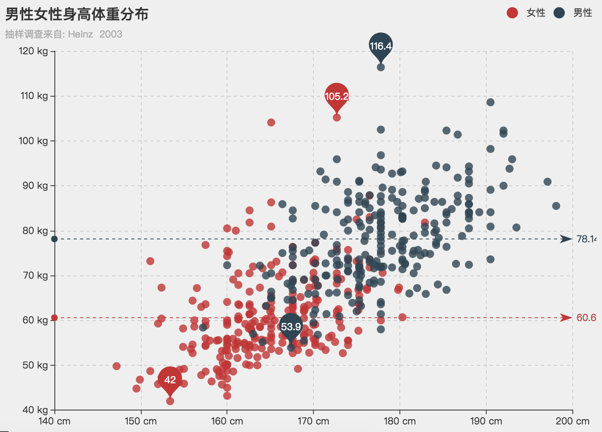

这时候，用户可以通过 [aria.label.description](option-parts/option.aria.md#label.description) 配置项指定图表的整体描述。

#### 定制模板描述

除了整体性修改描述之外，我们还提供了生成描述的模板，可以方便地进行细粒度的修改。

生成描述的基本流程为，如果 [aria.label.show](option-parts/option.aria.md#label.show) 设置为 `true`，则生成无障碍访问描述，否则不生成。如果定义了 [aria.label.description](option-parts/option.aria.md#label.description)，则将其作为图表的完整描述，否则根据模板拼接生成描述。我们提供了默认的生成描述的算法，仅当生成的描述不太合适时，才需要修改这些模板，甚至使用 `aria.description` 完全覆盖。

使用模板拼接时，先根据是否存在标题 [title.text](tutorial.md#title.text) 决定使用 [aria.label.general.withTitle](option-parts/option.aria.md#label.general.withTitle) 还是 [aria.label.general.withoutTitle](option-parts/option.aria.md#label.general.withoutTitle) 作为整体性描述。其中，`aria.general.withTitle` 配置项包括模板变量 `'{title}'`，将会被替换成图表标题。也就是说，如果 `aria.general.withTitle` 被设置为 `'图表的标题是：{title}。'`，则如果包含标题 `'价格分布图'`，这部分的描述为 `'图表的标题是：价格分布图。'`。

拼接完标题之后，会依次拼接系列的描述（[aria.label.series](option-parts/option.aria.md#label.series)），和每个系列的数据的描述（[aria.label.data](option-parts/option.aria.md#label.data)）。同样，每个模板都有可能包括模板变量，用以替换实际的值。

## 贴花图案

上文介绍了使用默认的贴花图案的方式。如果需要自定义贴花图案，可以使用 [aria.decal.decals](option-parts/option.aria.md#decal.decals) 配置出灵活多变的图案。

更具体的信息请参见 [ARIA 文档](option-parts/option.aria.md)。

## 使用 ECharts GL 实现基础的三维可视化

ECharts GL （后面统一简称 GL）为 Apache EChartsTM 补充了丰富的三维可视化组件，这篇文章我们会简单介绍如何基于 GL 实现一些常见的三维可视化作品。实际上如果你对 ECharts 有一定了解的话，也可以很快的上手 GL，GL 的配置项完全是按照 ECharts 的标准和上手难度来设计的。

在看完文章之后，你可以前往 [官方示例](https://echarts.apache.org/examples/zh/index.html#chart-type-globe) 和 [Gallery](https://gallery.echartsjs.com/explore.html#tags=echarts-gl) 去了解更多使用 GL 制作的示例，对于文章中我们没法解释到的代码，也可以前往 [GL 配置项手册](option-gl.html) 查看具体的配置项使用方法。

## 如何下载和引入 ECharts GL

为了不再增加已经很大了的 ECharts 完整版的体积，我们将 GL 作为扩展包的形式提供，和诸如水球图这样的扩展类似，如果要使用 GL 里的各种组件，只需要在引入`echarts.min.js`的基础上再引入一个`echarts-gl.min.js`。你可以从 [官网](https://echarts.apache.org/zh/download.html) 下载最新版的 GL，然后在页面中通过标签引入：

```
<script src="lib/echarts.min.js"></script>
<script src="lib/echarts-gl.min.js"></script>
```

如果你的项目使用 webpack 或者 rollup 来打包代码的话，也可以通过 npm 安装后引入

```
npm install echarts
npm install echarts-gl
```

```
// 通过 ES6 的 import 语法引入 ECharts 和 ECharts GL
import echarts from 'echarts';
import 'echarts-gl';
```

## 声明一个基础的三维笛卡尔坐标系

引入 ECharts 和 ECharts GL 后，我们先来声明一个基础的三维笛卡尔坐标系用于绘制三维的散点图，柱状图，曲面图等常见的统计图。

在 ECharts 中我们有 [grid](option-parts/option.grid.md) 组件用于提供一个矩形的区域放置一个二维的笛卡尔坐标系，以及笛卡尔坐标系上上的 x 轴（[xAxis](option-parts/option.xAxis.md)）和 y 轴（[yAxis](option-parts/option.yAxis.md)）。对于三维的笛卡尔坐标系，我们在 GL 中提供了 [grid3D](option-gl-parts/option-gl.grid3D.md) 组件用于划分一块三维的笛卡尔空间，以及放置在这个 [grid3D](option-gl-parts/option-gl.grid3D.md) 上的 [xAxis3D](option-gl-parts/option-gl.xAxis3D.md), [yAxis3D](option-gl-parts/option-gl.yAxis3D.md), [zAxis3D](option-gl-parts/option-gl.zAxis3D.md)。

> 小提示：在 GL 中我们对除了 globe 之外所有的三维组件和系列都加了 3D 的后缀用以区分，例如三维的散点图就是 scatter3D，三维的地图就是 map3D 等等。

下面这段代码就声明了一个最简单的三维笛卡尔坐标系

```
var option = {
    // 需要注意的是我们不能跟 grid 一样省略 grid3D
    grid3D: {},
    // 默认情况下, x, y, z 分别是从 0 到 1 的数值轴
    xAxis3D: {},
    yAxis3D: {},
    zAxis3D: {}
}
```

效果如下：

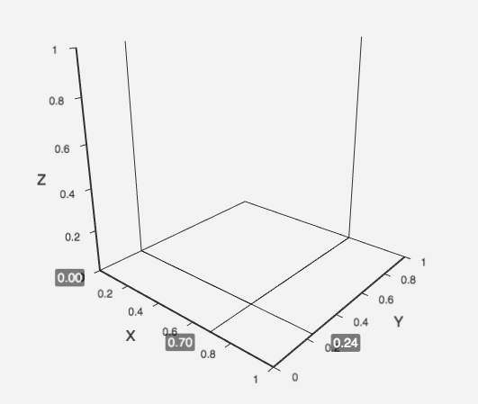

跟二维的笛卡尔坐标系一样，每个轴都会有多种类型，默认是数值轴，如果需要是类目轴的话，简单的设置为 `type: 'category'`就行了。

## 绘制三维的散点图

声明好笛卡尔坐标系后，我们先试试用一份程序生成的正态分布数据在这个三维的笛卡尔坐标系中画散点图。

下面这段是生成正态分布数据的代码，你可以先不用关心这段代码是怎么工作的，只需要知道它生成了一份三维的正态分布数据放在`data`数组中。

```
function makeGaussian(amplitude, x0, y0, sigmaX, sigmaY) {
    return function (amplitude, x0, y0, sigmaX, sigmaY, x, y) {
        var exponent = -(
                ( Math.pow(x - x0, 2) / (2 * Math.pow(sigmaX, 2)))
                + ( Math.pow(y - y0, 2) / (2 * Math.pow(sigmaY, 2)))
            );
        return amplitude * Math.pow(Math.E, exponent);
    }.bind(null, amplitude, x0, y0, sigmaX, sigmaY);
}
// 创建一个高斯分布函数
var gaussian = makeGaussian(50, 0, 0, 20, 20);

var data = [];
for (var i = 0; i < 1000; i++) {
    // x, y 随机分布
    var x = Math.random() * 100 - 50;
    var y = Math.random() * 100 - 50;
    var z = gaussian(x, y);
    data.push([x, y, z]);
}
```

生成的正态分布的数据大概长这样：

```
[
  [46.74395071259907, -33.88391024738553, 0.7754030099768191],
  [-18.45302873809771, 16.88114775416834, 22.87772504105404],
  [2.9908128281121336, -0.027699444453467947, 49.44400635911886],
  ...
]
```

每一项都包含了`x`, `y`, `z`三个值，这三个值会分别被映射到笛卡尔坐标系的 x 轴，y 轴和 z 轴上。

然后我们可以使用 GL 提供的 [scatter3D](option-gl-parts/option-gl.series-scatter3D.md) 系列类型把这些数据画成三维空间中正态分布的点。

```
option = {
    grid3D: {},
    xAxis3D: {},
    yAxis3D: {},
    zAxis3D: { max: 100 },
    series: [{
        type: 'scatter3D',
        data: data
    }]
}
```

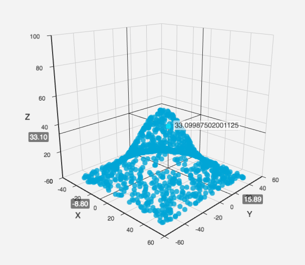

## 使用真实数据的三维散点图

接下来我们来看一个使用真实多维数据的三维散点图例子。

可以先从 [https://echarts.apache.org/examples/data/asset/data/life-expectancy-table.json](https://echarts.apache.org/examples/data/asset/data/life-expectancy-table.json) 获取这份数据。

格式化一下可以看到这份数据是很传统转成 JSON 后的表格格式。第一行是每一列数据的属性名，可以从这个属性名看出来每一列数据的含义，分别是人均收入，人均寿命，人口数量，国家和年份。

```
[
    ["Income", "Life Expectancy", "Population", "Country", "Year"],
    [815, 34.05, 351014, "Australia", 1800],
    [1314, 39, 645526, "Canada", 1800],
    [985, 32, 321675013, "China", 1800],
    [864, 32.2, 345043, "Cuba", 1800],
    [1244, 36.5731262, 977662, "Finland", 1800],
    ...
]
```

在 ECharts 4 中我们可以使用 dataset 组件非常方便地引入这份数据。如果对 dataset 还不熟悉的话可以看[dataset使用教程](https://echarts.apache.org/handbook/zh/concepts/dataset)

```
$.get('data/asset/data/life-expectancy-table.json', function (data) {
    myChart.setOption({
        grid3D: {},
        xAxis3D: {},
        yAxis3D: {},
        zAxis3D: {},
        dataset: {
            source: data
        },
        series: [
            {
                type: 'scatter3D',
                symbolSize: 2.5
            }
        ]
    })
});
```

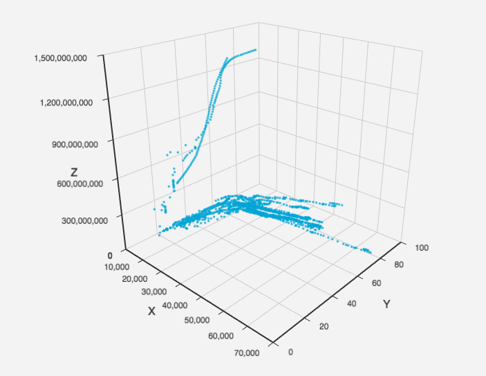

默认会把前三列，也就是收入（Income），人均寿命（Life Expectancy），人口（Population）分别放到 x、 y、 z 轴上。

使用 encode 属性我们还可以将指定列的数据映射到指定的坐标轴上，从而省去很多繁琐的数据转换代码。例如我们将 x 轴换成是国家（Country），y 轴换成年份（Year），z 轴换成收入（Income），可以看到不同国家不同年份的人均收入分布。

```
myChart.setOption({
    grid3D: {},
    xAxis3D: {
        // 因为 x 轴和 y 轴都是类目数据，所以需要设置 type: 'category' 保证正确显示数据。
        type: 'category'
    },
    yAxis3D: {
        type: 'category'
    },
    zAxis3D: {},
    dataset: {
        source: data
    },
    series: [
        {
            type: 'scatter3D',
            symbolSize: 2.5,
            encode: {
                // 维度的名字默认就是表头的属性名
                x: 'Country',
                y: 'Year',
                z: 'Income',
                tooltip: [0, 1, 2, 3, 4]
            }
        }
    ]
});
```

## 利用 visualMap 组件对三维散点图进行视觉编码

刚才多维数据的例子中，我们还有几个维度（列）没能表达出来，利用 ECharts 内置的 [visualMap](option.md#visualMap) 组件我们可以继续将第四个维度编码成颜色。

```
myChart.setOption({
    grid3D: {
        viewControl: {
            // 使用正交投影。
            projection: 'orthographic'
        }
    },
    xAxis3D: {
        // 因为 x 轴和 y 轴都是类目数据，所以需要设置 type: 'category' 保证正确显示数据。
        type: 'category'
    },
    yAxis3D: {
        type: 'log'
    },
    zAxis3D: {},
    visualMap: {
        calculable: true,
        max: 100,
        // 维度的名字默认就是表头的属性名
        dimension: 'Life Expectancy',
        inRange: {
            color: ['#313695', '#4575b4', '#74add1', '#abd9e9', '#e0f3f8', '#ffffbf', '#fee090', '#fdae61', '#f46d43', '#d73027', '#a50026']
        }
    },
    dataset: {
        source: data
    },
    series: [
        {
            type: 'scatter3D',
            symbolSize: 5,
            encode: {
                // 维度的名字默认就是表头的属性名
                x: 'Country',
                y: 'Population',
                z: 'Income',
                tooltip: [0, 1, 2, 3, 4]
            }
        }
    ]
})
```

这段代码中我们又在刚才的例子基础上加入了 [visualMap](option.md#visualMap) 组件，将`Life Expectancy`这一列数据映射到了不同的颜色。

除此之外我们还把原来默认的透视投影改成了正交投影。正交投影在某些场景中可以避免因为近大远小所造成的表达错误。

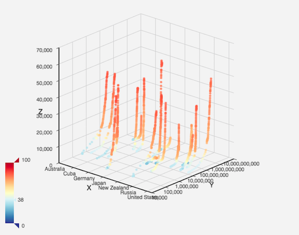

当然，除了 [visualMap](option.md#visualMap) 组件，还可以利用其它的 ECharts 内置组件并且充分利用这些组件的交互效果，比如 [legend](option-parts/option.legend.md)。也可以像 [三维散点图和散点矩阵结合使用](https://echarts.apache.org/examples/zh/editor.html?c=scatter3d-scatter&gl=1) 这个例子一样实现二维和三维的系列混搭。

在实现 GL 的时候我们尽可能地把 WebGL 和 Canvas 之间的差异屏蔽了到最小，从而让 GL 的使用可以更加方便自然。

## 在笛卡尔坐标系上显示其它类型的三维图表

除了散点图，我们也可以通过 GL 在三维的笛卡尔坐标系上绘制其它类型的三维图表。比如刚才例子中将 `scatter3D` 类型改成 `bar3D` 就可以变成一个三维的柱状图。

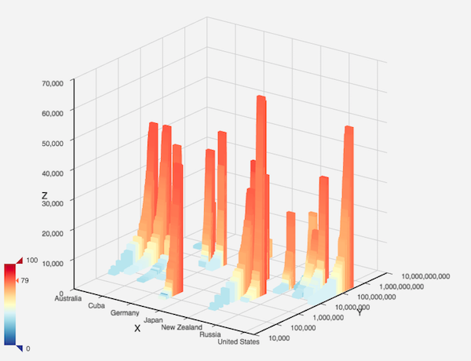

还有机器学习中会用到的三维曲面图 [surface](option-gl-parts/option-gl.series-surface.md)，三维曲面图常用来表达平面上的数据走势，刚才的正态分布数据我们也可以像下面这样画成曲面图。

```
var data = [];
// 曲面图要求给入的数据是网格形式按顺序分布。
for (var y = -50; y <= 50; y++) {
    for (var x = -50; x <= 50; x++) {
        var z = gaussian(x, y);
        data.push([x, y, z]);
    }
}
option = {
    grid3D: {},
    xAxis3D: {},
    yAxis3D: {},
    zAxis3D: { max: 60 },
    series: [{
        type: 'surface',
        data: data
    }]
}
```

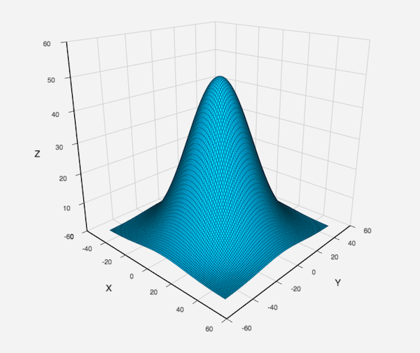

## 老板想要立体的柱状图效果

最后，我们经常会被问到如何用 ECharts 画只有二维数据的立体柱状图效果。一般来说我们是不推荐这么做的，因为这种不必要的立体柱状图很容易造成错误的表达，具体可以见我们 [柱状图使用指南](https://vis.baidu.com/chartusage/bar/) 中的解释。

但是如果有一些其他因素导致必须得画成立体的柱状图的话，用 GL 也可以实现。[丶灬豆奶](https://gallery.echartsjs.com/explore.html?u=bd-3056387051) 和 [阿洛儿啊](https://gallery.echartsjs.com/explore.html?u=bd-809368804) 在 Gallery 已经写了类似的例子，大家可以参考。

[3D堆积柱状图](https://gallery.echartsjs.com/explore.html?u=bd-3056387051)

[3D柱状图](https://gallery.echartsjs.com/editor.html?c=xryQDPYK0b)

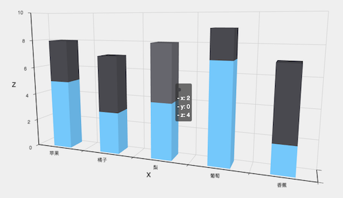

## 在微信小程序中使用 ECharts

我们接到了很多微信小程序开发者的反馈，表示他们强烈需要像 Apache EChartsTM 这样的可视化工具。但是微信小程序是不支持 DOM 操作的，Canvas 接口也和浏览器不尽相同。

因此，我们和微信小程序官方团队合作，提供了 ECharts 的微信小程序版本。开发者可以通过熟悉的 ECharts 配置方式，快速开发图表，满足各种可视化需求。

## 体验示例小程序

在微信中扫描下面的二维码即可体验 ECharts Demo：


## 下载

为了兼容小程序 Canvas，我们提供了一个小程序的组件，用这种方式可以方便地使用 ECharts。

首先，下载 GitHub 上的 [ecomfe/echarts-for-weixin](https://github.com/ecomfe/echarts-for-weixin) 项目。

其中，`ec-canvas` 是我们提供的组件，其他文件是如何使用该组件的示例。

`ec-canvas` 目录下有一个 `echarts.js`，默认我们会在每次 `echarts-for-weixin` 项目发版的时候替换成最新版的 ECharts。如有必要，可以自行从 ECharts 项目中下载[最新发布版](https://github.com/apache/echarts/releases)，或者从[官网自定义构建](https://echarts.apache.org/builder.html)以减小文件大小。

## 引入组件

微信小程序的项目创建可以参见[微信公众平台官方文档](https://developers.weixin.qq.com/miniprogram/dev/framework/quickstart/)。

在创建项目之后，可以将下载的 [ecomfe/echarts-for-weixin](https://github.com/ecomfe/echarts-for-weixin) 项目完全替换新建的项目，然后将修改代码；或者仅拷贝 `ec-canvas` 目录到新建的项目下，然后做相应的调整。

如果采用完全替换的方式，需要将 `project.config.json` 中的 `appid` 替换成在公众平台申请的项目 id。`pages` 目录下的每个文件夹是一个页面，可以根据情况删除不需要的页面，并且在 `app.json` 中删除对应页面。

如果仅拷贝 `ec-canvas` 目录，则可以参考 `pages/bar` 目录下的几个文件的写法。下面，我们具体地说明。

## 创建图表

首先，在 `pages/bar` 目录下新建以下几个文件：`index.js`、 `index.json`、 `index.wxml`、 `index.wxss`。并且在 `app.json` 的 `pages` 中增加 `'pages/bar/index'`。

`index.json` 配置如下：

```
{
  "usingComponents": {
    "ec-canvas": "../../ec-canvas/ec-canvas"
  }
}
```

这一配置的作用是，允许我们在 `pages/bar/index.wxml` 中使用 `<ec-canvas>` 组件。注意路径的相对位置要写对，如果目录结构和本例相同，就应该像上面这样配置。

`index.wxml` 中，我们创建了一个 `<ec-canvas>` 组件，内容如下：

```
<view class="container">
  <ec-canvas id="mychart-dom-bar" canvas-id="mychart-bar" ec="{{ ec }}"></ec-canvas>
</view>
```

其中 `ec` 是一个我们在 `index.js` 中定义的对象，它使得图表能够在页面加载后被初始化并设置。`index.js` 的结构如下：

```
function initChart(canvas, width, height) {
  const chart = echarts.init(canvas, null, {
    width: width,
    height: height
  });
  canvas.setChart(chart);

  var option = {
    ...
  };
  chart.setOption(option);
  return chart;
}

Page({
  data: {
    ec: {
      onInit: initChart
    }
  }
});
```

这对于所有 ECharts 图表都是通用的，用户只需要修改上面 `option` 的内容，即可改变图表。`option` 的使用方法参见 [ECharts 配置项文档](option.html)。对于不熟悉 ECharts 的用户，可以参见 [5 分钟上手 ECharts](tutorial.md#5%20%E5%88%86%E9%92%9F%E4%B8%8A%E6%89%8B%20ECharts) 教程。

完整的例子请参见 [ecomfe/echarts-for-weixin](https://github.com/ecomfe/echarts-for-weixin) 项目。

## 暂不支持的功能

ECharts 中的绝大部分功能都支持小程序版本，因此这里仅说明不支持的功能，以及存在的问题。

以下功能尚不支持，如果有相关需求请在 [issue](https://github.com/ecomfe/echarts-for-weixin/issues) 中向我们反馈，对于反馈人数多的需求将优先支持：

*   Tooltip
*   图片
*   多个 zlevel 分层

此外，目前还有一些 bug 尚未修复，部分需要小程序团队配合上线支持，但不影响基本的使用。已知的 bug 包括：

*   安卓平台：transform 的问题（会影响关系图边两端的标记位置、旭日图文字位置等）
*   iOS 平台：半透明略有变深的问题
*   iOS 平台：渐变色出现在定义区域之外的地方

如有其它问题，也欢迎在 [issue](https://github.com/ecomfe/echarts-for-weixin/issues) 中向我们反馈，谢谢！
